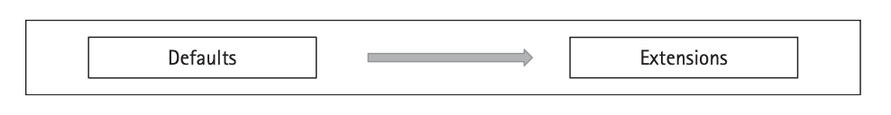
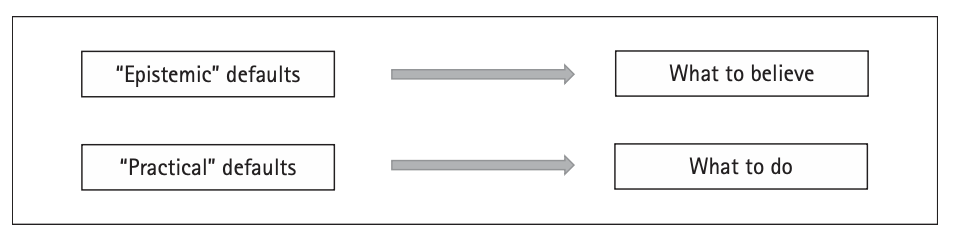
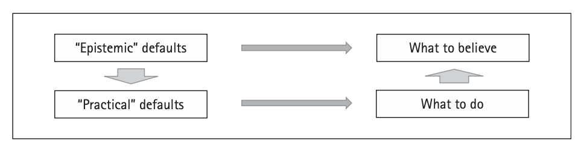
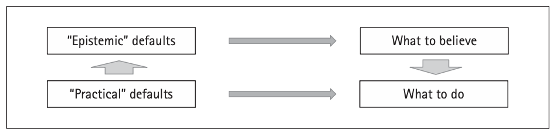

# 2. The Unity of Reasons

*Mark Schroeder* [^000]

### **Abstract and Keywords**

This chapter is concerned with the question of what unifies reasons for action and reasons for belief, sometimes called practical and epistemic reasons. According to some views, reasons for belief are a special case of reasons to do something, and so epistemic reasons are a special case, very broadly speaking, of practical reasons. According to other views, reasons for action are a special case of reasons to draw some conclusion, and so practical reasons are a special case of epistemic reasons. This chapter considers some of the evidence that bears on whether either of these claims is correct, or whether instead practical and epistemic reasons have something else in common.

Keywords: reasons, epistemic, practical, John Horty, default logic

Over the last three quarters of a century, reasons have come to occupy a prominent and central place in the normative study of action, belief, intention, and the emotions. According to some, reasons are the key element that is distinctive of normativity itself.[^1] In this chapter I will be concerned with the question of what unifies reasons for action and reasons for belief, sometimes called *practical* and *epistemic* reasons. If it is true that reasons are the key element that is distinctive of normativity itself, then my question is the question of what unifies normativity itself. But even if this grandiose claim on behalf of the centrality of reasons is false, and reasons are just one normative relation among others, my question is still interesting in its own right. And as we will see in what follows, it is closely related to many other interesting and important questions.

## **2.1 General Preliminaries**

When I ask what is unified about reasons for action and reasons for belief, here is what I have in mind. The question that I will be interested in can be put intuitively, but not quite accurately, as the question of whether reasons for belief are just a special case of reasons for action, reasons for action are just a special case of reasons for belief, or neither. This way of putting my question makes intuitive sense, because it frames my question as one of priority, and questions of priority are familiar to philosophers. But **(p. 47)** it is not quite accurate, because the two things whose priority I am interested in are not exactly belief and action.

The first priority view in which I will be interested is motivated by the thought that a reason to listen more carefully and a reason to believe that Beatrice will show up tomorrow are both reasons to *do* things, in some very broad sense of "do." On this broad sense of "do," anything that can be expressed by a verb phrase is something that you can do. After all, "listen more carefully" and "believe that Beatrice will show up tomorrow" are both verb phrases, and verb phrases correspond, intuitively, to things that you do, in some very loose sense. So it is natural to think that what unifies reasons for action and reasons for belief is that they are both reasons to do things. On this view, what makes reasons for action and reasons for belief different is precisely that actions and beliefs are different sorts of things that you can do. I will describe this view, somewhat inaccurately, as the view that reasons for belief reduce to reasons for action, or the *practical priority thesis*, for short. This isn't exactly accurate, of course, because the view does not hold that beliefs are actions; but the view does hold that all reasons are reasons to *do* things, in some broad sense, and that that is the source of what they have in common. But it is a *close* gloss, because whereas philosophers always think about reasons for action as reasons to do things, this is something that we often forget or ignore when thinking about reasons for belief.

Reasons for belief are in general reasons to believe *something—*some proposition. So, for example, while a reason to believe that Beatrice will show up tomorrow is, along one dimension, a consideration that supports a state of mind, *believing that Beatrice will show up tomorrow*, it is also, along another dimension, a consideration that supports a certain *content—that Beatrice will show up tomorrow*. So when we think about reasons for belief, it is natural to think of them as supporting, not something that we *do*, but rather a *proposition—*the thing *believed*. The second priority view in which I will be interested is the thesis that reasons for *action* are all really a special case of reasons in support of propositions (as the objects of belief). On the version of this view that will occupy me in what follows, a reason to listen more carefully is a reason in support of the proposition that *you ought to listen more carefully*. Or, put more intuitively but less precisely, it is a reason to believe that you ought to listen more carefully. Since this view treats reasons to act in various ways as reasons to believe that you ought to act in those ways, it is naturally (though not quite accurately) described as the view that reasons for action reduce to reasons for belief—or the *epistemic priority thesis*, for short.

So in what follows, I will be interested in whether what reasons for action and reasons for belief have in common is that both are cases of reasons to *do* things*—*to act versus to believe*—*or whether both are reasons in support of *conclusions—*propositions that can be believed, of which one interesting special case comprises propositions about what one ought to do. As we will see in what follows, part of the interest in asking our question in this way is that there are some striking apparent parallels between how reasons for action compete with one another*—*parallels that challenge *both* priority theses, in very similar ways.

## **(p. 48) 2.2 Further Qualifications: Belief First**

According to some people, there are reasons for belief that do not, intuitively, support the content that is to be believed in the way that other reasons for belief support the content that is to be believed. For example, Pascal famously argued that we should each believe in God on decision-theoretic grounds.[^2] If Pascal's argument gives us any reason to believe in God, it is not a reason that does so by intuitively supporting the conclusion that God exists. So, clearly, the view that I have described according to which reasons for action reduce to reasons for belief must be understood as excluding reasons like Pascal's. It is not enough to have a reason to listen more carefully for there to be a decision-theoretic argument that it is advisable for you to believe that you ought to listen more carefully. There must actually be a reason that supports (in whatever way reasons support conclusions) the conclusion that you ought to listen more carefully.[^3]

The view that I am interested in, on which reasons for action reduce to reasons for belief, is very similar, if not quite identical, to the view that reasons for action are just evidence that one ought to act.[^4] These views are similar, because once we exclude Pascalian considerations and other putative reasons for belief that do not support the proposition that is to be believed, it is natural to think that what is left is *evidence*. On this natural view, the way in which reasons support propositions is precisely by being evidence for them; and so in reducing all reasons to the way in which reasons for belief support propositions, we are really reducing them to evidence. Consequently, many of the advantages of or obstacles for the thesis of *reasons as evidence* will be advantages of or obstacles to the thesis that reasons for action and reasons for belief are unified through reasons for belief. Because others have written about both these advantages and these costs, I will not rehearse most of them here.[^5]

However, I will mention a few considerations that I think are important. Reasons to act in some way*—*say, to listen more carefully*—*need to compete against contrary reasons. The very feature of reasons that has led them to occupy so much attention in normative disciplines over the last three quarters of a century is precisely that they compete in this way. Among the reasons with which your reason to listen more carefully will compete, of course, will be reasons for you to not listen more carefully. And so if your reasons to listen more carefully are all reasons to believe that you ought to listen more carefully, then your reasons to not listen more carefully will all be reasons to **(p. 49)** believe that you ought to not listen more carefully. But now note that when comparing reasons, we normally presume that if your reasons to do something outweigh the reasons not to do it, then that is what you ought to do. So now it seems to follow that if your reasons to believe that you ought to listen more carefully outweigh your reasons to believe that you ought to not listen more carefully, then it is true that you ought to listen more carefully.

But so far from being guaranteed to be true, I think that this is clearly false. It may not even be true that you ought to *believe* that you ought to listen more carefully; for though your reasons to believe this outweigh your reasons to believe *one* alternative proposition —namely that you ought to not listen more carefully—there are other possibilities, including that it is indifferent whether you listen more carefully or do not. And even when your reasons to believe are evenly matched with your reasons to believe contrary propositions, you still may not be rationally permitted to believe, because it may be best to remain agnostic. So the thesis that reasons for action reduce to reasons for belief raises troubling consequences if we assume that facts about the weight of reasons for action can be read off of facts about the weight of reasons to believe.

There is a second reason why I am inclined to be skeptical of the idea that reasons for action can be construed as reasons in support of the conclusion that one ought to act. It is that there are more options, when it comes to belief, than there are possible conclusions. For every conclusion, there is the option of believing it. But there is also the option of remaining agnostic. If we hold that all reasons support conclusions, then we leave this option out of those which are supported by reasons. This doesn't show that the answer to what we ought to believe cannot be read off of the reasons in support of all of the other options*—*the ones that are a matter of believing some conclusion. But it makes me deeply suspicious.[^6]

Finally, due to familiar considerations about the *de se*, even if it is true that reasons to act are always reasons to believe that you ought to act in that way, it is still not likely that reasons to believe that you ought to act in some way are all reasons to act in that way. When John Perry sees the shopper trailing sugar around the grocery store, he acquires a reason to believe that he ought to stop his cart and close the leak.[^7] But it does not seem that he has yet acquired a reason to stop his cart and close the leak*—*his reasons need to support believing *de se* of himself that he ought to stop his cart and close the leak.

In what follows, I'll assume that these and other apparent obstacles for the thesis that reasons for action reduce to reasons for belief may be easily patched. This is because I'll be interested in a more general kind of problem for the kind of unity of reasons conferred by *either* of the priority theses that I've been considering.

## **(p. 50) 2.3 Case Study: Horty on Reasons as Defaults**

In his elegant and insightful book, *Reasons as Defaults*, Jeff Horty presents a sophisticated system for thinking about how reasons work together to determine what an agent ought to do or believe. Horty's system has a combination of features which make it particularly apt for use as a case study in investigating our question: it is precise, tractable, and is used by Horty to make predictions both about reasons for action and about reasons for belief. It is the most precise and well-worked-out view about how reasons combine to determine what we ought to do or to believe, and several of the structural features that it

encodes are independently plausible. We can therefore use Horty's framework in order to draw out the consequences of those independently plausible structural features for our priority question, and the same will apply for other frameworks that succeed at encoding the same structural features.

The way that Horty's system works is that it employs a particular system of default logic, which is used under a pair of interpretations to tell us about how reasons combine to determine what we ought to do or believe. The uninterpreted default logic is just a formal system that can be thought of as generating, for any given set of defaults and background information, one or more of what are called "extensions." So ignoring the role of the background information, the uninterpreted system looks like the following:

Horty goes on to offer two distinct interpretations of this system, each of which takes it to tell us something about reasons. On the first interpretation*—*the *epistemic* interpretation *—*we interpret the set of defaults as telling us something about what *contents* are supported by reasons, and we interpret the extensions as telling us something about what to believe. And on the second interpretation*—*the *practical* interpretation*—*we interpret the set of defaults as telling us something about what *actions*, or more generally what things we might *do*, are supported by reasons, and we interpret the extensions as telling us something about what we ought to do. So Horty's idea is that the very same "gray arrow" of default logic can adequately represent both how reasons supporting contents determine what to believe and how reasons to do things support what to do:

**(p. 51)** It is an immediate consequence of these dual intended interpretations of Horty's system that it makes for a highly natural way to test the question of which, if either, of our two priority theses is true. Since his system tells us, on the practical interpretation, how reasons to do things determine what we ought to do, and it also tells us, on the epistemic interpretation, how reasons for conclusions tell us what we may believe, either priority thesis is compatible with Horty's full picture only if adding it to the picture preserves conclusions about what an agent ought to do or to believe.

In other words, the "priority of reasons for action" thesis can be true only if we get the same conclusions as to what an agent ought to believe if we first characterize reasons for belief as reasons to do something and then work our default logic under its "action" interpretation, as if we work our default logic directly under its "epistemic" interpretation:

Likewise, the "priority of reasons for belief" thesis can be true only if we get the same conclusions as to what an agent ought to do if we first characterize reasons for action as reasons in favor of the conclusion that one ought so to act, and then work our default logic under its "epistemic" interpretation, as if we work our default logic directly under its "action" interpretation, so that the answer to what an agent ought to do is the same as the answer to what she may believe that she ought to do.

Horty himself briefly considers the question as to whether reasons for conclusions or reasons to do things are prior, and explicitly opts for neutrality:

The account set out here is intended to be independent of any of these theses, or others, concerning the relation between practical and epistemic reasons; it can be adapted, I believe, to accommodate a variety of positions on the topic. (2012: 18)

But whether Horty's account is genuinely neutral on this question will depend on whether each of the competing positions can be successfully formulated within his system, rather than on his explicit aims. And the only way to evaluate this is to check for ourselves. Fortunately, doing so will be highly instructive about some general problems for either of the kinds of unity that our priority theses offer.

**(p. 52)** In order to evaluate this question, we need to understand at least a little bit about how Horty's system works. Its main idea, as I noted, is to use a kind of prioritized default logic in order to represent reasons and determine what an agent ought to do, or what conclusions she may draw from her existing information. The original idea of default logic was to capture defeasible inference by adding to deductive logic a set of "default" inferences*—*inference rules that can be followed by default, but which may be defeasible in different ways. The structure of a default logic works by telling us which of these default rules of inference are to be followed in a given situation, and hence what an agent may defeasibly conclude, given her hard information. The set of propositions which the agent may conclude was originally referred to as an *extension*, because it defeasibly extends the hard information with which she begins. This traditional interpretation of default logic is the epistemic interpretation, because it characterizes the *contents* of the beliefs the agent is permitted, or ought, to form on the basis of default rules which characterize those contents.

What Horty observed is that we can use the same kind of formal system to represent, not which conclusions an agent ought to believe, but which actions she ought to perform. As before, we work with a set of hard background information and a set of default rules; but instead of thinking of the rules as telling us which propositions the agent may conclude, by default, on the basis of her existing information, we think of them as telling us what things the agent ought, by default, to do on the basis of her existing information.[^8] And then we interpret the *extensions* that are determined by the logic as telling us which things the agent ought to do. This is the practical or action interpretation of the same system.

It is a key feature of Horty's treatment—and a symptom of an important and system-independent general fact that will be of great importance for us later—that the very same system of default logic yields plausible conclusions about what an agent ought to believe under the epistemic interpretation, and also yields plausible conclusions about what an agent ought to do under the practical interpretation. I'll illustrate this in a moment, and later we will return to see how this reflects independent parallels between how epistemic and practical reasons compete. But first we need to get just a glimpse of how the mechanics of Horty's default logic work, because that is necessary in order to see why it yields the conclusions that it does.

## **2.4 Horty's Default Logic**

The most important concept in the framework is that of a *scenario*. Formally, scenarios are just sets of default rules, but intuitively, we are to think of them as candidates for **(p. 53)** the rules which are currently active in deliberation. Given a fixed body of background information and a strict partial ordering among a background set of default rules (which intuitively tell us which reasons are weightier), only some possible scenarios fit intuitive criteria to be *appropriately* active in deliberation—and these Horty calls "proper." Proper scenarios do not include default rules whose conclusions conflict with the background information (this prevents the system from telling you to believe something you know to be false, or to do something you know that you will not do) or with the conclusions of defaults with a higher priority (this restricts us to paying attention to the weightiest reasons), and they do not include default rules that do not apply (are not *triggered*, as Horty says) given the existing information. *Reasons* are then defined relative to a scenario, as the premises of defaults that are triggered in that scenario. Given this definition, what the restrictions on "proper" scenarios are really telling us, intuitively, is that the "proper" scenarios are the sets of defaults that are candidates to represent all of the reasons in some situation that are not outweighed. The basic formal structure of the system is then completed, by using proper scenarios to define the all-important notion of an *extension*. An *extension* is just the logical closure of the conclusions of a proper scenario, together with the background information.

We can illustrate the framework with a simple, abstract example, which will come in handy later. Suppose that we have the default rules $\delta_{1} = A \rightarrow C$, $\delta_{2} = B \rightarrow \sim C$, and $\delta_{3} = C \rightarrow D$, of which $\delta_{1}$ has the highest priority, and that our background information includes both $A$ and $B$. Any subset of $\{\delta_{1}, \delta_{2}, \delta_{3}\}$ will be a scenario — a candidate for the active rules in deliberation — but only one of these is *proper*, $\{\delta_{1}, \delta_{3}\}$. $\delta_{1}$ must be included in a proper scenario, because it is triggered by our background information and its conclusion doesn’t conflict either with our background information or with the conclusion of any default of a higher priority. But by including $\delta_{1}$, we add $C$ to our information, and that triggers $\delta_{3}$. So $\delta_{3}$ must be included as well. But $\delta_{2}$ can’t be included, because it is defeated by the higher-priority $\delta_{1}$. Our background information is $\{A, B\}$ and $C$ and $D$ are the conclusions of $\{\delta_{1}, \delta_{3}\}$. So the only extension that we get is the logical closure of $\{A, B, C, D\}$.

On the original, epistemic interpretation of default logic, extensions were so named because they were thought of as possible consistent ways of extending the background information by default reasoning. On this interpretation, we could think of $A$ as the proposition that Alice said that $C$, $B$ as the proposition that Bob said that $\sim C$, and $C$ as the proposition that Caroline said that $D$, where the priority of $\delta_{1}$ over the other defaults represents the fact that Alice is a more reliable source of testimony than the others. In that case, the framework tells us that it is reasonable, if we know both $A$ and $B$, to conclude both that Caroline said that $D$ and that $D$ is true. This makes sense.

We can also give this very same example a practical interpretation. This time, let A be the proposition that Alice told you to pick up Caroline after school, B the proposition that Bob told you not to, C the proposition that you pick up Caroline after school, and D the proposition that you drive to the school. Now the default rules are interpreted as **(p. 54)** telling us that Alice's and Bob's instructions both provide you with reasons to act, though Alice's instructions have higher priority, and if you're picking up Caroline, that's a reason to drive. Under this interpretation, the system tells us that what you ought to do is to both pick up Caroline and drive. Again, this makes sense.[^9]

## **2.5 Conflicts and Chaining**

As we've seen, Horty's way of thinking about how reasons support conclusions works by interpreting the very same underlying logical system in two different ways—really, at two different *levels*. When we want to think about what you ought to *do*, we interpret the defaults as having conclusions that are propositions about what you do, and we interpret the resulting extensions as including propositions that *are* what you ought to do. In our example, we have a default whose conclusion is the proposition that you pick up Caroline after school; and that conclusion gets into our extension, so we conclude that you ought to pick up Caroline after school. In contrast, when we want to think about what you ought to *believe*, we don't interpret defaults as having conclusions that are propositions about what you believe. Instead, we think of defaults as having conclusions that are possible *contents* you might believe. And we interpret the resulting extensions not as telling us what you believe, but as giving us the *contents* that you may believe.

We've also seen that despite the fact that these interpretations work on different levels, each yields intuitively plausible results. This is because there are striking parallels between how reasons for action and reasons for belief behave, but these parallels occur at different levels. Let's take these parallels one at a time, just focusing on those that are exhibited by our example. The first parallel concerns when reasons come into *conflict*. With respect to reasons for action, reasons engender a conflict, either directly or indirectly, when they support incompatible things you might *do*. For example, Alice's request and Bob's request come into conflict, because Alice asks you to pick up Caroline, and Bob asks you not to. Since you can't both pick up Caroline and not do so, that puts these reasons into competition with one another, so that only the better one wins out. Similarly, if Ryan has a reason to visit his father in the hospital, because he is sick, and a reason not to buy a plane ticket, because it is expensive, these reasons can come into conflict if the only way to visit his father is to buy a plane ticket.[^10] When the only way to visit his father is to buy a plane ticket, visiting his father and not buying a plane ticket are incompatible. That is why these reasons come into conflict, and so he should do only what is supported by the better reason.

**(p. 55)** Reasons for belief also generate conflicts in the face of incompatibility. But in this case, it is incompatibility of the *contents* of the beliefs that matters, not incompatibility in *having* the beliefs. If P and Q cannot both be true, or are guaranteed by your background knowledge to not both be true, then any reasons you have to believe P will compete with reasons you have to believe Q, and you should only believe what is better supported by reasons. But just because you *cannot* both believe P and believe Q, it does not obviously follow that these are not both things that you should believe. Similarly, if you can only believe P if you believe Q, it does not follow that reasons to believe P must compete against reasons against believing Q. So reasons for belief compete on the basis of incompatibility, just as reasons for action do; but it seems to be the incompatibility of their *contents* that matters, not the incompatibility of the beliefs themselves. This supports Horty's strategy of dealing with each in parallel.

This parallel in how reasons conflict is exhibited in the schematic example that I've used. On both the epistemic and practical interpretations, the defaults A→C and A→~C come into conflict, and so no stable scenario includes both—only whichever has higher priority. But our schematic example also illustrates a second plausible parallel between the belief and action cases. That is because in our example, when we have the default A→C in a stable scenario, we also get the default C→D in that scenario, provided that it is not conflicted or defeated. We may call this phenomenon *chaining*. What chaining tells us, very roughly speaking, in the epistemic case, is that when you are confronted with Alice's and Bob's testimony, you should conclude both that Caroline said that D *and that D*. Without chaining, we would only get the result that you should conclude that Caroline said that D. We might still be able to say that once you conclude *that*, you should be able to conclude that D; but chaining allows us to say that you may already draw that conclusion.[^11]

Similarly, chaining at the level of action tells us that when you are confronted with Alice's and Bob's instructions, what you should do is both pick up Caroline and drive. Without chaining, we only get the conclusion that you should pick up Caroline. We would still be able to say that once you pick up Caroline, you ought to drive, but chaining allows us to say that this is already what you should be doing. Again, we have an intuitive parallel phenomenon, which arises at the level of what you *do* in the case of action, but at the level of the *content* of your belief, in the case of belief, rather than at the level of what you are doing, in having that belief. Again, this both supports and explains the plausibility of Horty's two-level approach, and suggests that the features that motivate his approach must have parallels even in alternative views that differ substantially in detail. So plausibly, whatever conclusions we can draw from considering Horty's approach will have analogues for other theories.

## **(p. 56) 2.6 Testing Our Priority Theses**

The point of introducing Horty's system, recall, was as an illustrative case study in the defensibility of each of the priority theses that we have been considering, among which Horty explicitly desires to remain neutral. According to the epistemic priority thesis, what appear to be reasons to do things really need to be understood as reasons in support of the proposition that you ought to do those things. And so, for this thesis to be correct, there must be a way of translating practical default rules into epistemic default rules.

Since the epistemic priority thesis says that reasons to act are reasons in support of the proposition that you ought to act, the obvious way to interpret this translation is as holding that each practical default rule, $R \rightarrow A$, representing a possible reason for you to do $A$, should reduce to the corresponding epistemic default rule, $R \rightarrow \mathit{ought}(A)$, representing a possible reason to believe that one ought to do $A$. In Horty’s system, we can easily test to see whether this is an adequate reduction, by checking to see whether applying the epistemic interpretation to a default logic containing rules like $R \rightarrow \mathit{ought}(A)$ gives us the same conclusions about what an agent ought to do as applying the practical interpretation directly to a default logic containing the corresponding rules of the form $R \rightarrow A$.  

But it is now easy to see that, at least without the help of some further auxiliary assumptions, this is not so. Recall our earlier example, which we said should lead to the conclusion that $\mathit{ought}(C)$ and $\mathit{ought}(D)$, but not to the conclusion that $\mathit{ought}(\sim C)$. By the proposed reduction, our original example should reduce to the epistemic defaults $\delta_{1} = A \rightarrow \mathit{ought}(C)$, $\delta_{2} = B \rightarrow \mathit{ought}(\sim C)$, and $\delta_{3} = C \rightarrow \mathit{ought}(D)$, with $\delta_{1}$ ranked highest and with background information that includes both $A$ and $B$. (This, recall, is because according to the epistemic priority thesis, reasons to do things are “really” epistemic reasons in support of the contents that one ought to do those things.) But whereas our original set of defaults resulted in the extension that is the deductive closure of $\{A, B, C, D\}$, on the basis of the proper scenario consisting of defaults $\{\delta_{1}, \delta_{3}\}$, our new set of defaults yields $\{\delta_{1}, \delta_{2}\}$ as its only proper scenario, and so it does *not* lead to the conclusion that $\mathit{ought}(D)$, but *does* lead to the conclusion that $\mathit{ought}(\sim C)$ as well as $\mathit{ought}(C)$. So this result is problematic in two different ways.  

The first of these problems — the failure to conclude that $\mathit{ought}(D)$ — derives from the fact that the premise of default $\delta_{3}$ is no longer the same as the conclusion of $\delta_{1}$, and so we no longer get the *chaining* of defaults that triggers $\delta_{3}$, once $\delta_{1}$ is active. And the second problem — the derivation of $\mathit{ought}(\sim C)$ as well as $\mathit{ought}(C)$ — derives from the fact that since, at least on Horty’s own view (as argued in Horty 2012: ch. 4) that $\mathit{ought}(C)$ and $\mathit{ought}(\sim C)$ are consistent, defaults $\delta_{1}$ and $\delta_{2}$ are no longer in *conflict* with one another. Each of these corresponds, unsurprisingly, to one of the two parallels that we observed in the last section between reasons for action and reasons for belief that helped to motivate treating reasons for action and reasons for belief in parallel, in the first place.

**(p. 57)** A structurally analogous set of problems besets the priority of practical reasons, in this framework.[^12] On this view, recall, reasons that support conclusions are really just a special case of reasons to do something—namely, to believe those conclusions. And so, analogously to the epistemic priority thesis, this view requires that there must be some translation of epistemic defaults into practical defaults. Since the practical priority thesis holds that epistemic reasons are reasons to believe, it is therefore most natural, at least on a first pass, to interpret this view as holding that each epistemic default A→B should really reduce to the "practical" default, A→BF(B), where "BF(B)" is interpreted as meaning that the agent in question believes that B.[^13] But now it should be easy to see that we will get exactly the same kind of problems for this proposal as for the reverse view. Because it is possible (even if it is not rational or advisable) for an agent to have contradictory beliefs, BF(C) and BF(~C) are not inconsistent.[^14] And so, translating conflicting epistemic defaults into practical defaults whose conclusions are about beliefs will not preserve competition between defaults. And because BF(C) doesn't entail C, the translation also upsets the chaining of defaults. Again, these problems arise directly from the two phenomena—conflicts and chaining—that we observed helped in the first place to motivate the parallel treatments of reasons for belief and reasons for action.

What we've been observing is that each of the features that seemed to play a recognizable role in motivating Horty's parallel treatments of reasons for belief and reasons for action are vitiated, in the absence of any auxiliary assumptions, by the most natural translations of defaults that respect each of the epistemic and practical priority theses. Considerations like these therefore make it highly natural to conclude that, on the right way of thinking about the picture behind Horty's interpretation of default logic as telling us the logic of how reasons come together to support conclusions, *both* of our priority theses are false: neither reasons to do things nor reasons to believe things are a special case of the other. And if neither is a special case of the other, then the only thing that reasons for action and reasons for belief have in common must be the logic by which they determine conclusions—Horty's prioritized default logic. If that is right, then there is nothing more to say in answer to what unifies reasons than that it is the way in which they come together to determine conclusions. So if reasons are in fact what unify the normative and in virtue of which things count as normative, then it turns out, on this view, that normativity

itself is nothing other than a matter of being determined by the kind of weighing characterized by Horty's prioritized default logic. And that would be a remarkable conclusion, indeed.

## **(p. 58) 2.7 Reviving Epistemic Priority**

The tentative conclusion of the last section is quite striking. However, in this section and the next I'll moderate the force of my conclusion from the last section, by showing what kind of flexibility Horty's system actually offers for addressing the problems that I raised with auxiliary assumptions—some of which turn out to be very interesting indeed. So, rather than being conclusive problems for our priority theses, we'll see that what Horty is really committed to is a surprisingly close relationship between the priority theses and these very interesting auxiliary assumptions.

In the last section, I pointed out two different kinds of problem with implementing each of the priority theses within Horty's system. One had to do with *conflicts* between defaults, and one had to do with the *chaining* of defaults. When we interpreted a reason to do C as a reason to believe that you ought to do C, we did so by representing the practical default rule A→C as the epistemic default rule A→OUGHT(C). The practical default rules A→C and B→~C potentially conflict, because C is inconsistent with ~C. This conflict is what prevents us from including both of these default rules in a proper scenario. But when we replace these rules with the epistemic rules A→OUGHT(C) and B→OUGHT(~C), there is no longer any conflict between these rules unless we assume that OUGHT(C) and OUGHT(~C) are inconsistent—which Horty himself doubts.[^15] Fortunately, however, many philosophers believe that all-things-considered conflicts in what an agent ought to do are in fact impossible. And adding this assumption solves our problem by making OUGHT(C) and OUGHT(~C) inconsistent. So it turns out that we can solve this problem by adding to Horty's system an auxiliary assumption which, though he rejects it, is at least a sufficiently natural assumption that many philosophers find it compelling. And this is an interesting surprise! Who would have thought that the plausibility of the epistemic priority thesis might be built on the assumption that there are no deontic conflicts?

But in fact, we can do even better for the epistemic priority view with respect to this problem. For even if we are willing to countenance deontic conflicts, we might still believe that these are unusual, or only to be allowed in exceptional cases. In Horty's system, it is natural to represent this by including a default rule for each thing C that we might do, which allows us to conclude, by default, that it is not the case that one ought to do both C and ~C. This rule has the form, ⊤→~(OUGHT(C)&OUGHT(~C)) (where ⊤ just means a tautology). If we assume that there is always this background reason to presume that we are not facing a conflicting obligation, and if we assume that it has a very high priority, then that will ensure that there is no proper scenario that includes both of the defaults A→OUGHT(C) and B→OUGHT(~C) unless these both have a priority even higher. So we will avoid concluding that there are conflicting obligations unless the reasons involved are very forceful.

**(p. 59)** Indeed, not only does this avert the problem, it does so in a particularly plausible way. When philosophers have argued for the possibility of deontic conflicts, they have appealed to cases in which the reasons on each side are particularly compelling. No one argues that there are genuine deontic conflicts by arguing that you ought to get pancakes instead of eggs because you are craving them, but also ought to get eggs instead of pancakes because you are craving them, too. They argue, instead, by appeal to cases in which you must choose between your commitment to family and to your country, or between which of your children to save from the Nazis. But if there is a strong default presumption, in all cases, that you are not facing a deontic conflict, then this is exactly what we should predict: for the only genuine deontic conflicts will be ones where the reasons on each side are each weighty enough to counterbalance the default presumption that this is not a deontic dilemma. So the appeal to a strong epistemic default that one is not facing a deontic dilemma actually gives us a very appealing diagnosis of why deontic dilemmas, when they exist, arise only when there are particularly compelling reasons in play, and never when the reasons are slight.[^16]

The same techniques can be adapted to solve the "chaining" problem for the epistemic priority thesis. That problem, recall, was that if A is a reason to do C, and your doing C is, if true, a reason for you to do D, then the default logic effectively allows us to "chain" together the practical defaults A→C and C→D so that the latter makes it into scenarios that include the former, unless it is conflicted or defeated. But if we represent these practical default as the epistemic defaults A→OUGHT(C) and C→OUGHT(D), then we can no longer automatically "chain" these defaults together.[^17]

However, just as we could regenerate the conflict between reasons by assuming that it is always part of the background information that it is not the case that you ought to do each of conflicting things, we can regenerate this chaining by assuming that it is always part of the background information that if you ought to do C, then you will do it. On this assumption, Horty's system guarantees that the epistemic defaults "chain" just as the practical defaults would. Unfortunately, of course, in contrast to the conflicts case, where many philosophers do believe that there can be no conflicting obligations, it is not at all plausible that it is always a fixed background fact that an agent will do what she ought. On the contrary, we know that many agents do not do what they ought.

But again, a retreat to default information is more plausible. Perhaps there is a compelling but defeasible reason for any agent to believe that she will do what she ought—a highly prioritized default of the form, ⊤→(OUGHT(C)⊃C). If so, then we will get "chaining" of the defaults A→OUGHT(C) and C→OUGHT(D) whenever the agent does not know as part of her background information, or have even more compelling reason **(p. 60)** to believe, that ~(OUGHT(C)⊃C).[^18] If she does have more compelling reason to believe that the default assumption that she will do what she ought is false, of course, we will no longer get this chaining. But in this case, this actually seems like a very plausible conclusion. In normal cases it is plausible that if you ought to pick up Caroline, and picking up Caroline gives you a good reason to drive, then you ought to drive. But if you aren't going to pick up Caroline, despite the fact that you ought to, it's not so obvious that you still ought to drive, if your only reason to drive is in order to pick up Caroline.[^19]

So again, I think the auxiliary assumption that helps to dispel this problem is both interesting in its own right and yields an even more interesting treatment of when reasons should and should not "chain" in determining what you ought to do. Inconsistency and chaining are not the *only* interesting or attractive parallel properties of how reasons for belief and reasons for action combine in Horty's system; so what we've seen in this section only tells us part of what is necessary in order to revive epistemic priority, not what is sufficient. Nevertheless, when interesting and plausible claims turn up in surprising places, I think we should sit up and take notice.[^20]

## **2.8 Reviving Practical Priority**

So far, we've seen that if we add some plausible auxiliary assumptions to Horty's system, the epistemic priority view begins to look more plausible after all. And these assumptions are both interesting and at least plausible in their own right, and lead to a more nuanced and plausible treatment of the phenomena that motivate the importance of conflicting reasons and chaining in the first place. Analogous points apply to the practical priority view.

On the primary interpretation that we have given of the practical priority view, recall, we aim to reduce epistemic reasons to practical reasons by interpreting each epistemic default rule, A→C, as the corresponding "practical" default, A→BF(C). So reasons supporting a conclusion to be believed are understood as reasons to *do* something—in favor of the agent in question believing that proposition. As with the epistemic priority thesis, we get prima facie problems with conflicting reasons and with chaining. To take the conflict case first, though the defaults A→C and B→~C can come into conflict, because C and ~C are inconsistent, the corresponding defaults A→BF(C) and B→BF(~C) do not automatically come into conflict.

As before, there are two ways in which we can try to solve this problem by appeal to auxiliary assumptions. We could build this conflict in either as part of the background **(p. 61)** information in the case, or by way of a default. In this case, the background information option would require that it is always part of the fixed background information that the agent in question does not have contradictory beliefs. But this is not particularly plausible —we know that agents, including ourselves, sometimes have contradictory beliefs (if you think agents never have beliefs in directly contradictory propositions, the problem readily generalizes to larger sets of inconsistent beliefs, which are surely possible).

So it is more plausible to try to solve this problem by assuming that there is a general, highly prioritized reason characterized by the default Ψ→~(BF(C)&BF(~C)). Since we are operating under the practical interpretation of default logic, this amounts to assuming that every agent always has a compelling reason not to believe contradictions. Not only is this assumption itself plausible, it has been explicitly defended as a central thesis about

the rationality of belief. Theorists like John Broome, for example, have argued that—at least if rationality is normative—there are general, high-level reasons against having contradictory beliefs like this.[^21]

Of course, though a reason to not have contradictory beliefs has been defended by Broome, others, including Joseph Raz and Niko Kolodny, have argued that there are no such reasons, and whatever is wrong with believing a contradiction can be explained by the fact that there are compelling reasons against at least one of the two conflicting beliefs.[^22] But the practical priority thesis can be revived on this view as well, so long as we assume that all defaults of the form, BF(C)→~BF(~C), are always present and highly prioritized. This is essentially the view that I have defended elsewhere.[^23]

The "chaining" problem for the practical priority thesis can also be solved using similar methods. That problem is that though the epistemic defaults A→C and C→D "chain" so that if you ought to believe C, then you also, defeasibly, ought to believe D, the corresponding practical defaults A→BF(C) and C→BF(D) do *not* automatically chain in this way. Once again, however, we can hardwire in this chaining, by building BF(C)⊃C in either to the background information or as a default conclusion. Of course, it's not plausible that it is always part of the background facts that whatever the agent believes is true, so the first option is out. But to say that there is a general, highly prioritized default of the form Ψ→(BF(C)⊃C) under the practical interpretation is just to say that there is a highly general, compelling reason for any agent to believe something only if it is true.

And again, this is a highly natural and plausible thesis. However, just as Raz and Kolodny doubt that there are special reasons against believing contradictions, it is reasonable to doubt whether there is a special reason to believe something only if it is true—after all, whatever is bad about believing false things could be explained by the **(p. 62)** *special* reasons not to believe them, given that they are false.[^24] Unlike the problem of conflicts, however, the problem of chaining cannot be solved by replacing the "wide-scope" default Ψ→(BF(C)⊃C) with a narrow-scope default of the form BF(C)→C or ~C→~BF(C). The latter default would not resuscitate chaining, and the former would yield the implausible consequence that when Alice tells you that Caroline said that D, not only should you believe that Caroline said that D and believe that D, but you should believe the latter *because* you should also make it the case that Caroline said that D. So this solution does appear to require postulating a general, high-level reason to believe things only if they are true.

However, there is an alternative, better solution to the problem of chaining for the practical priority thesis. It is to reject the translation scheme whereby we interpret the epistemic default A→C as the practical default A→BF(C). In its place, we should instead translate the epistemic default A→C as the practical default BF(A)→BF(C). This alternative translation preserves the idea that epistemic reasons are reasons in favor of doing something—believing that thing—but it adopts an alternative picture of what those reasons are. After all, it is plausible that when you have epistemic reasons for belief, it is in virtue of having other beliefs—or at least, other mental states of some kind. Our previous translation interpreted the epistemic reasons as the *contents* of those beliefs. But this alternative translation interprets them as the proposition that you have those beliefs.

To adopt this alternative translation, we must also adopt a shift in how we think of what I have been calling the "background information." In our working epistemic example, the set {A,B} characterizes your background information—so A and B are things that you start by believing, and we are asking what else you should conclude. But if our epistemic default A→C is translated as the practical default BF(A)→BF(C), then it will not be triggered by this background set. So in addition to translating our epistemic defaults into practical defaults, we also need to translate our background information {A,B} into the new background set, {BF(A),BF(B)}, which we now think of as a list of your beliefs, rather than as a list of the contents of your beliefs. With these amendments on board, we no longer have a problem with chaining, because the defaults BF(A)→BF(C) and BF(C)→BF(D) chain together perfectly well.[^25]

This new translation does nothing to help with the problem of conflicts, of course, because BF(C) and BF(~C) are still consistent. But it does mesh well with our previous solution to the problem of conflicts for the practical priority thesis. That solution, recall, was to propose that there are always highly ordered defaults of the form, BF(C)→~BF(~C). This is just to say, of course, that believing a proposition gives you a compelling reason not to believe its negation. With our old translation of epistemic defaults into practical defaults, epistemic reasons were the contents of your beliefs, and so this case was **(p. 63)** discontinuous. But with our new translation, epistemic reasons are propositions about what you believe. And so these two solutions dovetail nicely together. I take it that the best solution to the problems of conflicts and of chaining for the practical priority view will combine them.

Again, since conflicts and chaining are only two of the interesting parallel properties of how reasons for action and for belief in Horty's system, this discussion addresses only what is necessary, and not what is sufficient, to fully revive the practical priority thesis in this system. But again, when unexpectedly interesting ideas come up, it is worth taking notice.

## **2.9 Generalizing**

We've now seen, in sections 2.6, 2.7, and 2.8, that there are moves that can be made in order to resuscitate both the practical and epistemic priority theses, in the face of the problems about conflicts and about chaining. But it is important to appreciate that these two problems are just aspects of a more general problem—about how reasons for belief and reasons for action can do the right amount of work, in the way in which they compete against one another to determine what the agent ought to do and/or believe. Both the problem of conflicts and the problem of chaining result from reasons doing *too little* work. We want the reasons against doing C not just to support doing ~C, but also to compete with the reasons in favor of doing C. If they do not, then both C and ~C end up supported too easily—and this was the problem of conflicts. Similarly, there is at least some intuitive plausibility to the phenomenon that I have called "chaining." In the absence of chaining, then, reasons do too little work in supporting conclusions of what to do or to believe.

But in addition to problems about reasons doing too *little* work, we should also worry about what happens if reasons do too *much* work. Take, for example, a simple means–end case from Ryan Millsap. The fact that Ryan's father is hospitalized is a reason for him to visit his father. Similarly, the fact that a plane ticket is expensive is a reason not to buy it. But in order to visit his father, he must buy a plane ticket. This background fact puts Ryan's reason to visit his father into competition with his reason not to buy a plane ticket. On some views it must do so by "transmitting" to a derivative reason to buy a plane ticket; in Horty's system, which has the virtue of generalizing very well to cases in which Ryan could visit his father without buying a plane ticket but only at extraordinary inconvenience, the competition happens directly. It happens because reasons to do things compete when they are for actions that are incompatible, given the background facts. This is a good result, because it guarantees that if Ryan ought to visit his father, then he also ought to buy the plane ticket, and that if he ought to not buy the plane ticket, then he ought to not visit his father. And those are good results to get.

But now suppose that Alice tells Ryan that C, and Bob tells Ryan that D. But suppose, as a background fact, that just as Ryan cannot visit his father without buying a plane **(p. 64)** ticket, he cannot believe that C and also believe that D. Now our practical priority thesis puts Ryan's reasons to believe that C and to believe that D into conflict—even if C and D are not incompatible. So it cannot turn out that Ryan ought to believe that C unless it turns out that he ought to not believe that D, and similarly, it cannot turn out that he ought to believe that D unless it turns out that he ought to not believe that C. But these are not good conclusions to draw about this case—what Ryan ought to believe about each proposition should not, intuitively, turn on which propositions he is capable of believing together, when there is no incompatibility between those proposition themselves. So the practical priority thesis still leads to reasons doing *too much* work with respect to what we should believe, even if we solve the problems about reasons doing *too little* work.

The epistemic priority thesis also still allows reasons to do too much work. To see how, suppose that Alice tells you to pick up Caroline, and Bob tells you to wear a suit. There is nothing incompatible about picking up Caroline and wearing a suit, but suppose that you have strong independent evidence that only one of these two actions is obligatory. The epistemic priority thesis puts these three reasons into conflict with one another. Because OUGHT(C), OUGHT(S), and ~(OUGHT(C)&OUGHT(S)) are an inconsistent triad, not all three can be supported by the reasons given by the defaults in a stable scenario. So if the evidence that you don't have both obligations is better than either Alice's or Bob's authority, then it can turn out only that you ought to pick up Caroline *or* that you ought to wear a suit, but not both—even though there is no conflict between them.

So the problems facing each priority thesis are merely illustrated, and not exhausted, by the problem of conflicts and the problem of chaining. They are in fact highly general, and the solutions considered in sections 2.7 and 2.8, though highly interesting in their own right, are not sufficiently general to the scope of the problem.

How, then, might these problems be solved? I don't have a good answer to this, and the issue is complex. On one kind of view, all of the work done by reasons can be divided between their impact on the question of whether to do what they favor directly, and their impact on what *other* reasons they *transmit* to. So on this view, Ryan's reason to visit his father bears only on the question of whether to visit his father but transmits to a separate, derivative reason to buy a plane ticket; and the reason against buying the plane ticket bears only on the question of whether to buy a plane ticket, but transmits to a reason not to visit his father. A proponent of the practical priority thesis might hope to solve the problem of epistemic reasons doing too much work by adding to her view that epistemic reasons are reasons in favor of doing a particular thing—having a certain belief—the view that they are a special kind of such reason—*epistemic* or "right-kind" reasons. She then might suppose that epistemic reasons *transmit* in different ways than non-epistemic reasons, even though they compete with one another in the same ways—or even that they transmit in all of the same ways, but that the resultant derivative reasons do not always qualify as "epistemic." Because Horty's framework does not distinguish between transmission and competition, but allows reasons to compete directly in these cases, it doesn't allow us to make moves like these, and is not particularly helpful **(p. 65)** for thinking them through. However, it is worth noting that Horty's framework successfully deals with a wide range of important cases for which there is no adequate treatment that appeals to transmission principles, and it remains an open question whether transmission principles can even be made to work at all without leading to absurd results. See Nair and Horty (Chapter 3 in this volume) for discussion.

## **2.10 Conclusion**

In this chapter, we've looked in detail at the most precise, tractable view currently available, which makes concrete predictions about how reasons—of either kind—combine to support conclusions about what we should do or believe. This view is heavily motivated by appeal to the parallels and differences between how reasons support conclusions and how they support things we can do. And we've seen that in this framework, any answer to the priority question with which we started must be accompanied by striking and important conclusions about independently interesting questions. This does not settle the question of how reasons for belief are related to reasons for action, but it does draw into focus some of the things that we need to understand better, in order to ultimately evaluate that question. Ultimately, answering these questions will help us to better understand how reasons for action and reasons for belief are like and unlike one another, and in turn, whether they exhibit any unity, and if so, of what kind.

## **References**

Broome, John (1999). "Normative Requirements." *Ratio* 12(4): 398–419.

Broome, John (2013). *Rationality Through Reasoning*. New York: Wiley-Blackwell.

Brunero, John (2009). "Reasons and Evidence One Ought." *Ethics* 119(3): 538–45.

Chisholm, Roderick (1963). "Contrary-to-Duty Imperatives and Deontic Logic." *Analysis* 24(2): 33–6.

Dancy, Jonathan (2004). *Ethics Without Principles*. Oxford: Oxford University Press.

Horty, John F. (2003). "Reasoning with Moral Conflicts." *Noûs* 37(4): 557–605.

Horty, John F. (2007). "Reasons as Defaults." *Philosophers' Imprint* 7(3): 1–28.

Horty, John F. (2012). *Reasons as Defaults*. Oxford: Oxford University Press.

Kearns, Stephen, and Daniel Star (2008). "Reasons: Explanations or Evidence?" *Ethics* 119(1): 31–56.

Kearns, Stephen, and Daniel Star (2009). "Reasons as Evidence." *Oxford Studies in Metaethics* 4: 215–42.

Kolodny, Niko (2005). "Why Be Rational?" *Mind* 114(455): 509–63.

Kolodny, Niko (2008a). "The Myth of Practical Consistency." *European Journal of Philosophy* 16(3): 366–402.

Kolodny, Niko (2008b). "Why Be Disposed to Be Coherent?" *Ethics* 118(3): 437–63.

Marušić, Berislav (2015). *Evidence and Agency: Norms of Belief for Promising and Resolving*. Oxford: Oxford University Press.

Millsap, Ryan (unpublished). Unfinished PhD dissertation, University of Maryland.

**(p. 66)** Parfit, Derek (2001). "Rationality and Reasons." In Dan Egonsson, Jonas Jesefsson, Björn Petersson, and Toni Rønnow-Rasmussen (eds), *Exploring Practical Philosophy*, 17– 39. Burlington, Vt.: Ashgate.

Parfit, Derek (2011). *On What Matters*. 2 vols. Oxford: Oxford University Press.

Pascal, Blaise (1966). *Pensées*. Translated by A. J. Krailsheimer. New York: Penguin.

Perry, John (1979). "The Problem of the Essential Indexical." *Noûs* 13(1): 3–21.

Piller, Christian (2001). "Normative Practical Reasoning." *Proceedings of the Aristotelian Society* 25 (suppl. vol.): 195–216.

Raz, Joseph (2005). "The Myth of Instrumental Rationality." *Journal of Ethics and Social Philosophy* 1(1): 1–28.

Scanlon, T. M. (1998). *What We Owe to Each Other*. Cambridge, Mass.: Harvard University Press.

Schroeder, Mark (2004). "The Scope of Instrumental Reason." *Philosophical Perspectives* 18 (Ethics): 337–64.

Schroeder, Mark (2007). *Slaves of the Passions*. Oxford: Oxford University Press.

Schroeder, Mark (2009). "Means–End Coherence, Stringency, and Subjective Reasons." *Philosophical Studies* 143(2): 223–48.

Schroeder, Mark (2012a). "Stakes, Withholding, and the Pragmatic Encroachment on Knowledge." *Philosophical Studies* 160(2): 265–85.

Schroeder, Mark (2012b). "The Ubiquity of State-Given Reasons." *Ethics* 122(3): 457–88.

Schroeder, Mark (2013). "State-Given Reasons: Prevalent, if not Ubiquitous." *Ethics* 124(1): 128–40.

Schroeder, Mark (2014). "Scope for Rational Autonomy." *Philosophical Issues* 23: 297– 310.

Schroeder, Mark (2015). "What Makes Reasons Sufficient?" *American Philosophical Quarterly* 52(2): 159–70.

Snedegar, Justin (2017). *Contrastive Reasons*. Oxford: Oxford University Press.

Thomson, Judith Jarvis (2008). *Normativity*. New York: Open Court.

van Roojen, Mark (2010). "A Fork in the Road for Expressivism." *Ethics* 120(2): 357–81.

## **Notes:**

[^000]: Special thanks to Jeff Horty, Daniel Star, Shyam Nair, Bruce Brower, Susanne Mantel, Ralph Wedgwood, Tim Henning, Benjamin Kiesewetter, Marc Lange, Mark Murphy, Ram Neta, Kate Nolfi, Hille Paakunainen, Geoff Sayre-McCord, Nate Sharadin, Kevin Scharp, Tim Schroeder, and to audiences at the University of North Carolina at Chapel Hill, Humboldt Universität zu Berlin, the Ohio State University, and the Murphy Institute of Tulane University.

[^1]: Compare, e.g. Scanlon (1998), Dancy (2004), Schroeder (2007), and Parfit (2011).

[^2]: Pascal (1966).

[^3]: Compare Parfit (2001) and Piller (2001).

[^4]: For versions of this view, see Thomson (2008) and Kearns and Star (2008, 2009).

[^5]: For interesting critical discussion, see Brunero (2009).

[^6]: I articulate these suspicions further in Schroeder (2012b, 2013), and put them to work in Schroeder (2012a, 2015). Compare also Snedegar (2017: ch. 6).

[^7]: Perry (1979).

[^8]: Strictly speaking, the default logic works in propositions, rather than actions; but for each action, there is the proposition that the agent in question performs that action. For other purposes, I happen to think that this is an important distinction, but I don't know of any reason to think that it is not orthogonal to the issues that interest me in this chapter. Thanks to Kevin Scharp for special discussion of this point.

[^9]: Horty actually offers two different practical interpretations, one of which is designed to allow for conflicts and one of which is designed to avoid them. These interpretations come apart only when there are multiple extensions. However, in this chapter I'll only consider cases with unique extensions.

[^10]: Compare Millsap (unpublished).

[^11]: One of the virtues of chaining is that it prevents us from sending you on loops of reasoning, whereby you step by step draw conclusions that in turn require you to undermine the earlier steps of that very reasoning. The idea that a stable scenario allows chaining tells us that the only conclusion that we *should* draw is one that will be stable in the absence of further new information.

[^12]: In calling these problems "structurally analogous," I do not mean to imply that the resources for solving them are exactly the same. In sections 2.7 and 2.8 we will see that the force of these problems and the resources for solving them are in fact somewhat different. Thanks to Kevin Scharp for discussion.

[^13]: In section 2.8 we will consider an alternative interpretation of the practical priority thesis.

[^14]: If you doubt that it is possible to believe each of directly contradictory propositions, note that the problem easily generalizes to larger sets of incompatible propositions, which are surely possible to believe.

[^15]: Horty (2003, 2012: ch 4).

[^16]: Horty's own treatment of deontic conflicts makes no such distinction—incomparable undefeated reasons result in conflicts no matter their weight.

[^17]: You may doubt whether practical chaining is worth preserving; it is certainly more controversial than epistemic chaining. However, we'll see that the most natural way of resuscitating practical chaining for the epistemic priority thesis actually leads to a weaker and more plausible version of chaining that is interesting in its own right. Thanks to Hille Paakunainen for discussion.

[^18]: This would give each agent a sort of transcendental argument that she is good—for on this picture, the very possibility of reasoning about what to do requires evidence that she will do what she ought. Compare especially Marušić (2015).

[^19]: Compare Chisholm (1963), whose eponymous paradox turns on this observation.

[^20]: Compare van Roojen (2010).

[^21]: Broome (1999) holds that there are reasons not to have inconsistent beliefs; Broome (2013) advocates the weaker, conditional thesis that there are such reasons if rationality is normative.

[^22]: Raz (2005) and Kolodny (2005, 2008a, 2008b).

[^23]: Compare Schroeder (2004, 2012b, 2014). Special thanks to Bruce Brower for pushing this point.

[^24]: Compare Schroeder (2004, 2014).

[^25]: Note that there is no similarly plausible alternative translation of the epistemic priority thesis, because there is no correspondingly plausible way of translating background information as things that we know ought to be the case.

