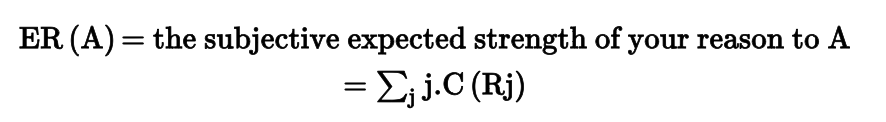

# 7. Motivating Reasons and Normative Reasons 

*David McNaughton and Piers Rawling*

### **Abstract and Keywords**

Reasons for action are traditionally divided into "motivating reasons," which explain why someone did something, and "normative reasons," which concern why she should (or should not) have done it. We explore various positions concerning both types of reason, and the relations between them. We discuss Davidson's causal account of action, reasons internalism and externalism, constructivism, motivational internalism and externalism, and practical normative realism (PNR)—the view that there are truths concerning what you have reason to do (this is opposed by error theorists and noncognitivists, whose views we also briefly address). In our account of PNR, we distinguish between what you ought to do and what you have most reason to do, by appealing to the idea of reasonable credences. And we include two appendices, one resisting Lewis's argument to the effect that advocates of PNR must reject motivational internalism, the other responding to a concern about future contingents.

Keywords: action, causal, constructivism, credence, externalism, internalism, motivation, normative, ought, reasons

*Reasons for action, or practical reasons, may be seen as falling into two categories, the reasons that explain why someone did something ("motivating reasons"[^1] ), and the reasons why she should (or should not) have done it ("normative reasons"). In what follows we shall explore the pros and cons of various positions concerning both types of reasons, and the relations between them.

## **7.1 Motivating Reasons**

Perhaps the best-known contemporary view of motivating reasons is that expounded by Donald Davidson (1980a; see also Wiland, Chapter 8 this volume). In explaining an action, Davidson's thought is that we cite the psychological states (or attitudes) that both caused and rationalize it. In simple idealized cases, the states are a desire and a belief—these constitute what Davidson dubs the "primary reason" for an action. In giving a potential explanation of the politician's vote for the bill, we might cite her belief that if she didn't, she wouldn't get re-elected, and her desire to get re-elected; or we might cite her belief that passage of the bill would help the poor, and her desire to accomplish this. Both belief–desire pairs rationalize her action—it makes sense in light of either pair, and they each portray it in a favorable light from her point of view. And it is possible that she acted for both reasons. But what makes it the case that she acted for one or the other or **(p. 172)** both? Davidson claims that answering this question requires knowing the causal story—the states that moved the politician to vote for the bill are the ones that caused her to do so. (Note that we draw a distinction throughout this chapter between an agent's being moved to act and her being motivated to act: movement implies motivation, but not vice versa.) One of Davidson's challenges to non-causal views, then, is to distinguish, among mental states that rationalize an action, between those that played a role in moving the agent to act and those that didn't. Davidson's account, however, is not without its own challenges. We shall not canvass them all, but here is a sampling.

One objection rests on Hume's (1978 [1739]) claim that there can be no necessary connections between causes and their (purported) effects. The thought is that the rationalization relation between actions and the relevant belief–desire pairs is just such a necessary connection, or close to it, and hence belief–desire pairs cannot cause the actions that they rationalize. Davidson's response to this is to point out that if this connection is necessary, it is a connection between events and states under certain descriptions, and this is entirely innocent (1980c: 14). "The causes of the Great Fire of London caused the Great Fire of London" is certainly true, yet it expresses a connection between cause and effect that is a least as "necessary" as any apparent in "her belief that Fred was thirsty and her desire to relieve his thirst caused her to fetch him a glass of water."

Another objection rests on combining the following:

- **(1)** Causal claims entail laws (see e.g. Hume (1978 [1739])).
- **(2)** There are no laws linking belief–desire pairs and acts performed in their light.

Adopting this pair apparently entails the rejection of Davidson's view that belief–desire pairs can cause acts. However, claims Davidson, (2) only holds at our everyday level of description (as in the final example of the previous paragraph). There are, Davidson argues, relevant laws at the physical level: any particular belief–desire pair, and the action it caused, will have *physical* descriptions under which their causal interaction is covered by a law (see Davidson 1980b; 1980c: 15–17). One difficulty here, however, is that of accounting for the relevance of the propositional contents of the belief–desire pair to the action that, on Davidson's account, they cause (see Wilson and Shpall 2016 for discussion).

A third objection seeks to undercut Davidson's account by claiming that *all* the belief–desire pairs that rationalized an act played a causal role in its performance. As we noted, Davidson challenges those who deny his causal view to give an alternative account that distinguishes between psychological states that merely rationalize an action and those that not only rationalize but for which the agent actually acted. But if the states that rationalize always have a desire-like component, are they not all involved in causing the act in question—isn't it criterial of desire-like states to be "pushy"?

One line of response (see Wiland, Chapter 8 this volume) is to note cases in which an agent has different motivating reasons to perform one and the same act, but that cannot be jointly satisfied. I might have a standing desire to surf in Hawaii, say, as well as attend a conference there, but cannot do both on one trip. So, given that I'm going **(p. 173)** to the conference, I do not go to Hawaii for the surfing on this occasion. My surfing desire does not disappear, however; rather, it just fails to play any part in moving me to go to Hawaii on this conference trip. Another response is to point out that plenty of motivating reasons don't result in action (I have motivating reasons that move me to sit here and type, but I also have motivating reasons to do many other things), so why suppose that all the motivating reasons for an act that is actually performed are part of its cause? The objection rests, it seems, on analogizing motivating reasons to forces, with acts being the product of their resolution. However, perhaps this analogy can be rejected without abandoning a causal account of action.

Another difficulty for the Davidsonian view is posed by "deviant causal chains." Belief–desire pairs can cause behavior in "deviant" ways, and in such cases the pairs in question do not constitute reasons in Davidson's sense—as in the following example of his (1980c: 79). A climber wants to rid himself of his partner, and believes he can do this by loosening his hold on the rope. These thoughts so disconcert him that they cause him to do so. But, since this is unintentional, the belief–desire pair in question is not the reason for the slackening of his grip.

What conditions must we add to the causal criterion, then, in order to guarantee that a belief–desire pair is the reason for which the agent acted? We know of no satisfactory answer (see Wilson and Shpall 2016 for discussion). Perhaps we should rest content with the thought that at least Davidson provides a necessary condition for a belief–desire pair to be the reason for which the agent acted, just not a sufficient one. However, one might see the case of the disconcerted climber as raising the issue of whether Davidson's account accords an appropriate role to the agent, as opposed to merely her beliefs and desires. The case is deviant, one might argue, because the climber was not appropriately engaged. But Davidson seems to lack the resources in his account to address this.

Another issue, discussed in sections 7.4 and 7.6, is that of whether your belief that you have a reason to A, or ought to A, can suffice as motivation for you to A. Can Davidson's view accommodate this possibility? Interestingly, he maintains that "all [desires] may be expressed by evaluative judgements" (1980c: 86), such as your judgment that you ought to A. If these judgments also express beliefs, and if these beliefs can, by themselves, give rise to, or constitute, the relevant desires, then it would appear that Davidson's account is consistent with the view that beliefs can suffice for motivation. It is crucial to note, however, that the belief and desire expressed by the evaluative judgment have different contents—"I ought to improve the taste of the stew" (Davidson 1980c: 86) would, on this interpretation of matters, express the agent's desire that he improve the taste of the stew, and his belief that he ought to do so.

Finally, Davidson's view is a form of psychologism about motivating reasons—the motivating reasons are psychological states or attitudes. But there are alternative views according to which motivating reasons are not, or are not all, psychological states. Eric Wiland discusses such views in detail in Chapter 8 in this volume, so we shall be brief. If motivating reasons are not psychological states, what are they? One view is that they are facts about the world. If you are thirsty, then what motivates you to walk across the room, it might be said, is the fact that there is a glass of water on the table, rather than **(p. 174)** your desire for a drink coupled with the relevant belief. The standard difficulty faced by views of this sort, however, is the problem of false belief. Suppose the belief–desire pair is present, but the belief is false. There is no glass of water on the table—it's a cunning illusion—yet you still walk across the room in expectation of a drink: what is your motivating reason if not the belief–desire pair?

One response is to "go disjunctive" and claim that in the true belief cases the motivating reasons are facts, but in the false belief cases they are belief–desire pairs. However, thinking of reasons as facts is thought by some to invoke a different usage of "reason," to which we now turn.

## **7.2 Normative Reasons: The Two-Tier View**

To say that Anne is putting on her coat because she believes it's cold might imply an element of doubt—ordinarily we'd give as her reason the fact that it's cold. And assuming that she *should* (at least *pro tanto*) wear her coat for this reason, it is a "normative reason" (we shall typically omit the "normative").

It's important to note that there are two facts lurking here. Anne's reason is the first: It's cold. But there's also a second: The fact that the first fact is a reason for Anne to wear her coat. We have, then, a two-tier view of practical reasons. At tier one are the (normative) reasons for various actions; at tier two are the facts that the tier one facts are (normative) reasons for these actions.[^2] Tier two facts include facts about what is a reason for what—the fact that the cold is a reason for her to wear her coat—as well as simply the fact that she has a reason to wear it, and, more generally, the fact that agents have practical reasons (reasons to do things). Experience tells us that it's easy to muddle the tier one/tier two distinction, so perhaps it helps to appreciate that the two tiers give rise to different possibilities for error: you might be mistaken about the weather (tier one error); or you might fail to realize that cold weather is a reason to wear a coat (tier two error). A related potential muddle concerns the very use of the term "normative reason": the fact that it's cold is *not* normative, even though, in the usual terminology, it is a normative reason for you to wear your coat. It is tier two facts that are practical *normative* facts.[^3]

**(p. 175)** So far, we have outlined a "simple" two-tier view of normative reasons, according to which practical reasons (tier one facts) are non-normative. But suppose you're contemplating an act that would cause undeserved harm. Isn't this a reason against doing it? If it is, then the simple view is false, since "undeserved harm" is a normative notion. However, any such act has non-normative features that make it a case of causing undeserved harm. So perhaps the simple view might be retained by citing these features as reasons, rather than citing the harm. For example, suppose you're deciding whether to cast the deciding vote on a piece of legislation that would increase sales taxes. This increase would cost the poor more relative to their incomes than it would cost the wealthy, and thereby inflict harm on the former group, let us suppose, and undeservedly so. What reasons do you have for voting against the increase? It seems that you might cite the first fact about relative cost; or you might cite the second, concerning undeserved harm. We see no problem with citing either, provided you don't cite both. The undeserved harm is a reason for you to vote against the increase, but not a *further* reason to vote in this direction, in addition to the higher relative cost to the poor. In any case of a normative tier one fact, there will be, we claim, non-normative facts that are equivalent to it qua practical reasons. So we reject the simple view, with the caveat that care must be taken not to "double-count."

The two-tier view, simple or not, raises a host of well-known questions and challenges. Many of these are usually raised with respect to the existence and nature of moral facts, but they are easily adapted so as to apply to practical normative facts in general.

First, there is the issue of whether there are any practical normative facts. Noncognitivists and error theorists disavow them. We discuss these views in section 7.[^4]. Second, if there are normative facts, there is the issue of whether they are reducible to non-normative facts in some way. Naturalist normative realists maintain that there are normative facts, and (instantiated) normative properties, but that these are either reducible to, or even identical with, "natural" facts and properties—where, among other things, natural claims are empirically investigable, and natural properties play causal roles. We reject naturalism, along with noncognitivism and the error theory; thus we are non-naturalist normative realists.

We do not deny, of course, that empirical investigation can play a role in determining what we have reasons to do. For example, if we have reason to increase happiness, then working out how to achieve this requires empirical work. But the issue of whether the antecedent holds is a normative matter, and empirical research cannot resolve it. Why suppose, however, that a lack of empirical investigability should tell against the status of a claim? Science relies on mathematics and logic, and they are not subject to empirical inquiry. And what about the question of whether, say, scientists should adhere to the hypothetico-deductive method? How could we empirically investigate this issue? We can hardly apply the hypothetico-deductive method.

What of causal roles? One line would be to claim that neither mathematical nor logical properties play causal roles, in the sense that, say, the property of being solid does. So why should we insist that the lack of such a role tells against (non-natural practical) normative properties? Another line might be to claim that normative **(p. 176)** properties can play causal roles. Your child is having a tantrum; this is a reason for you to soothe him; and there are no countervailing reasons. Your circumstances, then, have the normative property of there being among them an overriding reason for you to soothe your child. And, on this line of thinking, it can be in virtue of this property of your circumstances that you come to believe that you have this overriding reason—just as a ball might have the properties of being inelastic and having a certain momentum, and it is in virtue of these properties that it breaks the window. It should be borne in mind, however, that the *justification* of your belief that you have overriding reason to soothe your child would, as in all cases of justifying what is a reason for what (practical or theoretical), involve rational recognition and reflection—that is, doing such things as thinking carefully about your circumstances from various perspectives, and contemplating such matters as the relative importance of, say, fairness, the impersonal good, and personal enjoyment.

In addition to naturalist normative realism, there is a related reductive position—"descriptivism"—according to which ethical properties are identical to descriptive properties, where a descriptive term is (roughly) one that belongs "to the 'is' side of the famous 'is-ought' debate" (Jackson 1998: 113). Jackson contends that the account of properties germane here is one according to which necessarily coextensive properties are "one and the same property" (p. 126). If Jackson's argument for this position is sound, descriptivism can be adapted to conclude that tier two facts are identical to non-normative facts.4 Such a view (call it the "one fact view" or "OFV") is broader than naturalism since, for instance, whereas the naturalist eschews supernatural entities, an advocate of OFV might accept the claim (F1) that God has told you to A, and equate it to the fact (F2) that you have an overriding reason to A.

But adapting Jackson's view of property identity to fact identity results in a very coarsegrained view, on which, for example, the fact (F3) that 2 + 2 = 4 is identical to the fact (F4) that all bachelors are unmarried, or the fact (F5) that Peano Arithmetic is incomplete.[^5] We reject this view, and opt instead for a fine-grained view of fact identity that distinguishes facts in part on the basis of conceptual distinctions—so, according to us, despite their all obtaining at all possible worlds, (F3), (F4), and (F5) are distinct. The identity conditions for facts are, however, a complicated matter (see e.g. Mulligan and Correia 2013), and we won't pursue the topic here. But if we are correct, then, in order to establish that the OFV is false, it suffices to show that non-normative and normative concepts are distinct.

In the particular case of (F1) and (F2), some divine command theorists might claim that the concept of an action that you have an overriding reason to perform and that of an action that God tells you to perform are the same concept, but there are surely more plausible versions of the theory. For example, it might be claimed that (F1) is a tier one **(p. 177)** fact—it *is* an overriding reason to A—rather than being a tier two fact, identical to the fact that you *have* an overriding reason to do so.

More generally, Jackson himself acknowledges that "ethical language may be needed in practice to capture the similarities among the various descriptive ways that [ . . . ] constitute ethical nature" (1998: 124) because, from the non-normative perspective, the ethical might be infinitely disjunctive and patternless. The same applies to practical reasons overall: even if we (*per impossibile*) could list all the instances of reasonhood—some fact being a reason for some act—the grouping of all these instances would make no sense from the non-normative perspective, much as the grouping together of, say, all the different types of fasteners makes no sense in the absence of the notion of a functional artifact. And without a grasp of the concept of a fastener at the functional level, we could not categorize novel objects as fasteners (or not). Similarly, there is a distinct concept of what it is to be a reason, and without an understanding of this concept we could not, for example, discuss what it is that we have reasons to do in a novel circumstance.

OFV would, if true, however, provide a very simple account of the supervenience of the normative upon the non-normative. If there are normative facts, then all sides agree that they supervene upon non-normative facts: there cannot be a normative change without a non-normative one. OFV accounts for this by simply equating the normative and the nonnormative; but supervenience is often thought to be a special difficulty for positions such as ours. But we too have a simple account. The normative facts in question are facts about what you have reasons to do—tier two facts—and the basic idea is that there cannot be a change in what you have reasons to do without a change in the non-normative facts because your reasons themselves—the tier one facts—are among the non-normative facts.[^6]

There are certainly complications here. For instance, how sharp is the divide between reasons and background non-normative circumstances? Perhaps the answer is "not very." But this does not undermine our position. All we require is that whenever there is a change in what you have reasons to do, there is a change in non-normative circumstances, and that remains the case.

We turn now to the relations between normative reasons and motivation. In the next section we explore views according to which whether you have a reason to perform some act depends upon your (idealized) will or motivations.[^7] These "constructivist" accounts of normative reasons are not fully fledged forms of normative realism in our sense, but they are, as it were, halfway there—both accounts we shall discuss rely, for **(p. 178)** example, on the notion of rationality, and this is a normative concept (one mark of the normative is the possibility of error, and irrationality is an error).

## **7.3 Constructivism and the Two-Tier View**

The two positions we're about to discuss—due to Bernard Williams and certain Kantians respectively—may not be inconsistent with the two-tier view per se, but they certainly differ from ours concerning the status of tier two facts. We see these facts as metaphysically basic; Williams and these Kantians deny this, making them constructivists about reasons. Their idea is that you have a reason to perform an act of some sort because of some further fact(s), where this "because" marks a metaphysical dependence. And then the fact that you have a reason can be seen, in a sense, as being "constructed" from the resources adverted to in the further fact(s)—although Williams and the Kantian constructivists differ on what the further facts are and how the "construction" proceeds.

### **7.3.1 Reasons Internalism**

On Williams' (1981 and 1995a) view—"reasons internalism" (RI)—you have a reason to do something only if, and because, you would be motivated to do it under the assumption that you are fully informed (about non-normative matters) and "procedurally rational" (which merely requires that you do such things as adhere to best deductive and inductive practices, and align your aims and intentions; crucially, you need not have any particular prudential or moral concerns). Suppose you're in the path of oncoming traffic. You have a reason to move, according to RI, only if you would be motivated to move if fully informed and procedurally rational. We reject this account: we are "reasons externalists" (REs). It may be that you have no reason to move. But, if so, REs contend, this is not dependent on rational procedure, information, and your current motivations in the way that RI supposes.

The RI's reason "construction" proceeds as follows. We start with the agent's current "motivational set," S, which includes not only her ordinary desires, but also "such things as [her] dispositions of evaluation, patterns of emotional reaction, personal loyalties, and various projects [ . . . ] embodying [her] commitments" (Williams 1981: 105). We then "correct" her S so as to ensure that she is "fully informed"—false non-normative beliefs are eliminated, and any missing relevant true non-normative beliefs are added.[^8] Finally we set her to work following the rational procedures mentioned above—deduction, induction, and resolving conflicts among her aims and intentions. At the end **(p. 179)** of this process, the agent is motivated to perform certain acts. These are exactly the acts that, on this view, she has reasons[^9] to perform.

Two initial points of disagreement with advocates of RE concern the constitution of "full information" and the contents of an agent's S. RI, obviously, rejects the idea that fully informing an agent includes informing her about what she has reasons to do—since, of course, what she has reasons to do emerges at the end of the constructive procedure. So what about her beliefs about what she has reasons to do (tier two beliefs, as we'll call them)? Can these be part of her initial S? It would seem odd to deny this: couldn't an agent's deliberations about what to do involve thinking about what she has reasons to do, so that tier two beliefs could play a role in practical deliberation? And wouldn't such beliefs feature in an agent's "commitments"? Deliberating about what one has reasons to do is a key part of what it is to respond to reasons as reasons, in contrast to merely responding to reasons as stimuli (for want of a better expression), as perhaps many animals do. Fido responded to the fact that an intruder was lurking by barking, and we might want to say that the intruder's presence was an overriding reason for Fido to bark, so that he responded to the reason appropriately. But he didn't respond to the reason *as a reason*, in the sense that he could have, for instance, entertained the question: "Is the intruder's presence a reason for me to bark?"

Yet, on the RI account, tier two beliefs would not be subject to correction or augmentation in the process of the agent becoming fully informed, since, as we just saw, tier two facts must be omitted from full information. Indeed, it is not even clear what the content of a tier two belief comprises—what does it mean, on this view, to say that an agent has a reason to A? Williams is puzzled over the meaning of external reasons claims (1981: 110– 11; 1995a: 39–40). But why is he any less puzzled over the meaning of internal reasons claims? He agrees (1995b: 187–8) that an agent can arrive by correct deliberation at the belief that she has a reason to A. But he (sensibly) denies that this is to arrive by correct deliberation at the belief that if she deliberated correctly she would be motivated to A. Williams agrees that "she has reason to A" is not equivalent to "if she deliberated correctly, she would be motivated to A" (1995b: 187–8). Thus it is unclear what the content of an agent's belief that she has a reason to A, or that of the question "what do I have reasons to do?", amounts to on Williams' view.

The RE, on the other hand, regards the notion of a reason as metaphysically (and conceptually) basic; and, were it possible to fully inform an agent, tier two facts would be crucial contributions. And agents can entertain questions about what they have reasons to do at any point in their deliberations. In denying that tier two facts are among the complement of facts to be included in an agent's full information, the RI can be seen as begging the question against the RE. But, naturally, the RI has various rejoinders.

First, Williams claims: "Internalist theory explains how it is that the agent's accepting the truth of 'There is reason for you to A' could lead to his so acting, and the reason **(p. 180)** would thus explain the action. It is obvious on the internalist view how this works" (1995a: 39). However, as we've just discussed, it's unclear what it would be for the agent to accept this truth on Williams' view. In fact, it seems clearer on RE "how this works": it is open to RE to hold that an agent's *accepting that* she has a reason to A leads to her being motivated to A (we discuss this claim in section 7.4). The RE claims that someone may have a reason to perform some particular act even though she could not be brought to be motivated (let alone moved) to do it, even when fully informed (in Williams' sense) and procedurally rational. But having a reason is distinct from believing that one has.

However, perhaps Williams is merely applying a "reasons implies can" principle: If you have reason to A, you must be capable of A-ing. But the RE can certainly accommodate this—whether you have reason to pursue some course of action depends on your capabilities: if you can't swim, you typically have no reason to jump in the deep end. More generally, the RE does not deny that reasons are personal—all practical reasons are reasons *for* agents to perform acts in the circumstances in which they find themselves, which include their own tastes and capabilities. For example, we have reason to seek innocent enjoyment, and enjoyment is certainly idiosyncratic.

Finally, Williams asks (1981: 110; 1995a: 39–40), why, when there is no procedurally rational route to motivation, does the RE speak of reasons? For example, rather than pointing out that the agent had strong reasons not to do something, we could criticize him in other ways (he was, say, cruel). The RE has two responses. First, the fact that an act would be cruel *is* a reason against it. Second, why suppose that rational procedures are so centrally important? Coming to see matters aright "may need some non-rational alteration" (McDowell 1995: 78). And this is not unique to practical reason—consider the Kuhnian paradigm shift (Kuhn 1962). Or, less radically, it might suddenly dawn on someone that the facts before her give her reason to believe some hitherto unconsidered possibility, just as it might dawn on her that they are reasons to perform some hitherto uncontemplated act, where, even though there need be no rational routes to these new realizations, yet they are veridical nonetheless.

Before we move on, another, more recent RI position warrants mention. Although she does not express matters in these terms, Sharon Street's (2006) constructivism is essentially a version of RI, with "evaluative attitudes" replacing "motivational set" (although she incorporates neither Williams's requirement of full information nor that of procedural rationality), and her evolutionary argument against realism is an argument against RE. This argument rests on the premise that "the forces of natural selection have had a tremendous influence on the content of human [practical] judgments" (Street 2006: 113), and its upshot is that our practical tier two beliefs arose and persisted because they were evolutionarily advantageous, not because they "tracked" the truth. Their truth is not metaphysically basic, but, rather, is dependent upon our taking them to be true. One response is to note that, while selectional forces may explain many of our *desires*—including, say, our desire to see our offspring thrive—it's a further step, as Street acknowledges, to claim that these forces explain why we believe that we have reason to favor our own offspring. We may desire something and also believe truly that we have no reason to pursue it. Street counters this line with the thought that her constructivism **(p. 181)** does not rule out rational reflection; it's just that such reflection cannot escape the bounds of our selectionally influenced evaluative attitudes.

One issue, then, is the extent to which rational reflection really is distorted by natural selection (and, following McDowell's suggestion above, might not some "non-rational alteration" enable us to access truths beyond our prior attitudes?). Another is that Street's argument may prove too much. Like her (2006: 156, n. 2), we think that, if it succeeds, it can be extended to *theoretical* normative facts. Indeed, she argues this explicitly (Street 2009), and concludes that the fact that you have reason to believe some proposition, just like the fact that you have reason to perform some act, ultimately depends on your evaluative attitudes. But now she is in danger of running up against standard difficulties with relativism: what is the status of her own argument to the effect that all the normative truths that she accepts stem from her own selectionally influenced evaluative attitudes? She purports, for example, to give us overriding *reasons* to believe that our practical judgments are *better* explained by selectional forces than by the tracking account (a claim that is subject to challenge). This radical normative subjectivity also impacts her reasons internalism concerning practical reasons. Williams's incorporation of an "objective" account of procedural rationality adds plausibility to his view, but Street's rational reflection appears to be inevitably subjective—on her view there is, it seems, no fact of the matter as to who is being irrational when agents disagree over matters of procedural rationality.

Some of the foregoing thoughts also apply to Kantian constructivism, our next topic. We shall not repeat ourselves, however; rather, we shall focus upon two notions distinctive of the Kantian approach: autonomy and the rational will.

### **7.3.2 Kantianism**

According to Darwall:

> In [the Kantian] view, as in that of [RI], something's standing as a normative reason ultimately depends on its being motivating (treated as a reason) in fully rational deliberation, where the latter is determined by internal, formal features of the deliberative process, not by its responsiveness to independently establishable normative reasons (2006: 299)

Where do these Kantians differ from RIs, then? They might be seen as simply extending Williams' notion of procedural rationality to include the requirement that practical reasoning accord with the categorical imperative (CI)—the first formulation (FF) of which reads: "Act only according to that maxim whereby you can at the same time will that it should become a universal law without contradiction" (Kant 1993 [1785]: 30). Like Williams, these Kantians deny that practical reasons are metaphysically basic. Rather, both accounts are constructivist about reasons—what you have reasons to do depends on what you would be motivated to do if fully informed (about non-normative matters) **(p. 182)** and procedurally rational. The difference comes in what is to be included under the procedural umbrella.

On the Kantian constructivist view, then, tier two facts—facts to the effect that we have practical reasons—are seen as "constructed" by a rational will in accord with a procedure that respects the CI. The RE opposition, which includes Parfit (1997, 2011), sees such facts as freestanding. As Scanlon puts it: according to the Kantian constructivist about reasons, justification "never runs [ . . . ] from claims about reasons to claims about what rationality requires," whereas Parfit, by contrast, appeals "to an idea of 'what one can rationally will' that presupposes an independently understandable notion of the reasons that a person has and their relative strength" (in Scanlon's response to Parfit in Parfit 2011, vol. ii: 121). We are not in wholehearted agreement with Parfit here, since we are not wedded to the Kantian notion of "what one can rationally will," but on both our views the tier two facts are freestanding and metaphysically basic.

Kantians focus upon the possibility of acting as morality requires, and doing so from the appropriate motive. And they hold that this is possible only if there are unconditional practical reasons—reasons sufficient to motivate the will of any rational being, independently of what that being desires. For the Kantian, the recognition of facts cannot play this role. She can be seen, then, as sharing the error theorist's suspicion of "strange facts"—facts whose mere apprehension motivates us. On one version of the RE account there are facts about what we have reasons to do, and if we come to believe these facts we are motivated to perform the acts in question.[^10] But for the Kantian, the apprehension of facts that are "out there in the world," and thus external to the will, can motivate in only one of two ways: via desire, or through causal necessity. Awareness of a fact can combine with a desire to give the agent a (motivating) reason to act—but then the status of that fact as a reason is conditional on desire. Alternatively, we might be so constructed that our realization of certain facts removes choice, and causally determines action. But then the action would not be free.

The Kantian, then, maintains that reason has a practical as well as a theoretical role. But whereas theoretical reason uncovers facts that are independent of it, by sifting external evidence, pure practical reason, which is governed solely by the CI, and manifested in the rational will, is self-determining (an analogy here is the sovereign nation state). Being practically rational just *is* acting in accord with the CI—the CI determines both how the rational will does act and how it should. Thus the CI is a normative standard internal to practical reason, and the rational will has no other—it is beholden to no external standard. The rational will is, then, autonomous in the Kantian sense: it provides its own normative standards and obeys them. And if the possessor of such a will has a reason to perform some act, that is because she would be motivated to perform it after fully rational deliberation—deliberation that conforms to the CI.

RE, on the other hand, assimilates practical to theoretical reasoning by claiming that theoretical reason can uncover not only tier one but also tier two facts. But, says the **(p. 183)** Kantian, whatever facts are available to theoretical reason will still be facts external to the will. Merely adding new facts to its output cannot make theoretical reason practical. Practical reason is distinct, serving not to reveal the facts to us, but to make (metaphysically speaking) the rational will autonomous. RE agrees with the Kantian that beliefs with non-normative content do not, by themselves, have a practical role, but insists that when a belief's content is normative, its practical purport is unmysterious. RE holds, in short, that the role of reason—to uncover the facts—remains constant, and that practical import is supplied by normative content. The Kantian responds that it is only when we recognize that reason has two quite different roles—the practical and the theoretical—that we can grasp how reason can determine the will. Indeed, on one understanding, the Kantian denies that there are any tier two *facts—*rather, there are merely imperatives, as in FF.

The contention that the CI determines the nature of practical rationality accords with the idea that practical reasons must be universal, in the sense that if you act in a certain way in certain circumstances, then you will that any rational being similarly placed should act in the same way. There is no reason to steal, for example, because the thief is not advocating a general rule (T) that everyone steal in circumstances similar to his—he is, instead, willing that *he* steal, but no one else. Willing (T) universally would involve a contradiction "in conception": if everyone stole promiscuously, this would undercut the very possibility of property (or so the thought might go), thereby rendering stealing conceptually impossible. More generally, rationality requires avoiding contradiction; thus rationality requires conformity to the CI. It is not as though the rational will has a choice, then, in the normative standards it provides for itself.

There are several well-known difficulties with the Kantian approach. Here are two. First, there is the issue of the adequacy of the CI. In many cases of morally impermissible acts, such as child abuse, it is unclear how FF is violated. And, on the other side of the coin, there are permissible acts whose maxims do violate FF—for example, I make it my maxim to open the door for others.

Then there is the complaint that the Kantian strategy must presuppose normativity at the start in order to get it out at the end, as it were. As O'Neill (a prominent Kantian) puts it, the danger is that if "the standards of practical reasoning are fundamental to all human reasoning, then any vindication of these standards is either circular (since it uses those very standards) or a failure (since it is not a vindication in terms of the standards that are said to be fundamental)" (O'Neill 1989: 29). Admittedly, if practical reason can be generated from FF, then the normativity presupposed might be said to be mere "formal" rationality—the avoidance of contradiction—as opposed to something more substantial. The RE posits substantial normativity with no justification, whereas the Kantian constructivist project might be construed as deriving substantial normativity from mere formal rationality. But we are skeptical that merely formal input can generate substantial output.

Another version of the CI, for example, is Kant's "Formula of Humanity" (FH): "So act that you use humanity, whether in your own person or in the person of any other, always at the same time as an end, never merely as a means" (1993 [1785]: 36). On one **(p. 184)** interpretation, FH is more substantial than the first formulation—if we assume a particular substantial interpretation of the notions of "end" and "means," for example, it is clear how child abuse violates it. But how is FH to be justified?

Here's one attempt (based on that due to Korsgaard 1996: 259–62). If anything is unconditionally good, humanity is. And if humanity is unconditionally good, this justifies FH. But how can we establish that there is something of unconditional value? Well, rational agents act for ends, which they must assume to have value. Suppose, for *reductio*, that all ends are assumed to have only conditional value. But what about the value of these conditions? Surely they must be unconditionally valuable, on pain of regress. What serves as a condition of something's goodness must itself be unconditionally good. Thus agents must take it that something is unconditionally good—and if agents must take it to be so, it is so (this is an instance of Kant's transcendental idealism).

This argument is open to dispute, however. First, transcendental idealism in general is open to challenge. Second, why is it that, if anything is unconditionally good, humanity is? Third, the condition of a thing's goodness need not itself be good (see e.g. Darwall 2006: 299–300). Compassion, say, is only good when directed at an appropriate object—at a suffering being who deserves pity. But the existence of a suffering and pitiable being is not good.

We suspect, then, that if FH is substantial, it is unsubstantiated—at least, it cannot be substantiated with merely formal resources. And, if it is unsubstantial, like FF it at best renders verdicts about moral impermissibility, and this omits large portions of the practical realm—the CI might rule out various of my current options as impermissible, but it doesn't tell me what I do have reason to undertake. Furthermore, the manner in which FF arrives at verdicts of impermissibility, by declaring immoral maxims self-contradictory in some way, seems to miss the point—even if the child abuser does act on a self-contradictory maxim, this is not what makes child abuse wrong. Even if, *per impossibile*, some purely formal procedure such as FF were adequate, why would it be a reason-*maker*, as opposed to an epistemic *check*? (You think you have a reason to perform some act, but, just in case, you might run it through some procedural check, if such were available.)

So, to sum up, whereas the RE sees normativity as metaphysically basic, and something that the rational will might latch onto, one of the Kantian's central ideas is that normativity and motivation (in the ideally rational case) arise from a single formal procedure: the application of the CI. This Kantian "two for one deal" is certainly economical, but we find it to be ultimately untenable—although we acknowledge that, to some extent at least, the dispute between ourselves and the Kantian constructivist is an opposition between two very different accounts of ourselves as rational and reasoning beings, with very different presuppositions, so that the stand-off is unlikely to be resolved by argument. Rather, what is required is a perspectival shift.

We turn now to two arguments, based on motivational considerations, to the effect that there are no practical normative facts—not even in the attenuated sense of the constructivist.

## **(p. 185) 7.4 Noncognitivism, the Error Theory, and Motivation**

Some might doubt that there are practical normative facts because they doubt that there are *any* normative facts. But this position is in danger of undermining itself: if there were no normative facts, then we could have no reason to believe this, since, if we did, it would be a fact that we have a reason to believe it, and this would be a normative fact. Noncognitivists and error theorists, however, do not follow this route. Rather (like the Kantian), they see a sharp distinction between practical and theoretical normative claims, and it is only the former that they challenge.

Assuming there are practical tier two facts, what role do they play in motivating (and moving) agents to act? On one account (A1 ), "practical opinions" are tier two beliefs—beliefs that tier two facts obtain. And these, when combined with suitable tier one beliefs (beliefs that tier one facts obtain), motivate agents to act,[^11] without the need of any independent desires. 

Another account (A2 ), however, while agreeing that practical opinions are tier two beliefs, sees independent desires as required for motivation. On this alternative, rational agents have a standing desire (D) that they do what they have most reason to do. And it is the combination of D with the relevant tier one and two beliefs that moves agents to act. My beliefs that it's cold, and that this is an overriding reason for me to wear my coat, combine with D to move me to wear my coat. All three components are necessary for motivation, and D is independent of any particular beliefs.[^12] 

A third account (A3 ) has no place for tier two beliefs—it sees motivation as arising from the combination of desires (the practical opinions on this account), and tier one beliefs. I am motivated to put on my coat by my tier one beliefs that it's cold, and that my coat will keep me warm, combined with my desire to keep warm. 

For present purposes, we'll suppose that these three options exhaust the possibilities. A1 and A3 are forms of "motivational internalism" (MI) since, unlike A2 (a form of motivational externalism, ME), they do not posit any motivational mental states "external" to the tight-knit group comprising practical opinions and relevant tier one beliefs.

Beliefs are either true or false (they are "cognitive" mental states), but desires are neither (they are "noncognitive")—while it may be true that I desire to A, the desire itself is neither true nor false. A1 and A2 , then, are cognitivist views, whereas A3 is a form of noncognitivism.

**(p. 186)** The argument against the view that there are practical normative facts (practical normative realism, PNR), and in favor of noncognitivism (to put matters anachronistically), dates back at least as far as Hume (1978 [1739]). His account of motivation, in modern guise, has two components. First, beliefs and desires are independent of one another (the Humean independence thesis, HI). Second, motivation to act requires both beliefs and desires (the Humean belief–desire thesis, HBD; see also section 7.1). We'll assume that HBD is correct in some form.[^13]

A1 violates HI. Thus A3 , noncognitivism, is the only form of MI consistent with both HI and HBD. And assuming that, if there were practical normative facts, we'd believe some of them, and these beliefs would play a motivational role, A3 entails the denial of PNR. 

PNR must plump, then, for A1 or A2 . Given HBD, A1 requires a form of MI that posits belief dependent desires. Here are two possibilities: 

> (MI1 ) Necessarily, an agent who believes she has a reason to A desires to A (where this desire stems from the belief).

>(MI2 ) Necessarily, a *rational* agent who believes she has a reason to A desires to A (where this desire stems from the belief).[^14]

One argument against MI1 focuses upon the possibility of an agent who suffers from extreme apathy. The claim is that such an agent might believe, say, that she has a reason to get out of bed, but have absolutely no desire to do so. This is impossible by the lights of MI1. MI2, by contrast, is consistent with the possibility of such an agent—he is irrational in having the belief but lacking the desire.

A2 can also accommodate extreme apathy by pointing to a temporary irrational lack of desire, but now the lacking desire is D. A2 , however, might be challenged on phenomenological grounds—no one has a "felt" standing desire corresponding to D. But perhaps desires need not be felt. There is an alternative model according to which some desires are merely dispositional states with no associated phenomenology. On this **(p. 187)** model, D could be a disposition on the agent's part to form a desire to A whenever she believes she has overriding reason to A. This approach also answers a complaint against A2 to the effect that, by its lights, rational agents would always be acting out of a felt and obtrusive desire that they do as reason demands, as opposed to desires for such things as fun or others' well-being.[^15] 

But now there is another difficulty: if A2 posits D as a rationally required disposition, then MI2 entails A2 , since MI2 posits as a rational requirement that agents have dispositions that include D.

What of the difference between MI2 and A2 , on the one hand, and MI1 on the other? The advocate of the latter maintains that whenever you believe that you have reason to A, you desire to also—but the desire can be exceedingly weak. Thus much hinges on the distinction between not being motivated in the least, and being motivated only very little**—**but how important is this distinction? And when it comes to believing that you have a reason to act in some way, what are the criteria for having such beliefs? One criterion might be that such beliefs are linked to motivation. But how is the debate over this criterion to be adjudicated? And how significant would an answer in one direction or the other be? It is, rather, the difference between A3 and its alternatives, rather than those among the latter, that is key. 

How persuasive is noncognitivism as an alternative to PNR? The arguments are manifold. Among the more novel, David Lewis (1996) mounts a decision-theoretic argument against A1 ; but since this argument is somewhat technical, we respond to it in appendix I. On the opposite side, the noncognitivist faces the difficulty of preserving various features of our common discourse about reasons. For example, if practical opinions are pure desires, it seems people can't disagree about what they have reasons to do in the appropriate way: desires do not clash in the way that beliefs do. Further, the following argument appears valid: 

> (ARG) If you have a good reason to avoid him, then you have a good reason to warn your little  sister about him; you do have such a reason; thus you have a good reason to warn your little sister.

Validity is defined in terms of truth preservation, but the noncognitivist denies that practical normative remarks have truth-values. And any attempt to surmount this obstacle has to accommodate embedded clauses, such as those in the conditional that constitutes the first premise of ARG.[^16]

In contrast to the noncognitivist, the error theorist accepts A1 . But, in light of this, she claims that if there were tier two facts, they would be metaphysically suspect[^17]—your merely believing them would motivate you. Thus all tier two beliefs are in error: there **(p. 188)** are no tier two facts. But we disagree: what's so odd about your apprehending that you have a reason to visit Anne motivating you to make the trip? 

## **7.5 Oughts and Reasons**

Let us suppose that we are correct, and that there are indeed tier two facts. The following question then arises: what is the relation between what I ought to do and what I have most reason to do?

On our view, practical reasoning consists, roughly speaking, in assessing what reasons we have to pursue our various options, in some particular case, and how weighty they are. Some reasons are weightier than others, and in many cases[^18] the preponderance of weight will favor one particular course of action. So what ought I to do? An obvious suggestion would be:

> (OMR) I ought to do what I have most reason to do.

But there are problems with this suggestion.

There are cases, indeed, in which you know that you ought *not* to do the act that you have most reason to do. Suppose a doctor has at her disposal three pills, about which she knows the following:

> The first two pills would each either cure the patient of his moderately debilitating illness, or kill him. The first would kill just if the second would cure, but she has no way of finding out which would kill and which cure. The third pill is merely palliative.[^19]

The doctor knows she ought to prescribe the third pill, even though she knows that this is not the act that she has most reason to perform—she knows that she has most reason to cure the patient, and so she knows that she either has most reason to prescribe the first pill or most reason to prescribe the second, but she also knows that she can't find out which.

There are also cases in which you ought to do something despite lacking any reason to do it. Suppose you are approaching an unmarked traffic junction with limited line of sight. Do you have reason to slow down? Well, if no vehicle is approaching on the road you intend to cross then, no, you don't have a reason. But surely you *ought* to slow down, given your limited view. This example is due to Prichard (2002: 93), who also rejects **(p. 189)** OMR. And, in addition, he rejects the view (as do we) that there is an objective probability that a car is coming, and that the agent ought to slow down because this probability is greater than zero. Rather, Prichard's view is suggestive of Bayesianism, according to which all probabilities are subjective. On the "pure" version of this view, probability assignments held by an agent are criticizable if and only if they collectively violate Kolmogorov's (1933) axioms. This comports with the idea of rationality as internal consistency: internal consistency of subjective probabilities (also known as "degrees of belief" or "credences")—or "coherence"—is conformity to Kolmogorov's axioms. And you can have quite, shall we say, unconventional credences that are yet coherent.

Prichard (2002) is concerned with moral duty, but we shall adapt his view[^20] to "oughts" more generally, before contrasting it with our own. Prichard contends, in line with the thought that "ought implies can," that an agent should be capable of knowing what she ought to do, and he has stringent criteria for knowledge: "Even in the case of moving our arms or making a noise we do not *know* that, if we were to set ourselves to do it, we should do anything" (2002: 97). Thus what I ought to do is *set myself to* perform some act. And what I ought to set myself to do is based, in part, upon my credences concerning the effects of my willing. He thinks, for example, that if a "would-be torturer [were] in a very high degree confident that torturing, and torturing only, would save the heretic, he [should set himself to] inflict the torture" (2002: 94). Because of this reliance upon subjective confidence, Prichard dubs his view "subjective." (We'll omit "set oneself to" henceforth.)

Having laid out the objective (roughly, OMR) and subjective views, as he sees them, Prichard (2002: 95) claims "there is no third course." We disagree. Our view is that "reasonable" agents pay attention to the empirical evidence available to them, and think carefully about what is a reason for what. Given that they do this, they will (implicitly, at least) arrive at a range of probability estimates concerning these matters that are "reasonable" for them, given their circumstances. Admittedly, the notion of reasonable credence, requiring more than mere coherence, is imprecise, and what credences are reasonable is subject to debate.[^21] But reasonableness of credences is hardly alone in this.

What a person ought to do, then, depends upon what credences it is reasonable for her to hold concerning her situation, including the strengths of her practical reasons to do various things. (This account is further developed in appendix I.) When you ought to slow down at a traffic junction, then, this is not because you merely happen to have a **(p. 190)** non-zero degree of belief that traffic is present, but because such a credence is reasonable, as is a high credence in the proposition that the presence of traffic is a very strong reason to slow down.[^22] Prichard's torturer has an unreasonably "high degree" of confidence that torture is required for the heretic's salvation, and hence he ought not to torture.

While not objective in Prichard's sense of appealing to objective probabilities, our view is objective in another sense: there is a fact of the matter as to whether a particular credence (or range thereof) in some proposition is reasonable for an agent in her circumstance. And this is consistent with "ought implies can," since reasonable agents can come to have reasonable credences, and hence come to know what they ought to do.

When we engage in practical rational reflection, we try to determine what we have most reason to do. The fact that a dog is chasing it is an overriding reason for the cat to climb a tree. But the cat is incapable of appreciating this normative fact—unlike us, the cat cannot respond to reasons under their guise as reasons. However, even for us, ignorance intrudes, and verdicts concerning what we ought to do take account of this, forcing a separation from what we have reason to do. Admittedly, the way in which we separate ought from reasons is partly stipulative, but it also helps resolve some puzzles of common usage. For example, in retrospect, we sometimes claim both that we made the wrong choice and that our choice was the best we could have made. You slow down at the unmarked traffic junction, only to discover your way is clear. You acted correctly given the evidence available. Yet you also acted incorrectly in that you slowed unnecessarily. So there are two standards of correctness. You had most reason to continue apace: it would have been the correct choice in the "reasons sense." But you chose as you ought: slowing was the correct thing to do in the sense that it was based on reasonable credences.

## **7.6 Conclusion**

We began by discussing Davidson's view that motivating reasons are desires paired with tier one beliefs, but, in response to a realist view about normative reasons, it was mooted (section 7.4) that an agent's motivations can stem from her tier two beliefs. Next (in section 7.5) we added credences[^23] to the mix to yield an account of what an agent ought to do, about which agents form beliefs[^24] that play a key role in action. Such beliefs may be false on our account, but reasonable agents work out the truth, and do as they ought, even in the face of strong desires to do otherwise.

**(p. 191)** In discussing Davidson, we raised a concern about the absence of a role for the agent in her actions—she seems to be merely a vessel propelled by her desires in light of her tier one (instrumental) beliefs. One attempt to get around this sort of worry is to invoke second-order desires—you may, for example, desire to A while at the same time desiring to be rid of this desire. Harry Frankfurt (1982; see also O'Connor 2014) proposes that you act freely when you fulfill desires that you desire to fulfill, and that it is your second-order desires that express your true self. But this raises questions. Why stop at the second order? And if you modify your second-order desires to align with your first-order desires, rather than the other way around, and act on these, are you acting freely? Would these second-order desires then express your true self? Our view is that cognitive judgments, such as your belief that you ought to A, express your true self—an approach that does not suffer the same regress and alignment problems as Frankfurt's. And, as regards free action, perhaps a necessary condition of your acting freely, in one sense, is that you do as you believe you ought.

On our proposal, in deliberative cases at least, the (reasonable) agent ponders what she has reason to do, taking into account her own ignorance, and arrives at a belief about what she ought to do. She then adjusts her motivations in its light. It may be protested that we have merely substituted normative beliefs for desires, again leaving no role for the agent in her actions. But the thought is that, if normative beliefs play a key role in regimenting our motivations, at least this source of action is subject to the agent's rational input. We noted in section 7.1 that Davidson also has a place for ought judgements, and that his view is at least consistent with the possibility that these express both beliefs and desires. He could maintain that the beliefs are parasitic upon the desires, as it were, but this seems implausible in many cases—surely, if, after much deliberation, I decide that I ought to take the job, this is not (in the standard case) parasitic upon my desire to do so; it's the other way around. So perhaps, after all, our position is consistent with Davidson's in this respect.

## **Appendix I Lewis on "Desire as Belief"**

Lewis (1996) challenges the possibility of there being desires necessarily connected to beliefs. His main argument is directed at a "simple theory" he calls "Desire as Belief" or "DAB," one version of which states:

> Necessarily, and regardless of one's credence distribution, one must desire A exactly to the extent that one believes it to be good. (1996: 308)

That is, if V(A) is the degree to which you desire A, and A* is the proposition that A is good, then, necessarily, for any credence distribution C you might have, the following holds:

> (DAB) V(A) = C(A*) (p. 308)

**(p. 192)** Lewis attempts to discredit DAB by establishing that if it holds under one credence distribution "it will cease to hold under almost all redistributions of credence" (p. 308).

Rawling (2016)[^25] contends that Lewis's own argument against DAB fails, but that there is an alternative that works. Thus, with Lewis, we reject DAB. However, by Lewis's own admission, there may be alternatives to DAB that are not defective.

Recall:

> (MI2) Necessarily, a *rational* agent who believes she has a reason to A desires to A (where this desire stems from the belief). 

How are credence and strength of desire to be incorporated into this formulation? For a rational agent, the strength of her desire to A, it seems, should depend in some way on her credence about the *strength* of her reason(s) to A. The strength of her desire to A, then, is *not* to be equated with her credence merely that she *has* a reason to A, as might be suggested by a parallel with DAB. Rather, this desire strength is determined by two components: the possible strengths of her reasons, and her credences that she has reasons of these strengths. She might have, say, a high credence that she has a very weak reason to A, or a low credence that she has a very strong reason to A. In these two cases, the subjective expected strength of her reason to A—and hence, on this approach, the rational strength of her desire to A—might well be identical.

In general, an agent might have various credences that she has reasons of various strengths to act in some particular way. Consider, for instance, the strength of your desire to give Anne an aspirin (A). As noted, it is *not* equal to your degree of belief that you have a reason to A. Rather, on this view, if (a) you are rational, (b) Rj is the proposition that your reason to A is of strength j (we assume some suitable measure of reason strength is available, based on a ranking of reasons by strength), and (c) C(Rj) is your credence in Rj, then:

$$ER (A) = \text{the subjective expected strength of your reason to A}
= \sum_{j} j.C\left(Rj\right) $$

(Eq1)

Rj is a normative proposition—depending on whether j is positive or negative, it asserts in part that you have, respectively, a reason for or against A-ing. R(1) is the proposition that you have a reason of strength one (on some suitable scale) to A (perhaps Anne has a headache and an aspirin would relieve it); R(–2) the proposition that your reason to A is of strength minus two—that is, you have a reason of strength two against Aing (perhaps aspirin would harm Anne). Suppose your credence in R(1) is .8, and in R(–2) is .2. Thus:

$$\begin{aligned} \mathcal{C}(\mathcal{R}(\mathbf{1})) &= \mathbf{.8} \\ \mathcal{C}(\mathcal{R}(-\mathbf{2})) &= \mathbf{.2} \end{aligned}$$

and

$$\mathbb{ER}\left(\mathbf{A}\right) = \left[\mathbf{1}\left(.\mathbf{8}\right)\right] + \left[-\mathbf{2}\left(.\mathbf{2}\right)\right] = .\mathbf{4}$$

**(p. 193)** Of course, this is massively oversimplified, and ER(A) is meaningless in the absence of expected reason strengths for other acts with which to compare it. The idea, of course, is that ER(A)>ER(B) if and only if, by your lights, your A-ing is more choiceworthy than your B-ing. And what you ought to perform is the act with the highest ER (or one of them in the case of a tie). Note that we can drop the thought that ER must mirror desire strength (except, perhaps, in perfectly rational agents). You can think that you ought to A because A-ing has the highest ER, even if you most desire to do otherwise.

How does expected reason strength relate to expected utility, as standardly conceived? The thought is that reason strength equals utility: the strength, j, of my reason to A in state Sj[^26] equals the utility of my A-ing in Sj (assuming we have sorted out the relevant scales). Thus:

$$j = U\left(\mathcal{A} \text{ in } \mathcal{S}_j\right)$$

And:

Hence (Eq 1) is equivalent to:

$$\mathbb{E}\mathbb{R}\left(\mathcal{A}\right) = \sum_{j} U\left(\mathcal{A}\text{ in } Sj\right) \cdot C\left(Sj\right)$$

(Eq 2)

But $\sum_{j} U\left(\mathcal{A}\text{ in } Sj\right) \cdot C\left(Sj\right)$ is equal to to the expected utility of act A as calculated according to causal decision theory[^27] (CDT), in which it is assumed that the agent believes the states in question to be causally independent of her possible acts. Hence we have arrived at:

$$ER\left(\mathcal{A}\right) = \text{Causal expected utility of act } \mathcal{A}\left(= EU\left(\mathcal{A}\right)\right)$$

(Eq 3)

And key to CDT is the result[^28] that:

$$EU (A) > EU (B) \text{if and only if A-ing is preferred to B-ing}$$

(by the rational agent in question)

That is, causal expected utility, like expected reason strength, mirrors rational choiceworthiness among acts.

**(p. 194)** The expected reason strength approach is clearly consistent with PNR, and thus so is CDT. However, both are also consistent with the denial of PNR, and thus we do not have here an argument in either direction. But we hope to have allayed fears that normative realists who reject HI must reject decision theory.

## **Appendix II Reasons and Future Contingents**

We have supposed that there are facts to have credences about. Sometimes, however, we're looking to the future in deciding what to do. Should I take an umbrella? This depends upon whether it will rain later in the day—a causally contingent matter, perhaps, if one holds an indeterministic view of the world. And, on some indeterminist views, no future contingent is true (or false) now. If so, how are credences to be incorporated in such cases, in which they are not credences in the truth of a proposition? Given the clouds, it seems I ought to take my umbrella because it's reasonable for me to have a high credence that it will rain later. But how can this be if it's also reasonable for me to have a relatively high credence in the proposition that future contingents lack truth-values?

Thomason (1970), building on the work of Prior (1967) and Van Fraassen (1966, 1968), develops a view according to which future contingents lack truth-values in the present. On this account, there are various world "histories" (sets of times) that coincide up to now, and then diverge into disjoint future branches (to reflect indeterminism). Each history respects bivalence, but no proposition of the form:

> *p* will be true in the future (abbreviated as "F*p*")

is true (*simpliciter*) now unless *p* is true on every future branch. If *p* is true on some future branches, but false on others, then F*p* lacks an overall truth value now.[^29] But we want to assign a credence to F*p*, even when F*p* lacks a truth-value—so is, for example, F*p* a proposition? If not, what is your credence a credence concerning? On one account of propositions, a proposition is considered to be identical to the set of possible worlds in which it's true; in similar vein, we suggest that a future contingent be identified with the set of histories in which it's true. The sets of histories constitute a field of sets, hence the standard Kolmogorov (1933) probability axioms can be applied. And there is precedent for probabilities that are not probabilities of truth—consider, for instance, Ernest Adams's view that the probability of a conditional is a conditional probability.[^30]

Even in the absence of facts about the contingent future, then, we can still maintain a semblance of the two-tier view concerning it. At tier one, we can appeal to reasonable credences about sets of histories in their role as future contingents. At tier two, we can make a parallel appeal to an agent's reasonable credences concerning the strengths of her reasons to act given a particular set of histories. And the results and framework from appendix I then apply.

## **References**

Alvarez, M. (2016). "Reasons for Action: Justification, Motivation, Explanation." In E. N. Zalta (ed.), *The Stanford Encyclopedia of Philosophy* (Winter). <**https:// plato.stanford.edu/archives/win2016/entries/reasons-just-vs-expl/**>.

Bennett, J. (2003). *A Philosophical Guide to Conditionals*. Oxford: Oxford University Press.

Darwall, S. (2006). "Morality and Practical Reason: A Kantian Approach." In D. Copp (ed.), *The Oxford Handbook of Ethical Theory*, 282–320. Oxford: Oxford University Press.

Davidson, D. (1980a). "Actions, Reasons, and Causes." In *Essays on Actions and Events*, 3–19. Oxford: Clarendon Press.

Davidson, D. (1980b). "Mental Events." In *Essays on Actions and Events*, 207–25. Oxford: Clarendon Press.

Davidson, D. (1980c). *Essays on Actions and Events*. Oxford: Clarendon Press.

Davidson, D. (2005). *Truth and Predication*. Cambridge, Mass.: Harvard University Press.

Frankfurt, H. (1982). "Freedom of the Will and the Concept of a Person." Repr. in G. Watson (ed.), *Free Will*, 2nd edn, 322–36. Oxford: Oxford University Press, 2003.

Hume, D. (1978) [1739]. *A Treatise of Human Nature*, ed. L. A. Selby-Bigge and P. H. Nidditch. Oxford: Clarendon Press.

Jackson, F. (1991). "Decision-Theoretic Consequentialism and the Nearest and Dearest Objection." *Ethics* 101: 461–82.

Jackson, F. (1998). *From Metaphysics to Ethics: A Defence of Conceptual Analysis*. Oxford: Clarendon Press.

Kant, I. (1993) [1785]. *Grounding for the Metaphysics of Morals*, trans. J. W. Ellington, 3rd edn. Indianapolis: Hackett.

Kolmogorov, A. N. (1933). *Grundbegriffe der Wahrscheinlichkeitsrechnung*. Berlin: Springer. English translation: *Foundations of the Theory of Probability*, ed. N. Morrison. New York: Chelsea Publishing, 1950.

Korsgaard, C. (1996). *Creating the Kingdom of Ends*. Cambridge: Cambridge University Press.

Kuhn, T. S. (1962). *The Structure of Scientific Revolutions*. Chicago: University of Chicago Press.

Lewis, D. (1981). "Causal Decision Theory." *Australasian Journal of Philosophy* 59: 5–30.

Lewis, D. (1996). "Desire as Belief II." *Mind* 105: 303–13.

Mackie, J. L. (1977). *Ethics: Inventing Right and Wrong*. London: Penguin.

McDowell, J. (1995). "Might There Be External Reasons?" In J. Altham and R. Harrison (eds), *World, Mind and Ethics: Essays on the Ethical Philosophy of Bernard Williams*, 68– 85. Cambridge: Cambridge University Press.

McNaughton, D., and P. Rawling (2003). "Descriptivism, Normativity and the Metaphysics of Reasons." *Proceedings of the Aristotelian Society*, supplementary vol. 67: 23–45.

McNaughton, D., and P. Rawling (2004). "Duty, Rationality and Practical Reasons." In A. Mele and P. Rawling (eds), *The Oxford Handbook of Rationality*, 110–31. Oxford: Oxford University Press.

Mulligan, K., and F. Correia (2013). "Facts." In E. N. Zalta (ed.), *The Stanford Encyclopedia of Philosophy* (Spring). <**http://plato.stanford.edu/archives/spr2013/entries/ facts/**>.

Nissan-Rozen, I. (2015). "A Triviality Result for the 'Desire by Necessity' Thesis." *Synthese* online, 1–22.

O'Connor, T. (2014). "Free Will." In E. N. Zalta (ed.), *The Stanford Encyclopedia of Philosophy* (Fall). <**http://plato.stanford.edu/archives/fall2014/entries/freewill/**>.

O'Neill, O. (1989). *Constructions of Reason*. Cambridge: Cambridge University Press.

**(p. 196)** Parfit, D. (1997). "Reasons and Motivation." *Proceedings of the Aristotelian Society*, supplementary vol. 71: 99–130.

Parfit, D. (2011). *On What Matters*. 2 vols. Oxford: Oxford: Oxford University Press.

Prichard, H. A. (2002) [1932]. "Duty and Ignorance of Fact." In H. A. Pritchard, *Moral Writings*, ed. J. MacAdam, 84–101. Oxford: Oxford University Press.

Prior, A. (1967). *Past, Present and Future*. Oxford: Oxford University Press.

Ramsey, F. P. (1988) [1926]. "Truth and Probability." In P. Gärdenfors and N. Sahlin (eds), *Decision, Probability, and Utility*, 19–47. Cambridge: Cambridge University Press.

Rawling, P. (2016). "Decision Theories for Internalist Realists." MS.

Schroeder, M. (2010). *Noncognitivism in Ethics*. London: Routledge.

Smith, M. (1994). *The Moral Problem*. Oxford: Blackwell.

Street, S. (2006). "A Darwinian Dilemma for Realist Theories of Value." *Philosophical Studies* 127: 109–66.

Street, S. (2009). "Evolution and the Normativity of Epistemic Reasons." *Canadian Journal of Philosophy*, suppl. vol. 35: 213–48.

Thomason, R. (1970). "Indeterminist Time and Truth-Value Gaps." *Theoria* 3: 264–81.

Van Fraassen, B. (1966). "Singular Terms, Truth-Value Gaps, and Free Logic." *Journal of Philosophy* 63: 481–95.

Van Fraassen, B. (1968). "Presupposition, Implication, and Self-Reference." *Journal of Philosophy* 65: 136–52.

Weirich, P. (2012). "Causal Decision Theory." In E. N. Zalta (ed.), *The Stanford Encyclopedia of Philosophy* (Winter). <**http://plato.stanford.edu/archives/win2012/entries/decision-causal/**>.

Williams, B. (1981). "Internal and External Reasons." In *Moral Luck: Philosophical Papers 1973–1980*, 101–13. Cambridge: Cambridge University Press.

Williams, B. (1995a). "Internal Reasons and the Obscurity of Blame." In *Making Sense of Humanity and Other Philosophical Papers 1982–1993*, 35–45. Cambridge: Cambridge University Press.

Williams, B. (1995b). "Replies." In J. Altham and R. Harrison (eds), *World, Mind and Ethics: Essays on the Ethical Philosophy of Bernard Williams*, 185–224. Cambridge: Cambridge University Press.

Wilson, G., and S. Shpall (2016). "Action." In E. N. Zalta (ed.), *The Stanford Encyclopedia of Philosophy* (Winter). <**https://plato.stanford.edu/archives/win2016/entries/action/** >.

## **Notes:**

[^000]: We have benefited from discussing this material with people too numerous to mention. However, we would like to acknowledge the helpful comments of Barry Maguire, who reviewed a draft of this chapter for Oxford University Press.

[^1]: This, it may be complained, conflates explanatory and motivating reasons. Unfortunately, space precludes our discussing this issue here; see Alvarez (2016).

[^2]: In order to avoid potential confusion, please note the following. We shall sometimes speak of an agent "having a reason" as shorthand for an agent "having a normative reason to do something." And sometimes we shall speak of the existence of reasons, by which we mean that there are normative reasons for agents to do things.

[^3]: We speak of *practical* normative facts to distinguish them from their theoretical counterparts—roughly speaking, the former are concerned with action, the latter with belief. And by "a normative fact" we mean one that has normative content—content that has a prescriptive element. Note that adverting to content is crucial here—normative facts can be picked out using non-normative vocabulary: for instance, "the first fact David thought of when waking today" might pick out the fact that he has reason to go into the office.

[^4]: See McNaughton and Rawling (2003), in which we also discuss descriptivism and supervenience in greater detail.

[^5]: See Mulligan and Correia (2013), on the "modal criterion" for further discussion.

[^6]: We say this is only the basic idea because the water is muddied by the fact that there may be practical reasons with normative content—recall our discussion of the simple twotier view and undeserved harm. However, as we noted, in any case of such a reason, there will be (we claim) non-normative facts that are equivalent to it as a practical reason. These non-normative facts can be substituted for such a reason in the relevant supervenience base, allowing matters to proceed as if all reasons were non-normative facts for the purposes of accounting for supervenience.

[^7]: We discuss these matters in more detail in McNaughton and Rawling (2004); see also the references listed there.

[^8]: Williams (1981: 102–3, 1995a: 36); see also Smith (1994: 156) and Parfit (1997: 100).

[^9]: Note that, as throughout this chapter, reasons are not "all-in" (Williams 1981: 104): One can have a reason to A whilst having stronger reasons not to.

[^10]: See section 7.4 for more on the error theory and this RE account.

[^11]: Or suffice for the agent to be motivated, in the absence of any independent desire. For the sake of simplicity, we set aside here the issue of whether such states motivate or, rather, constitute a state of being motivated.

[^12]: There are, of course, many different forms of "independence"—causal, modal, and rational, to name three. We take the view to be that D is independent of any *particular* beliefs in all these senses. But this is consistent with the view that D cannot be possessed by a being that lacks all beliefs about reasons.

[^13]: This might be challenged by someone who maintains that, when you believe that you have a reason to A, the state you are in either is or "contains" the state of your being motivated to A, where a state of being motivated is not a desire; and, indeed, the thought is that there is no desire required for motivation here—the belief plays both roles. Thus we seem to have a counterinstance to HBD. However, the belief obviously cannot play both roles with respect to one and the same content. You believe that you have a reason to A, but what you are motivated to do is A, not make it the case that you have a reason to A. Perhaps you can be motivated to A without having a desire to A, but, even if this is the case, your state of being motivated to A is at least desire-like in that it will be fulfilled if, and only if, you A (whereas your belief that you have a reason to A is "fulfilled" if and only if you have a reason to A). So even this view does not ultimately reject some version of HBD. Lewis (1996: 308, n. 4) takes "desires necessarily connected to beliefs," "beliefs that function as if they were desires," and "states that occupy a double role, being at once beliefs and desires" to be equivalent descriptions. We might quibble with this in some respects, but we would agree with Lewis to the extent that any differences are not relevant as far as HBD and HI are concerned.

[^14]: Smith (1994: 148) considers a similar proposal.

[^15]: Cf. Michael Smith's moral "fetish" objection (1994: 75).

[^16]: This is the famous "Frege–Geach problem'—see e.g. Schroeder (2010) for an account of this and other worries for the noncognitivist as they apply to ethics, and how she might respond.

[^17]: This complaint, as applied to ethics, is due to Mackie (1977).

[^18]: But not all. However, for the sake of simplicity we shall ignore cases where the reasons do not favor a unique course of action.

[^19]: This is a variant of one of Jackson's (1991) cases.

[^20]: This task is complicated by the fact that Prichard added various corrective notes at the end of "Duty and Ignorance of Fact" after its initial publication in 1932. These notes are published in Prichard 2002; and in laying out his view we have endeavored to take them into account.

[^21]: Ramsey (1988 [1926]: 44, n. 8), for example, sees credences as reasonable if they result from mental habits that "are conducive [ . . . ] to entertaining such degrees of belief as will be most useful." It is mental habits that are the primary objects of evaluation. This account has appealing features, but Ramsey is concerned with tier one credences—what about our tier two dispute with expressivists and error theorists? Members of the latter camps may well assign a credence of zero to any claim of the form "A has a reason to ϕ," and they no doubt see this assignment as resulting from their useful mental habit of reasoning correctly. But, of course, we see correct reasoning as yielding an opposing conclusion.

[^22]: Note that the reasonableness of a tier one degree of belief (such as that concerning the presence of traffic) is not a practical matter having to do with e.g. the potential costs of being incorrect. Those potential costs come in at tier two—they are factored into the reasonableness of degrees of belief about reason strength (such as the reasonableness of a high degree belief in the proposition that the presence of traffic is a very strong reason to slow down).

[^23]: Which Davidson also employs—see e.g. Davidson (2005: 67–73).

[^24]: Strictly speaking, perhaps, this should be a credence, but we won't go into that here.

[^25]: Many more details are developed in this paper. See also Nissan-Rozen (2015).

[^26]: If I believe I have a reason of strength j to A in two or more states, let Sj be their Boolean sum. And, to add a further complication, after finely individuating states as much as I can, there may stilI be states in which I do not believe that I have a reason of, say, strength j to A; rather, j might be the subjective expected strength of my reason to A in that state—i.e.

j = ∑ i.C(i is the strength of my reason to A in the state in question) i

Rj would then be the proposition that my reason to A is of *expected* strength j.

[^27]: See e.g. Lewis (1981) and Weirich (2012).

[^28]: On one approach, this result is derived from placing various constraints on rational preference (such as transitivity) and proving a representation theorem (see e.g. Weirich 2012).

[^29]: Note that [F*p* or not F*p*] is true on every branch, and hence is true *simpliciter*, as is [F*p* or F(*not p*)] (which is sometimes referred to as "future excluded middle"). ([F(not *p*)] is equivalent to [not F*p*] on this view.) Hence not only is excluded middle preserved, but future excluded middle is also.

[^30]: See e.g. Bennett (2003: 58, 104).

