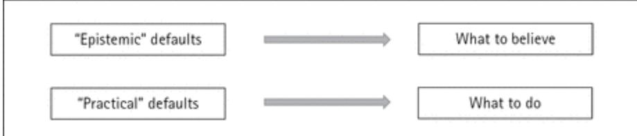
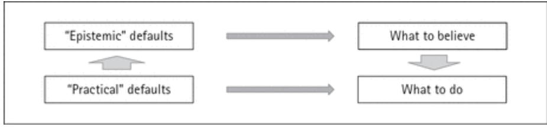

### **The Oxford Handbook of Reasons and Normativity**

The Oxford Handbook of Reasons and Normativity *Edited by Daniel Star*

Print Publication Date: Jun 2018 Subject: Philosophy Online Publication Date: Jul 2018

First Edition published in 2018

ISBN 978–0–19–965788–9

## **(p. xi) Contributors**

**Corine Besson** is a Lecturer in Philosophy at the University of Sussex and the Director of the Centre for Logic and Language (CeLL) at the Institute of Philosophy, School of Advanced Study, University of London. She is currently writing a book for Oxford University Press entitled *Logic, Reasoning, and the Tortoise*, which is in large part concerned with the relevance of Lewis Carroll's regress argument (in his *Mind* 1895 paper "What the Tortoise Said to Achilles") to the philosophy of logic.

**Aaron Bronfman** is Associate Professor of Philosophy at the University of Nebraska– Lincoln.

**John Broome** is Emeritus White's Professor of Moral Philosophy at the University of Oxford.

**John Brunero** is Robert R. Chambers Distinguished Professor of Philosophy and the Moral Sciences at the University of Nebraska–Lincoln.

**Krister Bykvist** is Professor of Practical Philosophy at the Department of Philosophy, Stockholm University, and Research Fellow at the Institute for Futures Studies, Stockholm.

**Roger Crisp** is Uehiro Fellow and Tutor in Philosophy at St Anne's College, Oxford, Professor of Moral Philosophy at the University of Oxford, and Professorial Fellow at the Centre for Moral Philosophy and Applied Ethics at the Australian Catholic University. He is the author of *Mill on Utilitarianism* (1997), *Reasons and the Good* (2006), and *The Cosmos of Duty: Henry's Sidgwick's* Methods of Ethics (2015). He is currently writing a book on morality and self-interest in British moral philosophy from Hobbes to Bentham.

**Garrett Cullity** is Hughes Professor of Philosophy at the University of Adelaide. He is the author of *The Moral Demands of Affluence* (Oxford University Press, 2004) and *Concern, Respect and Cooperation* (Oxford University Press, 2018), and a co-editor (with Berys Gaut) of *Ethics and Practical Reason* (Oxford University Press, 1997).

**Terence Cuneo** is Marsh Professor of Intellectual and Moral Philosophy at the University of Vermont.

**Caitrin Donovan** is a PhD student in the School for History and Philosophy of Science at the University of Sydney.

**(p. xii) J. L. Dowell** is a Professor of Philosophy at Syracuse University. Her areas of expertise include philosophy of language, philosophy of mind, metaphysics, and metaethics.

**Cordelia Fine** is Professor in the School of Historical and Philosophical Studies at the University of Melbourne.

**Joshua Gert** is Leslie and Naomi Legum Professor of Philosophy at The College of William and Mary. His work on rationality and reasons includes *Brute Rationality*

(Cambridge University Press, 2004) and *Normative Bedrock* (Oxford University Press, 2012).

**Hannah Ginsborg** is Professor of Philosophy at the University of California, Berkeley.

**Kathrin Glüer** is Professor of Theoretical Philosophy at Stockholm University, Sweden. She mainly works in the philosophy of mind and language, with occasional forays into epistemology.

**Sanford Goldberg** is Professor of Philosophy at Northwestern University. His research focuses on epistemology and philosophy of language. Recent books include *Anti-individualism* (Cambridge University Press, 2007), *Relying On Others* (Oxford University Press, 2010), *Assertion* (Oxford University Press, 2015), and *To The Best Of Our Knowledge* (Oxford University Press, 2017).

**Anandi Hattiangadi** is Professor of Philosophy at Stockholm University and Pro Futura Scientia Fellow at the Swedish Collegium of Advanced Studies.

**John Hawthorne** is Professor of Philosophy at the University of Southern California.

**Ulrike Heuer** is a Reader in Philosophy at University College London.

**John Horty** is Professor of Philosophy at the University of Maryland.

**Paul Katsafanas** is Associate Professor of Philosophy at Boston University. He has published a number of articles on action, ethics, moral psychology, and nineteenthcentury philosophy. He is the author of *Agency and the Foundations of Ethics: Nietzschean Constitutivism* (Oxford University Press, 2013) and *The Nietzschean Self: Moral Psychology, Agency, and the Unconscious* (Oxford University Press, 2016).

**Antti Kauppinen** is an Academy of Finland Research Fellow at the University of Tampere. He has previously held positions at the University of St Andrews, University of Amsterdam, and Trinity College Dublin. He works largely in ethics and metaethics, in particular on topics like well-being, meaningfulness, moral sentimentalism, and practical rationality.

**Stephen Kearns** is Associate Professor of Philosophy at Florida State University.

**Jeanette Kennett** is Professor of Philosophy at Macquarie University in Sydney.

**Niko Kolodny** is Professor of Philosophy at the University of California, Berkeley.

**(p. xiii) Jonathan L. Kvanvig** is Professor of Philosophy at Washington University in St. Louis.

**David Liebesman** is an Associate Professor of Philosophy and Linguistics at the University of Calgary.

**Clayton Littlejohn** is Reader in Philosophy at King's College London. He has published on a number of issues including the internalism/externalism debate in epistemology, the ontology of reasons, and the relationship between practical and theoretical reason. He is the author of *Justification and the Truth-Connection* (Cambridge University Press, 2012).

**Errol Lord** is an Assistant Professor of Philosophy at the University of Pennsylvania. He is the author of *The Importance of Being Rational* (forthcoming from Oxford University Press) and co-editor (with Barry Maguire) of *Weighing Reasons* (Oxford University Press, 2016), along with articles in *Mind, Philosophy and Phenomenological Research* and *Oxford Studies in Metaethics*. In 2013 he won the Marc Sanders Prize in Metaethics.

**Ofra Magidor** is Waynflete Professor of Metaphysical Philosophy at the University of Oxford.

**Andrew McGonigal** holds a visiting position in philosophy at Washington and Lee University. Before taking up the position, he taught for twelve years in the Philosophy Department at the University of Leeds. He is a co-editor of the *Routledge Companion to Metaphysics*, and in 2014–15 was awarded a Society Fellowship at the Society for the Humanities, Cornell University.

**David McNaughton** is Professor Emeritus of Philosophy at Florida State University and at Keele University. He is the author of *Moral Vision* (1988) and (with Eve Garrard) of *Forgiveness* (2010), and of a number of papers on ethics, philosophy of religion, and the relations between the two. He has recently finished editing Joseph Butler's moral writings for Oxford University Press, and is currently writing a book with Piers Rawling on their approach to practical reasons.

**Shyam Nair** is Assistant Professor of Philosophy at Arizona State University.

**Jonas Olson** is Professor of Practical Philosophy at Stockholm University. He has published extensively on metaethics and the history of moral philosophy. He is the author of *Moral Error Theory: History, Critique, Defence* (2014) and co-editor of *The Oxford Handbook of Value Theory* (2015), both published by Oxford University Press.

**Hille Paakkunainen** is Assistant Professor of Philosophy at Syracuse University.

**Douglas W. Portmore** is Professor of Philosophy at Arizona State University. He is the author of *Commonsense Consequentialism: Wherein Morality Meets Rationality* (Oxford University Press, 2011). He is currently working on his second book: *Opting for the Best: Oughts and Options*.

**Piers Rawling** is Professor and Chair of Philosophy at Florida State University. He has wide-ranging interests, and has published papers on decision theory, ethics (with **(p. xiv)** David McNaughton), philosophy of language, various other areas of philosophy, and quantum computing (with Stephen Selesnick). He is co-editor (with Alfred Mele) of *The Oxford Handbook of Rationality* (2004), and is currently writing a book with David McNaughton on their approach to practical reasons.

**Andrew Reisner** is a Senior Lecturer and Associate Professor in Practical Philosophy at Uppsala University. He is co-editor (with Iwao Hirose) of *Weighing and Reasoning: Themes from the Work of John Broome* (2015) and (with Asbjørn Steglich-Petersen) *Reasons for Belief* (2011). In addition he has published articles and book chapters on topics in practical and theoretical reason, value theory, metaethics, and food ethics.

**Mark Schroeder** is Professor of Philosophy at the University of Southern California. His work ranges across metaethics, normative ethics, epistemology, philosophy of language, and related areas.

**Andrew Sepielli** is Associate Professor of Philosophy at the University of Toronto. He has published papers in normative ethics, metaethics, and the philosophy of law, and is writing a book entitled *Significance without Substance: In Defence of Pragmatist Quietism in Meta-Ethics*.

**Declan Smithies** is Associate Professor of Philosophy at the Ohio State University.

**Ernest Sosa** is Board of Governors Professor at Rutgers University.

**Nicholas Southwood** is Associate Professor of Philosophy at the Australian National University. He works mainly in moral and political philosophy.

**Daniel Star** is Associate Professor of Philosophy at Boston University. He is the author of *Knowing Better: Virtue, Deliberation, and Normative Ethics* (Oxford University Press, 2015).

**Philip Stratton-Lake** is Professor of Philosophy at Reading University. He is the author of *Kant, Duty, and Moral Worth* (Routledge, 2000) and editor of *Ethical Intuitionism: Re-evaluations* (Clarendon Press, 2002), W. D. Ross's *The Right and the Good* (Clarendon Press, 2002), and *On What We Owe to Each Other* (Blackwell, 2004).

**Bart Streumer** is Professor of Philosophy at the University of Groningen. He is the author of *Unbelievable Errors: An Error Theory About All Normative Judgements* (Oxford University Press, 2017).

**Kurt Sylvan** is Assistant Professor of Philosophy at the University of Southampton. He received his PhD in 2014 from Rutgers University. He works in epistemology and the philosophy of practical reason, and has published papers in these areas in journals such as *Mind, Philosophy and Phenomenological Research, Philosophical Studies*, and *Philosophical Quarterly*. He is currently co-editing the *Routledge Handbook of Practical Reason* with Ruth Chang.

**(p. xv) Christine Tappolet** is Full Professor in the Philosophy Department at the Université de Montréal. Her research interests lie mainly in metaethics, moral psychology, and emotion theory. She recently published *Emotions, Values, and Agency* (Oxford University Press, 2016).

**Sergio Tenenbaum** is Professor of Philosophy at the University of Toronto.

**Pekka Väyrynen** is Professor of Moral Philosophy at University of Leeds.

**Benjamin Wald** recently completed his PhD at the University of Toronto. His main research interests are in metaethics, moral psychology, and the philosophy of action.

**Jonathan Way** is Associate Professor of Philosophy at the University of Southampton.

**Ralph Wedgwood** is Professor of Philosophy at the University of Southern California. He previously taught at the Massachusetts Institute of Technology and at Merton College, University of Oxford. He is the author of *The Nature of Normativity* (Oxford University Press, 2007), *The Value of Rationality* (Oxford University Press, 2017), and of many articles on ethics, epistemology, and the theory of rational choice and practical reason.

**Åsa Wikforss** is Professor of Theoretical Philosophy at Stockholm University, Sweden. She mainly works in the philosophy of mind and language, with occasional forays into epistemology.

**Eric Wiland** is Professor in the Department of Philosophy at the University of Missouri–St. Louis. He is the author of *Reasons* (2012) and the chief organizer of the St. Louis Annual Conference on Reasons and Rationality (SLACRR).

**(p. xvi)**

Daniel Star The Oxford Handbook of Reasons and Normativity *Edited by Daniel Star*

Print Publication Date: Jun 2018 Subject: Philosophy, Moral Philosophy, Philosophy of Mind, Epistemology, Philosophy of Language Online Publication Date: Jul 2018 DOI: 10.1093/oxfordhb/9780199657889.013.1

--- 

# Introduction

*Daniel Star*

### **Abstract and Keywords**

The purpose and plan of the Handbook is described herein. Key concepts in the contemporary literature on reasons and normativity are introduced, and the forty-four chapters that make up the main body of the Handbook are each summarized. In the process, important connections between the chapters are highlighted. A distinctive feature of the Handbook is said to be the way in which it surveys work on normative reasons in both ethics and epistemology, focusing, when appropriate, on issues concerning unity or lack of it in different domains. It is noted that discussions of reasons and normativity in philosophy of language, philosophy of mind, and aesthetics are also surveyed in the Handbook.

Keywords: reasons, reasoning, normativity, explanation, evidence, motivation, desires, beliefs, deliberation, ethics, epistemology

People do the various things they do for reasons. To say this is not the same as to say, of the various things that people do, that there are reasons why they do them. If a wealthy person steals money from another person in order to add to her own wealth, then it might be true to say that a *reason why* she behaves in this manner is that she is greedy (that is to say that she behaves as she does *because* she is greedy). But the fact that a particular person is greedy is clearly not itself a *reason to* steal—not even a reason for that person to steal—as it does not in any way justify stealing. Such a person is, no doubt, overlooking or failing to properly take into account important reasons not to steal, and we might even wish to go so far as to say that she is mistaken in thinking she really has any reason at all to steal money; but, insofar as she is purposely taking money away from another person, she will take herself to be acting on a reason (even if she is merely responding to the fairly superficial consideration that she will thereby herself come to possess more money).

People also believe the various things they believe for reasons, and to say this is not the same as to say, of the various things that people believe, that there are reasons why they believe them. A reason why a particular person believes in creationism may be that she was brought up in a creationist community. But the fact that a person is brought up in a

creationist community is not, in itself, a reason to believe in creationism—not even a reason for that person to believe in creationism. The fact that generally trustworthy people in her community have told her that creationism is true, on the other hand, may provide this person with reasons to believe in creationism. Still, there are plenty of reasons not to believe in creationism, provided by evidence that it is a false view (at least on the assumption that such evidence is available to the person in question).

Reasons to do and to believe various things are generally termed *normative reasons*. They are distinguished not only from a very general class of *explanatory reasons*—which include explanations of the movements of the clouds, the melting of the polar icecaps, etc. —but also from *motivating reasons*. 1 If there is not, in fact, any money in an otherwise worthless bag stolen from another person, but our thief inappropriately believes **(p. 2)** that there is, she can be said to merely have a motivating reason for her act of stealing money that does not correspond to any genuine normative reason to steal (this would also be true if there is money in the bag and the correct ethical view to have about the case is that the fact that she will thereby have more money does not provide even a partial justification for her act). That is to say that she might, in her ignorance, offer up as a reason for committing her act the merely apparent justification that she will thereby ensure she has more money. Roughly speaking, motivating reasons are the reasons we take to provide some justification for our acts, normative reasons are the reasons that really do provide some justification for our acts. When things are going well, these align. Any talk of reasons herein that is left unqualified should be read as being about normative reasons.

In recent years, the study of normative reasons has been a subject at the forefront of a large body of work in ethics and, to a somewhat lesser extent, epistemology.2 To a significant degree, the discussion of reasons that flowered in ethics after the publication of Bernard Williams's "Internal and External Reasons" in 1979 has gone on in isolation from the discussion of reasons in epistemology.3 One overarching aim of the present volume is to assist in remedying this situation by bringing together the latest work being done on reasons and normativity in these two subfields, as well as by including chapters that explicitly address similarities and differences between the way reasons and normativity are or should be approached in each area. In addition, since discussion of reasons and normativity are not restricted to ethics and epistemology—one of the fascinating things about the concept of a reason is that it crops up all over the place—it was thought essential to also include chapters that focus on discussions concerning reasons and normativity in other subfields, especially philosophy of language, philosophy of mind, and aesthetics.

Many philosophers now take reasons to be the most fundamental entities in the domain of normativity (or take the concept of a reason to be the key to understanding normativity) rather than, say, facts about what we ought to do (or the concept of ought).4 That being said, the view that reasons are fundamental to normativity has not gone uncontested (most notably by John Broome 2004, and Chapter 13 in the present volume). It is widely appreciated that this is not a view that can simply be taken for granted. Still, a weaker claim to the effect that there are highly interesting connections **(p. 3)** worth studying between reasons and normativity seems close to undeniable; it applies as much to Broome's

view as it does to the *reasons fundamentalism* of Tim Scanlon (1998) and Derek Parfit (1997, 2011), for instance. This is a key reason for the dual focus on reasons and normativity in this Handbook.

Not all the chapters in the Handbook are concerned with reasons, or even with the weak relation between reasons and normativity just mentioned. Some contributors are concerned to foreground discussions of normativity that have been framed in terms of what we *ought* to do or believe. Some discuss norms of *rationality* that tell individual agents what they are rationally required or permitted to do, intend, or believe, given their other commitments. Discussion of rational requirements is often couched in the language of "ought," although it has been claimed that it is a live question whether such requirements are genuinely normative—that is, whether rationality is itself normative—and for this reason it is sometimes thought best to stick to a neutral language of requirements and permissions when describing the prescriptions of rationality (Kolodny 2007, Broome 2013). This is just to point to one important way in which relations between a wide range of concepts that are at least in the general vicinity of "reason"—"ought," "rationality," "reasonable," "reasoning," "duty," "norm," and "normativity" itself—are themselves the subject of much disagreement.

The Handbook is intended for both students and experts. Students will no doubt find it helpful to approach this volume by routes that are different from those of the experts. I recommend, in particular, that students who are new to the study of reasons start with Part II of the volume, rather than Part I. The chapters in Part I have been placed at the beginning of the volume due to the fact that they address highly general foundational and structural issues. The chapters in Part II, on the other hand, focus on the way reasons feature in action explanations, and on the much-discussed distinctions between internalism and externalism, and motivating and normative reasons; students new to the study of reasons usually start by learning about these distinctions, and why they are important.

Part I, "The Structure of Normativity," begins with a contribution from Ralph Wedgwood, who argues for the contentious and interesting claim that what is fundamental to normativity in general is best understood to be a property possessed by a certain class of concepts: normative concepts are those concepts that play an essentially reasoning-guiding role. There will be facts that make true some thoughts that use these concepts, and these may be called normative facts. Wedgwood provides some grounds for thinking that we should not begin with reasons when trying to understand the normative domain, nor search after a basic normative concept. He also considers some important objections to his account of normativity.

Mark Schroeder, who is a well-known advocate of an alternative, *reasons first* approach, where we think of reasons as the building blocks of normativity in both the practical and epistemic domains, explores the question as to what unifies reasons for action and reasons for belief (what makes them all reasons?).5 He argues against **(p. 4)** attempts to model the behavior of all reasons on the behavior of reasons for action, as well as attempts to model the behavior of all reasons on the behavior of reasons for belief, describing what

he takes to be some of the most distinctive features of each kind of reason in the process. His arguments make use of John Horty's (2012) default logic, a logic that Schroeder believes is instructive when it comes to attempting to understand the structure of reasons in general.

In the third chapter in this section, Shyam Nair and John Horty investigate some key issues concerning how best to understand the logic of reasons, in a manner not constrained by adherence to Horty's own default logic. In particular, they aim to reach a better understanding of how reasons are related to each other than is provided by a commonly assumed "weighing conception of reasons," according to which the main relation between reasons is that of being outweighed (on this conception, what we ought to do or believe is determined simply by weighing reasons to do or believe the act or proposition in question against reasons not to do or believe the act or proposition in question). It is worth noting here that, insofar as reasons for belief, in particular, most clearly admit of "undercutting"—a kind of defeat that is distinct from "outweighing," as reasons disappear when there is undercutting, but not when there is outweighing—Nair and Horty are part of the shift in work on reasons in the direction of giving epistemological matters their fair due.6

In their chapter on normative language, Aaron Bronfman and J. L. Dowell focus primarily on the meaning of "ought," which some philosophers take to be the most fundamental normative term. They argue for a particular contextualist account of the semantics of deontic modal expressions derived from an account first proposed by Angelika Kratzer (2012, and earlier work cited by Bronfman and Dowell). This may be viewed as a sophisticated descendant of the older idea that there are many different senses of "ought." They then consider what accepting this account would mean for our understanding of reasons, concluding that its a virtue of their account that it leaves open what the correct answers to many substantive questions concerning reasons are.

Where the preceding chapter mainly explores the language of "ought," John Hawthorne and Ofra Magidor's contribution pays careful attention to the way ordinary speakers talk about reasons. They argue, partly on this basis, that it is useful to distinguish between possessed and unpossessed reasons (we sometimes, although not invariably, refer to possessed reasons through talk of people "having" reasons), and that when **(p. 5)** an agent possesses a reason to do or believe something, she knows the fact that is her reason. Regarding motivating reasons, they argue that in cases where agents lack knowledge in the relevant respects, they act on no motivating reason at all. Finally, they consider how to adjudicate between two substantive accounts of the nature of reasons: John Broome's explanation-centered account (2004), and the evidence-centred account proposed by Stephen Kearns and myself (Kearns and Star 2008, 2009).

The chapters in Part II, "Reasons, Motivation, and Action Explanation," focus on various ways in which normative reasons might be thought to be connected to, or constrained by, the internal motivational states, abilities, or intentional behavior of agents. Hille Paakkunainen discusses the current state of the internalism debate, focusing on two significant components of Williams's internalism. The first of these is the view that it is a necessary

condition of any consideration being a reason to do a particular act that the relevant agent can do the act in question *because* of the consideration in question (the "explanatory constraint"); the second is the view that it is a necessary condition of any consideration being a reason to do a particular act that there must be a possible deliberative route that the relevant agent can use that would lead the agent to do the act in question *because* of the consideration in question (the "deliberative constraint"). In offering a fresh defense of these views, Paakkunainen responds to objections provided by recent critics.7

David McNaughton and Piers Rawling discuss a wide range of views concerning the nature of motivating reasons and normative reasons, defending an externalist "two-tier" view of normative reasons, and a form of realism they call "practical normative realism" against internalist and anti-realist opponents. They cover a lot of ground (some of it also covered in the other four chapters in this part of the Handbook), before arguing against the prima facie plausible view that one ought to do what one has most reason to do.

Eric Wiland further explores the nature of motivating reasons, focusing on the question as to whether or not motivating reasons are best understood to be (combinations of) psychological states. After exploring a range of psychologistic and non-psychologistic options in this debate—the two main ones being located in Davidson (1963) and Dancy (2003)— Wiland endorses "naïve action theory," a view according to which motivating reasons are themselves actions (to use one of his examples: I'm buying some balloons *because* I'm throwing a retirement party), hence are only partly psychological.

Benjamin Wald and Sergio Tenenbaum focus on the causal theory of action defended by Davidson (1963) in their chapter on reasons and action explanation. According to this theory, motivating reasons (or what, as Wald and Tenenbaum point out, Davidson calls "primary" reasons) are belief–desire pairs, and these belief–desire pairs both rationalize and cause our actions. When things go well, they represent normative reasons, which we can thus be said to be acting on (Wald and Tenenbaum do not address the **(p. 6)** thorny issue of what we should say about motivational reasons and action explanations when things do not go well in this respect, but Wiland addresses this issue in the previous chapter). Although this theory is very popular, it has been recognized since its inception that it faces a problem in the form of a concern about deviant causal chains: it seems possible for any relevant belief-desire pair to cause the agent to behave in the way we might expect her to behave if she were acting on the relevant reason, but for this not to count as acting on the relevant reason (due to a course of events that circumvents agential control). Wald and Tenenbaum suggest that a key component of a solution to this problem is the idea that action has a constitutive or formal aim (for more on this idea, see Chapter 16)—if all actions contain a certain motive, then the presence of this motive throughout a course of action will mark the difference between deviant and non-deviant cases.

Finally, Bart Streumer presents a series of arguments for the very plausible view that it is a necessary condition for any consideration counting as a reason to perform an act that the agent in question be able to perform the act (although it is not the primary goal of his chapter, he also contends that a similar claim holds of reasons for belief). He ends by sug

gesting that it may, in fact, be of the essence of normative judgments, as compared to merely evaluative judgments, that they are appropriate only when agents can perform the acts in question.

Part III, "Reasons Fundamentalism," is concerned with accounts of normative reasons that take reasons to be fundamental to normativity, and not capable of further explanation, and with how they fare in relation to competing accounts of reasons. It opens with a chapter by Jonas Olson on the metaphysics of reasons that compares two varieties of nonnaturalism concerning the reason relation (robust realism, and the quietist realism defended, in different ways, by Parfit 2011 and Skorupski 2010), first with each other, and then with an important naturalist alternative (Schroeder's 2007 hypotheticalism). Olson concludes, tentatively, that the turn to reasons may not provide much help in moving beyond longstanding metaethical debates regarding competing forms of realism and anti-realism.

Philip Stratton-Lake focuses on the question of whether the concept of a reason is a basic normative concept, concluding that it is, but also that it is not the sole fundamental normative concept. Along the way, he defends the so called "buck-passing" account of goodness, according to which goodness can be defined in terms of reasons, responding to two serious objections to this account. Although this account of goodness (defended, most famously, by Scanlon 1998), if correct, would not in itself establish that reasons are fundamental, it clearly provides them with a crucial explanatory role. Stratton-Lake also criticizes the attempts to explain reasons in terms of "ought" favored by Broome and by Kearns and Star.

In his contribution to the Handbook, John Broome focuses on reasons fundamentalism, and the ought fundamentalism that he contends does a much better job of locating the foundation of normativity. He argues that the best form of reasons fundamentalism is the view that the fundamental normative feature is the relation that holds **(p. 7)** between a person and an act (or something else represented by a verbal phrase, such as a belief) when a person has reason to do the act in question (or believe, etc.), rather than the view that the property of being a reason is the fundamental feature of normativity. In the course of these arguments, Broome discusses the significance of the relation of *having reason to*—where "reason" is treated as a mass noun, rather than a count noun—which, he notes, may have been acknowledged by Nagel (1970), and has been explored in detail in recent work by Daniel Fogal (2016).

In Part IV, "Reasons Explained," which focuses on various approaches for explaining what normative reasons are, John Brunero first continues the discussion of Broome's account of reasons, as well as the alternative account favored by Kearns and Star. Both of these accounts promise to explain reasons in other terms. The first appeals to a special notion of a weighing explanation of ought facts, and the second to the idea that ordinary facts can be evidence concerning what we ought to do or believe. Using a range of examples, Brunero argues that neither of these accounts, nor a third account, where reasons are un

derstood to be facts that explain why a particular action or belief would be good in some respect, can deliver on what they promise.

This is not the place to offer a substantial response to the criticisms Brunero offers here of the account of reasons that Kearns and I defend (*reasons as evidence*), but some readers may find it helpful if I say something very brief in response. Some of Brunero's criticisms of this account (as well as one of Stratton-Lake's criticisms in Chapter 12, and a number of criticisms published elsewhere) appeal to intuitions about which facts can and cannot be reasons. In general, this type of criticism may be problematic. I think that what is going on in the debate at this point is that two jobs that reasons might be thought to perform in a pervasive, role-fixing manner are being given different emphases: arguably, the most important role that reasons play is that they guide us in our reasoning, but I do not wish to deny that some reasons (I call them fundamental reasons in Star 2015) are also in the fundamental favoring or right-making business. Other philosophers think that favoring of a non-epistemic kind is the (more) fundamental job of reasons. In a recent discussion of the evidence-based account of reasons, one can clearly tell that the author is taking for granted this second view when she writes, "But the fact that Henry ought to study for the exam is clearly not a normative reason for him to do his best in it: it does not count in favor of his doing his best in the exam" (Schmidt 2017: 712). However, this fact *does* count in favor in one sense: it's something that in some not unrealistic contexts it would be appropriate for Henry to use as a guide in his reasoning when he is trying to work out what he ought to do (one can say the same thing about the enablers discussed by Brunero). I agree that the relevant fact does not count in favor in a stronger sense than this, but why should we think only things that do so are reasons? Perhaps we should, but we won't settle this question by appeal to intuitions about cases (for some reasons to be suspicious of appeals to intuitions about which facts are and are not reasons, see Schroeder 2007). It's worth noting in this context that Kieran Setiya (2014) and Jonathan Way (2017) defend accounts of reasons that give the reasoning guiding role of reasons an even more central place in explaining **(p. 8)** what reasons are: roughly speaking, they take reasons to be appropriate premises in pieces of good reasoning.8

Nicholas Southwood surveys a number of approaches to explaining the existence of reasons that have been labeled "constructivist" by their supporters, and provides a new, improved characterization of constructivism. The "proceduralist" characterization that can be found in the work of John Rawls (1971) and Christine Korsgaard (1996), and Sharon Street's (2008) "standpoint" characterization are both found wanting. According to the first, truths about reasons depend on the actual or ideal application of a procedure, while, according to the second, truths about reasons depend on what is entailed from within particular evaluative standpoints. Southwood proposes that we instead understand constructivism to be the view that truths about reasons are dependent on prior standards of correct reasoning, and describes some of the advantages of doing so (including that both the proceduralist and the standpoint approaches can be adequately captured by this characterization).

Paul Katsafanas focuses on constitutivism, which might be considered a close cousin of constructivism.9 The constitutivist about practical reason claims that the justification of practical normative claims rests on a certain aim or standard that all actions possess in some essential fashion, and that reflects a fundamental commitment on the part of all agents, insofar as they act at all. Katsafanas surveys a range of attempts to make constitutivism work, and discusses a number of challenges that constitutivist theories face (of particular importance in this tradition is David Velleman's work, e.g. Velleman 2000). One of the forms of constitutivism that Katsafanas discusses is his own broadly Nietzschean view, according to which agents aim at full-blooded agential activity in every reflective action (this requires approval of one's own action, as well as that this approval would survive further knowledge concerning its etiology), and also aim at overcoming obstacles or sources of resistance in the pursuit of their ends.

In Part V, "Practical Deliberation," a variety of ways in which reasons for action are connected to practical reasoning or deliberation are explored in detail. Antti Kauppinen contrasts the approach to practical reasoning that takes it to be a rule-governed process that aims to meet various requirements of rationality with the approach to practical reasoning that takes it to be concerned with responding appropriately to apparent reasons. He contends that the latter is better than the former in some key respects (e.g. it better takes into account the perspective of the agent when reasoning), and that the former, in **(p. 9)** any case, veers toward the latter when rational requirements or permissions come to be construed in a diachronic rather than a synchronic manner. In part, the chapter may be read as a response to Broome's (2013) account of reasoning.

Garrett Cullity is similarly interested in the role that the process of responding to reasons plays in practical reasoning, and in particular in the way in which agents can be said to weigh reasons in their deliberations. He is much less sure than Nair and Horty (Chapter 3) that there is something wrong with a "simple" weighing picture of the way reasons are related to each other and to verdicts about what one ought to do, although he carefully considers some challenges to it, including the idea that reasons can be defeated in a manner which amounts to a kind of undercutting, rather than outweighing (what is said here about this issue is worth contrasting with what is said about it in Chapter 3). Other challenges include the idea that the weight of derivative reasons cannot be added to the weight of more fundamental reasons, the idea that incommensurability sometimes gets in the way of weighing reasons, and the idea that certain "exclusionary" reasons may be reasons not to be guided by other reasons. Cullity concludes that, while some small modifications concerning its account of the structure of reasons, and one significant modification concerning its account of rational deliberation, are required, the weighing picture remains intact.

The last two chapters in this section of the Handbook move on from the reasoning theme to consider special features of the part of deliberation that is concerned with the making of choices. One of the key ways in which we might think the simple weighing picture is flawed is explored in detail by Joshua Gert. It seems that when we make choices, we are often confronted with situations where there are many equally rational options, any of

which might reasonably be pursued. Gert considers the question of how this can be true if the rational status of an option is simply a function of the weights of the applicable reasons, as well as the question of how it is possible to make choices in such situations that are not simply arbitrary. He considers four strategies for addressing these questions, including the idea that focusing on incommensurability might help (here he discusses Ruth Chang's influential work on this topic; see in particular Chang 2009), and his own idea that the justifying strengths and requiring strengths of practical reasons are separate and can come apart.

Stephen Kearns's contribution can be split in two. To begin with, Kearns explores the idea that when agents make choices, they choose for (apparent) reasons. After considering a number of arguments for and against this idea, he concludes that, at the very least, it is highly problematic. This is interesting, because one might have thought that something that seems so central to our lives—the making of choices—must itself be directly reasonsresponsive. The second half of the chapter focuses on popular reasons-responsive accounts of responsibility, highlighting reasons for thinking that the approach to understanding responsibility for our actions common to such accounts seems extremely plausible. Kearns then argues that these accounts of responsibility should accept that reasons are best understood as consisting in evidence of either the normative or evaluative status of actions. He concludes by discussing connections between the ideas explored in the two halves of the chapter.

**(p. 10)** The contributions to Part VI, "Reasoning and Rationality," are concerned with ways in which rational requirements or norms, reasoning, and reasons are related. Jonathan Way focuses on the relationship between reasons, practical as well as epistemic, and rational requirements of coherence. One way to explain why there is something wrong with having inconsistent beliefs or inconsistent intentions is to appeal to rational requirements that direct us not to have such beliefs or intentions. Way discusses some reasons for doubting that there are always reasons to conform to such norms. He then turns to consider some problems for the alternative way of explaining why there is something wrong with incoherence, developed by Kolodny (2007), which appeals to the idea that incoherence always ensures that you have an attitude you should not have, or lack an attitude you should have. Way concludes that it is too soon to declare either side the victor in this debate.

One of the most interesting essays discussed in the recent literature on reasoning and rationality is Lewis Carroll's "What the Tortoise Said to Achilles" (1895). Carroll highlights a skeptical concern with the use of rational principles when reasoning: how are we entitled to rely on rational principles in the absence of further reasoning that first establishes that we are so entitled? If this concern is taken seriously, a regress is quickly generated, since it seems there can be no end to the request for further justifications of the same kind. Corine Besson focuses on this regress problem, first attending to the issue of how best to interpret it (the description of it that I just provided rides roughshod over difficulties here), and then argues that the regress problem actually fails to establish anything substantive about the connection between acceptance of basic principles and reasoning that corresponds to them, at least in the absence of contentious and usually undefended assumptions.

In a chapter that bridges this section of the Handbook and the next, Clayton Littlejohn explores the relationship between epistemic reasons and epistemic rationality, providing a negative assessment of (internalist) evidentialism in the process. Evidentialism is prima facie attractive. It might be thought to provide a rough analogue to the simple weighing picture of reasons for action referred to above: what we rationally ought to believe depends on what the strongest evidence relations (reasons) are, where a subject's evidence is construed as supervening on the subject's non-factive mental states ("non-factive" so as to exclude wordly facts such as would need to be taken into account if one allowed knowledge to count as a mental state that can make a difference to a subject's evidence). Amongst other things, Littlejohn provides reasons for thinking that there is no escaping a need for substantive rational norms that directly provide us with reasons (he contrasts these "norm-reasons" with "evidential-reasons"). If he is right about this, reasons for belief cannot be simply identified with evidence, and the analogue of the simple weighing picture for reasons for belief is inadequate.

Part VII, "Epistemic Reasons," is concerned with the topic of reasons for belief. Kurt Sylvan and Ernest Sosa argue against the "reasons first" thesis that epistemic reasons are fundamental when it comes to epistemic normativity—they contend that the virtue-theoretic property of competence instead plays this fundamental role. That being said, they also contend that reasons for belief play an important mid-level role in the **(p. 11)** normative landscape. Like Hawthorne and Magidor in Chapter 5, they present a view about what is required in order to possess a reason, but they think that what is required for a reason to count as possessed is competence, rather than knowledge: this condition is weaker, as one can have competent or incompetent intuitions, where intuitions are understood to be attractions to assent that are not yet beliefs, and not themselves grounded in reasons. According to Sylvan and Sosa, possessed reasons (reasons one is competently responding to) ground facts about what one rationally ought to believe. They argue that propositional justification requires no less and no more than the possession of sufficient epistemic reasons, and that forming one's beliefs on the basis of such reasons is all that is required for doxastic justification.

Some worry that epistemic reasons, as distinct from practical reasons, are not normative at all. Kathrin Glüer and Åsa Wikfors address this issue by considering two views as to what might make reasons for belief normative. The first is the fundamentalist view that all that ensures that reasons for belief are normative is the fact that reasons for belief are not merely explanatory reasons, but normative reasons. This view takes it that the distinction between merely explanatory reasons and normative reasons can be applied to reasons for belief just as it has been applied to reasons for action. Glüer and Wikfors argue that this is not the case. The second view has it that reasons for belief are normative in virtue of their relation to facts concerning epistemic justification. Glüer and Wikfors distinguish between a weaker and a stronger version of this view, and argue that neither is compelling. Their conclusion is that the common assumption that reasons for belief are normative is not, in fact, well grounded. In this respect, they differ from the other contributors on this topic.

"Reasons first" approaches to epistemology certainly take reasons for belief to be normative. Errol Lord favors one such approach. Here he follows the lead of Schroeder (2015), although he claims to do a better job than Schroeder does of explaining the difference between true belief and knowledge by reference to reasons for belief. As is extremely well known in philosophy, Edmund Gettier (1963) established that justified true belief is not knowledge (or, at least, he established this as long as one sticks to a standard, traditional conception of justification). This spawned many attempts to provide a fourth and final necessary condition for knowledge. This research program has fallen out of favor (see Williamson 2000 for reasons to think this is as things should be), but Lord hopes to revitalize it. He argues for a condition on knowledge he calls "security." This is similar to a condition known as "safety," which has been much discussed in recent epistemology (Williamson 2000 again being pivotal here). Whereas the safety principle specifies a relatively simple anti-luck modal condition true beliefs need to satisfy if they are to be candidates for knowledge, the security principle is a modal condition that refers to objective reasons for belief that agents are in a position to access.

Following on from the preceding discussions of epistemic reasons in general, Part VIII, "Types and Sources of Reasons for Belief," turns to consider how it is that perception and testimony, in particular, provide us with reasons for belief, how knowledge and understanding are related to reasons for belief, and whether or not practical considerations ever provide us with reasons for belief. Declan Smithies focuses on **(p. 12)** perception, endorsing the commonsense view that perception is a key source of reasons for beliefs about the external world, and enquiring as to how and when perception provides such reasons, and what exactly these reasons consist in. He begins by arguing that there is a tight connection between rationality and the reasons for belief provided by perception (in passing, he endorses such a connection between reasons and rationality in general), then responds to some challenges to the idea that it's possible for perception to provide us with reason for belief. He subsequently compares two views concerning the conditions under which we access reasons for belief via perception. The first view is that perception provides us with reasons by providing us with knowledge of the external world, and the second view is that such reasons are provided via representations of the external world. Smithies argues that the second, "content" view is superior to the first, "knowledge" view, and proposes an ontology of reasons that fits well with the content view: reasons for belief are facts about one's own mental states that are luminous (luminous facts are those that one is in a position to know obtain when they do; crucially, actually knowing that they obtain is not required for the possession of reasons).

Sanford Goldberg surveys the literature on testimony with a key question in mind: when a person asserts something, does this, by itself, provide his or her audience with a reason to believe the proposition asserted, just as perception might be thought to immediately provide us with reasons for belief (this is a view about testimony that goes by the name "non-reductionism"), or must there first be in play independent reasons to accept that the assertion is being provided by a reliable source ("reductionism")? Goldberg identifies an attractive third option, "anti-individualism," which may or may not be combined with antireductionism about testimonial reasons. According to this view, it is a mistake to simply focus on the epistemic position of the individual recipient of testimony: the weight of the epistemic reason that is provided by a piece of testimony may (in part) be a function of the epistemic status of the mental states that stand behind the proposition being asserted in the first place.

Jonathan Kvanvig is much less sanguine than other contributors to the Handbook about the prospects in epistemology for reduction, or for the identification of a fundamental normative concept. The intellectual achievements that result in knowledge, understanding, and locating reasons for one's claims all seem to be of significant value, and it is unclear which of these, if any, is most basic. Kvanvig assesses various reductive options here, including the reasons first approach, the knowledge first approach, and the idea that understanding is a species of knowledge (regarding the first two topics, the discussion concerns issues also discussed in Chapters 5, 24, 26, and 27). Understanding is particularly interesting in the present context because its significance in our mental lives suggests that the general focus in epistemology on connections between justification, knowledge, and reasons may be overly narrow. At least, it will suggest this if the arguments Kvanvig surveys for thinking that understanding is not in fact reducible to knowledge succeed. In particular, it has been claimed, by Kvanvig himself (2003), that understanding, unlike knowledge, can be present in Gettier cases.

In his contribution to the Handbook, Andrew Reisner continues to explore a theme present in earlier work (especially Reisner 2007; 2008): he has for some time been **(p. 13)** arguing against the almost universally accepted view that there are no pragmatic reasons for belief (as distinct from reasons to do things to bring it about that we believe propositions, whose existence few doubt). Here he first surveys arguments for and against the view that all reasons for belief are evidential—and that therefore none are pragmatic concluding that the case for thinking that this is true is actually quite weak. Reisner then turns to discuss a number of arguments that speak in favor of the conclusion that there are pragmatic reasons for belief, including his own arguments, partly based on original thought experiments, as well as arguments from McCormick (2015) and Marušić (2015), amongst others.

Part IX, "Types and Sources of Reasons for Action," covers a swath of ways in which practical reasons may be divided up into different categories. The distinction between instrumental and non-instrumental reasons is one of the most frequently relied-upon distinctions in the literature, yet the account of instrumental reasons that Niko Kolodny presents here goes beyond much of the literature in one key way: he contends that it is a mistake to focus on necessary or sufficient means when providing such an account. We rarely reason in a way where we take a means to an end to be either completely necessary or completely sufficient for achieving some end. Rather, we typically take it that a range of means are more or less likely to bring about some end. In line with this observation, Kolodny argues for a principle, "General Transmission," that explains when it is that we have instrumental reasons to do things. This principle is designed to respect the idea that non-instrumental reasons transmit to reasons to take various means in ways that are probabilizing and non-superfluous. He ends by considering the issue of how instrumental reasons are related to instrumental rationality, assuming General Transmission is correct (see also the discussion of Kolodny's work in Chapter 21).

Doug Portmore attempts to answer the question of whether or not all reasons are "teleological," paying close attention to practical reasons, but also considering epistemic reasons. According to Portmore's definition, a teleological reason is a reason to do (or believe) a certain thing that is a reason in virtue of the fact that doing the act in question (or believing the proposition in question) either would itself promote a certain end (in which case the reason is a "direct" teleological reason) or is appropriately related to something else that would promote that end (in which case the reason is an "indirect" teleological reason). There are various arguments that not all reasons can be teleological, and Portmore considers a number of them carefully. For instance, one might think that to say reasons for belief are teleological assimilates standard evidence-centered reasons for belief to pragmatic reasons for belief, or implies, counterintuitively, that one has reason to believe contrary to the evidence if doing so will promote the production of true beliefs in the long term. Or one might think that there is an important way of valuing people that cannot be understood in terms of promoting an end, and that we have reason to respect people by valuing them in this way. Portmore argues that such apparently non-teleological ideas can be "teleologized," that is, reframed in such a way that they are not exceptions to the thesis that all reasons are teleological, while ensuring that the basic insights behind them remain intact.

**(p. 14)** Andrew Sepielli discusses the distinction, endorsed by some philosophers and rejected by others, between "subjective" and "objective" reasons. Sometimes we focus on the reasons that people appear to have, given their beliefs and evidence (as when we might say a conscientious doctor with limited evidence available to her didn't act wrongly in prescribing a particular medicine, even though the medicine killed her patient). At other times, we focus on the way things really are in the world. One natural thought is that these are just two different, acceptable ways of talking about reasons. Sepielli calls people who think that there is no deep disagreement going on in such cases "Dividers," and people who think that we should adopt one, and not the other, way of talking about reasons, "Debaters." He provides a slew of considerations for and against the views of each, and makes some progress in adjudicating between them. Along the way, he discusses normative uncertainty (uncertainty as to what the correct normative view is), and points out that one attractive option is to be a Divider about reasons, but a Debater about moral obligation.

Roger Crisp explores the distinction between prudential and moral reasons, building on earlier work (especially Crisp 2006). He argues that moral reasons are those reasons that must be described in ineliminably moral terminology that answers to core moral emotions (e.g. blame, shame, and guilt). A number of views that self-consciously collapse the distinction between prudential and moral reasons, either in an egoistic or in an impartialist direction, are explored in detail. Despite the attractions of egoism and impartialism, many philosophers continue to try to make sense of the idea that we have both moral and prudential reasons, and Crisp outlines and assesses a range of "dualistic" options. As he does so, it becomes clear how difficult it is to do justice to both kinds of reasons, in theory and practice.

The distinction between "agent-relative" and "agent-neutral" reasons has received much attention in recent work in ethics, as philosophers have attempted to make sense of the structure of our ordinary moral commitments, and develop ethical theories that respect certain of these commitments (e.g. that I have much stronger reasons to help my friends than I have to help strangers, and that I have much stronger reasons to not lie than to ensure that other adults don't lie). Krister Bykvist argues that, despite the fact that the distinction has lately received a good deal of attention, it is still very unclear what exactly it amounts to. He surveys a range of options, and argues that none of them are satisfactory, at least if one is trying to provide a distinction for general use that does not rest on contentious assumptions in normative ethics.

Many of our practical reasons, especially our moral reasons, seem closely connected to general principles. There are principles that tell us what it is right or wrong to do, and principles that tell us what there is *pro tanto* reason to do, or to not do. Or so many of us think. Particularists (of one key variety) deny that principles have any kind of fundamental role to play in either ethical theory or practice (Dancy 1993, 2004). Pekka Väyrynen surveys the generalism-particularism debate concerning the role of moral principles and their relation to reasons. He distinguishes between two roles that principles might be thought to play: we can think of them either as standards that apply to our acts, or as guides that can be relied on when making decisions. Exploring these roles **(p. 15)** in turn, Väyrynen argues that in both cases sophisticated defenders of generalism have good responses available to particularist challenges. A significant resource available to generalists is the option of relying on hedged principles that admit of exceptions (e.g. it is generally wrong to lie), both when it comes to providing explanations of particular moral facts and when it comes to practical deliberation.

Most of the Handbook is concerned with reasons for action and reasons for belief, but Part X, "Reasons Difficult to Categorize," contains chapters that focus on domains where it seems attractive to say that talk of reasons is appropriate, but where it isn't at all obvious how best to classify the reasons in question. Ulrike Heuer begins this section with a discussion of reasons to intend actions. One might think it clear not only that such reasons are practical reasons (although some have argued that intentions are a special class of beliefs, and many accept that intentions are subject to more constraints with respect to related beliefs than desires are), but also that they simply mirror reasons for action. That is to say, one might think that reasons to intend to do any particular acts simply ride on the back of the reasons to do the acts in question. Heuer demonstrates that this claim faces serious hurdles. She distinguishes between the idea that whenever one has a reason to intend to do an act, there is reason to do that act, and the idea that whenever one has a reason to do an act, there is reason to intend to do that act (the mirroring claim combines these two ideas). The first idea seems to run afoul of certain "non-standard" reasons, often called "state-given" reasons, to intend (as may beliefs; see Chapter 30). The second idea is more widely accepted than the first (which is not to say that rejection of the first idea is now standard, by any means), but Heuer provides a number of original arguments that challenge it.

Rather than try to address all of the ways in which emotions may be thought to be related to reasons, Christine Tappolet focuses on the "perceptual theory" of emotion, according to which emotions are perceptual experiences of values, and considers what this theory might tell us about the relation between practical reasons and emotions. She begins by defending the theory against some popular competitors, and then argues that emotions enable us to track our practical reasons, and may even themselves be reasons-responsive, when a certain key condition is met. She contends that such reasons-responsiveness is even available in some cases where agents act akratically (that is, against their own better judgment), such as in the much-discussed Huck Finn case. The condition required for acting on an emotion in a reasons-responsive manner is a condition of virtuous "standby control": the relevant agent is disposed not to act on the emotion(s) in question if it would be reasonable for her to believe that doing so would prevent her from correctly tracking reasons (here Tappolet draws on Jones 2003).

Andrew McGonigal contends that aesthetic reasons include both practical and epistemic reasons. He discusses some of the complexities involved in trying to determine when exactly reasons get to count as aesthetic, before focusing on two important features of aesthetic reasons: they are connected to "pleasures-in-experience" in a distinctive way, and they are less authoritative than standard moral and epistemic reasons. With respect to the second of these features, McGonigal notes that it appears correct to describe aesthetic reasons as possessing it partly because there is much more room **(p. 16)** for faultless disagreements when it comes to such reasons, and also because we do not appear to have aesthetic duties. These observations most naturally lead to an ant-realist view concerning aesthetic reasons, but McGonigal also sketches a realist account of aesthetic reasons that might be thought to provide a reasonable alternative to aesthetic anti-realism.

The focus in Part XI, "Skepticism about Reasons," is on reasons for doubting that we are generally able to have proper epistemic access to normative reasons. Caitrin Donovan, Cordelia Fine, and Jeanette Kennett focus on a form of skepticism that receives support from recent empirical work in psychology that suggests, first, that our reasons for action are generally different than what we take them to be, and, second, that our ordinary reasoning is not generally able to arrive at reliable judgments about our reasons. They argue that, although such work does throw light on ways in which our reasoning about reasons is influenced by a host of factors that are such that they somewhat undermine our reliability, our explicit reasoning processes are more in control of moral cognition than such skepticism acknowledges.

Terence Cuneo assesses the "debunkers puzzle," which has been much discussed since Sharon Street's (2006) statement of it. As Cuneo construes it, this is the puzzle of understanding how moral realism can be squared with a naturalistic, evolutionary account of the development of our capacity for forming moral judgments. It takes a particularly stark form when the type of realism in question is non-naturalist, and when we focus on (apparent) moral knowledge. Cuneo argues that the debunker's puzzle can really only undermine moral non-naturalism if it relies on a strong and contentious claim about the way evolutionary forces have shaped our capacity for making moral judgments. He subsequently points out that the debunker may reinforce her view by contending that moral beliefs must be sensitive to the moral facts if they are to constitute knowledge, and that non-naturalists owe us a story about how this can be so. The chapter concludes with a positive non-naturalist proposal.

Part XII, "Normativity, Meaning, and the Mind," contains three chapters on possible ways in which normativity may be related to our use of concepts and language. Hannah Ginsborg's topic is the idea that our concepts, quite generally (not just the normative concepts discussed in Chapter 1), are themselves intrinsically normative, where this might be taken to mean either that they can be identified with rules or norms, or that their application is governed by rules or norms. After making it clear why we should think some proponents of the view that concepts are normative are really only committed to the second of these views, Ginsborg raises a problem for the stronger view that concepts can be identified with norms, and sketches a Kantian solution to this problem.

Where Ginsborg considers the prospects for two ways in which concepts might be thought to govern thinking in general, David Liebesman considers the prospects for two ways in which linguistic meaning might be thought to govern our speech in general. Following Kripke (1982), we might think that facts about meaning determine how we ought to speak, or following Davidson (1973), we might think that meaning facts are determined by norms of rationality (in the second case, meaning facts might be said to **(p. 17)** govern our speech in an intermediary fashion). Liebesman does not aim to decisively rule in or out either of these ideas, but clarifies some of the key challenges that they face. He finishes by stepping back from these views to consider how they are related to a number of different goals we might think a theory of meaning facts should pursue.

Anandi Hattiangadi (2007) has previously argued that meaning is not normative, in the first of the two senses that Liebesman discusses. In the final chapter of the Handbook, Hattiangadi focuses on the highly general problem of intentionality, which is the problem of explaining why any arbitrary sentence or thought has the particular semantic properties it has, rather than the semantic properties of some other sentence or thought. It might be thought that it will help to answer this "hard" question if we claim that intentionality itself is normative, but Hattiangadi argues that the "hard" problem remains even if intentionality itself is normative. On the way to this conclusion, she considers four different forms the view that intentionality is normative can take. She contends that there are good reasons to doubt that reference to normativity needs to be an ingredient in a reductive explanation of intentionality.

The philosophical literature on reasons and normativity continues to expand on a rapid basis, and I am only too aware of the fact that many significant contributions to this literature must go unmentioned here. At the same time, the fact that this body of literature is large and continuing to expand reflects the importance of this fairly new field of study, and the extent to which many interesting issues are being discussed within it. It is impossible to predict with any certainty where future contributions to this field will lead. Still, it seems a safe bet that work in this area in the near to medium future will, in addition to exploring narrowly focused issues in more depth, continue the trend of crossing sub-disciplinary boundaries in order to focus on metanormative issues, as well as the closely related trend of addressing the question of how best to construe the basic structural relations between a range of core normative and evaluative notions, and their extensions (reasons, ought, fittingness, goodness, rationality, etc.).10

## **References**

Alvarez, M. 2009. "How Many Kinds of Reasons?" *Philosophical Explorations* 12(2): 181– 93.

Bagnoli, C. 2017. "Constructivism in Metaethics." *Stanford Encyclopedia of Philosophy.* **https://plato.stanford.edu/entries/constructivism-metaethics/**

Broome, J. 2004. "Reasons." In R. Jay Wallace, M. Smith, S. Scheffler, and P. Pettit (eds), *Reason and Value: Themes from the Moral Philosophy of Joseph Raz*, 28–55. Oxford: Oxford University Press.

**(p. 18)** Broome, J. (2013). *Rationality Through Reasoning*. Oxford: Blackwell.

Brunero, J. (2017). "Recent Work on Internal and External Reasons." *American Philosophical Quarterly* 54(2): 99–117.

Carroll, L. (1895). "What the Tortoise Said to Achilles." *Mind* 4: 278–80.

Chang, R. (2009). "Voluntarist Reasons and the Sources of Normativity." In D. Sobel and S. Wall (eds), *Practical Reason and Action*, 243–71. Cambridge: Cambridge University Press.

Crisp, R. (2006). *Reasons and the Good*. Oxford: Clarendon Press.

Dancy, J. (1985). *Introduction to Contemporary Epistemology*. Oxford: Blackwell.

Dancy, J. (1993). *Moral Reasons*. Oxford: Blackwell.

Dancy, J. (2003). *Practical Reality*. Oxford: Oxford University Press.

Dancy, J. (2004). *Ethics Without Principles*. Oxford: Clarendon Press.

Davidson, D. (1963). "Actions, Reasons, and Causes." *Journal of Philosophy* 60(23): 685– 700.

Davidson, D. (1973). "Radical Interpretation." *Dialectica* 27(3–4): 313–28.

Fogal, D. (2016). "Reasons, Reason and Context." In E. Lord and B. Maguire (eds), *Weighing Reasons*, 74–103. Oxford: Oxford University Press.

Gettier, E. L. (1963). "Is Justified True Belief Knowledge?" *Analysis* 23: 121–3.

Ginsborg, H. (2006). "Reasons for Belief." *Philosophy and Phenomenological Research* 72(2): 286–318.

Hattiangadi, A. (2007). *Oughts and Thoughts: Rule-Following and the Normativity of Content*. Oxford: Oxford University Press.

Horty, J. F. (2012). *Reasons as Defaults*. Oxford: Oxford University Press.

Jones, K. (2003). "Emotion, Weakness of Will, and the Normative Conception of Agency." In A. Hatzimoyis (ed.), *Philosophy and the Emotions*, 181–200. Cambridge: Cambridge University Press.

Kearns, S. (2016). "Bearing the Weight of Reasons." In E. Lord and B. Maguire (eds), *Weighing Reasons*, 173–192. Oxford: Oxford University Press.

Kearns, S., and D. Star (2008). "Reasons: Explanations or Evidence?" *Ethics* 119: 31–66.

Kearns, S., and D. Star (2009). "Reasons as Evidence." *Oxford Studies in Metaethics* 4: 215–42.

Kolodny, N. 2007. "How Does Coherence Matter?" *Proceedings of the Aristotelian Society* 107(1): 229–63.

Korsgaard, C. (1996). *Creating the Kingdom of Ends*. Cambridge: Cambridge University Press.

Kratzer, A. (2012). *Modals and Conditionals*. Oxford: Oxford University Press.

Kripke, S. (1982). *Wittgenstein on Rules and Private Language*. Cambridge, Mass.: Harvard University Press.

Kvanvig, J. L. (2003). *The Value of Knowledge and the Pursuit of Understanding*. Cambridge: Cambridge University Press.

Markovits, J. (2014). *Moral Reason*. Oxford: Oxford University Press.

Marušić, B. (2015). *Evidence and Agency: Norms of Belief for Promising and Resolving*. Oxford: Oxford University Press.

McCormick, M. (2015). *Believing Against the Evidence: Agency and the Ethics of Belief*. New York: Routledge.

Nagel, T. (1970). *The Possibility of Altruism*. Oxford: Clarendon Press.

Parfit, D. (1997). "Reasons and Motivation." *Proceedings of the Aristotelian Society*, suppl. vol. 71(1): 99–130.

Parfit, D. (2011). *On What Matters*. 2 vols. Oxford: Oxford University Press.

Pollock, J. (1970). "The Structure of Epistemic Justification." *American Philosophical Quarterly* 4: 62–78.

**(p. 19)** Pollock, J. (1987). "Defeasible Reasons." *Cognitive Science* 11: 481–518.

Rawls, J. (1971). *A Theory of Justice*. Cambridge, Mass.: Belknap Press.

Raz, J. (1975). *Practical Reason and Norms*. London: Hutchinson.

Reisner, A. (2007). "Evidentialism and the Numbers Game." *Theoria* 73(4): 304–16.

Reisner, A. (2008). "Weighing Pragmatic and Evidential Reasons for Belief." *Philosophical Studies* 138(1): 17–27.

Ross, W. D. (1930). *The Right and the Good*. Oxford: Clarendon Press.

Scanlon, T. (1998). *What We Owe to Each Other*. Cambridge, Mass.: Harvard University Press.

Schmidt, E. (2017). "New Trouble for "Reasons as Evidence": Means that Don"t Justify the Ends." *Ethics* 127(3): 708–18.

Schroeder, M. (2007). *Slaves of the Passions*. Oxford: Oxford University Press.

Schroeder, M. (2015). "Knowledge Is Belief for Sufficient (Objective and Subjective) Reason." In T. S. Gendler and J. Hawthorne (eds), *Oxford Studies in Epistemology* 5, 226–52. Oxford: Oxford University Press.

Setiya, K. 2014. "What Is a Reason to Act?" *Philosophical Studies* 167(2): 221–35.

Skorupski, J. (2010). *The Domain of Reasons*. Oxford: Oxford University Press.

Smith, M. (1994). *The Moral Problem*. Oxford: Blackwell.

Star, D. (2015). *Knowing Better: Virtue, Deliberation, and Normative Ethics*. Oxford: Oxford University Press.

Star, D. (2018). "Reasoning with Reasons." In C. McHugh, J. Way, and D. Whiting (eds), *Normativity: Epistemic and Practical*, 241–59. Oxford: Oxford University Press.

Street, S. (2006). "A Darwinian Dilemma for Realist Theories of Value." *Philosophical Studies* 127: 109–66.

Street, S. (2008). "Constructivism About Reasons." *Oxford Studies in Metaethics* 3: 207– 45.

Velleman, J. D. (2000). *The Possibility of Practical Reason*. Oxford: Oxford University Press.

Way, J. (2017). "Reasons as Premises of Good Reasoning." *Pacific Philosophical Quarterly* 98(2): 251–70.

Williams, B. (1979). "Internal and External Reasons." Repr. in B. Williams, *Moral Luck*. Cambridge: Cambridge University Press, 1981, 101–113.

Williamson, T. (2000). *Knowledge and its Limits*. Oxford University Press. **(p. 20)**

## **Notes:**

[^1]: Both motivating reasons and normative reasons may be cited in explanations, as reasons why people do and believe the things they do and believe. For an earlier, helpful discussion of how motivating reasons, normative reasons, and explanatory reasons are related, see Alvarez (2009). For an earlier, helpful discussion of reasons for belief, see Ginsborg (2006).

[^2]: It is possible to recast traditional discussions in epistemology concerning justification as being about reasons for belief (just as it is possible to recast discussions of prima facie duty in Ross 1930 and elsewhere as being about moral reasons), so this comparative claim is really only a claim about the study of reasons approached as such. John Pollock's work (1970, 1987) provides an important early example of an epistemologist concerned to focus on reasons described as such.

[^3]: Other texts that were particularly influential around this time include Donald Davidson's "Actions, Reasons, and Causes" (1963), Thomas Nagel's *The Possibility of Altruism* (1970), and Joseph Raz's *Practical Reason and Norms* (1975).

[^4]: As a number of contributors point out, to say that reasons are fundamental to normativity must be understood as meaning something like the property of being a reason, or the reason relation, is the fundamental normative property or relation (see, in particular, Chs. 7, 11, and 13). The fact that you are in pain may correctly be said to be a reason to help you, but the ordinary fact that you are in pain is not itself a good candidate for a claim about what is fundamental to normativity.

[^5]: Mark Schroeder's *Slaves of the Passions* (2007) provides one of the best-known defenses of a Humean account of reasons for action. Such accounts explain the existence of reasons in terms of the desires of actual or idealized agents. Like Michael Smith (1994) before him, Schroeder believes a Humean account of reasons for action is compatible with moral realism. The reasons first approach to understanding normativity should not be confused with reasons fundamentalism; the first, but not the second, is open to there being an informative explanation available of what it is for something to be a reason (reason fundamentalists sometimes express their view by saying that the concept of a reason

is primitive). Schroeder (2015) also defends a reasons first approach to reasons for belief (see also Ch. 26).

[^6]: Nair and Horty mention, in passing, the historical role that Pollock (1970, 1987) played in highlighting the importance of the undercutting relation with respect to reasons for belief. It should also be said that Jonathan Dancy (1985, 1993, 2006) has been arguing for some time that reasons for action, as well as reasons for belief, admit of undercutting, as well as of a number of other relations that are distinct from weighing (see also Ch. 36).

[^7]: See Brunero (2017) for further discussion of Paakkunainen's chapter, as well as of the work of one of the key critics of Williams's form of internalism that Paakkunainen responds to, Julia Markovits (2014).

[^8]: For more on the reasoning or deliberation guiding role of reasons in relation to the *reasons as evidence* account of reasons, see Kearns, Ch. 20 this volume, Kearns (2016), and Star (2015: ch. 2; 2018). Regarding the criticisms that Brunero provides that spring from combining this account of reasons with the probability-raising account of evidence, I admit that these criticisms require us to give up on that account of evidence, to give up using that account of evidence to explain the weight of reasons, or to say something more complicated than we have in the past about how the weight of reasons is to be explained in terms of epistemic probability.

[^9]: Or, perhaps, a form of constructivism (Bagnoli 2017, for instance, characterizes constitutivism in this way).

[^10]: I owe a debt of gratitude to Barry Maguire and an anonymous reader for providing comments to the contributors on seven draft chapters each. I am also grateful to Bart Streumer, as well as a second, anonymous reviewer, for their feedback on the original book proposal. Around the same time I received this feedback, I benefited from informal conversations about the Handbook with John Brunero, Roger Crisp, Andrew Reisner, and Mark Schroeder, and I would like to thank them as well. Finally, I wish to express my gratitude to Peter Momtchiloff at Oxford University Press, for being a patient and supportive editor.

---

# 1. The Unity of Normativity

*Ralph Wedgwood*

### **Abstract and Keywords**

What is normativity? It is argued here that normativity is best understood as a property of certain concepts: normative thoughts are those involving these normative concepts; normative statements are statements that express normative thoughts; and normative facts are the facts (if such there be) that make such normative thoughts true. Many philosophers propose that there is a single basic normative concept—perhaps the concept of a reason for an action or attitude—in terms of which all other normative concepts can be defined. It is argued here that this proposal faces grave difficulties. According to a better proposal, what these normative concepts have in common is that they have a distinctive sort of conceptual role—a reasoning-guiding conceptual role. This proposal is illustrated by a number of examples: different normative concepts differ from each other in virtue of their having different conceptual roles of this reasoning-guiding kind.

Keywords: normativity, concepts, reasoning, conceptual roles, reasons

## **1.1 Senses of "Normative"**

What is normativity? How should we demarcate the domain of normative phenomena, and distinguish it from other non-normative domains? Of course, the term "normative" is a technical term; it is not in regular use by ordinary citizens on the street. So, philosophers who use the term need to make it clear in what sense they are using it. In fact, as I shall explain, not all philosophers use the term in the same sense. So, it is incumbent on me to clarify in what sense exactly I am using the term. (Since I mean to engage in a debate with other philosophers, I shall attempt to use the term in one of the senses that has become common among philosophers.)

Dictionaries define what is "normative" as what involves or pertains to a "norm." So, to understand the various technical meanings that philosophers have given to the term "normative," we may start by exploring the meanings that have been given to the word "norm."1

Philosophers seem to use the word "norm" in three main senses. In the first sense, a "norm" is something that in some way serves as a *model* or *standard*—that is, something that serves to *guide* people's thinking or behavior. The epistemologists John Pollock and Joseph Cruz (1999: 124) use the word in this sense when they speak of the "epistemic norms" that guide the processes in which we form or revise our beliefs. According to Pollock and Cruz, these "epistemic norms" are simply the procedures that we follow when thinking and reasoning competently. They explicitly compare the role that these norms play in our thinking to the role that *computer programs* play in guiding the operations of computers; and they insist that this role is crucially unlike the role played by an explicit set of rules in the thinking of a person who intentionally sets out to follow those rules.

**(p. 24)** In the second sense that is in use among philosophers, the word "norm" refers to what may be called *social norms*. Philip Pettit (1990) has proposed an illuminating definition of such social norms: a social norm is a *regularity* in the behavior of the members of a population that nearly all members of that population conform to—where this widespread conformity exists at least in part because nearly all members of the population *approve of* conforming to the regularity and *disapprove of* deviating from the regularity. This second sense of "norm" plays an important role in the branches of philosophy that describe and evaluate social institutions, such as the philosophy of law. For example, the "rules of obligation" discussed in the legal philosophy of H. L. A. Hart (1961: 85f.) seem to be social norms of this sort.

Arguably, everything that counts as a norm in the second sense must also count as a norm in the first sense too—since it is plausible that if a regularity counts as a norm in the second sense, it must also serve as a standard that in some way guides the thinking or behavior of the members of the relevant population. The phenomena that count as "norms" in at least one of these two senses seem to include: social and institutional rules—such as the rules of games, the rules that constitute legal systems, and the standards of etiquette —and publicly articulated policies and plans of various kinds, such as the rubrics of examinations; the commands of military leaders; or even a household's agreed shopping list. In recent years, these phenomena have been described as exemplifying "*formal* normativity."2

Within ethics, however, a third sense of the term "norm" has now become common. When used in this third sense, a "norm" is a *general principle* about how people *ought* to think or act—where the term "ought" is understood in a sense that makes it appropriate to voice a distinctly serious sort of *criticism* of those who fail to think or act as they ought to (this is the sense of "ought" in which it seems to be *akratic*—in a distinctive way, *irrational*—to act contrary to one's own beliefs about how one ought to act).3 It seems that this third sense of "norm" emerged from the first, since general principles about how we ought to think or act can sometimes serve to guide our thinking or behavior. We can see the emergence of this third sense where Kant (1785: 390) describes the moral law as the "guideline and supreme norm for making correct judgments about morals." Here Kant uses the word "norm" as a near-synonym for "guideline," and so he here seems to be using it in the first of the three senses that we listed above. But even though he uses the term in this first sense, he is applying the term to the *moral law*—which is a norm in the third

sense as well, since the moral law is presumably a general principle about how rational agents ought to act.

"Normativity" in this third sense is sometimes called "*robust* normativity," to distinguish it from the "formal normativity" that we have discussed earlier.4 At all events, it is in this third "robust" sense that I shall be using the term "normative" here.

## **(p. 25) 1.2 Normativity as a Feature of Concepts**

In the third sense, as I have just characterized it, a norm is a general principle about how people ought to act or to think. My formulation is deliberately ambiguous between three possible ways of interpreting what a "principle" is.

**a.** On one interpretation, a principle is a *linguistic* item, like a sentence (a string of words of a certain kind), or perhaps a speech act (such as an assertion) that is performed by uttering such a sentence in an appropriate context.

**b.** On a second interpretation, a principle is a general *fact* or *state of affairs*—the sort of item that is built up out of individuals, properties, and relations, and might make such a sentence true (relative to an appropriate context).

**c.** On a third interpretation, a principle is a *proposition* or *thought*—the sort of thing that is built up out of *concepts*, and can be the object of mental attitudes of various kinds, such as belief and the like.

In this section, I shall argue that, of these three interpretations, the third interpretation (c) is what we need to achieve an adequate understanding of normativity. In other words, normativity is fundamentally a feature of thoughts or propositions (or of the concepts that those thoughts or propositions are composed of); it is not fundamentally a feature of linguistic items like words, sentences, or speech acts, nor a feature of the constituents of the world like facts or states of affairs (or the properties and relations that those facts or states of affairs are composed of).

First, the sentences that can be used to make normative statements typically involve highly context-sensitive vocabulary. The sentence "He should be working in the library tonight" may in some contexts mean that working in the library is part of a course of action that the person in question has *overriding reason* to take; but in other contexts, it may only mean that it is *highly probable* that the person in question is working in the library. In contexts of the first sort, the sentence seems to have a normative meaning, while in contexts of the second sort its meaning is, at least arguably, non-normative. Similarly, one may say that a person is virtuous by saying that she is "good," but when one says that something is "gone for good," one is not referring to virtue, but simply saying that the thing in question is gone for evermore; again, the first utterance seems to be a normative statement, while the second seems to be a non-normative statement.

In general, the mere fact that a sentence involves terms like "should" or "good" is not enough to determine whether an utterance of the sentence on a particular occasion

counts as a normative statement or not. In general, it seems that whether or not the utterance of a sentence counts as a normative statement does not depend purely on the sentence itself; it depends on the *thought* or *proposition* that is expressed by the sentence on that occasion.

**(p. 26)** Secondly, there also seem to be problems with the view that what is fundamental to normativity is a certain family of normative *properties* or *relations*—or the normative *facts* or *states of affairs* that are built out of those normative properties and relations. For the sake of argument, let us assume that intrinsically normative states of affairs do indeed exist. Even so, the mere fact that a certain statement has a normative state of affairs as its content does not suffice to make the statement a normative statement; and the fact that a certain thought has a normative state of affairs as its content is also not enough to make it a normative thought.

The problem is that a normative state of affairs—or a normative property—could be presented in thought or in speech in the *wrong way* for the thought or statement in question to count as normative. There are various ways of arguing for this point. Some philosophers, for example, accept a *reductive naturalist* position about normativity. According to this position, the nature of each normative property can be analyzed by identifying the property with naturalistic property—that is, a property that can be picked out in wholly non-normative terms. For instance, perhaps the nature of the normative property of *acting rightly* can be analyzed by identifying it with the property of *maximizing happiness* which (let us assume) is a naturalistic property that can be picked out in wholly non-normative terms. According to this view, the state of affairs of a certain action's maximizing happiness just *is* the state of affairs of the action's being right; and so it is itself a normative state of affairs. Thus, if you state or think that an action maximizes happiness, your statement or thought has this normative state of affairs as its content. But in making this statement or having this thought, you surely need not be making any normative statement or having any normative thought.

Some philosophers may respond that this point is simply a *reductio ad absurdum* of the reductive naturalist position. But even if that position is false, it still looks as if it should be possible, at least in principle, for there to be a thought or statement that has a normative state of affairs as its content, even though the normative state of affairs is presented in the *wrong way* for it to make the thought or statement into a genuinely normative thought or statement. For example, suppose that some extraterrestrial life forms visit Earth, and begin secretly studying human beings. These extraterrestrials observe our use of the word "good," and consider various hypotheses about what property this word stands for. Eventually, these extraterrestrials introduce a word in their language, "schmood," by stipulating that it refers to that property (whatever it is) that the human word "good" stands for. Then if the extraterrestrials have a thought that they might express by describing some item as "schmood," the content of their thought is in fact the normative state of affairs that the item in question is good. However, it could be that when these aliens have this thought, it is not itself a normative thought at all.

For these reasons, then, it seems best to understand normativity as fundamentally a feature of certain *concepts*—the *normative concepts*. Normative thoughts and judgments are thoughts and judgments involving these concepts; normative statements are statements that express such normative thoughts; and normative states of affairs and normative properties and relations are the items (if such there be) that make such normative thoughts true. These normative concepts include all concepts that can be **(p. 27)** expressed by the relevant uses of terms like "ought," and all other concepts of fundamentally the same kind. The question that I shall try to answer here is what distinguishes the normative concepts from the non-normative concepts, and what all normative concepts have in common.

## **1.3 Paradigmatically Normative Concepts**

In the previous section, I suggested that the normative concepts include all concepts that can be expressed by "the relevant uses of terms like "ought". But which uses of "ought" are relevant here?

As we have already seen, it seems plausible that the term "ought" can express non-normative concepts as well as normative concepts. When we say "He ought to be working in the library tonight", we might only mean that it is highly *probable* that he is working in the library tonight. When the term is used in this way, it arguably does not express a normative concept.

The same point seems to hold even more clearly of the word "should," which in many contexts can express the same range of concepts as "ought." Here is the opening line of Rupert Brooke's poem "The Soldier":

If I should die, think only this of me: . . .

This occurrence of "should" clearly does not express a normative concept. (One reason for thinking this is that this occurrence of "should" cannot be replaced by "ought to" without radically changing the sense.) Similar points hold of the words in other languages that can express the same concepts as "should" in English.5 So which uses of "ought" do express genuinely normative concepts?

Philosophers seem to have in mind a particular way of using "ought" as the use that expresses the most *paradigmatically* normative concepts. Specifically, it seems, they are the concepts that are expressed by what I shall here call the "all-things-considered practical 'ought.' "

What exactly is this kind of "ought"? This all-things-considered "ought" is not the same as any distinctively *moral* "ought." If there is a distinctively moral "ought," judgments involving this moral "ought" would be normative or evaluative judgments of a special kind judgments based on considerations such as rights and duties, the importance of being fair and helpful toward others, and so on. But not every judgment **(p. 28)** about what one "ought" to do is a judgment of this kind. For example, if I judge that I ought to buy a new

pair of shoes, this need not be a moral judgment. I need not be violating anyone's rights, or neglecting any of my duties, or failing to be sufficiently fair or helpful toward others, if I didn't buy a new pair of shoes. Perhaps no one else would be entitled to blame me if I didn't. But it can still be true that I ought to buy a new pair of shoes.

H. A. Prichard (2002: 126) claimed that the word "ought" has at least two "totally different meanings, the one moral and the other not"—where to say in this non-moral meaning that a person "ought" to perform an action is to say that the action is "the act which will lead to the realization of his purpose." Even if Prichard's claim is true, there seems to be at least one further sense of "ought" that is neither narrowly moral nor narrowly "instrumental" in this way.

Here is an argument for this point given by Garrett Cullity and Berys Gaut (1997: 1). Consider a case where you know that you are morally required to do *X* and not *Y*, while the act that will lead to the realization of your purpose involves not doing *X* but doing *Y* instead. In this case, you might well ask yourself, "Ought I to do what I am morally required to do, *X*? Or ought I to do what will realize my purpose, *Y*?" Neither of these questions seems equivalent to the trivial question, "Ought I to do what I ought to do?" So, it seems that "ought" cannot occur here in a narrowly moral sense, or in a narrowly instrumental sense; it must be occurring in a more general normative sense.6 For this reason, a statement of the form "*A* ought to φ" need not mean either that *A* is morally required to φ, or that it would best serve *A*'s interests or purposes for *A* to φ; it can mean that *A* ought to φ *all things considered*—that is, given *all* relevant considerations (which might include both moral and non-moral considerations), *A* ought to φ.

When understood in this way, a statement of the form "*A* ought to φ" seems at least roughly equivalent to a certain interpretation of the corresponding statement "There is conclusive reason for *A* to φ" or "*A* has most reason to φ."7 When the term "reason" is used in this way, it refers to what philosophers often call "normative reasons" (or "justifying reasons"). Such normative reasons are routinely distinguished both from "pure explanatory reasons" (such as *the reason why the bridge collapsed*) and from "motivating reasons" (such as *Martin's reason for flying to Ireland on Tuesday*). A normative reason for an agent to perform a certain action, or to have a certain attitude, need not explain why the agent performs that action or has that attitude, or motivate the agent to perform the action or have the attitude; it merely in some sense *counts in favor of* or *supports* or *recommends* that action or attitude.

**(p. 29)** We may take it as our starting assumption for investigating normative concepts, then, that the paradigmatic normative concepts are the concepts expressed by occurrences of this "all-things-considered practical 'ought,' " and also by this way of talking about what there is "conclusive reason" or "most reason" for an agent to do, which seems at least roughly equivalent to the all-things-considered practical "ought." In making this assumption, we need not commit ourselves to the thesis that there is exactly one concept expressed by all occurrences of the all-things-considered practical "ought." However, many concepts are expressed by the all-things-considered practical "ought," our key

starting assumption is just that these concepts are paradigmatically normative concepts, and any concept that is of fundamentally the same kind as these paradigmatic concepts is also a normative concept.

## **1.4 The Definitional Approach**

As I have just said, the normative concepts are those that are of "fundamentally the same kind" as the paradigmatic normative concepts. But what is it for a concept to belong to this kind? What unifies all the concepts of this kind? What is it exactly that they have in common?

It might seem promising to hypothesize that there is a single basic normative concept in terms of which all other normative concepts can be defined. This could then explain what unifies all normative concepts: all normative concepts are unified by their definitional relationships to this central basic normative concept. (Alternatively, it might be thought that there is a small group of basic normative concepts—perhaps two or three such concepts in terms of which all normative concepts can be defined; then the normative concepts would be unified by their definitional relationships to this small family of basic concepts.)

For example, according to T. M. Scanlon, the basic normative concept is the concept of a *normative reason*—the concept of a consideration that counts in favor of some action or attitude. As Scanlon (2014: 2) says, he is "inclined to believe" that "reasons are fundamental" in the "sense of being the only fundamental elements of the normative domain, other normative notions such as *good* and *ought* being analyzable in terms of reasons."

Other philosophers have made other suggestions about what the central normative concept is. For example, in some of his earlier work, Allan Gibbard (1990: 36–54) explored the hypothesis that the basic normative concept is the concept of what is "rational" or "makes sense." Other philosophers, like Judith Thomson (2008), might be tempted to think that the central basic normative concepts are the notions of what it is for something to be *good* as a member of a certain *kind*.

If a philosopher claims that all normative concepts can be defined or "analyzed" in terms of a certain basic concept, we need to know exactly what sort of "definition" or "analysis" the philosopher has in mind. There are in fact many different sorts of **(p. 30)** "definition" that could be in question here. For example, ever since Aristotle (*Posterior Analytics* 93b29–94a10), philosophers have distinguished between *real* definitions and *nominal* definitions—where a nominal definition is a way of conveying the *meaning of a word* to someone who does not yet understand the word, and a real definition is a metaphysical account of the *nature* or *essence* of the kind or property that is being defined.

However, our present project is an attempt to demarcate the distinctive family of *concepts* that count as normative concepts. So the kind of definition that we need to focus on are the definitions that articulate the distinctive necessary features of the *concepts* that are being defined. The crucial difference between concepts and properties is that con

cepts are the constituents of our thoughts, while properties are exemplified by items in the world. So, if the concept in question is expressed by a predicate of the form ". . . is *F*," then the sort of definition that we need to focus on will not set out to reveal what is distinctive of the property of being *F*—that is, what it is for something in the world really to *be F*. Instead, this sort of definition needs to explain the concept—that is, to explain what it is for a thinker to *think* of something as being *F*.

However, it is also widely assumed among philosophers that a definition of the concept of being *F* will give *non-circular necessary and sufficient conditions* for being *F*. That is, in effect, the definition will imply a universally quantified biconditional of the form "For all *x, x* is *F* if and only if A(*x*)"—where the phrase "A(*x*)" does not contain any simple term the meaning of which in this context consists simply in its expressing the very concept *F* that is being defined.

How could a definition of this sort explain what it is for a thinker to think of something as *F*? Various answers to this question might be suggested here. It might be that to think of something *x* as *F* is simply to think of it as being such that A(*x*). Or it might be that the ability to think of anything as *F*—as many philosophers would put it, *possession* of the concept *F*—presupposes an implicit grasp or appreciation of this definition.

In some recent writings, the proponents of a definition or conceptual analysis have claimed that possession of the relevant concept consists in certain "judgmental and inferential dispositions," and that the definition in question in some way "summarizes" these dispositions.8 Presumably, to say that this definition "summarizes" these dispositions is to say that the judgments and inferences that manifest these dispositions are exactly the same as those that could be made on the basis of this definition. So, the claim that any particular definition "summarizes" these judgmental and inferential dispositions could only ever be justified on the basis of a precise description of these dispositions. But if we had a precise description of these dispositions, it would be this description—and not the definition—that would give the most fundamental account of what it is to possess the relevant concept. Thus, if this claim is justified, the definition has no real significance as an account of the nature of the concept—that is, of what it is for a thinker to possess the concept. For this reason, I shall assume that if a definition of the **(p. 31)** concept *F* really explains what it is for a thinker to think of things as *F*, it must be because the definition must be in some way grasped or appreciated (whether explicitly or implicitly) by anyone who possesses the concept. When a definition meets this condition, I shall say that it is a *conceptual* definition.

Given that it is a conceptual definition of this sort that is in question here, the approach that seeks to define all normative concepts in terms of a small privileged set of allegedly basic concepts faces an obvious objection. There in fact seem to be remarkably few concepts possession of which involves any kind of grasp or appreciation of a definition or analysis of the concept. Perhaps possession of certain kinship concepts, like *nephew* or *grandmother*, involves implicitly grasping certain definitions of these concepts; and perhaps there are also certain highly theoretical concepts such that everyone who possesses

these concepts must implicitly appreciate that a certain *theory* serves as an implicit definition of these concepts.

However, such cases seem to be the exception rather than the rule. In many other cases, it seems that a different sort of account of our possession of the concept is more plausible. For example, our possession of many concepts involves some kind of *recognitional* ability—that is, an ability to form justified beliefs involving the concept on the basis of sensory experience—and this sort of recognitional ability would not necessarily put us in a position to grasp any definition of the concept at all. So, prima facie, it is not clear why it should be particularly plausible that there is any definition of the allegedly non-basic normative concepts that must be grasped (whether explicitly or implicitly) by all thinkers who possess these concepts.

Admittedly, even though there are few concepts that we possess in virtue of grasping or appreciating a definition in this way, it is not implausible that there are several conceptual truths linking different normative concepts together. For example, it has seemed plausible to many philosophers that it is a conceptual truth that something is admirable if and only if there is a reason of a certain kind for admiring it.9 So perhaps, despite the initial doubts that I have just canvassed, it may in the end be defensible to claim that these conceptual truths can be used to define all the normative concepts in terms of a small number of basic concepts.

As I shall argue here, however, this approach faces grave difficulties. One problem is how to account for the basic concepts in terms of which all the others are defined. One solution to this problem suggested by the so-called classical theory of concepts would maintain our possession of such basic concepts would have to consist purely in something like *direct acquaintance* with the property or relation that the concept refers to. This may well have been the view of ethical concepts held by G. E. Moore (1903). However, few contemporary philosophers are eager to defend the idea that we have direct acquaintance with normative properties and relations. In the absence of any credible account of how we actually achieve this direct acquaintance with normative reality, **(p. 32)** this idea seems to be a pseudo-explanation—a grandiloquent relabeling of the problem rather than a solution to it.

Some philosophers seem to claim that our grasp of the most basic normative concept might be an utterly primitive phenomenon, of which no further illuminating account can be given.10 This claim is especially liable to seem plausible if it is confused with the claim that this concept itself is one that has no non-circular conceptual definition. In fact, however, the two claims need to be distinguished. A colour-concept like *red* has no non-circular conceptual definition, but it is surely still possible to give an illuminating account of what our possession of the concept consists in—in terms of our ability to form justified beliefs involving the concept on the basis of our visual experience.

In fact, the claim that our possession of a concept is an utterly primitive phenomenon seems to make the very idea of our possession of this concept deeply mysterious: according to this claim, we somehow latch onto this concept—and onto the object or property or

relation that the concept stands for—as if by magic, in a way of which no further account can be given. (It is presumably because of the mysteriousness of the idea of such an utterly primitive grasp of a concept that the classical theory of concepts resorted to the idea of direct acquaintance with the relevant object or property or relation.)

Suppose, then, that there is some way of explaining what our grasp of the allegedly basic normative concept consists in. Then we should ask: why can't we give an account of *all* normative concepts in the same way? This would in fact be the way to give the most unified account of all normative concepts—not by invidiously discriminating among these concepts, privileging some as more basic than the rest, and then defining the non-basic concepts in terms of the most basic, but by interpreting them all as concepts of the same kind, and giving the same kind of account of them all.

In recent years, one version of the definitional approach has been particularly popular. This is the "reasons first" approach, which has been defended by theorists like T. M. Scanlon (2014). According to this approach, the notion of a *normative reason* for an action or attitude is the most primitive normative concept, in terms of which all other normative notions can be defined.11 In fact, however, this approach faces a series of especially grave difficulties. One simple problem is that relatively few languages even have a word or phrase that corresponds precisely to the English word "reason." For example, ancient Greek—one of the canonical languages of Western moral philosophy—possesses no simple equivalent of this word, whereas it undoubtedly contains a rich array of words that correspond to "good," "right," "ought," and the like. In effect, the only way in ancient Greek of talking about reasons is by using explicitly explanatory terms (of which ancient Greek has many), and talking about *why* a certain action or choice is right or fine, or about *why* a virtuous agent would act as she **(p. 33)** should. This seems to make it doubtful whether the notion of a normative reason is as fundamental a concept as some theorists have proposed.

More seriously, it is doubtful whether the proponents of this definitional approach have succeeded in even identifying the basic concepts in terms of which they propose to analyze all other normative concepts. The typical procedure of these philosophers is just to start using an expression from ordinary language—such as phrases like "You have a reason to do such-and-such"—in the hope that just by using these expressions, we can all latch onto the relevant concept. But the danger is that in fact the expressions in question are context-sensitive or polysemous, and as a result express different concepts in different contexts. Philosophers may then end up equivocating, shifting back and forth between different concepts without noticing the shifts.

In fact, it seems that this is exactly the situation with the term "reason" in ordinary English. I have already suggested that there is a connection between some of the concepts that can be expressed by "reason" and some of those that can be expressed by "ought": roughly, as I proposed, one ought to φ in a given situation if and only if φ-ing is part of the response that one has overriding reason to make to that situation. But there is evidence that "ought" is a highly context-sensitive term, and expresses different (though systematically related) concepts in different contexts.

The reason for thinking that the modal terms like "ought" and "should" express different concepts in different contexts is simply that we can easily imagine a sentence involving these terms for which there are two contexts, which do not differ at all with respect to the reference of all the other terms in the sentence, such that the sentence is intuitively true in the first context and false in the second.12

For example, there are distinctively *agential* forms of "ought" and "should," which focus on the situation of a particular agent at a particular time; these are instances of what John Broome (2013: 22) calls the "owned *ought*." But there are also *non-agential* kinds of "ought" and "should," such as what might be called the " 'ought' of general desirability." This kind of "should" is illustrated by Wordsworth's poem *London 1802*, which begins with the lines:

> Milton! Thou shouldst be living at this hour: England hath need of thee . . .

In Broome's terms, this "should" is not "owned" by any particular agent: Wordsworth is definitely not asserting of any particular agent that *they* have the responsibility of bringing it about that Milton is alive in 1802; he is simply saying that in the situations that are in relevant way *most desirable*, Milton is alive in 1802.

Another distinction between different kinds of "ought" is illustrated by the phenomena that have been discussed in recent years under the heading of the "wrong kind **(p. 34)** of reason." In one sense, just as it is true to say that "You ought to be at the meeting by noon" because you have conclusive reasons to *act* in such a way as to make it the case that you are at the meeting by noon, it may also be true to say "You ought to believe that there is a largest prime number" if you have conclusive reasons to *act* in such a way that there is a largest prime number (perhaps because a demon has threatened to destroy the world unless you believe this). Even if, in this sense, it is true that you ought to believe that there is a largest prime number, there also seems to be another sense in which—because the proposition that there is a largest prime number is provably false—it is *not* true that you ought to believe this.

Finally, it also seems that there are both *objective* and *subjective* forms of "ought." For example, what you in an objective sense "ought" to do in a given situation may depend on facts that you are not even in a position to know in that situation, while what you in a more subjective sense "ought" to do is determined by facts that are in some way accessible to you within the situation in question.

Given the connections that I have proposed between "ought" and "reasons," it seems plausible that the term "reason" will be polysemous or context-sensitive in many if not all of the same ways as "ought": so, it seems, there are not just normative reasons, but objec tive and subjective normative reasons, theoretical and practical reasons, and no doubt more kinds of reasons besides.

In this way, it seems to me, the proponents of the "reasons first" approach have not succeeded in identifying any special central sense of "reason." Moreover, even if they have identified such a special sense of "reason," it seems at best arbitrary to claim that this sense of "reason" is basic, and all the rest are derivative. Indeed, discriminating invidiously among the concepts that can be expressed by these terms seems to be worse than merely arbitrary: it seems positively implausible, because the different concepts all seem to be parallel in a way.

In what way exactly do these concepts seem to be parallel? One obvious similarity is the fact that they can all so easily be expressed by the same term—while ordinary speakers never have the impression, in using these terms to express these concepts, that they are really using two different terms that are alike in sound, but differ in meaning (as "bank" in English means both *river bank* and *money bank*). Indeed, it seems that a number of philosophers have failed to distinguish between these different normative concepts.13 It seems to me that the best explanation of why these philosophers have failed to notice the distinctions between these concepts is that they are all concepts of fundamentally the same kind, forming a tightly interconnected family of concepts. This seems much more plausible than that these philosophers have somehow failed to distinguish between one of the privileged basic concepts and the other non-basic concepts.

**(p. 35)** For these reasons, I suggest that the definitional approach, which aims to explain what unifies all normative concepts by finding a single central basic concept (or a small set of two or three such concepts), in terms of which all other concepts can be defined, faces grave difficulties. In the rest of this chapter, I shall explore a different approach.

## **1.5 The Conceptual Role Approach**

According to the approach that I wish to explore, the distinguishing feature of normative concepts is their distinctive *conceptual role*. The basic idea is one that has become familiar—the idea that at least some normative concepts have a distinctive "action-guiding" conceptual role. This is the idea that I shall try to develop here.

This idea has been particularly prominent in the work of expressivists and non-cognitivists. By "expressivists," I mean theorists who deny that it is an explanatory fundamental feature of normative statements that they play any sort of representational or referential role, and instead claim that the meaning of these statements is to be explained in terms of the mental states that are "expressed" by means of these statements. By "noncognitivists," I mean theorists who deny that the mental states expressed by normative statements are fundamentally of the same kind as ordinary beliefs, and instead claim that they are in some way distinctively non-cognitive mental states, such as intentions or desires or emotions or the like.

In fact, I believe that the basic idea that normative concepts are distinguished by their action-guiding role is not committed to any such expressivist or non-cognitivist approach. On the contrary, my own view is that we can combine this basic idea with a resolutely representationalist and cognitivist approach. Specifically, my view is that it is precisely this action-guiding conceptual role of normative concepts that determines what property or relation these normative concepts represent or refer to, and that in consequence there is no difficulty with identifying the mental state that is expressed by normative statements with a perfectly ordinary state of belief.14

For the purposes of the present discussion, however, we can leave this issue to one side, without taking sides in the debates between expressivists and representationalists, and between cognitivists and non-cognitivists. I shall simply outline a way of interpreting normative concepts that is inspired by this idea that they have a distinctive action-guiding role, without addressing the question of whether or not this approach is best developed within an expressivist or non-cognitivist framework.

On the face of it, however, this approach faces some challenging problems. One problem is that we apply normative concepts, not only to available courses of action, but more broadly to all sorts of performances, ways of thinking, and states of affairs. For example, when Wordsworth proclaims that Milton should be alive in 1802, he is not **(p. 36)** claiming that any *action* should be performed that would bring it about that Milton is alive in 1802.

A natural solution to this challenge is to broaden the basic idea so that it claims, not that all normative concepts are action-guiding, but that they are "reasoning-guiding." Perhaps, Wordsworth's view that Milton should be alive in 1802 guides him, not necessarily toward action, but at least toward a kind of *attitude*—the attitude of regarding it as part of the *most desirable* imaginable states of affairs that Milton is alive in 1802. However, this solution runs into a second problem.

This second problem is just that it is not clear whether there are any concepts that are not in some sense "reasoning-guiding." For example, from the premise "It is necessary that *p*" we can infer *p*. So why isn't the concept of necessity just as "reasoning-guiding" as any of the normative concepts—in the sense that the premise "It is necessary that *p*" "guides us" toward having a certain *attitude* toward the conclusion *p*?

To solve these problems, we will need to articulate a sense in which normative concepts are "reasoning-guiding" that is broad enough to include all normative concepts, but narrow enough to exclude intuitively non-normative concepts (like the concept of *necessity*). This is what I shall attempt to do in the next two sections.

## **1.6 "Reasoning-Guiding" Conceptual Roles: The General Idea**

In this section, I shall explain how we can generalize the idea of the "action-guiding" character of some normative concepts so that it can cover all normative concepts. In particular, I shall generalize the traditional idea of "action-guiding" concepts in three ways.

The first way in which I propose to generalize the idea that normative concepts are essentially "action-guiding" is something that I have already suggested. Strictly speaking, even if some normative concepts are essentially "action-guiding," it seems that these concepts would have to guide action by means of guiding the agent's *intentions*. Since the kind of reasoning in which we form and revise our intentions is known as "practical reasoning," the idea that some normative concepts are essentially action-guiding implies that these normative concepts have a guiding role in *practical reasoning*. So, a natural way to generalize this idea is to shift from focusing narrowly on practical reasoning to focusing on reasoning in general. In short, we should shift from the idea that normative concepts are action-guiding to the idea that they are reasoning-guiding.

This suggests that one way in which different normative concepts differ from each other is in the kind of reasoning within which they have a guiding role. Different kinds of reasoning can be distinguished by the different kinds of attitudes that can be formed by means of these kinds of reasoning: for example, intentions are formed by means of practical reasoning, beliefs by means of theoretical reasoning, and so on.

**(p. 37)** More specifically, I propose that every atomic proposition involving a normative concept in effect focuses on what I shall call a *reasoning problem*. 15 In general, we can think of each reasoning problem as consisting of (a) a kind of attitude and (b) a set of alternative possible objects for that attitude. I shall assume here that the kind of attitude (a) that features in the reasoning problem is fixed by the particular normative concept in question, but the set of alternative possible objects for the attitude (b) must be picked out by some other constituent of the normative proposition. In effect, every thinker who entertains such a normative proposition must, in doing so, also consider or think about some such set of alternative possible objects for the relevant attitude.

For example, every atomic proposition involving an all-things-considered practical "ought" focuses on a *practical* reasoning problem—the problem of deciding what to do in a certain situation. Each practical reasoning problem can be thought of as consisting of (a) the attitude of *intention* and (b) a set of *alternative courses of action*, each of which might be an object of intention. In effect, every such set of alternative courses of action specifies an agent and a situation—specifically, the situation in which those courses of action are available to the agent. (So, in effect, some atomic propositions involving the practical "ought" focus on the situation that you are in right now, while others focus on the situation that Socrates was in during his trial in 399 BC; and so on.)

Atomic propositions involving other kinds of "ought" focus on reasoning problems of other kinds. For example, atomic propositions involving a *theoretical* "ought" focus on a theoretical reasoning problem—the problem of what to *believe* about a certain question. Propositions involving the "ought" of *general desirability* focus on reasoning problems that concern what states of affairs to welcome or to *regard as most desirable*. In similar ways, propositions involving other normative concepts may focus on other kinds of reasoning problems.16

The second way in which I propose to generalize the idea that normative concepts are distinguished by their action-guiding role is designed to capture the difference between the more "objective" and the more "subjective" occurrences of normative concepts. Here we need the idea of what we might call an *epistemic perspective.* Each such epistemic perspective can be thought of as consisting in a certain set of propositions, and a set of possible beliefs or other doxastic attitudes toward those propositions. Every atomic proposition involving a normative concept refers at least implicitly to such an epistemic perspective. I shall assume here that (as with the set of alternatives that we have just discussed) this epistemic perspective is not fixed by the particular normative concept **(p. 38)** that is involved, but is instead referred to by some other constituent of the normative proposition.

It seems to be possible for thinkers to consider perspectives other than those that they currently occupy. (Indeed, it is plausible that this is one of the functions of so-called "indicative conditionals" in natural language, to consider the epistemic perspective that would result from updating the perspective that would otherwise be salient in the conversational context on the assumption that the conditional's antecedent is true.) In effect, then, according to the proposal that I am making here, entertaining an atomic normative proposition involves considering or thinking about such an epistemic perspective.

This enables us to characterize the difference between the "objective" occurrences of normative concepts and more "subjective" occurrences. Propositions involving "objective" occurrences of normative concepts refer to the *omniscient* perspective—a perspective that involves complete confidence in every truth and complete disbelief in every falsehood. By contrast, propositions involving the more "subjective" occurrences of normative concepts refer to non-omniscient epistemic perspectives—such as perspectives that are characterized by a significant degree of ignorance and uncertainty about the relevant questions.

I have proposed that each of these epistemic perspectives consists in a set of propositions and in a possible system of beliefs or doxastic attitudes toward those propositions. So, one feature of each of these perspectives is a certain role that is played within this system of beliefs and attitudes by the particular normative concept in question—the propositions involving this normative concept that are included, and the belief-like attitudes that the perspective includes toward those normative propositions.

The third way in which I shall generalize the idea that normative concepts are distinguished by their action-guiding role is by allowing for a range of different *kinds of guidance*, as I shall put it, that these concepts may provide. Formally, we may think of each kind of guidance as a *function* from the epistemic perspective (and in particular from the role that the normative concept plays in that perspective) to a certain *response* to the reasoning problem.

For instance, in some cases, in the content of the normative belief that forms part of the relevant epistemic perspective, the relevant normative concept is applied to a *member* of the set of alternatives that forms part of the reasoning problem. In these cases, the normative belief guides the reasoner toward having some kind of *attitude* toward that member of the relevant set of alternatives. For example, the content of the belief might be "I ought to buy a new pair of shoes," in which case the belief guides the reasoner toward having an *intention* to buy a new pair of shoes.

In other cases, in the content of the normative belief, the normative concept is applied to a proposition that concerns the reasoner's *attitudes* toward members of this set of alternatives. In these cases, the belief guides the reasoner toward directly *realizing* the proposition in question. For example, the belief might be "I ought to choose to buy a new pair of shoes," in which case the thought may guide the reasoner directly toward *choosing* to buy a new pair of shoes (and not toward having an intention to choose to buy a new pair of shoes).

**(p. 39)** A further difference among these kinds of guidance will account for the distinctions between (a) concepts of the sort that can be expressed by deontic modal terms like "ought" and "should," (b) value-concepts—of the sort that can be expressed by evaluative terms like "good," "better," "worse," and so on—and (c) other normative concepts, such as the concepts that can be expressed by talking about "reasons" in favor of various actions or attitudes, and the like.

In general, it seems plausible that the ways of using a concept that feature in the concept's essential conceptual role must all be *rational* ways of using the concept.17 So the ways in which, according to the concept's distinctive conceptual role, the concept guides the reasoner toward responding to the relevant reasoning problem, relative to the relevant epistemic perspective, must all be ways in which it is rational for the reasoner to respond to that reasoning problem, relative to that epistemic perspective. The guidance that each normative concept provides is a kind of rational guidance for responding to the relevant reasoning problem, relative to the relevant epistemic perspective.

Unfortunately, without more specific information about these "kinds of guidance," this characterization is not sufficient to distinguish normative concepts from non-normative concepts. Presumably, whenever we do reasoning of any kind, we respond to some reasoning problem in the light of an epistemic perspective. So we have not yet distinguished the distinctive way in which normative concepts are "reasoning-guiding" from the way in which all concepts are reasoning-guiding. In the next section, I shall propose a more specific account of normative concepts. Inevitably, this account will have several controver

sial implications—and unfortunately, I will not be able to defend these controversial implications here. Still, I hope that this proposal will at least illuminate the kind of theory that could be developed.

## **1.7 A Probabilistic Conception of Rationality**

One well-known and influential conception of rationality is essentially *probabilistic*. According to this conception, the relevant epistemic perspectives can be modeled by means of probability functions. (To simplify matters, let us assume that each of the relevant epistemic perspectives can be modeled by a *unique* probability function.) Together with a value of some kind, a probability function can be used to define a notion of *expected value*. According to this probabilistic conception of rationality, rational reasoning is always guided by some kind of expected value. In this section, I shall propose an interpretation of normative concepts that is designed to fit with this probabilistic conception of rationality.

**(p. 40)** Specifically, according to this conception of rationality, for every reasoning problem, and for every epistemic perspective, there is a certain kind of *value* such that a rational reasoner's response to that problem, relative to that epistemic perspective, is guided by the kind of expected value that is defined in terms of that value and the probability function that models that perspective. More precisely, for every reasoning problem and every epistemic perspective, there are *two* such kinds of expected value defined in terms of the probability function that models that epistemic perspective: the first kind of expected value is exemplified by the *attitudes* that constitute possible answers to that reasoning problem, and the second kind of expected value is exemplified by the *objects* of these attitudes that constitute possible answers to that problem.18

For example, when the reasoning problem in question is a problem of practical reasoning, the first kind of expected value would be exemplified by the possible *choices* or *intentions* that the agent might make in the situation in question—while the second kind of expected value would be exemplified by the *acts* or *courses of action* that are the objects of these possible choices. The former value is a feature of the possible choices—the degree to which those choices are *correct* or *appropriate* or *rational* or the like; the latter value, on the other hand, is a feature of the available acts that might be chosen—the degree to which those acts are *feasible and choiceworthy* or *good things to do*. To simplify our discussion, however, I shall ignore this first kind of value, and focus only on the second kind of value, which is exemplified by the *objects* of the attitudes that count as possible answers to the reasoning problem.

Within this approach, it is easiest to start with an account of evaluative concepts—that is, of the concepts that can be expressed by terms like "good," "bad," "better," "worse," and so on—specifically, of the concepts that stand for values that are exemplified by the alternatives that are the objects of the possible attitudes that would count as answers to the relevant reasoning problem. I shall comment later on how this approach could be extended to cover the other normative concepts.

According to my proposal, each value-concept is tied to a certain kind of reasoning problem, and every atomic proposition involving this concept refers, at least implicitly, to a set of alternatives and an epistemic perspective. The essential conceptual role of the valueconcept consists in the way in which, relative to this set of alternatives and this epistemic perspective, the rational reasoner is guided in her responses to the reasoning problem by the relevant kind of expected value.

A more precise definition of the notion of expected value can be given in the following way. We must also assume that the propositions that this probability function is defined over include propositions that involve normative concepts. In particular, these propositions include hypotheses involving the evaluative concept in question, about the *degree* to which the alternatives in question exemplify the relevant value.19 **(p. 41)** Certain hypotheses of this form will constitute a *partition*—a set of hypotheses such that (according to the probability function) it is certain that exactly one member of this set is true. The expected value of each of these alternatives is the probability-weighted sum of the degrees of value that the alternative has according to these hypotheses, weighting each of these degrees of value by the probability of the hypothesis that the alternative will have that degree of value.

Specifically, the way in which the rational reasoner is guided by this kind of expected value has two aspects. First, the rational response (relative to this epistemic perspective) involves having attitudes that constitute a kind of *ranking* of the relevant alternatives, corresponding to the ranking of these alternatives in terms of expected value. For example, in some cases, this response involves a set of *preferences* of some kind that ranks these alternatives in terms of this kind of expected value. Secondly, the rational response will not only involve a ranking of this sort, but also (relative to this epistemic perspective) having one of the attitudes that counts as a possible *answer* to the reasoning problem: specifically, it will have involve having one of the attitudes the object of which is ranked as *optimal*, out of those that are regarded within the reasoning problem as available.

For example, the concept of *being a good thing to do, all things considered* is tied to a *practical* reasoning problem. With such practical reasoning problems, the rational response (relative to the epistemic perspective in question) will involve having the attitude of *intending* one of the courses of action that is ranked as optimal (out of the relevant set of alternatives).20

In this account, the conceptual role of each normative concept does not just involve its conceptual role in relation to the epistemic perspective that the agent actually occupies. It involves its conceptual role in relation to any epistemic perspective that the agent can think about. Of course, if the reasoner does not actually occupy an epistemic perspective, but only considers or thinks about that perspective, then the kind of expected value defined by the probability function that models that perspective will only guide the reasoner toward a sort of *conditional* response to the reasoning problem. For example, she will not have an unconditional intention to take one of the courses of action that counts as optimal in terms of this kind of expected value; she will only have a sort of conditional **(p. 42)**

intention to take such a course of action—conditional on the assumption of this epistemic perspective.

On this approach, then, the essential conceptual role of the concept consists of a *general* role that the concept plays in relation to *any* epistemic perspectives that we can think about in the right way. This feature of the approach enables it to explain how we can understand normative propositions that refer to (or quantify over) any such epistemic perspectives whatsoever. This is how the approach gives a unified account of both "objective" and "subjective" occurrences of normative concepts.21 On this approach, they are occurrences of the very same concept, relativized to different epistemic perspectives: "objective" occurrences involve the normative concept's being relativized to the omniscient epistemic perspective, while a more "subjective" occurrence involves the normative concept's being relativized to a non-omniscient epistemic perspective, which incorporates some degree of uncertainty and ignorance about the relevant questions.

According to my proposal, then, this is, in general, the distinctive conceptual role of the normative concepts that stand for the kinds of value that are exemplified the alternatives that are the objects of the attitudes that are possible answers to the underlying reasoning problem. As mentioned above, these concepts can be expressed by evaluative terms like "good" and "better" and the like.

The simplest way of characterizing the conceptual role of other normative concepts will be in terms of their inferential relations to these evaluative concepts. For example, the normative concepts that can be expressed by "ought" and "should" may all just be in effect notions of what is *necessary* for what is *optimal* in terms of such a value (out of the relevant range of alternatives). There will be many different concepts of this kind, depending on the different sort of "optimality" and "necessity" that is involved.

The distinctive conceptual role of the concepts that are expressed by terms such as "reason" or the like can be characterized in such a way as to make these concepts in effect into notions of factors that play a certain kind of *explanatory* role in relation to certain facts concerning these values. This may either be the explanatory role of contributing toward making it the case that some item exemplifies a value to some degree, or it may be the explanatory role of being a factor that a good reasoner would respond to in reasoning well. These—I propose—are the concepts that can be expressed by speaking of normative reasons for actions or attitudes.22 In this way, we can sketch an account of the distinctive conceptual roles of all normative concepts, in terms of this probabilistic conception of rationality.

As I have mentioned already, this account of normative concepts will be undeniably controversial. There are several reasons for this. One way in which this account is controversial is that it incorporates a maximizing and possibilist conception of the concepts that are expressed by deontic modal terms like "ought." This is the interpretation of **(p. 43)** "ought" as what is (in the relevant way) necessary for what is (in the relevant way) optimal. This approach need not take evaluative notions to be "prior to" the concepts that can be expressed by "ought" (there is, for example, no suggestion that anyone could possess

the relevant value-concepts without also being capable of deploying the kind of concepts that are expressed by "ought"). Nonetheless, on this approach, evaluative notions have a big role in explaining the concepts that are expressed by "ought."

Some philosophers might think that for these reasons, this account of normative concepts is committed to a questionable kind of "consequentialism" or "teleology" about "ought." In my view, this is a mistaken interpretation of this account. The account has nowhere used the notion of the "consequences" of any item, nor has the account anywhere committed itself to the principle that the fundamental bearers of value are whole possible worlds, while other items have value only insofar as they in some way promote or raise the chances of such possible worlds. On the contrary, the account presupposes that the relevant values are directly instantiated by the relevant alternatives themselves (not just by their "consequences"). In addition, the relevant kind of value can also be both agentand time-relative; it does not have to be the kind of agent-neutral value that has typically been invoked by consequentialists in ethics. Much more needs to be said to give an illuminating explanation of why this account is not committed to controversial forms of consequentialism. But the features of the account just highlighted should provide the beginnings of such an explanation.

As it has been stated so far, this account also assumes that every sort of value comes in "degrees" that can be measured on an interval scale. This assumption is undoubtedly controversial, but fortunately, it seems possible to relax this assumption. We need only assume that the epistemic perspective's degrees of belief in hypotheses about the value in question define *some* kind of expected value. It may be that strictly speaking, there is no unique real-valued expected value function that guides the rational reasoner, but only a looser collection of facts about this sort of expected value. Formally, we could model this looser collection of facts by means of a *set* of real-valued functions of the kind that I have described—the set of real-valued functions that are compatible with everything that is represented in the epistemic perspective itself. This should make it less controversial to claim that the distinctive conceptual role of these value-concepts is to guide the reasoner by means of a kind of expected value.

Finally, a further way in which this account is controversial is that, strictly speaking, it is inconsistent with the classical version of decision theory. According to orthodox decision theory, rational preferences and choices are guided by expected *utility*, where the notion of utility is meant to be, not a normative or evaluative concept of any kind, but a purely psychological concept—a measure of subjective preference. Expected utility is not defined in the way in which I have defined expected value—in terms of degrees of belief in hypotheses about utility itself. On the contrary, it is defined in terms of degrees of belief about propositions of other kinds, together with the agent's degrees of subjective preference for those propositions.23

**(p. 44)** In fact, this classical version of decision theory faces a number of grave difficulties. Why should my subjective preferences have that kind of authority over me? Why shouldn't I sometimes resist these preferences, and follow what I believe to be best in

stead? These problems do not arise for the suggestion that a rational agent is guided by her attitudes toward propositions that involve a normative concept like an appropriate concept of what is "best"; unlike with a purely psychological concept such as "utility," it is built into the very nature of such a normative concept that it is what has the relevant sort of authority over the agent. In short, once we consider the suggestion that rational choices are guided by our attitudes toward propositions involving such normative concepts, this suggestion may seem more plausible than the classical theory that rational choice is guided by expected utility.

## **1.8 Conclusion**

The account of normative concepts that I sketched in the previous section is undoubtedly controversial. But it would have some advantages: in particular, it could give a unified account of normative concepts, as the concepts that play a reasoning-guiding role of a certain distinctive kind in rational reasoning.

Other philosophers may reject this probabilistic conception of rational reasoning. But if they have any definite conception of rational reasoning, they should be able to characterize a kind of "guidance" that will make it seem plausible (at least to adherents of that conception of rationality) that the distinctive conceptual role of normative concepts is to provide rational guidance of that sort. So in this way, my proposal that normative concepts are reasoning-guiding concepts could in principle be detached from this probabilistic framework and developed in a different way. In light of the difficulties that I canvassed in the first half of this chapter for other attempts to give a precise general characterization of the domain of the normative, the thought that they are in some special way essentially reasoning-guiding concepts still seems like the most promising line of investigation to pursue.

## **References**

Broome, John (2013). *Rationality through Reasoning*. Oxford: Wiley-Blackwell.

Cullity, Garrett, and Berys Gaut (eds) (1997). *Ethics and Practical Reason*. Oxford: Clarendon Press.

**(p. 45)** Finlay, Stephen (2014). *Confusion of Tongues: A Theory of Normative Language*. New York: Oxford University Press.

Finlay, Stephen (forthcoming). "Defining Normativity." In David Plunkett, Scott Shapiro, and Kevin Toh (eds), *Dimensions of Normativity: New Essays on Metaethics and Jurisprudence*. Oxford: Oxford University Press.

Gibbard, Allan (1990). *Wise Choices, Apt Feelings*. Oxford: Clarendon Press.

Hart, H. L. A. (1961). *The Concept of Law*. Oxford: Oxford University Press.

Kant, Immanuel (1785). *Grundlegung zur Metaphysik der Sitten* [Groundwork of the Metaphysics of Morals]. Repr. in Royal Prussian Academy of Sciences (ed.), *Gesammelte Schriften*, vol. 4, 385–464 (Berlin: Reimer, 1903).

McPherson, Tristram (2011). "Against Quietist Normative Realism." *Philosophical Studies* 154(2): 223–40.

Moore, G. E. (1903). *Principia Ethica*. Cambridge: Cambridge University Press.

Parfit, Derek (2011). *On What Matters*, vol. 2. Oxford: Oxford University Press.

Pettit, Philip (1990). "*Virtus Normativa*: Rational Choice Perspectives." *Ethics* 100: 725– 55.

Pollock, John, and Cruz, Joseph (1999). *Contemporary Theories of Knowledge*, 2nd edn. Totowa, NJ: Rowman & Littlefield.

Prichard, H. A. (2002). *Moral Writings*, ed. J. MacAdam. Oxford: Clarendon Press.

Railton, Peter (1999). "Normative Force and Normative Freedom: Hume and Kant, but Not Hume *versus* Kant." *Ratio* 12: 320–53.

Scanlon, T. M. (1998). *What We Owe to Each Other*. Cambridge, Mass.: Harvard University Press.

Scanlon, T. M. (2014). *Being Realistic about Reasons*. Oxford: Oxford University Press.

Sidgwick, Henry (1907). *The Methods of Ethics*, 7th edn. London: Macmillan.

Smith, Michael (1994). *The Moral Problem*. Oxford: Blackwell.

Thomson, Judith (2008). *Normativity*. Chicago: Open Court.

Wedgwood, Ralph (2001). "Conceptual Role Semantics for Moral Terms." *Philosophical Review* 110(1): 1–30.

Wedgwood, Ralph (2006). "The Meaning of 'Ought'." In Russ Shafer-Landau (ed.), *Oxford Studies in Metaethics*, vol. 1, 127–60. Oxford: Oxford University Press.

Wedgwood, Ralph (2007). *The Nature of Normativity*. Oxford: Clarendon Press.

Wedgwood, Ralph (2009). "The 'Good' and the 'Right' Revisited." *Philosophical Perspectives* 23: 499–519.

Wedgwood, Ralph (2017). *The Value of Rationality*. Oxford: Oxford University Press.

## **Notes:**

[^1]: For some illuminating comments on the origins of the word "norm," see Railton (1999: 321).

[^2]: The terminology of "formal normativity" was introduced by McPherson (2011: §3).

[^3]: One early occurrence of this third sense in English is in the work of Henry Sidgwick (1907: 398).

[^4]: For an illuminating discussion of "robust normativity," see esp. Finlay (forthcoming).

[^5]: For example, consider the use of the German word *sollte* in the last two lines of Goethe's play *Torquato Tasso*: "*So klammert sich der Schiffer endlich noch / Am Felsen fest, an dem er scheitern sollte*." Here *sollte* clearly means something like "was likely to."

[^6]: Admittedly this argument is not uncontroversial. In particular, Finlay (2014: 150–75) would object to this argument. Unfortunately, I do not have time to address Finlay's objections here.

[^7]: I say "roughly equivalent" because, strictly speaking, I think that *A* ought, in this sense, to φ whenever φ-ing is *part* of what *A* has most reason to do—while it is not clear that *A* always has most reason to φ whenever φ-ing is part of what *A* has most reason to do. But this complication does not matter for our present purposes.

[^8]: For a clear example of this approach, see Smith (1994: 30).

[^9]: This is the central claim of the "fitting attitude analysis" of value (also known as the "buck-passing" account); see Scanlon (1998: 97).

[^10]: See e.g. Scanlon (2014: 2) and Parfit (2011: 272).

[^11]: For a more extended argument against the "reasons fundamentalist" approach of philosophers like Scanlon, see Wedgwood (2017: ch. 4).

[^12]: For a more extended discussion of the different concepts that can be expressed by "ought," see Wedgwood (2007: sect. 5.1).

[^13]: For some philosophers who claim (implausibly as it seems to me) that "ought" is not polysemous or context-sensitive in these ways, see Broome (2013: 12–25), who seems to think that there is just one kind of "owned 'ought,' " and Thomson (2008: 207–31), who seems to think that there is only one kind of normative "ought."

[^14]: See Wedgwood (2001, 2006, 2007: ch. 4).

[^15]: I say "every atomic proposition" because logically complex normative propositions may in effect *quantify* over such reasoning problems, instead of referring to any particular problem.

[^16]: I believe that this approach can be extended to the "purpose-relative 'ought' " that we find in such statements as "He ought to use a Phillips screwdriver to open that safe." Here the decision problem is *how (best) to open the safe*; the attitude defining the decision problem is an attitude of *conditional intention*—intending a course of action *as* a means of opening the safe, *conditionally* on the hypothesized intention of opening the safe; the relevant possible objects of this attitude are the various courses of action available to the relevant agent at the relevant time. (Many philosophers would interpret this kind of "ought" as exemplifying merely "*formal* normativity," but it is not obvious to me that interpretation is correct.)

[^17]: For more on this general approach to giving an account of the nature of a concept, see Wedgwood (2007: ch. 4).

[^18]: For a brief discussion of the distinction between these two kinds of normative concepts, see Wedgwood (2009: 508 and 516).

[^19]: If every atomic normative proposition refers, at least implicitly, to an epistemic perspective, we need to specify which perspectives are referred to in the normative propositions that themselves form part of the content of that epistemic perspective. The simplest approach is to suppose that it is always the *omniscient* perspective—which is modeled by the probability function that assigns 1 to every truth and 0 to every falsehood. In a sense, then, every epistemic perspective involves speculating, with greater or lesser degrees of confidence, about what the omniscient perspective would be. (It is possible to generalize the approach further, but I shall not attempt at this point to explain all the technicalities that would be involved.)

[^20]: As I suggested in n. 16, the purpose-relative normative concepts—like the concept of *being a good way of opening the safe*—is tied to a kind of purpose-relative reasoning problem—reasoning about how best to achieve the relevant end *E* (conditionally on the hypothesized intention of achieving *E*). Otherwise, however, *mutatis mutandis*, it seems that the account of these purpose-relative normative concepts can parallel the account that I have just suggested for the all-things-considered practical normative concepts.

[^21]: I now believe that this approach is preferable to the one that I took in my earlier work (Wedgwood 2007: sect. 5.2)

[^22]: See Wedgwood (2017: ch. 4) for a more extensive discussion of how to interpret the concepts that can be expressed by the term "reason."

[^23]: Here is a further objection: it may seem that rational believers are guided by their expectations of the *truth-values* of the propositions that are the objects of their belief, and one might wonder whether the concept of truth—a normative notion. But perhaps it is not implausible that there is a normative notion of truth—a notion of the feature of a proposition that makes it objectively correct to believe it—and that this is the notion that we would possess in virtue of our ability to be guided in our beliefs by expectations of truthvalues.

---

# 2. The Unity of Reasons

*Mark Schroeder* 

### **Abstract and Keywords**

This chapter is concerned with the question of what unifies reasons for action and reasons for belief, sometimes called practical and epistemic reasons. According to some views, reasons for belief are a special case of reasons to do something, and so epistemic reasons are a special case, very broadly speaking, of practical reasons. According to other views, reasons for action are a special case of reasons to draw some conclusion, and so practical reasons are a special case of epistemic reasons. This chapter considers some of the evidence that bears on whether either of these claims is correct, or whether instead practical and epistemic reasons have something else in common.

Keywords: reasons, epistemic, practical, John Horty, default logic

*Over the last three quarters of a century, reasons have come to occupy a prominent and central place in the normative study of action, belief, intention, and the emotions. According to some, reasons are the key element that is distinctive of normativity itself.1 In this chapter I will be concerned with the question of what unifies reasons for action and reasons for belief, sometimes called *practical* and *epistemic* reasons. If it is true that reasons are the key element that is distinctive of normativity itself, then my question is the question of what unifies normativity itself. But even if this grandiose claim on behalf of the centrality of reasons is false, and reasons are just one normative relation among others, my question is still interesting in its own right. And as we will see in what follows, it is closely related to many other interesting and important questions.

## **2.1 General Preliminaries**

When I ask what is unified about reasons for action and reasons for belief, here is what I have in mind. The question that I will be interested in can be put intuitively, but not quite accurately, as the question of whether reasons for belief are just a special case of reasons for action, reasons for action are just a special case of reasons for belief, or neither. This way of putting my question makes intuitive sense, because it frames my question as one of priority, and questions of priority are familiar to philosophers. But **(p. 47)** it is not quite

accurate, because the two things whose priority I am interested in are not exactly belief and action.

The first priority view in which I will be interested is motivated by the thought that a reason to listen more carefully and a reason to believe that Beatrice will show up tomorrow are both reasons to *do* things, in some very broad sense of "do." On this broad sense of "do," anything that can be expressed by a verb phrase is something that you can do. After all, "listen more carefully" and "believe that Beatrice will show up tomorrow" are both verb phrases, and verb phrases correspond, intuitively, to things that you do, in some very loose sense. So it is natural to think that what unifies reasons for action and reasons for belief is that they are both reasons to do things. On this view, what makes reasons for action and reasons for belief different is precisely that actions and beliefs are different sorts of things that you can do. I will describe this view, somewhat inaccurately, as the view that reasons for belief reduce to reasons for action, or the *practical priority thesis*, for short. This isn't exactly accurate, of course, because the view does not hold that beliefs are actions; but the view does hold that all reasons are reasons to *do* things, in some broad sense, and that that is the source of what they have in common. But it is a *close* gloss, because whereas philosophers always think about reasons for action as reasons to do things, this is something that we often forget or ignore when thinking about reasons for belief.

Reasons for belief are in general reasons to believe *something—*some proposition. So, for example, while a reason to believe that Beatrice will show up tomorrow is, along one dimension, a consideration that supports a state of mind, *believing that Beatrice will show up tomorrow*, it is also, along another dimension, a consideration that supports a certain *content—that Beatrice will show up tomorrow*. So when we think about reasons for belief, it is natural to think of them as supporting, not something that we *do*, but rather a *proposition—*the thing *believed*. The second priority view in which I will be interested is the thesis that reasons for *action* are all really a special case of reasons in support of propositions (as the objects of belief). On the version of this view that will occupy me in what follows, a reason to listen more carefully is a reason in support of the proposition that *you ought to listen more carefully*. Or, put more intuitively but less precisely, it is a reason to believe that you ought to listen more carefully. Since this view treats reasons to act in various ways as reasons to believe that you ought to act in those ways, it is naturally (though not quite accurately) described as the view that reasons for action reduce to reasons for belief—or the *epistemic priority thesis*, for short.

So in what follows, I will be interested in whether what reasons for action and reasons for belief have in common is that both are cases of reasons to *do* things*—*to act versus to believe*—*or whether both are reasons in support of *conclusions—*propositions that can be believed, of which one interesting special case comprises propositions about what one ought to do. As we will see in what follows, part of the interest in asking our question in this way is that there are some striking apparent parallels between how reasons for ac

tion compete with one another*—*parallels that challenge *both* priority theses, in very similar ways.

## **(p. 48) 2.2 Further Qualifications: Belief First**

According to some people, there are reasons for belief that do not, intuitively, support the content that is to be believed in the way that other reasons for belief support the content that is to be believed. For example, Pascal famously argued that we should each believe in God on decision-theoretic grounds.2 If Pascal's argument gives us any reason to believe in God, it is not a reason that does so by intuitively supporting the conclusion that God exists. So, clearly, the view that I have described according to which reasons for action reduce to reasons for belief must be understood as excluding reasons like Pascal's. It is not enough to have a reason to listen more carefully for there to be a decision-theoretic argument that it is advisable for you to believe that you ought to listen more carefully. There must actually be a reason that supports (in whatever way reasons support conclusions) the conclusion that you ought to listen more carefully.3

The view that I am interested in, on which reasons for action reduce to reasons for belief, is very similar, if not quite identical, to the view that reasons for action are just evidence that one ought to act.4 These views are similar, because once we exclude Pascalian considerations and other putative reasons for belief that do not support the proposition that is to be believed, it is natural to think that what is left is *evidence*. On this natural view, the way in which reasons support propositions is precisely by being evidence for them; and so in reducing all reasons to the way in which reasons for belief support propositions, we are really reducing them to evidence. Consequently, many of the advantages of or obstacles for the thesis of *reasons as evidence* will be advantages of or obstacles to the thesis that reasons for action and reasons for belief are unified through reasons for belief. Because others have written about both these advantages and these costs, I will not rehearse most of them here.5

However, I will mention a few considerations that I think are important. Reasons to act in some way*—*say, to listen more carefully*—*need to compete against contrary reasons. The very feature of reasons that has led them to occupy so much attention in normative disciplines over the last three quarters of a century is precisely that they compete in this way. Among the reasons with which your reason to listen more carefully will compete, of course, will be reasons for you to not listen more carefully. And so if your reasons to listen more carefully are all reasons to believe that you ought to listen more carefully, then your reasons to not listen more carefully will all be reasons to **(p. 49)** believe that you ought to not listen more carefully. But now note that when comparing reasons, we normally presume that if your reasons to do something outweigh the reasons not to do it, then that is what you ought to do. So now it seems to follow that if your reasons to believe that you ought to listen more carefully outweigh your reasons to believe that you ought to not listen more carefully, then it is true that you ought to listen more carefully.

But so far from being guaranteed to be true, I think that this is clearly false. It may not even be true that you ought to *believe* that you ought to listen more carefully; for though your reasons to believe this outweigh your reasons to believe *one* alternative proposition —namely that you ought to not listen more carefully—there are other possibilities, including that it is indifferent whether you listen more carefully or do not. And even when your reasons to believe are evenly matched with your reasons to believe contrary propositions, you still may not be rationally permitted to believe, because it may be best to remain agnostic. So the thesis that reasons for action reduce to reasons for belief raises troubling consequences if we assume that facts about the weight of reasons for action can be read off of facts about the weight of reasons to believe.

There is a second reason why I am inclined to be skeptical of the idea that reasons for action can be construed as reasons in support of the conclusion that one ought to act. It is that there are more options, when it comes to belief, than there are possible conclusions. For every conclusion, there is the option of believing it. But there is also the option of remaining agnostic. If we hold that all reasons support conclusions, then we leave this option out of those which are supported by reasons. This doesn't show that the answer to what we ought to believe cannot be read off of the reasons in support of all of the other options*—*the ones that are a matter of believing some conclusion. But it makes me deeply suspicious.6

Finally, due to familiar considerations about the *de se*, even if it is true that reasons to act are always reasons to believe that you ought to act in that way, it is still not likely that reasons to believe that you ought to act in some way are all reasons to act in that way. When John Perry sees the shopper trailing sugar around the grocery store, he acquires a reason to believe that he ought to stop his cart and close the leak.7 But it does not seem that he has yet acquired a reason to stop his cart and close the leak*—*his reasons need to support believing *de se* of himself that he ought to stop his cart and close the leak.

In what follows, I'll assume that these and other apparent obstacles for the thesis that reasons for action reduce to reasons for belief may be easily patched. This is because I'll be interested in a more general kind of problem for the kind of unity of reasons conferred by *either* of the priority theses that I've been considering.

## **(p. 50) 2.3 Case Study: Horty on Reasons as Defaults**

In his elegant and insightful book, *Reasons as Defaults*, Jeff Horty presents a sophisticated system for thinking about how reasons work together to determine what an agent ought to do or believe. Horty's system has a combination of features which make it particularly apt for use as a case study in investigating our question: it is precise, tractable, and is used by Horty to make predictions both about reasons for action and about reasons for belief. It is the most precise and well-worked-out view about how reasons combine to determine what we ought to do or to believe, and several of the structural features that it

encodes are independently plausible. We can therefore use Horty's framework in order to draw out the consequences of those independently plausible structural features for our priority question, and the same will apply for other frameworks that succeed at encoding the same structural features.

The way that Horty's system works is that it employs a particular system of default logic, which is used under a pair of interpretations to tell us about how reasons combine to determine what we ought to do or believe. The uninterpreted default logic is just a formal system that can be thought of as generating, for any given set of defaults and background information, one or more of what are called "extensions." So ignoring the role of the background information, the uninterpreted system looks like the following:

|  | の、 |  |
|--|----|--|

Horty goes on to offer two distinct interpretations of this system, each of which takes it to tell us something about reasons. On the first interpretation*—*the *epistemic* interpretation *—*we interpret the set of defaults as telling us something about what *contents* are supported by reasons, and we interpret the extensions as telling us something about what to believe. And on the second interpretation*—*the *practical* interpretation*—*we interpret the set of defaults as telling us something about what *actions*, or more generally what things we might *do*, are supported by reasons, and we interpret the extensions as telling us something about what we ought to do. So Horty's idea is that the very same "gray arrow" of default logic can adequately represent both how reasons supporting contents determine what to believe and how reasons to do things support what to do:



**(p. 51)** It is an immediate consequence of these dual intended interpretations of Horty's system that it makes for a highly natural way to test the question of which, if either, of our two priority theses is true. Since his system tells us, on the practical interpretation, how reasons to do things determine what we ought to do, and it also tells us, on the epistemic interpretation, how reasons for conclusions tell us what we may believe, either priority thesis is compatible with Horty's full picture only if adding it to the picture preserves conclusions about what an agent ought to do or to believe.

In other words, the "priority of reasons for action" thesis can be true only if we get the same conclusions as to what an agent ought to believe if we first characterize reasons for belief as reasons to do something and then work our default logic under its "action" interpretation, as if we work our default logic directly under its "epistemic" interpretation:

| "Epistemic" defaults |  | What to believe |
|----------------------|--|-----------------|
|                      |  |                 |
| "Practical" defaults |  | What to do      |

Likewise, the "priority of reasons for belief" thesis can be true only if we get the same conclusions as to what an agent ought to do if we first characterize reasons for action as reasons in favor of the conclusion that one ought so to act, and then work our default logic under its "epistemic" interpretation, as if we work our default logic directly under its "action" interpretation, so that the answer to what an agent ought to do is the same as the answer to what she may believe that she ought to do.



Horty himself briefly considers the question as to whether reasons for conclusions or reasons to do things are prior, and explicitly opts for neutrality:

The account set out here is intended to be independent of any of these theses, or others, concerning the relation between practical and epistemic reasons; it can be adapted, I believe, to accommodate a variety of positions on the topic. (2012: 18)

But whether Horty's account is genuinely neutral on this question will depend on whether each of the competing positions can be successfully formulated within his system, rather than on his explicit aims. And the only way to evaluate this is to check for ourselves. Fortunately, doing so will be highly instructive about some general problems for either of the kinds of unity that our priority theses offer.

**(p. 52)** In order to evaluate this question, we need to understand at least a little bit about how Horty's system works. Its main idea, as I noted, is to use a kind of prioritized default logic in order to represent reasons and determine what an agent ought to do, or what conclusions she may draw from her existing information. The original idea of default logic was to capture defeasible inference by adding to deductive logic a set of "default" inferences*—*inference rules that can be followed by default, but which may be defeasible in different ways. The structure of a default logic works by telling us which of these default rules of inference are to be followed in a given situation, and hence what an agent may defeasibly conclude, given her hard information. The set of propositions which the agent may conclude was originally referred to as an *extension*, because it defeasibly extends the hard information with which she begins. This traditional interpretation of default logic is the epistemic interpretation, because it characterizes the *contents* of the beliefs the agent

is permitted, or ought, to form on the basis of default rules which characterize those contents.

What Horty observed is that we can use the same kind of formal system to represent, not which conclusions an agent ought to believe, but which actions she ought to perform. As before, we work with a set of hard background information and a set of default rules; but instead of thinking of the rules as telling us which propositions the agent may conclude, by default, on the basis of her existing information, we think of them as telling us what things the agent ought, by default, to do on the basis of her existing information.8 And then we interpret the *extensions* that are determined by the logic as telling us which things the agent ought to do. This is the practical or action interpretation of the same system.

It is a key feature of Horty's treatment—and a symptom of an important and system-independent general fact that will be of great importance for us later—that the very same system of default logic yields plausible conclusions about what an agent ought to believe under the epistemic interpretation, and also yields plausible conclusions about what an agent ought to do under the practical interpretation. I'll illustrate this in a moment, and later we will return to see how this reflects independent parallels between how epistemic and practical reasons compete. But first we need to get just a glimpse of how the mechanics of Horty's default logic work, because that is necessary in order to see why it yields the conclusions that it does.

## **2.4 Horty's Default Logic**

The most important concept in the framework is that of a *scenario*. Formally, scenarios are just sets of default rules, but intuitively, we are to think of them as candidates for **(p. 53)** the rules which are currently active in deliberation. Given a fixed body of background information and a strict partial ordering among a background set of default rules (which intuitively tell us which reasons are weightier), only some possible scenarios fit intuitive criteria to be *appropriately* active in deliberation—and these Horty calls "proper." Proper scenarios do not include default rules whose conclusions conflict with the background information (this prevents the system from telling you to believe something you know to be false, or to do something you know that you will not do) or with the conclusions of defaults with a higher priority (this restricts us to paying attention to the weightiest reasons), and they do not include default rules that do not apply (are not *triggered*, as Horty says) given the existing information. *Reasons* are then defined relative to a scenario, as the premises of defaults that are triggered in that scenario. Given this definition, what the restrictions on "proper" scenarios are really telling us, intuitively, is that the "proper" scenarios are the sets of defaults that are candidates to represent all of the reasons in some situation that are not outweighed. The basic formal structure of the system is then completed, by using proper scenarios to define the all-important notion of an *extension*. An *extension* is just the logical closure of the conclusions of a proper scenario, together with the background information.

We can illustrate the framework with a simple, abstract example, which will come in handy later. Suppose that we have the default rules δ = A→C, δ = B→~C, and δ = C→D, of which δ has the highest priority, and that our background information includes both A and B. Any subset of {δ ,δ ,δ } will be a scenario—a candidate for the active rules in deliberation—but only one of these is *proper*, {δ ,δ }. δ must be included in a proper scenario, because it is triggered by our background information and its conclusion doesn't conflict either with our background information or with the conclusion of any default of a higher priority. But by including δ , we add C to our information, and that triggers δ . So δ must be included as well. But δ can't be included, because it is defeated by the higherpriority δ . Our background information is {A,B} and C and D are the conclusions of {δ ,δ }. So the only extension that we get is the logical closure of {A,B,C,D}. 1 2 3 1 1 2 3 1 3 1 1 3 3 2 1 1 3

On the original, epistemic interpretation of default logic, extensions were so named because they were thought of as possible consistent ways of extending the background information by default reasoning. On this interpretation, we could think of A as the proposition that Alice said that C, B as the proposition that Bob said that ~C, and C as the proposition that Caroline said that D, where the priority of δ over the other defaults represents the fact that Alice is a more reliable source of testimony than the others. In that case, the framework tells us that it is reasonable, if we know both A and B, to conclude both that Caroline said that D and that D is true. This makes sense. 1

We can also give this very same example a practical interpretation. This time, let A be the proposition that Alice told you to pick up Caroline after school, B the proposition that Bob told you not to, C the proposition that you pick up Caroline after school, and D the proposition that you drive to the school. Now the default rules are interpreted as **(p. 54)** telling us that Alice's and Bob's instructions both provide you with reasons to act, though Alice's instructions have higher priority, and if you're picking up Caroline, that's a reason to drive. Under this interpretation, the system tells us that what you ought to do is to both pick up Caroline and drive. Again, this makes sense.9

## **2.5 Conflicts and Chaining**

As we've seen, Horty's way of thinking about how reasons support conclusions works by interpreting the very same underlying logical system in two different ways—really, at two different *levels*. When we want to think about what you ought to *do*, we interpret the defaults as having conclusions that are propositions about what you do, and we interpret the resulting extensions as including propositions that *are* what you ought to do. In our example, we have a default whose conclusion is the proposition that you pick up Caroline after school; and that conclusion gets into our extension, so we conclude that you ought to pick up Caroline after school. In contrast, when we want to think about what you ought to *believe*, we don't interpret defaults as having conclusions that are propositions about what you believe. Instead, we think of defaults as having conclusions that are possible *contents* you might believe. And we interpret the resulting extensions not as telling us what you believe, but as giving us the *contents* that you may believe.

We've also seen that despite the fact that these interpretations work on different levels, each yields intuitively plausible results. This is because there are striking parallels between how reasons for action and reasons for belief behave, but these parallels occur at different levels. Let's take these parallels one at a time, just focusing on those that are exhibited by our example. The first parallel concerns when reasons come into *conflict*. With respect to reasons for action, reasons engender a conflict, either directly or indirectly, when they support incompatible things you might *do*. For example, Alice's request and Bob's request come into conflict, because Alice asks you to pick up Caroline, and Bob asks you not to. Since you can't both pick up Caroline and not do so, that puts these reasons into competition with one another, so that only the better one wins out. Similarly, if Ryan has a reason to visit his father in the hospital, because he is sick, and a reason not to buy a plane ticket, because it is expensive, these reasons can come into conflict if the only way to visit his father is to buy a plane ticket.10 When the only way to visit his father is to buy a plane ticket, visiting his father and not buying a plane ticket are incompatible. That is why these reasons come into conflict, and so he should do only what is supported by the better reason.

**(p. 55)** Reasons for belief also generate conflicts in the face of incompatibility. But in this case, it is incompatibility of the *contents* of the beliefs that matters, not incompatibility in *having* the beliefs. If P and Q cannot both be true, or are guaranteed by your background knowledge to not both be true, then any reasons you have to believe P will compete with reasons you have to believe Q, and you should only believe what is better supported by reasons. But just because you *cannot* both believe P and believe Q, it does not obviously follow that these are not both things that you should believe. Similarly, if you can only believe P if you believe Q, it does not follow that reasons to believe P must compete against reasons against believing Q. So reasons for belief compete on the basis of incompatibility, just as reasons for action do; but it seems to be the incompatibility of their *contents* that matters, not the incompatibility of the beliefs themselves. This supports Horty's strategy of dealing with each in parallel.

This parallel in how reasons conflict is exhibited in the schematic example that I've used. On both the epistemic and practical interpretations, the defaults A→C and A→~C come into conflict, and so no stable scenario includes both—only whichever has higher priority. But our schematic example also illustrates a second plausible parallel between the belief and action cases. That is because in our example, when we have the default A→C in a stable scenario, we also get the default C→D in that scenario, provided that it is not conflicted or defeated. We may call this phenomenon *chaining*. What chaining tells us, very roughly speaking, in the epistemic case, is that when you are confronted with Alice's and Bob's testimony, you should conclude both that Caroline said that D *and that D*. Without chaining, we would only get the result that you should conclude that Caroline said that D. We might still be able to say that once you conclude *that*, you should be able to conclude that D; but chaining allows us to say that you may already draw that conclusion.11

Similarly, chaining at the level of action tells us that when you are confronted with Alice's and Bob's instructions, what you should do is both pick up Caroline and drive. Without chaining, we only get the conclusion that you should pick up Caroline. We would still be able to say that once you pick up Caroline, you ought to drive, but chaining allows us to say that this is already what you should be doing. Again, we have an intuitive parallel phenomenon, which arises at the level of what you *do* in the case of action, but at the level of the *content* of your belief, in the case of belief, rather than at the level of what you are doing, in having that belief. Again, this both supports and explains the plausibility of Horty's two-level approach, and suggests that the features that motivate his approach must have parallels even in alternative views that differ substantially in detail. So plausibly, whatever conclusions we can draw from considering Horty's approach will have analogues for other theories.

## **(p. 56) 2.6 Testing Our Priority Theses**

The point of introducing Horty's system, recall, was as an illustrative case study in the defensibility of each of the priority theses that we have been considering, among which Horty explicitly desires to remain neutral. According to the epistemic priority thesis, what appear to be reasons to do things really need to be understood as reasons in support of the proposition that you ought to do those things. And so, for this thesis to be correct, there must be a way of translating practical default rules into epistemic default rules.

Since the epistemic priority thesis says that reasons to act are reasons in support of the proposition that you ought to act, the obvious way to interpret this translation is as holding that each practical default rule, R→A, representing a possible reason for you to do A, should reduce to the corresponding epistemic default rule, R→OUGHT(A), representing a possible reason to believe that one ought to do A. In Horty's system, we can easily test to see whether this is an adequate reduction, by checking to see whether applying the epistemic interpretation to a default logic containing rules like R→OUGHT(A) gives us the same conclusions about what an agent ought to do as applying the practical interpretation directly to a default logic containing the corresponding rules of the form, R→A.

But it is now easy to see that, at least without the help of some further auxiliary assumptions, this is not so. Recall our earlier example, which we said should lead to the conclusion that OUGHT(C) and OUGHT(D), but not to the conclusion that OUGHT(~C). By the proposed reduction, our original example should reduce to the epistemic defaults δ = A→OUGHT(C), δ = B→OUGHT(~C), and δ = C→OUGHT(D), with δ ranked highest and with background information that includes both A and B. (This, recall, is because according to the epistemic priority thesis, reasons to do things are "really" epistemic reasons in support of the contents that one ought to do those things.) But whereas our original set of defaults resulted in the extension that is the deductive closure of {A,B,C,D}, on the basis of the proper scenario consisting of defaults δ and δ , our new set of defaults yields {δ ,δ } as its only proper scenario, and so it does *not* lead to the conclusion that 1 2 3 1 1 3 1 2

OUGHT(D), but *does* lead to the conclusion that OUGHT(~C) as well as OUGHT(C). So this result is problematic in two different ways.

The first of these problems—the failure to conclude that OUGHT(D)—derives from the fact that the premise of default δ is no longer the same as the conclusion of δ , and so we no longer get the *chaining* of defaults that triggers δ , once δ is active. And the second problem—the derivation of OUGHT(~C) as well as OUGHT(C)—derives from the fact that since, at least on Horty's own view (as argued in Horty 2012: ch. 4) that OUGHT(C) and OUGHT(~C) are consistent, defaults δ and δ are no longer in *conflict* with one another. Each of these corresponds, unsurprisingly, to one of the two parallels that we observed in the last section between reasons for action and reasons for belief that helped to motivate treating reasons for action and reasons for belief in parallel, in the first place. 3 1 3 1 1 2

**(p. 57)** A structurally analogous set of problems besets the priority of practical reasons, in this framework.12 On this view, recall, reasons that support conclusions are really just a special case of reasons to do something—namely, to believe those conclusions. And so, analogously to the epistemic priority thesis, this view requires that there must be some translation of epistemic defaults into practical defaults. Since the practical priority thesis holds that epistemic reasons are reasons to believe, it is therefore most natural, at least on a first pass, to interpret this view as holding that each epistemic default A→B should really reduce to the "practical" default, A→BF(B), where "BF(B)" is interpreted as meaning that the agent in question believes that B.13 But now it should be easy to see that we will get exactly the same kind of problems for this proposal as for the reverse view. Because it is possible (even if it is not rational or advisable) for an agent to have contradictory beliefs, BF(C) and BF(~C) are not inconsistent.14 And so, translating conflicting epistemic defaults into practical defaults whose conclusions are about beliefs will not preserve competition between defaults. And because BF(C) doesn't entail C, the translation also upsets the chaining of defaults. Again, these problems arise directly from the two phenomena—conflicts and chaining—that we observed helped in the first place to motivate the parallel treatments of reasons for belief and reasons for action.

What we've been observing is that each of the features that seemed to play a recognizable role in motivating Horty's parallel treatments of reasons for belief and reasons for action are vitiated, in the absence of any auxiliary assumptions, by the most natural translations of defaults that respect each of the epistemic and practical priority theses. Considerations like these therefore make it highly natural to conclude that, on the right way of thinking about the picture behind Horty's interpretation of default logic as telling us the logic of how reasons come together to support conclusions, *both* of our priority theses are false: neither reasons to do things nor reasons to believe things are a special case of the other. And if neither is a special case of the other, then the only thing that reasons for action and reasons for belief have in common must be the logic by which they determine conclusions—Horty's prioritized default logic. If that is right, then there is nothing more to say in answer to what unifies reasons than that it is the way in which they come together to determine conclusions. So if reasons are in fact what unify the normative and in virtue of which things count as normative, then it turns out, on this view, that normativity

itself is nothing other than a matter of being determined by the kind of weighing characterized by Horty's prioritized default logic. And that would be a remarkable conclusion, indeed.

## **(p. 58) 2.7 Reviving Epistemic Priority**

The tentative conclusion of the last section is quite striking. However, in this section and the next I'll moderate the force of my conclusion from the last section, by showing what kind of flexibility Horty's system actually offers for addressing the problems that I raised with auxiliary assumptions—some of which turn out to be very interesting indeed. So, rather than being conclusive problems for our priority theses, we'll see that what Horty is really committed to is a surprisingly close relationship between the priority theses and these very interesting auxiliary assumptions.

In the last section, I pointed out two different kinds of problem with implementing each of the priority theses within Horty's system. One had to do with *conflicts* between defaults, and one had to do with the *chaining* of defaults. When we interpreted a reason to do C as a reason to believe that you ought to do C, we did so by representing the practical default rule A→C as the epistemic default rule A→OUGHT(C). The practical default rules A→C and B→~C potentially conflict, because C is inconsistent with ~C. This conflict is what prevents us from including both of these default rules in a proper scenario. But when we replace these rules with the epistemic rules A→OUGHT(C) and B→OUGHT(~C), there is no longer any conflict between these rules unless we assume that OUGHT(C) and OUGHT(~C) are inconsistent—which Horty himself doubts.15 Fortunately, however, many philosophers believe that all-things-considered conflicts in what an agent ought to do are in fact impossible. And adding this assumption solves our problem by making OUGHT(C) and OUGHT(~C) inconsistent. So it turns out that we can solve this problem by adding to Horty's system an auxiliary assumption which, though he rejects it, is at least a sufficiently natural assumption that many philosophers find it compelling. And this is an interesting surprise! Who would have thought that the plausibility of the epistemic priority thesis might be built on the assumption that there are no deontic conflicts?

But in fact, we can do even better for the epistemic priority view with respect to this problem. For even if we are willing to countenance deontic conflicts, we might still believe that these are unusual, or only to be allowed in exceptional cases. In Horty's system, it is natural to represent this by including a default rule for each thing C that we might do, which allows us to conclude, by default, that it is not the case that one ought to do both C and ~C. This rule has the form, ⊤→~(OUGHT(C)&OUGHT(~C)) (where ⊤ just means a tautology). If we assume that there is always this background reason to presume that we are not facing a conflicting obligation, and if we assume that it has a very high priority, then that will ensure that there is no proper scenario that includes both of the defaults A→OUGHT(C) and B→OUGHT(~C) unless these both have a priority even higher. So we will avoid concluding that there are conflicting obligations unless the reasons involved are very forceful.

**(p. 59)** Indeed, not only does this avert the problem, it does so in a particularly plausible way. When philosophers have argued for the possibility of deontic conflicts, they have appealed to cases in which the reasons on each side are particularly compelling. No one argues that there are genuine deontic conflicts by arguing that you ought to get pancakes instead of eggs because you are craving them, but also ought to get eggs instead of pancakes because you are craving them, too. They argue, instead, by appeal to cases in which you must choose between your commitment to family and to your country, or between which of your children to save from the Nazis. But if there is a strong default presumption, in all cases, that you are not facing a deontic conflict, then this is exactly what we should predict: for the only genuine deontic conflicts will be ones where the reasons on each side are each weighty enough to counterbalance the default presumption that this is not a deontic dilemma. So the appeal to a strong epistemic default that one is not facing a deontic dilemma actually gives us a very appealing diagnosis of why deontic dilemmas, when they exist, arise only when there are particularly compelling reasons in play, and never when the reasons are slight.16

The same techniques can be adapted to solve the "chaining" problem for the epistemic priority thesis. That problem, recall, was that if A is a reason to do C, and your doing C is, if true, a reason for you to do D, then the default logic effectively allows us to "chain" together the practical defaults A→C and C→D so that the latter makes it into scenarios that include the former, unless it is conflicted or defeated. But if we represent these practical default as the epistemic defaults A→OUGHT(C) and C→OUGHT(D), then we can no longer automatically "chain" these defaults together.17

However, just as we could regenerate the conflict between reasons by assuming that it is always part of the background information that it is not the case that you ought to do each of conflicting things, we can regenerate this chaining by assuming that it is always part of the background information that if you ought to do C, then you will do it. On this assumption, Horty's system guarantees that the epistemic defaults "chain" just as the practical defaults would. Unfortunately, of course, in contrast to the conflicts case, where many philosophers do believe that there can be no conflicting obligations, it is not at all plausible that it is always a fixed background fact that an agent will do what she ought. On the contrary, we know that many agents do not do what they ought.

But again, a retreat to default information is more plausible. Perhaps there is a compelling but defeasible reason for any agent to believe that she will do what she ought—a highly prioritized default of the form, ⊤→(OUGHT(C)⊃C). If so, then we will get "chaining" of the defaults A→OUGHT(C) and C→OUGHT(D) whenever the agent does not know as part of her background information, or have even more compelling reason **(p. 60)** to believe, that ~(OUGHT(C)⊃C).18 If she does have more compelling reason to believe that the default assumption that she will do what she ought is false, of course, we will no longer get this chaining. But in this case, this actually seems like a very plausible conclusion. In normal cases it is plausible that if you ought to pick up Caroline, and picking up Caroline gives you a good reason to drive, then you ought to drive. But if you aren't going to pick up Caroline, despite the fact that you ought to, it's not so obvious that you still ought to drive, if your only reason to drive is in order to pick up Caroline.19

So again, I think the auxiliary assumption that helps to dispel this problem is both interesting in its own right and yields an even more interesting treatment of when reasons should and should not "chain" in determining what you ought to do. Inconsistency and chaining are not the *only* interesting or attractive parallel properties of how reasons for belief and reasons for action combine in Horty's system; so what we've seen in this section only tells us part of what is necessary in order to revive epistemic priority, not what is sufficient. Nevertheless, when interesting and plausible claims turn up in surprising places, I think we should sit up and take notice.20

## **2.8 Reviving Practical Priority**

So far, we've seen that if we add some plausible auxiliary assumptions to Horty's system, the epistemic priority view begins to look more plausible after all. And these assumptions are both interesting and at least plausible in their own right, and lead to a more nuanced and plausible treatment of the phenomena that motivate the importance of conflicting reasons and chaining in the first place. Analogous points apply to the practical priority view.

On the primary interpretation that we have given of the practical priority view, recall, we aim to reduce epistemic reasons to practical reasons by interpreting each epistemic default rule, A→C, as the corresponding "practical" default, A→BF(C). So reasons supporting a conclusion to be believed are understood as reasons to *do* something—in favor of the agent in question believing that proposition. As with the epistemic priority thesis, we get prima facie problems with conflicting reasons and with chaining. To take the conflict case first, though the defaults A→C and B→~C can come into conflict, because C and ~C are inconsistent, the corresponding defaults A→BF(C) and B→BF(~C) do not automatically come into conflict.

As before, there are two ways in which we can try to solve this problem by appeal to auxiliary assumptions. We could build this conflict in either as part of the background **(p. 61)** information in the case, or by way of a default. In this case, the background information option would require that it is always part of the fixed background information that the agent in question does not have contradictory beliefs. But this is not particularly plausible —we know that agents, including ourselves, sometimes have contradictory beliefs (if you think agents never have beliefs in directly contradictory propositions, the problem readily generalizes to larger sets of inconsistent beliefs, which are surely possible).

So it is more plausible to try to solve this problem by assuming that there is a general, highly prioritized reason characterized by the default Ψ→~(BF(C)&BF(~C)). Since we are operating under the practical interpretation of default logic, this amounts to assuming that every agent always has a compelling reason not to believe contradictions. Not only is this assumption itself plausible, it has been explicitly defended as a central thesis about

the rationality of belief. Theorists like John Broome, for example, have argued that—at least if rationality is normative—there are general, high-level reasons against having contradictory beliefs like this.21

Of course, though a reason to not have contradictory beliefs has been defended by Broome, others, including Joseph Raz and Niko Kolodny, have argued that there are no such reasons, and whatever is wrong with believing a contradiction can be explained by the fact that there are compelling reasons against at least one of the two conflicting beliefs.22 But the practical priority thesis can be revived on this view as well, so long as we assume that all defaults of the form, BF(C)→~BF(~C), are always present and highly prioritized. This is essentially the view that I have defended elsewhere.23

The "chaining" problem for the practical priority thesis can also be solved using similar methods. That problem is that though the epistemic defaults A→C and C→D "chain" so that if you ought to believe C, then you also, defeasibly, ought to believe D, the corresponding practical defaults A→BF(C) and C→BF(D) do *not* automatically chain in this way. Once again, however, we can hardwire in this chaining, by building BF(C)⊃C in either to the background information or as a default conclusion. Of course, it's not plausible that it is always part of the background facts that whatever the agent believes is true, so the first option is out. But to say that there is a general, highly prioritized default of the form Ψ→(BF(C)⊃C) under the practical interpretation is just to say that there is a highly general, compelling reason for any agent to believe something only if it is true.

And again, this is a highly natural and plausible thesis. However, just as Raz and Kolodny doubt that there are special reasons against believing contradictions, it is reasonable to doubt whether there is a special reason to believe something only if it is true—after all, whatever is bad about believing false things could be explained by the **(p. 62)** *special* reasons not to believe them, given that they are false.24 Unlike the problem of conflicts, however, the problem of chaining cannot be solved by replacing the "wide-scope" default Ψ→(BF(C)⊃C) with a narrow-scope default of the form BF(C)→C or ~C→~BF(C). The latter default would not resuscitate chaining, and the former would yield the implausible consequence that when Alice tells you that Caroline said that D, not only should you believe that Caroline said that D and believe that D, but you should believe the latter *because* you should also make it the case that Caroline said that D. So this solution does appear to require postulating a general, high-level reason to believe things only if they are true.

However, there is an alternative, better solution to the problem of chaining for the practical priority thesis. It is to reject the translation scheme whereby we interpret the epistemic default A→C as the practical default A→BF(C). In its place, we should instead translate the epistemic default A→C as the practical default BF(A)→BF(C). This alternative translation preserves the idea that epistemic reasons are reasons in favor of doing something—believing that thing—but it adopts an alternative picture of what those reasons are. After all, it is plausible that when you have epistemic reasons for belief, it is in virtue of having other beliefs—or at least, other mental states of some kind. Our previous trans

lation interpreted the epistemic reasons as the *contents* of those beliefs. But this alternative translation interprets them as the proposition that you have those beliefs.

To adopt this alternative translation, we must also adopt a shift in how we think of what I have been calling the "background information." In our working epistemic example, the set {A,B} characterizes your background information—so A and B are things that you start by believing, and we are asking what else you should conclude. But if our epistemic default A→C is translated as the practical default BF(A)→BF(C), then it will not be triggered by this background set. So in addition to translating our epistemic defaults into practical defaults, we also need to translate our background information {A,B} into the new background set, {BF(A),BF(B)}, which we now think of as a list of your beliefs, rather than as a list of the contents of your beliefs. With these amendments on board, we no longer have a problem with chaining, because the defaults BF(A)→BF(C) and BF(C)→BF(D) chain together perfectly well.25

This new translation does nothing to help with the problem of conflicts, of course, because BF(C) and BF(~C) are still consistent. But it does mesh well with our previous solution to the problem of conflicts for the practical priority thesis. That solution, recall, was to propose that there are always highly ordered defaults of the form, BF(C)→~BF(~C). This is just to say, of course, that believing a proposition gives you a compelling reason not to believe its negation. With our old translation of epistemic defaults into practical defaults, epistemic reasons were the contents of your beliefs, and so this case was **(p. 63)** discontinuous. But with our new translation, epistemic reasons are propositions about what you believe. And so these two solutions dovetail nicely together. I take it that the best solution to the problems of conflicts and of chaining for the practical priority view will combine them.

Again, since conflicts and chaining are only two of the interesting parallel properties of how reasons for action and for belief in Horty's system, this discussion addresses only what is necessary, and not what is sufficient, to fully revive the practical priority thesis in this system. But again, when unexpectedly interesting ideas come up, it is worth taking notice.

## **2.9 Generalizing**

We've now seen, in sections 2.6, 2.7, and 2.8, that there are moves that can be made in order to resuscitate both the practical and epistemic priority theses, in the face of the problems about conflicts and about chaining. But it is important to appreciate that these two problems are just aspects of a more general problem—about how reasons for belief and reasons for action can do the right amount of work, in the way in which they compete against one another to determine what the agent ought to do and/or believe. Both the problem of conflicts and the problem of chaining result from reasons doing *too little* work. We want the reasons against doing C not just to support doing ~C, but also to compete with the reasons in favor of doing C. If they do not, then both C and ~C end up supported too easily—and this was the problem of conflicts. Similarly, there is at least some intuitive

plausibility to the phenomenon that I have called "chaining." In the absence of chaining, then, reasons do too little work in supporting conclusions of what to do or to believe.

But in addition to problems about reasons doing too *little* work, we should also worry about what happens if reasons do too *much* work. Take, for example, a simple means–end case from Ryan Millsap. The fact that Ryan's father is hospitalized is a reason for him to visit his father. Similarly, the fact that a plane ticket is expensive is a reason not to buy it. But in order to visit his father, he must buy a plane ticket. This background fact puts Ryan's reason to visit his father into competition with his reason not to buy a plane ticket. On some views it must do so by "transmitting" to a derivative reason to buy a plane ticket; in Horty's system, which has the virtue of generalizing very well to cases in which Ryan could visit his father without buying a plane ticket but only at extraordinary inconvenience, the competition happens directly. It happens because reasons to do things compete when they are for actions that are incompatible, given the background facts. This is a good result, because it guarantees that if Ryan ought to visit his father, then he also ought to buy the plane ticket, and that if he ought to not buy the plane ticket, then he ought to not visit his father. And those are good results to get.

But now suppose that Alice tells Ryan that C, and Bob tells Ryan that D. But suppose, as a background fact, that just as Ryan cannot visit his father without buying a plane **(p. 64)** ticket, he cannot believe that C and also believe that D. Now our practical priority thesis puts Ryan's reasons to believe that C and to believe that D into conflict—even if C and D are not incompatible. So it cannot turn out that Ryan ought to believe that C unless it turns out that he ought to not believe that D, and similarly, it cannot turn out that he ought to believe that D unless it turns out that he ought to not believe that C. But these are not good conclusions to draw about this case—what Ryan ought to believe about each proposition should not, intuitively, turn on which propositions he is capable of believing together, when there is no incompatibility between those proposition themselves. So the practical priority thesis still leads to reasons doing *too much* work with respect to what we should believe, even if we solve the problems about reasons doing *too little* work.

The epistemic priority thesis also still allows reasons to do too much work. To see how, suppose that Alice tells you to pick up Caroline, and Bob tells you to wear a suit. There is nothing incompatible about picking up Caroline and wearing a suit, but suppose that you have strong independent evidence that only one of these two actions is obligatory. The epistemic priority thesis puts these three reasons into conflict with one another. Because OUGHT(C), OUGHT(S), and ~(OUGHT(C)&OUGHT(S)) are an inconsistent triad, not all three can be supported by the reasons given by the defaults in a stable scenario. So if the evidence that you don't have both obligations is better than either Alice's or Bob's authority, then it can turn out only that you ought to pick up Caroline *or* that you ought to wear a suit, but not both—even though there is no conflict between them.

So the problems facing each priority thesis are merely illustrated, and not exhausted, by the problem of conflicts and the problem of chaining. They are in fact highly general, and the solutions considered in sections 2.7 and 2.8, though highly interesting in their own right, are not sufficiently general to the scope of the problem.

How, then, might these problems be solved? I don't have a good answer to this, and the issue is complex. On one kind of view, all of the work done by reasons can be divided between their impact on the question of whether to do what they favor directly, and their impact on what *other* reasons they *transmit* to. So on this view, Ryan's reason to visit his father bears only on the question of whether to visit his father but transmits to a separate, derivative reason to buy a plane ticket; and the reason against buying the plane ticket bears only on the question of whether to buy a plane ticket, but transmits to a reason not to visit his father. A proponent of the practical priority thesis might hope to solve the problem of epistemic reasons doing too much work by adding to her view that epistemic reasons are reasons in favor of doing a particular thing—having a certain belief—the view that they are a special kind of such reason—*epistemic* or "right-kind" reasons. She then might suppose that epistemic reasons *transmit* in different ways than non-epistemic reasons, even though they compete with one another in the same ways—or even that they transmit in all of the same ways, but that the resultant derivative reasons do not always qualify as "epistemic." Because Horty's framework does not distinguish between transmission and competition, but allows reasons to compete directly in these cases, it doesn't allow us to make moves like these, and is not particularly helpful **(p. 65)** for thinking them through. However, it is worth noting that Horty's framework successfully deals with a wide range of important cases for which there is no adequate treatment that appeals to transmission principles, and it remains an open question whether transmission principles can even be made to work at all without leading to absurd results. See Nair and Horty (Chapter 3 in this volume) for discussion.

## **2.10 Conclusion**

In this chapter, we've looked in detail at the most precise, tractable view currently available, which makes concrete predictions about how reasons—of either kind—combine to support conclusions about what we should do or believe. This view is heavily motivated by appeal to the parallels and differences between how reasons support conclusions and how they support things we can do. And we've seen that in this framework, any answer to the priority question with which we started must be accompanied by striking and important conclusions about independently interesting questions. This does not settle the question of how reasons for belief are related to reasons for action, but it does draw into focus some of the things that we need to understand better, in order to ultimately evaluate that question. Ultimately, answering these questions will help us to better understand how reasons for action and reasons for belief are like and unlike one another, and in turn, whether they exhibit any unity, and if so, of what kind.

## **References**

Broome, John (1999). "Normative Requirements." *Ratio* 12(4): 398–419.

Broome, John (2013). *Rationality Through Reasoning*. New York: Wiley-Blackwell.

Brunero, John (2009). "Reasons and Evidence One Ought." *Ethics* 119(3): 538–45.

Chisholm, Roderick (1963). "Contrary-to-Duty Imperatives and Deontic Logic." *Analysis* 24(2): 33–6.

Dancy, Jonathan (2004). *Ethics Without Principles*. Oxford: Oxford University Press.

Horty, John F. (2003). "Reasoning with Moral Conflicts." *Noûs* 37(4): 557–605.

Horty, John F. (2007). "Reasons as Defaults." *Philosophers' Imprint* 7(3): 1–28.

Horty, John F. (2012). *Reasons as Defaults*. Oxford: Oxford University Press.

Kearns, Stephen, and Daniel Star (2008). "Reasons: Explanations or Evidence?" *Ethics* 119(1): 31–56.

Kearns, Stephen, and Daniel Star (2009). "Reasons as Evidence." *Oxford Studies in Metaethics* 4: 215–42.

Kolodny, Niko (2005). "Why Be Rational?" *Mind* 114(455): 509–63.

Kolodny, Niko (2008a). "The Myth of Practical Consistency." *European Journal of Philosophy* 16(3): 366–402.

Kolodny, Niko (2008b). "Why Be Disposed to Be Coherent?" *Ethics* 118(3): 437–63.

Marušić, Berislav (2015). *Evidence and Agency: Norms of Belief for Promising and Resolving*. Oxford: Oxford University Press.

Millsap, Ryan (unpublished). Unfinished PhD dissertation, University of Maryland.

**(p. 66)** Parfit, Derek (2001). "Rationality and Reasons." In Dan Egonsson, Jonas Jesefsson, Björn Petersson, and Toni Rønnow-Rasmussen (eds), *Exploring Practical Philosophy*, 17– 39. Burlington, Vt.: Ashgate.

Parfit, Derek (2011). *On What Matters*. 2 vols. Oxford: Oxford University Press.

Pascal, Blaise (1966). *Pensées*. Translated by A. J. Krailsheimer. New York: Penguin.

Perry, John (1979). "The Problem of the Essential Indexical." *Noûs* 13(1): 3–21.

Piller, Christian (2001). "Normative Practical Reasoning." *Proceedings of the Aristotelian Society* 25 (suppl. vol.): 195–216.

Raz, Joseph (2005). "The Myth of Instrumental Rationality." *Journal of Ethics and Social Philosophy* 1(1): 1–28.

Scanlon, T. M. (1998). *What We Owe to Each Other*. Cambridge, Mass.: Harvard University Press.

Schroeder, Mark (2004). "The Scope of Instrumental Reason." *Philosophical Perspectives* 18 (Ethics): 337–64.

Schroeder, Mark (2007). *Slaves of the Passions*. Oxford: Oxford University Press.

Schroeder, Mark (2009). "Means–End Coherence, Stringency, and Subjective Reasons." *Philosophical Studies* 143(2): 223–48.

Schroeder, Mark (2012a). "Stakes, Withholding, and the Pragmatic Encroachment on Knowledge." *Philosophical Studies* 160(2): 265–85.

Schroeder, Mark (2012b). "The Ubiquity of State-Given Reasons." *Ethics* 122(3): 457–88.

Schroeder, Mark (2013). "State-Given Reasons: Prevalent, if not Ubiquitous." *Ethics* 124(1): 128–40.

Schroeder, Mark (2014). "Scope for Rational Autonomy." *Philosophical Issues* 23: 297– 310.

Schroeder, Mark (2015). "What Makes Reasons Sufficient?" *American Philosophical Quarterly* 52(2): 159–70.

Snedegar, Justin (2017). *Contrastive Reasons*. Oxford: Oxford University Press.

Thomson, Judith Jarvis (2008). *Normativity*. New York: Open Court.

van Roojen, Mark (2010). "A Fork in the Road for Expressivism." *Ethics* 120(2): 357–81.

## **Notes:**

[^000]: Special thanks to Jeff Horty, Daniel Star, Shyam Nair, Bruce Brower, Susanne Mantel, Ralph Wedgwood, Tim Henning, Benjamin Kiesewetter, Marc Lange, Mark Murphy, Ram Neta, Kate Nolfi, Hille Paakunainen, Geoff Sayre-McCord, Nate Sharadin, Kevin Scharp, Tim Schroeder, and to audiences at the University of North Carolina at Chapel Hill, Humboldt Universität zu Berlin, the Ohio State University, and the Murphy Institute of Tulane University.

[^1]: Compare, e.g. Scanlon (1998), Dancy (2004), Schroeder (2007), and Parfit (2011).

[^2]: Pascal (1966).

[^3]: Compare Parfit (2001) and Piller (2001).

[^4]: For versions of this view, see Thomson (2008) and Kearns and Star (2008, 2009).

[^5]: For interesting critical discussion, see Brunero (2009).

[^6]: I articulate these suspicions further in Schroeder (2012b, 2013), and put them to work in Schroeder (2012a, 2015). Compare also Snedegar (2017: ch. 6).

[^7]: Perry (1979).

[^8]: Strictly speaking, the default logic works in propositions, rather than actions; but for each action, there is the proposition that the agent in question performs that action. For other purposes, I happen to think that this is an important distinction, but I don't know of any reason to think that it is not orthogonal to the issues that interest me in this chapter. Thanks to Kevin Scharp for special discussion of this point.

[^9]: Horty actually offers two different practical interpretations, one of which is designed to allow for conflicts and one of which is designed to avoid them. These interpretations come apart only when there are multiple extensions. However, in this chapter I'll only consider cases with unique extensions.

[^10]: Compare Millsap (unpublished).

[^11]: One of the virtues of chaining is that it prevents us from sending you on loops of reasoning, whereby you step by step draw conclusions that in turn require you to undermine the earlier steps of that very reasoning. The idea that a stable scenario allows chaining tells us that the only conclusion that we *should* draw is one that will be stable in the absence of further new information.

[^12]: In calling these problems "structurally analogous," I do not mean to imply that the resources for solving them are exactly the same. In sections 2.7 and 2.8 we will see that the force of these problems and the resources for solving them are in fact somewhat different. Thanks to Kevin Scharp for discussion.

[^13]: In section 2.8 we will consider an alternative interpretation of the practical priority thesis.

[^14]: If you doubt that it is possible to believe each of directly contradictory propositions, note that the problem easily generalizes to larger sets of incompatible propositions, which are surely possible to believe.

[^15]: Horty (2003, 2012: ch 4).

[^16]: Horty's own treatment of deontic conflicts makes no such distinction—incomparable undefeated reasons result in conflicts no matter their weight.

[^17]: You may doubt whether practical chaining is worth preserving; it is certainly more controversial than epistemic chaining. However, we'll see that the most natural way of resuscitating practical chaining for the epistemic priority thesis actually leads to a weaker and more plausible version of chaining that is interesting in its own right. Thanks to Hille Paakunainen for discussion.

[^18]: This would give each agent a sort of transcendental argument that she is good—for on this picture, the very possibility of reasoning about what to do requires evidence that she will do what she ought. Compare especially Marušić (2015).

[^19]: Compare Chisholm (1963), whose eponymous paradox turns on this observation.

[^20]: Compare van Roojen (2010).

[^21]: Broome (1999) holds that there are reasons not to have inconsistent beliefs; Broome (2013) advocates the weaker, conditional thesis that there are such reasons if rationality is normative.

[^22]: Raz (2005) and Kolodny (2005, 2008a, 2008b).

[^23]: Compare Schroeder (2004, 2012b, 2014). Special thanks to Bruce Brower for pushing this point.

[^24]: Compare Schroeder (2004, 2014).

[^25]: Note that there is no similarly plausible alternative translation of the epistemic priority thesis, because there is no correspondingly plausible way of translating background information as things that we know ought to be the case.

---

# 3. The Logic of Reasons

*Shyam Nair and John Horty*

### **Abstract and Keywords**

We discuss the need for and prospects of a logic describing the relation among reasons and the outcomes they support. After noting some shortcomings of the dominant weighing conception of this support relation, we very briefly outline the basic idea behind two attempts at providing such a logic. We then describe a few topics that are ripe for further research: the logical relations among reasons themselves, the source and formal structure of priority relations among reasons, whether the strengths of multiple reasons can combine, and a problem concerning the strength of undercutting defeaters.

Keywords: accrual, reasons, logic, weight, defeat

## **3.1 Introduction**

Reasons figure large in our ordinary talk of deliberating about or justifying actions or conclusions. Suppose, for example, you want to convince a friend to dine with you at Obelisk tonight. Typically, you will offer reasons—there is a new chef, the reviews have been excellent. Or suppose you want to explain why you believe raccoons have been in the back yard. You will offer your evidence, again, typically, in the form of reasons—the garbage was broken into, those tracks look like raccoon prints.

In spite of their prevalence in our ordinary talk, however, reasons appear to play no role at all in the two predominant formal theories of deliberation and justification: standard logic and decision theory. In logic, for example, we learn how to establish that premises imply conclusions, sometimes in accord with formal rules of inference, sometimes through a model-theoretic definition. In decision theory, we learn how to rank proposed actions by expected utility, defined in terms of the possible outcomes of those actions, their probabilities, and their utilities. Neither of these well-established theories involves any appeal to our ordinary concept of a reason.

Perhaps this is as it should be—perhaps the concept of a reason is nothing but an artifact of folk psychology that should be eliminated from serious scientific discourse. Even so, it may still be useful to map out what logic there is underlying our talk of reasons: the architecture of our folk psychology is not without interest. But it is also possible that the concept of a reason is not eliminable at all, but central to an understanding of ourselves and the world we live in. This idea can be found at times in epistemology, and especially in ethics, where many writers take the notion of a reason as basic to the normative realm, a fundamental concept in terms of which other normative notions can then be analyzed. If this is correct, then understanding the logic of reasons is not just interesting, but crucial.

What would such a logic look like? Just as ordinary logics show us how premises interact to yield conclusions, a logic of reasons would have to show us, at the very least, **(p. 68)** how reasons interact to support the outcomes they do. Suppose, for example, that you have arranged to meet Emma for lunch. You therefore have a reason to do so, and so it seems that you ought to. But why, exactly? How does the reason generate the ought? Suppose that, on the way to meet Emma for lunch, you encounter your friend Max drowning in a canal. The duties of friendship, and perhaps other duties, now provide you with a reason to rescue Max—which would prevent you, however, from meeting Emma for lunch. It is natural to conclude that what you ought to do, in this situation, is rescue Max, rather than meet Emma. But again, why? How do these two reasons interact to support one outcome, rather than the other?

Or consider an epistemic case. Suppose Eric tells you that Tweety is a bird. Trusting Eric as you do, you now have a reason for the conclusion that Tweety is a bird, which itself forms a reason for the further conclusion that Tweety can fly—since birds, typically, can fly. But suppose also that Rachael, who is equally trustworthy, tells you that Tweety is a penguin. You now have a reason for the conclusion that Tweety is a penguin, which forms a reason for the further conclusion that Tweety cannot fly—since penguins cannot fly. Here, it is natural to accept both of the initial conclusions—that Tweety is both a bird and a penguin—but to reject the conclusion that Tweety can fly in favor of the conclusion that he cannot. But why? How do these various reasons interact to support the conclusions that Tweety is both a bird and a penguin, but a bird that cannot fly, rather than a penguin that can?

These are the kinds of questions that a logic of reasons must address. But of course, not every question concerning reasons is a matter of logic, in this sense, and many can safely be ignored. The logic of reasons need not concern itself with the nature of reasons, for example, just as standard logic is able to map out the logical relations among propositions without committing itself to any particular account of the nature of propositions. Nor need the subject consider the question of what reasons actually hold, or what reasons should be taken to bear on some situation, just as standard logic need not consider the question of what propositions are actually true. The logic of reasons is focused only on the question of how reasons—no matter what their nature, or where they come from support or justify the actions or conclusions they do.

Many philosophers, particularly those working in ethics, suppose that an answer to this question is provided by what we will call the *weighing conception*, according to which reasons support actions or conclusions by contributing a kind of metaphorical weight, and that, in case of conflict, the option with the greater weight should be selected.1 This idea can seem plausible if we limit our consideration to simple examples such as those considered so far. Why rescue Max, rather than meet Emma? Because, although you have reasons favoring both actions, your reason for rescuing Max is weightier—stronger, or more powerful—than your reason for meeting Emma. Why conclude that Tweety cannot fly, rather than that he can? Because your reason favoring **(p. 69)** the first conclusion, provided by the fact that Tweety is a penguin, carries more weight than your reason favoring the second, provided by the fact that Tweety is a bird.

The weighing conception founders, however, once we turn to situations in which the interactions among reasons are more complicated. To begin with, weighing is necessary at all only when options are incompatible—as when, for example, you believe that it is impossible both to rescue Max and to meet Emma. But which options are taken to be incompatible may itself depend on background beliefs, themselves based on further reasons. You may have arrived at your belief that rescuing Max rules out meeting Emma itself through the consideration of reasons, possibly involving the available transportation options, which had to be weighed against other reasons supporting a contrary conclusion. In that case, it would have been important for you to perform the weighing involved in deciding whether rescuing Max and meeting Emma are incompatible before deciding which of these actions to perform; you would not want to decide that you ought to perform both actions, for example, prior to reasoning about their compatibility, and then, possibly, conclude that they must be compatible because ought implies can.2 Even in situations in which the weighing conception is plausible, then, it is clear that the process of settling on actions or conclusions through a process of weighing reasons would have to be carefully structured, with certain decisions settled before others are considered.

But there are also situations in which the interactions among reasons do not seem to involve weighing at all. Reasons support outcomes, and *defeat* other reasons, preventing them from yielding conclusions they otherwise would. There are, however, at least two kinds of defeat. The metaphor of weighing applies most naturally when, as in the situations considered so far, a reason supporting one conclusion is *rebutted* by a stronger, or weightier, reason supporting a conflicting conclusion; but, as first noted by Pollock, there are also situations in which reasons are not actually rebutted by stronger reasons supporting conflicting conclusions, but simply removed from consideration, or *undercut*. 3 To illustrate, suppose once again that Eric tells you that Tweety is a bird, providing you with a reason for concluding that Tweety is in fact a bird, but this time, what Rachael tells you is that Eric is unreliable, or at least unreliable in his ability to distinguish birds from other objects. In that case, your reason, provided by Eric's assertion, for concluding that Tweety is a bird would be defeated, but not rebutted, since you have no stronger reason supporting the opposite conclusion—Rachael herself may insist that she does not know whether Tweety is a bird. Instead, your reason for concluding that Tweety is a bird is undercut, since it is based on Eric's assertion, but you have now learned that Eric is unreliable.

One reason might, also, simply weaken another without undercutting that reason, or removing it from consideration entirely.4 Suppose Eric says that Tweety is a bird but **(p. 70)** Susan denies this, claiming that Tweety is not a bird—imagine that Eric and Susan are both looking at Tweety from a distance. Here, you are presented with reasons supporting conflicting conclusions, but suppose that what Rachael tells you in this case is that Eric's vision is poor. Although this does not entirely undercut your reason for concluding that Tweety is a bird, it does weaken it, perhaps to the extent that you are willing to accept the conflicting conclusion supported by Susan's statement. Or, one reason might strengthen another.5 Suppose that, in the same situation, what Rachael now tells you is, not that Eric's vision is poor, but that Susan's is particularly good. Then, although the reason provided by Eric's statement is not weakened, the reason provided by Susan's statement is strengthened, again suggesting that you should settle on the conclusion that Tweety is a bird, though in a different way.

As these examples show, the interactions among reasons can be complex enough that it is hard to see how they could be understood through a model that allows only weighing. What other options are available, then, to help us understand the complexity? In recent years, two formal systems have been introduced with the goal of explicating the ways in which reasons interact to support the actions and conclusions they do. The first of these is the theory of defeasible reasoning developed in the seminal work of Pollock; the second is a more recent theory due to Horty, which adapts and develops the default logic introduced by Reiter to provide an account of reasons.6 Pollock's account is based on his earlier work in epistemology, and is applied primarily to problems in epistemology and computer science; there is a close connection between Pollock's theory of defeasible reasoning and his work on probabilistic reasoning. Horty's account begins with theories of default reasoning developed in computer science and is applied to problems in deontic logic, ethics, and legal reasoning, as well as epistemology; there is no connection to probabilistic reasoning, which seems less appropriate in the normative domain.

Setting aside incidental differences like these, however, the two accounts share some important similarities. Both are based on the idea of supplementing ordinary logic with new rules, according to which a proposition *X* is taken to favor, or support, an action or conclusion *Y*. Pollock refers both to these new rules themselves and to the premises of these rules as reasons, an ambiguity that introduces some confusion; Horty, following Reiter, describes them as default rules, or simply defaults, and refers only to their premises as reasons. There is, in both theories, an ordering on rules representing the priority, or strength, of the reasons they present, and the general idea is then to show how these rules interact with the rules of deductive inference **(p. 71)** to justify, or recommend, actions or conclusions, not just through deduction, but also on the basis of reasons. Moreover, both theories reflect the same general principle, which can be stated as follows: if the reason *X* supports the outcome *Y*, and it has been established that *X*, then we should accept *Y* as well, unless the reason *X* has been defeated—that is, either rebutted by a stronger reason supporting a conflicting conclusion, or removed from consideration as a reason, and so undercut. This idea is implemented in different ways in the two theories, though not so different that precise comparisons cannot be drawn. However, the implementations are complex enough, in both cases, to prevent useful summarization in a brief chapter. The presentations by the authors are accessible, in any case. And we would not want to give the impression that we think that work on the logic of reasons must follow the path mapped out in either of these theories—indeed, we feel that the field is wide open.

In the remainder of the chapter, therefore, we will concentrate on a number of issues bearing on the logic of reasons that are either not treated in the work of Pollock and Horty or whose treatment is, we feel, either inadequate or incomplete. These are: first, the question of whether it is necessary to understand logical interactions among reasons themselves, rather than simply between reasons and the actions or conclusions they support, and if so, what principles might govern these interactions; second, priority relations among reasons and the notion of reason accrual; and third, some problems posed by undercutting defeat.

## **3.2 Relations among Reasons**

We have been slipping back and forth, rather casually, between what might be called *practical* and *epistemic* reasons—reasons for actions versus reasons for conclusions. The information that Tweety is a bird might be said to provide an epistemic reason supporting the conclusion that Tweety flies. By contrast, when you promise to meet Emma for lunch, your promise is most naturally interpreted as providing a practical reason. It does not necessarily support the conclusion that you will meet Emma for lunch, but provides you with a reason for doing so.

Various theses could be advanced concerning the relation between these two kinds of reasons. One thesis is that epistemic reasons should be subsumed as a species under the genus of practical reasons. On this view, the reason for the conclusion that Tweety flies does not, in fact, support a proposition, but actually recommends an action: perhaps the action of *concluding* that Tweety flies. Another thesis is that practical reasons should be subsumed as a species under the genus of epistemic reasons. On this view, your reason to meet Emma for lunch does not recommend an action but actually supports a proposition: perhaps the proposition that you *ought* to meet Emma for lunch. Yet a third thesis is that neither practical nor epistemic reasons can be subsumed under the genus of the **(p. 72)** other, but that they are simply distinct kinds of reasons, though strikingly similar in many of their important logical properties.7

In addition to issues concerning relations between different kinds of reasons—practical and epistemic—there are also issues concerning logical relations among reasons. Standard logic, of course, explores logical relations among propositions, most notably the relation of entailment. The first issue, then, is whether there is any need at all to explore similar logical relations among reasons—or more starkly, are there logical relations among reasons themselves?

It is natural to assume so, and an argument can be supplied, deriving from the standard answer to the question of how reasons can support "ought" statements. The simplest form of this standard answer—found in Chisholm, for example—is that an agent ought to perform an action just in case there is an undefeated reason for the agent to perform that action.8 A more general form—found in Baier, Harman, Schroeder, and many others—is that an agent ought to perform an action just in case the reasons that favor performing that action outweigh the reasons that oppose doing so.9 Either form of the answer requires that, if an agent ought to perform an action, then that agent has a reason to perform that action—that there is a reason corresponding to each ought.

But now, imagine a situation in which I have promised to lend \$5 to a friend tomorrow and also to donate \$5 to charity, so that I have reasons to do both of these things. Suppose, also, that I have only \$15, with no immediate prospect of getting more, and that a movie costs \$7. It seems to follow, then, that I ought not to see a movie tonight. If there is a reason corresponding to each ought, then it follows that I must have a reason not to see a movie tonight. But where did this reason come from? It is generally assumed that this new reason is derived, somehow, from my existing reasons, to give \$5 each to my friend and to charity, together with certain facts about the situation in which I find myself: that I have only \$15 and a movie costs \$7. If one reason can, in fact, be derived from others, we can hope to discover the principles governing this entailment relation among reasons we can hope, that is, to discover principles governing the logical relations among reasons themselves.

Against this argument, it is worth noting that neither of the two existing formal systems that can be thought of as addressing the relation between reasons and conclusions those of Pollock and Horty—devotes any attention at all to questions concerning logical relations among the reasons themselves. Pollock does not even discuss the issue; Horty, while not denying that there may be logical relations among reasons, argues that there is no need to appeal to such relations in order to understand the way in which reasons support conclusions, either practical or epistemic.

## **(p. 73) 3.3 Conflicts among Reasons**

Still, many people have found it to be either necessary or helpful to appeal to logical relations among reasons.10 In this section, therefore, simply to illustrate the kinds of difficulties that must be faced by anyone hoping to develop a logical account of these relations, we consider one particular issue in more detail: the treatment of conflicting reasons.

We introduce this issue indirectly, by considering, first, some plausible patterns of inference in deontic logic as well as the problems they present in the presence of deontic conflicts, and then noting that both these patterns of inference and the problems they present would be relevant to a logic of reasons as well.11

Imagine, to begin with, that the laws of some country set the speed limit at 50 miles per hour. From this, we can conclude that drivers ought to drive no faster than 50 miles per hour—but it seems that we can conclude also that drivers ought to drive no faster than 100 miles per hour.12 This case illustrates the plausibility of the following principle of *single ought closure*, according to which we ought to perform whatever actions are entailed by the actions we ought to perform:

If an agent ought to do X, and doing X entails doing Y, then the agent ought to do Y.

Next, suppose that the laws require also that all citizens must either join the military or perform alternative service, but that some particular citizen, Smith, is committed to a pacifist religion that requires her not to join the military. From this, we can conclude that Smith, as a citizen, ought either to join the military or to perform alternative service, but that, as a pacifist, Smith ought not to join the military. It seems to follow, then, that Smith ought to perform alternative service.13

Single ought closure alone cannot explain this desirable conclusion, since performing alternative service is not entailed by either of the single oughts established thus far: joining the military or performing alternative service, or not joining the military. The conclusion would follow, however, if we could conjoin, or agglomerate, these separate oughts together into one, since performing alternative service does follow from: joining the military or performing alternative service, and also not joining the military. What this suggests is that we need an additional principle of *consistent ought (p. 74) agglomeration*, which allows us to conjoin single oughts together, at least when they are consistent:

If an agent ought to do X and the agent ought to do Y, where X and Y are consistent, then the agent ought to do X and Y.

This ought agglomeration principle and the previous ought closure principle, taken together, give us a tidy explanation of Smith's obligation. Since Smith ought to either join the military or perform alternative service, and Smith ought not to join the military, agglomeration allows us to conclude that Smith ought to either join the military or perform alternative service, and also not join the military. From this, closure then allows us to conclude that Smith ought to perform alternative service.

Now that we have seen some desirable inference principles, we are in a position to see why it is hard to reconcile the existence of conflicting obligations with these principles. Suppose you face conflicting obligations. Perhaps (1) You ought to meet Sam for a drink, but also (2) You ought not to meet Sam for a drink. The principle of single ought closure applied to (1) now yields (3) You ought to meet Sam for a drink or throw Sam into a canal. Since it is possible to meet Sam for a drink or throw Sam into a canal and not meet Sam for a drink, we may apply consistent ought agglomeration to (2) and (3), yielding (4): You

ought to meet Sam for a drink or throw Sam into a canal, and also not meet Sam for a drink. Finally, single ought closure, again, applied to (4) yields (5): You ought to throw Sam into a canal.

As this example shows, the two principles of single ought closure and consistent ought agglomeration, which are helpful for generating desirable conclusions in ordinary cases, also seem to support random, and unfortunate, conclusions when applied to conflicting oughts. And of course, one familiar reaction to this result, and others like it, is simply to deny that conflicting obligations, or oughts, are possible—the tension between these plausible principles of inference and conflicting oughts is often taken as a *reductio* of the idea that there might be conflicting oughts at all. We do not intend here to try to assess this reaction to this problem of conflicting obligations is correct; instead, our goal is to show only that problem can be generalized to apply, not just to conflicting oughts, but to conflicting reasons.

The generalization is straightforward. Earlier, we imagined a country with a 50 miles per hour speed limit—from which we concluded that drivers ought to drive no faster than 50 miles per hour, and so, by ought closure, no faster than 100 miles per hour. But it is natural to think that laws provide reasons as well as oughts, especially if we accept the idea, mentioned in the previous section, that oughts correspond to undefeated reasons, or to the most weighty sets of reasons. In this case, then, we must conclude that drivers have a reason not to drive faster than 50 miles per hour, and so a reason not to drive faster than 100 miles per hour. But where could this latter reason come from, since, we can assume, there is no law explicitly requiring drivers to drive less than 100 miles per hour? By analogy to our earlier proposal, it is plausible to suppose that this second reason is derived from the first through a principle of *single reason closure*, according to which:

If an agent has a reason to do X, and X entails Y, then the agent has a reason to do Y.

**(p. 75)** Let us return also to Smith, subject to the laws of her country, but also to pacifist commitments. Once again, it is natural to conclude that she has a reason, based on the laws, either to join the military or to perform alternative service, and another reason, based on her pacifism, not to join the military—and so, it seems, a reason to perform alternative service. But again, this latter reason does not follow from the others unless we can assume, in addition, a principle of *consistent reason agglomeration*, according to which:

If an agent has a reason to do X and the agent has a reason to do Y, where X and Y are consistent, then the agent has a reason to do X and Y.

With these two principles, just as before, we can understand how Smith's latter reason can be derived from the others. Reason agglomeration allows us to conclude, from Smith's separate reasons, first, to join the military or perform alternative service, and second, not to join the military, that Smith has, in addition, a single reason either to join the military or perform alternative service, and also not to join the military. And then from

this, single reason closure yields the conclusion that Smith has a reason to perform alternative service.

But since these two principles about reasons are structurally similar to the earlier principles about oughts, and the earlier principles yielded peculiar results when applied to conflicting oughts, it is easy to see that the current principles generate equally peculiar results when applied to conflicting reasons. Suppose, for example, that you have promised Sam to meet him for a drink, but also that you have promised Melissa not to meet Sam for a drink. Then (1) you have a reason to meet Sam for a drink, and (2) you have a reason not to meet Sam for a drink—and it is now possible, based on our principles, to mimic, for reasons exactly the same as set out earlier for oughts, to reach the conclusion that you have a reason to throw Sam into a canal. The principle of single reason closure applied to (1) now yields (3) You have a reason to meet Sam for a drink or throw Sam into a canal. Since it is possible to meet Sam for a drink or throw Sam into a canal and not meet Sam for a drink, we may apply consistent reason agglomeration to (2) and (3), yielding (4): You have a reason to meet Sam for a drink or throw Sam into a canal, and also not meet Sam for a drink. Finally, single reason closure, again, applied to (4) yields (5): You have a reason to throw Sam into a canal.

Now, as we mentioned, one popular reaction to this kind of problem in the case of oughts is to conclude simply that there can be no conflicting oughts—since the possibility of conflicting oughts, taken together with our very plausible principles, would yield such strange results. However, the analogous reaction is not available in the case of reasons: the whole point of reasons is that they can support an outcome without guaranteeing that outcome, thus allowing for different reasons to support conflicting outcomes, and to do so consistently.

Because the option of simply denying the possibility of conflicting reasons is not available, the tension with our reasoning principles is much more serious here than in the case of conflicting oughts. Here, with reasons, there is no choice other than to reject either reason closure or reason agglomeration. And this may be easy enough to do. What is harder, though, is to reject these principles while still allowing the patterns of **(p. 76)** inference they were originally introduced to support. Those writers, such as Pollock or Horty, who are able to proceed without positing logical relations among reasons can avoid this problem entirely; but those whose practical aims or theoretical commitments require logical relations among reasons must, eventually, confront the task of mapping out those relations.14

## **3.4 Weights and Priorities**

As we have seen, reasons are thought to come with weights, or more generally, to be arranged in a priority ordering. Two questions now arise concerning the priority relations among reasons: first, where do these the priorities come from, and second, what properties can the overall priority ordering be expected to satisfy?

Priorities among reasons can have different sources. In our initial penguin example, the priority between the two reasons provided by the fact that Tweety is both a bird and a penguin—supporting the conflicting conclusions that he can fly and that he cannot seems to derive from specificity: a penguin is a specific kind of bird, and so information about penguins in particular takes precedence over information about birds in general. But even in the epistemic domain, there are priority relations that have nothing to do with specificity. Reliability is another source. Suppose that Susan, a meteorologist, tells you that it will rain today, but that Eric, a mere person in the street, tells you that it will not; here, although both assertions provide reasons, it would be natural for you to view Susan as more reliable on this topic, and so to assign greater weight, or higher priority, to the reason provided by her assertion. And once we move from epistemic to practical reasons, then authority provides yet another source for priority relations. National laws typically override state or provincial laws, and more recent court decisions have more authority than older decisions; direct orders override standing orders, and because a colonel outranks a major, orders from the colonel override orders from the major.

Finally, one of the most important sources of priority is our very own reasoning about which reasons should have higher priority. Just as we reason about ordinary things in the world—birds, penguins, the weather—so we reason about our own reasons, offering further reasons for taking some of our reasons more seriously than others, and still further reasons for evaluating those. This is particularly evident in well-structured normative domains, such as the law, where the resolution of a dispute often involves explicit arguments concerning the relative importance of different considerations bearing **(p. 77)** on some issue. But it occurs also in the epistemic domain. Consider reliability, again. Suppose, in our previous example, that someone disagreed with your view that Susan is more reliable than Eric concerning the weather. What would you say to such a person? Most likely, you would offer further reasons for favoring the reliability of the meteorologist, and these reasons might themselves have to be buttressed by appeal to further reasons still.

A logic of reasons should provide an account of the way in which actions and conclusions are supported by reasons together with their priorities, while at the same time, the priority relations among reasons are established by the same process of reasoning they serve to guide. This may sound complicated—perhaps forbiddingly so, perhaps circular—but it turns out to be doable, and perhaps in more than one way. The issue was not addressed by Pollock, who adopts the common view that the weight of a reason is fixed, either by convention or as part of its nature, not something that is itself to be established through reasoning.15 But a manageable account is provided by Horty, based on previous work in the field of artificial intelligence and law.16 A different approach is sketched by Schroeder.17

We turn now to the properties that a priority ordering on reasons, whatever its source, might be expected to satisfy. Where *r, r*′, and *r*″ are reasons, it is natural, first of all, to suppose that this ordering should be *transitive*, so that, if *r*′ has a higher priority than *r* and *r*″ has a higher priority than *r*′, then *r*″ has a higher priority than *r*; and it seems equally natural to assume that the ordering satisfies the property of *irreflexivity*, according to

which it is not the case that *r* has a higher priority than *r*. An ordering relation that is both transitive and irreflexive is referred to as a *strict partial ordering*.

Should we assume any other properties in the priority orderings? In particular, should we assume that this ordering satisfies the property of *connectivity*, according to which we could suppose, for any distinct reasons *r* and *r*′, that either *r* or *r*′ has a higher priority than the other? Here we reach an important branch point in our discussion. On one hand, this connectivity assumption would allow for a straightforward resolution to any potential conflicts among default rules. What the assumption tells us is that, of any two such rules and their corresponding reasons, one is always stronger than the other; and so it would be natural, in case of a conflict, to settle the matter simply by favoring the stronger of the two. On the other hand, connectivity is not particularly plausible, in either the practical or the epistemic domain, and for two reasons.

First of all, some reasons seem simply to be incommensurable. The canonical example in the practical domain is Jean-Paul Sartre's description of a student during the Second **(p. 78)** World War who felt for reasons of patriotism and vengeance (his brother had been killed by the Germans) that he ought to leave home to fight with the Free French, but who also felt, for reasons of sympathy and personal devotion, that he ought to stay at home to care for his mother.18 Sartre presents the situation in a vivid way that really does make it seem as if the reasons confronting the student derive from entirely separate sources of value—duty to country versus duty to family—and cannot meaningfully be compared in importance.

It is more difficult to construct a plausible example of incommensurability in the epistemic domain, but consider a hypothetical election between two candidates in an isolated congressional district. Suppose that the Associated Press poll strongly favors Candidate 1 while an experienced local politician, who is neutral in the contest, confidently predicts a victory for Candidate 2. Modern statistical polling is exacting and scientific, but it can yield incorrect results in unfamiliar situations, where parameters might not have been set properly to reflect local circumstances. The politician, by contrast, has an intuitive and historically grounded sense of his community, which we can suppose he has relied on throughout his successful career, but opinions might have shifted in ways of which he is not aware, and which a survey would detect. A situation like this, then, would seem to present us with conflicting epistemic reasons, deriving from entirely different sources, which are at least arguably incomparable.

The second reason for questioning connectivity is that even if conflicting reasons are in fact comparable in strength, they might nevertheless violate the connectivity property, according to which one or the other must be stronger, simply by having equal strength. As an example from the practical domain, suppose you have inadvertently promised to have a private dinner tonight with each of two identical and identically situated twins, both of whom would now be equally disappointed by your cancellation; the situation can be made arbitrarily symmetrical.19 You now have two reasons, based on your promises, that favor two conflicting actions: having a private dinner with Twin 1, or having a private dinner

with Twin 2. Since these reasons are of exactly the same kind, they can meaningfully be compared in priority. But given the symmetry of the situation, it is hard to see how either should be assigned a higher priority than the other.

It is, again, a bit harder to find convincing examples of equally weighted, conflicting reasons in the epistemic domain, but consider this. Suppose you plan to have lunch with two friends, at a place selected by the two of them. Imagine that, as lunch time approaches, you receive two text messages, one from each friend. The first reads, "We'll be at Mark's Kitchen, meet us there," and the second, "We'll be at Everyday Gourmet, meet us there." A check of the time stamps shows that the two messages were sent simultaneously—and at this point your phone battery dies, so that you can neither inquire nor receive any further corrections. You are now faced with a practical decision: where should you go? But the answer hinges on an epistemic question: where will **(p. 79)** your friends be? And in considering this question you seem to be faced once again with two reasons, the text messages sent by your equally reliable friends, identical in strength but supporting conflicting conclusions.

## **3.5 Reason Accrual**

In light of the apparent counterexamples to connectivity, it seems tempting to conclude that the priority relation on reasons satisfies only the two strict partial ordering constraints, transitivity and irreflexivity, allowing for the possibility of reasons that are either incomparable or identical in priority. This conclusion would challenge the metaphor according to which the strength or force of a reason can be taken as a kind of weight, since it is so central to the notion of a weight that two weights can be compared, or combined. There are also, however, arguments that support the metaphor of reasons as possessing weights. The most powerful of these centers around the idea of reason accrual.

Consider an example: Max been invited to the wedding of a distant relative at a difficult time of year. He is not particularly close to this relative and, since the wedding falls at such an inconvenient time, would rather not go. But suppose he learns that the guests will include his two old aunts, Olive and Petunia, whose company he enjoys and who he knows would like to see him. Here it is perfectly sensible to imagine that, even though Max would choose not to attend the wedding if only one of the two aunts were going, the chance to see both Olive and Petunia in the same trip offers enough value to compensate for the inconvenience of the trip itself.

How can this example be understood from the standpoint of reasons? It is simplest to assume that Max is working with three reasons: the inconvenience of the trip, which favors not going, the prospect of seeing Olive, which favors going, and the prospect of seeing Petunia, which favors going. If we suppose that the inconvenience of the trip has higher priority than the prospect of seeing either aunt individually, then it appears that he should not go, since each of the reasons he has for going—seeing Olive, seeing Petunia is defeated by a stronger reason not to. But of course, this is the wrong result. Although

the inconvenience of the trip would outweigh the benefit of seeing either Olive or Petunia individually, it does not outweigh the benefit of seeing them together.

This is an example which the model that assigns weights to reasons fits very well. One can almost picture a scale on which the inconvenience of the trip is balanced against, and outweighs, the benefits of seeing Aunt Olive alone, and then watching as the value of seeing Aunt Petunia as well is added to the scale and the balance slowly tips to the other side, favoring the trip after all. The problem with the picture that assigns to reasons only priorities is that it does not explain how the priorities associated with a number of different reasons can be combined—much as weights can be combined—to defeat another reason that is capable of defeating each of the initial reasons, considered individually.

**(p. 80)** We might, of course, assume that the example should be understood as presenting Max with a fourth reason: not just the prospect of seeing Olive and the prospect of seeing Petunia, but the prospect of seeing both Olive and Petunia—which also favors going to the wedding, and which, we can suppose, carries a higher priority than the inconvenience of the trip. We would then reach the correct conclusion that Max should go to the wedding, since his only reason for not going, the inconvenience of the trip, would be defeated by a stronger reason for going.

In a way, though, this representation of the example simply relocates the issue. The question, now, concerns the relation between this new reason for going to the wedding, the presence of Olive and Petunia, and the previous reasons provided by the presence of Olive and the presence of Petunia. One option is to suppose that the new reason is entirely independent of the previous two. This option has the advantage of simplicity, and, as its sole disadvantage, a significant degree of implausibility: can we really say that the reason arising from the presence of Olive and Petunia together has nothing at all to do with the separate reasons arising from the presence of Olive and of Petunia?

The other option, of course, is to suppose that the complex reason arising from the presence of Olive and Petunia together, along with its place in the priority ordering, is derived, somehow, from the simpler reasons provided the presence of Olive and of Petunia, along with their priorities. This option carries more initial plausibility, but raises a number of difficult issues. Surely, not just any two reasons favoring some outcome can be combined to form a stronger reason favoring that outcome, and sometimes reasons that favor a particular outcome when taken individually favor another outcome entirely when taken together. Suppose, for example, that Symptom 1 is a reason for the administration of Drug A, since it suggests Disease 1, for which Drug A is appropriate, and that Symptom 2 is also a reason for the administration of Drug A, since it suggests Disease 2, for which Drug A is also appropriate; still, it might be that Symptoms 1 and 2 appearing together suggest Disease 3, for which Drug A is not appropriate.20

If reasons can indeed be composed into complexes, it is clear that the behavior of the complexes is not easily predictable from that of the components: some complex reasons, such as seeing Olive and Petunia together, form stronger reasons supporting the same conclusions as their components, while others, such as Symptoms 1 and 2, actually inter

fere with the support provided by their component reasons. Anyone favoring the option of reason composition would therefore, at some point, have to provide a careful description of the process, and of the constraints governing this process. Which reasons can properly be composed and which cannot? And how is the priority of a complex reason influenced by the priority of its components? These are difficult questions, and we are not aware of any successful attempt to answer them in the literature.21

## **(p. 81) 3.6 Undercutting Defeat**

A reason is undercut when it is, simply, removed from consideration—defeated, without being rebutted by any stronger reason supporting a conflicting conclusion. The concept was illustrated earlier by the situation in which Eric asserts that Tweety is a bird, but Rachael asserts that Eric is unreliable. Here, Rachael's assertion can be seen as undercutting Eric's assertion as a reason for concluding that Tweety is a bird, removing it from consideration, and so defeating it, without providing any reason at all for the contrary conclusion that Tweety is not a bird.

The relations between undercutting defeat and ordinary rebutting defeat can be complicated. In our previous example, Rachael's assertion functioned as an undercutter, providing a reason for removing Eric's assertion from consideration as a reason supporting the conclusion that Tweety is a bird. But suppose that Susan now asserts that Rachael is unreliable. In that case, Susan's assertion would function as an undercutter undercutter, providing a reason for removing Rachael's assertion from consideration as a reason for removing Eric's assertion from consideration as a reason for the conclusion that Tweety is a bird, and so allowing Eric's assertion to re-emerge as a reason. By contrast, suppose that Susan, who is more reliable than Rachael, had contradicted Rachael's statement by asserting that Eric is, in fact, reliable. Susan's assertion would then function as an undercutter rebutter, defeating Rachael's assertion by providing a stronger reason supporting a conflicting conclusion. Having been provided with simple examples of undercutter undercutters and undercutter rebutters, the reader is now invited to fashion for him or herself examples of rebutter undercutters, rebutter rebutters, and even more elaborate examples.

Although the concept of undercutting defeat was first highlighted by Pollock, as mentioned earlier, the idea (or a very similar idea) is also discussed in the literature on practical reasoning, where it is considered as part of the general topic of *exclusionary* reasons, introduced by Raz.22 Raz motivates the concept through a number of examples, but we consider here only the representative case of Colin, who must decide whether to send his son to a private school. We are to imagine that there are various reasons pro and con. On one hand, the school will provide an excellent education for Colin's son, as well as an opportunity to meet a more varied group of friends; on the other hand, the tuition **(p. 82)** fee is high, and Colin is concerned that a decision to send his own son to a private school might serve to undermine his support for public education more generally.

However, Raz asks us to imagine also that, in addition to these ordinary reasons pro and con, Colin has promised his wife that, in all decisions regarding the education of his son, he will consider only those reasons that bear directly on his son's interests. And this promise, Raz believes, cannot properly be viewed as just another one of the ordinary reasons for sending his son to the private school, like the fact that the school provides a good education. It must be viewed, instead, as a reason of an entirely different sort—a "secondorder" reason, according to Raz, for excluding from consideration all those ordinary, or "first-order," reasons that do not bear on the interests of Colin's son. Just as, once Rachael tells you that Eric is unreliable, you should disregard Eric's statement as a reason for concluding that Tweety is a penguin, Colin's promise should lead him, likewise, to disregard those reasons that do not bear on the interests of his son. An exclusionary reason, on this interpretation, is nothing but an undercutting defeater in the practical domain.

Given a collection of reasons, some of which undercut, or exclude, others, how are we to determine what actions or conclusions are supported? In fact, the logic mentioned earlier, due to Pollock and by Horty, both address this issue. Pollock's theory has broader coverage, since it provides an account of certain collections of reasons that Horty's theory fails to treat. For example, suppose Eric asserts that he is unreliable, so that his assertion provides us with a reason for the conclusion that he is unreliable, which is itself, then, an undercutter—a reason for removing his assertion from consideration as a reason for the conclusion that he is unreliable. Pollock's theory provides an account of this example; Horty's does not. On the other hand, Horty's theory offers a unified treatment of undercutting defeat in epistemology and exclusion in practical reasoning. In addition, since Horty allows reasoning about the priority of reasons, he is able to explore certain issues about how reasoning about priority interacts with reasoning about exclusion.

Pollock and Horty also differ about one narrow, but very interesting issue.23 It is part of the idea of ordinary rebutting defeat, of course, that a reason supporting a particular action or conclusion cannot be rebutted by a weaker reason. For example, if Eric says that Tweety is a bird and Rachael says that he is not, then if Rachael is less reliable than Eric, the reason supplied by Rachael's statement does not rebut that supplied by Eric's. But can a reason be undercut, or excluded, by a weaker reason? Where Rachael remains less reliable than Eric, again suppose that Eric says that Tweety is a bird, but that what Rachael says, this time, is that Eric is unreliable. Can the reason supplied by Rachael's statement, in this case, undercut the reason supplied by Eric's, even though it is weaker? In a way, it is hard to see why strength of reasons should matter at all, since Eric and Rachael are not even talking about the same things—Eric is talking about whether or not Tweety is a bird, while Rachael is talking about the entirely different topic of whether **(p. 83)** or not Eric is trustworthy. Nevertheless, it can seem odd that the less reliable Rachael should be able to undercut the more reliable Eric. Pollock offers an argument for why undercutters can be no weaker than the reasons they undercut, and builds this condition into his definition of undercutting defeat. Horty abandons this condition, questions Pollock's argument, and attempts to explain our intuitions of oddity in a different way.

The issue is, again, narrow, and somewhat technical, but it gives an indication of the kind of detailed question that anyone hoping to develop a logic of reasons must address.

## **References**

Baier, Kurt (1958). *The Moral Point of View: A Rational Basis of Ethics*. Ithaca, NY: Cornell University Press.

Brewka, Gerhard (1994). "Reasoning about Priorities in Default Logic." In *Proceedings of the Twelveth National Conference on Artificial Intelligence (AAAI-94)*, 940–5. Cambridge, Mass.: AAAI/MIT Press.

Cariani, Fabrizio (2013). "*Ought* and Resolution Semantics." *Nous* 47: 534–58.Chisholm, Roderick (1964). "The Ethics of Requirement." *American Philosophical Quarterly* 1: 147– 53.

Chisholm, Roderick (1974). "Practical Reason and the Logic of Requirement." In Stephan Körner (ed.), *Practical Reason*, 2–13. Oxford: Blackwell. Repr. in Joseph Raz (ed.), *Practical Reasoning* (Oxford: Oxford University Press, 1978).

Dancy, Jonathan (2004). *Ethics Without Principles*. Oxford: Clarendon Press.

Edmundson, William (1993). "Rethinking Exclusionary Reasons: A Second Edition of Joseph Raz's *Practical Reason and Norms*." *Law and Philosophy* 12: 329–43.

Gans, Chaim (1986). "Mandatory Rules and Exclusionary Reasons." *Philosophia* 615: 373– 94.

Goble, Lou (2004). "A Proposal for Dealing with Deontic Dilemmas." In Allessio Lomuscio and Donald Nute (eds), *Deontic Logic in Computer Science: 7th International Workshop on Deontic Logic in Computer Science, DEON 2004 (LNAI 3065)*, 74–113. Berlin: Springer-Verlag.

Goble, Lou (2014). "Prima Facie Norms, Normative Conflicts, and Dilemmas." In Dov Gabbay, John Horty, Xavier Parent, Ron van der Meyden, and Leendert van der Torre (eds), *Handbook of Deontic Logic and Normative Systems*, 241–351. London: College Publications.

Gordon, Thomas (1993). *The Pleadings Game: An Artificial-Intelligence Model of Procedural Justice*. PhD thesis, Technische Hochschule Darmstadt.

Harman, Gilbert (1975). "Reasons." *Critica* 7: 3–18. Repr. 1978 in Joseph Raz (ed.), *Practical Reasoning*. Oxford: Oxford University Press. Pagination refers to this version.

Horty, John (1993). "Deontic Logic as Founded on Nonmonotonic Logic." *Annals of Mathematics and Artificial Intelligence* 9: 69–91.

Horty, John (2012). *Reasons as Defaults*. New York: Oxford University Press.

Marcus, Ruth Barcan (1980). "Moral Dilemmas and Consistency." *Journal of Philosophy* 77: 121–36.

Moore, Michael (1989). "Authority, Law, and Razian Reasons." *Southern California Law Review* 62: 827–96.

Nair, Shyam (2016a). "Conflicting Reasons, Unconflicting Oughts." *Philosophical Studies* 173(3): 629–63.

Nair, Shyam (2016b). "How Do Reasons Accrue?" In Errol Lord and Barry Maguire (eds), *Weighing Reasons*, 56–73. New York: Oxford University Press.

**(p. 84)** Perry, Stephen (1987). "Judicial Obligation, Precedent, and the Common Law." *Oxford Journal of Legal Studies* 7: 215–57.

Perry, Stephen (1989). "Second-Order Reasons, Uncertainty, and Legal Theory." *Southern California Law Review* 62: 913–94.

Pollock, John (1970). "The Structure of Epistemic Justification." In *Studies in the Theory of Knowledge*, no. 4, 62–78. Oxford: Blackwell.

Pollock, John (1987). "Defeasible Reasoning." *Cognitive Science* 11: 481–518.

Pollock, John (1994). "Justification and Defeat." *Artificial Intelligence* 67: 377–407.

Pollock, John (1995). *Cognitive Carpentry: A Blueprint for How to Build a Person*. Cambridge Mass.: MIT Press.

Pollock, John (2001). "Defeasible Reasoning with Variable Degrees of Justification." *Artificial Intelligence* 133: 233–82.

Pollock, John (2009). "A Recursive Semantics for Defeasible Reasoning." Unpublished MS.

Prakken, Henry, and Giovanni Sartor (1995). "On the Relation between Legal Language and Legal Argument: Assumptions, Applicability, and Dynamic Priorities." In *Proceedings of the Fifth International Conference on Artificial Intelligence and Law (ICAIL-95)*, 1–10. New York: ACM Press.

Prakken, Henry, and Giovanni Sartor (1996). "A Dialectical Model of Assessing Conflicting Arguments in Legal Reasoning." *Artificial Intelligence and Law* 4: 331–68.

Raz, Joseph (1975). *Practical Reasoning and Norms*. London: Hutchinson. 2nd edn with new postscript published in 1990 by Princeton University Press, and repr. by Oxford University Press in 2002; pagination refers to the Oxford edn.

Raz, Joseph (1989). "Facing Up: A Reply." *Southern California Law Review* 62: 1153–235.

Reiter, Raymond (1980). "A Logic for Default Reasoning." *Artificial Intelligence* 13: 81– 132.

Sartre, Jean-Paul (1946). *L'Existentialisme est un Humanisme*. Paris: Nagel. Translated as *Existentialism is a Humanism* in W. Kaufmann (ed.), *Existentialism from Dostoevsky to Sartre*, 345–68. New York: Meridian Press, 1975.

Schroeder, Mark (2007). *Slaves of the Passions*. New York: Oxford University Press.

Skourpski, John (1997). "Reasons and Reason." In Garrett Cullity and Berys Gaut (eds), *Ethics and Practical Reason*, 345–68. Oxford: Oxford University Press.

Thomason, Richmond (2000). "Desires and Defaults: A Framework for Planning with Inferred Goals." In *Proceedings of the Seventh International Conference on Principles of Knowledge Representation and Reasoning (KR-2000)*, 702–13. Burlington, Mass.: Morgan Kaufmann.

## **Notes:**

[^1]: See e.g. Baier (1958: 102), Harman (1975: 112), and Schroeder (2007: 130).

[^2]: This process of reasoning is described as "wishful thinking" in Thomason (2000).

[^3]: See Pollock (1970) for an initial discussion of his distinction between rebutting and undercutting defeat; his own treatment of these ideas is developed in detail in later work, such as Pollock (1995).

[^4]: See the discussion in Dancy (2004: ch. 5).

[^5]: Again, see Dancy (2004: ch. 5).

[^6]: Pollock's initial account can be found in his (1987); this account was superseded by that of Pollock (1994), which is presented in more detail in Pollock (1995), generally taken as providing the canonical version of his theory. In fact, however, Pollock continued to refine his approach in later papers including (2001) and (2009). Horty's account is described most completely in his (2012); this account is based on the default logic introduced by Reiter (1980).

[^7]: The reader who is interested in these issues should consult Schroeder, Ch. 2 this volume, where they are discussed in detail.

[^8]: See Chisholm (1964: 149, 1974: 125).

[^9]: See e.g. Baier (1958: 102), Harman (1975: 112), and Schroeder (2007: 130).

[^10]: A special area of interest concerns the relations among non-instrumental and instrumental reasons—among, that is, reasons deriving directly from goals, or ends, and reasons bearing on means toward those ends. This topic is discussed in greater detail by Kolodny (Ch. 31 this volume).

[^11]: An encyclopedic discussion of normative conflicts in deontic logic can be found in Goble (2014).

[^12]: A similar example appears in Cariani 2013: n. 1.

[^13]: These examples comes from van Fraassen 1973: p. 18 by way of Horty 1993: p. 73 and Goble 2004: p. 80.

[^14]: As we have emphasized, the problem of conflicting reasons is structurally analogous to the problem of conflicting obligations in deontic logic. This suggests that it is promising to think that some of the proposals recently developed for handling conflicts within deontic logic might be adapted to handle conflicts among reasons as well. See, again, Goble (2014) for a survey of recent treatments of conflicting oughts within deontic logic; see Nair (2016a) for an attempt to adapt one of these to the problems presented by conflicting reasons.

[^15]: See e.g. Baier (1958: 106) for the suggestion that the strength of reasons is determined by the "social environment," as well as Skorupski (1997), who works with a model of reasons according to which the weight of a reason is, in a sense, part of its nature.

[^16]: See Horty (2012: ch. 5). The particular approach presented there draws on techniques introduced by Gordon (1993) in his analysis of legal reasoning; these techniques have been refined and developed by a number of people, notably including Brewka (1994) as well as Prakken and Sartor (1995, 1996).

[^17]: See the treatment of "weight recursion" in Schroeder (2007: ch. 5).

[^18]: The example is from Sartre (1946).

[^19]: The importance of symmetrical cases like this in practical reasoning was emphasized by Marcus (1980).

[^20]: As Dancy (2004: 15) writes, "reasons are like rats, at least to the extent that two rats that are supposedly on the same side may in fact turn and fight among themselves."

[^21]: Among writers who have discussed this issue, most take the first of our two options: Pollock (1995: 101–2) treats complex reasons, along with their priorities, as independent of the simpler reasons that might naturally be taken as their components; Schroeder (2007: ch. 7) works with a model in which weights are assigned directly to sets of reasons, rather than to individual reasons, but again does not relate the weight of a set of reasons to the weight of the singleton sets constructed from the reasons belonging to that set. A more recent discussion of this issue can be found in Nair (2016b).

[^22]: See Raz (1975: sect. 1.2) for his initial discussion. The topic has spawned an extensive secondary literature, notably including papers by Gans (1986), Moore (1989), and Perry (1987, 1989), subsequent elaborations by Raz himself, both in his (1989) and in a postscript to the second edition of his (1975), and a review of the latter by Edmundson (1993).

[^23]: See Pollock (1995: 103–4) and Horty (2012: 135–41).

---

# 4. The Language of “Ought,” and Reasons

*Aaron Bronfman and J. L. Dowell*

### **Abstract and Keywords**

The bulk of this chapter addresses the question: what is the proper semantics for deontic modal expressions in English? We consider a representative sample of recent challenges to a Kratzer-style formal semantics for modal expressions, as well as the rival views—Fabrizio Cariani's contrastivism, John MacFarlane's relativism, and Mark Schroeder's ambiguity theory—those challenges are thought to motivate. We argue that the challenges can be met and that the rival views face challenges of their own. Our overall conclusion is that a Kratzer-style semantics remains the one to beat. With this assumption in place, we turn to the question: what is the connection between true deontic modal statements and normative reasons? We argue that acceptance of Kratzer's semantics for deontic modals can, in many cases, leave open for substantive normative theorizing the question of whether an agent has a normative reason to comply with what she ought to do.

Keywords: contextualism, contrastivism, deontic modals, Kratzer, ought, reasons, relativism

## **4.1 Introduction**

Here we focus on two questions. What is the proper semantics for deontic modal expressions in English? And what is the connection between true deontic modal statements and normative reasons? Our contribution toward thinking about the first, which makes up the bulk of our chapter, considers a representative sample of recent challenges to a Kratzerstyle formal semantics for modal expressions,1 as well as the rival views—Fabrizio Cariani's contrastivism, John MacFarlane's relativism, and Mark Schroeder's ambiguity theory—those challenges are thought to motivate. Here we argue that a Kratzer-style view is able to meet all of the challenges we'll consider. In addition, we'll identify challenges for each of those rival views. Our overall conclusion is that a Kratzer-style semantics remains the one to beat.

With this assumption in place, we then ask how we should understand the relationship between true deontic modal statements and normative reasons. Should, for example, we hold that the truth of such a statement entails the existence of a normative reason for

some agent to comply? Here we argue that, in many cases, acceptance of Kratzer's semantics for deontic modals leaves open for substantive normative theorizing the question of whether an agent has a normative reason to comply with what she ought to do.

## **(p. 86) 4.2 Kratzer's Modal Semantics**

On Angelika Kratzer's canonical semantics for modal expressions, such expressions are themselves semantically neutral; they make a single contribution to the determination of a proposition on every occasion of use. What modulates the type of modality expressed teleological, bouletic, deontic, epistemic, or alethic—is the context of use. The plausibility of the resulting view lies in part in its power, its ability to provide simple and highly unified explanations of a wide range of language use. Together with broad cross-linguistic support, the simplicity of Kratzer's semantics has made it the view to beat.

What's distinctive of a Kratzer-style semantics is its treatment of modal expressions as quantifiers over possibilities. Typically, those domains of quantification are restricted, and when the needed restriction isn't represented explicitly in the linguistic material, it's provided by context. The contextual supplementation is twofold. First, context determines a modal base, *f*, a function from a world of evaluation to a set of worlds, the modal background.

Modal bases may be epistemic or circumstantial. An epistemic modal base is a function that takes a world of evaluation *w* and returns the set of worlds consistent with the body of information in *w* that has some property or properties. Which properties are relevant is determined by which *f* is contextually selected; for example, that function may take the information that has the property of being the speaker's at a designated time in the world of evaluation as an argument and give us the set of worlds compatible with that information. Or it may take the speaker's and that of her interlocutors. In principle, any number of different *f*s might get selected by context. A circumstantial modal base is a value for *f* that takes a world of evaluation as an argument and delivers a set of worlds circumstantially alike in particular respects. Here, too, what makes a circumstance among the relevant ones at a world of evaluation will depend upon which *f* is contextually selected; for example, a particular value for *f* may make circumstances that determine causal relations between actions and outcomes at the world of evaluation relevant. The modal background in that case would be the set of worlds alike with respect to those circumstances.

A second source of contextual supplementation is an ordering source, a function *g* from a world of evaluation *w* to the set of best worlds in the modal background. Which features of a world *w* in the modal background put it among or not among the best worlds depends upon the value for *g*. For example, *g* might rank *w* depending upon how well some salient agent acts in accordance with the reasons she has or the obligations that apply to her in *w*. Or it might rank *w* in terms of how well it approximates some impartial ideal. The resulting best worlds make up the modal's domain. "Ought," the modal of concern here, functions like a universal quantifier over its domain of quantification: "ought p" comes

out true at a context–world pair just in case all of the best worlds as determined by that context and world are *p*-worlds.2

**(p. 87)** One set of challenges to Kratzer's semantics we'll consider stems not from its contextualism but from its commitment, real or apparent, to the validity of two formal principles, Inheritance and (what we'll call) "if p, ought p," so it will be helpful to discuss the connection between those principles and her semantics here. Inheritance says that whenever *p* entails *q, ought p* will entail *ought q*. To see that Kratzer's semantic validates Inheritance, suppose that *p* entails *q* and that "ought p" is true. In that case, since all the best worlds are *p*-worlds, all the best worlds will be *q*-worlds as well. So, "ought q" will also be true.

If we combine Kratzer's semantics with her antecedent-restrictor theory of the indicative conditional,3 prima facie at least, we also validate "if p, then ought p." Here's why: on the antecedent-restrictor theory of conditionals, the function of the antecedent is to restrict the domain of a covert necessity modal in the consequent. So, to see whether a conditional of the form "if p, then q" is true, we see whether every (relevant) *p*-world is also a *q*-world. If it is, then the conditional is true. If we assume that in a conditional of the form "if p, ought q," "ought" displaces the covert modal,4 then Kratzer's semantics for modals and indicatives validates "if p, then ought p." The antecedent of such conditionals restricts the modal background of "ought p" to *p*-worlds. However the worlds in that background are ordered, the best ones will also be *p*-worlds. So, "if p, ought p" will be true for any *p*.

A second type of challenge, one that is a challenge to Kratzer's contextualism, stems from cases in which it seems that the truth of a statement expressed using a deontic modal must be information-sensitive in some way. Parfit's miners scenario is a much-discussed recent example. In that scenario, ten miners are all trapped in a single shaft of a flooding mine, either Shaft A or Shaft B. The agent in the scenario ("Agent") does not know which they're in; each is equally likely to contain the miners. Agent has just enough sandbags to fully block the water from flooding one shaft. Blocking A will save all the miners, if they're in A, but kill them all, if they're in B. Blocking B will save all the miners, if they're in B, but kill them all, if they're in A. Doing nothing, in contrast, distributes the water evenly between the shafts. In that case, exactly one miner will be killed and the remaining saved. In considering this case, most report that "Agent ought to do nothing" seems true. Notice, though, that its truth requires some form of information-sensitivity. After all, there's an option that is guaranteed to do better than doing nothing, namely, blocking the shaft the miners are in. The problem, of course, is that blocking the shaft the miners are in is not an action Agent can knowingly perform. Given her limited information, it is better that she do nothing.

We discuss the challenge information-sensitive "ought"s may seem to pose to contextualism in some detail in our section on John MacFarlane's work. Here we merely **(p. 88)** note the way to mark the distinction between information-sensitive and information-insensitive deontic modals that we'll rely on in that discussion for the purposes of concreteness.

(There may, of course, be other, better ways of marking that distinction within a Kratzerstyle framework.)

*Subjective "ought"*: So-called "subjective" deontic modals have information-sensitive ordering sources. Such ordering sources treat bodies of information as features of worlds relevant for their comparative ranking.

*Objective "ought"*: So-called "objective" deontic modals have information-insensitive ordering sources. Such ordering sources treat bodies of information as irrelevant to a world's comparative ranking.

## **4.3 Cariani's Contrastivism**

Not all challenges to Kratzer's canonical semantics are challenges to its contextualism. Fabrizio Cariani's contrastivist view, for example, can be given a contextualist construal (2013: 538). A contrastivist view about some range of sentences of the form "A ought to φ" is any that holds that the truth of an utterance of such a sentence at some context– world pair is determined by a comparison, in light of some salient norms, between *φ*-ing and a restricted range of A's alternative options. Cariani's contrastivism in particular departs from Kratzer's own view by denying that "ought" and "must" are best treated as universal quantifiers over sets of restricted possibilities. Instead, on his view, *A ought to φ* comes out true just in case all of A's best options, according to the salient norms, are ways of *φ*-ing and no way of *φ*-ing is below the relevant benchmark, a cut-off point in the ranking over options those norms induce. The benchmark's role is to distinguish permissible from impermissible options (Cariani 2013: 540). On a contextualist construal of this view, the range of options, their ranking, and the benchmark in that ranking would all be selected as a function of the context of use.

The fundamental difference between Cariani's view and Kratzer's own is in the role the benchmark plays in determining the truth of ought statements. To see this, notice that one sort of value Kratzer's ordering source can take is one that would rank each world *w* in the modal background in terms of what an agent does in *w*—for example, how well what an agent does in *w* can be expected to be promote some value, or whether the agent's act in *w* conforms to some salient rule. Such a ranking would have the effect of ranking the same all worlds in which the agent performs the same action. This would mean that such an ordering source would, in effect, rank options, in Cariani's sense.5 Since these **(p. 89)** core aspects of contrastivism are representable within a Kratzerian framework, we'll focus here on Cariani's contrastivism and its feature not representable in that framework, namely, its benchmark.

Why introduce a benchmark? Cariani argues that the canonical quantifier view is unable to provide plausible explanations for three puzzle cases because those cases involve apparent failures of principles to which any Kratzer-style semantics is committed. Inheritance, recall, holds that if *p* entails *q*, then ought *p* entails ought *q*. Cariani considers two

rather famous puzzles for Inheritance: Ross's puzzle and Professor Procrastinate. The addition of the benchmark allows Cariani's contrastivism to reject Inheritance and thus, he argues, to provide plausible explanations of our judgments in those cases.

In addition, he considers a puzzle from conditional ought statements of the form "if p, then ought p," which a Kratzer-style semantics appears to validate. The addition of the benchmark, he argues, also allows his contrastivism to better fit with our judgments about uses of sentences with that form.

### **4.3.1 The Puzzles and Cariani's Contrastivism**

Consider first Cariani's version of Ross's puzzle. In his case, we are discussing Joan, who has paid "hefty fees to go to a famous school" (Cariani 2013: 535). In such a case, it seems true to say:

(ATTEND) Joan ought to attend her classes.

But if (ATTEND) is true and Inheritance holds, the following is also true:

(ATTEND OR BURN) Joan ought to either attend her classes or burn down the philosophy department.

And the trouble, Cariani suggests, is that ATTEND OR BURN appears to be false, since it appears to communicate "the categorical information that Joan has two ways of doing what she ought to" (p. 535). The benchmark earns its keep by providing principled grounds for accepting ATTEND, while rejecting ATTEND OR BURN: ATTEND comes out true because every relevant, best option is a Joan-attends-class option, while no relevant way of attending class is impermissible. ATTEND OR BURN, in contrast, comes out false, since there is a way of Joan's attending-or-burning, namely, burning, that we may assume is impermissible relative to salient norms, and so falls below the benchmark.

Professor Procrastinate seems to pose a second challenge to Inheritance. In Cariani's version of Jackson and Pargetter's famous case, Professor Procrastinate is invited to write a review for a book he is uniquely well qualified to review. However, Procrastinate suffers from a tendency to leave projects incomplete. So, if he accepts, it is extremely **(p. 90)** likely he will not write the review. If he declines, someone else will write the review, albeit someone less qualified than himself. What should he do? Here, many find themselves inclined to regard ACCEPT AND WRITE as true:

(ACCEPT AND WRITE) Procrastinate ought to accept and write.

At the same time, many also regard ACCEPT as false:

(ACCEPT) Procrastinate ought to accept.

This poses a prima facie problem for fans of Inheritance, as "accept and write" entails "accept," so ACCEPT AND WRITE's truth would seem to entail ACCEPT's. In contrast, Cariani argues that his view is able to explain these intuitions. In deliberating about what Procrastinate should do, accepting without writing is a salient option that is presumably ranked below the threshold of permissibility. So, ACCEPT comes out false because there is a way of accepting, namely, accepting and not writing, that is impermissible. In contrast, ACCEPT AND WRITE comes out true, as all of the best options are accepting-andwriting options, while no way of accepting and writing is ranked below the benchmark.

Finally, Cariani argues, acceptance of the standard antecedent-restrictor theory of conditionals plus Kratzer's semantics "implies the logical validity of the schema 'if p, ought p' " (p. 536). If that's right, then the Kratzerian is committed to the truth of statements such as:

(POISON) If you drink a bucket of poison, you ought to drink a bucket of poison.

But POISON seems, at the very least, awkward to assert. In contrast, Cariani suggests, "what suffices to explain the falsity of [POISON, and so its awkwardness] on my view is that 'drinking a bucket of poison' is an impermissible relevant option—it is not only antecedently impermissible, but it is also conditionally impermissible" (p. 541).

### **4.3.2 Assessing Cariani's Contrastivism and Expanding the Range of Cases**

How should a Kratzerian respond to these puzzles? One way to comparatively assess semantic theories is to see how well each fits with speakers' reactions not only in the puzzle cases, but also in neighboring cases. Does it fit with speakers' reactions in those cases? If so, does it require additional explanatory resources to secure that fit? Absent a story about how the benchmark gets set for particular cases independently of generating results that fit with the data, it's hard to say definitively what Cariani's semantics predicts for particular, neighboring cases. Here we note a few such cases that place pressure on **(p. 91)** Cariani to revise his contrastivism in ways that make it more closely resemble Kratzer's canonical view.

First, it's important to notice that Cariani's view allows for suboptimal options that are above the benchmark.6 This creates room for a case like his Joan example, but in which the suboptimal option is above the benchmark. Here's one candidate for such a case: imagine, as before, we're wondering what Joan should do, given that she's paying hefty fees to attend a famous school. There's no assignment due tomorrow, nor is there an exam or a review for an exam. It still seems one can truly say:

(ATTEND) Joan ought to attend her classes.

But consider:

(ATTEND OR WATCH) Joan ought to either attend her classes or stay home and watch cartoons.

In a conversational context in which the value of Joan's educational opportunities is emphasized, asserting ATTEND OR WATCH is somewhat awkward, at least for one who holds that disjunctions such as ATTEND OR BURN and ATTEND OR WATCH communicate the information "that Joan has two ways of doing what she ought." Here, staying home and watching cartoons does not seem to be a way of doing what Joan ought. Even so, it may be that staying home, while suboptimal, is permissible. After all, Joan has no assignment due tomorrow, nor does she have an exam or an exam review. If so, then with the benchmark set as Cariani proposes, as the cut-off for permissibility, staying home will be a suboptimal option above the benchmark. But this will make ATTEND OR WATCH true, on his view: every optimal option is a way of either attending classes or staying home, and no way of attending classes or staying home is below the benchmark. Cariani will then need a non-truth-conditional explanation for why ATTEND OR WATCH is awkward to assert. Indeed, as we'll see, this is the Kratzerian's preferred option. For now, though, notice that, for Cariani, this is an explanation that fails to pattern with and requires different resources from his truth-conditional explanation for our willingness to assert ATTEND while being unwilling to assert ATTEND OR BURN.

Alternatively, Cariani might endorse a somewhat higher standard for the benchmark, placing it above staying home but below optimality. While this would render ATTEND OR WATCH false, and hence avoid the need for a non-truth-conditional explanation of its awkwardness, it stands to regenerate the issue for other sentences involving a suboptimal disjunct above the benchmark. For example, if attending her classes while occasionally texting is suboptimal, but above the benchmark, then: **(p. 92)**

(ATTEND OR TEXT) Joan ought to either attend her classes while paying close attention or attend her classes while occasionally texting.

will come out true. But this latter sentence remains awkward to assert in a context where the value of Joan's educational opportunities is emphasized, and so a non-truth-conditional explanation of its awkwardness will again be needed.

Cariani could avoid this kind of difficulty by setting the benchmark at optimality. However, this way of thinking of the benchmark has a representation in Kratzer's framework: the ordering source already distinguishes best from non-best worlds in a modal background. So addressing the problem in this way brings Cariani's view closer to Kratzer's own.

Consider now Professor Procrastinate and a few neighboring cases. In the original case, Cariani suggests, the ranking of the options is:

"Accept and write > do not accept > benchmark > accept without writing" (p. 541)

In that case, ACCEPT AND WRITE seems true, though ACCEPT false (or at least awkward to assert) because it is extremely unlikely that Professor Procrastinate would write the review. What, though, about asserting:

(DECLINE) Procrastinate ought to decline.

Or what about asserting:

(NOT THE CASE ACCEPT) It's not the case that Procrastinate ought to accept.

Certainly, when we are hearing ACCEPT as awkward to assert, DECLINE and NOT THE CASE ACCEPT sound fine—indeed, arguably more than fine, the right sort of things to say. But both will come out false in the context as described by Cariani, as none of the best options are declining options or not accepting options. This is puzzling: it's false that Procrastinate should accept, that it's not the case that he should accept, and that he should decline. Is there no fact of the matter, in this case, about what he should do? Setting the benchmark at optimality won't help here: DECLINE and NOT THE CASE AC-CEPT will each still come out false, both because it is still true that none of the best options are declining/not accepting options and now also because declining/not accepting will fall below the benchmark.

Or what about a case in which it's very likely that Procrastinate *would* write, though not impossible that he wouldn't? If the options, ranking, and benchmark for this case are the same as in Cariani's original, ACCEPT will still come out false, as it will still be true that there is a way of accepting, that is, accepting and not writing, that is a relevant option below the benchmark. But, in contrast to the original case, asserting ACCEPT here seems fine—indeed, the right thing to assert.

**(p. 93)** Or imagine, again in a case in which it is very likely that Procrastinate would write, one says:

(ACCEPT-AND-WRITE OR DECLINE) Procrastinate ought either to accept and write or to decline.

Here, holding the ranking, options, and benchmark fixed, ACCEPT-AND-WRITE OR DE-CLINE will come out true, on Cariani's account. But ACCEPT-AND-WRITE OR DECLINE seems awkward, as it seems to communicate, counterintuitively, that declining is a way for Procrastinate to do as he ought. Here, too, one response would be to join forces with the Kratzerian and provide some non-truth-conditional explanation for its awkwardness to assert. Or Cariani could hold that one of the benchmark, ranking, or options in this variation differ from those in the original case in some way that makes ACCEPT come out true here, for example, by holding that accepting and not writing is no longer a relevant option. But absent an independently plausible story about how those values get selected, and given that the possibility of his accepting and not writing has been raised and is being taken into account in his deliberations, such a response seems a bit ad hoc. Given the similarity of the cases, a more unified explanation would seem preferable.

Finally, recall Cariani's conditional ought sentence:

(POISON) If you drink a bucket of poison, you ought to drink a bucket of poison.

POISON is false on his view, because drinking a bucket of poison is impermissible and so below the benchmark. Consider now a variation on POISON:

(PAINLESS POISON) If you drink a bucket of poison, you ought to drink a bucket of painless poison.

Here, PAINLESS POISON seems true (though in some cases not advisable to assert). But if we assume in a normal case that drinking a bucket of poison is impermissible, then drinking a bucket of painless poison would seem to be impermissible as well. If that's so, then PAINLESS POISON will be false, on Cariani's view.

Cariani does have additional resources to distinguish the two, however. Elsewhere he considers a different variation on POISON that would also seem to come out true, on his view:

(COFFEE) If you drink a cup of coffee, you ought to drink a cup of coffee.

That's because drinking coffee is generally permissible. To explain the apparent awkwardness of asserting COFFEE, Cariani considers an antecedent restrictor view of conditionals together with a diversity condition. A diversity condition would require **(p. 94)** that for "you ought to φ" to be true, A must have non-φ options.7 Putting these together, in order for "if p, you ought to φ" to be true, there must be a non-φ option compatible with *p* (Cariani 2013: 553). This would allow him to explain the awkwardness of asserting POISON, in contrast to asserting PAINLESS POISON, by noting that POISON, given an antecedent restrictor view of conditionals, would fail to satisfy that diversity condition. PAINLESS POISON, however, would meet it: after we have thrown out all of the non-poison drinking options, one still might have both painless and painful poison drinking options. Notice, however, that this explanation of our unwillingness to assert POISON is one in which no appeal to the benchmark is made. The benchmark, though, is what marks the crucial difference between a Kratzerian view and Cariani's. This means that the most plausible explanation available from within Cariani's explanatory resources for why PAIN-LESS POISON sounds fine, in contrast to POISON, is equally available to the Kratzerian. This deprives iffy "ought"s such as POISON of their status as a source of evidence for Cariani's contrastivism over Kratzer's.

### **4.3.3 Kratzerian Solutions**

What should a Kratzerian say about these cases? As just noted and as Cariani acknowledges, a Kratzerian could equally appeal to a diversity condition to explain the awkwardness of asserting POISON in contrast to PAINLESS POISON.

Next, consider Joan, who has paid hefty fees to attend a famous school. As Cariani stipulates, attending class is an option that excludes the others; if she attends class, she will not stay at home, neither will she burn the department down. Consider the original case, in which ATTEND seems true. For this to be so, on Kratzer's view, all of the best worlds will need to be worlds in which Joan goes to class. This will mean that all of the best

worlds will be worlds in which Joan goes to class or in which she burns down the philosophy department (or in which she stays home and watches cartoons). So, relative to the parameter values that make ATTEND true, ATTEND OR BURN and ATTEND OR WATCH will be true as well. But if we hold that, to be a way of doing what one ought, an option must be represented among the best worlds, then neither burning down the department nor staying at home watching cartoons will be ways of doing as one ought. The explanation, then, for why ATTEND OR BURN and ATTEND OR WATCH seem awkward to assert is that, as Cariani notes, they seem to communicate that "Joan has two ways of doing as she ought." But she doesn't, on this way of thinking about what it takes for something to be "a way of doing as one ought."

So, while the Kratzerian is committed to the truth of ATTEND OR BURN and ATTEND OR WATCH, she isn't committed to the truth of all that asserting ATTEND OR BURN or AT-TEND OR WATCH would communicate. In particular, accepting with **(p. 95)** Cariani the assumption that "ought"-disjunctions communicate that an agent has two ways of doing as she ought, we have a short explanation for why asserting ATTEND OR BURN is awkward: it communicates, falsely, that burning down the philosophy department is a way for Joan to do as she ought. Prima facie, though, there is something further for the Kratzerian to explain that Cariani needn't. On Cariani's view, the reason why "ought p or q" communicates that an agent has two ways of doing as she ought is that it is part of the truthconditions for such sentences. Since, as we've seen, it isn't part of the truth-conditions of such sentences on Kratzer's semantics, we'll need some pragmatic explanation.

Providing a compelling case for the pragmatic explanation we favor is beyond the scope of this chapter. In particular, Cariani himself provides several arguments against a pragmatic strategy that would need to be addressed to fully mount such a case.8 Here we merely sketch the view we favor. But recall first that the above considerations suggest that, absent revision of how we are to think of the benchmark, Cariani's own view seems to require some non-truth-conditional explanation for the awkwardness of asserting disjunctions such as ATTEND OR WATCH or ACCEPT-AND-WRITE OR DECLINE.

Grice's first maxim of quantity enjoins speakers to make their assertions as informative as is "required for the purposes of conversation," while his second maxim of quality forbids them from asserting that for which they lack evidence. One way implicatures may be generated, he suggests, is when a speaker's providing as much information as the conversational purposes require would require asserting what she is not in a position to. In Grice's example,

A is planning with B an itinerary for a holiday in France. Both know that A wants to see his friend C, if to do so would not involve too great a prolongation of his journey:

**A:** Where does C live? **B:** Somewhere in the South of France. (Gloss: There is no reason to suppose that B is opting out; his answer is, as he well knows, less informative than is required to meet A's needs. This infringement of the first maxim of Quantity can be explained only by the supposition that B is aware that to be more informative would be to say something that infringed the second maxim of Quality. "Don't say what you lack adequate evidence for," so B implicates that he does not know in which town C lives.) (Grice 1989: 33)

In general, in asserting "p" when *p* is less informative than *q* and settling *whether q* is relevant for conversational purposes, a speaker implicates that she is not in a position to assert "q." On Kratzer's semantics, "ought p" is more informative than "ought p or q," since the former entails the latter, but not vice versa. If a speaker knew that *p* were the only way of doing as one ought, she would be in a position to assert "ought p." In **(p. 96)** asserting the weaker "ought p or q," a speaker implicates that she is not in a position to flat out assert either "ought p" or "ought q." So, if the speaker may be assumed to be knowledgeable about the situation, she implicates that neither *p* nor *q* is the sole way of doing as one ought, that is, that they are each ways of doing as one ought. Moreover, if a speaker is in a position to assert "ought p," she should do so instead of asserting "ought p or q," as in that case it is a more helpful instruction for doing as you ought.

One advantage of this explanation over Cariani's own is its unity: the explanation for why ATTEND OR BURN and ATTEND OR WATCH are awkward to assert is the same. In contrast, given his account of the benchmark as a cut-off for permissibility, Cariani would seem to hold that ATTEND OR BURN is awkward because false, while ATTEND OR WATCH and ACCEPT-AND-WRITE OR DECLINE are awkward for some non-truth-conditional reason.

Finally, what should a Kratzerian say about Professor Procrastinate? One thought would be that, when we are hearing ACCEPT AND WRITE as true, we are hearing it as an answer to a deliberative question like, "Which action, of the actions Professor Procrastinate could perform during the time it would take him to accept and write, can be expected to be most professionally responsible?" The Kratzerian can accommodate that: in such a case, she holds that a world *w*, in the modal background for ACCEPT AND WRITE, gets ranked on the basis of how well Procrastinate can be expected to discharge his professional responsibilities, given the action he performs in *w* during the relevant time period. All the best worlds in this ranking are worlds where Procrastinate accepts and writes, since given that Procrastinate accepts and writes, he is expected to perfectly fulfill his professional responsibilities, while no other course of action has this property. Because all the best worlds in the modal background for ACCEPT AND WRITE are accept and write worlds, ACCEPT AND WRITE comes out true.

In contrast, when we hear ACCEPT as false, we are hearing it as a candidate answer to a different question like, "Which action, of the actions Procrastinate could perform during the time it would take him to accept, can be expected to be most professionally responsible?" Here, a world *w* gets ranked on the basis of how well Procrastinate can be expected to discharge his professional responsibilities, given the action he performs in *w* during the

time it would take him to accept. None of the best worlds in this ranking are worlds where Procrastinate accepts, since given that Procrastinate accepts, it is very unlikely he will go on to write. Instead, the best worlds are all worlds where he declines. So, ACCEPT is false, while the following are each true:

(DECLINE) Procrastinate should decline.

(NOT THE CASE ACCEPT) It is not the case that Procrastinate should accept.

Of course, abandoning his explanation of this case and accepting ours is compatible with Cariani's semantic framework. But, since neither the benchmark nor a failure of Inheritance figures in that explanation, this would deprive him of appeal to Procrastinate as a source of evidence for Cariani's contrastivism over Kratzer's.

**(p. 97)** Summing up, we've suggested that, while Cariani's original view is able to fit with speakers' reactions to the original puzzle cases, it does much less well when we widen our scope to consider neighboring cases. In contrast, Kratzer's view, we've argued, plausibly fits with our reactions to the full range of cases. If we revise Cariani's account of how the benchmark is set, treating the new benchmark as a cut-off point for optimality rather than permissibility, the resulting view does much better. In particular, it is now able to provide truth-conditional explanations for the awkwardness of asserting ATTEND OR WATCH and ACCEPT-AND-WRITE OR DECLINE. But since such a cut-off point is already implicitly represented in Kratzer's framework, this way of making the view more plausible in effect brings it closer to her own.

Revising Cariani's contrastivism so that the benchmark is treated as a cut-off point for optimality does leave one remaining difference between the two views: are ATTEND OR BURN and ATTEND OR WATCH awkward to assert because false or because they each generate a false implicature? Assessing the comparative merits of these two views may rest on the ability of each to satisfy more general methodological principles, such as simplicity.

## **4.4 MacFarlane's Relativism**

John MacFarlane, based on joint work with Niko Kolodny, defends a relativist account of how the truth of deontic modal sentences is determined.9 On a contextualist semantics for some term, once the features of the context of utterance have been fixed, we need only a world to determine a truth-value for a declarative sentence containing it. In contrast, on a relativist account, we need something further. In the case of deontic modals, on MacFarlane's view, the further parameter value we need is a body of information. Parfit's miners scenario discussed above provides an illustration. On MacFarlane's view, a context–world pair is insufficient to determine a truth-value for "Agent ought to do nothing." In addition, we need a body of information, for example, Agent's information at the time of her deliberations. Different bodies of information will yield different truth-values, even holding a context and world fixed. For example, if the relevant body of information in

cludes the information that the miners are located in Shaft A, "Agent ought to do nothing" will come out false; relative to that body of information, "Agent ought to block A" seems true. Which body of information is relevant for determining truth is determined as a function of the context of assessment—the context from which the truth of a deontic modal utterance is assessed. If the information relevant from the context of assessment that Agent occupies when she asserts, "I ought to do nothing" is just her information, then, relative to that context of assessment, what she's said is true. However, if the information relevant at a different context of assessment is that of an **(p. 98)** assessor who knows the miners are in A, then, relative to that context of assessment, what Agent has said is false.

The information relevant at a context of assessment needn't be the assessor's, though. The variety of relativism MacFarlane defends is flexible: the body of information that partly determines the truth of a deontic modal sentence is that *relevant* at a context of assessment (MacFarlane 2014: 263). In some cases that information will be the assessor's, but in others it may be the information of the subject of the modal claim (p. 298).

For a contextualist, the relevance of bodies of information will be fixed by the context of utterance's contribution to the determination of content. Relativists, in contrast, are semantic invariantists; on their view, there can be no difference in the content of different uses of the same deontic modal sentence, at least none traceable to the contribution of the modal.10

MacFarlane's case for relativism has a negative and a positive component. First, he hopes to show that no well-worked-out rival to relativism fits with speakers' reactions to the full range of cases. Then he argues that relativism does. So, relativism is to be preferred as providing the best explanation of speakers' uses of such sentences.

Here our primary focus is on MacFarlane's challenges to contextualism. We'll argue that a suitably flexible, contextualist, Kratzerian view is able to fit with the full range of speakers' reactions to the challenge cases. We'll then briefly discuss his relativist-friendly explanations of some of the cases discussed, noting a few somewhat surprising features of those explanations. Finally, we'll note one common phenomenon that (we'll suggest) a contextualist view is better poised to explain. As we'll see, central to his case against the contextualist is the claim that contextualism can't explain the phenomenon exhibited by the much-discussed cases of faultless disagreement. Interestingly, though, the phenomenon his flexible relativism seems ill-suited to explain bears all of the hallmarks of such disagreement.

The fundamental problem with contextualism, MacFarlane argues, is that it does not explain the phenomenon of faultless disagreement between deliberators and advisors (or third-party assessors) in cases of modal sentences whose truth requires that they are information-sensitive in some way. We may think of MacFarlane's challenge as posing a dilemma for the contextualist. Disagreement requires a common subject matter. So when speakers share a strong sense that two parties sensibly disagree with their uses of "A ought to φ" and "no, A ought not to φ," a contextualist must hold that there is a single body of information each claim is sensitive to. But in some cases—namely, those involving

eavesdroppers of whose existence a speaker is unaware—it won't be plausible for both utterances to be sensitive to the same body of information. That's because holding that the body of information that the speaker's utterance is relative to includes that of the eavesdropper would make that speaker's assertion unwarranted. **(p. 99)** But the cases in question are those in which the speaker's utterance sounds fine. Since the eavesdropper's assertion is also fine, their disagreement is "faultless."

A contextualist could hold that the speaker's "ought" claim isn't relative to a body of information that includes the eavesdropper's and so is warranted, but only on pain of losing a common subject matter and, hence, an explanation for our sense of disagreement. In short, the contextualist may capture either the faultlessness of their respective claims or their disagreement, but not both.

Here is MacFarlane's example of such a case. Suppose you are deciding whether you ought to bet on Blue Blazer or Exploder, two horses in an upcoming race. You know that, in the past, Blue Blazer has proven itself the faster horse. In light of this you conclude,

(BLAZER) I ought to bet on Blue Blazer.

Suppose, though, that, unbeknownst to you, I am eavesdropping on your conversation from behind a bush. Unlike you, I know that today Blue Blazer will be suffering from the effects of a drug. MacFarlane holds that here "it makes sense for me to think that you are wrong, and to say,"

(EXPLODER) "No, you ought to bet on Exploder." (MacFarlane 2014: 284–5)

MacFarlane suggests that here I am sensibly disagreeing with you, but that your utterance can't have its content determined relative to a body of information that includes mine. If it were, your assertion of BLAZER would have been unwarranted. But your assertion seems just fine. If instead we hold that your assertion of BLAZER isn't relative to a body that includes my information, then you and I aren't disagreeing. So, whether the contextualist holds that your assertion is or isn't relative to a body of information that includes mine, there will be some feature of eavesdropping cases she won't be able to explain.

MacFarlane's own explanation of such cases requires that both the speaker's and the assessor's utterances are true evaluated at their own contexts of assessment. Uttering BLAZER is warranted because BLAZER is true evaluated at your context of assessment, while it "makes sense for me" to utter EXPLODER because it is true evaluated at mine. Finally, his view explains how the two disagree by positing a semantically invariant proposition, that you ought to bet on Blue Blazer, which is affirmed by your assertion of BLAZ-ER and denied by my assertion of EXPLODER (pp. 285–6).11

What should the contextualist say here? Notice first that the case is quite sketchy. Some ways of filling it out can easily be explained by contextualism. Here's one such case: imagine as before, I am eavesdropping on you behind some bushes. Before you utter BLAZER, I hear you say,

(WIN) Let's see; Blue Blazer has always won in the past. So, Blue Blazer will win.

**(p. 100)** Here it's natural to hear BLAZER as expressing an objective "ought," that given the circumstances, you ought to bet on Blue Blazer.12 If that's so, and I know that you are mistaken about what the circumstances are, I'm in a position to deny the very proposition the contextualist holds you have expressed. So long as your belief about what the circumstances are is reasonable, what you say with BLAZER is warranted, what I've said with EXPLODER is warranted, and our assertions express disagreement with one another. The availability of this way of filling out MacFarlane's bare case means that one possible explanation for our judgment that BLAZER and EXPLODER are both warranted and that EXPLODER expresses disagreement with BLAZER is that we're responding to the availability of just such a way of filling out the case.

Given that this case leaves open an objective reading, we think this isn't the best example for pressing MacFarlane's case. A better example would be an eavesdropper scenario in which the deontic modal gets a forced, information-sensitive reading, such as Parfit's miners scenario or Jackson's drug case.13 Given space constraints, here we can only sketch what we take to be the strongest version of such a case for relativism, and a few contextualist strategies in response.

Notice first that MacFarlane's Blue Blazer scenario leaves it open whether the original speaker can hear EXPLODER. If we consider an information-sensitive, eavesdropper scenario in which the eavesdropper either communicates the information the original speaker failed to have at the time of her utterance or the latter has some other means of acquiring it before acting, then it is easy for a contextualist to suggest that the eavesdropper's information is included in the domain-determining body of the original speaker's utterance. In such a case, the eavesdropper's denial will be a denial of the very proposition that the original speaker expressed, and so they are disagreeing.14

The hardest case for the contextualist will be one in which the agent is unable to obtain the eavesdropper's information prior to the time of her action. Here it's important to distinguish two types of cases. One type of case would involve additional setup before the original utterance, of the kind provided by WIN in the above supplementation of MacFarlane's bare case. For example, we might imagine an original speaker, Patient, who is deliberating about whether to have an operation, explicitly reasoning in terms of expected outcomes, and surrounded by medical experts. Suppose, on the basis of information she found on a prima facie reliable source on the Internet, she announces to the experts, "I ought to have the operation." Imagine our eavesdropper is himself a medical expert who knows that Patient's information is misleading. In fact, the expected outcomes in Patient's case of having the operation are much bleaker than Patient believes. Here we clearly hear it as fine for the eavesdropper to say out of earshot, "That's false. Patient shouldn't have the operation." But from the setup of such a case, it's clear that Patient intends to be speaking to the question of what can be expected to have the **(p. 101)** best

medical outcome, having the operation or not, given the information of medical experts. The eavesdropper's information is expert information and so in the domain-determining body she plausibly intends. This can be so even if none of the experts in fact provide correction. So, the contextualist may plausibly hold that the eavesdropper is denying the very proposition that Patient expressed.

The second type of case is, like those found in much of the literature on information-sensitive deontic modals, a bare case in which we are given few clues about a speaker's intentions. In such cases, it can be unclear which proposition, from those compatible with the clues provided, is the one a speaker intended to express. There are a number of contextualist-friendly explanations that can in principle be given for these cases.15 In order to know whether these cases are at the end of the day more relativist- than contextualistfriendly, though, we would need to know much more than we currently do about patterns in speakers' reactions to them.

MacFarlane sees a second puzzle for flexible contextualist proposals.

[T]he contextualist could take the contextually relevant body of information to be the information the speaker now possesses plus any information she will acquire before having to act [ . . . ] Suppose that you are trying to decide whether to offer your advice or just let me waste my money on Blue Blazer. According to this account, my claim "I ought to bet on Blue Blazer" will be true if you don't offer your advice, and false if you do offer your advice. This is, to say the least, a bizarre prediction. (MacFarlane 2014: 285)

Here, MacFarlane is floating one clear option for a contextualist. Another option would be a more flexible proposal which would allow that some contexts select the information of the agent at the time of action; others, the best available to her by some designated time; and still others, the information she should have by some designated time. But MacFarlane could make a similar point about this revised proposal. Suppose the only way for an agent to acquire a potential advisor's information by the designated time is for Potential Advisor to give it to her. The question is: is it really so bizarre to allow that Potential Advisor has the ability to make what Agent says either true or false? Consider a case just like MacFarlane's Blue Blazer case, but one in which, instead of BLAZER, Agent says,

(BLAZER′) Given the information I'll have by the time I place my bet, I ought to bet on Blue Blazer.

Here, in this case very like MacFarlane's own, it is utterly unsurprising that Potential Advisor can make what Agent says true or false by choosing to share or withhold his information.

**(p. 102)** What about MacFarlane's positive case for the claim that his flexible relativism fits with speakers' reactions in the full range of cases? Consider first his discussion of an additional case.

Suppose that Fatma is investigating a murder case. She has gathered a considerable amount of evidence pointing to the butler [ . . . ] and the gardener [ . . . ] has a credible alibi. We, however, have some evidence that Fatma does not, and this evidence establishes conclusively that the gardener committed the murder and tried to frame the butler. Question: ought Fatma to believe that the gardener committed the murder? (MacFarlane 2014: 297)

Here he offers two answers. First, he says, "in normal contexts of deliberation and advice, the relevant information state will be the information possessed by the assessor" (p. 298). If the above is such a case, then we should conclude that Fatma ought to believe, against her evidence, that the gardener committed the murder. This seems counterintuitive; however, the flexibility of MacFarlane's relativism makes room for a second response. He also says that when an assessor's concern is whether an agent acted reasonably, the information relevant at her context of assessment "may shift to the agent's information. That is what happens when we say things like, 'Don't beat yourself up over it. You believed then just what you ought to have believed, even though it turned out to be false' " (p. 298).

MacFarlane's discussion here raises a question about a type of case he does not consider. As background, first consider an extension of another of his cases:

If you ought to administer the medicine and [ . . . ] you don't administer the medicine, because you have been told that it is poison and want to help the patient, then you have an excuse for not doing what you ought to have done. (p. 297)

Imagine that we know that the medicine is not poison and that it will cure the patient. But imagine also that we know that Agent has no way of learning this prior to the time at which she must administer the medicine for it to be effective. We've seen that MacFarlane's view predicts that in contexts in which we're wondering whether someone has acted reasonably, it can be fine to say to them something like, "Too bad you didn't know the medicine wasn't poison. But you did as you ought; you shouldn't have given Patient the medicine."

Imagine an elaboration of this case. Professor is lecturing a group of medical students about cases in which the patient presents symptoms just like Patient's and, indeed, is using Patient as her case study. Here, it seems fine for her to say about the doctor in that case,

(OUGHT) Doctor ought to have given Patient the medicine.

Imagine also that, a short time later that same day, Professor, who is on the hospital's review board, attends their meeting reviewing hospital procedures in cases like **(p. 103)** Doctor's. When Doctor's case comes up for discussion, it seems fine for Professor to say,

(OUGHT NOT) Doctor acted reasonably; she ought not have given Patient the medicine.

We can easily imagine here that Professor has not changed her mind. She still believes as she did when giving her lecture. Is Professor disagreeing with or contradicting herself here, on MacFarlane's view? Notice that the case would seem to have both of the hallmarks of so-called "faultless disagreement," the type of disagreement eavesdropper cases were crafted to illustrate and which was intended to motivate the transition from contextualism to relativism.16 First, faultlessness requires that each utterance conform to the "constitutive norms governing assertion," which are "keyed to accuracy relative to the asserter's [ . . . ] context of assessment" (p. 134). That condition is met here. OUGHT NOT is true, evaluated in a context of assessment in which it was uttered. In that context, the reasonability of Doctor's action was in question, making Doctor's information relevant. In contrast, in the classroom, the reasonability of Doctor's action is not in question, its advisability is. So, the context of assessment in which OUGHT is uttered is one in which Professor's information is relevant, making it true at that context. Second, OUGHT NOT and OUGHT meet the condition for disagreement, in MacFarlane's sense. In that sense, disagreement is preclusion of joint accuracy; both cannot be accurate at any single context of assessment. At a context that makes the assessor's information relevant, OUGHT is true, but OUGHT NOT is false, while at a context that makes the agent's information relevant, OUGHT is false and OUGHT NOT is true. Indeed, since MacFarlane is an invariantist about the propositions expressed by "A ought to φ" and "A ought not to φ," there will be no context of assessment at which OUGHT and OUGHT NOT, or any other pairs of sentences with these forms, will both be true. This means that, given his own account of faultless disagreement, he is committed to holding that this case and others like it are cases of intrapersonal "disagreement." But that doesn't seem like the right thing to say. A person who asserts both OUGHT and OUGHT NOT need feel no conflict at all. In contrast, a suitably flexible contextualist theory can easily explain this. Since the contents expressed by OUGHT and OUGHT NOT are perfectly consistent, there is no intrapersonal disagreement.

## **4.5 Schroeder's Ambiguity Theory**

A central claim of Kratzer-style contextualism is that "ought" always takes a proposition as one of its arguments, in addition to a modal base and a ranking. So in the sentence "It **(p. 104)** ought to be that it is raining," "ought" would take the proposition *it is raining* as an argument. The sentence "Mary ought to walk" would have a similar structure, with "ought" taking the proposition *Mary walks* as an argument.

But "Mary ought to walk" also suggests an alternative structure. Perhaps "ought" need not always take a proposition as an argument; perhaps it sometimes expresses a relation between an agent and an action. On this alternative view, the form of "Mary ought to walk" could be *ought(A, φ*), rather than *ought(p)*.

Mark Schroeder (2011) defends this alternative view.17 On his version of the view, there is a crucial deliberative sense of "ought" that relates an agent and an action. Schroeder grants that there are other senses of "ought" (epistemic and evaluative, for example) that do function as propositional operators. But "ought" has its deliberative sense if and only if it expresses a relation between an agent and an action. Thus on Schroeder's view, the sentence "Mary ought to walk" is ambiguous between an evaluative reading, which would have the form *ought (Mary walks)*, and a deliberative reading, which would have the form *ought (Mary, to walk)*. *eval delib*

We consider four of Schroeder's arguments for the claim that the deliberative "ought" expresses a relation between an agent and an action. As above, our focus is on whether these arguments pose challenges to Kratzer-style contextualism. We first explain Schroeder's distinction between the deliberative and evaluative senses of "ought."

Schroeder characterizes the evaluative sense of "ought" as the one that says, "roughly, that were things ideal, some proposition would be the case" (2011: 1). His motivating example involves Larry, a deserving man who has suffered numerous recent misfortunes. One might say "Larry ought to win the lottery" to express the idea that, ideally, Larry would come into some money to help him cope. This, however, is not meant as a deliberative claim about what Larry ought to do. It does not imply that Larry should act in such a way that he will win, or try to win, the lottery. For example, it does not imply that Larry should purchase lottery tickets.

Schroeder offers five "hallmarks" to characterize the deliberative sense of "ought," holding that each occurs in all and only those cases where "ought" has its deliberative sense (2011: 17). First, the deliberative sense "matters directly for advice." In offering advice, one may take into account the evaluative question of how things ideally ought to be, but this is distinct from what advice it is right to offer, as illustrated by the case of Larry. Second, the deliberative sense "is the right kind of thing to close deliberation." As Schroeder says, "knowing what one ought to do, in the deliberative sense, settles the question of what to do." Third, one is "accountable" for doing what one ought to do in the deliberative sense; that one does not do what one deliberatively ought to do is a "legitimate criticism." Fourth, it must be in one's "power to do" what one deliberatively ought to do. Fifth, the deliberative sense is "more closely connected" to the notion of **(p. 105)** obligation—though not perfectly so, since, for example, it may be that one deliberatively ought to do something, even though one is not obligated to do it (pp. 9–10). The details of these hallmarks are controversial, but we take them to draw a reasonably clear distinction between deliberative and evaluative "ought"s.

The first of Schroeder's arguments we consider is an argument against one version of the view that "ought" always expresses a propositional operator. This version of the view denies that distinct readings, senses, or flavors of "ought" are needed to explain the distinction between deliberative and evaluative "ought" statements. Instead, the very same reading, sense, or flavor of "ought" figures in all deliberative and evaluative "ought" statements. On this view, as long as we are within the deliberative/evaluative domain, "Mary ought to walk" is equivalent to "It ought to be that Mary walks."18

Schroeder objects to this view on the basis of the following example, due to Broome:

It is Father Murphy's job to baptize everyone in the parish who needs to be baptized, Colleen is in the parish and needs to be baptized, but it is in Colleen's interests to be baptized by the holiest priest she can find—who is Father O'Grady, not Father Murphy. (Schroeder 2011: 20)

The objection proceeds as follows. Both of the following claims seem plausible: (i) Father Murphy ought to baptize Colleen, and (ii) Colleen ought to see to it that she is not baptized by Father Murphy (but rather by Father O'Grady). Translating these into their supposed equivalents, we get: (i) It ought to be that Father Murphy baptizes Colleen, and (ii) It ought to be that Colleen sees to it that she is not baptized by Father Murphy. But now we are committed to saying that inconsistent things evaluatively ought to be the case. This, Schroeder says, is implausible: we should not expect there to be conflicts in the evaluative "ought."

A contextualist view, though, can avoid this consequence while maintaining that "ought" always expresses a propositional operator.19 The deliberative "ought" statement "Father Murphy ought to baptize Colleen" will have the structure *ought (Father Murphy baptizes Colleen)*, where the ranking *g* associated with *ought* ranks worlds on the basis of the deliberative appropriateness of Father Murphy's actions. This might amount to ranking worlds by the extent to which Father Murphy's actions are consistent with the proper exercise of his agency, or by how well Father Murphy complies with the reasons and obligations that apply to him. Similarly, the deliberative "ought" statement "Colleen ought to see to it that she is not baptized by Father Murphy" will involve a different value **(p. 106)** for the parameter *g*, one that ranks worlds on the basis of the appropriateness of *Colleen's* actions. Statements about what evaluatively ought to be the case will involve yet another value for the parameter *g*, one that ranks worlds by how well they approach some impartial ideal. By distinguishing the different rankings involved in different uses of "ought," a contextualist view can accept that agents may be deliberatively at odds with each other, while maintaining a single evaluative harmony. *f,g*

A second argument of Schroeder's picks up on the fact that views on which "ought" is a propositional operator will tend to validate Principles of Inheritance. In particular, Schroeder is concerned with a version of Inheritance according to which "if B is a necessary consequence of A, and it ought to be that A, then it ought to be that B," where the necessity invoked may be merely causal (2011: 20). He argues that the deliberative "ought" does not obey this kind of principle in cases where one foresees, but does not intend, a consequence of one's actions. Consider the case of Strategic Bomber, who can drop a bomb that would decimate an ammunition factory, although this would unavoidably also decimate a nearby elementary school. Suppose circumstances are such that Strategic Bomber ought, in the deliberative sense, to decimate the factory. Even so, Schroeder finds it implausible that Strategic Bomber ought, in the deliberative sense, to decimate the school.

One reason Schroeder offers appeals to the first hallmark of the deliberative "ought," which is that the deliberative "ought" "matters directly for advice" (p. 9). He says, since

"you should not *advise* Strategic Bomber to decimate the elementary school," it cannot be that Strategic Bomber deliberatively ought to decimate the elementary school (p. 21). It is true that one generally should not advise Strategic Bomber to decimate the school. But this may be merely because this advice would be misleading if an unforeseen opportunity to decimate the factory without decimating the school were to arise. If it is clear that this possibility is being put aside, the advice seems to be good:

Strategic Bomber: I am having doubts about my mission tomorrow. If I decimate the factory, I will thereby decimate the school. Ought I really decimate the school?

Advisor: Yes. Under these unusual circumstances, you ought to decimate the school.

Schroeder might object that the advice here cannot be deliberative, since Strategic Bomber "shouldn't reason toward an intention" to decimate the school in his deliberations (p. 21). While it is true that Strategic Bomber shouldn't reason toward this intention, that does not preclude the advice from being deliberative. One who accepts the advice appears to be committed to ruling out any course of action, of those actually available, that does not involve decimating the school. In this way, accepting the advice can settle the question of what to do.20 In any case, it is plausible that there is a general disconnect between deliberative "ought"s and what intentions one should reason toward. One ought, in the deliberative sense, not steal one's colleague's lunch, but most **(p. 107)** of us will comply with this without forming an intention to comply with it, and so plausibly we shouldn't bother reasoning toward such an intention.21

Schroeder's third argument makes a positive case for the claim that the deliberative "ought" has an argument-place for an agent. Schroeder argues that certain "ought" sentences cannot express deliberative readings at all, or can only do so for certain agents. If the evaluative and deliberative "ought"s were both propositional operators, with no argument-place for an agent, this would be puzzling. But if, unlike the evaluative "ought," the deliberative "ought" requires an argument-place for an agent, this pattern would be wellexplained. The "ought" sentences that cannot express deliberative readings, or that can only do so for certain agents, would be precisely those that do not make the relevant agent available to fill the argument-place required by the deliberative "ought."

Schroeder considers four types of "ought" sentences in support of this: (i) passive sentences, like "Lucy ought to be kissed by Bill," (ii) sentences with expletive (non-referring) subjects, like "It ought to be assumed that he is capable," (iii) sentences with idiomatic subjects, like "The cat ought to get his tongue," and (iv) sentences with non-agential subjects, like "The meeting ought to start at noon." All four types of sentences, Schroeder holds, can be understood evaluatively, as making claims about how things ideally would be. But types (ii)–(iv) cannot be read deliberatively. And if type (i) can be read deliberatively at all, it cannot be read as deliberative for the agent in the "by"-clause. These patterns would be well-explained if the deliberative reading, unlike the evaluative reading, has an argument-place for an agent.22

We do not share Schroeder's intuition that these types of sentences cannot carry deliberative readings.23 Consider passive sentences, as in (i). Suppose there are three children in a family: Lucy, Bill, and Mary. Lucy is the youngest, and each night, either Bill or Mary is obligated to kiss her goodnight. Bill and Mary are arguing about which one of them has this responsibility tonight. Finally, the two of them approach their father for an answer:

> **(i)** Mary: Which one of us ought to kiss Lucy? Father: Lucy ought to be kissed by Bill.

Father's answer is most naturally read as a deliberative use of "ought." It seems directly responsive to the deliberative question that Bill and Mary face. Schroeder might **(p. 108)** interpret Father's answer as an evaluative "ought," indirectly relevant to the deliberative question. But we do not hear Father as being committed to anything beyond the deliberative claim about who ought to kiss Lucy. For example, Father could consistently have answered, "In an ideal world, Mary would kiss Lucy, but as things are, Lucy ought to be kissed by Bill."

Other cases suggest deliberative readings are possible for sentence types (ii)–(iv):

**(ii)** Driving Instructor: If a car is moving erratically, it ought to be assumed that the driver is drunk.

**(iii)** New Hire: What should I say at the meeting?

**Mentor:** The cat ought to get your tongue.

**(iv)** Daughter: You may lie when it's in your interest to do so.

**Mother:** That's wrong! You ought not lie unless it's necessary for the good of all concerned.

**Grandmother:** Call me old-fashioned, but in my opinion, lies ought *never* be told.

The utterances of Instructor, Mentor, and Grandmother appear to have all the hallmarks of the deliberative "ought." They appear to matter directly to advice. If accepted, they appear to settle the question of what to do. They have some connection to obligation, and we would expect criticism for non-compliance. We may also imagine that the speakers are disposed to withdraw or qualify their "ought" claims if they ever come to think that compliance is impossible.

Sentence types that de-emphasize agents, as all of Schroeder's types tend to do, also tend not to receive deliberative readings. On a Kratzer-style contextualism, this would not be surprising, since emphasis on an agent can bring to salience a ranking of worlds in terms of how well that agent acts.24 But the main issue here turns on the *possibility* of the deliberative readings of sentence types (i)–(iv), that is, whether a competent speaker could hear such readings. If these readings are possible, as we believe they are, then these sentences do not support positing a distinctive argument structure for the deliberative "ought."

Schroeder offers a fourth argument, intended to show that the deliberative "ought" has an argument-place for an action, rather than for a proposition. This argument is directed, at least in the first instance, against views that already accept Schroeder's contention that the deliberative "ought" has an argument-place for an agent.25

The Basic Problem with the propositional view is that it is too powerful [ . . . ] if OUGHT is just a relation that you can stand in to some proposition—for example, **(p. 109)** the proposition that you exercise daily—then it is a relation of which it makes sense to ask whether you stand in it to arbitrary other propositions—for example, to the proposition that *I* exercise daily. But I don't think that it makes sense to ask whether you stand in the OUGHT relation to the proposition that I exercise daily. (Schroeder 2011: 24)

Insofar as Kratzer-style contextualism holds that the deliberative "ought" is a propositional operator, it may appear to be susceptible to a version of this objection. But we believe it is not. Schroeder emphasizes that there is little sense to be made of sentences like "You ought that I exercise daily" (p. 33). But similar sentences with other propositional operators are also anomalous. For example, "seems" is typically taken to be a propositional operator, and "You seem that I exercise daily" is anomalous. A view on which "ought" is a propositional operator is not committed to making any more sense of "You ought that I exercise daily" than "You seem that I exercise daily."

But there is another way in which Schroeder's objection could apply. We suggested above that Kratzer-style contextualism could account for the deliberative "ought" by tying the ranking *g* to a salient agent. Such a view would be expected to allow this deliberative "ought" to take propositions *not* involving the salient agent. Thus if *f′* and *g′* are the relevant parameter values for a given deliberative use of "ought," with Mary as the salient agent, the proposition *ought (Bill exercises daily)* would be predicted to make sense. This proposition, though, simply says that in all the worlds in the modal background given by *f′* that rank highest according to, say, how well Mary fulfills her responsibilities as an agent, Bill exercises daily. This proposition does make sense. What would be implausible would be to go on to claim that this proposition is expressed by "Mary ought that Bill exercise daily." *f′*,*g′*

## **4.6 Normative Reasons**

We have focused thus far on determining the proper semantics for deontic modal expressions. We have argued that Kratzer-style contextualism can meet the various challenges that have been raised against it, and that rival views face challenges of their own. We now turn to the implications of Kratzer-style contextualism for the relationship between true deontic "ought" statements and normative reasons. It turns out that this approach imposes no general relationship between them. Instead, particular true deontic "ought" statements may relate, and fail to relate, in various ways to normative reasons. We give four possibilities below.

First, a true deontic "ought" statement may issue a recommendation that an agent has no normative reason to comply with. Consider Foot's (1972) example of the club secretary who informs a member of the club rules by instructing him: "You ought not bring ladies into the smoking room" (p. 308). With the right choices for *f* and *g*, this sentence comes out true. It may be that (i) the modal background given by *f* consists of worlds **(p. 110)** available to the agent through his actions, including some in which he complies with the club rules and some in which he does not, and (ii) the ranking given by *g* ranks worlds by whether the agent complies with the club rules, with all those where he complies being tied for best, and all those where he does not comply being tied for worst. These choices make the sentence true, since it is true that in all the *g*-best worlds available from *f*, the agent does not bring ladies into the smoking room. Even so, nothing about the situation requires that the agent have any normative reason not to bring ladies into the smoking room. The "ought" statement ranks worlds on the basis of club rules that need not have any normative force.

Second, true deontic "ought" statements may systematically, but contingently, line up with the agent's reasons. Suppose now that the club follows legitimate procedures that *do* give the agent some reason to comply with its rules: the fact that an action complies with the club rules counts, to some extent, in favor of it. Using the above choices for *f* and *g*, if one *ought* to φ, then φ-ing complies with the club rules, and so the agent has some reason to φ. Thus there is a systematic connection between these "ought" statements and the agent's reasons. The connection, however, is contingent. In a circumstance where the club's procedures were not legitimate, these "ought" statements, with the very same values of *f* and *g*, could be true without the agent having any reason to comply. *f,g*

Third, there may be a necessary connection between the truth of a particular deontic "ought" statement and a claim about reasons. Suppose it is a necessary truth that agents never have sufficient reason to contravene the requirements of morality. Consider an "ought" statement with *f* and *g* chosen so that (i) the modal background given by *f* consists of worlds available to the agent through his actions, including some in which he complies with morality and some in which he does not, and (ii) the ranking given by *g* ranks worlds by whether the agent complies with morality, with all those where he complies being tied for best, and all those where he does not comply being tied for worst. With these choices for *f* and *g*, a statement "S ought not to φ" is true only if S would contravene morality in φ-ing. If the above supposition is correct, then necessarily, if the statement is true, the agent does not have sufficient reason to φ.

Fourth, a particular deontic "ought" statement may, in virtue of meaning alone, entail a claim about reasons. Suppose that it is not only necessarily true, but also true in virtue of meaning alone, that agents never have sufficient reason to contravene the requirements of morality. This could be so if the correct conceptual analysis of moral requirements identifies them as a type of requirement that one never has sufficient reason to contravene. Then "ought" statements with the above choices for *f* and *g* would not only necessitate but also analytically entail claims about reasons. The same would hold for "ought"

statements that take a value for *g* that simply ranks worlds on the basis of whether an agent's action is something that she has sufficient reason to do.

Given the scope of this volume, it is worth considering how true *epistemic* "ought" statements might relate to normative reasons. Once again, Kratzer-style contextualism allows many possibilities. Paralleling our discussion above, we consider four.

First, a true epistemic "ought" statement may issue a recommendation that an agent has no normative reason to comply with. For example, associations can have the **(p. 111)** equivalent of "club rules" for belief. Along with requirements to attend meetings, the secretary of the Astrology Club might instruct a member: "You ought to believe that alignment of the planets indicates good fortune." If this is merely informative as to what the epistemic rules or norms of the Astrology Club are, then it takes parameter values that rank worlds on the basis of whether the agent complies with such rules, and so it can come out true. Nevertheless, the agent may have no normative reason to comply with those rules.

Second, true epistemic "ought" statements may systematically, but contingently, line up with an agent's reasons. Suppose it turns out that members of the Astrology Club do have reason to comply with the epistemic norms of astrology, perhaps because they do happen to have strong evidence that these norms are truth conducive. Then there is a systematic connection between the club's "ought" statements and the members' reasons. Nevertheless, this connection is contingent, since it is not necessary that members have the evidence they do.

Third, there may be a necessary connection between the truth of a particular epistemic "ought" statement and a claim about reasons. For example, certain norms of responding to evidence may be necessarily backed by reasons. Suppose an "ought" statement of the form "S ought to believe p" invokes parameter values that rank worlds on the basis of whether S's beliefs comply with these norms. Then, necessarily, if the statement is true, S has reason to believe p.

Fourth, a particular epistemic "ought" statement may, in virtue of meaning alone, entail a claim about reasons. This would be so for an "ought" statement "S ought to believe p" that invokes parameter values that rank worlds simply on the basis of whether S's beliefs are ones she has sufficient reason to have.

A final observation: as noted in section 4.2, Kratzer-style contextualism allows for the truth of both subjective "ought" statements, which depend on an agent's information state, and objective "ought" statements, which depend on the actual facts. Endorsing the truth of certain "ought" statements of both these types, however, does not carry a commitment to endorsing the existence of multiple types of normative reasons. Given the ways just outlined in which the truth of an "ought" statement can come apart from the existence of normative reasons to comply with it, the view is compatible with positions on which (i) both subjective and objective normative reasons exist, (ii) only one type exists,

or (iii) neither does. It is also compatible with positions on which both types exist, but one type pertains to actions and the other to beliefs.

## **References**

Broome, J. (1999). "Normative Requirements." *Ratio* 12(4): 398–419.

Broome, J. (2006). "Reasoning with Preferences." In S. Olsaretti (ed.), *Preferences and Well-Being*, 183–208. Cambridge: Cambridge University Press.

Cariani, F. (2013). " 'Ought' and Resolution Semantics." *Noûs* 47(3): 534–58.

Chisholm, R. (1964). "The Ethics of Requirement." *American Philosophical Quarterly* 1(2): 147–53.

Chrisman, M. (2012). " 'Ought' and Control." *Australasian Journal of Philosophy* 90(3): 433–51.

**(p. 112)** Dowell, J. L. (2011). "A Flexible Contextualist Account of Epistemic Modals." *Philosophers' Imprint* 11(14): 1–25.

Dowell, J. L. (2013). "Flexible Contextualism about Deontic Modals." *Inquiry* 56(2–3): 149– 78.

Dowell, J. L. (2017). "Truth-assessment Methodology and the Case Against the Relativist Case Against Contextualism." *Res Philosophica* 94(3): 325–57.

Finlay, S., and J. Snedegar (2014). "One Ought Too Many." *Philosophy and Phenomenological Research* 89(1): 102–24.

von Fintel, K. (MS). "The Best We Can (Expect to) Get?" <**http://web.mit.edu/fintel/fintel-2012-apa-ought.pdf**>.

von Fintel, K., and Iatridou, S. (MS). "What to Do If You Want to Go to Harlem." <**http:// web.mit.edu/fintel/fintel-iatridou-2005-harlem.pdf**>.

Foot, P. (1972). "Morality as a System of Hypothetical Imperatives." *Philosophical Review* 81(3): 305–16.

Geach, P. (1982). "Whatever Happened to Deontic Logic?" *Philosophia* 11(1–2): 1–12.

Grice, P. (1989). "Logic and Conversation." In *Studies in the Way of Words*, 22–40. Cambridge, Mass.: Harvard University Press.

Harman, G. (1973). "Review of Roger Wertheimer, *The Significance of Sense*." *Philosophical Review* 82(2): 235–9.

Jackson, F. (1985). "On the Semantics and Logic of Obligation." *Mind* 94(374): 177–95.

Jackson, F. (1991). "Decision-Theoretic Consequentialism and the Nearest and Dearest Objection." *Ethics* 101(3): 461–82.

Jackson, F., and R. Pargetter (1986). "Oughts, Options, and Actualism." *Philosophical Review* 95(2): 233–55.

Kolodny, N., and J. MacFarlane (2010). "Ifs and Oughts." *Journal of Philosophy* 107(3): 115–43.

Kolodny, N., and J. MacFarlane (MS). "Ought: Between Objective and Subjective."

Kratzer, A. (1977). "What 'Must' and 'Can' Must and Can Mean." *Linguistics and Philosophy* 1(3): 337–55.

Kratzer, A. (1981). "The Notional Category of Modality." In H. Eikmeyer and H. Rieser (eds), *Words, Worlds, and Contexts*, 38–74. Berlin: de Gruyter.

Kratzer, A. (1991a). "Modality." In A. von Stechow and D. Wunderlich (eds), *Semantics: An International Handbook of Contemporary Research*, 639–50. Berlin: de Gruyter.

Kratzer, A. (1991b). "Conditionals." In A. von Stechow and D. Wunderlich (eds), *Semantics: An International Handbook of Contemporary Research*, 651–6. Berlin: de Gruyter.

Kratzer, A. (2012). *Modals and Conditionals*. Oxford: Oxford University Press.

MacFarlane, J. (2014). *Assessment Sensitivity*. Oxford: Oxford University Press.

Radford, A. (2009). *Analysing English Sentences*. Cambridge: Cambridge University Press.

Schroeder, M. (2011). "*Ought*, Agents, and Actions." *Philosophical Review* 120(1): 1–41.

Sloman, A. (1970). " 'Ought' and 'Better.' " *Mind* 79(315): 385–94.

Wedgwood, R. (2006). "The Meaning of 'Ought.' " *Oxford Studies in Metaethics* 1: 127–60.

Wedgwood, R. (2007). *The Nature of Normativity*. Oxford: Oxford University Press.

von Wright, G. H. (1951). "Deontic Logic." *Mind* 60(237): 1–15.

## **Notes:**

[^1]: For the canonical statement of such views, see Kratzer (1977, 1981, 1991a, 2012).

[^2]: Kratzer (1991a).

[^3]: Kratzer (1991b).

[^4]: This assumption is controversial. For reasons to think that the covert modal remains and takes scope over the overt one, see von Fintel and Iatridou (MS). Of course, if von

Fintel and Iatridou are right, it is much less clear that Kratzer's semantics for modals and indicative conditionals validates "if p, ought p."

[^5]: Finlay and Snedegar (2014) provide an example of a contrastivist view fully representable in a Kratzer-style framework. For an example of a contrastivist view not representable in such a framework, see Jackson (1985) and Jackson and Pargetter (1986).

[^6]: For example, in the case of Professor Procrastinate, he allows that the ranking of the options is "accept and write > do not accept > benchmark > accept without writing" (Cariani 2013: 541). Here "do not accept" is a suboptimal option above the benchmark. (In his footnote 23, however, he discusses a variant of his view that does not have this feature. We discuss that variant below.)

[^7]: Although Cariani himself does not offer an independent motivation for a diversity condition, one motivation might be, following Sloman (1970), the idea that "ought"s are comparative and so require at least two different actions or states of affairs to be compared.

[^8]: For some reasons to doubt the force of Cariani's arguments against a pragmatic strategy, see von Fintel (MS).

[^9]: See MacFarlane (2014: ch. 11) and Kolodny and MacFarlane (2010, MS).

[^10]: This characterization of MacFarlane's view is rough. For expository purposes, we overlook aspects of his more complex view not at issue in the discussion here.

[^11]: Dowell (2017: 342–50) argues that empirical data undermine MacFarlane's eavesdropping argument against contextualism.

[^12]: As mentioned in section 4.2, we treat objective "ought"s in the Kratzerian framework as those which have information-insensitive ordering sources.

[^13]: Jackson (1991).

[^14]: For details on one way to make that case, see Dowell (2013).

[^15]: For a few such strategies applied to parallel cases involving epistemic modals, see Dowell (2011).

[^16]: MacFarlane (2014: ch. 6).

[^17]: Earlier defenders include von Wright (1951), Harman (1973), and Geach (1982).

[^18]: See Chisholm (1964) for this view. Chisholm would deal with the case of Larry by distinguishing between "Larry ought to win the lottery," which would be true, and "Larry ought to bring it about that Larry wins the lottery," which would be false.

[^19]: Schroeder holds that the "most straightforward" reading of Kratzer (1977) and (1981) rules this out, by limiting us to a single parameter value for *g* to account for all deliberative and evaluative "ought" sentences (Schroeder 2011: 2). Those articles do not specifically address the question, but given that they emphasize the wide variation in parameter values, we find this reading unmotivated.

[^20]: The advice most directly settles the question of whether to decimate the school. Given the context, it also settles the question of whether to decimate the factory.

[^21]: A more precise view of the rational link between deliberative "ought"s and intentions is given by the requirement of *Krasia* in Broome (2006), which holds, "Rationality requires of *N* that, if *N* believes she ought to *F*, and if *N* believes she will *F* only if she intends to *F*, then *N* intends to *F*" (p. 183). See also Heuer, Ch. 37 this volume.

[^22]: See Radford (2009) for more on these syntactic patterns and what they would show about the argument structure of a verb.

[^23]: Chrisman (2012) and Finlay and Snedegar (2014) also do not share Schroeder's intuition on this point.

[^24]: Finlay and Snedegar (2014) offer a more detailed pragmatic explanation of why certain sentence types tend to receive evaluative readings. Their explanation proceeds in a contrastivist framework, but parallel strategies are available to other contextualist views.

[^25]: Schroeder cites Broome (1999) and Wedgwood (2006, 2007).

---

# 5. Reflections on the Ideology of Reasons 

*John Hawthorne and Ofra Magidor*

### **Abstract and Keywords**

In this chapter we offer a series of reflections on the ideology of reasons. Among the normative reasons for an agent X to phi, it is common to distinguish between those reasons that the agent possesses and those which she does not. After some background (5.1), we argue (5.2) that possession of a reason requires knowledge. In 5.3, we argue, first, that the normative reason construction is factive, and second, that possession ascriptions can be factored into a normative reason construction and a possession claim. In 5.4, we compare two prominent views concerning the nature of normative reasons: those of Kearns and Star and of John Broome. While both views have significant merit, we argue that they also face some non-trivial challenges, and discuss a range of considerations that can help to adjudicate between these two conceptions.

Keywords: reason, normative reason, possessed reasons, reasons as evidence, reasons as explanations

## **5.1 Setup**

*In this chapter we offer a series of reflections on the rather complex ideology of reasons. We will start in this section by spelling out some background assumptions we make. As we shall see, among the normative reasons for an agent X to phi, it is common to distinguish between those reasons that the agent possesses and those which she does not. In section 5.2, we argue that possession requires knowledge (if p is a reason for X to phi then X possesses p as a reason only if X knows that p). In 5.3, we argue, first, that the normative reason construction is factive (if the proposition that p is a reason for X to phi, then it is true that p), and second that possession ascriptions can be factored into a normative reason construction and a possession claim (the fact that p is a reason which X possesses to phi iff the fact that p is a reason for X to phi and X possesses this fact as a reason).

One important theme that runs through both sections is the following: there is a typical range of cases where, since an agent does not know a pertinent worldly fact that might otherwise serve as a motivating reason, one might be tempted to fall back on describing

the agent's reasons using a psychological ascription (e.g. in the case where an agent is hallucinating a tiger and runs, we might revert to "His reason for running was that he thought there was a tiger in the room"). We maintain that in many such cases the psychological fact cited is not after all a motivating reason (though the ascription sentence might still have a true reading and the psychological fact might still count as a possessed normative reason). Indeed, we argue that in cases of this sort the agent often acts for *no* motivating reason.

**(p. 114)** In 5.4, we turn to compare two prominent views concerning the nature of normative reasons: Kearns and Star's view of reasons as evidence that one ought to phi, and John Broome's view of reasons as explanations for why one ought to phi. While both views have significant merit, we argue that they also face some non-trivial challenges, and discuss a range of considerations that can help to adjudicate between these two conceptions of reasons.

Let us begin, however, by noting some things we shall be taking for granted in the discussion that follows. First, we take it that according to the primary use of "reason," reasons are propositions. This is not to deny that there are uses of "reason" which cite things other than propositions as reasons (e.g. "That idiot was the reason for my leaving the party" or "The stock crash was the reason for his getting depressed"). But it is overwhelmingly plausible that such constructions are derivative (from truths like "The fact that that idiot was there was the reason for my leaving the party" and "That the stock crash occurred was the reason for his getting depressed").1

Second, we assume that the normative construction "reason to phi" is context-sensitive across various parameters. (Note that it is unsurprising that this infinitival construction is normative: infinitivals are often normative. Consider, for example, "The thing to do is phi.") Such constructions can encode either an "ought" or a "may" modality. And just as "ought"/"may" can take on a variety of meanings, so can the associated infinitival "reason to phi" construction.2 There are a variety of candidate meanings for "ought" and "may," some more subjective than others. We will work for the most part with the (radically oversimplified) picture according to which there are two "oughts": a subjective and an objective one. We hope the oversimplification won't matter much for what we have to say. Roughly, our envisaged objective "ought" ranks actions according to the best outcome, while the subjective "ought" ranks according to the best expected outcome by the lights of the agent's evidence.3 (We think of evidence as what the subject knows, though much of what we say could be adapted to other frameworks for thinking about evidence.) This basic structure covers both reasons to act and reasons to believe.4

Third, we assume the following taxonomy for classifying the various uses of the ideology of reasons. (While there is nothing like a universally accepted taxonomy in this area, **(p. 115)** what follows is not particularly idiosyncratic.) Quite apart from (i) normative reasons just discussed (i.e. reasons there are for an agent to act, believe, or feel a certain way) there are also (ii) explanatory reasons—reasons why the agent acted, believed, or felt a certain way, and (iii) motivating reasons, the reasons for which the agent acted on a

particular occasion. (Motivating reasons are called "personal reasons" by Grice because we standardly describe them using possessive constructions of the form "X's reason(s) for phi-ing was (were) that …"). Within the category of normative reasons, there is a special subcategory of possessed normative reasons—reasons to act that the agent possesses. The contrast between possessed and unpossessed reasons we have in mind is fairly intuitive. When a glass contains poison but an agent is unaware of this, there is a reason for the agent to avoid drinking from the glass, but that reason for avoidance is something that the agent is not in a position to use as a consideration when acting.

The literature sometimes seems to suggest that we can distinguish whether possessed normative reasons are in play using superficial linguistic tests. We should be cautious here. First, possessive constructions are notoriously context-sensitive. We think that they don't always indicate possessed normative reasons in the intended sense of "possessed." For example, there is a natural use of the possessive which allows us to say, "The agent has a reason to leave the building" when there is a bomb in the building, but the agent is completely unaware of this fact. But this use of "has a reason" doesn't mark the kind of possession that theorists in the area are typically interested in.5 With Mark Schroeder, we agree that a good indicator of whether a normative reason is possessed (in the relevant sense) is whether that reason is available as a motivating reason. Thus, even when our central concern in this chapter is with possessed and unpossessed normative reasons, we will often consider whether a certain proposition can function as a motivating reason, since this is a good heuristic for testing the kind of possession of interest.6

Finally, we should note that as we are thinking about it, one needs to keep apart several distinctions that are often conflated in the literature. First, a particular normative reason might be possessed or unpossessed whether or not it is reported as being possessed. Thus, suppose for example that the following report is true: "There is a reason for X to flee the building, namely that the building is burning." The report in itself does not commit us to the claim that the reason is possessed (X might be completely unaware that the building is burning), but neither does it rule out the possibility that this is a possessed reason (the report can be true even if X is fully aware that the building is burning). Second, the question whether the normative force of the infinitival construction is **(p. 116)** objective or subjective is orthogonal to the question of whether the reason in question is reported as being possessed. Thus, for example, "There is a reason for X to phi, namely that p," which does not report possession, can be read as utilizing either a subjective or objective normative ordering source (and the same is true of ascriptions which do report possession).

## **5.2 Possession Requires Knowledge**

### **5.2.1 The Initial Case in Favor of Possession Requires Knowledge**

What does it take for an agent to possess a reason? We claim that if the proposition that p is a reason for S to phi, then S possesses it as a reason to phi only if S knows that p. 7

Given that in order for the proposition that p to be a reason, it must be true that p (see 5.3), it is clear that there will be no cases where p is a reason for you to phi but where you falsely believe that p. But why not think that possession of a reason merely requires truly believing it?

Suppose there is a dog in the room, which is standing behind a dog-shaped stone. Looking at the stone, a person X, who is afraid of dogs and mistakenly believes that the stone is a dog, runs out of the room. Upon which he claims: "My reason for leaving the room was that there was a dog there." To our ears, it is clear that X's statement cannot be true. But if true belief was sufficient for possession, then (since X does have true belief in this case), it is unclear why this proposition isn't available as X's motivating reason. On the other hand, if possession requires knowledge, then X does not possess the fact that there is a dog in the room as a reason, and hence this fact is not available as a motivating reason for X. Since availability as motivating reason is our key diagnostic for possession, we conclude that true belief is insufficient for possession. Exactly the same case shows that even justified true belief is not sufficient for possession (after all, if the stone is a convincing facsimile, the belief that there is a dog in the room will be justified as well as being true). 8

As a way of blocking the dog-shaped stone argument, someone might appeal to the idea that a necessary condition on P's being X's reason for phi-ing is that p be one of the reasons *why* X phi-ed (i.e. motivating reasons have to be explanatory reasons).9 In the case described, it is false that one of the reasons why the subject runs is that there **(p. 117)** is a dog in the room. It may be urged that it is this fact and not the absence of knowledge that makes for the falsity of the motivating reason ascription. But it is easy to describe somewhat similar cases where the purported motivating reason is an explanatory reason but where, owing to the lack of knowledge, it is odd to describe it as a motivating reason. Suppose, for example, that the dog had dragged the dog-shaped stone into the room, or that one suffers from a rare neurological condition which induces one to hallucinate dogs in the presence of dog pheromones.

This concludes the initial case in favor of the claim that possession requires knowledge. In 5.2.2 and 5.2.3 we address two objections to this claim.10

### **5.2.2 Motivating Reasons in "Fake-Barn" Cases**

The first objection we anticipate rests on the claim that the knowledge requirement is too demanding for a range of fake-barn-style cases. Suppose you are looking at a tiger in fake-tiger country. You are, understandably enough, afraid of tigers, and run. The report "My reason for running was that there was a tiger in front me" sounds acceptable enough. But the majority of philosophers will judge that in such a case one does not know that there is a tiger there (since this is a situation where there are numerous fake tigers in the vicinity).

This style of argument can be generalized to counterclaims of knowledge entailment for a large range of verbs. For even in such a "fake-tiger country" setting, "I saw that there was a tiger there," "I realized that there was a tiger there," "I discovered that there was tiger there," "I was dismayed that there was a tiger there" all sound reasonably acceptable.

**(p. 118)** There are three reactions one might have to such cases. First one might think that, after all, one does know that there is a tiger in such a scenario (despite the faketigers in the vicinity). Second, one might think that the initial judgment of acceptability of the reason (seeing, discovering, etc.) ascriptions is, while prima facie attractive, nevertheless incorrect. Third, one might think that these kinds of cases show that "realize that," "discover that," "see that," and "dismayed that" all fail to entail knowledge. We have some sympathy for the first option, though we shall not press that view here. But at any rate it seems that the third reaction is the least plausible. It is very hard to accept that statements such as the following can be true: "John discovered that there was a tiger there but never knew that there was a tiger there" or "John realized that there was a tiger there but never knew that there was a tiger there." It seems much more likely that the passability of "I discovered that there was a tiger there" is traceable to the fact that the verb "discover" draws attention to novelty and does not focus on the knowledge question. (Notice that "I knew that the tiger wasn't going to poison me" sounds much more passable than "I knew that it was a tiger." This is again because of facts concerning the focus of the statement.) The second response thus seems like a much more plausible way of explaining such judgments, and the objection fails to draw a wedge between possession and knowledge.

### **5.2.3 Reasons Ascriptions in Cases of False Belief and Second-Order Attitudes**

Let us turn to a second objection to the thesis that possession requires knowledge. In cases where someone falsely believes that p and where this belief is causally relevant to some further action, belief, or emotion, we tend to fall back on reason constructions involving psychological ascriptions as the complement of "his/her reason that." For example, if Jane falsely believes that there is a tiger in front of her and runs away, we will naturally resort to such explanations as "Her reason for running away was that it looked as if there was a tiger in front of her" or "Her reason for running away was that she thought that there was a tiger in front of her."11 (Such explanations satisfy the factivity demand of the "reason that" construction since the psychological claims following "reason that" are true.) The worry is that the truth of such ascriptions does not seem to depend in any way on whether the agent has a second-order attitude to the relevant psychological states, and in particular does not depend on whether the agent knows how things look or what she believes. The objection thus consists of two claims: first, that in such cases the agent's motivating reason is a psychological fact (Jane's reason was that **(p. 119)** she believed there was a tiger there), and second, that one can have such psychological motivating reasons without knowing that one is in the relevant psychological state.

Our main response to this objection consists of rejecting the first claim. We maintain that for a wide range of cases where we are tempted to use ascriptions of the form, "Her reason for phi-ing is that p" with true psychological complements, the "that"-clause does not ultimately succeed in picking out a motivating reason (and thus need not pick a possessed reason either). This means that even if such psychological facts are not known, this would not threaten the thesis that possession requires knowledge.

To begin, notice that when constructions of the form "Her reason for believing P was that Q" pick out motivating reasons, they typically cite a proposition that is treated as evidence by the agent. But it doesn't seem (except in special cases) that the proposition that the agent believes that there is a tiger is treated as evidence by the agent.12 This again suggests that such reasons ascriptions do not after all correctly ascribe motivating reasons.

One might think that "It looked as if P" or "It appears that P" are more promising psychological fallbacks in these cases, since they at least are better suited for an evidential role. Now certainly there are some cases where "It looks as if P" is unproblematic as a motivating reason description. Suppose someone is unsure whether they are undergoing veridical perception of a tiger, and thinking to herself, "Well, at any rate, it looks as if there is a tiger there. So I'd better run just to be on the safe side." Here we can all agree that it is correct to cite the proposition that it looks as if there is a tiger there as a motivating reason. But things are far less clear in a case where the person takes the appearances at face value. To get a rough idea of how one might be skeptical here, consider an admittedly crude model of motivating reasons: people have an Aristotelian syllogism box in which various propositions appear as premises, instantiating practical syllogisms that yield action. A necessary condition for a proposition's being a motivating reason is that it figures as premise of practical reasoning in this way. In a case where the person takes the appearances at face value, the proposition that there is a tiger plausibly figures as a premise, but cannot express a reason because there is no tiger (at best that proposition is treated as if it were a reason). On the other hand, on this model, the proposition that it looks as if there is a tiger cannot figure as a motivating reason if it doesn't figure as a premise of syllogistic reasoning. And arguably, when appearances are taken at face value, the "looks" proposition does not so figure in the agent's reasoning.

It is important to recognize, though, that even in those cases where such psychological facts do not constitute true motivating reasons, the ascription sentences (e.g. "X's reason for running was that it looked as if P") might well have a true reading—it's just that on the true reading, the claim will not express a motivating reason ascription. Note that we routinely say such things as "His reason for moving toward the fire was that he wanted to be warm" or "Her reason for leaving was that she was bored" even **(p. 120)** in a case where the fact that the agent wanted to get warm/was bored did not figure as a premise in any kind of reasoning. Very roughly, the point of the possessive is to mark a psychological fact pertaining to the individual that is explanatory (i.e. a psychological reason why).13 If there is indeed a mundane psychological-explanatory use of the possessive, then there will be two very different jobs that might be performed by a claim like "Her reason for

phi-ing was that it looked as if P," one being to mark a motivating reason (which requires that the "looks"-fact is used as a premise in the agent's reasoning), another being merely to mark a psychological-explanatory fact (and hence where there is no requirement that the fact be known). To get a sense that such reasons-ascriptions indeed have two readings, contrast the following two cases in which Jill witnesses a convincing hologram of a tiger in the room. In the first case, she reasons to herself by saying: "There is a tiger in the room, so I should run." In the second case, she reasons to herself by saying: "I'm not entirely sure if there is or isn't a tiger in the room. But it looks like there is a tiger in the room, so I should run." There is one reading of "Jill's reason for running was that it looked as if there was a tiger there" on which the ascription is true of both cases (this is the psychological explanation-why reading), but there is also another reading of the sentence on which it would only be true in the second case (this is the motivating reasons reading).14

The upshot is that in a wide range of cases, even when we are tempted to use "thinks that" and "looks as if" as fallbacks for motivating reason constructions (and even if these constructions have *some* true reading), it may not be correct to think that the complements of the "that"-clause are motivating reasons: where such psychological facts do not in fact figure in the agent's practical reasoning process, they cannot be motivating reasons.

Suppose we are in one of those cases where it is wrong to think that the proposition that it looked as if there was a tiger was a motivating reason in some hallucination case. What about a possessed normative reason? It does not follow that the looks proposition was not a possessed normative reason to run. For suppose that the proposition was known but not in fact motivating. Still, the agent *could* have used it as a motivating reason—for example in a situation where they were being cautious about whether there **(p. 121)** was in fact a tiger. In short, in a situation where a tiger is hallucinated (and the agent knows the "looks" fact), we have little doubt that the agent possesses a reason to run. Nevertheless, since in typical cases the "looks" fact is not a motivating reason for the agent's action, there is little pressure to count this fact as a possessed reason when the agent does not know this fact. This kind of case thus poses no threat to the claim that possession requires knowledge.

The objector might try to press the point, and maintain that even in those cases where such psychological reasons ascriptions do legitimately report motivating reasons, they do not require the agent to know the psychological complement. Thus, for example, the objector might insist that even in cases where Jill's reasoning does involve premises such as "It looks as if there is a tiger there" or "I believe there is a tiger there," we need not require that Jill *knows* that these psychological premises hold in order for these claims to count as Jill's motivating reasons.

Put this way, the objector's worry seems far less compelling. Indeed, the same considerations that justified the claim that possession requires knowledge in the case of worldly facts generalizes to the case where the purported reasons are psychological facts. Con

sider for example the following case: Jill is an art dealer who is interested in buying work containing patches which look to be a particular fine-grained shade of red—red (she has read of recent research showing that buyers are more likely to buy artwork that looks to have that particular shade, perhaps because they are causally sensitive in a certain way to its appearance). She comes across an artwork that in fact has a patch which looks the relevant shade, but despite seeing the patch, she does not know that it looks red (suppose she cannot discriminate between cases where things look to be red and cases where they look to be of a very similar shade such as red or red ). Still, Jill might form a true belief—if you want, a justified true belief—that the artwork contains a patch that looks red (suppose that under the picture is a label claiming the patch on the left looks red , but unbeknownst to Jill this label was accidently left by the curator from a previous exhibition). Jill might use her belief that the patch looks red in her practical reasoning, and end up buying the picture. But still it would be false in this case to say that her reason for buying the picture was that the patch looked red . 15 Finally, note that the objector's line here (which maintains that it is only when psychological facts are ascribed as reasons that knowledge is not required for possession) risks making the possession relation highly disjunctive. After all, as we have argued, in order for an external fact (or even an internal physiological fact) to count as a possessed reason, one has to stand in the knowing relation to it (cf. the dog-shaped stone case above). Yet the objector's position seems to be that for a belief-fact or "looks"-fact one needn't stand in the knowledge relation to that fact in order for the fact to count as a **(p. 122)** possessed reason. But this would seem to require that possession is a gerrymandered relation, which would certainly be a cost of that view.16 27 27 27 28 26 27 27 27 27

We have argued that in typical cases where an agent hallucinates a tiger, reasons "There is a tiger there so I had better run," and then runs away, the agent did not have the "looks as if" or "believes that" as motivating reasons. Moreover, given our commitment to the factivity of reasons (see 5.3), it does not seem that in such cases there are any *other* suitable candidates for being the agent's motivating reasons. Thus one upshot of our argument is that typically, in such cases the agent acts for *no motivating reasons*. An obvious worry about this proposal is that in many such cases we might be tempted to say that the agent is acting rationally, and we might worry that one cannot act rationally if one acts for no reason. We will return to this objection at the end of 5.3, so will not discuss it any further here.17

In summary, we maintain that reasons ascriptions with psychological complements such as "His reason for running was that he believed/it looked like there was a tiger there" pose no threat to the thesis that possession requires knowledge: either (as is the more typical case) they do not pick out a motivating reason of the agent and thus the thesis does not predict that they require knowledge, or they do correctly describe a motivating reason (as might be the case in situations where the agent is being cautious and uses the psychological fact in their practical reasoning)—but then the agent really is required to know the relevant psychological fact.

## **5.3 Factivity and Factoring**

The case for the factivity of "A reason to phi is that P," "His reason for phi-ing is/was that P," and "A reason he has to phi is that P" seems just as compelling as for paradigmatically factive attitudes such as "knows that" and "regrets that." Sentences like "His reason for leaving was that the house was on fire but the house wasn't on fire" sound terrible in the same way that "He regrets that the house was on fire but it wasn't" sound terrible. Meanwhile, the inference from "A reason he has to phi is that P" to "P" strikes **(p. 123)** us as deductively valid in the same way that the inference from "He regrets that P" to "P" strikes us as deductively valid.18 Of course there are true generic readings of sentences such as "A reason to take a teaching job is that it offers flexible hours," and one can truly utter such a sentence even on an occasion where one is contemplating a particular teaching job that does not offer flexible hours. But that does not make trouble for factivity any more than the fact that one can truly utter the true generic "People remember that they went to school" despite the fact that there are certain people who never go to school.

It is worth noting that there is an acceptable use of "His proof that P," "His memory was that P," and "His explanation was that P" which does not imply that P is true or provable. (Think of "His proof that God doesn't exist was terrible" and "His memory is that he never made that promise.") The use of the possessive in these cases is to signal, roughly, that something *seemed* like a genuine proof or a genuine remembering from the subject's point of view.19 Of course this is not the only use for the possessive in connection with "proof ." There is a standard reading on which "Andrew Wiles now has a proof of Fermat's last Theorem even though he hasn't proven that it is true" or "Her proof of the Pythagorean Theorem is shorter than his, but neither have proven the theorem" sound entirely defective. Perhaps the minority of philosophers who think that the possessive reason construction is non-factive are hearing a use of "Her reason" that works along the perspectival lines indicated above. Note, though, that as with "proof," even if there is such a use of the possessive, this is certainly not the only use—indeed the factive use seems to be more characteristic and the one of greater theoretical interest. Also, even if there is such a non-factive use, this would not mark an ambiguity distinctive of "reason." As we have seen, we can, for a wide variety of nouns N, use "Her/His N" to characterize something that seems to be N from the subject's perspective. This does not point to a theoretically interesting ambiguity in "reason" any more than it does for "proof" and "explanation."20 , 21

**(p. 124)** Granted that various "reason" constructions have at least an air of factivity, one might try to explain this away by maintaining that while "reason that P" does not semantically entail that P, such reason ascriptions somehow pragmatically communicate that P. It seems highly dubious that this so-called implication is a mere conversational implicature. (It is not clear what general conversational maxims would be flouted, and moreover the supposed implicatures do not appear to be cancellable.) Perhaps one might claim that the sentence lexically triggers a presupposition of factivity. But note first that, typically, the presuppositions of a lexical item tend to also be semantic entailments in simple non-embedded declarative environments.22 So, for example, while it is widely accepted that "X

knows that P" and "X regrets P" presuppose that P, it is also clear that they also semantically entail that P. Admittedly there is one kind of lexically triggered non-semantic implication that is not accompanied by entailment even in unembedded environments, namely conventional implicatures. (Thus, for example, "He is poor but happy" is usually taken to conventionally implicate but not semantically entail that there is some tension between being poor and happy.) But the move which maintains that reasons constructions carry a conventional implicature of factivity seems entirely ad hoc unless someone produces some data that would encourage the view that while "X knows that P" entails P, "X's reason was that P" conventionally implicates but does not entail P.23

A related question discussed by Schroeder is whether possessive reason constructions can be factored into a conjunction of a reason claim and a possession claim.24 For example, does "She has a reason for leaving, namely that there was a tiger in the room" factor into "There was a reason for her to leave the room, namely that there was a tiger, and she was in possession of that reason"? Putting aside the alleged perspectival reading noted above, we maintain, *pace* Schroeder, that possessive reasons do factor in this way.25 Certainly the superficial linguistic data strongly supports this view. It sounds very strange to say "He had a reason to leave though there was no reason for him to leave." This strongly suggests that "He had a reason to leave" entails "There was a reason for **(p. 125)** him to leave." Indeed, the factorization structure does not seem in any way peculiar to reasons talk. In general, "X had an F" entails there is an F and X had it. (For example, "He had a valuable ring" entails "There was a valuable ring and he had it.")

It is important not to conflate the factorization question with another question, namely whether the status of P as a reason is independent of P being possessed. Consider, by analogy, the property of being valuable. Some objects may count as valuable independently of who they are possessed by. But suppose, for example, that any object possessed by Paul McCartney is ipso facto valuable. Consider a biro whose value consists entirely in its being possessed by McCartney. Its status as valuable is not independent of its possession. Had Paul McCartney not possessed it, it would not have been valuable. None of this conflicts with the factorization of "McCartney has a valuable biro," and no ambiguity needs to be postulated for "valuable" to account for the relevant facts.

Similarly, we think that the status of some propositions as reasons depends on their being possessed. Suppose we are in a context where the guiding normative ordering source is subjective in the sense explained in section 5.1. In that context, a fact will be a reason only if it bears on what is most likely to achieve the relevant ends given the subject's evidence. Suppose that in such a context, a subject knows that there is a tiger in the room and runs. In that context, "The fact that there was a tiger in the room was a reason to run" is true, but it would not have been true if the agent had been oblivious to the presence of a tiger. For holding the subjective ordering source fixed, the sentence "That there is a tiger in the room is a reason to run" is false at such worlds. (Of course such a sentence might be true relative to a more objective ordering source.)26 In this case, then, the

status of the proposition that there is a tiger in the room as a reason for the agent to run is dependent on that proposition's being known and hence possessed.

In attempting to make trouble for factorization, Schroeder suggests an analogy between possessive reason talk and certain other possessive noun-phrase constructions such as "His father" and "Her golf partner." One's status as a father or as a golf partner does depend on there being someone that one is a father or golf partner of. Note that this does not, strictly speaking, conflict with factorization per se. After all, it is true enough that if X is Y's father, then X is *a* father. Moreover we think "reasons" talk is more akin to "valuable" than to "father." No father can be a father without being the father of someone. But many reasons can be reasons without being possessed by someone. This is obvious when the ordering source is a more objective one. (That something is poisonous is a reason for someone not to drink it even if that reason is not possessed.) Even for a subjective ordering source, not all reasons need to be possessed. Consider "That P is unlikely on his evidence is a reason for him not to be very confident about it." This can be true relative to a subjective ordering-source even when the agent in question does not know that P is unlikely on his evidence.

**(p. 126)** Schroeder's chief argument against the factorization view concerns a famous case (originally due to Williams) where someone is given a glass which in fact contains gasoline, but which the agent mistakenly believes contains gin and tonic and because of this drinks the liquid. Schroeder's argument seems to proceed as follows. First, given that the agent was not being irrational in this case, she must have acted for a reason (i.e. there was a motivating reason for the agent's action), and moreover the reason for which she acted must be a (possessed) normative reason. But then if we assume factivity (which Schroeder presents as driven by factorization) for possessed normative reasons, this reason must be a true proposition and, Schroeder argues, no such proposition is a good candidate for being the agent's reason for drinking in this case. (The main candidate he considers is the proposition that the agent believes that the glass contains gin and tonic.)

Our main objection to Schroeder's line here is that we think that, despite the temptation to say that the agent was not acting irrationally, there need not be a motivating reason for their action (let alone a motivating reason which is also a normative reason). We will return to this point below, but before that it is worth asking whether—rationality considerations aside—the agent indeed has any motivating or possessed normative reasons for drinking in this case.

With respect to motivating reasons, while we agree that there is a strong prima facie temptation to think that something was the agent's motivating reason for acting, this may be due to the fact that we are invariably content with such fallbacks as "The agent's reason was that she believed that/it seems that the glass contained gin and tonic." But as we noted above, such fallbacks may not survive critical reflection. And if we are willing (as Schroeder himself does) to jettison these fallbacks and maintain that the "believed that" or "it seems that" claims weren't after all the agent's motivating reasons, we ought to take seriously the hypothesis that there was no reasons for which the agent acted (though of course there were reasons why she acted the way she did, and though there may be propositions the agent treated or thought of as reasons).

What about possessed normative reasons? While we are inclined to accept that the agent did not act for such reasons as that the agent believed the glass contained gin and tonic or that it seemed to contain gin and tonic (i.e. these were not the agent's motivating reasons in this case, and arguably, there were simply no reasons for which the agent acted), we do think that certain of these propositions were reasons the agent had for acting. (By analogy, in the case discussed above where one hallucinates a tiger, that there looks to be a tiger is a reason for the agent to run even if it did not in fact serve as the agent's reason for running.) Moreover we find unpersuasive Schroeder's objections to counting such psychological propositions as possessed normative reasons.

Focusing on the suggestion that the possessed reason is the fact that the agent believed the glass contained gin and tonic, Schroeder considers an enlightened bystander who is asked to tally the reasons for and against drinking the liquid. Given factorization, if the fact that the agent believed there was gin and tonic was a reason he had to drink it, then that fact was a reason for the agent to drink it. But it would be very strange, Schroeder notes, for the enlightened bystander to cite the fact that the liquid was gasoline as a reason for the agent not to drink the liquid, while at the same time citing the fact that **(p. 127)** the agent believed the liquid to be gin and tonic as a reason for the agent to drink it. This strangeness persists for such suggestions as that the fact that the liquid appeared to be gin and tonic, or that the agent had good evidence that the liquid was gin and tonic, were reasons for the agent to drink it. Thus if Schroeder's argument works, it refutes all these other suggestions as well. The problem with the argument, however, is that it abstracts away from fact that in addition to the question whether a reason is possessed or unpossessed, there is also the question whether the relevant normative ordering-source is subjective or objective. Assume first that we are reading "reasons to phi" using a subjective ordering-source. In that setting, the fact that the liquid is gasoline has little bearing on whether the agent "ought" (read "subjectively") to drink, and thus would not figure at all in the bystander's table of reasons for and against the agent's drinking (even though the bystander knows that the glass contains gasoline). Suppose instead that the bystander uses an objective ordering-source. Then, arguably, the fact that the agent believes the glass contains gin and tonic is no reason at all for them to drink.27 Thus, even with factorization and factivity, we can explain the relevant strangeness by suitable appeal to the candidate ordering-sources.

Here is a further worry about the idea that in the bad case where, for example, a tiger is hallucinated, the proposition that it looks as if there is a tiger in front of a certain agent is a reason that agent has to run. The concern is that we are left with no happy view of what to say in the good case where the person knows there is a tiger. First, it seems strange to say that the "looks" proposition is a reason the person has to run in the bad case but not in the good case. But second, it seems strange to say that in the good case the person has two reasons to run—(i) that there is a tiger there and (ii) that it looks as if there is a tiger there. In response, we agree that the proposition that it looks like there is a tiger is avail

able in both the good case and the bad case. Indeed, as we noted, the cautious person may well use the "looks" proposition as their motivating reason even in the case where they know. (After all, they may be unsure whether they know . . .) So we do wish to claim that in the good case, both propositions are reasons the person has to run. Any sense of strangeness in this claim arises from a failure to notice one of two things. First, while each of the two propositions are available to the agent as suitable motivating reasons to run, we agree that it may be atypical that the person uses both propositions **(p. 128)** as motivating reasons.28 Second, there are many cases where a person has two reasons for acting a certain way or for believing something but where one is so much more decisive than the other that it is pragmatically strange to cite both. That the liquid tastes very bitter and that it contains arsenic are both reasons not to drink it. But it would be somewhat odd to say "The agent has two reasons to refrain from drinking that liquid—that it contains arsenic and that it tastes very bitter." We conclude, then, that the most plausible thing to say about the gin and tonic case is that the agent did possess a normative reason to drink, but that reason did not serve as the agent's motivating reason.

We close this section by discussing what is arguably the most pressing challenge for the view we have been proposing: namely the purported connection between motivating reasons and rationality. Our suggestion was that that in the gasoline case (*mutatis mutandis*, in the typical case where one hallucinates a tiger and runs), the agent acts for no motivating reasons. But the natural worry here is that the agent in such cases does not seem to be irrational, and there is a strong temptation to accept that anyone who acts for no motivating reasons is irrational. Indeed, Schroeder pushes this line even further by arguing that the only way of rescuing the agent from a charge of irrationality is to allow false propositions to function as both motivating and possessed reasons.

Even setting aside the fact that there is overwhelming evidence that our reasons talk is factive (see 5.3), it is not clear that allowing false propositions to function as motivating reasons provides a good theory for the connection between reasons and rationality. Indeed, such a view risks erring in the opposite direction—it will count people as rational when they are anything but. Think of people who have all sorts of belief pop into preservative memory out of nowhere on a regular basis and, because of this, act in a very haphazard way. Or think of someone who has utterly perverse moral views which shape his pattern of behavior. It is not particularly attractive to say "Such people are fully rational because they have excellent reasons for doing what they do." But by allowing any false proposition in as a reason, one risks licensing speeches like this.29

**(p. 129)** What is going on here, we think, is that there are at least two modes of evaluating agents which tug in different directions. For any property of an agent that we deem desirable, we will first think it a good thing that an agent manifest that property, but second, we will also deem it desirable that (roughly speaking) an agent acts in ways that would constitute manifesting that property under normal conditions. So, for example, a brain in a vat can get merit points on the second dimension, even if not on the first, with respect to the property of "being generous toward other people."30 This distinction carries over to acting for reasons: we take it to be a good thing for people to act for good reasons. But

we also take it to be a good thing for people to act in ways that under normal circumstances would constitute acting for good reasons. The hallucination cases without motivating reasons that we are inclined to count as rational are ones where, roughly speaking, the agent scores well on the second mode of evaluation even if they score poorly on the first. In general there is a danger of an all-purpose term like "rational" being overworked. One risks lapsing into incoherence if one takes it as a necessary condition for rationality that one has good motivating reasons but sufficient for rationality that one does well by the second mode of evaluation. Perhaps it would be better to drop the term "rationality" and more explicitly distinguish the various layers of evaluation. Allowing in false propositions as reasons is in effect a misguided attempt to collapse kinds of normative propriety that ought not to be conflated. We thus conclude that both factivity and factoring should be accepted.

## **5.4 Reasons: Explanation or Evidence?**

An interesting proposal defended in a series of papers by Stephen Kearns and Daniel Star is that a proposition is a reason for X to phi iff it is evidence that X ought to phi.31 This proposal is developed in a way that respects factivity and factoring, and can be rendered consistent with the distinction between possessed and unpossessed reasons, so long as one accepts a parallel distinction between possessed and unpossessed evidence.32 We think that this proposal has quite a lot going for it—indeed, we are quite unmoved by **(p. 130)** many of the concerns in the literature. Moreover, we think a position along these lines could be made stronger by recognizing context-sensitivity in the normative force of the infinitival "to phi." (For example, there may be some contexts in which normative force focuses on what's best all things considered, while others in which it corresponds to what is morally obligatory. This would take care of the worry that phi-ing can count as a reason for a supererogatory act, even though on one standard reading, it's not evidence that one ought to perform it.)

However, the view also faces some serious challenges. One worry has to do with how the view construes the notion of unpossessed normative reasons. As noted above, this requires us to accept some parallel notion of unpossessed evidence—evidence that is "out there," independently of the epistemic situation of any particular agent. Some such notions are not foreign to the literature in epistemology. Thus, for example, one might adopt Williamson's hypothesis that there is an objective agent- and world-independent evidential probability function *P*, and maintain that a fact *e* is evidence for a hypothesis *h* if *P(h*| *e*)>*P*(*h*).33 But note, first, that adopting Williamsonian evidential probability is far from an uncontroversial commitment (do we really want to accept that there is an objective, world-independent evidential probability that there are, say, pink elephants?). More importantly, it is highly doubtful that this notion of evidence will suffice for Kearns and Star's purposes: suppose, for example, that a glass contains arsenic, but an agent X does not know this. That the glass contains arsenic is an (unpossessed normative) reason for X to refrain from drinking, and thus Kearns and Star maintain that the fact that the glass contains arsenic is evidence that X ought not to drink it. But there is no reason to sup

pose that a Williamsonian probability distribution would deliver this verdict (recall that, for example, in many possible worlds arsenic is extremely good for X's health . . .). Rather, it seems that this fact is evidence only relative to some background body of information (which includes, among other things, the proposition that arsenic is poisonous).34 That is not to say that the view of reasons as evidence cannot be patched up with a theory of objective evidence (perhaps a contextually relevant background body of information might do some work here)35—but there is more to be said in developing this aspect of the view.

The second, more serious challenge for the view concerns a certain kind of potential counterexample. Consider a case where a subject is holding an apple in their hand and wondering whether to eat it. Suppose that, unbeknownst to the subject, a highly reliable book hidden in a cave on the other side of the world says that the apple is poisonous (and also says, using an objective "should," that no one should eat the apple). If the apple is indeed poisonous, we are happy to allow a context where it is true that the fact that **(p. 131)** the apple is poisonous is a reason for the agent not to eat the apple (using an objective "ought"). But whether or not the apple is poisonous, it is hard to recover a context where it seems true to say "That a reliable book said that the apple was poisonous was a reason for the agent not to eat the apple." On the other hand it seems entirely natural to say that the fact that the reliable book says that the apple is poisonous is evidence that the agent ought not to eat it. (Similarly the fact that the reliable books says that the agent ought not to eat it is evidence that the agent ought not to eat it.)

Kearns and Star offer two responses to this kind of example. The first assumes that the force of the example relies on the fact that even a reliable book might be fallible. They then argue that, all things considered, this cannot knock out the candidate reason, since all sorts of reasons for doing things are not in themselves conclusive. We agree that reasons do not have to be conclusive. Indeed, one way to see that focusing on the fallibility of the book is a red herring is to note that we can generate similar examples using factive verbs. To our ears, if a hermit in a cave on the other side of the world knows that the apple is poisonous, it remains hard to recover a context where it seems true to say "That someone knows that the apple is poisonous is a reason for the agent not to eat it" (though of course the fact about knowledge is evidence that the agent ought not to eat it).

In our view, the force of the example does not turn on fallibility but rather on a different feature. Following John Broome and others, we are tempted by the thought that there is a deep connection between reasons and explanation.36 The basic insight is that the fact that the hermit knows that the apple is poisonous is unsuitable as part of the explanation of why (for the objective "ought') the person ought not to eat the apple. By contrast, the fact that the apple is poisonous is just the sort of thing to appropriately figure in the explanation of why the agent ought not to eat the apple.

Kearns and Star offer a second response to the alleged counterexample, one that they think mitigates the force of explanation-based accounts of reasons. Their thought is that if the agent were to read the book in question, then the fact that the book says that the ap

ple is poisonous would give them a reason to refrain from eating it. (What of the suggestion that the book provides the proposition that the apple is poisonous as a reason? Given factivity, that would not work in a setting where the apple is not poisonous. But in that setting there would still seem to be a sense that reading the book would provide the agent with a reason not to eat the apple.) We agree that in the case where the book is read, there is a natural reading of "That the book says that the apple is poisonous is a reason for the agent not to eat the apple" on which it is true. However, in our view, this does not entail that in the case where the book is *not* read, the relevant fact about the book is a reason for the agent not to eat the apple.

Indeed, with a bit of care about the normative force of the infinitival "to-phi" construction, the explanation-based approach can predict all the data concerning this **(p. 132)** example very nicely. First, consider the case where the "ought" is objective: in that case, the fact about the book is not a suitable part of the explanation and so does not count as a reason. Meanwhile, in the case where the "ought" is subjective, it matters whether or not the subject knows that a reliable book says that the apple is poisonous. When this is not known, the fact about the book plays no explanatory role vis-à-vis the subjective "ought," since, roughly speaking, it does not explain relevant features of the expected utilities of the actions available to the agent.37 Meanwhile, when the fact about the book is known, it does seem that the fact can be explanatorily relevant.

One might object that it is not the fact that a reliable book says that the apple is poisonous, but rather the fact that the agent knows this fact, which is explanatorily relevant to the subjective "ought" claim. However, we think in general that when an agent knows that p, the fact that p is explanatory of the knowledge fact. (The causal theory of knowledge is driven by this insight, though we don't ourselves assume that explanations have to be of an efficient causal sort.) Note that there is nothing at all surprising about the fact that subjective "oughts" can be explained by external world facts in the case where they are known. The same is true for completely mundane explanations of psychological attitudes and actions. For example, if an agent knows there is a diamond on the floor and is thereby excited, it is entirely natural to say that they are excited because there is a diamond on the floor or that they are bending down because there is a diamond on the floor. We conclude that the explanation account predicts that there is a natural true reading of "There is a reason for the agent to eat the apple, namely that a reliable book says that it is poisonous" when the agent knows that a reliable book says so but no natural true reading when the agent does not know this.38

The explanation approach is thus a promising alternative to the evidence view, but it does face a serious challenge of its own. We cannot in general accept that p is a reason for X to phi just in case p explains (or partially explains) why X ought to phi, because p can be a reason for X to phi even in cases where it is not true that X ought to phi. Since the "reason why" construction is factive in the sense that "p is a reason why q" can only be true if q is true, the explanation approach—at least in its simplest form—fails. The evidence approach, on the other hand, is naturally suited to accommodate this structure (it is completely standard for p to be evidence for q even if q is not true). Broome is of course

aware of this issue and offers the following response. Assume it is a fact that **(p. 133)** one ought to (/ought not to) phi. There is a particular kind of explanation of this fact: a "weighing explanation." Such explanations work by analogy with the process of placing weights on a balance: we place weights on either side of the balance, and if the weights on the left-hand pan add up to more than the weights on the right-hand pan, the scale tips to the left. By analogy, consider a certain kind of explanation for why one ought to phi: "There are reason for you to phi and reasons for you not to phi. Each reason is associated with a number which represents its weight. The numbers associated with the reasons to phi add up to more than the numbers associated with the reasons not to phi. That is why you ought to phi" (Broome 2004: 36–7). The idea, then, is that something counts as a *pro tanto* reason for X to phi, just in case it plays the "pro phi-ing" role in a weighing explanation, even if the explanation in question is ultimately explanation for X ought *not* to phi.

The development of the explanation account in terms of weighing explanations has the disadvantage that it makes the view far less clean, but we think it faces a deeper worry: placing weights on a scale is simply the wrong model for how to think about reasons forand-against phi-ing.39 Consider some of the central features of the mechanical case: placing weights on a balance is a monotonic process (in the sense that placing more weights on one pan can only increase the total weight on that pan), and it is additive (to determine how much total weight there is on one pan of the balance, one simply adds the weights). Relatedly, the only feature that matters to the process of placing weights is how much each weight weighs (if at some stage of the process one places a golden square weight of 5 kg on the left-hand pan that would have exactly the same effect on the process as placing a silver round weight of 5 kg on that pan).

On the other hand, the process of considering reasons for-and-against phi-ing does not respect these features. Suppose you are trying to decide whether or not to buy a certain item on eBay. If the item is made of jello, this fact might on its own be a reason for you to buy it (you like eating jello). If the item is a car, this fact might on its own be a reason for you to buy it (you need a car to travel around town). But if we already take on board that it's made of jello, the fact that it's a car will no longer count as a reason for buying it (such car will be of little use in travelling around), and moreover this fact will undermine the claim that being made of jello is a reason for you to buy the item (the jello car would presumably be grubby from the road, so you would no longer want to eat it). Similarly, if you like red items, then the fact that an item is bright red might be a reason (of a certain strength) for you to buy it, and the fact that it's red might also be a reason (of a certain strength) for you to buy it. But the strengths of the two reasons **(p. 134)** do not add up (you don't have twice as much reason to buy it because it's both red and bright red). Finally, considered on its own, the fact that an item is made of jello might be a reason of equal strength for you to buy it as the fact that it's manufactured by Raleigh (you have an equal need for jello items for your kitchen and for Raleigh items for your bicycle collection). But adding each of these two facts to my deliberation can have radically different effects on the ultimate process (it will matter a lot to your overall deliberation which one you take on board, if you later also consider the fact that the item is a bicycle . . .). One could object that the talk of a so-called deliberation process is an unhelpful metaphor

here, but the same point can be made more precisely without talk of such a process: if *pro tanto* reasons worked by analogy with weights, one would expect them to obey certain principles. For example, one would expect them to obey the principle that if p is a reason to phi and q is a reason to phi, then p and q is a reason to phi. But the above examples show that this principle fails (that the item is made of jello is a reason to buy it, that the item is a car is a reason to buy it, but that it's a car made of jello is not a reason to buy it). We conclude that the weighing analogy is simply the wrong way to think about *pro tanto* reasons.

The evidence view, by contrast, has exactly the right resources to deal with the above structure: evidence can be non-monotonic, non-additive, and the ultimate import of a certain piece of evidence depends on its specific content, not only on how strongly it supports the proposition in question (these features become clear when evidence is cashed out in probabilistic terms). But given our worry concerning the evidence view (examples such as the one involving the book or hermit above), one wonders if there are more subtle ways to expand the explanation view, so as to cover *pro tanto* reasons, that go beyond the simple weights model. While we shall not undertake that project here, we might mention a few bodies of work from which one might draw inspiration. First, causal forces display a phenomenon akin to *pro tanto* reasons. There can be a force inclining an object to phi, even if it doesn't phi. A simple weights model for causal forces will obviously be too naïve. But a view of causal forces as evidence does not seem particularly palatable either. (For example, it will overgenerate. An effect might be evidence of its cause, but that doesn't mean it exerted causal influence on its cause.) Perhaps some of the ideological structure crafted to describe how causal forces combine might be of help in the current context. (Note, though, that causal forces in physics can be represented by vectors which can be added in the usual way. On the other hand, it's not clear that causal forces at the macro level are amenable to a clear vector representation.) Second, there is a great deal of literature on the phenomenon of *pro tanto* reasons in the epistemological literature that deploys inference graphs that encode directed patterns and strength of support between "prima facie" reasons and various propositions as well as phenomena of defeat (nodes on inference graphs get marked as defeated or undefeated).40 The focus **(p. 135)** in that context is of course on reasons to believe, but insofar as they prove illuminating in the original context of application, there is no obvious reason why structurally similar graphs might not be of use in the current context.41 , 42

One additional aspect of the way we talk about reasons is that we sometimes talk about a reason being strong or weak, one reason being stronger than another, or a certain reason outweighing another. It might seem that one advantage of the evidence view over the (suitably amended) explanation account is that it allows for a ready-made analysis of such talk of the relative strength of reasons (after all, evidence too comes in various strengths, one piece of evidence can outweigh another, and so forth).43 One should note, however, that our talk of the relative strength of reasons for phi-ing is far too context-sensitive and multidimensional to map neatly to the strength of evidence that one ought to phi. To see some of the complexity, consider the following case. X is given a glass of liquid which is both tasty and such that drinking it will save X's life. Let us also suppose that there are

no countervailing considerations against drinking. In this case, the conjunctive fact that the liquid is tasty and there are no countervailing considerations is completely conclusive evidence that X ought to drink. Similarly, the conjunctive fact that the liquid will save X's life and there are no countervailing considerations is also completely conclusive evidence that X ought to drink. Thus both facts provide equally good evidence (namely, conclusive evidence) for the claim that X ought to drink. But intuitively, the fact that the liquid will save X's life and there are no countervailing considerations provides a much better reason for X to drink than the corresponding fact **(p. 136)** about the liquid being tasty. Roughly put, what this suggests is that the relative strength of reasons depends not only on how well the reason fact supports the aim in question, but also on how much we value the aim. To see some further complications, consider the following example: suppose you enjoy fizzy drinks, and you enjoy pink drinks, and you value both properties equally. Suppose also that there is no correlation between a drink being fizzy and its being unhealthy, but that if the drink is pink, it's slightly more likely to be unhealthy (though assume that there is no explanatory connection between the color and the healthiness facts—it just turns out that manufacturers who produce less healthy drinks also tend to like the color pink). In the absence of any other considerations, that a drink is fizzy provides stronger evidence that you ought to drink than that it's pink (because the fact that it's pink also slightly increases the probability that it's unhealthy—which is a consideration against drinking). But intuitively, given that you value both properties equally, that the drink is pink is an equally good reason for you to drink as that it's fizzy. Roughly put, what this suggests is that the relative strength of reasons depends, at least in some cases, more on the explanatory force of each reason than on its evidential force. Of course, these considerations are not in themselves objections to the evidence view per se (the view does not have to commit to analyzing the strength of reasons in terms of the strength of evidence), but it does suggest that the evidence view does not have the advantage of offering a ready-made analysis of such talk.

Another worry that might arise at this point is that the two views are sufficiently vague that it is hard to see what's at stake here (this worry is especially pertinent barring a worked-out theory of unpossessed reasons in the case of the evidence view, and of *pro tanto* reasons in the case of the explanation view). A helpful way to defuse this worry and get some traction in the debate is to note that there are a range of structural features that plausibly separate the explanation view of reasons from an evidence-based one. Here are some such features:

**(1)** *Conjunctions with irrelevant facts*. Suppose that P is evidence that one ought to phi, and consider the conjunction of P with some completely irrelevant fact R (in probabilistic terms: assume that the conditional probability of the ought claim given P is the same as the condition probability of the "ought" claim given the conjunction). In this case, the conjunctive fact P AND R will also be evidence that one ought to phi. For example, if the fact that the apple is poisonous is evidence that one ought not to eat it, then the fact that the apple is poisonous and Paris is the capital of France is also evidence that one ought not to eat it.

Explanations, by contrast, do not tolerate the addition of irrelevant conjuncts: suppose that the fact that the apple is poisonous is part of the explanation of why one ought not to eat it, it is very odd to say that the fact that the apple is poisonous and Paris is the capital of France is part of the explanation of why one ought not to eat the apple. The two views thus have conflicting verdicts on the question of whether the fact that the apple is poisonous and Paris is the capital of France is a reason for the agent to refrain from eating the apple.

**(p. 137) (2)** *Reflexivity of reasons*. On many natural conceptions of evidence, any proposition (at least any non-trivial proposition) is evidence for itself. (In a probabilistic framework, the key consideration here is that, for any proposition with a defined probability above zero, its conditional probability on itself is 1.) The evidencebased approach thus predicts that the fact that the agent ought not to eat the apple is a reason for the agent not to eat the apple.

By contrast, explanations are plausibly irreflexive in nearly all cases. Thus the explanation account predicts that in typical cases the fact that the agent ought not to eat the apple is not a reason for the agent not to eat the apple.

**(3)** *A reason for both ought-phi and ought-not-phi*. On most conceptions of evidence, no proposition can be both evidence for p and evidence for not-p. This in itself does not rule out that the proposition can be evidence both for for the claim that one ought to phi and for the claim that one ought not to phi (if one had non-zero prior in the claim that one neither ought to phi nor ought not to phi, then learning the disjunction that one either ought to phi or ought not to phi can increase one's probability in both "ought" claims). However, assume we are in a setting where it is certain on one's evidence that either one ought to phi or one ought not to phi (and certain that it is not the case that both "ought" claims are true). In this setting, nothing can be evidence both for the claim that one ought to phi and for the claim that one ought not to phi; hence, on the evidence view of reasons, nothing can serve in this situation as both a reason to phi and a reason not to phi.44

But this is not so on the explanation view. The argument depends, of course, on how we fill out the details of the account of *pro tanto* reasons, but plausibly any such way would allow that the same fact can, in the same context, have explanatory pull both toward the claim that one ought to phi and toward the claim that one ought not to phi. For example, suppose that in front of you is a glass containing some blood. Drinking blood is disgusting but on this occasion it will save your life. The fact that the glass contains blood has explanatory pull both toward the claim that you ought not to drink (if there weren't countervailing considerations here, it would have explained why you ought not to drink) and toward the claim that you ought to drink (after all, it partially explains why you ought to drink). The explanation view thus predicts that the fact is both a reason for you to drink and a reason for you not to drink. The evidence view, by contrast, predicts (fixing the assumptions above) that in this case it is only a reason for you to drink.

For what it's worth, we think these differing predictions provide some encouragement for the explanation-based approach over the evidence-based one, but we admit that the data

in these cases are not entirely clear. The main purpose of these distinctions, **(p. 138)** however, is not so much to defend one side of the debate as to show that, vague as they are, there are substantive differences between the two approaches, and to point to the kinds of considerations that can be useful in advancing the debate.

In this section we have contrasted two main approaches to what it is for the fact that p to be a reason for X to phi: the evidence approach and the explanation approach. One might of course offer another account. Alternatively, one might argue that the concept of a reason for X to phi is a primitive concept that cannot be reduced to other, more basic ones.45 While we are perfectly happy with the use of primitive concepts in philosophy, the highly gerrymandered nature of our reasons-talk should cause us to doubt that reasons are indeed such a basic concept.46 At any rate, we hope our remarks in this chapter have gone some way toward bringing some clarity to this disorderly area.

## **References**

Abbott, B. (2006). "Where Have Some of the Presuppositions Gone?' In B. Birner and G. Ward (eds), *Drawing the Boundaries of Meaning: Neo-Gricean Studies in Pragmatics and Semantics in Honor of Laurence R. Horn*, 1–20. Philadelphia: John Benjamins.

Broome, J. (2004). "Reasons." In J. Wallace, M. Smith, S. Scheffler, and P. Pettit (eds), *Reason and Value: Themes from the Moral Philosophy of Joseph Raz*, 28–55. Oxford: Oxford University Press.

Broome, J. (2013). *Rationality Through Reasoning,* Oxford: Blackwell.

Finlay, S. (2014). *Confusion of Tongues: A Theory of Normative Language*. New York: Oxford University Press.

Hornsby, J. (2008). "A Disjunctive Conception of Acting for Reasons." In A. Haddock and F. MacPherson (eds), *Disjunctivism: Perception, Action, Knowledge*, 244–61. Oxford: Oxford University Press.

Hyman, J. (1999). "How Knowledge Works." *Philosophical Quarterly* 49: 433–51.

Kearns, S., and D. Star (2008). "Reasons: Explanations or Evidence?' *Ethics* 119: 31–66.

Kearns, S., and D. Star (2009). "Reasons as Evidence." *Oxford Studies in Metaethics* 4: 215–42.

Kearns, S., and D. Star (2013). "Weighing Reasons." *Journal of Moral Philosophy* 10: 70– 86.

Kratzer, A. (1981). "The Notional Category of Modality." In H. J. Eikmeyer and H. Rieser (eds), *Words, Worlds, and Contexts*, 38–74. Berlin: de Gruyter.

Lasonen-Aarnio, M. (2010). "Is There a Viable Account of Well-Founded Belief?" *Erkenntnis* 72: 205–31.

Parfit, D. (2011). *On What Matters*. Oxford: Oxford University Press.

**(p. 139)** Pollock, J. (1995). *Cognitive Carpentry: A Blueprint for How to Build a Person*. Cambridge, Mass.: MIT Press.

Potts, C. (2007). "Conventional Implicatures: A Distinguished Class of Meanings." In G. Ramchand and C. Reiss (eds), *The Oxford Handbook of Linguistic Interfaces*, 475–501. Oxford: Oxford University Press.

Schroeder, M. (2008). "Having Reasons." *Philosophical Studies* 139: 57–71.

Schroeter, L., and F. Schroeter (2009). "Reasons as Right Makers." *Philosophical Explorations* 12: 279–96.

Unger, P. (1975). *Ignorance: A Case for Skepticism*. Oxford: Clarendon Press.

Williamson, T. (2000): *Knowledge and its Limits*. Oxford: Oxford University Press. **(p. 140)**

## **Notes:**

[^000]: Thanks to audiences in LSE, Oxford, and in the central APA (especially to Mark Schroeder) for helpful discussion. Thanks also to Michael Brady, John Broome, Christina Dietz, Julien Dutant, David Enoch, Maria Lasonen-Aarnio, Daniel Star, and Tim Williamson for their comments and suggestions.

[^1]: We shall not undertake to argue here against the main rival, namely that states and events are reasons (in the primary sense). We also note in passing one interesting construction that we shall not focus on, namely, "Her/His reason for v-ing was to phi." It is plausible that this is a propositional use—perhaps it is elliptical for "His/Her reason for ving was that his/her goal was to phi."

[^2]: One natural way of thinking about this is Kratzer's (see e.g. Kratzer 1981), where the various uses of "ought" have a common skeletal logical structure but are distinguished by being associated with different ways of ranking states of affairs (she calls these modes of ranking "ordering sources") and/or differing domains of states of affairs ("modal bases").

[^3]: Obviously there are also sorts of further distinctions (e.g. what is best relative to the agent's goals or instead relative to some ethical or legal way of ranking states of affairs).

[^4]: If one wants to focus on a particular subset of reasons to believe—*epistemic* reasons to believe—one can do so by appealing to an epistemic kind of ordering-source for resolving the context-sensitivity of "X ought to believe p." (For example, we can rank beliefs as better or worse according to their instrumental goodness vis-à-vis the agent's happiness, or instead as closeness to some epistemic ideal.)

[^5]: Another illustration of the flexibility of "my reason": suppose various people each have a reason for a certain bridge to be built pinned to their chest. Someone can in this context say "My reason for the bridge being built is better than yours." (Thanks to Tim Williamson here.)

[^6]: It is also worth keeping in mind that the possessive construction "his reason for phiing was that p" is typically used to mark motivating rather than possessed normative reasons.

[^7]: We are attracted to a stronger claim still: (S knows P and P is a reason for S to phi) iff P is a reason to phi which S possesses. But we won't undertake to defend that here.

[^8]: This line of argument follows that of Unger (1975), Hyman (1999), and Hornsby (2008).

[^9]: A putative counterexample: A sexist employer promotes a man over a female competitor. Let us suppose in this case that the employer would cite as their own motivating reason the fact that the male employee gave an excellent speech at the annual general meeting. But suppose that the employer would, due to their sexist biases, have chosen the employee at all nearby worlds. It might reasonably be claimed that it is their bias and not the speech that was the reason why the male was chosen for promotion. There are various ways to resist this attempt to block the entailment from motivating reasons to reasons why. Depending on how the details are fleshed out, this might be (i) a case where both the sexist bias and the speech are reasons why or (ii) a case where the employer is under an illusion, mistakenly thinking the fact about the speech was a motivating reason when in fact it was not.

[^10]: One objection that we will not consider at length is that possession merely requires being in a position to know (as opposed to actually knowing). One way of motivating this thought is by appeal to examples using the possessive construction as applied to normative reasons where it is obvious that the person does not know. (For example, if there is a post-it note bearing bad news that is there to be read but not yet read, it doesn't sound too bad to say "The agent has reason to be depressed.") Such examples trade on the flexibility of the possessive construction noted earlier—we think it unpromising to look for a single epistemic relation that will accommodate both these examples and paradigmatic examples of possessed reasons, especially as the possessive-normative construction extends in certain contexts to cases where there is no interesting epistemic relation, potential or actual, to the relevant fact. Another way to try and resist the claim that possession requires knowledge is to maintain that certain stative factives—such as seeing that—suffice to enable p to be possessed as a reason but don't require knowledge, because they don't require belief. Our view is that at best, the relevant considerations indicate that knowledge does not require belief. But pursuing this would take us too far afield.

[^11]: Notice that in some cases the "looks" or "appears" fallbacks are not a distinct option from the belief fallback. Consider a case where someone has a belief in preservative memory that fails to be knowledge and which is not accompanied by any phenomenology. Here there is no belief-sustaining seeming fact distinct from the belief itself (i.e. no seem

ing fact other than facts such as "it appeared to her that p") which can be appealed to as the person's reason for acting.

[^12]: As Hyman (1999) notes, one such special case is where X's reason for visiting a psychiatrist is that X believes she is being constantly followed.

[^13]: Matters are actually a bit more delicate. We tend to use such "his reason for phi-ing" constructions only to explain actions are normatively evaluable. Thus there is an interesting contrast between e.g. physical pain and emotional grief: "Her reason for being in pain is that someone stepped on her foot" is, in most cases infelicitous, while "Her reason for being in pain was that her father died" is entirely felicitous. Precisely what accounts for this contrast is a matter for a separate discussion.

[^14]: Thanks for discussions with Christina Dietz here. Hornsby (2007) argues that we cannot understand such ascriptions as expressing explanatory reasons because when we truly make such ascriptions as "X's reason for running was that she believed there was a tiger there," those ascriptions are true in virtue of some reasoning process that X undergoes (this is contrasted with some other cases of explanation: if the reason the bridge collapsed was that it had a weak link, this is not true in virtue of any reasoning-like process on behalf of the bridge). But even if the psychological reasons ascription is true in virtue of some reasoning-like process on behalf of X, this does nothing to rule out that the reason is explanatory (explanations of different facts can be highly diverse, and in this case the particular explanation might appeal to X's reasoning).

[^15]: Of course, if in addition to her Gettiered-belief about the patch's color, Jill is also causally sensitive to the patch's color, the sentence would have a true reading as a psychological-reason-why ascription. (But note that even in that case, there will also be a second reading—the motivating reasons one—on which the ascription would be false.)

[^16]: A similar worry is expressed by Schroeder (2008). (Schroeder does not himself endorse the thesis that possession requires knowledge, but he does maintain that in the case of worldly-facts, to have p as a reason one should stand in some epistemic relation to the reason, e.g. believing p; and he maintains that if a psychological fact is to act as a possessed reason, the agent would be required to stand in the same epistemic relation to the relevant psychological fact.)

[^17]: The claim that there can be cases where an agent falsely believes that they are acting for a motivating reason might lead the reader to suspect that we are defending here the view that all motivating reasons are normative reasons. This, however, would be a misunderstanding of our argument: what we have argued for is merely the claim that motivating reasons have to be both known and in practice play the right kind of motivating role in the agent's action. This still leaves open the view that a known fact can be a motivating reason to phi even if it does not count in favor of phi-ing, and hence is not a normative reason. For example, if the reason for which a sexist employer chooses not to promote a

female employee is that the employee is a woman, that might be a motivating reason that is not a normative reason.

[^18]: It goes without saying that in a case where an agent mistakenly takes themselves to know that P even though not-P, they will happily report themselves by such constructions as "My reason for phi-ing was that P." This is no more evidence for the non-factivity of this reason construction than the fact that such an agent might say "I know that P" is evidence that knowledge isn't factive. (We mention this partially because Schroeder seems to be misled into thinking that such perspectival reports provide some encouragement for the claim that possessed reason ascriptions are non-factive: see Schroeder 2008: 10.)

[^19]: Cf. Hyman (1999: 445).

[^20]: Also relevant are the following uses of definites and demonstratives: "The/That diamond is fake," "The/That proof is terrible." A systematic treatment of the nature of proofs should not give such uses central stage any more than a systematic treatment of the nature of diamonds ought to.

[^21]: One of our main opponents is Mark Schroeder (Schroeder 2008), who argues that propositions don't have to be true in order to be what he calls "subjective" reasons and where there is a fundamental ambiguity in "reason" between the factive "objective" use and the non-factive "subjective" use of "reason." Even if one granted a non-factive use of "His reason" of the sort suggested above, that would not do much to advance Schroeder's vision. First, that use does not point to an interesting ambiguity of "reason." Second, *pace* Schroder's discussion, it does not suggest that possessive reason constructions are in general non-factive. And third, Schroeder seems to suggest that the use of "His reason" he is interested in does at least carry an *implication* of factivity (even if it does not strictly entail factivity). On the other hand, the perspectival use of "His reason" discussed above carries no such implication.

[^22]: See Abbott (2006) for the claim that this is true of all presuppositions.

[^23]: Moreover, the factivity implication for reasons ascriptions fails the standard tests for being a conventional implicature (see Potts 2007). Here is one such test: conventional implicatures (but not entailments or presuppositions) seem to survive under propositional attitude reports. Thus, for example, with implicatures generated by apposatives we get: "John believes that Lance Armstrong, that cheater, deserves his medals" commits the speaker to the claim that Lance is a cheater. Note that the factivity of reason-constructions fails this test: "John thought that Mary's reason for leaving was that she was bored" does not seem to commit the speaker to the claim that Mary was bored.

[^24]: See Schroeder (2008), who argues that they cannot be so factored.

[^25]: On any use of "There was a reason, namely P" that is factive, the perspectival "His reason was that P" will not factorize, since the latter but not the former can be acceptable even where not-P. (Note that this feature is shared with the perspectival readings of other constructions—on the perspectival reading, "His proof of p was long" doesn't entail "There was a proof of p," so cannot be factorized into a conjunction with this as one of the conjuncts.)

[^26]: Note that we don't wish to claim that for a subjective ordering source, the only way that some P can function as a reason is by being known. We return to this point below and in 5.4.

[^27]: This at least seems to be plausible if we adopt the view of reasons as explanations (cf. 5.4)—that the agent believes the glass contains gin and tonic arguably has no explanatory force in support of the claim that they ought (objectively) to drink. (The argument is somewhat complicated because it involves the controversial case of a *pro tanto* reason. But here is a similar case that illustrates the point without appealing to *pro tanto* reasons: the glass in fact contains gasoline. Unbeknownst to the agent, drinking gasoline would make them feel very unwell but ultimately save their life from a rare disease. The agent falsely believes the glass contains gin and tonic, and thereby drinks. Here the agent ought (objectively) to drink, but the fact that they believe that the glass contains gin and tonic is in no way part of the explanation of why they ought to drink.) At any rate, even if one wishes to count the belief-fact as a reason to drink, it at most would act as a very weak and trivially overridden reason. Either way, one would predict some discomfort in counting the belief fact as having any substantive force to the "pro drinking" side.

[^28]: Unless of course one thought (i) that the knowledge that there is a tiger is inferred from knowledge that it looks as if there is a tiger and (ii) that this inferential structure is sufficient for both to count as motivating reasons.

[^29]: A common reaction we receive to this line is that the problem can be avoided if we allow false propositions to count as motivating reasons only when the agent *justifiably* believes them (or at least, count only justifiedly believed propositions as the motivating reasons of *rational* agents). Discussing this suggestion in full would require more space that we have here, but here are a couple of considerations that tell against it. First, suppose that an agent knows P, P provides reasonable support for a false proposition Q which the agent then justifiably believes, and Q logically entails R. If we then allow Q to act as a motivating reason for the agent in question, then since Q logically entails R, Q is a completely decisive reason for the agent to believe R. But it is clear that, even if the agent is not being entirely unreasonable to believe R, she does not have a decisive reason to believe R either.

Second, our opponent faces a dilemma here. Either the notion of justification in play is very minimal, in which case it would leave the revised suggestion with exactly the same problem as the original one. (For example, if all that is required is internal coherence of one's beliefs, then we can imagine an agent that has complete sets of internally coherent beliefs pop up out of nowhere and haphazardly into their preservative memory. Such an agent would hardly be acting rationally.) Alternatively, if the notion of justification in play is quite demanding, then even an agent that is intuitively (in one sense, at least) rational can often form unjustified beliefs. Thus, for example, if P is taken to justify Q just in case P provides a level of (objective) evidential support for Q that is above a given threshold,

then in cases where P provides evidential support for Q that is just barely below the threshold, a reasonable agent with good intentions could easily think that P justifies Q and come to believe Q. But then there will be many cases of intuitively rational agents that act on propositions that they are unjustified in believing, so we are back to a position that allows for "reason illusions": sometimes agents who we would intuitively take to be rational nevertheless act for no motivating reason. This is a claim we ourselves accept, but it was precisely this consequence that the denial of the factivity of reasons was intended to avoid.

[^30]: Cf. Williamson on primary vs. secondary norms (Williamson 2000: ch. 11).

[^31]: See especially Kearns and Star (2008, 2009, 2013).

[^32]: Though see our concern about the latter below.

[^33]: See Williamson (2000: chs 9 and 10), though note that Williamson himself does not make use of the idea of unpossessed evidence. (Unpossessed evidence does not satisfy the functional roles that Williamson takes to be key to a proposition's being evidence, e.g. the role of justifying belief.)

[^34]: And obviously, it would not do to just look at X's knowledge as the background body of evidence (after all, X has a reason to refrain from drinking, even if X doesn't know that arsenic is poisonous).

[^35]: Cf. Kratzer's notion of circumstantial modality.

[^36]: See Broome (2004) and (2013), as well as so-called "right-maker" accounts such as that of Schroeter and Schroeter (2009).

[^37]: Though, as we have noted, it is not in general true that unknown facts cannot be explanatory in this way. For example, the fact that such and such is likely on the subject's evidence can, on our view, be explanatory even if the relevant probabilitistic fact is not known to the agent. And the fact that an object is round might explain why it looks round even when it is not known to be round, where this "looks" fact may in turn be important to the expected utility profile.

[^38]: One complication: perhaps there is a use of "ought" that is intermediate between subjective and objective by being grounded, not on the evidence the subject has, but (roughly) on evidence that is easily available to the subject. (Think of a case where a note is on the fridge but not attended to that says "The apple is poisonous.") In this setting it might be natural to invoke the note in explaining what the agent ought to do.

[^39]: Broome acknowledges the limitations of the metaphor and hedges his view by saying: "Such a strictly analogous explanation rarely seems appropriate. For one thing, it often seems inappropriate to associate a reason with anything so precise as a number to represent its weight. Secondly, although we can aggregate together the weights of several reasons, to aggregate them simply by adding up also often seems inappropriate. So-called

'organic' interactions between reasons often mean that their aggregate effect differs from the total of their weights" (2004: 37). Simiar reservations are stated in Broome (2013: 52). What is not clear, though, is what survives of the weighing analogy after we seriously take these points on board.

[^40]: This kind of project is associated above all with John Pollock (e.g. 1995). For critical discussion, see Lasonen-Aarnio (2010).

[^41]: Perhaps one or other of these models might also be helpful in making out a distinction that we have not done much with, namely that between a proposition's being an overridden reason and its being no reason at all. Suppose that a house has an air-conditioning unit. But suppose further that use of air-conditioners of that model has been made illegal. In that setting, it is natural to say that the fact that the house has an air-conditioning unit is no reason at all to buy it (as opposed to its being some reason to buy it, albeit one that is overridden by other factors.) Thanks to Julien Dutant here.

[^42]: Another version of the reasons as explanation view that does not rely on the weighing model appears in Finlay (2014: ch. 4). Finlay's proposal is that a *pro tanto* reason for s to phi is not an explanation for why s ought to phi, but rather an explanation of why it is good for x to phi.

It is not clear, however, that this solves the problem: after all, if the medicine saves your life but is disgusting you have a *pro tanto* reason to refrain from drinking it, but it is far from clear that it is good for you to refrain from drinking. Finlay's response to this worry is that something can be said to be "good" in many degrees and relative to different ends —it is sufficient for a *pro tanto* reason to be good "in some way and to some degree" (Finlay 2014: 90). The problem, however, is that this risks making *pro tanto* reasons ascriptions far too weak (it is not clear that on this liberal interpretation we will get true readings of "He has no reason to do this"). Relatedly, on this account it is not clear why considering one's various *pro tanto* reasons should play any role in determining what one ought to do. After all, what one "ought" to do depends on the specific ends determined by the contextual resolution of "ought," and the fact that an action is good relative to *other* ends is irrelevant.

[^43]: Kearns and Star (2009: §2.4) make this argument. Of course, Broome's "weights model" seems particularly well-suited for the task of accounting for the strength of reasons, but as we explained above we think that this model fails for other reasons. It is also worth noting in this context that the fact that we sometimes talk of a reason being "out*weighed*" by another should not be taken to lend too much support to the weights model. After all, we also talk of a piece of evidence outweighing another, but it's fairly clear that we should not opt for a weights model for evidence.

[^44]: This feature of the evidence view is also highlighted in John Brunero's Ch. 14 in this volume.

[^45]: See e.g. Parfit (2011).

[^46]: Another reason to be initially suspicious about the thought that reasons-talk is fundamental is that it does not translate very neatly into various other languages. In Hebrew, for example, there is no very natural translation for sentences such as "Her reason for running was that there was a tiger." The closest translation would use instead of "reason" a word which (at least on the face of it) literally means "cause," and moreover drops the possessive altogether. No doubt, a lot more needs to be explored to flesh this into a fullfledged argument against reasons fundamentality, but we have some reason to worry about views that hold that English happens to carve reality at its fundamental joints, while other natural languages do not.

---

# PART II. REASONS, MOTIVATION, AND ACTION EXPLANATION

# 6. 

### **Abstract and Keywords**

Internalism about normative reasons for action, in its broadest characterization, holds that each agent A's reasons to act are constrained by some motivational fact, M, about A. Different versions of internalism differ on what M is. This chapter examines Bernard Williams's (1981) influential version of, and argument for, internalism, in a broadly sympathetic vein. I isolate the key assumptions driving Williams's argument, tracing their influence on Williams's views and on the literature he sparked; and arguing that each assumption, when properly understood, is more plausible than some recent critics think. The upshot is that Williams's internalism, and the assumptions that generate it, remain serious contenders on the contemporary scene.

Keywords: internalism, externalism, reasons for action, Williams, reasons and motivation, deliberative constraint

## **6.1 Reasons and Motives**

"You have every reason to go see him right now." "There are so many more reasons against it than for it. Still, I'm going to do it. Caution to the wind!" Such statements should look familiar. They employ the concept of a *normative reason* for (or against) action. Normative reasons for an agent A to do something, Φ, are considerations that justify, recommend or call for A's Φ-ing, at least *pro tanto*. Normative reasons are often contrasted with *motivating* reasons: the reasons for which an agent acts, and that thereby explain the agent's doing what she does. The reasons for which A Φs needn't also be normative reasons for A to Φ. Axl's motivating reason to visit Bea might be that his visit would aggravate Bea. Perhaps this is Axl's motivating reason because Axl enjoys aggravating Bea, and tends to seek out every opportunity to do so.1 But this motivating reason might do nothing to justify the visit. (On the general contrast between motivating and normative reasons, see McNaughton and Rawling, Chapter 7 this volume. On the **(p. 144)** metaphysics of motivating reasons, and on different ways of using the term, see Wiland, Chapter 8 this volume.)2

Normative and motivating reasons thus seem to come apart, both extensionally and intensionally. Nonetheless, a highly influential line of thought sees them as necessarily connected. Bernard Williams, whose 1979 article "Internal and External Reasons" (reprinted 1981) launched a vast contemporary literature on "internalism" and "externalism" about normative reasons for action, states the alleged necessary connection as follows:

It must be a mistake simply to separate explanatory and normative reasons. If it is true that A has a [normative] reason to Φ, then it must be possible that he should Φ for that reason; and if he does act for that reason, then that reason will be the explanation of his acting. [ . . . ] This is a basic connection. (1995a: 38–9)

Williams's "explanatory" reasons are motivating reasons: reasons for which A Φs.3 Williams claims that whenever a consideration, *p*, is a normative reason for A to Φ, it must be "possible" for *p* to also be A's motivating reason to Φ. Let's use "A Φs because *p*" to indicate that A Φs for the motivating reason that *p*. We can formulate Williams's "basic connection" as the following Explanatory Constraint, EC:

EC: The fact that *p* is a normative reason for A to Φ only if A can Φ because *p*.

EC calls for clarification. What is the modality of "can"? And what does it take for it to be the case that A can Φ because *p,* in the relevant sense of "can"? In order for A to Φ because *p*, A must at least believe that *p*; but what more is required? I clarify these issues in section 6.3. But abstract away from them for now. Williams sees EC as a "fundamental motivation" for what he calls "internalism" about normative reasons for action (1995a: 38–9). The following seems to be Williams's considered formulation of internalism, and of its negation, externalism:

The internalist view of [normative] reasons for action is that [ . . . ] A has a reason to Φ only if he could reach the conclusion to Φ by a sound deliberative route from the motivations he already has [that is, from his actual present subjective motivational set, S]. The externalist view is that this is not a necessary condition, and that it can be true of A that he has a [normative] reason to Φ even though A has no motivation in his [S] that could, either directly or by some extension through sound deliberation, lead him to Φ. (1995a: 35)4

**(p. 145)** Williams claims that internalism, thus understood, would explain or accommodate EC, whereas it's not clear how externalism could (1995: 39–40, 1981: 106–9). There is controversy over exactly how Williams's argument from EC to internalism goes, over whether it's Williams's only or best argument, as well as over how to interpret Williams's internalism itself.5 Further, the literature since Williams's "Internal and External Reasons" has spawned a variety of different versions of internalism and externalism. Some externalists reject EC, thus also rejecting the explanatory task that Williams claims both internalists and externalists face (e.g. McDowell 1995, Parfit 2011). Relatedly, some view EC, or something very close to it, as itself the heart of internalism (Setiya 2012: 4). On the other hand, even some contemporary views billed as "internalist" reject EC, while holding that an agent's normative reasons nonetheless depend on her existing motiva

tions in some way (Markovits 2011a, 2011b, 2014; cf. Smith 1995). The territory is further complicated by the fact that some philosophers view (their favored version of) internalism as a conceptual truth, implicit in the very concept of a normative reason for action (Williams 1981, 1995a; cf. Finlay 2009 on Williams); some as a metaphysical truth about the nature of the property of being a reason for action, a truth not entailed by the concept of a reason (Markovits 2014); and yet others as a first-order normative claim about what reasons there are or could be (Street 2017).6

Amidst this complexity of views, two things are now widely agreed upon. First, that EC itself is badly in need of defense, and can hardly stand as the "basic connection" that Williams thought it was. And second, that uniting all views about reasons that anyone has termed "internalist" is the thought that a necessary condition of *p*'s being a normative reason for A to Φ is that *some motivational fact about A* obtains (Finlay and Schroeder 2008/2012: §1.1).7 Only some such views are committed to EC—although of course, EC itself counts as a version of internalism on this broad classification. The broad uniting thesis that A's reasons depend on some motivational fact about A also leaves open stronger views, on which the relevant motivational fact is necessary *and sufficient* for there being a reason for A to Φ, or is what there being a reason for A to Φ *consists* in or is *grounded* in. Views of these stronger types are sometimes called "subjectivism" (see e.g. Sobel 2011, 2001; Parfit 2011: i, ch. 3).8 As is most common, I'll take the claim of necessary connection to be the heart of internalism.

**(p. 146)** Of course, the uniting thesis that A's reasons depend on some motivational fact about A is highly schematic, and very permissive as it stands. Limiting versions of it are trivially true. For example: *p* is a normative reason for A to Φ only if, were A to Φ because *p*, A would thereby act on a normative reason. Still, the uniting thesis captures, in the most general form, a view that admits of multiple different versions, some trivial and uninteresting, some obviously false, and—so internalists claim—some that are both non-trivial and true.9

Much of the literature on internalism can be read as an attempt to find the right connection between agents' reasons and their motivational profiles, with different versions of internalism construing the connection in different ways, and corresponding versions of externalism denying the claimed connections. In the space available here, I cannot hope to do justice to all the different views on which reasons depend on agents' motivations, let alone to all the different views on which they don't. This would be to attempt to address all the views about reasons that there are. Instead, I'll mostly focus on assessing the merits of views that accept EC—including the merits of EC itself—in light of the literature that Williams's article sparked. While this is my focus, examining the merits of views that accept EC should of course also inform assessment of views that reject EC.

Section 6.2 starts by explaining what's at stake with debates over internalism. Section 6.3 clarifies EC and Williams's internalism, and examines arguments from the former to the latter. The discussion identifies a broad premise in the background of both Williams's view and the views of many (though not all) of his opponents. This premise is the *Deliber*

*ative Constraint* that, roughly, normative reasons for action are premises in good practical deliberation, where such deliberation concludes in acting on one's (weightiest) reasons, in the way that those reasons support.10 Although one can accept this Constraint without accepting EC, I'll argue that the most plausible versions of internalism that accept EC must also accept the Deliberative Constraint—though with perhaps surprising consequences. Section 6.4 then investigates the merits of EC and the Deliberative Constraint. Each has seemed obvious to some and been attacked by others. I tentatively defend both against objections by Julia Markovits (2011a, 2014), David Sobel (2001), and Michael Smith (1995, 2009). I suggest that a deep source of the attraction of each thesis is the peculiar normativity of normative reasons: the fact that, when A has decisive reasons to Φ, A ought to Φ, in a sense that places a genuine and authoritative demand on A. While my discussion here is tentative, I suspect it reveals something importantly right about internalism.

## **(p. 147) 6.2 The Stakes**

Why worry about whether internalism is true? One set of concerns is extensional. On some versions of internalism, an agent's reasons for action depend on contingent features of her actual or possible motivational profile.11 For example, on Williams's internalism, the fact that a neighbor needs my help lifting a tree that fell on her is a reason for me to lift the tree only if lifting the tree is something I could be moved to do by some element already in my "subjective motivational set" S, either directly or indirectly through some extension via "sound deliberation." And according to Williams, this condition might fail to obtain if the contents of my S are sufficiently nasty (1981: 105). (More about this in 6.3.) Given my nastiness, the fact that my neighbor needs my help might be no reason for me to help. This consequence seems counterintuitive. Why think that my nasty motivational profile makes it so that there's no reason for me to help, rather than that my nastiness makes me unresponsive to reasons that there really are?12 Examples can be multiplied. For instance, deeply imprudent persons might lack reasons to avoid future agony (Parfit 2011: i: 73–82; cf. Sobel 2011). The worry is that any version of internalism on which an agent's reasons depend on her contingent motivations risks extensional inadequacy.

More ambitious forms of internalism try to resist such counterintuitive extensional consequences by arguing that deeply immoral or amoral, or deeply imprudent, motivational profiles are impossible (Korsgaard 1986, 1996, 2009; cf. Smith 2010, 2015); or that no matter how immoral or imprudent one's motivational starting points, they somehow entail pro-moral or prudent motivations when corrected for in the light of full or relevant information and relatively modest and uncontroversial standards of "procedural rationality," standards requiring "internal consistency and coherence" among one's attitudes (Markovits 2014, 2011b; cf. Smith 1995).13 Such strategies attempt to locate some motivational fact that holds necessarily for all agents and secures even moral or prudential reasons' connection to each agent's motivational profile. However, such claims about necessary motivations are notoriously hard to defend. Some have accordingly suggested that internalists might do better to explain away the seeming counterintuitiveness of denying

that certain reasons exist. Even if there are incorrigibly nasty agents who, because of their nastiness, lack certain reasons we wish they had, perhaps we can **(p. 148)** adequately criticize them and their actions in terms other than by appeal to alleged normative reasons (Manne 2014; cf. Williams 2001: 95–6). I return to this possibility briefly in the conclusion, in a skeptical vein.

These issues are very much live, and every attempt to index reasons to agents' motivations faces them in some form. It's worth noting that the potential counterintuitive extensional consequences of indexing reasons to agents' motivations don't depend on EC. Agents with deeply immoral or amoral motivational profiles might lack reasons to act morally well regardless of whether EC is true, if the motivational facts on which reasons supposedly depend are contingent—or, even if necessary, not necessarily pro-moral.14 Nonetheless, as I said, I'll mostly focus on versions of internalism, such as that of Williams, that accept EC.

Beyond concerns about extensional adequacy, another factor motivating interest in internalism is potential implications for broader debates about the nature of reasons. If A's reasons bear a necessary connection to some motivational fact about A, then any account of reasons must accommodate this fact. Moreover, unless the necessary connection is brute, there's some explanation for it; and a leading candidate explanation would be that the necessary connection obtains because of the nature of the property of being a reason for action. If what it is for *p* to be a reason for A to Φ just is for *p* to be a consideration that bears a suitable relation to A's motivational profile, then this would explain why A's reasons for action are necessarily connected to A's motivational profile. This could in turn provide an abductive argument for the relevant (reductive) view of what it is to be a reason—provided of course that alternative explanations are ruled out.15 For instance, suppose the necessary connection to be explained is EC. And suppose that agency is a capacity to act on any old consideration, normative reason or not. Then the nature of agency would explain why EC holds; no need to appeal to the nature of reasons. Such an explanation of EC by appeal to the nature of agency wouldn't constrain further theorizing about the nature of reasons.16

With the stakes thus clarified, why hold that an agent's reasons depend on her motivational profile? And what are the contours of the relevant necessary connection?

## **(p. 149) 6.3 EC, Williams's Internalism, and the Deliberative Constraint**

Suppose Williams is right that EC constrains any further theorizing about reasons. How best to understand the constraint that EC places? And how might it support more fleshedout internalist theses such as that of Williams? Recall both EC and Williams's statement of his internalist view from section 6.1:

EC: The fact that *p* is a normative reason for A to Φ only if A can Φ because *p*.

And Williams's statement of his internalism:

The internalist view of [normative] reasons for action is that [ . . . ] A has a reason to Φ only if he could reach the conclusion to Φ by a sound deliberative route from the motivations he already has [that is, from his actual present subjective motivational set, S]. The externalist view is that this is not a necessary condition, and that it can be true of A that he has a reason to Φ even though A has no motivation in his [S] that could, either directly or by some extension through sound deliberation, lead him to Φ. (1995a: 35)

Like EC, Williams's internalism speaks to the necessary, not sufficient, conditions of an agent's having a reason to Φ (1995a: 35–6, 2001: 91–2).17 And while Williams speaks generally of A's having a reason to Φ, rather than of a specific consideration *p*'s status as a reason, it's clear that the more specific question is Williams's ultimate concern (1981: 107). It's only because a specific consideration *p* is a reason for A to Φ that A "has a reason to Φ."18 Connectedly, recall Williams's claim that his internalism can explain EC, while externalism can't (1995a: 39–40, 1981: 106–9). Like EC, Williams's internalism had thus better be concerned not with A's being led to Φ for *any* old motivating reason, or for no reason at all, but in particular with A's being led to Φ on the basis of the consideration, *p*, that is also the normative reason in question.19 Finally, by "sound deliberation" starting from the agent's S, Williams seems to mean broadly instrumental deliberation that successfully seeks either causal or constitutive means to the co-satisfaction of the agent's contingent ends—including, for example, ways to carry out personal projects or to express commitments. Williams makes it clear, however, that he takes there to be "essential indeterminacy" in what counts as a "rational deliberative process"; and that his central claim **(p. 150)** about deliberation is just that its course is "controlled" by existing contingent elements in the agent's S (1981: 104–5, 110; 1995a: 36–8). We can formulate Williams's Internalism, W-INT, as follows:

W-INT: The fact that *p* is a normative reason for A to Φ only if A has some contingent motivation in her present actual subjective motivational set, S, that could lead A to Φ because *p via* broadly instrumental sound deliberation.

Three clarifications are in order at this stage. First, to successfully seek means to one's ends, one had better not rely on false beliefs in the course of one's deliberation. In Williams's example, an otherwise instrumentally rational agent deliberates unsoundly if his desire for a gin and tonic leads him to drink petrol because of a false belief about what's in the glass (1981: 102). (Such deliberation might be "valid," as we might put it; but because at least one of its factual premises is false, it's unsound.) Still, Williams is adamant that soundness in deliberation doesn't require correction of one's moral, prudential, or other normative or evaluative commitments (1995a: 36–7). Williamsian deliberation is sound if and only if its ordinary descriptive premises are true and it is (broadly) instrumentally cogent. It's because no more than these materials go into making deliberation sound on Williams's view that sufficiently nasty starting motivational sets can imply that agents lack reasons to be moral.

Second, while the "internalist view," as Williams states it in the quote above, formulates the necessary condition on A's reasons as "[A] could reach the conclusion to Φ by a sound deliberative route from the motivations he already has," the contrasting "externalist view" as stated denies what seems to be a more expansive disjunctive condition: that A has a motivation in his S that "could, either directly or by some extension through sound deliberation, lead him to Φ." Should we incorporate this more expansive condition into W-INT? Much of the literature on Williams's internalism omits mention of the disjunction, focusing only on what sound deliberation might lead one to do.20 We can justify this tendency by thinking of being led "directly" to Φ by some motivation in one's S as a limiting case of "deliberation" from S. When one "directly" carries out an element in one's S—for instance, one Φs as a result of a desire to Φ (1981: 104)—this is a limiting case of finding a "constitutive" solution: of finding that *this* would constitute Φ-ing. I doubt that this unduly distorts Williams's view; at any rate, Williams himself makes no hay about the disjunction. We can stick to the above formulation of W-INT.

The third clarification concerns the idea that sound deliberation concludes in A's Φ-ing on her normative reasons—in A's actually doing what *p* is a reason for her to do. Normative reasons are often *pro tanto*: they can be overweighed by other, contrary reasons for other, different actions. Surely sound deliberation wouldn't lead one to act on *all* of one's conflicting reasons in a situation, in the (conflicting) ways that they support. Partly because of this, Williams's view is often stated in terms of sound **(p. 151)** deliberation from one's S engendering a *motivation* to Φ, instead of leading one to Φ outright (see e.g. Manne 2014: 90, Markovits 2014: 27–30, Setiya 2012: 4). Indeed, Williams himself sometimes speaks in these terms (1981: 108–10). However, it also seems strange to expect sound deliberation to issue in multiple conflicting motivations whenever one has reasons for conflicting actions. It may be better to think of sound deliberation as registering one's reasons for conflicting actions in some other way, and as leading one to act on the reasons that are *decisive*. We needn't settle the details here. For the purposes of figuring out why we should think that anything like Williams's view is correct, we can adopt the simplifying assumption, which Williams himself sometimes adopts, that what's at issue in W-INT and EC are decisive reasons (Williams 2001: 90).21 So again, let's stick to the formulations above.

How, then, might we argue from EC to W-INT? Whether and how EC might support more fleshed-out versions of internalism such as Williams's depends in part on how we read the "can" in EC. We can distinguish between readings on which the "can" signals bare possibility (whether metaphysical or conceptual), and readings on which it attributes a present actual capacity to A. I start with the first, and go on to explain what I mean by the second as we go along.

Understood as making a bare possibility claim, the consequent of EC says that there's a possible world in which A Φs because *p*. As David Sobel (2001: 222–3) points out, this consequent can be made true by, say, the possibility of a far-fetched brain surgery that instills in A a (perhaps temporary) disposition to Φ because *p*, regardless of what A's actual S is like. If such brain surgery worlds must be possible regardless of how we vary "A,"

"*p*," and "Φ"—at least within the constraints of intelligibility—then this would suffice to make EC true, if the "can" in EC signals bare possibility.

However, it's difficult to see how EC read this way might support Williams's internalism. Clearly EC can't on its own furnish a good deductive argument for W-INT. Single-premise deductive arguments are always either invalid or, even if sound, objectionably questionbegging.22 We could try adding further premises—and not just further premises that together amount to an independent argument for W-INT, but premises that still allow EC to do substantive work in the argument. The most common interpretation of Williams reads him as giving something like the following argument—call it the "Classic Argument":

**(1)** The fact that *p* is a normative reason for A to Φ only if A can Φ because *p*. (EC) **(2)** A can Φ because *p* only if A has some contingent motivation in her present actual S that could lead A to Φ because *p* via broadly instrumental sound deliberation. (roughly Humean Theory of Motivation)

**(p. 152) (3)** So, the fact that *p* is a normative reason for A to Φ only if A has some contingent motivation in her present actual S that could lead A to Φ because *p* via broadly instrumental sound deliberation. (W-INT)

The theory of motivation stated in (2) is roughly Humean in the sense that it indexes the possibility of A's being moved to Φ to contingent motivations that A already has. In order for *p* to become A's motivating reason to Φ, *p* had better show Φ-ing to somehow engage a contingent motivational tendency that A already has. The theory is only "roughly" Humean, however, partly because of Williams's noted liberality concerning deliberation. Williams is likewise notably permissive about what A's "motivational set" S might include. In addition to pro-attitudes such as desires, it can include such things as "dispositions of evaluation, patterns of emotional reaction, personal loyalties, and various projects" (1981: 105). Williams even admits that *beliefs* to the effect that *p* is a reason for one to Φ might motivate one to Φ; it's just that, in order for such beliefs to motivate, one must already have a disposition to be moved by them (1981: 107).23 Read in these broad terms, there's some basis for attributing something like (2) to Williams, and for finding something like (2) plausible.

However, if the "can" in (1) is the "can" of bare possibility—so that the consequent of (1) says just that there's a possible world in which A Φs for the reason that *p*—then we must read the "can" in the antecedent of (2) in the same way, on pain of equivocating.24 And on this reading, (2) is simply false. For as we just noted, *regardless* of what's in A's actual S, there are possible brain surgery worlds in which A Φs for the reason that *p*. The bare possibility of A's Φ-ing for the reason that *p* after such far-fetched surgery is precisely *not* constrained by what's in A's actual S—unlike the contours of Williamsian "sound deliberation." Since (2) is false on the bare possibility reading of its antecedent, a charitable reading has to construe (2) in some other way. But (2) couldn't then help to mount a deductive argument to W-INT from EC, when EC is read in terms of the "can" of bare possibility. Indeed, it's hard to see what other premise could.

I return to the Classic Argument below, in considering other ways to interpret its premises. But recalling Williams's claim that internalism can *explain* EC while externalism can't (1995: 39–40; 1981: 106–9), we might read Williams as giving an *abductive* argument from EC to W-INT. Even if we read the "can" in EC as the "can" of bare possibility, W-INT is surely enough to at least entail EC. The trouble is, of course, that other views of reasons besides W-INT entail EC read this way too. For instance, the following view does:

VIRTUE AND REASONS: The fact that *p* is a reason for A to Φ (if and) only if, if A were fully virtuous, A would be moved to Φ because *p*. 25

**(p. 153)** Provided that A's being or becoming fully virtuous isn't outside the realm of bare possibility—and it's hard to see why it would be—then VIRTUE AND REASONS entails the EC of bare possibility too. Williams is clear that he wants to rule out views such as VIRTUE AND REASONS, in favor of W-INT. I return to this in 6.4. The present point is just that, since both VIRTUE AND REASONS and W-INT entail the EC of bare possibility, an abductive argument from EC read this way to W-INT won't work. If there's something to speak in favor of W-INT over other views such as VIRTUE AND REASONS, it must be something else.26

What alternative readings of EC are there, and do they fare better in supporting W-INT? An obvious possibility, noted by, for example, Sobel (2001: 223) and Finlay and Schroeder (2008/2012: §2.1.1), is to read the consequent of EC in stronger terms. Specifically, perhaps "can" in EC restricts the worlds in which A Φs because *p* to those worlds in which A is led to Φ because *p* through sound deliberation starting from an S just like her actual present S. But of course, as Finlay and Schroeder as well as Sobel point out, EC read this way would merely presuppose W-INT, or something close to it.

However, there's a further—and once we see it, a more plausible and natural—interpretation of EC as attributing to agents an actual present *capacity* to act on their normative reasons.27 As I'll explain, EC read this way doesn't presuppose W-INT, yet contributes to a fairly clear and promising, if still controversial, rationale for W-INT. And arguably this is how much of the literature immediately following Williams's "Internal and External Reasons" interprets EC, though usually without commenting on the contrast between this reading and the bare possibility reading above.

To see the difference between capacity claims and bare possibility claims, consider attributions of actual present capacity to swim, in the sense of a standing ability to swim. Such standing abilities are usually at issue when we say "I can swim" or "I can't swim." To have a capacity to swim in this sense, it's not enough that there's some faraway possible world in which I swim. Of course, neither do I need to be actually swimming. Even if I know how to swim and I'm in a swimmable body of water, I might fail to exercise my capacity to swim—perhaps willingly, or because of a cramp. (If a cramp prevents me from swimming, there's a sense in which I'm incapacitated, and "can't" swim, although I still have the general standing ability to swim.) What does seem true is this: if I have the actual present capacity to swim, there's a whole *range* of possible worlds, relatively close to the actual world, such that if I'm in swimmable bodies of water, and I sincerely try to

swim, then I swim. This leaves open that there's a difference in the rafts of subjunctives entailed by the capacity of someone who only barely knows how to swim and by the capacity of a highly skilled swimmer. It's also left open how to analyze capacities— **(p. 154)** whether, for instance, capacities are analyzable in terms of the rafts of subjunctives they entail, or whether there's some further fact about one that explains why the relevant subjunctives hold when one has a given capacity.28 Either way, if I have an actual present capacity, then *I'm now such that* the relevant raft of subjunctives is true of me; it's a further question what exactly my being like this consists in.29

These observations about capacities seem general. If they're correct, then likewise if A has the actual present capacity to Φ because *p*, then there's a range of relatively nearby worlds in which A Φs because *p*. Capacity claims entail a significant degree of subjunctive robustness. This again leaves open exactly how to analyze A's capacity to Φ because *p*; and exactly how to fill in the conditions in which A exercises or is likely to exercise that capacity. It's a motivational capacity, and its analysis is a task for theories of motivation. This suggests a way to read the Classic Argument in terms of motivational capacities and their analysis:

**(1C)** The fact that *p* is a normative reason for A to Φ only if A has the actual present capacity to Φ because *p*. (EC, capacity version)

**(2C)** A has the actual present capacity to Φ because *p* only if A has some contingent motivation in her present actual S that could lead A to Φ because *p* via broadly instrumental sound deliberation. (roughly Humean Theory of Motivation, capacity version)

**(3C)** So, the fact that *p* is a normative reason for A to Φ only if A has some contingent motivation in her present actual S that could lead A to Φ because *p* via broadly instrumental sound deliberation. (W-INT)

The consequent of (1C) presupposes no particular view about what having the relevant motivational capacity consists in or requires. (2C) states a theory of what A has to be like in order for the capacity attribution to be true of her. There's no equivocation here, and no question-begging—though of course there's room to resist either premise.

I discuss the plausibility of (1C) in section 6.4. For now, note that (2C) at least makes much more sense than the bare possibility version of the premise did. Theories of motivation are precisely theories of what it takes to have a motivational capacity to Φ—not merely (implausible) claims about what must be actually true of A now in order for there to be some faraway possible world in which A Φs. Moreover, recalling the liberality of Williams's views about deliberation and the contents of A's S, (2C) might start to look almost indisputable. Who would deny that what one has the present actual capacity to do depends on one's present actual dispositions and tendencies, broadly construed?30

**(p. 155)** Something like this capacity reading of the Classic Argument is arguably how much of the critical literature immediately following Williams's "Internal and External Reasons" reads him—though usually without explicitly mentioning the contrast between this reading and the bare possibility reading above.31 Christine Korsgaard (1986) accepts (1C) but rejects (2C), disagreeing with Williams about agents' motivational capacities.32 She doubts that practical reasoning is limited to broadly means/ends reasoning; and perhaps more importantly, given Williams's liberality about "deliberation," urges that some dispositions in agents' S might be non-contingent, necessary for agents as such, contrary to what (2C) assumes. In contrast, John McDowell (1995) accepts Williams's broad view of motivational capacities but rejects (1C). McDowell accepts that there's a weaker sense in which agents "can" come to be motivated by their normative reasons, through a non-deliberative process such as "conversion" to seeing things aright. (Cf. Sobel's brain surgery example.) What he doubts is that any transition to being moved by one's reasons must be an exercise of one's present actual motivational capacities, whatever their precise shape. It can instead be a transition to having virtue—and this is a "transition *to* deliberating correctly," not a transition effected *by* deliberating correctly (1995: §5). McDowell's view is, roughly, VIRTUE AND REASONS; and because he doubts that everyone already has the motivational capacities to act on the reasons that a virtuous person deliberating correctly would act on, he doubts (1C).

These disputes revolve largely around the issue of what "correctness" or "soundness" in deliberation amounts to; and how it's related to agents' capacities for deliberation, or acting for reasons, just as such. McDowell's virtuous agent's "correct" deliberation evidently isn't just Williamsian sound instrumental deliberation, as it involves correction for motivational starting points in the direction of virtue.33 Similar remarks apply, *mutatis mutandis*, for how Korsgaard's views about deliberation contrast with those of Williams.34 But notice that these issues about correct or sound deliberation only have a point, in the context of debates about reasons, if we assume that agents' reasons are constrained by the contours of sound deliberation, whatever exactly these contours **(p. 156)** look like. This points to a hidden premise that McDowell, Williams, and Korsgaard all agree on:

Deliberative Constraint: The fact that *p* is a normative reason for A to Φ (in circumstance C) only if there's a sound deliberative route (in C) such that, if A underwent it, she would thereby be led to Φ because *p*. 35

What Williams, Korsgaard, and McDowell disagree on is *what sound deliberation of the sort that constrains A's reasons looks like*, and so how to interpret the Deliberative Constraint; and *whether A must be capable of going through the sound deliberative routes to which her reasons correspond*. McDowellian sound deliberation is something that non-virtuous agents don't have the present actual capacity to go through—they can at most transition in some non-deliberative way *to* deliberating soundly—but this doesn't deter Mc-Dowell from indexing reasons to such sound deliberation, since he rejects (1C). In contrast, since Williams and Korsgaard accept both (1C) and the Constraint, they're committed to holding that A must be actually capable of going through the sound deliberation to which her reasons correspond. Notice, relatedly, that in order for W-INT to *explain* EC in its capacity version, W-INT had better itself be read as attributing to A the actual present capacity to go through the sound deliberative routes to which A's reasons correspond.36 The upshot is a perhaps surprising form of optimism about agents' capacities to deliberate soundly, given that they have a range of reasons for action. Of course, Korsgaard's op

timism goes deeper than Williams', since Korsgaard is also optimistic that sound deliberation never issues in immoral actions. Williams's optimism about agents' capacities for sound deliberation, and so for being moved by their reasons, is tempered by his pessimism about what the contours of sound deliberation and one's set of reasons can be like. Still, it's a good question what justifies the underlying optimism about agents' deliberative capacities.37

One might try to avoid the optimism by holding onto (1C) but rejecting the Constraint. But plausible versions of internalism that buy into (1C) must also buy into something like the Constraint. For surely agents often have reasons to do things that go beyond what they are already "directly" motivated to do. For instance, surely agents can have reason to Ψ as a means to Φ-ing, if they desire to Φ but don't already desire to Ψ. If we hold onto (1C), then we must think that agents' capacities to be moved by their **(p. 157)** reasons extend to a capacity to engage in some kind of deliberation that is more complex than the limiting case of being moved to Φ as a constitutive solution to satisfying the desire to Φ. And since it's implausible that agents' normative reasons are indexed to what they would do after deliberating *badly*, 38 or to the outcomes of deliberation just as such, it seems that anyone who holds (1C) should also hold a version of the Deliberative Constraint.

This makes urgent the evaluation of both EC and the Constraint. If there's good reason to reject the Constraint, this also puts pressure on us to reject EC. There might also be direct reasons to reject EC even if we accept some version of the Constraint, as McDowell does. Section 6.4 examines these issues. Before we proceed, three final remarks on Williams's argument and on nearby views.

First, the above observations yield a final revision to the Classic Argument for W-INT. One might have wondered at premise (2C)'s invocation of *sound* deliberation as part of a theory of agents' motivational capacities. The antecedent of (2C) and the consequent of (1C) concern A's motivating reasons. And it seems false that A has the capacity to act on a motivating reason, *p*, only if A could come to act on it through sound deliberation. Surely we often act on considerations after *unsound* deliberation—as when, in Williams's example, I'm led to drink a glass of petrol thanks to a false belief that the glass contains gin and tonic. Although my action is prompted in part by belief in a consideration, *p*, that is false, the action is still an exercise of my motivational capacity to act because *p*. If something in the vicinity of (2C) is true, it seems rather to be the following:

**(2C*)** A has the actual present capacity to Φ because *p* only if A has some contingent motivation in her S that could lead A to Φ because *p* via broadly instrumental deliberation, whether sound or unsound. (roughly Humean Theory of Motivation, revised capacity version)

And of course, (2C*) and (1C) alone won't supply a good deductive argument for (3C). However, if the Deliberative Constraint holds, we can supply the further premise needed. While an agent's capacity to act on motivating reasons doesn't on its own entail that, in exercising that capacity, the agent deliberates soundly rather than unsoundly, *normative* reasons are indexed to sound, not unsound, deliberation, as per the Constraint. Accord

ingly, if agents must be capable of acting on their normative reasons (as per EC), they must be capable not just of unsound but also of sound deliberation. Our conclusion is the strong version of W-INT mentioned above:

**(1C)** The fact that *p* is a normative reason for A to Φ only if A has the actual present capacity to Φ because *p*. (EC, capacity version)

**(2C*)** A has the actual present capacity to Φ because *p* only if A has some contingent motivation in her present actual S that could lead A to Φ because *p* via broadly **(p. 158)** instrumental deliberation, whether sound or unsound. (roughly Humean Theory of Motivation, revised capacity version)

**(2C**)** If *p* is not just A's motivating reason for Φ-ing but also a normative reason for A to Φ, then A's actual present capacity to Φ because *p* must be a capacity not just to deliberate from her S to Φ-ing because *p*, but to deliberate *soundly* from her S to Φing because *p*. This is because the Deliberative Constraint is true.

**(3C*)** So, the fact that *p* is a normative reason for A to Φ only if A has some contingent motivation in her present actual S that could lead A to Φ because *p* via broadly instrumental sound deliberation *that A has the capacity to go through*. (W-INT, revised)

The second of our final remarks is that if we abstract away from Williams's views about sound deliberation and motivational capacities, we can formulate a parallel argument for a more general "Rational Capacity/Reasons Internalism," RC-INT, that Williams shares with Korsgaard as against McDowell:

RC-INT: The fact that *p* is a normative reason for A to Φ only if A has the present actual capacity to deliberate soundly to the conclusion to Φ because *p*. 39

Third, there's a slightly different interpretation of Williams—one that sticks closer to the text of Williams's original (1979/1981) piece. On this interpretation, Williams's foremost concern is with the *meaning* of statements such as "*p* is a normative reason for A to Φ"; and W-INT is a view about their meaning. Williams is mystified as to what an alternative "external" interpretation of such statements could be, such that they might be true and explain EC. He considers the proposal that the content of external reason statements is that "if the agent rationally deliberated, then, *whatever motivations he originally had*, he would come to be motivated to Φ" (1981: 109, my emphasis). But as before, Williams can't see how rational deliberation—and so an exercise of an agent's motivational capacities—could lead an agent to Φ *except* by drawing in some way on the agent's existing motivations, broadly understood (p. 109). Thus external reasons statements understood in the proposed way are simply false, and couldn't explain EC (read as a capacity claim). And Williams can't see what *other* content external reason statements might have, if not the proposed content above. He asks, rhetorically: "*What* is it that one comes to believe when he comes to believe that there is reason for him to Φ, if it is not the proposition, or something that entails the proposition, that if he deliberated rationally, he would be motivated to act appropriately?" (1981: 109).

In the background here is, I think, a conviction that something like the Deliberative Constraint is a conceptual constraint on reasons. If EC (in the capacity version) is *also* a conceptual constraint on reasons, as Williams seems to think it is, then it's indeed hard **(p. 159)** to see what "external reason statements" could mean such that they could be true. For if we read "deliberation" and "A's S" as broadly as possible, then it's hard to deny that A's present capacity to Φ because *p* must draw on the dispositions and motives in her S, whether contingent or necessary.40 However, as, for example, Parfit (2011), Scanlon (2014), and Street (2017) point out, the meaning of statements such as "*p* is a normative reason for A to Φ," or the concept of a normative reason for action, might be primitive and unanalyzable. Indeed, this is nowadays a fairly common view. If it's right, then what A comes to believe when she comes to believe that *p* is a reason for her to Φ is just this: that *p* is a reason for her to Φ. The content of this belief might entail neither that A would Φ because *p* if she deliberated soundly, nor that A has the capacity to Φ because *p*. But this is fine *if* neither the Deliberative Constraint nor EC are conceptual truths; or, even if they are, they needn't be derived from the concept of a reason. The present interpretation of Williams thus can't escape the need to assess EC and the Deliberative Constraint. We can't simply assume that they constrain the very concept of a reason for action, any more than we can assume that they hold as metaphysical truths about reasons.

## **6.4 Why EC and the Deliberative Constraint?**

Start with the Deliberative Constraint. As we've seen, the Constraint can be interpreted compatibly with rejecting EC, and with accepting, say, VIRTUE AND REASONS, as Mc-Dowell does. For McDowell, sound deliberation is fully virtuous deliberation, the deliberation of the Aristotelian *phronimos* whose motivational profile is ethically good. Williams (1995b) objects, however, that less-than-virtuous people often have reasons to do things that are quite different from what fully virtuous people have reasons to do, and would do as a result of their fully virtuous deliberation. Our reasons can depend on our ethical imperfections. For Williams, this pushes us toward W-INT. But as we'll see, versions of Williams's complaint against McDowell can be raised against W-INT itself, and indeed against the very idea of the Deliberative Constraint.

Here is Williams against McDowell:

[I]n considering what he has reason to do, one thing that A should take into account, if he is grown up and has some sense, are the ways in which he relevantly fails to be a *phronimos*. Aristotle's *phronimos* (to stay with that model) was, for instance, supposed to display temperance, a moderate equilibrium of the passions which did not even require the emergency semi-virtue of self-control. But, if I know that I fall short of temperance and am unreliable with respect even to some kinds of **(p. 160)** self-control, I shall have good reason not to do some things that a temperate person could properly and safely do. The homiletic tradition, not only within Christianity, is full of sensible warnings against moral weight-lifting. (Williams 1995b, quoted from the 2012 reprint, p. 92)

The intemperate and un-self-controlled A may have good reason to avoid putting herself in the way of temptation; and this is a reason that a virtuous person wouldn't have, and wouldn't be moved by via virtuous deliberation, as her virtue would preclude her being too tempted. The Constraint as interpreted through the lens of VIRTUE AND REASONS appears extensionally inadequate because our reasons can depend on our ethical imperfections. And Williams points out that it won't help to try to build A's ethical imperfections into a statement of her circumstances, so that *p* is a reason for A to Φ in circumstance C *where C includes A's lack of virtue*—only if, if A were deliberating fully virtuously in C, she would Φ because *p*. For this move would commit the "conditional fallacy": the proposed necessary condition on reasons would put the fully virtuous person into circumstances that she couldn't be in—the circumstances of lacking virtue—compatibly with her supposed virtue.41 Williams concludes that we had better interpret the Constraint, not through the lens of VIRTUE AND REASONS, but instead in a way more closely aligned with the actual motivational set, warts and all, of the A whose reasons we're interested in. And this pushes us toward W-INT (or RC-INT).

However, as, for example, Sobel (2001) and Johnson (1999) note, a similar "conditional fallacy" complaint arises against Williams, and indeed seemingly against any interpretation of the Deliberative Constraint. After all, both index A's reasons to what A would do through an idealized deliberative procedure. For Williams, the idealization involves not full ethical virtue, but rather broadly instrumental rationality and the removal of false beliefs regarding ordinary matters of fact—at least, matters of fact relevant to what one should do in the situation. The worry is that A can have reasons to try to remove such false beliefs, and reasons to try to become more instrumentally rational; yet if A satisfied the right-hand side of W-INT, and so deliberated instrumentally soundly, she *wouldn't* be motivated to become more instrumentally rational or to remove relevant false beliefs. For she would *already* be perfectly instrumentally rational, and wouldn't have false beliefs infecting her deliberations. *Mutatis mutandis* for the Deliberative Constraint, whatever we mean by "sound deliberation." Whatever the idealization involved in satisfying the strictures of "soundness," it seems that actual A might have reasons to try to become such as to satisfy those strictures; and these are reasons that A wouldn't have, and wouldn't be moved by, *if she already satisfied those strictures*.

Such concerns have moved some authors to embrace an "Advice Model" of reasons, on which A's reasons to Φ are considerations that would move a hypothetical ideally rational counterpart of A, A+, who knows about actual A's imperfections and irrationalities, to **(p. 161)** *advise* A to Φ (Smith 1995, Sobel 2001). This contrasts with the "Example Model," on which the imperfect A's reasons to Φ are considerations that would move A+, A's ideally rational counterpart, to *do* Φ. The Advice Model is designed to avoid the conditional fallacy worry, and to make sure that A's reasons are appropriately tailored to her actual circumstance, including her imperfections. The ideal advisor A+ knows, for example, whether the actual A lacks virtue, and can tailor her advice to A so as to appropriately take account of this lack. And notice that the Advice Model gives up the Deliberative Constraint. For the Advice Model is compatible with holding that, although *p* is a reason for A to Φ, there may be *no* possible version of A who would be moved to *do* Φ because *p* via sound deliberation. By the same token, the Advice Model also gives up on EC: the imperfect A whose reasons are at issue may lack the capacity to be moved to Φ on the basis of her reasons to Φ.

However, I doubt the conditional fallacy worry forces us to reject the Deliberative Constraint and to adopt the Advice Model. We can interpret the Constraint so that it takes account of A's imperfections after all. For we can construe the Constraint as indexing A's reasons to *individual courses* of *the best sort of deliberation that A could go through compatibly with holding fixed all the facts of the circumstance, including A's imperfections, that are relevant to A's reasons*; not to what A would be moved to do if she were generally a perfect and well-informed deliberator (Setiya 2012: 15, 2014). Then A can still have reasons to become a better deliberator generally than she is in fact, compatibly with the Constraint. Likewise, A can have reasons to become better informed than she is. Of course, what A *couldn't* have reasons to do is to take steps to remove false beliefs, *B, where the only possible sound deliberative routes that could move A to take these steps would have to rely on A's already lacking B.* Likewise, A couldn't have reasons to try to acquire new beliefs, *B, if the only sound deliberative routes that could move A to try to acquire B would have to rely on her already having B*. But these strictures seem mostly easy to satisfy. If I have reason to learn more about the history of Syracuse, I can deliberate my way into taking steps to learning without having already acquired the new information that I'm seeking. Likewise, if I learn that my beliefs about the history of Syracuse are riddled with errors (perhaps I fail a test), then I can deliberate my way to taking steps to remove those errors, without having already removed them: I can study certain books, ask experts, and so on.

Similar remarks apply to explicitly EC-friendly interpretations of the Constraint. A's reasons to become a generally better deliberator can be indexed to individual courses of sound deliberation *that the actual A has the capacity to go through*, without implying that A is a highly skilled deliberator across the board. Indeed, having the capacity to go through a given sound deliberative route doesn't imply being highly skilled at going through even this very route, just as having the capacity to swim doesn't imply being a highly skilled swimmer. Likewise, A's reasons to rid herself of false beliefs can be indexed to individual courses of sound deliberation that the actual A has the capacity to go through—again assuming that these very courses of deliberation needn't rely on A's already lacking these false beliefs. *Mutatis mutandis* for A's reasons to try to acquire new information, as above.

**(p. 162)** These remarks may suffice to answer the conditional fallacy worry. But of course, they leave room for further objections to the Constraint and to EC. For instance, consider EC-friendly interpretations of the Constraint. The remarks above don't completely remove the prima facie surprising optimism of holding that A's having reasons to Φ implies that A has the capacity to soundly deliberate to the conclusion to Φ on the basis of these reasons. Certainly such optimism may seem particularly ill-founded if we suppose that part of the capacity to undergo the relevant sound deliberative routes is a capacity *to know, or to reliably come to believe*, the relevant reason-giving facts that sound delibera

tion takes into account. For instance, it may seem implausible that past people who weren't capable of knowing about the adverse health implications of tobacco had no reason to avoid smoking it.42 However, we should distinguish between (a) A's capacity, *given* belief in relevant reason-giving facts, to take them into account in deliberation and to be moved by them to do what they support, and (b) A's capacity to come to believe the relevant reason-giving facts. Correspondingly, we can read EC as attributing to A either a capacity to act on her reasons, *p, provided* she believes that *p*, or, more strongly, a capacity to come to believe *p*, as well. Those attracted to EC, and to EC-friendly versions of the Constraint, should carefully consider which of these capacities they regard as constraining reasons and why.43 I assume, in the remainder, that defenders of EC-friendly versions of the Constraint are mainly interested in capacity (a).

There are also further objections to the Constraint, whether it's interpreted in EC-friendly ways or not. Consider the following cases, which look to be counterexamples to the Constraint:

*James Bond:* The fact, *p*, that I have the deluded belief that I'm James Bond, is a reason for me to seek psychiatric help. But *p* is a fact, and so a reason, only if I don't believe it, and so only if I don't take it into account in deliberation. For were I to believe that I have the deluded belief that I'm James Bond—that is, were I to think of my belief that I'm James Bond *as* deluded—this would do away with my delusion. (paraphrased from Markovits 2014: 41, discussing a case from Johnson 2003: 575)

*Soldier in a Just War*: The fact, *p*, that the inhabitants of an enemy state share a common humanity, is a reason for a soldier to fight in a just war. But the soldier shouldn't think about this fact or be moved by it in the midst of fighting, lest she lose her nerve and fight (perhaps dangerously) ineffectively. So it seems that it wouldn't be part of sound deliberation to act on the basis of one's reasons in this case. (paraphrased from Markovits 2014: 47)

**(p. 163)** In *James Bond*, the fact, *p*, that is the supposed reason for me to seek help isn't a fact that I could believe consistently with its remaining a reason for me to seek help. For as soon as I come to believe that I have the deluded belief, I no longer have it; so I no longer have the supposed reason to seek help. If so, *p* is a reason for me to Φ only if I don't come to Φ for the reason that *p*, whether via sound or unsound deliberation; for whatever else Φ-ing for the reason that *p* involves, it at least involves believing that *p.* This case challenges both the Constraint and EC.44 *Soldier*, on the other hand, seems compatible with EC: perhaps the soldier has the capacity to act on her reasons in this case. But the thought is that it wouldn't be part of sound deliberation for her to do so; for it would be better for her to ignore the reason-giving fact, *p*, lest she become dangerously unnerved by considering it. *Soldier* challenges the Constraint, even if not EC. (Though recall that versions of internalism that are committed to EC must also, to be plausible, adopt the Constraint. So *Soldier* does challenge EC-friendly versions of internalism, even if not EC itself.)

However, I think we can respond to these cases compatibly with the Constraint; and moreover, there's some good positive reason for the Constraint. I'll also suggest, tentatively, that there may be some related good reason for EC, too. The remainder of this section fleshes out these thoughts, aiming thereby to pinpoint what I think is a deep source of internalism's attraction.

Consider *Soldier* first. What this case suggests, I think, is at best that the common humanity of the inhabitants should only be the soldier's motivating reason *to enter the war,* not her motivating reason *to perform this combat maneuver as opposed to that.* But that is to be expected, to the extent that facts about common humanity aren't relevant to deciding between combat maneuvers (at least within certain constraints), but are only relevant to deciding whether to fight in the war at all. On the other hand, there surely are cases in which the common humanity of the inhabitants *is* relevant to deciding what to do even in the heat of combat. In such cases, intuitively, this consideration *should* guide the soldier's decisions in some way even in the heat of combat, lest she risk brutalizing those inhabitants. More to the point, it seems that it *would* be an instance of sound deliberation for the soldier to take the common humanity into account where it's relevant to what she should do, and to be moved by considering this common humanity to do what it supports. The fact that the soldier might become unnerved—and so fail to undergo the relevant sound deliberative route—doesn't show that it wouldn't, after all, be an instance of sound deliberation for the soldier to be moved by considering the reason-giving facts to do what they support.45

What about *James Bond*? Suppose I can't both believe that I'm James Bond and believe that this belief is deluded, as the case claims.46 Then the fact that I have the deluded **(p. 164)** belief that I'm James Bond can't be a fact that I take into account in sound deliberation and thereby come to act on. Is this fact nonetheless a reason for me to seek psychiatric help? No doubt the fact that I have the deluded belief makes it in *some* sense a good idea for me to seek help. But it's unclear that we should interpret this intuitive reaction as an indication that the specific fact that I have this deluded belief is a reason for me to seek help. Perhaps my normative reason to seek help is the nearby more general fact that I have *a* deluded belief—where this general fact is one that I *can* take into account and act on. Or perhaps my deluded belief is *a reason why it would be a good thing*, or *good for me*, if I happened to find myself at a psychiatrist's office and somehow made the nature of my delusions evident. (Of course, the fact that my seeking help would be good for me might itself be a reason for me to seek help—and again, a reason I can act on.) Or the fact that I have this deluded belief might be a normative reason for *others* to seek help for me, or to urge me to go. I doubt that we can settle on the best interpretation of the case on purely pre-theoretical grounds. "Reason" is used in many ways; and our willingness to say that my deluded belief is a reason for me to seek help can be interpreted compatibly with the Constraint.47

The crucial question is whether there are good positive arguments for the Constraint, and so for interpreting our reactions to cases such as *James Bond* compatibly with it. I think there are. First, the Constraint taps into very intuitive general ideas about reasons. Faced

with an important decision, we usually think there's a point to trying to figure out the facts relevant to what we should do, and to trying to make our decisions in light of those facts. We try to find out what the reasons are pro and con our various options—or at least, pro and con the options most salient or important in the circumstance—and we try to deliberate well in their light. We certainly don't tend to think it better to make important decisions while seriously drunk or incapacitated, so that we have the best chance of deliberating badly or overlooking important facts. In short, we expect deliberating well in light of the reason-giving facts to help us to do what the reasons in the situation actually call for.48

This leaves room for outlier cases: even if reasons are generally to be taken into account in sound deliberation, and to be acted on as a result, there may be some *James Bond* reasons that are not like this. Still, if *James Bond* cases are confined to outlier status, this fact is itself significant. It means that there's a systematic connection between reasons and sound deliberation; it merely remains to find the right formulation of that connection. But more strongly, we should ask what acknowledging the existence of outlier *James Bond* reasons gets us. It's unclear that there's any intuitive cost to thinking, **(p. 165)** for example, that the reason in *James Bond* isn't the specific fact that I have the deluded belief that I'm James Bond, but rather some nearby fact that I *can* take account of and act on, as suggested above. If the intuitive cost of denying a general connection between reasons and good deliberation is quite high, we have some reason to prefer the Constraint, with its straightforward formulation of this connection, over admitting even such outlier cases.

There's a second, more abstract argument for the Constraint. Part of what seems important about reasons for action is their connection to *normative authority*. In particular, if A has decisive reasons to Φ, then A ought to Φ, in a sense of "ought" involving an authoritative demand on A to Φ. It's not just that A ought to Φ, say, *according to the rules of some club or game*, where the club or game rules don't themselves have authority on A: the "ought" connected to decisive reasons is a "robustly normative" or "authoritative" "ought" that somehow goes beyond the idea of "ought"-according-to-a-rule (cf. McPherson 2011). This is a common, if elusive, idea. It structures, for example, familiar debates about the authority of morality, which usually presuppose that morality's authority on us depends on our having reasons to be moral. It's also part of what makes various subjectivist and internalist theses about reasons look potentially troubling: recall the concern to make sure that we have reasons to act morally well. (And contrast the *lack* of concern to make sure that moral requirements are backed up by, say, requirements of local etiquette.) Part of the thought here seems to be that, without reasons to be moral—where such reasons could at least sometimes be decisive—we are free to take or leave morality as a guide to action. And it seems important that, were there decisive reasons to act morally well, such reasons could impose authoritative demands to so act. (After all, if they couldn't, then, even given such reasons, we would *still* be free to take or leave morality as a guide to action.)49 The second argument for the Constraint is that it's plausibly a condition of making sense of reasons as imposing authoritative demands.

To see why this is so, notice that there seems to be a link between authoritative demands and *reasonable expectations*. If the facts in a situation demand of A that she Φ, then there must be some possible condition, X, that A might be in in the situation, such that if A encounters the situation while in that condition, then we can reasonably expect of A that she will Φ. The relevant notion of reasonable expectations is partly predictive, partly normative. The predictive part is that, if A is in condition X in a situation, then it's predictable that A will end up doing precisely what the facts in the situation demand of her: condition X *well-equips* A to meet authoritative demands. Without some such possible condition X, the idea that A is under an authoritative demand to Φ seems to lapse. A might of course happen, by sheer accident, to do precisely Φ. And we might apply some positive evaluative predicate to such happy accidents. (Compare Railton 1988: 408–10 on "morally fortunate" actions.) But authoritative demands to Φ require **(p. 166)** that there be some possible condition that A could be in that well-equips A to meet those demands. If there's no such possible condition, then demanding of A that she Φ seems out of place.

Here's the normative aspect of the notion of reasonable expectations: if A is under an authoritative demand to Φ, then it must be reasonable to expect it *of* her that she Φs, and to criticize her if she fails to Φ—at least absent excusing conditions. (For instance, non-culpable ignorance of relevant non-normative facts plausibly excuses.) The condition X that well-equips A to meet authoritative demands must be of a type that makes sense of the appropriateness of such criticism. And roughly, it seems that A is criticizable only for what she does or fails to do under her own steam, via the exercise of her capacities for rational agency, in the sense of capacities for considering relevant information and acting in its light. We no more criticize A for involuntary non-rational twitches than we criticize rocks for their behavior—even though there are conditions of rocks that well-equip them for certain behaviors in certain circumstances. It seems, then, that X must be some deliberative condition of A's, in the following sense: a condition in which A acts on considerations, takes in information, and makes choices in its light.

In sum, then, X must be (a) a possible deliberative condition of A's that (b) well-equips A to do precisely what the facts in the circumstance demand of her. Without some such X, the facts in the circumstance can't demand anything of A. What deliberative condition X best satisfies (b)? The obvious answer is: the condition of deliberating soundly, where this involves taking account of the facts that impose the relevant demands, and being moved on their basis to do what they demand—whatever else it might involve. It's certainly harder to see why deliberating *badly* (e.g. drawing bizarre conclusions from relevant reasongiving facts), or taking into account only irrelevant facts that do nothing to support Φ-ing, would generally lead agents to Φ whenever the reasons so demand.

If this is right, then the Constraint is plausibly a condition of making sense of reasons as imposing authoritative demands. Reasons can impose demands on A only if there's a possible deliberative condition of A's that well-equips her to meet those demands; and the best candidate deliberative condition is the condition of deliberating soundly in light of the reason-giving facts.

These arguments aren't conclusive.50 But if there's anything to them, I think they point toward a deep source of the Constraint's attraction: the peculiar normative importance of reasons. It's because reasons can impose authoritative demands that there must be a sound deliberative route from considering the reason-giving facts to doing what the reasons demand. And it's because reasons are relevant to important decisions that we seek to make our decisions in their light. (With unimportant decisions, where little is at stake, we feel less pressure to seek good reasons for one option rather than another.) Do similar considerations recommend EC-friendly interpretations of the Constraint in particular? I close with a tentative suggestion that they might.

**(p. 167)** Return to the idea of reasonable expectations. The predictive aspect of this idea was that there must be some possible condition of A's that well-equips A to meet the authoritative demands that the reasons in her circumstance impose on her. Does it matter, for the presence of the demand, whether this well-equipping condition is one that A is in only in quite faraway possible worlds? Must the condition be within A's actual present motivational capacity? If it needn't be within A's actual present motivational capacity, then A's motivational situation with respect to her reasons may often be rather like the physical situation of someone who lacks the actual present capacity to jump over the Empire State Building, but is under a putative demand to do so (cf. Albritton 1985). Suppose I tell you that you ought to jump over the Empire State Building, because doing so would raise a million dollars for a good cause and you have nothing better to do right now. You would likely scoff. And you likely wouldn't think my claim any more reasonable once I observe that you "can" jump over the Empire State Building, in the sense that there's a faraway physically possible world in which a quantum event occurs that causes you to bound over the building in one huge leap. Nor would it help if I pointed to faraway worlds in which you gain superhuman powers that give you the capacity to perform the jump. Because you utterly lack the actual present capacity to perform the jump, the demand to do so seems wholly unreasonable. Importantly, it doesn't seem that your lack of physical capacity merely *excuses* you from criticism for your failure to abide by a demand that's still in force. It's not that you have decisive reasons to jump, and ought to jump, in the sense involving an authoritative demand on you to jump; rather, the putative demand itself seems to lapse.

Perhaps it's the same with motivational capacities. It's a familiar thought that degrees of maturity and health in our motivational capacities can affect what demands we are under. As we grow from childhood to adolescence and adulthood, our reasons and obligations change, and not just because our physical age or other non-motivational circumstances change. If one's capacities to respond motivationally to reason-giving facts in appropriate ways never mature, then many of the usual changes in reasons and obligations seem not to occur. In *some* way, then, our reasons and related obligations seem to be constrained by our motivational capacities. Whether this connection takes the form, specifically, of EC and EC-friendly versions of the Constraint—so that the existence of reasons for A to Φ depends on A's capacity to Φ for those very reasons—depends, I suggest, on how we settle various questions about the *normative* aspect of reasonable expectations. Which motivational incapacities merely excuse from otherwise reasonable criticism, and which ones

make the criticism, and the associated demand to Φ, lapse entirely? Perhaps some motivational incapacities neither excuse nor make the demand lapse. Being thoroughly vicious may involve such incapacities, leaving in place reasons to act morally well despite one's incapacity to act on them. And perhaps this is so because the relevant motivational incapacities are themselves ones that mature agents can be reasonably expected to have rid themselves of.

Whatever the case may be, I suggest we can best make progress on the merits of EC and EC-friendly versions of the Constraint via such questions about reasonable expectations. There's some plausibility to the idea that, *if* the deliberative condition that would wellequip A to meet the demands imposed by the reason-giving facts in her **(p. 168)** circumstance is *blamelessly* outside of A's current motivational reach—in the way that the physical condition in which I jump over the Empire State Building is blamelessly outside of my current physical capacity—then the supposed demand that I'm not well-equipped to meet lapses. The truth in the vicinity of EC may be more nuanced than the simple capacity version allows: the existence of reasons for A to Φ might be constrained by *some* of A's motivational capacities to act on the relevant reasons—those capacities she would be blameless to lack—and not others. Such versions of internalism await detailed development. Still, I suggest that the connections between reasons, authoritative demands, and reasonable expectations are a deep source of the attraction of the central internalist idea that reasons depend, in some important non-trivial way, on some motivational facts about the agents whose reasons they are. (For related discussion of reasons and abilities, see Streumer, Chapter 10 this volume, and Lord 2015.)

## **6.5 Conclusion**

I've been concerned with the prospects for versions of internalism that accept EC. I considered different interpretations of EC, traced the connections between EC and Williams's Internalism, and noted that each is committed to the Deliberative Constraint (6.3). I tentatively defended the Constraint, whether in EC-friendly versions or not, against recent objections by, for example, Sobel, Smith, and Markovits; and I suggested that a deep source of the attraction of the Constraint, and also perhaps of EC or some thesis close to EC, is the peculiar normative importance of reasons: that when A has decisive reasons to Φ, A ought to Φ, in a sense that places a genuine and authoritative demand on A.

I think it's the normative importance of reasons that also makes it hard to accept the suggestion that, even if morally nasty agents lack reasons to be moral, we might still be able to adequately criticize them in other terms. (For this suggestion, see Manne 2014, Williams 2001: 95–6.) If morally nasty agents have no reason to be moral, then it seems that moral requirements don't impose genuinely authoritative demands on those agents. And this is hard to accept. If the foregoing is right, however, then the very importance of normative reasons is also what makes it appealing to think of reasons in internalist terms —and so in terms that potentially leave the vicious without reasons to be moral after all.

The importance of normative reasons makes it urgent to find reasons to be moral, but is also part of what, in the end, problematizes the idea that we all have such reasons.51

## **References**

Albritton, R. (1985). "Freedom of the Will and Freedom of Action." *Proceedings and Addresses of the American Philosophical Association* 59(2): 239–51.

Bird, A. (1998). "Dispositions and Antidotes." *Philosophical Quarterly* 48(191): 227–34.

Dancy, J. (2004). *Ethics Without Principles*. Oxford: Oxford University Press.

Fara, M. (2005). "Dispositions and Habituals." *Noûs* 39(1): 43–92.

Fara, M. (2008). "Masked Abilities and Compatibilism." *Mind* 117(468): 843–65.

Finlay, S. (2009). "The Obscurity of Internal Reasons." *Philosophers' Imprint* 9(7): 1–22.

Finlay, S., and M. Schroeder (2008/2012). "Reasons for Action: Internal vs. External." In E. N. Zalta (ed.), *The Stanford Encyclopaedia of Philosophy*. <**http://plato.stanford.edu/ archives/win2012/entries/reasons-internal-external/**>.

Frankfurt, H. (1988). "Rationality and the Unthinkable." In *The Importance of What We Care About*, 177–90. Cambridge: Cambridge University Press.

Frankfurt, H. (1999). "Autonomy, Necessity, and Love." In *Necessity, Volition, and Love*, 129–41. Cambridge: Cambridge University Press

Johnson, R. (1999). "Internal Reasons and the Conditional Fallacy." *Philosophical Quarterly* 49: 53–71.

Johnson, R. (2003). "Internal Reasons: Reply to Brady, van Roojen and Gert." *Philosophical Quarterly* 53(213): 573–80.

Korsgaard, C. M. (1986). "Skepticism about Practical Reason." *Journal of Philosophy* 83: 5–25.

Korsgaard, C. M. (1996). *The Sources of Normativity*. Cambridge: Cambridge University Press.

Korsgaard, C. M. (2009). *Self-Constitution: Agency, Identity, and Integrity*. Oxford: Oxford University Press.

Lord, E. (2015). "Acting for the Right Reasons: Abilities, and Obligation." In R. Shafer-Landau (ed.), *Oxford Studies in Metaethics*, vol. 10, 26–52. Oxford: Oxford University Press.

Manne, K. (2014). "Internalism about Reasons: Sad but True?" *Philosophical Studies* 167: 89–117.

Markovits, J. (2011a). "Internal Reasons and the Motivating Intuition." In M. Brady (ed.), *New Waves in Metaethics*, 141–65. London: Palgrave Macmillan.

Markovits, J. (2011b). "Why Be an Internalist About Reasons?" In R. S. Landau (ed.), *Oxford Studies in Metaethics*, vol. 6, 255–79. Oxford: Oxford University Press.

Markovits, J. (2014). *Moral Reason*. Oxford: Oxford University Press.

McDowell, J. (1995). "Might There Be External Reasons?" In J. E. J. Altham and R. Harrison (eds), *World, Mind, and Ethics*, 68–85. Cambridge: Cambridge University Press.

McPherson, T. (2011). "Against Quietist Normative Realism." *Philosophical Studies* 154: 223–40.

Molnar, G. (2003). *Powers: A Study in Metaphysics*. Oxford: Oxford University Press.

Paakkunainen, H. (2017). "Can There Be Government House Reasons for Action?" *Journal of Ethics and Social Philosophy* 12 (1): 56-93.

Parfit, D. (2011). *On What Matters*. Oxford: Oxford University Press.

Pettit, P., and M. Smith (1990). "Backgrounding Desire." *Philosophical Review* 99(4): 565– 92.

Railton, P. (1988). "How Thinking about Character and Utilitarianism Might Lead to Rethinking the Character of Utilitarianism." *Midwest Studies in Philosophy* 13: 398–416.

Scanlon, T. (1998). *What We Owe to Each Other*. Cambridge, Mass.: Harvard University Press.

Scanlon, T. (2014). *Being Realistic about Reasons*. Oxford: Oxford University Press.

Schroeder, M. (2007). *Slaves of the Passions*. Oxford: Oxford University Press.

Schroeder, M. (2009). "Having Reasons." *Philosophical Studies* 139: 57–71.

Setiya, K. (2007). *Reasons without Rationalism*. Princeton, NJ: Princeton University Press.

**(p. 170)** Setiya, K. (2009). "Reply to Bratman and Smith." *Analysis* 69(3): 531–40.

Setiya, K. (2012). "Internal Reasons." In K. Setiya and H. Paakkunainen (eds), *Internal Reasons: Contemporary Readings*, 1–3. Cambridge, Mass.: MIT Press.

Setiya, K. (2014). "What Is a Reason to Act?" *Philosophical Studies* 167: 221–35.

Smith, M. (1987). "The Humean Theory of Motivation." *Mind* 96(381): 36–61.

Smith, M. (1994). *The Moral Problem*. Oxford: Blackwell.

Smith, M. (1995). "Internal Reasons." *Philosophy and Phenomenological Research* 55(1): 109–31.

Smith, M. (2003). "Rational Capacities, or: How to Distinguish Recklessness, Weakness, and Compulsion." In S. Stroud and C. Tappolet (eds), *Weakness of Will and Practical Irrationality*, 17–38. Oxford: Clarendon Press.

Smith, M. (2009). "Reasons With Rationalism After All." *Analysis* 69(3): 521–30.

Smith, M. (2010). "Beyond the Error Theory." In R. Joyce and S. Kirchin (eds), *A World Without Values*, 119–40. Dordrecht: Springer.

Smith, M. (2015). "The Magic of Constitutivism." *American Philosophical Quarterly* 52: 187–200.Sobel, D. (1999). "Do the Desires of Rational Agents Converge?" *Analysis* 59(3): 137–47.

Sobel, D. (2001). "Explanation, Internalism, and Reasons for Action." *Social Philosophy and Policy* 18: 218–35.

Sobel, D. (2009). Review of Mark Schroeder's *Slaves of the Passions*. *Notre Dame Philosophical Reviews*. <**http://ndpr.nd.edu/news/slaves-of-the-passions/**>.

Sobel, D. (2011). "Parfit's Case against Subjectivism." In R. Shafer-Landau (ed.), *Oxford Studies in Metaethics*, vol. 6, 52–78. Oxford: Oxford University Press.

Street, S. (2009). "In Defense of Future Tuesday Indifference: Ideally Coherent Eccentrics and the Contingency of What Matters." *Philosophical Issues* 19(1): 273–98.

Street, S. (2017). "Nothing 'Really' Matters, But That's Not What Matters." In P. Singer (ed.), *Does Anything Really Matter? Parfit on Objectivity*, ch. 6. Oxford: Oxford University Press.

Tenenbaum, S. (ed.) (2010). *Desire, Practical Reason, and the Good*. Oxford: Oxford University Press.

Velleman, D. (2009). *How We Get Along*. Cambridge: Cambridge University Press.

Williams, B. (1979). "Internal and External Reasons." Repr. in *Moral Luck*, 101–13 (Cambridge: Cambridge University Press, 1981).

Williams, B. (1981). *Moral Luck*. Cambridge: Cambridge University Press.

Williams, B. (1995a). "Internal Reasons and the Obscurity of Blame." In *Making Sense of Humanity and Other Philosophical Papers*, 35–45. Cambridge: Cambridge University Press.

Williams, B. (1995b). "Internal and External Reasons (Reply to McDowell)." In J. E. J. Altham and R. Harrison (eds), *World, Mind, and Ethics*. Cambridge: Cambridge University Press. Repr. in K. Setiya and H. Paakkunainen (eds), *Internal Reasons: Contemporary Readings* (Cambridge, Mass.: MIT Press, 2012).

Williams, B. (2001). "Internal and External Reasons, with Postscript." In E. Millgram (ed.), *Varieties of Practical Reasoning*, 77–98. Cambridge, Mass.: MIT Press.

## **Notes:**

[^1]: These tendencies of Axl's are "background" factors that explain why the consideration that his visit would aggravate Bea figures in the "foreground" of Axl's practical thought, as the consideration on which he acts. I'll restrict the term "motivating reasons" for such foreground considerations, the considerations on which, or reasons for which, agents act. The background factors explaining why certain considerations figure in the foreground are also sometimes called "motivating reasons": see e.g. Pettit and Smith (1990).

[^2]: It's a further question whether agents can act on a consideration without *conceiving* of it as justifying their action. The thesis that they can't is one version of the thesis that action must take place "under the guise of the good." For discussion, see Tenenbaum (2010) and Setiya (2007).

[^3]: Though Williams (1981: 102) is also clear that sometimes it's appropriate to explain actions in other ways than by appeal to motivating reasons—e.g. by appeal to neurological facts.

[^4]: I follow Williams in using the unadorned "reasons" to refer to normative reasons. For motivating reasons, I use either "motivating reasons," the "reasons for which," or "considerations on which" an agent acts; or "because *p*."

[^5]: I comment on some of this controversy, and give references, in 6.3.

[^6]: Although Street's own view is that A's reasons are a function of A's *attitudes* more broadly, not that they depend on A's motivations in particular.

[^7]: There are other views called "internalist" that aren't about the conditions of *p*'s being a normative reason. On *normative judgment internalism*, normative judgments about reasons or oughts bear a necessary connection to motivation. On *morality/reasons internalism*, moral requirements necessarily provide reasons for action for every agent. (This is often called "moral rationalism.") Our topic, sometimes called "existence internalism" about reasons, is distinct from each of these.

[^8]: There isn't total terminological agreement here. Schroeder (2007) and Markovits (2014) both defend versions of a view on which what it is for *p* to be a reason for A to Φ is for *p* to bear a certain relation to A's existing motivations; but Schroeder calls his view "hypotheticalism," while Markovits calls her view "internalism." Sobel (2001) reserves the title "internalism" for views that accept EC (cf. Setiya 2012), and "subjectivism" for views that reject EC but nonetheless link an agent's reasons to her motivations (contrary to e.g. Markovits 2014, whose "internalism" rejects EC). In the terminology of Finlay and Schroeder (2008/2012: §1.1.1–2), subjectivism in Sobel's sense is a "State View," not a "Motivation View"; and in its typical developments, subjectivism is a "Counterfactual

State" view, holding that an agent's reasons depend on, or are a function of, the motivational states she would be in in certain idealized conditions.

[^9]: Cf. Finlay and Schroeder's discussion at (2008/2012: §1.1.2).

[^10]: I take the label "Deliberative Constraint" from Schroeder (2007: 26, 33).

[^11]: Among contingent features of individual agents' motivational profiles, I include motivational facts that are necessary for a given individual agent—Frankfurtian "volitional necessities" (Frankfurt 1988, 1999)—though contingent for agents as such.

[^12]: There's also a further worry: that we cannot adequately analyze my nastiness itself except in terms of unresponsiveness to reasons that there are (Scanlon 1998: 367).

[^13]: One nearby position is that agents who lack moral reasons are possible but exceedingly rare (Street 2009); another, that everyone has reasons to be moral because everyone has *some* desires that morally good actions would do *something* to promote, even if the relevant desires aren't themselves intuitively pro-moral (Schroeder 2007).

[^14]: For Velleman (2009), reasons depend on a motive that every agent necessarily has, but this motive needn't lead to pro-moral behavior.

[^15]: By a "reductive" view of what it is to be a reason, I mean a view that explains how *p*'s having the property of being a reason for action is a function of other, metaphysically less mysterious facts and properties. If what it is for *p* to be a reason for A to Φ just is for *p* to bear relation R to A's motivational profile, then facts about reasons are only as mysterious as are facts about R and A's motivational profile. See e.g. Schroeder (2007) and Markovits (2014) for such reductive views; although Markovits is self-consciously not reductive about normativity more broadly, because on her account, the relation R is itself irreducibly normative (2014: 10–11).

[^16]: One complication is whether EC describes a conceptually or a metaphysically necessary connection. If conceptual, could the nature of agency, or of reasons, explain EC? Maybe not: but the concept of reasons, or of agency, might.

[^17]: Williams (1981) speaks both of necessary and sufficient conditions, but even there the arguments are aimed at establishing the necessary condition.

[^18]: Here and throughout, I elide further distinctions between there being a reason for A to Φ and A's having or possessing this reason (see Schroeder 2009)—as Williams generally does (see e.g. 1981: 101). By "A has a reason to Φ," I mean that there is a reason for A to Φ.

[^19]: Cf. Sobel (2001: 221), though on EC, not W-INT.

[^20]: See e.g. Sobel (2001), Setiya (2012), Markovits (2014) and Manne (2014).

[^21]: Manne (2014: 90, n. 2) nicely notes this simplifying assumption by Williams. Though contrast Williams (1981: 104).

[^22]: Sobel (2001: 222–3) seems to read Williams as attempting to mount a one-premise deductive argument from EC to W-INT; and complains that depending on how we read EC, the argument either begs the question or doesn't entail W-INT. I think there are more charitable ways to read Williams.

[^23]: I return to this at the end of 6.3. For a now-classic defense of the "Humean Theory of Motivation," in a somewhat less liberal version than that of Williams, see Smith (1987, 1994: ch. 4). I comment on contrasting "Kantian" views briefly below. A terminological note: Williams sometimes calls all elements in A's S "desires," but makes it clear that he means this term to cover the broad possibilities he describes (1981: 105).

[^24]: Cf. Finlay and Schroeder's discussion at (2008/2012: §2.1.1).

[^25]: McDowell's (1995) response to Williams, which I comment on below, proposes something like this view.

[^26]: This holds regardless of whether we read EC, W-INT, and VIRTUE AND REASONS as making claims about conceptually or just metaphysically necessary conditions on reasons.

[^27]: Or at least a capacity that the agent has at the same time as she has the reason. If the reason is one that the agent will have in the future, then the relevant capacity would likewise be a future actual capacity. For example, it can be that the future adult that will develop from a toddler will have a normative reason to park the car, even if the toddler now lacks the capacity to act on such a reason. For simplicity, I restrict focus to present reasons and capacities in the text.

[^28]: For a subjunctive analysis of rational capacities, see Smith (2003). For problems with subjunctive analyses of capacities generally, see Bird (1998), Fara (2005; cf. 2008), and Molnar (2003: ch. 4). Much of the literature on internalism formulates it, and EC, in subjunctive terms (see e.g. Finlay and Schroeder 2008/2012). Setiya (2012: 8–9) is an exception.

[^29]: Thanks to Kim Frost for helpful discussion of capacities—although of course all mistakes are mine.

[^30]: In the literature on the metaphysics of capacities or powers, they are not generally clearly distinguished from dispositions. See e.g. Molnar (2003) and Fara (2008).

[^31]: It's noteworthy that e.g. Finlay's more recent (2009) article, which contains an otherwise admirable and clear survey of ways to interpret the Classic Argument, makes no mention of the possibility of a "capacity" reading of its premises.

[^32]: The interpretation of Korsgaard (1986) is complicated by the fact that she often formulates the "Internalism Requirement" (her version of EC), which she accepts, as the claim that reasons must be capable of motivating "rational" agents; and "rational" for her sometimes seems to mean *fully* rational, in a sense ruling out all irrationalities. But Korsgaard also thinks that we can infer from facts about what "full" rationality is like to facts about what agents as such are capable of. I return to the underlying optimism about agents' capacities below; it's a major theme in Setiya (2012).

[^33]: The contrast here is sometimes put as being between "procedural" and "substantive" conceptions of rationality, with Williams falling on the "procedural" side and McDowell on the "substantive" side (see e.g. Finlay 2009: 4 and Markovits 2014: 6, 10–11, *et passim*). I bypass this terminology here, as I think it can wrongly suggest an overly neat stock of options.

[^34]: Although Korsgaard's view also differs from McDowell's in potentially important ways. For Korsgaard (2009), deliberation proceeds *in accord with moral principles*; not just from moral "starting points" as inputs into broadly instrumental deliberation.

[^35]: As for Williams, "sound deliberation" precludes reliance on false factual beliefs, whatever else it precludes. Recall that, throughout, I'm implicitly restricting the discussion to *decisive* reasons (cf. the discussion at the beginning of 6.3).

[^36]: In contrast, VIRTUE AND REASONS wouldn't explain EC, at least if McDowell is right that an agent's present actual capacities for deliberation needn't include the capacity to deliberate virtuously.

[^37]: Though recall that having an actual present capacity to X is compatible with (at least contingent) impediments to doing X (the cramp in the swimming case). Presumably having the actual present capacity to go through a sound deliberative route is likewise compatible with contingent impediments to exercising this capacity on an occasion. Cf. Williams' remarks on deliberation and what's "possible" for an agent in his (1995b) reply to McDowell.

[^38]: Cf. Sobel (2001: 223).

[^39]: Cf. Williams' remark (1995b: n. 2) that it "best preserves the point of the internalism/ externalism distinction to see [Korsgaard's view] as a limiting case of internalism."

[^40]: Finlay's (2009) interpretation of Williams is in some ways similar to this one. But for Finlay, Williamsian deliberation seeks first-personal explanations of action: explanations, for oneself, of why one would Φ if one deliberated well.

[^41]: Williams (2012: 92–3). Cf. Johnson (1999).

[^42]: Thanks to David Sobel for this example, and for pressing me to address capacities for knowledge of reason-giving facts.

[^43]: See Lord (2015) for relevant discussion; cf. Sepielli, Ch. 33 this volume, on "objective" (in the sense of fact-relative) reasons and "subjective" (in the sense of relative to the agent's epistemic predicament) reasons.

[^44]: For similar cases, see Smith (2009: 523), Schroeder (2007: 33), and Sobel (2001: 231, 2009).

[^45]: W-INT—even in its capacity version—is likewise compatible with thinking that agents might fail, perhaps through becoming unnerved, to undergo the sound deliberative routes to which their reasons correspond.

[^46]: We might doubt this: compare having deep-set prejudicial beliefs that manifest themselves in actions and reactions even while one explicitly and consciously believes those prejudicial beliefs to be false. But I set aside this concern here.

[^47]: Cf. Setiya (2009: 538) on Smith (2009: 523). Markovits also suggests further cases, some patterned after the ones I've considered, and some that involve "state-given" reasons to have an *intention* (e.g. to retaliate against nuclear attacks in kind): reasons that stem not from what would be the case if one acted on the intention, but rather from the good (e.g. deterrent) *consequences of merely having the intention* (and having the intention be known). I ignore cases of this latter type, since our concern is with reasons for action; and reasons for intention that are also reasons to perform the action intended aren't "state-given" in the above sense.

[^48]: Cf. Schroeder (2007: 132).

[^49]: This leaves it open that *some* reasons, even if not outweighed by contrary reasons, merely "entice" or recommend (Dancy 2004: 21). Still, if even the strongest reasons to abide by moral requirements left it entirely normatively optional whether to do so—as they would, if they merely entice or recommend without demanding—this wouldn't be much of a vindication of morality's authority.

[^50]: I develop the above arguments for the Deliberative Constraint in more detail in Paakkunainen 2017.

[^51]: I'm grateful to Daniel Star, David Sobel, Alex King, Kim Frost, and John Brunero for extremely helpful feedback on earlier drafts.

# 7.

### **Abstract and Keywords**

Reasons for action are traditionally divided into "motivating reasons," which explain why someone did something, and "normative reasons," which concern why she should (or should not) have done it. We explore various positions concerning both types of reason, and the relations between them. We discuss Davidson's causal account of action, reasons internalism and externalism, constructivism, motivational internalism and externalism, and practical normative realism (PNR)—the view that there are truths concerning what you have reason to do (this is opposed by error theorists and noncognitivists, whose views we also briefly address). In our account of PNR, we distinguish between what you ought to do and what you have most reason to do, by appealing to the idea of reasonable credences. And we include two appendices, one resisting Lewis's argument to the effect that advocates of PNR must reject motivational internalism, the other responding to a concern about future contingents.

Keywords: action, causal, constructivism, credence, externalism, internalism, motivation, normative, ought, reasons

*Reasons for action, or practical reasons, may be seen as falling into two categories, the reasons that explain why someone did something ("motivating reasons"1 ), and the reasons why she should (or should not) have done it ("normative reasons"). In what follows we shall explore the pros and cons of various positions concerning both types of reasons, and the relations between them.

## **7.1 Motivating Reasons**

Perhaps the best-known contemporary view of motivating reasons is that expounded by Donald Davidson (1980a; see also Wiland, Chapter 8 this volume). In explaining an action, Davidson's thought is that we cite the psychological states (or attitudes) that both caused and rationalize it. In simple idealized cases, the states are a desire and a belief—these constitute what Davidson dubs the "primary reason" for an action. In giving a potential explanation of the politician's vote for the bill, we might cite her belief that if she didn't,

she wouldn't get re-elected, and her desire to get re-elected; or we might cite her belief that passage of the bill would help the poor, and her desire to accomplish this. Both belief–desire pairs rationalize her action—it makes sense in light of either pair, and they each portray it in a favorable light from her point of view. And it is possible that she acted for both reasons. But what makes it the case that she acted for one or the other or **(p. 172)** both? Davidson claims that answering this question requires knowing the causal story—the states that moved the politician to vote for the bill are the ones that caused her to do so. (Note that we draw a distinction throughout this chapter between an agent's being moved to act and her being motivated to act: movement implies motivation, but not vice versa.) One of Davidson's challenges to non-causal views, then, is to distinguish, among mental states that rationalize an action, between those that played a role in moving the agent to act and those that didn't. Davidson's account, however, is not without its own challenges. We shall not canvass them all, but here is a sampling.

One objection rests on Hume's (1978 [1739]) claim that there can be no necessary connections between causes and their (purported) effects. The thought is that the rationalization relation between actions and the relevant belief–desire pairs is just such a necessary connection, or close to it, and hence belief–desire pairs cannot cause the actions that they rationalize. Davidson's response to this is to point out that if this connection is necessary, it is a connection between events and states under certain descriptions, and this is entirely innocent (1980c: 14). "The causes of the Great Fire of London caused the Great Fire of London" is certainly true, yet it expresses a connection between cause and effect that is a least as "necessary" as any apparent in "her belief that Fred was thirsty and her desire to relieve his thirst caused her to fetch him a glass of water."

Another objection rests on combining the following:

- **(1)** Causal claims entail laws (see e.g. Hume (1978 [1739])).
- **(2)** There are no laws linking belief–desire pairs and acts performed in their light.

Adopting this pair apparently entails the rejection of Davidson's view that belief–desire pairs can cause acts. However, claims Davidson, (2) only holds at our everyday level of description (as in the final example of the previous paragraph). There are, Davidson argues, relevant laws at the physical level: any particular belief–desire pair, and the action it caused, will have *physical* descriptions under which their causal interaction is covered by a law (see Davidson 1980b; 1980c: 15–17). One difficulty here, however, is that of accounting for the relevance of the propositional contents of the belief–desire pair to the action that, on Davidson's account, they cause (see Wilson and Shpall 2016 for discussion).

A third objection seeks to undercut Davidson's account by claiming that *all* the belief–desire pairs that rationalized an act played a causal role in its performance. As we noted, Davidson challenges those who deny his causal view to give an alternative account that distinguishes between psychological states that merely rationalize an action and those that not only rationalize but for which the agent actually acted. But if the states that ra

tionalize always have a desire-like component, are they not all involved in causing the act in question—isn't it criterial of desire-like states to be "pushy"?

One line of response (see Wiland, Chapter 8 this volume) is to note cases in which an agent has different motivating reasons to perform one and the same act, but that cannot be jointly satisfied. I might have a standing desire to surf in Hawaii, say, as well as attend a conference there, but cannot do both on one trip. So, given that I'm going **(p. 173)** to the conference, I do not go to Hawaii for the surfing on this occasion. My surfing desire does not disappear, however; rather, it just fails to play any part in moving me to go to Hawaii on this conference trip. Another response is to point out that plenty of motivating reasons don't result in action (I have motivating reasons that move me to sit here and type, but I also have motivating reasons to do many other things), so why suppose that all the motivating reasons for an act that is actually performed are part of its cause? The objection rests, it seems, on analogizing motivating reasons to forces, with acts being the product of their resolution. However, perhaps this analogy can be rejected without abandoning a causal account of action.

Another difficulty for the Davidsonian view is posed by "deviant causal chains." Belief–desire pairs can cause behavior in "deviant" ways, and in such cases the pairs in question do not constitute reasons in Davidson's sense—as in the following example of his (1980c: 79). A climber wants to rid himself of his partner, and believes he can do this by loosening his hold on the rope. These thoughts so disconcert him that they cause him to do so. But, since this is unintentional, the belief–desire pair in question is not the reason for the slackening of his grip.

What conditions must we add to the causal criterion, then, in order to guarantee that a belief–desire pair is the reason for which the agent acted? We know of no satisfactory answer (see Wilson and Shpall 2016 for discussion). Perhaps we should rest content with the thought that at least Davidson provides a necessary condition for a belief–desire pair to be the reason for which the agent acted, just not a sufficient one. However, one might see the case of the disconcerted climber as raising the issue of whether Davidson's account accords an appropriate role to the agent, as opposed to merely her beliefs and desires. The case is deviant, one might argue, because the climber was not appropriately engaged. But Davidson seems to lack the resources in his account to address this.

Another issue, discussed in sections 7.4 and 7.6, is that of whether your belief that you have a reason to A, or ought to A, can suffice as motivation for you to A. Can Davidson's view accommodate this possibility? Interestingly, he maintains that "all [desires] may be expressed by evaluative judgements" (1980c: 86), such as your judgment that you ought to A. If these judgments also express beliefs, and if these beliefs can, by themselves, give rise to, or constitute, the relevant desires, then it would appear that Davidson's account is consistent with the view that beliefs can suffice for motivation. It is crucial to note, however, that the belief and desire expressed by the evaluative judgment have different contents—"I ought to improve the taste of the stew" (Davidson 1980c: 86) would, on this

interpretation of matters, express the agent's desire that he improve the taste of the stew, and his belief that he ought to do so.

Finally, Davidson's view is a form of psychologism about motivating reasons—the motivating reasons are psychological states or attitudes. But there are alternative views according to which motivating reasons are not, or are not all, psychological states. Eric Wiland discusses such views in detail in Chapter 8 in this volume, so we shall be brief. If motivating reasons are not psychological states, what are they? One view is that they are facts about the world. If you are thirsty, then what motivates you to walk across the room, it might be said, is the fact that there is a glass of water on the table, rather than **(p. 174)** your desire for a drink coupled with the relevant belief. The standard difficulty faced by views of this sort, however, is the problem of false belief. Suppose the belief–desire pair is present, but the belief is false. There is no glass of water on the table—it's a cunning illusion—yet you still walk across the room in expectation of a drink: what is your motivating reason if not the belief–desire pair?

One response is to "go disjunctive" and claim that in the true belief cases the motivating reasons are facts, but in the false belief cases they are belief–desire pairs. However, thinking of reasons as facts is thought by some to invoke a different usage of "reason," to which we now turn.

## **7.2 Normative Reasons: The Two-Tier View**

To say that Anne is putting on her coat because she believes it's cold might imply an element of doubt—ordinarily we'd give as her reason the fact that it's cold. And assuming that she *should* (at least *pro tanto*) wear her coat for this reason, it is a "normative reason" (we shall typically omit the "normative").

It's important to note that there are two facts lurking here. Anne's reason is the first: It's cold. But there's also a second: The fact that the first fact is a reason for Anne to wear her coat. We have, then, a two-tier view of practical reasons. At tier one are the (normative) reasons for various actions; at tier two are the facts that the tier one facts are (normative) reasons for these actions.2 Tier two facts include facts about what is a reason for what—the fact that the cold is a reason for her to wear her coat—as well as simply the fact that she has a reason to wear it, and, more generally, the fact that agents have practical reasons (reasons to do things). Experience tells us that it's easy to muddle the tier one/tier two distinction, so perhaps it helps to appreciate that the two tiers give rise to different possibilities for error: you might be mistaken about the weather (tier one error); or you might fail to realize that cold weather is a reason to wear a coat (tier two error). A related potential muddle concerns the very use of the term "normative reason": the fact that it's cold is *not* normative, even though, in the usual terminology, it is a normative reason for you to wear your coat. It is tier two facts that are practical *normative* facts.3

**(p. 175)** So far, we have outlined a "simple" two-tier view of normative reasons, according to which practical reasons (tier one facts) are non-normative. But suppose you're contemplating an act that would cause undeserved harm. Isn't this a reason against doing it? If it is, then the simple view is false, since "undeserved harm" is a normative notion. However, any such act has non-normative features that make it a case of causing undeserved harm. So perhaps the simple view might be retained by citing these features as reasons, rather than citing the harm. For example, suppose you're deciding whether to cast the deciding vote on a piece of legislation that would increase sales taxes. This increase would cost the poor more relative to their incomes than it would cost the wealthy, and thereby inflict harm on the former group, let us suppose, and undeservedly so. What reasons do you have for voting against the increase? It seems that you might cite the first fact about relative cost; or you might cite the second, concerning undeserved harm. We see no problem with citing either, provided you don't cite both. The undeserved harm is a reason for you to vote against the increase, but not a *further* reason to vote in this direction, in addition to the higher relative cost to the poor. In any case of a normative tier one fact, there will be, we claim, non-normative facts that are equivalent to it qua practical reasons. So we reject the simple view, with the caveat that care must be taken not to "double-count."

The two-tier view, simple or not, raises a host of well-known questions and challenges. Many of these are usually raised with respect to the existence and nature of moral facts, but they are easily adapted so as to apply to practical normative facts in general.

First, there is the issue of whether there are any practical normative facts. Noncognitivists and error theorists disavow them. We discuss these views in section 7.4. Second, if there are normative facts, there is the issue of whether they are reducible to non-normative facts in some way. Naturalist normative realists maintain that there are normative facts, and (instantiated) normative properties, but that these are either reducible to, or even identical with, "natural" facts and properties—where, among other things, natural claims are empirically investigable, and natural properties play causal roles. We reject naturalism, along with noncognitivism and the error theory; thus we are non-naturalist normative realists.

We do not deny, of course, that empirical investigation can play a role in determining what we have reasons to do. For example, if we have reason to increase happiness, then working out how to achieve this requires empirical work. But the issue of whether the antecedent holds is a normative matter, and empirical research cannot resolve it. Why suppose, however, that a lack of empirical investigability should tell against the status of a claim? Science relies on mathematics and logic, and they are not subject to empirical inquiry. And what about the question of whether, say, scientists should adhere to the hypothetico-deductive method? How could we empirically investigate this issue? We can hardly apply the hypothetico-deductive method.

What of causal roles? One line would be to claim that neither mathematical nor logical properties play causal roles, in the sense that, say, the property of being solid does. So why should we insist that the lack of such a role tells against (non-natural practical) nor

mative properties? Another line might be to claim that normative **(p. 176)** properties can play causal roles. Your child is having a tantrum; this is a reason for you to soothe him; and there are no countervailing reasons. Your circumstances, then, have the normative property of there being among them an overriding reason for you to soothe your child. And, on this line of thinking, it can be in virtue of this property of your circumstances that you come to believe that you have this overriding reason—just as a ball might have the properties of being inelastic and having a certain momentum, and it is in virtue of these properties that it breaks the window. It should be borne in mind, however, that the *justification* of your belief that you have overriding reason to soothe your child would, as in all cases of justifying what is a reason for what (practical or theoretical), involve rational recognition and reflection—that is, doing such things as thinking carefully about your circumstances from various perspectives, and contemplating such matters as the relative importance of, say, fairness, the impersonal good, and personal enjoyment.

In addition to naturalist normative realism, there is a related reductive position—"descriptivism"—according to which ethical properties are identical to descriptive properties, where a descriptive term is (roughly) one that belongs "to the 'is' side of the famous 'is-ought' debate" (Jackson 1998: 113). Jackson contends that the account of properties germane here is one according to which necessarily coextensive properties are "one and the same property" (p. 126). If Jackson's argument for this position is sound, descriptivism can be adapted to conclude that tier two facts are identical to non-normative facts.4 Such a view (call it the "one fact view" or "OFV") is broader than naturalism since, for instance, whereas the naturalist eschews supernatural entities, an advocate of OFV might accept the claim (F1) that God has told you to A, and equate it to the fact (F2) that you have an overriding reason to A.

But adapting Jackson's view of property identity to fact identity results in a very coarsegrained view, on which, for example, the fact (F3) that 2 + 2 = 4 is identical to the fact (F4) that all bachelors are unmarried, or the fact (F5) that Peano Arithmetic is incomplete.5 We reject this view, and opt instead for a fine-grained view of fact identity that distinguishes facts in part on the basis of conceptual distinctions—so, according to us, despite their all obtaining at all possible worlds, (F3), (F4), and (F5) are distinct. The identity conditions for facts are, however, a complicated matter (see e.g. Mulligan and Correia 2013), and we won't pursue the topic here. But if we are correct, then, in order to establish that the OFV is false, it suffices to show that non-normative and normative concepts are distinct.

In the particular case of (F1) and (F2), some divine command theorists might claim that the concept of an action that you have an overriding reason to perform and that of an action that God tells you to perform are the same concept, but there are surely more plausible versions of the theory. For example, it might be claimed that (F1) is a tier one **(p. 177)** fact—it *is* an overriding reason to A—rather than being a tier two fact, identical to the fact that you *have* an overriding reason to do so.

More generally, Jackson himself acknowledges that "ethical language may be needed in practice to capture the similarities among the various descriptive ways that [ . . . ] constitute ethical nature" (1998: 124) because, from the non-normative perspective, the ethical might be infinitely disjunctive and patternless. The same applies to practical reasons overall: even if we (*per impossibile*) could list all the instances of reasonhood—some fact being a reason for some act—the grouping of all these instances would make no sense from the non-normative perspective, much as the grouping together of, say, all the different types of fasteners makes no sense in the absence of the notion of a functional artifact. And without a grasp of the concept of a fastener at the functional level, we could not categorize novel objects as fasteners (or not). Similarly, there is a distinct concept of what it is to be a reason, and without an understanding of this concept we could not, for example, discuss what it is that we have reasons to do in a novel circumstance.

OFV would, if true, however, provide a very simple account of the supervenience of the normative upon the non-normative. If there are normative facts, then all sides agree that they supervene upon non-normative facts: there cannot be a normative change without a non-normative one. OFV accounts for this by simply equating the normative and the nonnormative; but supervenience is often thought to be a special difficulty for positions such as ours. But we too have a simple account. The normative facts in question are facts about what you have reasons to do—tier two facts—and the basic idea is that there cannot be a change in what you have reasons to do without a change in the non-normative facts because your reasons themselves—the tier one facts—are among the non-normative facts.6

There are certainly complications here. For instance, how sharp is the divide between reasons and background non-normative circumstances? Perhaps the answer is "not very." But this does not undermine our position. All we require is that whenever there is a change in what you have reasons to do, there is a change in non-normative circumstances, and that remains the case.

We turn now to the relations between normative reasons and motivation. In the next section we explore views according to which whether you have a reason to perform some act depends upon your (idealized) will or motivations.7 These "constructivist" accounts of normative reasons are not fully fledged forms of normative realism in our sense, but they are, as it were, halfway there—both accounts we shall discuss rely, for **(p. 178)** example, on the notion of rationality, and this is a normative concept (one mark of the normative is the possibility of error, and irrationality is an error).

## **7.3 Constructivism and the Two-Tier View**

The two positions we're about to discuss—due to Bernard Williams and certain Kantians respectively—may not be inconsistent with the two-tier view per se, but they certainly differ from ours concerning the status of tier two facts. We see these facts as metaphysically basic; Williams and these Kantians deny this, making them constructivists about reasons. Their idea is that you have a reason to perform an act of some sort because of some fur

ther fact(s), where this "because" marks a metaphysical dependence. And then the fact that you have a reason can be seen, in a sense, as being "constructed" from the resources adverted to in the further fact(s)—although Williams and the Kantian constructivists differ on what the further facts are and how the "construction" proceeds.

### **7.3.1 Reasons Internalism**

On Williams' (1981 and 1995a) view—"reasons internalism" (RI)—you have a reason to do something only if, and because, you would be motivated to do it under the assumption that you are fully informed (about non-normative matters) and "procedurally rational" (which merely requires that you do such things as adhere to best deductive and inductive practices, and align your aims and intentions; crucially, you need not have any particular prudential or moral concerns). Suppose you're in the path of oncoming traffic. You have a reason to move, according to RI, only if you would be motivated to move if fully informed and procedurally rational. We reject this account: we are "reasons externalists" (REs). It may be that you have no reason to move. But, if so, REs contend, this is not dependent on rational procedure, information, and your current motivations in the way that RI supposes.

The RI's reason "construction" proceeds as follows. We start with the agent's current "motivational set," S, which includes not only her ordinary desires, but also "such things as [her] dispositions of evaluation, patterns of emotional reaction, personal loyalties, and various projects [ . . . ] embodying [her] commitments" (Williams 1981: 105). We then "correct" her S so as to ensure that she is "fully informed"—false non-normative beliefs are eliminated, and any missing relevant true non-normative beliefs are added.8 Finally we set her to work following the rational procedures mentioned above—deduction, induction, and resolving conflicts among her aims and intentions. At the end **(p. 179)** of this process, the agent is motivated to perform certain acts. These are exactly the acts that, on this view, she has reasons9 to perform.

Two initial points of disagreement with advocates of RE concern the constitution of "full information" and the contents of an agent's S. RI, obviously, rejects the idea that fully informing an agent includes informing her about what she has reasons to do—since, of course, what she has reasons to do emerges at the end of the constructive procedure. So what about her beliefs about what she has reasons to do (tier two beliefs, as we'll call them)? Can these be part of her initial S? It would seem odd to deny this: couldn't an agent's deliberations about what to do involve thinking about what she has reasons to do, so that tier two beliefs could play a role in practical deliberation? And wouldn't such beliefs feature in an agent's "commitments"? Deliberating about what one has reasons to do is a key part of what it is to respond to reasons as reasons, in contrast to merely responding to reasons as stimuli (for want of a better expression), as perhaps many animals do. Fido responded to the fact that an intruder was lurking by barking, and we might want to say that the intruder's presence was an overriding reason for Fido to bark, so that he responded to the reason appropriately. But he didn't respond to the reason *as a reason*, in

the sense that he could have, for instance, entertained the question: "Is the intruder's presence a reason for me to bark?"

Yet, on the RI account, tier two beliefs would not be subject to correction or augmentation in the process of the agent becoming fully informed, since, as we just saw, tier two facts must be omitted from full information. Indeed, it is not even clear what the content of a tier two belief comprises—what does it mean, on this view, to say that an agent has a reason to A? Williams is puzzled over the meaning of external reasons claims (1981: 110– 11; 1995a: 39–40). But why is he any less puzzled over the meaning of internal reasons claims? He agrees (1995b: 187–8) that an agent can arrive by correct deliberation at the belief that she has a reason to A. But he (sensibly) denies that this is to arrive by correct deliberation at the belief that if she deliberated correctly she would be motivated to A. Williams agrees that "she has reason to A" is not equivalent to "if she deliberated correctly, she would be motivated to A" (1995b: 187–8). Thus it is unclear what the content of an agent's belief that she has a reason to A, or that of the question "what do I have reasons to do?", amounts to on Williams' view.

The RE, on the other hand, regards the notion of a reason as metaphysically (and conceptually) basic; and, were it possible to fully inform an agent, tier two facts would be crucial contributions. And agents can entertain questions about what they have reasons to do at any point in their deliberations. In denying that tier two facts are among the complement of facts to be included in an agent's full information, the RI can be seen as begging the question against the RE. But, naturally, the RI has various rejoinders.

First, Williams claims: "Internalist theory explains how it is that the agent's accepting the truth of 'There is reason for you to A' could lead to his so acting, and the reason **(p. 180)** would thus explain the action. It is obvious on the internalist view how this works" (1995a: 39). However, as we've just discussed, it's unclear what it would be for the agent to accept this truth on Williams' view. In fact, it seems clearer on RE "how this works": it is open to RE to hold that an agent's *accepting that* she has a reason to A leads to her being motivated to A (we discuss this claim in section 7.4). The RE claims that someone may have a reason to perform some particular act even though she could not be brought to be motivated (let alone moved) to do it, even when fully informed (in Williams' sense) and procedurally rational. But having a reason is distinct from believing that one has.

However, perhaps Williams is merely applying a "reasons implies can" principle: If you have reason to A, you must be capable of A-ing. But the RE can certainly accommodate this—whether you have reason to pursue some course of action depends on your capabilities: if you can't swim, you typically have no reason to jump in the deep end. More generally, the RE does not deny that reasons are personal—all practical reasons are reasons *for* agents to perform acts in the circumstances in which they find themselves, which include their own tastes and capabilities. For example, we have reason to seek innocent enjoyment, and enjoyment is certainly idiosyncratic.

Finally, Williams asks (1981: 110; 1995a: 39–40), why, when there is no procedurally rational route to motivation, does the RE speak of reasons? For example, rather than pointing out that the agent had strong reasons not to do something, we could criticize him in other ways (he was, say, cruel). The RE has two responses. First, the fact that an act would be cruel *is* a reason against it. Second, why suppose that rational procedures are so centrally important? Coming to see matters aright "may need some non-rational alteration" (McDowell 1995: 78). And this is not unique to practical reason—consider the Kuhnian paradigm shift (Kuhn 1962). Or, less radically, it might suddenly dawn on someone that the facts before her give her reason to believe some hitherto unconsidered possibility, just as it might dawn on her that they are reasons to perform some hitherto uncontemplated act, where, even though there need be no rational routes to these new realizations, yet they are veridical nonetheless.

Before we move on, another, more recent RI position warrants mention. Although she does not express matters in these terms, Sharon Street's (2006) constructivism is essentially a version of RI, with "evaluative attitudes" replacing "motivational set" (although she incorporates neither Williams's requirement of full information nor that of procedural rationality), and her evolutionary argument against realism is an argument against RE. This argument rests on the premise that "the forces of natural selection have had a tremendous influence on the content of human [practical] judgments" (Street 2006: 113), and its upshot is that our practical tier two beliefs arose and persisted because they were evolutionarily advantageous, not because they "tracked" the truth. Their truth is not metaphysically basic, but, rather, is dependent upon our taking them to be true. One response is to note that, while selectional forces may explain many of our *desires*—including, say, our desire to see our offspring thrive—it's a further step, as Street acknowledges, to claim that these forces explain why we believe that we have reason to favor our own offspring. We may desire something and also believe truly that we have no reason to pursue it. Street counters this line with the thought that her constructivism **(p. 181)** does not rule out rational reflection; it's just that such reflection cannot escape the bounds of our selectionally influenced evaluative attitudes.

One issue, then, is the extent to which rational reflection really is distorted by natural selection (and, following McDowell's suggestion above, might not some "non-rational alteration" enable us to access truths beyond our prior attitudes?). Another is that Street's argument may prove too much. Like her (2006: 156, n. 2), we think that, if it succeeds, it can be extended to *theoretical* normative facts. Indeed, she argues this explicitly (Street 2009), and concludes that the fact that you have reason to believe some proposition, just like the fact that you have reason to perform some act, ultimately depends on your evaluative attitudes. But now she is in danger of running up against standard difficulties with relativism: what is the status of her own argument to the effect that all the normative truths that she accepts stem from her own selectionally influenced evaluative attitudes? She purports, for example, to give us overriding *reasons* to believe that our practical judgments are *better* explained by selectional forces than by the tracking account (a claim that is subject to challenge). This radical normative subjectivity also impacts her reasons internalism concerning practical reasons. Williams's incorporation of an "objective" ac

count of procedural rationality adds plausibility to his view, but Street's rational reflection appears to be inevitably subjective—on her view there is, it seems, no fact of the matter as to who is being irrational when agents disagree over matters of procedural rationality.

Some of the foregoing thoughts also apply to Kantian constructivism, our next topic. We shall not repeat ourselves, however; rather, we shall focus upon two notions distinctive of the Kantian approach: autonomy and the rational will.

### **7.3.2 Kantianism**

According to Darwall:

In [the Kantian] view, as in that of [RI], something's standing as a normative reason ultimately depends on its being motivating (treated as a reason) in fully rational deliberation, where the latter is determined by internal, formal features of the deliberative process, not by its responsiveness to independently establishable normative reasons (2006: 299)

Where do these Kantians differ from RIs, then? They might be seen as simply extending Williams' notion of procedural rationality to include the requirement that practical reasoning accord with the categorical imperative (CI)—the first formulation (FF) of which reads: "Act only according to that maxim whereby you can at the same time will that it should become a universal law without contradiction" (Kant 1993 [1785]: 30). Like Williams, these Kantians deny that practical reasons are metaphysically basic. Rather, both accounts are constructivist about reasons—what you have reasons to do depends on what you would be motivated to do if fully informed (about non-normative matters) **(p. 182)** and procedurally rational. The difference comes in what is to be included under the procedural umbrella.

On the Kantian constructivist view, then, tier two facts—facts to the effect that we have practical reasons—are seen as "constructed" by a rational will in accord with a procedure that respects the CI. The RE opposition, which includes Parfit (1997, 2011), sees such facts as freestanding. As Scanlon puts it: according to the Kantian constructivist about reasons, justification "never runs [ . . . ] from claims about reasons to claims about what rationality requires," whereas Parfit, by contrast, appeals "to an idea of 'what one can rationally will' that presupposes an independently understandable notion of the reasons that a person has and their relative strength" (in Scanlon's response to Parfit in Parfit 2011, vol. ii: 121). We are not in wholehearted agreement with Parfit here, since we are not wedded to the Kantian notion of "what one can rationally will," but on both our views the tier two facts are freestanding and metaphysically basic.

Kantians focus upon the possibility of acting as morality requires, and doing so from the appropriate motive. And they hold that this is possible only if there are unconditional practical reasons—reasons sufficient to motivate the will of any rational being, independently of what that being desires. For the Kantian, the recognition of facts cannot play

this role. She can be seen, then, as sharing the error theorist's suspicion of "strange facts"—facts whose mere apprehension motivates us. On one version of the RE account there are facts about what we have reasons to do, and if we come to believe these facts we are motivated to perform the acts in question.10 But for the Kantian, the apprehension of facts that are "out there in the world," and thus external to the will, can motivate in only one of two ways: via desire, or through causal necessity. Awareness of a fact can combine with a desire to give the agent a (motivating) reason to act—but then the status of that fact as a reason is conditional on desire. Alternatively, we might be so constructed that our realization of certain facts removes choice, and causally determines action. But then the action would not be free.

The Kantian, then, maintains that reason has a practical as well as a theoretical role. But whereas theoretical reason uncovers facts that are independent of it, by sifting external evidence, pure practical reason, which is governed solely by the CI, and manifested in the rational will, is self-determining (an analogy here is the sovereign nation state). Being practically rational just *is* acting in accord with the CI—the CI determines both how the rational will does act and how it should. Thus the CI is a normative standard internal to practical reason, and the rational will has no other—it is beholden to no external standard. The rational will is, then, autonomous in the Kantian sense: it provides its own normative standards and obeys them. And if the possessor of such a will has a reason to perform some act, that is because she would be motivated to perform it after fully rational deliberation—deliberation that conforms to the CI.

RE, on the other hand, assimilates practical to theoretical reasoning by claiming that theoretical reason can uncover not only tier one but also tier two facts. But, says the **(p. 183)** Kantian, whatever facts are available to theoretical reason will still be facts external to the will. Merely adding new facts to its output cannot make theoretical reason practical. Practical reason is distinct, serving not to reveal the facts to us, but to make (metaphysically speaking) the rational will autonomous. RE agrees with the Kantian that beliefs with non-normative content do not, by themselves, have a practical role, but insists that when a belief's content is normative, its practical purport is unmysterious. RE holds, in short, that the role of reason—to uncover the facts—remains constant, and that practical import is supplied by normative content. The Kantian responds that it is only when we recognize that reason has two quite different roles—the practical and the theoretical—that we can grasp how reason can determine the will. Indeed, on one understanding, the Kantian denies that there are any tier two *facts—*rather, there are merely imperatives, as in FF.

The contention that the CI determines the nature of practical rationality accords with the idea that practical reasons must be universal, in the sense that if you act in a certain way in certain circumstances, then you will that any rational being similarly placed should act in the same way. There is no reason to steal, for example, because the thief is not advocating a general rule (T) that everyone steal in circumstances similar to his—he is, instead, willing that *he* steal, but no one else. Willing (T) universally would involve a contradiction "in conception": if everyone stole promiscuously, this would undercut the very possibility of property (or so the thought might go), thereby rendering stealing conceptu

ally impossible. More generally, rationality requires avoiding contradiction; thus rationality requires conformity to the CI. It is not as though the rational will has a choice, then, in the normative standards it provides for itself.

There are several well-known difficulties with the Kantian approach. Here are two. First, there is the issue of the adequacy of the CI. In many cases of morally impermissible acts, such as child abuse, it is unclear how FF is violated. And, on the other side of the coin, there are permissible acts whose maxims do violate FF—for example, I make it my maxim to open the door for others.

Then there is the complaint that the Kantian strategy must presuppose normativity at the start in order to get it out at the end, as it were. As O'Neill (a prominent Kantian) puts it, the danger is that if "the standards of practical reasoning are fundamental to all human reasoning, then any vindication of these standards is either circular (since it uses those very standards) or a failure (since it is not a vindication in terms of the standards that are said to be fundamental)" (O'Neill 1989: 29). Admittedly, if practical reason can be generated from FF, then the normativity presupposed might be said to be mere "formal" rationality—the avoidance of contradiction—as opposed to something more substantial. The RE posits substantial normativity with no justification, whereas the Kantian constructivist project might be construed as deriving substantial normativity from mere formal rationality. But we are skeptical that merely formal input can generate substantial output.

Another version of the CI, for example, is Kant's "Formula of Humanity" (FH): "So act that you use humanity, whether in your own person or in the person of any other, always at the same time as an end, never merely as a means" (1993 [1785]: 36). On one **(p. 184)** interpretation, FH is more substantial than the first formulation—if we assume a particular substantial interpretation of the notions of "end" and "means," for example, it is clear how child abuse violates it. But how is FH to be justified?

Here's one attempt (based on that due to Korsgaard 1996: 259–62). If anything is unconditionally good, humanity is. And if humanity is unconditionally good, this justifies FH. But how can we establish that there is something of unconditional value? Well, rational agents act for ends, which they must assume to have value. Suppose, for *reductio*, that all ends are assumed to have only conditional value. But what about the value of these conditions? Surely they must be unconditionally valuable, on pain of regress. What serves as a condition of something's goodness must itself be unconditionally good. Thus agents must take it that something is unconditionally good—and if agents must take it to be so, it is so (this is an instance of Kant's transcendental idealism).

This argument is open to dispute, however. First, transcendental idealism in general is open to challenge. Second, why is it that, if anything is unconditionally good, humanity is? Third, the condition of a thing's goodness need not itself be good (see e.g. Darwall 2006: 299–300). Compassion, say, is only good when directed at an appropriate object—at a suffering being who deserves pity. But the existence of a suffering and pitiable being is not good.

We suspect, then, that if FH is substantial, it is unsubstantiated—at least, it cannot be substantiated with merely formal resources. And, if it is unsubstantial, like FF it at best renders verdicts about moral impermissibility, and this omits large portions of the practical realm—the CI might rule out various of my current options as impermissible, but it doesn't tell me what I do have reason to undertake. Furthermore, the manner in which FF arrives at verdicts of impermissibility, by declaring immoral maxims self-contradictory in some way, seems to miss the point—even if the child abuser does act on a self-contradictory maxim, this is not what makes child abuse wrong. Even if, *per impossibile*, some purely formal procedure such as FF were adequate, why would it be a reason-*maker*, as opposed to an epistemic *check*? (You think you have a reason to perform some act, but, just in case, you might run it through some procedural check, if such were available.)

So, to sum up, whereas the RE sees normativity as metaphysically basic, and something that the rational will might latch onto, one of the Kantian's central ideas is that normativity and motivation (in the ideally rational case) arise from a single formal procedure: the application of the CI. This Kantian "two for one deal" is certainly economical, but we find it to be ultimately untenable—although we acknowledge that, to some extent at least, the dispute between ourselves and the Kantian constructivist is an opposition between two very different accounts of ourselves as rational and reasoning beings, with very different presuppositions, so that the stand-off is unlikely to be resolved by argument. Rather, what is required is a perspectival shift.

We turn now to two arguments, based on motivational considerations, to the effect that there are no practical normative facts—not even in the attenuated sense of the constructivist.

## **(p. 185) 7.4 Noncognitivism, the Error Theory, and Motivation**

Some might doubt that there are practical normative facts because they doubt that there are *any* normative facts. But this position is in danger of undermining itself: if there were no normative facts, then we could have no reason to believe this, since, if we did, it would be a fact that we have a reason to believe it, and this would be a normative fact. Noncognitivists and error theorists, however, do not follow this route. Rather (like the Kantian), they see a sharp distinction between practical and theoretical normative claims, and it is only the former that they challenge.

Assuming there are practical tier two facts, what role do they play in motivating (and moving) agents to act? On one account (A ), "practical opinions" are tier two beliefs—beliefs that tier two facts obtain. And these, when combined with suitable tier one beliefs (beliefs that tier one facts obtain), motivate agents to act,11 without the need of any independent desires. 1

Another account (A ), however, while agreeing that practical opinions are tier two beliefs, sees independent desires as required for motivation. On this alternative, rational agents have a standing desire (D) that they do what they have most reason to do. And it is the combination of D with the relevant tier one and two beliefs that moves agents to act. My beliefs that it's cold, and that this is an overriding reason for me to wear my coat, combine with D to move me to wear my coat. All three components are necessary for motivation, and D is independent of any particular beliefs.12 2

A third account (A ) has no place for tier two beliefs—it sees motivation as arising from the combination of desires (the practical opinions on this account), and tier one beliefs. I am motivated to put on my coat by my tier one beliefs that it's cold, and that my coat will keep me warm, combined with my desire to keep warm. 3

For present purposes, we'll suppose that these three options exhaust the possibilities. A and A are forms of "motivational internalism" (MI) since, unlike A (a form of motivational externalism, ME), they do not posit any motivational mental states "external" to the tight-knit group comprising practical opinions and relevant tier one beliefs. 1 3 2

Beliefs are either true or false (they are "cognitive" mental states), but desires are neither (they are "noncognitive")—while it may be true that I desire to A, the desire itself is neither true nor false. A and A , then, are cognitivist views, whereas A is a form of noncognitivism. 1 2 3

**(p. 186)** The argument against the view that there are practical normative facts (practical normative realism, PNR), and in favor of noncognitivism (to put matters anachronistically), dates back at least as far as Hume (1978 [1739]). His account of motivation, in modern guise, has two components. First, beliefs and desires are independent of one another (the Humean independence thesis, HI). Second, motivation to act requires both beliefs and desires (the Humean belief–desire thesis, HBD; see also section 7.1). We'll assume that HBD is correct in some form.13

A violates HI. Thus A , noncognitivism, is the only form of MI consistent with both HI and HBD. And assuming that, if there were practical normative facts, we'd believe some of them, and these beliefs would play a motivational role, A entails the denial of PNR. 1 3 3

PNR must plump, then, for A or A . Given HBD, A requires a form of MI that posits belief dependent desires. Here are two possibilities: 1 2 1

(MI ) Necessarily, an agent who believes she has a reason to A desires to A (where this desire stems from the belief). 1

(MI ) Necessarily, a *rational* agent who believes she has a reason to A desires to A (where this desire stems from the belief).14 2

One argument against MI focuses upon the possibility of an agent who suffers from extreme apathy. The claim is that such an agent might believe, say, that she has a reason to get out of bed, but have absolutely no desire to do so. This is impossible by the lights of 1 MI . MI , by contrast, is consistent with the possibility of such an agent—he is irrational in having the belief but lacking the desire. 1 2

A can also accommodate extreme apathy by pointing to a temporary irrational lack of desire, but now the lacking desire is D. A , however, might be challenged on phenomenological grounds—no one has a "felt" standing desire corresponding to D. But perhaps desires need not be felt. There is an alternative model according to which some desires are merely dispositional states with no associated phenomenology. On this **(p. 187)** model, D could be a disposition on the agent's part to form a desire to A whenever she believes she has overriding reason to A. This approach also answers a complaint against A to the effect that, by its lights, rational agents would always be acting out of a felt and obtrusive desire that they do as reason demands, as opposed to desires for such things as fun or others' well-being.15 2 2 2

But now there is another difficulty: if A posits D as a rationally required disposition, then MI entails A , since MI posits as a rational requirement that agents have dispositions that include D. 2 2 2 2

What of the difference between MI and A , on the one hand, and MI on the other? The advocate of the latter maintains that whenever you believe that you have reason to A, you desire to also—but the desire can be exceedingly weak. Thus much hinges on the distinction between not being motivated in the least, and being motivated only very little**—**but how important is this distinction? And when it comes to believing that you have a reason to act in some way, what are the criteria for having such beliefs? One criterion might be that such beliefs are linked to motivation. But how is the debate over this criterion to be adjudicated? And how significant would an answer in one direction or the other be? It is, rather, the difference between A and its alternatives, rather than those among the latter, that is key. 2 2 1 3

How persuasive is noncognitivism as an alternative to PNR? The arguments are manifold. Among the more novel, David Lewis (1996) mounts a decision-theoretic argument against A ; but since this argument is somewhat technical, we respond to it in appendix I. On the opposite side, the noncognitivist faces the difficulty of preserving various features of our common discourse about reasons. For example, if practical opinions are pure desires, it seems people can't disagree about what they have reasons to do in the appropriate way: desires do not clash in the way that beliefs do. Further, the following argument appears valid: 1

(ARG) If you have a good reason to avoid him, then you have a good reason to warn your little sister about him; you do have such a reason; thus you have a good reason to warn your little sister.

Validity is defined in terms of truth preservation, but the noncognitivist denies that practical normative remarks have truth-values. And any attempt to surmount this obstacle has to accommodate embedded clauses, such as those in the conditional that constitutes the first premise of ARG.16

In contrast to the noncognitivist, the error theorist accepts A . But, in light of this, she claims that if there were tier two facts, they would be metaphysically suspect17—your merely believing them would motivate you. Thus all tier two beliefs are in error: there **(p. 188)** are no tier two facts. But we disagree: what's so odd about your apprehending that you have a reason to visit Anne motivating you to make the trip? 1

## **7.5 Oughts and Reasons**

Let us suppose that we are correct, and that there are indeed tier two facts. The following question then arises: what is the relation between what I ought to do and what I have most reason to do?

On our view, practical reasoning consists, roughly speaking, in assessing what reasons we have to pursue our various options, in some particular case, and how weighty they are. Some reasons are weightier than others, and in many cases18 the preponderance of weight will favor one particular course of action. So what ought I to do? An obvious suggestion would be:

(OMR) I ought to do what I have most reason to do.

But there are problems with this suggestion.

There are cases, indeed, in which you know that you ought *not* to do the act that you have most reason to do. Suppose a doctor has at her disposal three pills, about which she knows the following:

The first two pills would each either cure the patient of his moderately debilitating illness, or kill him. The first would kill just if the second would cure, but she has no way of finding out which would kill and which cure. The third pill is merely palliative.19

The doctor knows she ought to prescribe the third pill, even though she knows that this is not the act that she has most reason to perform—she knows that she has most reason to cure the patient, and so she knows that she either has most reason to prescribe the first pill or most reason to prescribe the second, but she also knows that she can't find out which.

There are also cases in which you ought to do something despite lacking any reason to do it. Suppose you are approaching an unmarked traffic junction with limited line of sight. Do you have reason to slow down? Well, if no vehicle is approaching on the road you intend to cross then, no, you don't have a reason. But surely you *ought* to slow down, given your limited view. This example is due to Prichard (2002: 93), who also rejects **(p. 189)** OMR. And, in addition, he rejects the view (as do we) that there is an objective probabili-

ty that a car is coming, and that the agent ought to slow down because this probability is greater than zero. Rather, Prichard's view is suggestive of Bayesianism, according to which all probabilities are subjective. On the "pure" version of this view, probability assignments held by an agent are criticizable if and only if they collectively violate Kolmogorov's (1933) axioms. This comports with the idea of rationality as internal consistency: internal consistency of subjective probabilities (also known as "degrees of belief" or "credences")—or "coherence"—is conformity to Kolmogorov's axioms. And you can have quite, shall we say, unconventional credences that are yet coherent.

Prichard (2002) is concerned with moral duty, but we shall adapt his view20 to "oughts" more generally, before contrasting it with our own. Prichard contends, in line with the thought that "ought implies can," that an agent should be capable of knowing what she ought to do, and he has stringent criteria for knowledge: "Even in the case of moving our arms or making a noise we do not *know* that, if we were to set ourselves to do it, we should do anything" (2002: 97). Thus what I ought to do is *set myself to* perform some act. And what I ought to set myself to do is based, in part, upon my credences concerning the effects of my willing. He thinks, for example, that if a "would-be torturer [were] in a very high degree confident that torturing, and torturing only, would save the heretic, he [should set himself to] inflict the torture" (2002: 94). Because of this reliance upon subjective confidence, Prichard dubs his view "subjective." (We'll omit "set oneself to" henceforth.)

Having laid out the objective (roughly, OMR) and subjective views, as he sees them, Prichard (2002: 95) claims "there is no third course." We disagree. Our view is that "reasonable" agents pay attention to the empirical evidence available to them, and think carefully about what is a reason for what. Given that they do this, they will (implicitly, at least) arrive at a range of probability estimates concerning these matters that are "reasonable" for them, given their circumstances. Admittedly, the notion of reasonable credence, requiring more than mere coherence, is imprecise, and what credences are reasonable is subject to debate.21 But reasonableness of credences is hardly alone in this.

What a person ought to do, then, depends upon what credences it is reasonable for her to hold concerning her situation, including the strengths of her practical reasons to do various things. (This account is further developed in appendix I.) When you ought to slow down at a traffic junction, then, this is not because you merely happen to have a **(p. 190)** non-zero degree of belief that traffic is present, but because such a credence is reasonable, as is a high credence in the proposition that the presence of traffic is a very strong reason to slow down.22 Prichard's torturer has an unreasonably "high degree" of confidence that torture is required for the heretic's salvation, and hence he ought not to torture.

While not objective in Prichard's sense of appealing to objective probabilities, our view is objective in another sense: there is a fact of the matter as to whether a particular credence (or range thereof) in some proposition is reasonable for an agent in her circumstance. And this is consistent with "ought implies can," since reasonable agents can come to have reasonable credences, and hence come to know what they ought to do.

When we engage in practical rational reflection, we try to determine what we have most reason to do. The fact that a dog is chasing it is an overriding reason for the cat to climb a tree. But the cat is incapable of appreciating this normative fact—unlike us, the cat cannot respond to reasons under their guise as reasons. However, even for us, ignorance intrudes, and verdicts concerning what we ought to do take account of this, forcing a separation from what we have reason to do. Admittedly, the way in which we separate ought from reasons is partly stipulative, but it also helps resolve some puzzles of common usage. For example, in retrospect, we sometimes claim both that we made the wrong choice and that our choice was the best we could have made. You slow down at the unmarked traffic junction, only to discover your way is clear. You acted correctly given the evidence available. Yet you also acted incorrectly in that you slowed unnecessarily. So there are two standards of correctness. You had most reason to continue apace: it would have been the correct choice in the "reasons sense." But you chose as you ought: slowing was the correct thing to do in the sense that it was based on reasonable credences.

## **7.6 Conclusion**

We began by discussing Davidson's view that motivating reasons are desires paired with tier one beliefs, but, in response to a realist view about normative reasons, it was mooted (section 7.4) that an agent's motivations can stem from her tier two beliefs. Next (in section 7.5) we added credences23 to the mix to yield an account of what an agent ought to do, about which agents form beliefs24 that play a key role in action. Such beliefs may be false on our account, but reasonable agents work out the truth, and do as they ought, even in the face of strong desires to do otherwise.

**(p. 191)** In discussing Davidson, we raised a concern about the absence of a role for the agent in her actions—she seems to be merely a vessel propelled by her desires in light of her tier one (instrumental) beliefs. One attempt to get around this sort of worry is to invoke second-order desires—you may, for example, desire to A while at the same time desiring to be rid of this desire. Harry Frankfurt (1982; see also O'Connor 2014) proposes that you act freely when you fulfill desires that you desire to fulfill, and that it is your second-order desires that express your true self. But this raises questions. Why stop at the second order? And if you modify your second-order desires to align with your first-order desires, rather than the other way around, and act on these, are you acting freely? Would these second-order desires then express your true self? Our view is that cognitive judgments, such as your belief that you ought to A, express your true self—an approach that does not suffer the same regress and alignment problems as Frankfurt's. And, as regards free action, perhaps a necessary condition of your acting freely, in one sense, is that you do as you believe you ought.

On our proposal, in deliberative cases at least, the (reasonable) agent ponders what she has reason to do, taking into account her own ignorance, and arrives at a belief about what she ought to do. She then adjusts her motivations in its light. It may be protested that we have merely substituted normative beliefs for desires, again leaving no role for the agent in her actions. But the thought is that, if normative beliefs play a key role in regimenting our motivations, at least this source of action is subject to the agent's rational input. We noted in section 7.1 that Davidson also has a place for ought judgements, and that his view is at least consistent with the possibility that these express both beliefs and desires. He could maintain that the beliefs are parasitic upon the desires, as it were, but this seems implausible in many cases—surely, if, after much deliberation, I decide that I ought to take the job, this is not (in the standard case) parasitic upon my desire to do so; it's the other way around. So perhaps, after all, our position is consistent with Davidson's in this respect.

## **Appendix I Lewis on "Desire as Belief"**

Lewis (1996) challenges the possibility of there being desires necessarily connected to beliefs. His main argument is directed at a "simple theory" he calls "Desire as Belief" or "DAB," one version of which states:

Necessarily, and regardless of one's credence distribution, one must desire A exactly to the extent that one believes it to be good. (1996: 308)

That is, if V(A) is the degree to which you desire A, and A* is the proposition that A is good, then, necessarily, for any credence distribution C you might have, the following holds:

(DAB) V(A) = C(A*) (p. 308)

**(p. 192)** Lewis attempts to discredit DAB by establishing that if it holds under one credence distribution "it will cease to hold under almost all redistributions of credence" (p. 308).

Rawling (2016)25 contends that Lewis's own argument against DAB fails, but that there is an alternative that works. Thus, with Lewis, we reject DAB. However, by Lewis's own admission, there may be alternatives to DAB that are not defective.

Recall:

(MI ) Necessarily, a *rational* agent who believes she has a reason to A desires to A (where this desire stems from the belief). 2

How are credence and strength of desire to be incorporated into this formulation? For a rational agent, the strength of her desire to A, it seems, should depend in some way on her credence about the *strength* of her reason(s) to A. The strength of her desire to A, then, is *not* to be equated with her credence merely that she *has* a reason to A, as might

be suggested by a parallel with DAB. Rather, this desire strength is determined by two components: the possible strengths of her reasons, and her credences that she has reasons of these strengths. She might have, say, a high credence that she has a very weak reason to A, or a low credence that she has a very strong reason to A. In these two cases, the subjective expected strength of her reason to A—and hence, on this approach, the rational strength of her desire to A—might well be identical.

In general, an agent might have various credences that she has reasons of various strengths to act in some particular way. Consider, for instance, the strength of your desire to give Anne an aspirin (A). As noted, it is *not* equal to your degree of belief that you have a reason to A. Rather, on this view, if (a) you are rational, (b) Rj is the proposition that your reason to A is of strength j (we assume some suitable measure of reason strength is available, based on a ranking of reasons by strength), and (c) C(Rj) is your credence in Rj, then:

(Eq1)

Rj is a normative proposition—depending on whether j is positive or negative, it asserts in part that you have, respectively, a reason for or against A-ing. R(1) is the proposition that you have a reason of strength one (on some suitable scale) to A (perhaps Anne has a headache and an aspirin would relieve it); R(–2) the proposition that your reason to A is of strength minus two—that is, you have a reason of strength two against Aing (perhaps aspirin would harm Anne). Suppose your credence in R(1) is .8, and in R(–2) is .2. Thus:

$$\begin{aligned} \mathcal{C}(\mathcal{R}(\mathbf{1})) &= \mathbf{.} \\ \mathcal{C}(\mathcal{R}(-\mathbf{2})) &= \mathbf{.} \end{aligned}$$

and

$$\mathbb{ZR}\left(\mathbf{A}\right) = \left[\mathbf{1}\left(.\mathbf{3}\right)\right] + \left[-\mathbf{2}\left(.\mathbf{2}\right)\right] = .\mathbf{4}$$

**(p. 193)** Of course, this is massively oversimplified, and ER(A) is meaningless in the absence of expected reason strengths for other acts with which to compare it. The idea, of course, is that ER(A)>ER(B) if and only if, by your lights, your A-ing is more choiceworthy than your B-ing. And what you ought to perform is the act with the highest ER (or one of them in the case of a tie). Note that we can drop the thought that ER must mirror desire strength (except, perhaps, in perfectly rational agents). You can think that you ought to A because A-ing has the highest ER, even if you most desire to do otherwise.

How does expected reason strength relate to expected utility, as standardly conceived? The thought is that reason strength equals utility: the strength, j, of my reason to A in state Sj26 equals the utility of my A-ing in Sj (assuming we have sorted out the relevant scales). Thus:

$$j = U\left(\mathcal{A} \text{ ùn } \mathcal{S}_j\right)$$

And:

Hence (Eq 1) is equivalent to:

$$\mathbb{E}\mathbb{R}\left(\mathcal{A}\right) = \sum_{j} U\left(\mathcal{A}\text{ in } Sj\right) \cdot C\left(Sj\right)$$

(Eq 2)

But

is equal to to the expected utility of act A as calculated according to causal decision theory27 (CDT), in which it is assumed that the agent believes the states in question to be causally independent of her possible acts. Hence we have arrived at:

$$ER\left(\mathcal{A}\right) = \text{Causal expected utility of act } \mathcal{A}\left(= EU\left(\mathcal{A}\right)\right)$$

(Eq 3)

And key to CDT is the result28 that:

(by the rational agent in question)

That is, causal expected utility, like expected reason strength, mirrors rational choiceworthiness among acts.

**(p. 194)** The expected reason strength approach is clearly consistent with PNR, and thus so is CDT. However, both are also consistent with the denial of PNR, and thus we do not have here an argument in either direction. But we hope to have allayed fears that normative realists who reject HI must reject decision theory.

## **Appendix II Reasons and Future Contingents**

We have supposed that there are facts to have credences about. Sometimes, however, we're looking to the future in deciding what to do. Should I take an umbrella? This depends upon whether it will rain later in the day—a causally contingent matter, perhaps, if one holds an indeterministic view of the world. And, on some indeterminist views, no future contingent is true (or false) now. If so, how are credences to be incorporated in such cases, in which they are not credences in the truth of a proposition? Given the clouds, it seems I ought to take my umbrella because it's reasonable for me to have a high cre

dence that it will rain later. But how can this be if it's also reasonable for me to have a relatively high credence in the proposition that future contingents lack truth-values?

Thomason (1970), building on the work of Prior (1967) and Van Fraassen (1966, 1968), develops a view according to which future contingents lack truth-values in the present. On this account, there are various world "histories" (sets of times) that coincide up to now, and then diverge into disjoint future branches (to reflect indeterminism). Each history respects bivalence, but no proposition of the form:

*p* will be true in the future (abbreviated as "F*p*")

is true (*simpliciter*) now unless *p* is true on every future branch. If *p* is true on some future branches, but false on others, then F*p* lacks an overall truth value now.29 But we want to assign a credence to F*p*, even when F*p* lacks a truth-value—so is, for example, F*p* a proposition? If not, what is your credence a credence concerning? On one account of propositions, a proposition is considered to be identical to the set of possible worlds in which it's true; in similar vein, we suggest that a future contingent be identified with the set of histories in which it's true. The sets of histories constitute a field of sets, hence the standard Kolmogorov (1933) probability axioms can be applied. And there is precedent for probabilities that are not probabilities of truth—consider, for instance, Ernest Adams's view that the probability of a conditional is a conditional probability.30

Even in the absence of facts about the contingent future, then, we can still maintain a semblance of the two-tier view concerning it. At tier one, we can appeal to reasonable credences about sets of histories in their role as future contingents. At tier two, we can make a parallel appeal to an agent's reasonable credences concerning the strengths of her reasons to act given a particular set of histories. And the results and framework from appendix I then apply.

## **References**

Alvarez, M. (2016). "Reasons for Action: Justification, Motivation, Explanation." In E. N. Zalta (ed.), *The Stanford Encyclopedia of Philosophy* (Winter). <**https:// plato.stanford.edu/archives/win2016/entries/reasons-just-vs-expl/**>.

Bennett, J. (2003). *A Philosophical Guide to Conditionals*. Oxford: Oxford University Press.

Darwall, S. (2006). "Morality and Practical Reason: A Kantian Approach." In D. Copp (ed.), *The Oxford Handbook of Ethical Theory*, 282–320. Oxford: Oxford University Press.

Davidson, D. (1980a). "Actions, Reasons, and Causes." In *Essays on Actions and Events*, 3–19. Oxford: Clarendon Press.

Davidson, D. (1980b). "Mental Events." In *Essays on Actions and Events*, 207–25. Oxford: Clarendon Press.

Davidson, D. (1980c). *Essays on Actions and Events*. Oxford: Clarendon Press.

Davidson, D. (2005). *Truth and Predication*. Cambridge, Mass.: Harvard University Press.

Frankfurt, H. (1982). "Freedom of the Will and the Concept of a Person." Repr. in G. Watson (ed.), *Free Will*, 2nd edn, 322–36. Oxford: Oxford University Press, 2003.

Hume, D. (1978) [1739]. *A Treatise of Human Nature*, ed. L. A. Selby-Bigge and P. H. Nidditch. Oxford: Clarendon Press.

Jackson, F. (1991). "Decision-Theoretic Consequentialism and the Nearest and Dearest Objection." *Ethics* 101: 461–82.

Jackson, F. (1998). *From Metaphysics to Ethics: A Defence of Conceptual Analysis*. Oxford: Clarendon Press.

Kant, I. (1993) [1785]. *Grounding for the Metaphysics of Morals*, trans. J. W. Ellington, 3rd edn. Indianapolis: Hackett.

Kolmogorov, A. N. (1933). *Grundbegriffe der Wahrscheinlichkeitsrechnung*. Berlin: Springer. English translation: *Foundations of the Theory of Probability*, ed. N. Morrison. New York: Chelsea Publishing, 1950.

Korsgaard, C. (1996). *Creating the Kingdom of Ends*. Cambridge: Cambridge University Press.

Kuhn, T. S. (1962). *The Structure of Scientific Revolutions*. Chicago: University of Chicago Press.

Lewis, D. (1981). "Causal Decision Theory." *Australasian Journal of Philosophy* 59: 5–30.

Lewis, D. (1996). "Desire as Belief II." *Mind* 105: 303–13.

Mackie, J. L. (1977). *Ethics: Inventing Right and Wrong*. London: Penguin.

McDowell, J. (1995). "Might There Be External Reasons?" In J. Altham and R. Harrison (eds), *World, Mind and Ethics: Essays on the Ethical Philosophy of Bernard Williams*, 68– 85. Cambridge: Cambridge University Press.

McNaughton, D., and P. Rawling (2003). "Descriptivism, Normativity and the Metaphysics of Reasons." *Proceedings of the Aristotelian Society*, supplementary vol. 67: 23–45.

McNaughton, D., and P. Rawling (2004). "Duty, Rationality and Practical Reasons." In A. Mele and P. Rawling (eds), *The Oxford Handbook of Rationality*, 110–31. Oxford: Oxford University Press.

Mulligan, K., and F. Correia (2013). "Facts." In E. N. Zalta (ed.), *The Stanford Encyclopedia of Philosophy* (Spring). <**http://plato.stanford.edu/archives/spr2013/entries/ facts/**>.

Nissan-Rozen, I. (2015). "A Triviality Result for the 'Desire by Necessity' Thesis." *Synthese* online, 1–22.

O'Connor, T. (2014). "Free Will." In E. N. Zalta (ed.), *The Stanford Encyclopedia of Philosophy* (Fall). <**http://plato.stanford.edu/archives/fall2014/entries/freewill/**>.

O'Neill, O. (1989). *Constructions of Reason*. Cambridge: Cambridge University Press.

**(p. 196)** Parfit, D. (1997). "Reasons and Motivation." *Proceedings of the Aristotelian Society*, supplementary vol. 71: 99–130.

Parfit, D. (2011). *On What Matters*. 2 vols. Oxford: Oxford: Oxford University Press.

Prichard, H. A. (2002) [1932]. "Duty and Ignorance of Fact." In H. A. Pritchard, *Moral Writings*, ed. J. MacAdam, 84–101. Oxford: Oxford University Press.

Prior, A. (1967). *Past, Present and Future*. Oxford: Oxford University Press.

Ramsey, F. P. (1988) [1926]. "Truth and Probability." In P. Gärdenfors and N. Sahlin (eds), *Decision, Probability, and Utility*, 19–47. Cambridge: Cambridge University Press.

Rawling, P. (2016). "Decision Theories for Internalist Realists." MS.

Schroeder, M. (2010). *Noncognitivism in Ethics*. London: Routledge.

Smith, M. (1994). *The Moral Problem*. Oxford: Blackwell.

Street, S. (2006). "A Darwinian Dilemma for Realist Theories of Value." *Philosophical Studies* 127: 109–66.

Street, S. (2009). "Evolution and the Normativity of Epistemic Reasons." *Canadian Journal of Philosophy*, suppl. vol. 35: 213–48.

Thomason, R. (1970). "Indeterminist Time and Truth-Value Gaps." *Theoria* 3: 264–81.

Van Fraassen, B. (1966). "Singular Terms, Truth-Value Gaps, and Free Logic." *Journal of Philosophy* 63: 481–95.

Van Fraassen, B. (1968). "Presupposition, Implication, and Self-Reference." *Journal of Philosophy* 65: 136–52.

Weirich, P. (2012). "Causal Decision Theory." In E. N. Zalta (ed.), *The Stanford Encyclopedia of Philosophy* (Winter). <**http://plato.stanford.edu/archives/win2012/entries/decision-causal/**>.

Williams, B. (1981). "Internal and External Reasons." In *Moral Luck: Philosophical Papers 1973–1980*, 101–13. Cambridge: Cambridge University Press.

Williams, B. (1995a). "Internal Reasons and the Obscurity of Blame." In *Making Sense of Humanity and Other Philosophical Papers 1982–1993*, 35–45. Cambridge: Cambridge University Press.

Williams, B. (1995b). "Replies." In J. Altham and R. Harrison (eds), *World, Mind and Ethics: Essays on the Ethical Philosophy of Bernard Williams*, 185–224. Cambridge: Cambridge University Press.

Wilson, G., and S. Shpall (2016). "Action." In E. N. Zalta (ed.), *The Stanford Encyclopedia of Philosophy* (Winter). <**https://plato.stanford.edu/archives/win2016/entries/action/** >.

## **Notes:**

[^000]: We have benefited from discussing this material with people too numerous to mention. However, we would like to acknowledge the helpful comments of Barry Maguire, who reviewed a draft of this chapter for Oxford University Press.

[^1]: This, it may be complained, conflates explanatory and motivating reasons. Unfortunately, space precludes our discussing this issue here; see Alvarez (2016).

[^2]: In order to avoid potential confusion, please note the following. We shall sometimes speak of an agent "having a reason" as shorthand for an agent "having a normative reason to do something." And sometimes we shall speak of the existence of reasons, by which we mean that there are normative reasons for agents to do things.

[^3]: We speak of *practical* normative facts to distinguish them from their theoretical counterparts—roughly speaking, the former are concerned with action, the latter with belief. And by "a normative fact" we mean one that has normative content—content that has a prescriptive element. Note that adverting to content is crucial here—normative facts can be picked out using non-normative vocabulary: for instance, "the first fact David thought of when waking today" might pick out the fact that he has reason to go into the office.

[^4]: See McNaughton and Rawling (2003), in which we also discuss descriptivism and supervenience in greater detail.

[^5]: See Mulligan and Correia (2013), on the "modal criterion" for further discussion.

[^6]: We say this is only the basic idea because the water is muddied by the fact that there may be practical reasons with normative content—recall our discussion of the simple twotier view and undeserved harm. However, as we noted, in any case of such a reason, there will be (we claim) non-normative facts that are equivalent to it as a practical reason. These non-normative facts can be substituted for such a reason in the relevant supervenience base, allowing matters to proceed as if all reasons were non-normative facts for the purposes of accounting for supervenience.

[^7]: We discuss these matters in more detail in McNaughton and Rawling (2004); see also the references listed there.

[^8]: Williams (1981: 102–3, 1995a: 36); see also Smith (1994: 156) and Parfit (1997: 100).

[^9]: Note that, as throughout this chapter, reasons are not "all-in" (Williams 1981: 104): One can have a reason to A whilst having stronger reasons not to.

[^10]: See section 7.4 for more on the error theory and this RE account.

[^11]: Or suffice for the agent to be motivated, in the absence of any independent desire. For the sake of simplicity, we set aside here the issue of whether such states motivate or, rather, constitute a state of being motivated.

[^12]: There are, of course, many different forms of "independence"—causal, modal, and rational, to name three. We take the view to be that D is independent of any *particular* beliefs in all these senses. But this is consistent with the view that D cannot be possessed by a being that lacks all beliefs about reasons.

[^13]: This might be challenged by someone who maintains that, when you believe that you have a reason to A, the state you are in either is or "contains" the state of your being motivated to A, where a state of being motivated is not a desire; and, indeed, the thought is that there is no desire required for motivation here—the belief plays both roles. Thus we seem to have a counterinstance to HBD. However, the belief obviously cannot play both roles with respect to one and the same content. You believe that you have a reason to A, but what you are motivated to do is A, not make it the case that you have a reason to A. Perhaps you can be motivated to A without having a desire to A, but, even if this is the case, your state of being motivated to A is at least desire-like in that it will be fulfilled if, and only if, you A (whereas your belief that you have a reason to A is "fulfilled" if and only if you have a reason to A). So even this view does not ultimately reject some version of HBD. Lewis (1996: 308, n. 4) takes "desires necessarily connected to beliefs," "beliefs that function as if they were desires," and "states that occupy a double role, being at once beliefs and desires" to be equivalent descriptions. We might quibble with this in some respects, but we would agree with Lewis to the extent that any differences are not relevant as far as HBD and HI are concerned.

[^14]: Smith (1994: 148) considers a similar proposal.

[^15]: Cf. Michael Smith's moral "fetish" objection (1994: 75).

[^16]: This is the famous "Frege–Geach problem'—see e.g. Schroeder (2010) for an account of this and other worries for the noncognitivist as they apply to ethics, and how she might respond.

[^17]: This complaint, as applied to ethics, is due to Mackie (1977).

[^18]: But not all. However, for the sake of simplicity we shall ignore cases where the reasons do not favor a unique course of action.

[^19]: This is a variant of one of Jackson's (1991) cases.

[^20]: This task is complicated by the fact that Prichard added various corrective notes at the end of "Duty and Ignorance of Fact" after its initial publication in 1932. These notes are published in Prichard 2002; and in laying out his view we have endeavored to take them into account.

[^21]: Ramsey (1988 [1926]: 44, n. 8), for example, sees credences as reasonable if they result from mental habits that "are conducive [ . . . ] to entertaining such degrees of belief as will be most useful." It is mental habits that are the primary objects of evaluation. This account has appealing features, but Ramsey is concerned with tier one credences—what about our tier two dispute with expressivists and error theorists? Members of the latter camps may well assign a credence of zero to any claim of the form "A has a reason to ϕ," and they no doubt see this assignment as resulting from their useful mental habit of reasoning correctly. But, of course, we see correct reasoning as yielding an opposing conclusion.

[^22]: Note that the reasonableness of a tier one degree of belief (such as that concerning the presence of traffic) is not a practical matter having to do with e.g. the potential costs of being incorrect. Those potential costs come in at tier two—they are factored into the reasonableness of degrees of belief about reason strength (such as the reasonableness of a high degree belief in the proposition that the presence of traffic is a very strong reason to slow down).

[^23]: Which Davidson also employs—see e.g. Davidson (2005: 67–73).

[^24]: Strictly speaking, perhaps, this should be a credence, but we won't go into that here.

[^25]: Many more details are developed in this paper. See also Nissan-Rozen (2015).

[^26]: If I believe I have a reason of strength j to A in two or more states, let Sj be their Boolean sum. And, to add a further complication, after finely individuating states as much as I can, there may stilI be states in which I do not believe that I have a reason of, say, strength j to A; rather, j might be the subjective expected strength of my reason to A in that state—i.e.

j = ∑ i.C(i is the strength of my reason to A in the state in question) i

Rj would then be the proposition that my reason to A is of *expected* strength j.

[^27]: See e.g. Lewis (1981) and Weirich (2012).

[^28]: On one approach, this result is derived from placing various constraints on rational preference (such as transitivity) and proving a representation theorem (see e.g. Weirich 2012).

[^29]: Note that [F*p* or not F*p*] is true on every branch, and hence is true *simpliciter*, as is [F*p* or F(*not p*)] (which is sometimes referred to as "future excluded middle"). ([F(not *p*)] is equivalent to [not F*p*] on this view.) Hence not only is excluded middle preserved, but future excluded middle is also.

[^30]: See e.g. Bennett (2003: 58, 104).

# 8.

### **Abstract and Keywords**

People do things for various reasons. Are these motivating reasons psychological? This question is the focus of this chapter. I argue here that such reasons are typically not purely psychological. Yet there is an important psychological element or aspect of these reasons. I proceed by first reviewing some arguments for and against psychologism about (motivating) reasons. Next, I do the same for the view that reasons are typically non-psychological facts. I then explore some additional alternatives: (a) disjunctivist views, (b) the appositional account, and finally (c) naïve action theory, which I favour. Naïve action theory transcends and preserves the best features of both standard psychologism and standard anti-psychologism.

Keywords: psychologism, motivating reasons, factualism, disjunctivism, Jonathan Dancy, naïve action theory

## **8.1 Introduction**

People do things for various reasons. Are these motivating reasons psychological? This question is the focus of this chapter. I argue here that such reasons are typically not psychological. Yet there is an important psychological element or aspect of these reasons.

Let's start with a humdrum example. Suppose Fred is searching for his bow tie. We might wonder what his reason for doing so is. Later, we learn that Fred is scheduled to impersonate George Will at a comedy club. Let's suppose there's nothing else funny about the case. We now seem to know what Fred's reason for searching for his bow tie is. But how are we to best characterize this reason? We might think that Fred's reason for searching for his bow tie is or involves some aspect of his own mind. One candidate is "Fred *wants* to wear his bow tie to the comedy club." Or, more complexly, "Fred *wants* to wear his bow tie to the comedy club, and he *believes* that he needs to search for his bow tie in order to wear it to the comedy club." The psychological details might not matter so much here. What matters is that his reason for action seems to be psychological.

But we might think about Fred's reason a different way: Fred is searching for his bow tie for the reason that he will be impersonating George Will at the comedy club tonight. And that's a fact. And it is also the reason he is looking for his bow tie. Indeed, if you were to ask Fred himself why he was searching for his bow tie, he might say something about the evening's event rather than his own mind. This suggests that the reason for which Fred acts is not psychological at all. It's a part of the (non-psychological) world.

So are motivating reasons for action psychological or not? Before we prosecute this debate, it's important first to pinpoint the target concept. We are discussing **(p. 198)** reasons for acting. There are reasons why things (including things such as actions) occur that are not themselves reasons for acting. For example, the reason why I yelled at my critic might be that I am very tired. But this reason, a reason why I yelled, is not itself a reason for which I yelled. At best, motivating reasons for action are a proper subset of reasons why actions occur. The two are not perfectly coextensive (see Alvarez 2009).

Further, a person can be motivated by things that are not themselves motivating *reasons*. And at least some of these motives are psychological attitudes. You might be motivated to clean your bathtub every day because you are afraid that your deceased mother will somehow criticize you for your slovenly ways. You are terrorized by memories of the way she disapproved of the way you kept your bedroom, and this terror is affecting you now. Your fear, however, is not a *reason* for which you are cleaning your bathtub. Nevertheless, your fear is motivating you to break out the scrub brush. Sometimes feeling, moods, desires, and emotions motivate us to do things, without thereby being reasons for which we do them. Those who deny that motivating reasons are psychological attitudes recognize that people can be motivated by psychological attitudes. They claim only that in such cases the psychological attitude isn't a motivating reason.

The kind of reason for acting investigated here, a motivating reason, is often distinguished from a normative reason for action (see Smith 1987, 1994). A normative reason for action *justifies* acting in a particular way. You might have a normative reason to clean your kitchen now. But you aren't cleaning your kitchen now; you are instead reading this chapter. It might be true that you have a normative reason to clean your kitchen even if you aren't the least bit motivated to do so, even if there is *nothing* you are doing for that reason. It appears that often people are not motivated to do what they have normative reason to do. Alas, alack. This is why it seems to make sense to distinguish normative reasons from motivating reasons.

But I also want to note that some (the author included) think that the distinction between motivating reasons and normative reasons distorts the phenomena. This distinction encourages the thought that there are two distinct kinds of reasons for action, whereas it might instead be true that there is only one kind of reason for action, and only some of these reasons motivate. The fact that only some reasons motivate does not itself entail that motivating reasons form a distinct class of reasons, no more than the fact that only some airplanes are operational entails that operational airplanes form a distinct class. I won't pursue this distinction further right here. (For more on this distinction, see the

Chapter 7 this volume by McNaughton and Rawling, as well as a brief discussion below.) In order to remain neutral about the propriety of the distinction, from now on, whenever I refer to reasons without any qualification, I mean to refer to what those who do draw this distinction mean by "motivating reasons."

I proceed by first reviewing some arguments for and against psychologism about (motivating) reasons. Next, I do the same for the view that reasons are typically non-psychological facts. I then explore some additional alternatives: (a) disjunctivist views, (b) the appositional account, and finally (c) naïve action theory, which I favor.

## **(p. 199) 8.2 Psychologism**

If there is a standard view about motivating reasons, it is psychologism. It seems that most philosophers hold that a person's reasons for action either are or essentially depend upon the psychological attitudes of the person whose reasons they are. It would help to examine a particular argument for a psychologistic view of motivating reasons.

Donald Davidson's (1963) is the most influential example of such a view. He held that a reason for action is a pair of related psychological attitudes. One of these is what he calls a pro-attitude. A pro-attitude is one of a wide variety of possible psychological stances, including "desires, wantings, urges, promptings, and a great variety of moral views, aesthetic principles, economic prejudices, social conventions, and public and private goals and values in so far as these can be interpreted as attitudes of an agent directed toward actions of a certain kind." That's quite a list. The second attitude is a belief that some specific action would satisfy this pro-attitude.

Davidson (1963: 686) then writes: "Giving the reason why an agent did something is often a matter of naming the pro attitude (a) or the related belief (b) or both; let me call this pair the primary reason why the agent performed the action." For instance, I might (1) want to turn on the light and (2) believe that if I flip this switch, I will turn on the light. When I flip the switch, my reason for doing so is just this pair of psychological attitudes, 1 and 2.

Reasons are pairs of psychological attitudes, Davidson thought, because only pairs of psychological attitudes can explain actions in the way that reasons do. When you act for a reason, your reason explains what you do. Any account of reasons should be able to capture this explanatory function of reasons for action. We can explain an action in the way reasons do just by citing the pair of psychological attitudes that explains your action.1

But why think that only psychological attitudes can explain action in this way? Davidson argues that an account of reasons needs to account for the following phenomenon. You can *have* two or more reasons for one and the same action, and yet *act* on only one of the two reasons. Thus only one of the several reasons you have is really a motivating reason; the rest are merely normative reasons. For instance, as Kant noted, you might charge your inexperienced customer the ordinary price either because it is honest to do so, or to

preserve your reputation for honesty, thereby earning the most money. You might *have* these two reasons. And yet it is possible to act only to preserve your reputation for honesty, and not at all for the reason that it is indeed honest. Davidson worried that an account of reasons for action that is purely "logical" or "justificatory" probably will not be subtle enough to distinguish between reasons that are **(p. 200)** genuinely explanatory and those that are idle. Reasons thus must be psychologically real in order to explain what reasons explain.

Here's a related argument for the same conclusion. Two people could be in the same circumstances, and yet act for different reasons. Since their circumstances are identical, the only way to explain how the two are acting for different reasons must involve something different about the people themselves: their psychological attitudes.

But we should be careful in drawing conclusions. These arguments do seem to show that psychological attitudes play *some* role in reasons explanations. But they do not by themselves demonstrate that reasons for action just *are* psychological attitudes, as Davidson claims.

Why think that these arguments fail to establish the more ambitious claim? We need to better understand the explanatory role that Davidson thought reasons play when they are cited in action explanation. Consider again the shopkeeper who charges his inexperienced customer the ordinary price. He does so for the reason that it preserves his reputation for honesty. But to say that this reason explains his action is just to say that this reason in some sense *causes* his action. In other words, the shopkeeper charged his inexperienced customer the ordinary price *because* doing so preserves his reputation for honesty. And so to understand what explains action in the way that reasons do, we must understand what can cause actions in the way reasons do. Reasons for action cause the actions that they are reasons for. And it seems that only psychological attitudes are poised to cause action in this way. To summarize:

- **(1)** One can have multiple reasons for some action.
- **(2)** One can act for only one of these reasons.
- **(3)** The best way to account for the difference between the reason one acts upon and
- the reasons one does not is that only the former reason causes the action.
- **(4)** A reason can cause an action only if the reason is psychological.

Let's evaluate each claim. The first seems highly plausible. If crude rational hedonism were true, then one would have only one reason for any action: (a desire for) pleasure. But reasons pluralism seems true.

The second claim seems plausible too. But it can be questioned. Suppose that reasons are just Davidsonian belief–desire pairs. Why, then, should we be certain that you can *have* such a reason that is in fact *entirely* motivationally inert? If psychological attitudes are characterized functionally, and if desiring is just a matter of being motivated, then it is ar

guable that one could not genuinely have a desire to V without this being at least slightly causally responsible for any V-ing that one does.

Here's a better argument against the second claim. Consider the case of multiple reasons for *belief*. Suppose that someone tells you it's now raining outside. Suppose also that you remember feeling the rain when you were outside a few moments ago. You thus seem to have two reasons to believe that it is now raining. If you really have both of these reasons, is it possible to believe that it is raining for only one of the two?

**(p. 201)** If you are unaware of one of the two reasons—possibly you failed to understand what the speaker said—then of course you might then believe that it is now raining for only the reason that you remember that it was raining a few moments ago. But then you really don't *have* the other reason. So this example does not show that you can believe something for only one of the reasons you *have*.

But let's imagine that you do have or grasp both reasons for believing that it is raining outside. Can't you still believe it for only one of them? We must be careful to distinguish the question "For what reason do you believe that?" from the superficially similar questions "For what reason did you start believing that?" and "How did you come to believe that?" A person may believe p for one reason, and later acquire a second reason for believing it, at which point she then believes p for both reasons. That she later believes p for both reasons is not contradicted by the fact that she came to believe p for only one reason. How she came to believe p, and for what reason(s) she now believes p, are not identical matters.

We must admit that we sometimes say things like "I believe p because of q, not r." But (a) sometimes this indicates only that the speaker does not take r to be a reason at all. Granting that does not show that the speaker failed to believe p for a reason she had. And (b) sometimes this claim means that q but not r is a *sufficient* reason for believing p. Granting that does not indicate that r is no reason for believing p at all. Finally, (c) sometimes the claim means that q is merely the most important reason for believing p. And that, of course, is compatible with r also being a reason for believing p. It seems that thinking about reasons for belief will not help us see that you can act for only some of the reasons you have.

I do think, however, there is a way to vindicate the second claim. To do this, we need to return to the case of action. Suppose the shopping mall closes in thirty minutes. You want to buy a scarf at the mall, so you have a reason to go there right now. You also want to return some shoes to a store at the mall, so you have a second reason to go there right now. But you know that you do not have enough time to do both things. So, you could go to the store for either reason. But it would be somewhat irrational or senseless to go to the mall for *both* reasons, this because you can't accomplish both ends. And since it would be irrational to go to the mall for both reasons, it must be at least possible to go to the mall for only one of them. Thus, it is possible to act for only one of multiple reasons for the same action, reasons that the agent fully grasps.2

Let's next look at the third claim, which says that the way to account for the difference between the reason one acts upon and the reasons one does not is that only the former reason *causes* the action. This claim specifies in virtue of what an agent can act for one reason rather than another: it is because only the one reason causes the action for which it is a reason. Reasons explanation is claimed to be a form of causal explanation.

**(p. 202)** Whether reasons for actions are causes of the actions for which they are reasons is a venerated philosophical topic, one we will be unable to resolve here. But it is perfectly natural to use expressions like "I am searching for my bow tie because I'm impersonating George Will tonight," expressions that link an action and a reason with a "because." And so there is at least a prima facie case that the link between the two is indeed causal.

Even so, there are causes and there are causes. One possibility is that a reason is an *efficient* cause of the action for which it is a reason. Another is that it is a *formal* cause of the action for which it is a reason.3 Yet another alternative but compatible possibility is that the reason is a *final* cause of the action for which it is a reason. Since the fourth claim above is based upon the third, we must be sure that both claims employ the same notion of causation. The fourth claim—that only psychological attitudes cause action—is most plausible if the type of causation in question is efficient causation. If an action has an efficient cause, it is most plausible that it is psychological in nature.

So let's understand the reference to causation in the third claim also as efficient causation: the best way to account for the difference between the reason one acts upon and the reasons one does not is that only the former reason *efficiently* causes the action. (Hereafter, "causation" means efficient causation unless otherwise qualified.) It is widely thought that this view faces a serious problem: a psychological attitude can cause an action even though the action was not performed for that attitude. If this is true, then the difference between a reason for which one acts and a reason one does not act cannot be that only the former causes the action for which it is a reason, since a reason for which one does *not* act for may nevertheless cause an action. Davidson himself recognized this problem, the problem of *deviant causal chains*. To illustrate, let's consider his own example.

A climber might want to rid himself of the weight and danger of holding another man on a rope, and he might know that by loosening his hold on the rope he could rid himself of the weight and danger. This belief and want might so unnerve him as to cause him to loosen his hold, and yet it might be the case that he never chose to loosen his hold, nor did he do it intentionally. (Repr. in Davidson 1980: 79)

The climber has a belief–desire pair that, if psychological attitudes are reasons, is a reason for loosening his hold on the rope. The climber's belief–desire pair causes him to loosen his hold on the rope. Yet the belief–desire pair is not a reason for which he loosened the rope; he did not loosen the rope for any reason—it was a mistake. But if reasons are just psychological states that together cause the kind of action mentioned in the be

lief, then it would be difficult to explain just why the climber's psychological states are *not* motivating reasons.

The problem of deviant causal chains has spawned a tsunami of literature (Stout 2010). This is not the place to review or even summarize this literature. Suffice it for now to say that it remains a worry for causal theories of action.

**(p. 203)** Perhaps the most promising response to this problem is a partners-in-guilt approach. *Many* notions are naturally understood as at least partially causal; for example, some perception is a memory only if it is caused by another perception with the same content. But clever philosophers can generate examples wherein the causation happens through some bizarre way, and thus the resulting perception is not a genuine memory. The solution to this general problem seems to be to specify *which* way an impression causes a memory, or here, which way a pair of psychological attitudes causes an action. Davidson himself observed that psychological attitudes must cause the action in the *right* way. But even if true, we still don't know what it *is* to be the right way. We should acknowledge that there is more work to do. If reasons are psychological attitudes that cause in the right way the action for which they are a reason, what *is* the right way? I suspect there is ultimately no way of providing a substantive answer to this question, as is suggested by the fact that there is still no generally agreed-upon solution to the problem of deviant causal chains.

But the case for psychologism depends not on whether an argument for it is airtight, but on whether the argument for it is better than the argument for any alternative view. So, let's turn to its rivals.

## **8.3 Factualism**

If we view the task of giving reasons for action as the task of explaining another person's action, it will be natural to do so by referring to her psychological attitudes. Psychologism and the third-person perspective mesh well.

Things look differently from the first-person perspective. If I am asked the reason for which I am (for example) looking for my keyring, I am apt to respond by saying something about the world rather than my own mind: "My class begins in a half hour." Our friend Fred above is likewise apt to respond to a reasons-question with something like "It's for my George Will costume" or "Tonight I'm performing at the comedy club." When you consider your own reason for acting, your attention typically focuses on the world, not yourself. Reasons appear to be non-psychological facts.

One reason to privilege the first-person standpoint is that intentional action itself is the sort of process or event about which the agent has unmediated knowledge (Anscombe 2000, Setiya 2007). When you are writing a letter to your brother, you know this without needing to *observe* what you are up to in the way that another person would. You don't need to see or guess what you are doing. You just know that you are writing a letter to

your brother. If you don't know that you are writing a letter to your brother, then you aren't writing a letter to your brother intentionally. Intentional actions, unlike other processes, are typically like this. And since the set of actions performed for reasons is identical to (or nearly exhausts) the set of actions performed intentionally, it is natural to think that the first-person perspective is likewise central to characterizing what it is to act for a reason. This supports the thought that what seems to the agent to motivate her is really what motivates her: facts about the world she faces.

**(p. 204)** One might be tempted to think that prioritizing the first-person perspective does *not* oppose psychologism. For whenever it appears to be true that an agent acts for some non-psychological reason ("He's looking for his bow tie because he's performing at the comedy club later"), some psychological version of this statement is still also true ("He's looking for his bow tie because he believes that he's performing at the comedy club later" and/or "He's looking for his bow tie because he wants to perform at the comedy club later"). But *this* fact by itself does not establish that reasons are indeed psychological; indeed, Thomas Nagel (1971) famously argued that the always-available psychological explanation depends upon the non-psychological explanation, rather than the other way around. Nevertheless, the fact that substituting a psychological explanation is always possible does play an important role in a larger argument favoring psychologism.

To see this, consider next the fact that agents are sometimes wrong about how things are. Fred might be looking for his bow tie despite the fact that he is confused about when he is scheduled to perform at the comedy club. Suppose he was really scheduled to perform last night! Even so, Fred is now looking for his bow tie for a reason. But it appears that he isn't doing so for the reason that he is performing at the comedy club tonight, since as a matter of fact, he is not. Fred may be *thinking* that he is searching for his bow tie because he is performing tonight, but if so he is wrong about what his reason is. Instead, it appears that Fred is searching for his bow tie merely because he *believes* that he is performing at the comedy club tonight. The fact that Fred believes this obtains whether *what* he believes is true or not, so his belief is available to serve as his reason in the case where he is indeed incorrect. His reason here seems to be psychological.

Let's put these two claims together. First, any reasons explanation that cites a fact as a reason implies the truth of a different explanation citing a psychological attitude as the explanans. Second, whenever someone acts for a reason, there is always a true explanation citing a psychological attitude, but not always a true reasons explanation citing a fact. That is, it is not the case that any explanation that cites a psychological attitude as an explanans implies the truth of a reasons explanation that cites a fact as a reason. Thus, explanations citing psychological attitudes, rather than non-psychological facts, seem more fundamental. This suggests that psychological attitudes are themselves reasons.

This appearance is reinforced if we focus upon the proximity of rival explanantia. Fred is searching for his bow tie because he is performing at the comedy club tonight and/or because he believes he is performing at the comedy club tonight. Even if we are tempted to go for only the former explanation, we must recognize that the explanans (he is perform

ing at the comedy club tonight) will motivate Fred only if he somehow cognitively grasps it. The explanans can't motivate Fred behind his back, as it were. So again, it seems Fred's reason for action is really something about his psychology. His psychological attitudes are in a way "closer" to the action to be rationalized than are the facts about which Fred has attitudes toward. Even if the facts distally explain his **(p. 205)** action, Fred's psychological attitudes proximately explain it. And the more proximate explanation can seem more relevant. Perhaps the Big Bang is the *ultimate* distal explanation for Fred's action. But when we ask for the reason for his action, we are asking about something much more proximate than that. His psychological attitudes appear to do the trick.

Arthur Collins (1997), however, has offered a powerful reply on behalf of the factualist. When Fred tells us that he is searching for his bow tie because he is performing at a comedy club tonight, *he* is not neutral about whether he is performing at a comedy club tonight. He is telling us that he *is* performing tonight. His explanation of his action is committed to *this*.

Now, it is indeed true that Fred could instead explain what he is up to with the words "I'm searching for my bow tie because I believe I'm performing at a comedy club tonight." That too is a satisfactory explanation. But, Collins argues, Fred does not thereby withdraw his commitment to whether he is performing at a comedy club tonight when *he* shifts to psychologistic language. Fred is still committed to the truth of the claim that he is performing at the comedy club tonight. That doesn't go away.

Inserting the words "I believe" into the explanation serves a very different function: it expresses a kind of epistemic fallibility. If Fred says "I'm searching for my bow tie because I believe I'm performing at a comedy club tonight," he thereby expresses the idea that he could be wrong about whether he is performing at a comedy club tonight. But it is one thing to acknowledge that one could be wrong. It is a very different thing to withdraw commitment altogether to the thing that one thinks one could be wrong about. Let's not confuse the two.

So no matter whether Fred explains himself by saying "I'm searching for my bow tie because I'm performing at a comedy club tonight" or by saying "I'm searching for my bow tie because I believe I'm performing at a comedy club tonight," he is committed to the truth of the claim that he is performing at a comedy club tonight. That commitment does not disappear merely by his introducing "I believe" into the explanans.

Of course, if *another* person explains Fred's action by use of the form "Fred believes ____," *she* is not thereby committed to what Fred himself is. She can remain completely neutral about whether things are as Fred believes them to be. But, Collins concludes, this just shows that the third-person and the first-person use of psychological language in the explanans of an action explanation differ from each other. And so, even though the thirdperson use of psychological language in the explanans of an action explanation takes no stand upon how things are outside the mind of the agent who is acting for a reason, the first-person standpoint remains stubbornly committed to explanantia that involve the world. Thus, so long as we think that the first-person perspective is the perspective from

which reasons for action come into view, an agent's reasons for action will not typically involve his own state of mind.

Even if Collins is right, however, we still need some way to understand the nature of the reason for which an agent acts when her belief is in fact false. Disjunctivist views offer us one way to think about this.

## **(p. 206) 8.4 Disjunctivism**

Perhaps when Fred falsely believes that he is performing at the comedy club tonight, his reason for action is some psychological attitude(s) of his. But when Fred knows that he is performing at the comedy club tonight, his reason for action is not some psychological attitude, but the world to which he is responding. Call this view *reasons disjunctivism* (see Dancy 1995b, Stout 1996). This view holds that in the normal case where the agent's views are correct, reasons are the facts to which the agent responds. But in the comparatively unusual case where the agent's view is incorrect, her reason is as psychologism holds. Of course, when the agent's relevant belief is false, she will also be mistaken about what her reason is. But that seems appropriate. So reasons disjunctivism sees reasons in two very different ways: facts in the normal case, and psychological attitudes only in the unusual case.

A psychologistic rejoinder to reasons disjunctivism takes issue with the way the form of the explanation varies with the truth of the agent's beliefs. Bernard Williams (1981), for instance, argued that the true/false distinction should not affect the form that reasons explanation take. In other words, when an agent acts in light of something she believes falsely, it seems we *have* to cite her belief in order to give her reason for so acting. Only her false belief seems to be available to explain her action. Williams argued (well, asserted) that if we must cite the agent's psychological states as her reason when the agent's beliefs are *false*, then we must also go psychological when they are true. Why think that the proper *form* of the explanation is radically different when the agent's belief is true and when it is false? The truth-value of the belief seems irrelevant to the issue about what form the reasons-explanation of her action should take.

Here are three distinct replies to Williams' argument. The first is a partners-in-guilt strategy. Disjunctivism is a respectable and plausible view in many other areas of philosophy, most notably in the case of perception (Haddock and Macpherson 2008). The fact that in cases of hallucination we do not see external objects does not imply that we fail to see external objects in all cases. Different cases sometimes call for different kinds of explanation.

A second and related reply takes issue with the way psychologism understands the case of error. Perhaps when Fred is mistaken about which night he is performing, the psychological attitude that explains his action is not a reason for his action at all. The explanation citing his psychological attitude, it may be argued, is not a *reasons* explanation, but a different sort of explanation. His psychology surely explains why he acts as he did, but perhaps there was *no* reason for which acted. We already recognize ways psychological attitudes explain action other than by citing motivating reasons for them: there are Freudian explanations, addictive explanations, and behavioral economic explanations. Perhaps *reasons* for action are always non-psychological, but whenever we have to explain an action by mentioning a false belief, we have left the field of reasons for action altogether.

**(p. 207)** A third distinct reply zeroes in on why we are tempted to go psychological in the first place (Wiland 2003). Because Fred could be wrong about whether he is performing at the comedy club tonight, it seems we need to cite a reason for his action that works even if the world does not match Fred's belief, even if he believes falsely. Even if Fred never *in fact* believes falsely, it is the *possibility* of error that pushes us to look inside Fred's mind to identify what is motivating him. But a moment's reflection should reveal why this fails to establish psychologism. Fred can be wrong not only about whether he is performing at the comedy club tonight, but also about nearly *any* aspect of his mind that might seem to serve as a reason for action. If the possibility of error disqualifies non-psychological facts from being genuine reasons, it should disqualify psychological facts too. But where would that leave things? This shows that the possibility of error does not in fact favor psychologism. Perhaps reasons disjunctivism, then, is indeed a solution, so that the form of a reasons explanation can vary with the truth of the agent's beliefs.

So far we have considered the idea that reasons for action are psychological attitudes, that reasons for actions are facts, and a disjunctivist hybrid of the two. It's time to get some more options on the table.

## **8.5 The Appositional Account**

Jonathan Dancy has developed a very distinctive view of the nature of reasons for action, one he calls "the appositional account" (2003: 128). According to this account of reasons, the reason in question is *what* the agent believes, but not his believing it. To illustrate, reconsider Fred. Dancy holds that Fred is looking for his bow tie because he is performing at the comedy club tonight, as he (Fred) believes. The phrase "as he believes" here functions paratactically; it isn't part of the reason, but is merely attached to it. It indicates that the reason for which Fred is acting is also something that Fred believes, but Fred's believing it isn't what makes it a reason. Still, it is part of the explanation for why Fred is searching for his bow tie, even though it isn't the *reason* part of it.

One odd feature (or bug) of the appositional account is that the reason for which someone acts need not be true. That is, on Dancy's view, the reason Fred is looking for his bow tie is that he is performing at the comedy club tonight, even if it is not true that Fred is performing there tonight—even if Fred is getting that matter wrong. In this respect, the appositional account differs markedly from its rivals (Dancy 2003: 131–7).

According to psychologistic views, Fred's reason is at least in part *his belief that* he is performing at the comedy club tonight. And even if his belief is false, even if he is not performing at the comedy club tonight, it is still true that Fred believes that he is. Since psychologism maintains that his reason is in part his belief, then the reason is something that is the case. Likewise with reasons disjunctivism. In the ordinary case, where Fred isn't mistaken about the club schedule, his reason for action is something about the world, something which indeed obtains. In the case where Fred is mistaken about the club schedule, his reason is, as psychologism says, his psychological attitude, **(p. 208)** again something which is the case. In no instance is Fred's reason something that is not the case. Psychologism and reasons disjunctivism are alike in that they take reasons explanations to be *factive*. They both hold that the explanantia must be true.

The appositional account, by contrast, holds that the explanantia of reasons explanations are non-factive: they need not be true in order to explain the actions for which they are reasons. Fred's reason for searching for his bow tie is that he is scheduled to perform at the comedy club tonight, *even when he isn't*. But how can something that is not the case explain and thus be a reason for something that is the case?

Dancy appreciates how odd this sounds. He attempts to mitigate the oddness by pointing to other examples of nonfactive explanations (2003: 136). Suppose Clara is imprisoned for robbing a bank. Clara maintains she was innocent. Still, if someone asks her why she is imprisoned, she could truthfully reply, "For robbing a bank." To reply this way may pragmatically imply that that she indeed robbed a bank. But this reply does not assert that she robbed a bank, for she also can sensibly say, "I am imprisoned for robbing a bank, but I didn't rob a bank." The fact that she can sensibly add the clause "but I didn't rob a bank," thereby cancelling any presupposition to the contrary, reveals that the original explanation ("for robbing a bank") is consistent with the fact that she did not rob a bank. The original explanation is thus non-factive. And if *this* kind of non-factive explanation is palatable, then, Dancy concludes, non-factive reasons explanations should be too.

I admit non-factive explanations are sometimes benign. In the imprisonment example, it does seem acceptable for Clara to explain her imprisonment by saying "for robbing a bank." But it would sound much stranger for Clara to shift from using this adverbial phrase to using a clause. That is, suppose now Clara were to utter "I am imprisoned because I robbed a bank, but I didn't rob a bank." That sounds, at a minimum, infelicitous. And so since reasons explanation are canonically expressed by use of a "because" and a clause, I suspect that reasons explanations must be factive after all.

It's a thorny issue. Much of it has to do with the relation between motivating reasons (our topic) and normative reasons. What justifies imprisoning Clara, if anything, is that she robbed a bank. If she robbed a bank, we might say that there is a normative reason to imprison her, even if no one imprisons her for this reason. And if she didn't really rob a bank, then nothing justifies imprisoning her: there is no normative reason to lock her up. When we say "Clara was imprisoned for robbing a bank," we are engaging a perspective from which her robbing a bank justifies imprisoning her. That is the ground for imprison

ing her, and not the fact that she also is, say, the President's nemesis. Note that even if what really motivates her accusers and jurors is the fact that she is the President's nemesis, it can still be true that she is imprisoned for robbing a bank (even assuming that she did rob it). My point is that the phrase "for robbing a bank" seems to express what justifies (or purports to justify) her imprisonment, and not necessarily what best explains why she is imprisoned.

Recall I have been treating motivating reasons as a topic in its own right, possibly distinct from the topic of normative (or justificatory) reasons. Most do. Treating the two separately encourages the conclusion that while normative reasons are objective and **(p. 209)** nonpsychological, the reasons that motivate individuals are psychological. But Dancy (1995a, 2003) argues that this greatly exaggerates the difference between motivating reasons and normative reasons. He allows that sometimes people are motivated by things that fail to justify their actions. And he also allows that often people are not motivated by the reasons that would justify a course of action not taken. But these facts do not license the conclusion that motivating reasons and normative reasons occupy different metaphysical categories. Dancy argues instead that there are just plain old reasons, reason that can either motivate and/or justify the actions they are reasons for (see also Heuer 2004).

Compare reasons to birds. Not all birds fly. Not all birds chirp. But it would be a mistake to think that chirping birds and flying birds are two very different kinds of things, each occupying a different metaphysical category. It's just that while most birds chirp and most birds fly, not all do both. Dancy sees reasons much the same way. Although not all reasons motivate, nor do all reasons justify, the reasons that do motivate and the reasons that do justify are of the same kind.

Remember that we are now considering the relation between motivating reasons and normative reasons because we are evaluating Dancy's non-factive view of reasons. The nonfactive view of reasons seems most plausible when we think about other non- factive explanations, such as the one about Clara's imprisonment. This "explanation" seems to really give the purported justification for her imprisonment. So here are two features of the explanation involving Clara: (1) it is non-factive, and (2) the way it explains is by offering a justification of sorts. Now Dancy compares reasons explanations to explanations like the one involving Clara. He maintains the counterintuitive view that reasons explanations are non-factive. But he also holds that the motivating and the justifying functions of reasons are not sharply distinct. So reasons explanations, as Dancy sees them, resemble explanations like that involving Clara in both of these ways. The non-factivity of (motivating) reasons and the link between motivation and justification are thus mutually reinforcing. Given that Dancy goes for one, it's no surprise he goes for the other.

Dialectically, however, this works against him. Most philosophers doubt that reasons explanations are non-factive. Most also separately sharply the motivational and the normative. So it's no surprise that those who separately sharply the motivational and the normative also insist that reasons explanations are always factive, especially if these two posi

tions mutually support each other. This hardly shows that the appositional account is incorrect. Perhaps we've reached a stalemate.

## **8.6 Naïve Action Theory**

But there is another way to understand the nature of the reasons for which we act. Earlier I was rather vague and indeed sloppy when discussing the view that the reasons for which we act are in the world, rather than psychological attitudes. For there are different **(p. 210)** ways that reasons can be "in the world." One way is to characterize reasons as elements of the world that typically make no essential reference to the agent whose reasons they are. For example, Dana might give John a hand because John needs help. "John needs help" is (purportedly) a fact, a fact that doesn't essentially involve Dana, even though it is a way to characterize the reason for which she acts. Often, non-psychological reasons may be expressed this way.

But there is a very different way to treat reasons non-psychologically. Some argue that reasons for action are just *other* actions, other actions performed by the same agent. I often find when I introduce this idea to another philosopher, his or her face undergoes multiple interesting contortions before verbally responding, no matter whether that response turns out to be positive or negative. So let me explain.

Often one natural way to express your reason for doing something is to describe how doing it fits into or serves some larger or longer or more general action you are also doing. The chicken is crossing the road because it is (thereby) getting to the other side. I'm buying some balloons because I'm throwing a retirement party. She's tugging on her earlobe because she is signaling her partner. In each of these examples, the agent is doing the first thing for the reason that she is doing the second thing. Michael Thompson (2008, 2011), the person most responsible for formulating this view, calls it *naïve action theory*. I am fine with that name, although I want to emphasize that naïve action theory is not merely a theory about what actions are, but also a theory about what a reason for action is.

According to naïve action theory, the actions that are reasons relate in multiple different ways to the actions for which they are reasons. Sometimes, they are ends for which the action to be rationalized is a means. Buying balloons is a means to the end of throwing a retirement party. Sometimes, they are parts of the actions that rationalize them. Writing the letter "a" is a part of writing the word "action." Sometimes, they are more general ways of describing some conventional action. Tugging on your earlobe is a way of signaling your partner. In each case, the actions they rationalize are all means, parts, phases, and/or other descriptions of them. The two actions thus all bear some sort of relation to one another—a relation that makes the reason relation between them also obtain.

Each of these reasons is an action with imperfective aspect, represented in English with the progressive. The reasons listed above are buy*ing* an omelette, writ*ing* the word "action," and signal*ing* your partner. These are all actions in progress, rather than completed

actions. And the actions they rationalize are (typically) going on at the same time as they are.

One attractive feature of naïve action theory is that it echoes one prominent psychologistic view about reasons for belief. Some have thought that the only thing that could be a reason for belief is another belief (Davidson 1986). When we believe things for reasons, we do so for other beliefs. (I don't think this is quite correct, but let's set that aside.) If reasons for beliefs are other beliefs, then the thought that reason itself is unified **(p. 211)** would pressure us to think likewise that reasons for actions are other actions. Perhaps reason relates things of *like kinds* to each other (Wiland 2003).

Is naïve action theory itself psychologistic? It seems not, since on its view reasons for action are not psychological *attitudes*. But reasons are not *completely* non-psychological either. Rather, according to naïve action theory, reasons are just as psychological as intentional action is. But how psychological is that? On the one hand, intentional actions are typically events or processes that take place in the world. They aren't just in the mind. On the other hand, some event or process qualifies as an intentional action only if its agent knows she is so acting. Nicole isn't drifting onto the shoulder of the road intentionally unless she knows that she is. So there is always a psychological element or aspect of intentional action.

This much is already fairly well known and understood. But it is also important to see how an agent's psychology is engaged not only in the intentional action to be rationalized, nor only in the intentional action that does the rationalizing, but also in the nexus between the two. Consider: you are reading this paragraph—intentionally, and so you know that you are. You are also reading this chapter—intentionally, and so you know that too. But you also know, in exactly the same way, that you are reading this paragraph *because* you are reading this chapter. That is, you know the nexus between the two, the nexus that makes it the case that the one *is* your reason for the other. You don't need to figure that out by means of observation, psychoanalysis, or guesswork. Your psychology is thus engaged by the entire nexus of descriptions of intentional actions whose form bears the mark of practical reason. And so, while reasons themselves are worldly processes, like making a quiche or filling a cavity, they wouldn't be reasons were it not for the way intentional agency constitutes their relation to the actions for which they are reasons.

Reasons for action understood as intentional actions, then, are both psychological and world-involving. (It might be fruitful to treat intentional action the way Timothy Williamson treats knowledge, as something both psychological and factive, but which cannot be factored neatly into an inner and an outer part.) To my mind, there is something satisfyingly Hegelian about the way naïve action theory sublates psychologism and antipsychologism.

I'll conclude by conceding that the metaphysical picture lying behind naïve action theory can look rather odd. Circularity and regress problems threaten. First, the circularity problem. If the reason for your A-ing is that you are B-ing, and your reason for your B-ing is that you are C-ing, and the reason for your C-ing is that you are A-ing, then your reasons for action loop back upon themselves. That would be very strange.

The circularity problem is avoided if there are no such loops. But then there might be a regress problem. If the reason for your A-ing is that you are B-ing, and your reason for your B-ing is that you are C-ing, and the reason for your C-ing is that you are D-ing, and this series never stops, then it appears you are doing an infinite number of things. This seems very unlikely. At best, it too would be very odd.

**(p. 212)** Both the circularity and the regress problems are avoided if the chain of actions that are reasons *stops* at some point. If the reason for your A-ing is that you are B-ing, and your reason for your B-ing is that you are C-ing, and the reason for your C-ing (and for many or all of your *other* actions) is that you are Z-ing, and there is no further reason for why you are Z-ing, the above problems are all dodged. Perhaps Z-ing is just your life: one very big action! But this too seems strange. Defenders of naïve action theory still need to explain how it can make sense to think that your life is the reason for which you do pretty much everything else.4 *Eudaimonia* played just this role in ancient philosophy. Whether it can still plausibly play this role remains an open question for us.

## **References**

Alvarez, M. (2009). "How Many Kinds of Reasons?" *Philosophical Explorations* 12(2): 181– 93.

Anscombe, G. E. M. (2000). *Intention*, 2nd edn. Cambridge, Mass.: Harvard University Press.

Collins, A. W. (1997). "The Psychological Reality of Reasons." *Ratio* 10(2): 108–23.

Dancy, J. (1995a). "Why There Is Really No Such Thing as the Theory of Motivation." *Proceedings of the Aristotelian Society* 95: 1–18.

Dancy, J. (1995b). "Arguments from Illusion." *Philosophical Quarterly* 45: 421–38.

Dancy, J. (2003). *Practical Reality*. Oxford: Oxford University Press.

Davidson, D. (1963). "Actions, Reasons, and Causes." *Journal of Philosophy* 60: 685–99.

Davidson, D. (1986). "A Coherence Theory of Truth and Knowledge." In E. LePore (ed.), *Truth and Interpretation: Perspectives on the Philosophy of Donald Davidson*, 307–19. Oxford: Blackwell.

Haddock A., and F. Macpherson (eds) (2008). *Disjunctivism: Perception, Action, and Knowledge*. Oxford: Oxford University Press.

Heuer, U. (2004). "Reasons for Actions and Desires." *Philosophical Studies* 121(1): 43–63.

McDowell, J. (1979). "Virtue and Reason." *The Monist* 62(3): 331–50.

Nagel, T. (1971). *The Possibility of Altruism*. Oxford: Oxford University Press.

Norman, R. (2001). "Practical Reasons and the Redundancy of Motives." *Ethical Theory and Moral Practice* 4(1): 3–22.

Schroeder, M. (2008). *Slaves of the Passions*. Oxford: Oxford University Press.

Setiya, K. (2007). *Reasons Without Rationalism*. Princeton, NJ: Princeton University Press.

Smith, M. (1987). "The Humean Theory of Motivation." *Mind* 96(381): 36–61.

Smith, M. (1994). *The Moral Problem*. Oxford: Blackwell.

Stout, R. (1996). *Things That Happen Because They Should*. Oxford: Oxford University Press.

Stout, R. (2010). "Deviant Causal Chains." In T. O'Connor and C. Sandis (eds), *A Companion to the Philosophy of Action*, 159–65. Chichester: Wiley-Blackwell.

Thompson, M. (2008). *Life and Action: Elementary Structures of Practice and Practical Thought*. Cambridge, Mass.: Harvard University Press.

Thompson, M. (2011). "Anscombe's *Intention* and Practical Knowledge." In A. Ford, J. Hornsby, and F. Stoutland (eds), *Essays on Anscombe's* Intention, 198–210. Cambridge, Mass.: Harvard University Press.

**(p. 213)** Wiland, E. (2003). "Psychologism, Practical Reason and the Possibility of Error." *Philosophical Quarterly* 53(210): 68–78.

Wiland, E. (2012). *Reasons*. London: Continuum.

Wiland, E. (2013). "In the Beginning Was the Doing: The Premises of the Practical Syllogism." *Canadian Journal of Philosophy* 43(3): 303–21.

Williams, B. (1981). "Internal and External Reasons." In *Moral Luck: Philosophical Papers 1973–1980*, 101–13. Cambridge: Cambridge University Press.

## **Notes:**

[^1]: A weaker psychologistic position makes no claims about what reasons *are*. Instead of making any metaphysical claims, it asserts only the biconditional: you have a (motivating) reason to V if and only if you have certain psychological attitudes involving V-ing. See Schroeder (2008).

[^2]: Note that constructing a parallel argument for reasons for belief seems not to be available. The above argument I also rehearse in some more detail in Wiland (2012).

[^3]: For more on this view, see Anscombe (2000: sect. 47 in light of sect. 42). [^4]: Wiland (2013) begins this task.

--- 

# 9.

### **Abstract and Keywords**

The problem of deviant causation has been a serious obstacle for causal theories of action. We suggest that attending to the problem of deviant causation reveals two related problems for causal theories. First, it threatens the reductive ambitions of causal theories of intentional action. Second, it suggests that such a theory fails to account for how the agent herself is guided by her reasons. Focusing on the second of these, we argue that the problem of guidance turns out to be related to a number of other issues in the literature on action explanation, and that it is much more general: it threatens not only causal theories but any theory of action. Finally, we suggest that a certain version of the view that acting has a constitutive or formal aim can overcome this problem.

Keywords: constitutive aim, practical reason, philosophy of action, action explanation, causal theories of action

## **9.1 Introduction**

In providing an intentional explanation of action, we cite the agent's reasons for action. Since Davidson's seminal "Action, Reasons, and Causes" (1967), the relation between these reasons for action and the explanation of intentional action has been at the forefront of philosophy of action. Davidson's answer to the question was, at least in broad outlines, widely embraced, and very quickly became the mainstream view in action theory. In a nutshell, according to Davidson, a reason for action both rationalizes and causes the action; this view has become known as the "standard account" or the "standard story" of action. Davidson immediately realized that such an account cannot easily become a reductive account of intentional action. Actions can be caused by beliefs and desires that rationalize the action while obviously failing to be a case of an intentional action done for that reason; in these cases the reasons that potentially rationalize action are said to cause the action in a "deviant" way. The problem of deviant causation has been one of the more serious obstacles for a proper causal theory of action. In this chapter, we first examine the advantages and difficulties of the causal theory. Investigating the problem of deviant causal chains reveals that there are in fact two related problems faced by a causal theory

of action. First, the problem of deviant causation shows that it is difficult to come up with a reductive account of intentional action that understands intentional actions as actions caused by mental states. Second, there is the problem that such a theory seems to fail to account for how the agent herself is guided by her reasons, what we call "the problem of guidance." Solving the problem of guidance will not on its own resolve the problem of causal deviance. However, addressing this problem is a precondition for a solution to the problem of causal deviance, since part of what an account of the right kind of causal link between attitudes and action must do is show how this causal link ensures that the agent guides the resulting action. Furthermore, we argue that the problem of guidance is **(p. 215)** related to a number of other issues in the literature on action explanation, and that it is much more general; it threatens not only causal theories but any theory of action. Finally, we try to suggest that a certain version of the view that acting has a constitutive or formal aim can overcome this problem.

## **9.2 Causal Theories and the Problem of Deviance**

One point of agreement among many otherwise disparate theories of action explanation is that action is explained by citing the agent's reason for acting, offering what is referred to as a "rationalizing explanation." However, it is less clear how the reason for acting serves to explain the action. What form of explanation is at work here? On the standard story introduced by Davidson, action explanation is a form of causal explanation, and thus the agent's reason for action plays a role in the causation of the action. On Davidson's view, actions are explained by citing a belief and a desire, or more generally a pro-attitude, that jointly cause and rationalize the action. We explain my going to the fridge by my desire to drink a beer and my belief that there is beer in the fridge, which jointly cause my going to the fridge.1

The causal theory of action has a number of benefits. It brings action explanation under the familiar heading of causal explanations, making clear how the agent's reasons are relevant to the explanation of action. Furthermore, it makes clear how we can differentiate the various reasons that an agent might have had from the one he or she acted on. Suppose Jay, a Scrabble aficionado, needs to vote on which of the shortlisted candidates will be offered a job in the Philosophy Department at University U. Jane is clearly the best philosopher among the candidates, but she is also an excellent Scrabble player. Both the fact that Jane is an excellent Scrabble player and the fact that she is the best philosopher in the pool rationalize the action. If any consideration that rationalized (or justified) an action counted as a reason the agent acted on, we would have to say that Jay voted for Jane *both* because she was an excellent Scrabble player *and* because she was the best candidate for the University U position. But it is at least possible that only one of them was *his* reason to vote for Jane; that is, it is possible that only one of them *explains* his voting for Jane. For instance, Jay might have taken no account of Jane's Scrabble skills, or he might have been so keen on having a suitable Scrabble opponent that no other considera

tions made a difference to his vote. The causal theory of action has an easy answer to the question "Which of the considerations that rationalize my action were the reasons that I acted on?" According to the causal theory, only belief–desire pairs that actually caused my action explain what I did. If we can have more than **(p. 216)** one reason for action, causal accounts seem well positioned to explain both how this is possible and the different extents to which the different reasons explain our actions (cf. Arpaly and Schroeder 2014).

Some philosophers have accused the causal theory of action of psychologism (cf. Dancy 2003). That is, the causal theory seems to imply that only my mental states can be reasons for action. But psychologism seems obviously false: the fact that, for instance, my best friend is in London can be reason for me to go to London, but my friend being in London is a fact about my friend, not about my mental states. However, it is a mistake to think that the causal theory of action requires that all our reasons for actions be mental states. A causal theory of action requires that the existence of certain mental states is implied by each genuine case of intentional action, but it is not committed to the view that reasons are mental states (cf. Davis 2010, Setiya 2007). Indeed, Davidson himself never says that the reasons for which we act are mental states. He says that primary reasons are mental states, and that "[i]n order to understand how a reason of any kind rationalizes an action it is necessary and sufficient that we see, at least in essential outline, how to construct a primary reason" (Davidson 1980: 4). "Primary reason," however, is a technical philosophical term, and need not line up with our everyday notion of the agent's reason. In other words, the reasons for which we act need not be mental states, but they will rationalize, and hence explain, our actions via primary reasons, which are belief–desire pairs. My reason for going to the fridge can be to get a beer, or perhaps that there is beer in the fridge, and neither of these names mental states. Still, my reason only rationalizes my action because it is represented by my belief and desire, and these cause my actions. Mental states are not themselves our reasons for action, but they are what allow facts about the external world to be our reasons for action.

However, the causal theory of action faces a significant challenge: namely, the possibility of deviant causal chains. A deviant causal chain occurs when a belief and a desire cause a bodily motion, and the bodily motion is of the right sort to be rationalized by the belief and desire; but the way in which the causation occurs seems incompatible with the agent having acted, or at least with the belief–desire pair in question being the primary reason for the action. Davidson's example is of a climber who desires to relieve himself of the burden of a fellow climber whom he is supporting via a rope, and who believes that he can relieve himself of this burden by loosening his grip on the rope. His coming to have this belief and desire makes him so nervous that he does end up loosening his grip on the rope (Davidson 1980). Here the belief and desire that would rationalize the action have indeed caused his bodily motion, but they have done so in a non-standard way. Intuitively, the climber's beliefs and desires in this case do not provide a rationalizing explanation of the action of letting go of the rope; in fact, it seems that "letting go of the rope" should not be classified as an intentional action at all. The challenge is to develop a causal account that does not incorrectly classify the bodily motions that stem from deviant causal

chains as actions. Davidson himself did not think that the problem of deviant causation could be solved, but he did not think that this was a fatal blow to the theory. According to Davidson, the belief and desire must cause the action in the right way, but he claims that he "despair[ed] of spelling out […] the way in which attitudes **(p. 217)** must cause actions if they are to rationalize the action" (Davidson 1980: 79). However, unless we can specify of what counts as "causing in the right way," we cannot avoid the suspicion that these theories are leaving out a central part of an account of acting for reasons: how reasons guide the agent in intentional action.

The literature on deviant causal chains is huge, far too large to be discussed in detail here. However, let us briefly consider some of the proposed solutions. Christopher Peacocke has provided an attempt to give a purely causal specification of the right kind of cause. On his view, the intention must not just cause but also differentially explain the action—a suggestion also adopted with further caveats by John Bishop (Peacocke 1979, Bishop 1989). A cause differentially explains its effect when, roughly, there is a function that relates a feature of the cause to a feature of the effect. For instance, there is a function that maps the degree to which a dimmer is rotated to the amount of current that travels through a lightbulb, and hence to the amount of light produced, and so the degree to which the dimmer is rotated differentially explains the brightness of the bulb. More formally, we have a simple case of differential explanation when the following formula holds:

where n ranges over numbers, t over times, k() is a numerical function. Consider an ordinary action: I take a drink of water. Then x is a drinking of water (F) and x is caused by a desire to drink water (G) with an intensity n at time t. X is then also a drinking of a specific quantity of water (H) at time t + δt, where the quantity drunk is determined by a mathematical function on the intensity of the desire (K(n)). Thus, since the desire differentially explains how much water I drink, it causes my action non-deviantly. On the other hand, consider a case of deviant causation such as Davidson's climber. According to Peacocke and Bishop, we would explain the deviancy of this case by the fact that the climber's desire to rid himself of the excess weight does not differentially explain any feature of his dropping of the rope. He drops the rope through nervousness, and it seems reasonable to hold that the precise way in which he drops the rope, the speed with which he opens his hand, and so on, is not sensitive to any feature of his desire; it would have been identical even if it had been the result of a slightly different desire.2

However, it is not clear that this account succeeds in ruling out all cases of deviant causation. All that differential explanation requires is that there be some function relating features of the cause to features of the effect. But there may well be some such function even in cases of deviant causation. Perhaps the strength of the desire, which we could express numerically, determines via a numerical function the intensity of the tremors that shake the climber. Indeed, as Scott Sehon (1997: 207) points out, the function could just be a constant function, mapping every variety of nervousness to the **(p. 218)** same drop

ping of the rope. The existence of such a numerical function would clearly not render his action intentional.3

In response to worries like this, Peacocke adds the requirement to state that the cause must strongly differentially explain the effect, where strongly differential explanations are such that we can recover the conditions of the cause from the effect—in other words, the function relating cause to effect is one-to-one (Peacocke 1979: 79–80). However, it is not clear that this helps. It is certainly conceivable that in a particular case of deviant causation each possible desire is paired up with a slightly different bodily motion. Furthermore, this requirement seems too strong. It seems perfectly possible that slightly different desires should result in the same bodily movement with the outcome still being an intentional action. To take Sehon's example, imagine a pitcher with great control over the speed of his pitches, and a maximum pitching speed of 75 mph. His intention for how fast to throw the ball will differentially explain the ball's speed. If he intends to throw it at 60 mph, the ball will move at 60 mph; if he intends to throw it at 40 mph, it will go at 40 mph; and so on. Now imagine that he intends to pitch the ball at 75 mph, and does so. The problem is that, since his top speed is 75 mph, had he intended to pitch the ball at 80 mph, it still would have gone at 75 mph. So the function from his intentions to the balls speed is not one-to-one, but it still seems clearly intentional (Sehon 1997: 209). The Peacocke/Bishop account seems to getting at something important missing from Davidson's view: it's not clear how in Davidson's account the agent is *guided* by her reasons (more on this below). The Peacocke/Bishop account might seem to give a more robust account of some sort of guidance: differences in the content of the agent's attitudes will result in systematic differences in the action. However, the objections above suggest that it cannot capture this idea properly.

Kieran Setiya offers a promising solution to causal deviance, invoking exactly the idea of guidance (Setiya 2007: 32–3; see also Frankfurt 1978). According to Setiya, what distinguishes a deviant cause from a non-deviant cause is that a non-deviant cause not only initiates an action but continues to guide that action throughout its performance. As Setiya puts it, "if I do something with the end of doing, I must have a plan for doing φ, by performing that action, and I count as doing φ, intentionally just in case I do it in accordance with my plan" (Setiya 2007" 32).4 So, for the climber example, the problem is that the momentary loosening of one's grip from nervousness may cause one to let go of a rope, but it does not guide this bodily motion in terms of any plan.

We might worry about how to apply this account to some very short action; how exactly does one guide the letting go of a rope once one has let go? And couldn't one change one's mind almost immediately, and so never actually guide the action after it is initiated, and yet have intentionally acted for the brief period of time preceding the change of heart? But there is a more important worry here. Let us start by asking what is meant by guidance in this account. It must be something more than just a requirement **(p. 219)** that the disposition persist in causing behavior over time. After all, the trembling climber, whose mountain-climbing looks increasingly ill-advised, could well be so nervous that his hands tremble for a prolonged period of time, thus ensuring that he cannot grab the rope

once it has begun to slip from his grasp. We can add a feedback mechanism to this example as well. Perhaps the realization that he is dropping the rope makes his desire to be rid of the weight more vivid, which in turn increases his nervousness, and this is what causes the trembling to continue. This is still a case of deviant causation, so Setiya must hold that this is not sufficient for the climber to count as having his trembling be guided by the goal of ridding him of the weight of the other climber.

We need the notion of guidance to be more robust. Setiya does not offer an explicit account, saying "sustained causation of a process toward a goal is not unique to intentional action: it is present in purposive behaviour that is not intentional. So although it is something of which we lack an adequate theory, there is no circularity in taking it for granted here" (Setiya 2007: 32). It is true that there is no circularity; but even if we take for granted some understanding of sustained causation toward a goal, it is far from clear that we can use it to draw some kind of deviant/non-deviant distinction, or that it will track the relevant distinction for intentional action. When the heart pumps blood to various organs, for example, it not only initiates but also sustains this process. However, it is still possible for this kind of sustained causation to admit of a difference between deviant and non-deviant forms of causation. A case in which one's heart "malfunctions" but fortuitously still causes blood to be pumped, even if such "malfunction" continuously causes blood to be pumped, will be a case of deviant causation. It would certainly be a case of deviant causation, and not of the right kind of sustained causation, if, for instance, the cells in my heart stopped beating in unison and instead began to beat in a complicated musical harmony with one another—a musical harmony that alien observers found pleasant and which therefore caused them to use their advanced technology to circulate blood through my body in order to continue enjoying the beat. My heart would still be sustaining the circulation of blood through my body, but this would be a highly deviant causal chain; my heart would not be instantiating its function of pumping blood or be performing its characteristic activity. Thus, the deviant/non-deviant distinction here is not accounted for in terms of whether or not we have sustained causation toward a goal. Of course, one might deny that such fortuitous "malfunction" cases count as cases of sustained causation toward a goal, exactly because the heart is not pumping blood in the right way. But, absent a more principled account of what the "right way" consists in, this response would risk explaining sustained causation in terms of non-deviance rather than the other way around.

One might hope that a principled account of the right sort of causation will be provided by another area of philosophy. For example, to provide an evolutionary explanation of the development of the heart, we might need to appeal to sustained causation toward a goal, and differentiate deviant from non-deviant versions of this form of sustained causation. However, even if this is true, it isn't clear that Setiya can help himself to just any such account of sustained causation in answering the issues arising in philosophy of action. It is plausible that the account of sustained causation in evolutionary **(p. 220)** biology will appeal to the evolutionary history of the organism. Perhaps the heart pumps blood non-deviantly when it pumps blood via causal mechanisms that are typical of the heart's evolutionary history. The problem is that there could be causal processes involving desire–belief pairs that were selected for, and thus non-deviant from the point of view of natural

teleology, but that were no less deviant from the point of view of intentional explanations.5 For example, perhaps an agent is so constituted that whenever they desire to avoid a predator and believe that they could do so by falling to the ground, all of their muscles are paralyzed and they fall to the ground. This might be a case of "sustained causation" such that, as long as the belief is occurrent, the effect still holds, and the agent's muscles continue to be paralyzed; and it is evolutionarily selected for a goal, avoiding the attention of predators. This tendency could well have been evolutionarily due to precisely this function; but even if it were, it would not render the causation any less deviant from the point of view of action explanation. In sum, it is far from clear that we can solve the problem of deviant causation even if we help ourselves to a notion of sustained causation available in the context of natural teleology; it is not clear how sustained causation can single out the cases in which *the agent* was being *guided* by her reasons to act, except by adding something like "the right kind of sustained causation."

The difficulty of resolving deviant causal chain worries suggests that this is no minor technical issue, but reflects some deeper feature of the explanation of action. David Velleman argues that what is missing is from the standard causal account of action is that "[i]n this story, reasons cause an intention, and an intention causes bodily movements, but nobody—that is, no person—*does* anything. Psychological and physiological events take place inside a person, but the person serves merely as the arena for these events: he takes no active part" (Velleman 1992: 461). In fact, this problem with causal accounts point to a tension for any account of action explanations that arises from the very intuitive idea that intentional actions are such that an *agent* is guided by *her reasons* to act.

We can separate two independent problems that the possibility of deviant causal chains raise for standard causal theories of actions. First, it raises doubts about whether the causal theory of action succeeds as a *reductive* account of intentional action; the need to appeal to "causation in the right way" suggests that the reduction failed. We will call this problem the "proper problem of deviance," or "the problem of deviance" for short. Second, they raise doubts about whether, at least on its own, the standard causal theory can succeed as an *account of* intentional action, or whether it leaves out an essential aspect of intentional agency; whether it can explain how agents are not only moved by their reasons but guided by them. Standard causal theories do a good job in capturing how the agent's reasons are involved in her action, but then they have difficulty explaining the role of the agent; in Velleman's words, the agent seems to take "no active **(p. 221)** part" in the action. Standard agent-causal theories suffer from the opposite problem. Even if we ignore metaphysical qualms about agent causation, theories in which the agents' causal powers are not determined by the causal powers of mental states such as belief, desires, and intentions will have a problem explaining how the fact that (I believe that) x is a reason to Φ is relevant to the explanation of my behaviour.6 We will call this "the problem of guidance."

In the next section, we will show more precisely how attempting to capture this form of agential involvement creates a dilemma for theories of action explanation, and that this dilemma is not restricted to causal theories, but is a problem for all theories of action ex planation. We then propose a specification of how an agent must be present in an action for it to count as an action, and thus a suggestion as to what causal theories may be missing as well as what they are getting right.

## **9.3 Being Guided by Reasons**

We have suggested that the possibility of deviant causal chains is due to the absence of the agent him- or herself from the production of the action; causal theories take the agent to be *responding* to reasons, but can't explain how the agent is *guided* by reasons. The action must not just be a response to the agent's reason; the reason must guide the agent. As Korsgaard puts it:

Neither the joint causal efficacy of the belief and the desire, nor the existence of an appropriate conceptual connection between them, nor the bare conjunction of these two facts, enables us to judge that a person acts rationally. For the person to act rationally, she must be motivated by her own recognition of the appropriate conceptual connection between the belief and the desire. We may say that she herself must combine the belief and the desire in the right way. (Korsgaard 2008: 63)

It is worth comparing this concern with the issues that philosophers inspired by Frankfurt's seminal work (1971) have raised. If the desire that causes the agent to act is not one that the agent identifies with, the action will not be full-blooded, or autonomous, or fully intentional. We need to identify a motive that, when it is involved in the production of action, constitutes the agent's active participation in the action. But what kind of motive could do this job? For any candidate motive, we might worry that the agent might find themselves alienated from this form of motivation, and hence this motive would not represent their agency in that instance. Velleman characterizes the issue, roughly, as trying to find a mental state such that when it acts, the agent acts (Velleman 1992). The problems might seem quite different, but we can see that these are similar worries about the role of the agent in a purely causal understanding of intentional action: Korsgaard is **(p. 222)** concerned that rational agency requires that the *agent herself* "must combine the belief and desire," while Velleman is concerned that we find a motive whose presence in action guarantees that the agent herself is active in the production of the action.

One possible solution to the issue of both agent involvement and guidance by reasons is to identify a constitutive aim of agency or form of agency. In a nutshell, we had difficulties understanding how merely responding to reasons could count as proper agency. But perhaps there is a way of responding to reasons whereby when we respond to a reason in this way, we are thereby acting. For instance, if seeking to maximize utility is constitutive of agency, then one can think that if one is responding to a reason because (one takes it that) responding to this reason maximizes utility, one is thereby acting. The presence of this motive will ensure the agent's active participation in the production of the action, since the motive will be constitutive of agency; the agent is not a passive observer of her

actions, for there is no conceptual distance between the motive producing the action and the action being brought about by the agent herself.7

Velleman suggests a candidate motive, that of making sense of our own actions, but we can also see other theories of agency as providing similar, though often non-reductive, accounts. For example, theories of agency that endorse the "guise of the good" thesis hold that for something to be an intentional action it must be motivated by something like an agent's "take" on the good (cf. Davidson 1980, 8 Raz 2002, Tenenbaum 2007). "Guise of the good" theories thus hold that the motive of doing good is constitutive of agency.

Such theories have additional resources to resolve the problem of deviance. Davidson's climber lets go of the rope under the causal influence of a relevant belief and desire. However, perhaps the explanation of the fact that this fails to be an intentional action is that the further motive constitutive of agency is absent from the causal story. For example, the motive of doing what is good does not seem to have any causal impact on this behavior. If the climber judged it good to let go of the rope, and this judgment causally contributed to his letting go of the rope, then perhaps we have a case of action after all. Or perhaps what is missing is the causal influence of a motive to satisfy as many of one's desires as can be mutually satisfied. Where such a desire to be causally efficacious, it would mean that the agent judged that dropping the rope would contribute to satisfying as many of one's desires as possible, and perhaps this is sufficient to render it an action. Of course, the details of this strategy will depend on what motive or aim we take to be constitutive of agency, or what we take to constitute the form of agency. But accepting some such motive offers us a promising route to addressing the worry of **(p. 223)** deviant causal chains, by providing a role for the agent's active participation in the production of the action.

This solution won't on its own resolve the problem of deviant causal chains. Even if we add a further motive that is constitutive of agency, there could be further intervening states between this motive and action. Let us take for instance the constitutive motive in Velleman's early account—namely, the motive of self-understanding. There could, it seems, be a case in which the motive of self-understanding is causally relevant and yet the action is still generated in a circuitous manner. Still, this strategy might provide additional resources for a solution to the problem. Perhaps the counterintuitiveness of counting some cases of deviant causal chains as actions could be shown to derive from suspicions about guidance, rather than causation per se. One might insist that as long as the motive causes and maintains the action (and satisfies whatever other conditions the theory imposes), then we have a genuine case of intentional action. But even if this strategy is not successful, the constitutive aim seems to address at the least the problem of guidance. As Velleman argues, even among cases in which the belief and desire causes the action in ways that are otherwise non-deviant, we can still have cases in which we have something that falls short of "full-blooded" intentional action, exactly because the agent is not in control of how her desires are issuing in action.9

However, in addressing this problem, this approach brings with it new challenges. We must determine how the motive that is posited fits into the agent's reason for acting. An advantage of the causal account of action, recall, was that it allowed us to determine the agent's reason for acting from all of the possible motivations that might have been at work. On the current account, however, the key role is played by the motive constitutive of agency. After all, it is the contribution of this motive that transforms a bodily motion into an action. Thus, the agent's reason for action seems to be given by this constitutive motive, and is the same for every action. Take as an example the view that the motive of doing good is constitutive of agency. Then it is the belief that the action is good combined with this motive that renders any bodily motion an action. Thus, it seems that our reason for acting is the same for every action—the goodness of the action.

This position seems to have a number of implausible consequences. An obvious problem with this view is just that we seem to act for more than one reason. What use would it be to ask someone why they did something if the answer would always be the same? (Cf. Korsgaard 2008.) A related but more serious problem for this view is that it renders agents problematically self-absorbed. Consider the view that the constitutive motive is the motive to do what is good or what one has sufficient normative reason to do. In that case, the agent's reasons for action always include that the action would be good or that one has sufficient normative reason to do. The problem is that, on this account, it seems that an agent always thinks "one thought too many," to use Bernard Williams' terminology (1981). The account seems to imply that no one ever jumps **(p. 224)** into the pool to save their drowning child for the reason that "my child is drowning." They must always take the further cognitive step and act on the reason that "saving my drowning child would be good." Douglas Lavin terms this "the problem of narcissism" (Lavin 2011).10 The problem is that on this account of agency we are narcissistically focused on the goodness of our own actions. We seem to care more about the goodness of our actions than we do about the well-being of our friends and family, the outcomes of our projects, or the suffering of those we aid. We seem to face a dilemma here. If we focus on the reasons for which the agent acts, and take them to be the primary explanans of the action, we run against the problem of guidance; it is not clear how the agent is being *guided* by the reasons, or how the agent is involved in the action. If we focus on the features that can potentially explain the involvement of the agent, such as a constitutive motive, we run up against the problem of narcissism.

Of course, the dilemma is not an artifact of choosing the motive of pursuing the good as the constitutive motive. The situation is no better if we consider other putative constitutive motives. On Velleman's suggested motive in his earlier work, that of self-understanding, agents end up narcissistically obsessed with the state of their own self-understanding, which is surely no better than being fixated on the goodness of one's actions. Even if the constitutive aim is to maximize utility or act on the strongest desire (or set of desires), we face a similar problem. On this view, our reason for acting on a given desire is not the content of the desire, but the fact that it allows us to satisfy our strongest desire; the father who jumps into the water to save his child does for the reason that doing so al

lows him to satisfy his strongest desire, rather than for the reason that his child is drowning.

Moreover, the challenge is not restricted to theories that postulate a constitutive aim or form of action, but includes any theory that distances itself from the model of understanding agency as a direct response to reasons. As we have said, the main advantage of the standard causal account is in explaining how the action is sensitive to reasons. A similar problem seems to be faced by, for instance, George Wilson's account of intentional action and action explanation (Wilson 1989). According to Wilson, an intentional explanation does not posit a causal relation between a desire and an action (or more generally between motivating reason and cause). Instead, locutions such as the following express an irreducible form of rational teleology:

Wilson claims that this is what explanations by reasons is, and the fact that this is supposed to be a form of rational teleology guarantees that 'ψ-ing' is the motive or the reason why the agent acted. But this account makes it difficult to understand the relation between the action and the putative normative reasons that would justify such an action. Given that there is no causal relation between the action and the agent's motivational state, it is not clear how the action could be responsive to the "good-making" or **(p. 225)** "reason-making" features of the action. Although we can say that, for instance, Jane gave a ride to Louis in order to help someone in need, it is not clear how we can say that Jane is *responding* to the good-making feature of the action.11

But perhaps the constitutive motive strategy can avoid our dilemma. The advocate of this strategy could argue that ordinary motives and constitutive motives play different roles in action explanation. In other words, one could argue that while the constitutive motive is indeed present in all our actions and plays a crucial role in rationalizing action, it does not do so by being an extra reason for acting. We want to preserve what we ordinarily take to be our reasons for acting, while still finding a way of explaining how the agent is *guided* by the reason, rather than just being the locus of the causal interaction between an external fact and movement of her body. There are three basic ways of doing this. First, one could argue that the constitutive aim of action is not "the" reason we act for, but it is an extra motive, added to the other motivating reasons. This is arguably Velleman's strategy in his early work (1992). The other is a strategy employed by a number of advocates of the "guise of the good," which we shall call the "attitude strategy": the constitutive aim of action is not part of the content of the relevant attitude but is constitutive of what the attitude is. The idea is not that attitudes that figure in the explanation of action, such as intentions and desires, have "good" as part of what is represented in the attitude. Rather it is that in *having* these attitudes, irrespective of their content, one aims at the good.12 This would give the constitutive aim of the action a quite different role than the reasons for action. This is essentially the strategy followed by one of us (Tenenbaum 2007, 2008, 2012) and Karl Schafer (2013). Finally, one can try to understand the nature of the attitudes in question such that they explain what it is to be guided

by a reason while not committing oneself to agency having any constitutive aim, or such that the agent is pursuing anything other than the object of her reason. Thus there is no competing aim or end to displace what we ordinarily take to be the reason for action. This is essentially the strategy implicit in Setiya's work (2007). We will briefly discuss the first and third option, and then try to explain the motivation for the middle option in the next section.

Let us begin with the first option, embodied in Velleman's invocation of the desire for selfunderstanding as a necessary element in explaining action in his earlier work. Velleman does seem to provide a way in which the constitutive aim of action plays a role in the production of action while preserving at the same time a sense in which the agent is responsive to the actual reasons. Without the participation of the motive of self-understanding, our bodily motions would not count as actions. But without the other sundry motives that move us to act, the motive of self-understanding would have nothing with which to work. We understand ourselves, according to Velleman, by ensuring that the motivations that best fit our self-understanding are the ones that **(p. 226)** move us to action. Without other motivations to favor or suppress, the motive of self-understanding would be empty. Thus, on Velleman's account, there is clearly a causal role for the ordinary desires that we take to establish our reasons for action, and hence for our responsiveness to our ordinary reasons for action.

However, it is not clear that Velleman can escape the charge of narcissism by merely adding a role for ordinary reasons for action. After all, even if we make room for both ordinary desires and the desire for self-understanding, both desires still seem to be playing the same type of causal role. If the desire to help the poor and the desire for self-understanding play the same role in the etiology of action, it seems that the right answer to the question "Why did you give Louis a ride?" is "Because Louis needed help *and* because if I did anything else my self-understanding would be compromised." The fact that the constitutive aim is now alongside the reason to help is unlikely to be much consolation; when the worry is that one's description of agency adds "one thought too many," adding yet more thoughts (or more roles to other thoughts) is unlikely to be the answer.

There are differences between the motive of self-understanding and our ordinary reasons for action; and a defender of a position like Velleman's could argue that this motive is sufficiently distinct in its operation that it ought not to be considered a reason for which we act. For instance, since it is by the participation of this motive that other considerations become reasons for which an agent (full-bloodedly) acts, and since it seems senseless to say the motive participates in itself, it would be inaccurate to call the constitutive motive itself a "reason." However, the challenge for one who wishes to pursue this strategy is to show how this move is more than a verbal stipulation. If the motive of self-understanding plays the same etiological role in bringing about action as do our ordinary reasons for action, and it contributes in an important way to rationalizing the action so brought about, it seems to be fulfilling all of the functions of the agent's reason for action. Thus, what we need is an explanation of why this further motive is not an instance of the problematic "extra thought."

A possible alternative approach is to reject the idea that the agent's responsiveness to their reasons is embodied in a motive or goal at all. Instead, it may merely be a requirement that a certain sort of internal structure be present. For example, Kieran Setiya, in his account of what it is to act for a reason, rejects what he calls "teleological accounts" of acting for a reason. On Setiya's account of acting for a reason, we begin with the traditional belief–desire pair. This, however, is not yet enough to make the resulting behavior a case of acting for a reason. We must add a further mental state, a hybrid state that combines a cognitive component with a motivational component. This mental state is reflexive —it has as its content "that one is *hereby* doing φ because of the *belief* that P" (Setiya 2007: 46). Acting for a reason is a representation of one's action as being caused both by itself and by the belief that P. The motivational component is similarly twofold. On the one hand, the attitude itself contributes motivationally to the production of the action. On the other hand, it also enables the motivational contribution of the belief that P. As Setiya puts it, "it is only when I *take* the fine weather as my reason for walking that **(p. 227)** my belief about the weather causes me to walk; until I do so, its causal power is muted. So taking something as my reason for doing φ is desire-like not only in causing my action, but in causing it to be caused by the relevant belief" (Setiya 2007: 43).

Let us leave aside our earlier concerns with whether Setiya's view can avoid the problem of deviance, and focus on whether it escapes both horns of our dilemma. At first, it does appear to succeed. The desire–belief attitude seems to show how the agent is guided by her reason and involved in the action without displacing the agent's reason for action. It is not an alternative goal or feature of the action that makes it the agent's own—instead, the missing feature is a reflexive self-awareness of the sources of one's own motivation. However, it does so by introducing two "becauses" in the explanation of the action; the agent acts because of the desire-like belief but also because of the specific belief that p. But it is not clear how this is possible; how it is possible for the desire-like belief to both cause my action and cause it "to be caused by the relevant belief"?13 Although obviously there are cases in which something causes a causal relation to obtain (when, for instance, I fix my computer so that typing "t" will now cause a "t" to appear in the screen), these typical cases seem very different from the relation being proposed here. The causal relation posited here is at the very least obscure. It seems that the dilemma is resolved by stipulating that, rather than explaining how, the two states make distinct contributions to the explanation of the action.

These are hardly conclusive arguments against views such as Velleman's and Setiya's. But we hope they at least give us some motivation to look into the views of second kind in more detail.

## **9.4 Action Explanation, Guise of the Good, and Reasons**

The most clearly developed examples of the attitude view arise in the context of theories of action that accept the guise of the good thesis, or "scholastic" views. According to such theories, action requires seeing the object of the action or desire as something that is in some way good. There are two kinds of scholastic theories (Tenenbaum 2007). On the first kind of view, "good" is part of the content of the practical attitude in question (Oddie 2005),14 or of another attitude, such as a belief, that is a necessary condition for having a certain practical attitude or for intentional action (Raz 2010). For instance, it may be part of the attitude of intention that the action intended is good in some way. On the second kind of view, "good" is not—at least not necessarily—part of the content of the attitude (Tenenbaum 2007, 2008, 2012, Schafer 2013). According **(p. 228)** to the second view, it is part of the nature of the practical attitude that in *having* the attitude one somehow judges the object of the attitude to be good, or is presented with its object as good, but that this judgment is not a part of the content of the attitude. We will be discussing only the second kind of view, as it has a decided advantage for our purposes.15

The upshot of section 9.3, recall, was that we wanted to identify a constitutive aim or form of agency, in order to account for the agent's active participation in the production of action. The problem is that adding such a constitutive aim seemed to put us on the second horn of our dilemma; if our view implies that the agent's reason for acting is always given by the constitutive aim of action, we face the problem of narcissism. However, if the constitutive aim of the attitude is not part of the content, then the agent could be guided by the aim without representing it. Instead, just in virtue of having formed the requisite attitude, the agent will already have been implicitly guided by the aim in question. On this proposal, when I act on the reason that someone needs help, I don't act also on the reason that I must conform my action to the normative reasons, or the reason that I must do what is good. In intentionally φ-ing, I thereby take φ-ing to be good or something that I have normative reason to do (for the reason I φ-ed). This is not a further judgment or attitude alongside my intentionally φ-ing; it is just part of what it is to φ intentionally. But this proposal also avoids the problem of guidance. In φ-ing for a certain reason I am not merely passively reacting to a certain fact or content of a desire but I am also active: I am *taking* φ-ing to be good.16

But how exactly can taking something to be good (or taking it to be a normative reason for action) be part of the nature of an attitude? We cannot give a full answer to this question here, but we hope at least to show that there is very good reason to think that this is a feasible option that should be taken seriously.

Let us start by taking a case that seems to be analogous (and that defenders of the "guise of the good" view have explicitly put forward as a fruitful analogy; see Tenenbaum 2007, 2012 and Schafer 2013): the relation between belief and truth. There is no question that "true" is not part of the content of every belief; it is not the case that if I believe that p,

the real content of my belief is "p is true." This would be a picture of belief that is every bit as unintuitive as the narcissistic account of our reasons for action. However, there seems to be an important connection between an agent believing that p and that agent accepting the truth of p; the connection is generally referred to in the claim that "belief aims at the truth." We can think of the attitude view as claiming that a similar relation holds between intention (or action) and good.

**(p. 229)** It is a matter of great controversy what exactly the nature of the relation is between belief and truth (see e.g. Velleman 1992, Wedgwood 2002, Shah and Velleman 2005, Staglich-Peterson 2006). For our purposes, a couple of points are particularly important. First, it is plausible to suppose that the relationship between belief and truth is not merely normative; that is, the relation is not exhausted by the fact that, in some sense, truth is a norm or ideal for belief.17 Let us look at a variation of Moore's paradoxical sentence: " 'It is raining' is true, but I do not believe it."18 The person who says such a thing is not just being irrational. There is nothing particularly puzzling about admitting to irrationality, even ongoing irrationality; but it is not clear how this Moore-paradoxical sentence can even be asserted (for more on this point, see Tenenbaum 2012). The paradoxicality of this kind of statement seems to imply that believing is not just being in a state which is "correct" if it is true, but instead that believing just amounts, in some sense, to *holding* the content of one's belief to be true. On this view, in saying " 'it is raining' is true," the agent expresses that they hold "it is raining" true, while in denying that they believe that it is raining, they deny that they hold "it is raining" true—thus accepting the sentence is akin to accepting a manifest contradiction. John Gibbons (2013) makes a similar point about belief using the notion of commitment. Believing that P commits us to the truth of P. Thus, discovering that P is false will also mean discovering our belief that P is defective from our own point of view.19 The idea of commitment is a helpful one, since it emphasizes the way that beliefs that fail to meet this standard are defective according to the agent's own standards. However, normally I can be fully aware that I am failing to live up to my commitments; out of laziness, I might stay at home on election days even if I am committed to the importance of the democratic process, and of voting in particular. But I cannot, at least in the paradigmatic cases, be at the same time fully aware that I believe that p and that p is not true and just "feel guilty" about my failure live up to my commitment.

Although belief involves a taking of, or commitment to, P being true, this is not an aim or goal of belief in the ordinary sense; we do not form particular beliefs in order to have true beliefs. Similarly, it is not true that all reasons for belief that p are of the form "accepting p will bring it about that I have a true belief"; instead, in accepting that q is reason to believe p, one thereby accepts that one holds p to be true on the basis of q. Thus, if reasons for action work in a similar way, then our reasons for action are not **(p. 230)** necessarily of the form "Doing φ will bring it about that I perform a good action"; instead, in accepting that P is a reason to φ, one thereby takes φ-ing to be good on the basis of P.

Of course, even if we are right that this analogy with belief holds, we cannot consider that the job of the attitude view is done at this point. As we said, the relation between belief and truth is not well understood; although it is comforting to know that other areas face similar tasks to the one faced by the attitude view, noticing this comforting thought cannot replace actually engaging in the task. The full vindication of the attitude view thus depends on whether it can provide a satisfactory account of the nature of an attitude such that in having that attitude, one judges something to be good (or is presented with something as good). Here we can only outline some possible ways in one can provide such an account. The most obvious one is to think that, given the roles of these attitudes in intentional explanations, they must be seen as necessarily expressing normative or evaluative stances. We may accept, for instance, Anscombe's view that intentional explanations are answers to a particular question, "Why?" (Anscombe 1957). In Anscombe's view, not all possible contents of motivational attitudes are candidates for a proper answer to this "Why?" question. Only some of them would make either the action or the agent intelligible. If the conditions under which an answer to Anscombe's question is intelligible turn out to be that the answer allows us to understand the agent as pursuing her evaluative or normative attitudes, then we would have an argument for the conclusion that the motivational attitudes cited in the explanation express the agent's normative or evaluative views.

A similar argument can be made if we accept Davidson's view that intentional explanations (and, in Davidson's case, the mental more generally) are informed by the "constitutive ideal of rationality." On one interpretation of this view, intentional explanations place the agent's action within "the pattern of a life led by an agent who can shape her action and thought in the light of an ideal of rationality" (McDowell 1998: 35). If understanding an action as fitting into this pattern depends on seeing the agent as trying to pursue the good or act for good reasons, we would have the makings of a similar argument. A quite different strategy is pursued by Boyle and Lavin (2010). Very roughly, they defend an Aristotelian conception of animal action as pursuing the good of the animal, and argue for the claim that intentional action is an essentially self-conscious case of animal action that is, one in which one is guided by one's self-conscious understanding of the human good. On their view, "the intentional actions of a rational agent express his regarding those actions as good in a plain enough sense: for such an agent has the power to reflect on how to act, and if on reflection he does not accept that a given way of acting has at least something good about it, he will in so doing have changed his mind about whether to do it" (p. 191).

We cannot adequately pursue any of these avenues here. But the fact that this position promises to solve the problem of guidance, and that a similar position seems to be also needed in the realm of theoretical reason, gives us good reason to think that it's worth pursuing them.

## **References**

Anscombe, Elizabeth (1957). *Intention*. Cambridge, Mass.: Harvard University Press.

Arpaly, Nomy, and Timothy Schroeder (2014). *In Praise of Desire*. Oxford: Oxford University Press.

Bishop, John (1989). *Natural Agency: An Essay on the Causal Theory of Action*. Cambridge: Cambridge University Press.

Boyle, Matthew, and Douglas Lavin (2010). "Goodness and Desire." In Sergio Tenenbaum (ed.), *Desire, Practial Reason, and the Good*, 161–201. Oxford: Oxford University Press

Chisholm, Roderick (1964). "Human Freedom and the Self." In Robert Kane (ed.), *Free Will*, 47–58. Oxford: Blackwell.

Dancy, Jonathan (2003). *Practical Reality*. Oxford: Oxford University Press.

Davidson, Donald (1963). "Actions, Reasons and Causes." *Journal of Philosophy* 60(23): 685–700.

Davidson, Donald (1980). *Essays on Actions and Events*. Oxford: Clarendon Press.

Davis, Wayne A. (2010). "The Causal Theory of Action." In Timothy O'Connor and Constantine Sandis (eds), *A Companion to the Philosophy of Action*, 32–9. Oxford: Blackwell.

Frankfurt, Harry (1971). "Freedom of the Will and the Concept of a Person." *Journal of Philosophy* 68(1): 127–44.

Frankfurt, Harry (1978). "The Problem of Action." *American Philosophical Quarterly* 15: 157–62.

Gibbons, John (2013). *The Norm of Belief*. Oxford: Oxford University Press.

Korsgaard, Christine (2008). *The Constitution of Agency: Essays on Practical Reason and Moral Psychology*. Oxford: Oxford University Press.

Lavin, Douglas (2011). "Problems of Intellectualism: Raz on Reason and its Objects." *Jurisprudence* 2(2): 367–78.

McDowell, John (1998). "The Constitutive Ideal of Rationality: Davidson and Sellars." *Crítica* 30(88): 29–48.

Millikan, Ruth G. (1989). "In Defense of Proper Functions." *Philosophy of Science* 56: 288–302.

Oddie, Graham (2005). *Value, Reality, and Desire*. Oxford: Oxford University Press.

Peacocke, Christopher (1979). *Holistic Explanation: Action, Space, and Interpretation*. Oxford: Oxford University Press.

Pendlebury, Michael (2013). "Reasons in Action." *Philosophical Papers* 42(3): 341–68.

Raz, Joseph (2002). "Agency, Reason, and the Good." In *Engaging Reason: On the Theory of Value and Action*, 22–45. Oxford: Oxford University Press.

Raz, Joseph (2010). "The Guise of the Good." In Sergio Tenenbaum (ed.), *Desire, Practical Reason and the Good*, 111–37. Oxford: Oxford University Press.

Schafer, Karl (2013). "Perception and the Rational Force of Desire." *Journal of Philosophy* 110(5): 258–81.

Sehon, Scott (1997). "Deviant Causal Chains and the Irreducibility of Teleological Explanation." *Pacific Philosophical Quarterly* 78: 195–213.

Setiya, Kieran (2007). *Reasons Without Rationalism*. Princeton, NJ: Princeton University Press.

Shah, Nishi, and David Velleman (2005). "Doxastic Deliberation." *Philosophical Review* 114(4): 497–534.

Steglich-Petersen, Asbjørn (2006). "No Norm Needed: On the Aim of Belief." *Philosophical Quarterly* 56(225): 499–516.

Tenenbaum, Sergio (2007). *Appearances of the Good: An Essay on the Nature of Practical Reason*. Cambridge: Cambridge University Press.

**(p. 232)** Tenenbaum, Sergio (2008). "Appearing Good: A Reply to Schroeder." *Social Theory and Practice* 34(1): 131–8.

Tenenbaum, Sergio (2012). "Knowing the Good and Knowing What One is Doing." *Canadian Journal of Philosophy*, suppl. vol. 35: 91–117.

Velleman, J. David (1992). "What Happens When Someone Acts?" *Mind* 101(403): 461–81.

Velleman, J. David (2000). *The Possibility of Practical Reason*. Oxford: Oxford University Press.

Wald, Benjamin (2015). "Transparency and Reasons for Belief." *Logos & Episteme* 6(4): 475–94.

Wedgwood, Ralph (2002). "The Aim Of Belief." *Noûs* 36: 267–97.

Williams, Bernard (1981). "Utilitarianism and Moral Self-Indulgence." In *Moral Luck: Philosophical Papers 1973–1980*, 40–53. Cambridge: Cambridge University Press.

Wilson, George (1989). *The Intentionality of Human Action*. Stanford, Calif.: Stanford University Press.

## **Notes:**

[^1]: If only events can be cited in causal explanations, then we can reframe this explanation in terms of the event of coming to have the relevant belief and desire.

[^2]: Bishop adds some extra caveats to deal with cases where the causal chain leads through other agents; since our objection does not deal with such cases, we will not consider these additions here.

[^3]: This criticism is made in more detail in Sehon (1997).

[^4]: This account is intended to apply only to basic actions, with complex actions receiving a different treatment. We shall focus on the basic case here.

[^5]: In fairness to Setiya, his causal theory, unlike Davidson's, does not take belief–desire pairs to be the mental state that cause intentional action, but rather intentions understood as belief-like states that also motivate. However, the problem does not seem to depend on the kind of mental state in question.

[^6]: Chisholm (1964) wrestles with a similar question.

[^7]: Velleman uses this claim to support his constitutivist metaethical position, on which normative reasons are constructed out of the constitutive aim of agency. However, accepting that agency is constituted by the presence of a certain motive does not commit one to a particular metaethical position. One can adopt Velleman's suggestion about action explanation without becoming a constitutivist. On constitutivist views, see Katsafanas, Ch. 16 in this volume.

[^8]: Davidson (1980) is arguably defending a somewhat different view, but we leave these complications aside.

[^9]: See Velleman (2000: 2, 1992: 464–5).

[^10]: See also Korsgaard (2008).

[^11]: Of course, the teleological account could try to provide an explanation of reason responsiveness; our only point here is that such explanation is needed.

[^12]: Another version of the view would claim that in having the attitude we aim to be responding to normative reasons.

[^13]: See Pendlebury (2013) for a similar (and more detailed) criticism.

[^14]: This is Oddie's view for the case of desire.

[^15]: The attitude strategy is not restricted to scholastic views. As we go on to show, it is plausible that the attitude of belief is characterized by a judgment that the content of the belief is true, and alternate views could hold that the judgment embodied in desire is not that the object of the desire is good, but some other judgment, perhaps that pursuing the object of the desire is conducive to self understanding, to adapt Velleman's view. In what follows, we will focus on scholastic views for the sake of clarity. However, despite all we say here, the judgment embodied in the attitude view could be something quite different.

[^16]: Of course this would not (or least would not *obviously*) generate reductionist account; there is no guarantee that we can provide any kind of reductive analysis of the attitude in question.

[^17]: Wald (2015) presents a further argument that the relation between belief and truth is not purely normative.

[^18]: There are certain cases that this might be less paradoxical. If, for instance, the sentence of which "is true" is predicated is not in a language that the speaker can understand, but she knows it to be true through testimony, and yet she knows that "**p**" expresses a proposition she does not know, then she would be a positon to assert such a sentence. We leave these complications aside.

[^19]: Actually, Gibbons argues that the commitment of belief is stronger: in believing P we are committed to knowing that P. This will of course includes a commitment to P's being true, but it also entails that learning that our grounds for believing P are defective will likewise force us to revise our belief, just as learning that it is false will. In any case, we only need the link between belief and truth, and so we will leave aside the question of whether belief also entails that you take yourself to know that P.

--- 

# 10. 

### **Abstract and Keywords**

This chapter argues that there can be a reason for a person to perform an action only if this person can perform this action. The chapter gives three arguments for this claim: the argument from crazy reasons, the argument from tables and chairs, and the argument from deliberation. It also discusses several replies to these arguments. The chapter rejects three alternatives to this claim, argues that four counterexamples to this claim fail, and argues that a similar claim is true of reasons for belief. It ends by showing that these claims can help us to distinguish deontic judgments from evaluative judgments.

Keywords: reasons for action, reasons for belief, ability, deontic judgments, evaluative judgments

*Most philosophers think that "ought" implies "can": they think that

(O) It can only be the case that a person ought to perform an action if this person can perform this action.

Many philosophers also think that there is a close connection between what we ought to do and what there is reason for us to do. This suggests that "reason" may also imply "can": it suggests that

(R) There can only be a reason for a person to perform an action if this person can perform this action.

In this chapter, I will defend (R). I will begin by giving three arguments for (R). I will then reject three alternatives to (R), argue that four counterexamples to (R) fail, and argue that a similar claim is true of reasons for belief. I will end by showing that these claims can help us to distinguish deontic from evaluative judgments.

## **10.1 The Interpretation of (R)**

There are different uses of the term "reason." I will use this term to mean normative reason. I will take normative reasons to be considerations that count in favor of, or count against, having an attitude or performing an action. We should take these considerations into account in rational deliberation.

**(p. 234)** There are also different uses of the term "can." When we say that there can only be a reason for a person to perform an action if this person can perform this action, this could mean that

(R1) There can only be a reason for a person to perform an action if this person would perform this action if he or she tried to perform it.

But it could also mean that

(R2) There can only be a reason for a person to perform an action if there is a historically and nomologically accessible possible world in which this person performs this action,

where a possible world is historically and nomologically accessible if and only if it has the same past and laws of nature as the actual world. Or our claim could be weaker, and mean merely that

(R3) There can only be a reason for a person to perform an action if there is a historically and nomologically accessible *or close* possible world in which this person performs this action,

where a possible world is historically and nomologically close if and only if its past and laws of nature are similar to those of the actual world.1

There is an important difference between (R2) on the one hand and (R1) and (R3) on the other. If determinism is true, the only historically and nomologically accessible world is the actual world. This means that if (R2) is true, determinism implies that there can only be reasons for us to perform actions that we are in fact going to perform. That is hard to believe. By contrast, (R1) and (R3) do not have this implication. Determinists will therefore find these claims easier to accept.

Since (R3) is a rather weak claim, I will not interpret (R) as (R3). But I will not choose between (R1) and (R2). My arguments for (R) will therefore be arguments for the disjunction of (R1) and (R2). Since this disjunction entails (R3), my arguments will also support (R3).

## **10.2 The Argument from Crazy Reasons**

I will now give three arguments for (R). The first is what we can call *the argument from crazy reasons*. 2 Suppose that Fred is a normal human being, and consider the following claims:

**(1)** There is a reason for Fred to travel back in time to prevent the crusades, slavery, and the two world wars.

**(p. 235) (2)** There is a reason for Fred to travel to the other side of the world within thirty seconds to prevent an imminent plane crash.

**(3)** There is a reason for Fred to develop medicines against all known diseases by the end of the week.

There clearly are no such crazy reasons. (R) explains why not: because Fred cannot perform the actions (1), (2), and (3) say there are reasons for him to perform. You may nevertheless reject (R). But if so, you will need to propose other restrictions on the existence of reasons in order to make it the case that there are no such crazy reasons. You could, for example, propose the following restrictions:

There can only be a reason for a person to perform an action if this person does not have to travel back in time in order to perform this action.

There can only be a reason for a person to perform an action if this person is physically capable of performing this action.

There can only be a reason for a person to perform an action if this person is intellectually capable of performing this action.

But you will then face two problems. The first is that I could keep making further claims about crazy reasons. You will then have to keep proposing further restrictions on the existence of reasons, without there being an obvious stopping point. And (R) is clearly a simpler and less ad hoc explanation of the nonexistence of crazy reasons than your ever-expanding list of restrictions. The second problem is that for each restriction you propose, I can ask:

"Why can there only be a reason for a person to perform an action if this person does not have to travel back in time in order to perform this action?"

"Why can there only be a reason for a person to perform an action if this person is physically capable of performing this action?"

"Why can there only be a reason for a person to perform an action if this person is intellectually capable of performing this action?"

To which the obvious answers seem to be:

"Because a person *cannot* travel back in time."

"Because a person *cannot* perform an action that he or she is physically incapable of performing."

"Because a person *cannot* perform an action that he or she is intellectually incapable of performing."

In other words, what explains and unifies your ever-expanding list of restrictions seems to be (R). This suggests that instead of endorsing this ever-expanding list, you should simply endorse (R).

**(p. 236)** Some opponents of (R) deny that claims like (1), (2), and (3) are false. For example, Roger Crisp thinks that there can be reasons to perform "actions which cannot in an ordinary sense be performed, such as my flying several metres through the air to avoid a charging tiger" (Crisp 2006: 43). Crisp defends this view in two ways. First, he suggests that we think that "ought" implies "can" because of "the close relation between 'ought' and emotional responses such as guilt or blame," and he claims that "the notion of a reason is quite comprehensible independently of the emotions" (pp. 42–3). But the argument from crazy reasons does not appeal to guilt or blame, and neither will my next two arguments for (R). Second, Crisp admits that his reason to fly several metres through the air "is of course largely irrelevant to deliberation," but he claims that this does not matter, since there can be reasons of which we are unaware which are similarly irrelevant to deliberation (pp. 43, 39). I will come back to this when I give my third argument for (R).

Other opponents of (R) agree that claims like (1), (2), and (3) *seem* false, but claim that this appearance is misleading. For example, Mark Schroeder (2007: 59) defends a Humean theory of reasons, according to which

For R to be a reason for X to do A is for there to be some *p* such that X has a desire whose object is *p*, and the truth of R is part of what explains why X's doing A promotes *p*.

This theory entails that there can be some very crazy reasons. For example, it entails that it can be the case that

**(4)** There is a reason for you to eat your car,

if there is some *p* such that you have a desire whose object is *p*, and if the fact that is a reason for you to eat your car is part of what explains why your eating your car promotes *p* (Schroeder 2007: 92–7). Some people can apparently eat cars.3 But Schroeder's theory implies that (4) can be true of you even if you are not one of these people.

Schroeder admits that (4) seems false, but he suggests that this claim seems false merely because it conversationally implicates that your reason to eat your car is weighty. He thinks we can cancel this implicature by saying what your reason for you to eat your car is, and by adding that this reason has very little weight. For example, we can say that

**(4*)** The fact that your car contains your recommended daily intake of iron is a reason for you to eat your car, but this reason has very little weight.

**(p. 237)** If so, we could make similar claims about (1), (2), and (3). For example, we could cancel (1)'s implicature that Fred's reason to travel back in time is weighty by saying that

**(1*)** The fact that the crusades, slavery, and the two world wars caused an enormous amount of suffering is a reason for Fred to travel back in time to prevent these events, but this reason has very little weight.

I agree that (1*) sounds less crazy than (1). But the difference between (1) and (1*) seems to me too small to ensure that (1*) is not crazy. Schroeder may think that he needs to accept the existence of certain crazy reasons because their existence is implied by his theory. But he could easily prevent his theory from having this implication by taking A to range only over the actions that person X can perform.4 I therefore continue to think that (1), (2), and (3) are false.

## **10.3 The Argument from Tables and Chairs**

A second argument for (R) is what we can call *the argument from tables and chairs.* There are no reasons for tables or chairs to perform any action whatsoever, since inanimate objects cannot perform actions. When a person cannot perform an action, this person is in the same position with regard to *this* action that a table or a chair is in with regard to *all* actions. This suggests that just as there are no reasons for a table or a chair to perform any action whatsoever, there is no reason for this person to perform this action. In other words, it suggests that (R) is true.

If you reject (R), you could offer a different explanation of why there are no reasons for tables or chairs to perform any action whatsoever. What explains this, you could say, is not that

**(1)** There can only be a reason for an entity to perform an action if *this entity* can perform *this action*,

but is instead that

**(2)** There can only be a reason for an entity to perform an action if *entities of this kind* can perform *actions*. 5

**(p. 238)** And you could then say that the argument does not show that (R) is true, since (2) does not entail (R).

But suppose that Kate cannot perform any action whatsoever. Since persons are entities of a kind that can perform actions, if (2) is true but (1) is false, there can then be reasons for Kate to perform very many actions. But Kate *herself* cannot perform any of these actions. What makes it true that persons are entities of a kind that can perform actions is only that *other people* can perform these actions. And why would whether there are reasons for Kate to perform these actions depend on whether other people can perform them? I think it should depend on whether Kate herself can perform these actions. I therefore think that we should endorse (1) rather than (2).

If you reject (R), you could also say that what explains why there are no reasons for tables or chairs to perform any action whatsoever is that

**(3)** There can only be a reason for an entity to perform an action if this entity can perform *actions*, regardless of whether this entity can perform *this* action.

As before, you could then say that the argument does not show that (R) is true, since (3) does not entail (R).

Suppose again that Kate cannot perform any action whatsoever. In that case, (1) and (3) both entail that there is no reason for her to perform any action whatsoever. But suppose next that there is a very small change in Kate's situation, such that there are now exactly two actions that she can perform. If (3) is true but (1) is false, there can then all of a sudden be reasons for Kate to perform very many actions, all but two of which she cannot perform. Why would this very small change in Kate's situation lead to this enormous change in the number of reasons there can be for her? I think that whether there is a reason for Kate to perform an action should depend on whether she can perform *this* action. I therefore think that we should endorse (1) rather than(3).

Finally, if you reject (R), you could also say that what explains why there are no reasons for tables or chairs to perform any action whatsoever is that

**(4)** There can only be a reason for an entity to perform an action if this entity can respond to reasons.

Once again, you could then say that the argument does not show that (R) is true, since (4) does not entail (R).

We respond to a reason when we perform an action that there is a reason for us to perform because we believe that there is this reason for us to perform it. What (4) adds to (3) is therefore that

**(5)** There can only be a reason for an entity to perform an action if this entity can have beliefs about reasons.

But suppose that Kate is irreversibly paralyzed but can still have beliefs about reasons. If (5) is true but (1) is false, there can then be reasons for her to perform very many actions. If Bob **(p. 239)** asks Kate to pick him up from the train station, there can be a reason for

her to pick him up, even though she cannot do this. If Susan has had an accident outside Kate's house, there can be a reason for Kate to go outside and help Susan, even though she cannot do this. Why would whether there can be reasons for Kate to perform these actions depend only on whether she can have beliefs about reasons? I think it should also depend on whether Kate can actually perform these actions. I therefore think that we should endorse (1) rather than (5).

I conclude that (1) is the best explanation of why there are no reasons for tables or chairs to perform any action whatsoever. Since (1) entails (R), this explanation supports (R).6

## **10.4 The Argument from Deliberation**

A third argument for (R) is what we can call *the argument from deliberation.* Suppose that (R) were false. In that case, when you engage in rational deliberation about what to do, you would need to take into account not only reasons to perform actions that you can perform, but also reasons to perform actions that you cannot perform. Since you know that the crusades, slavery, and the two world wars caused an enormous amount of suffering, you would then almost always have to conclude that there is most reason for you to travel back in time and prevent the crusades, slavery, and the two world wars. And you would then have to try to travel back in time to prevent the crusades, slavery, and the two world wars. This shows that if (R) were false, rational deliberation would almost always result in your trying to perform actions that you cannot perform. But rational deliberation clearly should not have such pointless results. This suggests that (R) is true.

You may think that this argument assumes the truth of consequentialism. But it does not. The argument merely assumes that rational deliberation should take into account the amount of suffering that an action would prevent, and that the larger this amount of suffering is, the more likely it should be that rational deliberation results in your trying to perform this action. That is true according to any defensible moral view.

If you reject (R), you could propose a different restriction on rational deliberation that prevents it from having such pointless results. You could, for example, propose one of the following restrictions:

**(1)** When judging which reasons there are for or against performing an action, a person should only take into account reasons to perform actions that he or she can perform.

**(p. 240) (2)** When judging which action there is most reason for him or her to perform, a person should only take into account reasons to perform actions that he or she can perform.

**(3)** A person should only try to perform actions that he or she can perform.

But if (1), (2), or (3) were true, the only reasons that could make a difference to the result of rational deliberation would be reasons to perform actions that a person can perform.7 In that case, why should we think that there are also reasons to perform actions that a person cannot perform? Part of what makes a consideration a reason for a person is that this person should take this consideration into account in rational deliberation. If a consideration cannot make a difference to the result of rational deliberation, it therefore does not seem to be a reason at all.

As we have seen, Roger Crisp denies this. He admits that reasons to perform actions that we cannot perform are "largely irrelevant to deliberation," but he claims that this does not matter, since there can be reasons of which we are unaware which are similarly irrelevant to deliberation (Crisp 2006: 43, 39). But reasons of which we are unaware merely *do not* make a difference to the result of rational deliberation. Since these reasons *would* make a difference to this result if we were aware of them, we should not deny that they exist. By contrast, if (1), (2), or (3) were true, reasons to perform actions that we cannot perform *could not* make a difference to the result of rational deliberation. This suggests that such reasons do not exist.

John Gardner also denies this. According to Gardner, if you see a man drowning in a stormy sea, there is a reason for you to rescue this man even if you cannot rescue him. But Gardner endorses a variant of (3) by saying that there is then *no* reason for you to *try* to rescue this man (Gardner 2004: 55). Why should we think that there is a reason for you to actually rescue this man, even though there is no reason for you to try to rescue him? According to Gardner, we should think this because this reason explains why you should feel "horrified at the realisation that it would be so utterly futile" to try to rescue this man, and why you should not "walk past without compunction" (pp. 55–6). But if that is what this reason explains, it seems to be a reason to feel horrified and to refrain from walking past without compunction rather than a reason to actually rescue this man.

Of course, rational deliberation should sometimes result in a person's trying to perform an action that this person cannot perform: namely, if this person does not know that he or she cannot perform this action and has the justified belief that there is most reason for him or her to perform this action.8 For example, if you do not know that you **(p. 241)** cannot rescue this drowning man and you have the justified belief that there is most reason for you to rescue him, rational deliberation should result in your trying to rescue him. But this is compatible with (R): (R) allows that if you do not know that you cannot rescue this man, you can be justified in believing that there is most reason for you to rescue him. By contrast, if (R) were false, rational deliberation would not merely sometimes but *almost always* result in your trying to perform actions that you cannot perform.

In addition to supporting (R), the argument from deliberation also suggests that

(RA) There can only be a reason *against* a person's performing an action if this person can perform this action.

For example, consider the action of producing a round square. Since inconsistent propositions entail everything, the production of a round square entails the destruction of the world. If (RA) were false, there would therefore be an extremely weighty reason against your producing a round square.9 But there clearly is no such reason. For just as reasons

to perform actions that you cannot perform cannot make a difference to the result of rational deliberation, neither can reasons against performing actions that you cannot perform. The relation between reasons and rational deliberation therefore not only supports (R), but also supports (RA).

## **10.5 Alternatives to (R)?**

Some philosophers reject (R) because they endorse an alternative to (R) that they take to be more defensible. For example, you may reject (R) because you think that

**(1)** There can only be a reason for a person to perform an action if this person *believes* that he or she can perform this action.

But suppose that Bob has the deluded belief that he is Napoleon. If Bob thinks that he can win the Battle of Waterloo tomorrow, can there be a reason for him to win this battle? Of course not. He may believe that there is a reason for him to win this battle, but that does not mean there actually is a reason for him to do this. I therefore think that (1) is not a defensible alternative to (R).

You may also reject (R) because you think that

**(2)** There can only be a reason for a person to perform an action if this person has the *justified* belief that he or she can perform this action.

**(p. 242)** But suppose that Bob's belief that he is Napoleon is justified, since he has unwittingly taken a powerful drug that makes his surroundings look like a muddy field in Belgium in 1815 and that makes the people around him look like members of the Imperial Guard. If Bob now thinks that he can win the Battle of Waterloo tomorrow, can there be a reason for him to win this battle?10 You may think there can be. But suppose that Bob asks you what there is reason for him to do tomorrow. You clearly should not answer: "There is a reason for you to win the Battle of Waterloo." Instead, you should tell him that there is a reason for him to seek urgent medical help. I therefore think that (3) is not a defensible alternative to (R) either.11

Finally, you may reject (R) because you think that

**(3)** There can only be a reason for a person to perform an action if this person has *sufficient evidence* that he or she can perform this action.

But (3) clearly faces the same problem as (2).12

More generally, we should ask the following question: why is whether a person believes, has the justified belief, or has sufficient evidence that he or she can perform an action relevant to whether there is a reason for this person to perform this action? The answer seems to be: because whether this person can *actually* perform this action is relevant to whether there is a reason for him or her to perform this action. I therefore think that instead of endorsing (1), (2), or (3), we should endorse (R).

## **10.6 Counterexamples to (R)?**

Other philosophers reject (R) because they think there are counterexamples to (R).13 Two of these examples have been given by Ulrike Heuer. In Heuer's first example, **(p. 243)** someone cannot perform an action at time t , but can perform this action at a later time t after gaining a new ability. Heuer writes: 1 2

I cannot play the piano, say. Is there, therefore, no reason for me to do it? If there was no reason to play the piano for someone who can't play it already, there would presumably be no reason to learn to play it either. Reasons for learning something require that there is a reason for doing what (as yet) one cannot do. (Heuer 2010: 237)14

But this example merely shows that (R) should be indexed to time.15 If we take "t " and "t " to refer to any two subsequent points in time, we should take (R) to say that 1 2

(R*) There can only be a reason at t for a person to perform an action at t if this person can at t perform this action at t . 1 2 1 2

What does this mean? If we interpret (R) as (R1), it means that

(R1*) There can only be a reason at t for a person to perform an action at t if this person would perform this action at t if he or she tried to perform a certain series of actions between t and t . 1 2 2 1 2

And if we interpret (R) as (R2), it means that

(R2*) There can only be a reason at t for a person to perform an action at t if there is at t a historically and nomologically accessible possible world in which this person performs this action at t . 1 2 1 2

Suppose that it would take me two years to learn to play the piano. In that case, there can be a reason for me today to play the piano in two years' time, since I can start taking lessons today that will enable me to play the piano in two years' time. And this reason can give rise to a reason for me to start taking lessons today. If we take (R) to be indexed to time, this example therefore does not refute (R).

In Heuer's second example, there is a reason at t for a person to perform an action at t , but this person then makes it impossible for him- or herself to perform this action at t . She writes: 1 2 2

A person, call her Lilly, has a reason to attend a meeting which she dreads, but she can make it impossible that she will attend by, say, locking herself into a room and **(p. 244)** throwing the key away. Is it now true that she doesn't have a reason to go to the meeting? After all, she can't. If so, it would be unclear why she has a reason not to disable herself, or to overcome the self-inflicted obstacle once it exists. (Heuer 2010: 237)16

Suppose that the meeting will start at 10.00 and finish at 10.30, and that Lilly locks herself in and throws away the key at 9.00. In that case, (R) says that after 9.00 it is no longer true that there is a reason for Lilly to attend the meeting. But if you reject (R), you cannot defensibly say that it *never* ceases to be true that there is a reason for Lilly to attend the meeting.17 Instead, you will presumably say that this ceases to be true at 10.30, since the meeting finishes at 10.30 and after 10.30 Lilly can therefore only attend the meeting by changing the past. But since Lilly locked herself in and threw away the key at 9.00, it is *already true after 9.00* that she can only attend the meeting by changing the past. This suggests that the time at which it ceases to be true that there is a reason for Lilly to attend the meeting is 9.00 rather than 10.30, exactly as (R) says.

According to Heuer, if there is no longer a reason for Lilly to attend the meeting once she has made it impossible for herself to attend it, it is "unclear why she has a reason not to disable herself" (Heuer 2010: 237). But I think this is clear: if a consideration is a reason for a person to perform an action, this very same consideration is also a reason for this person not to make it impossible for him- or herself to perform this action. For example, suppose that the reason for Lilly to attend the meeting is the fact that an important decision will be taken at the meeting. If so, this very same fact is also a reason for her not to make it impossible for herself to attend the meeting.18

Moreover, (R) allows that after 9.00 the following claims are still true:

There *was* a reason for Lilly to attend the meeting.

Because there was a reason for Lilly to attend the meeting, there was a reason for her not to make it impossible for herself to attend the meeting.

Because there was a reason for Lilly to attend the meeting, she can be blamed for not having attended the meeting.

Because Lilly did not attend the meeting, there is a reason for her to apologize and to make sure that she attends the next meeting.

**(p. 245)** Since (R) allows that after 9.00 these claims are still true, and since any defensible view has to say that there is *some* time at which it ceases to be true that there is a reason for Lilly to attend the meeting, we should conclude that after 9.00 there is no longer a reason for her to attend the meeting. I therefore think that this example does not refute (R) either.

So-called Frankfurt cases can also be regarded as counterexamples to (R).19 Suppose that Black is a powerful neurosurgeon who has implanted a device in Susan's brain that enables him to manipulate her decisions, without Susan being aware of this. Black wants Susan to kill Fred. But Black can accurately predict what Susan will decide to do, and he predicts that Susan will kill Fred all by herself, without Black having to intervene. This is in fact what happens. Since Black did not intervene, Susan seems blameworthy for having killed Fred. But she could not have avoided killing Fred, since if Black had predicted that Susan was not going to decide to kill Fred, he would have used the device in her brain to make her decide to kill Fred. This seems to show that

**(A)** A person can be blameworthy for having performed an action even if this person could not have avoided performing this action.20

And it is often thought that

**(B)** A person can only be blameworthy for having performed an action if there was a reason for this person not to perform this action.

If (B) is true and if Susan is blameworthy for having killed Fred, this implies that there was a reason for Susan not to kill Fred. But if (R) is true, there was no reason for Susan not to kill Fred, since she could not have avoided killing him. This suggests that Frankfurt cases are counterexamples to (R).21

But instead of rejecting (R), I think we should reject (A) or (B). We can reject (B) by endorsing a different claim about blame, such as the claim that

**(B*)** A person can only be blameworthy for having performed an action if this person *should have believed* that there was a reason for him or her not to perform this action.22

**(p. 246)** Since Susan was unaware of Black's ability to manipulate her decisions, she should have believed that there was a reason for her not to kill Fred. (B*) therefore allows that Susan is blameworthy for having killed Fred.

Alternatively, we can reject (A). Since Susan would not have been blameworthy for having killed Fred if Black had made her decide to kill Fred, we can say that what Susan is really blameworthy for is not simply *having killed Fred*, but is instead *having killed Fred all by herself*. 23 If that is so, Frankfurt cases do not show that (A) is false. For Susan *could* have avoided killing Fred all by herself, by not deciding all by herself to kill Fred and thereby forcing Black to use the device in her brain to make her decide to kill Fred. You may object that it makes no sense to say that Susan is responsible for having killed Fred all by herself without thereby being responsible for having killed Fred.24 If "responsible" means causally responsible, that is true, since we cannot cause X in a particular way without thereby causing X. But (A) is a claim about blameworthiness, and we *can* be blameworthy for having done X in a particular way without thereby being blameworthy for having done X. For example, suppose that I promise to read your book closely, but that I then break my promise and only read your book superficially. In that case, I am not blameworthy for having read your book, but I am blameworthy for having read your book superficially. Similarly, Susan may not be blameworthy for having killed Fred, but she may be blameworthy

for having killed Fred all by herself. I therefore think that Frankfurt cases do not refute (R) either.

Finally, R. M. Hare gives an apparent counterexample to the claim that "ought" implies "can" that may also seem to be a counterexample to (R). Suppose that my friend Bob has fallen ill and is in hospital. I could then say:

"I ought to visit Bob in hospital, but unfortunately I can't."

Similarly, I could say:

"The fact that Bob is my friend is a reason for me to visit him in hospital, but unfortunately I can't."

Does this show that (R) is false? Hare argues that it does not show that "ought" does not imply "can." He writes:

When I say "I ought but I can't", I am prescribing in general for cases like mine; I certainly think that a man in my situation ought, *if he can*, to do the act in question; but the prescription fails to apply in my case because of the impossibility of acting on it. It **(p. 247)** is as if I said "If I were able, it would be the case that I ought (full force); but since I am not able, that lets me out." (Hare 1963: 53)

Similarly, when I say that the fact that Bob is my friend is a reason for me to visit him in hospital, I am saying that this consideration is a reason for Bob's friends to visit him in hospital *if they can*. Since I cannot visit Bob in hospital, that "lets me out," as Hare puts it. You may object that this leaves it unclear why I should apologize to Bob for not visiting him in hospital. But if Bob and I both know that I cannot visit him in hospital, such an apology is mere politeness. A real apology is only required if I failed to do something I could have done, such as phoning Bob in hospital or sending him a get-well card. I therefore think that this example does not refute (R) either.

## **10.6 Extending (R) to Reasons for Belief**

If the arguments I have given show that (R) is true, similar arguments may show that

(RB) There can only be a reason for a person to have a belief if this person can have this belief.

For if (R) is the simplest and least ad hoc explanation of the nonexistence of crazy reasons for action, (RB) is likewise the simplest and least ad hoc explanation of the nonexistence of crazy reasons for belief, such as reasons for people with limited mathematical abilities to believe complex mathematical theorems. If a generalized version of (R) is the best explanation of the fact that there are no reasons for inanimate objects like tables and chairs to perform actions, a generalized version of (RB) is likewise the best explanation of the fact that that are no reasons for inanimate objects to have beliefs. And if (R) is the best explanation of the fact that rational practical deliberation should not result in a per

son pointlessly trying to do what he or she cannot do, (RB) is likewise the best explanation of the fact that rational epistemic deliberation should not result in a person pointlessly trying to believe what he or she cannot believe.

If you think that (RB) is false, this may be because you think that a reason for a belief is a consideration that is evidence for this belief, and because a consideration can be evidence for a belief regardless of whether anyone can have this belief. But I think that reasons for belief are not the same thing as evidence. Evidence for a belief often counts in favor of having this belief, but not if we are not currently attending to this evidence and forming this belief would be a waste of our cognitive resources (see Harman 1986: 12).25 **(p. 248)** Similarly, if (RB) is true, evidence for a belief often counts in favor of this belief, but not if we cannot have this belief.

You may also think that (RB) is false because our beliefs are not under our voluntary control. But "can" in (RB) need not mean "can merely by trying to do so." In other words, we need not interpret (RB) as saying that

(RB1) There can only be a reason for a person to have a belief if this person would have this belief if he or she tried to have it.

That is clearly false. Instead, we should interpret (RB) as saying that

(RB2) There can only be a reason for a person to have a belief if there is a historically and nomologically accessible possible world in which this person has this belief,

or perhaps as saying that

(RB3) There can only be a reason for a person to have a belief if this person would have this belief if he or she was aware of sufficient evidence for this belief.

You may object to (RB3) that Bob could be so irrational that he would not believe that *p* if he was aware of sufficient evidence for this belief, even though it may be true that Bob *can* believe that *p*. This objection may show that we should not interpret (RB) as (RB3). But in a similar way, Bob could be so weak-willed that he would not perform a certain action if he tried to perform this action, even though it may nevertheless be true that Bob *can* perform this action. This may similarly show that we should not interpret (R) as saying that

(R1) There can only be a reason for a person to perform an action if this person would perform this action if he or she tried to perform it.

If this objection is sound, it therefore does not drive a wedge between reasons for action and reasons for belief. Instead, it identifies a problem for conditional analyses of "can" of the kind that (R1) and (RB3) incorporate.

## **10.7 Deontic and Evaluative Judgments**

Many philosophers make a distinction between deontic and evaluative normative judgments. Deontic judgments include judgments about an action or attitude's being obligatory, prohibited, right, wrong, someone's duty, or such that someone ought or ought not to perform or have it. Evaluative judgments include judgments **(p. 249)** about something's being good, bad, or such that it ought or ought not to obtain (see Tappolet 2013).

Philosophers who think that "ought" implies "can" usually make analogous claims about other deontic judgments. For example, they also think that

A person can only have an obligation to perform an action if this person can perform this action.

A person can only be prohibited from performing an action if this person can refrain from performing this action.

A person can only have a duty to have an attitude if this person can have this attitude.

By contrast, most philosophers would not make such claims about evaluative judgments. For example, they would not say that

A state of affairs can only be good if someone can make this state of affairs obtain.

It can only be true that a state of affairs ought to obtain if someone can make this state of affairs obtain.

A character trait is bad only if its possessor can avoid having this character trait.

Why is this? If (R) and (RB) are true, it may more generally be true that

(RG) There can only be a reason for a person to perform an action or to have an attitude if this person can perform this action or have this attitude.

Now suppose that

(D) A judgment is deontic if and only if this judgment entails the claim that there is a reason for the person the judgment is about to perform the action or have the attitude the judgment is about.26

For example, the judgment that Bob has an obligation to keep his promise is deontic, since it entails the claim that there is a reason for Bob to keep his promise. But the judgment that it would be good if Bob kept his promise is evaluative, since it does not entail the claim that there is a reason for Bob to keep his promise.27

**(p. 250)** If (D) is true, deontic judgments entail the claim that there is a reason for the person these judgments are about to perform the action or have the attitude these judgments are about. And if (RG) is true, there can only be such a reason if this person can perform this action or have this attitude. By contrast, evaluative judgments do not entail this. This may explain why claims that are analogous to the claim that "ought" implies "can" seem true of deontic judgments but not of evaluative judgments.

This explanation faces two problem cases. The first is that many deontic judgments, such as the judgment that keeping one's promises is obligatory, are not about a specific person. But we can perhaps take such judgments to be about everyone *who can keep his or her promises*. These judgments could then be true even if no one could keep his or her promises, but they would then be vacuously true, in the sense that the set of people they are about is empty.

The second problem case are judgments about permissibility. Philosophers often take such judgments to be deontic, but (D) is not true of these judgments: the judgment that it is permissible for a person to perform an action or to have an attitude does not entail the claim that there is a reason for this person to perform this action or to have this attitude. But perhaps we should say that judgments about permissibility are evaluative rather than deontic. Philosophers may take these judgments to be deontic because they take them to be equivalent to certain judgments about obligations: they take an action to be permissible if and only if not performing this action is not obligatory. But these judgments may not in fact be equivalent: whereas the first judgment ascribes a normative property to an object, the second judgment may merely say that the *absence* of an object *lacks* a normative property.28 If so, judgments about permissibility are not equivalent to judgments about obligations.

## **10.8 Conclusion**

I conclude that there can only be a reason for a person to perform an action if this person can perform this action. I also conclude, more tentatively, that there can only be a reason for a person to have a belief if this person can have this belief. And I also conclude, even more tentatively, that the truth of these claims can help us to distinguish deontic from evaluative normative judgments.

## **References**

Copp, David (1997). "Defending the Principle of Alternate Possibilities: Blameworthiness and Moral Responsibility." *Noûs* 31: 441–56.

**(p. 251)** Crisp, Roger (2006). *Reasons and the Good*. Oxford: Oxford University Press.

Fischer, John Martin (2011). "Frankfurt-Type Examples and Semicompatibilism: New Work." In Robert Kane (ed.), *The Oxford Handbook of Free Will*, 2nd edn, 243–65. Oxford: Oxford University Press.

Frankfurt, Harry (1969). "Alternate Possibilities and Moral Responsibility." *Journal of Philosophy* 66: 829–39.

Gardner, John (2004). "The Wrongdoing that Gets Results." *Philosophical Perspectives* 18: 53–88.

Haji, Ishtiyaque (1998). *Moral Appraisability*. Oxford: Oxford University Press.

Haji, Ishtiyaque (2002). *Deontic Morality and Control*. Cambridge: Cambridge University Press.

Hare, R. M. (1963). *Freedom and Reason*. Oxford: Oxford University Press.

Harman, Gilbert (1986). *Change in View*. Cambridge, Mass.: MIT Press.

Heuer, Ulrike (2010). "Reasons and Impossibility." *Philosophical Studies* 147: 235–46.

Howard-Snyder, Frances (2006). "'Cannot' Implies 'Not Ought.' " *Philosophical Studies* 130: 233–46.

Kane, Robert (1998). *The Significance of Free Will*. Oxford: Oxford University Press.

Kane, Robert (2005). *A Contemporary Introduction to Free Will*. Oxford: Oxford University Press.

Kearns, Stephen, and Daniel Star (2009). "Reasons as Evidence." *Oxford Studies in Metaethics* 4: 215–42.

Kelly, Thomas (2003). "Epistemic Rationality as Instrumental Rationality: A Critique." *Philosophy and Phenomenological Research* 66: 612–40.

Naylor, Margery Bedford (1984). "Frankfurt on the Principle of Alternate Possibilities." *Philosophical Studies* 46: 249–58.

Schroeder, Mark (2007). *Slaves of the Passions*. Oxford: Oxford University Press.

Shah, Nishi (2002). "Clearing Space for Doxastic Voluntarism." *The Monist* 85: 436–45.

Sinnott-Armstrong, Walter (1984). " 'Ought' Conversationally Implies 'Can.' " *Philosophical Review* 93: 249–61.

Streumer, Bart (2007). "Reasons and Impossibility." *Philosophical Studies* 136: 351–84.

Streumer, Bart (2010). "Reasons, Impossibility and Efficient Steps: Reply to Heuer." *Philosophical Studies* 151: 79–86.

Streumer, Bart (2017). *Unbelievable Errors: An Error Theory about All Normative Judgements*. Oxford: Oxford University Press.

Tappolet, Christine (2013). "Evaluative vs. Deontic Concepts." In Hugh LaFollette (ed.), *The International Encyclopedia of Ethics*, 1791–9. Oxford: Wiley-Blackwell.

Vranas, Peter (2007). "I Ought, Therefore I Can." *Philosophical Studies* 136: 167–216.

White, Alan R. (1975). *Modal Thinking*. Oxford: Blackwell.

Widerker, David (1991). "Frankfurt on 'Ought Implies Can' and Alternative Possibilities." *Analysis* 51: 222–4.

Zimmerman, Michael (1996). *The Concept of Moral Obligation*. Cambridge: Cambridge University Press. **(p. 252)**

## **Notes:**

[^000]: For helpful comments on earlier versions of this chapter, I am grateful to Samuel Asarnow, Alex Gregory, the participants in my Spring 2013 graduate class at the University of Reading, and audiences at Eindhoven University of Technology, the University of Groningen, the Fourth Annual Dutch Conference on Practical Philosophy, and the 2013 Saint Louis Annual Conference on Reasons and Rationality. I am especially grateful to Daniel Star for discussion and comments on this chapter.

[^1]: In (R2) and (R3), I use "this person" to mean "this person or his or her counterpart."

[^2]: I gave earlier versions of this argument and my next two arguments in Streumer (2007).

[^3]: The French entertainer Michel Lotito is said to have eaten a Cessna 150 airplane by cutting it up into very small pieces. Presumably he could have eaten a car as well.

[^4]: If Schroeder took A to range only over the actions that X can perform, however, this would not fully solve what he calls the "too many reasons problem" (2007: 84–7). He would still need to solve this problem by saying that the claim that there is a reason for X to do A conversationally implicates that this reason is weighty.

[^5]: I use the term "entity" to cover both inanimate objects and persons.

[^6]: According to Ulrike Heuer, the argument from tables and chairs is ultimately "just the argument [from crazy reasons] under a different guise" (2010: 240). But there is a clear difference between these arguments: whereas the argument from crazy reasons says that there are no reasons of a certain kind and suggests that (R) is the best explanation of the nonexistence of these reasons, the argument from tables and chairs says that there is a difference between agents and non-agents and suggests that (R) is the best explanation of this difference.

[^7]: Alternatively, you may make the more general claim that the less likely it is that a person will successfully perform an action, the less likely it should be that this person's rational deliberation results in his or her trying to perform this action. Like (1), (2), and (3), this claim also entails that the only reasons that can make a difference to the result of rational deliberation are reasons to perform actions that a person can perform.

[^8]: Kearns and Star (2009: 236) give an example of this kind. They suggest that in such cases there is a reason for you to perform the action that you cannot perform, since when you realize afterwards that you could not perform this action it still seems natural to say that there was a reason for you to perform it. But I doubt this. It seems more natural to say that you were right to *think* that there was a reason for you to perform this action, but that in fact there was no such reason because you could not perform this action.

[^9]: I owe this point to Roy Sorensen.

[^10]: You may object that since Bob is hallucinating, when he uses the phrase "the Battle of Waterloo" he does not refer to the actual Battle of Waterloo. But this does not matter. For the purpose of the example, we can stipulate that we are using the phrase "the Battle of Waterloo" to refer to whatever it refers to when Bob uses it.

[^11]: You may think that you should not answer "There is a reason for you to win the Battle of Waterloo" because this conversationally implicates that this is Bob's strongest reason, whereas in fact there is a much stronger reason for him to seek urgent medical help. But it would clearly also be strange to answer: "There is some reason for you to win the Battle of Waterloo, but there is more reason for you to seek urgent medical help."

[^12]: If you follow Kearns and Star (2009) in thinking that reasons for a person to perform an action are evidence that this person ought to perform this action, you may say that there can be a reason for Bob to win the Battle of Waterloo, since if he is sufficiently deluded there can be (misleading) evidence that he ought to win this battle even though he cannot actually win this battle. But this would commit you to telling Bob that there is a reason for him to win the Battle of Waterloo, which strikes me as implausible.

[^13]: If these examples are counterexamples to (R), they are also counterexamples to the claim that "ought" implies "can." For exhaustive and compelling answers to purported counterexamples and other objections to the claim that "ought" implies "can," see Vranas (2007).

[^14]: Heuer draws a general distinction between what she calls "derivative reasons," which exist only because of the existence of other reasons, and what she calls "non-derivative reasons" (p. 236). She claims that her reason to learn to play the piano is a derivative reason. I discuss Heuer's arguments in Streumer (2010).

[^15]: It has often been pointed out that the claim that "ought" implies "can" should similarly be indexed to time. See Zimmerman (1996) and Vranas (2007: 171).

[^16]: Such examples have often been put forward as counterexamples to the claim that "ought" implies "can." See e.g. White (1975: 149) and Sinnott-Armstrong (1984). For responses, see Zimmerman (1996: 97–100), Haji (2002: 47–9), Howard-Snyder (2006: 235– 6), and Vranas (2007: 175–82).

[^17]: See Vranas (2007: 176–7, 201 n. 10). Of course, if you want to reject (R), you could dig in your heels and say that this never ceases to be true. But that strikes me as very implausible. Does it remain true hundreds of years from now, after Lilly has died, that there is a reason for her to attend the meeting?

[^18]: Heuer also writes that if there is no longer a reason for Lilly to attend the meeting once she has made it impossible for herself to attend it, it is "unclear why she has a reason [ . . . ] to overcome the self-inflicted obstacle once it exists." But this example can only be a counterexample to (R) if Lilly cannot overcome this self-inflicted obstacle. If (R) is true, there is therefore no reason for Lilly to overcome this obstacle.

[^19]: Examples of this kind were first given by Frankfurt (1969). For a brief overview of the extensive literature about them, see Fischer (2011).

[^20]: This is the negation of what Copp (1997) calls the "blameworthiness reading" of Frankfurt's principle of alternate possibilities.

[^21]: Widerker (1991) and Copp (1997: 445) show that (A), the claim that "ought" implies "can," and a claim that is analogous to (B) are an inconsistent triad. The same is true of (A), (B), and (R). For discussion, see Haji (2002: 36–58).

[^22]: Haji (1998) proposes a view along these lines. Copp (1997: 448) criticizes it.

[^23]: This point is made by Naylor (1984), though she puts it in terms of responsibility rather than in terms of blameworthiness. Copp (1997: 444) similarly denies that the person in a Frankfurt case is blameworthy for the action he or she performs, and adds that this person "may deserve blame for something else," such as "permitting herself to be the kind of person" who would perform an action of this kind. For critical discussion of such views, see Fischer (2011).

[^24]: See Kane (2005: 85) and Kane (1998: 41–2).

[^25]: Kelly (2003: 625) claims that when I "stumble upon strong evidence" for a trivial or useless belief, there is a reason for me to have this belief. I think this is plausible only because I am then attending to this evidence.

[^26]: This is compatible with the existence of false deontic judgments: deontic judgments entail the claim that there is a reason for the person the judgment is about to perform the action or have the attitude the judgment is about, but if the judgment is false this claim may be false as well.

[^27]: Of course, the judgment that it would be good if Bob kept his promise may conversationally implicate that there is a reason for him to keep his promise, especially if we express it in Bob's presence. But unlike a relation of entailment, this conversational implicature can be cancelled.

[^28]: In that case, the judgment that not performing an action is not obligatory conversationally implicates that this action is permissible. I say more about this in Streumer (2017).

--- 

# 11. 

### **Abstract and Keywords**

This chapter focuses exclusively on normative reasons. Normative reasons count in favor of actions and attitudes like beliefs, desires, feelings, and emotions. Section 11.2 explores the common ground concerning the metaphysics of reasons. We shall see that the really controversial metaphysical issues in metanormative theorizing about reasons arise with respect to the metaphysics of the reason relation. The two subsequent sections therefore go beyond the common ground and consider competing accounts of the reason relation. Robust and quietist versions of non-naturalism are considered in section 11.3 and naturalism is considered in section 11.4. Section 11.5 summarizes and gives a brief comparative assessment of the accounts considered.

Keywords: irreducible normativity, naturalism, nihilism, non-naturalism, Parfit, reason relation, Schroeder, Skorupski, supervenience

## **11.1 Preliminaries**

*It is a commonplace that there are many kinds of reasons. Most notably and fundamentally, there is a conceptual distinction to be made between *explanatory* and *normative* reasons. We talk about the former when we say, for example, that the reason (or a reason) why the dinosaurs became extinct was the violent change in climate; or when we say that the President's reason for not supporting a bill is that she wants to win the next election and that she believes that were she to support the bill she would not obtain enough votes to win the next election; or when we say that the reason why astronomers have not found life on Mars is that there is no life on Mars. We can say that the first kind of explanatory reason is causal, the second teleological, and the third neither causal nor teleological.

We talk about normative reasons when we say, for example, that there were no reasons to invade Iraq in 2003; when we say that there is reason to stay sober the night before a final exam; or when we say that there are reasons to believe that the universe is billions of years old. We can say that the first kind of normative reason is moral, the second prudential, and the third epistemic. Normative reasons of these kinds (there may be others) may

be reasons for actions and attitudes like beliefs, desires, feelings, emotions, etc. Explanatory reasons *explain*, in different ways, events, actions, and attitudes, while **(p. 256)** normative reasons *justify*, in different ways, events, actions, and attitudes. Note that just as something can be merely a partial explanation of, say, an event, which may or may not be susceptible to a complete explanation, something can be merely a *pro tanto* justification of, say, an action, which may or may not be all things considered justifiable.1

This chapter focuses exclusively on normative reasons, so by "reason" I shall throughout the chapter mean "normative reason." I shall not discuss the intranormative issue of how different kinds of normative reasons (moral, prudential, epistemic, etc.) relate to one another. The focus will be on the broadly metanormative (rather than narrowly metaethical) issue of the metaphysics of reasons. Once we have discussed the common ground (section 11.2), we shall see that the really controversial metanormative issues do not arise with respect to the metaphysics of reasons but with respect to the metaphysics of the reason *relation*. 2 The subsequent two sections consider competing accounts of the reason relation. We begin with non-naturalism, a view often criticized for its allegedly implausible ontological commitments. Quietist non-naturalism seeks to demonstrate that non-naturalism about the reason relation can be maintained in a way that is ontologically uncostly. Two recent quietist non-naturalist accounts, Derek Parfit's and John Skorupski's, are considered in section 11.3. 3 Section 11.4 considers naturalism about the reason relation, in particular Mark Schroeder's recent account. Section 11.5 summarizes and gives a brief comparative assessment of the accounts considered in the preceding sections.

## **11.2 The Common Ground**

It has become increasingly popular to take the concept of a reason as primitive.4 The opening paragraph of the first chapter of T. M. Scanlon's *What We Owe to Each Other* is seminal:

Any attempt to explain what it is to be a reason for something seems to me to lead back to the same ide: a consideration that counts in favour of it. "Counts in favour **(p. 257)** how?" one might ask. "By providing a reason for it" seems to be the only answer. (Scanlon 1998: 17)

Similarly, Derek Parfit says:

It is hard to explain the concept of a reason, or what the phrase "a reason" means. Facts give us reasons, we might say, when they count in favour of our having some attitude, or our acting in some way. But "counts in favour of" means roughly "gives a reason for." (Parfit 2011, vol. i: 31)

On this popular view, reasons—that is, the kind of entities that justify, or count in favor of, actions and attitudes—are *facts*. 5 Granted, we may sometimes say that, for example, the pleasantness (a property) of a resort is a reason to visit that resort, or that some politician (a person) is a reason to vote for some party. But these are plausibly understood as

elliptical statements to the effect that the fact that some resort is pleasant is a reason to visit it, and the fact that some politician represents a certain party is a reason to vote for that party (cf. Schroeder 2007: 20–21). The nature of facts—for example, whether facts are true propositions of a Russellian or Fregean kind, or whether they are entities that make propositions true or false, whether they are constituted partly by abstract properties and relations or wholly by concrete particulars—raises contentious issues in metaphysics that are largely orthogonal to the metanormative debate. We shall therefore set aside metaphysical issues about the nature of facts in this chapter.

Facts that are reasons count in favor of various types of actions and attitudes— more strictly speaking, they count in favor of agents performing actions of certain types and taking up attitudes of certain types. For example, the fact that I have a headache is a reason for you to offer me an aspirin; the fact that you offered me an aspirin is a reason for me to feel gratitude; the fact that I took an aspirin, along with the fact that aspirins normally alleviates headache, is a reason for you and me to believe that my headache will soon terminate or decrease.

What we have said so far may seem to raise no deep metaphysical worries. The fact that a resort is pleasant, that a politician represents a certain party, that I have a headache, and so on, do not seem especially metaphysically puzzling, and neither do action and attitude types. But what about the "counting in favor of" relation, or what I shall from now on call the *reason relation*? What is it for a fact to have the property of being a reason for some action or attitude? Is there anything illuminating to be said about the metaphysics of the reason relation?6 To answer these questions, we need to go beyond the common ground.

**(p. 258)** Let me first mention a view on which there is nothing illuminating to be said about the metaphysics of the reason relation, just to set this view aside. This is the expressivist view that judgments about reasons do not primarily purport to represent aspects of reality, but to express noncognitive attitudes of some kind. On this view, the judgment that the fact that some resort is pleasant is a reason to visit it, or counts in favor of visiting it, may express the attitude of intending or planning to give to the fact that the resort is pleasant a certain weight in deliberation about whether to visit it. Expressivists can agree that the concept of a reason is primitive, and that reasons are facts that count in favor of actions and attitudes. But they maintain that judgments to the effect that some fact has the property of being a reason raise no metaphysical worries because such judgments do not purport to attribute a property of being a reason. According to views of this kind, we can say many illuminating things about the concept of a reason and about the psychology of judgments about reasons; but since ordinary reason discourse is not about an in-the-world metaphysical relation, there arise no metaphysical problems about the reason relation. Some philosophers see this as a highly attractive feature of expressivism about reason discourse. Since the topic of this chapter is the metaphysics of the reason relation, however, it means that we can set expressivism aside.7

Among cognitivists about reason discourse there is agreement that there are illuminating things to say about the metaphysics of the reason relation, but there is disagreement on

how much can or need to be said.8 An extreme view is error theory about reasons, which combines cognitivism about thought and discourse about the reason relation with nihilism about the ontology of the reason relation. This view can accept that the concept of a reason is primitive and that reasons are facts that count in favor of actions and attitudes. However, since the reason relation is metaphysically queer, nothing has the property of being a reason.9 Consequently, judgments to the effect that some fact is a reason are uniformly false. We shall come back presently to error theory and to the question why one might hold that the reason relation is metaphysically queer. The two main views about the metaphysics of the reason relation to be considered in the coming two sections are non-naturalism and naturalism. We begin with the former.

## **(p. 259) 11.3 Beyond the Common Ground (I): Nonnaturalism about the Reason Relation**

Consider again the judgment that the fact that some resort is pleasant is a reason to visit it. According to non-naturalism about the reason relation, judgments of that sort purport to attribute to facts the irreducibly normative property of being a reason. On this view, the property of being a reason is profoundly different from the property of being recommended or required by conventional norms, such as the law, or norms of etiquette or grammar; or norms pertaining to social or professional roles, or to games such as chess or football. We sometimes say, for example, that there are reasons for writers in English not to split the infinitive, and that there are reasons for chess players to move the pawns in certain ways. Normally, what we mean by this is that norms of grammar recommend writers in English not to split the infinitive and that, given the configuration on the board and the rules and objectives of chess, it is correct for chess players to move the pawns in certain ways. Such properties of being recommended or required by, or correct according to, conventional norms are not irreducibly normative, since we can give non-normative explanations of *what it is* to have such properties. Since such explanations will be based on naturalistic facts about human conventions, those properties are in a clear sense minddependent (see Parfit 2011, vol. ii: 308–10).10

According to non-naturalism, there are no such non-normative explanations of the reason relation, or of what it is to have the property of being a reason. The reason relation is a mind-independent and *sui generis* normative relation; it is an ontologically fundamental addition to naturalistic worldviews.

This is not to deny that the facts that are reasons might be mind-dependent. Non-naturalists may well hold that the fact that some law or norm of etiquette is prevalent in one's society is a reason for one to comply with that law or norm of etiquette. Moreover, the fact that some resort is pleasant and the fact that I have a headache are typical examples of facts that are reasons, and they are clearly mind-dependent facts. To be clear, non-naturalists take the *reason relation* and *facts about which other facts have the property of being reasons* to be mind-independent and irreducibly normative.

At this point some philosophers, usually but not necessarily naturalistically inclined, begin to see mysteries. How can there be "counting in favor of" relations that do not admit of naturalistic explanations in terms of human conventions and that are in that sense mind-independent? Such irreducibly normative relations and facts about them **(p. 260)** seem to these philosophers metaphysically queer.11 Some of these philosophers also find mysterious the relation between irreducibly normative properties and facts and the nonnormative properties and facts on which they supervene.

There are several ways for non-naturalists to respond to these kinds of worries. One line that robust non-naturalists can take is to concede that irreducibly normative relations and facts are prima facie, or pre-theoretically, metaphysically queer.12 But at the end of the day, when we have compared the commitments and implications of non-naturalism to the commitments and implications of rival theories, and when "plausibility points" have been awarded and computed accordingly, it turns out that non-naturalism gets the highest plausibility score.13 It might then be the case either that the non-naturalist theoretical framework is such that what appeared pre-theoretically queer no longer appears queer, or that some queerness remains but is rendered tolerable by the overall plausibility of the theoretical framework. This approach typically involves appeals to companions in guilt, that is, claims to the effect that allegedly queer features of irreducibly normative relations and facts are shared by other entities that critics of non-naturalism are reluctant to reject (see e.g. Cuneo 2007).14 If there is anything uniquely queer about irreducibly normative relations and facts, these features are, according to this approach, ultimately not intolerably queer.

Other non-naturalists argue that irreducibly normative relations and facts are not even prima facie queer because they incur no metaphysical costs at all. These views can be called "quietist non-naturalism." They reject the robust non-naturalist's concessive line that irreducibly normative relations and facts are prima facie metaphysically queer but in the end not intolerably so, as well as the error theorist line that such relations and facts are intolerably queer. In the following two subsections we shall consider two recent versions of quietist non-naturalism, Derek Parfit's non-metaphysical cognitivism and John Skorupski's cognitive irrealism.

### **(p. 261) 11.3.1 Parfit's Non-Metaphysical Cognitivism**

According to Parfit, there are irreducibly normative truths.15 These are truths about which facts have the property of being reasons. Two examples of such truths that we have already encountered are that the fact that a resort is pleasant is a reason to visit it, and that the fact that I have a headache is a reason for you to offer me an aspirin. Now, Parfit claims that truths such as these "have no ontological implications" (2011, vol. ii: 486). This claim is likely to surprise many readers; before we try to unpack it, let us note some immediate objections.

Consider again the claim that the fact that a certain resort is pleasant is reason to visit it. This is a normative claim, and if it is true it follows that the resort exists and that it has

the property of being pleasant. It seems difficult to deny that these are implications of the supposed normative truth and that these implications are ontological. To give another example, suppose that hedonistic utilitarianism is true. Suppose, that is, that there is reason to perform some action if and only if performing that action promotes happiness. Suppose further that it is true that there is reason to ϕ. This is clearly a normative truth, and given our assumptions it follows that ϕ-ing has the property of promoting happiness. Again, it is difficult to deny that this is an ontological implication of the supposed normative truths. In fact, we need not even make substantive normative assumptions in order to cast doubt on Parfit's claim. For suppose simply that there are reasons. Then it follows that there are facts that have the property of being a reason. It is difficult to deny that the implication that there are facts is an ontological implication.

Perhaps Parfit would not deny that normative truths have *non-normative* ontological implications—for example, that there is a resort and that it is pleasant; that some action promotes happiness; and that there are facts. Perhaps what he means to say is only that normative truths have no ontological implications that are also normative: "For [normative] claims to be true, […] reason-involving properties need not exist either as natural properties in the spatio-temporal world, or in some non-spatio-temporal part of reality" (Parfit 2011, vol. ii: 486).

As we shall see below, Parfit holds that the reason relation, that is, the property of being a reason, *does* not (and not merely that it need not) exist either in time and space, or in some abstract realm outside of time and space. This is why Parfit thinks that normative truths have no ontological implications. Nevertheless, he clearly believes that there *are* reason relations; there exist many facts that have the property of being a reason. How can these truths lack ontological implications? Here we must turn to the claim that there are several different senses of "exist."

**(p. 262)** According to Parfit's "plural sense view" of "exist," there are many concrete entities, such as stars, rocks, computers, and philosophers, as well as many abstract entities, such as numbers and logical truths, and many merely possible entities, such as a palace that could have been built but that was never actually built. In saying this, we use "there are" (or "there exists") in a wide sense. In addition to existing in a wide sense, concrete entities also exist in a narrow actualist sense, which involves having spatio-temporal location. Merely possible entities, in contrast, do not exist in a narrow actualist sense and have a lesser ontological status.16 Abstract entities exist in a non-ontological sense, which is to say that they lack ontological status (Parfit 2011, vol. ii: 480–1).17 Irreducibly normative properties, such as the reason relation, are in these respects like abstract entities: they have *no* ontological status (rather than a lesser ontological status). Their non-ontological existence entails that they are neither actual nor merely possible, and neither real nor unreal (pp. 481, 487). Parfit sums this up by making the quietist claim that "[i]n asking whether there are […] normative truths, we need not answer ontological questions" (p. 487; see also 479–80).

It is no exaggeration to say that it is not immediately obvious what it is for an entity to exist in a non-ontological sense or to have no ontological status. It is not any easier to see that there is a third category in addition to the categories of the real and the unreal. To get a firmer grip on all this, we shall discuss briefly one of Parfit's arguments for why we need to recognize plural senses of "exist."

Let us stick to Parfit's example and consider the following statement about a planned palace at Hampton Court, which was never built:

(E) There was such a possible palace designed by Wren, but this palace was not built and never actually existed. (Parfit 2011, vol. ii: 721)

According to Parfit, if the single sense view of existence were true, that is, if "exist" were univocal, (E) would mean

(S) There actually existed such a possible palace, but this place was not built so that, in the same sense of "exists," this possible palace never actually existed. (p. 725)

**(p. 263)** As Parfit points out, (S) is contradictory. But we need not accept the plural-sense view of "exist" in order to make good sense of (E). If we want to allow merely possible objects in our ontology, such as palaces that could have been built but were never actually built, we could say that (E) means that there exists such a merely possible palace, but in the same sense of "exists," there exists no such actual palace. Some philosophers will balk at allowing merely possible objects, like merely possible palaces, in our ontology on the ground that they seem metaphysically queer in various ways. An alternative view is that (E) means that there exists a non-obtaining state of affairs that there is a palace designed by Wren at Hampton Court, but that, in the same sense of "exists," there exists no palace designed by Wren at Hampton Court. If any of these alternatives are viable, we need not accept Parfit's plural sense view of "exist" in order to make good sense of statements like (E).

Not only is the plural sense view of "exist" poorly motivated, it also fails to perform the philosophical work it is supposed to. To illustrate, philosophers who find merely possible objects metaphysically queer will not find them less metaphysically queer if they are told that these objects exist only in a lesser ontological sense. This is because what these philosophers find queer is not the mode of existence of merely possible objects, but their very nature; it is on this basis that they reject the existence of merely possible objects.

This indicates that invoking the plural sense view of "exist" fails to touch the main issue. For similarly, critics of Platonism about numbers typically do not object primarily to the mode of existence of numbers and other abstract entities—they find the nature of these entities queer and on that basis they reject their existence; critics of non-naturalism about normativity typically do not object primarily to the mode of existence of the reason relation and other irreducibly normative properties and facts—they find these very relations, properties, and facts queer, and on that basis they reject their existence. Critics of

Platonism about numbers and non-naturalism about the normative will not find abstract entities and irreducibly normative properties and facts less metaphysically queer if they are told that these entities exist in a non-ontological sense. In fact, they might well respond that this only adds to the mysteries, since it is unclear what it is to exist in a nonontological sense and to be neither real nor unreal.

To further illustrate this point, let us ask what the difference is between the worldview Parfit thinks is correct and the worldview error theorist and nihilist J. L. Mackie thinks is correct. Let us call them the Parfitian and the Mackian worldview respectively. The first contains normative truths about reason relations, but these truths have no ontological implications, which means that these reason relations do not exist spatio-temporally and not in an abstract realm outside of space and time. The second worldview contains no normative truths. Normally, we would want to say that the Parfitian and the Mackian worldviews differ in their ontologies. The Parfitian worldview is in at least one obvious respect richer than the Mackian worldview. But Parfit would not want to call this an ontological difference, since according to him normative truths have no ontological implications, that is, no implications for what exists either spatiotemporally or outside of time and space.

**(p. 264)** Surprisingly, then, it turns out that the Parfitian and the Mackian worldviews do not differ on issues of ontology, as long as we follow Parfit in taking issues of ontology to be exhausted by issues concerning what exists spatiotemporally and what exists in some abstract realm outside space and time. How, then, can we distinguish between the Parfitian and the Mackian worldviews? It certainly seems that there must be a way of doing so, since after all Parfit is a non-naturalist realist who thinks that there are irreducibly normative reason relations, while Mackie is a nihilist who thinks that there are none.

Luckily, we can capture the difference between the Parfitian and Mackian worldviews even if we drop talk about ontology and about existential quantification, which Parfit thinks is ambiguous since he advocates the plural senses view of "exist." Instead we can express the difference in terms of universal quantification and negation.18 According to the Mackian worldview:

(MW) Every relation is not an irreducibly normative reason relation.19

Plural sense views of "every" or "not" seem even more strikingly unattractive than a plural sense view of "exist," so it seems clear that according to the Parfitian worldview, (MW) is unambiguously false. But Parfit might perhaps object anyway that there is ambiguity in (MW) concerning the domain of quantification, and that, given a suitable restriction of the domain, he accepts (MW). To remedy this, proponents of the Parfitian and the Mackian worldviews may simply agree to quantify over the least restricted domain. On this disambiguation, (MW) is, according to the Parfitian worldview, unambiguously false.

The difference between the Parfitian and the Mackian worldview could also be expressed by employing what Peter van Inwagen calls the "Kant–Frege–Russell view of existence." According to this view, statements that something exists are statements that ascribe a relational feature to an abstract object, such as a property (van Inwagen 2008: 37). To say

that there are reasons is on this view to say that the property of being a reason is instantiated. According to the Parfitian worldview, the property of being a reason is instantiated, but according to the Mackian worldview it (necessarily) is not. Parfit might propose that there is ambiguity in what it is for a property to be instantiated, but the remedy is once again for proponents of the Parfitian and the Mackian worldviews respectively to agree to use the least restricted sense of "instantiate."

In summing up his discussion, Parfit says about fundamental normative truths, such as "we have reasons to prevent or relieve the suffering of any conscious being, if we can" (2011, vol. ii: 747):

These truths are real only in the trivial sense that they are really true. And, since these truths are necessary, they do not have to be made true by there being some part of **(p. 265)** reality to which they correspond. This dependence goes the other way around. It is reality that must correspond to these truths. (p. 749)20

The view that fundamental normative truths determine the way reality is, is open to challenge by those who hold that any truth is determined by the way reality is.21 It is also open to challenge by those who see no asymmetric relation of dependence in either direction. These are general matters for debate in metaphysics, and as such they are orthogonal to the debate about non-naturalism about the reason relation. In any case, it is not easy to see how the view that reality must correspond to necessary normative truths makes non-naturalism about the reason relation ontologically uncostly.

Parfit's non-metaphysical cognitivism attempts to avoid paying any seeming ontological costs by claiming that irreducibly normative truths have no ontological implications, since irreducibly normative reason relations belong in the category of non-ontological existences. But it is highly unclear what it is for something to exist in a non-ontological sense. Parfit characterises it in negative terms only: for something to exist non-ontologically is for that thing to exist neither in space-time nor in some abstract realm outside of spacetime. This third category of the neither real nor unreal, to which belongs the reason relation, is introduced in order to demystify the ontology of the reason relation. As we have seen, however, it fails to achieve this. Moreover, it fails to accord with intuitive views of what there is. Consequently, postulating a category of the neither real nor unreal is highly uneconomical and unmotivated because the category fails to perform the theoretical work it is introduced to do and because it lacks intuitive support.

### **11.3.2 Skorupski's Cognitive Irrealism**

John Skorupski's cognitive irrealism and Parfit's non-metaphysical cognitivism are similar in spirit but different in letter.22 Cognitive irrealism is not based on a plural sense view of "exist." According to Skorupski, all and only entities that are *real* exist. To be real is to have causal standing. For a property or relation to have causal standing is for that property or relation to be such that objects can cause or be caused in virtue of having that property or relation (Skorupski 2010: 428). Facts, properties, and relations that lack causal standing are nominal as opposed to substantive; substantive properties and rela

tions are also called "attributes." Cognitive irrealism holds that the reason relation **(p. 266)** lacks causal standing, hence it is *irreal* and does not exist. But the view is not a form of nihilism about reasons. There *are* entities and relations that lack causal standing and hence *do not exist* (pp. 423–8).23 Fictional entities and characters are one example; the reason relation is another.

This does not mean, however, that the reason relation is a fiction, nor that it is a construction. The reason relation is objective, that is, mind-independent, and what reasons there are is something we as reflective agents recognize rather than conjure up or construct.

A pertinent question here is whether this marks a genuine difference between cognitive irrealism and robust non-naturalism regarding the ontology of the reason relation. Skorupski takes intuitionist non-naturalism to be committed to the view that normative facts are causally efficacious, and that normative judgment involves receptive awareness of normative facts to which normative intuitions are causally linked.24 But those were not the views of the philosophers who are normally counted as intuitionist non-naturalists in metaethics, particularly the British philosophers in the tradition from Sidgwick to Ewing. For example, Ewing wrote in 1959 that "nobody would ever think of [goodness or obligation] as playing a part in causing anything," and he reported that he had not heard it suggested that the goodness of a thing could play a part in causing cognition of the fact that it is good (Ewing 1959: 55). It is highly probable that Ewing and his intuitionist non-naturalist contemporaries would say the same about normative facts more generally, including facts about reasons. Present-day robust non-naturalists like Enoch certainly do (see Enoch 2011: 7, 159, 162, 177).

If there is no genuine difference between cognitive irrealism and robust non-naturalism, it might in the end not be apt to categorize the former as a kind of quietist non-naturalism, as I did above. However, cognitive irrealism is quietist at least in spirit, in that it attempts to ward off accusations of mysterious ontological commitments by claiming that the reason relation lacks causal standing and therefore is irreal and nonexistent.

According to Skorupski, error theory about the reason relation is incorrect, since we do not think of the property of being a reason as a putative attribute (Skorupski 2010: 429). Importantly, however, the foremost skeptical worries put forward by error theorists do not target the putative causal standing of normative properties and facts.25 Two wellknown worries that we have encountered already are the ones that focus on **(p. 267)** supervenience and irreducible normativity (see section 11.3). Can the claim that the reason relation lacks causal standing, and hence is irreal, allay these worries?

Begin with supervenience. As we know, non-naturalism holds that normative properties and natural properties are distinct, but that the latter somehow determine or necessitate the former. Critics find this relation mysterious. Skorupski agrees that the supervenience relation is "rather puzzling" (Skorupski 2010: 56) and "somewhat mysterious" (p. 449), and he claims that it is a virtue of his view that it "eliminates" supervenience (p. 449), since the relation that holds between the natural and the normative simply reduces to the

reason relation: "Since reasons are facts, if you fix the facts you fix the reasons, and thus if normative properties are all reducible to reason relations, you fix them too" (p. 56).

This claim is either trivial or too quick. It is trivially true that if you fix *all* facts, you fix the reasons, since facts about reasons are a subset of all facts. Skorupski presumably means that if you fix all the *substantial* (as opposed to *nominal*) facts, you thereby fix the reasons. But if you fix all the substantial facts, do you thereby fix the distribution of the (nominal) property of being a reason? You do if there is a relation of normative necessity —if, for example, the property of being the fact that an action causes pain necessitates the property of being a reason not to perform that action; necessarily, the fact that an action causes pain has the latter property *in virtue of* having the former property. The upshot is that Skorupski has not *eliminated* the supervenience relation. He still has to rely on there being a necessitating "in virtue of" relation between the natural and the normative: necessarily, a fact has the property of being a reason in virtue of some other property of that fact, for example the property of being the fact that an action causes pain.26

We could call this "in virtue of" relation the *reason-making relation* and the properties that make a fact a reason *reason-making properties*. (Analogously, many philosophers agree that whatever is good or bad, or right or wrong, have properties that are good- or bad-making, or right- or wrong-making.) Cognitive irrealism, then, does not eliminate supervenience but *reduces* it to the reason-making relation. Plausibly, if the property of being a reason is irreducibly normative, the property of being reason-making is irreducibly normative too.

As a consequence, metaphysical worries about supervenience reduce to more general and fundamental metaphysical worries about irreducible normativity.27 Recall that critics of non-naturalism find it mysterious how there can be "counting in favor of" relations that do not admit of naturalistic explanations in terms of human conventions. As **(p. 268)** we saw, this kind of worry need not be premised on the idea that irreducibly normative properties, such as the property of being a reason and the property of being reason-making, have causal standing. But the only thing that cognitive irrealism offers by way of demystification is the claim that the reason relation is irreal, that is, lacks causal standing. In so far as the notion of irreducible normativity calls for demystification in the first place, cognitive irrealism fails to achieve it.28

## **11.4 Beyond the Common Ground (II): Naturalism about the Reason Relation**

The general lesson of section 11.3 is that it is difficult to endorse the view that the reason relation is non-natural without incurring metaphysical costs. Let us turn, then, to naturalistic views about the reason relation. There are of course very many such views. One possibility is for naturalists to hold that the property of being a reason is a natural property for which we have no non-normative vocabulary. This view is naturalist because, although we cannot pick out the property of being a reason without using the phrase "is a reason,"

the reason relation is not an ontologically fundamental addition to naturalistic worldviews. On this view, the rationale for taking normative properties to be natural properties is that they are causally efficacious.29

I shall state very briefly two worries about this kind of naturalist view. First, while it may sound intuitively plausible that some normative properties are causally efficacious (we may say, for example, that part of the explanation of why a person acted in such and such a way was that she is virtuous), it may well be more difficult to find intuitively plausible examples of the causal efficacy of the property of being a reason. Second, since the main difference between this kind of naturalist view and non-naturalism is that the former takes the property of being a reason to be natural rather than non-natural, it is not much more explanatory than non-naturalism. We still do not know very much about the reason relation.

Let us instead consider a recent naturalistic account that promises to be more explanatory, namely Mark Schroeder's version of the Humean theory of reasons, which he **(p. 269)** labels "hypotheticalism" (Schroeder 2007). The heart of the view is the following reductive account of what it is for a fact (true proposition), R, to have the property of being a reason for an agent, X, to perform some action, A:

For R to be a reason for X to do A is for there to be some [proposition] *p*, such that X has a desire whose objecct is *p*, and the truth of R is part of what explains why X's doing A promotes *p*. (Schroeder 2007: 59, 193)

The intuitive case for hypotheticalism is built around the case of Ronnie, who desires to dance and who has been invited to a party at which there will be dancing. Quite plausibly, the fact that there will be dancing at the party is a reason for Ronnie to go there. What it is for this fact to be a reason for Ronnie to go, is for this fact to be part of the explanation of why going to the party promotes (i.e. makes it more likely30) that Ronnie dances. The fact that Ronnie desires to dance is a background condition.31 It is plausible that Ronnie's reason in this case *depends* on a feature of his psychology, for example, his desire to dance, but it is highly controversial that the property of being a reason *reduces* to the property of being part of an explanation of why acting in a certain way would promote some non-normative proposition.32 We will return to this important point presently.

Let us first make three observations about hypotheticalism's constitutive account of the reason relation, its account of what it is for a fact to be a reason. First, explanation, according to Schroder, is not an epistemic notion: "facts about explanations […] are facts about what is true in virtue of what" (Schroeder 2007: 29, n. 12). I take this to mean that explanation is a metaphysical relation. Second, the idea that reasons are facts that are parts of the explanation of why acting in a certain way would promote certain propositions makes for a rather inclusive account of reasons. For example, the fact that the law of gravity holds is part of the explanation of why my now moving my arm and hand in a certain way enables me now to have a sip of coffee. In fact, having a sip of coffee is one of the things I now desire. So, the fact that the law of gravity holds is a reason to do many things—it is for example a reason for me now to move my arm and hand in a certain way.

This illustrates that hypotheticalism is vulnerable to the "too many reasons" objection. Schroeder argues that hypotheticalism can deflect the objection by offering a novel account of the weight of reasons, along with an account of why we are, on pragmatic grounds, normally not interested in reasons whose weight is very small or negligible and why we are therefore inclined, mistakenly, to ascribe such reasons zero weight **(p. 270)** (see Schroeder 2007: chs 5 and 7).33 Here I shall not endeavor to assess whether this response is successful, since I want to consider more general concerns about the reducibility of the reason relation.

Thirdly, consider the fact *that Ronnie's going to the party makes it more likely that he dances*. This fact is plausibly a reason for Ronnie to go the party, at least if we assume as a background condition that Ronnie desires to dance. But now, is the fact *that Ronnie's going to the party makes it more likely that he dances* part of what explains why Ronnie's going to the party makes it more likely that he dances? Schroeder holds that it is, claiming that it "serves as a trivial explanation of itself—it is the limiting case of what could count as such an explanation" (Schroeder 2007: 31). This is surprising, since it conflicts with the common view that explanations are irreflexive; no fact explains itself, no proposition is true because of itself. I will not, however, pursue this criticism here.34 Instead we shall move on to more general concerns about the reducibility of the reason relation.

One general adequacy condition that any reductive theory must fulfill is that it must not involve using the terms for whatever it is that is being reduced in ad hoc or deviant ways. Schroeder considers an example of a person who used to be a professed atheist but now believes that God is love. The sentence "God exists" is true according to this person, but that is just because she believes that there is love and because she uses "God" to mean what other speakers typically mean when they use the word "love" (Schroeder 2007: 74– 5). Believing in love and using "God" in this deviant fashion should not suffice for being a theist. As Schroeder explains:

As long as [the referent of "God'] is the sort of thing that is acceptable to atheists, she will not count as believing in God after all, even though given her new uses of her terms, she will be able to mimic the claims of theists, and to sincerely utter such sentences as "God exists." She will merely mean something different by such sentences than we do. (Schroeder 2007: 75)

But now note that the analysis that is at the heart of hypotheticalism reduces the property of being a reason to the property of being part of an explanation of a non-normative fact. In other words, the analyzans is the sort of thing that is acceptable to nihilists about the reason relation. The non-reductivist about the reason relation can thus claim that, just as there is ground for suspicion about the reduction of God to love, there is ground for suspicion about reduction of the property of being a reason to the property of being part of the explanation of why acting in some way promotes the likelihood of some non-normative proposition. These grounds for suspicion are parallel.

**(p. 271)** Here is an example of what Schroeder considers a successful constitutive explanation: what explains the fact that a figure is a triangle is the fact that it is a closed plane figure with three sides. The property of being a triangle reduces to the property of being a closed, plane, three-sided figure because the latter property has more structure than the former (Schroeder 2007: 67–72). Now, God is supposed to have properties, such as being omnipotent, omniscient, omnipresent, and omnibenevolent. Atheists typically hold that nothing has or can have all of those properties. That is why any reductive account of God in terms of properties atheists hold that something has or can have seems unpromising (p. 76).

So far so good. The question now is whether reasons have properties that any reductive account fails to capture, just as any reductive account of God fails to capture some of the properties God supposedly has. And it seems that the non-reductivist can indeed claim that they do. Recall again that hypotheticalism reduces the reason relation to an instance of the explanation relation, where both relata are non-normative. This raises the question whether hypotheticalism *eliminates* the reason relation in favor of a kind of explanatory relation, rather than simply reducing it.35 As we saw in section 11.1, it is a popular view that reasons count in favor of actions and attitudes; they do not just *explain* non-normative facts. Schroeder is right that talk about "counting in favor" is "slippery" (Schroeder 2007: 11); but as we also saw in section 11.1, it is a commonplace in philosophy as well as in ordinary thought and discourse that there is a crucial difference between the property of being an explanatory reason and the property of being a normative or justifying reason. In so far as we believe that there is a fundamental contrast between what it is for a fact to justify or count in favor of an action or attitude and what it is for a fact to be part of an explanation of some non-normative fact, this is ground for doubts about hypotheticalism.

This is obviously a profound and very general ground for doubt that any reductive view has to struggle to overcome. I do not claim that no reductive view can in the end do so, nor do I claim that the cons of hypotheticalism in the end outweigh the pros. What I have said is merely an attempt to articulate why non-reductivists are skeptical that any reductive account of the reason relation can succeed. The worry is in essence that no reductive account can capture the normativity of the reason relation simply because it is irreducible.36

## **(p. 272) 11.5 Beyond the Common Ground (III): Impasse?**

Let us recapitulate and take stock of the accounts we have surveyed. Section 11.2 laid out the common ground about the metaphysics of reasons. We saw that the pertinent questions arise with respect to the reason *relation*. We set aside expressivism about reasons discourse, since on this view there are no pertinent *metaphysical* questions about the reason relation to consider. Sections 11.3 and 11.4 surveyed recent accounts of the reason relation that are all cognitivist about thought and discourse about reasons. In the course

of discussing non-naturalism, we considered error theory, which combines cognitivism about thought and discourse about reasons with the nihilistic view that the reason relation is (necessarily) uninstantiated. One implication of this view is that claims about what there is reason to do and what attitudes there is reason to take up are uniformly false. Many philosophers find this view difficult to accept.

Robust non-naturalism holds that the property of being a reason is not exhaustively constituted by natural or supernatural properties; there are thus irreducibly normative properties, and some are instantiated. As we saw, some philosophers worry that the ontological commitments of robust non-naturalism are intolerably mysterious. Quietist non-naturalists, like Parfit and Skorupski, attempt to allay these worries by arguing in various ways that these commitments are in the end metaphysically uncostly. In this respect, quietist non-naturalism aspires to be less metaphysically committed than robust non-naturalism, but it has only achieved this by making it very unclear what it is in fact committed to.

Naturalists about the reason relation reject the nihilism of error theory, and typically object to non-naturalistic theories that they leave too many metaphysical questions unexplained and thus involve mysteries. Instead, naturalism analyzes the property of being a reason entirely in terms of natural properties. In section 11.4, we considered hypotheticalism, which is one recent sophisticated version of naturalism. In avoiding, or aspiring to avoid, the metaphysical mysteries, naturalism can be considered a less metaphysically committing view than robust non-naturalism. The flipside, however, is that the view that the reason relation is naturalistically reducible is open to serious challenges. The reason relation seems, prima facie, very different from any naturalistic relation, and one might take this to indicate that any theory that reduces the former to the latter is doomed to fail (see e.g. Enoch 2011: 80–81, 106–9). Some critics have argued that naturalism about the reason relation in the end "comes close" to nihilism (Parfit 2011, vol. ii: 368). Recall also the worry mentioned in section 11.4, that hypotheticalism eliminates rather than merely reduces the reason relation.37

**(p. 273)** We have also seen that the prospects for quietist non-naturalism are not bright. We saw in section 11.3 that it is very difficult to carve out theoretical territory in between the less compromising positions like robust non-naturalism, nihilism, and naturalism. The theoretical costs of these views are often obvious; positions that are less than fully metaphysically committing may seem attractive on their face, but they are in the end difficult to sustain. Where does this leave us? Perhaps not at an impasse, because we have not been able to assess all the arguments for and against the positions surveyed. It seems clear, though, that the emphasis on reasons raises the same issues about metaphysical queerness and reducibility or irreducibility of the normative that have dominated metaethics for a very long time. In that respect, the recent turn to reasons may be seen to have been of no help in escaping an impasse.

## **References**

Bedke, M. (2008). "A New Theory of Humean Reasons? A Critical Note on Schroeder's Hypotheticalism." *Journal of Ethics & Social Philosophy* 2(3). <**www.jesp.org**>.

Broome, J. (2004). "Reasons." In R. J. Wallace et al. (eds), *Reason and Value: Themes from the Moral Philosophy of Joseph Raz*, 28–55. Oxford: Oxford University Press.

Cuneo, T. (2007). *The Normative Web*. Oxford: Oxford University Press.

Dancy, J. (2000). *Practical Reality*. Oxford: Oxford University Press.

Enoch, D. (2011). *Taking Morality Seriously: A Defense of Robust Realism*. Oxford: Oxford University Press.

Ewing, A. C. (1959). *Second Thoughts in Moral Philosophy*. London: Routledge & Kegan Paul.

Kim, J. (1988). "What Is Naturalized Epistemology?" *Philosophical Perspectives* 2: 381– 406.

Kramer, M. (2009). *Moral Realism as a Moral Doctrine*. Oxford: Wiley-Blackwell.

Lewis, D. (2001). "Truthmaking and Difference-Making." *Noûs* 35: 602–15.

Mackie, J. L. (1977). *Ethics: Inventing Right and Wrong*. Harmondsworth: Penguin.

McPherson, T. (2011). "Against Quietist Normative Realism." *Philosophical Studies* 154: 223–40.

Olson, J. (2009). "Reasons and the New Non-naturalism." In S. Robertson (ed.), *Spheres of Reason*, 365–78. Oxford: Oxford University Press.

Olson, J. (2012). "Skorupski's Middle Way in Metaethics." *Philosophy and Phenomenological Research* 85: 192–200.

Olson, J. (2014). *Moral Error Theory: History, Critique, Defence*. Oxford: Oxford University Press.

Olson, J. (2015). Review of Mark Schroeder, *Explaining the Reasons We Share: Explanation and Expression in Ethics*, vol. 1. *Notre Dame Philosophical Reviews*. <**ndpr.nd.edu/ news/56088-explaining-the-reasons-we-share-explanation-and-expression-inethics-volume-1/**>.

Parfit, D. (2011). *On What Matters*, vols 1 and 2. Oxford: Oxford University Press.

Parfit, D. (2017). *On What Matters*, vol. 3. Oxford: Oxford University Press.

Quine, W. V. O. (1947). "On What There Is." *Review of Metaphysics* 2: 21–38.

Scanlon, T. M. (1998). *What We Owe to Each Other*. Cambridge, Mass.: Harvard University Press.

Scanlon, T. M. (2003). "Metaphysics and Morals." *Proceedings and Addresses of the American Philosophical Association* 77(2): 7–22.

Scanlon, T. M. (2014). *Being Realistic about Reasons*. Oxford: Oxford University Press.

**(p. 274)** Schroeder, M. (2007). *Slaves of the Passions*. Oxford: Oxford University Press.

Schroeder, M. (2010). *Non-cognitivism in Ethics*. London: Routledge.

Skorupski, J. (2010). *The Domain of Reasons*. Oxford: Oxford University Press.

Skorupski, J. (2012). "Reply to Cassam, Olson, and Railton." *Philosophy & Phenomenological Research* 85: 210–21.

Streumer, B. (2017). *Unbelievable Errors: An Error Theory about All Normative Judgments*. Oxford: Oxford University Press.

Sturgeon, N. (2006). "Ethical Naturalism." In D. Copp (ed.), *The Oxford Handbook of Ethical Theory*, 91–121. Oxford: Oxford University Press.

Tännsjö, T. (2010). *From Reasons to Norms: On the Basic Question in Ethics*. Dordrecht: Springer.

van Inwagen, P. (2001). "Being, Existence, and Ontological Commitment." In D. Chalmers, G. Manley, and L. Wasserman (eds), *Metametaphysics*, 472–506. Oxford: Clarendon Press.

van Inwagen, P. (2008). "McGinn on Existence." *Philosophical Quarterly* 58: 36–58.

Väyrynen, P. (2010). "A Wrong Turn to Reasons?" In M. Brady (ed.), *New Waves in Metaethics*, 185–207. Basingstoke: Palgrave Macmillan.

## **Notes:**

[^000]: Earlier versions of this chapter were presented at seminars at Stockholm University and the University of Vermont, at a workshop on metaethics at the 2013 ACFAS meeting in Quebec City, and at a workshop on the normativity of attitudes at the University of Saarbrücken in December 2015. I am very grateful to the participants, in particular Lorraine Besser-Jones, Terence Cuneo, Tyler Doggett, Jens Johansson, Andrew Reisner, and Torbjörn Tännsjö, for very helpful discussions. I am also grateful for helpful comments from Krister Bykvist, Joshua Gert, Christine Tappolet, Jonathan Way, Daniel Whiting, and the editor of this volume.

[^1]: According to some philosophers, it is an adequacy constraint on a theory of reasons that agents can act for good reasons, and that in such cases agents' motivating reasons are the same as their normative reasons (see e.g. Dancy 2000). This is not to say, howev

er, that an agent's motivating reasons and normative reasons are always the same, let alone that there is no *conceptual* distinction between them.

[^2]: The phrase "common ground" is not meant to suggest that there is universal agreement on the views presented in sect. 11.2, e.g. that the concept of a reason is primitive and that reasons are facts. It is only meant to suggest that they are endorsed by many philosophers who defend different metaethical views, including different accounts of the metaphysics of the reason relation.

[^3]: Scanlon (2003, 2014) and Matthew Kramer (2009) have defended views similar to Parfit's and Skorupski's. For criticisms of Scanlon and Kramer, see McPherson (2011) and Enoch (2011: 122–33).

[^4]: There has also been considerable interest recently in the possibility of reducing all other normative and evaluative concepts to the concept of a reason, thus taking the latter to be the one and only primitive normative concept. See e.g. Parfit (2011), Scanlon (1998), Skorupski (2010). I will not challenge such projects here. For some doubts about their prospects of advancing the metanormative debates, see Olson (2009) and Väyrynen (2010).

[^5]: Scanlon's and Parfit's locutions that considerations and facts that count in favor of attitudes and actions "provide" or "give" reasons may suggest otherwise, but if so that is unfortunate terminology.

[^6]: For ease of exposition and reader friendliness, I will speak in the singular about the reason relation, as if there were one kind of unitary reason relation. But I do not mean to rule out the possibility that there are several distinct reason relations, such as being a *pro tanto* reason, being a conclusive reason; or being a moral reason, being a prudential reason, being an epistemic reason, etc. See Skorupski (2010) for an exploration of these themes.

[^7]: Expressivism about reason discourse is subject to the notorious problems that beset expressivism in metaethics. For a critical overview, see Schroeder (2010).

[^8]: Some cognitivists reject the view that the concept of a reason is primitive. John Broome, for example, holds that for a fact, R, to be a reason for some agent, X, to perform some action or adopt some attitude is for R to *explain* why X *ought* (*pro tanto*) to perform the action or adopt the attitude. See Broome (2004); cf. Tännsjö (2010). This view may seem to blur the commonplace distinction between explanatory and normative reasons described in the introduction. But note that what normative reasons explain, according to Broome and Tännsjö, are normative facts, such as facts about what agents ought to do. A drawback of this kind of view is that it seems committed to two unexplained and potentially metaphysically problematic relations, namely the explanation relation and the ought relation.

[^9]: The *locus classicus* of error theory about ethics is Mackie (1977). For recent developments, see Olson (2014) and Streumer (2017).

[^10]: Parfit calls facts about what is recommended or correct and incorrect according to conventional norms "normative in the *rule-implying* [as opposed to the *reason-implying*] sense" (p. 308).

[^11]: One need not be a philosophical naturalist in order to find irreducibly normative facts queer. For example, a theist might hold that the reason relation reduces to God's will, and might judge metaphysically queer any normative fact that is independent of human or divine minds. "Non-naturalism" is thus used as a technical term for the view that the normative is irreducible, and that irreducibly normative properties and facts are ontologically fundamental additions to any worldview, whether naturalistic or supernaturalistic. Divine command theories, which reduce the normative to the theological, are thus not counted as non-naturalistic theories.

[^12]: A less concessive line is to maintain that irreducible normativity is not even pre-theoretically metaphysically queer.

[^13]: This is David Enoch's approach in his defence of what he calls "robust (metanormative) realism," which is a modernized version of old-school non-naturalism (Enoch 2011). The phrase "plausibility points" is Enoch's. Mark Schroeder advocates a similar methodology (2007: 197), but as we shall seen in sect. 11.4, he defends a very different account of the reason relation.

[^14]: According to Cuneo, epistemic reasons are irreducibly normative, so if there are no irreducibly normative reasons, there are no epistemic reasons. But, Cuneo argues, there *are* epistemic reasons. Cuneo thus offers a *modus tollens* argument for the existence of irreducibly normative reasons. For criticisms, see Olson (2014: ch. 8).

[^15]: "Non-metaphysical cognitivism" is the label Parfit uses for his view in the second volume of his *On What Matters* (Parfit 2011). In the third volume, he calls his view "non-realist cognitivism" (Parfit 2017). The substance of Parfit's view remains largely the same between the two volumes. However, in the third volume Parfit revises his criticisms of competing theories and changes his views about how they relate to his own theory in several ways.

[^16]: There is a critique of this kind of view in Quine (1947). In an appendix that bears the same name as Quine's classic paper ("On What There Is"), Parfit addresses various Quinean views on ontology (Parfit 2011, vol. ii: 719–49).

[^17]: Parfit also says about abstract entities and truths that they do not exist in space or time (p. 484), and he apparently holds that the same goes for normative entities and truths. It seems plausible that normative facts lack spatial location, since it seems plausible that no facts have spatial location. It is less obvious that no normative facts have temporal location. Suppose again that it is a fact that there is a reason to visit some resort, and suppose again that the reason is that the resort is pleasant. Resorts can surely begin and cease to be pleasant, so the fact that a resort is pleasant seems capable of being tem

porally located. Consequently, the normative fact that the fact that a particular resort is pleasant is a reason to visit it seems capable of having temporal location.

[^18]: Here I follow van Inwagen (2001, 2008).

[^19]: Someone who accepts the claim that there are no relations (i.e. the claim that everything is not a relation) accepts (MW) as vacuously true. Normative nihilists who are not nihilists about relations accept (MW) and the claim that there are relations (i.e. the claim that not everything is not a relation).

[^20]: According to Parfit, this also holds for mathematical truths, such as "there are prime numbers greater than 100" (2011, vol. ii: 746, 749). Might Parfit mean to say that the "must" in his claim that it is reality that must correspond to normative and mathematical truths is a normative "must"? That would be difficult to understand. What does it mean to say that reality must normatively be such that we have reasons to prevent or relieve the suffering of any conscious being, if we can; and what does it mean to say that reality must normatively be such that there are prime numbers greater than 100?

[^21]: See e.g. Lewis (2001). This view is sometimes called "truth supervenes on being."

[^22]: This subsection draws on Olson (2012).

[^23]: Since cognitivism irrealism holds that there are things that do not exist, it qualifies as a version of the view Peter van Inwagen calls "neo-Meinongianism" (van Inwagen 2008: 41, 47).

[^24]: For a discussion of receptivity and its role in epistemology, see Skorupski (2010: ch. 16).

[^25]: In fairness to Skorupski, the claim that nomative facts have causal standing plays some role in one of Mackie's queerness arguments. According to Mackie, normative facts make people who are acquainted with them act in certain ways (Macke 1977: 40). However, it is far from obvious why any kind of normative realist should accept this view of normative facts. (See Olson 2014: chs 5 and 6 for a discussion of Mackie's queerness arguments.) Note also that critics of normative realism have argued that if normative facts lack causal standing, they do not appear in the best explanations of normative judgments. But this is normally considered a problem rather than a virtue of cognitivist views. For discussions of the epistemological elements of cognitive irrealism, see Skorupski (2010: ch. 16; 2012) and Olson (2012).

[^26]: Even if Skorupski were right that his view eliminates the supervenience relation in the case of reasons, he would need to establish that all other normative and evaluative properties are reducible to reasons, in order to eliminate supervenience across the board. This is a highly controversial view, but Skorupski defends it at some length in his (2010).

[^27]: I have argued elsewhere that the supervenience challenge to moral non-naturalism reduces to general worries about non-natural properties and relations. See Olson (2014:sect. 5.1). In his (2012: 215), Skorupski takes the challenge to concern modality rather than irreducible normativity, and refers to his account of modality in terms of the irreducibly normative reason relation (Skorupski 2010: ch. 8). I suspect that this interpretation was prompted by the presentation of the challenge in my (2012).

[^28]: Skorupski disagrees, and insists that any lingering worry that the reason relation is metaphysically queer "arises from a false, reifying, conception" of what the reason relation is (2012: 216). I simply fail to see that reification has anything to do with the worry that the irreducibly normative reason relation is metaphysically queer.

[^29]: See Sturgeon (2006) for a defence of such a naturalistic view concerning the property of goodness. Note that this does not sit well with Skorupski's distinction between cognitive irrealism and intuitionist non-naturalism. Skorupski takes the latter view to hold that normative (non-natural) properties are causally efficacious.

[^30]: According to Schroeder: "X's doing A promotes *p* just in case it increases the likelihood of *p* relative to some baseline. And the baseline […] is fixed by the likelihood of *p*, conditional on X's doing nothing—conditional on the status quo" (2007: 113).

[^31]: On desires as background conditions of reasons rather than parts of reasons, see Schroeder (2007: ch. 2).

[^32]: It is also far from clear that the psychological feature on which Ronnie's reason to attend the party depends is his *desire*, prior to the party, to dance; rather than, say, the fact that Ronnie will (would) *enjoy* dancing while at the party. See Olson (2015).

[^33]: Schroeder does not consider the implication that very general laws of nature turn out to be reasons for many things, but Matt Bedke points out that it is "a particularly unattractive version of the too many reasons objection" (2008: 4). Hypotheticalism is also subject to the "too few reasons" objection. For discussion, see Schroeder (2007: ch. 6).

[^34]: See Bedke (2008) for further discussion of this criticism.

[^35]: Schroeder argues that the distinction between elimination and reduction is important, and maintains that his account of the reason relation is not eliminativist (2007: 72– 9).

[^36]: Remember that the normativity in question need not be specifically moral (see sect. 11.1). Schroeder is optimistic about hypotheticalism's prospects for capturing normativity (2007: 79–83). But this is because he is optimistic about "reason basicness," i.e. the view that the notion of a reason is the primitive notion in terms of which all other normative properties and relations are analyzable. But what non-reductivists are pessimistic about are the prospects for any reductive view, such as hypotheticalism, to capture the normativity of the reason relation itself.

[^37]: Cf. Jaegwon Kim's well-known claim that Quine's attempt at naturalizing epistemology amounts to a change of topic (Kim 1988).

--- 

# 12.

### **Abstract and Keywords**

Here I address the issue of whether the concept of a reason is a basic normative notion. I do this by considering whether the attempts to analyze this notion in terms of "ought" succeed, as I think these are the most promising accounts. I consider the attempts of Broome, and of Kearns and Star, to attempt to analyze reasons in terms of oughts, and argue that these attempts fail. I defend the view that goodness can be defined in terms of reasons—the buck-passing account of goodness—and defend this view from the most serious objections, the "wrong kind of reasons" objection and the "isolated good" objection. I finish by expressing some doubts about whether "ought" can be defined in terms of reasons. I conclude, therefore, that the notion of a reason is a basic notion, but not the basic normative notion.

Keywords: reasons, explanation, evidence, value, buck-passing, Scanlon, Broome, Kearns and Star

Most of us have an intuitive grasp of the distinction between normative and non-normative concepts. Concepts such as wrong, ought, duty, good, and bad will seem to most people to be normative, whereas concepts such as square, red, alive, sister, and tall are not. I have included evaluative concepts (good and bad) as well as deontic ones in my list of normative concepts. Some philosophers would limit the normative to the deontic, but that to me seems overly restrictive. Concepts like good, desirable, admirable seem to have more in common with right and ought than they do with square and alive, and what they have in common with these deontic concepts is that they are normative. Indeed, the distinction between the deontic and the evaluative may be hard to sustain, as it is very plausible to suppose that the evaluative concept "desirable" is what we ought to desire, or is a fitting object of desire, or what we have reason to desire, and "ought," "fitting," and "reason" are deontic concepts. So it may well be that the distinction between the deontic and the evaluative is unsustainable, or at least not clear-cut. (More on this in section 12.3.)

Given that there are many normative concepts, we may ask which if any is fundamental. A normative concept is fundamental just in case it cannot be defined in terms of some other normative concept. So if "good" could be defined as "what we have reason to desire,"

then "good" would not be a fundamental normative concept. A normative concept need not be indefinable to be fundamental, though. The concept of a reason might be normatively fundamental, but if some naturalists are right, then it could be defined with reference solely to non-normative concepts. For instance, a reason to Φ might be defined as a fact that promotes some desire. Such a definition of a reason would be consistent with the view that the concept of a reason is normatively fundamental or basic, so the question of the normative basicness of reasons does not require us to consider whether the notion of a reason is susceptible to a naturalistic reduction.

**(p. 276)** The concept of a reason would have to be defined in terms of other normative concepts if it is not a fundamental normative concept. Call such definitions non-reductive definitions, as they define normative concepts with reference to other normative concepts. So showing that the best non-reductive definitions of reason fail is to show that the concept of a reason is normatively basic. The most plausible non-reductive definitions define the concept of a reason in terms of what we ought to do or want. So if it can be shown that these definitions fail, then there is a strong case for the view that the concept of a reason is a basic normative concept.

This conclusion would leave open the question of whether the concept of a reason is *the* basic normative concept. To answer this question, we have to consider whether all other normative concepts can be defined in terms of reasons. I consider whether "ought" (and "ought not') can be analyzed in terms of reasons in section 12.10) But even if it can, that would not show that the concept of a reason is the fundamental normative concept, as there are many others, such as thick evaluative notions, aesthetic notions, and justification. So my aim here is just to consider whether reasons are normatively basic, and whether ought can be analyzed in terms of reasons. I leave open the question of whether the concept of a reason is the fundamental normative concept.

## **12.1 Definition in Terms of Ought**

Some philosophers think that normative reasons can be defined in terms of ought. This view can be seen, for example, in A. C. Ewing (1959: 63):

To say that "I ought to do something" is to say that the reasons in favour of doing it are stronger than the reasons in favour of any alternative course.

This looks like a definition of ought in terms of reasons, but Ewing did not intend it to be taken in this way. In a footnote he writes:

This is not intended as a definition of "ought", but only as a way of bringing out a certain aspect of obligation i.e. its close connection with reasons. As a definition it would be circular, since "reason in favour of doing it" means "reason why we ought to do it". (1959: 63n.)

So although it initially looks as though Ewing is analyzing ought in terms of reasons, he is actually doing the reverse—namely, analyzing reason in terms of ought and explanation.

Reasons primitivists claim that a reason can be characterized as a fact that counts in favor of some act or attitude, but that this characterization cannot be turned into a definition, for if we are asked in what way this fact counts in favor, all we can say is that it does so by providing a reason (see e.g. Scanlon 1998: 17). Ewing claims that more can **(p. 277)** be said. He claims that "counts in favor of doing some action or having some attitude" means "reason why we ought to do this action or have this attitude". So Ewing defines a reason as follows:

A normative reason to Φ is a fact that explains why we ought to Φ.

Ewing's definition of a reason in terms of ought (and explanation) cannot, however, be right, for there are many cases where we have reason to do some act that we ought not to do. For instance, it may be that I ought not to eat all the chocolate because it is so bad for me, but that it would taste pleasant is still a reason to eat it. Since it is not the case that I ought to eat the chocolate, the reason I have to eat it cannot be defined as the reason why I ought to eat it. I see no reason to suppose that things are different when it is the case that we ought to do the act we have reason to do. There is no plausibility to the claim that "reason to Φ" means one thing when we ought to Φ and something else when we ought not to Φ.

It may seem as though Ewing's definition is easily fixable, by replacing the term "ought" with the Rossian notion of a "prima facie ought" (see Ross 2002: ch. 2). Ross distinguishes between duty proper and prima facie duty. By "duty proper" Ross means what we ought all things considered to do. A prima facie duty, on the other hand, is normative property given by some aspect of the situation. Some facts give us a prima facie duty to do the act, and others either not to do the act or to do something else. Our duty proper is a function of all the relevant prima facie duties in the situation. So if on balance the prima facie duties to Φ outweigh the prima facie duties not to Φ, then our duty proper is to Φ.

If we replace the morally loaded notion of "duty" with the more generic notion of "ought," then it looks as though Ewing could meet the above objection to his definition by claiming that the ought that figures in it is a prima facie ought. He could then say that the fact that eating chocolate would be pleasant is a reason why we ought (prima facie) to eat it, even when we ought (all things considered) not to eat it.

I do not, however, think this response is satisfactory. This is because the notion of a prima facie ought, as Ross himself acknowledged, is in fact no type of ought at all (2002: 20). It is not the case that in such situations we ought to eat the chocolate, but that we ought more not to eat it. There is no sense in which we ought to eat it. But how then are we to understand the fact that we ought prima facie to eat the chocolate because it tastes pleasant? I think the only way to make sense of this is that this pleasure counts in favor of eating it. Prima facie oughts can only be understood as facts that count in favor of or against some act or attitude. If that is right, then prima facie oughts would be understood in terms of reasons rather than vice versa. That would mean that Ewing could not modify

his definition of a reason by replacing "ought" with "prima facie ought." If I am right, such a definition would be circular.1

**(p. 278)** One might try to get around this objection by making the definition of a normative reason more complex. This is the strategy John Broome adopts in Broome (2004). He starts by distinguishing perfect reasons from *pro tanto* reasons.2 A perfect reason to Φ is one that is sufficient to explain why one ought to Φ.3 A *pro tanto* reason to Φ is one that plays the for Φ role in a certain sort of explanation—what he calls a "weighing explanation." In what follows I'll focus on his account of a *pro tanto* reason, for as we saw with Ewing, the tough case for this sort of analysis is provided by examples where we have (*pro tanto*) reason to do something we ought not to do.

A weighing explanation is to be understood in analogy with weights on a pair of scales. Suppose that you ought to Φ, and that there are reasons to Φ and reasons not to Φ. In a weighing explanation, each reason is associated with a number that represents its weight, and you ought to Φ because the numbers associated with the reason to Φ add up to more than the numbers associated with the reasons not to Φ. This is, Broome notes, just an analogy. Reasons are not so precise that they can be given clear numerical values in the way that weights can, and it is not always appropriate to aggregate reasons by adding up weights. Nonetheless, the central elements of the analogy remain. In weighing explanations there are reasons for you to Φ—the features that play the for-Φ role in the weighing explanation—and reasons not to Φ, and what we ought to do is the outcome of the balance of weights for and against.

Broome considers three characteristic ways in which a normative weighing operation may come out. First, it may be that the reasons in favor of Φing outweigh those against, so that you ought to Φ. Second, it may be that the reasons against Φing are stronger than the reasons for. In such a case you ought not to Φ. Third, it may be that the reasons for and against Φing have equal weight. In such cases it is not the case that you ought to Φ and it is not the case that you ought not to Φ.

Broome then defines a pro tanto reason functionally as follows:

A pro tanto reason for you to Φ is a fact that plays the characteristic role I have specified in a weighing explanation of why you ought to Φ, or in a weighing **(p. 279)** explanation of why you ought not to Φ, or in a weighing explanation of why it is not the case that you ought to Φ and not the case that you ought not to Φ. (2004: 39)4

The first worry about this definition is that it presupposes the notion it is supposed to explain, namely a reason to act. For weighing explanations weigh up the for-Φ considerations and the against-Φ ones. But how are we to understand the for-Φ considerations? It looks on the face of it as if this is just another way of saying the considerations that count in favor of Φing. But that is the very notion of a reason that is to be defined. So it looks as though the account is circular.

Broome addresses this concern in his (2013: 64). But as Kearn and Star point out (2008: 43), this is not persuasive.

Broome is saying we grasp that certain facts are "winning" considerations (i.e., we think of them as winning) and then take these considerations to be for-F. We wonder how the winning considerations are meant to be identified as winning, if not by weighing up different considerations in order to see which considerations together most strongly count in favour of particular actions. Why should we think we could grasp what it is for certain considerations to be winning without a prior understanding that facts can count in favour of actions?

Second, although this account might be able to cover a reason not to do what we ought to do, not all reasons that compete with the reason to Φ do so by playing the against-Φ role. These other reasons are left unexplained on Broome's account.

Suppose I am performing in a concert tomorrow, but am lacking in confidence and feeling underprepared. If I spend this evening practicing, I'll feel a lot better about playing in the concert tomorrow. I won't have time to practice in the morning, and in any case, if I don't practice tonight, I'll worry and won't sleep well, which won't help my performance tomorrow. But although I need to practice tonight, I have already put in many hours, and would find further practice very tedious. The fact that practicing would make me feel a lot better about the concert tomorrow gives me a reason to practice tonight. The fact that I would find further practice tedious gives me a reason not to practice.

Suppose further that while I am preparing myself for another tedious night of practice, I learn that my friend is in hospital and is feeling miserable and lonely. I know that no one else will visit her tonight, and that a visit from me would really cheer her up. That my visit would cheer her up gives me a reason to visit her. If I visit her I cannot practice for the concert. But the fact that my visit would cheer up my friend (unlike the fact that further practice would be very tedious) is not a reason against practicing, even if visiting my friend will mean that I won't be able to practice. Unlike the tedium, the fact that I would cheer up my friend if I visited her in no way counts against practicing for the concert. This fact is a reason to visit her, but is not a reason against practicing.

**(p. 280)** Now suppose that on balance I ought to stay in and practice. Broome would say that the reasons for and against this act can be captured by his account, because the former plays the for-Φ and the latter plays the against-Φ role in a weighing explanation of why I ought to practice. But we have seen that there is another reason present that does not play either of these roles—namely, the reason to visit my friend provided by the fact that I would cheer her up. This reason remains even though I ought to stay in and practice, but because it is neither a reason to practice nor a reason not to practice it is not captured on Broome's account.

Broome might say that the fact that I won't be able to visit my friend if I stay in and practice is a reason against practicing. But this fact is a different fact from the fact that my visit would cheer her up, and so provides a different reason. So even if this reason is cap tured by Broome's account, the reason provided by the fact that my visit would cheer up my friend isn't.

Perhaps the fact that I am not able to visit my friend if I stay in and practice merely enables the fact that visiting my friend in hospital would cheer her up to figure in a weighing explanation of why I ought to stay at home. Hence the fact that visiting my friend in hospital would cheer her up gets to count as a reason on Broome's account, because it figures in this weighing explanation.5 But this response can, at best, only explain why visiting my friend counts against practicing. Even if the fact that visiting my friend would cheer her up counted against staying at home and practicing (because if I complied with this reason I could not be able to practice), it is also a reason to visit my friend. This reason to do something other than what I ought to do, in addition to the reason not to do what I ought, is not captured by the weighing explanation of the fact that I ought to stay in and practice.

It may be that Broome's account can be modified to accommodate reasons for doing acts other than the one I ought to do which do not function as reasons against doing what I ought to do. One way would be to weigh up the reasons for and against the one act (A), and the reasons for and against the other act (B), and then decide whether on balance I ought to do A or ought to do B. But this would require considerable revision to Broome's account, since the first stage would not be a weighing explanation of what I ought to do. If it were, it would turn out that I ought to do A and I ought to do B, and the second stage would be deciding which act I ought to do more. But as Prichard noted in 1928, and Broome would agree, that just sounds wrong. It is not the case that I ought to **(p. 281)** do both acts but that I ought to do one more. If I ought to stay in and practice, it is not the case that I ought to visit my friend, and vice versa.

The weighing explanation of what I ought to do would have to occur at the second stage. But that is not weighing up the individual reasons, but something like weighing up the net balance of reasons for and against each act. But then the individual reasons do not play the for-Φ and against-Φ roles in a weighing explanation of what I ought to do, at least not as Broome has defined this.

Once again, this defect may his may be fixable. But as it stands, Broome's account cannot cover a reason for doing a different act from the one that I ought to do when that reason is not a reason against doing what I ought to do, which will very often be the case.

## **12.2 Ought and Evidence**

Kearns and Star agree that Broome's analysis of reasons in terms of ought and explanation fails. But they do not give up on the project of defining reasons in terms of oughts. Rather than attempt to define reasons in terms of ought and explanation, they do it in terms of ought and evidence. They defend the following analysis:

Necessarily, a fact X is a reason for an agent N to F if and only if (iff) X is evidence that N ought to F.6

Evidence for Kearn and Star is understood in terms of making the proposition it is evidence for more probable. So a reason to Φ is something that makes it more probable that I ought to Φ. Probabilities are here understood as epistemic probabilities, that is, probabilities it is rational to assign to propositions given everything one knows. So some proposition is evidence that I ought to Φ comes out as that proposition makes it rational to assign a greater probability to the truth of the proposition that I ought to Φ, given everything I know.

I have three objections to this account. The first stems from an objection Broome makes. Broome objected to Kearn and Star's account of a reason on the ground that it generates too many practical reasons. He thinks that the fact that a reliable book recommends eating cabbage is no reason to eat cabbage, and to make the point clearer he supposes that eating cabbage would make us very ill. Since eating cabbage is actually good for us, we would do better to imagine some other vegetable that would make us **(p. 282)** very ill, and suppose that in addition has no nutritional value, and tastes terrible. Call this vegetable a McCabbage. Suppose a reliable book recommends that we eat plenty of McCabbage. The fact that this book says that eating McCabbage is good for us is evidence that we ought to eat it. It also gives us a reason to believe that we ought to eat it, and by inference a reason to believe that we have a reason to eat it. But we have no reason to eat it. It has nothing to be said in its favor. If that is right, then we have an example of something that provides us with evidence that we ought to do something we have no reason to do, falsifying Kearn and Star's analysis.

Broome would say that the book's recommendation is no reason to eat McCabbage because its recommendation plays no part in explaining why we ought to eat McCabbage, and Kearn and Star's response to his criticism involves arguing that Broome's own view would rule out many plausible practical reasons if it ruled out the advice of the book, such as the fact that the cabbage helps the digestive system is a reason to eat cabbage (Kearn and Star 2008: 48). But on my version of the objection I am assuming that we have no reason to eat McCabbage because eating cabbage is not good for the digestive system, and there is no other reason to eat it. I do not claim that the book's recommendation is no reason because it does not explain why we ought to eat McCabbage, but because there is nothing good about McCabbage and various things that are bad about it—it tastes bad, and is bad for us. I don't see how this version of Broome's objection rules out any other plausible reasons.7

A second problem with this account is that it loses the practicality of practical reasons. On Kearn and Star's view, practical reasons are understood as considerations that are evidence for the truth of a certain proposition—that I ought to do this act. If I come to believe that this consideration constitutes such evidence, then (absent opposing evidence or undermining defeators) I will have done what the evidence recommends by forming the appropriate belief—the belief in the proposition evidenced. I will have done everything

this reason recommends just in so far as I form the relevant belief. But then I have lost the practical nature of practical reasons.

Of course, if I come to believe that I ought to do a certain act, then I am rationally required to do that act, or intend to do it. So reason will require me to come to act in a certain way, which is what we would hope from a recognition of a practical reason. But this doesn't change anything, as it is this rational requirement, not the practical reason, that recommends action (if one has this belief), and this requirement applies even if I have no reason to do the action. The supposed practical reason itself recommends only belief, on Kearn and Star's analysis.

Kearn and Star may reply that this objection merely begs the question against them, and there may be something to that response. But on Kearn and Star's account of evidence (in terms of epistemic probabilities) that "p is evidence for q," where q is that I ought to Φ, amounts to the claim that p makes it rational to assign a greater probability **(p. 283)** to the truth of the proposition that I ought to Φ, given everything I know. That sounds very epistemic to me, even if Φ-ing signifies doing some action.

A third objection follows from the supposition that intuitions provide evidence for believing their contents. Many philosophers accept this supposition. We have moral intuitions, for example, that it is right to pull the lever in the original trolley case, that we ought to lie to the murderer about the whereabouts of his intended victim, that it would be wrong to harvest the organs of a non-consenting healthy person even if that saved five lives, and so on. So if intuitions provide evidence, then they will constitute evidence for the fact that we ought to pull the lever, and that we ought to lie to the murderer. But nobody thinks that our intuitions provide *practical* reasons to do these acts. The reason to pull the lever is that it will save five people, not that I have the intuition that I ought to pull the lever. The reason to lie to the murderer is that doing so will save his intended victim, not that I have the intuition that I ought to lie to him. These intuitions do not even look like additional reasons to do the relevant acts, or parts of complex reasons for doing them. In so far as our intuitions provide reasons at all, they seem only to provide epistemic reasons, that is, reasons to believe, not reasons to act.

In conclusion, then, it seems as though neither Ewing, Broome, nor Kearn and Star succeed in defining the notion of a reason in terms of ought. Since these are the most promising of such analyses, we may conclude that no such analysis succeeds, and thus that the concept of a reason is basic.

## **12.3 Reasons and Goodness**

I now move onto the normative notion of "good." Here I will change my strategy. I won't argue against definitions of reasons in terms of goodness, but will try to show that goodness can be defined in terms of reasons. If this is right, then the concept of a reason is normatively more fundamental than that of goodness.

The most promising account of goodness in terms of reasons is, in my view, Scanlon's buck-passing account of goodness (BPA). According to BPA, for X to be good is for X to have properties that give us reason to have a pro-attitude toward X. This is sometimes described as the positive buck-passing thesis. A pro-attitude is any positive feeling, emotion, or desire toward the object, and includes respect, admiration, approval, and delight. Which pro-attitude is the appropriate one to have will depend on the good and the reasongiving properties it has. In what follows I will replace the phrase "reason to have a pro attitude toward" with "reason to care about." This is just a terminological change for the sake of brevity.

The negative buck-passing thesis is that goodness itself is not reason-providing. The only reasons we have are provided by the features that make something good—the base properties. According to the negative thesis, the goodness of something does not add to the reasons provided by its base properties. I do not think that Scanlon meant the negative thesis as a version of BPA, but as something that follows from BPA (in its positive **(p. 284)** form). Although this implication is quite plausible, Parfit (2011) and Schroeder (2009) argue that it is a mistake to think the negative thesis follows from the positive. I am not convinced that they can be right about this, though I will not argue that here (see Stratton-Lake 2016). Rather, I will focus on what the positive version of BPA claims, and objections to it.

The first thing that is left unclear by Scanlon is whether BPA is an account of *pro tanto* goodness (goodness in a respect), or of something's being good all things considered. As it is stated, it looks like an account of *pro tanto* goodness. This is because an object might, for instance, have a property that gives us a reason to admire it, though it has many other features that give us reason to disapprove. Such an object will be good in a respect, but all things considered bad. So to make BPA an account of goodness it would have to be revised, so that it defines X's being good as something having properties that give us *undefeated* reason to care about X. These reasons will have to be of the right sort, though, to avoid counterexamples, and the right sort are the ones that satisfy the intentional object and universality condition.

## **12.4 The Intentional Object Condition**

In a lot of the literature on BPA, BPA is characterized as identifying the fact that X is good with the fact that *there is* reason to care about X.8 This characterization misses out an important aspect of BPA that is an improvement on previous fitting-attitude accounts of goodness, such as those put forward by Brentano, Ewing, and McDowell. According to BPA, the fact that X is good is not just the fact that there is undefeated reason to care about it, but is the fact that *X has properties* that provide these reasons.9 Previous fittingattitude accounts state simply that we ought to care about certain things, or that caring about them is fitting, or right (*richtig*). These accounts recommend simply that we care about certain things but say nothing about what recommends such caring, and include no constraint on what must make these recommendations if the object of care is good. BPA

does not tell us what it is about good things that give us reason to care about them—it does not tell us what recommends this attitude—but it does state that whatever gives us such reasons must be a property of—or more precisely, a fact about—the good thing. We may call this the intentional object condition on BPA.

The intentional object condition is needed to pick out the goodness-implying reasons, that is, the right sort of reasons. We may have reasons provided by facts about other things, such as the fact that my trusted friend advises me to admire X, but these reasons will be irrelevant to whether X is good. If X is good then *it* must have properties that **(p. 285)** give us reason to admire or approve of it. This condition also gives us a way (but not the only way)10 of dealing with at least some11 "evil-demon-type" counterexamples. An evil demon may threaten me unless I admire a saucer of mud. His threat gives me a reason to admire the saucer, but although it mentions the saucer of mud, his threat is not a property of the saucer of mud. Consequently, this reason to care about the saucer is not of the right kind, that is, is not of the goodness-implying kind.

## **12.5 The Evaluative Reasons Condition**

Another way in which BPA differs from previous fitting-attitude accounts of goodness is that it includes reasons to act in the definition of goodness. Previous fitting-attitude accounts define value in terms of pro-attitudes we ought to take toward the good. But on Scanlon's fitting-attitude account, X's goodness is identified with X's having properties that give us reason to act in certain ways in regard to it (as well as having properties that give us reason to care about X). According to BPA, then, something must provide reasons to act as well as reasons to care if it is good.12

For a number of reasons this addition seems to me to weaken BPA, and so is best removed. First, thinking that something has features that give us all reason to have certain pro-attitudes toward it seems sufficient by itself to commit us to thinking that that thing is in some way good. This is, presumably, why all previous fitting-attitude accounts defined goodness solely in terms of appropriate attitudes. Second, unlike reasons to care, reasons to act cannot be bound by the intentional object condition, since actions do not have intentional objects. Consequently, the advantage that BPA has over previous fittingattitude accounts of goodness is diluted if reasons to act are included in the analysis.

Finally, certain things may be good even though it makes no sense to talk about acting toward them. We may well think that many people from the distant past had good characters, but we cannot act toward them in any way (though we could of course admire or approve of them in virtue of their characters, or because of what they achieved). **(p. 286)** Similarly, certain acts, such as heroic or saintly acts, are good, but it makes little sense to say that we can act toward, or on, these acts.

I propose, therefore, that the only reasons that should figure in BPA are reasons to care that is, to have certain pro-attitudes. This is not of course to deny that if something is good, then we often, or even standardly, have reason to act in certain ways toward it. All I am claiming is that such practical reasons are not part of what it is for something to be good. That is quite compatible with good things typically having features that give us reason to act toward them in certain ways. So a second condition of a reason being of the right kind is that it is a reason to have a certain pro-attitude. We may call this the "evaluative reasons condition."

## **12.6 The Universality Condition**

Scanlon introduces BPA by distinguishing between what it is to value something and what it is for something to be of value, or to be valuable. Scanlon understands valuing something as taking oneself to have reason for holding certain positive attitudes toward it and for acting in certain ways in regard to it. But to value something in this way is not yet to think that it has value, or is valuable; it is not yet to think that it is good. To think that it is good, I must also think that others have reason to have the same pro-attitude toward it as I do (1998: 95). It may be that I value my children more than other children, so I take myself to have reason to want to give them preferential treatment. I do not think that everyone has reason to want to give my children preferential treatment, so I do not think that my children are better than others.13 The same could be said of my reasons to care about my welfare more than other people's. It may be that I have reason to value my welfare more than other people's welfare, but it is not the case that everyone has reason to value my welfare more. So although my welfare is valued more, it does not follow that it is of more value. Valuing something more does not imply thinking that that thing is more valuable, and the distinction between something's being valued and being *of* value is determined by the scope of the reasons to care. If some object is good (rather than just valued by someone), then the properties of the object that give you a reason to care about it must also give everyone who contemplates it a reason to care about it, assuming they can respond in this way. Call this the "universality condition."

In summary: BPA defines the goodness of some object (X) in terms of the right kind of reasons to care about X. The right kind of reasons are those that are provided by facts about X (the intentional object condition), are reasons to care about X (the evaluative reasons condition), and are reasons for everyone (the universality condition).

## **(p. 287) 12.7 Objections to BPA**

Objections to BPA take two forms: those criticizing the argument for BPA and those criticizing the account itself. Scanlon's argument for BPA starts by distinguishing three things —the features in virtue of which something is good (say its being pleasant), the goodness of such things, and the reasons we have to care about such things. We may call these the base properties, the evaluative property, and the normative property respectively. The question is then: how are these three types of property related to each other?

Scanlon thinks that the open-question argument shows that the evaluative property cannot be reduced to the base property. To do that would be to turn a substantive evaluative claim into a mere tautology. So the base property is always distinct from the evaluative property (although this leaves open the possibility that the evaluative property can be defined in terms of the normative property). So how are the normative and the evaluative properties related? Scanlon claims there are two possibilities: either

**1** The base properties make something good, and its goodness gives us reason to care about it.

or

**2** The base properties make something good and also give us reason to care about it.

(1) is very implausible, as it denies that the base properties give us any reason to care about the good. So (1) is best amended as follows:

**1*** The base properties make something good and give us reason to care about it, and the goodness so made gives us an additional reason to care about it.

Scanlon offers two intuitions in support of (2) and against (1*). The first is that we seem to have exhausted the list of reasons to care about something once we have listed the base properties. If some holiday destination is good because of the climate, the cuisine, and the architecture, then these three features will each give us reason to want to go there. We seem only to have three reasons here, but (1*) entails that we have four, as it would add the goodness of the resort to the list of reasons. That looks like a kind of category mistake. It looks like the same mistake of assuming that with a pair of shoes we have three objects—the left shoe, the right shoe, and the pair of shoes.

Second, Scanlon claims that if (1) were true, there would be a single fact shared by all good things that gives us reason to care about those things. But, he maintains, that is implausible given the wide variety of goods (1998: 97). This same point would apply to (1*) also. So (1*) is incompatible with the intuition that there is no shared reason to care about all good things.

**(p. 288)** The argument based on the second intuition is not, I believe, very strong.14 But this does not matter very much, as the first argument is, I believe, strong enough by itself. It may be for this reason that most of the discussion of Scanlon's argument has come to focus on the argument based on the first of these intuitions. Some philosophers have argued that goodness is a reason to care about the good, but that because it is a derivative reason—derived from the reasons provided by the base properties—it should not be regarded as an additional reason in the sense that it provides additional weight to the others.15 Others have claimed that Scanlon's argument from elimination does not work because it does not exclude all the options. All it does is exclude the view that goodness is reason-providing, and then claims that goodness is to be defined in terms of reasons. But one might agree that goodness is not reason-providing yet deny that it can be defined in

terms of reasons. One may agree with Moore that it is indefinable.16 This view is not ruled out by Scanlon's argument.

The difficulty with the first criticism is to make sense of the idea that goodness is a distinct reason, yet does not add to the weight of the other reasons from which it is derived. Goodness must be a reason that is distinct from the reasons provided by the base properties, as the fact that something is good is distinct from the facts that constitute the base properties. Since it is a distinct fact, the reason it provides must be a distinct reason. But all reasons have a weight—they count in favor of some attitude to some degree or other. It is unclear whether it makes sense to say that the reason provided by goodness has a weight, but that this weight does not add to the weight of the reasons provided by the base properties. To stick with the weighing analogy, it would be like adding something to the scales which has its own weight, but which does not add to the weight of the other things on the scales.

The problem with the missing-alternative objection is that it leaves unexplained why the fact that something is good cannot be a reason to care about it. BPA can explain this, as the fact that something has properties that give us reason to care about it cannot be a further reason to care about it, any more than the fact that there are three good arguments for p can be a fourth argument for p. But the missing alternative denies that goodness can be defined in this way. That leaves it unexplained why goodness cannot be a reason-giving property. So although Scanlon does not consider this view when eliminating alternatives, BPA is a better option for those who have the intuition that goodness is not reason-providing.

## **12.8 Criticisms of the View**

The second group of criticisms of BPA focus on the view itself rather than on the argument for it. There are two main criticisms in the literature: the first is the wrong kind **(p. 289)** of reasons objection (WKR) and the second is the isolated goods objection (IG). The former has received far more attention than the latter, although I think IG is just as troubling for the attempt to define goodness in terms of reasons.

If BPA is true as a definition of goodness, then if something is good we will have reason to care about it, and if we have reason to care about it then it is good. WKR calls into question the second conditional by finding cases where we have reason to care about something that is in no way good. Many of the cases illustrating this make reference to evil demons. For instance, if an evil demon threatens to torture me unless I admire a saucer of mud, then I have reason to admire (and thus care about) a saucer of mud. But a saucer of mud is not admirable, or good in any other way. So here we have a case where we have reason to care about something that is not good. There are many other cases of this sort (see eg. Rabinowitz and Rønnow-Rasmussen (2004). For instance, the demon might threaten me unless I admire him, although there is nothing admirable about him.

Nonetheless, his threat gives me a reason to admire him, and so this seems to cast doubt on the proposition that if we have reason to care about something then it is good.

One way of responding to this objection is by constraining the type of reasons that figure in BPA (see e.g. Lang 2008: 475–84; Olson 2009: 226–8; Schroeder 2010: 25–55). Parfit uses what I have called the "intentional object constraint." He distinguishes between object-given reasons and state-given reasons. An object-given reason is given by a fact about the object of the favoured attitude. A state-given reason is given by a fact about the attitude, for example, that having it would save one from torture. He then argues that the right kind of reasons—the value-implying kind—are object-given reasons, since state-given reasons are not really reasons to admire something, but are rather reasons to *want* to admire it.

Rabinowicz and Rønnow-Rasmussen (2004) believe that this distinction cannot be sustained. Parfit's distinction depends on a separation between facts about (or properties of) the object and facts about (or properties of) the attitude. The claim is that it is only the former that can provide object-given reasons, and that these reasons are of the right kind. The problem, as Rabinowicz and Rønnow-Rasmussen see it, is that for any feature of a pro-attitude toward a certain object, there is a corresponding feature of the object, which may be regarded as reason-giving (and vice versa).

If a pro-attitude toward an object *a* would have a property *P*, then *ipso facto*, *a* has (or would have, if it existed) the property *P'* of *being such that a pro-attitude toward it* [the object] *would have the property P.* Consequently, to the attitude-given reason, provided by *P*, corresponds the object-given reason, which is provided by *P'*. (Rabinowicz and Rønnow-Rasmussen 2004: 406)

If there is no distinction between an object-given reason and a state-given reason, it cannot be the case that the reason we have to desire the saucer of mud for its own sake is provided only by a feature of the desire—its being such that it will shield me from punishment—rather than by the property the saucer of mud has of being such that my desiring it for its own sake will shield me from punishment.

**(p. 290)** It must be confessed that it will sometimes be difficult to say whether some property is a property of an object or a property of the attitude we have to that object; but it is not clear to me that Rabinowicz and Ronnow-Rasmussen have identified a deep problem here. There is, for instance, no real puzzle over whether the weight of some object X is a property of that object, rather than a property of my mind, even though some might say that my mind is such that X has a certain weight. Furthermore, the introduction of these additional mirror properties seems to have no theoretical benefits, and doesn't help to explain anything

Jonas Olson (2004) tries a similar tack to Parfit in dealing with WKR, but without using the state-given/object-given distinction. He argues that the right kind of reasons are those that make no reference to the attitude they favor. Lang (2008) pursues a similar line or argument in claiming that the right kind of reasons are those that would have independent

ly of the benefits of having the attitude they favor. But none of the responses to WKR has achieved consensus.

I think a better way to go is with reference to the conditions mentioned earlier, especially the universality condition. This condition was built into BPA in distinguishing valuing something from thinking that it is of value, so does not involve bringing in any new constraints. It deals with all evil-demon-style objections, as in each of these cases the only person who has reason to desire the saucer of mud or admire the demon is the person threatened. No one else has reason to have these attitudes, so it is not the case that everyone has reason to admire saucers and demons as the person threatened does. Since it is not the case that the demon has features that give *everyone* reason to admire him, it does not follow from BPA that he is good. So the universality condition avoids this false positive.

Critics may respond by modifying the evil-demon cases so that the demon threatens everyone with torture unless everyone admires him, so that everyone now has reason to admire him. His threat can, we might imagine, extend to all future agents. But it will still not satisfy the universality condition, for his threat cannot extend to past generations. So past generations have no reason to admire the demon. Similarly, it cannot extend to rational agents in other possible worlds. But the right sort of reason could extend to these agents, for they would have reason to admire genuinely admirable agents and acts that take place in our world, just as much as they admire such acts in their world. We can ask an agent in another possible world (W2) whether she has reason to admire the demon on the basis of his actions in our world (W1). I think that is a sensible question, and the answer is clearly no. Since neither this agent nor any other agent in other possible worlds has reason to admire the demon, BPA does not entail that he is admirable. It does not entail this because the universality constraint on value-involving reasons is not met.

Someone may question the possibility of trans-world reasons—namely, reasons someone in one possible world has to have an attitude toward something in a different possible world. But, it seems to me, there is no problem with the idea that facts about nearby possible worlds can give me reason to do things in the actual world. Suppose it is the case that unless I give up alcohol, I will die within three years. That I would die within **(p. 291)** three years if I continue clearly gives me a reason to give up. In terms of possible worlds, this comes out as the fact that in a nearby possible world where I continue drinking I die within three years gives me reason in this world to give up. Now if facts in other worlds can give me reason to do things in the actual world, then I see no reason why facts about non-actual possible worlds cannot give me (in the actual world) reason to have certain attitudes toward things in that world. Suppose that if I did a certain act that act would be contemptible. Consequently I do not do this act. But the fact that if I did this act it would be contemptible comes out as the fact that in a nearby possible world where I do this act, the fact that I did it gives me reason for contempt in this world as well as that. If that analysis is correct, then there are trans-world reasons, and the demon's threat does not satisfy the universality condition.

This response may open the door to other objections. If it must be the case that every possible rational agent has reason to admire X for X to be admirable, one might think that generates too many reasons. But the idea that there are very many reasons to care does not I think by itself constitute an objection. The "too many reasons" objection is that some theory generates very weird reasons, such as reason to eat a car (see Schroeder 2007: 92–7). The sort of reasons my interpretation of the universality condition does not introduce weird reasons like this. It just introduces the idea that people have reason to admire admirable things in other possible worlds, and that seems innocent enough.

The objection might be that by introducing so many reasons we will all be overwhelmed trying to admire a possibly infinite number of admirable things, and trying to disapprove of a possibly infinite number of evil acts, and so on. But that fact that we all have reason to care about so many things does not imply that we all ought to care about them all. It just implies that it makes perfect sense to care about any of them—that if we care about any such thing, then we are caring about something we have reason to care about. There is nothing overwhelming about that.

One might worry that if we understand the universality condition in this very strict way, then nothing will be good according to BPA. For if it could be shown that there is just one possible agent who does not have reason to care about something, it would follow that that thing is not good. I am not sure I know how to show that this line of argument must fail. A buck-passer could only consider particular counterexamples of this type to see if they work, and so could only defend BPA from this style of objection in a piecemeal way.

## **12.9 Isolated Goods Objection (IG)**

IG is discussed less than WKR in the literature, but if it cannot be addressed it is equally damning. The first person to raise this objection to BPA was Jonathan Dancy:

The desolation or destitution of someone is bad even if there is nobody around to do anything about it, nobody who has any opportunity to do anything about it, and so nobody who can be said to have a reason to do something about it. Someone's **(p. 292)** destitution, then, has features that would ground reasons for any agent suitably situated, but it does not follow that those features already ground reasons. And if it does not, we can be sure that to have value or disvalue is not itself to have reason-giving features. (Dancy 2000: 170–1)

The idea here is that reasons must be owned by someone (or some group) or other. So unless there is someone around who would have a reason to respond in the appropriate way, there could be no reason to respond. But in such cases something could still be bad (or good). Since something could have value without there being any reasons, value cannot be analyzed in terms of reasons. This is what I have called the "isolated good problem."

The first step in dealing with this objection is to remind ourselves of the sort of reasons that figure in BPA. I argued earlier that these reasons should not include reasons to act,

but only reasons to have a certain pro-attitude toward (to care about) the object that has those reason-giving properties, if the object is good, or an anti-attitude if it is bad. So the fact that there is no one around to help the desolate person Dancy describes does not mean that his condition is not bad according to BPA, so long as his condition has features that give everyone reason to have an anti-attitude toward it. That there is no one around to help, and so no one who is able to help, in no way means that the desolate person's condition cannot have features that provide such universal evaluative reasons. People on the other side of the world cannot help, but still have reason to regret this poor man's condition. Nothing Dancy says casts doubt on the view that everyone has reason to have such an anti-attitude toward the man's condition, or that those reasons are provided by features of his condition. So the scenario he outlines does nothing to show that this man's condition is not bad, according to BPA.

There is, however, a version of Dancy's scenario that does seem to cause a problem for BPA. Consider the agonizing death of a non-rational animal in a possible world (W1) which contains no rational agents at all. Since there are no rational agents in W1 who could respond to the animal's agony with regret, there could, it may be argued, be no reason for anyone to feel regret at the poor creature's condition. But then it would follow from BPA that the creature's agony is in no way bad. But the badness of the animal's condition seems to depend only on features of his suffering, and does not depend on the existence of rational creatures. This is essentially Dancy's point. It is not as if the creature's agony is any less painful in a world in which there are no rational creatures, so why should we think that it is not bad in such a world? So if BPA meant that the animal's suffering is not bad, this looks like a false negative.

If, however, we allow trans-world reasons, we may deal with this version of the objection, just as we did with the modified version of WKR earlier. Although there are no rational agents in W1 who would have reason to regret the agonizing death of the creature in W1, there are rational creatures in other possible worlds who have reason to regret this. Indeed, it may be that all rational creatures in all possible worlds have reason to regret the animal's condition in W1, thus satisfying the most demanding universality condition. This would not imply that such individuals are criticizable if they do not feel regret. It's just that if they consider this scenario and do feel regret, that would be perfectly rational. The possibility of such trans-world reasons seems to me to deal with the IG objection.

**(p. 293)** WKR and IG are the two most powerful objections to BPA. But buck-passers have the resources to deal with these objections so long as they spell out their account carefully, and include the various conditions I have mentioned above. It looks then as though a plausible case can be made for the view that goodness can be analyzed in terms of reasons, and thus that reasons are basic in relation to this other normative concept.

## **12.10 Reasons and Ought Again**

Reasons cannot, I argued, be defined in terms of ought—but can we define ought in terms of reasons? Prima facie it seems that the same argument works with ought as it does with good. First, the features that explain why I ought to Φ—the grounding facts—also give me reason to Φ. But it looks like a mistake to suppose that the deontic fact that I ought to Φ provides an additional reason to Φ. Suppose the reason why I ought to Φ is that I could make many people's lives happier by doing so. That I could make these people's lives happier both explains why I ought to Φ and gives me a reason to Φ. Once we are clear about this, it seems odd to suppose that the fact that I ought to Φ gives me a further, second reason to Φ. Second, there are very many different things that I ought to do, and a diverse range of reasons why I ought to do these things. It is implausible to suppose that there is a single reason-giving property that applies to all such acts. If deontic facts are not reason-providing, then a good explanation of this is that such facts are facts about the reasons we have. If the fact that I ought to Φ is the fact that I have undefeated sufficient reason to Φ, or conclusive or decisive reason to Φ, then deontic facts could not be reasongiving, for the fact that I have conclusive reason to Φ is a verdict about the reasons there are rather than an addition to them.

But although the argument for BPA seems to apply to the thin deontic notions as well as the evaluative ones, Scanlon is a buck-stopper about the deontic. He thinks that the fact that an act is wrong provides a reason not to do it even though the fact that some act is bad does not. That combination of views seems prima facie to be unstable. If one is a buck-passer about goodness, one should also be a buck-passer about rightness ("ought to be done"-ness). It is, however, quite tricky to formulate a buck-passing account of the deontic. One could define "I ought to Φ" as "Φing has properties that give me undefeated sufficient reason to Φ, or has properties that give me decisive reason to Φ (so long as it is allowed that the decisiveness may come from a combination of reasons rather than just one reason), or has properties that give me most reason to Φ."

The problem with each of these formulations is that as soon as we have an undefeated sufficient reason to act, it will be the case that we ought to act, and that rules out supererogatory acts. Φing is supererogatory if and only if it satisfies three conditions:

- **1** It is not the case that I ought to Φ.
- **2** It is not the case that it is wrong to Φ.
- **3** It is good (admirable) if I Φ.

**(p. 294)** Examples of supererogatory acts are acts that involve significant self-sacrifice, or acts that involve significant risk to oneself in pursuit of a worthwhile goal. It is quite plausible to suppose that there are acts that satisfy these conditions, and so any account of the deontic should leave room for this notion. The problem is that a buck-passing account of ought does not seem to do this. Suppose in the wake of an earthquake there are a number of people stuck under a partially collapsed building. They are alive and can be saved by me, but there is a real risk that aftershocks will cause the rest of the building to col

lapse, killing me as well as those trapped. If I do nothing the five people trapped will almost certainly die, either from cold or dehydration or because of further building collapse. The fact that I risk death gives me a very strong reason not to try to save them, but let us assume that this reason is outweighed by the reason provided by the fact that I would save five people if I succeed. The latter reason is sufficient to act, and is undefeated by opposing reasons. It follows from the buck-passing account of ought that I ought to save the five despite the risk to my life. But, that would leave no room for the idea that this act is supererogatory, for if I ought to do this act then it does not satisfy the first condition of the supererogatory.

One option might be to say that the reasons that are distinctive of such cases are reasons to admire the relevant actions rather than to carry them out. So the additional reasons do not make the act one I ought to do. Take the earthquake case discussed above. That I could rescue five people at significant risk to myself is not a reason to save them, it may be argued, but is a reason for others to admire my taking this risk for this end. The fact that I would be saving five people gives me a reason to do so, but this will be diluted by the probability of success, and once it is so diluted, this reason may not outweigh the reason against acting provided by the risk to me. So it may not be that I have most reason to save the five, and on the analysis of ought in terms of reasons, it would turn out that it is not the case that I ought to save them. But if the risk of saving them is a reason to admire this act, then it would turn out that this is supererogatory.

I do not think this type of response works. First, if it turns out that the reason not to do the act provided by the risk to me is greater than the reason provided by the benefit to the five others (after probabilities of success have been factored in), then it looks as though I have most reason *not* to do this act. But then the buck-passing account of ought will make it the case that I ought not to try to save them. But that means that the second condition of the supererogatory is not satisfied.

Second, there will be many cases where the benefit to others is sufficiently high. In such cases, the reason provided by the benefit to others looks as if it will outweigh the reason not to do the act provided by the risk to me, so it will turn out that I ought to do this act. In these cases condition (1) is not satisfied. The best a buck-passing analysis of ought can do in such cases is capture the fact that such acts are admirable. It cannot capture the fact that it is not the case that the agent ought do the act.

Perhaps, then, the buck-passer about ought should bite the bullet and just deny that there is such a thing as the supererogatory. The supererogatory is, it must be admitted, a tricky notion to capture on any account. But it seems to me that we should not rule it out **(p. 295)** in advance just to save a definition of ought. So the bullet-biting response is not, it seems to me, a very attractive one.

Another problem with a definition of ought in terms of reasons is provided by moral wrongness. Both Parfit (2011: 448–51) and Scanlon (1998: 11) think that goodness can be analyzed in terms of reasons, but that wrongness cannot, for they have a strong intuition that the fact that some act would be wrong provides a very strong reason not to do it.

It is not clear why Parfit should use this line of argument, as he thinks that there are derivative reasons that do not add to the basic reasons from which they are derived. He thinks this is true of goodness. Goodness is, he maintains, a reason to care about the good, despite his adherence to BPA. It does not, however, provide an additional reason to those provided by the features that make that thing good. Given that he thinks this about goodness understood in terms of reasons, it is not clear why he thinks that the reason-giving nature of wrongness means that it cannot be analyzed in terms of reasons. Perhaps the thought is that wrongness provides a distinctive, additional, non-derivative reason not to do wrong acts.

Parfit argues for his view by saying that sometimes people come to think that they have most reason not to do certain acts by coming to think that by achieving some end by some means would be wrong. In coming to their conclusion they need not, he argues, change their mind about the non-deontic reasons that relate to the act. If, for example, they come to think that they have decisive reason not to do some act because it would involve using someone merely as a means, this would be because they come to think that this feature makes the act wrong, and that this wrongness provides a decisive deontic reason not to do the act (Parfit 2011: 395). So buck-passers about ought need to account for such changes of mind without recourse to the idea that deontic facts, such as the fact that some act would be wrong, gives us decisive reason not to do it.

It may be that a buck-passer can answer Parfit's objection, but it is hard to see how they might deal with the supererogatory. So although it looks as though the arguments for an analysis of goodness in terms of reason seem to apply to ought as well, there are difficulties with reducing ought to reasons that may mean that ought resists such reductions. If that is right, then the notion of a reason will not be *the* fundamental normative notion. It is, however, plausible to suppose that it is *a* fundamental normative notion, and that some other normative notions can be analyzed in terms of it.

## **References**

Broome, J. (2004). "Reasons." In R. J. Wallace, M. Smith, S. Scheffler, and P. Pettit (eds), *Reasons and Value: Themes from the Moral Philosophy of Joseph Raz*, 28–55. Oxford: Clarendon Press.

Broome, J. (2013). *Rationality Through Reasoning*. Oxford: Wiley-Blackwell.

Bykvist, K. (2009). "No Good Fit: Why the Fitting Attitude Analysis of Value Fails." *Mind* 118(469): 1–30.

Crisp, R. (2005). "Value, Reasons and the Structure of Justification: How to Avoid Passing the Buck." *Analysis* 65: 80–5.

Crisp, R. (2008). "Goodness and Reasons: Accentuating the Negative." *Mind* 117(466): 257–65.

**(p. 296)** Dancy, J. (2000). "Should we Pass the Buck?" *Royal Institute of Philosophy Supplement* 47: 159–73.

Ewing, A. C. (1959). *Second Thoughts in Moral Philosophy*. London: Routledge & Kegan Paul.

Kearn, S., and D. Star (2008). "Reasons: Explanation or Evidence?" *Ethics* 119: 31–56.

Lang, G. (2008). "The Right Kind of Solution to the Wrong Kind of Reason Problem." *Utilitas* 20: 472–89.

Olson, J. (2009). "The Wrong Kind of Solution to the Wrong Kind of Reason Problem." *Utilitas* 21: 225–32.

Parfit, D. (2011). *On What Matters*, vol. 1. Oxford: Oxford University Press.

Rabinowicz, W., and T. Rønnow‐Rasmussen (2004). "The Strike of the Demon: On Fitting Pro‐attitudes and Value." *Ethics* 114(3): 391–423.

Ross, W. D., and P. Stratton-Lake (2002). *The Right and the Good*. Oxford: Clarendon Press.

Scanlon, T. M. (1998). *What We Owe to Each Other*. Cambridge, Mass.: Belknap Press.

Schroeder, M. (2007). *Slaves of the Passions*. Oxford: Oxford University Press.

Schroeder, M. (2009). "Buck-Passers' Negative Thesis." *Philosophical Explorations* 12(3): 341–7.

Schroeder, M. (2010). "Value and the Right Kind of Reason." In R. Shafer-Landau (ed.), *Oxford Studies in Metaethics*, vol. 5, 25–55. Oxford: Oxford University Press.

Stratton-Lake, P. (2009). "Roger Crisp on Goodness and Reasons." *Mind* 118: 1081–94.

Stratton-Lake, P. (2016). "The Buck Passing Account of Value: Assessing the Negative Thesis." In S. Kirchin (ed.), *Reading Parfit*, 82–95. London: Routledge.

Stratton-Lake, P., with B. Hooker (2006). "Scanlon and Moore on Goodness". In T. Horgan and M. Timmons (eds), *Metaethics After Moore*, 149–68. Oxford: Oxford University Press.

## **Notes:**

[^1]: This may be thought to be a merely terminological dispute, but I do not think it is. Although Ross struggled to express himself clearly, the important insight he had was to shift the focus of normative theory away from principles telling us what we ought to do, to principles telling us what we have reason to do.

[^2]: It is not clear to me that the notion of a normative reason is ambiguous between a perfect and a *pro tanto* reason. I agree with primitivists about reasons, that there are just considerations that count in favor of an action or attitude. So on my view, there is no distinction between a perfect and a *pro tanto* reason. Both are considerations that count in favor of Φing. It's just in one case there are no opposing reasons, whereas in the other there are. So the fact that Broome's account generates an unnecessary ambiguity counts against it.

[^3]: "Ought" and "explanation" are primitives, according to Broome, though he says something to clarify these notions. For Broome, there is only one sense of "ought," which is the "all things considered sense," and for X to explain Y is for X to make Y the case, or for Y to hold because of X. The "because" here is to be understood as a non-normative (explanatory) reason. The reason why X occurred, or why X is the case, is the explanation of why X occurred or why X is the case, and vice versa. There is only ever one explanation of some event or fact, according to Broome, and when it is fully spelt out this will typically be a very complex fact. For X to explain Y, X must entail Y. So if Y is some event, then X will include not only the causes of Y, but causal conditions also, such as the laws covering these causal connections. There is no such thing as a partial explanation of something, on this account, though there are partial descriptions of the (complete) explanation.

[^4]: Broome uses "F" to stand for the action. For the sake of consistency I have changed this to "Φ."

[^5]: Many thanks to Daniel Star for this suggestion. Star suggested a different way of responding to this modification. His response is based on the intuition that the reason provided by the fact that visiting my friend would cheer her up is not explained by the fact that it participates in a weighing explanation of why I ought to stay at home and practice, but rather in a weighing explanation of why I ought to visit my friend. To see this, suppose one's instrument now breaks and it can't be repaired until tomorrow. Now one ought to visit one's friend in hospital tonight. But it's really weird to think that what now makes the fact that visiting my friend in hospital would cheer her up a reason is something different than what made that fact a reason to visit her before my instrument broke (since now it's only a reason in virtue of playing a role in a different weighing explanation of a different ought fact than before the instrument broke).

[^6]: In Chapter 14 in this volume, John Brunero points out that there are counterexamples to the bi-conditional in both directions. Something might be a reason to Φ which lowers the probability that I ought to Φ, and might be no reason to Φ even though it makes it more likely that I ought to Φ. But his objections rest on a specific account of evidence which Kearn and Star endorse, but of which their account is independent. But the account needs to be filled in with some theory of evidence, and it is unclear which one could be used which wouldn't raise similar problems.

[^7]: This argument does not commit me to the view that *all* reasons have to be linked to goodness. Other reasons might be linked to other things, like rightness, friendship, or simply the nature of things, as intuitionists often say.

[^8]: See e.g. Rabinowicz and Ronnow-Rasmussen (2004), Crisp (2008), and Bykvist (2009).

[^9]: Actually it is not the properties of X that provide the reasons, but facts about X. But since I understand such facts as the instantiation of a certain property in X, my switching between talk of properties and facts providing these reasons should not cause any confusion.

[^10]: As we will see, the universality condition also gives us a way of dealing with this type of objection.

[^11]: It does not deal with all evil demon cases, as an evil demon may threaten me unless I admire him. Since the fact that he threatens me is plausibly at least partly a fact about him, it looks as though we get a false positive here even with the intentional object condition. So this sort of evil-demon objection needs to be dealt with in a different way.

[^12]: For example, Scanlon writes that "to value something is to take oneself to have reasons for holding certain positive attitudes toward it and for acting in certain ways in regard to it" (1998: 95). Later he claims that "to call something valuable is to say that it has [ . . . ] properties that provide reasons for behaving in certain ways with regard to it" (p. 96). He sometimes expresses this point disjunctively, e.g. when he writes that "judgements about what is good or valuable generally express practical conclusions about what would, at least under the right conditions, be reasons for acting or responding in a certain way" (p. 96; see also p. 97)

[^13]: Valuing my children more than others is consistent with thinking that there is a sense in which they are equally as valuable as other children.

[^14]: In Stratton-Lake and Hooker (2006) we raise various objections to this argument.

[^15]: See Schroeder (2009) and Parfit (2011). For a response, see my (2016). See also Crisp (2005), for an alternative view.

[^16]: See Dancy (2000). For a reply, see Stratton-Lake and Hooker (2006).

--- 

# 13.

### **Abstract and Keywords**

Is there a fundamental feature of normativity, to which other features can be reduced? One defensible view is that the fundamental feature is the relation that holds between a person and F-ing when the person has reason to F. ("F" stands for any verb phrase, such as "run for the bus" or "hope for relief" or "believe Kampala is in Ghana.") Another defensible view is that the fundamental feature is the relation that holds between a person and F-ing when the person ought to F. The popular view that the fundamental feature of normativity is the property of being a reason is not defensible, since that property can be reduced to either of the two relations I described. I argue that the second of these views —"ought fundamentalism"—is more credible that the first—"reason fundamentalism"—because it is more faithful to our ordinary normative concepts.

Keywords: ought, reason, reasons, agent-relativity, pro tanto reasons, pro toto reasons, Nagel, Parfit, Scanlon, metaphysics of normativity

## **13.1 Introduction**

*During the last half-century, a dogma has grown up in the philosophy of normativity: the dogma of the primacy of reasons or "reasons first." One part of it is the metaphysical view that reasons are the fundamental element of normativity. Normativity is "the domain of reasons," to use John Skorupski's (2010) illuminating phrase, and "the normativity of all that is normative consists in the way it is, or provides, or is otherwise related to reasons," as Joseph Raz puts it (1999: 67). This chapter opposes this part of the dogma. I shall argue that reasons are not the fundamental element of normativity. Indeed, I shall argue that they are not a fundamental element of normativity at all.

In this chapter, I speak of normative reasons only. The count noun "reason" has several uses. For instance, we might say "The reason Elise is hurrying is that she is late for dinner." This is to say that Elise's hurrying is explained in a particular way by the fact that she is late for dinner. The particular way is, roughly, that the explanation passes through her rational faculty. Philosophers call facts that explain a person's behavior in this way

"motivating reasons." We sometimes even use "reason" to refer to a mere mechanical **(p. 298)** cause. For instance, we say "The reason for that banging is that the main bearing is failing." But in this chapter, the count noun "reason" always refers to a normative reason, and never to a motivating reason or cause.

The view I oppose is that reasons are metaphysically fundamental *within normativity*. The issue is whether reasons can be reduced to something else normative. I am not concerned with whether normativity itself can be reduced to non-normative features of the world. The view that it cannot is given the name "reasons fundamentalism" by T. M. Scanlon in *Being Realistic About Reasons*. "Normative fundamentalism" would have been a more accurate name for it, since *Being Realistic About Reasons* explicitly does not defend the view that reasons are fundamental within normativity.1 This chapter is not about reasons fundamentalism in Scanlon's sense.

The view that reasons themselves are fundamental elements of normativity can be quickly dismissed, and I do not think many philosophers really hold it. Many reasons are natural facts. For example, the fact that apple-pips contain cyanide is a reason not to eat too many of them. Natural facts are not features of normativity at all, so they cannot be fundamental elements of it. What many philosophers think is that the *property* of being a reason is the fundamental element of normativity. This is one version of the view I call "reason fundamentalism."2 It is not the best version, and I shall argue in section 13.6 that it is mistaken.

Reasons are not features of normativity, and nor is any other thing, so far as I can tell. There are no normative things nor (I shall explain in section 13.2) is there any normative stuff. The metaphysical domain of normativity is a domain of properties and relations only. Things can have normative properties and stand in normative relations to each other. For example, it can be the case that a particular person ought to do an act of a particular sort. But the things—the person and the act in this case—are not themselves normative.

This chapter is about what normative properties are metaphysically—specifically ontologically—fundamental in normativity. It is not about what things are explanatorily fundamental. Compare the property of being a fertilizer. This is the property of causing plants to grow faster. So the property of being a fertilizer is metaphysically reducible to other properties and relations including causation, being a plant, and growing. These properties and relations are metaphysically more fundamental than the property of being a fertilizer. But causation itself goes in the opposite direction: a fertilizer (not the property of being a fertilizer) causes plants to grow more quickly. Similarly, in sections 13.6 and 13.8 I shall argue that the property of being a reason is the property of explaining the obtaining of other particular normative relations. So the property of being a reason is metaphysically reducible to the relation of explanation **(p. 299)** together with these other normative relations. It is therefore metaphysically less fundamental than the other relations. But explanation goes in the opposite direction: a reason (not the property of being a reason) explains the obtaining of more fundamental relations.

That the property of being a reason is the fundamental element in normativity is not the best version of reason fundamentalism. A substantial part of this chapter (much of sections 13.2–13.7 and 13.9) is taken up with developing what is the best version. Although I shall eventually reject reason fundamentalism, I intend this work to be a constructive contribution to it. Reason fundamentalists fix their attention on reasons. But the property of being a reason can easily be shown not to be fundamental. The property they should take to be fundamental is the property something has when there is reason for it. Unfortunately, there is no convenient English name for this property. It may be merely this lack of a name that causes reason fundamentalists to focus on reasons instead.

Roughly in parallel (in sections 13.2–5 and 13.8), I shall develop an alternative view in which ought is the fundamental element in normativity. ("Ought" as I use it throughout this chapter has its central, final, all-things-considered, normative meaning: see Broome 2013: ch. 2.) I call this view "ought fundamentalism." It too is a view about what is fundamental within normativity and not a view about the metaphysical status of normativity itself. The parallels between ought and reason need to be drawn out, since they are obscured by the very different grammars of "ought" and "reason" in English.

In section 13.10 I shall argue against reason fundamentalism on the grounds that it is not faithful to our normative concepts, and in section 13.11 I shall conclude in favor of ought fundamentalism. We should accept that ought is fundamental and reason is not.

This is a stronger conclusion than simply rejecting reason fundamentalism. Reason fundamentalism is the view that reason is the only fundamental element of normativity. If there turned out to be two fundamental elements of normativity—reason and ought, say—reason fundamentalism would be false. But I shall show in sections 13.8 and 13.9 that reason can be successfully reduced to ought. The arguments justify the stronger conclusion that ought fundamentalism is true.

Reason fundamentalism is one component of the dogma of the primacy of reasons. Other components are the view that rationality consists in responding correctly to reasons, and the view that reasoning is a response to reasons. I think these are mistaken accounts of rationality and reasoning, and I have opposed them in my book *Rationality Through Reasoning* (2013). They draw support from reason fundamentalism, and rejecting reason fundamentalism helps to undermine them.

A last preliminary note. I use "normative" in a sense that excludes the evaluative. This chapter is not concerned with the relation between the normative and the evaluative. Whether the good is prior to the right or the right prior to the good is not a question for this chapter.

## **(p. 300) 13.2 The Reasoned Property and the Oughted Property**

Suppose there is reason for the lights to come on at dusk. This is to say that the state of affairs consisting in the lights' coming on at dusk has a particular normative property. English has no convenient predicate to express this property, so I shall introduce the artificial predicate "reasoned." "The lights' coming on at night is reasoned" means just the same as "There is reason for the lights to come on at dusk." I shall sometimes call the property of being reasoned "the reasoned property." (In common English, "reasoned" means something else, of course.)

You might think "reasonable" is a common English equivalent to "reasoned," but it is not. Suppose there is reason for the lights to come on at dusk, but also much stronger reason for them not to. Then their coming on at dusk is not reasonable, although it is reasoned.

When I wrote "There is reason for the lights to come on at dusk," I used the mass noun "reason" in the course of ascribing the property of being reasoned to a state of affairs. This use of the mass noun is unavoidable in common English, but it can be misleading. Read literally, the mass noun "reason" should refer to stuff of some sort. Read literally, "there is reason" asserts that this stuff exists, just as "there is water in the lake" asserts that stuff of a particular sort exists in the lake. But the existence of the abstract stuff "reason" is metaphysically dubious, and we need not be committed to it just by using the expression "there is reason."3 This expression is merely the means we have in common English of saying that something is reasoned, in the absence of a natural predicate. It commits us to the existence of the property but not the stuff. One merit of the artificial predicate "reasoned" is that it does not misleadingly suggest the existence of reasonstuff.

Suppose next that the lights ought to come on at dusk. (I mean this ought to be normative; perhaps it is dangerous if they do not come on.) Then the state of affairs consisting in the lights' coming on at dusk has a different normative property. English has no convenient predicate to express this property either, so I shall introduce the artificial predicate "oughted." "The lights' coming on at dusk is oughted" means just the same as "The lights ought to come on at dusk." I shall sometimes call the property of being oughted "the oughted property."

The reasoned property and the oughted property are properties of states of affairs, which may be actual or merely possible. What about constructions based on an infinitive, such as "There is reason to believe dinosaurs were warm-blooded"? Do these ascribe the property of being reasoned to whatever is denoted by the infinitival clause—in this case "to believe dinosaurs were warm-blooded"? I think not; I take them to **(p. 301)** be elliptical. I take the dinosaur sentence to mean "There is reason for you to believe dinosaurs were warm-blooded," or "There is reason for everyone to believe dinosaurs were warm-blooded," or something like that. In my artificial language: "Your believing dinosaurs were

warm-blooded is reasoned," or "Everyone's believing the dinosaurs were warm-blooded is reasoned," or something like that.

## **13.3 The Reasoned-for Relation and the Oughted-for Relation**

Next suppose Caroline has reason to visit the bank. Then Caroline's visiting the bank stands in a particular normative relation to Caroline. I describe it using the artificial dyadic predicate "reasoned for." I say: Caroline's visiting the bank is reasoned for Caroline. I shall sometimes call this "the reasoned-for relation."

The sentence "Caroline has reason to visit the bank" contains the mass noun "reason." Read literally, this sentence implies the existence of some reason-stuff. But again, using the expression "has reason" need not commit us to the existence of such stuff. It is simply a way of saying in common English that the reasoned-for relation obtains between a state of affairs and a person. It commits us to the relation, not the stuff.

When Caroline has reason to visit the bank, the reason is commonly said to be "agent-relative" to Caroline. "Agent-relative" is a useful term, but inaccurate in some applications. For example, Caroline might have reason to believe the bank is closed, but Caroline is not an agent of her beliefs, so it would be inaccurate to call the reason "agent-relative." Furthermore, to say the reason is agent-relative is too unspecific in one respect. It gives no hint about the nature of the relationship that the reason bears to the agent. I prefer to say the reason is "owned" by Caroline. We could also say it "applies" to Caroline. These terms are metaphorical, but at least they hint at the nature of the relationship.

The previous paragraph contains the count noun "reason." "The reason" in that paragraph refers to a particular obtaining of the reasoned-for relation—a trope, as philosophers call it. In "The red in that photo is an artefact of the lens," "the red" similarly refers to a trope. But the count noun "reason" more commonly refers to something quite different, which I shall define in sections 13.6 and 13.8. To narrow the opportunities for confusion, from here on I shall not use this count noun for a trope. Instead, I shall sometimes have to use ungainly phrases such as "an obtaining of the reasoned-for relation."

There is more than one way to report in common English an obtaining of the reasoned-for relation. I used the sentence "Caroline has reason to visit the bank," which makes it very explicit that Caroline is the owner. But I could instead have said "There is reason for Caroline to visit the bank." This sentence can have the same meaning implying ownership. However, the latter sentence can alternatively mean simply that Caroline's visiting the bank has the monadic property of being reasoned. Fortunately, **(p. 302)** the two different meanings are registered in the sentence's grammar. When the sentence means that the reasoned-for relation obtains, so ownership is implied, it can be parsed {There is reason} {for Caroline}{to visit the bank}. When it means that the monadic reasoned property obtains, it can be parsed {There is reason for}{Caroline to visit the bank}. The different

parsings may be distinguished by a simple test. If the sentence has the former parsing, it can be rearranged to make "For Caroline, there is reason to visit the bank" without changing its meaning. If it has the latter parsing, it cannot.

Suppose now that Caroline ought to visit the bank. This probably means that Caroline's visiting the bank stands in a particular normative relation to Caroline. I describe it using the artificial dyadic predicate "oughted for." I say: "Caroline's visiting the bank is oughted for Caroline." I shall sometimes call this "the oughted-for relation."

When Caroline's visiting the bank is oughted for Caroline, the ought may be said to be "agent-relative" to Caroline. I prefer to say it is "owned" by Caroline. "The ought" here refers to a trope: a particular obtaining of the oughted-for relation. Since the count noun "ought" is already artificial, and we have no other use for it, there is no risk of confusion in using it this way. I shall do so.

Unfortunately, the sentence "Caroline ought to visit the bank" is ambiguous. It probably means that Caroline's visiting the bank stands in the dyadic oughted-for relation to Caroline, so that the ought is owned by Caroline. But it could also mean that Caroline's visiting the bank has the monadic property of being oughted. "Ought" sentences in general have these two alternative meanings. They may or may not ascribe ownership of the ought. Compare "The lights ought to come on at dusk." This sentence probably means that the lights' coming on at dusk has the monadic property—that the lights' coming on at dusk is oughted. It almost certainly does not imply that the lights' coming on at dusk is oughted for the lights, which would mean that the lights own the ought. There appears to be no grammatical difference between "ought" sentences that ascribe ownership of the ought and those that do not. The difference is said to be marked in the deep grammar (Hacquard 2010), but there is no easy test for it. The artificial expressions "oughted" and "oughted for" cut through the ambiguity.

## **13.4 Type Relations**

In this chapter I shall argue that reason fundamentalists should take the reasoned-for relation as fundamental and ought fundamentalists should take the oughted-for relation as fundamental. Why do I choose these particular relations? When Caroline has reason to visit the bank, a relation obtains between whatever is denoted by the infinitival phrase "to visit the bank" and Caroline. Why not take this relation to be fundamental instead?

To see why not, suppose for the sake of argument that the infinitival phrase denotes a type—in the example, a type of act. When Caroline has reason to visit the bank, the type denoted by "to visit the bank" stands in a normative relation to her. Let us call this "the type-reasoned-for relation." In general, whenever *N* has reason to *F*, the type denoted by **(p. 303)** "to *F*" stands in the type-reasoned-for relation to *N*. (The participle "*F-*ing" can denote this same type.)

Whenever *N* has reason to *F*, it is also the case that the state of affairs consisting in *N*'s *F-*ing stands in the reasoned-for relation to *N*. Moreover, for *F-*ing to stand in the type-reasoned-for relation to *N* just is for *N*'s *F-*ing to stand in the reasoned-for relation to *N*. So the type-reasoned-for relation can be reduced to the reasoned-for relation.

On the other hand, when a state of affairs *p* stands in the reasoned-for relation to *N*, the type-reasoned-for relation need not hold between anything and *N*, unless *p* is the state of affairs of *N*'s *F-*ing, for some type *F-*ing. So the reasoned-for relation cannot be reduced to the type-reasoned-for relation, unless, whenever *p* stands in the reasoned-for relation to *N, p* is the state of affairs of *N*'s *F-*ing, for some type *F-*ing. But it seems that some states of affairs might stand in the reasoned-for relation to *N* even though they do not consist in *N*'s *F-*ing. For example, it seems that the state of affairs consisting in Caroline's bank account's being in credit might stand in the reasoned-for relation to Caroline. We might even say "Caroline has reason for her bank account to be in credit." This seems to make sense, though I admit its grammar is questionable.4

There might actually be no examples like this, despite appearances, but there might be some. So the reasoned-for relation is a better candidate for being fundamental than the type-reasoned-for relation. The latter is definitely reducible to the former, but the former may not be reducible to the latter.

For the same reason, the oughted-for relation is a better candidate for being fundamental than the corresponding type-oughted-for relation.

## **13.5 Reducing the Properties to the Relations**

The coexistence of the reasoned property and the reasoned-for relation complicates reason fundamentalism, and the coexistence of the oughted property and the oughted-for relation complicates ought fundamentalism. These complications are diminished if the monadic properties can be reduced to the corresponding dyadic relations. I assume this is indeed possible.

When there is reason for something to be the case, I assume there is always someone who is responsible for its being the case. If there is reason for the lights to come on at dusk, I assume someone owns this obtaining of the reasoned property. In general, I assume that for it to be the case that *p* is reasoned is for it to be the case that, for some *N, p* is reasoned for *N*. This reduces the reasoned property to the reasoned-for relation.

Are there not some obtainings of the reasoned property that are agent-neutral? Would these not resist reduction, because no one owns them? I think that, when an obtaining **(p. 304)** of the reasoned property is agent-neutral, this normally means it belongs to everyone rather than to no one (see Broome 2013: sect. 4.5). However, I do not dogmatically rule out the possibility that there are indeed some obtainings of the reasoned property that belong to no one. Suppose there is reason for the lights to come on at dusk. Suppose this obtaining of the reasoned property used to be owned by the manager, but she has re

tired and not been replaced. The responsibility may now fall somewhere else, perhaps on the landowner or the government, so that they now own the obtaining of the reasoned property. But perhaps not. Perhaps the entire lighting system has deliberately and rightly been abandoned to nature. If so, it is probably now false that there is reason for the lights to come on at night. But possibly there might be circumstances in which it remains true that there is reason for the lights to come on at dusk, even though no one owns this obtaining of the reason-property. It is plausible in a case like this that "There is reason for the lights to come on at dusk" has a special meaning and does not report an obtaining of the reasoned property. It might be evaluative rather than strictly normative, for example. But I do not wish to take a stand on this, so I accept the possibility that there are genuine obtainings of the reasoned property that belong to no one.

I am working toward an argument that reason fundamentalists should recognize only the dyadic reasoned-for relation as a fundamental element in normativity. If there are indeed obtainings of the monadic reasoned property that belong to no one, they would have to recognize this monadic property as a second fundamental element. That would make little difference to the conclusions of this chapter. Given that it would make little difference, for convenience I shall continue to assume that the monadic property is reducible to the dyadic relation. If that is so, reason fundamentalists should recognize only the dyadic relation as fundamental.

The oughted property can be reduced to the oughted-for relation, but the reduction is more complicated. It can happen that the oughted-for relation obtains between one person and a state of affairs, and also obtains between a different person and the opposite state of affairs. For example, in a litter-collecting contest, it might be that Alf ought to collect more litter than Beth, and Beth ought to collect at least as much litter as Alf, and in both cases the ought is owned. Then Alf's collecting more litter than Beth is oughted for Alf, and Alf's not collecting more litter than Beth is oughted for Beth. Some first-order deontic theories are agent-neutral and would deny that this sort of deontic opposition is possible, but we should not adopt a metaphysics for normativity that commits us to such a strong first-order theory. So let us assume the example is possible. Then we would not say "It ought to be the case that Alf collects more litter than Beth" and also "It ought to be the case that Alf does not collect more litter than Beth." Those claims seem conceptually incompatible. Given that, it would be a mistake to accept a metaphysical theory that implies both that Alf's collecting more litter than Beth is oughted and that Alf's not collecting more litter than Beth is oughted. This would take the oughted property too far from our ordinary concept of ought.

So its being the case that *p* is oughted is not the same as its being the case that, for some *N, p* is oughted for *N*. This does not stop the monadic oughted property from being reducible; it just requires a different reduction. For example, that *p* is oughted might be **(p. 305)** reducible to: for some *N, p* is oughted for *N*, and for no *M* is not *p* oughted for *M*. Or some other reduction might be correct.5

I cannot rule out the possibility that some oughts are owned by no one. For example, it may be true that lightning ought not to kill so capriciously. It is plausible that "Lightning ought not to kill so capriciously" has a special meaning, and does not report an obtaining of the oughted property. It might be evaluative rather than strictly normative, for example. But I do not wish to take a stand on this, so I accept the possibility that there are genuine oughts that belong to no one.

If there are, ought fundamentalists will have to recognize two fundamental elements: the oughted property and the oughted-for relation. Again, this would make little difference to the conclusion of this chapter. Given that it would make little difference, for convenience I shall continue to assume that the oughted property is reducible to the oughted-for relation. If that is so, ought fundamentalists should recognize only the relation as fundamental.

## **13.6 The Property of Being a Reason Reduced to the Reasoned-for Relation**

We cannot get far with the ontology of normativity without asking what a reason is. This is a question about what is referred to by the count noun "a reason," whereas the reasoned property and the reasoned-for relation are referred to in English using the mass noun "reason." Both reason fundamentalism and ought fundamentalism need a place for reasons in their ontology.

Thomas Nagel offers a definition of a reason that is conducive to reason fundamentalism:

Every reason is a predicate *R* such that for all persons *p* and events *A*, if *R* is true of *A*, then *p* has prima facie reason to promote *A*. 6

This definition may at first appear circular, because the word "reason" appears in both the definiendum and the definiens. But the appearance is spurious, because "reason" is a count noun in the definiendum and a mass noun in the definiens. The clause "*p* has prima facie reason to promote *A*" describes the obtaining of the reasoned-for relation between *p*'s promoting *A* and *p*. So Nagel defines a reason in terms of the reasoned-for relation.

I assume Nagel intends this to be a "real definition"—to say what a reason is, rather than merely what "a reason" means. He is defining the property of being a reason, rather **(p. 306)** than a reason itself. He is saying that the property of being a reason is the property of being a predicate *R* such that . . . . His definition reduces the property of being a reason to the reasoned-for relation.

Daniel Fogal has pointed out to me that in his writing Nagel slips capriciously between the mass noun "reason" and the count noun "a reason," so it may be only by chance that he here writes "has prima facie reason" rather than "has a prima facie reason." However, Nagel is explicitly offering a definition, and if he had made the second "reason" a count noun, it would have been hard for him to avoid the charge that his definition is circular.

So it is charitable to take him at his word. Possibly he does not deserve all the credit I give him.

We anyway cannot adopt his definition as it stands. For one thing, Nagel designed it for his own purposes in *The Possibility of Altruism*, and some of its features are unsuitable for wider purposes. For example, Nagel implicitly assumes that the reasoned-for relation applies only to promoting an event, whereas actually it is much more widely applicable than that. The restriction to prima facie reason is also too narrow.

Moreover, the definition is incorrect in at least one respect: it is incorrect to say that a reason is a predicate. A predicate is a feature of language, whereas a reason is a feature of the world. We may take a reason to be a fact, as we do in saying that a reason to stay indoors is that it is raining hard, or we may take it to be the obtaining of a property, as we do in saying that the noisiness of a restaurant is a reason to eat elsewhere. But in any case, it is not a predicate.

We also need to pay attention to the conditional connection that is expressed by "if . . . then" in the definition. Nagel cannot mean the connection to be mere implication. Suppose the predicate "is an event that *p* has prima facie reason to promote" is substituted for "*R*." If we interpret "if . . . then" as mere implication, the conditional "if *R* is true of *A*, then *p* has prima facie reason to promote *A*" is tautologously true. So under this interpretation, the definition tells us that this predicate is a reason. Nagel cannot mean that. He cannot think that the fact that *p* has prima facie reason to promote *A* is itself a reason for *p* to promote *A*.

"If . . . then" sometimes expresses an explanatory connection. "If *X* then *Y*" sometimes means that, if *X*, then *X* makes it the case that *Y*, or *X* explains why *Y* is so, or *Y* is so because *X*. (I take all these to be different ways of saying the same thing.) I think this is what Nagel has in mind. For example, suppose *R* is the property of being beneficial. If *A* is beneficial, that makes it the case that there is reason for *p* to promote *A*. And Nagel would indeed think that *R* is a reason for *p* to promote *A*. So an explanatory connection fits the definition well. At any rate, whatever Nagel means, a correct definition of a reason must mention an explanatory connection.7

Taking all this into account, a definition in the spirit of Nagel's is:

A reason is something that explains an obtaining of the reasoned property or the reasoned-for relation.

**(p. 307)** Remember this defines the property of being a reason. It means:

The property of being a reason is the property of being something that explains an obtaining of the reasoned property or the reasoned-for relation.

The definition can be made more specific by identifying what the reason is a reason for. In general, reasons are reasons for states of affairs. From now on in this chapter, I shall concentrate on states of affairs of a particular type: those that consist in a person *N*'s *F*-ing.

(*F*-ing may be doing something, hoping for something, believing something, and so on.) This simplification allows me to formulate definitions in common English. I deviate from English only in using schematic letters.

A definition of a more specific reason is:

A reason for *N* to *F* is something that explains why there is reason for *N* to *F*.

This is actually two definitions in one. It defines two different sorts of reason: a propertyreason, which explains an obtaining of the reasoned property, and a relation-reason, which explains an obtaining of the reasoned-for relation. It does so by exploiting the ambiguous parsing of the English. The definition can be read either as

{A reason for}{*N* to *F*} is something that explains why {there is reason for}{*N* to *F*},

which define a property-reason, or as

{A reason}{for *N*}{to *F*} is something that explains why {there is reason}{for *N*} {to *F*},

which defines a relation-reason. I shall make shameless use of this ambiguity to save space.

I give "explain" a wide meaning. The explaining relation is simply the inverse of the because relation; I shall not try to analyze it further than that.8 So my definition of a reason for *N* to *F* is equivalent to

A reason for *N* to *F* is something that makes it the case that there is reason for *N* to *F*

and to

A reason for *N* to *F* is something that provides reason for *N* to *F*.

For a relation-reason only, it is also equivalent to

A reason for *N* to *F* is something that gives *N* reason to *F*.

**(p. 308)** I have defined the property of being a reason in terms of the explaining relation and either the reasoned property or the reasoned-for relation. No reciprocal definition is possible. For instance, the reasoned-for relation could not be defined as what is explained by a reason, because a reason might explain all sorts of irrelevant things. The fact that it is raining might explain why you have reason to take an umbrella, and it might also explain why the streets are wet and why the cats are skulking in doorways. So my definitions are reductive: they reduce the property of being a reason to more fundamental properties or relations.

They reduce it specifically to the explaining relation and either the reasoned property or the reasoned-for relation. Since I assume the reasoned property can in turn be reduced to the reasoned-for relation, I have reduced the property of being a reason to the explaining relation and the reasoned-for relation. Since the reasoned-for relation is normative, the property of being a reason is not a fundamental element of normativity.

## **13.7 Apparent Disagreements**

Following Nagel's lead, I have given a reductive definition of the property of being a reason. It is the property of explaining an obtaining of the reasoned property or the reasoned-for relation. The concept of a reason can be defined in the same way: the concept of a reason is the concept of something that explains an obtaining of the reasoned property or the reasoned-for relation.

This puts me into apparent disagreement with some philosophers who apparently deny that the concept of a reason can be defined. Derek Parfit writes:

Facts give us reasons, we might say, when they count in favour of our having some attitude, or our acting in some way. But "counts in favour of" means roughly "gives a reason for." Like some other fundamental concepts [ . . . ] the concept of a reason is indefinable. (Parfit 2011, vol. 1: 31)

- T. M. Scanlon writes:
I will take the idea of a reason as primitive. Any attempt to explain what it is to be a reason for something seems to me to lead back to the same idea: a consideration that counts in favor of it. "Counts in favor how?" one might ask. "By providing a reason for it" seems to be the only answer. (Scanlon 1998: 17)

But I do not think these philosophers mean to deny what I have affirmed. I do not think they mean to say that the concept of a reason, as I have defined it, is indefinable. I think they mean to say that the concept of the reasoned-for relation is indefinable. The concept of a reason is completely different from the concept of the reasoned-for relation. For one thing, they apply to completely different things. Suppose there is reason for **(p. 309)** Caroline to visit the bank, and this is because she needs a loan. Then the concept of a reason specifically of a reason for Caroline to visit the bank—applies to the fact that Caroline needs a loan. But the concept of the reasoned-for relation applies to the state of affairs of Caroline's visiting the bank. Caroline's needing a loan is completely different from Caroline's visiting the bank.

Still, the distinction between the reasoned-for relation and the property of being a reason can get lost in English. A lot can depend on how the mass noun "reason" and the count noun "reason," whose plural is "reasons," are used.

Both Parfit and Scanlon take the phrase "counts in favor of" to mean the same as "gives [or provides] a reason for." What does "a reason" mean in this phrase? It refers to something that is given or provided, not to what gives or provides—to what is explained rather than what explains. As a count noun, "a reason" must denote some thing, but neither author tells us what sort of a thing that is. My interpretation of them is that, in the phrase "gives a reason for," "a reason" denotes an obtaining of the reasoned-for relation—a trope, that is. This is a perfectly good usage. I used it myself briefly in section 13.3, but subsequently avoided it for the sake of clarity.

When Parfit writes that a fact gives us a reason for having some attitude or acting in some way, I think he means that the fact makes it the case that our having the attitude or acting in that way is reasoned for us. The fact explains an obtaining of the reasoned-for relation. Where Parfit uses the count noun, I would prefer to use the mass noun. I would say that the fact gives us reason for having that attitude or acting in that way. Alternatively, the fact makes it the case that we have reason to have the attitude or act in that way. When Parfit writes that the concept of a reason is fundamental and indefinable, I therefore take him to mean that the concept of the reasoned-for relation is fundamental and indefinable.

Whereas Parfit uses "a reason" for what is given, he recognizes that it could alternatively be used for what gives, which he takes to be a fact. He writes:

Rather than saying that certain facts give us reasons, some people say that these facts are reasons for us. [ . . . ] But these people's claims do not conflict with mine, since these are merely different ways of saying the same things. (Parfit 2011, vol. 1: 32)

Nevertheless, Parfit himself is consistent in using "a reason" for what is given and not for what gives. He uses "a reason" for an obtaining of the reasoned-for relation rather than for a reason in my terminology.

Scanlon is less consistent than Parfit. He uses "a reason" both for what provides and for what is provided. The second sentence of the paragraph of his I quoted says "a reason for something [is] a consideration that counts in favor of it." The third sentence defines "counts in favor of" as "provides a reason for." Substituting this definition into the second sentence, we get "a reason for something is a consideration that provides a reason for it." A reason provides a reason. This is definitely confusing.

Scanlon could have distinguished what provides from what is provided by using the mass noun "reason" to refer to the latter, as I do. I doubt he meant to put weight on his **(p. 310)** use of the count noun in that place. Had he switched to the mass noun, he would have said in effect: "a reason for something is a consideration that provides reason for it." This makes good sense. Indeed, it can serve as a definition of a reason. It is a version of my definition, which is a development of Nagel's. Scanlon narrowly misses this definition through using the count noun instead of the mass noun. He thinks his sentences go in a circle, but read this way they do not. They provide a definition of a reason. They reduce

the property of being a reason to the reasoned-for relation together with explanation. On my reading, Scanlon takes the reasoned-for relation to be fundamental.

In sum, I think both Scanlon's and Parfit's view is that the reasoned-for relation, rather than the property of being a reason, is fundamental. In section 13.1, I described one version of reason fundamentalism as the view that the property of being a reason is the fundamental element of normativity. But I explained in section 13.6 that this is false, since the property of being a reason can be reduced to the reasoned-for relation together with the explaining relation. I have now attributed to Parfit and Scanlon the view that the reasoned-for relation is fundamental. The best version of reason fundamentalism is the view that the reasoned-for relation is the fundamental element of normativity.

This best version is not often clearly expressed. I think that is because common English does not provide good materials for expressing it clearly. English provides no predicate for either the property of being reasoned or the reasoned-for relation. Consequently, philosophers find themselves writing about the property of being a reason instead. They end up saying that this property is fundamental, when they should say that the reasonedfor relation is fundamental.

I think Parfit and Scanlon believe that the reasoned-for relation is fundamental in normativity, but neither provides a strong argument for this conclusion. They report that they cannot see how to reduce the reasoned-for relation to another element of normativity. In section 13.9 I shall argue that the reasoned-for relation is not fundamental by offering just such a reduction.

## **13.8 The Property of Being a Reason Reduced to the Oughted-for Relation**

I have something else to do first. In section 13.6, I described how the property of being a reason is reducible to the reasoned-for relation and the explanation relation. This reduction belongs to reason fundamentalism. In this section, I shall present an alternative reduction that belongs to ought fundamentalism. The property of being a reason can be reduced to the oughted-for relation and the explanation relation. Crudely: reasons are reducible to ought. This reduction is more complicated.9

**(p. 311)** It retains a central feature of the previous reduction: a reason is something that has an explanatory connection to a normative fact. In the previous reduction, the connection was to an obtaining of the reasoned property or the reasoned-for relation. In this reduction, the connection is to what I shall call an "ought fact." An ought fact is a fact that a particular state of affairs is oughted or is oughted for a particular person, or a fact that it is not oughted or not oughted for a particular person.10

In section 13.6 I simplified the language by concentrating on the particular states of affairs of that consist in a person *N*'s *F-*ing. I shall do the same here. An ought fact in this case is either the fact that *N* ought to *F* or the fact that it is not the case that *N* ought to *F*.

To reduce reasons to ought, we must divide reasons into different classes. One class is the *pro toto reasons*, which have the simple definition:

A *pro toto* reason for *N* to *F* is something that explains why *N* ought to *F*.

As well as *pro toto* reasons, there are reasons for *N* to *F* that do not explain why *N* ought to *F*. Indeed, often there is a reason for *N* to *F* when it is not even the case that *N* ought to *F*. There might be a reason for you to go to a meeting that is outweighed by a stronger reason to have coffee with your friends instead. If so, it is not the case that you ought to go to the meeting. Reasons for *N* to *F* that do not explain why *N* ought to *F* I class as *subsidiary reasons*. A subsidiary reason for *N* to *F* plays some role in explaining why *N* ought to *F* or why it is not the case that *N* ought to *F*, but does not itself explain why *N* ought to *F*.

However, not everything that plays a part in explaining an ought fact is a reason. For example, an explanation of why Caroline ought to visit the bank may include an arithmetical fact such as the fact that \$2,000 is less than \$2,500. This fact might help to explain why Caroline is in debt and so ought to visit the bank, but it might not qualify as a reason for her to visit the bank.

To separate reasons from other things that play a role in explaining an ought fact, we have to pay attention to the details of the explanation. Explanations of ought facts come in various different forms. Different normative theories explain ought facts in different ways, and some theories may allow for more than one form of explanation. Not all forms of explanation have a role for subsidiary reasons, but some do. A particular category of subsidiary reason is defined by its role in one of the forms of explanation that do.

Compare the definition of a force in mechanics. In a mechanical explanation of why a body accelerates as it does, certain things play a particular role. Direction and strength are attributed to these things. They combine by the vector addition of directions and strengths, and the body's acceleration is given by their combined direction and their combined strength divided by the body's mass. That is the explanation of acceleration. Things that occupy the role I described within the explanation are defined as forces.

**(p. 312)** Subsidiary reasons of one category are defined in a roughly analogous way, by their role in explanations of a form I call "weighing explanations." In a weighing explanation of why *N* ought to *F*, or of why it is not the case that *N* ought to *F*, certain things play a particular role. A weight is attributed to each of them. So is a "direction"; some are for *F-*ing and some are against *F-*ing. Their weights combine in some way. If the combined weight of those that are for *F-*ing is greater than the combined weight of those that are against *F-*ing, then *N* ought to *F*; otherwise it is not the case that *N* ought to *F*. That is the explanation. Things that occupy the role I described are defined as "*pro tanto* reasons."

The analogy with forces may be helpful but it is not very tight. *Pro tanto* reasons are more analogous to force-givers in mechanics, such as electric and gravitational fields, rather than to the forces themselves, which are created by these fields.

Weighing explanations call for a lot more detailed description. For one thing, we need a fuller account of the arithmetic of weights, which allows them to be combined. Among the difficulties is that weights are obviously vague and they obviously need not combine in anything like an additive fashion. I do not know whether a cogent account of weighing explanations can eventually be given. Nevertheless, it is commonly assumed in philosophy that ought facts are often explained in this way by *pro tanto* reasons. Whether or not this is a correct assumption, weighing explanations give us one category of subsidiary reasons —*pro tanto* reasons.

Weighing explanations are just one type of explanation of ought facts. Ought facts can be explained in different ways that give different roles to subsidiary reasons. An example is the account of reasons found in John Horty's *Reasons as Defaults* (2012). Horty's reasons fall into a different category of subsidiary reasons. There may be other categories too.

On the other hand, some explanations of ought facts give no role to subsidiary reasons. For example, some oughts may be explained simply by deontic rules. Take the deontic rule "Do not have contradictory beliefs." On some theories about what one ought to believe, this rule has to be set against other considerations, and might be outweighed. For example it might be outweighed if great good could be achieved by having contradictory beliefs. On these theories, the rule constitutes a subsidiary reason. But some philosophers think that the rule against having contradictory beliefs is absolute: it cannot be outweighed. The rule itself is enough to determine that you ought not to have contradictory beliefs. The rule is then a *pro toto* reason for you not to have contradictory beliefs, and there are no subsidiary reasons.

Another example is teleological explanation. A teleological explanation of what *N* ought to do assumes that there is a number of "alternatives," each good or bad to some degree. If *F-*ing is the best of the alternatives, that makes it the case that *N* ought to *F*. There is a *pro toto* reason for *N* to *F*, which is that *F-*ing is the best of the alternatives. No subsidiary reasons are involved.

True, it may be possible to turn a teleological explanation into a weighing explanation. It may be possible to treat the good and bad features of each alternative as *pro tanto* reasons for or against *F-*ing, which are weighed against each other. But a teleological explanation does not treat them that way. In a teleological explanation, the good **(p. 313)** and bad features of each alternative contribute, often by weighing, to determining how good or bad the alternative is. Then the goodness or badness of the alternatives determines whether or not *N* ought to *F. N* ought to *F* if and only if *F-*ing is the best of the alternatives. In a teleological explanation, goods are weighed, not reasons.

This section has provided a reductive account of the property of being a reason. It has explained how the property of being a reason can be reduced to the oughted property or the oughted-for relation, together with the explaining relation and whatever non-normative properties are involved in particular explanations. Since I assume the oughted property can in turn be reduced to the oughted-for relation, we have a reduction of the property of

being a reason to the oughted-for relation, the explaining relation, and whatever non-normative properties are involved in particular explanations.

## **13.9 Ought Fundamentalism and Reason Fundamentalism**

We now have all the materials we need to formulate ought fundamentalism and reason fundamentalism.

According to ought fundamentalism, the oughted-for relation is fundamental within normativity. I assume the oughted property can be reduced to the oughted-for relation, but if it cannot, it too is fundamental. The property of being a reason is not fundamental. In the way explained in section 13.8, it is reducible to the oughted property or the oughted-for relation, together with other elements that are not normative, including particularly the explaining relation. All this is enough basic material for giving a full account of normativity.

Ought fundamentalism does not need either the reasoned property or the reasoned-for relation.11 However, for anyone who wants them, they can easily be defined within ought fundamentalism. We can say that for it to be the case that there is reason for *N* to *F* is simply for it to be the case that there is a reason for *N* to *F*. This is a reductive definition of the reasoned property or the reasoned-for relation in terms of the property of being a reason. This latter property is already defined within ought fundamentalism, so we have done what is needed.

That completes my description of ought fundamentalism.

According to the best version of reason fundamentalism, the reasoned-for relation is fundamental within normativity. I assume the reasoned property can be reduced to the reasoned-for relation, but if it cannot, it too is fundamental. The property of being a reason is not fundamental. In the way I explained in section 13.6 following Nagel, it **(p. 314)** is reducible to the reasoned property or the reasoned-for relation and the explaining relation.

Next, ought needs to be defined within reason fundamentalism. We cannot do without ought in an account of normativity; the whole point of normativity is to determine what we ought to do, ought to believe, and so on. True, the word "ought" is omitted from some recent works of normative philosophy, but other expressions stand in its place. Examples are "has conclusive reason," "has sufficient reason," or "has most reason." These terms are intended to be equivalent to "ought'; indeed, they express an implicit reduction of the ought relation to reason. How can this reduction be spelled out?

To spell it out, we must elaborate the ontology by taking the reasoned-for relation to be gradable—to have degrees. We must assume that, when *N* has reason to *F*, so that *N* stands in the reasoned-for relation to her *F-*ing, this relation may obtain more or less strongly. For example, *N* may have more reason to *F* than she has to *G*.

The modifiers "more" and "less" are here attached to the mass noun "reason." Read literally, they refer to greater or lesser quantities of the reason stuff. But they should not be read literally. We use the mass noun "reason" only as a means of referring to the reason property or relation, and using it does not commit us to there being such a stuff as reason. Adding the modifiers to "reason" commits us to different degrees of the relation, but still not to the stuff. "More" and "less" should be thought of as terms of comparison rather than terms of quantity.

Once we have degrees of the reasoned-for relation, we may define ought by specifying particular degrees of it. They are specified by adding other modifiers to "reason." Two that appear in the literature are "conclusive reason" and "sufficient reason." I start with those.

The modifiers "conclusive" and "sufficient" have an implicit argument place for some objective—something they are conclusive or sufficient for. For example, there is no such thing as conclusive evidence considered on its own. Evidence may be conclusive for one conclusion but not conclusive for another. It may be conclusive for manslaughter, say, but not for murder. What is conclusive reason supposed to be conclusive for? It can only be for ought. For *N* to have conclusive reason to *F* is for her to have reason to *F* that is strong enough to make it the case that she ought to *F*.

The modifier "sufficient" is instructive, because different authors give different meanings to "sufficient reason." This makes the implicit argument place conspicuous. Take a case where *N* must either *F* or *G*, and where she has no more reason to *F* than to *G*, and no more reason to *G* than to *F*. As Parfit uses the term "sufficient reason," *N* has sufficient reason to *F* and sufficient reason to *G*. 12 As Skorupski (2010: 38)uses the term, *N* has neither sufficient reason to *F* nor sufficient reason to *G*. The difference is that these authors are relating "sufficient" to different objectives. By "sufficient reason for *N* to *F*," Skorupski means: sufficient to make it the case that *N* ought to *F*. Parfit means: sufficient **(p. 315)** to make it permissible for *N* to *F*—in other words: sufficient to make it not the case than *N* ought not to *F*. Only in Skorupski's sense is "has sufficient reason" equivalent to "ought."

For *N* to have sufficient reason in this sense to *F* or for *N* to have conclusive reason to *F* is for her to have reason to *F* that is strong enough to make it the case that she ought to *F*. This defines sufficient reason or conclusive reason in terms of reason and ought. The modifiers "sufficient" and "conclusive" therefore cannot serve the purpose of reducing ought to reason.

"Most" does better. Once we have degrees of reason, we may say that *N* has most reason to *F* when *N* has more reason to *F* than she has to *G*, to *H* and so on, when *G-*ing, *H-*ing and so on are all the alternatives to *F-*ing. Then we can say that, for it to be the case that *N* ought to *F* is for it to be the case that *N* has most reason to *F*. That is to say, for it to be the case that *N*'s *F-*ing stands in the oughted-for relation to *N* is for it to be the case that

*N*'s *F-*ing stands in the reasoned-for relation to *N* more strongly than *N*'s *G-*ing stands in the reasoned-for relation to *N*, or *N*'s *H-*ing stands in the reasoned-for relation to *N*, and so on for all the alternatives to *N*'s *F-*ing. This reduces the oughted-for relation to the gradable reasoned-for relation.

That completes my description of the best version of reason fundamentalism.

## **13.10 The Unfaithfulness of Reason Fundamentalism**

Reason fundamentalism is not faithful to our ordinary concepts of ought and reason. Our ordinary concept of ought is not our ordinary concept of most reason. It is not the concept of the superlative of a gradable property. The concept of ought is simple; it does not have that structure.

One feature of our ordinary concepts is that sometimes the fact that *N* ought to *F* is explained by the balance of *pro tanto* reasons. In a case like this, there is most reason for *N* to *F*, and this fact is part of the explanation of why *N* ought to *F*. The connection between our ordinary concept of most reason and our ordinary concept of ought is an explanatory one. That there is most reason for *N* to *F makes it the case* that *N* ought to *F*. Not: that there is most reason for *N* to *F is* that *N* ought to *F*. 13

Though our ordinary concepts of ought and most reason are not the same, they may yet have the same extension. If they do not, that puts reason fundamentalism in particularly serious conflict with our ordinary concepts. So do they? Are there some things **(p. 316)** that, according to our ordinary concepts, you ought to do but that you do not have most reason to do, or some things you have most reason to do when it is not the case that you ought to do them? This is most likely to happen in cases where what you ought to do is not determined by the balance of *pro tanto* reasons. So let us investigate a case of that sort.

Not everyone agrees there are such cases, but some first-order normative theories imply there are. In section 13.8 I described the evidentialist view that the deontic rule "Do not have contradictory beliefs" determines by itself that you ought not to have contradictory beliefs. It is absolute and does not need to be weighed against any contrary reasons. Let us use that example.

Suppose you can either have a particular pair of contradictory beliefs, and thereby achieve great good, or not have this pair of beliefs. The evidentialist view is that you ought not to have them. Is it also the evidentialist view that you have most reason not to have them?

On the evidentialist theory, the deontic rule makes it the case that you ought not to have these beliefs. That means it is a *pro toto* reason not to have them, as I defined a *pro toto* reason in section 13.8. The property of being a *pro toto* reason is not gradable. Nor does it have a weight in the way *pro tanto* reasons have. Given this, should we say that the rule gives you most reason not to have the contradictory beliefs? Does it give you more reason not to have them than to have them? Since it is not gradable and has no weight, it seems strange to say that it endows the state of affairs of your not having the beliefs with a gradable property, but one that automatically has a higher degree than any alternative. This strangeness shows that the concept of most reason is best suited to cases where what you ought to do is determined by the weighing of *pro tanto* reasons.

Still, although it seems strange to apply this concept to the case of an absolute deontic rule, I do not think that doing so is entirely unacceptable. I conclude that our most ordinary concepts of ought and most reason do not have the same extension, but that our concepts can be stretched to make them do so, and the stretching is tolerable.

But the example illustrates a further strangeness. Using the concept of most reason this way gets the direction of explanation wrong. According to evidentialism, the deontic rule makes it the case directly that you ought not to have these beliefs. If, as well, you have most reason not to have them, this can only be because you ought not to have them. But according to our concepts, most reason explains ought rather than the other way round.

I conclude that the sharpest mismatch between reason fundamentalism and our ordinary concepts is over the matter of explanation. According to our ordinary concepts, most reason explains ought; according to reason fundamentalism, most reason is ought.

How far is it an objection to reason fundamentalism that it is unfaithful to our ordinary concepts? It means that either "ought" or "most reason" or both are technical terms in reason fundamentalism, with meanings different from their ordinary ones. We sometimes need to use technical terms in philosophy for the sake of precision, so this in itself is no objection. But in the philosophy of normativity especially, we should not stray unnecessarily from our ordinary concepts, because our philosophy has ultimately to stay **(p. 317)** in close contact with real life. Our ordinary concepts at least provide us with default criteria for judging a metaphysical theory, and we should not depart from them without good reason.

In the present case, I see no reason to depart from the ordinary concepts. In setting up the ought ontology and the reason ontology, I said little about the meanings of the oughted-for relation and the reasoned-for relation. I reduced other things to them, and demonstrated a formal parallel between them, but I said little substantive about what these two relations actually are, except that they are both normative. There might be several normative properties that we could arbitrarily identify with either of them, consistently with everything I said about them. Now we come to filling in more concrete details, and in particular to determining the connection between the two relations, we should match them as well as we can to our ordinary concepts. We have nothing else to go on.

## **13.11 Conclusion in Favor of Ought Fundamentalism**

If there were no alternative, reason fundamentalism might be acceptable. But ought fundamentalism is a better alternative. It sticks close to our ordinary concepts. It has the merit of allowing naturally for different patterns of explanation in explaining oughts, whereas reason fundamentalism is naturally suited only to the weighing of *pro tanto* reasons. It is economical in that it has no need for the reasoned-for relation, whereas reason fundamentalism does need the oughted-for relation along with the reasoned-for relation.

I think we should therefore accept ought fundamentalism. This means giving up reason fundamentalism, and also the weaker view that the reasoned-for relation is a fundamental element in normativity. Reasons, the property of being a reason, the reasoned property, and the reasoned-for relation are none of them fundamental elements of normativity.

## **References**

Broome, John (2008). "Replies to Southwood, Kearns and Star, and Cullity." *Ethics* 119: 96–108.

Broome, John (2012). "Williams on *Ought*." In Ulrike Heuer and Gerald Lang (eds), *Luck, Value and Commitment: Themes from the Ethics of Bernard Williams*, 247–65. Oxford: Oxford University Press.

Broome, John (2013). *Rationality Through Reasoning*. Oxford: Wiley-Blackwell.

Broome, John (2015). "Reason versus Ought." *Philosophical Issues* 25: 80–97.

Fogal, Daniel (2015). *Bad Attitudes: Rationality and Its Discontents*. PhD dissertation, New York University.

**(p. 318)** Fogal, Daniel (2016). "Reasons, Reason, and Context." In Errol Lord and Barry Maguire (eds), *Weighing Reasons*, 73–104. Oxford: Oxford University Press.

Hacquard, Valentine (2010). "On the Event Relativity of Modal Auxiliaries." *Natural Language Semantics* 18: 79–114.

Horty, John (2012). *Reasons as Defaults*. Oxford: Oxford University Press.

Hurka, Thomas (2014). *British Ethical Theorists From Sidgwick To Ewing*. Oxford: Oxford University Press.

Kearns, Stephen, and Daniel Star (2008). "Reasons: Explanation or Evidence?" *Ethics* 119: 31–56.

Nagel, Thomas (1970). *The Possibility of Altruism*. Oxford: Oxford University Press.

Parfit, Derek (2011). *On What Matters*. Oxford: Oxford University Press.

Raz, Joseph (1999). *Engaging Reason: On the Theory of Value and Action*. Oxford: Oxford University Press.

Sæbø, Kjell Johan (2009). "Possession and Pertinence: The Meaning of *Have*." *Natural Language Semantics* 17: 369–97.

Scanlon, T. M. (1998). *What We Owe to Each Other*. Cambridge, Mass.: Harvard University Press.

Scanlon, T. M. (2014). *Being Realistic About Reasons*. Oxford: Oxford University Press.

Skorupski, John (2010). *The Domain of Reasons*. Oxford: Oxford University Press.

Williams, Bernard (1981). "*Ought* and Moral Obligation." In *Moral Luck*, 114–23. Cambridge: Cambridge University Press.

## **Notes:**

[^000]: This chapter developed out of my "Reason versus Ought," published in *Philosophical Issues*. I am extremely grateful to Daniel Fogal for extensive and very useful comments on two successive versions of the paper. I have also received valuable comments from Jamie Dreier, Philip Ebert, Bahaeir Eker, Thomas Hurka, Damien Melamedoff, Derek Parfit, John Skorupski, Daniel Star and Jeremy Strasser. Research for this paper was supported by ARC Discovery Grant DP140102468.

[^1]: See Scanlon (2014: 2). However, Scanlon does favor the view that reasons are fundamental in normativity. In sect. 13.7 I shall analyze the statement of this view that appears in Scanlon (1998).

[^2]: I take this term from Fogal (2016), but my meaning is rather different from his.

[^3]: Here I am withdrawing some of what I said in Broome (2013: sect. 4.4). I am also disagreeing with some of Fogal (2016). Nevertheless, I have been greatly influenced by that paper.

[^4]: On the grammar, see Sæbø (2009) and the response in Fogal (2015: 41n.).

[^5]: In "*Ought* and Moral Obligation" (1981), Bernard Williams made the opposite claim that the oughted-for relation can be reduced to the oughted property. I responded to Williams in Broome (2012, 2013: 19–20).

[^6]: Nagel (1970: 47). On p. 48 Nagel says explicitly that this is a definition.

[^7]: Stephen Kearns and Daniel Star deny this point in their (2008). My response is in Broome (2008).

[^8]: There is more discussion of it in Broome (2013: 47–9).

[^9]: It is set out in more detail in Broome (2013: sect. 4.3).

[^10]: Thanks here to Susan Wolf.

[^11]: They are not mentioned in Broome (2013) except in sect. 4.4, where I mention them only to set them aside.

[^12]: Parfit (2011, vol. 1: 33). Consistently with his usual practice, Parfit actually uses the phrase "sufficient reasons" rather than "sufficient reason."

[^13]: Hurka (2014: 75–7) provides an illuminating discussion of this point in connection with the unpublished correspondence of H. A. Prichard. Prichard appears to have accepted the concept of most reason (to use modern terminology rather than his) but rejected the concept of ought, precisely because he realized they are not the same.

--- 

# 14. Reasons, Evidence, and Explanations

John Brunero

The Oxford Handbook of Reasons and Normativity *Edited by Daniel Star*

Print Publication Date: Jun 2018 Subject: Philosophy, Philosophy of Mathematics and Logic Online Publication Date: Jul 2018 DOI: 10.1093/oxfordhb/9780199657889.013.15

### **Abstract and Keywords**

This chapter assesses analyses of normative reasons that appeal to the concepts of evidence or explanation along with some other normative concept. One influential analysis holds that some fact is a reason for an agent to ϕ if and only if that fact is evidence she ought to ϕ. I argue that, despite the many advantages of this proposal, there are cases of facts which are reasons to ϕ but aren't evidence one ought to ϕ, and cases of facts which are evidence one ought to ϕ but aren't reasons to ϕ. Others have analyzed reasons in terms of explanations: perhaps a reason for an agent to ϕ is a fact which explains why she ought to ϕ, or a fact which figures in a "weighing explanation," or a fact which explains why her ϕ-ing would be good in some respect. There are difficulties facing all three of these proposals.

Keywords: reasons, evidence, explanation, ought, value

*It's commonly claimed that the normative reasons for something are the "considerations counting in favor" of it. The normative reasons for an action are the considerations counting in favor of that action. The normative reasons for believing that P are the considerations counting in favor of believing that P. And so forth. But it's just as commonly claimed that an appeal to reasons as "considerations counting in favor," by itself, won't give us what we need for an informative analysis of the concept of a reason. And some philosophers have been skeptical that any such informative analysis could be had. Consider, for instance, these passages from Scanlon and Parfit:

I will take the idea of a reason as primitive. Any attempt to explain what it is to be a reason for something seems to me to lead back to the same idea: a consideration that counts in favor of it. "Counts in favor how?" one might ask. "By providing a reason for it" seems to be the only answer. (Scanlon 1998: 17)

It is hard to explain the concept of a reason, or what the phrase "a reason" means. Facts give us reasons, we might say, when they count in favour of our having some attitude, or our acting in some way. But "counts in favor of" means roughly "gives a reason for". Like some other fundamental concepts, such as those involved in

#### **Reasons, Evidence, and Explanations**

our thought about time, consciousness, and possibility, the concept of a reason is indefinable in the sense that it cannot be helpfully explained merely by using words. (Parfit 2011: 31)

Other philosophers, however, have challenged this view, suggesting that we can provide an informative analysis.

**(p. 322)** Some have argued that we can understand reasons as *evidence*—specifically, as evidence of what you *ought* to do (or believe, or want, etc.). The reasons-as-evidence view, which has been defended in a series of papers by Stephen Kearns and Daniel Star (2008, 2009, 2011, 2013a, 2013b), is committed to the following biconditional:

**RAE** Necessarily, a fact *X* is a reason for an agent *N* to *F* if and only if *X* is evidence that *N* ought to *F*. (Kearns and Star 2008: 37)

If RAE is true, it would allow us to present an informative analysis of the concept of a reason in terms of two other concepts on which we have some independent grasp: *evidence* and *ought*. 1 Moreover, the analysis would be a unified one in that it extends to reasons for actions, intentions, desires, beliefs, and any other attitudes held for reasons, including admiration, love, and fear. (You can substitute "intend to *ϕ*," "believe that P," and so forth, in for *F* in RAE.)

Other philosophers argue that we can analyze the concept of a reason in terms of the concepts of *explanation* and *ought*. Stephen Toulmin, for instance, held that a reason for one to *F* is an explanation of why one ought to *F* (Toulmin 1950; discussed in Schroeder 2007: 35–6). But this view has trouble with reasons that are *outweighed*. When a reason to *F* is outweighed, it's not the case that one ought to *F*, and so there's no explanation of why one ought to *F* (because in general there's an explanation of P only if P).2 Although Toulmin's view is unpromising, John Broome (2004, 2013) has advanced a more sophisticated account of reasons in terms of the concepts of *explanation* and *ought*. And there are other ways to understand reasons as explanations. Some have understood reasons in terms of the concepts of *explanation* and *value*. Roughly, they hold that a reason for *N* to *F* is an explanation of why *N*'s *F*-ing would be good in some respect and to some degree (Raz 1999: 23; Finlay 2006: 7–8; 2012). And neo-Humeans can understand reasons as explanations of how an action would promote an agent's desires to some extent (Schroeder 2007).3

All of these accounts are accounts of normative reasons—that is, the considerations counting in favor of something and the considerations counting against it (the "pros" and the "cons"). They are not accounts of explanatory reasons—that is, the explanations **(p. 323)** of why something non-normative is the case (e.g. "The reason the pipes burst is that the water froze"). Nor are they accounts of motivating reasons—that is, the reasons for which an agent acts, and which may figure into an explanation of an agent's actions (e.g. "The reason he turned the handle was that he wanted to shut off the water"). But the reasons-as-explanations strategy does promise to show what explanatory, motivating, and normative reasons have in common: they are all *explanations* (Finlay 2012). Whereas ex

planatory and motivating reasons explain non-normative facts (why the pipes burst; why he turned the handle), normative reasons explain normative facts (why *N* ought to *F*) or, on another view, evaluative facts (why *N*'s *F*-ing would be good in some respect and to some degree).

In this chapter, I'll consider and evaluate the prospects for both reasons-as-evidence and reasons-as-explanations. Here's the roadmap. I'll begin by discussing (14.1) reasons-asevidence, outlining some of the many attractive features of the view. I'll then present the central challenges currently facing the view. In particular, I'll discuss an objection (14.2) to RAE that purports to show that not all facts which are reasons for *N* to *F* are also evidence *N* ought to *F*, and two objections (14.3, 14.4) that purport to show that not all facts which are evidence *N* ought to *F* are also reasons for *N* to *F*. I'll then turn to reasons-asexplanations, considering versions in which the explanandum is (14.5) some fact about what one ought to do, and (14.6) some fact about value. I'll conclude (14.7) that neither reasons-as-evidence nor reasons-as-explanations, at least in the formulations considered here, have given us sufficient grounds for countering the skepticism expressed in the passages from Scanlon and Parfit.

## **14.1 Reasons as Evidence**

Any account of reasons must take into account that reasons can be outweighed. For instance, Alvin could have some reasons to go to Rojo's this afternoon (excellent coffee; interesting music) but greater reason not to go (he's late for an important meeting). As we saw above, Toulmin's view is unpromising since it cannot extend to outweighed reasons. But reasons-as-evidence doesn't face the same objection, since evidence can also be outweighed. For instance, Beth's testimony that she saw Carl jogging yesterday is some evidence that Carl was jogging yesterday, but this evidence could be outweighed by a medical report stating that Carl broke his leg three weeks ago, which is stronger evidence that Carl was not jogging yesterday. So, the reasons-as-evidence theorist has no trouble with Alvin: there is some evidence Alvin ought to go to Rojo's (excellent coffee; interesting music) and stronger evidence that Alvin ought not to go to Rojo's (he's late for an important meeting). Moreover, the reasons-as-evidence theorist can *explain why* reasons are capable of being outweighed: reasons just are evidence of what one ought to do, and evidence is capable of being outweighed. This is one advantage of the view.

Another advantage is that RAE offers a unified analysis of reasons, extending to reasons for actions, beliefs, and other attitudes. Consider reasons for belief. Suppose **(p. 324)** Dave reads in the paper that you can buy coffee at Rojo's. This is a reason for Dave to believe that you can buy coffee at Rojo's. According to RAE, it's evidence that Dave ought to believe you can buy coffee at Rojo's. It's also evidence for the *non*-normative proposition that you can buy coffee at Rojo's. But what RAE holds is that it's evidence for the normative proposition that Dave ought to believe you can buy coffee at Rojo's. If there are pragmatic reasons for belief—that is, reasons for belief grounded in the non-epistemic benefits of believing (e.g. believing in God makes you happy, believing you're handsome im

proves your confidence, etc.)—then these facts would be evidence that one ought to believe some proposition without being evidence for that proposition (Kearns and Star 2009: 216–19).

Another advantage is that a distinction often drawn with regard to reasons—a distinction between the reasons *there are* and the reasons one *possesses*—is also drawn with regard to evidence. (The undiscovered bloody knife *is* evidence of the crime, but it's not evidence the detectives yet *have*.) Let's consider a case where the distinction is drawn with regard to reasons: suppose Ellie believes the chili powder jar contains chili powder when in fact it contains ricin. There is a reason for Ellie not to empty the contents of the jar into the stew, but this isn't a reason she has. According to Kearns and Star, there is evidence she ought not empty the contents of the jar into the stew, but it's not evidence she has (2009: 234–5).

Additionally, reasons-as-evidence seems well suited to account for the weight of reasons. Talk of the weight of reasons is based upon a common analogy: reasons are like objects on a scale—specifically, a two-pan, beam-balance scale, like the one Lady Justice carries around—which each have a weight that contributes to determining the overall tilt of the scales. A physical object in one pan on Lady Justice's scales will have a weight such that, were there no objects in the other pan, it would make the scales tilt to its side. However, if there were objects in the other pan, and the combined weight of those objects were equal to or greater than the combined weight of the objects in the first pan, then the scales would equal out or tilt the other way. Reasons are supposed to be analogous to the objects in the pans, each having a weight. And, what, if anything, one ought to do is supposed to be analogous to the overall tilt of the scales—whether they tilt left, right, or equal out. There are some limitations to this analogy—for starters, the weight of reasons isn't always additive, and reasons are often incommensurable—but the analogy is nonetheless useful and widely employed (Broome 2004: 36–8; 2013: 52). However, one advantage of reasons-as-evidence is that it promises to offer us a more precise way to understand the weight of reasons: the weight of a reason to *F* is given by the extent to which the reason to *F* raises the probability that one ought to *F*. To see how this is so, we need to first consider the specific conception of evidence that Kearns and Star endorse. Although a reasons-as-evidence theorist could adopt any particular understanding of evidence,4 or remain neutral among them, Kearns and Star endorse a **(p. 325)** probabilityraising conception of evidence, according to which evidence is that which raises the probability (Pr) of a hypothesis. On this conception of evidence, *e* is evidence for *h* just in case Pr (*h*|*e*) > Pr *h*. 5 If we apply this conception of evidence to RAE, we get

**Pr-RAE** Necessarily, a fact *X* is a reason for an agent *N* to *F* if and only if

Pr (*N* ought to *F* | *X*) > Pr (*N* ought to *F*).

With this particular conception of evidence in hand, Kearns and Star are able to understand the weight of a reason to *F* in terms of the *extent to which* it raises the probability that one ought to *F* (Kearns and Star 2008: 44–5; 2009: 231–2).

#### **Reasons, Evidence, and Explanations**

Kearns and Star note some additional advantages to the view. One attractive feature of reasons-as-evidence is that it explains why reasons play the role in *deliberation* that they do (2009: 224–6). Suppose that Fred is deliberating about whether to accept Ginger's invitation to dance. In deliberating, Fred will weigh the pros and cons of accepting the invitation. But *why* does Fred appeal to reasons in his deliberations? The reasons-as-evidence theorist has a plausible explanation: In deliberating about whether to accept Ginger's invitation, Fred is deliberating about whether he ought to accept Ginger's invitation. In any deliberation about whether P, one considers the evidence for and against P. And so Fred will consider the evidence for and against the proposition that he ought to accept Ginger's invitation. But, according to RAE, the facts which are evidence for and against this proposition just are the reasons for and against Fred's accepting Ginger's invitation. And that's why Fred appeals to these reasons in his deliberations. Thus, reason-as-evidence allows us to explain why one appeals to the pros and cons in deciding what to do.

Kearns and Star also go on to note another, similar advantage: reasons-as-evidence can explain why we appeal to reasons to *F* when we attempt to *rationally persuade* others (as opposed to merely cause them to believe) that they ought to *F*. After all, if reasons *weren't* evidence of what one ought to do, then why would we appeal to them in attempts to rationally persuade others? We don't normally appeal to non-evidential sources when we attempt to rationally persuade someone of some proposition, and not just bring it about that they believe it. Additionally, it seems as though anything that could play a role in rationally persuading someone that they ought to *F* should count as a reason to *F*. It would be odd to think that it's possible for someone, using evidence, to persuade someone else that they ought to *F* without providing them with any reasons to *F* (Kearns and Star 2009: 226–7).6

So far, we've seen that there are a number of advantages to reasons-as-evidence: it gives intuitively correct verdicts for the examples we've considered, it accounts for and **(p. 326)** explains the *pro tanto* character of reasons in terms of the *pro tanto* character of evidence, it accounts for the weight of reasons by employing a probability-raising conception of evidence, it explains the distinction between the being and having of reasons in terms of the distinction between the being and having of evidence, it offers a unified account of reasons for actions, beliefs, and non-epistemic attitudes, and it explains the role of reasons in both deliberation and rational persuasion. Much more could be said in favor of the view.7 But we've already seen enough advantages to see why the view has received the attention it has. Let's now turn to some of the challenges facing reasons-as-evidence.

## **14.2 Reasons without Evidence: Counterevidential Reasons**

Our first challenge to RAE aims to show that some fact could be a reason for *N* to *F* without being evidence that *N* ought to *F*. It involves a case of what I'll call a "counterevi dential reason"—that is, a case in which some fact is a reason for *N* to *F*, but is at the same time evidence *N* ought not to *F*. 8

Suppose you're going to the movies tonight with five friends, and it's up to you to pick the film. Everyone's meeting at the Garden Theatre at 9.00, and there are only two films playing at the theatre, neither one of which you know anything about: Film A and Film B. These are the only two options. It's already been decided that you'll be seeing just one of these films—seeing none of them is not an option—and it's your job to pick which one. Your friend Harold strongly prefers to see Film B. You know nothing about this film, but you do know that whenever Harold strongly prefers to see a film, it's sure to be the case that everyone else, including you, will hate it. So, the fact that Harold strongly prefers seeing Film B gives you good evidence that you ought not choose that film this evening, and ought to choose Film A instead. But you nonetheless have a reason to choose Film B —just one that is outweighed. For Harold's preferences—or, if you like, facts about his future enjoyments—count just as much as the preferences of you and your other friends; it's just that, taking *everyone*'s preferences into account, you ought to choose to see something else instead. So, the fact that Harold prefers to see the film is a reason for you to choose that film, but at the same time, it's evidence that you ought not to choose it.

How could a defender of RAE respond to this example? One strategy would be to deny that Harold's preference constitutes a reason to choose that film. After all, one might argue, not all preferences, or future enjoyments, constitute reasons. Some philosophers **(p. 327)** believe that were someone to very much enjoy, say, torturing kittens, his sadistic preference wouldn't constitute *any* reason—not even one that is massively outweighed to torture kittens. However, Harold doesn't take pleasure in anything immoral, nor need it be the case that he takes pleasure in what's aesthetically bad. (We could just as easily set up the example so that he has excellent taste and wants to see some highbrow film, but yet his wanting to see it is evidence that everyone else will hate it, since we're all less refined than Harold and would enjoy something lowbrow instead.) Nor need Harold's film preferences reflect an uncompromising stubbornness or insensitivity on his part. Maybe he communicates this preference to you without yet knowing who else will be in the group or what preferences they'll have. Or maybe he simply doesn't adjust his preferences in advance, for he knows that it's *your* job to pick the film taking into account the preferences of all. So, it seems hard to maintain that Harold's case is on a par with the kitten torturer.

Instead, Kearns and Star would likely say that Harold's preference is a reason to choose Film B and evidence that you ought to choose Film B. They would maintain that Harold's preferring to see Film B is *both* evidence that you ought to choose it *and* (stronger) evidence that you ought to choose Film A instead. But this might prove to be a cost to their view. It's not clear that some fact, in a particular context, can be *both* evidence that you ought to choose Film B *and* evidence that it's not the case that you ought to choose Film B (since it's evidence that you ought to choose Film A instead).

#### **Reasons, Evidence, and Explanations**

Kearns and Star's probability-raising conception of evidence seems to disallow such a possibility. Since Film A and Film B are the only two options, and you must choose just one of them, the probabilities of "you ought to choose Film A" and "you ought to choose Film B" should add to one, so that whatever raises the probability that you ought to choose Film A lowers the probability that you ought to choose Film B, and whatever raises the probability that you ought to choose Film B lowers the probability that you ought to choose Film A.9 But on the reply being considered, Harold's preference is both **(p. 328)** evidence you ought to choose Film B and evidence you ought to choose Film A, and so, on the probability-raising conception of evidence, Harold's preference both raises the probability that you ought to choose Film B and lowers the probability that you ought to choose Film B (since it raises the probability you ought to choose Film A). But that's incoherent. Harold's preference either raises, or lowers, or keeps the same, the probability that you ought to choose Film B; it can't both raise and lower it at the same time. So, on the probability-raising conception of evidence, it can't come out that Harold's preference is both evidence for your choosing Film B and evidence against your choosing Film B.

However, it wouldn't be incoherent to say that Harold's preference raises the probability you ought to choose Film B *relative to some subset* of the total body of evidence, although it lowers the probability you ought to choose Film B relative to the *total* body of evidence (Kearns and Star 2009: 232, n.10). If our subset *excludes* the fact that Harold's preferences provide assurance that the movie will be terrible, his preference does raise the probability you ought to choose Film B relative to the subset. But relative to the total body of evidence, Harold's preference lowers the probability that you ought to select Film B. Perhaps it's enough, however, for Harold's preference to constitute a reason, that it raises the probability that you ought to choose Film B relative to some subset of the total body of evidence.

But one might worry that this lowers the bar too far—that there may be facts which raise the probability you ought to *F relative to the subset* that intuitively aren't reasons to *F*. For instance, if we exclude from the subset the fact that Harold's preferences provide assurance that the movie will be terrible, then you would have a reason to defend Harold's taste in film when his reputation is publicly challenged by your friends. After all, relative to this subset, there's no evidence of Harold's unreliability, and so the public challenge to Harold's reputation—which is entirely unjustified relative to this subset—provides you with evidence that you ought to defend Harold's taste in film. Moreover, the reason to defend Harold's taste in film would be a weighty one, since, relative to the subset, the public challenge significantly raises the probability that you ought to defend Harold's taste in films. But of course you have no such reason to defend Harold's taste in films; your friends are surely right that Harold has terrible taste in films.10

In summary, the problem of counterevidential reasons is that the defender of reasons-asevidence seems forced to say that some fact, in a particular context, is both evidence *for* it being the case that one ought to *F* and evidence *against* it being the case that one ought to *F*. And it's hard to see how it could be both, especially on a probability-raising conception of evidence.

## **(p. 329) 14.3 Evidence without Reasons: Enablers**

One can also challenge RAE in the other direction, by pointing to cases in which some fact is evidence that *N* ought to *F* but not a reason for *N* to *F*. Jonathan Dancy helpfully distinguishes reasons from "enablers"—that is, conditions that enable some fact to be a reason, or enable some fact that is a reason to play a certain role in practical reasoning. Dancy gives the following example of a line of practical reasoning, where only the first premise is a reason, and the others play enabling roles:

- **1.** I promised to do it.
- **2.** My promise was not given under duress.
- **3.** I am able to do it.
- **4.** There is no greater reason not to do it.11
- **5.** So I ought to do it. (Dancy 2004: 38)

The problem, however, is that RAE might blur the distinction between reasons and enablers, since the enablers, while not being reasons, often constitute evidence one ought to do something.

For instance, suppose I'm in doubt about whether I can do what I've promised to do, and I come to learn (3): I am able to do it. Had I been unable to do it, given ought-implies-can, it wouldn't be the case that I ought to do it. But, by ruling out this possibility, the probability that I ought to do it increases. However, my being able to do it isn't itself a reason to do it, but just some fact that enables the fact that I promised to do it to be a reason to do it.12

Now suppose we have (1)–(3) as part of our background information and we come to learn (4): there is no greater reason not to do it. This is very good evidence for (5). Not only does (4) raise the probability of (5), but it here allows you, in your reasoning, to conclude that you ought to do it, where you couldn't have concluded this before. But, as Dancy notes, (4) is not itself a reason to do it; the absence of greater "cons" is not itself something to be put within the "pro" column. So, (4) constitutes evidence that you ought to do it, but isn't a reason to do it.13

**(p. 330)** In summary, the problem of enablers is that reasons-as-evidence threatens to blur the distinction between reasons and enablers, since enablers are often evidence of what one ought to do.

## **14.4 Evidence Without Reasons: Non-explanatory Evidence**

Another challenge to RAE concerns cases in which there's evidence that *N* ought to *F*, but that evidence appears not to play any role, not even a partial one, in the *explanation* of why *N* ought to *F*. Such cases involve what I call "non-explanatory evidence." (As you might guess, this objection is at the heart of the debate between the reasons-as-evidence and reasons-as-explanations camps.) The objection is designed to show that not all evidence that *N* ought to *F* is a reason for *N* to *F*.

John Broome presents the following example: suppose a reliable book states that you ought to eat cabbage.14 This is evidence that you ought to eat cabbage, but isn't a reason to eat cabbage. Rather, your reasons to eat cabbage are provided by those facts that explain why the book states what it does—for instance, the fact that cabbage contains sulforaphane, or is a low-calorie food, or some such fact or facts. But the fact that a reliable book says you ought to eat cabbage—which is non-explanatory evidence that you ought to eat cabbage—isn't a reason for you to eat cabbage.

Kearns and Star have at least a couple of strategies of reply available. One strategy would be to argue that this evidence is in fact explanatory (of what one ought to do), and so the example would be just as much a counterexample to Broome's own proposal as to their own. Another strategy—perhaps pursued in combination with the first—would be to argue that the book's advice is in fact a reason to eat cabbage, and so the example poses no threat to RAE (nor to Broome's proposal, if the first strategy succeeds). If one pursues the second strategy while resisting the first, one could argue that the cabbage example, while no threat to RAE, does threaten proposals, like those of Broome and Toulmin, which claim (very roughly) that all reasons are explanations of what one ought to do, since the advice of the reliable book would be a reason to eat cabbage but not help explain why one ought to eat cabbage. I'll limit myself here to discussion of the second strategy, and not discuss the question of whether the evidence is also explanatory in this example.15 I'll just assume that it isn't.

**(p. 331)** So, is the fact that the reliable book says that you ought to eat cabbage a reason for you to eat cabbage? Our initial reactions might pull us in different directions. On the one hand, we might be inclined to think so. After all, this fact plays the role of a reason in ordinary deliberation. I need not know the complex chemical properties of cabbage, nor the way those chemical properties contribute to human well-being, in order to see that there's something to be said for eating it. The testimony of a reliable book is enough to go on. We often rely on the testimony of reliable advisors when deciding what to do, without knowing the basis for their advice.

On the other hand, we might be inclined to think not. If we keep in mind that we are here speaking of objective, normative reasons—God's list of the pros and cons, to borrow an apt expression from Mark Schroeder (2011: 322)—it's not clear why we should think that the fact that the reliable book says that one ought to eat cabbage is a reason for one to

#### **Reasons, Evidence, and Explanations**

eat cabbage. If God's list of the pros and cons already contains what are uncontroversially reasons to eat cabbage (the fact that cabbage contains sulforaphane, the fact that it's a low-calorie food, or similar facts), adding that a reliable book recommends eating cabbage seems to involve a form of double counting—although this need not be objectionable if we specify that the addition of this reason to God's list doesn't contribute any further weight to the reasons already there16—or at least a redundancy, since the list already specifies those reasons that are the basis for the book advising as it does.

So it seems as though initial thoughts pull us in opposite directions. In the remainder of this section, I'll argue that the problem of non-explanatory evidence is indeed a problem for reasons-as-evidence. I'll argue that there are other cases of non-explanatory evidence where, unlike the case of Broome's book, the evidence is *of no use* in the deliberations of the agent who is the subject of the relevant ought-fact. In these cases, we don't have the same intuitive temptation that we have in the case of Broome's book toward thinking that the non-explanatory evidence is a reason. And these cases present just as much of a difficulty for reasons-as-evidence. I'll first introduce those cases, and then offer a diagnosis of why reasons-as-evidence runs into difficulty here.

Suppose that Doris Kearns Goodwin, a highly reliable presidential historian, writes that Lincoln had conclusive reason to refrain from eating cabbage. She doesn't say anything more than this, and so we're in the dark about what the reason is. (Was he allergic to it? Or unable to digest it?) We do know that there was at least one reason for Lincoln not to eat cabbage, and that the combined weight of the reasons not to do so was greater than the combined weight of the reasons to do so, but we don't yet know what the reason(s) are. Given that Doris Kearns Goodwin is an expert on all things Lincoln, her writing that Lincoln had conclusive reason to refrain from eating cabbage is excellent evidence that Lincoln ought to have refrained from eating cabbage. However, according to RAE, if *X* is evidence that *N* ought to *F*, then *X* is a reason for *N* to *F*. And so it follows that her writing **(p. 332)** that Lincoln had conclusive reason to refrain from eating cabbage is a reason for Lincoln to have refrained from eating cabbage. But that seems counterintuitive. Neither that she wrote this, nor what she wrote, is itself a reason for Lincoln to have refrained from eating cabbage. As we said above, we're still in the dark about what the reason is.

Consider another example. Suppose reliable Iris says to you that Janice has a very good reason to leave her husband, Karl, but doesn't say anything more than this. That's evidence that there is a reason for Janice to leave Karl, and that the reason is a weighty one. But we don't know what that reason is. (Did Karl have an affair? Something worse?) However, note that Iris's saying to you that Janice has a very good reason to leave Karl is evidence that Janice ought to leave Karl. (It would certainly count as evidence on the probability-raising conception of evidence, since Iris's testimony raises the probability that Janice ought to leave Karl.) According to RAE, if *X* is evidence that *N* ought to *F*, then *X* is a reason for *N* to *F*. And so Iris's telling you that Janice has good reason to leave Karl is a reason for Janice to leave Karl. But, intuitively, Iris's testimony isn't itself, and nor does it

convey, a reason for Janice to leave Karl. We're all still in the dark about what the reason is.

Note how these examples differ from Broome's book. In Broome's book, unlike my two examples above, the evidence that *N* ought to *F* is evidence that's *of use to N* in *N*'s deliberation. The book which says that *you* ought to eat cabbage is giving you advice *you* can use in your deliberations. (It would be like the case where Iris is providing testimony to Janice, not us, and Janice has amnesia and so finds the testimony that she has a very good reason to leave Karl to be useful, since she doesn't recall the reason.) In Broome's book, the evidence is *useful* in the deliberations of the agent who is the subject of the relevant ought-fact. And, as we saw above, this yields an intuitive temptation to count it as a reason. But in our two examples, it's not the case that the evidence is useful in the deliberations of the agents (Janice and Lincoln) who are the subjects of the relevant ought-facts, and so there is no similar temptation to count them as reasons. But these two examples still pose a difficulty for reasons-as-evidence.

I'll now offer a diagnosis of why these two examples present a difficulty for reasons-as-evidence. The problem is that RAE threatens to blur a straightforward distinction between *reasons* and *facts about reasons*. I'll first explain the distinction, and then explain why RAE threatens to blur it. Reasons are those facts (or propositions or states of affairs, etc.) that *stand in a relation* to an action or attitude—specifically, the counting-in-favor-of relation to an action or attitude. For instance, when we say that the pleasant weather is a reason for you to take a walk, we are saying that the fact that the weather is pleasant stands in the counting-in-favor-of relation to your taking a walk. But facts about reasons—for example, that there are seven reasons for you to take a walk, that some of these reasons are shared by everyone, that none of them is particularly weighty—are not themselves reasons; they do not themselves stand in the counting-in-favor-of relation to that action or attitude.17 Just as you can distinguish your children—those creatures which stand in the isa-child-of relation to you—from facts about your children (how **(p. 333)** many you have; how tall they are), you can distinguish reasons—those facts which stand in the countingin-favor-of relation—from facts about reasons.

However, this is a distinction that RAE threatens to blur. According to RAE, necessarily, if *X* is evidence that *N* ought to *F*, then *X* is a reason for *N* to *F*. But a report about some *fact about reasons* could be evidence that *N* ought to *F*, and so such reports would themselves have to be counted *as reasons* for *N* to *F*. In our first example, the presidential historian's testimony that Lincoln had conclusive reason to refrain from eating cabbage—testimony regarding a fact about (the existence of) a reason—was excellent evidence that Lincoln ought to have refrained from eating cabbage, and so had to itself count as a reason for Lincoln to have refrained from eating cabbage. But that's not plausible. Neither that the historian said this, nor what she said, is itself a reason for Lincoln to have refrained from eating cabbage. In our second example, Iris's telling you about the existence of a weighty reason for Janice to leave Karl is evidence that Janice ought to leave Karl, and so must it

self, by RAE, count as a reason for Janice to leave Karl. But neither her telling you this, nor what she told you, is a reason for Janice to leave Karl.

In light of these examples of non-explanatory evidence, I think we have good grounds for rejecting RAE. But what about the case of Broome's book, in which I conceded that there is at least some intuitive support for thinking that the book's advice is a reason to eat cabbage, given its useful role in the agent's deliberations? Given the relevant similarities, I think we should treat Broome's book along the same lines of my other two examples. The book informs us of a *fact about reasons*—namely, that we have a weighty reason to eat cabbage—and provides evidence that we ought to eat cabbage, but the book's advice isn't itself a reason to eat cabbage. It's perfectly compatible with this to allow that a *good deliberator* would take into account testimony about the existence of reasons to eat cabbage and act in light of this. And it's also perfectly compatible with this to allow that when one does eat cabbage for the reason that the book so advised, that fact that the book so advised is one's *motivating* reason. But the book's advising you to eat cabbage isn't itself a normative reason to eat cabbage.

In summary, the problem of non-explanatory evidence is that there could be evidence that *N* ought to *F* that doesn't help explain why *N* ought to *F* (as in the examples of Janice and Lincoln), and it doesn't seem correct to allow that such evidence constitutes a reason for *N* to *F*. If one finds this line of objection to reasons-as-evidence persuasive, one might instead look toward analyses of normative reasons in terms of *explanations,* instead of evidence. To such views we now turn.

## **14.5 Reasons as Explanations of Oughts**

As I noted in the introduction, it wouldn't be correct to say that some fact is a reason for one to *F* only if that fact explains why one ought to *F*, since when reasons to *F* are **(p. 334)** outweighed, it's not the case that one ought to *F*, and hence there is no explanation of why one ought to *F*. This observation leads John Broome to propose a *disjunctive* reasonsas-explanations account: a reason to *F* is either a fact that explains why one ought to *F* (what Broome terms a "*pro toto* reason"—or, in earlier work, a "perfect reason") or a fact that plays a for-*F* role in a "weighing explanation" where the explanandum could be, for instance, that one *ought not* to *F* (what Broome terms a "*pro tanto* reason"). Let's consider Broome's views about each of these kinds of normative reason.

### **14.5.1** *Pro Toto* **Reasons**

*Pro toto* reasons are defined as follows: "A pro toto *reason* for *N* to *F* is an explanation of why *N* ought to *F*" (Broome 2013: 50). Importantly, *pro toto* reasons are not merely explanatory reasons, but are also one kind of normative reason. Broome writes:

We slide from "*X* is the reason why you ought to *F*" to "*X* is the reason for you to *F*", meaning exactly the same thing by it. The "reason why" (meaning explanation) bumps into the normative "ought", yielding a normative sense of "a reason" that combines the meaning of both. (Broome 2013: 50)

However, one might worry about Broome's account here. As I'll argue, it doesn't seem as though every fact that explains why one ought to *F* should count as a *normative* reason to *F*. (If I'm right, we can of course still call such explanations "*pro toto* reasons" but we shouldn't think, as Broome does, that *pro toto* reasons are one kind of normative reason.)

Let's suppose that Alvin ought to go to Rojo's and there are a couple of reasons for him to go (they have excellent coffee and interesting music) and no reasons not to go. In this case, it might appear that we can say that the fact that Rojo's has excellent coffee is a *pro toto* reason, since it explains why Alvin ought to go to Rojo's. (Or perhaps we could say that the conjunctive fact that they have excellent coffee and interesting music explains why Alvin ought to go.) But do either of these suggestions really explain why Alvin ought to go to Rojo's? After all, Rojo's could have excellent coffee and interesting music without it being the case that Alvin ought to go to Rojo's: think of the case where Alvin is running late for the important appointment. So, we might think that the explanation of why Alvin ought to go to Rojo's should be something like: Rojo's has excellent coffee and interesting music and there are no reasons of equal or greater weight for him not to go. However, while *Rojo's having excellent coffee* is a good candidate for being a normative reason for Alvin to go to Rojo's, *Rojo's having excellent coffee and Rojo's having interesting music and Alvin having no reasons of equal or greater weight not to go—*which perhaps does explain why Alvin ought to go—doesn't strike us as itself being a normative reason for Alvin to go. We would do better to say that the first two conjuncts are each normative reasons and the third is a fact about the absence of reasons not to go.

However, Broome does note the familiar point that what counts as the explanation of some fact depends upon background knowledge and interests. He provides an example. **(p. 335)** Suppose Joanne broke a slate, and the roof leaks when it rains. What explains why the carpet is wet? Someone might say the explanation is that it rained. Someone else might say the explanation is that Joanne broke a slate. Someone else might say it's that the roof leaks. Although each claims to be presenting "the" explanation, these claims don't seem to be incompatible. Broome has a suggestion for why this is so:

I suggest we think there is really one big explanation of why the carpet is wet. It is a complex fact that includes as parts all the separate facts the three of us described. Each of us is picking out a part to stand in for the whole. We call it the explanation because it is standing in for the one big explanation. [ . . . ] Which part we pick out will depend on our context: our background knowledge, our interests in the matter and so on. (Broome 2013: 49)

We could apply this general lesson about explanation to our particular example: in some contexts, given our background knowledge and interests, it suffices to point to the excellent coffee and interesting music at Rojo's. But, in other contexts, one might have to also point to the absence of reasons on the other side.

#### **Reasons, Evidence, and Explanations**

However, Broome's suggestion doesn't suffice to resolve our concerns, since sometimes neither the "part" nor the "big explanation" for which the part stands will itself be a normative reason. If our background knowledge includes the fact that Alvin has two reasons to go to Rojo's (the excellent coffee, the interesting music), and we're asking for what explains why he ought to go to Rojo's, it seems right to say: "There is no consideration of equal or greater weight for Alvin not to go." This "part" stands in for a "big explanation" which includes: the fact that Alvin has two reasons to go to Rojo's, that these reasons are the excellent coffee and interesting music, that these considerations aren't here subject to undercutting defeat, that there are no reasons of equal or greater weight for him not to go, and perhaps more. But the "part" here is a fact about the absence of greater or equal reasons, not itself a normative reason, and the "big explanation" is a story which includes *mention* of (two) normative reasons, but isn't itself a normative reason. So, it may be incorrect to think that *pro toto* reasons—that is, explanations of why one ought to *F*—are always themselves normative reasons.

### **14.5.2** *Pro Tanto* **Reasons**

Let's consider the second kind of normative reasons: *pro tanto* reasons. Broome offers the following definition:

Definition: a *pro tanto* reason for *N* to *F* is something that plays the for-*F* role in a weighing explanation of why *N* ought to *F*, or in a weighing explanation of why *N* ought not to *F*, or in a weighing explanation of why it is not the case that *N* ought to *F* and not the case that *N* ought not to *F*. (Broome 2013: 53; see also Broome 2004: 39)

**(p. 336)** (That last disjunct is there to cover cases where the reasons equal out or are incommensurable). A weighing explanation is understood in terms of the (admittedly imperfect) analogy to Lady Justice's scales. Just as we appeal to the objects in each of the pans, and their combined weights, to explain the tilt (if any) of the scales, we appeal to the pros and cons, and their combined weights, to explain what, if anything, one ought to do.

One might object to Broome's definition of *pro tanto* reasons in terms of their role in *explanations*. After all, don't I appeal to reasons when I don't yet know what I ought to do, and so I'm not yet in the business of explaining why I ought to do some particular thing? In other words, aren't reasons relevant to deliberation, as well as explanation? (See Kearns and Star 2008: 41.) However, Broome does tell us that epistemological talk of explanation could be equivalently put in metaphysical terms—specifically, in terms of the making-it-the-case relation. He writes: "By 'explain' I mean the inverse of 'because,' so '*A* explains *B*' means the same as '*B* is so because *A* is so.' We may also say, equivalently, '*A* makes it the case that *B*' " (Broome 2008: 100). So, we could take Broome's claim that a *pro tanto* reason to *F* plays the for-*F* role in a weighing explanation of why, say, one ought not to *F*, to be equivalent to the claim that a *pro tanto* reason to *F* plays the for-*F* role in making it the case that one ought not to *F*. With that in mind, *pro tanto* reasons can be

relevant to both the "backward-looking" context of explanation and the "forward-looking" context of deliberation.18

But one might wonder whether Broome has succeeded in providing us with an informative analysis of reasons. Broome tells us that *pro tanto* reasons play a "for-*F*" role. But is this any more informative than saying that reasons are the "considerations counting in favor"? One might hear echoes of Scanlon (" 'Plays a for-*F* role, how?' one might ask. 'By providing a reason for it' seems to be the only answer") or of Parfit ("But 'plays a for-*F* role' means roughly 'is a reason for one to *F*' ") in reaction to this proposal. Understanding reasons *merely* as considerations playing a for-*F* role isn't informative (Kearns and Star 2008: 42–3; Brunero 2013: 814). But, fortunately, Broome doesn't understand reasons merely as considerations playing a for-*F* role. On his view, reasons play a for*-F* role in making it the case that one ought to *F* (or that one ought not to *F*, or that one neither ought to *F* nor ought not to *F*). And this is informative.

But it's not clear that it's true, at least for reasons that are outweighed. Suppose Alvin ought not go to Rojo's, since he's running late for an appointment. Nonetheless, the fact that Rojo's has excellent coffee is a reason for Alvin to go to Rojo's. Does the fact that Rojo's has excellent coffee play a role in making it the case that Alvin *ought not* go to Rojo's? It's hard to see how it does. Wouldn't it still be the case that Alvin ought not go to Rojo's even if the coffee were mediocre? Moreover, it's hard to see how this fact *could* play any role in making it the case that Alvin *ought not* go to Rojo's: it's pushing in the other direction—that is, toward the conclusion that Alvin *ought to* go to Rojo's. (Of course, what is true here is that this fact plays a role in making the balance of reasons **(p. 337)** what it is: were the coffee mediocre, then there would be one less reason to go to Rojo's. But saying that a reason can make a difference to the balance of reasons isn't saying anything particularly *informative* about what a reason is.)19

## **14.6 Reasons as Explanations of Value**

We could also develop the reasons-as-explanations strategy by replacing *ought* with *good*. On this view, reasons for *N* to *F* are facts which explain why *N*'s *F*-ing would be *good*, or *valuable*, in some respect and to some degree. The following biconditional, if true, might allow for an analysis of reasons:

**REV** Necessarily, a fact *X* is a reason for an agent *N* to *F* if and only if *X* explains why *N*'s *F*-ing would be good in some respect and to some degree.20

This seems to allow for an informative analysis of reasons, since we have some independent grasp on the concepts of explanation and value. And it can allow for the existence of *outweighed* reasons since something can be good in some respect and to some degree but, at the same time, bad in another respect and to a greater degree. Since the concept of goodness itself has a *pro tanto* character, it's an ideal tool for the reasons-as-explanations theorist to use to account for the *pro tanto* character of reasons.

#### **Reasons, Evidence, and Explanations**

One might challenge REV in the right-to-left direction. Not all explanations of why some action would be good in some respect and to some degree are reasons to perform that action. For one thing, I can explain what would be good about my performing a certain action that I *can't* now perform. But many philosophers have been persuaded by some "reasons-implies-can" principle, for many of the same reasons they have been persuaded by some "ought-implies-can" principle (see Streumer 2007, and Chapter 10 in this volume). So, although there's an explanation of what's valuable about performing some act, one wouldn't have a reason to perform that act if one were unable to do so. To get around this worry, we would have to amend REV by adding "and *X* is possible" to the right hand side of the biconditional. (And perhaps related amendments would be necessary to accommodate views which hold there to be a necessary connection between an agent's reasons and her motivations or possible deliberations.21)

Additionally, many philosophers have denied the existence of pragmatic reasons for belief (see Shah 2006; see also Reisner, Chapter 30 in this volume). These philosophers deny that reasons for belief are provided by anything other than the evidence for that **(p. 338)** belief. But they don't deny that when we point to the pragmatic benefits of a belief—say, by pointing out how believing in God makes you happy—we've explained what's valuable, in some respect and to some degree, about having that belief. In this example, the belief in God is instrumentally valuable as a means to happiness, which has final value. But, according to evidentialists, that's no reason to believe in God.

One might also challenge REV in the left-to-right direction. Not all reasons for *N* to *F* explain what's valuable about *N*'s *F*-ing. Remember that REV is a general thesis about reasons, and is meant to extend to attitudes as well as actions.22 But many philosophers are attracted to the idea that your reasons for attitudes are given by the ways in which the attitude would be fitting to its object: the respects in which something is admirable are reasons to admire it, the respects in which something is enviable are reasons to envy it, the respects in which something is detestable are reasons to detest it, the respects in which something is fearsome are reasons to fear it, the respects in which something you did is shameful are reasons for you to feel ashamed of it, and so on. Suppose I point to some respect in which Marvin is enviable: he has a fancy new car. This is a reason for you to envy Marvin. But does it explain why your envying Marvin would be good in some respect and to some degree? Well, it's not clear that your envying Marvin *would* be good in some respect and to some degree. That might depend on what the correct theory of value is—whether it's hedonism, or a desire-satisfaction theory, or some version of an objective list theory, or something else. Suppose you accept hedonism, and so you understand goodness in terms of the production of pleasure. Let's suppose, plausibly, that it's an empirical fact that your envying Marvin doesn't produce any pleasure. In that case, there would be nothing good about your envying him. So, if you don't give up your claim that Marvin's fancy new car is a reason to envy him, you must give up REV. That's already enough to show one way in which REV is controversial. Or suppose you accept some version of an objective list theory. Whether there is anything good about your envying Marvin depends upon whether your envying Marvin would promote any of the goods on your list. (Or perhaps your list itself includes, alongside happiness, knowledge, autonomy, etc.,

#### **Reasons, Evidence, and Explanations**

the having of attitudes appropriate to their objects—that is, the admiring of the admirable, the envying of the enviable, and so forth.) Again, we see that REV is controversial: by accepting both REV and that Marvin's fancy new car is a reason to envy Marvin, you are committed to thinking that your envying Marvin promotes or constitutes some good on the objective list, which may not be the case.

**(p. 339)** One could, of course, preserve REV by rejecting the claim that Marvin's fancy new car is a reason to envy him, or by adopting a theory of value which has it come out that your envying him would be good in some respect and to some degree. (How costly this objection to REV is depends upon how independently attractive the views incompatible with REV are.)

But there are other problems for REV's treatment of reasons for attitudes.23 Reasons for attitudes can be outweighed. For instance, one can have a reason to regret a decision, but weightier reasons not to regret a decision. Nancy can have a reason to regret marrying Oscar—perhaps she missed out on a romantic fling with Peter by doing so—but at the same time have many reasons not to regret marrying Oscar (they've had a long, fruitful partnership, characterized by enduring love, mutual respect, and mutual admiration). Nancy's reason to regret marrying Oscar (her missing out on a fling with Peter) is outweighed by the reasons not to regret marrying Oscar. But suppose REV is true. In that case, since Nancy's missing out on a fling with Peter is a reason to regret marrying Oscar, Nancy's missing out on a fling with Peter explains why her regretting marrying Oscar is good in some respect and to some degree. Since explanations are factive, her regretting marrying Oscar is good in some respect and to some degree. But it's hard to see how this could be so. What good would be *promoted* by her regretting a decision that resulted in an excellent marriage? It doesn't promote happiness, autonomy, knowledge, or anything like that. And it's hard to see how there would be final value in having such regret. Perhaps there's final value in regretting a decision that's *regrettabl*e (because, one might hold, there's final value in having attitudes fitting to their objects), but there's no final value in regretting a decision that there's merely a heavily outweighed *reason to regret*. (Similarly, perhaps there's final value in being frightened of something that is fearsome, but surely there's no final value in being frightened of something there's merely a lightweight reason to be frightened by, and lots of weighty reasons not to be frightened by.) In our example, it's hard to see how there's final value in Nancy's regretting her decision to marry Oscar.24 Since REV commits us to thinking that Nancy's regretting her decision to marry Oscar is good in some respect and to some degree, we should reject REV.

In summary, it seems that not all explanations of why *N*'s *F*-ing would be good in some respect and to some degree are reasons for *N* to *F*, and not all reasons for *N* to *F* are explanations of why *N*'s *F*-ing would be good in some respect and to some degree.

## **(p. 340) 14.7 Conclusion**

I've here considered some ways one might to try to analyze reasons in terms of either evidence or explanations. I've highlighted some important advantages of reason-as-evidence, but also presented some problems facing the view: the problem of counterevidential reasons, the problem of enablers, and the problem of non-explanatory evidence. I've also considered the reasons-as-explanations strategy, which can be developed in at least two ways, depending on whether we have "ought" or "good" in the explanandum. The former strategy has a difficulty when it comes to outweighed reasons, and it's not clear that Broome's disjunctive proposal adequately resolves this worry; the latter strategy also runs into difficulty, since it seems there are counterexamples to REV in both directions. In conclusion, neither reasons-as-evidence nor reasons-as-explanations, at least in the formulations of those views considered here, have provided us with sufficient grounds for countering the skepticism of Scanlon and Parfit expressed in the quotations at the start of this chapter.

## **References**

Achinstein, P. (2001). *The Book of Evidence*. Oxford: Oxford University Press.

Broome, J. (2004). "Reasons." In R. J. Wallace, M. Smith, S. Scheffler, and P. Pettit (eds), *Reason and Value: Themes from the Moral Philosophy of Joseph Raz*, 28–55. Oxford: Oxford University Press.

Broome, J. (2008). "Reply to Southwood, Kearns and Star, and Cullity." *Ethics* 119: 96– 108.

Broome J. (2013). *Rationality Through Reasoning*. Oxford: Wiley-Blackwell.

Brunero, J. (2009). "Reasons and Evidence One Ought." *Ethics* 119: 538–45.

Brunero, J. (2013). "Reasons as Explanations." *Philosophical Studies* 165: 805–24.

Dancy, J. (2004). *Ethics Without Principles*. Oxford: Oxford University Press.

Finlay, S. (2006). "The Reasons That Matter." *Australasian Journal of Philosophy* 84: 1–20.

Finlay, S. (2012). "Explaining Reasons." *Deutsche Jahrbuch für Philosophie* 4: 112–26.

Fletcher, G. (2013). "A Millean Objection to Reasons-as-Evidence." *Utilitas* 25: 417–20.

Kearns, S., and D. Star (2008). "Reasons: Explanations or Evidence?" *Ethics* 119: 31–56.

Kearns, S., and D. Star (2009). "Reasons as Evidence." In R. Shafer-Landau (ed.), *Oxford Studies in Metaethics*, vol. 4, 215–42. Oxford: Oxford University Press.

Kearns, S., and D. Star (2011). "On Good Advice: A Reply to McNaughton and Rawling." *Analysis* 71: 506–8.

#### **Reasons, Evidence, and Explanations**

Kearns, S., and D. Star (2013a). "Weighing Reasons." *Journal of Moral Philosophy* 10: 70– 86.

Kearns, S., and D. Star (2013b). "Reasons, Facts-About-Evidence, and Indirect Evidence." *Analytic Philosophy* 54: 237–43.

McKeever, S., and M. Ridge (2012). "Elusive Reasons." In R. Shafer-Landau (ed.), *Oxford Studies in Metaethics*, vol. 7, 110–37. Oxford: Oxford University Press.

McNaughton, D., and P. Rawling (2011). "The Making/Evidential Reason Distinction." *Analysis* 71: 100–2.

Parfit, D. (2011). *On What Matters*. Oxford: Oxford University Press.

**(p. 341)** Raz, J. (1999). *Engaging Reasons*. Oxford: Oxford University Press.

Raz, J. (2011). *From Normativity to Responsibility*. Oxford: Oxford University Press.

Scanlon, T. M. (1998). *What We Owe to Each Other*. Cambridge, Mass.: The Belknap Press of Harvard University Press.

Schroeder, M. (2007). *Slaves of the Passions*. Oxford: Oxford University Press.

Schroeder, M. (2011). "Holism, Weight, and Undercutting." *Noûs* 45: 328–44.

Shah, N. (2006). "A New Argument for Evidentialism." *Philosophical Quarterly* 56: 481– 98.

Streumer, B. (2007). "Reasons and Possibility." *Philosophical Studies* 136: 351–84.

Thomson, J. (2008). *Normativity*. Chicago: Open Court.

Toulmin, S. (1950). *An Examination of the Place of Reason in Ethics*. Cambridge: Cambridge University Press.

Way, J. (2013). "Value and Reasons to Favour." In Russ Shafer-Landau (ed.), *Oxford Studies in Metaethics*, vol. 8, 27–49. Oxford: Oxford University Press.

Williams, B. (1981). "Internal and External Reasons." In *Moral Luck*, 101–13. Cambridge: Cambridge University Press.

## **Notes:**

[^000]: For helpful written comments and discussions related to this chapter, thanks to Peter A. Graham, Stephen Kearns, Daniel Star, Dana Tulodziecki, Jonathan Way, Eric Wiland, and to participants in the St Louis Ethics Workshop and the Princeton Workshop in Normative Philosophy. I'm especially grateful to Daniel Star for many helpful conversations over the years regarding the topics covered in this chapter.

[^1]: Judith Jarvis Thomson (2008: 146) also analyzes reasons to act as evidence of what one should do.

[^2]: One might be tempted to go counterfactual: (CF) *X* is a reason for *N* to *F* if and only if *X would* explain why *N* ought to *F were there no greater reason for N not to F*. Problems loom. Suppose David has a reason to fight Goliath (namely, it would be an impressive display of bravery) that's outweighed by a greater reason not to fight Goliath (namely, the significant threat Goliath poses to David's well-being). But were there no greater reason not to fight Goliath—that is, were Goliath not to pose a significant threat to David's wellbeing—then there would be no impressive display of bravery in fighting Goliath, and so, in that world, it's not the case that *that it would be an impressive display of bravery* explains why David ought to fight Goliath. It follows from CF that *that it would be an impressive display of bravery* is not a reason for David to fight Goliath. That's wrong. A successful counterfactual analysis would have to avoid such objections.

[^3]: Given limitations on space, I'll restrict my focus here to views that analyze reasons in terms of another normative concept, like *ought* or *good*, and so I'll set aside neo-Humean accounts of reasons.

[^4]: Although if the concept of evidence were itself analyzed in terms of reasons for belief, then also holding reasons-as-evidence would involve one in some circularity.

[^5]: Objections to this conception of evidence can be found in Achinstein (2001: esp. ch. 4).

[^6]: In 14.3, we'll consider a basis for challenging this claim. Jonathan Dancy (2004) distinguishes reasons from enablers. But enablers can play a role in deliberation and rational persuasion without themselves being reasons.

[^7]: See esp. Kearns and Star (2008, 2009).

[^8]: For other examples like the one below, see Brunero (2009) and McKeever and Ridge (2012).

[^9]: One might object that I'm simplifying here, since I'm ignoring the fact that you can have merely sufficient reason to choose Film A and merely sufficient reason to choose Film B. In this possible scenario, it's not the case that you ought to choose Film A and not the case that you ought to choose Film B. So, I should say instead that the probabilities of the truth of the following *three* propositions should add to one: (1) you ought to choose Film A; (2) you ought to choose Film B; (3) it's not the case that you ought to choose Film A and it's not the case that you ought to choose Film B. (Kearns and Star discuss a similar possibility at 2009: 238, n.15.) If that's right, we need to suppose—what seems plausible in our case—that the reason doesn't affect the probability of (3). Let's suppose at the start that there's some probability of (3)—say Pr (.01), just to pick a number. If some fact increases the probability you ought to choose Film A, but this fact doesn't make (3) any more or less probable, then the difference would have to be made up elsewhere: by decreasing the probability that you ought to choose Film B. For instance, the fact that Film A is 3 hours shorter than Film B, which runs for 5 hours, doesn't in itself make (3) any

#### **Reasons, Evidence, and Explanations**

more or less probable. This fact is a reason to see Film A, and so, by Pr-RAE, increases the probability that you ought to choose Film A. This increase in the probability that you ought to choose Film A, however, has to be offset by a decrease in the probability that you ought to choose Film B. So, in our case we have to suppose—what seems true anyway that Harold's preference doesn't make a difference to the probability of (3). More precisely, we have to suppose that when Harold's preferring to see Film B increases the probability that you ought to choose Film A, it doesn't also decrease to the same extent the probability of (3), and so must *decrease* the probability that you ought to choose Film B.

[^10]: For further discussion, see Brunero (2009: 540–4) and Kearns and Star (2013a: 80–3).

[^11]: One might worry about reasoning from (4) to (5) since it's compatible with (4) that the reasons to do it and the reasons not to do it equal out, in which case one shouldn't conclude that one ought to do it. But we could add in:

(4') The reasons to do it are greater than the reasons not to do it.

to avoid this worry.

[^12]: This objection against RAE is made by Guy Fletcher (2013). In Fletcher's example (p. 419), we are asked to consider someone who is the only possible candidate to be a donor for an important bone marrow transplant. In finding out that he is a match, and so can donate bone marrow, he acquires evidence that he ought to donate. But the fact that he can donate isn't a reason to donate.

[^13]: For further discussion of this point, see Brunero (2009: 544–5), and the reply in Kearns and Star (2013a: 84–6).

[^14]: For the exchange involving this example, see Kearns and Star (2008: 46–9), Broome (2008: 100–102), and Kearns and Star (2013a: 71–4).

[^15]: For further discussion of this first question—i.e. of whether the reliable book's advice also explains why one ought to eat cabbage—see the exchange in *Analysis* between Mc-Naughton and Rawling (2011) and Kearns and Star (2011), which presents the challenge of how, once you hold that this advice is also explanatory, you could establish a difference between the Divine Advice Theory, where God reliably reports independent truths about what one ought to do, and the Divine Command Theory, where God's commands explain the existence of these truths about what one ought to do.

[^16]: See Garrett Cullity's Ch. 18 in this volume, esp. sect. 18.1, for a discussion of why the addition of such reasons need not involve the addition of weight.

[^17]: These facts about reasons don't stand in the counting-in-favor-of relation to your taking a walk. They may stand in the counting-in-favor-of relation to other attitudes.

[^18]: I'm borrowing this helpful way of contrasting explanation and deliberation from Kearns and Star (2008: 41).

#### **Reasons, Evidence, and Explanations**

[^19]: For further discusssion of Broome's account, see Schroeder (2007: 35–6), Kearns and Star (2008), Raz (2011), and Brunero (2013).

[^20]: The phrase "in some respect and to some degree" is taken from Raz (1999: 23), who presents a view along these lines. See also Finlay (2006: 7–8; 2012).

[^21]: See Williams (1981) for one such view.

[^22]: Stephen Finlay (2012) has developed a plausible and interesting way to understand reasons for belief in terms of goodness. Finlay defends an "end-relational" semantics for "good," according to which to say that something is good is to say that it's good for some particular end, where this end is either stated explicitly or made relevant by the context. And "good for an end" is itself understood naturalistically in terms of what raises the probability of the end. When it comes to (evidential, not pragmatic) reasons for belief, your reasons for believing that P are what explain why your believing P is *epistemically good*, where epistemic goodness, on the end-relational semantics, is understood in terms of the promotion of an end, namely, the end (often alleged to be a "constitutive aim" of belief) of believing P if and only if P is true. Consideration of Finlay's end-relational semantics here would take us too far afield.

[^23]: The following point parallels one made by Jonathan Way in an excellent discussion of the relationship between value and reasons for *favoring* in his paper "Values and Reasons to Favor," to which my discussion here is very much indebted.

[^24]: One might object: if we consider a variation on the example in which Nancy's marriage to Oscar is just as good, but there was no fling with Peter to miss out on, then wouldn't it be even *worse* for Nancy to regret her decision to marry Oscar? But how could that be, unless there was *something* good about her regretting her decision in the case where she does miss out on the fling with Peter? The objection misfires. It doesn't follow from B's being worse than A that there is something good about A. Nothing good comes from sticking your hand into a woodchipper. The fact that it would be worse to stick both hands in doesn't change that.

--- 

# 15.

### **Abstract and Keywords**

Given constructivism's enduring popularity and appeal, it is perhaps something of a surprise that there remains considerable uncertainty among many philosophers about what constructivism is even supposed to be. My aim in this chapter is to make some progress on the question of how constructivism should be understood. I begin by saying something about what kind of theory constructivism is supposed to be. Next, I consider and reject both the standard proceduralist characterization of constructivism and Sharon Street's ingenious standpoint characterization. I then suggest an alternative characterization according to which what is central is the role played by certain standards of correct reasoning. I conclude by considering the implications of this account for evaluating the success of constructivism. I suggest that certain challenges raised against constructivist theories are based on dubious understandings of constructivism, whereas other challenges only properly come into focus once a proper understanding is achieved.

Keywords: constructivism, reasons, normativity, practical reason, reasoning

**Constructivism about reasons* (henceforth "constructivism") is a label for a class of theories that hold that truths about reasons are somehow "constructed" out of our rational capacities. This intriguing idea has engaged the philosophical imagination at least since the time of the ancient Greeks. Plato (1993: ch. 2) thought it sufficiently important to give it an extended outing in Book 2 of the *Republic*, where a version of constructivism is expounded by Glaucon, one of Socrates' less obtuse interlocutors. It was influentially revived by Thomas Hobbes (1994) in the seventeenth century and thereafter became a major philosophical player in the form of social contract theory (see also Locke 1988; Rousseau 1968). It was given perhaps the most detailed exposition and defense by Immanuel Kant (1998). And it remains a dominant force within contemporary moral and political philosophy thanks to the enduring influence of both Hobbes (in the work of e.g. David Gauthier, 1986, Gilbert Harman, 1975, and Sharon Street, 2008, 2010, 2012) and Kant (in the work of e.g. John Rawls, 1971, 1980, 1993; Christine Korsgaard, 1996a, 1996b, 2008, 2009; T. M Scanlon, 1982, 1998; and Onora O'Neill, 1989).

Given constructivism's enduring popularity and appeal, it is perhaps something of a surprise that there remains considerable uncertainty among many philosophers about what constructivism is even supposed to *be*. In their introduction to a recent volume on constructivism, for example, James Lenman and Yonatan Shemmer (2012: 1) note that while constructivism "has come to be a major theme in contemporary practical philosophy, [ . . . ] it is not always clear how it is best understood." In the same vein, David **(p. 343)** Enoch (2009: 319) complains that "it is surprisingly hard to even characterize the view." The problem is that, while the idea that truths about reasons are somehow "constructed" from our rational capacities is highly suggestive, it is also deeply elusive. There have been a number of interesting and instructive attempts to render it more precise. Yet none, to my mind, is entirely satisfactory.

My aim in this chapter is to make some progress on the question of how constructivism should be understood. I shall assume that a satisfactory characterization of constructivism should be able to do at least three things. First, it should be able to accommodate the many, quite radically different constructivist theories and explain what unifies them by identifying some feature that they have in common. Second, it should also be able to explain what is distinctive of constructivism inasmuch as it suffices to distinguish the various constructivist theories from other non-constructivist theories. And, third, it should also be able to explain constructivism's prima facie appeal. In part, this is simply a matter of diligent philosophical bookkeeping. More importantly, it is vital in order to evaluate the success of constructivism as an account of reasons. As we shall see, certain challenges that have been raised against constructivist theories are based on dubious understandings of constructivism. Other challenges only properly come into focus once a proper understanding is achieved.

The chapter is in five main sections. I will begin by saying something about what kind of theory constructivism is supposed to be (section 15.1). Next, I will consider and reject both the standard proceduralist characterization of constructivism (15.2) and also Sharon Street's ingenious standpoint characterization (15.3). I will then suggest an alternative characterization according to which what is central is the role played by certain standards of correct reasoning (15.4). I will conclude by saying something about the implications of this account for evaluating the success of constructivism (section 15.5).

Before we begin, two brief clarificatory remarks. First, it is important to stress that my subject is exclusively constructivism about *normative reasons*. Normative reasons are, very roughly, considerations that *count in favor* of some response (see Scanlon 1998: 1), or that help to explain or determine the responses that we ought to have (see Broome 2013: ch. 4). I shall have nothing to say here about so-called *motivating reasons*, which are, roughly, those considerations that help to explain or determine the responses that we in fact have (see Smith 1994: 94–8).

The second clarificatory remark is that I shall focus almost exclusively on constructivism about *practical* reasons. Practical reasons are reasons for action, intention, and decision. I shall have virtually nothing to say about theoretical reasons, namely, reasons for belief or

other doxastic attitudes. This is due, in part, to constraints of space and to the fact that constructivists themselves have focused almost exclusively on practical reasons (though see Korsgaard 2009, Street 2009). It is also due, in part, to the fact that it is far from obvious how to extend what I take to be the most attractive version of constructivism to the theoretical domain.

## **(p. 344) 15.1 What Kind of Theory Is Constructivism?**

Constructivism is a theory about reasons, but what kind of theory is it supposed to be?

I suggest that all versions of constructivism can be thought of as offering a certain view of what explains or determines1 in some sense truths about reasons.2 Thus, constructivist theories are making claims about *truths* about reasons (i.e. about the *world*), as opposed to claims about the *concept* of a reason (i.e. about *meaning*), or claims about our beliefs about reasons. And constructivist theories purport to identify what explains or determines truths about reasons, as opposed to merely espousing such claims.

This, I suggest, is what constructivist theories have in common in terms of the kind of theory they are. Of course, constructivist theories can also differ in terms of the kind of theory they are. There are different kinds of constructivism, as I shall put it. This is because there are different kinds of theories concerning what explains or determines truths about reasons. We can classify these in terms of the scope and mode of the explanations that they purport to identify of truths about reasons.

The question of scope concerns which truths about reasons are being explained. So-called local" (or "restricted") kinds of constructivism only purport to identify what explains some special class of truths about reasons.3 For example, Rawls's (1971, 1993) constructivism purports to identify what explains truths about reasons of social justice. Gauthier's (1986) constructivism purports to identify what explains truths about reasons of morality. Scanlon's (1998) constructivism purports to identify what explains a special subset of truths about reasons of morality—what he calls truths about what we owe to each other. By contrast, "global" (or "thoroughgoing") kinds of constructivism purport to identify some feature that explains all truths about reasons. Korsgaard (1996a, 1996b) and Street (2008, 2010) are at least global constructivists about practical **(p. 345)** reasons, and both have attempted to extend their constructivism to the theoretical domain (see Korsgaard 2009, Street 2009).

The question of mode concerns the mode of explanation in relation to the relevant truths about reasons. What I shall call "normative" kinds of constructivism purport to identify normative explanations of the relevant truths about reasons. The normative explanation of truths about reasons (of some kind) is what makes it the case that one has reasons (of that kind); or why one has reasons (of that kind). The grounds of truths about reasons (of some kind) must themselves be truths about reasons (of that kind). Thus, Rawls's con

structivism is plausibly interpreted as a kind of normative constructivism, since it purports to give an account of what grounds specific truths about reasons of social justice, what makes social institutions just, or why just institutions are just, in terms of a general truth about social justice: that a just society is one that exhibits the kind of impartiality required by the original position.

What I shall call "constitutive" kinds of constructivism purport to offer constitutive explanations of the relevant truths about reasons. A constitutive explanation of truths about reasons (of some kind) is what being a reason (of that kind) consists in: that is, an account of the nature of reasons (of that kind), or what it is for a consideration to be a reason of that kind. Whatever constitutively explains truths about reasons (of some kind) cannot include truths about reasons (of that kind). Korsgaard (1996a) and Street (2008) seem to be offering accounts of what constitutively explains truths about (practical) reasons in general. Scanlon (1998) also seems to be (or at least says that he is) offering an account of what constitutively explains truths about morality (or what we owe to each other).

So there are four kinds of constructivism in conceptual space: local normative constructivism; local constitutive constructivism; global normative constructivism; and global constitutive constructivism. We shall return at length to three of these kinds of constructivism. (I shan't have anything to say in what follows about global normative constructivism.) For the moment, it is worth just registering that this taxonomy of kinds of constructivism differs from, and I believe represents an improvement on, the more standard taxonomy that divides constructivism into "normative ethical" and "metaethical" kinds (see Street 2010, Enoch 2009). The main problem with the standard taxonomy, to my mind, is that it runs together local normative constructivism and local constitutive constructivism. As we shall see, these are importantly different positions that are subject to importantly different challenges.

## **15.2 The Proceduralist Characterization**

So much for what kind of theory constructivism is. It is an account of what explains or determines in some sense relevant truths about reasons—with different kinds of **(p. 346)** constructivism differing in terms of scope and mode. I shall take rival characterizations of constructivism to be agreed on this point. But what *is* constructivism?

The standard answer is what Sharon Street (2010: 365) calls the "proceduralist characterization" of constructivism. According to the proceduralist characterization, constructivism understands relevant truths about reasons as somehow explained "by emergence from [some relevant actual or hypothetical] procedure." The proceduralist characterization is extremely pervasive. For example, Stephen Darwall, Alan Gibbard, and Peter Railton (1992) define constructivism as the view that "there are no [truths about reasons] independent of the finding that a certain hypothetical procedure would have such an such an upshot." Carla Bagnoli (2011: 1) writes that constructivists hold that "normative truths [ . . . ] are in some sense determined by an idealized process of rational deliberation,

choice or agreement." David Enoch (2009: 322) holds that constructivism about a relevant discourse is a thesis about the relation of "correctness-priority between substantive results and the procedures leading to them. [ . . . ] [T]here are no substantive correctness criteria that apply to (or in) that discourse, and [ . . . ] the only relevant correctness criteria are procedural."

The basic idea behind the proceduralist characterization is perhaps best grasped by way of John Rawls's influential notion of "pure procedural justice" (Rawls 1971: 86–7). Cases of pure procedural justice are cases where "there is no independent criterion for the right result: instead there is a correct or fair procedure such that the outcome is likewise correct or fair, whatever it is, provided that the procedure has been properly followed" (p. 86). Rawls famously gives the example of gambling. "If a number of persons engage in a series of fair bets, the distribution of cash after each bet is fair, or at least not unfair, whatever this distribution is" (p. 86).4 This is a case of pure procedural justice, because there is no procedure-independent standard of fairness in terms of which we can evaluate the state of affairs in which this or that gambler wins the cash. Rather, the fact that it is fair that, say, gambler A wins the cash is explained simply by the fact that this result is the product of the relevant procedure.

According to the proceduralist characterization, then, constructivism is essentially, as David Enoch (2011: 319) has helpfully put, "an attempt to generalize from [ . . . ] the model of pure procedural justice [ . . . ] It is an attempt to think of a whole class of normative facts as constructed in some analogous ways, so that their status as normative facts depends on their being the outcome of some specified procedure." Thus, for example, Rawlsian constructivism holds that truths about social justice are explained by what would emerge from the procedure described by the original position. Scanlonian constructivism holds that truths about what we owe to each other are explained by what would emerge from the procedure of justifiability to others. Korsgardian constructivism holds that truths about practical reasons in general are explained by what would emerge from the procedure of reflective endorsement. And so on.

**(p. 347)** Recently, Sharon Street has raised a number of objections against the proceduralist characterization. I shall focus here on two of her objections.5 First, Street objects that the proceduralist characterization fails to explain what is distinctive about constructivism as a metaethical theory. In particular, it fails to distinguish constructivism from naturalistic versions of the ideal observer theory, which "seek to reduce normative facts to natural facts about the responses of agents in certain idealized (but naturalistically characterized) circumstances" (Street 2010: 365). The proponent of the proceduralist characterization has a straightforward rejoinder to this objection as stated. This is that the proceduralist characterization is supposed to be a characterization of constructivism in general, not of metaethical constructivism in particular. It purports to explain what is common to and distinctive of versions of constructivism as such. As such, it is consistent with the claim that further conditions must be added to a characterization of metaethical constructivism—including perhaps the condition that the idealizations imposed not be reducible to natural facts.6 This would suffice to distinguish metaethical constructivism from naturalistic versions of the ideal observer theory.7

**(p. 348)** Still, Street is surely right that, whether or not the idealizations imposed on the relevant procedures are reducible to natural facts, a characterization of constructivism should be able to distinguish constructivism from the ideal observer theory. The problem is that the proceduralist characterization seems to fail to do so inasmuch as the ideal observer theory, no less than constructivism, is clearly a version of proceduralism. Again, however, there is a relatively simple response.8 While both constructivism (according to the proceduralist characterization) and the ideal observer theory assign a central role to procedures, the character of the procedures is importantly different. In particular, the proponent of the proceduralist characterization holds (or should hold) that what is distinctive of constructivist theories is that they are trying to identify what explains truths about reasons in terms of the outcome of some *deliberative* procedure: a procedure that culminates in a *decision, choice*, or *agreement*. By contrast, proponents of the ideal observer theory adduce procedures of a different kind—"cognitive psychotherapy," "imaginative acquaintance," "preference laundering," and so on—that are supposed to culminate in genuine or authentic *desires or preferences*. This suffices to distinguish constructivism from the ideal observer theory.

Street also mentions a second objection that, I believe, is more compelling. In order to understand this objection, it is important to emphasize that the proceduralist characterization holds that constructivism is the view that truths about reasons are *explained* in terms of what emerges from some relevant procedure. So, it implies that in order for a theory to count as constructivist, the notion of a procedure must be playing a genuinely explanatory role within the theory. Perhaps there are some versions of constructivism where the notion of a procedure is supposed to be playing the requisite explanatory role. But in the case of many other versions of constructivism, this seems far less plausible. In particular, Street mentions the case of Rawls. It seems very odd to suppose that it is literally being the outcome of the hypothetical procedure described by the original position that is supposed to be explaining truths about the justice of particular social institutions. Rather, "the device of the original position is ultimately best understood as a heuristic device whose function is to capture, organize, and help us to investigate" what it is that is really explaining truths about reasons (Street 2010: 366).

A proponent of the proceduralist characterization might stubbornly insist that what this shows is that Rawls is not a constructivist. Indeed, there is a line of argument—first presented, to my knowledge, by Ronald Dworkin (1975) in his influential critique of Rawls according to which Rawls is, in fact, a closet *intuitionist*. The original position is simply a way of rendering vivid relevant irreducible, *sui generis*, procedure-independent **(p. 349)** truths about social justice. But this is not a welcome result, given Rawls's detailed exposition of the constructivist nature of his theory and the lengths to which he goes to distinguish it from intuitionism. If the proceduralist characterization has this implication, then it is worth looking for some alternative characterization that has the resources to accom

modate theories like Rawls's that seem to be paradigmatically constructivist, even if it is not the notion of a procedure that is central.

## **15.3 The Standpoint Characterization**

This brings us to Street's own preferred way of characterizing constructivism. According to Street, constructivism is the view that truths about reasons are explained by what is "entailed" from within a particular "evaluative standpoint" or "point of view" (2010: 367). Call this the *standpoint characterization* of constructivism.9

There are two key notions here. The first is the notion of an evaluative standpoint. An evaluative standpoint is comprised of a set of values or evaluative judgments. Evaluative judgments, according to Street, are *sui generis* mental states. They are not beliefs (or other cognitive states) (Street 2010: 381, n. 13). Nor are they desires (or other conative states) (p. 374). Each of us has a particular evaluative standpoint. We can also talk of evaluative standpoints in the abstract. For example, an egalitarian evaluative standpoint is one that is constituted by certain egalitarian evaluative judgments: for example, that everyone is entitled to equal treatment. A utilitarian evaluative standpoint is constituted by certain utilitarian evaluative judgments: for example, that well-being is all that matters morally speaking.

The second key notion is the notion of what is entailed from within an evaluative standpoint. Street insists that this "doesn't presuppose any normative notions. To explain the sense of entailment, we needn't make any substantive normative assumptions—for example, about what agents *should* or *ought* to do or infer" (Street 2010: 367). Rather, to say that something is "entailed" from within a particular standpoint is to say that it is required by rules that are "constitutively involved in the attitude of *valuing*, or *normative judgment*, as such" (p. 373). Street gives the following example.

[S]uppose that someone says, "I have all-things-considered reason to get to Rome immediately, and to do so it is necessary that I buy a plane ticket, and I have no reason to buy a plane ticket." [ . . . ] Our diagnosis of such a case is not that the person is making a *false judgment about his reasons*, but rather that he doesn't genuinely *judge himself to have all-things-considered reason* to get to Rome (or else doesn't genuinely *judge himself to have no reason* to buy a plane ticket) at all. (Street 2010: 374)

**(p. 350)** If this is right, then it suggests that some kind of means–ends coherence rule is partly constitutive of the attitude of valuing and, hence, that one way in which an attitude can be "entailed" from within one's evaluative standpoint is that one is required to have the attitude given the values that constitute one's evaluative standpoint plus the means– ends coherence rule. Similarly, if there are additional rules that are constitutively involved in the attitude of valuing, then the attitudes that are required of one given one's

values plus the additional rules, will also count as "entailed" from within one's evaluative standpoint.

According to the standpoint characterization, then, it is this idea of what is entailed from within an evaluative standpoint that is the "philosophical heart" of constructivism. By contrast, "the notion of a procedure is ultimately merely a heuristic device" (Street 2010: 366). Thus, for example, in the case of Rawls's constructivism, "the original position is ultimately best understood as a heuristic device whose function is to capture, organize, and help us to investigate what follows from a certain evaluative standpoint on the world—in particular, the evaluative standpoint shared by those of us who accept liberal democratic values such as freedom and equality of persons" (p. 366). It is the central role played by this liberal democratic evaluative standpoint, not the procedure described by the original position, that explains why Rawls's theory is a version of constructivism.

Street's standpoint characterization offers a novel and ingenious way of characterizing constructivism. It strikes me as a genuine philosophical advance on the orthodox proceduralist characterization. Nonetheless, I shall now argue that it faces two serious problems. The first is that it is unduly restrictive; there are certain constructivist theories that it can't accommodate. The second is that it doesn't adequately explain what is distinctive of constructivism.

The first problem is that the standpoint characterization is unduly restrictive. It can accommodate many but not all paradigmatically constructivist theories. I shall point to three ways in which the standpoint characterization is unduly restrictive. While it might potentially be modified to address the first two, the third is decisive, or so it seems to me.

First, the standpoint characterization understands constructivist views as holding that truths about reasons are explained in terms of what is entailed from within a particular evaluative standpoint, where this is understood to involve a special *sui generis* evaluative attitude that is distinct from both belief and desire (Street 2010: 374). This means that it excludes those versions of constructivism, such as David Gauthier's (1986), that adduce purely non-evaluative attitudes: desires and non-evaluative beliefs. It also excludes those versions of constructivism, such as Scanlon's, that understand valuing as simply the having of evaluative beliefs: specifically, beliefs about reasons. This is a serious limitation.10 But there is a straightforward modification that suffices to resolve it, namely to be more inclusive about the notion of a standpoint or point of view such that evaluative beliefs and (certain) non-evaluative attitudes may be included.

**(p. 351)** Second, the standpoint characterization understands constructivist views as holding that truths about reasons are explained by what is entailed from within an evaluative standpoint. In consequence, it excludes those contractualist or contractarian versions of constructivism that purport to explain truths about reasons, not in terms of a single (perhaps shared) standpoint, but in terms of a plurality of standpoints.11 Again, Gauthier's (1986) theory provides a good example. According to Gauthier, truths about morality are explained in terms of principles to which it would be instrumentally rational for individuals to dispose themselves to comply. We might say that this means that truths about

morality are explained in terms of principles such that, for each individual, the disposition to comply with the principles is entailed from within that individual's standpoint. But it is certainly not the case that truths about moral reasons are explained in terms of what is entailed from some single (shared) standpoint. Indeed, there is no single (shared) standpoint from within which anything is entailed.12 Again, this is a serious limitation of the standpoint characterization. But, again, it seems to me that the standpoint characterization could be modified to deal with this problem. The required modification would understand constructivism as the view that truths about reasons are somehow explained in terms of what is entailed from within some set of standpoints. This would suffice to accommodate views, such as Gauthier's, that insist upon a plurality of standpoints.

Third and most importantly, the standpoint characterization has the implication that constructivists are committed to a very particular conception of the rules that describe what is "entailed" from within a standpoint. The rules must be something like (1) requirements of *rationality* that (2) have *narrow scope* and (3) are *constitutive* of the attitude of valuing. Let us take each of these in turn.

To begin with, the rules must be something like what have been called structural *requirements of rationality*, 13 where such requirements are supposed to be distinct from both substantive norms (claims that are composed of claims about reasons) and rules of deliberation (see Broome 1999, 2013, Schroeder 2004, Kolodny 2005, Southwood 2008). They can't be or involve substantive norms because, as we saw, Street is quite explicit that the notion of entailment is supposed to be normatively neutral. "To explain the sense of entailment, we needn't make any substantive normative assumptions—for **(p. 352)** example, about what agents *should* or *ought* to do or infer" (Street 2010: 367). They can't be rules of deliberation because such rules don't require anything of us just insofar as we have certain attitudes. Rather, they only require things of us insofar as we are engaged in the activity of deliberating. To be sure, plausibly we deliberate with (the contents of) the attitudes that we have. But such deliberation requires somehow activating these attitudes. The mere fact that we have certain attitudes plus the fact that we are subject to certain rules of deliberation doesn't entail anything. Notice that this means that the standpoint characterization excludes those versions of constructivism that recognize a central role for deliberation in accordance with certain requirements, such as Jürgen Habermas's "discourse ethics" (1984, 1987) and the related "deliberative contractualism" that I have myself defended elsewhere (Southwood 2010: ch. 4). Such theories simply cannot be represented as genuinely constructivist according to the standpoint characterization.

Next, the rules must be narrow-scope in form.14 Take the means–ends coherence rule that Street endorses. This holds that one is required to judge that one has reason to Y if one judges that one has sufficient reason to X and judges that one can only X if one Ys. John Broome (1999) has noted that such rules can be interpreted in two ways. According to the narrow-scope interpretation, the requirement applies to the consequent of the conditional. So the correct interpretation holds that if one judges that one has sufficient reason to X and judges that one can only X if one Ys, then one is required to judge that one has reason to Y. By contrast, according to the wide-scope interpretation, the requirement ranges

over the whole conditional. So the correct interpretation of the rule holds that one is required to see to it that (if one judges that one has sufficient reason to X and believes that one can only X if one Ys, then one judges that one has reason to Y). Notice that widescope rules never require us to have particular attitudes. Rather, they simply require us to have certain combinations of attitudes. The attitudes that comprise a particular standpoint plus wide-scope rules never entail anything. Thus, once again, the proceduralist characterization necessarily excludes versions of constructivism that are based on widescope rules.

Finally, the rules must be understood as "constitutively involved in the attitude of *valuing*, or *normative judgment*, as such" (Street 2010: 373). Notice that this ties constructivism inexorably to constitutivism: roughly, the thesis that the rules of (practical) reason partly constitute the evaluative standpoint (see Katsafanas, Chapter 16 in this volume). Many constructivists, such as Kant, Korsgaard, and indeed Street herself, are indeed constitutivists of this kind. And constitutivism is doing important philosophical work for these constructivists, as we shall see. But it is highly questionable that constructivists must be constitutivists *as a matter of definition*. For example, Scanlon's and Rawls's constructivist theories don't seem to involve, or indeed to be consistent **(p. 353)** with, constitutivism. If that's right, the standpoint characterization implies that Scanlon and Rawls are not really constructivists—clearly an unacceptable result.

The first problem with the standpoint characterization, then, is that it's too restrictive; it can't accommodate certain constructivist theories. There is also a second problem with the standpoint characterization. This is that it fails to give a plausible account of what is distinctive about constructivism. One way to bring this out is to note that broadly Humean theories of reasons (e.g. Schroeder 2007) seem to come tantalizingly close to counting as versions of constructivism by the lights of the standpoint characterization. Humeans can also be interpreted as holding that truths about reasons are to be explained in terms of what is rationally required of us from within a certain standpoint, namely, the standpoint comprising one's desires (and perhaps one's means–ends beliefs). Street acknowledges the similarity between the views, but insists that constructivist theories remain "crucially different from standard Humean views" inasmuch as "they take an understanding of the nature of the attitude of *valuing* or *normative judgment*—in contrast to that of mere *desire*—to be essential" (Street 2010: 370). Of course, this suggestion blocks the possibility of the modification to the standpoint characterization that I suggested above was needed in order to avoid excluding certain versions of constructivism, such as Gauthier's. More importantly, it simply doesn't seem to get to the heart of the difference between constructivist and Humean theories. What is missing from the standpoint characterization, it seems to me, is a proper recognition of the privileged place that constructivists give to reasoning in the explanation of truths about reasons. Whereas Humeans adduce requirements of rationality as a means of ensuring that agents get what they really (i.e. ultimately) want, or that agents' desires are genuine or authentic inasmuch as they are not based on false beliefs, constructivists point to the correct exercise of reasoning as the source of truths about reasons.15

Let me sum up. We can learn a lot from Street's standpoint characterization. It represents a clear improvement on the proceduralist characterization. Nonetheless, it fails to provide a sufficiently general and distinctive characterization of constructivism. For that we need a different kind of account.

## **15.4 The Correct Reasoning Characterization**

My simple suggestion is that we should understand constructivism as a view about the primacy of correct reasoning in explaining truths about reasons. It is natural to suppose that reasoning correctly involves being appropriately responsive to relevant reasons **(p. 354)** for and against acting in different ways that are prior to and independent of our reasoning about them. Constructivism, I suggest, is the view that the order of explanation runs in the other direction. Reasons are explained in terms of correct reasoning, rather than vice versa. The crucial thought is that there are certain standards of correct reasoning. Possible candidates for such standards are (narrow-scope and/or wide-scope) requirements of rationality; rules of deliberation; and substantive norms that are composed of certain reasons.16 Truths about reasons are then explained in terms of correct reasoning, that is, reasoning that satisfies standards of correctness that are prior to and independent of reasons of the kind that are being explained. Call this the "correct reasoning" characterization of constructivism.

Notice that this does not necessarily mean that the standards of correctness must be prior to and independent of reasons of *any* kind. For example, Scanlon's contractualist constructivism purports to explain truths about what we owe to each other in terms of correct reasoning that involves a special kind of action and that is regulated by a special kind of aim (roughly, living together with others on terms that no one could reasonably reject). According to Scanlon, the standards of correctness here are certain substantive norms that are composed of certain relevant reasons. So what it takes for reasoning of this special kind to be correct is precisely a matter of being appropriately responsive to this class of reasons. Nonetheless, Scanlon is insistent that the correctness of reasoning of this kind does *not* depend on being responsive to truths of the kind that are being explained: namely, truths about what we owe to each other. Being a constructivist about what we owe to each other, Scanlon holds that there are *no* truths about what we owe to each other that are prior to and independent of correct reasoning about how to live with one another on terms that no one could reasonably reject. Rather, truths about what we owe to each other are explained in terms of correct reasoning of this special kind.

Something very much like the correct reasoning characterization is, in fact, suggested by Street. She writes, "one way to present [ . . . ] constructivism is as claiming that normative facts are constituted by facts about what is entailed by the 'rules of [ . . . ] reason' in combination with the non-normative facts. The trick, of course, is to give a plausible account of the 'rules of [ . . . ] reason' " (Street 2010: 373). What is interesting is that the idea of an evaluative standpoint doesn't figure here at all. To be sure, it's lurking in the background. As we have seen, Street herself happens to endorse the view that the rules

or requirements in virtue of which reasoning is correct are constitutive of the attitudes that makes up the evaluative standpoint. But this is a further commitment, which we needn't accept simply in virtue of accepting the more general idea that truths about reasons are explained in terms of correct reasoning.

**(p. 355)** One nice thing about the correct reasoning characterization is that it is perfectly compatible with versions of constructivism that assign a central role to either procedures or standpoints. Both, in their different ways, can be understood to be purporting to identify what explains truths about reasons in terms of correct reasoning: proceduralist accounts in terms of actual or hypothetical procedures that exemplify or model correct reasoning; standpoint accounts in terms of (evaluative) standpoints from within which certain things are entailed in combination with narrow-scope requirements of rationality.

Yet the correct reasoning characterization also nicely dodges the problems of the proceduralist and standpoint characterizations. The main problem with the proceduralist characterization is that it excludes those versions of constructivism, such as Rawls's, for which the notion of a procedure seems to be a mere heuristic, rather than what is really explaining truths about reasons. According to the correct reasoning characterization, we should understand Rawls's constructivism as holding that truths about social justice are explained in terms of what is rationally required of anyone who accepts certain liberal democratic substantive norms. The function of the original position is simply to render vivid a certain kind of reasoning from liberal democratic premises.

The correct reasoning characterization also avoids the problems of the standpoint characterization. One problem with the standpoint characterization is that it excludes a number of versions of constructivism: versions that try to explain truths about reasons in terms of non-evaluative attitudes; or in terms of a plurality of standpoints; or in terms of rules of deliberation; or in terms of wide-scope requirements of rationality; or that deny that standards of correct reasoning are constitutive of the attitude of valuing as such. Even if it can be modified to deal with some of these exclusions, it cannot deal with them all. By contrast, the correct reasoning characterization is perfectly compatible with these versions of constructivism. The other problem with the standpoint characterization is that it fails to explain the distinctive role that constructivists hold that the faculty of reason plays in the determination of truths about reasons. By contrast, the faculty of reason—in particular, its correct exercise—occupies centre stage within the correct reasoning characterization.

The correct reasoning characterization, then, seems to do a good job of accommodating the many different versions of constructivism and explaining what they have in common as well as explaining what makes such views distinctive. Can it also explain what makes constructivism a prima facie appealing view? It seems to me that it can. Constructivism is prima facie appealing inasmuch as it promises to offer a vindicating explanation of truths about reasons that largely eschews controversial metaphysical and normative assumptions. Thus, unlike views that simply take truths about reasons as brute and primitive, it promises to identify what *explains* these truths. Unlike views that explain truths about

reasons in terms of normatively questionable phenomena such as contingent social practices or desires, it promises to provide a vindicating explanation, since it identifies what explains truths about reason in terms of correct reasoning. Unlike views that postulate metaphysically suspect entities, such as God or intrinsic value or a domain of irreducible non-natural facts, it promises to make **(p. 356)** do with a relatively metaphysically modest toolkit.17 And, unlike views that try to explain truths about reasons in terms of very specific reasons or values, it promises to explain truths about reasons in a way that is compatible with rather different normative starting points.18

So it seems that we have arrived at a more satisfactory characterization of constructivism. Constructivism is the view that truths about reasons are somehow explained in terms of correct reasoning. This characterization, like its rivals, the proceduralist and standpoint characterizations, is, of course, a schema that can be (and has been) filled in many different ways. We noted in section 15.2 that there are different kinds of constructivism. There are also, as I shall put it, different versions of constructivism. Versions of constructivism differ, in particular, in terms of certain features of the standards of correctness that are adduced to explain truths about reasons—in particular, in terms of the category, nature, and content of those standards.

First, they differ in terms of the category of standards of correctness. Are they requirements of rationality, rules of deliberation, or substantive norms? Call the ensuing versions of constructivism "rationalist," "deliberative," and "substantive" versions of constructivism, respectively. Street (2008) is clearly a rationalist constructivism. So too is Gauthier (1986). Many other constructivists (most obviously Habermas 1984–7, but perhaps also Korsgaard 1996a) are arguably best thought of as deliberative constructivists, since they hold that truths about reasons are to be explained in terms of rules of deliberation. Scanlon (1998), as we have seen, is a substantive constructivist since he holds that truths about what we owe to each other are explained in terms of what principles could be reasonably rejected, where the reasonable rejectability of a principle is a matter of the comparative weight of certain relevant reasons: roughly, reasons that are compatible with respecting the status of oneself and others as autonomous agents.

Second, versions of constructivism differ in terms of which particular standards of correctness (within the relevant category) are supposed to explain truths about reasons. One important contrast is between those versions of constructivism that hold that the single valid standard of correctness is some kind of means–ends rule or requirement and those that also adduce requirements that make demands on our ends. Since these two versions of constructivism are most famously associated with Hobbes and Kant, respectively, we might call them "Hobbesian" and "Kantian" constructivism, **(p. 357)** respectively. That is fine, so long as we recognize that there are a number of different ways in which one might be a "Kantian" in this sense.19 One is to insist that the categorical imperative is a valid requirement of rationality or rule of deliberation, as Kant and his descendants do (see Kant 1998, Korsgaard 1996a, O'Neill 1989). Another is to be a substantive construc

tivist (see Scanlon 1998). Yet another is to adduce other not-purely-instrumental requirements, such as requirements of deliberative reciprocity (see Southwood 2010: ch. 4).

Third, versions of constructivism also differ in terms of the nature of the relevant standards of correctness. Some constructivists, such as Gauthier (1986), appear to be naturalist constructivists since they are naturalists about the relevant standards of correctness. Scanlon (1998: ch. 1) is a non-naturalist constructivist since he endorses a non-naturalistic view of the substantive norms that he takes to explain truths about what we owe to each other. Street (2010) and Korsgaard (1996a) are constitutivist constructivists since they hold that the relevant standards of correctness are constitutive of the attitude of valuing. Aaron James (2012) is a kind of pragmatist constructivist, who holds that the relevant standards of correctness are inherent in the social practices of the liberal democratic state. Many other constructivists (e.g. Rawls 1980) are silent on the issue.

The point is, then, that just as there are many different kinds of constructivism, so too are there many different versions. Having arrived at a more satisfactory understanding of constructivism, let us say something about how this might help us in the evaluation of constructivism.

## **15.5 Evaluating Constructivism**

I have offered a way of understanding constructivism—in general and in its many different forms. In conclusion, I want to say something about the implications of understanding constructivism in this way for the project of *evaluating* constructivism. I shall suggest that doing so shows that certain challenges that have been raised against constructivist theories miss the mark. It also makes certain other challenges especially pressing and vivid. I will structure my remarks by considering the three salient kinds of constructivism that we encountered in section 15.2.

### **15.5.1 Local Normative Constructivism**

Let's start with local normative constructivism. According to the correct reasoning characterization, this holds that certain standards of correct reasoning *normatively (p. 358) explain* or *ground* certain truths about reasons (say, truths about morality or social justice). Since it is a kind of normative constructivism, the explanation that it purports to identify of truths about the relevant reasons must appeal to other truths about reasons. Since it is a local kind of normative constructivism, the explanation must appeal to truths about the same kinds of reasons as those that it purports to explain. So, for example, local normative constructivism about morality holds that the explanation of moral requirements lies with some more general moral requirement involving standards of correct reasoning. That is, we are morally required to perform the acts that we are morally required to perform because we are morally required to, say, comply with relevant substantive norms, or comply with principles to which we would agree if we fully complied with relevant requirements of rationality, or whatever.

Notice that this way of understanding local normative constructivism allows us to see immediately that certain objections that are commonly raised against it are thoroughly misguided. For example, a common objection to Rawls's theory is that it is implausible because, while we have reason to respect actual agreements, it's not true that we have reason to respect merely hypothetical agreements. As Ronald Dworkin famously put it, Rawls's "contract is hypothetical, and hypothetical contracts do not supply an independent argument for the fairness of enforcing their terms. A hypothetical contract is not simply a pale form of an actual contract; it is no contract at all" (Dworkin 1975: 17–18; Hampton 1986: 268; Kavka 1986: 399). Perhaps this is a good objection to local normative constructivism according to the proceduralist characterization (though see Southwood 2010: 134–5). But it's not a good objection to local normative constructivism according to the correct reasoning characterization. Thus characterized, local normative constructivism about social justice explains truths about social justice in terms of a more general requirement of justice involving standards of correct reasoning. In the case of Rawls's theory, this is something like a general requirement to reason in a certain way on the basis of certain liberal democratic premises. The general requirement to which Rawls appeals isn't a requirement to respect some hypothetical contract or agreement, but a requirement to treat others in certain ways.

Another common objection to constructivist theories such as Rawls's is that they appeal to truths about social justice or morality in order to explain truths about social justice or morality. For example, Robert Goodin (1993: 117) accuses a whole range of philosophers of "smuggling moral assumptions into the premises of [their] argument[s] for morality. [ . . . ] Certainly John Rawls's theory of justice, for example, is guilty of the same sin." But this is a rather odd objection to local normative constructivism.20 Local normative constructivism *just is* the view that truths about reasons of the kind that are being explained are also doing the explaining. If it didn't appeal to such truths, then it wouldn't be a version of local normative constructivism.

**(p. 359)** These are just two examples of how getting clear about what constructivism is can help us avoid being seduced by irrelevant objections. As flagged above, a proper understanding of constructivism can also direct our attention toward the real challenges facing constructivism. In the case of local normative constructivism, it should be clear that the central challenge is to come up with a theory that is both substantively plausible and explanatory. That is, it must identify some reason of the relevant kind involving standards of correct reasoning such that (1) we really have that reason and (2) the reason is really explaining why we have the other reasons (of that kind) that we do. For example, a local normative constructivist account of morality must identify some moral requirement involving standards of correct reasoning such that (1*) we are really subject to the moral requirement and (2*) the moral requirement is really explaining why we are subject to the other moral requirements to which we are subject.

It is relatively easy to come up with an account that is substantively plausible but unexplanatory, or that would be explanatory but is substantively implausible. But it is anything but easy to come up with a theory that is both substantively plausible and genuinely ex

planatory. As an example of a theory that seems substantively plausible but unexplanatory, consider a local normative constructivist interpretation of Scanlon's contractualism.21 This would hold, roughly, that we are morally required to perform the acts that we are morally required to perform *because* we are morally required to comply with principles to which no one could reasonably object. It is pretty plausible, it seems to me, that we are subject to such a moral requirement. But it is far less plausible that this explains why we are morally required to, say, refrain from breaking into one's neighbor's house and murdering him in his bed. As an example of a theory that would be explanatory but is substantively implausible, consider a local normative constructivist interpretation of Gauthier's contractarianism.22 This would hold, roughly, that we are morally required to perform the acts that we are morally required to perform *because* we are morally required to comply with principles to which it would be instrumentally rational for a majority of us to agree. If it were true that we are subject to such a moral requirement, it would be potentially highly explanatory. But it seems plainly false. The principles to which it would be instrumentally rational for a majority of us to agree will be a function of contingent facts about our desires. If these desires are nasty enough, then it will be, not only not morally required, but morally impermissible for us to comply with such principles. Herein lies the real challenge to local normative constructivism.

### **15.5.2 Local Constitutive Constructivism**

Next, consider local constitutive constructivism. According to the correct reasoning characterization, this holds that certain standards of correct reasoning constitutively **(p. 360)** explain certain truths about reasons (say, about morality or justice). Since it is a kind of constitutive constructivism, the explanation of the relevant truths about reasons cannot itself appeal to truths of the kind that are being explained. So, for example, the explanation of, say, truths about morality cannot itself appeal to moral truths. Otherwise, it would fail to be an account of the nature of moral truths, of what moral truths consist in. However, since it is a kind of local rather than global constructivism, it can appeal to other kinds of reasons. Thus, there is no impediment to adducing substantive norms in the explanation of reasons of the relevant kind.

Again, notice that this way of understanding local constitutive constructivism immediately makes clear what is wrong with certain common objections to it. For example, there is the so-called "redundancy" or "epiphenomenal objection" to Scanlon's contractualism, which holds that the putative explanans (i.e. the contractual apparatus) is really an explanatorily inert by-product of what is really explaining truths about morality, namely, truths about relevant reasons. As Philip Pettit (1993: 302) puts it, "It is hard to see why we do not take the right-making property [ . . . ] to be the non-hypothetical property which recommends itself to the contractors. It is hard to see why we should ignore that property and focus instead on the hypothetical property." Similarly, Simon Blackburn (1999) writes, "Suppose that it is reasonable to reject my principles because, for instance, they lead to vast inequalities of wealth. Why then isn't this the very feature that makes my principles wrong? Why go through the detour of dragging in the hypothetical agreement with others?" This objection seems to be presupposing the proceduralist characteri

zation—that Scanlon is trying to explain truths about morality in terms of the outcome of some kind of hypothetical procedure.23 But, as the correct reasoning characterization nicely brings out, this is not the core of his constructivist account of morality. Rather, what is central are certain substantive norms in virtue of which a certain kind of reasoning is correct and which are, in effect, simply candidate truths about the comparative weight of relevant reasons.

Another related objection to Scanlon's theory is that it offers a substantively implausible account of what explains truths about morality. For example, Colin McGinn (1999: 36) writes:

Why is it wrong to cause unnecessary pain to infants and animals? Is it because they could reasonably object to such treatment? Hardly. [ . . . ] Surely, the reason it is wrong to cause non-rational beings pain is that pain is a bad thing, and hence it is wrong to cause it for no good reason.

This objection also completely misses the mark. Constitutive constructivists aren't trying to answer the question, "Why is it wrong to cause unnecessary pain to infants and animals?" That's what normative constructivists are up to. Rather, they are in the **(p. 361)** business of answering a quite different question, namely, "What do truths about morality *consist in*?"

The real challenge for local constitutive constructivism, I believe, is to come up with an account of the standards of correct reasoning that can do two things (see Southwood 2010: 12–22). First, it must be sufficiently faithful to certain core properties possessed by truths about reasons of the kind that are being explained. For example, truths about morality are plausibly thought to possess a special impartiality, authority, universality, and other-regardingness. If this is right, an account of what constitutively explains truths about morality must, therefore, be sufficiently faithful to these properties. Second, it must be genuinely explanatory with respect to truths about reasons of the relevant kind (see Southwood 2010: ch. 7). Thus, it must get the order of explanation right: truths about the relevant reasons must be constitutively explained by truths about standards of correct reasoning, rather than vice versa. It must be non-circular: it must not presuppose what it purports to explain. And so on.

I have myself argued elsewhere that the main existing "Hobbesian" and "Kantian" versions of local constitutive constructivism about morality are poorly equipped to satisfy both criteria; and that we need a radically different, "deliberative" kind of constructivist theory (Southwood 2010). The problem with Hobbesian views is that the thin instrumentalist specification of the standards of correct reasoning means that they are not sufficiently faithful to morality's impartiality, authority, and other-regardingness (Southwood 2010: ch. 2). The problem with at least the most popular Kantian views is that the thick and substantive specification of the standards of correct reasoning means that they aren't genuinely explanatory with respect to truths about morality. Rather, they presuppose moral considerations in at least two places: in the determination of relevant reasons; and in the determination of the comparative weight of relevant reasons (Southwood 2010: ch.

3). The problem, in each case, is that without importing substantive moral assumptions the notion of reasonableness simply lacks sufficiently determinate content to generate plausible first-order moral truths. By contrast, deliberative contractualism, which is based on a conception of practical reason that is procedural yet normatively rich, is better placed to capture morality's impartiality, authority and other-regardingness while also being genuinely explanatory. Or so I have argued (see Southwood 2010: esp. chs 6 and 7). In any case, this is where the real challenge lies when it comes to local constitutive constructivism.

### **15.5.3 Global Constitutive Constructivism**

Finally, let us consider global constitutive constructivism. This holds that certain standards of correct reasoning constitutively explain *all* truths about reasons (or at least all truths about practical reasons). Unlike the other versions of constructivism that we have encountered, global constitutive constructivism cannot appeal to *any* truths about reasons in the explanation of truths about reasons. Otherwise, it would be viciously circular. What this means, then, is that global constitutive constructivists cannot adduce **(p. 362)** substantive norms since these are composed of reasons. Rather, they must adduce either requirements of rationality or rules of deliberation; and these must not themselves involve truths about reasons. In these respects, global constitutive constructivism is an exceptionally ambitious form of constructivism. Unsurprisingly, it faces many forceful challenges (see e.g. Enoch 2011, Hussain and Shah 2006, Wallace 2012). I want to focus here on two formidable challenges that are nicely brought to the fore by the correct reasoning characterization.

The first results from a familiar kind of substantive mismatch between requirements of rationality and rules of deliberation, on the one hand, and the reasons we have, on the other. Plausibly I can be rationally required to (intend to) put arsenic in your coffee if I intend to kill you and believe that I can only kill you by putting arsenic in your coffee.24 But it certainly doesn't seem to follow that I have *reason* to put arsenic in your coffee. Similarly, if I deliberate by forming an intention to put arsenic in your coffee on the basis of my intention to kill you and my belief that I can only kill you by putting arsenic in your coffee, then it seems that I have followed a valid rule of deliberation. But, again, this doesn't mean that I have any *reason* to put arsenic in your coffee. The idea that we can make it the case that we have reasons simply by having or forming certain objectionable attitudes that activate requirements of rationality, or by deliberating correctly on the basis of these attitudes, seems to be to countenance objectionable "bootstrapping" (see Broome 1999, Kolodny 2005). There is a serious worry, then, that global constitutive constructivists, inasmuch as they try to identify what explains truths about reasons in terms of requirements of rationality or rules of deliberation, will be especially susceptible to such bootstrapping.

There are two main kinds of responses to this worry. The Kantian response is to insist that the standards of correct reasoning in terms of which truths about reasons are constitutively explained include the categorical imperative (see Korsgaard 1996: esp. lectures 3

and 4). The categorical imperative is not simply a substantive moral requirement but a genuine requirement of rationality or valid rule of deliberation. You only count as rational, or engaged in correct deliberation (if you are deliberating at all), insofar as you comply with it. The Hobbesian response is to bite the bullet and concede that we can "bootstrap" ourselves into having reasons on the basis of (what seem to be) objectionable attitudes (see Street 2009, 2012).

Neither of these responses is especially compelling. It is highly implausible to suppose that requirements of rationality or rules of deliberation include the categorical imperative. Or at least, this is highly implausible *unless* we assume that such requirements or rules themselves somehow involve reasons, in which case global constitutive constructivism will be viciously circular. But to countenance bootstrapping is hopeless as well. It seems to me that the global constitutive constructivist needs a better response.

**(p. 363)** While there isn't space to develop such a response here, my own view is that the most promising line of response will involve three things. First, it will avoid extravagantly ambitious requirements of rationality or rules of deliberation and stick to a relatively modest set of such requirements or rules (though not necessarily quite so modest as Hobbesians insist upon). Second, it will involve a version of constructivism that purports, at least in the first instance, to explain our "subjective reasons" (or, as I prefer to put it, "standpoint-relative reasons"). Standpoint-relative reasons are reasons of a kind where the charge of objectionable bootstrapping does not arise. Third, it will involve insisting that so-called "objective reasons" (or "standpoint-invariant reasons"), where the charge of bootstrapping certainly does arise, are explained in terms of subjective (standpoint-relative) reasons, rather than vice versa, but in a way that "launders" out the features that generate bootstrapping.25

The second really serious challenge for global constitutive constructivism that is brought to the fore by the correct reasoning characterization concerns the *nature* (in particular the *normative status*) of the standards of correct reasoning. Notice that, according to the standpoint characterization of constructivism, we get an answer to the question, "What is the nature of the relevant standards of correct reasoning?" for free. They are those standards that are constitutive of the attitude of valuing that makes up the evaluative standpoint. But the correct reasoning characterization doesn't come with any such answer. Rather, the question is a live one.

The problem is that the natural ways of answering the question make constructivism collapse into one or other of the standard metaethical views (see Enoch 2011, Ridge 2012). For example, one might think that the standards of correct reasoning are reducible to natural facts—say, certain conventions or social practices. In that case, constructivism turns out to be ultimately a version of metaethical naturalism. Alternatively, one might think that the standards of correct reasoning are irreducible, *sui generis* normative requirements. In that case, constructivism turns out to be ultimately a version of metaethical non-naturalism. Or, again, one might think that our talk and thought involving standards of correct reasoning can ultimately be explained in terms of the expression of cona

tive attitudes. In that case, constructivism turns out to be ultimately a version of metaethical expressivism. Perhaps this is all just fine. Perhaps we shouldn't ever have expected constructivism to be anything other than a particular version of one of the existing metaethical options (see Lenman 2012, Ridge 2012). At least some constructivists, however, have clearly hoped for more (see Korsgaard 1996a, Street 2008).

Once again, then, global constitutive constructivists here confront a truly formidable challenge. One possible solution to this challenge is to resort again to constitutivism about the standards of correct reasoning. Constitutivism is a vibrant and exciting research program (see Katsafanas, Chapter 16 in this volume). But I am not myself optimistic that it is up to the task. The problem, to my mind, is that it is doubtful that there are **(p. 364)** any standpoint-constituting demands, or at least that standards of correct reasoning are instances of them (see Enoch 2006, Southwood forthcoming). A standpoint-constituting requirement would be a requirement such that you don't count as even having attitudes of the right kind unless you accept (Korsgaard 1996) or comply with (Street 2010) the requirement. But it seems that we can easily imagine individuals who don't accept or comply with valid requirements of reason without this implying that they lack the attitudes of the right kind.

My own view is that we should look elsewhere. At least in the case of practical reason, I believe that the best response will involve showing that standards of correct reasoning have a kind of special normative status that is somehow crucially tied to the faculty of reason, rather than prior to and independent of it, in such a way that they don't raise the kinds of metaethical puzzles to which constructivism was supposed to be a solution. I have suggested elsewhere that there is a kind of normative status, which comprises what I have called truths about "the thing to do" (see Southwood 2016a). Truths about the thing to do just are truths about the answer to the question that practical reason tries to answer, the question of what to do. If this is right—a very big "if"—then it may potentially help the constructivist in providing an account of the nature of the standards of correct reasoning that can allow her to forge a distinctive and plausible metaethical position. The idea would be that standards of correct reasoning are or involve truths about the thing to do. So the normative status of standards of correct reasoning is crucially tied to reason but not, as the constitutivist would have it, because they help to constitute the evaluative standpoint. Rather, the normative status of standards of correct reasoning derives from their telling us the answer to the question that practical reason tries to answer, the question of what to do (see Southwood forthcoming).

It is time to conclude. I have done nothing more here than gesture at what I take to be some of the main challenges confronting constructivism and some possible ways of developing responses to them. My main point has been to show how the real challenges emerge and are brought into clearer focus once we have a more satisfactory understanding of constructivism. Whether the challenges can be adequately addressed is a large topic for another occasion.

## **References**

Bagnoli, Carla (2011). "Constructivism in Metaethics." *Stanford Encyclopedia of Philosophy*. <**https://plato.stanford.edu/entries/constructivism-metaethics/**>.

Blackburn, Simon (1999). "Am I Right?" *New York Times*, 21 Feb.

Broome, John (1999). "Normative Requirements." *Ratio* 12: 398–412.

Broome, John (2013). *Rationality Through Reasoning*. Oxford: Blackwell.

Darwall, Stephen (2003). Introduction. In Stephen Darwall (ed.), *Contractarianism/Contractualism*, 1–8. Oxford: Blackwell.

Darwall, Stephen, Alan Gibbard, and Peter Railton (1992). "Toward *Fin de Siècle* Ethics: Some Trends." *Philosophical Review* 101: 89–115.

**(p. 365)** Dworkin, Ronald (1975). "The Original Position." In Norman Daniels (ed.), *Reading Rawls: Critical Studies of* A Theory of Justice, 16–53. Oxford: Blackwell.

Enoch, David (2006). "Agency, Shmagency: Why Normativity Won't Come from What Is Constitutive of Agency." *Philosophical Review* 115: 169–98.

Enoch, David (2009). "Can There Be a Global, Interesting, Coherent Constructivism about Practical Reason?" *Philosophical Explorations* 12: 319–39.

Gauthier, David (1986). *Morals By Agreement*. Oxford: Clarendon Press.

Goodin, Robert (1993). "Equal Rationality and Initial Endowments." In David Gauthier and Robert Sugden (eds), *Rationality, Justice and the Social Contract: Themes From* Morals By Agreement, 116–30. Brighton: Harvester Wheatsheaf.

Habermas, Jürgen (1984–7). *The Theory of Communicative Action*, trans. Thomas Mc-Carthy. Boston, Mass.: Beacon Press.

Hampton, Jean (1986). *Hobbes and the Social Contract Tradition*. Cambridge: Cambridge University Press.

Harman, Gilbert (1975). "Moral Relativism Defended." *Philosophical Review* 84: 3–22.

Hobbes, Thomas (1994). *Leviathan*. Indianapolis: Hackett.

Hussain, Nadeem, and Nishi Shah (2006). "Misunderstanding Metaethics." *Oxford Studies in Metaethics* 1: 265–94.

James, Aaron (2012). *Fairness in Practice: A Social Contract for a Global Economy*. Oxford: Oxford University Press.

Kant, Immanuel (1998). *Groundwork of the Metaphysics of Morals*, trans. Mary Gregor. Cambridge: Cambridge University Press.

Kavka, Gregory (1986). *Hobbesian Moral and Political Theory*. Princeton, NJ: Princeton University Press.

Kolodny, Niko (2005). "Why Be Rational?" *Mind* 114: 509–63.

Korsgaard, Christine (1996a). *The Sources of Normativity*. Cambridge: Cambridge University Press.

Korsgaard, Christine (1996b). *Creating the Kingdom of Ends*. Cambridge: Cambridge University Press.

Korsgaard, Christine (2008). *The Constitution of Agency*. Oxford: Oxford University Press.

Korsgaard, Christine (2009). "The Activity of Reason." *Proceedings of the American Philosophical Association* 83: 23–43.

Lenman, James (2012). "Expressivism and Constructivism." In James Lenman and Yonatan Shemmer (eds), *Constructivism in Practical Philosophy*, 213–25. Oxford: Oxford University Press.

Lenman, James, and Yonatan Shemmer (2012). Introduction. In James Lenman and Yonatan Shemmer (eds), *Constructivism in Practical Philosophy*, 1–17. Oxford: Oxford University Press.

Locke, John (1998). *Two Treatises of Government*. Cambridge: Cambridge University Press.

McGinn, Colin (1999). "Reasons and Unreasons." *New Republic*, 24 May, 34–8.

O'Neill, Onora (1989). *Constructions of Reason*. Cambridge: Cambridge University Press.

Pettit, Philip (1993). *The Common Mind: An Essay in Psychology, Society, and Politics*. New York: Oxford University Press.

Plato (1993). *Republic*, trans. Robin Waterfield. Oxford: Oxford University Press.

Rawls, John (1971). *A Theory of Justice*. Cambridge, Mass.: Belknap Press of Harvard University Press.

Rawls, John (1980). "Kantian Constructivism in Moral Theory." *Journal of Philosophy* 77: 515–72.

Rawls, John (1993). *Political Liberalism*. New York: Columbia University Press.

**(p. 366)** Raz, Joseph (1999). *Engaging Reason: On the Theory of Value and Action*. Oxford: Oxford University Press.

Ridge, Michael (2012). "Kantian Constructivism: Something Old, Something New." In James Lenman and Yonatan Shemmer (eds), *Constructivism in Practical Philosophy*, 138– 58. Oxford: Oxford University Press.

Rousseau, Jean-Jacques (1968). *The Social Contract*, trans. Maurice Cranston. Harmondsworth: Penguin.

Scanlon, T. M. (1982). "Contractualism and Utilitarianism." In Amartya Sen and Bernard Williams (eds), *Utilitarianism and Beyond*, 103–28. Cambridge: Cambridge University Press.

Scanlon, T. M. (1998). *What We Owe to Each Other*. Cambridge, Mass.: Belknap Press of Harvard University Press.

Schroeder, Mark (2004). "The Scope of Instrumental Reason." *Philosophical Perspectives* 18: 337–64.

Schroeder, Mark (2007). *Slaves of the Passions*. Oxford: Oxford University Press.

Smith, Michael (1994). *The Moral Problem*. Oxford: Blackwell.

Southwood, Nicholas (2008). "Vindicating the Normativity of Rationality." *Ethics* 119: 9– 30.

Southwood, Nicholas (2010). *Contractualism and the Foundations of Morality*. Oxford: Oxford University Press.

Southwood, Nicholas (2016a). " 'The Thing to Do' Implies 'Can.' " *Noûs* 50: 61–72.

Southwood, Nicholas (2016b). "The Motivation Question." *Philosophical Studies* 173: 3413–30.

Southwood, Nicholas (forthcoming). "Constructivism and the Normativity of Practical Reason." In K. Jones and F. Schroeter (eds), *The Many Moral Rationalisms*. Oxford: Oxford University Press.

Stratton-Lake, Philip (2003a). "Scanlon's Contractualism and the Redundancy Objection." *Analysis* 63: 70–6.

Stratton-Lake, Philip (2003b). "Scanlon, Permissions, and Redundancy: Response to Mc-Naughton and Rawling." *Analysis* 63: 332–7.

Street, Sharon (2008). "Constructivism About Reasons." *Oxford Studies in Metaethics* 3: 207–45.

Street, Sharon (2009). "Evolution and the Normativity of Epistemic Reasons." *Canadian Journal of Philosophy* 39: 213–48.

Street, Sharon (2010). "What Is Constructivism in Ethics and Metaethics?" *Philosophy Compass* 5: 363–84.

Street, Sharon (2012). "Coming to Terms with Contingency: Humean Constructivism About Practical Reason." In James Lenman and Yonatan Shemmer (eds), *Constructivism in Practical Philosophy*, 40–59. Oxford: Oxford University Press.

Wallace, R. Jay (2012). "Constructivism About Normativity: Some Pitfalls." In James Lenman and Yonatan Shemmer (eds), *Constructivism in Practical Philosophy*, 18–39. Oxford: Oxford University Press.

## **Notes:**

[^000]: I have benefited from discussions about the topic of this chapter with many people including Hugh Barrett, Garrett Cullity, Billy Dunaway, Tristram McPherson, Philip Pettit, François Schroeter, Laura Schroeter, Michael Smith, and Daniel Star. I am especially grateful to Daniel Star for detailed written comments. Research for the article was supported by DP120101507 and DP140102468.

[^1]: I have in mind the non-epistemic sense of "explanation," i.e. the sense in which one truth (or fact) explains another truth (or fact). See Broome (2013: ch. 4).

[^2]: Compare this to Street's answer to the question of what kind of theory constructivism is supposed to be. Street holds that constructivism is an account of what "the truth of a *normative* claim *consists* in" (2010: 367; emphasis added), or what "normative truth [. . . is] *constituted* by" (p. 365). Notice that my answer is different from Street's in two respects. First, I take constructivism to be an account of what explains or determines normative truths, as opposed to what those truths consist in or are constituted by. What normative truths consist in or are constituted by is only one example of what explains or determines them (see below). Second, I take constructivism to be explaining truths about reasons, rather than normative truths. While as a historical matter constructivists have not always (explicitly) focused on reasons, I shall interpret them as such. Of course, some philosophers hold that normative truths just are truths about reasons (e.g. Raz 1999: 67; Scanlon 1998: ch. 1), but I don't want to take a stand on that issue here.

[^3]: The "local"/"global" language is due to Enoch (2011: 323). The "restricted"/"thoroughgoing" language is due to Street (2010: 367–9).

[^4]: Rawls adds: "I assume here that fair bets are those having a zero expectation of gain, and that bets are made voluntarily, that no one cheats, and so on" (1971: 86).

[^5]: Street also mentions an objection originally raised by Stephen Darwall, Alan Gibbard, and Peter Railton (1992: 13), which holds that the proceduralist characterization is unable to accommodate metaethical versions of constructivism since constructivism, thus characterized, is not really a metaethical position at all. The problem is that "if one constructivist claims that normative truth is constituted by emergence from procedure *A*, and another claims that normative truth is constituted by emergence from some different procedure *B*, then it is difficult to see how this is anything but a substantive normative dis

pute, entirely compatible with any number of metaethical interpretations" (Street 2010: 365).

This strikes me as a mistake. Consider, by analogy, a dispute between two rival proceduralists about being "out" in cricket. Suppose that the first holds that truths about being "out" are explained by being the outcome of a procedure in which the umpire gives the batsman "out," whereas the second holds that they are explained by being the outcome of a procedure in which the bowler's appeal is above 100 decibels in volume. Clearly, this needn't be a merely substantive dispute. It might very well instead be a dispute about the nature of being "out"; about what being "out" consists in; about what it is for a batsman to be "out." It seems to me that we should say the same thing about the dispute between rival proceduralists about reasons. Thus, suppose that the first proceduralist holds that truths about reasons are explained by being the outcome of a procedure of purely instrumental reasoning, whereas the second holds that truths about reasons are explained by being the outcome of a procedure that involves scrutinizing ends as well as means. Once again, this *might* be a merely substantive dispute. But it needn't be. On the contrary, it might very well be a dispute about the nature of reasons; about what being a reason consists in; about what it is for a consideration to be a reason. This is surely a metaethical dispute. To be sure, perhaps the parties to the dispute hold metaethical positions that are ultimately implausible. Perhaps, whereas proceduralism is a plausible view about the nature of being "out" in cricket, it is ultimately an implausible view about the nature of reasons. But there is nothing incoherent about the position.

[^6]: Indeed, Street herself adds further conditions to her own favored "standpoint" characterization of constructivism in order to explain what is distinctive of metaethical versions of constructivism (see Street 2010: 369).

[^7]: It might be objected that this move succeeds in distinguishing metaethical constructivism from naturalistic versions of the ideal observer theory at the cost of rendering it indistinguishable from metaethical non-naturalism. The objection that metaethical constructivism does not represent a distinctive metaethical position is an important one that I will discuss in sect. 15.5. But notice that it is not specifically an objection to the proceduralist characterization so much as an important objection to constructivism itself, however reasonably characterized.

[^8]: Alternatively, the proponent of the proceduralist characterization might simply embrace the conclusion that the ideal observer theory counts as a version of constructivism. Clearly, there is some kind of significant resemblance between paradigmatic constructivist theories and versions of the ideal observer theory. I won't discuss this move here except to say that it seems to me to involve biting a fairly significant bullet; and that if there is some alternative characterization that does not have this implication, this gives us reason to prefer the alternative characterization.

[^9]: Street herself calls it the "practical standpoint characterization" (2010: 366–7). However, since she appears to want constructivism to be potentially a theory about theoretical reasons, as well as practical reasons, I have excised the word "practical."

[^10]: Street's notion of *sui generis* "valuing" is also rather elusive. For an excellent critical discussion, see Ridge (2012).

[^11]: This is what Stephen Darwall (2003) takes to be the central bone of contention between Hobbesian and Kantian versions of contractualism; or, as Darwall, puts it, between contractarians and contractualists.

[^12]: Someone might respond by saying that there is a kind of shared standpoint: the standpoint constituted by the shared desire to cooperate conditional on others also cooperating. But that would be a mistake. Gauthier holds that one's standpoint is constituted by one's own "non-tuistic" desires; and one has the desire to cooperate, conditional on others also cooperating, only insofar as and because cooperation is taken to help realize these desires. In any case, the "shared standpoint" that is constituted by the shared desire to cooperate conditional on others also cooperating is plainly insufficient to explain truths about moral reasons. For this we need the plurality of individual standpoints.

[^13]: Requirements of rationality, in this sense, are "requirements of something like internal coherence among our mental states" (Southwood 2008: 9).

[^14]: Some philosophers will be worried by the combination of first these two commitments. John Broome (1999, 2013), for example, has influentially argued that requirements of rationality, such as the means–ends coherence rule, are wide-scope in form. I shall set aside this worry.

[^15]: When desires figure prominently in constructivist views, such as Gauthier's (1986), these views are constructivist only insofar as and because of the role the desires play in a certain account of correct reasoning.

[^16]: John Broome (2013) has recently argued that it is mistake to suppose that reasoning is made correct by requirements of rationality or substantive norms. Rather, according to Broome, reasoning is made correct by what he calls "basing permissions of rationality." Basing permissions permit us to form some attitude(s) on the basis of some (other) attitude(s) (Broome 2013: 190). According to Broome, "a correct rule [of reasoning] is one that corresponds to a [valid] basing permission of rationality" (p. 255). For discussion, see Southwood (2016b).

[^17]: How about those versions of constructivism such as Scanlon's that are combined with a non-naturalist account of reasons? It is certainly not true that this combination of views avoids postulating metaphysically suspect entities. But, as Scanlon repeatedly emphasizes, his constructivist account of morality (or what we owe to each other) does not depend on accepting non-naturalism (or indeed any particular view) about the nature of reasons. The point is that there is nothing metaphysically suspect about Scanlon's constructivism in particular. I am grateful to Daniel Star for forcing me to clarify this point.

[^18]: This is true even of those versions of constructivism such as Rawls's that purport to explain truths about social justice in terms of what is rationally required of anyone who

accepts certain liberal democratic substantive norms. The point is that a commitment to liberal democracy is compatible with a wide range of other normative convictions.

[^19]: Moreover, it is not the only way in which these labels get used. For a quite different way of using the "Kantian" and "Hobbesian" (or "Humean") labels, see Street (2010: 369– 70).

[^20]: In fairness to Goodin, his principal target in the article is David Gauthier, who is not a local normative constructivist.

[^21]: It must be emphasized that Scanlon himself forcibly repudiates this interpretation of his contractualism (see Scanlon 1998: 391, n. 21).

[^22]: Again, this is almost certainly an implausible interpretation of what Gauthier actually says.

[^23]: Like McGinn's objection discussed below, it also seems to be presupposing that Scanlon's view is a kind of normative constructivism (see Stratton-Lake 2003a, 2003b).

[^24]: This is supposed to be neutral concerning whether the requirement in question is a narrow-scope or wide-scope requirement.

[^25]: I make a start in developing such an account in Southwood (forthcoming).

--- 

# 16.

### **Abstract and Keywords**

This chapter introduces constitutivism about practical reason, which is the view that we can justify certain normative claims by showing that agents become committed to these claims simply in virtue of acting. According to this view, action has a certain structural feature—a constitutive aim, principle, or standard—that both constitutes events as actions and generates a standard of assessment for action. We can use this standard of assessment to derive normative claims. In short, the authority of certain normative claims arises from the bare fact that we are agents. This chapter explains the constitutivist strategy, surveys the extant attempts to generate constitutivist theories, and considers the problems and prospects for the theory.

Keywords: constitutivism, practical reason, agency, action, ethics

A focal point in recent work on practical reason is the idea that we might ground normative claims in facts about the nature of agency. According to *constitutivism,* certain normative claims apply to us merely in virtue of the fact that we are agents. Proponents of this view argue that there are features of action that both constitute events as actions and yield normative standards of assessment for action. For example, David Velleman has argued that all actions share the common, higher-order aim of self-understanding. The presence of this aim both distinguishes genuine actions from mere events and yields a standard of assessment for action: we have reason to perform those actions that yield self-understanding.

The attractions of constitutivism are considerable. By anchoring normativity in necessary features of agency, constitutivism provides a way of justifying universal normative claims without positing irreducible normative truths or grounding norms merely in subjective, variable elements of human psychology. Constitutivists therefore hope to sidestep a series of traditional objections to ethical theories. In addition, constitutivism provides a relatively straightforward explanation of why and how normative claims have their grip on us.

This chapter offers an overview of the constitutivist strategy. Section 16.1 provides a constitutivist schema for extracting normative content from the notion of agency. Section 16.2 sketches the versions of constitutivism that have been defended in the recent literature. Section 16.3 looks more closely at the structure of constitutivism. Section 16.4 examines the advantages that constitutivism has over more traditional ethical theories. Finally, section 16.5 considers a series of recent objections to constitutivism.

## **(p. 368) 16.1 How Constitutivism Works**

Constitutivists hope to show that action has a certain feature—a constitutive aim or principle—which is present in all episodes of action and engenders a standard of success for action. To see how this might work, it's helpful to begin with a simpler case: not action as such, but a particular *kind* of action. Certain kinds of action are distinguished by the fact that participants in these activities necessarily have certain aims. Games, such as chess, provide clear examples. Insofar as you play chess, you must aim at checkmating your opponent (or at least at attaining a draw). If you lack this aim—if you are simply moving pieces about on the board in accordance with the rules of chess, but are not aiming to checkmate your opponent—then you are not playing chess. It follows that the aim of checkmate is present in all episodes of chess-playing. If you do not have this aim, you are not playing chess.

Let me offer an immediate qualification: checkmate is very rarely the *sole* aim of chessplayers. I may aim jointly at checkmating my opponent, having a good time, teaching my opponent a new move, engaging in a risky strategy, and so on. These aims may compete with and modulate one another: for example, I may see that I can attain checkmate in two moves, but decline to take these moves in order to prolong the game and try out a new strategy. Nonetheless, this kind of deviation from the aim of checkmate can only go so far, lest I cease to engage in the activity of chess-playing. If I am not making *any* effort to attain checkmate, then I am not really playing chess.

An objection is likely to occur to many readers: surely it's possible to play chess with the intention of losing. After all, if I see someone playing chess with the intention of losing, I can correctly describe him as playing chess. So it seems that I can play chess without aiming at checkmate.

The constitutivist needn't deny this truism; she merely needs to point out that this is a case in which the agent is playing a *variant* of chess or a *more complex* version of chess, wherein the agent's additional aims modify or overrule the constitutive aim of checkmate. The important point is that describing the agent simply as *playing chess* in these cases elides important details. It's as if we describe the person interviewing for a job as *talking —*it's true, but it leaves out further aims that she has, aims that modify the activity in significant ways, and thereby require that someone who analyzes the features of the activity describe it more precisely. Just so with chess: if you find out that your opponent is playing with the intention of losing, then in ordinary circumstances it does not matter whether we describe him as *playing chess* or *playing chess with the intention of losing.* However, the

latter, more specific description picks out important features that distinguish this action from an ordinary case of playing chess. It's no surprise, and no objection, that the constitutivist will need to distinguish these cases. After all, the constitutivist isn't making a point about *how we typically describe* various actions; instead, she is analyzing the *structure* of these actions.

So the aim of checkmate seems to have a special status for chess-players. Unlike the other, contingent aims that chess-players might have (prolonging the game, enjoying **(p. 369)** the game, losing, etc.), this one cannot be set aside on pain of abandoning the activity in question. Let me clarify this point by introducing a bit of terminology. We can define *constitutive aim* as follows:

(Constitutive Aim) Let A be a type of attitude or event. Let G be a goal. A constitutively aims at G iff

**(i)** each token of A aims at G, and **(ii)** aiming at G is part of what constitutes an attitude or event as a token of A.1

For example, suppose A is *chess-playing* and G is *checkmate*. Then chess-playing has a constitutive aim of checkmate iff (i) each token of chess-playing aims at checkmate, and (ii) aiming at checkmate is part of what constitutes an event as an episode of chess-playing. If the brief description above is correct, then these conditions seem to obtain, and checkmate is indeed the constitutive aim of chess-playing.

What would follow from the fact that chess-playing has a constitutive aim of checkmate? Well, suppose we accept a relatively minimal normative claim:

(Success) If X aims at G, then G is a standard of success for X, such that G generates normative reasons for action.

For example, if chess-players aim at checkmate, then we can evaluate chess-players with regard to whether their actions are conducive to their goal of achieving checkmate. If moving my rook would bring me closer to achieving checkmate, then I have reason to make that move. If the move would imperil checkmate, this provides me with a reason not to make it.2

So we have a very simple schema for generating normative claims from constitutive features. If an activity has a constitutive aim, then by appeal to Success we can generate normative conclusions. Of course, there are complications: we need to say why we should accept (some variant of) Success. And some constitutivists prefer to appeal to constitutive *principles* rather than constitutive *aims*. I will address these points in a moment.

For now, let's put these complications aside and consider how these points about chess might generalize. Constitutivists about action hope to show that action itself has **(p. 370)** a constitutive aim. If action had a constitutive aim, we could apply the Success principle to

show that there is a standard of success pertaining to all actions, regardless of the particular goals that the agent pursues or the contingent motives that the agent has. The reasons generated by this standard would be *universal:* they would apply to all agents, regardless of the contingencies of the agent's beliefs, desires, and goals.3 So, surprisingly enough, if action has a constitutive aim and we accept some variant of Success, we can show that there are universal reasons.

## **16.2 Varieties of Constitutivism**

All well and good, but how are we to show that action has constitutive features? Chess is a game, defined by a rich set of rules and geared toward a particular outcome. It is therefore *exactly* the right sort of activity to have a constitutive aim. But actions are decidedly heterogeneous: why think that walking to the store, writing a philosophy paper, deciding to take a nap, robbing a convenience store, chatting with a friend, flying to Chicago, going for a swim, brushing one's teeth, and listening to a concert all share some common aim? Why think they have *any* common property that is robust enough to generate interesting normative conclusions? This is the most challenging part of a constitutivist theory. The constitutivist must work with a plausible—or at least defensible—account of action and show that, according to this account, actions have a constitutive feature. In this section, I'll review the extant attempts to do so.

### **16.2.1 Velleman: Action Constitutively Aims at Self-Understanding**

David Velleman begins with an Anscombian conception of action, which we might state as follows:

**1.** If an agent intentionally A's, then the agent knows that she is A-ing and this knowledge is immediate.4

The knowledge is "immediate" in the sense that the agent does not need to introspect or observe evidence in order to determine what she is doing. When I intentionally walk to my office, I don't need to study my foot movements, introspect motives, and so on in order to determine what I am doing; I simply know, seemingly without relying on evidence, that I am walking to my office.

**(p. 371)** Suppose we accept this claim about intentional action. Velleman next argues for a particular theory of action that entails (1). In particular, he argues:

**2.** The best explanation for (1) is that agents have a desire to know what they are doing and fulfill this desire by forming self-fulfilling beliefs about what they will do.

This is initially counterintuitive and takes some explanation. Suppose an agent desires to know what she is doing. Then the agent will be averse to acting in ways that she wouldn't understand, and attracted to acting in ways that she would. For example, right now I know that I'd like a cup of coffee. Were I to walk to my kitchen and get a cup, I'd know what I was doing. Were I to walk to my kitchen and pour the pot of coffee down the sink, I wouldn't. So my desire to know what I am doing inclines me to perform the former action and avoid the latter.

As this example indicates, we can fulfill our desire to know what we are doing by modifying our behavior in light of our antecedent beliefs, rather than modifying our beliefs in light of our behavior. Velleman's core idea is that this mechanism is pervasive. He hypothesizes that, under the pressure of the desire to know what one is doing, agents form expectations about their forthcoming actions. Once an agent forms such an expectation, her desire to know what she is doing will incline her to act in a way that fulfills the expectation. For this reason, expectations will tend to be *self-fulfilling:* in an important range of cases, agents will be able to make it the case that they will A simply by forming the expectation that they will A.5

If intentional action were always caused by self-fulfilling expectations, then an agent would always possess a distinctive kind of knowledge of his own intentional actions: as Velleman puts it, the agent would attain "contemporaneous knowledge of his actions by attaining anticipatory knowledge of them" (2004b: 277; cf. 2009: 18–20). So Velleman asks us to entertain the hypothesis that intentional actions are just those behaviors that are caused by self-fulfilling expectations. This hypothesis recommends itself in two ways. First, it offers an explanation of the otherwise puzzling claim that intentional actions involve immediate knowledge (i.e. the knowledge in question is knowledge resulting from self-fulfilling beliefs about one's forthcoming actions). Second, it explains why actions always involve this distinctive kind of knowledge (i.e. intentional actions just are behaviors caused by self-fulfilling beliefs).

Interestingly, claim (2) entails that action has a constitutive aim. For:

**3.** It follows that the etiology of every action includes a desire to know what one is doing, and that part of what it is for something to be an action is for it to have this desire in its etiology.

**4.** By (3), action has a constitutive aim of knowing what one is doing.

**(p. 372)** We can then derive normative conclusions by appeal to Success:

**5.** By (Success), agents have reason to act in a way that promotes knowledge of what they are doing.

In sum, then, Velleman argues that we can start with the idea that action is immediately known, show that this is best explained by the claim that action has a constitutive aim of knowing what one is doing, and generate normative conclusions from this claim. Put briefly: action constitutively aims at self-understanding (or, as Velleman sometimes puts it, at "intelligibility").

### **16.2.2 Korsgaard: Action's Constitutive Principle is the Categorical Imperative**

Christine Korsgaard begins with the following conception of action:

**1.** An agent's A-ing is an action iff A-ing is attributable to the agent as a unified whole.6

Just as Velleman started with a characterization of an essential feature of intentional action and then offered a theory of action to explain the presence of this feature, so too Korsgaard proceeds to offer a theory that explains why (1) is so. Her argument is complex, and I can only provide a brief outline here.

Korsgaard argues, on roughly Kantian grounds, that when self-conscious agents act, they experience a reflective distance from their motives (2009: 125–6). In order to decide how to act on the basis of competing motives, self-conscious agents must employ a "principle of choice" (2009: 119). For example, I have a desire to go for a walk and a desire to continue working. I reflect on these desires and employ a principle such as "I'll act on whichever desire is strongest" in order to determine what to do.

The principle that the agent employs determines the extent to which the agent is unified (2009: 162–74). If I choose on the basis of a principle such as "I'll act on my strongest desire," this engenders one degree of unity; if I choose on a principle such as "I'll do the honorable thing," this engenders a different degree of unity. Korsgaard argues that the Categorical Imperative is the only principle that fully unifies the agent (2009: 78–81). With these claims in place, she can argue as follows:

**2.** An action is attributable to the agent as a unified whole iff the principle of the agent's action unifies the agent.

**3.** The Categorical Imperative is the only principle that fully unifies the agent.

**4.** Therefore, an agent's A-ing is an action iff the principle of the agent's A-ing is the Categorical Imperative.

**(p. 373) 5.** By (2)–(4), every action is governed by the Categorical Imperative.

**6.** By (2)–(5), being governed by the Categorical Imperative is part of what constitutes something as an action.

**7.** By (5) and (6), the Categorical Imperative is the constitutive principle of action.7

If this argument succeeds, it shows that every agent is committed to governing her actions in accordance with the Categorical Imperative.

### **16.2.3 Street: The Constitutive Features of the Practical Point of View**

Although Sharon Street describes her view as "constructivist," it can be seen as a form of constitutivism that focuses on the constitutive features of *valuing* rather than *acting*. Street argues that the "truth of a normative claim consists in that claim's following, in a logical or instrumental manner, from within the practical point of view, where the practical point of view is given a formal characterization" (2012: 40). So she aspires to provide

an account of the practical point of view—the point of view of a deliberating agent. This account will be merely formal, in the sense that no substantive values are presupposed.

In particular, Street characterizes the practical point of view by focusing on the attitude of valuing, which she defines as "taking oneself to have a reason" (2012: 43). She argues that valuing has three key features. First, valuing obeys the instrumental principle: "*valuing* an end, in contrast to merely desiring it, constitutively involves *valuing* what one is fully aware is the necessary means to that end" (p. 44). Second, valuing involves a wide range of emotions (p. 44). Third, valuing has "greater structural complexity than the attitude of mere desiring." For valuing involves "experiencing very specific features of the world as 'calling for' or 'demanding' or 'counting in favor of' other very specific things" (p. 44).

With this account of valuing at hand, Street argues that the practical point of view is simply the point of view of an agent who values anything at all. Street accepts the Kantian claim that, as she puts it, "if you value something, then you cannot—simultaneously, in full, conscious awareness—also think that there is *no reason whatsoever* to value it" (2012: 46). So, for any particular valued end, we can ask what our reason for valuing it is. The Kantian aspires to show that this demand for justification leads to a regress that bottoms out in our commitment to the value of humanity. Yet Street rejects this move, claiming that we justify particular values simply by appealing to other values that we accept. We aspire to render these values consistent with one another, but there is no further ground to which we can appeal to justify the whole set of values (p. 51). Accordingly, Street argues that we can seek nothing more than a "coherent web of interlocking values" (p. 51). Coherence is the only standard to which we are committed by the constitutive features of the practical point of view.

### **(p. 374) 16.2.4 Smith: The Constitutive Features of Fully Rational Agency**

Michael Smith takes a rather different approach. Rather than attempting to analyze the constitutive features of intentional action, Smith investigates the structure of a particular kind of intentional action: fully rational action. He suggests that there might be "certain desires [that] are constitutive of being fully rational" (2010: 134). For example, he tentatively proposes that rationality requires that people intrinsically desire that there is as much happiness as possible (p. 134).

How do we determine whether a desire is constitutive of rational agency? Smith argues that we simply engage "in a certain canonical method of reasoning: the process of reflective equilibrium" (p. 136). In particular, "we can figure out which desires are constitutive of being rational by getting our considered judgments about what reason requires us to desire in specific cases [ . . . ] into equilibrium with our reflective judgments about what the most general intrinsic desires constitutive of being rational are that stand behind these more specific desires" (pp. 136–7). In short, reflective equilibrium reveals that certain desires are constitutive of rational agency. Smith pursues this strategy to argue that

there are additional desires, with great moral import, that are constitutive of rational agency (see Smith 2013).

### **16.2.5 Katsafanas: Action Constitutively Aims at Agential Activity and Overcoming**

I argue that action has two constitutive aims: (1) agential activity, which I analyze as requiring stable approval of one's action given complete information about its etiology, and (2) encountering and overcoming resistance to one's ends.

My account begins with a defense of the idea that there is a distinction between actions that spring from our own activity and actions that are brought about in a more passive fashion. Consider the difference between deliberately spurning someone and being led, by unrecognized feelings of anxiety, to avoid someone; arguably, the former case displays a kind of agential activity that is absent in the latter case. This is just one example, but there are many cases of this form.8 Drawing on considerations about the nature of motivation and deliberation, I argue:

**1.** An agent is active in the production of her action iff (a) the agent approves of her action and (b) further knowledge of the motives figuring in the etiology of this action would not undermine her approval of her action.

**(p. 375)** Employing a roughly Kantian argument about the nature of assuming our freedom from the practical standpoint, I argue that agents are committed to aiming at agential activity in every episode of reflective (or self-conscious) action, and part of what it is for an action to be reflective is for it to have this aim. It follows that agential activity is the constitutive aim of reflective action.

On its own, this aim generates very little normative content. After all, it says nothing about the *basis* of the agent's approval of her action. However, I argue that if we investigate the structure of human motivation, we can uncover a second constitutive aim that provides more substance to the theory. Drawing on some insights from Nietzsche's analyses of human motivation, I argue that each episode of action aims not only at achieving some end, but also at encountering and overcoming obstacles or resistances in the pursuit of this end. For example, I aim not merely at writing this chapter, but at writing it in a way that engenders difficulties to overcome. Although initially counterintuitive, I show that this account is supported by empirical and philosophical considerations about the nature of human motivation.

In particular, Nietzsche's account of agency is based on the idea that our actions are motivated by a distinctive kind of psychological state: the drive. Drives admit an aim/object distinction, where the aim is a characteristic form of activity and the object is a chance occasion for expression. For example, the sex drive aims at sexual activity, and might take as its temporary object a particular person. As the drive's objects are adventitious, there is there is no object the attainment of which completes or satisfies the drive. Rather than

disposing us to acquire their objects, then, drives simply lead us to engage in their characteristic form of activity.

Elsewhere, I argue that this fact about drives entails that all drive-motivated actions share a common, higher-order aim of encountering and overcoming resistance. For part of what it is to be motivated by a drive—to manifest a drive's activity—is continuously to seek new objects on which to direct the drive's activity. In seeking new objects, we seek new resistances. In virtue of being motivated by drives, then, we seek continuous encountering and overcoming of resistance, rather than the attainment of definite states. Nietzsche describes this fact about our aims by saying that we manifest "the will to power."

This aim generates its own standard of success: we have reason to perform those actions that provide opportunities for encountering and overcoming resistance. And the constitutive aim of agential activity interacts with this constitutive aim in two ways. First, the standard generated by the aim of encountering and overcoming resistance gives us a way of assessing the values upon which activity depends: we reject those values that generate conflicts with this aim. Second, recall that agential activity requires both **(p. 376)** that the agent approve of her action and that this approval be stable in the face of further information about the action's etiology. If the aim of encountering and overcoming resistance is indeed present in the etiology of every action, as the arguments above sought to establish, then an agent will be active only if the presence of this aim doesn't undermine her approval of her actions. In Katsafanas (2013), I argue that a host of important normative conclusions can be generated by these claims.

## **16.3 The Structure of Constitutivism**

As the foregoing summaries indicate, constitutivists begin by specifying some conception of action and then try to show that we can extract normative conclusions from it. Accordingly, constitutivist accounts can vary in three ways: the account of action with which they begin; their method for extracting normative content from this account of action; and the substantive conclusions about reasons that they allegedly generate. I will treat these points in turn.

### **16.3.1 The Account of Action**

As our survey of the extant versions of constitutivism indicates, constitutivists work with very different accounts of action. For example, whereas Velleman begins with the Anscombian idea that actions are immediately known, Korsgaard starts with the idea that that action is distinguished from mere behavior in that the former, but not the latter, issues from a unified agent. Accordingly, we could reject these accounts by objecting to the accounts of action on which they are based. So, before constitutivism can even get off the ground, the constitutivist needs to show why we should accept the initial account of action.

In short: constitutivist theories can only be as plausible as the account of action upon which they are based. For this reason, the interest of a constitutivist theory is inversely proportional to the contentfulness of its initial conception of action. It's easiest to illustrate this with an example. Suppose we take some restricted practice, such as driving, and attempt to give a constitutivist account of the reasons pertaining to it. And suppose we say the constitutive aim of driving is *operating a vehicle while obeying the laws governing this activity.* These laws include: drive at the posted speed limit; stop at red lights; signal when changing lanes. It will be very easy to extract a rich array of reasons from this conception of driving: all drivers will have reason to obey the speed limit, stop at red lights, signal when changing lanes, and so on. But this is unsurprising, given that our initial conception of driving already builds in this normative content. If we started with a more minimal account of driving, such as *operating a vehicle*, then things would not be so straightforward.

And, of course, the more minimal account is in this case the more plausible one: it's obvious that you can drive without aiming to obey the laws governing this activity. **(p. 377)** So showing that we can extract normative content from the implausibly substantive account of driving is of no interest.

Just so with action. If we start with a very rich, substantive account of action, we will have an easy time extracting normative content from it. Yet this will be unsurprising and uninteresting. The most interesting version of constitutivism would start with an extremely minimal, uncontroversial account of action, and show that this account generates normative conclusions. For example, suppose we start merely with the idea that action is goal-directed movement, and show that we can somehow extract a claim such as "you have reason to help others" from this. This would be an astonishing and extremely powerful conclusion: it would move from a universally accepted account of action to a substantive normative conclusion. But suppose that, in order to extract the claim "you have reason to help others," we have to start with the idea that action is movement governed by the Categorical Imperative. This would be much less interesting, as all the work would be done in defense of the initial account of action.

### **16.3.2 Extracting Normative Content from the Account of Action**

The second dimension on which constitutivist accounts vary is the way in which they extract normative content from their starting conceptions of action. One option is to show that action has a constitutive aim, and extract content from it by appealing to the idea that aims generate reasons. I've explained this strategy in section 16.1. But some constitutivists—especially those with Kantian sympathies—eschew this strategy.

*Kantian* versions of constitutivism view mere *aims* as inadequate for generating normative content; aims, along with associated motives, are (so the Kantian story goes) external to the will, so acting upon them would result in heteronomy.9 Thus, when we turn to Korsgaard's Kantian version of constitutivism, we find reliance on a somewhat different constitutive feature: not a constitutive aim but a constitutive *principle* or *standard.* As the

reconstruction of her argument in section 16.2 indicates, Korsgaard makes no appeal to constitutive aims. Instead, she tries to show that action constitutively involves commitment to certain principles. If she succeeds in showing that each action is governed by the Categorical Imperative, then she can derive normative conclusions without appealing to a principle like Success.

So there are both aim-based and principle-based versions of constitutivism. Both seek to show that action has some constitutive feature that generates substantive normative content, but they go about this in different ways. It's helpful to think of these as Humean and Kantian variants of constitutivism, respectively. The Humean constitutivist shows that action has constitutive aims, and appeals to (something like) Success in order to **(p. 378)** derive substantive normative content. The Kantian constitutivist, by contrast, argues that action requires commitment to constitutive principles, and derives substantive normative content from the agent's commitment to these principles.

### **16.3.3 The Substantive Normative Claims Generated by the Theories**

We've seen that constitutivist theories differ both in the accounts of action and the manner in which they generate normative claims from these accounts. But there's a final dimension to consider: constitutivist theories also differ in the content of the normative claims that they purport to generate.

A minimally ambitious version of constitutivism would claim that only the instrumental principle is constitutive of action. After all, we can derive a version of this principle from an elementary conception of action: to act is simply *to bring something about.* On this interpretation, the paradigmatic case of action has the following form: I desire some end X, I see that I could get X by doing Y, so I do Y. Action aims merely at effecting a change in the world, so that the world conforms to my desires. Some philosophers argue that we can move from this extremely minimal conception of action to a constitutivist account of the instrumental principle, which tells us to take the known and available necessary means to our ends.10 The most minimal version of constitutivism would claim that the instrumental principle, and *only* the instrumental principle, can be given a constitutivist justification.

At the other end of the spectrum, a maximally ambitious version of constitutivism would claim that *all* of the moral claims that we typically accept can be given a constitutivist justification. Korsgaard pursues something like this strategy, claiming that the core of our current moral code can be extracted from the constitutive features of agency. As she puts it, we can derive "Enlightenment morality" from the constitutive features of action (1996: 123).

Of course, many constitutivist views fall somewhere between these two extremes. Take Velleman: although he denies that we can extract our moral code from facts about agency, he does think that we can give a constitutivist account of various norms that "favor moral

ity without requiring or guaranteeing it" (Velleman 2009: 149). In short, we can get more than the instrumental principle but less than Enlightenment morality.

## **16.4 The Attractions of Constitutivism**

We've reviewed the varieties of constitutivism and investigated the structure of constitutivist theories. Suppose some version of constitutivism works; suppose we can ground normative claims in facts about the constitutive features of action. Why would this matter?

**(p. 379)** The approach would have several advantages over its competitors. First, it would provide a way of resolving the longstanding debate between internalists and externalists about practical reason.11 Second, it would provide an easy answer to the question why normative claims should have any authority over us. Third, the theoretical commitments of the strategy are quite minimal. I'll address these points in turn.

### **16.4.1 Constitutivism Avoids the Problems Facing Internalist and Externalist Theories of Reasons**

Consider a perfectly homely normative claim, such as "you have to go to the movies." If we ask what would render this claim true, the answer seems clear: a fact about the agent's motives. If the claim is true for Allen but false for Betty, this is due to the fact that Allen desires to see the film and Betty does not. It is natural to think that in just this way, reasons will be tied to facts about agent's motives.

But what about claims such as "you have reason not to murder"? That claim seems different. It purports to be *universal*, applying to all agents. Moreover, it does not seem to depend on the agent's motives. Suppose Allen has many motives in favor of murdering his uncle (getting revenge for past slights, collecting an inheritance, etc.), and no motives that count against it (he's a sociopath with no compunction about harming others and he thinks he's clever enough to contrive a plan that leaves him with no risk of getting caught). In this simplified case, all of Allen's motives count in favor of murdering his uncle; none count against it. Nonetheless, most of us want to say that he has reason not to murder.

So we face contrary pressures: in certain cases, the claim that reasons are grounded in motives looks exceedingly plausible, indeed obvious; in others, the same claim looks like it generates unacceptable consequences. And so we get a familiar, well-worn philosophical debate: *internalists* defend the claim that all normative claims are generated by facts about the agent's motives, whereas *externalists* deny this. More precisely:

(Internalism) Agent A has reason to ϕ iff A has, or would have after procedurally rational deliberation, a desire or aim whose fulfillment would be promoted by ϕing.

(Externalism) It can be true both that (i) agent A has reason to ϕ, and (ii) A does not have, and would not have after procedurally rational deliberation, a desire or aim whose fulfillment would be promoted by ϕ-ing.

Each of these theories faces certain difficulties. Internalism has trouble with apparently universal normative claims, such as "you should not murder."12 Externalism is tailor-made to capture universal normative claims. Nonetheless, it faces several challenges, **(p. 380)** including the much-discussed problems of *practicality* and *queerness.* First, consider practicality. Moral claims are supposed to be capable of *moving us*. Recognizing that ϕing is wrong is supposed to be capable of motivating the agent not to ϕ. But we might wonder how a claim that bears no relation to any of our motives could have this motivational grip. As Bernard Williams puts it, "the whole point of external reasons statements is that they can be true independently of an agent's motivations. But nothing can explain an agent's (intentional) actions except something that motivates him so to act" (1981: 107). William's suggestion is that if the fact that murder is wrong is to exert a motivational influence upon the person's action, then the agent must have some motive that is suitably connected to not murdering. And this pushes us back in the direction of internalism.

Second, consider Mackie's argument from queerness. Motives are familiar things, so it seems easy enough to imagine that claims about reasons are claims about relations between actions and motives. Internalism therefore has little difficulty with Mackie's argument. But what would the relata in an external reasons statement be? Are we to imagine that a claim about reasons is a claim about a relation between an action and some independently existing value? This would be odd: as Mackie puts it, "if there were objective values then they would be entities or relations of a very strange sort, utterly different than anything else in the universe" (1977: 38). For if such values existed, then it would be possible for a certain state of affairs to have "a demand for such-and-such an action somehow built into it" (p. 40). And this, Mackie concludes, would be a decidedly queer property.

In sum: both externalism and internalism have attractive features, yet incur substantial costs. Traditional internalism grounds normative claims in familiar features of our psychologies, yet for that very reason has trouble generating universal normative claims. Externalism generates universal normative claims with ease, yet encounters the problems of practicality and queerness. So we have a pair of unappealing options, and the debate continues.

Constitutivism attempts to resolve this dilemma. To put it in an old-fashioned way, constitutivism sublates internalism and externalism, seeing each position as containing a grain of truth, but also as partial and one-sided. The constitutivist agrees with the internalist that the truth of a normative claim depends on the agent's aims, in the sense that the agent must possess a certain aim in order for the normative claim to be true. However, the constitutivist traces the authority of norms to an aim that has a special status—an aim that is *constitutive* of being an agent. This constitutive aim is not optional; if you lack the aim, you are not an agent at all. So, while the constitutivist agrees with the internalist

that reasons derive from the agent's aims, the constitutivist holds that there is at least one aim that is intrinsic to being an agent. Accordingly, the constitutivist gets one of the conclusions that the externalist wanted: there are universal reasons for acting.13 Put differently, there are reasons for action that arise merely from the fact that one is an agent. Specifically, these are the reasons grounded in the constitutive aim.

**(p. 381)** So constitutivism can be viewed as an attempt to resolve the dispute between externalists and internalists about practical reason, by showing that there are reasons that arise from non-optional aims.14 In so doing, it generates universal reasons while sidestepping the problems of practicality and queerness.

### **16.4.2 The Authority Problem**

Normative claims make demands on us: they tell us which actions to perform and which to avoid. But what justifies this authority? Put differently, if a skeptic asks why he should accept claims of the form "you have reason to ϕ," what can we say to him? Constitutivism has an easy way of answering this question: insofar as you are committed to an activity with constitutive standards, you are committed to those standards. For example, a person who is playing chess has a good reason to govern her activities with the standard of achieving checkmate: if she doesn't, she won't be playing chess.

To see why this is important, it helps to contrast standards generated by constitutive aims with other types of standards. Consider a normative claim such as "you should obey the posted speed limit." Suppose someone asks why he should conform to this standard. Of course, there are answers to this question—we can invoke the financial penalties that the exceeding the speed limit may produce, the danger to the other drivers created by excessive speeds, respect for the law, and so on. But notice that these answers invoke *external* standards. The standards apply because obeying the speed limit is related to other activities, goals, and practices that the agent accepts or cares about. The standard of checkmate doesn't need to rely on these external features: we can answer the question "why should I care about capturing your queen?" simply by referring to the activity's constitutive aim. Thus, the chess-player should care about capturing the queen because if she doesn't govern herself by the standard of achieving checkmate, she won't be playing chess. So this is the second intriguing feature of constitutive standards: they are internal to the activities that they regulate. Accordingly, we need not invoke external facts in order to legitimate their claim to authority.15

### **16.4.3 The Minimal Theoretical Commitments of Constitutivism**

Third, notice that constitutivism makes very minimal assumptions about normativity. In generating claims about reasons, constitutivists do have to rely on some claim linking **(p. 382)** normativity to the agent's aims or principles; Success, defined above, is one option, and versions of it are adopted by many constitutivists (Velleman 2000; Street 2012; Smith 2010; Katsafanas 2013). While not entirely uncontroversial, Success is an exceedingly spare claim. It can serve as an area of overlapping consensus in debates about

ethics: we disagree about whether we have reason to be compassionate, whether happiness is more important than duty, whether suicide is wrong, and so forth. But we can set aside this disagreement on substantive ends and agree on this entirely procedural or structural conception of rationality: we can agree that if you have an aim, you should strive to fulfill it, while disagreeing about what those aims are. Or, if we are considering Korsgaard's principle-based version of constitutivism, we can say that if you participate in a practice with a constitutive principle, you should strive to conform to that principle. (I'll consider an objection to this claim in the next section.)

## **16.5 Some Problems for Constitutivist Theories**

We have seen that constitutivism is attractive because it sidesteps metaphysical and practical problems, generates claims about reasons without invoking goals or standards external to the activity in question, and yields normative claims while relying only on the most minimal of normative assumptions. Constitutivism thus has considerable promise. However, it also faces a number of difficulties. Some of these are internal to particular versions of the theory; others affect constitutivism as such. I will offer a brief review of seven central problems for constitutivist theories.

### **16.5.1 Equivocation on the Concept of Action**

Let's start with an internal difficulty. I mentioned above that the more content we build into our conception of action, the easier it will be to extract normative content from its constitutive features, but the less interesting this project will be. This gives rise to a danger: it's perennially tempting for the constitutivist to start with a very minimal account of action but, over the course of the argument, to surreptitiously switch to a richer conception of action.

After all, there are two stages to a constitutivist theory. First, the constitutivist defends some account of action. Second, the constitutivist argues that we can extract normative content from this account of action. The first part of the constitutivist argument is easiest if we work with minimal accounts of action; the second part is easiest if we work with rich, substantive accounts of action. So when arguing for their conceptions of action, constitutivists will be under pressure to work with very minimal accounts of action; when engaged in extracting claims about reasons, they'll be under pressure to **(p. 383)** work with much richer accounts of action. And the danger is that, in the face of these pressures, the constitutivists will equivocate, relying on one conception of action in the first stage and another at the second stage.

This is no idle worry: I've argued that Korsgaard and Velleman succumb to exactly this pressure (Katsafanas 2013: chs 3 and 4; see also Tiffany 2011). The problem is clearest in Velleman's theory. He begins with the claim that action is immediately known. This isn't completely uncontroversial, but it's widely accepted and we can give good arguments for it. And he points out that we can account for the presence of immediate knowledge by postulating that whenever an agent acts, the agent has a desire to know what she is do

ing; this desire, he points out, would lead the agent to act in a way that she antecedently expects to act. This seems fine: the account of action may look counterintuitive initially, but Velleman gives good arguments for it and the basic claim turns out to be supported by empirical psychology. But I've argued that there is a problem: Velleman wants to show not just that we have reason to act in a way that generates self-knowledge, but that we have *more* reason to act in ways that generate *more* self-knowledge. How do we get there? From the fact that each action is motivated by a desire for *some* self-knowledge, it does not follow that we have *more* reason to act in ways that generate *more* self-knowledge. To get that conclusion, we'd have to show that each action is motivated by a desire to know *as much as possible* about what one is doing. In other words, we need to move from a comparatively minimal claim that agents aim to have some knowledge of what they're doing to the very strong claim that agents aim to have comprehensive knowledge of what they're doing. And it is not clear that Velleman's arguments support this stronger conception of action; I've argued that they support only the weaker conception. (I argue that an analogous problem plagues Korsgaard's theory, though given the complexity of her argument I lack the space to reconstruct the problem here. See Katsafanas 2013: ch. 4 for the details; see also Tubert 2011.)

### **16.5.2 Agency, Shmagency**

Constitutivists aspire to show that we can generate universal reasons from an account of action. But reflect for a moment on the constitutivist account of chess discussed above. Suppose I see that two agents appear to be playing chess but are violating one of the rules: they're moving their rooks on diagonals. I point out to them that they're playing a defective game of chess. They respond by saying that they've decided to modify one of the rules of chess: you can move your rooks on diagonals.

A stickler for constitutivist characterizations of practices, I tell them that they're not really playing *chess* at all: they're playing a slight variant of chess. Call it *shmess.* Given that they're not playing chess, the reasons generated by the constitutive features of chess don't apply to them. For example, a chess-player would be violating a norm if she moved her rook on a diagonal. But not a shmess-player; that move is fine.

I use this example to illustrate a more general point. For any activity with a constitutive feature, you can escape the reasons generated by that constitutive feature by **(p. 384)** engaging in a slight variant of the activity that doesn't include the relevant feature. David Enoch has argued that the same point applies to action as such. Suppose action has a constitutive standard of self-constitution (as Korsgaard claims). If I don't care for this constitutive standard, perhaps I can simply engage in a slight variant of action; call it shmaction. Shmaction is just like action, except that it doesn't include the constitutive standard of self-constitution.

Enoch argues that this possibility shows that constitutivism fails. For, presented with the idea that, say, self-constitution is constitutive of agency, someone can respond, "I am perfectly happy performing shmactions—nonaction events that are very similar to actions but

that lack the aim (constitutive of actions but not of shmactions) of selfconstitution" (Enoch 2006: 179). If that is right, then the reasons generated by constitutive aims are not universal after all; they apply only to those who decide to engage in particular forms of action.

Does this objection succeed? It depends. Enoch's objection rests on the idea that it is possible to perform shmactions instead of actions. But this is just the possibility that constitutivists want to deny. After all, the constitutivist aspires to begin with an account of intentional action as such. That is, by "action" the constitutivist just means *intentional activity*. Any intentional activity that the agent performs will count as an action. Thus, the idea that there could be a shmaction—an intentional activity that is not an action—is contradictory.

But Enoch is on to something. I pointed out above that it's perennially tempting for the constitutivist to begin with a very minimal account of action, but switch to a more substantive one as the argument progresses. If the constitutivist does so—if the constitutivist isn't really relying on a conception of mere intentional activity, but instead on one of movement governed by the categorical imperative (or some such)—then it seems that an agent *can* decline to engage in action-so-described while still engaging in intentional activity. In other words, if the constitutive features are present only in some more refined form of agency, then I can escape them by engaging in a less refined form of agency.

To put the point briefly: if action, as the constitutivist analyzes it, is inescapable, then the shmagency objection fails. If action is escapable—if the agent can engage in intentional activity without meeting the constitutivist's criteria for acting—then the shmagency objection succeeds. So the lesson of the objection is that the constitutivist needs to show that action, as she analyzes that notion, is inescapable.

### **16.5.3 Inescapability and Normativity**

I've just argued that if the constitutivist can establish that action, as she analyzes it, is inescapable, then she can avoid the shamgency objection. But Enoch has recently attacked this kind of response as well. He writes,

The move from "You inescapably Φ" to "You should Φ" is no better—not even that tiniest little bit—than the move from "You actually Φ" to "You should Φ". (Enoch 2011: 216)

**(p. 385)** For example, suppose the alcoholic has an inescapable craving for more alcohol. It hardly seems to follow that he should take another drink. So inescapable tendencies don't always generate reasons. Does this imply that the constitutivist is making a grave error?

Not at all. The first thing to notice is that Enoch has misstated the constitutivist strategy. The constitutivist doesn't move from "you inescapably Φ" to "you should Φ." Rather, the aim-based version of constitutivism moves from "you inescapably *aim* at Φ-ing" to "you should Φ."16

This is a crucial distinction. The mere fact that I *do* something doesn't generate standards of success. If I catch my foot on a crack in the sidewalk and stumble, it does not follow that there is any standard of success for my stumbling. If I forget where I placed my keys, it does not follow that there is a standard of success for forgetting where my keys are.

However, Success claims that *aims* generate standards of success. If I *aim* to catch my foot on a crack in such a way that it causes me to stumble (perhaps I want to feign an injury, or perhaps I'm acting in a play), then there *is* a standard of success. And if the alcoholic aims to take another drink, he does have a reason to take one—a reason that, to be sure, may be outweighed by his other aims. So Enoch's objection misses its mark. (We might construe Enoch as objecting to the Success claim itself; I consider this possibility in the next section.)

Moreover, notice that there are different ways of formulating the Success claim. We might say that it's the *inescapability* that generates the normativity: inescapable aims, and only inescapable aims, generate standards of success. Or we might adopt a weaker claim, saying that all aims generate standards of success. Constitutivists only need the weaker claim. Constitutive aims differ from ordinary aims only in that constitutive aims are inescapable, whereas ordinary aims are not. It isn't the inescapability that is reasonproviding. The aim itself—any aim—is reason-providing. The inescapability vouchsafes the reasons' universality, not their status as reasons.

### **16.5.4 Aims and Reasons**

However, there is a potential objection: what if we reject the very idea that aims generate reasons? Consider reprehensible activities that have constitutive standards, such as terrorism.17 Let's stipulate that terrorism aims at achieving a political goal by inflicting mass casualties on a civilian population. A standard of success for terrorist activity, then, is that it inflicts mass casualties. This means the terrorist has reason to (for example) construct a bomb, plant it in a crowded place, and detonate it. But do we really want to **(p. 386)** say that the terrorist has *reason* to do these things? Some philosophers are uneasy about this kind of conclusion. Thus, in a number of debates about instrumental reasons, some philosophers have defended the idea that one's end generates reasons to take the means only if one has reason to have the end.18 For example, the terrorist would have reason to kill civilians only if he antecedently had reason to be a terrorist. Others have argued that the instrumental principle expresses a rational requirement of the following form: rationality requires that if you aim at end E, then [either you give up this end or you take the necessary and available means to E].19 This would give us space to argue that the terrorist should drop his end of terrorism rather than kill civilians.

In other words, I have presented the constitutivist as relying on some version of the following claim:

**(A)** If you are ϕ-ing, and ϕ-ing constitutively aims at E, then you have reason to E.

But drawing on disputes about practical reason, we might reject (A) and argue for one of the following claims:

**(B)** If [you are ϕ-ing, and you have reason to ϕ, and ϕ-ing constitutively aims at E], then you have reason to E.

**(C)** Rationality requires that if [you are ϕ-ing, and ϕ-ing constitutively aims at E], then [either you stop ϕ-ing, or you take the necessary and available means to E]

These issues are hotly disputed, so it would be nice if the constitutivist could avoid taking a stand. So let's consider whether she can.

Claim (C) does not seem to present any problems for the constitutivist: after all, no one will deny that you can avoid the constitutive aim of chess by ceasing to play chess. And when we apply this point to action itself, it would follow that we are rationally required to take the necessary and available means to fulfilling the constitutive aim. Although the constitutivist project would be recast as involving rational requirements rather than reasons, and would then need to address the connection between the two, there is no obvious reason for thinking that this would be problematic.

Now consider (B). This seems more problematic for the constitutivist. After all, if the constitutivist needs to show that we have a reason for action as such, then the normative conclusions generated by the constitutive aim of action will be contingent: they will be dependent on one's having a reason to act. This would undermine the constitutivist's attempt to show that we can generate universal reasons merely from the notion of action. **(p. 387)** However, it is open to the constitutivist to argue that even if the reason-providing force of an activity's constitutive aim were *in general* dependent upon one's having a reason to engage in the activity, this could not be true when the activity in question is action itself. For action is crucially different from other, more particular types of activities with constitutive aims. In particular, action is unavoidable. This renders the question of whether there is a reason for action as such very odd: what exactly is the agent supposed to be asking when she poses this question? If the question is either incoherent or unstable, the constitutivist may be able to deny (B) in the case of action itself. (For arguments of this form, see Ferrero 2009, Velleman 2009, and Katsafanas 2013).

### **16.5.5 The Bad Action Problem**

The constitutivist wants to move from the claim

- **(i)** Action has constitutive feature F.
to the claim

**(ii)** F is the standard of success for action.

Railton (1997) and Clark (2001) have argued that this creates a problem: according to (i), every action has F; according to (ii), F is the standard of success for action. It follows that every action is a success. In other words, it seems that there is no distance between something's being an action and its being a good action.

The constitutivist can respond to this problem by drawing a distinction. Aiming at F (or being governed by standard S) is what constitutes an event as an action. But achieving F (or being in conformity with S) is what constitutes an event as a *good* action. Compare chess: you don't have to *achieve* checkmate to count as playing chess. You just have to *try.*

In principle, then, the constitutivist can account for bad action. But she will need an account of constitutive features that allows them to be differentially realizable. Velleman aspires to fulfill this demand by arguing that self-understanding comes in degrees; just so, Korsgaard argues that agential unity comes in degrees.

### **16.5.6 The Maximization Problem**

In order to leave room for bad action, we need to introduce a differentially realizable constitutive feature. However, this generates a new problem. Suppose that aiming at self-understanding is constitutive of action. Then every episode of action will aim at self-understanding. However, it certainly seems possible to aim at self-understanding while regretting or disavowing the fact that I do so: perhaps I'd rather be ignorant of certain **(p. 388)** aspects of myself. It also seems possible to aim at self-understanding, but to care very little about the degree to which I fulfill this aim: self-understanding just isn't very important to me, and I'll be satisfied with the merest scrap. After all, I can aim at knowing about quantum physics or the Second World War, but be satisfied with amateurish, popularized accounts of each. Just so, it seems that I can aim at knowing about myself, without bothering to acquire a very deep or comprehensive knowledge of myself.

If all that it takes to count as an action is to *aim* at self-understanding—and maybe even achieve a *bit* of it—then what commits the agent to achieving substantial self-understanding? This question is important for the constitutivist, because good actions are supposed to be those actions that fulfill the constitutive aim (or meet the constitutive principle) *completely*. As Velleman puts it, "reasons will have to qualify as better or stronger in relation to the constitutive aim of action, which lends reasons their normative force. Roughly speaking, the better reason will be the one that provides the better rationale—the better potential grasp of what we are doing" (2000: 29). And Korsgaard writes that defective action is possible because "an action can unify and constitute its agent to a greater or lesser degree" (2009: 163). Thus, Korsgaard claims that what is required for something to be an action is that it constitute the agent as unified to *some* extent. But what is required for something to be a *good* action is that it constitute the agent as *fully* unified.

If our commitment to acting simply generates a commitment to realizing the constitutive standards *to some degree*, but good action is action that fulfills the aim *either completely or to a high degree*, then it seems that our commitment to action is not yet a commitment to *good action.* In order to avoid this problem, the constitutivist will have to show that our commitment to action somehow generates a commitment to realizing the constitutive features to a high degree. This, I think, is a severe problem for the constitutivist. Indeed, I have elsewhere argued that it is at this stage that Korsgaard's and Velleman's theories begin to equivocate on their conceptions of action, as I explained in section 16.5.1.

### **16.5.7 Constitutivism and Traditional Metaethics**

A final problem concerns the aspirations of certain constitutivist theories. Some constitutivists claim that their theories provide an alternative to the familiar metaethical categories. Korsgaard, for example, insists that her theory renders traditional metaethics "boring" (Korsgaard 2008: 325, n. 49). Velleman writes that he has "doubts about the way metaethics is generally practiced" (2009: 157). He sees his constitutivist approach as offering an alternative to extant metaethical theories, an alternative which shows that normative claims are "objectively valid by being inescapable, in the sense that any agent must accept them" (p. 116).

So constitutivism is sometimes presented either as an alternative to metaethics or as a distinctive kind of metaethic. However, this claim has come under criticism by **(p. 389)** Silverstein (2012), Hussain (2012), and Hussain and Shah (2006). Constitutivism is broadly anti-realist, in the sense that it views normative claims as constituted by the features of agency. For example, a constitutivist account of chess doesn't claim that there are objective, practice-independent reasons to checkmate your opponents that are somehow tracked by the constitutivist account of chess; rather, it's the fact that chess-players constitutively aim at checkmate that makes claims such as "you have reason to capture the queen" true. In this sense, constitutivism avoids commitment to a realist metaethic.

Perhaps this is all that Korsgaard and others mean when they claim that constitutivism avoids metaethics. However, this is a merely negative conclusion: it tells us what constitutivism *isn't*, not what it is. And once we try to say a bit more about what constitutivism is, it seems to line up rather nicely with familiar metaethical categories. For example, Silverstein (2012) forcefully argues that constitutivism is committed either to reductionism or to expressivism. Expressivism claims that the meanings of normative claims should be understood in terms of the mental states they express, and that these mental states are conative rather than cognitive (see Blackburn 1998 and Gibbard 2003). Reductionism of the relevant sort claims that the meaning of normative claims should be understood in terms of the commitments that we inescapably encounter as agents. If Silverstein and others are correct, then constitutivists will inherit the problems facing expressivist or reductionist metaethics.

## **16.6 Conclusion**

Constitutivism aspires to ground universal normative claims in facts about the nature of action. In this chapter, I've outlined the constitutivist strategy, sketched the arguments for the extant versions of constitutivism, considered the advantages of the constitutivist approach, and reviewed a series of objections to the theory. I've suggested that while particular constitutivist theories might succumb to some of these objections, constitutivism as such retains its promise.

## **References**

Blackburn, Simon (1998). *Ruling Passions*. Oxford: Oxford University Press.

Broome, John (1999). "Normative Requirements." *Ratio* 12(4): 398–419.

Clark, Philip (2001). "Velleman's Autonomism." *Ethics* 111: 580–93.

Cohen, G. A. (1996). "Reason, Humanity, and the Moral Law." In Christine M. Korsgaard (ed.), *The Sources of Normativity*, 167–88. Cambridge: Cambridge University Press.

Dreier, James (1997). "Humean Doubts about the Practical Justification of Morality." In Garrett Cullity and Berys Gaut (eds), *Ethics and Practical Reason*, 81–100. Oxford: Oxford University Press.

**(p. 390)** Enoch, David (2006). "Agency, Schmagency: Why Normativity Won't Come from What Is Constitutive of Action." *Philosophical Review* 115: 169–98.

Enoch, David (2011). "Schmagency Revisited." In Michael Brady (ed.), *New Waves in Metaethics*, 208–33. New York: Palgrave Macmillan.

Ferrero, Luca (2009). "Constitutivism and the Inescapability of Agency." In R. Shafer-Landau (ed.), *Oxford Studies in Metaethics*, vol. 4, 303–33. Oxford: Oxford University Press.

Gibbard, Alan (2003). *Thinking How to Live*. Cambridge, Mass.: Harvard University Press.

Hussain, Nadeem J. Z. (2012). "A Problem for Ambitious Metanormative Constructivism." In J. Lenman and Y. Shemmer (eds), *Constructivism in Practical Philosophy*, 180–94. Oxford: Oxford University Press.

Hussain, Nadeem J. Z., and Nishi Shah (2006). "Misunderstanding Metaethics: Korsgaard's Rejection of Realism." In Russ Shafer-Landau (ed.), *Oxford Studies in Metaethics*, vol. 1, 265–94. Oxford: Oxford University Press.

Katsafanas, Paul (2011). "Deriving Ethics from Action: A Nietzschean Version of Constitutivism." *Philosophy and Phenomenological Research* 83: 620–60.

Katsafanas, Paul (2013). *Agency and the Foundations of Ethics: Nietzschean Constitutivism*. Oxford: Oxford University Press.

Korsgaard, Christine M. (1996). *The Sources of Normativity*. Cambridge: Cambridge University Press.

Korsgaard, Christine M. (1999). "Self-Constitution in the Ethics of Plato and Kant." *Journal of Ethics* 3: 1–29.

Korsgaard, Christine M. (2008). *The Constitution of Agency: Essays on Practical Reason and Moral Psychology*. Oxford: Oxford University Press.

Korsgaard, Christine M. (2009). *Self-Constitution: Agency, Identity, and Integrity*. Oxford: Oxford University Press.

McDowell, John. (2001). *Mind, Value, and Reality*. Cambridge, Mass.: Harvard University Press.

Railton, Peter (1997). "On the Hypothetical and Non-Hypothetical in Reasoning about Belief and Action." In Garrett Cullity and Berys Gaut (eds), *Ethics and Practical Reason*, 53– 80. Oxford: Oxford University Press.

Raz, Joseph (2005). "The Myth of Instrumental Rationality." *Journal of Ethics and Social Philosophy* 1: 1–28.

Silverstein, Matthew (2012). "Inescapability and Normativity." *Journal of Ethics and Social Philosophy* 6(3): 1–26.

Smith, Michael (1994). *The Moral Problem*. Oxford: Wiley-Blackwell.

Smith, Michael (2010). "Beyond the Error Theory." In Richard Joyce and Simon Kirchin (eds), *A World Without Values: Essays on John Mackie's Moral Error Theory*, 119–39. New York: Springer.

Smith, Michael (2013). "A Constitutivist Theory of Reasons." *Law, Ethics, and Philosophy* 1: 1–30.

Street, Sharon (2012). "Coming to Terms with Contingency: Humean Constructivism about Practical Reason." In James Lenman and Yonatan Shemmer (eds), *Constructivism in Practical Philosophy*, 40–59. Oxford: Oxford University Press.

Tiffany, Evan (2011). "Why Be an Agent?" *Australasian Journal of Philosophy* 90(2): 223– 33.

Tubert, Ariela (2011). "Korsgaard's Constitutive Arguments and the Principles of Practical Reason." *Philosophical Quarterly* 61: 343–62.

Velleman, J. David (2000). *The Possibility of Practical Reason*. Oxford: Oxford University Press.

**(p. 391)** Velleman, J. David (2004). "Replies to Discussion of *The Possibility of Practical Reason*." *Philosophical Studies* 121: 225–38.

Velleman, J. David (2006). *Self to Self*. Cambridge: Cambridge University Press.

Velleman, J. David (2009). *How We Get Along*. New York: Cambridge University Press.

Wallace, R. Jay (2006). *Normativity of the Will*. Oxford: Oxford University Press.

## **Notes:**

[^1]: Here it is worth making three points about the definition. First, condition (i) is in fact what does the work for constitutivists. If there were a way of establishing (i) without (ii), that would be fine. For, as we'll see below, it is the omnipresence of the aim that does the work; the constitution claim merely establishes the aim's omnipresence. Second, as these remarks imply, notice that condition (i) is implied by condition (ii). Strictly speaking, then, including both (i) and (ii) is redundant. I list (i) and (ii) separately merely for the sake of clarity. Third, nothing important hinges on my restriction of A to attitudes and events; I would be happy to include other categories that might have constitutive norms. I cite attitudes and events simply because these are the categories that have been thought to possess constitutive norms. (I am including actions under the broader category of events.)

[^2]: For the moment, I am eliding a complication: we might think that the reasons generated by constitutive aims are *instrumental reasons.* For example, perhaps I have a reason to checkmate my opponent only if I have a reason to play chess. I address this complication in sect. 16.5.4.

[^3]: They wouldn't necessarily be *categorical*, though. Categorical reasons apply independently of *any motive.* If we want to use constitutivism to establish categorical reasons, we need to avoid appeal to *aims*. Below, I discuss a version of constitutivism that does just this.

[^4]: For his reliance on this conception of action, see e.g. Velleman (2009: 130–1).

[^5]: Velleman bolsters his case by surveying a range of empirical psychology that supports this claim. See Velleman (2006: ch. 10).

[^6]: See Korsgaard (2009: 18).

[^7]: Notice that Korsgaard appeals to constitutive *principles* rather than constitutive *aims.* I explain this distinction in sect. 16.3.2.

[^8]: Many action theorists agree that we need a distinction between two kinds of action. The distinction is described in different ways: it has been characterized by turns as identification, wholeheartedness, guidance by the agent, direction by the agent, agential control, agential activity, reflective self-control, rational control, and so forth. All of these terms have different connotations, and are analyzed in different ways. But many of the theorists who employ these terms agree on one point: these terms are meant to characterize the idea that agents can be more and less active in the production of their own ac

tions. Accordingly, I use "agential activity" as the most general term for notions that are meant to pick out the agent's contribution to the production of action

[^9]: Kant writes, "if the will seeks the law that is to determine it anywhere else than in the fitness of its maxims for its own giving of universal law [ . . . ] heteronomy always results" (*Groundwork* 4: 441).

[^10]: See e.g. Korsgaard (1996), Drier (1997), Smith (2010), and Katsafanas (2013: ch. 1).

[^11]: I discuss this topic in Katsafanas (2011), and some of the material in sect. 16.4.1 is drawn from there.

[^12]: Of course, internalists have attempted to modify the view in order to avoid this problem. For two classic examples, see Smith (1994) and McDowell (2001).

[^13]: Which is not to say that the constitutivist gets *everything* that the externalist might want. For example, as I explain in the final section, the constitutivist avoids a realist metaethics, and some externalists will find this unsatisfying.

[^14]: For this reason, constitutivism has been called both "meta-internalism" and "quasi-externalism" (Wallace 2006: ch. 3; Enoch 2006: 172).

[^15]: External facts will be relevant, of course. If I am engaged in a game of chess, and suddenly notice that my house is burning down around me, then there's a very real sense in which my reasons for moving my rook are outweighed or silenced by my reason to stop playing and call the fire department.

[^16]: Notice that the move is not from "you inescapably aim at Φ-ing" to "you should *aim* at Φ-ing." Rather, it is from "you inescapably aim at Φ-ing" to "you should Φ." Analogously, the principle-based version of constitutivism moves from "you inescapably engage in an activity governed by principle P" to "you should perform actions that fulfill P."

[^17]: Cohen (1996) raises an objection of this form for an earlier version of Korsgaard's theory.

[^18]: For this version of the instrumental principle, see e.g. Raz (2005). He states his "facilitative principle" as follows: "When we have an undefeated reason to take an action, we have reason to perform any one (but only one) of the possible (for us) alternative plans that facilitate its performance" (2005: 5–6; emphasis removed).

[^19]: For this version of the instrumental principle, see e.g. Broome (1999). Broome calls this a wide-scope requirement: it expresses a requirement not to have certain combinations of attitudes, rather than to perform particular actions. See Kolodny, Ch. 31 this volume, for a discussion of these matters.

--- 

# 17. 

### **Abstract and Keywords**

This chapter discusses two contemporary pictures of practical reasoning. According to the Rule-Guidance Conception, roughly, practical reasoning is a rule-guided operation of acquiring (or retaining or giving up) intentions to come to meet synchronic requirements of rationality. According to the Reasons-Responsiveness Conception, practical reasoning is, roughly, a process of responding to apparent reasons. Its standards of correctness derive from what we objectively have reason to do, if things are as we suppose them to be. I argue that a version of the latter has some significant advantages. This has some surprising consequences for how we should conceive of the structure and process of instrumental reasoning in particular.

Keywords: reasoning, rationality, rule-following, normativity, intention

Here is a train of thought that someone might have:

*Paris*

I'm going to go to Paris in two weeks.

Flying with Ryanair is the cheapest way of getting to Paris.

But Ryanair are greedy bastards who will rip you off if you close your eyes for a second.

Flying with Aer Lingus is the cheapest and most convenient of the remaining options.

To fly with Aer Lingus in two weeks, I must book now.

So, I'll book now. (Or action: straightaway, I book the flight)

And here is another:

*Advance*

The advance for the book has come in.

It would be great to have a new guitar.

On the other hand, the family needs a new car.

I can't get both a car and a guitar.

Family comes first.

So, I'll buy a new car.

I believe both of these trains of thought could be manifestations of good (if possibly enthymematic) *practical reasoning*, the exercise of our capacity of reason pertaining to action. Not everyone would agree. Virtually everything about practical reasoning—among other things, its scope, premises, conclusions, and norms—is subject to **(p. 396)** widespread disagreement. In the face of such diversity, it seems to me that the best way to proceed is to stick close to everyday examples like Paris and Advance, and try to come to understand what if anything makes them instances of (good) practical reasoning. As the cases suggest, practical reasoning comes in many varieties. Paris begins with a proposition that is presumably the content of an *intention* to go to Paris, and concludes with an intention or action in service of that original intention. It thus is or contains an instance of *instrumental reasoning*. Advance, in contrast, begins with propositions that are contents of *evaluations*, broadly speaking, and concludes with a decision. I will stipulatively label non-instrumental practical reasoning *deliberation*. Much of what I say will concern instrumental reasoning, as it turns out to be difficult enough to make sense of its standards and psychology.

My aim is not to survey the vast field as a whole. I will have to leave aside important questions, such as the role of decision theory in practical rationality. Instead, I will focus on two competing conceptions of practical reasoning that have emerged in recent philosophical literature. According to what I'll call the Rule-Guidance Conception, roughly, practical reasoning aims at acquiring (or retaining or giving up) intentions so as to meet the synchronic requirements of rationality we ought to meet. John Broome, in particular, has recently developed an impressive account of reasoning as a rule-guided operation on contents of psychological states. According to the Reasons-Responsiveness Conception, in contrast, practical reasoning aims to get us to respond correctly to the reasons there are. For some in this tradition, rationality is an evaluative rather than normative notion, and reasoning is guided by our take on reasons rather than rules of rationality. Some Reasons-Responsiveness theorists believe standards of correctness for rational response derive, roughly, from what one would have objective reason to do, were things as one supposes.

I'll begin by examining the Rule-Guidance Conception, in particular the role, nature, and justification of the requirements of practical rationality that are central to it. As we'll see, under pressure of criticism, emphasis has shifted from synchronic and symmetrical requirements to diachronic basing permissions that govern the process of reasoning when it goes well. This has brought the view closer to the Reasons-Responsiveness Conception.

But important differences remain. Reasons-Responsiveness theorists do not form a unified group, but I propose that a good way to make a number of arguments cohere is to say that requirements of rationality all derive from one's subjective take on reasons, while the standard of good reasoning is given by how one ought to respond to things on the assumption that belief-inputs to reasoning are true and there is sufficient reason for non-doxastic inputs such as intentions. On this view, we need to distinguish between three kinds of normative failure: irrationality, bad reasoning, and objectively mistaken conclusions. If this is right, merely distinguishing between rationality and reasons does not suffice to capture all the normative relations in play.

In the final section, I argue that while Broome's work offers important insight into the nature of reasoning as a conscious activity, the Reasons-Responsiveness Conception has an advantage when it comes to capturing the non-monotonic nature of practical **(p. 397)** reasoning, among other things. I also sketch an account of the process of instrumental reasoning, according to which there is no premise corresponding to the intention for the end. Instead, intention works in the background, motivating the reasoning and guaranteeing that the agent takes the fact that the means-action facilitates the end as a reason to take the means.

## **17.1 Good Practical Reasoning: The Rule-Guidance Conception**

To understand when a train of thought amounts to reasoning, we have to understand what makes reasoning *correct* or good, since even bad reasoning aspires to be good reasoning.

The Rule-Guidance and Reasons-Responsiveness Conceptions offer radically different takes on what makes practical reasoning correct, and thus on the nature of practical reasoning in general. I will start with the former. Here are some theses that have been endorsed by its proponents:

#### *Requirement Conformity*

The point of reasoning is to come to conform to requirements of rationality.

*Wide-Scopism*

Requirements of rationality govern combinations of psychological states.

*Inference Basis*

Requirements of rationality derive from inferential relations among contents.

*Objective Normativity*

Rational requirements are objectively normative: one ought to (or has reason to) conform to them.

#### *Rule Guidance*

Reasoning is a process of revising thoughts that is guided by the rules of rationality.

These theses are logically independent, so one might endorse Wide-Scopism without endorsing Inference Basis, for example. (In fact, the leading proponent of the view, John Broome, now rejects Inference Basis.) But they form a coherent picture.

To see the appeal of this view, it is useful to consider the parallels between practical and theoretical reasoning. The two are closer than many used to think. To begin with, in much of older literature on the topic, it is claimed that the premises of practical reasoning are of the form "I want to . . ." or "I intend to . . ." and "I believe . . . . " For example, Georg Henrik von Wright says that in practical inference to necessary means "the premises are a person's *want* and his *state of knowing or believing* a certain condition to be **(p. 398)** necessary for the fulfillment of that want" (von Wright 1963: 168). His example of a firstperson inference is the following:

| Psychological states                                     | Propositions                                 |
|----------------------------------------------------------|----------------------------------------------|
| Belief that Shoshanna will watch Veep                    | Shoshanna will watch Veep                    |
| Belief that if Shoshanna watches Veep, she will<br>laugh | If Shoshanna watches Veep, she<br>will laugh |
| Belief that Shoshanna will laugh                         | Shoshanna will laugh                         |

I want to make the hut habitable.

Unless I heat the hut, it will not become habitable.

Therefore I must heat the hut.

Engaging in the inference is meant to reveal a "practical necessity" for the agent, and consequently motivate action.

Alas, there are a number of problems with this pattern of inference. Most obviously, we can rationally want incompatible things, and surely are under no rational demand to take the means to each of them. (Quite the opposite.) Later writers in this Psychologistic tradition, such as Robert Audi, take the major premise to be of the form "I intend . . ." (Audi 2006). Intentions are a much more plausible candidate than desires for giving rise to rational demands, since their function is to enable intrapersonal and interpersonal coordi

nation (Bratman 1987). But it is nevertheless problematic to psychologize the premises by including the agent's intentions and beliefs in the *content* of the reasoning.

To see this, consider the parallel with theoretical reasoning. Suppose you know Shoshanna's sense of humour, and are confident that she'll laugh out loud if she watches *Veep*. She's just about to watch it. So you reason that Shoshanna will laugh. How should we describe your reasoning? On the Psychologistic model, your thoughts would be the following:

I believe Shoshanna will watch *Veep*.

(Optional: I believe that) if Shoshanna watches *Veep*, she'll laugh.

So, Shoshanna will laugh.

In terms of content, this is clearly an invalid argument (the premises could be true without the conclusion being true). Nor does the truth of the premises raise the probability of the conclusion without further assumptions. Consequently, it is plausibly a case of bad reasoning. Something has gone wrong. And it is evident what: this reconstruction fails to distinguish between your psychological state and its content. It is the latter that you reason with. The picture looks like this:

Call the psychological states the *premise-attitudes* and the *conclusion-attitude*. In theoretical reasoning, they are beliefs with propositions as their content. It is natural to think **(p. 399)** that what makes the transition from premise-beliefs to the conclusion-belief an instance of good deductive reasoning is that the contents of the premise-beliefs *entail* the content of the conclusion-belief. In inductive reasoning, the contents of premise-beliefs make the content of the conclusion-belief more *probable*. What theoretical rationality requires thus seems to derive from (likely) truth-preserving transitions from a set of believed propositions to another (Inference Basis). Further, what rationality requires seems to be that we *either* form the conclusion-belief *or* give up one of the premise-beliefs: it is the combination of having one but not the other that is guaranteed to be irrational (Wide-Scopism). Rule-Guidance theorists typically believe this rational requirement is normative in the sense that everyone objectively ought, or at least has reason, to conform to it (Objective Normativity). When we reason in the Shoshanna case, we lose or acquire beliefs in response to some *modus ponens* based rule (Rule Guidance) so as to come to conform to the wide-scope requirement (Requirement Conformity).

| Psychological states                                                    | Propositions                                                            |
|-------------------------------------------------------------------------|-------------------------------------------------------------------------|
| Intention to fly in two weeks                                           | Daniel will fly in two weeks                                            |
| Belief that if I don't buy a ticket now, I<br>will not fly in two weeks | If Daniel doesn't buy a ticket now, Daniel<br>will not fly in two weeks |


Intention to buy a ticket now Daniel will buy a ticket now

On the Rule-Guidance Conception, *practical* reasoning consists in a psychological transition from premise-attitudes to the conclusion-attitude, where the latter is an intention. Take the last steps of the Paris case. They might be reconstructed as follows, assuming your name is Daniel:

There are two obvious but possibly superficial differences from the theoretical case. First, propositions feature in practical reasoning in a first-personal mode of presentation (as on the left). This is plausibly a matter of character rather than content in Kaplan's (1989) terms, so I will represent the contents in non-indexical terms (as on the right). Second, linguistic expressions of intention typically do not have propositional form—we do not ordinarily say "I intend that I will fly in two weeks." But I'm going to grant here that intentions can be said to have propositional content.1 Broome (2004) takes it to be the same as the content of a belief about one's future action. If *p* is the proposition that one φ-s, to intend to φ is (inter alia) to have a making-true attitude toward *p*, while to believe that *p* is to have a taking-true attitude toward *p*.

In the instrumental case, then, it seems the *premise-attitudes* of practical reasoning are an intention and a belief about a possible action of one's own that facilitates its realization, and the premises are the contents of those attitudes. What about the *conclusion*? 2 **(p. 400)** One popular view is that the conclusion is the proposition (in the first-personal mode of presentation) that is the content of the derived intention. The instrumental intention can then be called the *conclusion-attitude* of the reasoning. The basic argument for thinking this way is that forming an intention is as far as reasoning can get us (Broome 2000: 87). If reasoning tells me to press this key right now and I form the intention to do so, but I don't press the key because of sudden paralysis, no amount of further reasoning will help. There is no mistake of reasoning involved. As Broome puts it, "[w]hat rationality requires of you is proper order in your mind" (2013: 152).

There is, however, a venerable tradition going back to Aristotle that takes the conclusion of practical reasoning to be an *action*. After all, it is natural to think that practical reasoning concerns what to do, not what to intend (except in special cases). But even if we leave aside the issue about reach of reasoning, this view faces the challenge that actions do not, on the face of it, have propositional content. They are not propositional attitudes but events. As such, they cannot follow from the contents of any premise-attitudes.3 If Inference Basis or something analogous holds, this suffices to rule action out as conclusion.4 The third popular view, according to which practical reasoning concludes with a *normative judgment*, is compatible with what is said so far. The basic challenge to it is simple: why wouldn't the process of forming an evaluative or normative belief be an instance of theoretical reasoning? For cognitivists about normative judgment, such beliefs concern putative facts, for which we have more or less evidence. We engage in standard belief reasoning and conclude that we ought to or have conclusive reason to do such and such, but there is nothing distinctive about the requirements of rationality governing this

process. Once we have such a judgment, however, many think we can reason from it to intention or action. In such practical reasoning, however, the judgment functions as a *premise*-attitude rather than as the conclusion. And there is little reason to think that practical reasoning *necessarily* involves such premises.5

Let us assume, for now, that practical reasoning proceeds from the contents of premiseattitudes and concludes with an intention. The Rule-Guidance Conception says it is a conscious activity that aims at conforming to requirements of practical rationality (Requirement Conformity). I will discuss the Rule Guidance conception of the nature of this activity in section 17.3, and will briefly examine Objective Normativity in the next section. But in order to understand and assess these claims, we'll first have to have an idea of what the requirements of practical rationality might **(p. 401)** be and why we should think they are such. Here are versions of two commonly suggested schemas:

> *Wide Means–End Concordance (WME)*

> Rationality requires of you that [if you intend to E at t and believe that you will not E at t unless you M at t, and that you will not M at t unless you intend to M at t, you intend to M at t].

> *The Wide Enkratic Principle (WEP)*

> Rationality requires of you that [if you believe that you ought to φ, and that you will φ if you intend to φ and will not φ unless you intend to φ, you intend to φ].

Let us begin with the content of these requirements. For them to have *wide scope* means that rationality requires one not to have a certain *combination* of states. Suppose you intend to get your uncle's money and believe that you will not get it unless you kill him, and believe (most likely implicitly) that you won't kill your uncle unless you intend to kill your uncle, yet lack the intention to kill your uncle. You are in violation of WME. Since (by Objective Normativity) rationality is normative, you have reason to *either* intend to kill your uncle *or* give up your intention to get his money *or* give up one of your beliefs. Note in particular that it doesn't follow from your having the end-intention and the means-beliefs that you have reason to (intend to) kill your uncle. That would only follow if the rational requirement had a *narrow scope*—that is, if you would be required to have the means-intention whenever you have the end-intention and the means-beliefs. The core argument for Wide-Scopism is precisely that narrow-scope requirements would result in illegitimate *bootstrapping*: we could create reasons or oughts to do silly or evil things simply by having goals for which we took these things to be necessary.6 Similarly, a narrow-scope version of the Enkratic Principle together with Objective Normativity entails that whenever I believe I ought to do something, I am rationally required and thus ought to or have reason to do it. But I am not infallible about what I ought to do. Wide-Scopism (seemingly) avoids bootstrapping and infallibility.

Why would rationality require us to have or avoid certain combinations of intentions and beliefs? There are many ways to argue for this. Inference Basis says that the requirements derive from inferential relations among the contents of intentions and beliefs. Here, I will only briefly discuss a tempting thought along these lines. The thought is this: Suppose you believe that if you won't kill your uncle, you won't get his money. Then it seems that simply in virtue of inferential relations among propositions, you can't **(p. 402)** rationally believe that you'll get your uncle's money without believing that you'll kill him. As you see it, getting his money entails killing him. Consequently, it seems you can't rationally set out to *make true* that you'll get your uncle's money without setting out to make true that you'll kill him. So the requirement to [intend the necessary means if you intend the end] seems to derive from inferential relations among propositions. (I'm leaving out a lot of potentially quite problematic assumptions here.7 ) Alas, even if there were no problems with auxiliary assumptions in this argument, there is a gap between logical validity and what appear to be correct instances of practical reasoning. Most obviously, it is common and apparently correct to reason to best means, even if the best means isn't necessary. Maybe I think I could get my uncle's money by slaving for him until he dies, but just think killing him would be a better way to do it. However, if killing my uncle is just *a* way (even if it is the best one) of getting my uncle's money, then even if I will get his money, it doesn't follow that I will kill him. So without making a logical mistake, I could set out to make true that I'll get his money without setting out to make true that I kill him. Thus, inferential relations among contents can't explain why reasoning to best or sufficient means isn't always bad reasoning. Going beyond instrumental reasoning presents even more daunting challenges. So Inferential Basis seems false. (Broome, for example, now rejects it.) Insofar as the correctness of *theoretical* reasoning drives from inferential relations among contents, there will thus be a major difference between theoretical and practical reasoning.

How about Wide-Scopism? It doesn't fall with Inference Basis, since wide-scope requirements could be defended on other grounds, such as appeal to intuitions about rationality. But it has been directly challenged on the basis of the *synchronic* and *symmetrical* nature of wide-scope requirements. Simplifying a little, you can come to satisfy WME either by intending the means or by giving up the end, and WEP either by forming the intention or by giving up the belief. Suppose you find yourself not intending to do what you believe you ought to. Which way should you go? WEP gives you no guidance. This is problematic in two different ways. First, Niko Kolodny argues that principles that don't guide us by telling us what to do to comply with them cannot be *normative* (2005: 517; 2007). At best, they provide a standard for *evaluating* the state we're in, like the "requirements" of beauty. Normative principles of rationality have to be *diachronic*: to tell us what to do going forward from where we are now.

The second, related issue with Wide-Scopism is that it seems that in many cases, the different ways of coming to satisfy a wide-scope requirement are not in fact equally rational (Schroeder 2004). Suppose you believe you have conclusive reason to stop eating chocolate but don't intend to stop eating chocolate. There is a conflict among your attitudes that you can rationally resolve by forming the intention to stop eating chocolate. But you cannot rationally resolve it by giving up your belief that you have conclusive reason to stop eating chocolate on the basis of lacking the intention. After all, a **(p. 403)** different

principle of rationality tells you to base your beliefs on your evidence, and that hasn't changed. Here a Wide-Scoper might say, to be sure, that changing the belief is only *epistemically* irrational, but as far as *practical* rationality goes, either way of coming to meet WEP is on a par. The rejoinder is that if you change your ought belief to match your intention, your problem is not merely epistemic (Schroeder 2004: 346).

Broome has responded to these criticisms by introducing his own version of diachronic and asymmetric requirements, or rather permissions. On his current view, a move in reasoning is correct if it is allowed by a *rational basing permission* interacting with a requirement of rationality. The form of such permissions is the following:

Rationality permits N that N has attitude A at some time and N has attitude B at some time and N has attitude C at some time and . . . N has attitude K at some time and

N's attitude K is based on N's attitudes A, B, and C. (Broome 2013: 190)

For an attitude to be based on another attitude is, roughly, for it to be caused by the other attitude in a way that is sensitive to the content of the attitude. Leaving aside questions about the precise nature of this relation, appealing to it allows Broome to say that basing your belief that you ought not to φ on your not intending to φ is rationally *prohibited*, while, roughly, basing your intention on your ought-belief is rationally *permitted*. While he admits there is no general method for deriving basing permissions from synchronic requirements, he believes the two are closely related (2013: 248). After all, on the Rule-Guidance Conception, the point of reasoning, which is directly governed by basing permissions and prohibitions, is to come to meet synchronic requirements. I will return to how this might happen in section 17.3, having examined the alternative view of correct reasoning in the next section.

## **17.2 Good Practical Reasoning: The Reasons-Responsiveness Conception**

Reasons-responsiveness theorists of rationality and reasoning endorse the contemporary consensus view that *reasons* are facts or states of affairs or possibly true propositions that count in favor of action and attitudes like belief, desire, or intention. This conception of reasons is compatible with many different explanations of what it is for R to favor φ-ing and what makes it the case that R favors φ-ing. Most agree that it is possible for R to be a reason for some S to φ even if S doesn't know R or see that R favors φ-ing—for **(p. 404)** ex

ample, I may have a reason to give to charity even if I don't think so. It is plausible that what we (objectively) ought to do is what we have conclusive reason to do. If we recognize and respond to all our reasons correctly, we will thus act (and believe) as we should.

Yet almost everyone agrees that there are dimensions of normativity beyond doing the right thing. We can be rational or engage in good reasoning while nevertheless ending up doing what we shouldn't or not doing what we should. Suppose there is an elaborate trail of planted evidence that leads me to blamelessly but falsely believe that my neighbor has killed his wife (see *Gone Girl*), and will escape without punishment unless I shoot him in the hand. Because of this, I shoot an innocent man in the hand. I ought not do so, in the sense that there is conclusive objective reason for me not to harm an innocent person.8 Yet it could be rational for me to think otherwise, and I might be able to form the intention to shoot by correct reasoning from justified assumptions. Indeed, as Conor McHugh and Jonathan Way (forthcoming) emphasize, the starting points of good reasoning can be even worse: if you irrationally believe that your plane will crash, you can reason well to a decision not to board it.

How, then, could we hope to make sense of rationality or good reasoning in terms of responsiveness to reasons? I will here focus on two kinds of answer, which I'll stipulatively label Subjectivism and Subjunctivism.9 Roughly, Subjectivism says that we are rational when we have the attitudes we take ourselves to have sufficient reason (of the right kind) to have, and reason well when transitions from one set of attitudes to another are governed by our take on reasons. The paradigm of irrationality is thinking that I have most reason to believe or intend X and failing to do so. In the shooting case, my evidence might support the belief I ought to shoot, and it might make it rational for me to form the intention to shoot. Subjunctivism, in turn, says that what rationality requires is having attitudes one has conclusive reason to have if one's beliefs are true (or: having attitudes one would have conclusive reason to have, were one's beliefs true10). In the shooting case, perhaps it is true that were there no other way to prevent my neighbor from escaping punishment for murder, I ought to shoot him in the hand because of this. In that case, it seems that I've responded to the misleading evidence the way I should when I form the intention to shoot based on it. If I've reasoned from the supposed facts to acting the way I did, I've reasoned well.

**(p. 405)** Reasons-responsiveness theorists, among whom I include Maria Alvarez, Jonathan Dancy, Benjamin Kiesewetter, Niko Kolodny, Errol Lord, Joseph Raz, Thomas Scanlon, and Mark Schroeder, form a fairly heterogeneous group. Here are some theses that can be gleaned from their work, though none would endorse all of them:

#### *Reason Conformity*

The point of reasoning is to come to conform to objective reasons in one's thought and action as well as one can.

#### *Subjectivism*

Subjective reasons are considerations one takes to be or treats as objective reasons. Rationality requires believing or intending what one takes oneself to have conclusive reason for.

#### *Subjunctivism*

Subjunctive or would-be reasons to F are propositions one believes which, if true, are objective reasons to F. Rationality requires believing or intending what one has conclusive subjunctive reason for.

#### *Error Theory about Structural Rationality*

There are no structural requirements of rationality; the appearance is merely the consequence of how subjective or subjunctive reasons for attitudes predictably stack up.

#### *Subjective Normativity*

Doing or believing as rationality requires is normative only from the agent's firstperson perspective.

#### *Value Thesis*

It is not necessarily the case that we ought to do what we have conclusive subjective or subjunctive reason to do, but acting on subjective or subjunctive reasons is nevertheless a good disposition or virtue.

In the rest of this section, I will examine the competing theses of Subjectivism and Subjunctivism in more detail, discussing the other theses as they come up. The next section will consider implications for the nature of practical reasoning.

Subjectivism, as I have defined it, claims rationality is to be understood in terms of subjective reasons, which represent our take on objective reasons. Here are its core claims, a little more precisely stated (based on Kolodny 2005: 524; 2008: 457):

#### *Core+*

If one believes at t that one has conclusive reason to have attitude A, then one is rationally required to form or sustain, going forward from t, on the basis of this belief, A. **(p. 406)**

#### *Core–*

If one believes at t that one has conclusive reason not to have A, then one is rationally required to revise or refrain from forming, on the basis of this belief, going forward from t, A.

(These principles should be read with the proviso that things don't change in relevant respects in the course of reasoning.) The rationale for these principles is simply that, as Thomas Scanlon puts it, "it seems clearly irrational to fail to have an attitude one explicitly judges oneself to have conclusive reasons for" (2007: 90) Note that I have formulated the principles so that rational requirements not only have narrow scope but are also diachronic: they tell you to form an attitude on the basis of your beliefs. Such requirements do not set a state as a target for the process of reasoning, but rather directly govern the process of reasoning. They thus play a role similar to Broome's basing permissions. If all rational requirements have this form, it follows that it is not necessarily irrational to *have* inconsistent intentions or beliefs, for example. If you are hit in the head and acquire the belief that the Earth is flat without giving up your existing belief it's not, you do not thereby become irrational. Instead, as Kolodny puts it, "Being rational just is responding in the ways that process-requirements call for" (2005: 517). Rational requirements govern the way we conduct our thinking in the light of our evidence and commitments (assuming that having evidence or a commitment entails judging oneself to have reason to believe or intend).

The Subjectivist idea is that other rational requirements can be derived from the Core ones. For example, it is a short step from Core+ to the following:

#### *Narrow Enkratic Principle (NEP)*

If you believe that you have conclusive reason to φ, and that you will φ if you intend to φ, and will not φ unless you intend to φ, rationality requires of you that you intend to φ.

The most obvious objection is that this allows bootstrapping—by NEP, if I falsely believe I have conclusive reason to poison the water supply, rationality requires me to intend to do so on the basis of the belief.11 But surely I have no reason to do so! Avoiding this was the key motivation for Wide-Scopism. Subjectivism avoids bootstrapping reasons or oughts into existence in another way: by denying that rationality provides reasons, and endorsing Subjective Normativity instead. On this view, rationality is only *seemingly* normative, since whenever a rational requirement applies to someone, it will seem to *her* that she ought to do what it tells her to do. (Kolodny 2005 labels this the "Transparency Account.") For example, NEP only applies to you if you believe you have conclusive reason to poison the water supply and that poisoning it depends on your intending to do **(p. 407)** so, and it tells you to intend to poison. In any such situation, it will seem to you that you ought to intend to poison the water supply. From your perspective, it is as if the rationally required thing is the thing to do.

Note that the fact that rationality requires you to intend something doesn't itself provide either a subjective or an objective reason for anything. The subjective reason to intend is whatever you take to be the conclusive reason to poison the water supply, combined with the action's being up to you. So rationality itself isn't normative in any way. It is, after all, surprisingly difficult to say *what* is the reason to be rational such that we ought to satisfy rational requirements in every case, even when doing so results in our doing or believing

something we should not, as it certainly might.12 This is why subjectivist Reasons-Responsiveness theorists reject Objective Normativity. But rationality may still be an evaluative notion, as the Value Thesis says. There's something to be said for you as an agent in virtue of satisfying rational requirements. It follows, importantly, that rational process requirements themselves cannot *guide* reasoning, since they are not normative. Subjective reasons can, since they appear to you to be normative, and when they do guide your reasoning, you are rational.

There are two other main challenges to Subjectivism. The first is *attitude scarcity*. Broome notes that we rarely have explicit thoughts about what we have sufficient reason (of the right kind13) to intend or believe, so even if such thoughts suffice to rationalize intending, appeal to subjective reasons won't account for why rationality always requires intending as we believe we ought, for example (2013: 97–8). The obvious move in response to this is to appeal to implicit reasons thoughts, which might not be equally scarce. I will briefly return to this when discussing reasoning.

The second objection is *getting the extension of rational requirements wrong*: it seems we are sometimes rationally required to believe or intend in certain ways even if we *don't* think we have reason to do so, and are sometimes not rationally required to believe or intend in certain ways even if we *do* think we have reason to do so. Take means–end coherence. I intend to get my uncle's money and believe I have to kill him to get it—no beliefs about reasons for attitudes are evident, so why would rationality require intending to kill, according to Subjectivism? Scanlon provides material for an interesting response based on a thesis about the nature of intention: "[A] person who believes that **(p. 408)** doing *A* would advance some end of hers will [ . . . ] see the fact that *A* would advance this end as a reason for doing *A* simply because she has the end in question" (2007: 86).14 So: one of the things that makes my attitude concerning getting my uncle's money an *intention* is that I do take the fact (as I believe) that killing my uncle would facilitate getting his money as a reason to kill him, and the fact (as I believe) that intending to kill my uncle is a condition of my killing him as a reason to intend to kill him. So whenever I have the endintention and the means-beliefs, I will have (conclusive) subjective reason to intend to take the believed means. That is part of what it is to be *committed* to the end.15 It doesn't yet follow that I am irrational *all things considered* if I don't so intend, since I might take myself to have more reason not to kill. In that case, rationality would require giving up the end-intention instead. But that is just how it should be—it isn't, all things considered, irrational to fail to take the means to one's end, if one takes the cost of the means to exceed the benefit of the end. (In that case it is, all things considered, irrational not to give up the end.)

This quick Subjectivist account of means–end coherence will certainly not quell all the doubts. Part of the case will be providing an error theory about Wide-Scopism. Such a theory claims that whenever there seems to be a wide-scope requirement prohibiting a combination of attitudes, there is in fact subjective (or subjunctive) reason to drop one of the conflicting attitudes. (See Jonathan Way, Chapter 21 in this volume.) Even if that is accepted, however, Subjectivism has some counterintuitive consequences. As Parfit (2011:

120–21) famously notes, according to Subjectivism, if you believe you have no reason to avoid agony on Tuesdays (or don't believe you have such a reason), it is not rationally required of you that you choose a painless operation on Wednesday rather than an excruciatingly painful one on Tuesday. Yet surely someone who doesn't choose the painless operation is irrational, or so the thought goes. Rationality appears to have some sort of substantive aspect that transcends our opinions concerning reasons.

My suggestion is that at least some of this pressure goes away if we distinguish between *rationality* and *reasoning well* in addition to distinguishing between rationality and what we objectively ought to do. The rationale for this distinction is that there are (at least) three different kinds of normative failure in this vicinity. First, I will be *objectively mistaken* if I fail to act or think the way I have conclusive objective reason to act or think, regardless of my beliefs and commitments. Second, there is something wrong with me if I don't act or believe as I take myself to have conclusive reason to act **(p. 409)** or believe, regardless of what reasons there objectively are for me. This is what I propose to call *irrationality* in the narrow sense.16 But there is a further way in which I can go wrong that is not captured by either of these categories. Suppose again that I believe an operation on Tuesday would cause agony, while a Wednesday one would be only inconvenient. It is very plausible that if this belief is true, I have conclusive reason not to have the operation on Tuesday. But it's possible that I somehow fail to recognize the badness of pain on Tuesday, and instead reason from *An operation on Tuesday would be painful but convenient* to *I will have the operation on Tuesday*. Further, if it happens to be the case that my belief is false, and that the Tuesday operation is both painless and convenient, I'm not objectively mistaken in forming the intention either—it turns out there was sufficient reason for me to choose the Tuesday operation. Nevertheless, *had* things been as I took them to be, I *would* have made a terrible mistake (call this the Tuesday Case). So it seems clear that there is something wrong with my thinking on this matter. My suggestion is that it is natural to describe this as an instance of *bad reasoning*. My misguided normative belief led me to reason to the wrong conclusion from a true non-normative belief. Good reasoning requires some kind of sensitivity to the reasons there are if things are as we suppose them to be, not just forming attitudes conforming to our take on reasons. After all, when we reason badly, it's typically precisely because we mistakenly treat something as a reason when it's not, or treat something as a weightier reason than it actually is.

The last kind of failure is the starting point of what I'm calling Subjunctivist theories. However, they are standardly formulated as theories of rationality (or subjective ought), and thus presented as competition to Subjectivism. Here is how Derek Parfit formulates the view:

We are rational insofar as we respond well to reasons or apparent reasons. We have some *apparent* reason when we have beliefs about the relevant facts whose truth would give us that reason. (Parfit 2011: 5)

I think it is misleading to talk about *apparent* reasons in this way. Suppose I believe there is gin and tonic in the glass. If these beliefs were true, I might have reason to drink from the glass. This is the case even if the glass actually contains petrol (call this the Gin Case). But I don't necessarily *take myself to have reason* to drink gin and tonic—the supposed fact need not *appear* as a reason to me even if it is one, relative to my beliefs. So it is misleading to say I have an apparent reason to drink in the circumstances. For the same reason, Schroeder's term "subjective reason" (2009: 233) is also somewhat misleading. So I prefer my own *subjunctive* reason, or Kurt Sylvan's (2015) *would-be* reason. I also disagree with Parfit about *rationality* being connected to subjunctive reasons, as long as the beliefs in question concern non-normative facts. There may be nothing irrational about believing that the glass contains gin and tonic and not drinking from it, even if **(p. 410)** that fact is in context a conclusive reason to drink, as long as one does not *take* the fact that there is gin and tonic to provide a reason. In addition, we need *some* label for the failure involved in forming attitudes or acting against our own take on reasons. It might be worth reserving the term "irrationality" for this.

However, even if Subjunctivism is problematic as an account of rationality, it might offer a standard for *good reasoning*. Reasoning involves drawing a conclusion on the basis of (the contents of) premise-attitudes. The contents of at least some of the premise-attitudes may be such that were they to obtain, they would sufficiently favor the conclusion. (As Dancy 2014 observes, if we think in these terms, the conclusion favored by the reasons may after all be an action rather than just intention.) Here is a suggestion in the Subjunctivist spirit:

#### *Tracking Sufficient Would-Be Reasons*

Reasoning from the contents of premise-attitudes to conclusion C is good if and only if, and because, if non-normative facts are as the agent assumes, the contents of belief-premises are sufficient reasons for C.17

This accounts straightforwardly for deductive and (good) inductive reasoning, since if the premises of such reasoning are true, they necessitate the truth of the conclusion-belief or make it probable, and thus are sufficient reasons for it, assuming that the right kind of reasons for believing have to do with truth. It also certifies the agent's reasoning in the Gin Case, since had the agent's belief been true, she would (we're assuming) have had sufficient reason to drink. Also, reasoning in Tuesday Case turns out to be bad by this standard, since had the non-normative facts been as the agent took them to be, she wouldn't have had sufficient reason to choose the painful operation. How about defeasible reasoning? McHugh and Way (forthcoming) point out that in the absence of defeaters, it can be good reasoning to infer from *Somebody said that p* to *p*. But surely, one might protest, the mere fact that someone said that *p* isn't sufficient reason to believe that *p*! True—it is easily defeasible. That's why the principle says "if non-normative facts are as the agent assumes," and not just "if the agent's premise-beliefs are true." If the agent additionally believes that the speaker is a liar, then if non-normative facts are as the agent assumes, the fact that the speaker said that *p* is not a sufficient reason to believe that *p*, and the reasoning is not good. But if the agent has no such additional beliefs about defeaters, their reasoning is okay. This is arguably the case even if the agent should, in the

light of their evidence, realize that the speaker is lying. When we assess the quality of a piece of reasoning, we focus on local rather than global features of an agent's thinking. Even if you've reasoned badly to *p*, or adopted *p* on non-rational grounds, you **(p. 411)** can still reason well from *p* to *q*, if the truth of *p* would give sufficient reason to believe that *q* in the context of your other assumptions.

Yet things are not so rosy for Tracking Sufficient Would-Be Reasons when it comes to practical reasoning. Suppose you intend to get your uncle's money. In the best kind of case for this view, you also have (false) non-normative beliefs about your family affairs such that were they true, you ought to get your uncle's money. Next assume that you believe that killing your uncle is necessary and sufficient for getting his money. If both these beliefs are true, you plausibly have sufficient reason to kill your uncle. Why? Following Raz's (2005) insightful discussion, many have endorsed the following kind of principle:

#### *Transmission*

If you have a reason to E and doing M would non-superfluously facilitate E, you have a reason to M, of a strength proportionate to the strength of the reason to E and the probability of E-ing given M.

(For more precise formulation and argument, see Niko Kolodny's Chapter 31 in this volume.) Roughly, transmission explains how your reason to get your uncle's money generates a reason to kill your uncle, if your beliefs are true. Hence, by Tracking Sufficient Would-Be Reasons, reasoning from your end-beliefs and means-beliefs to intending to kill your uncle is good reasoning—it mirrors the structure of objective reasons if things are the way you think (call this the Uncle Case).

But hold on! The content of the intention wasn't mentioned in the story, and means–end coherence surely has to do with means to an end one has! It is indeed hard to find a place for intention in Tracking Sufficient Would-Be Reasons, since intending doesn't seem to amount to supposing that things are in a certain way. The basic move is to say that intending *ensures* the presence of certain beliefs. For example, Mark Schroeder suggests the following hypothesis about the nature of intention: "If you intend to do A, then you have some beliefs which are such that, if they are true, then you objectively ought to do A" (2009: 236; see the consequent discussion for modifications). But this is a highly dubious assumption. We can, after all, have intentions for which we don't even *think* there is sufficient reason, as when we akratically intend to take another piece of chocolate.

What if the restriction to non-normative facts were removed from Tracking Sufficient Would-Be Reasons? The thesis would then be that what makes reasoning good is that were both the agent's normative and non-normative beliefs true, she would have sufficient reason for the conclusion. This would help to explain the goodness of instrumental reasoning if intending involves believing that one has sufficient reason for the end, or at least the means. (These assumptions would require a lot of defence, of course.) It would also explain why it's good reasoning to move from *I ought to jump off the train* to *I shall jump off the train* even if one doesn't actually have sufficient reason to jump off the train

(Train Jump Case). Alas, it would also certify the bad reasoning in the Tuesday Case—after all, were the agent's false normative belief that pain on future Tuesdays doesn't **(p. 412)** matter true, she would have sufficient reason to choose the Tuesday operation. While it makes sense to bracket the truth of the agent's non-normative beliefs in assessing the quality of the transition from premises to conclusion, it doesn't make sense to bracket the truth of the normative beliefs that guide the transition itself. Reasoning well involves precisely taking some fact to be a reason of a certain strength when it actually is a reason of that strength, or at least something close enough.

Note, however, that not all normative beliefs that are involved in reasoning govern transition from (what one takes to be) non-normative facts to a conclusion-state. Belief that one ought to do something, for example, doesn't play a guiding role in this way. Instead, it functions relevantly like non-normative beliefs—as *input* to reasoning rather than as a part of our perspective on what favors what. Thus, for a non-vacuous account, it suffices that we don't bracket the truth of those normative beliefs that guide the transition from premises to conclusion. This results in a view according to what makes reasoning good that there is sufficient reason for the conclusion, if the agent's non-normative beliefs and normative beliefs that don't guide the transition from non-normative beliefs to the conclusion are true. For short, we can say that in good reasoning there is sufficient reason for the conclusion, if the *doxastic inputs* of reasoning are true. Insofar as reasoning involves beliefs or belief-like attitudes like *Pain on future Tuesdays doesn't matter* or *That a car goes fast is a decisive reason for buying it*, they are not inputs to reasoning, but attitudes that shape our response to how we take things to be.

With this addition, Tracking Sufficient Would-Be Reasons explains why enkratic reasoning in the Train Jump Case is good—were the doxastic input *I ought to jump off the train* true, the agent would have sufficient reason to intend to jump off the train. But unless controversial views about beliefs involved in intention are true, practical reasoning remains a mystery. To avoid these assumptions about the nature of intention, a reasons-responsiveness theorist might try a different tack. Maybe what makes reasoning good is that it's *sufficient-reason preserving*, in something like the way good deductive reasoning is truthpreserving. On this variant, the standard of good reasoning is that if one has sufficient reason for the premises, one will have sufficient reason for the conclusion, other things being equal. However, as McHugh and Way (forthcoming) point out, this won't work, because one may have sufficient reason to believe something false. That means that when one falsely but with sufficient reason believes that there is gin in the glass, one won't have sufficient reason to intend to drink from it, because the glass, after all, contains petrol. The move from the belief (and prior intention to drink gin) to the intention to drink from the glass is thus not sufficient-reason-preserving. Nevertheless, it is intuitively good reasoning.

So what should a reasons-responsiveness view say about the role of intention in practical reasoning? Here's something that seems true about the Uncle Case, for example: if you did have sufficient reason to intend the end, and if your non-normative beliefs were true, you would have sufficient reason to take the means. More precisely, by Transmission, the

fact that killing your uncle is necessary and sufficient to get his money would be a sufficient reason to kill him. Similarly in the Gin Case, if you did have sufficient reason to drink gin, and were your non-normative beliefs true, you would have sufficient reason to drink from the glass, derived from your reason to drink gin. What **(p. 413)** this suggests is that beliefs and intentions play very different roles in making reasoning good. For intentions, the model of preserving sufficient reasons works, because there is no analogue of a further dimension of assessment like truth in the case of belief.

So perhaps the best form of a reasons-responsiveness account will be disjunctive, reflecting the different roles of doxastic and non-doxastic inputs:

#### *Tracking Sufficient Would-Be Reasons**

Reasoning from the contents of premise-states to conclusion C is good if and only if, and because, if the doxastic inputs are true and the agent has sufficient reason for non-doxastic inputs, the contents of belief-premises are sufficient reasons for C.

On this picture, then, instrumental reasoning to believed necessary means, for example, is good roughly because were one to have a sufficient reason for the end-intention, it would guarantee that the contents of the means-beliefs (means M is necessary for end E, and up to me) would together sufficiently favor taking (and intending) the means. Conversely, reasoning is *bad* if there wouldn't be a sufficient reason to have the conclusion-attitude even if the agent's non-normative beliefs and non-guiding normative beliefs were true, and even if the agent had sufficient reason for her intentions. So someone who reasons from *I will get rich* and *I will only get rich if I buy a lottery ticket now* to *I will buy a lottery ticket tomorrow* reasons badly, because even if the inputs are correct, the content of the belief won't provide a reason for the conclusion.

## **17.3 The Process of Reasoning**

Suppose I intend to steal my neighbor's lawnmower, and believe that scaling the fence is necessary for me to do it, and that I won't scale the fence without intending to do so (for short, that it's up to me). Everyone agrees on two points: I may come to have the intention to scale the fence through some effortless, automatic process, or by way of reasoning. But what exactly do I do when I engage in reasoning? Rational requirements (or permissions) or perceptions of reasons evidently play some kind of role. But when we try to spell it out, we soon encounter a dilemma. The first horn I'll call *mere conformity*. It could happen that I have, in succession, the following mental states:

Intention to steal my neighbor's lawnmower

Belief that scaling the fence is necessary to steal my neighbor's lawnmower and up to me

Intention to scale the fence

My psychological states, and their evolution over time, conform to diachronic rationality. But this isn't yet a description of a process of reasoning: I have a permissible **(p. 414)** conclusion-attitude, but for all that's been said so far, I didn't reason to it. I could have acquired the second intention as a result of a blow on the head. Further yet, bad reasoning is also possible. So mere conformity to a rational norm is neither sufficient nor necessary for reasoning. Nor will it suffice if the second intention is *caused* by the end-intention and the means-belief. It wouldn't be a case of reasoning if the intention and belief caused me to intend to scale the fence by virtue of some bizarre association that might as well have resulted in an intention to eat a bowl of pasta. For the process to be one of reasoning, the premise-attitudes have to cause the conclusion-attitude *in virtue of* my somehow taking them to rationally require conclusion-attitude or provide a reason for the conclusion. To avoid this horn, there is a temptation to conceive of the process as involving something like the following mental states:

Intention to steal my neighbor's lawnmower

Belief that scaling the fence is necessary to steal my neighbor's lawnmower and up to me

Belief that rationality requires (or permits) me to (intend to) scale the fence, given my intention and belief

(Optional: Intention to conform to requirements of rationality)

Intention to scale the fence

The additional belief here is what Broome (2013) labels a normative higher-order belief, since it is a belief about normative relations among attitudes. He rightly raises two key objections to it. First, we can reason without such beliefs, which require a level of sophistication few of us have. Second, there's good reason to think we are not even able to form beliefs, in particular, in response to such higher-order beliefs about rational requirements or permissions, even if combined with the optional intention to believe or intend in the required way. Beliefs aren't susceptible to that type of voluntary control. Nor will adding a first-order belief about what follows from the *contents* of our attitudes do the job. That way lies Carroll's famous regress—a rule that we use to derive a conclusion from premises cannot itself be among the premises, or we would need yet another rule to derive the conclusion from the new set of premises, and so on to infinity.

What the dilemma shows is that in some way, the psychological transitions involved in reasoning must be guided by rational requirements or subjective reasons without their featuring in the contents of premises or as higher-order beliefs. Broome offers perhaps the most detailed account aiming to meet this constraint. For him, again, practical reasoning is an activity of bringing ourselves to conform to the requirements of rationality. To characterize this activity, it is insufficient to say that insofar as we are rational, we are *disposed* to move from premise-attitudes to the conclusion-attitude when rationality so requires (Smith 1994). This does not yet distinguish reasoning from automatic, non-actional

conformity with rational requirements. Such a disposition might be regularly activated in a creature incapable of practical reasoning. The same goes for us: we often come to believe the obvious consequences of our beliefs or (perhaps) intentions **(p. 415)** without engaging in reasoning, as a result of subpersonal processes. Psychological research suggests that this is true particularly of some simple forms of inference, such as *modus ponens*—even *modus tollens* requires more attention, and results in more errors (Evans 2002).

So there is a further question about how conscious reasoning works. Following Broome, let us begin with a simple case of theoretical reasoning. You are at an aquarium, where there are fish and sea creatures of all kinds. To your surprise, you see some dolphins repeatedly surfacing to breathe. So you form the belief that (A) dolphins breathe air. It follows from your background zoology, based on vague memories of what you learned in school, that (B) if dolphins breathe, they are mammals. So you engage in a bit of quick reasoning that concludes with the belief that (C) dolphins are mammals (perhaps you had forgotten about this). What is that you do to get to C from A and B? Plausibly, one element in this is that you *attend* to the propositions, perhaps by engaging in a kind of inner speech, as Broome suggests. You say to yourself, whether silently or aloud, "Dolphins breathe" and "If dolphins breathe, they are mammals," and then, as a causal consequence, "So, dolphins are mammals." But what role does the relevant rule of inference play in this move? According to Broome, what makes the causal process reasoning is that the conclusion-belief is caused by consciously attending to the contents of the premise-attitudes and performing *a rule-guided mental operation* on them. It is performing this operation that licenses saying to yourself "So, . . ." on reaching the conclusion.

But what is it to perform an operation on contents? For Broome, operating on contents is simply an activity of deriving a new content from them by way of applying a rule to them. When you are guided by a rule, he says, the derivation *seems right* to you, though at the same time you regard it as open to correction if it no longer seems right after checking (2013: 237–9). You're following a rule correctly if the derivation has a steady disposition of seeming right, Broome suggests. These remarks point to the deep waters of the rulefollowing debate. I will dip into them below, but this point, I will only register my disagreement with Broome's claim that inferring in a way that conforms to *modus ponens* as a result of its robustly seeming right to do so entails *believing* a proposition of the form "If (p, and if p then q), then q" (p. 229). Why should we think so? Many marks of belief that *p* have been proposed, such as willingness to avow *p* in suitable conditions and reliance on *p* as a premise in reasoning. Neither is true of Broomean linking propositions. So it is better not to assume that belief in them is necessary.

One problem that Broome himself observes with this picture is that insofar as the contents of thoughts are propositions, there is nothing to distinguish between reasoning from beliefs to beliefs and from intentions to intentions. Suppose you say to yourself "I will go to Paris in two weeks." This could express either a belief about your future action or an intention to act. But the outcome of the mental operation of combining the content with the content of the belief that buying a ticket now is necessary for going to Paris is a dif

ferent state depending on which kind of state the sentence expresses. To overcome this challenge, Broome introduces the idea that there is a *marker* in the content of the attitude that indicates whether it is the content of a belief or intention, for **(p. 416)** example (2013: 252). The content of a belief is a proposition together with a belief marker, while the content of an intention is a proposition together with an intention marker. So the content of a belief might be [I will go to Paris in two weeks; belief] and of the corresponding intention [I will go to Paris in two weeks; intention], where the markers are in fact inaudible. If we accept this, then it makes sense that contents with an intention marker are subject to different rule-governed operations than contents with a belief marker, and can yield different outputs.

Broome's picture of reasoning is very liberal in one respect: for him, *any* rule-governed mental operation on contents counts as reasoning. *Correct* reasoning, however, operates with rational basing permissions. Take instrumental reasoning. According to Broome, the following is an instance of rationally permissible basing:

*Instrumental Permission*

N intends at some time to E, and

N believes at some time that M is a means implied by E (one won't E unless one does M)

N believes at some time that doing M is up to her herself, and

N intends at some time to M

N's intention to M is based on N's intention to E, and belief that M is a means implied by E, and belief that M is up to herself. (Cf. Broome 2013: 257)

Basing one's intention to M this way is one way to come into conformity with WME. Such basing need not involve reasoning, as noted above. On Broome's take, when it does involve reasoning, the operation is governed by the following rule (using square brackets to indicate psychological states):

From: [E; intention] and [M is a means implied by E; belief] [M is up to me; belief] to derive: [M; intention] (Cf. Broome 2013: 259)

Now we have a full picture of Broome's view. There are synchronic requirements of rationality that we ought to conform to, and corresponding (though not strictly speaking derived) diachronic basing permissions that tell us how we may come to do so. From basing permissions we derive rules that define which operations on contents amount to correct practical reasoning.

Broome's work on reasoning is pioneering and in many ways enlightening. Yet there are a number of challenges to it that suffice to motivate developing a corresponding account based on the Reasons-Responsiveness Conception. I will here leave aside **(p. 417)** potential issues with introducing marked contents, which threaten to collapse the attitude/content distinction highlighted in section 17.1. The first problem I'll discuss has to do with the form of the rational basing permissions—on Broome's conception, again, the rule you follow when reasoning says that from the *entire set of premises* you may derive the conclusion—say, A, B, and C permit deriving D. Although this is appealing in the case of deductive reasoning, it is at least unlikely to suffice for practical reasoning (or indeed other types of theoretical reasoning). This is because practical reasoning, at least, is *non-monotonic*, as is widely acknowledged (Brandom 2000, Dancy 2004). What this means is that adding premises can turn a correct piece of reasoning into a bad one. It might be that A, B, C, and X do *not* permit deriving D, while A, B, C, X, and Y again do. Take the instrumental reasoning rule above. Once again, I intend to get my uncle's money, believe that killing him is a means implied to get his money, and that killing him is up to me. Following Broome's rule, I can reason well to the intention to kill him. But now add the belief that killing someone for money is never permissible. Now it seems I can only reason well to giving up the intention to get my uncle's money. But Broome's rule is either silent on what to do or still permits me to intend to kill (since I still have all the attitudes it features). To make sense of non-monotonic reasoning, we need to show how *each individual premise* contributes to establishing the conclusion. And there is no way basing permissions could capture this, since they apply to the entire set. We could, to be sure, imagine a potentially infinite list of basing permissions and corresponding rules governing every possible combination of contents, but then we wouldn't be talking about a possible human activity any more.

The second problem concerns the picture of reasoning as a rule-governed operation on contents. It seems to me that what really does the work of distinguishing reasoning from mere causation of the conclusion-attitude by the premise-attitudes is the idea that we form the conclusion-attitude because it *seems right* to do so on the basis of the considerations we have consciously rehearsed, perhaps with the aim of finding out what they support. As Paul Boghossian puts it, using "inferring" for the activity of belief reasoning, for S to infer from p to q "is for S to judge q because S takes the (presumed) truth of p to provide support for q" (Boghossian 2014). Broome himself says very little about what seeming right amounts to. It is not a phenomenal state, but just an "attitude of yours toward the mental process you go through when you reason," which amounts to "a sort of personal endorsement from you" (2013: 238). I agree that an element of endorsement is necessary to distinguish reasoning from non-reasoning. But there is a gap between endorsing a transition from one content to another and performing a rule-guided mental op

eration, or so it seems. It is not clear to me why the latter would be necessary. It may of course be, and most likely is, the case, in something like *modus ponens* reasoning, that you are disposed to endorse any transition with the same formal features. But I see no reason to believe that endorsing a transition in a particular case requires this sort of generalizing commitment. If so, what distinguishes reasoning from non-reasoning may just be that you take the contents of the premises, taken together, to sufficiently favor the conclusion-belief or intention (if not action). And that brings us to the Reasons-Responsiveness Conception.

**(p. 418)** So how might reasoning work on the Reasons-Responsiveness Conception? According to it, the point is not to come to conform to synchronic requirements of rationality, but to come to act and think in ways one has most objective reason to act and think, starting from one's assumptions about how things are. In this process we work with subjective reasons, since from a first-person perspective they are indistinguishable from objective reasons. Bearing in mind that we can and typically do respond to reasons without engaging in the activity of reasoning, the process of conscious reasoning will begin with some *triggering event*: you're puzzled or unsure about how to go on in thinking or acting. Consider the everyday cases I started this chapter with. In Advance, the triggering event is the realization that there's money available that you haven't budgeted for, so you need to decide what to do with it. In Paris, I believe, it is becoming aware that you have a goal that you don't yet know how to reach—though this is likely to be a controversial take on the situation. The awareness could coincide with forming the goal.

The triggering event is followed by a *search for reasons*. You rely on your automatic processes to bring to mind considerations that might bear on the problem. One way in which they can do so is by favoring a course of action. But as Dancy (2004) has rightly emphasized, favorers are not the only considerations bearing on what to do. There are also modifiers (*attenuators*, which weaken favorers, and *intensifiers*, which strengthen them) and conditions (*enablers*, which "turn on" other facts as favorers, and *disablers*, which turn them off). You call these things to mind, among other things, by imagining what would happen if you did A or B, get a clearer idea of their force by calculating the odds of outcomes conditional on actions, and test your convictions by considering potential objections. The activity of reasoning thus involves many sub-actions in its service.

I believe that in phenomenological terms, the most realistic view on the next operation, *weighing reasons*, is that it is performed alongside the search—each new consideration, as it were, moves the deliberative gauge in one direction or another, or perhaps silences other considerations. (For one detailed picture, see Cullity's Chapter 18 in this volume.) In theory, it could be a separate stage. But the concurrent weighing model has a number of attractions. It fits nicely with the non-monotonicity of reasoning, as each individual consideration in turn may change the direction of the gauge. Now you lean toward A-ing, now toward B-ing. Where you end up when the music stops is your take on the balance of reasons. It is important that the process of seeking and weighing reasons has a diminishing marginal utility—you'll soon be in a situation in which you'll better conform to your objective reasons by engaging in some other activity than reasoning. (Consider how much

time gets wasted when two or more philosophers try to decide which restaurant to go to.) To be reasons-responsive, you have to somehow register that you've run through enough considerations. You might form the explicit belief that what you've rehearsed are all relevant facts, but that isn't necessary. Let's say there is a *subjective termination point* for reasoning.

I agreed with Broome and Boghossian that for the process to be reasoning, your conclusion-action or conclusion-attitude must be caused by your premise-attitudes *in virtue of* its seeming right to you to base your conclusion on them. You somehow treat the **(p. 419)** contents of the inputs to reasoning, taken together, as a reason for the act or the intention. As Dancy puts it, "when someone deliberates well and then acts accordingly, the action done is the one favoured by the considerations rehearsed in the deliberation, taken as a whole. It is a response to those considerations as together calling for or favouring it" (2014: 4) But you don't need to have the *belief* that they favor or call for the conclusion. So what is it to treat the premises as a reason? The Reasons-Responsiveness theorist will think it is the same sort of thing as treating anything as a reason. You have a positive attitude toward performing the act or forming the intention or belief, given the premises, and negative attitude toward not doing so. These attitudes are manifest in many different ways in how you play the game of giving and asking for reasons. When the fact that you move from accepting the premises to the practical conclusion is in part explained by your having such attitudes, you treat the former as a reason for the latter.

I will next work through the concrete cases I started with to make the case for the plausibility of this sketch. First, in Advance, reasoning is triggered by the thought of as-yet unbudgeted windfall: what to do with it? The first option that comes to your mind is buying a new guitar. You may have seven already, but perhaps not an authentic Sienna Sunburst American Standard Stratocaster. That it would be nice to have one favors buying one. But then another thing occurs to you. Your family is growing and the old car is small, so you need a new car. This favors buying a car. Could you do both? You ruefully say to yourself "I can't have both." So you're pulled in two different directions. Next, you make the comparative judgment that the good at stake in buying the car is more important—as a decision theorist would put it, the expected utility of buying the car is greater than the expected utility of buying a guitar. The deliberative gauge now points toward buying a car, as you take it to be more strongly favored than buying a guitar. You don't see the need for further consideration. In response to taking the balance of reasons to favor buying a car, you form the intention to do so, expressing this to yourself by saying "So, I'll buy a car." By Tracking Sufficient Would-Be Reasons*, this is good reasoning, because if things are as you assume, you do indeed have sufficient reason to (intend to) buy a car—you're correct in taking the balance of reasons to favor buying it, and so respond to inputs to your reasoning as you should.

Instrumental reasoning, such as Paris, is actually harder to make sense of on the Reason-Responsiveness Conception. The big question is: what is the major premise of such reasoning? In section 17.1, we saw that it's not that you intend to E. One possibility would be to follow Broome and make use of the notion of marked content. But it is not such con

tents that favor doing something, but rather potential states of affairs, as Dancy emphasizes. So I think the best way is to make what may seem like a radical move and drop the major premise altogether.18 My suggestion is that the intention plays a different, **(p. 420)** non-premise role. When you intend to E, you take the fact that M-ing facilitates E-ing as a reason to M, of a strength proportionate to the degree of facilitation. The intention will also motivate you to engage in reasoning in the first place.19

Take the Paris case. It may be that the content of your intention is "I will be in Paris in two weeks," as Broome claims. But on the view I'm sketching, it is not a premise in your practical reasoning. It is rather a part of the set-up. If you say it to yourself, you're just getting yourself to focus on the topic you'll be reasoning about. Then you say to yourself "Flying Ryanair is the cheapest way to get to Paris." Given your intention, you take this fact (as you believe) to favor flying Ryanair, perhaps sufficiently. Alas, you next remind yourself that "Ryanair are greedy bastards who will rip you off if you close your eyes for a second." This may either be a subjective reason not to fly Ryanair or an attenuator for the subjective reason you do have. Then you say to yourself, "Flying Aer Lingus is the cheapest and most convenient of the remaining options." This state of affairs, as you see it, favors flying Aer Lingus in the same way as the content of the first instrumental premise favored Ryanair. Next, you weigh the reasons against each other, and say "So, I'll fly Aer Lingus" to indicate your decision—formation of a more specific intention on the basis of the weighing operation that concluded with taking there to be sufficient reason for your conclusion-response. Assuming that you don't have evidence that considering more options would significantly improve the chances of doing what you have most objective reason to do, so that it's rational to close off deliberation, you are now rationally required to intend to fly Aer Lingus, and a bit of additional instrumental reasoning takes you to the intention to book a flight now. (As is typical, you may need to engage in yet further instrumental reasoning to figure out the best way to book next.)

Again, by Tracking Sufficient Would-Be Reasons*, you have reasoned well, since assuming you have sufficient reason to intend to travel to Paris, and that your non-normative beliefs about the various ways of getting there are correct, you do indeed have sufficient reason to (intend to) book a flight with Aer Lingus now.

## **17.4 Conclusion**

In this chapter, I have presented two competing contemporary views about the nature and correctness of practical reasoning. My discussion has taken place at a relatively high level of abstraction—I have said very little about what practical rationality or good reasoning requires. Indeed, on the Reasons-Responsiveness view, there isn't much that could be said about good reasoning in advance of substantive inquiry into objective reasons. According to the version I've tentatively sketched, what makes a thought **(p. 421)** process practical reasoning is that it is (fallibly) guided by what one takes to be reasons for action or intention, and what makes it good reasoning is that these reason-takings take one to an action or intention that one really does have sufficient reason for, if the doxastic inputs

to reasoning are true and non-doxastic inputs permissible (in the sense of there being sufficient reason for them). Although I have pointed to some advantages of the Reasons-Responsiveness Conception over the Rule-Guidance Conception, the debate is very much open.

I will end with a brief observation about the broader significance of this debate. Only the Rule-Guidance Conception grants normative significance to requirements of rationality as such. This means that any attempt to derive authoritative moral demands from practical reason must presuppose that some form of Rule-Guidance is correct. If, in contrast, the Reasons-Responsiveness Conception is correct, the authority and content of morality cannot derive from rationality. What makes reasoning correct derives from truths about reasons that are independent of rationality. The Reasons-Responsiveness Conception is thus bad news for Kantians and good news for Aristotelians and, arguably, Humeans.

## **References**

Alvarez, M. (2010). "Reasons for Action and Practical Reasoning." *Ratio* 23(4): 355–73.

Anscombe, E. (1989). "Von Wright on Practical Inference." In P. A. Schilpp (ed.), *The Philosophy of Georg Henrik von Wright*, 377–404. Chicago: Open Court.

Audi, R. (2006). *Practical Reasoning and Ethical Decision*. London: Routledge.

Boghossian, P. (2014). "What Is Inference?" *Philosophical Studies* 169: 1–18.

Brandom, R. (2000). *Articulating Reasons*. Cambridge, Mass.: Harvard University Press.

Bratman, M. (1987). *Intention, Plans, and Practical Reason*. Cambridge, Mass.: Harvard University Press.

Broome, J. (2000). "Normative Requirements." In J. Dancy (ed.), *Normativity*, 78–99. Oxford: Blackwell.

Broome, J. (2004). "Reasons." In J. Wallace, M. Smith, S. Scheffler, and P. Pettit (eds), *Reason and Value: Themes from the Moral Philosophy of Joseph Raz*, 28–55. Oxford: Oxford University Press.

Broome, J. (2007), "Does Rationality Consist in Responding Correctly to Reasons?" *Journal of Moral Philosophy* 4(3): 349–74.

Broome, J. (2013). *Rationality Through Reasoning*. Oxford: Blackwell.

Brunero, J. (2009). "Against Cognitivism about Practical Rationality." *Philosophical Studies* 146: 311–25.

Brunero, J. (2014). "Cognitivism About Practical Rationality." *Oxford Studies in Metaethics* 9: 18–44.

Dancy, J. (2009). "Action, Content, and Inference." In H. J. Glock and J. Hyman (eds), *Wittgenstein and Analytic Philosophy*, 278–98. Oxford: Oxford University Press.

Dancy, J. (2014). "From Thought to Action." *Oxford Studies in Metaethics* 9: 1–17.

Evans, Jonathan St B. T. (2002). "Logic and Human Reasoning: An Assessment of the Deduction Paradigm." *Psychological Bulletin* 128(6): 978–96.

Harman, G. (1976). "Practical Reasoning." *Review of Metaphysics* 29(3): 431–63.

**(p. 422)** Hume, D. (1739–40/1978). *A Treatise of Human Nature*, ed. L. A. Selby-Bigge, 2nd rev. edn, P. H. Nidditch. Oxford: Clarendon Press.

Kaplan, D. (1989). "Demonstratives." In J. Almog, J. Perry, and H. Wettstein (eds), *Themes from Kaplan*, 481–563. Oxford: Oxford University Press.

Kauppinen, A. (2014). "Fittingness and Idealization." *Ethics* 124(3): 572–88.

Kauppinen, A. (2015). "Favoring." *Philosophical Studies* 172(7): 1953–71.

Kiesewetter, B. (2013). *The Normativity of Rationality*. PhD dissertation, Humboldt University.

Kolodny, N. (2005). "Why Be Rational?" *Mind* 114: 509–63.

Kolodny, N. (2007). "State or Process Requirements?" *Mind* 116: 371–84.

Kolodny, N. (2008). "Why Be Disposed to Be Coherent?" *Ethics* 118: 437–63.

Korsgaard, C. (1997). "The Normativity of Instrumental Reason." In G. Cullity and B. Gaut (eds), *Ethics and Practical Reason*, 215–54. Oxford: Clarendon Press.

Lord, E. (2014). "The Coherent and the Rational." *Analytic Philosophy* 55(2): 151–75.

McHugh, C., and J. Way (forthcoming). "What Is Good Reasoning?" *Philosophy and Phenomenological Research*.

Parfit, D. (2011). *On What Matters*, vol. 1. Oxford: Oxford University Press.

Raz, J. (2005). "The Myth of Instrumental Rationality." *Journal of Ethics and Social Philosophy* 1: 1–28.

Scanlon, T. (2007). "Structural Irrationality." In G. Brennan, R. Goodin, F. Jackson, and M. Smith (eds), *Common Minds: Themes from the Philosophy of Philip Pettit*, 84–103. Oxford: Oxford University Press.

Schroeder, M. (2004). "The Scope of Instrumental Rationality." *Philosophical Perspectives* 18: 337–64.

Schroeder, M. (2009). "Means–End Coherence, Stringency, and Subjective Reasons." *Philosophical Studies* 143(2): 223–48.

Setiya, K. (2007). "Cognitivism About Instrumental Reason." *Ethics* 117(4): 649–73.

Smith, M. (1994). *The Moral Problem*. Oxford: Blackwell.

Sylvan, K. (2015). "What Apparent Reasons Appear to Be." *Philosophical Studies* 172: 587–606.

Tenenbaum, S. (2007). "The Conclusion of Practical Reason." In S. Tenenbaum (ed.), *Moral Psychology*, 323–43. Amsterdam: Rodopi.

Wallace, R. J. (2001), "Normativity, Commitment, and Instrumental Reason." *Philosophers' Imprint* 1(4): 1–26.

Way, J. (2010). "Defending the Wide-Scope Approach to Instrumental Reason." *Philosophical Studies* 147(2): 213–33.

von Wright, G. H. (1963). "Practical Inference." *Philosophical Review* 72(2): 159–79.

## **Notes:**

[^1]: However, see Dancy (2009) for several reasons to doubt this.

[^2]: A conclusion in the sense we're asking about isn't just anything that concludes the process of reasoning—a heart attack might do that. As Dancy (2014) emphasizes, we're asking about the *proper* conclusion of practical reasoning, the thing that stands in the relevant normative relation to the premises.

[^3]: This argument goes back to Hume, who argued that since reason is concerned with truth and falsehood and actions cannot be either true or false, they cannot be "either contrary to or conformable to reason" (*Treatise* 3.1.1, 458). Maria Alvarez (2010) defends the view that actions do have content, which is the same as the content of the intention with which one acts. For problems with such proposals, see Dancy (2009).

[^4]: For other arguments against the Aristotelian view and responses to them, see Tenenbaum (2007).

[^5]: Dancy (2014) also observes that it is often the very same things that favor thinking that one ought to do something that favor doing it. He is surely right that favoring action is more basic—the facts favor *believing* that you ought to do something because they favor your *doing* it.

[^6]: Broome offers another reason why bootstrapping is problematic by drawing a parallel with the theoretical case. Suppose it was a narrow scope requirement of theoretical rationality that if you believe that *p* and that *p* → *q*, you ought to believe that *q*. Now, every proposition trivially follows from itself (*p* → *p*). So if you believe that *p*, then by the narrow

scope requirement, you *ought* to believe that *p*! In other words, whatever you believe, you ought or have reason to believe. Such bootstrapping is evidently objectionable.

[^7]: For developments of this type of argument, see Harman (1976), Wallace (2001), Broome (2004), Audi (2006), and Setiya (2007). For problems, see Brunero (2009, 2014, 2013).

[^8]: The issue is complicated, however, since at least in some cases, it appears that what I ought to do hangs on my epistemic situation. Some argue that this means we should distinguish between subjective and objective oughts, while others hold that either evidencerelative or evidence-independent oughts are merely apparent. For discussion, see Andrew Sepielli, Chapter 33 in this volume, and Kiesewetter (2013).

[^9]: For other views I lack the space to discuss here, see Kiesewetter (2013), Lord (2014), and Sylvan (2015).

[^10]: Strictly speaking, the counterfactual construal invites the conditional fallacy—the closest possibility in which I have true beliefs might be one in which I ought not to do what I actually ought to do. That's why it's better to say, as Schroeder (2009) does, that one has what I'm calling a subjunctive reason if one has beliefs such that if they are true, one has objective reason. I'll nevertheless use subjunctive formulations for convenience.

[^11]: More precisely: intending is rational, as long as I have the belief. If my evidence doesn't support the belief, theoretical rationality requires changing it.

[^12]: See Kolodny (2005), Raz (2005), Broome (2007), and Bratman (2009) for discussion. Jonathan Way (2010) provides an ingenious answer to the problem in the case of instrumental rationality. Briefly, he argues that the fact that M is necessary for E is a reason either to give up the intention to E or to intend to M. Assuming that rationality requires us to do what we would have reason to do, were things as we suppose, if you believe that M is necessary for E, rationality requires you either to give up the intention to E or to intend to M. This is a Subjunctivist move, and Way's view does, in my view, ultimately belong to the Reasons-Responsiveness camp. If he's right, there are wide-scope requirements that derive from subjunctive reasons and have jurisdiction over only some individuals, which makes them very different from the kind of wide-scope requirements central to the Rule-Guidance Conception.

[^13]: For reasons of space, I leave aside the issue of reasons for intending that are not reasons for acting. For my take, see Kauppinen (2014).

[^14]: I have elided, among other things, Scanlon's qualification "insofar as she is rational." I don't think it can be made sense of in this context, if all rational requirements are to derive from Core+ and Core–. (See next footnote.)

[^15]: On this point, Scanlon seems to be treating commitment as a distinct normative primitive. On his view, it's irrational to fail to treat M's facilitating E as a reason to M, *because* that would "involve acting contrary to a commitment that one has made (and not revised)" (2007: 93). On my variant, again, being committed to E *is*, among other things, treating M's facilitating E as a reason to M, so that what is irrational is failing to M (unless the subjective reason is outweighed). On my version, the only irrationality in acting contrary to the commitment is acting against one's take on reasons. It is thus compatible with Core+ and Core– being the source of all rational requirements.

[^16]: Although a work in progress, I develop Kurt Sylvan's (2015) idea that rationality's demands are determined by a *competent* take on reasons, where competence is fallible sensitivity to objective reasons.

[^17]: Here is how Dancy puts it in the context of discussing someone who begins from false premises: "What they deliberate from is not the case, but they may still be correctly tracking what that situation would have favoured had it been the case, and deciding to act accordingly. In such a case, they will have reasoned well, but since they started in the wrong place they may well end up doing the wrong thing, or a wrong thing anyway" (Dancy 2014: 6).

[^18]: Interestingly, Aristotle's examples of the practical syllogism also lack any premise corresponding to intention or desire. Anscombe, too, says that "the end ought to be specified, but the specification of the end is not in the same position as the premise" (1989: 378). Inspired by her, Alvarez says that "the premises of practical reasoning jointly show what good (or apparent good) there is in my doing something. But among those premises we won't normally find the mere fact that I want to do something because that fact does not normally contribute to the good-making characteristics of the action" (Alvarez 2010: 362).

[^19]: Cf. Alvarez, who says that when we state the agent's desire or intention in describing practical reasoning, "we state the *point* of the piece of practical reasoning—which is the goal for the sake of which the agent engages in practical reasoning and for the sake of which he acts, if he acts on that reasoning" (2010: 365).

--- 

# 18. 

### **Abstract and Keywords**

What is involved in weighing normative reasons against each other? One attractive answer is the following Simple Picture: a fact is a reason for action when it counts in its favor; this relation comes in different strengths or weights; the weights of the reasons for and against an action can be summed; the reasons for performing the action are sufficient when no other action is more strongly supported, overall; the reasons are decisive when it is most strongly supported; one ought to perform the action there is most reason to perform; rational deliberation is weighing reasons correctly; and acting rationally is doing what one has sufficient reasons to do. This chapter examines the adequacy of this picture, concluding that while in some respects it needs modification or correction, in others the jury is out.

Keywords: normative reasons, practical reasons, weights, rationality, ought, exclusionary reasons, holism, undermining

*Normative reasons for action are reasons to do things—reasons *for* doing them. We think about these when deliberating about what to do. Often, there are reasons for and against different options, and some are stronger than others. In deliberating, we are trying to figure out their comparative strengths, or weights, and reach a conclusion about which action is most strongly supported overall. This chapter is about what is involved in doing that.

We can start with the following Simple Picture. As we ordinarily talk and think about them, normative reasons are facts (Raz 1999: 17). Ordinarily, reason-reports either take a propositional form, or use shorthand expressions that can be converted into that form easily enough. The reason for cancelling the picnic is that it is forecast to rain; when you say that you cancelled it "because of the weather," you are understood as referring to that fact. A fact is a reason for action when it bears a special, normative relation to it the relation of normative support, or "counting in favor" (Scanlon 1998: 17). This relation is a vector, which is to say that it has a direction and a magnitude (compare Broome 2013: sect. 4.3). There are only two directions a reason for action can have: either for or against.1 But the magnitude has no such restriction; it can vary just as much as physical

weights can. The weights of the reasons for and against an action can be summed, and this determines how strongly supported the action is, overall, by the reasons that bear on it, for and against. The reasons for doing something are sufficient when no other action is more strongly supported, overall, and decisive when this action is most strongly supported (Parfit 2011: 32–3)—then you ought to do it. You ought to perform the action with the greatest net balance of reasons in favor over reasons against: the one there is most reason to perform (Setiya 2007: 13). Rational thought and action then correctly reflects this balance. Rational deliberation is weighing reasons correctly. Acting **(p. 424)** rationally is doing what you have sufficient reasons to do (compare McNaughton and Rawling 2004: 114).

This view of what is involved in weighing reasons seems adequate in many cases. In deciding which holiday to take, you are apparently weighing your prospective enjoyment of each of the alternatives against its cost, and trying to ascertain which offers the best value for money: that is the one that you ought to take, and the one it is rational to choose. But in what follows, we are going to explore the ways in which the Simple Picture appears to require modification and refinement. The first four sections examine some of the ways in which talk of *the* weight of a reason may need improvement. Sections 18.5 and 18.6 look more closely at the relationship between reasons and rationality. Sections 18.7 and 18.8 ask whether there are ways in which a reason can be defeated which are not kinds of outweighing. I shall conclude that while in some respects the Simple Picture does need to be corrected, in others the jury is out.

## **18.1 Derivative Reasons**

According to the Simple Picture, you ought to do what there is most reason to do. This needs clarification, since there are different ways of using the word "ought." Suppose my pregnant wife tricks me by convincingly pretending to go into labor. Ought I to take her to hospital? In one sense Yes: if she does appear to be going into labor, I behave defectively if I fail to take her, and this is naturally expressed by saying that I ought to have taken her. But in another sense No: since taking her to hospital will actually waste everyone's time, we could just as naturally express *that* by saying that it is not what I really ought to do. We therefore need a distinction. The second "ought" is objective: it is determined by the facts that do actually count for or against my actions independently of whether I recognize it. The first is subjective. It depends on my beliefs about the objective reasons—or perhaps, the evidence available to me about those reasons, or my justified beliefs about them … In fact, there seem to be several different subjective "oughts" (Parfit 2011: ch. 7). But let us set them aside here. What we are primarily interested in when we deliberate is figuring out which action really is supported by the objective reasons.2 So let us concentrate on that.

We can next ask which of our objective reasons carry independent weight. Ordinary discourse is a treacherous guide to this. If my wife *has* gone into labor, it would often make sense to cite that fact as the reason for taking her to hospital. It also sounds true to cite

as a reason for taking her the fact that the hospital is a safe environment for giving **(p. 425)** birth, or that she is relying on me for transport. But it seems wrong to count these as separate reasons, and add their weights to each other when assessing how much normative support there is for my action overall.

It is tempting to legislate that there is really only one reason here. The reason for taking my wife to hospital, properly stated, is that it is the most convenient means of ensuring that she gives birth in a safe environment.3 But saying that implies that most ordinary reasons-talk is false, and that seems unnecessarily drastic. Instead, we can take our cue from causal-explanatory discourse. Talk of "the cause" of an event usually picks out one salient feature of a larger causal mechanism, with the choice being determined by the pragmatics of the conversational context (Lewis 1986). Likewise, in normative discourse, pragmatic factors affect what we identify as "the reason" for an action, but that does not make ordinary reasons-discourse false. Rather, it is made true by the relation that the salient feature (here, that my wife has gone into labor) bears to the larger normativeweight-bearing fact.

Should we say, then, that the fact that my wife has gone into labor is a reason with zero weight? No: that is unnecessary too. Instead, we can call it a *derivative* reason. It derives its reason-giving weight from the fact that taking her to hospital is the most convenient means of ensuring that she gives birth in a safe environment. The first fact has reasongiving weight, but its weight cannot be added to that of the reason from which it derives.

Saying this is coherent. After all, we should make an analogous claim about the physical weights of parts and wholes. My arm has a weight, but we make a mistake if we add it to the weight of my whole body in calculating how hard the scales will be pushed down. However, the disanalogy is worth noticing too. The relation between the two practical reasons in our example is not that of part and whole. And while we might well think that the physical weight of a whole derives from the weights of its parts—it is the sum of those component weights—the derivation-relation for reasons runs the other way: the "smaller" reason derives from the "larger" one. An intriguing question is just what kind of relation normative derivation is, if it is not mereological. But let us not pursue that. The important point here is that we need a first refinement to the Simple Picture. Although derivative reasons have weights, we cannot add them to the weights of the reasons from which they derive, nor to other reasons that derive from the same source.

## **18.2 Holism**

When we consider the contribution that the weights of components make to the overall weight of some larger whole, "holism" might be used as a name for two different theses.4 One is a thesis of non-compositionality: the overall weight of the whole is not always **(p. 426)** the sum of the weights of its parts. This is the analogue of Moore's doctrine of "organic unities" concerning the relationship between the value of a whole and the values of its parts (1903: sections 18–20). The other is a thesis of circumstance-relativity: the weight of a weight-bearer can vary depending on the rest of the whole set of circum

stances by which it is surrounded. It is this second thesis that is now usually meant by talk of "holism" in the theory of reasons.5

The difference between the two kinds of "holism" is illustrated by physical weight. This is compositional: the physical weight of a whole is the sum of the weights of its parts. But it is circumstance-relative, on both of its main definitions. On the gravitational definition (as the force exerted on a body by gravity), objects weigh less out in space than they do on the surface of the Earth. On the operational definition (as the force exerted by an object on its support), you weigh slightly less when the Moon is overhead.

Both kinds of holism are true of derivative reasons. We saw their non-compositionality above: the weights of reasons deriving from the same source cannot be summed. But when a reason is derivative, it is also obviously circumstance-relative. If the fact that my wife has gone into labor derives its status as a reason for taking her to hospital from further facts about safety, then changing those further facts will change its status as a reason. In circumstances in which the hospital is unsafe, the fact that she has gone into labor ceases to be a reason for taking her there.

So the Simple Picture needs another refinement. When it talks of "the weight" of a reason, it needs to allow that the assignment of weights to derivative reasons is circumstance-relative. It would be clearer to talk of the weight of a-reason-in-a- set-of-circumstances.

But what about non-derivative reasons? They might still be atomistic, not holistic. Indeed, the most obvious way of explaining the circumstance-relativity of derivative reasons encourages that view. In the example just given, we explain the circumstance-relativity of the derivative reason (the fact that my wife has gone into labor) by pointing out its dependence on whether the further facts from which it derives its status as a reason are present or not. If all explanations of circumstance-relativity worked that way, then nonderivative reasons could well be atomistic. Moreover, only non-derivative reasons are relevant to any judgment about the comparative weights of reasons that supports a conclusion about what there is most reason to do overall. Derivative reasons are irrelevant to that, since they add no further support to the actions for which they are reasons, beyond the reasons from which they derive. If non-derivative reasons are atomistic, the holism of derivative reasons becomes a relatively superficial phenomenon.

Broadly speaking, there are two main options in defending atomism about non-derivative reasons. One is to hold that there is ultimately only one non-derivative reason for action. The usual candidate is happiness: one's own, according to the classical egoists; everyone's, according to the classical utilitarians. Such views can allow that we have many different reasons, but they all derive that status from their contribution to **(p. 427)** happiness. Since that is the only non-derivative reason for action, it must be the sole determinant of what we ought to do, in all circumstances. Monism about non-derivative reasons entails atomism about them.

Alternatively, one might hold that there is more than one non-derivative reason, and that they all behave atomistically. The ethical theory of W. D. Ross has this form. Ross recognizes fundamental, non-derivative ethical reasons of several distinct types—"prima facie duties," he calls them. The overall rightness of an action—one's "duty proper"—is seen as depending on the presence of these reasons, and if they conflict, on how comparatively strong they are.6 And any instance of one of these reasons carries the same weight in favor of an action, in all circumstances.

Ross's theory seeks only to identify the determinants of duty, rather than all non-derivative reasons for action. But its attraction comes from inheriting the clarity of the Simple Picture: Ross's view is the attempt to interpret the fundamental structure of ethics in terms of that picture. This gives us a way of thinking about ethics combinatorially, explaining its complexity in terms of the interaction of a relatively small number of simpler fundamental elements: the atomistic, non-derivative ethical reasons from which others derive.

Theorizing of this Rossian form cannot be swiftly dismissed on the grounds that practical reasons are obviously holistic. The most obvious examples of holistic reasons are derivative ones, and explanations of those tend to *support* the search for atomistic non-derivative reasons, as we just saw. Moreover, if a convincing case could be made that the items on Ross's own list of "prima facie" duties fail to provide us with atomistic non-derivative reasons, that might only show that he has offered the wrong candidates. The only way to resolve this issue seems to be by subjecting the Rossian framework to the test of explanatory adequacy: examining its ability to give a cogent explanation of what strikes us as practically important, by considering a range of examples in detail. The most convincing case for atomism or holism about non-derivative reasons would be to show that one of them does better, overall, in supplying illuminating explanations of the ways in which reasons bear on actions of different kinds. We return to this topic later, in considering whether reasons can be subject to "undermining."

## **18.3 Incommensurability**

"Weighs more than" is a transitive relation. That A weighs more than B and B weighs more than C entails that A weighs more than C. For physical weights, it is also true that if A weighs more than B and B does not weigh less than C, then A weighs more than C. However, when we assign weights to reasons, there are cases in which the analogue **(p. 428)** of the second claim apparently fails. Indeed, such cases seem very common. In choosing between restaurants, I can have a stronger reason to go to Angela's than Bernie's, but at the same time it can also be true that I do not have a stronger reason to go to the Chopin concert instead of Bernie's, and nor do I have a stronger reason to go to Angela's instead of the Chopin concert. If so, how do I compare the strengths of the reasons to go to Angela's versus the Chopin concert? The first is not stronger; but nor can it be weaker, or equally strong—that would violate the transitivity of "less than" and "equal

to." So we are forced to say that neither reason is stronger, and nor are they equally strong.

This is usually described as the phenomenon of "incommensurability."7 What does it imply about the weights of reasons? Talk of "incommensurability" suggests the view that goods of some kinds (such as pleasant meals and fine concerts) are so different that the strengths of the reasons we have to pursue them cannot be measured on the same scale. But that goes too far (Griffin 1986: ch. 5). If the concert will be a once-in-a-lifetime opportunity to hear a great performer, you could surely have more reason to hear it than to go out to dinner. The failures of commensurateness are local, not global. Moreover, there are features of our thought about reasons that still seem to require thinking of their weight not just ordinally but cardinally, as measured by a ratio scale. When accepting an invitation will cost you two wasted days and not just one, the reason to decline it is twice as strong.

What the incommensurate cases show is that such comparisons are subject to local breakdowns. These breakdowns appear not to be merely due to our epistemic limitations. I could have as much information as I liked about the two restaurants and the concert and still be left with the same set of comparative judgments. And that would leave me unable even to make an ordinal comparison of the relative strengths of the reasons to dine at Angela's or go to the concert, let alone to assign to them a cardinal magnitude on a ratio scale.

This carries two main implications for the Simple Picture. The first is that it needs to abandon the thought that a reason is a vector, with a cardinal magnitude. In cases like the one just described, no unique numerical value can be assigned to the incommensurate reasons.8 The second is that a corresponding qualification must be made to the talk of "summing" the weights of reasons to determine which action is most strongly **(p. 429)** supported overall. When an action is supported by one reason, the addition of another (provided it is not derived from the same source) makes the overall support for the action stronger. So the weights of reasons can in this sense be added to each other. But given the local breakdowns we find in our ability to make such comparisons, summing of the weights of reasons cannot be thought of as the addition of numerical values.

## **18.4 Permission and Requirement**

Next, we can examine the Simple Picture's claim that:

The reasons for doing something are sufficient when no other action is more strongly supported, overall, and decisive when this action is most strongly supported—then you ought to do it.

This claim, too, is contested by some philosophers. To see why, consider this pair of cases:

Case One. I am looking for a relaxing way to spend my afternoon. Two options are to go for a beautiful bike ride in the spring sunshine, or to lie in a hammock at home reading poetry. Although the bike ride would be more enjoyable, I decide to stay put and read instead.

Case Two. As someone new to university teaching, I am finding it stressful. I worry about my classes, and feel that I don't measure up to my expectations of how good I should be at my job. On some days, I feel like resigning to escape the pressure, but I know that the feeling will pass and this is a job that will suit me in the long term. Despite that, I go ahead and resign.

These cases illustrate two different ways in which we can experience the force of the reasons we have for doing things. In Case One, the most the reasons seem to do is to render either action eligible for choice (Raz 2006: 109). There is a sufficient reason for either action, although one of them is more strongly supported. The fact that one action is more eligible doesn't stop the other from being eligible too. There is a sense in which I am permitted to do either. But in Case Two, things are different. Here, the reasons make one of the actions mandatory. There is a decisive reason not to wreck my career, which defeats the reason to escape my current discomfort. Here, one action is required and the other ruled out. So Case Two fits the Simple Picture; but Case One does not.

If the Simple Picture is faulted on the strength of examples such as this, what should we replace it with? One suggestion is that we should distinguish two different kinds of conclusions about the bearing normative reasons have on actions: conclusions about which action is best, and about what you ought to do. Reasons of enjoyment, according **(p. 430)** to this proposal, only ever support conclusions of the first kind, not the second. It may be best to go on the bike ride, but it is not true that I ought to: reasons of enjoyment are not enough to support that kind of practical conclusion. They "entice" by making actions attractive, but do not require them (Dancy 2006).

But that suggestion faces two problems. There is a problem with the idea that the facttype to which a reason belongs determines the type of conclusion it is capable of supporting. In Case Two, the compromise to my career is a requiring reason. But suppose we change the example, and weaken the reason: I could move to a more agreeable city, but it would involve some career compromise. Now the role of the reasons is to make the options attractive, without requiring: they apparently permit me to resolve the issue either way. Similarly, by strengthening reasons of enjoyment they could do more than just entice. If you win tickets for a round-the-world holiday that you will immensely enjoy, but fail to go because you are too lazy to collect the tickets, surely we can correctly say that you ought to have gone.

In response, one might retain the distinction between two types of practical conclusion while dropping the claim that the fact-type to which a reason belongs determines which of these conclusions it is capable of supporting. However, this still faces a second problem: the following question needs an answer. If normative support—the support that reasons give to actions—is just one relation, how does it lead to two different conclusions?

Why is it not the case that you ought to do what is best? It is natural to answer this by appealing to the margin by which the best action is more strongly supported than the alternatives. For the balance of reasons to support an action decisively, and thereby make it into what you ought to do, it is not enough that there is a greater net balance of reasons supporting it over the alternatives: there must be a much greater net balance. In Case One, this margin is relatively small: while going is better than staying, it is not so much better that I ought to do it. In Case Two, the reasons to preserve my career are much stronger than the reasons to resign. The judgments in the examples of moving to a more agreeable city and the round-the-world holiday can be explained in the same way. However, when we turn to other cases, this suggestion fails. An obvious difference in the strength of reasons can be decisive, even when it is small. If you know that the same computer can be bought for \$20 less from one of two equally reliable retailers, you ought to do that, and it would be irrational not to.

A different line explanation is offered by Joshua Gert (2007). Reasons for action have two different kinds of strength: justifying strength and requiring strength. A requiring reason is one capable of making irrational an action that would otherwise be rationally permissible; a justifying reason is one capable of making rationally permissible an action that would otherwise be irrational. One reason has greater requiring or justifying strength than another when the first can overcome all the opposing reasons that the second can, and more: it has greater requiring strength when it can render an action irrational despite those opposing reasons, and greater justifying strength when it can render an action rationally permissible despite those opposing reasons. Cases like Case One are possible because reasons can justify more than they require. That the bike ride would be more enjoyable makes it more strongly justified, but it does not make it required. It is not the case that I ought to go, and not irrational to stay at home. In Case **(p. 431)** Two, by contrast, the reason not to wreck my career has requiring strength, and the fact that resigning will relieve my current stress does not have enough justifying strength to prevent the action from being irrational.

We might wonder what these two relations—justifying and requiring—have in common. Why think of "reasons for action" as a genus of which these are two different species? But that is not hard to answer. What reasons for action have in common is that they are answers to "Why?" questions about action. The difference between justifying and requiring reasons comes from the difference between the questions they contribute to answering. The former are potential contributions to answering "Why may I do that?"; the latter, "Why must I do that?"

So this view supplies us with a coherent explanation of the difference between Cases One and Two. It also allows for cases of supererogation in which reasons of altruism can justify but not require making significant personal sacrifices to help other people (Gert 2004: ch. 2). However, in doing so it makes a big departure from the Simple Picture. It abandons the idea of *the* weight of reasons on which the Simple Picture is built.

However, before endorsing this departure we ought to ask whether it really is necessary. Is the Simple Picture's treatment of these cases obviously wrong? It can treat cases of supererogation as instances of incommensurability—cases in which the reason I have to help other people is neither stronger nor weaker than the reason to avoid the sacrifice of my own interests, but nor are they equally strong.9 And it can maintain that the difference between Cases One and Two is only a difference of degree. In Case One, there is most reason to go on the bike ride. So I ought to go, and it is irrational not to. After all, I am looking for something enjoyable to do, and the bike ride will be more enjoyable. It is irrational for me to forgo more enjoyment in favor of less. But it is only mildly irrational; wrecking my career in Case Two is much more so. And while in both cases, I ought to do what there is more reason to do, the "oughts" in the two cases are of different degrees of seriousness, thanks to the different strengths of the reasons involved.

## **18.5 Rational Deliberation**

Both the Simple Picture and Gert's alternative to it make the connection between rationality and the recognition of reasons a very tight one. The Simple Picture characterizes rational deliberation and action as responding correctly to the weights of our reasons. **(p. 432)** Rational deliberation, it says, is weighing reasons correctly; acting rationally is doing what you have sufficient reasons to do. Gert's alternative explains the justifying and requiring strength of reasons by reference to what it is or is not irrational to do.

But the connection between rationality and the recognition is not as tight as either of these views claims. Just as we can be rationally mistaken in our beliefs about anything else, we can be rationally mistaken in our beliefs about objective reasons (Korsgaard 1986: 11–12). If my wife's trick is convincing enough, it could be rational to decide to take her to hospital, and to take her there: that is because her behavior gives me good evidence that there is a decisive objective reason to do so (namely that she has gone into labor). The fact that there is actually no such reason does not stop my deliberation and action from being rational. One can rationally believe that there are good reasons for performing an action, and rationally act on those beliefs, despite their being false.

Conversely, one can act irrationally while doing what there is in fact a decisive reason to do, and even while assigning the correct weights to the reasons bearing on one's action, in accordance with the evidence. Delusional deliberation or obsessional action does not become rational on the rare occasions when an accordance of that kind happens by fluke. Rational deliberation and action requires a sensitivity to the evidence of one's reasons, and guidance by this sensitivity. So a better suggestion about the relationship between reasons and rationality is this:

Acting rationally is non-accidentally doing what you have a good justification for believing you have sufficient reasons to do. Rational deliberation is deliberation that is non-accidentally responsive to the evidence of the weights of one's reasons.

This sensibly allows that you can act rationally without actually going so far as to form beliefs about reasons. So it can count unreflective action as rational, as long as it is nonaccidentally governed by dispositions of sensitivity to the evidence of your reasons. Likewise, rational deliberation does not need to involve thinking about all of the minor reasons that have some bearing on your action; but it needs to be deliberation which, again, is non-accidentally governed by dispositions of sensitivity to the evidence of your reasons.10

Judgments of rationality are evaluative: they are a kind of judgment of goodness or badness. What such judgments evaluate, according to the Simple Picture, is the quality of our responsiveness to reasons. The proposal just offered retains this broad idea, but refines it. To appreciate the rationale for the refinement, we can ask: what are the standards for evaluating that responsiveness that there are good reasons for us to hold each other to?11 What standards does it make sense to aspire to, to be disappointed at not meeting, to encourage others to improve themselves toward attaining, to regard as a measure of personal **(p. 433)** excellence or deficiency? If we compare, as answers to this question, the standard of perfect conformity with the reasons themselves, and the standard of non-accidental sensitivity to the evidence of the reasons, the latter is more reasonable. The former is useless as an evaluative standard, since adopting it could not help to guide us to comply with it.

Can our proposal be improved further? We can consider three objections. First, some philosophers maintain that the rationality of my action depends on my beliefs about the reasons, and not on the justification I have for such beliefs (Scanlon 1998: 23; Kolodny 2005: 554). So if I form some wildly irrational belief about what I have sufficient reasons to do, and then do it, I thereby act rationally. What is irrational here is my belief, not my action: I am theoretically but not practically irrational. In support of this, it can be pointed out that, having formed my irrational belief, the failure to act on it would be a further form of irrationality. I would then be irrational both in the epistemic route to my normative belief and in the practical response to it.

However, that line of thought runs into the following problem. It treats normative beliefformation as a process that is completed prior to supplying an input to decision, with the rationality of action depending only on how one goes on to process that input. But certain kinds of post hoc rationalization do not fit that picture. Sometimes, the irrational determination to perform an action recruits normative thought to produce convenient judgments: you can convince yourself that it is wise to buy the motorbike that the glamorous sales assistant has skilfully insinuated as the cure to your mid-life anxieties. In this kind of case, your normative beliefs do not function as independently formed inputs to decision. The converse process is occurring: your irrational decision is shaping your normative thought. This makes it misleading to describe this as a case that combines theoretical irrationality with practical rationality. Here, your practical *ir*rationality—your determination to press ahead with the action regardless of the reasons that really bear upon it—causes your theoretical irrationality. Thus, the conformity of one's actions with one's normative beliefs, even if non-accidental, is not enough for practical rationality, since one distinctive form of

practical irrationality is the determination to engineer just such an agreement, come what may. This makes it preferable to stick with the more restrictive condition on rational action imposed in the proposal we have above.

The other two objections to this proposal, though, do force us to revise it. The second comes from cases that combine akrasia with instrumental incompetence. Sometimes (often?) our decisions are akratic. We believe we ought not to do something and decide to do it anyway. Those decisions are irrational.12 But when we make them, incompetence in implementing them can amount to a further kind of irrationality. Suppose I can see that I ought not to chop down the tree in my garden, but akratically decide to do so. I might then pursue a ridiculous means—try to chop it down with a knife and fail. Now I am doubly **(p. 434)** irrational, both in my akratic decision and in my instrumental incompetence. I am less rational than an equally akratic but instrumentally competent person would have been. The proposal so far fails to recognize this. It makes deciding to chop down my tree with a knife no less rational than deciding to chop it down with a chainsaw, since neither decision would be responsive to the evidence of my reasons, which tell me not to chop it down.

To solve that problem, we need to allow for the way in which it can make sense to evaluate instrumental deliberation as more or less rational when it is not sensitive to the evidence of one's reasons. To do so, we can say this. In a case like the one above, my incompetence has rescued me from my akrasia. I have ended up doing what I ought—namely, not chopping down my tree. But I have done so through failing to exercise an important disposition—the disposition to take evidently suitable means to my intended ends. It should matter to me that I strengthen this disposition, because of the importance that it has elsewhere: its importance in enabling me to take the suitable means to the ends I do have good reasons to pursue. This disposition is one of a family of dispositions that are important because of the role they play in thinking about and acting on our reasons. We support these important dispositions by evaluating patterns of thought as rational or irrational. Given this importance, it makes sense to apply those standards of evaluation to the relevant patterns of thought wherever we find them—in cases in which a person is not responding to her reasons as well as those in which she is. To accommodate this point, we can revise our proposal as follows:

Acting rationally is non-accidentally doing what you have a good justification for believing you have sufficient reasons to do. Deliberation is rational to the extent that its form is such that, when it is deliberation about reasons, it is non-accidentally responsive to the evidence of their weights.

One such form of deliberation is working out the instrumentally efficient means to one's ends. Taking obviously inefficient means to one's ends can thereby count as irrational even when the ends, and therefore the means, are ones you can see that you lack good reasons for pursuing.

## **18.6 Reasons Not to Deliberate**

The third objection to this proposal is more obvious. Sometimes, rationality requires you not to deliberate. When what you should do is obvious and urgent, it can be irrational to deliberate first. If someone collapses next to you at the bus stop, pausing to identify the reasons for and against helping and assigning weights to them would itself be irrational: the obvious reasons for helping straightaway are obvious reasons against doing that.

That is one way in which thinking about your reasons can prevent you from conforming with them. There are many kinds of performance—artistic, sporting, **(p. 435)** teaching, social, medical, military—of which that is true. And beyond these, there are various further ways in which it can be true that we should not deliberate. In general, we seem not to be especially good at what psychologists call "reason-based choice" (Shafir et al. 1993; Mellers et al. 1998), so we are often better off making decisions by other methods. Sometimes, when we cannot help thinking about a fact, we should disregard its weight as a reason. If you are a competitive athlete, it may make sense not to count the pain and discomfort experienced in training as reasons to stop, and instead simply obey your coach. Here, you may need to combat your tendency to exaggerate the strength of certain reasons by discounting them. Sometimes, there may be nothing wrong with thinking about a reason and its weight, but we still should not be guided by it in acting (1999: ch. 1 and postscript). According to Patricia Greenspan (2005), some reasons permit (but do not require) us to leave others out of our deliberation about what to do.13 As Nomy Arpaly points out, deliberation can be a way of talking yourself out of responding to what really is important (2003: 25–9). There can be circumstances in which you should not believe a proposition that is a reason; not believe that it is a reason; believe falsely that it is not a reason;14 and so on.

That gives us various different ways of "not deliberating," and at least five different kinds of reasons for not doing so. These can be reasons of (i) dominance, where one reason for action is so obviously decisive that it would be ridiculous for others to feature in thinking about what to do; (ii) non-disruption, where deliberation would distract from fluent performance; (iii) fallibility, where proneness to deliberative error makes non-deliberation a more reliable way of acting as one ought; (iv) obedience, where non-deliberation is commanded by legitimate authorities; or, more unusually, (v) self-manipulation, where large incentives attach to deliberation itself rather than the resulting action. In cases of each of these kinds, saying that one should not deliberate could mean one of two things. It could mean that there are decisive objective reasons against deliberating. Or, when the evidence of such reasons is powerful enough, it could mean that it would be irrational to deliberate.15 Cases of the latter sort are counterexamples to the account of rational deliberation we have arrived at so far.

It would be possible to add further complexity to this picture. But instead, it is more helpful to look at the common pattern. The key to doing that lies in the observation: deliberative thought about one's practical reasons is itself a kind of action on which practical reasons bear, for and against. Given this, everything we say about reasons for action and the

rationality of action can be applied to deliberation as well. The fact that an action would be time-wasting, or distracting, or counterproductive, or disobedient, or would attract an externally imposed penalty, can provide us with a decisive reason against it. That can apply to actions of deliberating, just as it does to actions of other kinds.

**(p. 436)** The upshot, I suggest, is this. When we give an account of rational deliberation, it needs two parts. Deliberation needs to be rational in its *form*, and that is what the description of deliberative rationality in section 18.5 tries to capture. But it also needs to be rational as an activity, and that means satisfying the same conditions as any other rational action. To accommodate this, we need to make one last modification to our account, as follows:

Acting rationally is non-accidentally doing what you have a good justification for believing you have sufficient reason to do. Deliberation is rational to the extent that (i) the action of deliberating is rational and (ii) it has a form such that, when it is deliberation about reasons, it is non-accidentally responsive to the evidence of their weights.16

## **18.7 Exclusionary Reasons**

An "exclusionary reason" is Joseph Raz's name for a reason not to be guided by a reason for or against an action. An exclusionary reason is not a reason against thinking about some practical reason, believing that it is a reason, or drawing conclusions about what it supports. It is a reason against *acting for* the reason it excludes.17 There do seem to be exclusionary reasons. The two most obvious kinds of example come from self-mistrust, when guiding your action by some important reason risks disaster; and obedience, when some other person or institution has the authority to instruct you how to guide your action.18

According to Raz, the existence of exclusionary reasons provides another objection to the Simple Picture: we should reject the principle that "[i]t is always the case that one ought, all things considered, to do whatever one ought to do on the balance of reasons" **(p. 437)** (1999: 36). We have already examined one way of doubting that principle: you might be dubious about the idea that practical reasons have a single dimension of strength. However, Raz accepts that idea. Instead, he maintains that "[i]t is always the case that one ought, all things considered, to act for an undefeated reason" (1999: 40), and he makes a distinction between two ways in which a reason for action can be defeated. One way is by being outweighed by a stronger reason against the action; another is to be excluded by an undefeated exclusionary reason. To be an exclusionary reason is not itself to be a direct first-order reason for or against action, so exclusionary reasons leave the balance of first-order reasons unaffected. They do not outweigh the reasons they exclude; but they defeat them, and thereby affect what you ought to do all things considered.

To illustrate this, we can consider one of his obedience-examples. Jeremy, a soldier, is ordered by his commander to appropriate a tradesman's van (1999: 38). Taking the van is unnecessarily intrusive: the inconvenience to the tradesman far outweighs the negligible military usefulness of his van. Even after the order is given, Raz thinks, the balance of first-order reasons may count against taking the van. However, the reasons against taking it are excluded by the authority that Jeremy's commander exercises in giving his order. So Jeremy ought, all things considered, to take it.

What is the point of saying that? Raz argues that this allows us to explain how, in a case like Jeremy's, conflicting assessments apply. The order is faulty, but he ought to obey it. It is faulty because the balance of reasons counts against appropriating the van; Jeremy ought to obey it because his commander's exercise of legitimate authority excludes the reason against doing so. This is why Jeremy can regard it as fortunate if he does his best to comply with the order but is somehow prevented from doing so. Then he has happily succeeded in both doing his best to be obedient, as he ought, and doing what he had most reason to do (Raz 1999: 41–5, 185–6).

However, this is problematic. What is the force of saying that Jeremy has done "what he had most reason to do," if he ought not to have done it? It is hard to see how this helps to explain why Jeremy should be happy at the way things have turned out, if it carries the implication that he has failed to do what he ought, all things considered, to have done.

One could modify Raz's view in a way that avoids this odd implication. A distinction he makes is between conformity with one's reasons—doing what they support—and compliance with them—being motivated to do so by your recognition of those reasons (1999: postscript 178). An exclusionary reason is a reason not to comply with another reason; but it is not a reason not to conform with it. Building on this, one might then make a distinction Raz does not make: a distinction between what a person ought to do and the reasons by which she ought to be guided. One might then agree with the Simple Picture that a person ought *to do* what there is most reason for her to do; but add that she ought only to be *guided* in acting by (to act *for*) non-excluded reasons. By saying that, we could retain the special role of exclusionary reasons, while making a different set of claims about what ought to be done in cases like Jeremy's. Jeremy ought *not* to appropriate the van, but as an obedient soldier, he also ought not to act for the reasons against appropriating the van. Saying this makes more sense of how he could think that **(p. 438)** things had turned out fortunately if he obediently tried to appropriate the van but was prevented from doing so—that way, he does everything he ought.

This variation on Raz's view would now no longer contradict the Simple Picture, but it would complicate it. It distinguishes two different objects of all-things-considered oughts —actions, and guidance in acting—while retaining the Simple Picture's principle that one ought to *F* just in case there is most reason to *F*. However, there remains an odd-seeming implication. Suppose Jeremy himself accepts this view, and accordingly concludes that he ought not to take the van, but ought not to act on the reasons against taking it. Where does that leave him? He could try to take it, hoping that some external intervention will

prevent him, so that he ends up doing everything he ought. But that might be very unlikely. Short of that, whichever way he turns, he fails to do what he ought. How, then, can deliberation help him to decide what to do?

One response to that would be that Jeremy's practical situation just is normatively awkward in that way: life is not always simple. But before resorting to that, there is a more straightforward treatment to consider. Jeremy's commander ought not to have given the order, since the balance of reasons is against it. But once the order has been given, obedience to his commander is a first-order reason for Jeremy to do as he is ordered, and it could be strong enough to be decisive. If so, Jeremy ought to obey the order and take the van. If Jeremy tries to comply with the order and is prevented, he should not feel happy about his non-compliance: he has not done what he ought. But he should still feel happy about the outcome: the tradesman's not having his van taken avoids unnecessary inconvenience to him, and that is good. In this way, we can explain why mixed feelings make sense in a case like this without treating exclusionary reasons as a special kind of nonoutweighing defeater.

Thus, although there surely are exclusionary reasons, their existence does not seem to provide a strong objection to the Simple Picture. Either in this straightforward way or with the supplementation we considered above, the Simple Picture can provide a more satisfactory treatment of what we ought to do in such cases than Raz's alternative.

## **18.8 Undermining**

We have just encountered the idea that outweighing is not the only way in which a reason for action can be defeated. If there are others, then deliberation about our reasons for action will need to involve more than just the comparison and addition of weights, so this will be another respect in which the Simple Picture is too simple.

One version of this idea is Raz's claim, discussed (and resisted) above, that a reason can be defeated without altering its contribution to the balance of reasons. A different possibility worth considering is that one reason can remove another from that balance, depriving it of its weight as a reason. We can describe that as a relationship of undermining, rather than outweighing.

**(p. 439)** To illustrate, consider this variant of Raz's example. Suppose the van belongs to a tradesman in the same line of business as Jeremy's brother. If Jeremy takes it, his brother's business will get a boost. Is that a further reason for obeying the order? A view worth considering is that this fact does not add to the balance of reasons for his action at all. The fact that his brother will benefit is a reason for other actions, but not this one. Here, this fact is undermined, not outweighed: it loses its status as a reason. What does the undermining? One suggestion is this. In carrying out his duties as a soldier, Jeremy acts not in his own personal capacity, but as an agent of an institution—the army—that he is committed to serving. He is performing *its* actions, not his own personal ones. So the only reasons bearing on these actions are reasons for the army to do things: the business

interests of his brother do not qualify. In this way, Jeremy's military role functions as an underminer, not an outweigher. His military role is not a reason *against* taking the van (he has been ordered to take it, after all); rather, it is a reason why his brother's interests do not count in favor.

That describes a position to be argued for, rather than an argument for it. To defend that reading of the example would be a much larger task.19 We would need to consider a broader range of examples, and assess the plausibility of the distinctions this interpretation requires us to draw. For instance, it suggests that there is a significant difference between the case just described, in which Jeremy would be helping his brother *by* exercising his military role, and one in which he can help him *instead of* exercising his military role. If, while on leave, he hears of a valuable business opportunity for his brother, ought he to delay returning from leave in order to tell his brother about it? Now he faces a choice between performing a personal action and acting as an institutional agent; so on the view just sketched, he does here need to weigh up the reasons bearing on those two different kinds of action and assess which is stronger. Beyond this, we would need to consider a wider range of other institutional actions, and evaluate the implications that this view of them would have more generally.

This is not the place to do that. Notice that the difficulty of the task is increased by the existence of the kinds of case described in section 18.6, in which a consideration should be excluded from deliberation even though it retains its weight as a reason. If there can be cases like that, we cannot establish that a consideration is undermined as a reason by showing that it does not properly feature in an agent's deliberation.20 The only fully convincing way of vindicating the existence of undermining relations between reasons would be to present a general view about which such relations there are and how they are instantiated, and show that that view delivers cogent explanations of a wide range of examples.

What general features would a view of that kind have? It would reject the sort of atomism about reasons we ascribed to Ross in section 18.2. If one fact can be deprived of the status of a reason by another, then its status as a reason can depend on the rest of **(p. 440)** the circumstances. However, notice that it would not require abandoning Ross's combinatorial approach to normative theorizing—the approach that seeks to explain normative complexity through the interaction of a limited number of fundamental elements. A thought entertained by some philosophers is that it may be possible to construct a normative theory whose foundations—the sources to which we can trace the derivation of derived reasons—amount to "default reasons," that is, facts that have the status of reasons for action unless subject to undermining. Beginnings have been made to demonstrate the explanatory coherence of such an approach, but to date little work has been done to elaborate and defend it in substantive detail (for a notable exception, see Horty 2007, 2012).

## **18.9 Conclusion**

I have concentrated on examining the adequacy of the Simple Picture of weighing reasons. Consequently, there are important questions about the weighing of reasons which have not been discussed here, since they are questions on which the Simple Picture is neutral. There is the metaphysical question, "What *is* it for one reason to be stronger than another?"; the conceptual question, "Is the concept of a reason more basic than the concept of ought, or vice versa (or neither)?"; and the epistemological question, "What warrants me in judging that one reason is stronger than another?" The last of these, especially, merits much more discussion than it typically receives.

Four main revisions to the Simple Picture have been discussed. First, its talk of "summing" the weights of reasons needs to be moderated. It cannot be applied to reasons that have a common derivational source. Provided that condition is met, there is a sense in which reasons can be added: the overall support for an action is made stronger by the introduction of extra reasons. But the way in which reasons combine to determine what one ought, overall, to do cannot in general be thought of as the addition of vectors with unique cardinal magnitudes.

Secondly, we examined whether the Simple Picture needs to be revised to allow that the action which is most strongly supported by our reasons need not be required by them. One proposal is to discard talk of *the* weight of a reason, recognizing instead two different kinds of reason-giving force: justifying and requiring. But it does not seem obviously wrong to accept the Simple Picture's claim that we are required to do what is most strongly supported by the net balance of reasons, while allowing that those requirements have varying degrees of seriousness.

In a third respect, however—its account of rational deliberation and action—we found that the Simple Picture is definitely too crude. It says that rational deliberation is weighing reasons correctly, and that acting rationally is doing what there is most reason to do. Instead, we should characterize rationality as non-accidental sensitivity to evidence of one's reasons.

Fourthly, we considered the possibility that the normative weight that one reason-giving fact contributes to supporting an action may be affected by its relationship to the **(p. 441)** other facts that are part of the same context. This does not cast doubt on the idea that the overall normative character of our actions is determined by the comparative weights of the reasons that bear on them, nor that rational deliberation involves doing our best to assess those weights. But it suggests that good deliberation may also first need to be sensitive to the ways in which the interactions between the different elements of a situation may determine which of those elements are reason-providing, and how much weight they carry.

## **References**

Arpaly, Nomy (2003). *Unprincipled Virtue*. New York: Oxford University Press.

Broome, John (1997). "Is Incommensurability Vagueness?" In R. Chang (ed.), *Incommensurability, Incomparability and Practical Reason*, 67–89. Cambridge, Mass.: Harvard University Press.

Broome, John (2004). *Weighing Lives*. Oxford: Oxford University Press.

Broome, John (2013). *Rationality through Reasoning*. Oxford: Wiley-Blackwell.

Chang, Ruth (2002). "The Possibility of Parity." *Ethics* 112: 659–88.

Cullity, Garrett (2008). "Decisions, Reasons and Rationality." *Ethics* 119: 57–95.

Cullity, Garrett (2013). "The Context-Undermining of Practical Reasons." *Ethics* 124: 1– 27.

Dancy, Jonathan (2004). *Ethics Without Principles*. Oxford: Clarendon Press.

Dancy, Jonathan (2006). "Enticing Reasons." In R. J. Wallace, P. Pettit, and S. Scheffler (eds), *Reason and Value: Themes from the Moral Philosophy of Joseph Raz*, 91–118. Oxford: Oxford University Press.

Gert, Joshua (2004). *Brute Rationality*. Cambridge: Cambridge University Press.

Gert, Joshua (2007). "Normative Strength and the Balance of Reasons." *Philosophical Review* 116: 533–62.

Greenspan, Patricia (2005). "Asymmetrical Practical Reasons." In M. E. Reicher and J. C. Marek (eds), *Experience and Analysis: Proceedings of the 27th International Wittgenstein Symposium*, 115–122. Vienna: ÖBV & HPT.

Griffin, James (1986). *Well-Being: Its Meaning, Measurement and Moral Importance*. Oxford: Clarendon Press.

Horty, John F. (2007). "Reasons as Defaults." *Philosophers' Imprint* 7. <**www.philosophersimprint.org/007003/**>.

Horty, John F. (2012). *Reasons as Defaults*. New York: Oxford University Press.

Jackson, Frank (1981). "Decision-Theoretic Consequentialism and the Nearest and Dearest Objection." *Ethics* 101: 461–82.

Kolodny, Niko (2005). "Why be Rational?" *Mind* 114: 509–63.

Korsgaard, Christine M. (1986). "Skepticism about Practical Reason." *Journal of Philosophy* 83: 5–25.

Lewis, David (1986). "Causal Explanation." In *Philosophical Papers*, 214–40. Oxford: Oxford University Press.

McNaughton, David, and Piers Rawling (2004). "Duty, Rationality, and Practical Reasons." In A. R. Mele and P. Rawling (eds), *The Oxford Handbook of Rationality*, 110–31. Oxford: Oxford University Press.

Mellers, B. A., A. Schwartz, et al. (1998). "Judgment and Decision Making." *Annual Review of Psychology* 49: 447–77.

Moore, G. E. (1903). *Principia Ethica*. Cambridge: Cambridge University Press.

**(p. 442)** Parfit, Derek (2011). *On What Matters*. Oxford: Clarendon Press.

Raz, Joseph (1999). *Practical Reason and Norms*. Oxford: Oxford University Press.

Raz, Joseph (2000). "The Truth in Particularism." In B. Hooker and M. O. Little (eds), *Moral Particularism*, 48–78. Oxford: Clarendon Press.

Raz, Joseph (2006). "The Trouble with Particularism (Dancy's Version)." *Mind* 115: 99– 120.

Regan, Donald (1997). "Value, Comparability, and Choice." In R. Chang (ed.), *Incommensurability, Incomparability and Practical Reason*, 129–50. Cambridge, Mass.: Harvard University Press.

Ross, W. D. (1930). *The Right and the Good*. Oxford: Clarendon Press.

Scanlon, T. M. (1998). *What We Owe to Each Other*. Cambridge, Mass.: Harvard University Press.

Schelling, Thomas C. (1960). *The Strategy of Conflict*. Cambridge, Mass.: Harvard University Press.

Schroeder, Mark (2011). "Holism, Weight, and Undercutting." *Noûs* 45: 328–44.

Schueler, G.F. (1979). "Exclusionary Reasons." *The Personalist* 60: 407–10.

Setiya, Kieran (2007). *Reasons without Rationalism*. Princeton, NJ: Princeton University Press.

Shafir, Eldar, Itamar Simonson, et al. (1993). "Reason-Based Choice." *Cognition* 49: 11– 36.

Stratton-Lake, Philip (2011). "Eliminativism about Derivative Prima Facie Duties." In T. Hurka (ed.), *Underivative Duty: British Moral Philosophers from Sidgwick to Ewing*, 146– 65. Oxford: Oxford University Press.

## **Notes:**

[^000]: For help in improving earlier drafts, I am grateful to Antony Eagle, Jordi Fernandez, Philip Gerrans, Joshua Gert, Frank Jackson, Jon Opie, Philip Pettit, Daniel Star, and Paul Weirich.

[^1]: So, more strictly, the Simple Picture sees the reason-relation as a scalar, not a vector. It only has a magnitude, which can be either positive or negative.

[^2]: This is what we are primarily interested in. But when we do not have enough information to figure that out, what we are secondarily interested in is what is the rational thing to do given the evidence. And this can sometimes be an action which we know is not supported by the strongest objective reason. (Frank Jackson (1981: 463) illustrates this with the example of a doctor who knows that drug A will partly cure her patient, and that one of drugs B and C will completely cure him and the other will kill him, but does not know which.)

[^3]: And if this, in turn, derives its normative significance from some further, more fundamental consideration, one might want to say that only the latter consideration is the real reason. Compare the discussion of "complete reasons" in Raz (1999: 22–5; 2000: 58–61); also Stratton-Lake (2011).

[^4]: Paul Weirich helped me to appreciate this.

[^5]: See Dancy (2004: ch. 5); for his rejection of Moorean non-compositionality, see ch.10.

[^6]: See Ross (1930: ch. 2); for discussion, see Philip Stratton-Lake's introduction to the 2002 edn, pp. xxxiii–xxxviii.

[^7]: There are four other alternatives to consider, though. One is the epistemic view that the difficulty of comparing meals with concerts means that although the reason to go to Angela's must be stronger than, weaker than, or equal to the reason to go to the concert, we cannot know which (Regan 1997). The second is the semantic view that the comparisons are vague, not incommensurate—giving us instead the conclusion that we cannot say that either is stronger nor that they are equal (Broome 1997). The third is that the meal and concert are "on a par"—treating that as a comparability-relation that is distinct from the relations of stronger than, weaker than, and equal to (Chang 2002). And a fourth alternative is to avoid incommensurability by embracing holism. Given only the choice between Angela's and the Chopin concert, the two reasons are equal in strength; given only the choice between Bernie's and the concert, the reasons are equal in strength; but if you have a choice between all three, the strengths of the reasons change—now the reasons to go to Angela's and the concert are equal in strength, but the reason to go to Bernie's is weaker.

[^8]: However, perhaps we can still assign to each reason a range of numerical values (cf. Broome 2004: ch. 12).

[^9]: Gert claims that his view allows us to "explain the phenomena that seem to support incommensurability without leading to the obscurities that surround that notion" (2007: 549). However, this does not seem to be generally true. Sometimes, it seems that one's reasons can require choosing A+ over A and B+ over B, but permit choosing B over A+ or A over B+. (E.g. A is a state in which my pain is lessened and in A+ it is lessened further; B is a state in which my lucidity is improved and in B+ it is improved further.) There is no consistent assignment of requiring and justifying strengths to the reasons favoring these options that can deliver this result (unless one resorts to the fourth, holistic alternative mentioned in n. 7, making the assignment of strengths to reasons circumstance-relative).

[^10]: It is a good, further question what exactly has to be true of me for my responsiveness to the evidence of my reasons to count as "non-accidental."

[^11]: This way of thinking about the evaluative standards that govern rationality-judgments —I call it a "standard-fixing account" of the relation between reasons and rationality—is developed further in Cullity (2008).

[^12]: One problem with the proposal currently under discussion is that it sometimes fails to deliver that result. Huckleberry Finn is apparently sensitive to the evidence of his reasons in what he decides to do; but he forms the wrong beliefs about those reasons and then akratically fails to act on his beliefs. That does seem to be a kind of irrationality. The revised proposal at the end of this section deals with this sort of case: see n. 16.

[^13]: Like Gert, Greenspan explains a reason's requiring an action in terms of the appropriateness of criticism of the agent as irrational (Greenspan 2005: 387–9).

[^14]: This might happen in a "Schelling case," where the most effective way to prevent someone from threatening you is to convince him you are irrational. See Schelling (1960).

[^15]: Then it is a subjective "should" of the kind we met in sect. 18.1.

[^16]: Notice how this now deals with cases of "inverse akrasia" such as Huckleberry Finn (Arpaly 2003: 8–11). Huck wrongly believes he ought to turn Jim over to the slavehunters, but he fails to do so out of responsiveness to the reasons against doing so. So his action counts as rational, on the account we have arrived at, because of its non-accidental responsiveness to the evident reasons. But his deliberation is irrational, because of its akratic form.

[^17]: As G. F. Schueler (1979) points out, there is a sense in which every reason against an action is a reason against acting for the reasons in favor of that action. But Raz's idea is that for a consideration to function as an exclusionary reason is not for it to function as a contrary first-order reason. It is to be a reason against acting *for* a first-order reason against being motivated or guided by that first order in acting (Raz 1999: 178–85).

[^18]: The first kind of case is illustrated by Raz's example of Ann, who is given the opportunity to make an investment decision with a deadline of midnight, but judges herself to be too tired and upset to make an accurate decision. The second is illustrated by the exam

ples of Colin, who has promised his wife to consider only his son's interests in making decisions about his schooling, and the soldier Jeremy, discussed in what follows (1999: 37– 9).

[^19]: I attempt part of that task in Cullity (2013).

[^20]: Here, I am disagreeing with Mark Schroeder's claim that "facts about the weight of reasons are facts about correct deliberation" (2011: 336).

--- 

# 19. 

### **Abstract and Keywords**

The norms of rationality determine whether an act is irrational, rationally required, or rationally optional. It has seemed theoretically difficult to make significant room for the last category, because rational status is typically taken to be a function of reasons, and reasons are typically taken to have univocal strength values. But there is also a strong intuition that normal choice situations present us with many equally rational options. If this intuition is correct, two questions arise. The first is how it could be true, assuming that rational status is indeed a function of reasons. The second is whether and how we can act in a non-arbitrary way when we are faced with a choice between a number of equally rational options. This chapter examines four strategies for addressing these questions: incommensurability of reasons, parity, the ubiquity of ties, and a distinction between the justifying and requiring roles of practical reasons.

Keywords: altruism, deliberation, incommensurability, justification, options, parity, requirement, strength of reasons

*One striking implication of old-style hedonistic act utilitarianism is that in most circumstances there is just one action that we ought to perform: the one that produces the greatest quantity of overall happiness. This feature is striking in a moral view because generally we think of morality as giving us considerable leeway regarding all sorts of morally-neutral choices. Should I stay up and finish watching this movie, or go to bed now so that I'll be fresher tomorrow? Unless someone is going to be depending on my freshness, commonsense morality is silent on this issue. It achieves this silence relatively easily by being, most centrally, a system of prohibitions. Anything not prohibited is allowed, and in many situations there will be no relevant prohibition. Moreover, even moral systems that centrally feature a set of moral rules that function to prohibit certain kinds of behavior typically also include another set of considerations that can justify violations of those rules without requiring them. In cases of justified violations of a moral rule we have a pair of options that are both eligible: (a) the option not to violate, and (b) the option to violate, but with justification. A paradigmatic example of this situation involves the moral rule against harming others, and considerations of self-defense. Self-defense can often

justify a violation of this rule, but cannot require it. To sum up: when there is no relevant moral prohibition, there may not be any moral reason of relevance to our choice. And even when there *are* moral reasons against an action, we may still have the option to act, or not act, on a justification for going against those reasons. Because of all this, it is relatively easy to explain the existence of many morally acceptable options.

Now let us turn our attention from morality to practical rationality. Alas, there is much less agreement on what we are even talking about when we use the term **(p. 444)** "practical rationality." So, to be clear, let me say that by "practical rationality" I do not mean to be talking about a mental faculty, but a set of norms that fix the status of an action—as rationally permitted, required, prohibited, etc.—based on the relevant reasons. Moreover, I take those reasons to be facts, not beliefs. There is another quite legitimate sense of "rationality," which takes more subjective factors into account, so that it would count as perfectly rational to drink a glass of poisoned milk if one were (reasonably) ignorant of the fact that it contained poison. I use the term "subjective rationality" for this notion. Subjective rationality is typically defined in terms of the more objective sense of rationality, so the objective sense is theoretically more basic, and it is this objective sense that is under discussion in what follows. A good heuristic—though, for obvious reasons, not an analysis—for determining whether an act is rational or not in this objective sense is to ask whether any normal person could knowingly intend to perform an act of that type, and could offer reasons that would make sense of that intention.

When thinking about rationality in the sense just described, it is more difficult to explain how it is that we could have a similar leeway. Although there might not always be moral reasons bearing on our choice, there are always reasons of a more generic sort: the sort that are relevant to practical rationality. If one thinks that all reasons are comparable in terms of their strength, it will be tempting to say (in a way that parallels the moral claims of the old-style hedonistic act utilitarian) that the uniquely rational action is the one favored by the strongest set of reasons. If this is right, then except in the rare case of a perfect tie, reason will always determine choice. Despite this, some philosophers have a very strong commitment to what Joseph Raz, in a phrase that does justice to its centrality, calls "the basic belief": the belief that "most of the time people have a variety of options such that it would accord with reason for them to choose any one of them and it would not be against reason to avoid any of them" (Raz 1999: 100). Nor is this only true because most of the time we are not faced with particularly significant choices. As far as the dictates of reasons go, the basic belief might well characterize the decision to have a child or not, or to opt for a very painful life-saving treatment or not. The basic belief is essentially the belief that—typically—reason underdetermines choice.

If one endorses Raz's basic belief, one then faces two primary theoretical problems. The first is the problem of explaining how it can be true. Given that reasons come with degrees of strength, how can one avoid the conclusion that rational action is simply action on the strongest reasons? The second problem comes once one has solved this first one. Suppose that, in a particular choice situation, one is faced with a wide range of options, none of which is superior to the other in terms of reason. Still, one must typically choose.

But how can one do this in a non-arbitrary way, if all the relevant reasons, taken together, do not provide guidance? Of course, this can be interpreted as a practical problem, and expressed by the question: "What should I do, given that all my options are equally eligible?" But it is also a theoretical problem, since it would be a liability for any theory of human action that most such actions had to be viewed as arbitrary, unreasoned, or arational. This chapter will present four of the best-developed **(p. 445)** strategies for addressing these problems. These strategies depend on the following four theses, respectively: (1) that many reasons are incommensurable or (if it is a distinct relation) imperfectly comparable, (2) that reasons can stem from values that are "on a par," (3) that cases of perfect ties are much more common than one might think, and (4) that we need to distinguish two dimensions of normative strength: justifying strength and requiring strength.

## **19.1 Incommensurability**

Derek Parfit clearly endorses the idea that it makes sense to talk about the strength or weight of reasons, and also that it makes sense to talk about sets of reasons combining their strength or weight so that together they outweigh some other opposed reason. He is also happy to talk about what we have most reason to do, and to claim that when one option is what we have most reason to do, then the reasons that favor it are *decisive*. Given his endorsement of these ideas, one might expect Parfit to hold that there is (at least typically) just one act that we have decisive reason to perform. But he is explicit in his denial of this claim, and he is also explicit in holding that the existence of multiple options, none of which is favored by decisive reasons, is not the result of ties in the strength of the opposed reasons. Rather, his view is that although reasons come with strengths, truths about the relative strengths of distinct reasons are often very imprecise (Parfit 2011: 32– 3). To give a clearer idea of this sort of imprecision, Parfit makes some claims about the degree with which we can compare personal reasons with impartial reasons. Here are paraphrases of two such claims:

The precision with which we can compare the personal reason for me to save my own finger as against the impartial reason to save the life of a stranger does not allow us to say that one of these reasons is stronger than the other. As a result it is plausible that we have sufficient reason to act in either way.

The precision with which we can compare the personal reason for me to save my own life as against the impartial reason to save the life of one stranger does not allow us to say that the reason to save my own life is stronger or weaker than the reasons to save two strangers or to save two thousand strangers. (Parfit 2011: 137–8)

Despite the extreme latitude given by the relevant imprecision here, Parfit does think that personal and impartial reasons are comparable to some minimal degree. For example, he claims that we have decisive reason to save a million people from death or agony even if the cost is some mild discomfort for ourselves (Parfit 2011: 135).

The latitude given by the lack of precision of the normative facts relevant to choice seems to pose the same sort of problem for Parfit that Parfit identifies in Sidgwick's view. On Sidgwick's view duty and self-interest are completely incommensurable. **(p. 446)** Because of this, reason cannot help us help resolve conflicts between them (Parfit 2011: 142). Parfit calls this "the rationalist's problem." In identifying this as a problem for Sidgwick, one might think Parfit takes his own view to provide a solution. But I do not think this is true. Parfit's wide value-based objective view of reasons—according to which we have imperfectly comparable impartial reasons and personal reasons—(Parfit 2011: 137, 382) also gives rise to the rationalist's problem. And, despite the fact that Parfit is sometimes read as a strong moral rationalist (Setiya 2011: 1287), he nowhere attempts to solve the rationalist's problem, or claims that it can be solved (see De Lazari-Radek and Singer 2014: 162–3). Given his substantive claims about the relative strength of personal and impartial reasons, he is best read as a weak moral rationalist, holding that morally required action is always rationally *permissible*, but not always rationally *required*.

Joseph Raz favors the thesis of widespread incommensurability of reasons as the best explanation of the truth of the basic belief (Raz 1999: 102). This thesis is in many ways similar to Parfit's thesis of imperfect comparability, since both theses directly account for that fact that, of two reasons, neither need be stronger than the other, even when they are not precisely equal in strength. Raz also shares Parfit's view that certain substantive facts such as the fact that a certain book is good, or the fact that one has promised to call one's mother—can provide reasons for doing things, such as reading the book, or making the phone call. But Raz also holds that "the primary significance of reasons [ . . . ] is to make certain responses eligible" (Raz 2012: 5; see also Raz 2012: 133 and Raz 1999: 65, 98– 101). The eligibility of one action is compatible with the eligibility many other incompatible actions. It is true that one set of reasons can, sometimes, rule out acting on another set. This is what Raz means when he says that one set of reasons defeats another. But he also holds that it is generally false that one of the available options is supported by reasons sufficiently strong to defeat all others (Raz 1999: 100). Now, when two opposed reasons (or sets of reasons) are incommensurate, neither defeats the other (p. 103). This explains why reasons generally fail to determine a unique choice.

Raz's view gives rise to a generalized form of Parfit's "rationalist's problem": reason cannot help us decide between options when those options are favored by incommensurable reasons. Raz's response to this problem is largely to concede it, but to deny that is really a problem (1999: 117). He stresses that each of us has what we might call a "motivational profile" that is the source of our particular willings, and also of the attitudes with which we perform the actions that we choose to perform—eagerly, reluctantly, with disgust or guilt, and so on. When confronted with a range of options, each of which is made eligible by the relevant reasons, we do not typically find ourselves paralyzed with indecision. Indeed, those who know us can often predict how we will act. The fact that an unchosen option was favored by an undefeated reason does not undermine the fact that the option we did choose was itself favored by undefeated reason (Raz 1999: 65–6, 109–11), so that it can be said that we acted *for a reason*, and that we acted rationally (see Raz 1999: 47). Underdetermination by reason would be a problem if it generally left us in the lurch, like

Buridan's ass. But we are not left in the lurch under such circumstances, since there is more to us than pure reason.

## **(p. 447) 19.2 Parity**

Ruth Chang's explanation of underdetermination by reason depends on the existence of a fourth positive value relation, which she calls "parity" (Chang 2002). The traditional positive value relations are "better than," "worse than," and "equally good." An account of parity is not in itself an account of practical reasons or of their strength, so it is also obviously not an account of how it is that reasons can underdetermine choice. But it is very plausible that the claim that choice A is better than choice B is at least materially equivalent to the claim that the relevant reasons that favor A are stronger than the relevant reasons that favor B. So if one holds that any pair of options are related by one of the three traditional positive value relations, it would be quite natural to think that this entails the following: that the reasons that favor one option will always be stronger than, weaker than, or of equal strength to the reasons that favor another. By adding parity to the traditional three positive value relations, Chang can therefore explain how it is that the reasons that favor one option might be neither stronger than, weaker than, nor of equal strength to the reasons that favor another. This opens up the same sort of space for Raz's basic belief that is provided by widespread incommensurability, as long as we regard a choice as rationally eligible whenever there is no rival option favored by stronger reasons. And this is good news for those who want to embrace the basic belief, but who doubt that incommensurability is sufficiently widespread to provide an adequate explanation.

A standard sort of example used to illustrate parity might involve a choice between two quite different vacations, or two quite different jobs. One can often be quite clear than neither member of such a pair is better than the other. Put in terms of reasons, one can often be quite clear that neither member is favored by stronger reasons. Admittedly, this same claim is also true when each option is favored by reasons of precisely equal strength. But it is also often clear that if the price of one of the vacations went down by a few hundred dollars, or if the salary of one of the jobs went up by a few thousand, the initial evaluative claims would remain true: neither option would be better than the other. This seems to rule out the idea that the two options had initially had precisely the same value. Such cases—which Chang calls "hard cases"—are part of what motivate the recognition of a fourth value relation. Of course there are other interpretations of what is going on in hard cases. One obvious one is that they are cases of incommensurability. But the fact that a sufficient improvement in one of the vacations or one of the jobs would decide the matter at least *suggests* that the initial relation wasn't incommensurability. Another interpretation of hard cases is that they are nothing more than mundane case of vagueness in one of the traditional three value relations. And there is an epistemic interpretation as well: that although one of the three value relations does in fact characterize the

case, we lack sufficient insight to determine which one it is. Chang argues against each of these alternate interpretations, but there is no need to go into her arguments here.

**(p. 448)** If Chang is right about parity, then she can explain how it is that reasons can "run out" as often as they seem to do. All she has to do is to say that when one has reasons that favor one choice, and those reasons are not weaker than those that favor any alternative choice, then we have sufficient reason to opt for that choice. If parity often characterizes the relations between a number of our eligible options, then we will equally often find ourselves in situations in which we have sufficient reasons for many different options; reasons will have failed to determine our choice. Although in many ways this is a desirable result—it is an explanation of the truth of Raz's basic belief—Chang is more aware than many theorists of the problems it presents, both practically and theoretically. One of these begins with what Parfit called "the rationalist's problem." As Chang puts it, the problem is that in such situations, it seems that all we can do is "pick or plump for no reason" (Chang 2009: 249). As we've seen, Raz's response to such a situation is not to worry about it. He simply accepts that since we are more than creatures of pure reason, there is nothing wrong with choosing as we feel like choosing—even though "feeling like it" is not itself a reason. One of Chang's motivations for trying to say something more than this is that in cases in which reasons have run out, we do *not* always simply "pick or plump." Rather, we often continue to deliberate. So there is a *further* problem here that Raz seems to have failed to consider: how is it that such deliberation can be reasonable, given our certainty that there are no further reasons to consider? Chang seems to think that the reasonableness of further deliberation shows that what we are after is a choice that is *determined* by reason—one that is favored by *most* reason (Chang 2009: 254).

Chang's explanation of the reasonableness of our continued deliberation when reasons have run out is to distinguish between two sorts of reasons: *given* reasons, which do not depend on our wills, but may stem from facts about normative reality, and *voluntarist* reasons, which do depend on our wills, and which come into play after the given reasons have run out. Voluntarist reasons result from our *taking* something to be a reason, which might not have been a reason before one took it to be so. Since taking something to be a reason is itself something we *do*, we have an explanation of the appropriateness of deliberating about our choice even after we've assured ourselves that the relevant given reasons do not determine what we should do. The further deliberation is about which considerations we will *turn into* voluntarist reasons, which may then affect the balance of reasons so that one choice emerges as the uniquely rationally favored one. Sometimes, of course, even this further deliberation will fail to yield a voluntarist reason of sufficient strength to determine choice uniquely, and in that case Chang holds that one can only pick or plump for no reason (Chang 2009: 265, n. 26). But of course sometimes we do simply pick or plump, so this is no objection.

One worry about Chang's view is that, if it is understood in such a way that it accommodates Raz's basic belief, then it seems merely to relocate the arbitrariness that results from underdetermination by reasons, rather than removing it. In particular, it helps to eliminate arbitrariness from our determination about what to do based on the given rea

sons, but that arbitrariness reappears in the context of deliberation about what voluntarist reasons to create. To see this, note first that if the creation of voluntarist reasons were itself guided by given reasons and were always rationally determined, then **(p. 449)** we would be left without the rational latitude central to the basic belief. But Chang denies that the creation of voluntarist reasons is itself reason-guided (Chang 2013: 184–5). Rather, it is just something we *do*. But then it looks as if our choices, when they are the result of voluntarist reasons, are arbitrary: we simply create certain voluntarist reasons spontaneously—not as the result of guidance by reasons—and these voluntarist reasons then (in many cases) determine our choice of action.

Chang's response to the above worry seems to be to admit that there is some arbitrariness in our creation of voluntarist reasons, but to hold that it is not objectionable. Why? Because there are substantial boundaries set by our given reasons, and these boundaries prevent our voluntarist reasons from being able to make it the case that we have most reason to—for example—go on a killing spree, or cut our feet off. As she puts it, "We can create voluntarist reasons only in the space of rational freedom afforded by our given reasons" (Chang 2009: 269). But the worry about widespread arbitrariness in our decisions is distinct from a further worry that such arbitrariness will allow for wildly unreasonable choices. Chang's response here seems only to address the second of these worries. So it is doubtful that she will have reassured those who have the "mere arbitrariness" worry. Whether anyone should worry about mere arbitrariness is another matter. Clearly Raz is not worried. And, as we will see, neither is Douglas Portmore.

A second worry about Chang's view is that one of her central assertions calls out for an explanation: that voluntarist reasons can only determine choice within the boundaries provided by given reasons (Chang 2013: 179). If we can genuinely create reasons by an act of will, why is it that these reasons can never, by any stretch, tip the balance of reasons in such a way that an option that had formerly been ineligible becomes eligible? It is easy to see why Chang would want this to be true: otherwise she cannot deflect the "unreasonable arbitrariness" worry (pp. 183–4). But it is harder to see why we should take it to be true. Chang asserts: "Metaphysically speaking, if we have the freedom to create reasons, we have it only within the confines of the reasons we have no freedom to create, our given reasons" (p. 179). But this is not an argument; it is the point to be established. She does make an analogy with our non-normative powers, pointing out that we are constrained by the non-normative facts given to us. But this analogy does not serve her well; after all, we *can* change the non-normative facts that are given to us. Suppose we are being swept out to sea by a strong current. If we consider only the *given* forces acting on us, we can predict that we will end up at one of a number of distinct points: all of them out at sea. But if we exercise our non-normative powers and swim across the current in one direction or other, we can change this range of points so that some of them are along the shore.

Another feature of Chang's view that is worth drawing attention to is that the considerations that we will to be reasons must *already* count in favor of the option, even though they are not yet reasons. That is, one cannot simply will *anything* to be a reason (Chang

2013: 180, n. 32). But if a consideration already counts in favor of an action, it is hard not to think that it already *is* a reason, even without our willing it to be one. So the willing one does, with respect to this consideration, might better be regarded as something other than willing it to be a reason. Perhaps it might simply be willing to be **(p. 450)** influenced by it. This way of viewing matters makes some reasons optional in a certain way, but does not make their very status as reasons optional. The optionality of such reasons might be explained in terms of their being the sort of reasons that can rationally *justify* our choices, should we choose to act on them, though they cannot rationally *require* them, since we need not be influenced by them. This distinction—between justification and requirement —is explored at greater length in section 19.4.

## **19.3 The Ubiquity of Ties**

A third method for explaining the rational underdetermination of choice by reason is due to Douglas Portmore (see Portmore 2011, 2013). Suppose that reasons come with single precise strength values, contrary to views so far discussed. Even if this were true, we might still often find ourselves with a large number of equally eligible options. To see this, suppose, to begin with, that the uniquely favored option in a certain situation is to grade a stack of student papers. Still, given that there are—alas!—thirty-five papers, there are literally billions of ways in which one might go about this task, even considering nothing but the *order* in which one grades the paper. That is, it would be rationally permissible, right now, to pick up Eric Fleming's paper and begin to grade it, but it would also be rationally permissible to pick up Michael Katz's paper and grade it, or Alejandro Donnantuoni's. All of these choices are parts of ways of doing what one has most reason to do: grading all the papers. As a result, the available reasons seem to favor each of them to the same degree. And since there are typically many ways of performing actions, this kind of situation seems very likely to be a common one. As a result, it looks as if we will have many rationally permissible options, even if we embrace the thesis that reasons come with single precise strength values.

The brief argument offered above may not seem to accomplish very much. The kind of rational latitude that stands behind Raz's basic belief should not—one might think—be modeled on the latitude we have to pick which paper to begin grading. Rather, when Raz puts forward the basic belief, he is thinking of the choice to have another child or not, or to go to graduate school rather than staying in industry making a lot of money. Against this, however, Portmore suggests that the same style of argument used to show that we often have what might be called "trivial latitude" can also be used to show that we also have, and equally often, what might be called "significant latitude."

To begin to see how Portmore's position might be plausible, consider that grading all thirty-five of one's papers is a task that will occupy some time, and that grading Eric Fleming's paper is a subtask that will occupy a part of it. It is because of this part–whole relation between grading Eric Fleming's paper and grading all of the paper that we have the rational option, right now, of grading his paper, or of grading Michael Katz's, or Ale

jandro Donnantuoni's. The relative triviality of the choice here stems fairly directly from the relative smallness of the task of grading the papers. But what if the larger activity were not simply grading all of one's papers, but living a worthwhile life? Surely **(p. 451)** there are many ways of living a worthwhile life, and many smaller activities that make up those ways. If what we have most reason to do is to lead a worthwhile life, why not say that, as long as what I choose to do *now* is part of doing *that*, then I am acting as the balance of reasons requires me to do? If this is all correct, then it may be that, right now, I would be acting in a rationally permissible way if I went to the movies, but also if I decided to volunteer my time at a local shelter, or if I quit my academic job in order to begin studying to be a nurse. All of these activities, whether altruistic or self-interested, could certainly be part of my living a worthwhile life.

One initial objection to Portmore's view is that it seems to have the consequence that I have just as much reason, now, to go to the movies as I have to volunteer at the local shelter, or to quit my academic job and begin studying to be a nurse, at least on the assumption that I could live an equally valuable life whichever option I chose. But it seems as if these options are obviously favored by different reasons, and may therefore have different rational statuses. Indeed, it seems as if I could not possibly have just as much reason to go to the movies right now as I have to volunteer at the local shelter. After all, if I go to the shelter, this will—let us grant—have some significant good consequences for a number of the patrons of the shelter, while if I go to the movies, the only benefit will be a relatively trivial one, for me. Against all this, Portmore argues that it is a mistake to try to determine the rational status of an action outside of the context of the larger set of actions of which it is a part (Portmore 2013: 437). Although this is a surprising result, it is the natural consequence of a certain way of looking at the following sort of case, which we can call the "two treatment case."

Suppose that an agent, Joseph, has just learned that he is suffering from an illness that will permanently disable him if not treated within the week, but which—luckily—can be treated in two equally effective ways: A or B. Upon learning about his illness, Joseph immediately makes an appointment with one doctor on Monday to receive treatment A, and another appointment with another doctor on Friday to receive treatment B. He makes both of these appointments in the belief that two treatments are better than one. But he then learns that while each treatment is safe and fully effective on its own, the combination of both is worse than useless: it is significantly harmful. What should Joseph do? It seems that the following are both true:

**(1)** It is rationally permissible for Joseph to get treatment A on Monday.

- **(2)** It is rationally permissible for Joseph to get treatment B on Friday.
But, perhaps surprisingly, we cannot "combine" (1) and (2) to get the following:

**(3)** It is rationally permissible for Joseph to get treatment A on Monday and to get treatment B on Friday.

Portmore's interim suggestion for dealing with this case is that we should focus on the rational permissibility of Joseph's options *for the whole week*, and we should evaluate the rational status of his behavior during smaller intervals in that week in terms of the **(p. 452)** existence of a rational plan for the whole week that includes that "short interval" behavior. That is, we should note that the following are both true about Joseph's behavior over the week:

**(4)** It is rationally permissible for Joseph to get treatment A on Monday and *not* get treatment B on Friday.

**(5)** It is rationally permissible for Joseph to *not* get treatment A on Monday, and get treatment B on Friday.

Since (4) includes Joseph's getting treatment A on Monday, we have an explanation of the truth of (1). And since (5) includes Joseph's getting treatment B on Friday, we have an explanation of the truth of (2). But since neither (4) nor (5) (nor any other rationally permissible way of acting during the week) includes Joseph's getting both treatments, we do not have to accept (3). Indeed, since no rationally permissible plan for the week includes both treatments, we can conclude that (3) is false. These are all good results, and may seem hard to obtain on some other accounts.

The rationale for expanding our view to include the whole week, rather than each day, obviously continues to apply as we expand our view from the week to the month, to the year, and beyond. Indeed, there is no principled stopping-point short of the end of the agent's life as an agent. And this is in fact where Portmore draws his line. That is, the options that he assesses directly for rational permissibility are *maximal* options: maximally specific sequences of actions that extend from the present to the time at which the agent ceases to be an agent any longer (Portmore 2013: 442). A non-maximal option (such as going to sleep right now, or making a sandwich, or calling one's mother) counts as rationally permissible if and only if it is part of one of one's rationally permissible maximal options.

How is it that Portmore addresses the problem of rational arbitrariness that comes along with any view that accounts for Raz's basic belief? One response he could offer is to claim that it simply is not a problem that needs solving, given his explanation of underdetermination. His explanation is, in essence, to say that many options are tied for first place, so that there is nothing wrong in its being true that our choice of one of the options over the other is indeed arbitrary. It might not *seem* that my watching some television right now and my volunteering at a shelter right now are both equally supported by reasons, but that is just one of many instances of appearances being deceptive. Given that if I volunteer now I can watch some television later, and that if I watch some television now I can still volunteer later, and given that both activities form part of an optimal maximal option, there is as little to choose between them as there is to choose between beginning my grading with Eric Fleming's paper or with Michael Katz's paper.

It is not clear how satisfactory the above response is. The phenomenology of picking between seven identical boxes of cereal, or randomly selecting which paper, in a stack of thirty-five, to begin grading, is quite different from the phenomenology of other choices

between rationally permissible actions (see Holton 2006). Indeed, the distinction between *picking* and *choosing* seems to exist partly because of this difference: picking is **(p. 453)** what one does when one's options seem to be indistinguishable in terms of what matters, while choosing is what one does when one pays attention to certain reasons that favor the different options and forms a preference on that basis (see Ullman-Margalit and Morgenbesser 1977). Moreover, Portmore's explanation of Raz's basic belief makes almost every one of our choices—even ones we do not regard this way—into a choice between innumerable options that are equally well-supported by reason.

One way that Portmore could try to capture the phenomenology of choosing, as distinct from picking, would be to analogize the choice between optimal maximal options to the choice between, say, houses, rather than the choice between identical boxes of cereal or between various different orders in which one could grade a stack of papers. When one chooses a house, what one is looking for is a balance between neighborhood, price, distance from work, coziness, convenience, charm, and so on. Even on the assumption that each of these considerations provides a reason with a univocal sort of strength and that one can just "add them up," it is easy enough to imagine that several very different houses might end up being tied for first place. The choice of one of these houses might be rationally arbitrary in the sense that each of them is favored equally in a calculus of the desirable and undesirable features. But there is no problem in imagining someone deliberating about which one to choose, and being unsatisfied with the idea of simply rolling some dice in order to come to a decision. It is true that there is something odd—not to say wrong—about being the sort of person who tends to pick the leftmost cereal box, or the sort of person who grades papers in alphabetical order. But there is nothing odd in being the sort of person who is most influenced, in choosing a house, by facts about proximity to work, and who is least influenced by facts about price. Deliberation might be the process of trying to get all of the relevant factors into view, so that one is well-satisfied with the balance of considerations—though *rationally* speaking, there is no difference between one's preferred balance and other balances (compare Sen 2004: 44). Note, however, that being well-satisfied here is not—and cannot be—a *further reason* for Portmore, since this would break the tie that gives rise to the agent's options.

## **19.4 The Justifying/Requiring Distinction**

In trying to give some theoretical basis for a significant underdetermination of choice by practical reasons, some of the theorists I've so far discussed deny that we should take the notion of the *strength* or *weight* of a reason too literally. If we took it literally, we would have to hold that any given reason had a determinate strength value. And if this were true, we could just add up these values as they favor and oppose our available options, and this would determine which act was best supported by reasons. It is certainly true that by refusing to treat the strengths of reasons as related in anything like **(p. 454)** the way that real numbers are related, Raz, Parfit, and Chang avoid having to say that reasons typically determine choice uniquely. But another strategy is to shift the focus away from the issue of how literally we should take talk of weight or strength, and turn that fo

cus instead onto the assumption that the normative capacities of practical reasons should be thought of as being characterizable by means of a *single* strength value (Gert 2004: chs 2, 4, and 5). Recognizing *two* dimensions of normative strength also allows us to avoid the implausible implications of Portmore's strategy for explaining the ubiquity of rational options. Portmore's strategy, recall, posits a ubiquity of perfect ties in support by reasons, even among actions that seem, at an intuitive level, to be favored by quite different reasons, with quite different normative capacities.

The strategy of recognizing more than one dimension of normative strength makes underdetermination by reasons formally parallel to the underdetermination characteristic of commonsense morality described at the very beginning of this chapter. Commonsense morality gives us a great deal of moral latitude by being primarily a system of prima facie prohibitions (that is, prima facie requirements not to do something), along with potential justifications for violating those prima facie prohibitions. Some moral considerations, such as those of self-defense, *only* have the power to justify. Others—such as the fact that it is one's legal duty to administer punishment—can both justify *and* require. Any action that is not subject to a prima facie prohibition is among our moral options—as are many actions that violate such a prohibition, as long as there is sufficient justification for doing so. This same structure—the existence of (a) reasons that give rise to prima facie requirements and (b) reasons that can justify acting in the face of those prima facie requirements—can easily be seen as applying to the domain of rationality. And the normative results are quite plausible. For example, the prima facie prohibitions of rationality might include killing oneself, hurting oneself, disabling oneself, and so on, while the justifications might include saving *someone's* life (one's own, or that of some other person), preventing *someone* from suffering pain, preventing *someone* from being disabled, and so on. Some of these justifications might be analogous to considerations of self-defense in morality: *mere* justifications, lacking the power to generate rational requirements.

The formal parallel between the structure of morality and the structure of rationality yields two distinct forms of strength for any given practical reason. Since a prohibition on Φ-ing is just a requirement to not-Φ, and a requirement to Φ is just a prohibition on not-Φing, we can put all talk of prohibitions in terms of requirements. Having done this, we can see that justification and requirement (and therefore justification and prohibition) are two *distinct* dimensions of strength by considering the following two questions, which one might ask about any given reason:

- (R) How much can this reason require me to do?
- (J) How much can this reason justify me in doing?

Since these are "How much" questions, the answers will be something like *amounts*.

Typically any non-trivial reason can justify more than it can require. To see this, consider a self-interested reason, such as the reason you have to avoid suffering a fierce itch **(p. 455)** that will last a couple of days. Let us call this reason "S." And consider a quick treatment that will prevent the itch completely, but that will cause you a certain amount

of short-term pain. Finally, ask yourself what the maximum amount of that short-term pain is that you would take yourself to be rationally justified in suffering, in order to avoid the fierce itch. Your answer to this is an answer to the question (J), given in the currency of pain. Call this answer "P ." P is a measure of the *justifying strength* of S; it is *how much* S can justify. Now, whatever value you take P to be, surely it does not follow that the same value is appropriate in response to the question (R), asked about that same reason S. In fact, it is exceedingly plausible one could be rationally *required* only to suffer something less than P . Put another way, one is not *required* to suffer the maximum that one would be justified in suffering. Call your answer to question (R), again given in the currency of pain, "P ." P is a measure of the *requiring strength* of S; it is *how much* S can require. The upshot here is that J is greater than P ; the justifying strength of S is greater than its requiring strength. J J J J R R R R

Now consider an altruistic reason, A, such as the reason you have to help an unpleasant student prepare for an exam when he arrives in the last minutes of your office hours. How much time would you be justified in spending helping this student? Well, even if you had no special connection with the student, you would—it is plausible to hold—be rationally justified in staying quite late; there would be nothing irrational in this sacrifice. However long you think it would be rationally permissible to stay is your answer to the question (J), given in the currency of time spent teaching an unpleasant person. Call this answer T . T is a measure of the *justifying strength* of A. But, again, whatever value you take T to be, surely it does not follow that the same value is appropriate in response to (R), asked about reason A. Indeed, if you do not have any special obligation to stay and help the student, I would say that the altruistic reason does not rationally require that you spend *any* time helping him study. That is, it is not irrational to tell this student that your office hours have just ended, and advise him to come earlier next time. I think this is typical of altruistic reasons; they can justify far more than they can require. In any case whether the answer to (R) in this case is "nothing" or "very little"—call that answer "T ." T is a measure of the *requiring strength* of A. The upshot here is that the justifying strength of A is greater—probably far greater—than its requiring strength. J J J R R

If there is typically a non-trivial gap between the justifying and requiring strengths of any given practical reason, then we have a ready explanation of Raz's basic belief. That is because, on this view, being rationally permissible is not a matter of being favored by reasons to a degree that is at least as great as any other option. Rather—in a way that is formally similar to the structure of commonsense morality—being rationally permissible is a matter of being favored by reasons that are *sufficient to justify* acting against whatever opposed reasons there happen to be. To take a schematic example, suppose that one is faced with a choice between suffering a certain amount of pain or relieving a somewhat greater amount of pain for a stranger. Old-style hedonistic act-utilitarian views, reinterpreted as views of rationality, might (implausibly) purport to yield a uniquely correct answer in this case. But common sense, and all the philosophers **(p. 456)** considered in this chapter, reject this conclusion. Rather, if one wishes to make the sacrifice for the stranger, this is rationally permissible. And if one does not wish to do so, that also is rationally permissible. By recognizing the distinction between the requiring and justifying

strengths of reasons, both of these facts are easily explicable. The reason that favors relieving the stranger's pain has sufficient justifying strength to make it rationally permissible to suffer a somewhat smaller pain oneself. But since that altruistic reason does not have any—or very much—requiring strength, the reason to relieve one's own pain has (more than) sufficient justifying strength to make it rationally permissible to refuse to make the sacrifice for the sake of the stranger.

A plausible assignment of justifying and requiring strengths to self-interested and altruistic reasons yields the sort of rational assessments of action that are in line with our everyday assessments. In particular, it yields the following: that the only irrational actions are those that involve some harm to the agent without bringing some compensating benefit to someone—whether that "someone" is the agent or another person. This allows selfless sacrifice to count as rationally permissible (up to a point), but it also allows a degree of preference for oneself, including a degree that many might regard as quite selfish. It also allows much immoral action to count as *rationally* permissible, eliminating worries that stem from too tight a connection between rationality and morality. One of these worries is of course simple prima facie implausibility. Much immoral action, when the benefits are great and the risks are low, certainly does not seem to be irrational in the fundamental objective sense of "irrational." This fundamental sense is that one that disallows a "So what?" response to the knowledge that one's action is irrational (see Darwall 1983: 215– 16; Nagel 1970: 1–9; Gibbard 1990: 49). Another worry stems from the fact that significant irrationality tends to undermine responsibility. It is true that the most relevant form of irrationality here is *subjective* irrationality, which is not directly determined by reasons, but includes such defects as akrasia. But if one knowingly performs an act that is irrational in the objective sense, this also counts as subjectively irrational. As a result, if objective rationality and morality are too tightly linked, it will be difficult to explain why it is appropriate to hold people responsible for egregiously immoral behavior. And it will be especially difficult if the immoral behavior stems from a stable state of character, since then the very source of the action will involve the agent's being irrational in a certain respect.

Because the distinction between the justifying and requiring strengths of reasons opens up such a large space of rationally eligible choices, it also raises the worries we've seen above, both about arbitrariness and about the fact that we often continue to deliberate even after it is clear that the relevant reasons do not determine what we ought to do. Both of these worries can be dealt with by stressing a distinction briefly mentioned above, between objective rationality and subjective rationality. Objective rationality is determined by the facts that constitute the reasons for and against our various options. It is objective rationality we are concerned with when we are trying to *find out* the facts of relevance to our choices. If, through no fault of our own, we fail to discover some of these facts, our action may be objectively irrational, but that is no reflection on our rational capacities. Subjective rationality, on the other hand, has a more intimate **(p. 457)** tie to proper mental functioning and such associated phenomena as moral responsibility, competence, and mental illness. Many philosophers acknowledge a distinction between objective and subjective rationality, but they nevertheless understand the two concepts as

strongly *analogous*. That is, for example, they hold that objective rationality is a function of the reasons *there are*, while subjective rationality is a function of the reasons *the agent takes there to be* (see Brandt 1979: 72–3; Gibbard 1990: 18–19; Harman 1982: 127; Raz 1999: 22; Parfit 2011: 36). This strategy will not help at all in addressing the worry about arbitrariness, since the same kind of latitude will appear in both subjective and objective rationality, in virtue of their isomorphic structure.

Happily, there is another conception of subjective rationality available: a reliabilist one. On such a conception, for an action to be subjectively irrational is for it to stem from a mental state that puts the agent at increased risk (relative to normal agents) of performing objectively irrational actions. Any action that is not subjectively irrational is subjectively rational. On this conception of subjective rationality, the kinds of desires and commitments to which Raz appeals as causing us to act in a rationally acceptable but also rationally arbitrary way are in fact relevant to what will count as (subjectively) rationally eligible. What the reliabilist account allows is that these desires and commitments can be relevant to subjective rationality without themselves counting as reasons (see Gert 2009). How is this possible? Suppose that one's *objectively* rationally eligible options are A, B, and C. And suppose that one has an overall preference to for B, rather than for A or C. If one nevertheless chooses A or C, what could account for this? Well, perhaps an unreasoning fear, or a pathological concern for what seems cool, or just the "imp of the perverse." Who knows? But *some* such explanation will have to be true, if one's overall preference, in light of one's plans, commitments, and so on, is for B. And if this is correct, then one's action will count as subjectively irrational, despite being objectively rational.

It is true that the above account of subjective rationality is subject to a concern that is analogous to a standard objection to reliabilist accounts of knowledge: the generality problem. This is the problem of identifying the *relevant* state, in order to determine whether it places the agent at increased risk of performing objectively irrational actions. To make the problem vivid, consider that even a perfectly reasonable—but false—belief may well put one at increased risk of performing objectively irrational actions. But we do not want to count such action as subjectively irrational. In this case, the reliabilist about subjective rationality will want to say that it is the *prior* states—the ones that led to the (perfectly reasonable) false belief—that are relevant, and that *these* states do *not* put the agent at increased risk. The question is whether the reliabilist can provide any principled way of defending this choice. Let us put this worry aside, however, since it is common to all reliabilist accounts of anything, and since rival accounts of subjective rationality have problems that seem at least as significant (Gert 2004: ch. 7).

If one adopts the reliabilist account of subjective rationality, one's commitments, plans, desires, and so on, despite not themselves counting as reasons, can narrow one's (subjectively) rational options down quite considerably. This so significantly reduces the scope of rational arbitrariness as to constitute a solution to the associated problem. And **(p. 458)** because it solves the problem without introducing a second sort of *reason*, we do not run into the problem Chang had, which was the need to *stipulate*, without argument, that the reasons that come in to reduce arbitrariness (Chang's voluntarist reasons) cannot them

selves make something rationally eligible that had been ruled out by the objective (given) reasons. Because desires and commitments are relevant to rationality without themselves being reasons, we also avoid the problem Chang faced of having to limit potential voluntarist reasons to considerations that *already* favor and disfavor options, and which therefore already seem to be reasons.

What about the second problem Chang raised: the fact that it is quite common to continue to deliberate even after it is clear that one's reasons do not determine what one should do? One solution—suggested by the reliabilist account of subjective rationality, but by no means tied to it—is to reject the assumption that deliberation is typically an explicitly normative endeavor: a determination of which of our options is best supported by reasons. Rather, a more modest and realistic view of deliberation is simply that it is a reliable technique for surveying the available options, focusing on the most relevant considerations, and coming to a decision. An agent can make use of this technique without making any sort of *normative* judgment that the decision she ultimately lights on is better than the options she rejected. Philosophers who are used to thinking of human beings as rational agents might balk at this description, suggesting that human action is the product of our distinctive rational capacities, which involve normative assessments of the reasons that favor and oppose action. But this wildly misdescribes our mental lives. Typically we do not deliberate *at all* about what we are going to do. Rather, a salient option often appears to us for the very first time as the content of a spontaneous intention: it's time to go to class, so we go; we're running out of gas, so we stop at the station. It is true that in other cases there are obviously many eligible options, and none of them strikes us as the obvious or most attractive choice. In such cases, we sometimes deliberate. But even then, there is no need to take deliberation to be a search for an answer to the normative question "What do the reasons best support?" Rather, when we are at a loss for an immediate choice, deliberation often takes the simple form of thinking about what it would be like to pursue each of the options, and what the longer-term consequences might be. In light of this reflection, we spontaneously form an intention, and act. If we view practical deliberation more on the model of a *survey of the options*, which need not make use of any normative concepts, then Chang's second problem disappears.

One worry about the strategy presented in this section is that it relies on a mysterious notion of normative strength. But even those who express worries about the notion of the weight of a reason seem happy to take such talk as acceptable when it is interpreted merely as a way of talking about, and quantifying, the relations between reasons. For example, Daniel Star and Stephen Kearns are explicit in their worry about the notion of the strength of a reason, but do not object to T. M. Scanlon's "top-down" approach (Kearns and Star 2015: 238, n. 10). Here is what Scanlon says:

there is no non-normative coin or normative coin, in terms of which the strength of reasons, considered on their own apart from comparison with other particular reasons, can be expressed, and which then serves as a basis for comparative **(p. 459)** judgments of the kind involved in [claims that a certain reason is sufficient to justify, or to require, an act in a given set of circumstances]. The strength of a

reason is an essentially comparative notion, understood only in relation to other particular reasons. (Scanlon 2014: 111)

This view is classified as "top-down" because it relies on the idea that *basic* normative judgments are "high-level"; they concern a reason being—overall—sufficient or conclusive. Claims about sufficiency or conclusiveness are not about *pro tanto* reasons or their strengths. Rather, they express the idea that a given action, favored by a given reason, is —overall—rationally justified, or rationally required. Given judgments of this "high-level" kind, Scanlon holds that we can understand the comparative claim that reason A is stronger (say, in the justifying role) than reason B as the claim that reason A would be sufficient in a certain circumstance, but that reason B would not be sufficient in A's place. It is true that the first part of the quotation from Scanlon seems to express some sort of skepticism about taking talk of the strength of reasons too seriously; Kearns and Star take it to show that Scanlon "rejects the view that weights are real, independent properties of reasons" (Kearns and Star 2015: 238, n. 10). But someone who agrees with Scanlon can certainly accept the justifying/requiring distinction precisely as I have presented it in this section; my definitions of comparative facts about the justifying and requiring strengths of reasons are paradigmatically "top-down" (see Gert 2004: 66–8).

It may be worth mentioning here that the top-down approach seems appropriate even for straightforwardly non-normative properties. For example, the charge of a particle must be understood in terms of the force it produces in another charged particle. It is true that physical force itself is directly expressible in the "coin" of acceleration and mass. But electromagnetic *charge*, as opposed to electromagnetic *force*, is another matter; we can determine the force exerted on an object without knowing its charge, but we cannot determine its charge without reference to other charged objects. So the assignment of justifying and requiring strengths to normative reasons seems as unproblematic as the assignment of electromagnetic charges.1

## **19.5 Concluding Remarks**

One notable feature of all of the theorists discussed in this chapter is that they hold that reasons are provided by facts about objective values. Even Chang, who makes use of the notion of a voluntarist reason, requires that the facts that one wills to be reasons already have the sort of value that allows them to be willed to be reasons. It is somewhat surprising that objectivism should go hand-in-hand with the idea that reasons—and the values that give rise to them—do not determine how we ought, rationally, to act. After all, objectivity seems intuitively to be associated with determinacy. Perhaps equally surprisingly, the converse of the link between objectivity and rational underdetermination **(p. 460)** also seems to hold. That is, if one takes reasons to be subjectively determined by one's contingent desires, it then turns out to be natural—not to say obligatory—to say that we have *fewer* rational options than the objectivist countenances. Why? Because it is more plausible that one's desires are characterizable in terms of a single, commensurable sort of strength than it is that objective values are. And if one's desires are characterizable in

this way, and if one's reasons are a function of these desires, then it is a natural consequence that one's reasons also will have unique and commensurable strength values. To the degree, then, that one thinks that we do in fact have a great deal of rational latitude in our everyday choices, one has reason to reject subjective, desire-based theories of reasons, and to accept a more objective, desire-independent view.

## **References**

Brandt, R. (1979). *A Theory of the Good and the Right*. Oxford: Oxford University Press.

Chang, R. (2002). "The Possibility of Parity." *Ethics* 112: 659–88.

Chang, R. (2009). "Voluntarist Reasons and the Sources Of Normativity." In D. Sobel and S. Wall (eds), *Practical Reason and Action*, 243–71. Cambridge: Cambridge University Press.

Chang, R. (2013). "Grounding Practical Normativity: Going Hybrid." *Philosophical Studies* 164: 163–87.

Darwall, S. (1983). *Impartial Reason*. Ithaca, NY: Cornell University Press.

De Lazari-Radek, K., and P. Singer (2014). *The Point of View of the Universe: Sidgwick and Contemporary Ethics*. Oxford: Oxford University Press.

Gert, J. (2004). *Brute Rationality: Normativity and Human Action*. Cambridge: Cambridge University Press.

Gert, J. (2009). "Desires, Reasons, and Rationality." *American Philosophical Quarterly* 46: 319–32.

Gibbard, A. (1990). *Wise Choices, Apt Feelings*. Cambridge, Mass.: Harvard University Press.

Harman, G. (1982). "Review of *A Theory of the Good and the Right* by Richard Brandt." *Philosophical Studies* 42: 119–39.

Holton, R. (2006). "The Act of Choice." *Philosophers' Imprint* 6: 1–15.

Kearns, S., and D. Star (2015). "Weighing Explanations." In I. Hirose and A. Reisner (eds), *Weighing and Reasoning: A Festschrift for John Broome*. Oxford: Oxford University Press.

Nagel, T. (1970). *The Possibility of Altruism*. Princeton, NJ: Princeton University Press.

Parfit, D. (2011). *On What Matters*, vol. 1. Oxford: Oxford University Press.

Portmore, D. (2011). *Commonsense Consequentialism: Wherein Morality Meets Rationality*. New York: Oxford University Press.

Portmore, D. (2013). "Perform your Best Option." *Journal of Philosophy* 110: 436–59.

Raz, J. (1999). *Engaging Reason*. New York: Oxford University Press.

Raz, J. (2012). *From Normativity to Responsibility*. New York: Oxford University Press.

Scanlon, T. M. (2014). *Being Realistic about Reasons*. New York: Oxford University Press.

Sen, A. (2004). "Incompleteness and Reasoned Choice." *Synthese* 140: 43–59.

Setiya, K. (2011). Review of *On What Matters*, vols 1 and 2. *Mind* 120: 1281–8.

Ullman-Margalit, E., and S. Morgenbesser (1977). "Picking and Choosing." *Social Research* 44: 757–85.

## **Notes:**

[^000]: For comments on an earlier version of this chapter, thanks to Victoria Costa, Daniel Star, and Garrett Cullity.

[^1]: Thanks to John Roberts for this example.

--- 

# 20.

### **Abstract and Keywords**

This chapter is divided broadly into two parts. The first part examines the idea that agents choose for (motivating) reasons. After an investigation of what this idea amounts to, arguments for the claim the agent always chooses for reasons and for the claim that agents never choose for reasons are set out and critiqued. It is concluded that, at the very least, there are deep problems with the idea that agents choose for reasons. The second part examines what light the relationship between (normative) reasons and responsibility can shed on the nature of reasons. Roughly, it is argued that, given reasons-responsive accounts of responsibility, reasons are best cashed out as being evidence of the normative or evaluative status of actions.

Keywords: reasons, choices, responsibility, evidence, action

## **20.1 Reasons**

*Reasons have been pressed into service in many areas. Some think that what one *ought* to do is a matter of what one has most or conclusive reason to do. Others think that something's being *valuable* amounts to one's having reason to treat it in certain ways. We may understand pieces of *evidence* as reasons to believe. Reasons are said to be the key to *explaining actions*, or to constitute (variously) what *motivate, justify*, or *rationalize* actions. Relatedly, actions are performed *for* reasons. *Rationality* can, according to some, be cashed out in terms of responsiveness to reasons.

It is unclear whether reasons can play all these roles. Some have suspected, for instance, that the kinds of things that *motivate and rationalize* actions are very different to the kinds of things that *count in favor of* those actions. That is, philosophers distinguish motivating reasons and normative reasons. The former are often considered to be mental states (or events), or collections thereof. For instance, on Davidson's influential account of reasons for action, they are belief/desire pairs that can appropriately cause (and thereby rationalize) actions (see Davidson 2001, especially "Actions, Reasons and Causes"). Thus my desire to wake the heavily sleeping Daniel, and my belief that kicking him will

wake him, might rationalize my kicking him. The latter (i.e. normative reasons) are most often considered to be facts or propositions. These are the types of things that *justify* actions, make them *right*, and help us *discover* what we ought to do. That the room is on fire in some manner counts in favor of waking Daniel—this fact *supports* waking Daniel.

It could be that further distinctions within normative reasons are needed. Facts (or true propositions) relate to actions (and beliefs, desires, etc.) in various ways that could **(p. 462)** arguably fall under the label "normative." The fact that the room is on fire is *evidence* that I ought to wake Daniel, as well as evidence that it is a good thing to do so. This fact can also help *explain* why I ought to wake Daniel, and *justify* my waking him. Perhaps all of these relations (evidential, explanatory, justificatory) between the fact and the action deserve to be thought as types of reasons-relation.1 Or perhaps there is an unanalyzable and basic reasons-relation—the *counts in favor of* relation—that is the true contender to the throne.

Given the hugeness of the topic of reasons, the controversy over their nature, and the volumes that could be written concerning their relation to choices and responsibility (not to mention the controversies concerning these two phenomena), limits of time and space force me to be highly selective concerning both what we discuss and what assumptions we make along the way (about reasons, choices, and responsibility). In section 20.2, I set out how I understand choices, then examine the idea that agents *choose for reasons*. I present two ways of understanding the claim that agents choose for reasons, then examine whether agents *always* choose for reasons, whether they only *sometimes* do, or whether they *never* do. In section 20.3, I set out a rough understanding of moral responsibility, consider two prominent accounts that link responsibility and (normative) reasons, and argue that such accounts are most promising if we understand a reason as a certain type of evidence.

## **20.2 Reasons and Choices**

### **20.2.1 What Are Choices?**

Before I examine the relationship between choices and reasons, I will say something about how I am using the term "choice" (and related terms, such as "choose"). First, choices are mental. Overt actions such as pointing to something on a menu do not count as choices on this understanding. Second, I understand choices as entailing the gaining of an intention. For instance, if I choose to eat a sandwich, I gain the intention to eat a sandwich. Third, on my understanding of choice, agents choose to perform *actions* (or to refrain from so performing). Thus choices seemingly of things other than actions (or omissions) should be understood as choices of actions (or omissions). If I choose the blue jumper, I choose (and thus gain an intention to perform) an action relating to the blue jumper (such as an intention to buy it, or to wear it).

By choosing, then, one gains an intention to perform (or refrain from) an action. This does not yet fully settle the nature of choices. Alfred Mele gives a useful taxonomy of views about choice in his 2003. View 1 says that practical deciding (what I call "choice") is nonactional. View 2 says that practical decidings are extended actions. Mele characterizes this view like this: **(p. 463)**

In any case in which an agent (nondeviantly) acquires an intention on the basis of practical reflection, there is a process of practical deciding that begins when the reflection begins and ends with the acquisition of the intention. Since much of that process is actional and since the process is a unified whole, it is claimed that the process itself is [ . . . ] an action of deciding to do (or not to do) something. (Mele 2003: 198)

View 3 says that practical deciding is momentary and actional, but is also mythical. That is, there are no actual cases of momentary, actional practical decisions. View 4 is "view 3 without the scepticism" (p. 198).

In this chapter, I will assume the truth of view 4. That is, I shall assume that agents do indeed choose, and that choices are momentary actions of forming intentions to perform (or refrain from) actions. Though perhaps partly stipulative, this understanding of choice captures an important and interesting type of phenomenon. I venture that it also tallies relatively well with the common understanding of choice.2 View 1 fails to capture the idea that choices are deliberate, intentional, and controlled. Choices are exercises of agency par excellence. I agree with Mele that view 2 "is best construed as a reformative view, as opposed to an explication of the commonsense notion of deciding" 2003: 200).3 View 3 is certainly revisionary—it makes choice out to be an illusion. Though there is perhaps something to be said for this view, it is beyond the scope of this chapter to address it.

### **20.2.2 Choosing for Reasons**

Consider the following claim (where "A" is a schematic letter standing for any action verb or verb-phrase):

CR: For all agents, S, if S chooses to A, S chooses to A for a reason.

Caution: CR as stated is ambiguous. The phrase "for a reason" can be read as referring to part of the content of S's choice (S chooses to A-for-a-reason), or as modifying the phrase "chooses to A" (it is choosing to A that S does for a reason). The latter reading is **(p. 464)** intended (as it will be throughout the chapter)—I am concerned with the claim that we (always) choose for reasons.

Even when thus disambiguated, there are different ways of understanding CR. This is because there are various things one might mean by the idea of doing something for a reason. Most obvious is the idea that one does something *in order to* do something else. This is the typical understanding we have of *acting* for a reason. I jump for a reason just in

case there's something I jump in order to do (e.g. to avoid a galloping horse). One interpretation of CR, then, is as follows:

CR1: For all agents, S, if S chooses to A, there is something S chooses to A in order to do.

Given that choices are actions (as I take them to be in this chapter), CR1 is a very natural understanding of CR. CR1 claims that choices are *purposive*.

The "in order to" interpretation of doing something for a reason does not fit well with other phenomena. In some sense, we believe for reasons, but (at least typically) we do not believe in order to do something. Beliefs are not, in this sense, purposive. Rather, we believe for a reason when our beliefs are based on (supposed) evidence. The easiest cases to consider are cases of inferential belief. In such cases, one belief is based on other beliefs. Typically, the content of the latter beliefs support the content of the former belief (either by entailing it or by making it probable). If I believe that *Red Dwarf* is a funny television show, and I believe that all funny television shows are worth watching, I may come to infer from these believed propositions that *Red Dwarf* is worth watching.

A similar story seems to hold of intending for reasons. If I intend to A for a reason, I base my intention on appropriate previous mental states. Imagine that I gain the intention to walk to work. If I am to count as intending to walk to work *for a reason*, on what mental states might this intention be based? Here are some of the many options:

**(a)** A belief that my walking to work would be best (or something I ought to do).

**(b)** An intention to get to work, plus a belief that walking to work gets me to work.

**(c)** An intention to walk to work if it is sunny, plus a belief that it is sunny.

**(d)** An intention to either walk to work or to drive to work, plus a belief that I cannot drive to work.

**(e)** An (intrinsic) desire to walk to work.

In all these cases, I have a certain mental state (or mental states) which have certain contents. These contents relate to the action of walking to work in various ways. Schematically, I intend to A for a reason if (but not only if) my intention to A is based on one of the following:

- **(a)** A belief that my A-ing would be best (or something I ought to do).
- **(b)** An intention to B, plus a belief that in A-ing, I B.
- **(p. 465) (c)** An intention to A if P, plus a belief that P.
- **(d)** An intention to either A or B, plus a belief that I cannot B.
- **(e)** An (intrinsic) desire to A.

In all of the cases above, the contents of the mental states listed in (a)–(e) are related to the content of the intention to A. Thinking of that content as the proposition that I A, the content of the belief in (a) is the proposition that it is best that I A, while the content of the intention and belief in (d) are, respectively, the proposition that I either A or B, and the proposition that I cannot B. In the latter case, this pair of propositions entails that the

proposition that I A. Indeed, the content of all the mental states mental states listed in (a)–(e) bear notable relations to the proposition that I A. Given this, it may be useful to think of intending for reasons as a type of inference. Mental states (a)–(e), and many others, can be seen as expressing rules of inference—acceptable ways of moving from beliefs, desires, and intentions to intentions. While inferring a belief from other beliefs is a case of *theoretical inference*, inferring an intention from other mental states is a case of *practical inference*. Intending for reasons amounts to practical inference.4

These considerations suggest another understanding of CR:

CR2: For all agents, S, if S chooses to A, S chooses to A on the basis of appropriate mental states and their contents' relation to A-ing.

According to CR2, one need not choose to A in order to do anything to count as choosing to A for a reason. Rather, one can choose to A for a reason if one's choice is based on mental states whose content appropriate relates to one's A-ing. In the language introduced above, one chooses for a reason if one's choice is a result of a *practical inference*.

#### **20.2.2.1 An Argument for CR1**

The following is a natural argument for CR1:

- **(1)** If I choose to A, I intentionally choose to A.
- **(2)** If I intentionally choose to A, there's something I choose to A in order to do.
- **(3)** Therefore, if I choose to A, there's something I choose to A in order to do.

Given that what applies to me applies to everyone, CR1 follows. Furthermore, both premises of the above argument are plausible.

**(p. 466)** Consider premise 1. Recall that, as I understand them, choices are (mental) actions. Davidson thinks of actions as events that are intentional *under some description* (2001). If my choosing to A is an action, then, it is intentional under some description. It does not yet follow that I intentionally choose to A. My choice might be, for instance, an intentional choosing *whether* to A, but not an intentional choosing to A (just as my reaching for a glass might be an intentional reaching for a glass, but not an intentional nudging of someone's shoulder). Still, it certainly does not strike us that what we control when choosing is simply choosing *whether* we perform a certain action. Rather, we control choosing *that very action*. Indeed, we choose whether to A precisely *by* choosing to A (or choosing not to A). Choices of particular actions are paradigm examples of exercises of agency and thus excellent candidates for being intentional.

Still, that we choose particular actions intentionally is open to challenge. Consider the following argument:

**(4)** S's choosing to A is intentional only if choosing to A figures in S's plans at, or just prior to, the time of choice.

**(5)** Choosing to A (typically) does not figure in S's plans at the time of, or just prior to, the time of choice.

**(6)** Therefore, S's choosing to A is (typically) not intentional.

However exactly we should spell out the idea of something's figuring in an agent's plans (some options: the agent intends it, the agent foresees it as a result of some other intended action, the agent intends to try it), it is relatively clear that choices do not figure in an agent's plans before being made (one might intend to choose *whether* to A, but not intend to choose to A, or intend to try to choose to A, etc.). If intentional action requires that the action figures in an agent's plans, choices (of particular actions) are not intentional.5 Still, the claim that choices *are* intentional may be so plausible that the above argument will simply compel us to give up the idea that intentional actions must figure in agents' plans.

Premise 6 also finds support from Davidson. According to Davidson (2001, again in "Actions, Reasons and Causes"), intentional actions are actions done for reasons. It is also relatively clear from this that Davidson has in mind the "in order to" understanding of doing something for a reason. Given that choices are intentional, and intentional actions are done in order to do something, choices are done in order to do something. Being purposive is the mark of the intentional.

There are apparent counterexamples to this idea. Actions performed on a whim, out of anger (or some other emotion), or simply for their own sake seem to be both intentional and not performed in order to do something (see Hursthouse 1991). Davidson's way of handling such cases (see also Mele 2003) is to say that such actions are performed for no *further* reason, but are still performed for reasons. If I jump simply for the sake of **(p. 467)** jumping, I do not jump in order to do something *else*, but I do jump in order to jump. My aim in jumping is to jump. In such a case, I do not have a belief/desire pair that rationalizes my jumping (such as the belief that I need to jump if I am to avoid that train heading toward me, and a desire to avoid the train). Rather, I have an intrinsic desire to jump. This desire serves as the (motivating) reason for which I jump.

Even if this reply works against such cases, it may not be effective against others. Consider, for example, a case in which an agent is implanted with an intention to jump (by technologically advanced aliens). If this agent jumps as she intends, she jumps (and jumps intentionally), but for no reason. There is nothing she jumps in order to do (she does not even *jump in order to jump*, seeing as she has no desire to jump for jumping's sake).

Premises 1 and 2 are, then, certainly not obvious. To defend 1, one must argue for the possibility of unplanned intentional actions. To defend 2, one must find fault with apparent examples of actions that are both intentional and non-purposive. If both of these things can be done, we are left with a formidable argument that all choices are purposive.

### **20.2.2.2 An Argument for CR2**

A natural argument for CR2 stems from the idea that one's reasons for choosing to A are inherited from one's reasons for A-ing (via one's reasons for intending to A). If I choose to A for a reason, the reasons for which I choose to A are the reasons for which I (may) A. My reasons for choosing are not *autonomous*. Given this, if I choose for reasons at all, I do so in the sense invoked in CR2—my choice to A is based on appropriate mental states

and their relation to A-ing. Furthermore, given that choices are actions, they are made for reasons. Choices *are* actions and thus are made for reasons in the sense invoked in CR2.

The above argument relies on three claims—choices that are made for reasons are not made for autonomous reasons; if choices are actions, they are made for reasons; and choices are actions. As I have said, I am happy to accept that choices are actions. I am less convinced of the other two claims.

We have already seen reason to doubt the idea that actions are necessarily performed for reasons—the agent who acts on an intention to jump that was implanted by aliens performs an (intentional!) action, but does not do so for a reason. The idea that *all* actions, not just *intentional* actions, are performed for reasons is even less plausible. Those actions we perform as foreseen side effects of our intended actions are often not performed for reasons. For example, the agent who wakes up his husband by turning on the hairdryer, without intending to wake him but foreseeing that he will, does not obviously wake his husband for a reason. It is not clear, then, why we should accept the claim that if choices are actions, they are made for reasons. There is nothing incoherent about the idea of a choice being made for no reason, even if we conceive of choices as actions.

It is also unclear that there are not, or cannot, be autonomous reasons for choosing. Randolph Clarke provides the following example of an autonomous reason for choosing:

Suppose that you encounter two eccentric billionaires, Alpha and Beta, who present you with the following offers. Beta will award you a million dollars just in case you do tomorrow at noon whichever of A-ing or refraining from A-ing that you decide **(p. 468)** today to do then (provided that you don't form both intentions today). Alpha offers you a million dollars for intending this evening to A tomorrow at noon. Apart from these offers, A-ing tomorrow at noon is neither significantly rewarding nor noticeably costly; A-ing might be something like raising your arm.

You have two ways to win the prize offered by Beta: you can decide today to A tomorrow at noon and then A tomorrow at noon, or you can decide today to refrain from A-ing tomorrow at noon and then refrain from A-ing then. If you take the first route, and if you maintain your intention through this evening, you will also win the prize offered by Alpha; otherwise, you miss out on this prize. Alpha's offer, then, apparently gives you a reason to intend (this evening) to A tomorrow at noon. But since Alpha's prize is won whether or not you A tomorrow, the offer doesn't give you a reason to A tomorrow. [footnote omitted] Alpha's offer appears to provide you with an autonomous reason for intending to A. (Clarke 2008: 195)

Given such examples, we cannot conclude with full generality that our reasons for choosing cannot be autonomous. Still, even if it is possible for there to be autonomous reasons for choosing, it is uncontroversial that almost all actual choices are *not* made for such reasons. Perhaps, then, one could argue that the vast majority of choices are based on mental states that *are* appropriately related to the contents of these choices. Much more, however, needs to be said about why we should accept this, especially in the face of those arguments presented in 20.2.3 and 20.2.4.

### **20.2. Sometimes Choosing for No Reason**

One general argument *against* CR (both CR1 and CR2) starts with the famous case of Buridan's Ass—the fictional donkey who starves to death equidistant between two identical bales of delicious hay. The objection goes that in cases such as Buridan's Ass, agents do not have reason to choose one option over another, but have good reason to make some choice or other. In such a situation, agents may make a choice for no reason. A more sensible ass would, *for no reason*, choose one bale (say, the left one) and eat well. Agents in situations in which they judge their options to be equally good, and in which they are equally motivated by their options, may choose one option or another for no reason.

One objection to this argument is that situations in which "all options are equal" (both motivationally and normatively) are incredibly rare, if not nonexistent. As such, even if such cases provide *possible* examples of agents choosing for no reason, they do not clearly provide actual examples.6 A more pressing objection (to my mind) is that **(p. 469)** even such cases are not ones in which agents choose for no reason. The (more sensible) ass chooses to eat the left bale of hay on the basis that eating it will satisfy her hunger. It might be true that the ass *chooses the left bale rather than choosing the right* for no reason, but it does not follow that she chooses the left bale for no reason.

The objection and reply highlight a disagreement concerning the success of reasons explanations. In essence, the two disagree over whether certain answers to the following question are satisfactory: "Why did the ass choose to eat the left bale of hay?" The objector to CR claims that the answer "Because she was hungry and she believed doing so would satisfy her hunger" is not satisfactory in the context. They read the question with an implicit italic (why did the ass choose to eat the *left* bale of hay?) and surmise that, seeing as she *also* believed that eating the right bale would satisfy her hunger, it has not yet been satisfactorily explained why she chose to eat the *left* bale. Indeed, there *is* no appropriate satisfactory explanation, and thus we must conclude she does so for no reason. The replier finds the explanation perfectly satisfactory—just because the ass also believes that eating the right bale would alleviate her hunger, this does not undermine the reasons-explanation offer above for why she chooses to eat the left bale (even if it does undermine any *contrastive* explanation of why she chooses to eat the left rather than the right). Who is right in this debate might simply depend on the context in which the conversation about the ass takes place—perhaps some contexts demand a reasons-explanation more contrastive in flavor while another does not. At the very least, then, we may conclude that the sentence "The ass chose to eat the left bale for no reason" expresses a truth in some contexts.

Another general argument against CR is suggested by this passage by Jean-Paul Sartre:

A deliberation requires an interpretation in terms of an original choice. Therefore it is necessary to defend against the illusion which would make of original freedom a positing of causes and motives as objects, then a decision from the standpoint of these causes and these motives. Quite the contrary, as soon as there are causes and motives, there is already a positing of ends and therefore a choice […] (Sartre 1992: 461–2)

Whatever exactly Sartre's point here is, we may take from it the following argument:

**(7)** For all agents, S, if S makes a choice for a reason, then S already has motives (or motivating reasons).

- **(8)** For all agents, S, if S has motivating reasons, S has already made a choice.
- **(9)** For all agents, S, there is a first choice S makes.
- **(10)** Therefore, S makes at least one choice for no motivating reason.

If we can trace choices made for reasons to motives, and motives to choices, then (given this regress is not infinite) there must be at least one choice we do not make for a reason (the very first we make—the original choice).

**(p. 470)** Premises 7 and 9 will be relatively uncontroversial. At some point each of us finite agents made our first choice. Given our understanding of what it is to do something for a reason, any choice made for a reason is in some way or other based on motives. The problem with the above Sartrean argument is that 8 is, at best, highly controversial and, at worst, obviously false. This is because (unless we really are Sartrean agents with absolute freedom), not all of our motives come about as a result of choice. Even if a motive can be considered a "positing of ends," it does not straightforwardly follow that it must result from a choice. First, a choice is active. Plausibly, some (indeed, many) of our motives arrive in us passively—they are not actively formed. If this is right, then not all motives are preceded by choices. Second, motives encompass both intentions and desires. Seeing as choices are active formings of *intentions*, those motives that are not intentions but rather *desires* need not be preceded by choices (even if such desires are actively formed).7

### **20.2.4 Never Choosing for a Reason**

The last two arguments conclude that we don't *always* choose for reasons. In this section I'll discuss two arguments that agents never (or almost never) choose for reasons. The first argument concludes that there is almost never something agents choose in order to do:

**(11)** There's something S chooses to A in order to do only if choosing to A figures in S's plans at, or just prior to, the time of choice.

**(12)** Choosing to A (typically) does not figure in S's plans at the time of, or just prior to, the time of choice.

**(13)** Therefore, (typically) there is not something S chooses to A in order to do.

The following argument concludes that there is no mental state (or set of mental states) on the basis of which agents choose to act:

**(14)** If S chooses to A on the basis of some set of mental states, then, for some set of mental states, M, S chooses to A on the basis of M *and* S intends to A on the basis of M.

**(15)** For all sets of mental states, M, if S intends to A on the basis of M *and* chooses to A on the basis of M, S chooses to A in order to intend to A.

**(16)** It is not the case that S chooses to A in order to intend to A.

**(17)** Therefore, S does not choose to A on the basis of some set of mental states.

**(p. 471)** The first argument, then, is for the following conclusion:

NCR1: For all agents, S, if S chooses to A, there is (typically) nothing S chooses to A in order to do.

The second argument is for the following conclusion:

NCR2: For all agents, S, if S chooses to A, S does not choose to A on the basis of appropriate mental states and their content's relation to A-ing.

These two claims together entail the following radical conclusion (on the assumption that they exhaust the relevant ways in which to understand the claim that agents choose for reasons):

NCR: For all agents, S, if S chooses to A, S does not choose to A for a reason.

Though this thesis is extremely counterintuitive at first blush, it is one that I, at least, am tempted to embrace. Let us further examine the above arguments for this startlingly conclusion.

In fact, the first argument (for NCR1) is quite plausible on its face. Premise 12 is identical to premise 5 above. Simply put: we do not plan our choices. Of course, we may intend to choose *what* to do, or *whether* to A or not, or *how* to A, etc., but we do not intend to choose *to A*. Nor do particular choices figure in our prior plans in other ways—we do not intend to B with the foreknowledge that we will thereby choose to A; nor do we intend to try to choose to A. This is in large part because, before we make a certain choice (to A), we are unsettled as to what to do. A commitment to choose to A is, at the very least, in considerable tension with being so unsettled. It is also in tension with the fact that, before we make a decision, we have no belief concerning what decision we will make. If we truly do plan ahead of time which decision to make, we presumably typically believe that we will make this decision. But we do not typically believe any such thing.

I find premise 11 also compelling. If I A in order to B, my A-ing has an aim. I alone can give this aim to my A-ing, and the only way I can do this is for me to plan that my A-ing has this aim. If an action of mine is *purposive*, I have given it a *purpose*. Thus if I rob a bank in order to impress Suzy, it is part of my plan to rob a bank. Those who doubt this

claim need a convincing answer to the following question: if it is no part of my plan to rob a rank, in virtue of what do I rob a bank in order to impress Suzy? Robbing a bank has no *intrinsic* purpose (and certainly not one to impress Suzy)—it is only directed toward impressing Suzy because *I plan it so*. The point generalizes—actions gain their purposes because agents plan for them to have such purposes (which is not to say, of course, that we can give ourselves just any purposes, or that there are no other conditions required for making a bit of behavior have a purpose—the point is simply that an action has a purpose only if the agent plans for the action to have this purpose). As choices are actions, the same applies to them.

**(p. 472)** Perhaps most of you will agree that NCR1 is true—it is wrongheaded to think of choice as purposive. Still, this does not entail that we do not, in at least some pertinent sense, *choose for reasons*. Indeed, the understanding of choosing for reasons referred to in CR2 and NCR2 seems to capture a sense in which we *do* (often!) choose for reasons: we make a choice on the basis of mental states that are appropriately related to the content of the choice (even if we do *not* make a choice *in order to do something else*). Let us turn, then, to the argument for NCR2, which concludes that agents do not even choose for reasons in the *non-purposive* sense of doing something for a reason.

The argument for NCR2 is less plausible on its face, but still presents a significant challenge to the idea that agents base their choices on reasons. Premise 14 claims (when described in "reasons" terminology) that at least one of the reasons for which we *choose* to A is a reason for which we intend to A (given that we choose to A for a reason). Some of our reasons for making a choice to A (if there are any) are also reasons for which we come to have an intention to A. This idea is certainly borne out when we consider examples. If I choose to eat a sandwich on the basis of my desire to eat something nice and my belief that a sandwich is nice, then I will also *intend* to eat a sandwich on the same basis. In general, the reasons we have for choosing seem to be inherited from our reasons for intending (which are themselves typically inherited from our reasons for acting8 ). The mental states on which our *choices* are based (if any) are very closely tied with the mental states on which our *intentions* are based. Indeed, I suppose most people will be happy to accept 14—if my choices are based on mental states that concern the contents of my choices, my intentions will also be based on (some of) the same mental states.

Support for 15 stems from considering why 14 is true. *Why* are some of the mental states upon which my *choice* to A is based also those upon which my *intention* to A is based? *Why* do I intend to eat a sandwich based on a certain belief/desire pair given that I choose to eat a sandwich based on this same pair? The broad-brush (and somewhat metaphorical) answer is that my reasons for choosing are *inherited from* my reasons for intending. But why is *this*? Because choosing to do something is a means of intending to do it. When I choose to A, I thereby come to have an intention to A. The rationale for choosing to A is that it is a way of coming to intend to A. If I choose to A and intend to A on the basis of some set of mental states, I choose to A on the basis of such mental states *because* (1)

those mental states rationalize intending to A and (2) choosing to A is a means of coming to intend to A.

If all this is right, however, then we have a relatively good argument for 15. If what explains why we choose for reasons is that choosing is a means of intending, then when we choose for reasons, we choose *as* a means of intending. And if we choose as a means of intending, we choose in order to intend. We choose for (some of) the same reasons we intend, then, only if we choose in order to intend. This is 15.

**(p. 473)** Premise 16 follows from the conclusion of the previous argument (13). We do *not* choose in order to intend (nor in order to do anything else). Arguments 14, 15, and 16 together entail that we do not choose for reasons (in the second sense we discussed).

This argument is somewhat speculative and is stated all too briefly. However, it does present a challenge to the idea that agents often choose for reasons that is worth taking seriously. We do not, it seems, make choices in order to do other things, but choices seem to be rationalized (if at all) precisely by being means to intending. Either choices are not made for reasons or there is a way out of this dilemma. Whatever the truth of the matter, choices' relation to reasons is an interesting and complicated one.

## **20.3 Reasons and Responsibility**

### **20.3.1 What Is Responsibility?**

It is relatively easy to say how I understand choices: they are momentary actions of intention formation. It is not so easy to give a simple account of responsibility. As with reasons, responsibility has been pressed into service in many areas. In this section, I shall briefly outline some of the ways in which I think of responsibility.

Our actions, attitudes, and character traits can occasion various responses that seem to form a relatively natural group. These responses are prompted by the moral and agential properties that we, our actions, our attitudes, and our character traits have. For instance, something questionable that I do intentionally and freely may result in my being resented, blamed, punished, deemed a cad, held to account, asked to justify my action, etc. I may be the subject of anger, indignation, threats of reprimand and revenge. I myself may feel guilt and regret over what I have done. Alternatively, something commendable I do freely may result in my being praised, rewarded, admired, etc. Furthermore, my actions may *warrant* such responses. I may *deserve* punishment and blame (or reward and praise). It may be *fitting* for people to resent me or be angry at me (or to feel grateful toward me). What *makes* me the appropriate target of such treatment involves, variously, the evaluative and normative nature of what I did (its goodness or badness, etc.), my attitude in so doing it (perhaps I was malicious or negligent, or instead considerate and respectful), and the traits I exemplified (maybe I was cruel and cowardly, or kind and courageous), as well as certain *agential* properties of me and my actions and attitudes (I per

formed the action freely and intentionally; I was uncoerced; I was sane; I knew the wrongness/rightness of my actions; I was able to do otherwise; etc.).

Acknowledgement of such facts by society gives rise to the practice of moral responsibility. The practice of moral responsibility differs from other normative practices (such as, perhaps, those of distributive justice and animal welfare) insofar as it concerns itself **(p. 474)** with what *control* agents exercise over their behavior.9 While forward-looking practices may only concern what good or harm might be promoted or prevented by acting in a certain way, the practice of moral responsibility is backwards-looking. Very roughly speaking, what an agent does itself warrants (independently of any straightforwardly forward-looking considerations) certain treatment (though other more consequentialist considerations may, of course, outweigh this justification). What treatment is warranted is sensitive to considerations of control—did the agent act freely, intentionally, and voluntarily? What degree of control did she exercise? What degree *could* she exercise? What she in her right mind? Was she sufficiently informed? It is also sensitive to certain moral (and otherwise evaluative and normative) considerations. Was she malicious? Did she do something wrong? Was she vicious or virtuous? These agential and evaluative elements combine to determine the degree to which certain responses (such as punishment or reward, blame or praise, resentment or gratitude) are appropriate, fitting or deserved.

In my estimation, those elements relevant to determining an agent's *moral responsibility* are mainly the *agential* ones (some of which are mentioned above). The evaluative elements then help determine whether the agent is *blameworthy* or *praiseworthy* (or neither). That an agent is responsible for an action, and that she is responsible to a certain degree, combines with certain other facts about her and her action (her maliciousness, her negligence) etc. to determine how deserving she is of various degrees of punishment and anger (for example). We may thus think of moral responsibility functionally: the input is various agential features of the agent and her actions, and the output (when combined with other relevant evaluative features of the agent and her actions, etc.) is the degree of desert (and appropriateness, etc.) of certain treatments (such as punishment, anger, blame, etc.).10

### **20.3.2 Reasons-Accounts of Responsibility**

### **20.3.2.1 Responsibility and Motivating Reasons**

One popular claim in the philosophical literature is that agents who are morally responsible for what they do are sensitive to reasons. We have seen that there are various ways **(p. 475)** of understanding what reasons are. Indeed, what are called "normative reasons" seem like very different beasts from what we call "motivating reasons." Motivating reasons are those mental states and events (beliefs, desires, intentions, etc.) that can motivate and rationalize an action. Normative reasons are facts that *justify* performing actions. This is not to say that normative reasons do not or cannot motivate actions, but that they do so *through* what I am calling motivating reasons (by figuring in their contents). Some may insist that beliefs, desires, and intentions are not any kind of reason at all, and that, instead, the propositions that figure in the contents of these states are the true nor

mative *and* motivating reasons. As far as I can tell, nothing hangs on this dispute except the terminology we use.11

It is, I suppose, very plausible that agents who are morally responsible for their actions (and attitudes, etc.) often act on motivating reasons. That is, their actions and intentions are based on beliefs, desires, etc. in such a way that these agents perform actions in order to perform other actions, and intend on the basis of mental states that concern the contents of their intentions. It is hard to conceive of an *agent*, let alone a *morally responsible agent*, that does not perform purposive actions on occasion.

This is not to say that an agent is responsible only for actions she performs for (motivating) reasons. As I have mentioned, there is a rather good case to be made that we make our choices for no reason—choices are not based in the right way on our beliefs and desires. This should not persuade us, however, that we are not responsible for our choices. Choices may still be deemed cruel, kind, insensitive, etc. and this may appropriately prompt reactions of resentment, anger, and so forth. Equally, actions performed on whims are candidates for actions performed for no reason, and yet such actions might be criticizable in ways distinctive of the practice of moral responsibility.

Still, one might think that we can be responsible for actions performed for no reason partly because we *can* act for reasons. Furthermore, that the ability to act for *motivating* reasons is considered important for moral responsibility might be explained by the fact that the ability to act for *normative* reasons is also important, and, moreover, we act for normative reasons only if we act for motivating reasons. Thus, for example, my whimsical action of driving to Miami, even if it is performed for no (motivating) reason, might be something I am blameworthy for partly because it is both free and inconsiderate, thus warranting a negative response. Furthermore, it is inconsiderate precisely because I could have instead helped Suzy move house on the basis that she is my friend, she has helped me in the past, and it would make her move much easier for her (which together constitute a sufficient reason to help her). That is, a partial explanation of why I am responsible for driving to Miami is that I have a capacity to respond correctly to normative reasons. Such an idea naturally leads us to consider the link between normative reasons and responsibility. To this we now turn.

### **(p. 476) 20.3.2.2 Wolf and Fischer and Ravizza on Responsibility and Normative Reasons**

One prominent philosopher who links moral responsibility and freedom with normative reasons is Susan Wolf. Wolf (1990) argues that freedom is, roughly, the ability to act on the True and the Good. We are epistemically well off when our beliefs are guided by the True. It is equally desirable that our actions be guided by the Good. This amounts to an ability to act both *in accord* with the (sufficient) normative reasons we have and *for* the normative reasons we have. Wolf claims that such freedom is the kind necessary for us to be morally responsible for our actions.

John Fischer and Martin Ravizza also link responsibility and reasons. In Fischer and Ravizza (1998) they argue that agents are morally responsible only if they enjoy a certain type of reasons-responsiveness. They formulate strong reasons-responsiveness as follows:

(SRR): Suppose that a certain kind K of mechanism actually issues in an action. Strong reasons-responsiveness obtains under the following conditions: if K were to operate and there were sufficient reason to do otherwise, the agent would recognize the sufficient reason to do otherwise and thus choose to do otherwise and do otherwise. (1998: 63)

They argue, plausibly, that strong reasons-responsiveness is not required for moral responsibility. One reason to agree with them is this it is deeply unclear how *blameworthy* actions might result from strongly reasons-responsive mechanisms. If an agent acts on such a mechanism, she does something permissible for those reasons that make it permissible. If she does this, she is in a position to adequately justify her action, and thus deserves no blame or other negative reactions.

Instead, Fischer and Ravizza claim that moral responsible agents act on *moderately reasons-responsive* mechanisms. We may describe (Fischer and Ravizza's view of) moderate reasons-responsiveness as follows:

(MRR) Consider an agent S and a mechanism, M, that leads to agent S's action. M is moderately reasons-responsive if and only if M is regularly receptive to reasons, and weakly reactive. M is regularly receptive to reasons iff it produces (or would produce) an understandable pattern of recognition of reasons in many nomologically possible circumstances. M is weakly reactive to reasons iff there are some nomologically possible circumstances in which M causes S to act on some (sufficient) reasons. (Cf. Fischer and Ravizza 1998: ch. 3.)

In essence, an agent is morally responsible for an action only if the action issued from a mechanism that can cause the agent to recognize patterns of reasons and, in some nomological circumstances, produce actions in line with sufficient reasons.

Fischer and Ravizza make much of their account's consistency with the rejection of the Principle of Alternative Possibilities, which states that an agent is morally responsible for an action only if she could have done otherwise. While Wolf's view is also consistent **(p. 477)** with the rejection of PAP, it seems at first blush that she must accept another principle that Fischer and Ravizza can reject: an agent is *blameworthy* for an action only if she could have done otherwise. Motivation for rejecting this principle usually stems from Frankfurt-style cases (see especially Frankfurt 1969, Mele and Robb 1998, Pereboom 2001) in which agents are unable to do otherwise (because, were they about to do otherwise, they would be made not to) but are still intuitively blameworthy. It is unclear, however, that Wolf must reject such a principle either. Wolf insists that blameworthy people are not *psychologically* determined to act as they do. In usual Frankfurt-style cases, it is unclear that agents who cannot do otherwise are psychologically determined to do what

they do. Indeed, it might be that being psychologically undetermined could be spelled out as something rather similar to Fischer and Ravizza's notion of reasons-responsiveness.

### **20.3.3 Reasons, Responsibility, and Evidence**

Suppose that Wolf and Fischer and Ravizza are right—responsible agents must be, in some way or other, guided by normative reasons or, at least, capable of being so guided. We might, then, hope that this truth helps us discover more about the nature of reasons. We know now that agents who are morally responsible for their actions must be responsive to reasons—they must be able to act on sufficient reasons, or must act because of action-producing mechanisms that are suitably responsive to sufficient reasons. In this section, I wish to suggest that one conception of reasons captures extremely well the role reasons play in moral responsibility (according to Wolf, Fischer and Ravizza, etc.).

In a series of papers, Daniel Star and I have defended the following view of reasons (see Kearns and Star 2008, 2009, 2011, 2013a, 2013b, 2015 as well as Star 2015).

RA: Necessarily, F is a reason for an agent S to A iff F is evidence that S ought to A.

In a recent solo-authored paper (Kearns 2016), I point out that that the relation between a fact and an action "being evidence that one ought" is only one of a series of related relations. The following are all examples of *evidential* relations between facts and evaluative (including normative) claims about an agent's action:

**E1:** F is evidence that S ought to A.

**E2:** F is evidence that it is valuable (or good) that S As.

**E3:** F is evidence that it is permissible that S As (or that it is not the case that S ought not to A).

**E4:** F is evidence that that S ought not to A (or that it is impermissible that S As).

**E5:** F is evidence that it is bad that S As.

**E6:** F is conclusive evidence that S ought to A.

**E7:** F is conclusive evidence that it is permissible that S As.

**E8:** F is stronger evidence that S ought to A (or that S is permitted to A) than G is that S ought not to A.

**(p. 478)** To such relations we might add evidence that it is appropriate to perform a certain action, or that a certain treatment is deserved, or that a certain treatment is unjust, etc. I now think that this series of relations can capture well many of the roles we want normative reasons to play. Reasons can help us discover what we ought to do; they can justify our actions; they weigh against each other; they combine their weights, etc. All these roles are best played (or so I claim) by evidential relations between facts and evaluative claims—evidence of such claims is what justifies our actions, helps us discover what to do, and so forth.12

As we have seen, Wolf and Fischer and Ravizza highlight another possible role for normative reasons—an agent's being responsive to them, or having a psychological capacity to act on them, is necessary for this agent to be morally responsible for her actions. The evidential conception of reasons that Star and I advocate fits very nicely with this role for reasons.

The best way to bring this out is to highlight a distinction between two relations, each of which may sensibly be called "justification." Samantha gives money to a charity that all her (considerable) evidence suggests is extremely good. Indeed, she has more than enough evidence to faultlessly believe it is an excellent charity. The charity is, in fact, a sham—the money goes into the coffers of the crooks who run it. Is Samantha justified in giving money to this charity? Yes and no. Since the charity is *objectively* no good, her giving money to the charity is (worse than) valueless, and thus, in that sense, unjustified. However, since all the evidence points to its being a very worthy cause, Samantha's actions exhibit considerable virtue, and they are perhaps even the best she can be expected to do given her epistemic situation. In another sense, then, her actions are perfectly justified. We can say she is not *justified1*, but is *justified2*. Agents may also be justified2 but not justified1. Barbara may have excellent evidence that a charity is terrible, when it is in fact extremely good. In such a case, she may be justified1 in giving to it (it really is a worthy cause), but not justified2—it seems for all the world like a scam and so giving to charity would be at best extremely negligent and at worst malicious.

Certain facts justify1 actions, while other facts justify2 actions. If we think of reasons as, in part, facts that justify actions, then one important question is whether reasons *justify1* or *justify2*. My preferred way of settling this is examining the other roles reasons have and seeing whether the facts that justify1 fill these roles better than facts that justify2 or vice versa (this is similar to the tack I take in my 2016 paper "Bearing the Weight of Reasons"). One such role is that which it plays in relation to *responsibility*. Which relation (justification1 or justification2) is most important in relation to an agent's moral responsibility?

Assuming, as we are, that morally responsible agents are reasons-responsive in something like the way Wolf or Fischer and Ravizza suggest, it is relatively clear that *justification2* is most relevant in determining an agent's responsibility. Samantha, above, is praiseworthy for giving to the bad charity because she is fully justified in believing **(p. 479)** that doing so is highly valuable. Given her epistemic situation, she is not at fault not blameworthy—for her actions. Justification2 is the type of justification related to virtue, praiseworthiness, and moral worth. Barbara is *not* praiseworthy for giving to the good charity because all her available evidence suggests that it is not a good charity. Though she does in fact give to a worthy cause, she *gets lucky*. This does not reflect well on her evaluation of the charity or her motives for giving.

Agents are often blameworthy for actions precisely when failing to act on facts that justify2 actions. If I have excellent evidence that someone in the next room is in dire need of medical attention, I am blameworthy if I simply do nothing to try to help. This is true

whether or not someone really is in such need. I am justified2 in helping, and indeed unjustified2 in doing nothing. Equally, if there is really is someone in need of such help (and I am thus *justified1* in helping), but all my available evidence suggests there is not (and I am thus not *justified2* in helping), then I am not blameworthy for doing nothing to help. If I have excellent evidence that pressing a button will kill someone, this evidence justifies2 not pressing the button. Furthermore, I am *unjustified2* in pressing the button. If I do press the button, I am blameworthy for doing so. If, on the other hand, I have excellent evidence that pressing the button will save a life, then I am *not* blameworthy for pressing it. This is true even if (due to some malicious but impossible-to-discover trick) pressing button actually kills someone.

Roughly, we can say that if an action is praiseworthy it is justified2 by certain facts (and performed on the basis of such facts, or at least not on the basis of certain other facts), and if it is blameworthy, it is unjustified2 by the facts (the facts justify *not* doing it). We can further contend that agents who are morally responsible for their actions must be suitably responsive to the facts that justify2 actions. Consider an agent who is psychologically unable to *process* the facts that justify2 some course of action, because she is either unable to know these facts or unable to use them as evidence concerning what she ought to do. Such an agent is arguably not morally responsible for her action—she is not at fault for refraining from acting on these facts given that they cannot justify2 her actions. Consider also an agent whose actions are produced by mechanisms that are not responsive to facts that justify2 actions—there are no nomologically possible worlds in which mechanisms suitably produce actions on the basis of such facts. It would again be deeply questionable whether such an agent is morally responsible (especially if we have any sympathy with reasons-responsiveness accounts of moral responsibility).

What we are left with, then, is the claim that morally responsible agents must be responsive in the right way to facts that justify2 actions. Indeed, such facts play very much something like the role that Wolf and Fischer and Ravizza suggest that normative reasons play. This is some confirmation that such facts *are* reasons and that justifaction2 is the reasons-relation. Furthermore, the facts that justify2 actions are precisely those that are *evidence* that these actions are permissible, or appropriate or obligatory, etc. Samantha is praiseworthy despite giving to a bad charity precisely because she has abundant evidence that she ought to give to the charity. It is her evidence which both justifies2 her action and makes her praiseworthy for it. While some facts may justify1 an action (imbue it with true value), it is evidence that justifies2.

**(p. 480)** I suggest that reasons-accounts of responsibility are best understood, then, as *evidence-accounts* of responsibility. Wolf's thesis should be that free agents are able to act on what their *evidence* best justifies. Fischer and Ravizza should claim that agents are morally responsible for actions only if such actions are produced by mechanisms that are responsive to evidence that other actions ought to be performed instead. If this is right, we have done two important things. We have cast further light on what it takes to be morally responsible for an action—it must involve a certain sensitivity to *evidence of normative facts*. We have also produced another argument that reasons are best understood

as being evidential in nature. How best to spell out either of these potential insights is left for further work.

## **20.4 Final Thoughts**

Do the two main sections of this chapter relate in any interesting ways? The first concerned the question of whether or not choices are made for *motivating reasons*. In my judgment, there is a strong case to be made that we (typically) choose for no such reasons. Furthermore, if choices are not made for motivating reasons, then they are not made for *normative* reasons (as something is done for a normative reason via its being done for an appropriate motivating reason). The second main section concerned the idea that reasons-accounts of responsibility fit well with accounts of *normative reasons* according to which such reasons are *evidence* of the normative status of actions. If we accept this argument (and a reasons-account of responsibility), then we will accept an evidential account of reasons: *reasons are evidence*. We have two interesting claims to consider, then: (a) we do not choose for normative reasons, and (b) normative reasons are evidence (of the normative status of actions).

These two results have the following consequence: whenever an agent chooses to A, she does *not* choose to A on the basis of evidence that she ought to A (or on the basis of evidence that she ought to choose to A, or that A-ing (or choosing to A) is good, permissible, appropriate, etc.). Indeed, it is relatively clear (on this picture of choice and reasons) that choices are not made on the basis of evidence at all. While some may consider this a *reductio* of the view (perhaps many would), if it is correct, it may provide us with an insight into the nature and purpose of choice. Recall that we understand choice to be the *active* (and momentary) forming of an intention. It is at least somewhat mysterious why many agents (most obviously, people) have the ability to actively form intentions at all. One possible reason is that it is an effective way for agents to arrive at an intention when *reasons give out*. That is, on those occasions in which an agent's evidence and motivation are (separately or together) insufficient to provide the agent with an intention *automatically*, it is extremely useful for her to be able to step in and provide herself with an intention *off her own bat*.

On this picture of choice, when an agent's evidence is simply insufficient to determine what is permissible or obligatory, she often must simply *decide*. Similarly, when **(p. 481)** the agent's evidence is *conflicting*—suggesting both that A-ing is brave and that B-ing is level-headed—the agent again must simply *decide*. When an agent has very good (indeed, conclusive) evidence that a certain course of action is correct, but this evidence does not motivate the agent to take this course of action, the agent may need to make a choice whether or not to take this course of action, *despite already failing to be moved by the evidence for its correctness*. In short, if choices fail to be made to made on the basis of our evidence or motivation, this suggests a distinctive and vital function for choice—that of determining intentions when the usual routes from evidence and motivation to intentions are blocked.13 Indeed, once this possible role for choice has been pointed out, it provides

another argument that (at least many normal) choices are indeed made for no reason. Briefly put, the fact that our reasons do "give out" in the way described above, and that there is therefore a useful role for choices which are made for no reason, is *part of a good explanation of why* certain agents have the capacity to make choices. Absent better competing explanations, we may infer that people make (many of their normal) choices for no reason. Of course, as with those arguments above, this argument needs much in the way of development and refinement. Still, suggestive as it is, it offers us a view of choice at once both strangely attractive and wildly different from much commonsense thinking.

## **References**

Chang, R. (2013). "Commitments, Reasons, and the Will." In R. Shafer-Landau (ed.), *Oxford Studies in Metaethics*, vol. 8, 74–113. Oxford: Oxford University Press.

Clarke, R. (2008). "Autonomous Reasons for Intending." *Australasian Journal of Philosophy* 86: 196–212.

Davidson, D. (2001). *Essays on Actions and Events*, 2nd edn. Oxford: Clarendon Press.

Fischer, J. M., and M. Ravizza (1998). *Responsibility and Control: A Theory of Moral Responsibility*. Cambridge: Cambridge University Press.

Frankfurt, H. (1969). "Alternate Possibilities and Moral Responsibility." *Journal of Philosophy* 66: 829–39.

Holton, R. (2006). "The Act of Choice." *Philosophers' Imprint* 6: 1–15.

Hursthouse, R. (1991). "Arational Actions." *Journal of Philosophy* 88(2): 57–68.

Kearns, S. (2016). "Bearing the Weight of Reasons." In Errol Lord and Barry Maguire (eds), *Weighing Reasons*, 173–90. New York: Oxford University Press.

Kearns, S., and D. Star (2008). "Reasons: Explanations or Evidence?" *Ethics* 119: 31–56.

Kearns, S., and D. Star (2009). "Reason as Evidence." *Oxford Studies in Metaethics* 4: 215–42.

Kearns, S., and D. Star (2011). "On Good Advice: A Reply to McNaughton and Rawling." *Analysis* 71: 506–8.

Kearns, S., and D. Star (2013a). "Reasons, Facts-About-Evidence, and Indirect Evidence." *Analytic Philosophy* 54: 237–43.

Kearns, S., and D. Star (2013b). "Weighing Reasons." *Journal of Moral Philosophy* 10: 70– 86.

**(p. 482)** Kearns, S., and D. Star (2015). "Weighing Explanations." In Iwao Hirose and Andrew Reisner (eds), *Weighing and Reasoning: A Festschrift for John Broome*. New York: Oxford University Press.

Mele, A. (1992). *Springs of Action*. Oxford: Oxford University Press

Mele, A. (2003). *Motivation and Agency*. Oxford: Oxford University Press.

Mele, A., and D. Robb (1998). "Rescuing Frankfurt-Style Cases." *Philosophical Review* 107(1): 97–112.

Pereboom, D. (2001). *Living Without Free Will*. Cambridge: Cambridge University Press.

Sartre, J.-P. (1992). *Being and Nothingness*, trans. Hazel Barnes. New York: Washington Square Press.

Scanlon, T. (2008). *Moral Dimensions: Permissibility, Meaning and Blame*. Cambridge, Mass.: Harvard University Press.

Smith, A. (2008). "Control, Responsibility, and Moral Assessment." *Philosophical Studies* 138(3): 367–92.

Star, D. (2015). *Knowing Better*. Oxford: Oxford University Press.

Widerker, D. (1995). "Libertarianism and Frankfurt's Attack on the Principle of Alternative Possibilities." *Philosophical Review* 104(2): 247–61.

Wolf, S. (1990). *Freedom Within Reason*. New York: Oxford University Press.

## **Notes:**

[^000]: Thank you to Daniel Star, Marcela Herdova, Alfred Mele, and Randolph Clarke for their very helpful comments.

[^1]: I have argued with Daniel Star that the evidential relation deserves it most (see Kearns and Star 2008, 2009, 2011, 2013a, 2013b, 2015). For my latest defense of this idea, see Kearns (2016).

[^2]: It is also the view Mele (2003) opts for (see also Holton 2006). Although neither Mele nor Holton would agree with everything I say about choice (especially the claim that choices are made for no reason), we largely agree on the nature of choice. Furthermore, Holton's (2006) hypothesis that choices are very often made in the absence of best judgments (and that best judgments are often unknowingly made *after* choices) may provide the beginnings of an error theory concerning why people think they make choices for reasons—agents are adept at rationalizing their choices.

[^3]: David Widerker, after making the point that choices have no complex structure, defends this point by saying of an example he is considering: "it would be conceptually wrong for one to describe what Jones is doing at given moment by saying that he is in the process of deciding to kill Smith, or that he has not yet finished deciding to kill Smith. Jones, to be sure, can be said to be in the process of trying to reach a decision about whether to kill Smith. But that process and the event of deciding to kill Smith are two dif

ferent things" (Widerker 1995: 253).This point supports the idea that choices are momentary. They do not occur while deliberation is ongoing, but rather come at the end of deliberation.

[^4]: Perhaps not always. See below for Clarke's (2008) case in which an agent intends for reasons but not by practically inferring. I should also note that such practical inference need not always ensure the rationality of the inferred intention. For instance, if one has made an irrational best judgment, the intention inferred from it may well itself be irrational. Alternatively, an intention may be irrational if it is inconsistent with other alreadyformed rational intentions the agent has, even if it is inferred from a perfectly rational belief/desire pair.

[^5]: Below we will look at a similar argument for the conclusion that agents *never* choose for reasons (in the sense suggested by CR1).

[^6]: While examples in which all one's options are normatively and motivationally equal may be rare, cases in which one has a number of *incommensurable* options may well be relatively common (see Chang 2013). If this is right, one might argue that such cases are suitably similar to Buridan's ass cases—one must simply choose an action from a selection of actions none of which one can accurately judge to be overall better than the others. If, in such cases, one's level of motivation does not act as a "tie break," then (arguably) one must choose a particular action for no reason.

[^7]: Of course, Sartre would not accept any of these claims, as they conflict with his rather radical metaphysics of agency. Discussion of Sartre's views is beyond the scope of this chapter, though I do bear some sympathy with them.

[^8]: Though see Heuer (Ch. 37 this volume) for an interesting argument that our reasons for intending are not inherited from our reasons for acting.

[^9]: I here espouse a volitionist view of responsibility, which accords control a central role. Other options are available for those who do not think agential control is needed for moral responsibility (see e.g. Smith 2008 and Scanlon 2008). Indeed, what I go on to say concerning the connections between reasons and responsibility is consistent with both volitionist and non-volitionist accounts of responsibility. My main concern is to argue that *if* one accepts that an agent must be sensitive to reasons in a certain way to be morally responsible, then one has good reason to accept that reasons are a certain type of *evidence*. Volitionists and non-volitionists alike are perfectly well placed to accept this conditional (and, indeed, the antecedent of it).

[^10]: Desert (or appropriateness) may also be considered functionally. The input is (as we have seen) the degree of responsibility of the agent plus certain evaluative features of the agent. Once determined, the degree of desert of a certain treatment combines with other considerations (such as consequentialist ones, egalitarian ones, etc.) to output what ought to be done.

[^11]: Perhaps one thing favors the terminology I prefer. If normative reasons are the only motivating reasons, then when someone acts on something they believe to be a fact but which is a falsehood, either they are in acting for no reason at all or reasons can be false. Neither of these options is palatable.

[^12]: For extended discussion and criticism in this volume of the evidential account of reasons defended by myself and Star, see Brunero (Ch. 14 this volume) and Hawthorne and Magidor (ch. 5).

[^13]: It is worth noting that the above view of choice meshes rather nicely with Richard Holton's view of choice (as set out in his 2006), according to which choices enable action in the absence of judgment.

#### **Stephen Kearns**

Stephen Kearns is Associate Professor of Philosophy at Florida State University.

Jonathan Way The Oxford Handbook of Reasons and Normativity *Edited by Daniel Star*

Print Publication Date: Jun 2018 Subject: Philosophy, Philosophy of Mind Online Publication Date: Jul 2018 DOI: 10.1093/oxfordhb/9780199657889.013.22

--- 

# 21.

### **Abstract and Keywords**

This chapter explores the recent debate about the relationship between reasons and rational requirements of coherence—for example, requirements to be consistent in one's beliefs and intentions. Such requirements seem plausible because they explain what is wrong with incoherence. But it is unclear whether there are always reasons to comply with such requirements. And it is plausible that, if there are not, then there are no such requirements. The first half of this chapter defends these claims. The second half of the chapter discusses an alternative view of what is wrong with incoherence, defended by Kolodny and others. On this view, the problem with incoherence is that it guarantees that you have some attitude that you should not have or that you lack some attitude that you should have. The chapter raises and discusses three problems for this view.

Keywords: reasons, rational requirements, coherence, Broome, Kolodny

*Philosophers have long been interested in the relationship between reasons and the requirements of morality. Do we all have reason to do what morality requires? For instance, do I have reason to keep my promises, help the poor, and refrain from harming others, even if doing these things would serve neither my desires nor my interests? Quite apart from their independent interest, these questions have deep implications for metaethics. For it is widely held that there is a constitutive connection between reasons and moral requirements. To be morally required to keep a promise, on this view, just is for there to be a certain kind of reason—distinguished, perhaps, by its form, content, or grounds—to keep the promise. Thus if I lack a reason to keep the promise, I cannot be morally required to do so.

The parallel questions about the relationship between reasons and certain rational requirements have, until fairly recently, been rather less debated. The rational requirements I have in mind are requirements of coherence—for example, the requirements to be consistent in your beliefs and intentions and to intend what you take to be the necessary means to your ends. Of these requirements too we can ask whether we all have reason to comply. And once again, since it is natural to take there to be a constitutive con

nection between reasons and rational requirements, this question has deep implications. If there is no reason to be consistent in your beliefs, for example, then we might doubt that there is a rational requirement to be consistent in your beliefs.

This chapter explores the recent debate about this latter set of questions. I begin by explaining why we might take there to be rational requirements of coherence. I then note some reasons to doubt that we always have reasons to comply with such requirements, and suggest that, given the plausibility of a constitutive connection between reasons and rational requirements, these concerns also count against the idea that there are requirements of coherence. The second half of the chapter considers how we should proceed if these doubts are cogent.

## **(p. 486) 21.1 Rational Requirements of Coherence**

We can motivate the idea that there are requirements of coherence by thinking about some simple cases. Suppose that Jack believes that today is Thursday and believes that if today is Thursday, his essay is due today. Suppose also that Jack considers whether his essay is due today but neither draws the conclusion that his essay is due today nor gives up either of his initial beliefs. (Perhaps wishful thinking prevents him drawing the conclusion.) Or suppose that Jill intends to finish her essay today and believes that in order to finish her essay she must stop watching daytime TV. But suppose Jill neither forms the intention to stop watching daytime TV nor gives up her initial intention or belief. (Perhaps Jill is weak-willed.) Something seems wrong with both Jack and Jill; it is natural to characterize both as irrational.

These examples suggest, to a first approximation, that it is irrational to fail to believe what follows from your beliefs by *modus ponens* (to be *closure-incoherent*) and to fail to intend what you take to be the necessary means to an end that you intend (to be *means– end-incoherent*). In a weak sense, we can immediately conclude that closure and means– end coherence are "rationally required." In this weak sense, to say that you are rationally required to do A is to say that doing A is a necessary condition of being fully rational. However, the examples also suggest a stronger sense in which rationality requires coherence. What, we might ask, explains why closure incoherence and means–end incoherence are irrational? A natural answer is that there are *rules* or *principles* which require you to be closure and means–end coherent. What is wrong with Jack and Jill is that they violate these principles.1

The examples of Jack and Jill are representative of a range of cases in which people are irrational because their attitudes do not fit together in a coherent way. Other examples include cases in which someone has clearly inconsistent beliefs or intentions, or in which someone intends to do something they think they should not do. In a parallel way, reflection on these cases suggests that there are rational requirements—in the stronger sense —to avoid these combinations of attitudes. (Here and throughout I often use "attitude" in an artificially broad sense to include *absences* of beliefs and intentions.)

Rational requirements of this sort govern *combinations* of attitudes (Broome 1999, 2013). It is not, for example, that rationality requires Jack to believe that his essay is due. For all we know, that might not be true. Jack's belief that his essay is due on Thursday might be a result of sheer pessimism—perhaps his evidence shows that his essay is due next Monday. In that case, rationality plausibly requires Jack to give up this belief, rather than concluding that his essay is due today. The same point applies to Jill. It might be that **(p. 487)** rationality requires Jill to give up the intention of finishing her essay today—perhaps she should know that this is not feasible—rather than forming the intention to stop watching daytime TV. We can make room for these possibilities by stating the rational requirements in question as follows:

(Closure) Rationality requires you not to [believe *p*, believe if *p* then *q*, and not believe *q*].

(Means–End) Rationality requires you not to [intend to E, believe M-ing is the only way to E, and not intend to M].

These requirements simply prohibit the combinations of attitudes which Jack and Jill display (closure incoherence and means–end incoherence). The precise formulation of these requirements is a matter of dispute. It might reasonably be doubted that all cases of closure incoherence or means–end incoherence as I have defined them are irrational. For instance, there might seem to be nothing wrong with cases of closure incoherence in which the entailed proposition *q* is entirely trivial, or with cases of means–end incoherence in which M-ing is something you will do whether or not you intend to do so. However, it would be a distraction to try to qualify Closure and Means–End to avoid such worries and so, for the most part, I shall stick to the simple formulations here. Parallel remarks apply to other requirements I shall discuss.2

Following the influential work of John Broome, requirements which prohibit combinations of attitudes are often called "wide-scope" requirements. (The idea is that "rationality requires you not to" takes wide scope over the conjunction within the brackets.) Following this tradition, I shall call those who accept that there are wide-scope requirements of this kind proponents of the *wide-scope view*. Proponents of this view hold that for each kind of incoherent combination of attitudes, there is a corresponding rational requirement—a rule or principle banning that combination. If you have an incoherent combination of attitudes, you are irrational *because* you violate a rational requirement. Further examples of such rational requirements might be:

(Belief Consistency) Rationality requires you not to [believe *p* and believe not-*p*].

(Intention Consistency) Rationality requires you not to [intend to A, believe you cannot both A and B, and intend to B].

(Enkrasia) Rationality requires you not to [believe that you ought to A and not intend to A].

**(p. 488)** The wide-scope view offers a simple, plausible, and elegant explanation of what is wrong with incoherence. Because of this, it has found many supporters since it has become clearly formulated.3 Nonetheless, it also faces deep challenges, which we shall now consider.

## **21.2 Reasons to Be Rational?**

Each wide-scope requirement directs you to do something: avoid inconsistency, akrasia, means–end incoherence, and so on. They thus raise a simple question: *why* do these things? What reason is there to do so? As Niko Koldony puts it in the title of his (2005), "Why be rational?" I begin this section by reviewing some of the reasons Broome and Kolodny have offered for thinking that this question cannot be answered—that there is not necessarily reason to comply with wide-scope requirements. I then explain what I take the significance of this result to be.

Broome (2013) and Kolodny (2005) consider two main candidate answers to the question "Why be rational?"4 According to the first, there is instrumental reason to comply with wide-scope requirements: doing so is a means to other things you should do. According to the second, you should comply with wide-scope requirements because doing so is constitutive of being an agent with beliefs and intentions.

On their most straightforward reading, each of these answers fails. It need not be true, in any particular case, that complying with wide-scope requirements is a means to doing anything else you should do. A desperate student might comply with Means–End by intending to cheat on a test; he need not thereby do anything else he should do. Nor is it the case that if you violate a wide-scope requirement, you are no longer an agent—akrasia, inconsistency and the rest are possible, after all.

These objections invite the reply that it is only the *disposition* to comply with wide-scope requirements that is instrumentally valuable, or necessary for agency. Perhaps a disposition to satisfy wide-scope requirements will lead you, over the long run, to achieve more of what you should achieve than you otherwise would. Or perhaps a creature that lacked this disposition would not be a creature with beliefs or intentions. But this reply faces its own problems. First, as Kolodny (2008a) argues, it is in fact not so clear that the disposition to comply with wide-scope requirements is either instrumentally valuable or necessary for having beliefs and intentions. If the disposition to comply with a wide-scope requirement is just the disposition to move from a state of incoherence to *some* state of coherence, then there are other dispositions which are at least as likely to lead you to do what you should do, and which would allow you to have beliefs **(p. 489)** and intentions. For instance, the disposition to move from believing *p* and believing not-*p* to suspending judgment on both is at least as likely to lead you to achieve something you should than is the disposition to drop the belief that *p*, drop the belief that not-*p*, or drop both (Kolodny 2008a: 447). Second, and in any case, this reply does not answer the question at hand. We wanted to know why, as the wide-scope requirements claim, you are required to be co

herent. It is no answer to this question to say that you are required to be *disposed* to be coherent.

There are also more principled grounds for doubt that there are reasons to comply with at least some wide-scope requirements. Means–End, Intention Consistency, and Enkrasia are requirements with peculiar objects, in that they prohibit combinations of beliefs and intentions. It is hard to see what could count as a reason against a combination of this sort. Ordinary reasons bearing on belief, and perhaps combinations of beliefs, are given by evidence bearing on the proposition(s) believed. Ordinary reasons bearing on intentions and combinations of intentions are given by reasons bearing on the actions intended. Neither of these familiar models can be applied to combinations of belief and intention. So it can be hard to see what a reason to comply with these requirements might look like.

This point might be queried. Suppose that there is a large incentive for complying with a rational requirement—perhaps, to adapt a famous example from Kavka (1983), an eccentric billionaire will reward you for being means–end coherent. This, we might think, is a clear case in which there is reason for a combination of intentions and belief. However, the case is misleading. The kind of reasons we find in examples of this sort seem not to support the charge of irrationality which wide-scope requirements are supposed to underpin. We can see this by considering the converse case in which an eccentric billionaire will reward you for being means–end-*in*coherent. While a reward of this sort would make means–end incoherence *fortunate* it would not seem to make it rational—the more natural description of the case is that the billionaire is rewarding irrationality. Incentives of this kind thus seem like the "wrong kind" of reason to be rational.5 The task for the widescope view is thus to find the "right kind" of reasons to comply with wide-scope requirements. Since the paradigm examples of the "right kind" of reasons—evidence and reasons for action—do not seem to bear on the combinations prohibited by Means–End, Intention Consistency, and Enkrasia, this task seems challenging.

Some may find these worries misguided. Why should we expect reasons to comply with wide-scope requirements to derive from other reasons we have, or to fit other familiar models of reasons bearing on belief and intention? Perhaps reasons to comply with these rational requirements are simply primitive, admitting of no further explanation in normative terms. This suggestion is not without precedent. Philosophers in the Hobbesian and Kantian traditions have often taken the central task of practical philosophy to be to show how requirements of morality can be derived from requirements of **(p. 490)** coherence. Requirements of coherence, in these traditions, are often taken as primitive. Nonetheless, there are grounds for suspicion. First, the suggestion still fails to answer the question of *what* the reasons to comply with wide-scope requirements are. What, for instance, is the reason to be means–end-coherent? Second, it is common to associate the idea of an primitive reason with the idea of a *final* reason—of what is worthwhile *for its own sake*. Utilitarians, for example, might take there to be primitive reasons to pursue pleasure, insofar as pleasure is worth pursuing for its own sake. Looked at in this light, the claim that there are primitive reasons to be coherent seems very implausible. As Kolodny (2007: 241) re

marks, it seems "outlandish that the kind of psychic tidiness that [a rational requirement] enjoins should be set alongside such final ends as pleasure, friendship and knowledge."

Suppose then that some or other of these considerations convince us that there is not necessarily reason to comply with wide-scope rational requirements. How should we react? What would be the significance of this claim?

Broadly speaking, there are two possibilities. First, we could maintain that there are wide-scope rational requirements while allowing that there are not always reasons to comply with them. Wide-scope requirements would in this respect be analogous to requirements of etiquette and the law. In the UK, etiquette requires you to shake hands when introduced and the law requires you to drive on the left. It does not follow from these claims that there is reason to do these things. Often there will be, at other times there will not. Similarly, then, we could claim that although rationality does require us to be coherent, this does not imply that there is always reason for us to be coherent. Second, we could deny that there are wide-scope requirements. To see why we might take this line, compare Mackie's view of moral requirements. On a natural interpretation, Mackie (1977) holds it to be a conceptual truth that if there are moral requirements, then there is reason to comply with them. Since Mackie takes it that we do not always have reason to comply with putative moral requirements, he concludes that there are no moral requirements. We might similarly take it to be a conceptual or otherwise necessary truth that if there are rational requirements, there are reasons to comply with them. If we then come to think that there is not always reason to comply with wide-scope rational requirements, we should conclude that there are no such requirements.6

In my view, there are strong pressures toward the second line. To start with, the conclusion that there is no reason to comply with wide-scope requirements undermines the basic motivation for accepting such requirements. Wide-scope requirements were introduced in order to explain what is wrong with incoherence. Since there is nothing wrong with doing what there is no reason not to do, requirements which do not entail reasons cannot serve this purpose. Furthermore, it is hard to see what it would be for there to be rational requirements which are not understood, at least in part, in terms of reasons. Here the analogy with the requirements of the law and etiquette is less helpful. Requirements of **(p. 491)** this sort are naturally understood in terms of contingent social practices. However, rational requirements, if true at all, seem to be necessary—after all, in motivating the idea that there are rational requirements, we did not need to make any assumptions about the actual world; all possible agents who have inconsistent beliefs or intentions, or who are means–end-incoherent, seem thereby to be irrational. But if rational requirements are necessary, they cannot be understood in terms of contingent social practices. In this respect, rational requirements seem more like the basic requirements of morality or prudence, which are also widely held to be necessary. However, since the requirements of morality and prudence are also very often understood in terms of reasons (cf. Darwall 1983, Smith 1994), requirements of this sort also seem not to offer a helpful model for understanding how there could be rational requirements without reasons.7

There are thus significant grounds for doubt that there are always reasons to comply with wide-scope requirements, and good reason to think that if there are no such reasons, then there are no such requirements. This case is not, of course, conclusive—much more could be said on all of these matters. Nonetheless, the case is strong enough to make it worth considering how we might proceed if we do conclude that there are no wide-scope requirements. This shall be my topic for the rest of the chapter.

## **21.3 Disjunctivism**

If there are no wide-scope rational requirements, then we need a different way to explain what is wrong with incoherence. The most prominent and well-developed account in the literature is what I shall call the *disjunctivist* account. This view was first suggested by Joseph Raz (2005) and has been developed in detail by Niko Kolodny (2007), among others. It is this account I shall focus on here.8

Disjunctivism starts by rejecting the wide-scoper's idea that there is anything as such wrong with the incoherent combinations of attitudes. The problem with the incoherent **(p. 492)** agent, the disjunctivist insists, is not the way in which he combines his attitudes. Rather, what is wrong is one (or more) of the particular attitudes which the incoherent agent has. The disjunctivist idea is that incoherence ensures that you go wrong in some specific way—for example, that you have some belief or intention that you should not have—but is not *itself* a problem.

To illustrate this idea, consider belief inconsistency. For the wide-scoper, what is wrong with believing *p* and believing not-*p* is that you violate a requirement against combining your beliefs in that way. For the disjunctivist, the problem is more specific. If you believe *p* and believe not-*p*, then either you should not believe *p or* you should not believe not-*p.* (Hence the term "disjunctivist.") If you have inconsistent beliefs, you are thus guaranteed to believe something which you should not.

There are various ways in which this claim about inconsistency in belief might be supported. Consider the following candidate principles governing belief:

If not-*p*, you should not believe *p*.

If you lack sufficient evidence for *p*, you should not believe *p*.

The first of these clearly entails that if you have inconsistent beliefs, you believe something which you shouldn't. And, on the plausible assumption that you cannot have sufficient evidence for *p* and also sufficient evidence for not*-p*, so does the second (cf. Kolodny 2007: 233). So if either of these principles holds, inconsistency in belief guarantees that you have a belief that you should not have.

The disjunctivist holds that something similar holds for each incoherent combination of attitudes. Each incoherent combination guarantees that you have some attitude you should not have or lack some attitude you should have.9 If this is right, then we seem to

be able to explain what is wrong with incoherence without postulating rational requirements against incoherence. The problem with incoherence is just an ordinary failure to respond to reasons for or against a belief or intention—a kind of failure you might make even if you are coherent.

In this way, disjunctivism is more parsimonious than the wide-scope view—it aims to explain what is wrong with incoherence by appealing to reasons for belief and intention which are acknowledged on all sides. Disjunctivism thus has some claim to be the default view. Nonetheless, the task facing the disjunctivist is formidable. To begin **(p. 493)** with, the disjunctivist needs to show that plausible claims about reasons to believe and intend imply that there is something wrong with each kind of incoherence. But the task does not end there. We do not merely have a sense that *something* is wrong with incoherence. We also have a sense of *what* is wrong with incoherence. So disjunctivists need to show that their account captures our sense of what is wrong with incoherence.

In the remainder of this chapter, I consider the disjunctivist's progress on these tasks. I focus the discussion around three problems, the first of which faces the disjunctivist's first task and the second and third of which face the disjunctivist's second task. I argue that disjunctivists have thus far failed to solve these problems. Before turning to this, though, there are two clarifications to make.

First, it might be thought that, far from being an alternative to the wide-scope view, disjunctivism is in fact a potential way to *vindicate* the wide-scope view. Suppose that you are incoherent in believing *p* and not believing *q*. According to the disjunctivist, what is wrong is either that you believe *p* when you should not or that you fail to believe *q* when you should. However, it might seem to follow from the claim that you should not believe *p* that you should not [believe *p* and not believe *q*]. And it might seem to follow from the claim that you should believe *q* that you should [believe *q* or not believe *p*]—equivalently, that you should not [believe *p* and not believe *q*]. Disjunctivism may thus seem to entail that there are wide-scope requirements.

The inferences relied on here can be represented as follows:

Should ~ (α) → Should ~ (α and β)

Should (α) → Should (α or β)

These inferences are valid in standard deontic logic. But standard deontic logic is controversial, and the particular inferences appealed to here have attracted some of the controversy. For instance, some people think that it does not follow from the fact that you should not accept an invitation to review a book (since you will never get around to writing the review) that you should not both accept the invitation and write the review (Jackson and Pargetter 1986; Kolodny, Chapter 31 in this volume). And some people think that it does not follow from the fact that you should post the letter that you should post the letter or burn it (Ross 1941, Cariani 2013). Thus it is at best far from clear that disjunctivism entails wide-scope requirements.

Furthermore, even if disjunctivism entails wide-scope rational requirements, it does not entail the wide-scope *view*. Wide-scopers hold that wide-scope rational requirements explain what is wrong with incoherence. This could not be said of requirements which hold only as trivial entailments of the disjunctivist's requirements. Requirements derived by the inference rules above have no force beyond those from which they are derived. If you neither post the letter nor burn it, it is not as if you go wrong in two ways, or that you would have done better had you burned the letter (cf. Kolodny 2007: n. 18, Schroeder 2015). So requirements derived in this way could not explain what is wrong with incoherence.

**(p. 494)** Second, it is fairly common in the literature we are concerned with (and elsewhere) to distinguish between *objective* and *subjective* "should"s. On a simple way of drawing this distinction, what you objectively should do is determined by the facts of your situation, whereas what you subjectively should do is determined by your perspective on your situation.10 Thus in Bernard Williams' (1981) famous example in which you have petrol in your glass but believe it to be gin, you objectively should not take a sip but subjectively should. If we accept this distinction, then the disjunctivist will need to choose between saying that incoherence ensures that you do something you objectively or subjectively should not do. However, to the extent that I can, I will ignore this distinction here. I will tend to write, as I have done so far, as if there were just a single relevant sense of "should"—the sense in play when we ask the deliberative question of what to do or believe. The extent to which it may be helpful for the disjunctivist to distinguish senses of "should" is a question for further work.

## **21.4 Problems for Disjunctivism**

I now turn to consider three problems for disjunctivism.

### **21.4.1 The Problem of Permissiveness**

The first task for the disjunctivist is to show that each form of incoherence ensures that you go wrong in some more specific way—that you have some attitude you should not or lack some attitude you should have. The first problem for the disjunctivist it that this appears not to be so. In *permissive cases*, there seems to be nothing wrong with any of the attitudes involved in an incoherent combination.

The problem is perhaps clearest for the cases of intention consistency. To take a standard example, consider Buridan's ass, choosing between two equally attractive bales of hay. The ass has sufficient reason to take the right bale of hay, sufficient reason to take the left bale of hay, and knows that he cannot take both. It would clearly be irrational for the ass to both intend to take the right bale and intend to take the left bale. But neither the intention to take the right bale, nor the intention to take the left bale, nor the belief that he cannot take both seem problematic in themselves. The problem seems precisely to be with the combination of these attitudes.

The same case counts against the disjunctivist account of means–end incoherence. It would clearly be irrational for the ass to intend to take the right bale, believe that moving right is necessary for taking the right bale of hay, but not intend to move right. But **(p. 495)** neither this intention nor the belief seems problematic in itself. Nor does it seem that the ass should intend to move right—after all, he could equally well move left and take the left bale. The problem seems to be with the combination of these attitudes.

Cases of this sort are ubiquitous in the practical realm.11 It is not unusual for us to face cases in which, like Buridan's ass, we have *equally weighty* reasons in favor of multiple options. As Michael Bratman (1987: 11) reminds us, we face cases of this sort every time we pick from a shelf of cereal packets in the store. Nor are these the only kinds of permissive cases. There are also cases of *incommensurability*, in which the reasons in favor of two or more of our options do not outweigh each other, but are not equally weighty. For many people, the reasons involved in a choice between law school and graduate school in philosophy, or between taking a holiday by the mountains or by the sea, may be incommensurable in this sense.12 There are also cases in which one of our options is *supererogatory*—morally admirable but not required. For example, it might be supererogatory in this sense to sacrifice next summer's holiday in order to make a large donation to charity. In all of these cases, it seems possible to be means–end-incoherent or have inconsistent intentions without having any attitude you should not have or failing to have some attitude that you should. Cases of practical mere permissibility thus pose a very serious problem for the disjunctivist account of means–end coherence and intention consistency.13

The problem for the disjunctivist account of epistemic incoherence—of belief inconsistency and closure incoherence—is less severe. As we have seen, plausible epistemic norms seem to rule out the possibility that you could be permitted to believe *p* and also permitted to believe not-*p*. 14 Thus one kind of epistemic permissiveness seems to be ruled out. If there are cases of epistemic permissiveness, they are cases in which you are permitted to believe *p* but also permitted to suspend judgment on whether *p*. However, cases of this sort would still pose a problem for the disjunctivist.

Consider how the disjunctivist might explain what is wrong with closure incoherence. The closure-incoherent agent believes *p*, believes if *p* then *q*, but does not believe *q*. Suppose that the first two beliefs are doxastically justified—that is to say, there is sufficient reason for the agent to believe *p* and if *p* then *q* and the agent believes these claims for **(p. 496)** these reasons. What the disjunctivist needs to show is that the agent should believe *q*. He might begin by appealing to an analogue of a familiar closure principle for justification:

If there is sufficient reason to believe *p* and sufficient reason to believe if *p* then *q*, then there is sufficient reason to believe *q*.

This principle implies that the closure-incoherent agent has sufficient reason to believe *q*, and thus that it is permissible for that agent to believe *q*. However, to get the result that the agent *should* believe *q*, the disjunctivist needs to rule out the possibility that the agent is also permitted to suspend judgment on whether *q*. The disjunctivist needs to rule out the possibility of epistemic permissiveness.

It may seem obvious that there are cases of epistemic permissiveness. After all, every proposition that you know has an infinite number of consequences. It is surely not the case that you are required to believe each of these consequences. But since you have at least as much evidence for each such consequence as for something that you know, it seems that you must also be permitted to believe such consequences.

However, examples of this sort do not settle the relevant issue. We can grant that you are permitted but not required to believe *trivial* propositions for which you have sufficient evidence. For instance, you are permitted but not required to believe that either 2 + 2 = 4 or the moon is made of cheese. You are not required to believe this because it adds nothing to your stock of beliefs which you might usefully rely on in deliberation about what to do or think. However, for much the same reason, it seems doubtful that there is anything irrational about cases of closure incoherence which involve a failure to believe trivial propositions of this sort. Cases of this sort thus do not provide examples in which closure incoherence seems irrational despite there being nothing wrong with any of the attitudes involved taken individually.15

So there is a problem for the disjunctivist only if there are cases of epistemic permissiveness involving *non-trivial* propositions. Nonetheless, it might well be thought that there are cases of this sort. Often when we rely on memory, or testimony, or perception, or on inference from a complex body of evidence, there will be some salient doubt about whether the evidence shows that *p*. While the issue is disputed, it seems plausible that in at least some such cases, it would be permissible either to go ahead and believe or to suspend judgment. Consider, for example, the low-stakes "bank case" familiar from discussions of epistemological contextualism:

You would like to deposit a check but there is a long line at the bank. If the bank is open on Saturday, it will be much easier to deposit it then. If the bank is not open on Saturday, you will only be mildly inconvenienced. You recall that the bank was open on Saturday a couple of weeks ago but also know that banks sometimes change their hours. (Cf. De Rose 1992.)

**(p. 497)** Should you conclude that the bank will be open tomorrow and so leave it until then to deposit the check? We might think that you could go either way—that it would be permissible for you to conclude that it will be open but also permissible to suspend judgment. Since it is not a trivial matter whether the bank will be open tomorrow, this is a fair candidate for a case of merely permissible but non-trivial belief.16 So there may yet be a problem of permissiveness for the disjunctivist account of closure incoherence.

### **21.4.2 The Further Problem Problem**

The next two problems arise even if the disjunctivist can show that there are no permissive cases and thus that something is wrong with all cases of incoherence. The first problem is that, in at least some cases, it seems that *more* is wrong with incoherence than the disjunctivist allows. Consider the following example:

Boris thinks that anyone who has been tempted to cheat on their partner will burn in hell for all eternity. Boris also knows that he has been tempted to cheat on his partner. But Boris does not think that he will burn in hell for all eternity—wishful thinking prevents him from drawing this conclusion.

This should be an easy case for the disjunctivist. After all, Boris clearly has a belief that he should not have—no one should think that anyone who has been tempted to cheat on their partner will burn in hell for all eternity. But on the face of it, that is not *all* that is wrong with Boris. In failing to draw the obvious consequence of his beliefs, Boris seems to go wrong in a further way, over and above his mistaken belief. One way to see this is to compare Boris with Berys, who has the same belief about hell as Boris, also knows that she has been tempted to cheat on her partner, but *does* accept that she faces eternal damnation. While both Boris and Berys are irrational—and Berys might even be *more* irrational, overall—there seems to be a clear respect in which Boris is irrational and Berys is not.17

We can raise similar problems for the disjunctivist's account of the other forms of incoherence. For instance, suppose that a mafioso intends to have one of his friends killed, **(p. 498)** thinks that in order to have this friend killed he will have to kill him himself, but has not yet been able to summon the intention to kill his friend himself. This should be another easy case for the disjunctivist—after all, the mafioso clearly has an intention he should not have. But again, it does not seem that this is all that is wrong with this mafioso. It seems that he goes wrong in a *further* way by failing to intend the means to his end. It does not seem that what is wrong with the mafioso in this case is the same as what is wrong with him in the case in which he does intend to kill his friend himself. I call this the *further problem problem* (cf. Kolodny 2007: 237).

### **21.4.3 The Problem of Rationality**

The forms of incoherence we are concerned with invite the charge of irrationality. This is a distinctive kind of criticism. As Derek Parfit (2011: 33) puts it,

We use the word "irrational" to express the kind of criticism that we also express with words like "senseless", "stupid", "idiotic", and "crazy". To express weaker criticism of this kind we can use the phrase "less than fully rational".

We can distinguish this kind of criticism from the kind we might express by saying "he made a mistake," "he did the wrong thing," or "he lacked sufficient reason for what he did." Someone might do the wrong thing without being irrational, stupid, or foolish—for example, if they are ignorant of relevant facts—and someone might be irrational, stupid, or foolish without doing the wrong thing—as, perhaps, when recklessness pays off. Criticism of someone as irrational seems to target the person in a way that saying that someone did the wrong thing need not. It suggests that the mistake in the action or attitude is one that it was legitimate to expect the person to avoid (cf. Setiya 2004).

Since cases of incoherence are naturally thought of as cases of irrationality, it is not enough for the disjunctivist to show that incoherence guarantees a mistake; it needs to be shown that incoherence guarantees irrationality. The problem is that the disjunctivist's strategy is precisely to show that incoherence guarantees that you do something you should not. Since failures of this sort do not guarantee irrationality, there is thus reason to be concerned that the disjunctivist's strategy is not up to the task at hand.18

We can illustrate the problem by considering another disjunctivist account of what is wrong with closure incoherence. Suppose that the disjunctivist claims that what is **(p. 499)** wrong with closure incoherence is that it involves violation of *truth norms*—for example, that you should not believe falsehoods and that you should believe (non-trivial) truths.19 These norms clearly imply that the closure-incoherent agent either believes something he should not or fails to believe something he should. But these norms do not by themselves explain why closure incoherence is irrational. For it is *easy* to violate truth norms without irrationality—we often rationally believe falsehoods and rationally fail to believe truths.

Although the matter is less clear-cut, I believe that a similar problem faces the disjunctivist who argue that what is wrong with the closure-incoherent agent is that he believes something he lacks sufficient evidence for, or fails to believe something for which he has sufficient evidence (Kolodny 2007: 248–50; Lord 2014: 165–6). While it is often irrational to believe against the evidence, it is not always so. Bodies of evidence can be complex and difficult to interpret, and so it can be hard to determine whether a body of evidence is sufficient to establish some claim. In cases of this sort, careful and conscientious consideration of the evidence might still lead you astray. We might well doubt that in such cases failures to conform your beliefs to the evidence must be irrational. And even if we insist that all such failures are to some degree irrational, there is still a problem for the disjunctivist here. Incoherence seems like a blatant and ordinarily quite severe form of irrationality. But not all failures to respond properly to your evidence are blatant or severe cases of irrationality. The difficulty of determining what your evidence supports can at least substantially *mitigate* the irrationality of failing to respond properly to evidence. Thus even if disjunctivists who appeal to evidential norms can explain why closure incoherence is irrational, they have a problem explaining why it is irrational to the extent that it is.

### **21.4.4 A Disjunctivist Reply to the Further Problem Problem and the Problem of Rationality**

The problem of rationality and the further problem problem both reveal that the disjunctivist needs to do more to distinguish the incoherent agent from the agent who merely has an attitude he should not have. Kolodny (2007: 242) suggests a further difference. He claims that incoherent agents are in a position to know that they have some attitude they should not have or fail to have some attitude that they should. For instance, if you have inconsistent beliefs, then you are in a position to know that you should drop at least one of those beliefs. This distinguishes the incoherent agent from the coherent agent who has an attitude he should not have. Coherent but mistaken agents are not always in a position to know that they are mistaken.

**(p. 500)** Kolodny argues, in effect, that disjunctivists can exploit this difference to solve the further problem problem. For the following claims seem plausible:

(Should Know) If you are in a position to know that one of a small set of attitudes violates some requirement, then you should know that one of this set of attitudes violates some requirement.

(Reconsideration) If you know that one of a small set of attitudes violates some requirement, then you should reconsider those attitudes, and revise them accordingly.

If (Should Know) and (Reconsideration) hold, then the disjunctivist can argue that there is a further problem with the incoherent agent, over and above the specific attitude(s) he should not have. For example, if the inconsistent believer does not know that he should either drop his belief in *p* or drop his belief in not-*p*, then, by (Should Know), he fails to know something that he should. If he does know this but does not reconsider his beliefs, then, by (Reconsideration) he goes wrong in not reconsidering.20 We might also take these suggestions to explain why incoherence seems irrational. If you are incoherent, you not only do something that you should not, you should know that you do something you should not. This might be taken to be grounds for attributing irrationality.

This is an interesting and insufficiently discussed part of Kolodny's view. I think that there are several questions one might raise about Kolodny's reasoning. Here I want to focus on the first step—the claim that if you are incoherent, you are in a position to know that one of the attitudes involved in your incoherence is an attitude you should not have.

This claim might initially strike us as plausible. After all, it is very intuitive that something is wrong with incoherence. This might be taken to reflect the fact that everyone knows that incoherence guarantees that you do something you should not. However, this would be a mistake. The intuition that something is wrong with incoherence is neutral between the wide-scope view and the disjunctivist. The claim the disjunctivist needs is the more specific claim that every incoherent agent is in a position to know that their inco

herence involves an attitude they should not have or the lack of an attitude they should have.

This should make clear that Kolodny's suggestion places a high demand on the disjunctivist. The disjunctivist's initial task was to establish that each incoherent pattern ensures that you go wrong in some specific way. But if the above line of reply is to succeed, the disjunctivist will have to establish something far stronger—that every incoherent agent is in a position to *know* that they have gone wrong in some specific way. Indeed, to solve the problem of rationality, the disjunctivist will have to show something stronger still—that anyone who does not know this is irrational.

**(p. 501)** It seems to me to be highly implausible that every incoherent agent is in a position to know that they have gone wrong in some specific way. Consider again the problem of permissiveness. Above I suggested that it is very plausible that there are cases in which means–end-incoherent and intention-inconsistent agents do not go wrong in any specific way. I could be wrong about this—perhaps there is some argument yet to be made to show that I am. But it seems incredible to think that it is so clear that means–end incoherence and intention inconsistency guarantee some local failing that every means– end-incoherent or intention-inconsistent agent should know that they have gone wrong in some specific way. For example, it seems incredible that Buridan's ass should know that either he should intend to take the left bale or he should intend to take the right bale. To a lesser extent, the same seems true of closure incoherence. As we have seen, the disjunctivist account of closure incoherence rests on the denial that there can be cases of epistemic permissiveness. But this denial is a highly contested philosophical claim; insofar as there are prima facie plausible examples of cases of epistemic permissiveness, it is hard to see how it could be the case that all closure-incoherent agents should know that they thereby believe something they should not, or fail to believe something they should. If this is right, then Kolodny's reply to the further problem problem, and, by extension, the problem of rationality, fails at the first step.

## **21.5 Conclusion**

In this chapter, I have argued that the disjunctivist faces three serious problems. It is doubtful that the disjunctivist can show that the forms of incoherence we have considered guarantee local failings. And even if this can be shown, it is a further task—and one that disjunctivists have only just begun to address—to show that this is what explains what is wrong with incoherence. As things stand, then, disjunctivists are a long way from showing that we can do without wide-scope rational requirements.

At the same time, it is clear that the wide-scope view also faces severe problems. It has proved very hard to show that there is always reason to comply with wide-scope rational requirements. And it is hard to make sense of wide-scope rational requirements unless there are such reasons. What is more, the problem of rationality is arguably a problem for the wide-scope view too. Since not all failures to conform to requirements are irrational, wide-scopers need to make a case that the failures to conform to requirements which con

stitute incoherence do count as irrational. Wide-scopers are yet to really address this issue.21 There is thus much to be done before the debate over reasons and rationality is settled.

## **References**

Arpaly, N. (2000). "On Acting Rationally Against One's Best Judgment." *Ethics* 110(3): 488–513.

Bratman, M. (1987). *Intentions, Plans and Practical Reason*. Cambridge, Mass.: Harvard University Press.

Broome, J. (1999). "Normative Requirements." *Ratio* 12(4): 398–419.

Broome, J. (2013). *Rationality Through Reasoning*. Oxford: Wiley-Blackwell.

Brunero, J. (2010). "The Scope of Rational Requirements." *Philosophical Quarterly* 60(238): 28–49.

Brunero, J. (2007). "Are Intentions Reasons?" *Pacific Philosophical Quarterly* 88: 424–44.

Brunero, J. (2013). "Rational Akrasia." *Organon F* 20: 546–66.

Cariani, F. (2013).  " 'Ought' and Resolution Semantics." *Noûs* 47(3): 534–58.

Chang, R. (ed.) (1997). *Incommensurability, Incomparability, and Practical Reason*. Cambridge, Mass.: Harvard University Press.

Darwall, S. (1983). *Impartial Reason*. Ithaca, NY: Cornell University Press.

De Rose, K. (1992). "Contextualism and Knowledge Attributions." *Philosophy and Phenomenological Research* 52(4): 913–29.

Finlay, S. (2009). "Against All Reason? Scepticism about the Instrumental Norm." In C. Pigden (ed.), *Hume on Motivation and Virtue*, 155–78. Basingstoke: Palgrave Macmillan.

Greenspan, P. (1970). "Conditional Oughts and Hypothetical Imperatives." *Journal of Philosophy* 72(10): 259–76.

Harman, G. (1986). *Change in View*. Cambridge, Mass.: MIT Press.

Hill, T. (1973). "The Hypothetical Imperative." *Philosophical Review* 82(4): 429–50.

Jackson, F., and R. Pargetter (1986). "Oughts, Options and Actualism." *Philosophical Review* 95(2): 233–55.

Kavka, G. (1983). "The Toxin Puzzle." *Analysis* 43(1): 33–6.

Kiesewetter, B. (2017). *The Normativity of Rationality*. Oxford: Oxford University Press.

Kolodny, N. (2005). "Why Be Rational?" *Mind* 114(455): 509–63.

Kolodny, N. (2007). "How Does Coherence Matter?" *Proceedings of the Aristotelian Society* 107(1): 229–63.

Kolodny, N. (2008a). "Why Be Disposed to Be Coherent?" *Ethics* 118(3): 437–63.

Kolodny, N. (2008b). "The Myth of Practical Consistency." *European Journal of Philosophy* 16(3): 366–402.

Kolodny, N. (2011). "Aims as Reasons." In S. Freeman, R. Kumar, and R. J. Wallace (eds), *Reasons and Recognition: Essays on the Philosophy of T. M. Scanlon*, 43–78. Oxford: Oxford University Press.

Littlejohn, C. (2010). "Moore's Paradox and Epistemic Norms." *Australasian Journal of Philosophy* 88(1): 79–100.

Lord, E. (2014). "The Coherent and the Rational." *Analytic Philosophy* 54(4): 151–75.

Lord, E. (forthcoming). *The Importance of Being Rational*. Oxford: Oxford University Press.

Mackie, J. L. (1977). *Ethics: Inventing Right and Wrong*. Harmondsworth: Penguin.

McHugh, C. (2015). "The Illusion of Exclusivity." *European Journal of Philosophy* 23(4): 1117–36.

Nickel, P. (2010). "Voluntary Belief on a Reasonable Basis." *Philosophy and Phenomenological Research* 81(2): 312–34.

Parfit, D. (2011), *On What Matters*. Oxford: Oxford University Press.

Raz, J. (1999). *Engaging Reason*. Oxford: Oxford University Press.

Raz, J. (2005). "The Myth of Instrumental Rationality." *Journal of Ethics & Social Philosophy* 1(1): 1–19.

**(p. 503)** Reisner, A. (2009), "Unifying the Requirements of Rationality." *Philosophical Explorations* 12: 243–60.

Ross, A. (1941). "Imperatives and Logic." *Theoria* 7: 53–71.

Ross, J. (2012). "Normativity, Rationality, and Commitment." In R. Shafer-Landau (ed.), *Oxford Studies in Metaethics*, vol. 7, 138–81. Oxford: Oxford University Press.

Schroeder, M. (2009). "Means–End Coherence, Stringency, and Subjective Reasons." *Philosophical Studies* 143(2): 223–48.

Schroeder, M. (2015). "Hypothetical Imperatives: Scope and Jurisdiction." In R. Johnson and M. Timmons (eds), *Reason, Value, and Respect*, 89–100. Oxford: Oxford University Press.

Setiya, K. (2004). "Against Internalism." *Noûs* 38(2): 266–98.

Setiya, K. (2007). "Cognitivism About Instrumental Reason." *Ethics* 117(4): 649–73.

Shah, N. (2003). "How Truth Governs Belief." *Philosophical Review* 112(4): 447–82.

Shpall, S. (2013). "Wide and Narrow Scope." *Philosophical Studies* 163(3): 717–36.

Skorupski, J. (2010). *The Domain of Reasons*. Oxford: Oxford University Press.

Smith, M. (1994). *The Moral Problem*. Oxford: Blackwell.

Southwood, N. (2008). "Vindicating the Normativity of Rationality." *Ethics* 119(1): 1–30.

Sylvan, K. (2015). "What Apparent Reasons Appear to Be." *Philosophical Studies* 172(3): 587–606.

Sylvan, K. (2016). "The Illusion of Discretion." *Synthese* 193(6): 1635–65.

Wallace, R. J. (2001). "Normativity, Commitment and Instrumental Reason." *Philosophers' Imprint* 1: 1–26.

Way, J. (2009). "Two Accounts of the Normativity of Rationality." *Journal of Ethics & Social Philosophy*.

Way, J. (2010). "Defending the Wide-Scope Approach to Instrumental Reason." *Philosophical Studies* 147(2): 213–33.

Way, J. (2012). "Explaining the Instrumental Principle." *Australasian Journal of Philosophy* 90(3): 487–506.

Way, J. (2013). "Intentions, Akrasia, and Mere Permissibility." *Organon F* 20(4): 588–611.

Wedgwood, R. (2002). "The Aim of Belief." *Philosophical Perspectives* 16: 267–97.

Wedgwood, R. (2003). "Choosing Rationally and Choosing Correctly." In S. Stroud and C. Tappolet (eds), *Weakness of Will and Varieties of Practical Irrationality*, 201–29. Oxford: Oxford University Press.

Wedgwood, R. (2011). "Instrumental Rationality." In R. Shafer-Landau (ed.), *Oxford Studies in Metaethics*, vol. 6, 280–309. Oxford: Oxford University Press.

White, R. (2005). "Epistemic Permissiveness." *Philosophical Perspectives* 19(1): 445–59.

Whiting, D. (2010). "Should I Believe the Truth?" *Dialectica* 64(2): 213–24.

Whiting, D. (2014). "Keep Things In Perspective." *Journal of Ethics & Social Philosophy* 8: 1–22.

Williams, B. (1981). "Internal and External Reasons." In *Moral Luck*, 100–10. Cambridge: Cambridge University Press.

Worsnip, A. (2015). "Narrow-Scoping for Wide-Scopers." *Synthese* 192(8): 2617–46.

Worsnip, A. (2018). "The Conflict of Evidence and Coherence." *Philosophy and Phenomenological Research* 96(1): 3–44.

## **Notes:**

[^000]: Thanks to Sophie Edwards, Guy Fletcher, Errol Lord, Conor McHugh, Niko Kolodny, Daniel Star, Daniel Whiting, and an audience at the University of Kent for comments on this chapter or related material. Work on this paper was supported by the Arts and Humanities Research Council (grant number AH/K008188/1).

[^1]: The weak sense is what Broome (2013: ch. 7) calls the "property" sense of "requires," the strong sense is what he calls the "source" sense.

[^2]: For formulations of Closure and Means–End which aim for greater precision, see Broome (2013: ch. 9). More fundamental doubts about the rational requirement of Enkrasia (see below), which extend to at least some other requirements of coherence, might be drawn from discussions of "rational akrasia" in Arpaly (2000). I will not consider these doubts here. For discussion, see Brunero (2013) and Kolodny (2005: 526–7, 534–9).

[^3]: Versions of the wide-scope view are defended in Broome (1999, 2013), Brunero (2010), Darwall (1983), Greenspan (1970), Hill (1973), Reisner (2009), Ross (2012), Shpall (2013), Wallace (2001), Way (2010, 2012), Wedgwood (2011), and Worsnip (2015, 2018).

[^4]: Cf. Kolodny (2007, 2008a, 2008b), Southwood (2008), and Way (2010, 2012).

[^5]: Cf. Broome (2013: 94), Parfit (2011: 125–6), and Way (2010: 219; 2012: 497–8).

[^6]: Broome (2013) and Worsnip (2018) react in the first of these ways, Kolodny (2007, 2008a, 2008b) in the second. (Though note though that Broome does not deny that there is always reason to comply with rational requirements—he takes it to be an open question whether this is so.)

[^7]: In reply to this, it might be observed that not all accounts on which rational requirements are understood in terms of reasons imply that there is always reason to comply with rational requirements (Way 2009). For instance, according to Derek Parfit (2011: 33– 5), what you are rationally required to do is, roughly, what you would have conclusive reason to do if your beliefs were true. This view does not require that there is always reason to do what rationality requires, and yet it gives us a way of understanding rational requirements in terms of reasons. However, this view does not avoid the doubts raised in this section. Parfit's view allows rational requirements to come apart from reasons in cas

es in which you have false beliefs or are ignorant. But the doubts about wide-scope rational requirements do not turn on such cases. For more on this, see Kolodny (2007: 248), Schroeder (2009: 231–2), Setiya (2007: 657–63), and Way (2010: 220–2).

[^8]: Disjunctivism is also defended about some or all kinds of incoherence by Kiesewetter (2017), Lord (2014, forthcoming), Skorupski (2010), and Wedgwood (2003). There are other alternatives to the wide-scope view which I cannot discuss here. See e.g. Finlay (2009), the suggestion in Raz (2005) that rationality is an evaluative, rather than a normative, matter, and the "intermediate-scope" view of Way (2010, 2012).

[^9]: We might distinguish between *full* and *partial* disjunctivism. The full disjunctivist holds that each incoherent combination guarantees that you have some attitude you should not have or lack some attitude that you should have. The partial disjunctivist agrees with the full disjunctivist that there are no requirements against the combinations of attitudes which constitute incoherence, but holds that there are nonetheless requirements against some combinations of attitudes, and that such requirements help to explain what is wrong with incoherence. For example, the partial disjunctivist might hold that there are reasons against combinations of intentions, and that what is wrong with intention inconsistency is that *either* you should not [intend to A and intend to B] *or* you should not believe that you cannot both A and B. Partial disjunctivism is endorsed by Kolodny (2008b) and, on natural interpretations, by Ross (2012) and Wedgwood (2011). For reasons of space, and because it allows us to see the issues more clearly, my focus here is on full disjunctivism.

[^10]: See e.g. Parfit (2011), Schroeder (2009), Sepielli, Ch. 33 this volume, Setiya (2007), Sylvan (2015), Way (2010, 2012), Wedgwood (2003), and Whiting (2014). Some of these authors draw this distinction in terms of what there is reason to do and what rationality requires you to do.

[^11]: As Joseph Raz (1999: 100) famously put it, "most of the time people have a variety of options such that it would accord with reason for them to choose any one of them and it would not be against reason to avoid any of them."

[^12]: It is controversial whether such cases are well characterized as cases of incommensurability, as opposed to e.g. incomparability, or parity, or rough equality (see e.g. the introduction to Chang 1997, and the essays therein). For our purposes this dispute does not matter; my use of the term "incommensurability" is entirely stipulative.

[^13]: For attempts to solve this problem, see Kolodny (2007: 252; 2008a: 453) Kiesewetter (2017: ch. 10), Lord (forthcoming: ch. 2), and Schroeder (2009: 237–8). Disjunctivists might also try to solve the problem by drawing on the arguments that intentions affect our reasons in Brunero (2007) and Kolodny (2011). I argue that these strategies fail in Way (2013). Kolodny also discusses the problem, with respect to intention consistency, in his (2009). There his solution is to move to what in n. 9 I call "partial disjunctivism."

[^14]: Although, as Ross (2012) observes, things get less clear once we move beyond pairwise consistency.

[^15]: For a classic statement of this point, see Harman (1986). For a formulation of the Closure requirement which takes the point into account, see Broome (2013: 157).

[^16]: Following White (2005) there is a growing literature on the question of epistemic permissiveness. (Kolodny 2007: 248 follows White in rejecting the possibility of epistemic permissiveness.) Because of its significance for questions about the epistemic significance of disagreement, much of this literature focuses on the possibility of interpersonal permissiveness—i.e. the possibility that different people could be permitted to take different attitudes toward the same proposition given the same evidence. What is relevant here is the possibility of intrapersonal permissiveness—the possibility that the same person could be permitted to take different attitudes toward the same proposition given the same evidence. For endorsement of this possibility, see McHugh (2015) and Nickel (2010). For doubts, see Sylvan (2016).

[^17]: Drawing on Arpaly (2000), one might suggest that Berys is more irrational than Boris if Boris's failure to conclude that he will burn in hell reflects an awareness, at some level, of the lack of evidence for this belief. However, even if one accepts this, it still seems to be the case that there is a respect in which Boris is irrational and Berys is not. And in case this is denied, we can simply stipulate that Boris's failure to draw the conclusion is not to be explained in this way.

[^18]: Note that the problem of rationality is distinct from the further problem problem. The problem of rationality is a problem about the kind of criticism which incoherence warrants. The further problem problem is about the location of the problem with incoherence. Either problem could be solved without solving the other. For instance, even if the mafioso of the previous section is irrational for intending to have his friend killed, it seems as if he goes wrong in a further way by not intending to kill him himself.

[^19]: For discussion of such norms, see e.g. Littlejohn (2010), Shah (2003), Wedgwood (2002), and Whiting (2010).

[^20]: What if the incoherent agent knows that he has some attitude he should not have, does reconsider, but cannot tell which of his attitudes he should not have? Kolodny (2007: 243) suggests that in this case, the agent should drop each of the attitudes involved in the incoherence. He acknowledges (n. 30) that this suggestion requires further defence.

[^21]: Broome (2013: 91) claims that rational requirements impose "strict liability," by which he means that it is always irrational to violate a rational requirement. However, he does not explain why this should be true.

--- 

# 22.

### **Abstract and Keywords**

This chapter concerns the connection between knowledge of a logical principle, such as Modus Ponens, and actions of reasoning with it. Contemporary discussions of this issue typically mention Lewis Carroll's regress. There is widespread agreement that the regress shows something important about the connection between knowing logical principles and reasoning with them—and, more generally, between knowing epistemic or practical principles and actions involving them. My first aim is to address key interpretations of Carroll's regress in order to assess its relevance to the question of how knowing logical principles connects to reasoning with them, and, more generally, of how knowing epistemic or practical principles might be action-guiding. My second aim is to show that the regress fails to establish anything of substance about such connections unless substantive, contentious, and typically undefended assumptions are made.

Keywords: Lewis Carroll, regress, logical principles, reasoning, normativity, knowing how, logical knowledge

## **Introduction**

*It is natural to think that our reasoning is governed by epistemic principles. Roughly, these are principles that tell us what to believe. It is natural, then, to think that there are principles, that in some sense we know or accept, and that we sometimes follow in our reasoning about what to believe. Arguably, aspects of our reasoning are deductive: a standard example of how epistemic principles might govern reasoning about what to believe is that of how logical principles might govern deductive reasoning. Consider for instance the logical principle of Modus Ponens, according to which Q logically follows from both P and if P, then Q. It is natural to think that your knowledge or acceptance of this principle governs your reasoning involving Modus Ponens.1

**(p. 505)** This chapter concerns the connection between knowing or accepting a logical principle such as Modus Ponens—indeed, Modus Ponens will be my case study—and actions of reasoning involving it. What is it to know or accept Modus Ponens? How might we

give an account of such knowledge or acceptance in a way that *underwrites* its connection to reasoning using Modus Ponens? Although correct, the idea that there is a connection between knowledge or acceptance of Modus Ponens and reasoning using Modus Ponens is, as it stands, somewhat vague. To fix ideas, here are three non-exclusive ways in which this idea can be made precise, all of which are common in the literature on the connection of knowledge of logical principles to deductive reasoning:

> **(I)** Knowledge or acceptance of a logical principle explains why a given sample of deductive reasoning is *warranted* or *justified* or *epistemically blameless*. **(II)** Knowledge or acceptance of a logical principle provides norms for deductive reasoning or *normative guidance* for reasoning—it is knowledge of what a correct sample of deductive reasoning might or ought to look like. **(III)** Knowledge or acceptance of a logical principle is a kind of *practical knowledge*, it is knowledge about ways to reason deductively. Perhaps it is a kind of know-how, manifested through samples of deductive reasoning.

These three ways of specifying the relation between knowing or accepting logical principles and reasoning will be our guiding thread in discussing some of the challenges that arise for any account of logical knowledge. They will be spelt out in due course.2

There is a growing literature on the connection between epistemic principles and reasoning with these principles—and in particular on the connection between logical knowledge and deductive reasoning. There are many competing views of this connection, and different philosophers will put different emphasis on (I), (II), and (III). However, discussions of this connection will typically mention the so-called "Lewis Carroll Regress."3 There is widespread agreement that Lewis Carroll's short dialogue "What Achilles Said to The Tortoise" shows something important about it.

It is admittedly difficult to interpret exactly what Carroll's regress argument says or establishes. Its influence on the philosophy of logic is nonetheless immense. Furthermore, although the regress explicitly concerns logic, many philosophers think that it establishes a more general truth, about the connection between reasons for action and actions themselves, or about the question of how reasons can be action guiding.4

Carroll's regress has been interpreted as saying something about each of (I), (II), and (III). Given this, and given the unclarity of the dialogue, any characterization of it will inevitably be provisional; but the following might help fix ideas: the regress seems to show **(p. 506)** that knowledge or acceptance of a logical principle cannot take *a certain form*, if such knowledge or acceptance is to connect to reasoning with that principle. If it had *that form*, we could never reason with it; given that we do, its knowledge or acceptance cannot have *that form*. More precisely, the target seems to be an account of accepting or knowing (say) Modus Ponens according to which it is an *propositional mental state*, such as a belief or a kind of propositional knowledge. If it were that kind of state, we could never get to reason with Modus Ponens, which we do.

This chapter aims to state Carroll's regress as clearly as possible, and to show precisely how it might be relevant to discussions of the connection between logical knowledge and reasoning, and, more broadly, to discussions of how epistemic principles may be actionguiding. The chapter offers a critical reconstruction of the regress and a critical survey of its main interpretations (I), (II), and (III).

Section 22.1 gives a faithful paraphrase of the regress: a close reading is necessary to see why it is diversely interpreted. Section 22.2 discusses some obvious problems with the way Carroll states the regress that will lead, in section 22.3, to a clearer and more persuasive version. A critical discussion of this version will ensue, that follows our three interpretations of the connection between knowledge or acceptance of a logical principle and actions of reasoning with it. Section 22.4 discusses the regress in terms of the epistemic interpretation (I); section 22.5, in terms of the normative interpretation (II); and section 22.6, in terms of the practical knowledge interpretation (III). The upshot is that none of them succeeds in refuting the idea that knowing the principle of Modus Ponens is an intentional propositional mental state—at least not without very substantive and disputable side assumptions.

## **22.1 Carroll's Regress Argument**

The paraphrase (1)–(11) of Carroll's regress, below, follows its structure and wording very closely, with some direct quotations. Unlike my reconstruction, however, the original regress takes the form of a dialogue—between Achilles and the Tortoise. Also, Carroll uses a different type of argument from Modus Ponens, but using Modus Ponens will help to make connections with contemporary discussions of the regress.

Thus, consider the following argument in Modus Ponens:

**(A)** If it is day, it is light.

**(B)** It is day.

Therefore, (Z) It is light.

**(1)** The tortoise starts by saying that if (Z) follows logically from (A) and (B), then "[a]ny one who accepts (A) and (B) as true must accept (Z) as true." **(2)** She also says that if the argument (A)–(Z) is logically valid, its corresponding conditional (C)—"The hypothetical"—is logically true:

**(C)** If (A) and (B), then (Z). **(p. 507)**

**(3)** However, she claims that she might accept (A) and (B) but refuse (C)—more precisely, she might refuse (C) because she "fail[s]" to "see its truth."

**(4)** She then claims that in the event of (3), she is under no "logical necessity to accept (Z) as true."

**(5)** The question is then: what could, now, "force" her "logically" to accept (Z) as true?

**(6)** Achilles' suggestion is the following: adding first (C) as a premise to the original argument from (A) and (B) to (Z) will make her accept (Z).

**(7)** Suppose then that the tortoise accepts all of (A), (B), and (C), and adds (C) as a premise to the argument. According to her, she is still under no "logical necessity" to accept the conclusion (Z).

**(8)** Achilles' new suggestion is the following: adding first (D) as a premise to the argument will make her accept (Z)—where (D) is the conditional corresponding to the argument which has the conjunction of (A)–(C) as its antecedent and (Z) as its consequent:

**(D)** If (A), (B), and (C), then (Z).

**(9)** However the tortoise thinks that she can accept (A)–(D), and add (D) as a premise to the argument, but still not be logically bound to accept (Z). **(10)** Achilles' next suggestion is then that this is presumably because she has not yet accepted (E), which is a new corresponding conditional …:

```
(E) If (A), (B), (C), and (D), then (Z).
```
**(11)** (Z) will never be accepted by the tortoise.

## **22.2 Remarks and Repairs**

The regress (1)–(11) needs clarification. What is going on in step (3) with this idea of "failing to see the truth" of (C)? What does it mean to "force" someone "logically" to accept a conclusion? Why are propositions such as (C) and (D) appealed to in the regress? To see whether the regress can establish anything, it needs to be clarified. In this section, I consider four problematic aspects that must be addressed in order to arrive at a clearer version.

### **22.2.1 Accepting a Proposition**

The regress is stated in terms of the notion of accepting propositions—or accepting that certain propositions are true, such as (A), (B), (Z), and also (C), (D), (E), etc. This is why, in the introduction, I stated the issue of the connection of logic to reasoning in terms of *accepting* (as well as knowing) a logical principle.

As used in the regress, accepting is having a *pro-attitude to a proposition*—as the expression "accepting as true" (e.g. in step (1)) suggests. Perhaps this requires having a belief in, or **(p. 508)** being in a position to know, that proposition. The regress thus presupposes that accepting is an *propositional mental* state. This presupposition invites the idea, suggested in the introduction, that the regress shows something about this type of state.5

The notion of accepting a proposition is itself ambiguous between a mental *action* and a mental *state*. In Carroll's regress it denotes a mental action: the regress says that *before* accepting (Z) from (A) and (B), the tortoise would have to perform the action of accepting (C) and adding it as a premise to the argument from (A) and (B) to (Z); that is, *before* accepting (Z) she has to perform the action of accepting (C) as a further premise. Thus, more precisely, accepting a proposition is taken to be an *intentional action toward a* 

*proposition*, and the regress rests partly on the idea that this action of acceptance has to be performed *temporally/causally prior* to another one, or performed *in order to* perform the other. I elaborate on this shortly.

### **22.2.2 Strengthening the Original Argument by Adding the Hypothetical as a Premise**

The *hypothetical* (see step (2)) or *corresponding conditional* of an argument is a *material conditional proposition* that has the premises of the argument as antecedent and its conclusion as consequent.6 *Strengthening an argument* is adding a premise to this argument. Strengthening is done in the regress by adding as a premise a proposition that records the very principle that the argument follows. Strengthening occurs first in step (6) of my statement of the regress, where a *statement* of Modus Ponens, (C), is added to the argument in Modus Ponens from (A) and (B) to (Z). The suggestion here seems to be that such strengthening might somehow help the tortoise, who is not prepared to reason to (Z) from (A) and (B), thus:

If you do not just accept (Z), having accepted (A) and (B), try strengthening the argument by adding (C) as a premise.

Given this, you might think that the regress is simply about strengthening: it aims to show that if you do not accept (Z), having accepted (A) and (B), then adding the corresponding conditional as a premise is ill-conceived, because it will lead you to a regress: you will always have to strengthen further with further corresponding conditionals.

I do not think that strengthening is key to the regress. This would make the regress fairly straightforward to address. Here is why.7

**(p. 509)** Normally someone adds a premise to an argument if they think that the argument is enthymematic—if they think that a premise is missing so that the argument is invalid as it stands. So let us work with the suggestion that the premises of argument (A)–(Z) are not sufficient for its conclusion. The tortoise's reluctance to reason to (Z) has to do here with her worry that the argument (A)–(Z) is not logically valid and needs an extra premise, and the suggestion is to add (C).

Now, as the tortoise rightly points out in step (2), the following equivalence holds:

(A)–(Z) is logically valid iff (C) is logically true.

Let us examine this equivalence. Either (C) is logically true or it is not. So (other things being equal) either you are in a position to accept (C) as logically true or you are not.

Consider the first disjunct first. If you are in a position to accept (C) as logically true, you are *eo ipso* in a position to reason validly from (A) and (B) to (Z). The reason why (C) is logically true is precisely that (A)–(Z) is logically valid. Thus adding the further premise (C) is redundant, as it will not make the argument any more valid.8 Thus, it will not li

cense or enable you to accept a conclusion that you were not already licensed or able to perform. So in this case strengthening is pointless: it gives you nothing extra.

Consider the second disjunct. If you are not in a position to accept (C) as logically true, you are not in a position to validly infer (Z) from (A) and (B). (C) is merely a material conditional that in principle could be true without being logically true. Our ground for regarding it as logically true would be that the argument (A)–(Z) is logically valid. But it is not in this case. You could, if you wish, add (C) as a premise to the argument (A)–(Z) to make it a valid one, but still (C) could not be accepted as logically true—it would be a logically contingent premise. So you might well start worrying about what would entitle you in this case to add (C) as a premise. In particular, you might worry that strengthening (A)–(Z) with (C) might render the resulting argument unsound. You would have a *guarantee* that adding (C) would not render it unsound if (C) were a logical truth. But again, given that (A)–(Z) is invalid, (C) is not a logical truth. In adding (C) as a premise, the argument's soundness would become contingent on something other than the original premises (A) and (B). So in this case strengthening is not helpful: it will not help you to accept a conclusion that you could not accept otherwise.

If the regress were merely about strengthening as a way of making someone accept the conclusion of an argument that they are not ready to accept, it would not be very worrying. But the fact that philosophers have worried about it suggests that they must have seen something more challenging in it.9

**(p. 510)** It is easy to restate the regress in a way that does not appeal to the idea of strengthening. You can generate a regress simply with the idea that, once you have accepted (A) and (B), *something else* has to *happen* before you accept (Z), and that thing is accepting (C). Accepting (C), however, does not also require you to add it as a premise to your argument. This brings us back to the notion of accepting a proposition as a mental action, considered in 22.2.1. This notion is sufficient to generate the regress—as follows:

Accepting (Z) (having previously accepted (A) and (B)) is an intentional action toward a proposition.

This action requires first the intentional action of accepting (C).

This latter action too requires the prior action of accepting another proposition, etc.

Thus infinitely many propositions will have to be accepted before accepting (Z).

(Z) will never be accepted.

If accepting a proposition such as (C) is an intentional action that requires first accepting another proposition in order to be performed, then we will get a regress—a regress of actions of accepting propositions.

This is an interpretation of Carroll's regress that some philosophers have found attractive, notably Gilbert Ryle. One of Ryle's own famous regresses goes along the same lines:

If the intelligence exhibited in any act, practical or theoretical, is to be credited to the occurrence of some ulterior act of intelligently considering regulative propositions, no intelligent act, practical or otherwise, could ever begin[.] (Ryle 1946: 223)

In fact, Ryle takes Carroll's regress as a special case of his own: the view that prior to reasoning from (A) and (B) to (Z), or accepting the conclusion (Z), you have first to accept ("consider") the truth of its corresponding conditional ("regulative proposition"), leads to regress. So Ryle's regress too requires that certain *intentional mental actions* (separate from that of accepting the premise(s)) are performed before performing any kind of deductive reasoning.

But why think that any such action is required prior to doing any deductive reasoning? Recall that accepting a proposition is ambiguous between a mental action and a mental state. Let us think of the regress in terms of the latter. We could block it by arguing as follows: it may be the case that in order to accept (Z), having previously accepted (A) and (B), you have to know or have at some point have accepted (C), but that does not mean that (at the time of the reasoning) you have to perform the action of (again) accepting (C) in order to accept (Z). More generally, you might think that you can manifest in action your state of acceptance of a proposition without having to—*explicitly or consciously* consider or accept that proposition prior to performing the action.10

**(p. 511)** So it seems that, understood as a regress of mental actions, the regress forces on us an implausible reading of the role that accepting a proposition such as (C) might play in deductive reasoning. 11 This point can be sharpened if we think in terms of knowledge rather than acceptance. Suppose you know Modus Ponens, and suppose you manifest knowledge of Modus Ponens in reasoning. It would be absurd to suggest that in order to manifest your knowledge of Modus Ponens you have to perform the action of explicitly considering the content of your knowledge.

It thus seems that we can block the regress as conceived as a regress about mental actions: either specifically as actions of adding premises (e.g. accepting (C) *as a further premise*) or generally as actions of strengthening (e.g. simply accepting (C)). However, as we shall see shortly, a version of the regress can still be generated, even if we understand accepting a proposition as a mental state.

### **22.2.3 Being under "Logical Necessity" or "Forced" "Logically" to Accept (Z)**

What does it mean to be under logical necessity or forced logically to accept a conclusion? At some point in the original dialogue, Achilles says that if the tortoise persists in

refusing to accept (Z), "logic will take [her] by the throat!" What kind of logical necessity is Carroll alluding to here?

Obviously, the necessity here is not *logical necessity*—as in: "if the premises are true, the conclusion *must be* true," for logical necessity does not, as such, concern the actions one ought to perform. Logical necessity (if there is any) is just a logical fact that does not say anything about what anybody should do. Still, the regress presupposes that some sort of normative requirement or "ought" comes from having accepted both the premises of an argument and a statement of the logical principle that governs it. Why think that?

With this question in mind, I now address a substantive issue, prone to much contention and some confusion. Consider (C). (C) simply states a logical fact, and does not say anything about what anybody might do: logic, logical systems, logical principles, logical propositions, logical facts are not about us. We can *derive* from such facts conceptions about what we are or are not rationally permitted to do. We may **(p. 512)** seek to apply these facts to us, and to our actions. But the brute logical facts say nothing about us. If we are interested in the relation of logical knowledge to action, we are interested in knowledge not merely of the brute logical facts but of something like epistemic principles.

In the introduction, I talked about the relation between accepting or knowing a logical principle, such as Modus Ponens, and reasoning according to it. Carroll's regress is stated in terms of accepting (C) and reasoning to (Z). Is (C) the logical principle of Modus Ponens? In 22.2.2 I referred to (C) as a conditional proposition stating (an instance of) the principle of Modus Ponens; and so (C) is not identical to it. So we have two things here: (C) and Modus Ponens. I have now also alluded to some sort of epistemic principle that (roughly) connects Modus Ponens to us, and so is also not identical to it. So we now have three things: the corresponding conditional (C), the logical principle of Modus Ponens, and the epistemic principle of Modus Ponens.

In its general form, the logical principle of Modus Ponendo Ponens is typically expressed through the following schema:

$$\text{(MPP)} \quad \frac{\mathbf{P}}{\mathbf{Q}} \to \mathbf{Q}$$

The horizontal line roughly means "therefore." A possible natural language substitution instance of (MPP) is (A)–(Z). For reasons explained in 22.2.2, you can capture the logical validity of (MPP) by saying that the hypothetical is logically true:

A natural language substitution instance of (Hypothetical) is (C).

Prima facie, neither (MPP) nor (Hypothetical) says anything about us—they have zero normative or otherwise action-related content. We thus need to find the right bridge between (MPP) and us: to derive from (MPP) a principle that is relevant to our action of rea

soning with (MPP). (MPP) is a logical principle but not an epistemic principle or a principle of *reasoning*, if the latter is a principle about actions of ours.12

In what follows, I will adopt the following policy. I will keep using the phrase "the principle of Modus Ponens," but it will have to be borne in mind that the relation between that principle and (MPP) or (Hypothetical) is not identity; that principle encodes something about our actions of reasoning—or some kind of epistemic principle or principle of reasoning.

Returning to the normative issue, logical necessity applies to (MPP) and (Hypothetical): the former is necessarily truth-preserving and the latter is necessarily true. However, it need not apply to the principle of Modus Ponens. Presumably, this principle is normative in some sense, and presumably this normativity ultimately derives from facts of logical necessity. Carroll's suggestion seems to be that this **(p. 513)** normativity is that of obligation: having accepted (A) and (B) you ought to accept (C). This proposal will be discussed in detail in section 22.5. In general, the challenges now are to explain what the principle of Modus Ponens is, how it relates to (MPP), and what constitutes accepting or knowing it.

### **22.2.4 Can Step (3) Be True?**

Step (3) of my reconstruction of Carroll's regress requires the following situation to be possible:

You accept (A). You accept (B). You do not accept (C) because you "fail to see its truth." You do not accept (Z).

Two questions come to mind: can someone in such a scenario really count as *fully understanding* all of (A), (B), (C), and (Z)? If so, can they be said to be *fully rational*? To address them, it is instructive to look at Ryle's famous "reluctant pupil" example, intended to echo Carroll's regress:

A pupil fails to follow an argument. He understands the premises and he understands the conclusion. But he *fails to see* that the conclusion follows from the premises. The teacher […] tells him that there is an ulterior proposition which he has not considered, namely, that if the premises are true, the conclusion is true. The pupil understands and dutifully recites it alongside the premises, and still *fails to see* that the conclusion follows from the premises even when accompanied by the assertion that these premises entail this conclusion. So a second hypothetical proposition is added to his store; namely that the conclusion is true if the premises are true as well as the first hypothetical proposition that if the premises are

true the conclusion is true. And still the pupil fails to see. And so on for ever. He accepts the rules in theory but this does not *force* him to apply them *in practice*. 13

You might think that this pupil is not just "reluctant" but also not very focused, or that the teacher is not very good. Why should you grant this pupil understanding of all the relevant propositions? It does not seem we should. But if so, we might equally be inclined to reject step (3) of the regress.14

**(p. 514)** Ryle's version of the regress is instructive because it conflates two different things that are also mixed up in Carroll's regress: initially Ryle talks about the idea of failing *to see that something follows from something else*. But in the last sentence, he talks about the idea of failing *to reason in practice*. In the same way, Carroll mixes up talk of accepting propositions as true and that of reasoning from a set of premises to a conclusion. Concerning the idea of failing *to see*, the situation in which you accept (A) and (B) and indeed (C), but fail to see that (Z) follows, is one where we should simply say that you are not rational or not understanding everything. We should worry about the regress only if it clearly involves rational thinkers who understand what they are asked to consider. So the heart of the matter must rather concern the idea of failing *to reason in practice*, which seems compatible with the agent being fully rational. This idea is key to my reformulation of the regress below.

## **22.3 Carroll's Regress Redux**

This section offers a new version of Carroll's regress.

This new version—Carroll's regress redux—does not involve the notion of strengthening. It is stated in terms of knowledge rather than acceptance, thus removing any suggestion that we are dealing with a regress of intentional mental actions. This move to knowledge is not uncontroversial, but it will make it easier to connect the regress to interpretations (I), (II), and (III) of the relation of knowing a logical principle to reasoning with that principle. I have also eliminated the idea that accepting the premises ought to involve any kind of action, by simply saying that the premises are believed.

Carroll's regress redux is stated in terms not of (C) but of "the principle of Modus Ponens." I am thereby following the policy implemented in section 22.2.3 to label as "the principle of Modus Ponens" the epistemic principle derived from (MPP), which is in some sense (and unlike (C)) about us and might makes us reason "in practice." At this point, it is left open how this principle might be stated—all we know is that it is neither (Hypothetical) nor (MPP). It is, however, made clear that this principle is a *proposition*. This is appropriate, if the regress is to be taken to show something about intentional propositional states. In this version, I thus speak of "propositional knowledge of the epistemic principle of Modus Ponens" rather than of "acceptance of (C)."

Carroll's regress redux is also purged of the notion of "logical necessity," appealing rather to some more standard normative notion of rational obligation, that is, that of *ought*, which of course is open to further explanation.

Finally, I have stated clearly that the issue is about how to reason in practice rather than about seeing that something follows from something else.

**(p. 515)** Here then is Carroll's regress redux:

**(21)** If (Z) follows logically from (A) and (B), then if you believe (A) and (B), you ought to reason ("in practice") to (Z) or come to believe (Z).

**(22)** It is rationally possible for you believe (A) and (B) and for you not to reason ("in practice") to (Z).

**(23)** What, then, beyond (A) and (B), might make you reason to (Z)?

**(24)** It might be suggested that what makes you reason to (Z) is your propositional knowledge of the principle of Modus Ponens.

**(25)** This cannot be right, because your propositional knowledge of the principle of Modus Ponens would leave unexplained your reasoning from (A) and (B) to (Z).

**(26)** Moreover, appealing to any further bit of propositional knowledge of the principle of Modus Ponens would still leave unexplained your reasoning to (Z).

**(27)** But you do reason to (Z).

**(28)** So it cannot be your propositional knowledge of the principle of Modus Ponens which explains your reasoning to (Z).

Further clarifications, in particular of the notions of *making someone reason* and *explanation*, will be provided below.

The crucial question now is: why is (24) false and (25) true? Why cannot it be your propositional knowledge of the principle of Modus Ponens that makes you reason to (Z)?

To address this issue systematically, I now go back to the three interpretations of the relation of logical knowledge to actions of reasoning; (I), (II), and (III). My aim is to assess whether any of these gives us grounds for saying that Carroll's regress redux is a genuinely threatening regress. More precisely, it will be to assess whether on any of these interpretations step (25) is true.

## **22.4 Carroll's Regress Redux as a Regress about Justification**

According to the epistemic interpretation of the relation of knowing a logical principle to reasoning with that principle, your knowledge explains why you are justified or warranted or epistemically blameless in reasoning with that principle.

Given this epistemic interpretation, the worry expressed in (25) can be articulated as follows: you do not think that you are, or can be, justified in reasoning from (A) and (B) to

(Z). This is because you do not think that you are in a position to know the principle of Modus Ponens or even that you are justified in believing it. This claim to knowledge, or to any kind of justification, in premise (24) is unjustified, and **(p. 516)** so the reasoning from (A) and (B) to (Z) is left "unexplained" (step (25)) in that it is left unwarranted.

This worry can also be construed as one of circularity, or of so-called "rule circularity,"15 which can informally be stated as follows:

Suppose that you know both that P, and that if P, then Q.

I tell you that, given this, you are justified in reasoning to Q.

You ask: how do you know that I am justified in reasoning to Q?

I say: because P, and if P, then Q together entail Q.

You ask: how do you know that P, and if P, then Q together entail Q?

I say that since the argument from P and if P, then Q to Q follows (MPP), and any argument in (MPP) is valid, the argument from P and if P, then Q to Q is valid.

Then you ask: but how do you know that this argument you have just given me is valid? After all that is just another argument of the form of (MPP).

In trying to justify reasoning in (MPP) you are appealing to the principle (MPP), which is itself justified using (MPP), etc.16 Thus you can never be justified in reasoning according to (MPP): there is no end to the process of justification for your reasoning. But justification has to come to an end, on pain of skepticism.17

Many philosophers have interpreted Carroll's regress as a regress about the justification for logical principles, to the effect that, since logical principles can never be justified, we can never be warranted in reasoning with them.18 It challenges us to come up with such a justification.

It is impossible to do justice to this challenge here, as there is a vast literature on this topic, only some of which is concerned with Carroll's regress. I shall confine myself to showing how the issue of justifying deductive principles may be thought to interact with the claim that knowing a logical principle cannot be a propositional state. To this end, it is instructive to consider Patrice Phillie's statement of what he takes Carroll's regress to be about (2006: 186):

There is an infinite regress of necessary warrants. That is a point deserving emphasis: what Carroll's regress suggests is not, as it is often assumed, that the mind cannot move—the mind *does* move, we have no problem to effectively draw simple inferences. It's rather about the *ground* of the move, about whether (or how) logic can *make* the mind move.

**(p. 517)** Phillie's last sentence suggests that he takes the two following questions to be the same:

### **(*)** What is it that *justifies (grounds)* the mind in moving? **(**)** What is it that *makes* the mind move?

Notice that this conflation is also invited by some of the wording of Carroll's regress redux in terms of "making you reason." However, distinguishing between these two questions is crucial to a clear treatment of the issue of whether knowing a logical principle is a propositional state.

Many commentators think that Carroll's regress is both about justification and about showing that propositional states do not relate properly to action—to "making the mind move." If they thought that it was *simply* about justification for action, they would not think that it is about how propositional states relate to action: there is nothing odd about an action being justified but not ever engaged in. The question of justification seems to be orthogonal to that of propositional states—the latter but not the former directly relates to the question of "making the mind move," that is, actions of reasoning.

Let me spell this out a little. Suppose that, as stated in (*), the regress challenges us to find a justification for (MPP) and ultimately for the epistemic principle of Modus Ponens. There is a plethora of options open to philosophers here: perhaps logical principles are self-justified, like axioms or implicit definitions;19 perhaps they are justified empirically or through pure reason; or pragmatically, or in terms of some evolutionary story;20 or circularly or inferentially, for instance through some coherentist notion;21 or through rationality or understanding;22 or externally through some reliabilist notion, or internally through some notion of epistemic responsibility.23 These are all (in some cases non-exclusive) live options that are currently debated.

There may indeed be a good account of justification for logical principles. So if the challenge is simply to find one, then pick your favorite, and that is that, as it were. But whatever you do here, it is hard to see anything yet that would *require* knowing the principle of Modus Ponens to be a non-propositional state. You would have to bring in something like (**): this business about making the mind move, which takes us way beyond questions of justification as standardly conceived. The suggestion would then be that an answer to (**) could not be given in terms of propositional states.24

**(p. 518)** We are faced with two problems: first, the conflation of (*) and (**); second, the presupposition that propositional states cannot make the mind move. I have argued that (*) and (**) ought to be treated as different questions, and I shall challenge the second substantive presupposition in section 22.6.

Thus, here is where we are at. Concerning (*), the question of justification proper, we have some options to make the claim to knowledge in step (24) true so that we can reject step (25). It is not at all hopeless. Suppose now that Carroll's regress redux, in its epistemic interpretation, can be answered—that (*) can be answered. You might still think that the epistemic interpretation of Carroll's regress redux does not fully capture the strength of the regress, because it leaves (**) hanging. More precisely, you might think that this notion of "making you reason" that is in place in the regress, which was my way of recapturing Carroll's notion of logical necessity, is not captured by an epistemic interpretation—it leaves something out. Indeed, even if your justification for Modus Ponens warranted you in using Modus Ponens in reasoning, it would not explain why that should make you reason to (Z) once you have accepted (A) and (B). The next two interpretations of the relation of knowledge to action address this worry.

## **22.5 Carroll's Regress Redux as a Regress about Normative Guidance**

According to the normative interpretation of the relation of knowing a logical principle to reasoning with that principle, your knowledge of a logical principle provides you with norms for deductive reasoning or normative guidance for action.

Given this interpretation, the worry expressed in step (25) can be seen to be the following. The suggestion in step (21) was that you *ought* to reason to (Z) from (A) and (B): you are rationally obliged to conclude (Z).25 This talk of normative obligation was meant to capture Carroll's talk of "logical necessity" and logic "taking you by the throat."26 The problem appears to be that, once you have accepted (A) and (B), you may in fact fail to be normatively obliged to accept (Z), because you lack knowledge of something normative that makes you appreciate this obligation and thus reason to (Z). This cannot be the same as your knowledge of (Hypothetical) because logical facts are not normative. So the suggestion in step (24) is that it is your propositional knowledge of the principle of Modus Ponens that makes you reason. This is rejected in (25) as inadequate, as it would leave your reasoning "unexplained." Why is this so?

One popular reason is that no propositional state can capture the relevant notion of rational obligation: propositions or propositional states have no normative force. This **(p. 519)** can be further elaborated as follows. What we need to "explain" your reasoning is a *rule*, where a rule is not a proposition. Propositions are simply the wrong kind of item.

Now an idea that has some currency in the philosophy of logic is that logical rules are *imperatives or commands*. Such a rule in our case could be stated as follows:

- (α) Given your beliefs P and (if P, then Q), reason to Q!27
The thought here is that something like (α) encodes a kind of prescription—it prescribes a certain type of behavior—and that it is knowledge of such a prescription that makes you reason from (A) and (B) to (Z). So it is something like (α) that should count as the Principle of Modus Ponens, the epistemic principle that we are looking for.28

The moral from Carroll's regress redux would then be that your knowledge of at least some logical principles is non-propositional because it is knowledge of rules; this is why step (25) is false. This would also fit the idea that what we are looking for is an answer to (**) of the last section: the rule would be the imperative that makes the mind move.

I think however that the proposal in (α) is incorrect.29 To see why, let us take a step back and think of the sort of normativity that should be in place here. It is simply assumed in both Carroll's regress and Carroll's regress redux (and in a natural reading of (**)) that you are rationally *obliged* to accept (Z) once you have accepted (A) and (B). But why think that such an obligation exists?

Here is a thought. If you accept (A) and (B) and then fall asleep, or have zero interest in reasoning to (Z), decide to give up a premise instead of reasoning to (Z), decide that you will from now on never reason according to Modus Ponens because you believe that if do you will go to hell, etc., you do not seem to have violated any rational obligation.30

Here is another thought. The notion that you ought to reason to (Z) once you have accepted (A) and (B) might be reinforced by the fact that we are working in a setting in which the premises are themselves believed, known, or accepted. This makes it natural to think that you ought to reason to the conclusion—especially if you endorse (the meta-norm) that you ought to value knowledge and so, other things being equal, increase your body of knowledge. But Modus Ponens can be used in all sorts of contexts, **(p. 520)** when the premises are not believed (or indeed are known to be false, for *reductio*). The notion of obligation seems hostage to the epistemic status of the particular premises that we are considering. But this should not be the case when we are formulating general epistemic principles.

I thus think that the rational norm in place when you have accepted (A) and (B) should be weaker than obligation.31 If any normativity should be derived from the validity of (MPP), it is not that of obligation. Different logical facts give rise to different norms: the fact that not (P & not P) seems to give rise to it being not rationally permitted to believe P and not P. But other norms governing your reasoning could be normatively different. And while it is true that if (A) and (B) are true, (Z) *must be true*, that of course does not entail that if (A) and (B) are accepted, (Z) *must be accepted*; that would simply be conflating two different kinds of "must."32

So it appears that from the start we have been operating with the wrong kind of normativity, which was invited by Carroll's talk of "logical necessity" and "logic taking you by the throat." If this is correct, the normative tone throughout Carroll's regress redux is wrong. Thus suppose for now that we work with a weaker norm, say a *permissive norm*, according to which you are rationally *permitted* to reason to (Z) once you have accepted (A) and (B). This is a natural thought: so far as logic goes, because (MPP) is valid, you are permitted to reason to (Z) from (A) and (B).33 We might then reformulate the regress as follows:

Carroll's Regress Argument Redux Redux

**(21*)** If (Z) follows logically from (A) and (B), then if you believe (A) and (B), you are *rationally permitted* to reason ("in practice") to (Z) or to come to believe (Z). **(22*)** It is rationally possible for you believe (A) and (B) and for you not to reason ("in practice") to (Z).

**(23*)** What, beyond (A) and (B), might rationally permit you to reason to (Z)? **(24*)** It might be suggested that what rationally permits you to reason to (Z) is your propositional knowledge of the principle of Modus Ponens.

**(25*)** This cannot be right, because your propositional knowledge of the principle of Modus Ponens would leave unexplained why you are rationally permitted to reason to (Z) from (A) and (B).

**(p. 521)** But this regress is wholly unpersuasive: why think that (25*) is correct or that (24*) is false? You are rationally permitted to reason to (Z) from (A) and (B) because you know the principle of Modus Ponens. The relevant instance of this this principle is:

(β) Given your beliefs P and (if P, then Q), you are rationally permitted to reason to Q.

Given (β), we have a good explanation of why you are rationally permitted to reason to (Z) from (A) and (B). Also, generally, it should be obvious that there are permissive principles and that these principles can be propositions, just as (β) is.34 Given this, I do not see why propositional states would be inadequate as knowledge of permissive rules.

So once we understand that Carroll's regress works with the wrong kind of normativity, its threat disappears. The norm of action captured in (α), just like (**), which somehow (α ) aims to capture, is fundamentally misguided; but it is crucial to getting the regress started.

If you think that (**) is still left hanging, and more needs to be said about it, the next section addresses Carroll's regress redux afresh and offers a new take on it.

## **22.6 Carroll's Regess Redux as a Regress about Practical Knowledge**

According to the practical knowledge interpretation of the relation of accepting a logical principle to reasoning with that principle, your knowledge is a kind of practical knowledge about how to perform certain actions of reasoning.

Given this interpretation, the point of Carroll's regress redux is the following. An explanation of what makes you reason from (A) and (B) to (Z) has to be given in terms of your *practical knowledge* of Modus Ponens, but propositional knowledge of the principle of Modus Ponens is not practical; it is *theoretical*. So the problem is that if knowing the principle of Modus Ponens were propositional, you would never reason to (Z): adding proposi

tional knowledge of Modus Ponens to your propositional knowledge (say) of (A) and (B) just amounts to piling up bits of theoretical knowledge. As theoretical knowledge lacks the sort of practicality to make you reason to (Z), it "leaves unexplained" (step (25)) why you reason ("in practice"), and so, if knowing the principle of Modus Ponens is propositional, you will never act. But you do act and so it cannot be propositional.

Now you might wonder why theoretical knowledge has to be inert or not practical. Consider (β): knowing (β) is knowing a proposition, but it also seems practical—(β) is a proposition that states which actions are rationally permitted for you in a given **(p. 522)** setting. Why isn't that practical in the required sense? It is beyond the scope of this chapter to give a definition of practical knowledge or survey all the different ways in which philosophers think of it. So let me address the issue genetically, by going back to its roots.

This idea that, because of Carroll's regress, knowing Modus Ponens is having practical knowledge, and so cannot be propositional, is defended by Gilbert Ryle. As Ryle puts it, knowing the "hypothetical"—that is, (C)—is like being in possession of a railway ticket: you can have one and never use it; having one does not "make you travel" (see Ryle 1950) —read: does not "make the mind move." Thus what you need to reason from (A) and (B) to (Z) is a bit of practical knowledge, a bit of knowledge that makes you travel. In particular, according to him, knowing the principle of Modus Ponens is having a bit of *knowledge how*, where knowledge how isn't propositional:

Knowing [the principle of Modus Ponens] is not a case of knowing an extra fact or truth; it is knowing how to move from acknowledging some facts to acknowledging others. Knowing a rule of inference is not possessing a bit of extra information but being able to perform an intelligent operation. Knowing a rule is knowing how.35

The thought is that (25) is true because knowing a proposition, including one like (β), is always merely having a bit of extra "information."

What is knowing how for Ryle? Roughly, knowing how consists in having certain skills or capacities: knowing how to φ requires having the skills to φ, which he in turn analyzes as a multi-track disposition to φ. And since having propositional knowledge is not merely having skills, propositional knowledge is not a case of knowing how: in this sense it is theoretical.36

With this talk of dispositions, Ryle also means to recapture the normative undertone of Carroll's regress: that you *ought to* reason to the conclusion once you have accepted the premises or that logic will take you "by the throat." If knowing Modus Ponens is really a disposition to infer Q given that you believe P and if P, then Q, then, given that you believe (A) and (B), you are made to reason—made to travel—to (Z). With dispositions, given the relevant manifestation conditions (accepting both (A) and (B)), reasoning to (Z) is guaranteed—reasoning to (Z) is a kind of automatism, the simple manifestation of a disposition.37 And so dispositions also help answering (**) of section 22.4 about what it is that makes the mind move. Thus Rylean knowing how seems to be able to provide an account

of why (24) is false—if knowing the principle of Modus Ponens is knowing how **(p. 523)** in the Rylean sense, we have a way out of the regress: we have an explanation of what makes you reach (Z).

The picture Ryle offers of propositional states as inherently theoretical and completely isolated from action is a familiar one. It is the *Humean* picture of the mind, according to which mental states such as knowledge, acceptance, belief of facts or propositions, are *inert, static, contemplative, isolated from action, not motivational, not practical* … until brought into play by something else, something dynamic, that sets the agent into motion: desires, volitions, inclinations, and, why not, dispositions.38

In short, the argument offered by Ryle against the suggestion made in step (24) is this:

**(i)** Knowing the principle of Modus Ponens is practical knowledge: it makes you reason.

**(ii)** Propositional knowledge is theoretical (i.e. non-practical): it cannot make you reason.

**(iii)** So knowing the principle of Modus Ponens is not propositional.

I shall first challenge (ii) that propositional knowledge is somehow isolated from action, and then challenge (i).

Concerning (ii), the previous section concluded that Carroll was operating with the wrong kind of normativity, that of obligation. If so, appealing to dispositions to guarantee action —to guarantee reasoning to (Z) from believing (A) and (B)—is off the mark. We should not conflate the idea of something *making* you infer in practice with that of *forcing* or *necessitating* you to reason in practice. We should not understand it in terms of obligation. Equally, we should change our interpretation of question (**): we should not understand "makes the mind move" as "forces" or "necessitates the mind to move" but as the weaker "enables" or "occasions" or "motivates" or "prompts the mind to move."39 If so, we have a consideration *ad hominem* against Ryle: if he meant to capture some kind of rational obligation to reason by identifying knowing Modus Ponens with some kind of disposition, he is off-track, just as Carroll was.40

It may be the case that possessing propositional knowledge does not automatically necessitate any action of yours: you need to have the relevant desires, interests, dispositions, intentions, etc. In this sense there is perhaps *no automatic connection* between propositional knowledge and action, and so there might not be any automatic connection between knowing a principle such as (β), for instance, and reasoning to (Z) from (A) and (B). So Ryle may well be right that propositional knowledge does not **(p. 524)** make (force you to) you act. Be that as it may, we should not think of knowing the principle of Modus Ponens as making you act in this automatic way. Even when other things are equal, there are all sorts of actions you might perform once you believe (A) and (B) which are not reasoning to (Z).

Concerning (ii), if propositional knowledge does not make you act in the sense of obligation or automatism, is it then not practical? Is that the only way for propositional knowledge to be practical? Again, a thorough discussion of this issue is beyond the scope of this chapter, but here is a way in which you might think that propositional knowledge can be practical—suitably related to action.

Consider (β) again. (β) is a principle about action. Insofar as we can make a distinction between practical and theoretical propositions, this is a practical proposition. Does this make *knowledge* of this proposition practical? It might be thought that it is practical in the sense that its subject matter is practical, but that real practicality is about leading you to act. So could knowing such type of principle lead you to act? Yes, perhaps in the following way: knowing the principle of Modus Ponens might be a reason for you to act in a certain way in certain circumstances. Reasons can be motivating. Propositions naturally connect with reasons. In particular, it is natural to think that your propositional knowledge of the principle of Modus Ponens gives you a reason to reason according to (MPP). A good way to think of reasons in this context is as normative reasons that are non-binding, that is, defeasible. They are considerations that have genuine weight, and might have some influence on what you do, but that can be overridden by other considerations (e.g. your belief that you will go to hell if you use that principle might override your use of Modus Ponens). Thus you might think that knowing the principle of Modus Ponens gives you a *pro tanto* reason to reason according to (MPP). If so, there is a good sense in which propositional knowledge of logical principles is practical.41

In light of these remarks, I submit that the principle of Modus Ponens should really be formulated along the lines of (γ):

(γ) Given your beliefs P and (if P, then Q), you have a defeasible reason to reason to Q.

(γ) is stronger than (β); it sits between (α) and (β)—since a reason counts more in favor of an action (is more motivating) than a mere permission. Knowing something like (γ) is practical in the required sense because reasons count in favor of performing certain actions in certain circumstances, and might motivate you to do so.

But (γ) no more leads to a regress than (β). Thus consider our last version of Carroll's regress, stated in terms of defeasible reasons:

**(p. 525)** Carroll's Regress Argument Redux Redux Redux

**(21**)** If (Z) follows logically from (A) and (B), then if you believe (A) and (B), you have a defeasible reason to reason ("in practice") to (Z) or to come to believe (Z). **(22**)** It is rationally possible for you believe (A) and (B) and for you not to reason ("in practice") to (Z).

**(23**)** What, beyond (A) and (B), might give you a defeasible reason to reason to (Z)? **(24**)** It might be suggested that gives you a defeasible reason to reason to (Z) is your propositional knowledge of the principle of Modus Ponens (γ).

**(25**)** This cannot be right, because your propositional knowledge of the principle of Modus Ponens would leave unexplained why you have a defeasible reason to reason to (Z) from (A) and (B).

This regress is wholly unpersuasive: why think that (25**) is correct or that (24**) is false? You have a defeasible reason to reason to (Z) from (A) and (B) because you know something along the lines of (γ).

The upshot of the considerations put forward in this section is the following: it is perhaps true that propositional knowledge does not make you do things, in the sense that it does not necessitate any of your actions. But equally, if Carroll's regress asks us to think of knowledge of the principle of Modus Ponens as something that necessitates action, it is misguided. This does not mean that propositional knowledge has no interesting relation to action. It does, as (γ) illustrates.

We thus find ourselves where we were at the end of section 22.5. The claim that propositional knowledge is not practical ultimately rests on a misunderstanding of the normative situation: we are not looking for knowledge that necessitates action; we are rather looking for knowledge that provides support for it. Again we should replace steps (24) and (25) of Carroll's regress redux with steps (24**) and (25**) of Carroll's regress redux redux redux. And again, this regress does not ever get started.

## **22.7 Concluding Remarks**

At the end of the introduction, I stated that none of the interpretations of Carroll's regress succeeded in showing that knowing a logical principle is not an intentional propositional mental state, at least not without very substantive assumptions. What are they, then?

The first one is of course the assumption that if you accept some premises, you *ought* to reason to the conclusion. Call it the "normative assumption." Indeed, one key issue in discussing Carroll's regress was to try to get clear about the normative undertone of the regress, which starts with these notions of "logical necessity," of "forcing" you to infer, of logic "taking you by the throat." I tried to elucidate this in terms of a more standard normative notion, that you have some rational obligation—you "ought"—to **(p. 526)** reason to Q once you have accepted P and if P, then Q. I then also addressed the cognate idea that knowledge of logical principles is what "makes the mind move," as in "necessitates the mind to move," which was stated in (**). These normative notions were further elaborated as the ideas that logical principles might be imperatives or that knowing such principles might be having a set of dispositions to reason.

I hope to have shown that these are all misguided ways of stating the relation of knowing a logical principle to reasoning with that principle. Once we strip (any version of) Carroll's regress of this cluster of normative notions, it is hard to see any worrying regress coming our way. Working with the right normative notions opens up space for a

view according to which knowing a logical principle is being in a propositional state. Propositional knowledge can be practical and it can have normative force.

The other substantive contentious assumption is that propositional states are isolated from action—it is the Humean picture of the mind whereby no propositional state can be suitably motivational. This is a big topic, and I am aware that I have not addressed it thoroughly in this brief survey. But I hope to have nonetheless done two things: first, to have showed that there are ways in which propositional states might not be isolated from actions, because they connect with motivational reasons; second, to have showed that defending Carroll's regress will require a substantive investigation, and justification, of the Humean picture of the mind.

It might be felt that, with this talk of *pro tanto* reasons, I have merely relocated Carroll's regress to the sphere of practical reasons (reasons to act) rather than theoretical reasons (reasons to believe). But I am skeptical about this contrast: our case is about having a reason to reason from a set of premises to a conclusion. That, if anything, is a practical matter. It is thus doubtful that there is a clear divide to be had here between the practical and the theoretical. In his discussion of Carroll's regress as about "practical knowledge," Simon Blackburn contrasts a practical regress about the "movement of the will" and a theoretical regress (Carroll's regress) about the "movement of the mind."42 Insofar as there is a good contrast here, you might think that Carroll's regress falls into the former category. But in fact, this contrast is another manifestation of the Humean picture of the mind: the will versus the mind. Blackburn takes the practical interpretation of Carroll's regress to show that "there is always something else, something that is not under the control of fact or reason, which has to be given as a brute extra, if deliberation is ever to end by determining the will. This is of course, a Humean conclusion" (1996: 664). This Humean conclusion has very much been an undefended premise in discussions of Carroll's regress. A premise that has licensed this idea that we need "something else" between the mind—the world of reasons and deliberations—and action.

## **References**

Besson, C. (2010). "Propositions, Dispositions and Logical Knowledge." In M. Bonnelli and A. Longo (eds), *Quid Est Veritas? Essays in Honour of Jonathan Barnes*, 233–68. Naples: Bibliopolis.

Besson, C. (2012). "Logical Knowledge and Ordinary Reasoning." *Philosophical Studies* 158: 59–82.

Besson, C. (forthcoming). *Logic, Reasoning and Lewis Carroll*. Oxford: Oxford University Press.

Black, M. (1970). "The Justification of Logical Axioms." In *Margins of Precision*, Ithaca, NY: Cornell University Press: 14–22.

Blackburn, S. (1995). "Practical Tortoise Raising." *Mind* 104: 696–711.

Boghossian, P. (1996). "Analyticity Reconsidered." *Noûs* 30: 360–91.

Boghossian, P. (2000). "Knowledge of Logic." In P. Boghossian and C. Peacocke (eds), *New Essays on the A Priori*, 229–54. Oxford: Oxford University Press.

Boghossian, P. (2001). "How Are Objective Epistemic Reasons Possible?" *Philosophical Studies* 106: 1–40.

Boghossian, P. (2003). "Blind Reasoning." *Proceedings of the Aristotelian Society*, suppl. vol. 77: 225–48.

Boghossian, P. (2008). "Epistemic Rules." *Journal of Philosophy* 105: 472–500.

Bratman, M. (1999). *Intention, Plans, and Practical Reasoning*. Stanford, Calif.: CSLI.

Broome, J. (2000). "Normative Requirements." In J. Dancy (ed.), *Normativity*, 78–99. Oxford: Blackwell.

Broome, J. (2001). "Are Intentions Reasons? And How Should We Cope with Incommensurable Values?" In C. Morris and A. Ripstein (eds), *Practical Rationality and Preference: Essays for David Gauthier*, 98–120. Cambridge: Cambridge University Press.

Carroll, L. (1895). "What the Tortoise Said to Achilles." *Mind* 4: 278–80.

Edgington, D. (1995). "On Conditionals." *Mind* 104: 235–329.

Engel, P. (2005). "Dummett, Achilles and the Tortoise." In R. Auxier and L. Hahn (eds), *The Philosophy of Michael Dummett*, LaSalle, Ill.: Open Court.

Enoch, D., and J. Schechter (2006). "How Are Basic Belief-Forming Methods Justified?" *Philosophy and Phenomenological Research* 76: 547–79.

Field, H. (2009). "Epistemology Without Metaphysics." *Philosophical Studies* 143: 249–90.

Frege, G. (1879). *Begriffsschrift, Eine der Arithmetischen Nachgebildete Formelsprache des Reinen Denkens*. Trans. S. Bauer-Mengelberg as *Concept Script, a Formal Language of Pure Thought Modelled upon that of Arithmetic*, in J. van Heijenoort (ed.), *From Frege to Gödel: A Source Book in Mathematical Logic, 1879–1931*, 1–82 (Cambridge, Mass.: Harvard University Press, 1967).

Gibbard, A. (1992). *Wise Choice, Apt Feelings: A Theory of Normative Judgment*. Oxford: Oxford University Press.

Ginet, C. (1975). *Knowledge, Perception and Memory*. Boston, Mass.: Riedel.

Goodman, N. (1954). *Fact, Fiction and Forecast*. Atlantic Highlands, NJ: Athlone Press.

Harman, G. (1986). *Change in View: Principles of Reasoning*. Cambridge, Mass.: MI T Press.

Harman, G. (2009). "Field on the Normative Role of Logic." *Proceedings of the Aristotelian Society* 109: 333–5.

Hume, D. (1978). *A Treatise of Human Nature*, ed. L. A. Selby-Bigge, 2nd edn, rev. P. H. Nidditch. Oxford: Clarendon Press.

**(p. 528)** Kagan, S. (1989). *The Limits of Morality*. Oxford: Oxford University Press.

Kripke, S. (1982). *Wittgenstein on Rules and Private Language*. Cambridge, Mass.: Harvard University Press.

MacFarlane, J. (2004). "In What Sense (If Any) Is Logic Normative for Thought?" Draft available at: <**https://johnmacfarlane.net/normativity_of_logic.pdf**>.

Phillie, P. (2006). "Carroll's Regress and the Epistemology of Logic." *Philosophical Studies* 134: 183–210.

Railton, P. (2006). "How to Engage Reason: The Problem of Regress." In R. J. Wallace et al. (eds), *Reason and Value: Themes from the Moral Philosophy of Joseph Raz*, 176–201. Oxford: Oxford University Press.

Rees, W. (1951). "What Achilles Said to the Tortoise." *Mind* 60: 302–18.

Rumfitt, I. (2011). "Inference, Deduction, Logic." In J. Bengson and M. A. Moffett (eds), *Knowing How: Essays on Knowledge, Mind and Action*, 333–59. New York: Oxford University Press.

Ryle, G. (1946). "Knowing How and Knowing That." *Proceedings of the Aristotelian Society* 46; repr. in *Collected Papers*, vol. 2, 212–25 (London: Hutchinson, 1971).

Ryle, G. (1949). *The Concept of Mind*. London: Hutchinson.

Ryle, G. (1950). "If, So, Because." In M. Black (ed.), *Philosophical Analysis*, 302–18. Ithaca, NY: Cornell University Press.

Smiley, T. (1995). "A Tale of Two Tortoises." *Mind* 104: 725–35.

Stanley, J., and T. Williamson (2001). "Knowing How." *Journal of Philosophy* 98: 411–44.

Stroud, B. (1979). "Inference, Belief and Understanding." *Mind* 88: 179–96.

Thomson, J. (1960). "What Achilles Should Have Said to the Tortoise." *Ratio* 3: 95–105.

Wisdom, W. (1974). "Lewis Carroll's Infinite Regress." *Mind* 83: 571–3.

Wittgenstein, L. (1956) [1978]. *Remarks on the Foundations of Mathematics*, ed. G. E. M. Anscombe et al., trans. G. E. M Anscombe. Oxford: Blackwell.

Wright, C. (2001). "On Basic Logical Knowledge: Reflections on Paul Boghossian's 'How are Objective Epistemic Reasons Possible?' " *Philosophical Studies* 106: 41–85.

## **Notes:**

[^000]: Many thanks to the following audiences for useful discussions on topics related to this chapter: the Knowing How Meisterkurs with Jason Stanley at the Humbolt Institute of Philosophy (July 2012); the Mind, World and Action summer course, IUC, Dubrovnik (August 2012); the University of Sussex Philosophy Society (February 2013); the Departmental Philosophy Seminar at the University of Kent (March 2013); the Philosophy Research Seminar at the University of Birmingham (April 2013); the Inference: Semantic and Epistemological Aspects conference at the Institute of Philosophy, London (March 2015); the Truth and Logical Consequence workshop at the University of Nottingham (June 2015). Special thanks to Paul Boghossian, Andrew Hudson, Daniel Star, Adam Swift, and an anonymous referee for this volume.

[^1]: Gilbert Harman (1986) is skeptical about the idea that we might follow logical principles in reasoning, and suggests that deductive reasoning might not exist (1986: 6) or that ordinary people do not "employ" deductive logic in reasoning (2009: 334). While I will go with the view that we do sometimes follow logical principles in reasoning, much of the discussion will in fact focus on how to characterize them so that they are relevant to deductive reasoning.

[^2]: I talk of reasoning rather than inference. The notion of inference suggests an automatic, non-intentional, sub-personal process. It does not adequately capture the idea that using a logical principle is an intentional rational action guided by knowledge. See Rumfitt (2011) for discussion.

[^3]: See Carroll (1895).

[^4]: See e.g. Blackburn (1995), Broome (2000), and Railton (2006).

[^5]: It is disputed how the notion of acceptance should be construed. For instance, expressivists think that it is not, or not always, a wholly epistemic attitude to a proposition. See e.g. Gibbard's account of accepting a system of norms in his (1992). I do not have space here to discuss this issue further.

[^6]: There is a debate over whether conditionals should be understood as propositions (see Edgington 1995). It is clear that Carroll takes them to be so.

[^7]: Discussions of strengthening in Carroll's regress can be found in Ryle (1946, 1950), Smiley (1995), and Thomson (1960).

[^8]: This is making the standard assumption that logical consequence is monotonic: if an argument is logically valid, adding further premises will not make it invalid. Notice here that there are non-monotonic characterizations of logical consequences, but I do not think that they are relevant to Carroll's concerns.

[^9]: I return to a related issue in section 22.4, when I discuss the revised version of the regress in connection with interpretation (I). The issue will concern whether there is any sort of non-circular justification for logical principles.

[^10]: See Ginet (1975) for a good discussion.

[^11]: Notice that to address the question of what needs to be accepted or known to draw a conclusion from a set of premises, there is no need to think that the premises themselves are accepted or known—they could merely be supposed or assumed for *reductio*. In philosophical discussions of logic, it is still too often presupposed that the premises are things that are believed, accepted or known. (This view was of course held by Frege 1879, but it is also, and more relevantly, present in e.g. Ryle 1950.) Here I go along with this idea that the premises are accepted or believed, in order to connect our discussion of Modus Ponens to that of epistemic principles—principles about what to *believe*.

[^12]: See Harman (1986) for similar considerations.

[^13]: Ryle (1946: 216). My italics throughout. Notice that Ryle uses the same normative tone as Carroll: the theory does not *force* you to make an inference, just as accepting (C) does not *force* you (by taking you by the throat) to accept (Z).

[^14]: Black (1970) and Stroud (1979) both reject step (3) on the ground that the tortoise simply does not understand the propositions she is considering; see also Wisdom (1974) for a good discussion.

[^15]: See Boghossian (2000, 2001) for helpful discussions of rule circularity.

[^16]: I here use (MPP) but the argument can easily be restated in terms of the principle of Modus Ponens.

[^17]: Notice here that this interpretation of Carroll's Regress redux echoes Carroll's initial statement of the regress in terms of strengthening by adding a statement of Modus Ponens as a premise. (See again 22.2.2). If Achilles' aim in strengthening was to provide a justification for the reasoning (A)–(Z), this of course failed. In this context strengthening is a special case of circularity in justification.

[^18]: See, *inter multa alia*, Boghossian (2000), Enoch and Schechter (2006), Phillie (2006), and Wright (2001) for discussions.

[^19]: See Boghossian (1996) for the claim that they are implicit definitions.

[^20]: See Enoch and Schechter (2006) for such an evolutionary account.

[^21]: See Goodman (1954: ch. 3) for a famous coherentist account of the justification of logic.

[^22]: See Phillie (2006: 200ff.).

[^23]: Some philosophers think that Carroll shows that internalism about logical knowledge is false: being justified in reasoning according to Modus Ponens does not require you to know that (MPP) is valid. A more externalist story has to be told. See Phillie (2006), Boghossian (2001), and Wright (2001) for discussions.

[^24]: You might think that if knowing the principle of Modus Ponens were a propositional state, being justified in reasoning with it would require you to have explicit justification that it is valid. But of course, propositional states can be implicit and need not be explicitly considered in action. See again section 22.2.1. on acceptance as a mental event.

[^25]: This idea that the conclusion somehow forces itself on us is widespread. See e.g. Wisdom (1974) and Phillie (2006).

[^26]: See Stroud (1979) for a good discussion of how this "must" cannot really be made sense of in Carroll's dialogue.

[^27]: For ease of expression, the formulation of general principles such as (α) is somewhat casual, and do not mark transitions between using such general principles and their instances. Also, in the case of (α), I take the obligation that the imperative is meant to capture to be strict. One could consider adding an "other things being equal" clause to (α) in order to take care of obvious cases when you should not reason to (Z), e.g. if (Z) is inconsistent or blameworthy or problematic in content. Discussion of how to specify such a clause would be another paper. I assume that other things are equal in the set up of the regress, i.e. Achilles and the Tortoise are considering in isolation a simple argument with unproblematic content.

[^28]: Ryle sometimes seems to think that regulative propositions—propositions about how to act—are imperatives (see the "Knowing How and Knowing That" chapter in his 1949 book). See also Wittgenstein (1956) for the idea that rules are commands. See Field (2009: 12ff.) for a recent defence of the claim that logical norms are imperatives.

[^29]: See Boghossian (2008: 475ff.) for a defence of the view that imperatives are not suitably normative since they are merely commands or instructions. I do not have the space to discuss his view here.

[^30]: For discussion of such kinds of examples, see Harman (1986) and Besson (2012).

[^31]: See MacFarlane (2004) for a good discussion for various kinds of normativity that could be associated with logical principles. His discussion also addresses the important question of whether these principles should be wide scope or narrow scope ones. I do not have space to address this issue here but see Besson (forthcoming).

[^32]: You might think that the fact that (MPP) is logically valid entails that it is not rationally permitted to believe all of: P, if P, then Q and not-Q. I take it that the permission to infer Q from P, and if P, then Q, is a different norm from the obligation of not believing all of P, if P, then Q and not-Q.

[^33]: This proposal in terms of permission is not a final one. I will offer a final proposal in terms of defeasible reasons in the next section.

[^34]: See Boghossian (2008: 475).

[^35]: See Ryle (1946: 216–17).

[^36]: There is currently a lively debate around the question of whether knowing how is in fact propositional. See e.g. Stanley and Williamson (2001). I cannot address this here.

[^37]: Being brutally causal, dispositions are typically not thought to be apt to capture any kind of normativity. See Kripke (1982: 37ff.) for an influential discussion of this issue in the context of following a rule.

[^38]: See *inter multa alia* Hume (1982: 458): "Reason can never either prevent or produce any action or affection."

[^39]: Notice here that "made" is suitably ambiguous: "Charlie made me redo my cartoon" is ambiguous between "Charlie forced me/obliged me to redo my cartoon" and "Charlie prompted/led me to redo my cartoon."

[^40]: See Besson (2012) for a more detailed version of this argument, which also considers different specific accounts of dispositions.

[^41]: I defend this view in Besson (2012, forthcoming). See Kagan (1989: 17ff.) for an excellent discussion of *pro tanto* reasons. One looming problem here is one of bootstrapping if we took P and if, P then Q to automatically give you a reason to infer Q. See Bratman (1999: 23–7) and Broome (2001) for classic discussions of reasons and bootstrapping. I do not have the space to discuss this issue here.

[^42]: See Blackburn (1995).

#### **Corine Besson**

Corine Besson is a Lecturer in Philosophy at the University of Sussex and the Director of the Centre for Logic and Language (CeLL) at the Institute of Philosophy, School of Advanced Study, University of London. She is currently writing a book for Oxford University Press entitled Logic, Reasoning, and the Tortoise, which is in large part concerned with the relevance of Lewis Carroll's regress argument (in his Mind 1895 paper "What the Tortoise Said to Achilles") to the philosophy of logic.

Clayton Littlejohn The Oxford Handbook of Reasons and Normativity *Edited by Daniel Star*

Print Publication Date: Jun 2018 Subject: Philosophy, Philosophy of Mind Online Publication Date: Jul 2018 DOI: 10.1093/oxfordhb/9780199657889.013.24

--- 

# 23.

### **Abstract and Keywords**

This chapter explores the relationship between reasons and epistemic rationality. In recent debates about rationality and evidence, internalist evidentialism is quite popular. Using this theory as our stalking horse, we examine debates about the ontology of evidence and reasons, a puzzle about rationality and evidential support relations, work on the relationship between reasons and rationality, and some underexplored issues concerning the relationship between knowledge, evidence, and normative reasons. We shall see that there are good grounds for thinking that the normative reasons that matter in epistemology are not always pieces of evidence, that there is no simple story about the relationship between believing rationally and responding correctly to the evidence or the reasons, that there are problems with formal accounts of evidential support, and that attractive views about the ontology of reasons suggest that it can be rational to believe without having a belief based on reasons.

Keywords: reasons, evidence, epistemic rationality, epistemic akrasia, knowledge, evidentialism, internalism–externalism, reasons for belief

## **23.1 Introduction**

It might not be wise to turn left even if that would be for the best, and it might be wise to turn right even if that would be disastrous. Because of our nearly limitless ignorance, we're often forced to choose between options where the best option is one only a fool would choose. When philosophers use the term "rational" to talk about rational decisions or choices, they talk as if rational decisions are wise decisions, not necessarily fortunate ones. Whether a decision is wise or rational depends largely upon how things look from your perspective. When philosophers talk about rational beliefs, they likewise talk as if it's the features of your perspective that determine whether a belief is rational or not. To rationally believe *p*, it must be intelligible or sensible for someone with a perspective like yours to answer the question whether *p* in the affirmative. If you were in a situation where your beliefs didn't fit the facts but were nevertheless supported by your evidence, they'd be rational. A Cartesian demon, for example, might cause someone to undergo a

series of experiences indistinguishable from yours and while this subject would know much less about her surroundings than you do, it seems you'd both be equally rational in your beliefs.1

If this internalist intuition is correct, pairs of subjects with perfectly similar perspectives will be equally rational in their beliefs: **(p. 530)**

Rationality Supervenes upon the Mental (RSM): Necessarily, if A and B are identical in terms of their non-factive mental states, it is rational for A to believe *p* iff it is rational for B to believe *p*. 2

RSM tells us that *ex ante* rationality supervenes upon a subject's non-factive mental states. It's rational for non-factive mental duplicates to believe the same propositions. As for *ex post* rationality, if two subjects are in the same non-factive mental states and their beliefs are based on the same things, their beliefs will be equally rational.3

RSM is a consequence of two further seemingly plausible supervenience theses:

Rationality Supervenes upon the Evidence (RSE): Necessarily, if A and B are identical in terms of their evidence, it's rational for A to believe *p* iff it's rational for B to believe *p*. 4

Evidence Supervenes upon the Mental (ESM): Necessarily, if A and B non-factive mental duplicates, they are evidential duplicates.5

According to RSE, there cannot be differences in *ex ante* rationality without an evidential difference. If we have precisely the same evidence for our beliefs, it couldn't be that my evidence provides a sufficient degree of support unless yours does, too. According to ESM, there cannot be differences in our evidence without some difference in our non-factive mental states. As Cohen sees it, if we're deceived by a demon, "we would have every reason for holding our beliefs that we have in the actual world" (1984: 281). His demon would manipulate us by feeding us reasons, the reasons we actually have. We would be completely ignorant about our surroundings, but we might still be perfectly rational in our beliefs.

Why does rationality supervene upon the mental? A standard explanation is an evidentialist explanation. The evidentialist tries to explain RSM by defending an account of evidence on which facts about the evidence supervene upon facts about a subject's non-factive mental states and an account of the relationship between evidence and rationality according to which rationality is "a product of evidence" (Conee and Feldman 2004: 83), something that results from having "on balance" support for a proposition **(p. 531)** (Conee and Feldman 2008: 83). So understood, evidentialism is a grounding thesis with these core commitments:

The Dependence Thesis: It's only rational for you to believe *p* when you possess evidence that provides sufficient support for believing *p*.

The Priority Thesis: If it's rational to believe *p*, it's rational for you to believe *p* because you possess evidence for *p*, not the other way around.

The Structural Sufficiency Thesis: If it's rational for you to believe *p*, it's rational because the right support relations hold between your evidence and this belief.

As attractive as this package of views initially seems, we'll see in what follows that it's difficult to answer some important questions about reasons and rationality within an evidentialist framework.

## **23.2 The Stuff Reasons Are Made Of**

ESM doesn't tell us what evidence you have because it doesn't tell us what evidence is or what's involved in its possession. Let's look at some recent debates about the constitution of evidence and see what these debates tell us about the evidentialist view.

It will simplify our discussion if we proceed by treating reasons and evidence as if they're interchangeable. We'll revisit the question as to whether this thesis is actually true later:

The Reasons-Evidence Identification Thesis (REI): X is an epistemic reason (i.e. something that bears on whether to believe) iff X is a piece of evidence.

Although many epistemologists do treat reasons and pieces of evidence interchangeably, it's not always clear what kind of reason they have in mind. Let's divide reasons into three types:

Normative reasons: The reasons that bear on whether to ϕ.

Motivating reasons: The reasons that are your reasons for ϕ-ing or the reasons for which you ϕ.6

Explanatory reasons: The reasons why you ϕ'd.7

**(p. 532)** Normative reasons determine whether you ought to ϕ, apply to you, demand things from you, and can be overlooked. Motivating reasons cannot be overlooked. In specifying your reasons for ϕ-ing, we have to try to capture the light in which you ϕ'd by capturing what, from your perspective, made ϕ-ing seem appropriate, attractive, fitting, or required.8 Because it's possible to be moved by bad reasons, it's possible for your reasons for ϕ-ing to be no reason at all to ϕ. And because it's possible to overlook reasons to ϕ, there might be reasons to ϕ that aren't your reasons for doing or believing anything at all. Thus, motivating reasons needn't be normative and normative reasons needn't be motivating. Having said that, it's *possible* to ϕ for *good* reasons. This suggests that the difference between motivating and normative reasons isn't that they are different things but that they do different things.9

How do explanatory reasons fit into the picture? Any motivating reason is an explanatory reason. If your reason for going to the store or believing that a thief slipped into your apartment is that the gin is gone, your reason for doing this and thinking that is a reason why you do and think what you do. The converse doesn't hold. A reason why you believe that someone has been in your flat is that you've forgotten that you drank all the gin. That's not your reason for thinking that some thief made off with your gin. (Obviously, it's not a reason to believe someone stole your gin!) Like explanatory reasons, all motivating reasons explain why someone ϕ'd. Motivating reasons do this in a distinctive way. They capture what it was from your perspective that made ϕ-ing seem like an appropriate response. Since all motivating reasons are explanatory, the difference between these reasons won't be ontological, but will have to do with the explanations they're appropriate for. Not every answer to the question "Why did she ϕ?" is intended to tell us what the agent took to be good about ϕ-ing.

Epistemologists often talk about *possessed* reasons.10 Possessed reasons are *potential* motivating reasons (i.e. things that could be your reasons for believing things whether you reason from them or not). It's important to introduce this notion because when you have a reason or some evidence, it's within your cognitive grasp and is the kind of thing that directly bears on whether it would be rational for you to believe. Assuming that the reasons for which you ϕ are always possessed reasons, possessed reasons should belong to the same ontological category as normative, motivating, and explanatory reasons.

**(p. 533)** So, what are reasons? A standard answer, and one that fits quite nicely with views that incorporate ESM and REI, is that epistemic reasons are *in the head*:

Statism: Reasons are states of mind or mental events.11

The two main rivals to statism are views on which reasons are things we have *in mind*:

Propositionalism: Reasons are the contents of certain mental states.12

Factualism: Reasons are facts or true propositions.13

Although statism is quite popular in epistemological circles, it's considerably less popular outside of them. If you think about the normative reasons that bear on whether to act in a certain way, they seem to be facts about the situation. If there's a good reason for Agnes to pull over, it would seem to be something about the situation that she'd have in mind that she'd think counted in favor of pulling over if she were virtuous and well-informed (e.g. that the engine is overheating, that the cops are telling her to pull over, or that she sees someone in need of assistance). We wouldn't think that it would be something about her or in her head. If we want to specify Agatha's reason for being upset, we'd say "Agatha is upset that …" and fill in the dots by specifying something that she knew and wanted not to be.14 We would most naturally take this to be something about the situation that Agatha had in mind, not something in the head. Agatha could, of course, be upset that she believed James (e.g. if she wanted not to be so gullible or wanted not to look like a fool), but she could also be upset that James has once again shown himself to be unreli

able (e.g. if she wanted James's help and had planned her day in the belief that he'd be there for her). If normative reasons that bear on whether to act are, say, facts about the situation and an agent's reasons for emoting are likewise facts about the situation, it would seem to follow that a subject's reasons for believing things *could* be facts about the situation, too. That's because it seems quite natural to think that someone could act and believe for the very **(p. 534)** same reason. It seems quite natural to think that Agatha's reason for being angry is also her reason for believing that James isn't a true friend. We could give these things up, of course, if the right kinds of philosophical pressures are applied, but I think we should wait to see whether there's any good philosophical reason to reject or reinterpret our ordinary ways of talking about a subject's reasons. Factualism seems like a good default view.

Davidson (2001: 141) defended a version of statism according to which only beliefs could be reasons for beliefs:

The Logical Relations Argument

P1. If X is a reason for belief, it has to stand in some sort of logical relation to that belief.

P2. While beliefs stand in logical relations to beliefs because of their content, experiences and sensations do not because they don't have propositional contents.

C. If X is a reason for belief, it must be a belief.

If we say that beliefs are the only states of mind that have propositional content, it might seem that this kind of argument might work. It seems that if you have any reason to believe *p* it has to rule out *something* to support *p*, and it seems that ruling out here has to be understood in logical terms. As Williamson (2000: 196) notes, evidence rules certain things out by being inconsistent with it.

Davidson's argument, if successful, spells trouble for our evidentialist because in cases of rational non-inferential belief (e.g. perceptual, introspective, or proprioceptive belief) our beliefs aren't based on further beliefs:

The Argument from Non-Inferential Rational Belief

P1. There are cases of rational non-inferential belief in which your rational belief is not supported by further beliefs.

P2. The only way for your belief to be supported by evidence is to be supported by further beliefs [Davidson's statist view].

C Your belief is not supported by evidence in cases of rational non-inferential belief.

P3. According to the evidentialist's Dependence Thesis, you only rationally believe something if your belief is based on evidence.

#### C2. The Dependence Thesis is mistaken.

The standard statist response is to reject the second premise of both arguments. For each non-inferential belief we rationally hold they'll claim that there is something that constitutes evidence for that belief that bears some logical relation to it.15 In the case of **(p. 535)** perceptual belief, for example, they'll say that our experiences stand in logical relations to our beliefs by virtue of having representational content. The mistake in Davidson's argument, they say, isn't a mistake about what epistemic reasons have to be like (i.e. things that stand in logical relations), but a mistake about the nature of perceptual experience (i.e. as being something that lacks content).16

This statist response faces a number of problems. First, it's controversial whether experiences have representational content at all, much less the kind of content that beliefs have.17 If they do not, it's hard to see how they could be evidence for a belief because they couldn't play a role in reasoning that is anything like the role that belief plays.

Second, even if perceptual experiences have representational content and Davidson's argument doesn't identify any interesting difference between belief and experience, it's not clear that we want to treat the case of introspective or proprioceptive knowledge on this model by saying that introspective and proprioceptive beliefs are rational because in addition to what's known via introspection (e.g. that you're in pain, that you're thinking about Pittsburgh, that you believe Anscombe smoked cigars) or proprioception (e.g. that your legs are crossed) and the relevant beliefs there's a representational state of mind that represents the relevant facts and has a content like belief.

Third, the logical relations argument, properly understood, might be used as an argument *against* statism. As we've seen, evidence can support some things by ruling out others. It might seem that there is some sense in which Agnes's beliefs might rule out some things or support some other things, but such talk should be treated with care because of an important ambiguity in the way we talk about belief. Consider Agnes's belief about London. This might be a firm belief, a belief recently formed, and a belief that was caused by various psychological processes. Consider Agnes's belief about Austin. This might be a belief that's widely shared but something that I don't accept but fear to be the case. In talking this way about Agnes's belief about London, we're talking about belief as an *act*. In talking about Agnes' belief about Austin, we're talking about belief as an *object*. The *objects* of the *acts* stand in logical relations (i.e. it is the object of the act that stands in entailment relations and something that Frege thinks resides in the third realm). The acts, however, do not. What I fear and Agnes believes is that epistemologists will ignore Austin's work on excuses. This *proposition* stands in logical relations to other propositional objects of beliefs, but the acts do not. If evidence stands in logical relations, evidence is something you have in mind (i.e. a proposition or fact), not something in the head (i.e. an attitude toward a proposition or fact that could be firmly held, newly formed, and so on).

**(p. 536)** Perhaps the most influential argument for statism is the argument from error:

The Argument from Error

P1. For any good case in which a subject's perspective on the situation is accurate and she ϕ's, in part, because it seems to her that p, there's a bad case involving this subject's non-factive mental duplicate in which this subject ϕ's, in part, because it seems to her that p but p is not so.

P2. In the bad case, the subject's reason for ϕ-ing wouldn't be p, so it would have to be a state of mind (e.g. a belief, experience, intuition, or apparent memory).

P3. The subject won't ϕ for different reasons in the good case and the bad.

C. Thus, the subject's reason for ϕ-ing in the good would have to be a state of mind (e.g. a belief, experience, intuition, or apparent memory).

The argument rests on three controversial assumptions. The first is that that reason ascriptions are factive. The propositionalists reject this. They say that your reasons for ϕing are the same in the good case and the bad because they're the propositions you have in mind and you have the same propositions in mind in both cases. The second assumption is an anti-disjunctivist assumption, which is that your reasons for ϕ-ing don't differ between the two cases. A disjunctivist about motivating reasons can say that while your reasons for ϕ-ing will always consist of facts you know, your reasons for ϕ-ing can differ in the good and bad case, in part, because you know different things in these cases.18 The third is that the good and bad cases are both cases in which the subject ϕ's for a reason. If someone mistakenly believes *p* and is angry because they believe *p*, this (arguably) isn't a case in which someone is angry that *p*. In a similar vein, if someone acts or believes *p* because they mistakenly believe *q*, we can say that there are reasons why they believe *p* without saying that this is a case in which something is the subject's reason for believing *p*. 19

Notice that if we take the argument from error at face value, we're committed to the view that a subject's reason for ϕ-ing is always a state of mind. The reason is never a fact, much less one that doesn't supervene upon facts about the subject's non-factive mental states. While we might say that Agnes was upset that she lost her ball, we couldn't say that Agnes's reason for being upset was that she lost her ball. This is decidedly odd. Since statists have thus far done little to defend the controversial assumptions that underwrite the argument from error, and since the implications of the argument seem so deeply implausible when it comes to claims about the ontology of reasons for emotion or normative reasons for action, the argument presents little motivation for statism.

**(p. 537)** Of the three leading views concerning the ontology of reasons, the factualist view seems the most plausible.20 Suppose it's the correct view. If reasons are facts, it looks as if knowledge is necessary for possessing such reasons. Linguistic considerations support this hypothesis. As Unger (1975) notes, we cannot consistently assert claims of the form, "S ϕ'd for the reason that *p*" or "S's reason for ϕ-ing was that *p*" while adding that "S doesn't know that *p*." Philosophical considerations also support this view. If your connection to *p* is too accidental, we wouldn't think *p* is what guided you in your thought or action. The fact that Obama won re-election couldn't be Agnes's reason for deciding to call

her mother if Agnes had been spending her time in Nozick's experience machine and it was just a fluke occurrence that events in the world coincided with what was happening in that lab, because the connection is too accidental.21 If your connection to *p* doesn't involve belief, we wouldn't think *p* is what guided you in your thought or action, not if *p*'s being your reason for ϕ-ing depends upon whether, by your lights, *p* shows ϕ-ing in a favorable light. Even if we could stand in, say, a purely perceptual relation to the fact that *p* and so stand in a non-accidental relation to a fact without believing the fact to obtain, *that* relation couldn't be a relation in which you come to have *p* as your reason. Suppose you stand in the perceptual relation to the fact but don't believe *p*. By your lights, *p* couldn't show you that ϕ-ing has any feature that makes it appropriate or fitting if you're agnostic about whether *p* or committed to *~p*. 22 If, by your lights, *p* shows you anything about anything at all, you would have to be committed to *p* in a way that's sufficient for you to count as a believer. Possessing *p* as a reason requires that you believe *p, p* is true, and you're connected to the fact that *p* in a non-accidental way. That should be sufficient for knowledge.

Does the converse hold? If you know *p*, is *p* something you possess as a reason? It seems so. What you know is in the right general category to be a reason. If possession implies something like being in a position to be guided by it in your beliefs, actions, or emotions, it looks like knowledge suffices for that. If possession implies something like the authority to treat *p* as if it's a reason for believing, doing, or feeling things, knowledge implies that, too.23

**(p. 538)** These considerations support this equation:

E = K: Your evidence includes *p* iff you know *p*. 24

If E = K is correct, the evidentialist's problems with non-inferential belief arise anew. According to evidentialism, rational beliefs are rational because you have evidence that supports them, and the possession of this evidence doesn't depend upon whether you have these rational beliefs. If you know non-inferentially, say, that your legs are crossed, E = K implies that there's nothing that could have been your reason for believing that your legs were crossed.25 According to Dependence, your non-inferential belief *couldn't* be rational because it couldn't be based on evidence that would make it rational to form it in the first place. Since we have non-inferential knowledge, Priority turns out to be mistaken, too. We cannot understand the possession of reasons in non-normative terms.26 Thus, while the evidentialists maintain that beliefs attain positive epistemic standing because of the evidence you possess for them, this grounding thesis (arguably) gets things backwards. We possess evidence because our beliefs attain a kind of positive epistemic standing by virtue of the fact that they constitute knowledge. The non-inferential case shows that reasons are often the *result* of forming beliefs that attain epistemic status, which means that reasons are not invariably *the means by which* all beliefs attain status. If E = K is correct, it makes as much sense to say that evidence is the means by which all knowledge is acquired as it does to say that knowledge is the means by which all knowledge is acquired.27

Our evidentialists try to explain why rationality supervenes upon the mental (i.e. RSM) by claiming that rationality supervenes upon the evidence, which in turn supervenes upon the mental (i.e. RSE and ESM). If E = K is correct, ESM is deeply implausible. The only way to preserve ESM is to insist that you could never know anything about anything that doesn't supervene upon your non-factive mental states.

As for RSE, RSE is compatible with E = K, but the combination is odd. If you know that you have hands, you have entailing evidence for the proposition that there is at least one pair of hands within a kilometer of your current location. Your systematically deceived counterpart thinks that it has the same evidence, but it doesn't have the same evidence **(p. 539)** as it's deceived by a Cartesian demon. According to RSM, you and your counterpart are equally rational in your beliefs in spite of this striking difference between your evidence. If your model of *ex ante* rationality is in terms of strength of evidential support, it will be quite difficult to explain why you and your deceived counterparts would only be rational in having the same degree of confidence in the hypotheses you consider when there is this significant difference in terms of how well your respective bodies of evidence support these hypotheses.28

Let's revisit the reasons-evidence identification thesis (REI). The classic objection to REI is that practical considerations might be reasons to believe *p*. 29 It might be good for you, say, to believe God exists even if there's no evidence that supports this hypothesis. A standard response to this is to say that such practical considerations are the wrong kind of thing to bear on the rationality or acceptability of believing a proposition. Shah (2006) argues that such practical reasons cannot be normative reasons or reasons to believe a proposition because it's a general constraint on normative reasons that they *can* figure in reasoning. We cannot reason from practical considerations to the conclusion that something is so.30

This point, even if correct, doesn't establish REI. First, error-theorists about epistemic reasons say that there aren't any normative reasons to believe propositions.31 If they understand evidence and evidential support non-normatively, they can consistently talk about evidence and yet deny the reality of normative reasons. Second, Shah's argument only concerns reasons to believe. REI pertains to all reasons that bear on whether to believe *p*. The former are a special case of the latter. To see this, suppose belief is governed by this norm:

EN: You should not believe *p* without sufficient evidence.32

If Shah's argument is sound, it rules out the possibility of practical reasons to believe *p*. If you think that EN governs belief, however, you would think that there's a decisive reason to refrain from believing *p* when you don't have sufficient evidence.33 *This* reason **(p. 540)** is not a further piece of evidence, but it's a reason that bears on whether to believe *p*. 34 Evidentialists should reject the idea that there are practical considerations that constitute reasons to believe, but they (and everyone else who thinks EN governs belief) should also reject REI and the idea that all normative reasons consist of evidence. If there are norms like EN that govern belief, we should recognize the distinction between evidential

reasons from norm-reasons.35 The former are pieces of evidence and the latter are provided by norms like EN. Shah's argument doesn't establish REI because it doesn't say anything about norm-reasons.36

## **23.3 Structural Sufficiency and a Puzzle about Rationality**

Recall the evidentialist's thesis of Structural Sufficiency. It says that if it's rational to believe *p*, it's rational because the evidence provides the right kind of support. A natural way of understanding that is in terms of sufficient strength. We often speak as if there's a way of measuring the support a body of evidence provides for a proposition when we talk about, say, a single body of evidence providing stronger support for *p* than *q* or *p* receiving stronger support from this body of evidence than it receives from that one. If Structural Sufficiency is correct, every plausible view of epistemic rationality will say that there should be some non-maximal level of support that's sufficiently strong to guarantee that it's rational to believe a proposition.37

Consider the recent debates about the rationality of believing lottery propositions (i.e. propositions about whether a particular ticket for an upcoming fair lottery will lose) on the basis of the odds of a ticket losing.38 This kind of debate seems like the kind of debate where parties to this debate might disagree without being anything less than fully rational. It seems quite plausible, for example, that you have sufficient evidence to believe L:

L: Rationality requires you to believe lottery propositions.

**(p. 541)** If so, most epistemologists would agree that:

**(1)** It's rational for you to believe L.

Suppose you do rationally believe (1). Is it rational to believe that your ticket will lose (=*p*)? If (1) is true, it seems so:

**(2)** You rationally believe that it's rationally required for you to believe *p*.

If so, it certainly seems that believing ~*p* wouldn't be rational and suspending on whether *p* won't be rational, in which case:

**(3)** You're in a situation in which you're rationally required to believe *p*.

Here's the turn. I haven't told you whether L is true. We're working under the assumption that your evidence provides strong support for L and that seems to be compatible with the further claim that L is false, in which case we'd have this:

**(4)** Because L is false, you're not in a situation in which you're rationally required to believe *p*. In fact, you are in a situation in which rationality prohibits believing *p*.

On the assumption that rationality won't require and prohibit the same option, (4) is incompatible with (3). We have a puzzle on our hands.39

Consider three responses to the puzzle. The *perspectivist* thinks that if you have the right sort of beliefs, intuitions, testimonial inputs, etc., everything available to you might support L.40 Once you rationally believe L and rationally believe that rationality requires you to believe lottery propositions, it just follows that rationality permits you to believe lottery propositions. The perspectivists reject (4) because they maintain that the features of your perspective that make it rational to believe L make it rational to believe in accordance with this belief.

The *incoherentist* thinks that if your evidence is supports L, it might be rational to believe L.41 On this view, your evidence might provide sufficient support for L even if it didn't provide sufficient support for believing lottery propositions. Thus, you can find yourself in a situation in which rationality permits a kind of mismatch: you rationally believe that rationality requires belief in lottery propositions and you are not rationally permitted to believe lottery propositions. As they see it, (1) and (4) could be correct, so they reject (3).

The *objectivist* thinks that when we're setting up the puzzle we could stipulate that L is correct, in which case we shouldn't reject (4). The objectivist thinks that the **(p. 542)** incoherentist view is problematic because it classifies certain sets of attitudes that strike some of us as incoherent as nevertheless being rationally acceptable. In rejecting the incoherentist view, the objectivists propose that our beliefs about the requirements of rationality can only themselves be rational if they are accurate:

Fixed Point Thesis (FPT): No situation rationally permits an a priori false belief about which overall states are rationally forbidden in that situation.42

The objectivist accept (3) and (4) and so reject (1) and (2). Not only does the rationality of believing lottery propositions depend upon whether L is an objective rational requirement, the rationality of higher-order beliefs about rationality depends upon whether L is an objective rational requirement. To solve our puzzle, we have to choose a view.

Perspectivists insist that their view is the only view that vindicates the idea that the rationality of a thinker's beliefs depends upon her perspective. If a thinker's evidence supports L and careful reflection has turned up no reason to doubt it, it seems that believing L is preferable to suspension and disbelief. If a thinker is led to accept L because her evidence supports this and then considers whether her ticket will lose, it seems that it wouldn't be rational for her to suspend or believe that her ticket will win, so it seems that believing that her ticket will lose is the best of these three options.

On this way of thinking about things, it might not ever be possible for a thinker rationally but mistakenly to believe that she's required to believe *p*, so it might seem that this view is compatible with something like FPT. Notice, however, that this seems to allow that there might be two thinkers with different evidence who are required to take different attitudes toward lottery propositions. Just as the perspectivist view allows that there might

be thinkers who rationally believe that rationality requires believing lottery propositions, it also allows that there might be different thinkers who rationally believe that rationality requires them to suspend judgment on lottery propositions. Thus, the view seems to imply that the rational status of a thinker's beliefs about a lottery ticket can depend, in part, upon their evidence that concerns L. It thus implies that L could not be true in full generality. In turn, we might wonder whether there could be any norms like L that applied to all thinkers. The difficulties that arise for L could arise for other putative norms, such as those that tell us what to do in cases of disagreement, say, or what to do when we discover inconsistencies in our sets of belief. If it turns out that there is no categorical requirement on all thinkers regardless of their perspectives on the putative requirements to, say, be conciliatory in the face of peer disagreement or maintain consistent sets of beliefs, it might start to look as if there aren't many fixed requirements of rationality. This might in turn lead to a kind of anarchist view of epistemic norms, a view on which there are no norms that identify non-normative conditions under which rationality requires all thinkers to believe, suspend, or disbelieve. While the perspectivist **(p. 543)** view might not violate the FPT, it might be misleading to describe the view as one that recognizes fixed points.

The incoherentist might suggest that there is at least one epistemic norm, one that enjoins us to fit our beliefs to the evidence. If we think that the facts about what rationality requires with respect to our first-order attitudes depends entirely only upon whether there is sufficient first-order evidence for these attitudes, the view might allow that it would be rational for thinkers to take different views toward L depending upon whether their views about L fit their evidence. They would insist, however, that the truth or falsity of L has nothing to do with a thinker's evidence concerning L, and insist that the truth or falsity of L will determine whether a thinker can rationally believe lottery propositions or not. Consider an analogy. There might be lawyers who reasonably disagree about whether it was legal for their clients to take some deductions on their taxes, but these rational beliefs about the requirements of the law do not help to determine whether their clients' deductions were legally permitted. Just as it might be possible to violate the law while reasonably believing that your actions are legal, perhaps it is possible that rationality requires you to suspend judgment on lottery propositions even if you happen to rationally believe that rationality actually compels you to believe them.

The main difficulty that this view faces is that it conflicts with the idea that rationality requires us avoid epistemic akrasia (i.e. to avoid believing *p* while believing that this belief is rationally prohibited or believing that the belief in *p* is rationally required while failing to hold that belief). If rationality does require us to avoid epistemic akrasia, it requires us to see to it that our first-order beliefs and certain second-order beliefs about them mesh.

The requirement to avoid epistemic akrasia provides us with the beginnings of an argument for the objectivist view. If we assume that rationality requires us to avoid being epistemically akratic, we can establish FPT. If we also assume that there are fixed requirements of rationality (e.g. L?) that apply to all thinkers regardless of what evidence they have and regardless of how things seem to them, we have our argument for the objectivist view.

How does this bear on the thesis of Structural Sufficiency? If, as seems plausible, it is possible for two thinkers to have equally strong evidence concerning L where the evidence that these thinkers have supports incompatible positions regarding L, the objectivist would say that while it might be rational for the thinker with the correct view to believe on her evidence, it couldn't be rational for the thinker with the incorrect view about L to believe on her evidence.43 By hypothesis, these thinkers had evidence that provided equally strong support for their respective positions, so it turns out that the presence of this support wasn't sufficient to ensure that it would be rational for *both* thinkers. Thus, if we think of sufficient support or the right kind of support **(p. 544)** is understood in terms of sufficient *strength* of support, it turns out that Structural Sufficiency is false. To reconcile Structural Sufficiency with the objectivist view, we would either have to argue that it is impossible for thinkers to have misleading evidence about the requirements of rationality or we would need to offer some alternative account of what it takes for a body of evidence to provide the right kind of support for a belief.

## **23.4 On Reasons and Rationality**

According to evidentialism, reasons (which they might take to be pieces of evidence) and rationality are intimately related:

RR1: It's rational to ϕ iff the reasons provide sufficiently strong support.

We have just seen that there is a prima facie plausible objectivist argument against RR1. If someone were to try make a minor modification to RR1, they might try this:

RR2: It's rational to ϕ iff ϕ-ing is the correct response to the reasons.

If correctness is understood as something like fittingness, we can say that the fitting response to reasons isn't to be understood in terms of believing just anything we have strong evidential support for. RR2 might be attractive to people who think that the fundamental role that reasons play is that of making things reasonable or rational.44 Challenges remain:

Rationality without reasons (a): Agnes knows *p* non-inferentially and there's nothing that is Agnes' reason for believing *p*.

Rationality without reasons (b): Adella's fish contains salmonella, so there's a good reason for her not to eat it and not to believe she should eat it. She doesn't know about the salmonella, however, so her belief that she should eat it and her subsequent action are both rational.45

Reasons without rationality: The building is on fire, so there's good reason to jump. Agatha doesn't know that the building is on fire, so they can't make it rational for her to leap from her window.46

Some think there is an easy fix. Perhaps rationality can be understood in terms of the correct response to reasons that get through an epistemic filter by being known or justifiably believed: **(p. 545)**

RR3: Necessarily, it's rational for you to ϕ iff you'd respond correctly to the possessed reasons by ϕ-ing.47

RR3 might handle the second kind of (alleged) case of rationality without reasons, but not the first. It's also difficult to see how it could deal with cases involving apparent conflicts between apparent reasons and possessed reasons. Suppose Audrey knows that she's promised to meet a friend and knows that a baby is in danger of drowning. She knows that should save the baby even if that means missing the meeting. Maddy is Audrey's nonfactive mental duplicate. It looks to her as if there's a baby to save, but there isn't. She knows she has a lunch appointment. The rational thing for Maddy to do is to try to save a baby. If she did this, she wouldn't be acting on the stronger possessed reason because she'd be acting against a genuine reason on a merely apparent reason.

These proposals all assume that rationality consists in responding to reasons (presumably understood as pieces of evidence), so they'll struggle to handle cases of rational non-inferential belief if such beliefs are not based on evidence. Consider a different approach, one that proposes a connection between rationality, norms that govern belief, and there reasons there are to conform to such norms (i.e. norm-reasons):

RR4: Necessarily, it's rational to ϕ iff you can ϕ while conforming to the norm-reasons that apply to you.

The idea is that there is an epistemic norm that governs belief that determine whether it's appropriate to believe, and a belief is rational iff it doesn't violate such norms. These are the leading candidate norms in the literature:

EN: You must not believe *p* unless you have sufficient evidence.48

TN: You must not believe *p* unless *p* is true.49

KN: You must not believe *p* unless you know *p*. 50

**(p. 546)** If any of these norms is genuine, there is a reason that applies to all thinkers that is a reason not to form beliefs that violate these norms. (Note that proponents of RR4 would say that this reason bears on whether a thinker should form a belief even if that thinker isn't aware that these norms are norms and even if the thinker isn't in a position to see what these norms require from her.)

To test RR4, we'd have to consider whether it's possible to be rational in holding a belief while violating such (putative) norms, and whether you can satisfy them and still be irrational. Some of these substantive views about norms do not fit well with RR4. If we combine EN with RR4, it looks like we still face the problem of rational non-inferential belief. If we combine TN with RR4, we get the result that it's rational to believe some Moorean absurdities (e.g. that *p* is true but nobody knows that it is, or that *p* is true even though nobody has any evidence that supports *p*) and we get the unfortunate result that only true beliefs are rational.51 KN seems to avoid these difficulties, but when combined with RR4 it implies implausibly that it would be irrational to believe *p* if one were in a Gettier case or if one had a mistaken belief.

We can avoid these worries by combining this account with KN:

RR5: Necessarily, it's rational to ϕ iff it's possible that a non-factive mental duplicate of yours ϕ'd without failing to conform to the norm-reasons.52

KN sets a standard, one that determines whether you should believe *p*. If you conform to KN, you satisfy the right-hand side of RR5 because you are the same on the inside as you are. If, however, you believe *p* without conforming to KN, you would satisfy the right-hand side iff it's possible for one of your non-factive duplicates to know *p*. If they could know *p*, it looks as if your failure to know doesn't have anything to do with the way that you've exercised your rational faculties. When you fail to conform to KN because of how you've exercised your rational faculties, it seems fair to say that your beliefs are less than fully rational. If, however, you don't fail to conform to KN because of how you've exercised your rational faculties, it seems only fair to say that you've shown yourself to be excellent in the way you exercise those faculties and that you haven't failed to understand what the reasons require of someone in your situation. As a result, your resulting belief is rational.

This approach fits nicely with objectivism. Mistaken higher-order beliefs about what rationality requires in a situation is a commitment to mishandling reasons and counts as irrational on objectivism. Such mistaken beliefs about rational requirements could not constitute knowledge, so subjects who form such beliefs cannot be the same on the inside as someone who knows what rationality requires of them. The approach also fits nicely with the idea that rationality doesn't require us to always believe on the basis of **(p. 547)** evidence. If you can know *p* straight off, it's rational to believe *p* without believing it on the basis of evidence. What matters is whether you'd believe *p* in a way that *could* result in coming to know *p*. Believing that your legs are crossed on the basis of proprioception is a way of coming to know that your legs are crossed, so you count as rational if you believe this without evidence. Believing that the number of stars is even or that your ticket is a loser on the basis of your present evidence isn't a way of coming to know these things, so these beliefs don't count as rational.

One possibility to consider is that RR5 should be embedded in a virtue-theoretic framework. Perhaps a virtue-theoretic framework will serve as a worthy rival to the evidentialist framework that's served as a foil throughout this discussion. The reason why rationality is linked to the subject's mental states *isn't*, as some evidentialists suggest, that the

subject's mental states constitute reasons to believe things. The reason RSM is correct is that we can determine whether the subject's beliefs manifest their competence by looking at a subject's mental states, her beliefs, and comparing these states to those of an epistemically virtuous subject, one that assumes responsibility for her beliefs and understands how to handle the demands that the reasons place upon her.

## **23.5 Rationality, Reasons, Justification, and Knowledge**

How are rationality and reasons related to other epistemic notions, such as justification or knowledge? Rationality typically depends upon how things look from your perspective, and doesn't typically require accuracy. Thus, rationality doesn't require knowledge. Is it possible to know *p* without rationally believing *p*? This is a difficult question, one that bears on an important question about the normativity of rationality.53 Suppose you accept RR5 and think that knowledge is the norm of belief. If so, knowledge requires rationality. Anyone who knows *p* is the same on the inside as someone who knows *p*. According to RR5 and KN, anyone who knows *p* rationally believes *p*. 54 In this framework, there's always a reason not to irrationally believe something, as irrationally believing something is one way of believing against a norm-reason.

How are knowledge and reasons related? The view that a belief about *p* constitutes knowledge iff it's true and supported by evidential reasons fell out of favor because of Gettier's (1963) cases. You can't know that *p* when your belief about *p* is only accidentally correct.55 If KN is the norm of belief, there's this link between knowledge and **(p. 548)** reasons: there is always a norm-reason not to believe what you don't know. There's a further link between knowledge and reasons. It's arguably the case that knowledge is a way to be related to some facts such that they can guide you and serve as your reasons. Arguably, it's the only way that you can be guided by such facts as reasons.

Some people think that your belief about *p* cannot be justified unless it conforms to the norms that govern belief.56 On this way of thinking about justification, if KN is the norm that governs belief, there might be rational beliefs that fail to constitute knowledge, but all justified beliefs would constitute knowledge. On such an approach, rationality differs from justification because only one status requires conformity to norm-reasons. On this approach justification isn't simply a function of support from evidential reasons. If knowledge suffices for rationality and justification and knowledge doesn't invariably require support from evidential reasons, justification doesn't invariably require support from such reasons. Even when the evidential reasons provide strong support, FPT tells us that justification and rationality don't just consist in the presence of such support.

If justification requires conforming to norm-reasons and rationality doesn't, justification differs from rationality. It might be that all justified beliefs are rational beliefs, but some rational beliefs won't be justified. Some epistemologists maintain that rational beliefs differ from justified beliefs in that rationality is required for certain kinds of excuses.57

While excuses are needed when norms are violated without sufficient reason, justifications show that no norm was violated without sufficient reason. Rationality thus differs from justification and knowledge. Perhaps it's normative in the sense that rational people shouldn't believe irrational things, but it doesn't follow that perfectly rational beliefs conform to the norms that govern them. It's clear that perfect rationality in the practical domain isn't any guarantee that you'll invariably do the right thing. If justified beliefs are, inter alia, beliefs that can justifiably figure in deliberation, perfect rationality in the theoretical domain isn't any guarantee that you'll conform to the norms that govern belief.58

## **References**

Adler, J. (2002). *Belief's Own Ethics*. Cambridge, Mass.: MIT Press.

Alvarez, M. (2010). *Kinds of Reasons*. Oxford: Oxford University Press.

Anscombe, G. E. M. (1962). "On Sensations of Position." *Analysis* 22: 55–8.

Arpaly, N. (2000). "On Acting Rationally Against One's Best Judgment." *Ethics* 110: 488– 513.

Arpaly, N. (2002). *Unprincipled Virtue*. Oxford: Oxford University Press.

Audi, R. (2001). "An Internalist Theory of Normative Grounds." *Philosophical Topics* 29: 31–45.

Bird, A. (2004). "Is Evidence Non-Inferential?" *Philosophical Quarterly* 54: 252–65.

**(p. 549)** Bird, A. (2007). "Justified Judging." *Philosophy and Phenomenological Resarch* 74: 81–110.

Boghossian, P. (2008). *Content and Justification*. Oxford: Oxford University Press.

Brewer, B. (1999). *Perception and Reason*. Oxford: Oxford University Press.

Brewer, B. (2011). *Perception and its Objects*. Oxford: Oxford University Press.

Broome, J. (2007). "Does Rationality Consist in Responding Correctly to Reasons?" *Journal of Moral Philosophy* 4: 349–74.

Broome, J. (2013). *Rationality Through Reasoning*. Oxford: Wiley-Blackwell.

Brown, J. (2008). "Subject-Sensitive Invariantism and the Knowledge Norm for Practical Reasoning." *Noûs* 42: 167–89.

Brueckner, A. (2009). "E = K and Perceptual Knowledge." In P. Greenough and D. Pritchard (eds), *Williamson on Knowledge*, 5–12. Oxford: Oxford University Press.

Byrne, A. (2005). "Perception and Conceptual Content." In M. Steup and E. Sosa (eds), *Contemporary Debates in Epistemology*, 231–50. Oxford: Blackwell.

Coates, A. (2012). "Rational Epistemic Akrasia." *American Philosophical Quarterly* 49: 113–24.

Cohen, S. (1984). "Justification and Truth." *Philosophical Studies* 46: 279–95.

Conee, E., and R. Feldman (2004). *Evidentialism*. Oxford: Oxford University Press.

Conee, E., and R. Feldman (2008). "Evidence." In Q. Smith (ed.), *Epistemology: New Essays*, 83–104. Oxford: Oxford University Press.

Crane, T. (2009). "Is Perception a Propositional Attitude?" *Philosophical Quarterly* 59: 452–69.

Dancy, J. (1999). *Practical Rationality*. Oxford: Oxford University Press.

Davidson, D. (1980). *Essays on Actions and Events*. Oxford: Oxford University Press.

Davidson, D. (2001). *Subjective, Intersubjective, Objective*. Oxford: Oxford University Press.

Dorsch, F., and J. Dutant (forthcoming). *The New Evil Demon*. Oxford: Oxford University Press.

Dougherty, T. (2011). "In Defense of Propositionalism about Evidence." In T. Dougherty (ed.), *Evidentialism and its Discontents*, 226–32. Oxford: Oxford University Press.

Engel, M. (1992). "Is Epistemic Luck Compatible with Knowledge?" *Southern Journal of Philosophy* 30: 59–75.

Feldman, R. (2005). "Respecting the Evidence." *Philosophical Perspectives* 19: 95–119.

Fitelson, B. (2012). "Evidence of Evidence Is Not (Necessarily) Evidence." *Analysis* 72: 85–8.

Foley, R. (2001). "The Foundational Role of Epistemology in a General Theory of Rationality." In A. Fairweather and L. Zagzebski (eds), *Virtue Epistemology: Essays on Epistemic Virtue and Responsibility*, 214–31. Oxford: Oxford University Press.

Foley, R. (2009). "Belief, Degrees of Belief, and the Lockean Thesis." In F. Huber and C. Schmidt-Petri (eds), *Degrees of Belief*, 37–47. Berlin: Springer.

Foley, R. (2012). *When Is True Belief Knowledge?* Princeton, NJ: Princeton University Press.

Foot, P. (1972). "Morality as a System of Hypothetical Imperatives." *Philosophical Review* 84: 305–16.

Gardner, J. (2007). *Offences and Defences*. Oxford: Oxford University Press.

Gettier, E. (1963). "Is Justified True Belief Knowledge?" *Analysis* 23: 121–3.

Gibbons, J. (2014). *The Norm of Belief*. Oxford: Oxford University Press.

Ginsborg, H. (2006). "Reasons for Belief." *Philosophy and Phenomenological Research* 72: 286–318.

Glüer, K., and Å. Wikforss (2009). "Against Content Normativity." *Mind* 118: 31–70.

Gordon, R. (1987). *The Structure of Emotions: Investigations in Cognitive Psychology*. Cambridge: Cambridge University Press.

Greco, D. (2014). "A Puzzle about Epistemic Akrasia." *Philosophical Studies* 167: 201–19.

Greco, J. (2000). *Putting Skeptics in Their Place*. Cambridge: Cambridge University Press.

**(p. 550)** Harman, E. (2011). "Does Moral Ignorance Exculpate?" *Ratio* 24: 443–68.

Hawthorne, J. (2004). *Knowledge and Lotteries*. Oxford: Oxford University Press.

Hawthorne, J., and J. Stanley (2008). "Knowledge and Action." *Journal of Philosophy* 105: 571–90.

Hieronymi, P. (2006). "Controlling Attitudes." *Pacific Philosophical Quarterly* 87: 45–74.

Hornsby, J. (2007). "Knowledge in Action." In A. Leist (ed.), *Action in Context*, 285–302. Berlin: de Gruyter.

Horowitz, S. (2014). "Epistemic Akrasia." *Noûs* 48: 718–44.

Huemer, M. (2001). *Skepticism and the Veil of Perception*. Lanham, Md.: Rowman & Littlefield.

Hyman, J. (1999). "How Knowledge Works." *Philosophical Quarterly* 49: 433–51.

Hyman, J. (2006). "Knowledge and Evidence." *Mind* 115: 891–916.

Ichikawa, J. (2014). "Justification Is Potential Knowledge." *Canadian Journal of Philosophy* 44: 184–206.

Ichikawa, J., and B. Jarvis (2013). *The Rules of Thought*. Oxford: Oxford University Press.

Jackson, F. (1991). "Decision-Theoretic Consequentialism and the Nearest and Dearest Objection." *Ethics* 10: 461–82.

Kearns, S., and D. Star (2008). "Reasons: Explanations or Evidence?" *Ethics* 119: 31–56.

Kearns, S., and D. Star (2009). "Reasons as Evidence." In R. Shafer-Landau (ed.), *Oxford Studies in Metaethics* 4: 215–42. Oxford: Oxford University Press.

Kolodny, N. (2005). "Why Be Rational?" *Mind* 114: 509–63.

Korcz, K. (2010). "The Epistemic Basing Relation." In E. N. Zalta (ed.), *The Stanford Encyclopedia of Philosophy*. <**http://plato.stanford.edu/archives/spr2010/entries/basingepistemic/**>.

Lasonen-Aarnio, M. (2010). "Unreasonable Knowledge." *Philosophical Perspectives* 24: 1– 21.

Lasonen-Aarnio, M. (forthcoming). "Enkrasia or Evidentialism: Learning to Love Mismatch." *Philosophical Studies*.

Leite, A. (2012). "But That's Not Evidence; It's Not Even True!" *Philosophical Quarterly* 63: 81–104.

Littlejohn, C. (2012). *Justification and the Truth-Connection*. Cambridge: Cambridge University Press.

Littlejohn, C. (2013). "The Russellian Retreat." *Proceedings of the Aristotelian Society* 113: 293–320.

Littlejohn, C. (2014). "The Unity of Reason." In C. Littlejohn and J. Turri (eds). *Epistemic Norms*, 135–54. Oxford: Oxford University Press.

Littlejohn, C. (forthcoming). "Stop Making Sense? On a Puzzle about Rationality." *Philosophy and Phenomenological Research*.

Locke, D. (2015). "Practical Certainty." *Philosophy and Phenomenological Research* 90: 72–95.

Lord, E. (2014). "The Coherent and the Rational." *Analytic Philosophy* 55: 151–75.

McCain, K. (2014). *Evidentialism and Epistemic Justification*. London: Routledge.

McDowell, J. (1978). "Are Moral Requirements Hypothetical Imperatives?" *Proceedings of the Aristotelian Society*, suppl. vol. 52: 13–29.

McDowell, J. (1997). *Mind and World*. Cambridge, Mass.: Harvard University Press.

McGinn, M. (2012). "Non-Inferential Knowledge." *Proceedings of the Aristotelian Society* 112: 1–28.

McGlynn, A. (2012). "Justification as 'Would-Be' Knowledge." *Episteme* 9: 361–76.

McGlynn, A. (2014). *Knowledge First?* Palgrave Macmillan.

Moser, P. (1991). *Knowledge and Evidence*. Cambridge: Cambridge University Press.

**(p. 551)** Nelkin, D. (2000). "The Lottery Paradox, Knowledge, and Rationality." *Philosophical Review* 109: 373–409.

Neta, R. (2008). "What Evidence Do You Have?" *British Journal for the Philosophy of Science* 59: 89–119.

Olson, J. (2011). "Error Theory and Reasons for Belief." In A. Reisner and A. Steglich-Petersen (eds), *Reasons for Belief*, 75–93. Cambridge: Cambridge University Press.

Owens, D. (2000). *Reason without Freedom*. London: Routledge.

Owens, D. (2002). "Epistemic Akrasia." *The Monist* 85: 381–97.

Parfit, D. (1997). "Reasons and Motivation." *Proceedings of the Aristotelian Society*, suppl. vol. 71: 99–130.

Pollock, J. (1974). *Knowledge and Justification*. Princeton, NJ: Princeton University Press.

Pritchard, D. (2005). *Epistemic Luck*. Oxford: Oxford University Press.

Raz, J. (1975). *Practical Reason and Norms*. Oxford: Oxford University Press.

Schroeder, M. (2008). "Having Reasons." *Philosophical Studies* 139: 57–71.

Shah, N. (2006). "A New Argument for Evidentialism." *Philosophical Quarterly* 56: 481– 98.

Siegel, S. (2010). *The Contents of Visual Experience*. Oxford: Oxford University Press.

Silins, N. (2005). "Deception and Evidence." *Philosophical Perspectives* 19: 375–404.

Smithies, D. (2012a). "Moore's Paradox and the Accessibility of Justification." *Philosophy and Phenomenological Research* 85: 273–300.

Smithies, D. (2012b). "The Normative Role of Knowledge." *Noûs* 46: 265–88.

Sorensen, R. (1988). *Blindspots*. New York: Oxford University Press.

Steglich-Petersen, A. (2013). "Truth as the Aim of Epistemic Justification." In T. Chan (ed.), *The Aim of Belief*, 204–27. Oxford: Oxford University Press.

Titelbaum, M. (2015a). "Rationality's Fixed Point (Or: In Defense of Right Reason)." In J. Hawthorne and T. Gendler (eds), *Oxford Studies in Epistemology*, vol. 5, 253–95. Oxford: Oxford University Press.

Titelbaum, M. (2015b). How to Derive a Narrow-Scope Requirement from Wide-Scope Requirements." *Philosophical Studies* 172: 535–42.

Travis, C. (2013). *Perception: Essays after Frege*. Oxford: Oxford University Press.

Turri, J. (2009). "The Ontology of Epistemic Reasons." *Noûs* 43: 490–512.

Unger, P. (1968). "An Analysis of Factual Knowledge." *Journal of Philosophy* 65: 157–70.

Unger, P. (1975). *Ignorance*. Oxford: Oxford University Press.

Wedgwood, R. (2002). "Internalism Explained." *Philosophy and Phenomenological Research* 64: 349–69.

Wedgwood, R. (2007). *The Nature of Normativity*. Oxford: Oxford University Press.

Whiting, D. (2013). "Nothing but the Truth: On the Norms and Aims of Belief." In T. Chan (ed.), *The Aim of Belief*, 184–204. Oxford: Oxford University Press.

Williamson, T. (2000). *Knowledge and its Limits*. Oxford: Oxford University Press.

Williamson, T. (2013). "Response to Cohen, Comesana, Goodman, Nagel, and Weatherson on Gettier Cases in Epistemic Logic." *Inquiry* 56: 77–96.

Williamson, T. (forthcoming). "Justifications, Excuses, and Skeptical Scenarios." In F. Dorsch and J. Dutant (eds), *The New Evil Demon*. Oxford: Oxford University Press.

Zimmerman, M. (2008). *Living with Uncertainty*. Oxford: Oxford University Press. **(p. 552)**

## **Notes:**

[^1]: See Cohen (1984), Wedgwood (2002), and the papers in Dorsch and Dutant (forthcoming) for discussion of the new evil demon objection to reliabilism (i.e. the objection that reliabilism delivers the wrong verdicts in cases of systematic deception because it says that the beliefs formed by the systematically deceived are not justified). Cohen's target is a reliabilist theory of justification, but he thinks that justification and rationality come to the same thing. I will discus the relationship between justification and rationality briefly below.

[^2]: Let us say that non-factive mental states are states that are of a type where instances of that type have propositional content and some of these contents are false. While it is not possible to falsely believe that one is a thinker, it is possible to falsely believe that it is raining, so belief counts as a non-factive mental state. Defenders of RSM think that just as the rationality of belief supervenes upon certain aspects of our mental life, the same is true for suspension and disbelief. For defenses of RSM, see Audi (2001), Broome (2013), Cohen (1984), Conee and Feldman (2008), and Wedgwood (2002).

[^3]: Kvanvig and Menzel (1990) take *ex post* rationality to be a matter of *ex ante* rationality plus proper basing. For a helpful overview of the literature on the basing relation, see Korcz (2010).

[^4]: Conee and Feldman (2004, 2008) and McCain (2014) defend this claim.

[^5]: Cohen (1984), Conee and Feldman (2004, 2008), Greco (2000), McCain (2014), and (possibly) Turri (2009) defend this claim. It's interesting to note that Greco defended an externalist account of the status of justification in spite of accepting a view on which the evidence supervenes upon a subject's non-factive mental states. Part of his disagreement with internalists about justification was a disagreement about whether the status of justification supervened upon relations between your evidence and your beliefs.

[^6]: Notice that on this way of understanding motivating reasons (and explanatory reasons since (arguably) motivating reasons are just a special case of explanatory reasons), there is a sense in which a motivating reason cannot be present but overridden. We thus might want to make room for a distinction between motivating reasons (i.e. the reasons in light of which someone thought, felt, or did something) and merely potential motivating reasons (i.e. the things that could have been the subject's reasons had things gone differently).

[^7]: For helpful discussions of these different kinds of reasons, see Alvarez (2010), Mc-Naughton and Rawling (Ch. 7 this volume), and Wiland (Ch. 8 this volume).

[^8]: See McDowell (1978). Motivating reasons don't always show that there was anything good about ϕ-ing because an agent could have the wrong values. In specifying your reasons, we try to describe what you took to be good about ϕ-ing.

[^9]: See Dancy (1999).

[^10]: Some philosophers think that possessed reasons are normative reasons but others do not. I shall return to this issue later because I think that it is at the same time controversial whether all the normative reasons that bear on whether someone should ϕ are possessed in the relevant sense (i.e. that the individual is somehow aware of them or should be aware of them), controversial whether any possessed reason is, inter alia, a normative reason, and unclear what people mean when they say that all possessed reasons are normative reasons.

[^11]: For defenses of statism, see Brueckner (2009), Cohen (1984), Davidson (2001), Conee and Feldman (2008), Gibbons (2014), McCain (2014), Moser (2001), Pollock (1974), and Turri (2009).

[^12]: For defenses of propositionalism, see Comesana and McGrath (2014), Fantl and Mc-Grath (2009), and Schroeder (2008). Dancy (1999) thinks that ascriptions of motivating reasons are non-factive (as do these authors), but thinks that your reasons for ϕ-ing are nevertheless never falsehoods. Some of these authors like the view that all reasons are propositions, but then add the proviso that a proposition cannot be a motivating reason unless you bear the right mental relation to it and that a proposition cannot be a normative reason unless it bears the right relation to the world and is a true proposition. I think that the linguistic evidence counts against this view. It seems, for example, that an ascription of a motivating reason (e.g. S's reason for ϕ-ing is that *p*) entails a corresponding knowledge ascription (e.g. S knows *p*). See Unger (1975), Hornsby (2007), and Littlejohn (2012).

[^13]: For defenses of factualism, see Alvarez (2010), Gordon (1987), Hyman (2006), Leite (2012), Littlejohn (2012), McDowell (1997), Unger (1975), and Williamson (2000).

[^14]: For discussions of reasons and emotions, see Gordon (1987), Tappolet (Ch. 38 this volume), and Unger (1975).

[^15]: See Brueckner (2009) and Conee and Feldman (2008) for responses of this kind. Brewer (1999) and McDowell (1997) offer similar responses, arguing that experience has a kind of representational content that stands in logical relations to beliefs and trace Davidson's mistake to his conception of experience as something that lacks content. Neither author defended statism, however. As they saw it, experiences provide reasons for our beliefs without being those reasons. Ginsborg (2006) provides a helpful overview of this debate between Davidson and his critics.

[^16]: For defense of such a view, see Siegel (2010). For recent criticism of the view that experiences have propositional contents, see Brewer (2011), Crane (2009), and Travis (2013). For a helpful overview of the debate, see Smithies (Ch. 27 this volume).

[^17]: Byrne (2005).

[^18]: See Hornsby (2007).

[^19]: See Alvarez (2010) and Littlejohn (2012). If you accept Gordon's (1987) or Unger's (1975) points about reason-ascriptions and knowledge-ascriptions, the correct respond to the argument from error is either this view or Hornsby's disjunctivist view.

[^20]: For further discussion of the case for and against factualism, see Hawthorne and Magidor (Ch. 5 this volume).

[^21]: A point defended by Hyman (1999) and Littlejohn (2012).

[^22]: Think about whether you can be sad that your friend has passed away if you see various events or people but don't believe that your friend has passed away. Think about whether it's sensible to say, "Agatha is happy that the liberals are ahead in the polls but she doesn't believe that they are." If belief is required to respond practically or affectively to the fact that *p*, shouldn't it be required to respond doxastically to the fact that *p*?

[^23]: All knowledge? Bird (2004) provides a powerful argument for thinking that even inferential knowledge is part of your evidence. Suppose you know *q* via inductive inference and subsequently forget your initial reasons for believing *q*. In this state where you remember that *q* but not your original grounds for *q, q* could be your reason for feeling, believing, or doing something. Thus, *q* could be among the reasons you possess even if it's known inferentially.

[^24]: E = K is defended by Hyman (2006) and Williamson (2000). Some critics attack the idea that knowledge is propositional. See the statist papers listed above. See Dougherty (2011) and Neta (2008) for responses. We have seen that some reject the idea that reasons have to be truths, but see Unger (1975) and Littlejohn (2012) for defenses of the truth-requirement. For a helpful discussion of the debate surrounding E = K, see McGlynn (2014).

[^25]: McGinn (2012) provides a helpful discussion of whether there is anything that's your reason for believing *p* when your belief about *p* is non-inferential. A potential objection here is that your reason for believing *p* could be *p*. The trouble with this idea is that it would require (a) possessing *p* as part of your evidence and (b) being convinced by *p* that something is so. We couldn't satisfy (a) unless *p* was believed. For (b) to be met, you'd have to be convinced to believe *p* by what you believed about *p*.

[^26]: For defenses of normative approaches to the possession of reasons the defenses of E = K, see Littlejohn (2012), and Sylvan and Sosa (Ch. 24 this volume).

[^27]: Does this mean that perception isn't a source of reasons or evidence? No, it tells us that perception is a source of reasons or evidence because it's a source of knowledge.

[^28]: Silins (2005) discusses this problem, but presents it as a problem for E = K.

[^29]: See Reisner (Ch. 30 this volume) for further discussion of the possibility of such reasons.

[^30]: For further discussion of the possibility of practical considerations motivating belief, see Adler (2002) and Hieronymi (2006).

[^31]: See Olson (2011) for further discussion.

[^32]: I do not endorse the view that belief is governed by this norm. The norm is just used for illustrative purposes. Certain cases of non-inferential knowledge are (arguably) cases in which a belief is both appropriate and not based on evidence. If we read EN as saying that it would never be appropriate to believe something unless that belief is based on sufficient evidence, such cases might show that EN is false. See Anscombe (1962), Brueckner (2009), and McGinn (2012) for discussion of some such cases.

[^33]: In discussion some people have suggested that norm-reasons are defeaters. We might say that they are, but they are different from the defeaters that we're all familiar with. Typically, defeaters are just evidential reasons that the subject possesses that weaken the evidential support a proposition receives. These aren't like that. Their presence or absence doesn't go toward determining the total strength of support a body of evidence provides for a proposition. Arguably, they bear on whether to believe even if the subject is non-culpably ignorant of them. People typically think that you have to be aware of defeaters in some sense if they're going to defeat justification or rationality. See Lord (Ch. 26 this volume) for further discussion of defeating reasons.

[^34]: Such reasons receive too little discussion in the literature, but if you think "ought" implies "reason" and think that there are norms that govern belief, you should recognize such reasons. See Gibbons (2014), Littlejohn (2012), and Owens (2000) for discussion of norm-reasons. One important difference between evidential reasons and norm-reasons is that it seems that the former cannot do their work unless you have some sort of access to them. The latter might manage to do their work even if you don't have access to them.

This point is widely neglected, but it has importance for the debates between the internalists and externalists about justification.

[^35]: For further discussion of the relationship between reasons, evidence, and ought, see Broome (Ch. 13, this volume), Brunero (Ch. 14), Hawthorne and Magidor (Ch. 5), Kearns and Star (2008, 2009), and Raz (1975).

[^36]: This is not a criticism of Shah's argument. He didn't intend to show that all reasons consist of evidence.

[^37]: The threshold could be variable, but this won't affect the argument.

[^38]: See Hawthorne (2004) and Nelkin (2000) for discussion of L.

[^39]: For further discussion of this puzzle, see Littlejohn (forthcoming).

[^40]: Perspectivists include (possibly) Feldman (2005), Foley (2001), and Gibbons (2014).

[^41]: Coates (2012) and Lasonen-Aarnio (forthcoming) defend incoherentist views.

[^42]: Titelbaum (2015a). Gibbons (2014), Greco (2014), Littlejohn (2012), and Smithies (2012) defend similar principles for rationality and/or justification in that they defend the view that if you justifiably/rationally believe that it's justified/rational to believe *p*, it is.

[^43]: It is unclear that all who accept FPT would accept this. It looks as if Smithies (2012a) and Titelbaum (2015) are sympathetic to the idea that we all have evidence that supports the right views about what rationality requires of us. On this view, it is difficult to see how it could be reasonable for someone who initially accepts the right view concerning L to suspend judgment on whether L is true or decrease her confidence in L by acquiring new evidence, since the natural way of understanding their view is that all of have evidence that provides maximal support for the truths about the requirements of rationality regardless of what is contained in our body of evidence.

[^44]: See Gibbons (2014). If you think that it's not invariably right to ϕ when it's rational to ϕ, you might reject this view on the grounds that reasons determine whether something is appropriate or permitted.

[^45]: Broome (2007, 2013) uses examples like this to criticize RR2.

[^46]: Parfit's (1997) example.

[^47]: See Lord (2014).

[^48]: The fundamental norm according to Conee and Feldman (2004). Some authors have also proposed justified belief norms, but there seems to be radical disagreement about how these norms should be understood. Some authors defend these norms only because they think that some orthodox account of justified belief is correct. Some authors defend these norms because they think that it is trivial that the justification property is the property that attaches to a belief iff it satisfies the norms that govern belief, and then go on to argue that norms like KN or TN are among the norms that govern belief. Because of this, I thought it might be best not to suggest that a justification norm is an interesting alternative to these norms. For arguments that satisfying the justification norm requires satisfying TN, see Littlejohn (2012) and Williamson (forthcoming).

[^49]: The truth norm is the fundamental norm according to Boghossian (2008), Wedgwood (2007), and Whiting (2014), but a derivative norm according to the defenders of KN.

[^50]: The fundamental norm according to Adler (2002), Littlejohn (2014), Steglich-Petersen (2014), Sutton (2007), and Williamson (2000). One advantage that KN has over TN is that it explains why epistemic assessment is inward-looking and why it should be concerned with things like whether you have the right kind of evidence for believing true propositions.

[^51]: For arguments that you cannot rationally believe Moorean absurdities and discussions of the significance of this fact, see Adler (2002) and Sorensen (1988).

[^52]: Similar to proposals by Bird (2007), Ichikawa (2014), and Smithies (2012b). For critical discussion, see McGlynn (2012).

[^53]: See Broome (2013), Kolodny (2005), and Way (Ch. 21 this volume) for further discussion of the normativity of rationality.

[^54]: For arguments that knowledge doesn't require rationality, see Audi (2001), Foley (2012), and Lasonen-Aarnio (2010).

[^55]: See Engel (1992), Pritchard (2005), and Unger (1968).

[^56]: See Littlejohn (2012), Sutton (2007), and Williamson (2013).

[^57]: See Gardner (2007) for discussion of the justification/excuse distinction.

[^58]: For arguments about whether the justificatory status of a belief is linked to the propriety of including that belief in practical and theoretical deliberation, see Brown (2008), Gibbons (2014), Hawthorne and Stanley (2008), Littlejohn (2012, 2014), and Locke (2015).

#### **Clayton Littlejohn**

Clayton Littlejohn is Reader in Philosophy at King's College London. He has published on a number of issues including the internalism/externalism debate in epistemology, the ontology of reasons, and the relationship between practical and theoretical reason. He is the author of Justification and the Truth-Connection (Cambridge University Press, 2012).

Kurt Sylvan and Ernest Sosa The Oxford Handbook of Reasons and Normativity *Edited by Daniel Star*

Print Publication Date: Jun 2018 Subject: Philosophy, Epistemology Online Publication Date: Jul 2018 DOI: 10.1093/oxfordhb/9780199657889.013.25

--- 

# 24.

### **Abstract and Keywords**

This chapter defends a middle ground between two extremes in the literature on the place of reasons in epistemology. Against members of the "reasons first" movement, we argue that reasons are not the sole grounds of epistemic normativity. We suggest that the virtue-theoretic property of competence is rather the key building block. To support this approach, we note that reasons must be possessed to ground central epistemic properties, and argue that possession is grounded in competence. But while we here diverge with reasons-firsters, we also distance ourselves from those who deem reasons unimportant. Indeed, we hold that having sufficient epistemic reasons is necessary and sufficient for propositional justification, and that proper basing on them yields doxastic justification. But since possession and proper basing are grounded in competence, reasons are not the end of the road: competence enables them to do their work, putting them—and us —in the middle.

Keywords: epistemic reasons, epistemic justification, epistemic rationality, epistemic normativity, virtue epistemology

## **24.1 Introduction**

Reasons attract unprecedented interest in recent literature on the foundations of epistemic normativity. This follows a trend in metaethics, where many view reasons as the basic units of normativity.1 While enthusiasm about this idea remains widespread in metaethics, it has also received direct and extensive critical attention.2 Nothing similar can yet be said in epistemology. A few epistemologists have expressed doubts about whether reasons are even required for standings of traditional focus like justification and knowledge.3 But doubters often ignore the latest and best views about reasons, and so fail to target the most sophisticated versions of the "reasons first" program.

In this chapter, we provide a fresh evaluation of the prospects for reasons-first epistemology, which we understand as the view that epistemic reasons are the sole fundamental constituents of epistemic normativity. Unlike earlier skeptics, we agree that one species

of justified belief might require possessing sufficient epistemic reasons, and that belief for sufficient epistemic reasons may even suffice for justified belief. But we think these claims could only be true if possession and proper basing are themselves grounded in a deeper normative property of *competence*, which applies to more rudimentary cognitive functionings than beliefs (e.g. attractions to assent, which are plausibly seen as non-rational in the basic case). Competence at this level is not grounded in reasons. So, we claim, epistemic reasons are *in the middle*: they ground one species of justified belief, but competences are the real foundations.

**(p. 556)** We will organize our discussion around three sets of questions. Most epistemologists who have worried about the centrality of reasons have targeted certain *modal* theses. One thesis is the NECESSITY THESIS, according to which possessing sufficient reasons is *necessary* for justified belief. Another is the SUFFICIENCY THESIS, according to which believing for sufficient epistemic reasons is necessarily *sufficient* for (*ex post*) justified belief. The status of these claims matters. So we will spend some time on:

(Q1: *The Modal Questions*) Does justified belief require backing by sufficient epistemic reasons? If one believes for sufficient epistemic reasons, is that necessarily sufficient for (*ex post*) justified belief?

These are not, however, the most important questions. Two phenomena may necessarily co-travel even though there is a metaphysical asymmetry between them. Even if justification and reasons do necessarily co-travel, then, we can still ask about their relative fundamentality. So, we will also consider:

(Q2: *The Relative Fundamentality Questions*) Are facts about possessing and believing for sufficient reasons more fundamental than facts about justified belief? Or are facts about justified belief more fundamental?

Answers to Q1 and Q2 would still not give us a *complete* picture of the place of reasons in the metaphysics of justification. Even if reasons are prior to justification, there might be something else normative that is prior to both, or that is at least as fundamental as reasons, within the epistemic domain. So, one must also consider:

(Q3: *The Normative Bedrock Question*) Are the reasons that ground epistemic justification the sole fundamental ingredients of epistemic normativity, or is there something else normative that is at least as fundamental in the epistemic domain?

Our reflections on Q1–3 will cast doubt on the reasons-first program in epistemology. The only way justified belief *could* be grounded in belief for sufficient possessed epistemic reasons is if possession and proper basing are themselves grounded in the deeper property of competence. Or so we will argue.

Before proceeding, we should clarify that the reasons-first program in epistemology we are opposing here is in two ways more restricted than the reasons-first program in metaethics, and our arguments will be correspondingly restricted. First of all, reasonsfirst epistemology as we understand it is a thesis about the fundamental ingredients of

epistemic normativity, which we take to be a domain-relative kind of normativity that might lack intrinsic domain-independent significance.4 The reasons we will be **(p. 557)** discussing are similarly domain-relative: they are the reasons that help to epistemically justify doxastic attitudes. While some reasons-first epistemologists would also defend the more ambitious view that reasons are the sole fundamental ingredients of domain-independent normativity (or normativity *simpliciter*), not all would.

Second, our discussion will center on possessed normative reasons for doxastic attitudes rather than unpossessed normative reasons, for the simple reason that these are the reasons most clearly suited to ground paradigmatic epistemic statuses like justification and rationality. Our central thesis is that these reasons are grounded in a more fundamental kind of epistemic normativity associated with evaluations of *competent epistemic performance*. We will argue that this kind of normativity in turn cannot generally be analyzed in terms of epistemic reasons, whether possessed or unpossessed.5 We leave it open whether unpossessed reasons might be *among* the fundamental ingredients of epistemic normativity. But they are not, we will argue, the *sole* fundamental ingredients.

With these clarifications out of the way, we turn to describe our plan. We start with some terminological clarifications vis-à-vis reasons in 24.2. In 24.3, we show that positive answers to Q1 are more defensible than some believe. But we argue that this does not justify optimism about the reasons-first program. The reasons that are suited to help us understand justified belief are *possessed* normative reasons. But possession is best analyzed in terms of competence—most fundamentally, a competence to hit the mark of truth.6 We note in 24.4 that this undermines optimistic answers to Q3 and renders optimistic answers to Q2 less interesting. After rebutting some objections in 24.5, we conclude in 24.6 by noting a different kind of primacy that reasons might retain—viz. primacy of authority over *judgment*.

## **(p. 558) 24.2 Reasons: Some Distinctions**

Talk about reasons can pick out at least four different phenomena: *explanatory reasons, motivating reasons, merely existing normative reasons*, and *possessed normative reasons*. Before we go any farther, it is worth getting clear on these distinctions, since we will focus mostly on the last type of reason.

*Explanatory* reasons are picked out by true answers to "why"-questions of the form "A reason why P is that Q." Importantly, not all the reasons that *explain why* people believe, feel, intend and act are reasons *for which* they do these things. *Motivating* reasons fall in the proper subclass of explanatory reasons that help to illuminate why people believe, feel, intend, and act as they do by serving as the reasons for which they believe, feel, intend, and act. The sense in which these reasons explain beliefs is not merely causal; rather, they figure in a distinctive kind of explanation of belief—namely, rationalizing explanation.7

We will focus only indirectly on explanatory and motivating reasons. *Normative* reasons are our direct focus. Normative reasons are considerations that count in favor of attitudes and acts by bearing in a *pro tanto* way on the correctness of these attitudes and acts. Epistemically normative reasons are a subclass of these, which bear on the correctness of doxastic attitudes like belief, disbelief, and suspension. We can divide normative epistemic reasons into ones that *merely exist* and ones that we *possess*. Undiscovered evidence for some hypothesis H is an example of the first kind of reason. Merely existing reasons *justify* no doxastic stances. Only reasons we also *possess* justify.

Importantly, this is not an essentially internalist claim. Many epistemologists have held that possession is an externalist relation, at least in the sense that whether a subject bears that relation to a reason is not fixed simply by her non-factive mental states.8 We too favor an externalist account of possession—just a different one. And notably, other elements of the reasons framework can be viewed in an externalist manner. The goodness of reasons can be understood externalistically, as can the ontology of reasons.9

Verbally at least, we will follow a trend in metaethics of treating all normative reasons as facts or apparent facts.10 Here we have in mind truth-makers (or apparent truth-makers) rather than true propositions (or apparently true propositions).11 A naïve objection to this view is that evidence that is "out there" is often irrelevant to justification. **(p. 559)** The response is (i) to agree that reasons must be *possessed* to justify and (ii) to agree that mental states *help us to possess* (or "*provide*") these reasons, but (iii) to deny that mental states *are* the reasons.12

So, we will treat mental states as *providers* of normative reasons, but treat the normative reasons *provided* as facts or apparent facts. This is not to say that viewing the reasons themselves as (apparent) facts is indispensable for our argument. It is just our preferred ideology. Given the distinction between providing a reason and being a reason, one could translate between the competing ideologies: those who reject our ideology will just call "reasons" what we call "providers of reasons."

It is also worth noting that viewing normative epistemic reasons as facts or apparent facts does not commit one to thinking that justification is factive. For example, one can use a less than infallible inductive rule to justifiedly draw a false conclusion from only true premises. The reasons are facts, but the justified conclusion corresponds to no fact. Moreover, in cases like the demon world, one could allow that the operative normative reasons are facts about one's mental life (e.g. the fact that one has some perceptual experience). Compare Williamson (2000: chs 8 and 9), who holds that we have different evidence in good and bad cases, although the evidence in both cases justifies. He agrees that normative reasons are facts, but doesn't think that non-inferential justification is factive. In any case, one could also claim that normative epistemic reasons in bad cases are merely *apparent* facts about non-mental reality.

Finally, we will assume nowhere that all epistemic reasons are evidence, though we will assume that epistemic reasons are always reasons for or against doxastic attitudes (including agnosticism) and combinations of doxastic attitudes. Pragmatic encroachment

aside, there seem to be epistemic reasons to suspend judgment that are not themselves evidence. For example, the fact that P entails Q is an epistemic reason not to be in the following complex doxastic state: believing P and disbelieving Q. But it is unclear whether it makes sense to call a reason to avoid a complex state of this kind "evidence."13 We don't claim that evidentialism is obviously false for such reasons. But we do claim that reasonsfirst epistemology is not obviously equivalent to evidentialist epistemology.14

## **(p. 560) 24.3 The Modal Questions**

If normative reasons are to play an important explanatory role in epistemology, there should minimally be a modally strong connection between them and phenomena of longstanding interest in epistemology like justified belief.15 Here are two connections worth considering:

(NECESSITY) Necessarily, one justifiedly believes that P only if one possesses sufficient epistemic reasons to believe that P;

(SUFFICIENCY) Necessarily, if one believes that P for sufficient epistemic reasons, one's belief that P is epistemically justified (*ex post*), where *sufficiency* is understood comparatively, in terms of other reasons: a sufficient epistemic reason for belief is one that is not outweighed or undercut by the epistemic reasons for disbelief and suspension.16

So far in epistemology, challenges to the centrality of reasons have targeted these sorts of claims. But we think that this is not where the action is. These theses can be defended by adopting subtler views about possessing and believing for sufficient reasons than objectors have so far considered.

Crucially, however, the best of these subtler views will place competence before reasons in the metaphysical explanation of justified belief. Ironically, then, a reasons-friendly answer to the Modal Questions can be obtained only at the cost of compromising a reasonsfirst answer to deeper questions. To bring this out, we will consider some existing challenges to NECESSITY and SUFFICIENCY. We will show that the best answers crucially appeal to competence in understanding possession of and belief for normative epistemic reasons.

### **24.3.1 The Challenge to Necessity**

To see one kind of challenge to NECESSITY, consider basic a priori justification. We can be non-inferentially justified in believing <1 + 1 = 2>.17 Our belief need not be justified by any inference from further arithmetic truths. If so, what reason justifies us in believing <1 + 1 = 2>?

Some suppose a fancy state of intuition provides a non-inferential reason to believe <1 + 1 = 2>. Exactly what reason is *provided*? Well, one might claim that it is the obvious fact **(p. 561)** that 1 + 1 = 2, which makes true <1 + 1 = 2>. By comparison, note that we can

be justified in believing that we are in pain on the basis of the obvious fact that we are in pain. There is no *circularity* here, though our belief is based on its truth-maker. It would be circular if one tried to *infer* <I am in pain> from <I am in pain>. But our case is crucially *non-inferential*, and circularity is a property of inferences.18 So fans of intuition might claim that it too puts us into direct contact with further obvious facts, which can then serve as non-inferential reasons.

But the "obvious" remains crucial. Not all arithmetic facts are candidates for non-inferentially licensing beliefs about them. Intuition enthusiasts suppose that their special state draws the line. But one of us has argued extensively that intuitions are just a species of *attractions to assent*. 19 And plausibly, not just any attraction to assent can provide serious normative reasons.20 Some people find far too much "simply obvious." They are hastily attracted to assent to propositions they have no serious reason to believe, in virtue of overgeneralizing incompetences. But they are not in a different *kind* of mental state from the state we are in when we find <1 + 1 = 2> obvious.

Some critics of NECESSITY see an unanswerable challenge here. Attractions to assent must pass muster from the epistemic point of view to provide serious reasons for belief. But how? The story can't be reasons-based. There are no more basic purely mental facts that explain why we are properly attracted to assent to <1 + 1 = 2>. The sheer fact that 1 + 1 = 2 does not explain why the attraction is proper! We can be improperly attracted to treat any fact as given if we are sufficiently incompetent. Moreover, our incompetence can fail to be accessible to us, so it is not as if we will *possess* an undercutting defeater in all cases of this form. But if attractions to assent can pass muster without being based on reasons, why can't beliefs qualify in this way too? It is arbitrary to say otherwise, objectors insist: like attractions, beliefs can pass muster without being based on reasons.

### **24.3.2 Solution: Possessing Reasons as an Achievement**

There is a strategy for addressing this challenge. It lies in viewing the possession of reasons as an achievement, and in appreciating an asymmetry in epistemic agency between beliefs and attractions to assent.

To bring this out, consider parallels in the introspective case. Imagine Fred, who sits around contemplating his visual field and the number of floaters in it. He has pathetic subitizing ability and cannot reliably discriminate more than four floaters without long focus. But Fred is self-deceived, fancying himself like Rain Man. Faced now with sixteen floaters in his visual field, he by sheer luck finds himself attracted to the correct **(p. 562)** answer. It is hard to regard him as coming to possess the fact that there are sixteen floaters in his visual field as a serious reason to believe that there are, just in virtue of this attraction. Plausibly, the explanation is that the attraction fails to manifest competence.

Accordingly, not even all conscious mental facts can immediately justify beliefs about them in the absence of competence. But the "no reasons needed" conclusion is implausible. Imagine a far more discriminating subject glimpsing the fact that there is an exact, big number of floaters in her visual field, and then judging that there is this number. When she judges, the fact that there are this many floaters in her visual field is *clearly relevant* to why her judgment is justified. The key is just that she, unlike Fred, *possesses* this fact as a non-inferential reason for belief, which she can directly cite. She possesses this fact as a non-inferential reason *in virtue of* her greater cognitive abilities.

So, epistemic competences plausibly constitute grounds of one's possession of certain normative epistemic reasons. But defenders of NECESSITY only ever claimed that *possessed* normative reasons are necessary for justification—*merely existing* normative reasons are obviously irrelevant.

We can think similarly about the intuitive case. Confrontation with the obvious fact that 1 + 1 = 2 can make this very fact available as a non-inferential normative reason to believe the proposition <1 + 1 = 2>, which the fact makes true. Yes, we cannot be directly confronted with any arithmetic fact *just* by finding it obvious. But that shows only that arithmetic facts aren't *possessed* as direct licenses for belief unless we have certain cognitive abilities. It doesn't show that possessing reasons is unnecessary for justified belief.

It can be argued, then, that possessing sufficient reasons is itself an *achievement*. It is the achievement of getting reasons in one's grip for justifying use in virtue of one's competence. Reflection on our observations recommends a bi-level account, with (i) *non-inferential justification* grounded in the deeper normativity of *possessed sufficient reasons* and (ii) the *possession* of normative reasons grounded in facts about the *manifestation of competence by attractions to assent*. Specifically, one could say:

(Level 1) S is non-inferentially justified in believing <P> iff (i) S possesses some (apparent) fact F as a sufficient non-inferential normative reason to believe P, and (ii) S believes <P> for this normative reason.

(Level 2) S possesses some (apparent) fact F as a non-inferential reason to believe <P> iff (i) F attracts S to assent to <P>, (ii) this attraction manifests S's epistemic competence, and (iii) S has the ability to competently base her belief in <P> on F in a non-inferential way.

This account of non-inferential justification is general, applying to basic perceptual and introspective belief as well as to basic intuitive belief. It leaves open how exactly we are to understand cases of false non-inferentially justified belief. In these cases, one could view F as a genuine fact, but not the fact that makes <P> true. If so, one would end up with a **(p. 563)** Williamsonian model on which the normative epistemic reasons that do the work differ in good and bad cases. But one could also view F as a *merely apparent* fact, and deny that possessed normative reasons must be genuine facts. We are undecided.

### **24.3.3 The Other Edge of the Sword**

So, possessing sufficient reasons might remain necessary for justified belief after all—as long as possession is itself understood as constitutively involving competence. But lovers of reasons shouldn't get too excited. For there is a further modal question to which the answer is plausibly "No":

(*General Necessity Question*) Must all attributable cognitive functionings be based on reasons to attain fully positive epistemic status?

We have seen that the states that enable us to possess reasons are *attractions to assent*. Attractions to assent are psychologically more primitive than beliefs, and are plausibly non-rational in the basic case. Still, they can be evaluated for competence and incompetence. But their competence cannot be essentially reasons-based: that way lies regress or circularity. So, our way of vindicating NECESSITY for beliefs requires that these more primitive states are not based on reasons, at least in the basic case.

Although attractions to assent are evaluable, they are not evaluable in all the same ways as beliefs. It makes little sense to regard an attraction to assent as *justified* or *unjustified*, though it can manifest more or less *competence*. Justifiedness in its clearest sense is a deontic notion, closely akin to permissibility.21 Competence in ϕ-ing isn't itself a deontic notion, but an evaluative one. Whether competence *lines up* with anything deontic depends on the nature of the ϕ-ing. Attractions are not objects of deliberation and guidance by reason in the way beliefs are. Being intuitively struck in some way isn't a condition that we enter by reasoning. Of course, we can change our striking profiles *indirectly*, by brainwashing, enculturation, or the like. But not readily, as a direct response to deliberation about what to be struck by. By contrast, beliefs can change in direct response to deliberation about what to believe.

Given these deeper differences, competent attractions can serve to ground the possession of reasons, and thereby justified belief. Regarding justification and competence as it applies to attractions as on a par ignores the fine structure of epistemic **(p. 564)** agency. Nevertheless, appreciating this fine structure also reveals a more primitive stratum that is not reason-based. And here we see a major limit to the reasons program in epistemology.

### **24.3.4 The Challenge to Sufficiency**

NECESSITY is not the only modal thesis that people question. Some also question SUF-FICIENCY. To see why, consider:

(FORTUNATELY FALLACIOUS) Jones's rationale for believing <P> is <Q&R>. As it happens, the fact that Q&R is a sufficient abductive reason to believe P. But Jones believes <P> *via* bad deduction rather than good abduction, and doesn't realize that Q&R is a good abductive reason to believe P. He tries to deductively infer <P> from <Q&R> by following some wildly invalid inference rule.

Several epistemologists have worried that cases like these refute SUFFICIENCY. 22 It is easy to see the worry, which can be put in the form of a simple argument:

*The Insufficiency Argument*

- **1.** Jones's rationale for believing <P> is <Q&R>.
- **2.** This rationale happens to align with a sufficient normative reason to believe <P>.23
- **3.** So, Jones believes <P> for a sufficient normative reason.
- **4.** But Jones is doxastically unjustified.
- **5.** So, SUFFICIENCY is false.

This can sound compelling.

It might be suggested that the difference between Jones and the person who uses good abduction is that one of them uses a reliable inference rule and the other does not. But this is not enough. After all, imagine a third subject—call her Reckless—who possesses the same good reasons as Jones and *completely randomly* selects a reliable inference rule that recommends believing that P on the basis of Q&R. Suppose that by sheer luck, Reckless happens to select the good abduction rule. Reckless still fails to be doxastically justified.

It cannot plausibly be demanded that the subject must also know that the inference rule she uses is reliable. Real epistemic subjects can have inferentially justified beliefs in **(p. 565)** spite of lacking the concepts to articulate the inference rules they are using or to believe that they are using reliable rules. What is missing in the case of both Jones and Reckless is simply *inferential competence*. This goes beyond the simple reliabilist proposal, since a belief formed by a randomly selected reliable inference rule manifests no competence.24

### **24.3.5 ϕ-ing for Normative Reasons as an Achievement**

But that conclusion is not trivially incompatible with the thought behind SUFFICIENCY. The inference from (1&2) to (3) in the Insufficiency Argument presupposes that believing for a sufficient normative reason is something that one can pull off by dumb luck, by accidentally landing on a rationale that happens to align with a normative reason. Friends of reasons in epistemology could dispute this. We will consider two tactics.

#### **24.3.5.1 Strategy 1: Connecting to Specific Favorers**

The first proceeds from a simple observation. Normative reasons are not *mere* facts. They are facts that stand in *specific favoring relations* to doxastic attitudes. For example, some facts might favor some belief because its truth would *best explain* them, and *not* favor it by *deductively entailing* its truth.

In cases like FORTUNATELY FALLACIOUS, subjects crucially fail to be sensitive to the specific favoring relations between the relevant facts and their beliefs. By "sensitive"

here, we don't merely mean something that can be captured by a Nozickian counterfactual. What we mean is that these subjects fail to manifest an inferential competence. Certain counterfactuals may serve as *evidence* of a subject's failure to manifest such competence. In FORTUNATELY FALLACIOUS, we have this evidence: even if Q&R were not a good abductive reason, Jones would still have used the bad deductive rule. This is evidence that Jones is not in tune with Q&R's specific favoring profile.

These observations suggest a way in which SUFFICIENCY could be compatible with a serious role for competence. For they suggest that:

**(A)** If P is a sufficient reason to believe Q but S fails to manifest inferential competence in reasoning from P to Q, then S fails to be sensitive to the specific favoring relation between P and believing Q.

But if a subject is really insensitive to the specific favoring relation between P and believing Q, then S plausibly does not believe Q for the specific favoring reason constituted by the fact that P. So:

**(B)** If P is a sufficient reason to believe Q but S fails to manifest inferential competence in reasoning from P to Q, then S fails to believe Q for the specific favoring reason constituted by the fact that P.

**(p. 566)** This entails:

**(C)** S believes Q for the specific favoring reason constituted by the fact that P *only if* S manifests inferential competence in reasoning from P to Q.

Yet (C) does not undermine the thought behind SUFFICIENCY. (C) *supports* it, when that thought is expressed more precisely as follows:

(SUFFICIENCY*) If S believes that Q on the basis of the specific favoring reason constituted by the fact that P, then S's belief that Q is justified.

Basing on a specific favoring reason could then be understood as follows:

S believes that Q on the basis of the specific favoring reason constituted by the fact that P iff (i) P favors believing Q in way W, (ii) S believes Q on the basis of P, and (iii) (ii) holds *because* (i) holds.

The "because" could then be analyzed in terms of the manifestation of inferential competence by S's having a rationale that aligns with a specific favorer.

### **24.3.5.2 Strategy 2: Apt Rationales**

There is a related strategy that does not require qualifying SUFFICIENCY. To see it, an analogy with perception proves useful. Suppose you have an experience with the content <P>. And suppose it is a fact that P. Does it follow that you experience this fact? No. There may be no connection between the fact that P and your having a perceptual experi

ence *as of* that fact. If a neuroscientist sees that P and causes some brain to have a visual experience *as of* this fact, that brain doesn't see that P. It enjoys a *veridical hallucination*.

It could be claimed that cases like FORTUNATELY FALLACIOUS structurally resemble veridical hallucination. The analogy:

having a visual experience with content <p> when p

:

seeing that p

::

ϕ-ing with a rationale <p> that happens to align with a normative reason r

:

ϕ-ing for the normative reason r

This makes trouble for the Insufficiency Argument, especially if one appreciates the ontological difference between rationales and normative reasons.

**(p. 567)** Whether someone has <P> as a *rationale* is plausibly determined by her non-factive mental life. While *some* motivational locutions might work differently, talk of *rationales* is clearly non-factive. But normative reasons are facts, and these facts are often external. Seen in this light, the Insufficiency Argument makes a familiar mistake: it tries to factor an achievement that bridges the internal and the external into a mere composite of internal and external factors. Specifically, it factors the achievement of believing for a normative reason into a mere composite of having a certain rationale and that rationale's happening to correspond to a genuine normative reason.

One might say that what cases like FORTUNATELY FALLACIOUS really show is that this picture is false, not that believing for a sufficient normative reason is insufficient for justified belief. To make this precise, note that the move from (1&2) to (3) in the Insufficiency Argument presupposes:

(THE COINCIDENT RATIONALE VIEW) Believing for a normative reason is nothing more than (i) believing with a certain rationale, and (ii) that rationale's happening (perhaps by luck) to align with a normative reason.

The COINCIDENT RATIONALE VIEW is questionable. Believing for a normative reason is an achievement. Like other achievements, one might insist that it requires a kind of *nonaccidentality*: (i) must hold *because* (ii) holds. But that is missing in Jones's case. It is a sheer accident that he lands on a rationale that aligns with a normative reason.

Such reflections recommend an alternative view:

(THE APT RATIONALE VIEW) Believing for a normative reason is an achievement: it requires (i) that one believes with a certain rationale, (ii) that this rationale aligns with a normative reason to believe what one believes, and (iii) that (i) holds *because* (ii) holds.

What does it take for (i) to hold *because* (ii) holds? We think it takes nothing other than the manifestation of an inferential competence. Partly because he uses a horrible inference rule, Jones fails to manifest such a competence. So, one might suggest, he fails to achieve belief for sufficient normative reasons.

### **24.3.5.3 The Upshot**

We are unsure which of the two strategies is best. But there is a lesson to learn from both. Both crucially appeal to competence in explaining the kind of basing required for doxastic justification. They simply add that this is compatible with the likes of SUF-FICIENCY. So, although rejecting SUFFICIENCY or its ilk may be misplaced, the deeper point remains: manifesting competence is required for getting doxastically justified by normative reasons.

## **(p. 568) 24.4 Relative Fundamentality and the Bedrock**

This brings us to the Relative Fundamentality and Normative Bedrock Questions. Our take on the former is friendlier to lovers of reasons. Our models do vindicate the idea that possessing and believing for sufficient reasons are *more fundamental* than justification. Remember, after all, that our models had the following structure, where the arrows indicate metaphysical explanation:

```
JUSTIFIED BELIEF
```
↑

POSSESSING + BELIEVING FOR SUFFICIENT NORMATIVE REASONS

↑

EXERCISES OF COMPETENCE

Justification appears only at the highest level. So it is not normatively fundamental. Moreover, possessed reasons appear below justification. So, possessed reasons are more fundamental than justification.

However, possessed reasons can only occupy this position if they are themselves grounded in manifestations of competence. Indeed, if this picture isn't pursued, we cannot see how NECESSITY and SUFFICIENCY could be true. So, reasons of the sort relevant to justified belief are in the middle.

If those who advocate a reasons-first epistemology deny this claim, they are mistaken. Still, the *standard* form of opposition to reasons-involving epistemology is not on the mark. This opposition usually consists in rejecting modal theses like NECESSITY and SUFFICIENCY. While these theses are not obviously true, complaints about them fail to get at the heart of the matter.

Still, as we stressed, reasons can't be required to do the explanatory work at *all* levels of intellectual evaluation. There are three strata: (i) a deliberative stratum that contains beliefs, (ii) a stratum of attributable functioning that contains attractions to assent, and (iii) a stratum of passivity that contains the likes of itches. While properties like justification apply most plausibly to (i) and not (ii), it doesn't follow that (ii) and (iii) are a par with respect to evaluability. While itches cannot manifest competence and incompetence, attractions can.25 And *this* kind of competence is not reasons-based: it is a foundational kind of competence that is a precondition for reasons to do significant work in epistemology.

**(p. 569)** So, there are two ways in which reasons of the sort relevant to justification cannot be normatively fundamental. Firstly, these reasons are possessed reasons, and possession is itself grounded in competence. Secondly, there is a level of evaluable intellectual functioning that isn't reasons-based. Indeed, functionings at this level *cannot* be reasonsbased if reasons are to do work in epistemology: their competence is a *precondition* for reasons to do this work.

Of course, compatibly with all we have said, merely existing normative reasons may remain ungrounded in further normative properties. But merely existing reasons are simply not relevant to justification. So this point would not affect our primary conclusions. Such reasons might be seen as relevant to knowledge. But we believe that knowledge can be analyzed without appeal to them.26 Indeed, we suspect that one kind of knowledge namely, animal knowledge—is prior to the sort of justification we've been discussing.

## **24.5 Can the Priority of Competence Be Resisted?**

Might the priority of competence be resisted? Well, prominent members of the reasonsfirst movement have given stories without appealing to competence. Against our claim that possession must be analyzed in terms of competence, these proponents argue that even *mere belief* in P is sufficient for possessing P as a normative reason. To accommodate the datum that incompetent beliefs cannot improve one's standing with respect to their consequences, they may hypothesize that when one manifests incompetence in believing P, the reason to believe constituted by P will be defeated by other possessed reasons.27

Unfortunately, we find it hard to see how this proposal could work in all cases. Suppose it is a fact that P. The fact that P is an existing reason to believe P of the highest quality.28 So if one really possessed this normative reason simply in virtue of believing P or being

intuitively attracted to P, then one would appear to possess a great *pro tanto* reason. What possessed reasons defeat it when the belief or intuitive attraction is incompetently formed?

We see no sufficiently general answer. One need not possess any other relevant reasons that rebut P in all cases of this form. And one need not *possess* any undercutting defeaters in *all* cases of this form. For one will not necessarily have any kind of access to the fact that one's belief was incompetently formed. Indeed, one might be so self-deceived that one's belief or attraction strikes one—in virtue of further incompetence!—as competent. **(p. 570)** If, on the other hand, we are talking about P's weight as an objective reason, then the sheer fact that P is the best such reason there could be to believe P.

So it is hard to see how the defeat story could work in all the troubling cases. When it is a fact that P, this fact is the best objective reason there could be to believe P. Moreover, one does not come to *possess* any reason *against* continuing to believe P just in virtue of the fact that one's belief is incompetently formed. For the fact of incompetent formation may itself be inaccessible: one may be thoroughly self-deceived about one's own competence.

As far as we can see, there is nothing better to do than simply *insist* that P is defeated in the relevant sense while remaining possessed. But this is unsatisfying unless this insistence is backed by a story about how the defeat works. As we have said, we cannot see a sufficiently general story. If one wants to make it plausible that justification is a function of possessed reasons, it is better to analyze possession in terms of competence, and not allow incompetently formed beliefs and attractions to provide one with serious reasons.

Perhaps they can provide one with *a* reason—just a *weak* one? Here we could agree with Schroeder. Indeed, we do agree with him that intuitions about "no reason" claims are unreliable. But the *weakness* of this possessed reason must be explained by something other than defeat by distinct possessed reasons. For what does the explanatory work is the sheer fact of incompetent formation, which may be well beyond one's ken. So the objection needn't rest on any "no reason" intuition. It rests on an intuition with which Schroeder can agree, but is barred—as far as we can see—from explaining.

There is a different way to dispute the place of competence afforded by our picture. Note that we have argued as follows:

**1.** The only reasons that could ground facts about justification are possessed reasons.

**2.** But in some foundational cases, there is no state that could, independently of having further normative features (e.g. being competently formed), ground possession of the relevant reasons.

**3.** If (2), there are more basic normative items than possessed reasons that help to ground facts about justification.

**4.** So, there are more basic normative items than possessed reasons that help to ground facts about justification.

One could reject (2) in a different way than the way we just considered. One could agree that only some of these states can provide reasons, but try to draw the line in descriptive, non-normative terms.

How? Recall our claim that the most promising normative notion to invoke at this level is competence. One strategy that a denier of (2) could adopt is to substitute a purely descriptive characterization of the dispositions that competence consists in, and draw the distinction between states that can and can't provide reasons in this way. Wouldn't it then be true that there is a state that could constitute our possession of the relevant reasons, where this state is characterizable in purely descriptive terms?

**(p. 571)** Yes. But, of course, this is what competence *consists in*. So, (2) still wouldn't fail. For the state couldn't constitute our possession of the relevant reasons *independently of having further normative features*, since the features to which the objector alludes *ground* competence! There is a clear dependence here. Unless the objector denies that competence is constituted by the disposition at issue—which would be self-defeating—she cannot reject (2).

## **24.6 The Deliberative Authority of Reasons**

While reasons won't help us limn the deepest reaches of epistemic normativity, this fact does not deprive reasons of every kind of primacy. Possessed reasons may retain a primacy of authority with respect to prospective deliberation about what to judge. For even if a current belief that P excels by all the marks of diachronic competence, it may not be permissible to continue to affirm the content of this belief if one presently fails to possess sufficient reasons for it.29

To bring this out, consider the fact that a great many of our beliefs remain in storage long after we've forgotten the original factors that led us to form them. Often the most one can say when asked why one believes as one does is "I just remember." If one is now considering the question whether to continue to judge that P, how ought one to respond? It seems irrational and stubborn to rest content with leaving it at "I just remember." This is not to deny that the belief as it stands may be highly diachronically competent. Indeed, the diachronic competence of this belief may far outstrip one's ability to assess whether it is diachronically competent.

Consider an example. Suppose that deep in your past you were shamefully insulted. And suppose the memory abilities that you manifest in retaining the belief that this happened are of the highest in competence. Still, you might be in no position to appreciate this, and reasonably doubt yourself on topics of this sort. Faced with reasonable self-doubt and a lack of reasons now in view for your long-held belief, the answer to the deliberative question of whether to continue to judge that P seems to be "No." You should suspend.

There is a more striking converse to this point.30 Suppose you originally formed some belief incompetently, and over time ignored heaps of evidence against it. All this counterevi

dence was forgotten, and your belief remains in storage. Within your current **(p. 572)** perspective, you might now have only other strong reasons to hold this belief, and to take yourself to have formed it in a highly competent manner. Indeed, your character may have changed, so that you wouldn't be epistemically negligent in further doxastic conduct. If you ask yourself whether you may continue to judge on the basis of this stored belief, the answer may be "Yes." This is despite the fact that this stored belief performs horribly just by the test of diachronic competence.31

So, with respect to the prospective, deliberative question of what now to judge, possessed normative epistemic reasons seem to have supreme authority.

There is a more fundamental rationale for this conclusion. When we consider whether to judge now that P, we must rule out not just *denying P* but also *suspending on P* as an alternative. And there are good reasons to think that suspension is a second-order attitude, targeted at the assessment of first-order beliefs and one's competence in forming them. After all, to suspend on P is not simply to lack belief and disbelief in P. One can be in that negative state even if one has never considered the question whether P. And simply adding that one has considered the question isn't enough. For one may not have yet decided to take any attitude, including suspension. Suspending is *intentionally neither disbelieving or believing*. If so, however, it is a second-order attitude, targeting first-order doxastic conduct.

If so, then what justifies suspending would also appear to be on the second-order. Properly deciding whether to retreat to agnosticism now will require assessing the standing of the attitude one already has, given the considerations now in view. The mere fact that one has some attitude—for example, one "just remembers that P"—is no mark in favor of affirming its content now, when the question is so posed. To justify the attitude when suspension is an alternative, one must appeal either to currently possessed reasons for the attitude or to reasons for thinking that it was competently formed in the first place.

Accordingly, possessed reasons have a kind of conclusive authority in deliberation about what now to judge. This is not to yield to skepticism about stored beliefs even when such beliefs are being evaluated in theoretical deliberation. Often enough there is much to be said from the current time-slice in favor of our diachronic competence. What is striking here is not any skeptical consequence. It is the fact that possessed reasons determine what one ought now to judge *even if they unwittingly mislead one about the diachronic competence that stored doxastic attitudes exhibit*.

Still, this authority is not unconditional. It is surely proper to act on animal knowledge if one engages in no further reflection on its content and has no plan to ascend to that deliberative level. To say otherwise *would* be intolerably skeptical. The claims **(p. 573)** of authority apply to the second-order *deliberative* question of what one ought now to judge—a question that need not and usually does not occupy us in workaday life.

## **References**

Alston, W. (1989). *Epistemic Justification*. Ithaca, NY: Cornell University Press.

Armstrong, D. M. (1973). *Belief, Truth and Knowledge*. Cambridge: Cambridge University Press.

Beddor, R. (2015). "Evidentialism, Circularity and Grounding." *Philosophical Studies* 172: 1847–68.

Broome, J. (2004). "Reasons." In R. J. Wallace, M. Smith, S. Scheffler, and P. Pettit (eds), *Reason and Value: Essays on the Moral Philosophy of Joseph Raz*, 28–55. Oxford: Oxford University Press.

Crisp, R. (2006). *Reasons and the Good*. Oxford: Clarendon Press.

Dancy, J. (2000). *Practical Reality*. Oxford: Oxford University Press.

Dancy, J. (2004). "Two Ways of Explaining Actions." *Royal Institute of Philosophy Supplement* 55: 25–42.

Gibbons, J. (2006). "Access Externalism." *Mind* 115: 19–39.

Goldman, A. (2009a). "Internalism, Externalism and the Architecture of Justification." *Journal of Philosophy* 106: 309–38.

Goldman, A. (2009b). "Williamson on Knowledge and Evidence." In D. Pritchard and P. Greenough (eds), *Williamson on Knowledge*, 73–91. Oxford: Oxford University Press.

Goldman, A. (2011). "Toward a Synthesis of Reliabilism and Evidentialism?" In T. Dougherty (ed.), *Evidentialism and its Discontents*, 254–80. Oxford: Oxford University Press.

Goldman, A. (2012). *Reliabilism and Contemporary Epistemology*. Oxford: Oxford University Press.

Greco, J. (1999). "Agent Reliabilism." *Philosophical Perspectives* 13: 273–86.

Greco, J. (2005). "Justification Is Not Internal." In E. Sosa and M. Steup (eds), *Contemporary Debates in Epistemology*, 257–70. Oxford: Blackwell.

Greco, J. (2010). *Achieving Knowledge*. Oxford: Oxford University Press.

Hieronymi, P. (2008). "Responsibility for Believing." *Synthese* 161: 357–73.

Kolodny, N. (2005). "Why Be Rational?" *Mind* 114: 509–63.

Kornblith, H. (2015). "The Role of Reasons in Epistemology." *Episteme* 12: 225–39.

Lyons, J. (2009a). *Perception and Basic Beliefs*. Oxford: Oxford University Press.

Lyons, J. (2009b). "Perception and Virtue Reliabilism." *Acta Analytica* 24: 249–61.

Mantel, S. (2015). "Worldly Reasons: An Ontological Inquiry into Motivating Considerations and Normative Reasons." *Pacific Philosophical Quarterly*. doi: 10.1111/papq.12094.

McHugh, C. (2014). "Exercising Doxastic Freedom." *Philosophy and Phenomenological Research* 88: 1–37.

Millar, A. (1991). *Reasons and Experience*. Oxford: Oxford University Press.

Millar, A. (2004). *Understanding People*. Oxford: Oxford University Press.

Parfit, Derek (2011). *On What Matters*. Oxford: Oxford University Press.

Reisner, A. (2011). "Is There Reason to Be Theoretically Rational?" In A. Reisner and A. Steglich-Petersen (eds), *Reasons for Belief*, 34–53. Cambridge: Cambridge University Press.

Scanlon, T. M. (1998). *What We Owe to Each Other*. Cambridge, Mass.: Harvard University Press.

**(p. 574)** Scanlon, T. M. 2011. "The Unity of the Normative." *Philosophical Studies* 154: 443–50.

Schroeder, M. (2007). *Slaves of the Passions*. Oxford: Oxford University Press.

Schroeder, M. (2011). "What Does it Take to Have a Reason?" In A. Reisner and A. Steglich-Petersen (eds), *Reasons for Belief*, 201–22. Cambridge: Cambridge University Press.

Schroeder, M. (2012a). "Stakes, Withholding, and Pragmatic Encroachment on Knowledge." *Philosophical Studies* 160: 265–85.

Schroeder, M. (2012b). "The Ubiquity of State-Given Reasons." *Ethics* 122: 457–88.

Schroeder, M. (2015). "Knowledge is Belief for Sufficient (Objective and Subjective) Reason." In *Oxford Studies in Epistemology* 5, 226–52. Oxford: Oxford University Press.

Skorupski, John (2011). *The Domain of Reasons*. Oxford: Oxford University Press.

Sosa, E. (2007). *A Virtue Epistemology* (*Apt Belief and Reflective Knowledge*, vol. 1). Oxford: Oxford University Press.

Sosa, E. (2010). *Knowing Full Well*. Princeton, NJ: Princeton University Press.

Sosa, E. (2013). "Epistemic Agency." *Journal of Philosophy* 110: 585–605.

Sosa, E. (2015). *Judgment and Agency*. Oxford: Oxford University Press.

Swain, M. (1988). "Alston's Internalistic Externalism." *Philosophical Perspectives* 2: 461– 73.

Sylvan, K. (2015). "What Apparent Reasons Appear to Be." *Philosophical Studies* 172: 587–606.

Sylvan, K. (2016a). "Epistemic Reasons I: Normativity." *Philosophy Compass* 11: 364–76.

Sylvan, K. (2016b). "Epistemic Reasons II: Basing." *Philosophy Compass* 11: 377–89.

Thomson, J. (2008). *Normativity*. Chicago: Open Court.

Turri, J. (2009). "The Ontology of Epistemic Reasons." *Noûs* 43: 490–512.

Turri, J. (2010). "On the Relationship between Propositional and Doxastic Justification." *Philosophy and Phenomenological Research* 80: 312–26.

Turri, J. (2011). "Believing for a Reason." *Erkenntnis* 74: 383–97.

Väyrynen, P. (2011). "A Wrong Turn to Reasons?" In M. Brady (ed.), *New Waves in Metaethics*, 185–207. New York: Palgrave Macmillan.

Wedgwood, R. (2007). *The Nature of Normativity*. Oxford: Oxford University Press.

Wedgwood, R. (2015). "The Pitfalls of 'Reasons.' " *Philosophical Issues* 25: 123–43.

Williamson, T. (2000). *Knowledge and Its Limits*. Oxford: Oxford University Press.

## **Notes:**

[^1]: See, e.g. Scanlon (1998), Parfit (2011), Schroeder (2007), and Skorupski (2011).

[^2]: See, e.g. Broome (2004), Crisp (2006), Thomson (2008), Väyrynen (2011), and Wedgwood (2015).

[^3]: Major recent examples include Lyons (2009a, 2009b) and Kornblith (2015).

[^4]: One of us has long held that epistemic evaluation is insulated from domain-independent evaluation in the same way attributive evaluations of an archer's shots as *good shots* are insulated. See Sosa (2007: ch. 4; 2010: ch. 3).

[^5]: Reasons-first theorists in ethics might defend a buck-passing account of attributive evaluative facts of the sort reported by claims like "That was a good shot," analyzing them in terms of facts about the reasons for admiring such shots *qua* shots; see e.g. Scanlon's (2011) response to Thomson (2008). But even if successful, these analyses would not bolster reasons-first epistemology in our sense, which purports to ground epistemic normativity in *epistemic reasons*. Reasons for admiring shots—even if the shots are intellectual shots at the mark of truth—are not in our sense "epistemic." All epistemic

reasons in this sense are reasons for or against doxastic attitudes or activities of theoretical reason (e.g. judgment).

[^6]: Following Sosa (2007, 2010, 2015), we understand competences in general as a special case of dispositions to succeed, relative to some standard of success; examples of competences outside epistemology include the competence to hit archery targets, the competence to draw accurate likenesses of faces, and the competence to navigate the New York City subway system. One might argue that epistemic competences are competences to correctly respond to epistemic reasons, and in this way try to reconcile one of our central themes with reasons-first epistemology. But while one of us does elsewhere argue that possession ought partly to be understood in terms of such competences (see Sylvan 2015, 2016a), we take this claim to be consistent with denial of reasons-first epistemology for two reasons. Firstly, we think that competences that are not analyzed in terms of reasons also must be invoked to analyze possession. Secondly, even if all epistemic competences were—implausibly—competences to correctly respond to reasons, the notion of competence itself remains a distinctive normative notion. While one could imagine a crude kind of reliabilism about competences on which competences to succeed are merely reliable abilities to succeed, one of us argues at length elsewhere (see Sosa 2015) that this view is mistaken and that the notion of competence is normatively primitive.

[^7]: For further discussion of this kind of explanation in general, see Dancy (2000, 2004) and Millar (2004). For discussion of the special case in epistemology, see Sylvan (2016b).

[^8]: See e.g. Williamson (2000: ch. 9), Gibbons (2006), and Goldman (2009b).

[^9]: See Alston (1989) and Dancy (2000), respectively.

[^10]: Turri (2009) calls a similar view "factualism," but defines it as the view that *all* epistemic reasons are *non-mental* facts. No one holds this view, to our knowledge. Factualists will allow that we can have reasons to believe that we are in pain or are in other conscious mental states. What will these reasons be? Mental facts, surely.

[^11]: For defense of this view about normative epistemic reasons, see Sylvan (2016a). We will also talk in what follows as if motivating epistemic reasons are propositions, going against Dancy's (2000) insistence that motivating and normative reasons must belong to the same ontological category. For a defense of this position that persuaded us, see Mantel (2015).

[^12]: Compare Williamson (2000: 197), though he favors the view that reasons are true propositions rather than truth-makers: "Experiences provide evidence; they do not consist of propositions. So much is obvious. But to provide something is not to consist of it. The question is whether experiences provide evidence just by conferring the status of evidence on propositions."

[^13]: Perhaps, following Kolodny (2005), one might deny that there really are such reasons, and prefer merely to speak of rational requirements. We are, however, persuaded by Reisner (2011) that Kolodny's skepticism about whether there are reasons to comply with wide-scope requirements of theoretical coherence can be answered. For further discussion of the problems for evidentialism in this sense, see Sylvan (2016a).

[^14]: In this respect and many others, our focus differs from that of Beddor (2015) and Goldman (2011). Beddor argues that evidentialism is a metaphysically circular view when understood as a view about the grounds of justification. Goldman makes a similar claim, though while viewing evidentialism as a conceptual analysis. None of our claims specifically concerns evidentialism. Moreover, we do not think that *circularity* of either a metaphysical or a conceptual sort is a worry for reasons-first views. Indeed, we embrace the claim that possessed reasons are *metaphysically prior* to justification. We just add that the possession relation is itself best understood in terms of deeper normative facts about competence.

[^15]: Throughout, "belief" is short for "judgmental belief," which amounts to a disposition to judge, where judgment is an act of affirmation. See Sosa (2010: ch. 3; 2013; 2015).

[^16]: For discussions of how important it is to include suspension as a relevant alternative in accounts of sufficiency like this, see Schroeder (2012a, 2012b, 2015).

[^17]: Only because the difference is now relevant, we will use expressions like "<P>" for propositions and expressions like "the fact that P" for their truth-makers.

[^18]: This addresses Turri's (2009: 498) circularity objection to factualist accounts of reasons.

[^19]: See Sosa (2007: ch. 3) for one stretch of argument.

[^20]: Schroeder (2011) couldn't disagree. He claims that mere belief in P is sufficient to make one possess P as a reason, but must add that if such a belief is incompetently formed, P is guaranteed to be a *weak* reason—and hence not a *serious* reason. Still, we reject Schroeder's style of explanation, and argue against it in 24.5.

[^21]: By a *deontic* notion, we mean a notion in the family including *ought, may*, et al. We distinguish these from concepts of praise and blame, which are not themselves deontic. We think a strong doxastic voluntarism on which one can alter beliefs simply on the basis of practical reasons isn't necessary for the applicability of deontic notions in epistemology. We do think one must be responsible for one's beliefs in order to be subject to epistemic praise and blame, but we don't think such responsibility should be understood in a voluntarist way. For defenses of this view, see Hieronymi (2008) and McHugh (2014).

[^22]: Armstrong (1973: 98), Swain (1988: 467), Millar (1991: 57), Turri (2010), and Goldman (2012: 7) all discuss cases of this form.

[^23]: What do we mean by "aligning" with a normative reason? When spelling out someone's *rationale* for belief, it is natural to list *propositions*. A motivating reason *aligns* with a normative reason iff the former is a proposition made true by the fact that is the normative reason. We think of a person's having some rationale as an internally determined matter, while continuing to think of normative reasons as external.

[^24]: See Greco (1999, 2010) for illuminating further discussions of this point.

[^25]: Again, see Sosa (2007: ch. 3) for further argument, and Sosa (2013, 2015) for further discussion of the three strata mentioned here.

[^26]: See Sosa (2007, 2010) for details.

[^27]: This would be an extension of Schroeder's (2011) strategy.

[^28]: As Schroeder agrees; cf. his (2015).

[^29]: Much of what follows is defended at greater length in Sosa (2013, 2015).

[^30]: Cases like the one to be discussed are presented in Goldman (2009a) and Greco (2005). While Goldman and Greco are right that the beliefs in these cases are in a clear sense incompetent, they oversimplify matters by not attending to intuitions about whether these subjects may continue to affirm the contents of these beliefs in prospective doxastic deliberation. They miss the *tension* in our intuitions about these cases.

[^31]: Is this in tension with our discussion of Schroeder? We don't think so. We are not claiming here that a stored belief that P gives one *P* as a reason, if unwittingly formed through incompetence. The point is that the *other* reasons that one now possesses can make it rational to *continue* to affirm the content of one's belief true even if the origins of that belief are bad. But those *other* reasons will not *themselves* be possessed unless the attractions that provide them manifest competence. So competence remains in the story, enabling these reasons to do their work. The striking thing is just that these other possessed reasons can work to keep afloat some belief that was originally incompetently formed.

#### **Kurt Sylvan**

Kurt Sylvan is Assistant Professor of Philosophy at the University of Southampton. He received his PhD in 2014 from Rutgers University. He works in epistemology and the philosophy of practical reason, and has published papers in these areas in journals such as Mind, Philosophy and Phenomenological Research, Philosophical Studies, and Philosophical Quarterly. He is currently co-editing the Routledge Handbook of Practical Reason with Ruth Chang.

#### **Ernest Sosa**

Ernest Sosa is Board of Governors Professor at Rutgers University.

Kathrin Glüer and Åsa Wikforss The Oxford Handbook of Reasons and Normativity *Edited by Daniel Star*

Print Publication Date: Jun 2018 Subject: Philosophy, Epistemology Online Publication Date: Jul 2018 DOI: 10.1093/oxfordhb/9780199657889.013.26

--- 

# 25.

### **Abstract and Keywords**

In this chapter, we critically examine the most important extant ways of understanding and motivating the idea that reasons for belief are normative. First, we examine the proposal that the distinction between explanatory and so-called normative reasons that is commonly drawn in moral philosophy can be rather straightforwardly applied to reasons for belief, and that reasons for belief are essentially normative precisely when they are normative reasons. In the course of this investigation, we explore the very nature of the reasons-for-belief relation, as well as the ontology of such reasons. Second, we examine the idea that the normativity derives from the internal connection between reasons for belief and epistemic justification, distinguishing between two distinct normativist accounts of justification, a weaker and a stronger one. We argue that neither line of argument is compelling. Pending further arguments, we conclude that normativism about reasons for belief is not supported.

Keywords: reasons, normativity, normative reasons, reasons for belief, ontology of reasons, epistemic justification, epistemic reasons

## **25.1 Introduction**

What I see when I look into the fridge gives me reason to believe that there is beer in there. What the mechanic at the garage tells me gives me reason to believe that repairing my car will be expensive. What I know about Paul gives me reason to believe that Paula will be angry with him. I might or might not believe what I have thus been given reason to believe. I might have other, better reasons not to believe it. I might be uninterested or inattentive. What I have been given reason to believe might be patently absurd. But if nothing like this is the case, and the reason in question is sufficiently strong—then it would be *rational* to believe what it is a reason for. And doesn't that mean that I *ought* to believe it? Moreover, isn't doing what I ought to do, in this sense, precisely what it means to have a *justified* belief?

When it comes to reasons for belief, considerations like these often seem to lie behind the rather broad consensus that *reasons are normative*. Slogans of the form *x is normative* are popular across current philosophy of mind and language as well as epistemology, but there usually isn't much of a consensus on what that precisely means. In contrast to other such slogans, not much argument has yet been offered for the normativity of reasons, however. Their normativity is pretty much taken for granted.

In this chapter we shall critically examine the most important extant ways of understanding and motivating the idea that reasons for belief are normative. We shall assume that the normativity in question is supposed to be an essential feature of reasons for belief. We shall also assume that the normativity in question is the prescriptivity of genuine *oughts*, and that merely instrumental norms won't qualify. Moreover, we shall assume that the normativity we are after is not derivative, that is, that it is the reasons themselves, or the relation of being a reason for, that is the *source* of the wanted normativity—not the concept or ethics of belief, for instance.

**(p. 576)** We shall proceed as follows. First, we shall examine the proposal that the distinction between explanatory and so-called normative reasons that is commonly drawn in moral philosophy can be rather straightforwardly applied to reasons for belief, and that reasons for belief are essentially normative precisely when they are normative reasons (section 25.2). In the course of this we shall explore the very nature of the reasons-for-belief relation, as well as the ontology of such reasons. Second, we shall examine the idea that the normativity derives from the internal connection between reasons for belief and epistemic justification, distinguishing between two distinct normativist accounts of justification, a weaker and a stronger one (section 25.3). We shall argue that neither line of argument is compelling. Pending further arguments, we conclude that normativism about reasons for belief is not supported.

## **25.2 Reasons for Belief as Normative Reasons**

Moral philosophers writing about reasons distinguish between explanatory and normative reasons (or motivational and justificatory reasons).1 It is easy to see the initial plausibility of such a distinction when thinking about reasons for action. The reasons we might cite to *explain* why someone performed a particular action *φ,* and the reasons we think *there were* for her to *Θ,* might come apart: People might be motivated to *Θ* by things that do not genuinely justify, "count in favor of" or "speak for" *Θ-*ing at all. A normative reason, then, is supposed to be a consideration that genuinely speaks for performing an action of a certain type. Even though normative reasons can be, and most often are, prima facie or *pro tanto* reasons, they are all *good* reasons in the sense of genuinely speaking for *Θ*–ing. Following Scanlon, many moral philosophers think that this notion of a reason does not allow for further substantive explication and therefore must be taken as primitive.2

Normative reasons for action might then be thought of as *normative* in the following, basic sense: if a reason *R* genuinely justifies or speaks for an agent *S* performing an action of type *Θ*, then *S* (prima facie at least) ought to *Θ.* Some locate the very *roots of normativi*

*ty* in what we can call the "reasons relation," that is, the relation between a reason and what it is a reason for. The reasons relation thus has come to be seen as *the normative relation* par excellence.3 Moreover, reasons in this sense might be thought of not only as "ought-generating" in this basic way, but as normative in a stronger sense as well: reasons that genuinely speak for actions are such that they *guide* rational action. **(p. 577)** An agent *S* who is guided by a reason *R* for *Θ*ing not only *Θ*s, but does so *for that very reason*. This is often taken to require the capacity to recognize a reason *as* a reason.

The distinction between explanatory and normative reasons is often taken to be straightforwardly applicable to reasons for belief, too. And we certainly explain beliefs by all sorts of things—things that on closer inspection aren't any good as reasons, or aren't reasons at all. So, one might think that normative reasons for belief are those considerations that genuinely speak for forming a belief. If that is correct, normative reasons for belief simply would be a certain species of normative reason, and their normativity could be understood on the model of that of normative reasons for action. In this section, we shall explore the application of the explanatory-normative distinction to reasons for belief.

### **25.2.1 Explanatory and Normative Reasons**

The first question concerns the very motivation for drawing the explanatory/normative distinction for reasons for belief. For even though we routinely explain beliefs by things that do not genuinely speak for them, it is by no means clear that these things are *reasons*. Thus, the explanation for my believing that there is beer in the fridge might be that someone knocked me on the head, but while the knock might be the cause of my belief, there is no sense in which it is a reason. All sorts of things can explain the formation of beliefs, but to be an explanatory reason, we take it, it is not sufficient to be explanatory. Rather, if *x* is the explanatory reason for a belief that *p*, we can give a *reasons explanation* for that belief by means of *x*. But if explanatory reasons are those that provide reasons explanations for our beliefs, it becomes much less clear that these reasons can diverge radically from those that genuinely speak for those beliefs.

A tradition going back to Davidson has it that all reasons explanations are such that they "rationalize" what they explain, that is, show what speaks for the action or belief from the subject's own perspective. To a certain extent, the rationality involved is *subjective* in at least three senses. First, to speak for something from the subject's own perspective, a reason needs to be related to the subject in a certain way. Davidson took this to limit the domain from which to draw explanatory reasons to that of the propositional attitudes. Second, an explanatory reason might be such that neither those who give the explanation nor those who receive it need to *share* the reason with the subject of the explanation. Thus, I can explain to you both why *S* runs to the bus stop and why she believes that she'll make it to the meeting by citing her belief that the bus is on time—even if we both know the bus to be late. Thus, and third, beliefs cited in reasons explanation *do not have to be true*.

Nevertheless, there are clear limits to the subjectivity of reasons explanation for belief. We might explain a belief that *q* by a belief that *p* even if we do not believe *p* ourselves. But not any old *p* will do. Rather, *p* and *q* need to be related in such a way that even those who do not believe *p* can see that if they did, that would speak for also believing *q*. The explanatory force of reasons explanations for belief thus depends on the presence of an **(p. 578)** objective—or at least intersubjective—reasons relation. Let's call this the "objectivity requirement on reasons explanations for belief" or the "objectivity requirement" for short. 4 , 5

It is of course a very good question what the precise nature of the required relation is. But it seems fairly clear that, intuitively, speaking for is *one and the same* relation—regardless of whether it holds between a normative reason for believing that *p* and believing that *p* or between a reason the having of which explains a belief that *p* and believing that *p*. Let's call this the "same relation requirement." Together, the objectivity and the same relation requirement substantially constrain plausible accounts of reasons for belief.

For one thing, the same relation requirement fuels the sense that for reasons for belief, the explanatory/normative distinction might be hard to motivate. Maybe the best way of satisfying the same relation requirement is to say that, for belief, there is only one kind of reason (cf. Turri 2009).

Moral philosophers have pushed related claims of identity between explanatory and normative reasons for action (cf. e.g. Williams 1979, Scanlon 1998, Dancy 2000). To take a recent example, Heuer writes: "The *identity thesis—*the claim that justificatory and explanatory reasons are the same reasons—seems crucial for our understanding of ourselves as practically rational" (Heuer 2004: 46). Heuer is very clear, however, that this identity thesis "should be taken in a weak sense, allowing there to be justificatory reasons that did not motivate (hence, that cannot explain a person's action) and explanations which are not justificatory. It amounts simply to the claim that justificatory reasons are in principle capable of explaining what we do" (p. 46). Such identity theses thus amount to conditional possibility claims of something like the following form: **(p. 579)**

(I ) For all *x*, if *x* is a normative reason for *Θ*ing then it is possible that there is a *φ* such that the having of *x* explains *φ*. NE

What (I ) enforces is a restriction on the extension of *normative reason*: it contains only a certain kind of object, the kind of object the having of which is capable of explaining action.6 , 7 But when it comes to reasons for belief, we might want to complement (the belief version of) (I ) with a claim like (I ): NE NE EN

(I ) For all *x, p*: if there is a belief that *p* explained by the subject's having *x*, then *x* is a normative reason for believing that *p*. EN

(I ) does not exclude the possibility of there being normative reasons for belief that do not explain any actual beliefs. But it does exclude the possibility of there being any beliefs that are explained by reasons that are not normative reasons for them. EN

(I ) will strike many as implausible. But maybe it shouldn't. The reasons we are concerned with are all prima facie reasons. (I ) only demands that all the prima facie reasons actually explaining beliefs are also reasons that, prima facie, speak for believing those things. It does *not* exclude the possibility of wildly unjustified or internally irrational belief. Moreover, so far we know very little about what it even means to (have reasons that) speak for believing something. EN EN

Nevertheless, you might think that when it comes to reasons for belief, speaking for clearly comes in two flavors, so to speak: *normative* speaking for is closely tied to *epistemic justification* and *evidence*, while *explanatory* speaking for is not. An explanatory reason for a belief that *p*, one might thus think, need not be such that having it provides epistemic justification for believing *p*. 8 Whether or not we can hold on to the same relation requirement in the face of such considerations depends, among other things, on the ontology of reasons. We shall turn to that now.

### **(p. 580) 25.2.2 What Kind of an Animal Is a Reason?**

What ontological category do reasons belong to? Here are the main candidates: propositions, states of affairs or facts, and mental states such as propositional attitudes. Some writers think that both explanatory and normative reasons belong to one and the same ontological category, and some think that explanatory and normative reasons are different kinds of animal.9

Propositional attitudes might seem attractive candidates for being reasons for belief. Thus, Davidson (in)famously declared: "Nothing can count as a reason for holding a belief except another belief" (Davidson 1983: 141). And it seems clear that, to figure in reasons explanations, the relevant reasons need to be "had" by the subject of the explanation. Propositional attitudes (or mental states in general) are therefore at least natural candidates. But it is at least equally plausible to construe the reason as the proposition itself, and the relevant having as the having of an attitude toward that proposition.10 We can then speak of the relevant attitude as "providing its subject with a reason," where the reason is the proposition the attitude is an attitude toward.

Both proposals might seem too narrow, however. Many have held that perception provides its subjects with reasons for belief (cf. McDowell 1994, Brewer 1999). If reasons require or are propositions, those who think that experiences don't have propositional contents, or any contents at all, won't be able to account for the reasons providing role of perception.11 One option would be to think of reasons as mental states more generally. Turri argues that even on the assumption that perceptual experiences have propositional contents, perception provides an argument against what he calls "abstractionism": the view that reasons are propositions. We "ought to reject abstractionism because it entails that to heed the call of experience is to move in a circle. Not a hint of circularity infects such a transition" (Turri 2009: 498). Thus, if I believe that there is beer in the fridge on the basis of looking into it, abstractionism would have to understand that as a transition **(p. 581)** from *there is beer in the fridge* to *there is beer in the fridge*. Now, it is not only

controversial whether the reasons provided by experience are indeed "inferential" in the sense here presupposed. It is also controversial whether the justificatory role of experience is to be understood in terms of reasons at all. Moreover, Turri's argument presupposes that experiences indeed have the very same contents as the beliefs based on them. But the very fact that basic inferences from experience would then "stutter" could be used as an argument against that premise.12

Turri also provides an independent "master argument for statism": the view that reasons for belief are mental states. According to Turri, if we want to understand your reasons for believing something, "having the relevant mental states in place and appropriately related is *both necessary and sufficient*" (Turri 2009: 504). This observation is best explained by statism, because statism does not require introducing any further items into the reasons explanation, Turri claims. As long as the states cited in reasons explanations are propositional attitudes, however, it is hard to see how identifying reasons with propositions would introduce anything that wasn't already needed anyway.13

Dancy provides influential arguments against both propositions and mental states as reasons. Mental states, he argues, cannot be (explanatory or motivating) reasons for belief because if they were it would be impossible for us to ever believe something for the (normative) reasons speaking for believing it: "The reasons why we believe something will always be other psychological states of ours, never anything like the evidence available to us" (Dancy 2000: 105). Others have argued more generally that our reasons for believing *p* (almost) never are things like *that we believe that q,* but rather things like *that q*. But even though this is very plausible, it does by no means follow that *having q as a reason*, and *explaining* why a subject *S* believes that *p* by means of *S*'s having that reason do not essentially involve *S*'s having a mental state with the content that *q*.

However, Dancy and others also argue that only *facts* or *states of affairs* can be normative reasons. One popular argument for facts and against propositions is that while belief in a false proposition *p* might explain why someone believes *q*, in such a case there is no genuine (normative) reason for believing *q* (cf. e.g. Olson, Ch. 11 this volume). To the extent that this is based on ordinary language use—we do say things like "there was no reason for him to run to the bus stop as the bus was late, as usual"—the evidence is inconclusive at best, as it seems equally natural to say things like "his/my reason for running to the bus stop was that he/I believed that the bus was on time."

Even if all reasons were propositions, one could argue that *normative* reasons for belief are to be identified with *true propositions*. It is, one might hold, only true propositions that genuinely speak for believing something. It has been argued that this claim derives from the **(p. 582)** ethics of belief itself, as one ought to believe something only if it is true (cf. Raz 2011: 97ff.). But the ethics of belief is not only a different, highly controversial topic—if it is the source of the normativity of reasons, this normativity is derivative, and not what we are looking for.14 A better idea might be to argue along lines like these: your epistemic situation is good only in the so-called "good case" where you base your belief that *q* on a true belief (or, as Williamson 2000 has it, on knowledge) that *p*. One might

then say, for instance, that all reasons are propositions, but only true (or known) propositions are normative reasons for belief.

But Dancy also provides a completely general argument against propositions as reasons. Propositions, he says, can be construed in either of two ways: as structured, sentence-like objects or as sets of possible worlds. And neither is "the sort of thing to make an action sensible or right" (Dancy 2000: 115). We are not quite sure what to make of this, especially when considering how to apply it to reasons for belief. It is not clear what it is for a belief to be "sensible or right." If this means that the belief is *true*, surely a reason for holding it is *not* what makes it true. If "sensible or right" means that it is *rational* or *epistemically justified* for the believer to hold the belief, then it is far from obvious that what makes it so are facts or states of affairs—rather than things the believer believes or knows.15

Moreover, if you believe that reasons only come in one ontological flavor—as Dancy clearly does—construing them as facts or states of affairs generates serious problems for explanatory reasons. When it comes to reasons explanations, *false* beliefs do a lot of explanatory work for us. How is that even possible if all reasons are facts or states of affairs? It might be tempting to talk of "facts as the agent conceives them to be" here, but in the case of a false belief, there simply is no relevant fact.16 There is a false proposition, however (held true by the believer).

To our minds, the most plausible conclusion to be drawn from these considerations is that reasons for belief are best construed as propositions. As we said, this is not to deny that reasons explanations essentially involve propositional attitudes—we can only explain a subject *S*'s belief that *q* by means of a reason *p* if *S has* that reason. On the assumption that reasons are propositions, having reason *p* can quite plausibly be understood as standing in one of attitudinal relations to *p*. But which? Does having a reason for belief require a cognitive attitude, such as belief? More generally, can there be practical reasons for belief? This is the question we shall turn to now.

### **(p. 583) 25.2.3 Practical Reasons for Belief?**

Davidson thought that only beliefs provide reasons for further belief. This, of course, is not to deny the existence of what Michael Smith would call "motivated belief," that is, belief formed under the influence of desire (Smith 2003). But is motivated belief necessarily irrational, as Smith thinks? More generally, can there be *practical reasons* for belief?

Many think that there *cannot* be practical reasons for belief. Belief formed on the basis of practical reasons is necessarily irrational.17 It might, however, be possible to hold on to that idea and nevertheless think that there are practical reasons for belief, even good ones. The irrationality that necessarily comes with motivated belief, one might say, is *epistemic*. And even though belief formed under the influence of desire (or for practical reasons) always is epistemically irrational, it might not be irrational or unjustified in other respects—moral respects, for instance—or even all things considered.

If belief can be rational, or irrational, in different respects—epistemically, morally, prudentially, etc.—the question would be how these respects relate to one another. Are they incommensurable, as is often held (Kelly 2003)? Or can epistemic and other reasons for belief be weighed against one another? Such that there is such a thing as what one has reason to believe, all things considered? If so, how do we integrate practical and theoretical reasoning into one model? A worry here would seem to be this: models of practical reasoning usually have a slot for belief. If a belief is rational only if the subject's reasons for holding it can be rationally reconstructed as a piece of reasoning, and every such piece of reasoning requires another belief, being rational might easily become a supertask. And even though it might not be possible for us to ever be fully rational, it is surely absurd to consider forming even a single rational belief a supertask.18

Another important question in this area is the question of voluntariness or control. It is often claimed that *theoretical deliberation*, that is, deliberation about whether to believe *p*, has some interesting features: it seems virtually impossible for practical considerations to effectively enter into them. Be the practical consequences ever so drastic, it is said, you cannot form beliefs at will. This is an empirical claim concerning our psychology. But if normative reasons have to be such that they can motivate creatures like us (i.e. be explanatory reasons for beliefs of ours), if they moreover have to be such that they can do this in "full daylight," that is, through conscious processes of deliberation (and not just "secretly" or subconsciously), then this shows that there aren't any normative practical reasons for belief.19

### **(p. 584) 25.2.4 Reasons, Evidence, and Inference**

Above, we used "speaking for" to characterize the relation between a normative reason and what it is a reason for. Many hold that, in its full generality, this relation cannot be further analyzed. But this is not so clear when it comes to reasons for belief. Here, a natural idea to start with is the following:

(Inf) If *p* is a reason for believing *q* then there is *a valid inference* from *p* to *q*.

But it is far from obvious how to go about developing this plausible thought into a full analysis of the reasons-for-belief relation.20 Even when concerned with deductively valid inference only, there are classical difficulties. For instance, as Harman (1986: ch. 2) observes, even if you believe both that *p* and that *if p then q, q* might be so absurd that instead of having reasons to believe *q*, you have reason to abandon either *p* or *if p then q*. Moreover, many feel that even for purely deductive matters, (Inf) cannot be made into a bi-conditional—given our cognitive limitations, it is argued, we do *not* have reasons to believe all logical consequences of our beliefs (see e.g. Harman 1986: ch. 2; Kelly 2006). Let's call a problem like this a "remoteness problem." A remoteness problem arises if our candidate for the reasons-for-belief relation relates the contents of our actual beliefs to propositions so "remote" from them that it seems intuitive to say that we do not have *any* reasons to believe the remote propositions. But remoteness is relative: if having reasons is a function of remoteness and you are an accomplished logician, while I am not, believ

ing *p* might give you, but not me, a reason to believe *q*. Even if such relativism might not strike everyone as objectionable, we should be wary of the most obvious way of spelling out what not being too remote precisely amounts to: if *q* in fact follows from *p*, it might be thought, you have a reason for believing *q* only if you also *believe* that it follows from *p*. Requiring belief in any such "bridge principle" threatens to lead into Carroll-style infinite regress.21

Matters do not get easier once we think about all the reasons falling short of entailing what they are reasons for. Many think that reasons for believing *p* need to be, or provide, *evidence* for *p*. Thus, Thomas Kelly writes in his Stanford article on evidence: "Indeed, it is natural to think that 'reason to believe' and 'evidence' are more or less synonymous, being distinguished chiefly by the fact that the former functions grammatically as a count noun while the latter functions as a mass term" (Kelly 2014: 5). But there are many **(p. 585)** notions of evidence, and not all of them might be equally helpful in characterizing the reasons-for-belief relation.22

According to Williamson (2000), evidence is always propositional, and a subject *S*'s evidence consists of the propositions *S* knows. It is common to think of evidential relations between propositions as relations of implication and probabilification.23 Such relations, one might then think, are relations obtaining between propositions independently of whether any subjects believe those propositions. The resulting conception of evidence would therefore be an *objective* conception of evidence. Probabilification, however, is a worldly matter: in worlds very different from the actual world, what makes what more probable and, thus, what is evidence or reason for what, can be very different. Many think that reasons relations cannot be hostage to the world in this way. This is supposed to become especially clear when considering so-called "demon worlds" where a subject *S* is thought to have precisely the *same* evidence as another subject *S* has in the actual world. Especially epistemologists of a more internalist stripe take it to be intuitively clear that such scenarios are possible. But then, being in a demon world cannot make the difference to a subject's reasons that an objective conception of evidence would predict. *1 2*

And there might be trouble even at home. As soon as there are relations of probabilification in our world that we, or at least some of us, do not know about, we will get remoteness problems here, too. For clearly, many think, there will be situations—let's call them "remote cases"—where the probability of *q* given *p* is high, but nevertheless a subject believing *p* has no reason to believe *q*—because she is completely ignorant of the connection. However, once we countenance an externalist, wordly element in the reasons-for-belief relation, we might also relocate the ignorance, so to speak: we could treat remote cases as cases where the subject does indeed have a reason, but does—in a sense to be further clarified—not know that she does.

Now, if we think about reasons for belief in terms of objective evidential relations between propositions, there might be rather little temptation to construe the reasons-for-belief relation itself as normative. On such a conception, what is a reason for what is a completely objective matter independent of our actual psychology. Of course, one might think

that our beliefs need to instantiate the abstract pattern of evidential connections to at least a certain degree to *even be beliefs*. 24 Or one might think that—for some reason—our actual beliefs ought to instantiate this pattern, or that it would be good if they did—for instance, because that raises their chances of being true. Such instantiation, that is, might be what ought to be achieved given a certain goal, for instance that of truth. The idea would be that, given certain goals, certain norms for belief can be derived from the **(p. 586)** obtaining of reasons relations. But such norms would be purely instrumental. This is not the kind of normativity we were looking for.25

Remoteness problems can, however, be taken to show quite the opposite: Kelly uses remoteness problems to argue that the reasons-for-belief relation cannot be analysed by means of an objective conception of evidence. Rather, what we need is a *subjective* conception of evidence according to which evidence itself is a normative concept (cf. Kelly 2007: 467; 2009: 25). But why would going subjective on evidence imply using a *normative* conception of evidence? On the assumption that "evidence" and "reasons for belief" are basically synonymous, Kelly argues that we are "not entitled to simply assume that there is a non-normative notion of evidence that stands in exactly this relation to *the normative concept of a reason for belief*" (Kelly 2007: 469, emphasis added). Remoteness problems are then marshaled to show that a non-normative notion of evidence gets the extension of *reason for belief* wrong. And since the latter is a normative concept, the former needs to be one, too. But this just takes the normativity of reasons for granted—and thus begs the question we are concerned with in this chapter. 26

### **25.2.5 Summary: Normative Reasons for Belief?**

So far, our question has been whether the claim that reasons for belief are essentially normative can be cashed in terms of the distinction between explanatory and normative reasons. We have argued that the objectivity and same-relation requirements put considerable pressure on the applicability of this distinction to reasons for belief, and that reasons for belief are most plausibly thought of as propositions. We can then say that having propositional attitudes provides subjects with reasons, and if a subject forms the belief she has a reason for (and does so for that reason), then having that reason explains her belief. This leaves it open to draw some distinction between such propositions in order to have a distinction parallel to that between normative and explanatory reasons for action —for instance, we might say that a proposition *p* is a "normative" reason for believing *q* only if the subject knows that *p*, or only if *p* is true. But if the reasons-for-belief relation is best understood as a relation between propositions *simpliciter*, most probably as an evidence relation, it is not at all clear that the relation itself is essentially **(p. 587)** normative in any substantive sense. Rather than directly implying any oughts for belief, such a relation might not allow for more than the derivation of instrumental norms contingent upon certain goals or values.

## **25.3 Reasons for Belief and Normative Conceptions of Justification**

There is another strand of argument commonly employed to support the normativity of reasons claim, one that figures prominently within epistemology, deriving from the connection between reasons and epistemic *justification*. Although there are theories of justification that do not spell out justification in terms of reasons (such as versions of reliabilism), those that do spell out justification in terms of reasons (such as standard internalism) tend to be normativist. It is argued that the notion of epistemic justification is an essentially normative notion since it is directly connected with obligations and duties.27 To illustrate this, a parallel with moral justification is often suggested. For an action to be justified, it is necessary that the action is not in violation of any moral rules or duties; similarly, it is argued, for a belief to be justified it must not be in violation of any epistemic rules or duties.28 Moreover, it is held, the subject must recognize this: she must have formed the belief as a result of guidance by the epistemic principles. This requires not only that the subject accepts the relevant epistemic norm but also that she has a meta-level capacity to *recognize* a reason as a reason.29

Let us, following Goldman, call this the "guidance-deontological" conception of justification, "GD conception" for short (Goldman 1999). Goldman suggests that the GD conception of justification provides a main rationale for internalism, since the demand that there is guidance implies a knowability requirement, according to which the only facts that can serve to justify a subject's belief that *p* are facts that are *directly* knowable—that is, internal facts. His strategy is to question this very strong construal of the knowability requirement, arguing that external facts may fit the bill as well once the **(p. 588)** knowability requirement is properly relaxed.30 Our concern here, however, is not with the knowability requirement, but with the GD conception of justification.

GD theories of all stripes grant that there is an important relation between epistemic reasons and truth, between justification and truth. Unlike non-normativist theories, however, GD theories suggest that the relation between justification and truth must be construed normatively. A central idea is that we, as epistemic subjects, have an obligation to try to believe that *p* (if and) only if *p* is true. According to Chisholm, for instance, every person is subject to an intellectual requirement: "that of trying his best to bring it about that, for every proposition *h* that he considers, he accepts *h* if and only if *h* is true" (1977: 14). The reasonableness of a belief, on Chisholm's view, depends on the extent to which holding the belief fulfills this requirement. However, it is important to distinguish between two versions of the GD conception, one weaker and one stronger. This distinction, in turn, depends on the role of the epistemic norms in the account of epistemic reasons and justified belief.

When it comes to epistemic justification, a distinction is standardly drawn between *propositional* justification and *doxastic* justification, where the former is a property of propositions, the latter a property of beliefs.31 The notion of "propositional justification" is under

stood relative to a subject *S*, such that a proposition *p* can be propositionally justified, relative to *S*'s beliefs, even if *S* does not believe that *p* or does not believe that *p* on the basis of the evidence. This corresponds to the notion of having a reason, mentioned in section 25.2.2: *S* has (a certain degree of) propositional justification for *p*, if *S* has reasons for *p*. Doxastic justification, by contrast, requires that *S* believes that *p*, and that she does so *on the basis* of her evidence. Thus, a subject may have excellent reasons for her belief that *p*, but she may have formed the belief on some other, much weaker grounds, or on no grounds at all (she may indulge in wishful thinking for instance). In such a case, the subject's belief is propositionally justified, but it lacks doxastic justification. Our concern, so far, has been with epistemic reasons relating to propositional justification, and we have not said anything about doxastic justification. Deontological theories, however, are concerned not merely with propositional justification but also with doxastic justification, since a central idea is precisely that the epistemic status of a belief depends on whether it was formed in response to the relevant epistemic norms.

Given this, we can distinguish between two versions of the GD conception of epistemic reasons and justification. According to the weak GD conception, propositional justification is construed in a non-normative way, along the lines suggested above, in terms of objective evidence relations. The essential normativity only enters once we speak of *doxastic* justification—once our concern is with believing *for* a reason. **(p. 589)** According to the strong GD conception, by contrast, there can be no non-normative notion of justification. To say that the belief that *q* justifies (provides a reason for) the belief that *p* is to say that believing that *p* on the basis of *q* would be in accordance with the subject's epistemic duty, it is what she *ought* to do (or, on a weaker construal, she is permitted to have the belief).32

There are problems that afflict both versions of the GD conception deriving from the very idea that belief formation is rule-guided. As mentioned in section 25.2.4, there is the question of doxastic voluntarism, whether we can believe at will. The idea that one *ought* to form one's beliefs in certain ways seems to presuppose that one can control what one believes, at least on the principle that "ought" implies "can," and there are powerful objections against doxastic voluntarism.33 In addition, there is the concern that all GDconceptions imply a view of epistemic reasons and justification that is much too cognitively demanding. Rule guidance, plausibly, requires both that the subject accepts the rule and that this acceptance of the rule provides a reasons explanation of her *Θ*-ing.34 The generic guiding rule takes the form "Do *Θ* when in conditions C." To be guided by the rule, therefore, the subject also needs to have a belief as to whether conditions C are met. Applied to the case of belief formation, this requires that the subject is able to have secondorder beliefs about the relations among her first-order beliefs. This would seem to exclude not only small children from having justified beliefs, but also individuals who are incapable of forming second-order beliefs (such as people with severe autism).35 It has been suggested that the view can be made less demanding by appealing to the idea that the rules need not be explicitly endorsed, and that it is sufficient that there is "implicit" rule following.36 The question is whether the notion of implicit rule following can be spelled out in **(p. 590)** such a way that the important distinction between being guided by a rule

and merely acting in accordance with one can be sustained.37 We shall set these problems aside here, however. Instead, we shall discuss the GD conception of epistemic reasons and justification as such.

### **25.3.1 The Weak GD Conception**

A version of the weak GD conception of justification has been defended by Matthias Steup (1988). 38 According to Steup, doxastic justification is a matter of epistemic duty fulfillment. The duties are the ones that stipulate what one ought to do in the pursuit of truth: to believe that, and only that, which one has evidence for. The central epistemic norm, on Steup's view, is therefore the norm of sufficient evidence:

(Ne) *S* ought to believe that *p* iff *S* has sufficient evidence that *p.*

All subjects are bound by this norm, according to Steup, independently of cultural context. Thus, even a subject in a culturally isolated situation where everyone believes in witchcraft is required to believe only that which has sufficient evidence. If the subject believes that there is such a thing as witchcraft, then it may be that her peers would consider the belief to be epistemically justified but it would nevertheless be epistemically incorrect—she would have failed to do her duty and have formed a belief she ought not hold. In retrospect, therefore, we have every right to blame the subject, epistemically: "The evidence for this belief was worse than poor. There actually was no reason at all to believe in witchcraft" (1988: 78). Steup's deontological account of doxastic justification, therefore, presupposes an objective notion of evidence and reasons, one that is not dependent on what the subject *takes* to be a reason, and he employs this to formulate the relevant epistemic norm.

This means that as long as we are concerned with propositional justification, theories based on the weak GD conception and non-normativist theories will be co-extensional. That is, on the assumption that the notion of evidence, appealed to in the epistemic norms such as (Ne), is the same as that employed by the non-normativist about reasons, the same set of beliefs will be propositionally justified and rational: the set of justified beliefs will be the set of beliefs for which the subject has sufficient evidence.39 As long as we hold the notion of evidence steady between the normativist and the non-normativist, the norm therefore does not make a difference when it comes to propositional justification.

**(p. 591)** When it comes to doxastic justification, however, the norm can make a difference, since the idea behind the weak GD conception is precisely that believing *for* a reason involves believing as a result of rule guidance.40 Depending on how the non-normativist spells out the relevant notion of believing on the basis of a reason, the normativist and the non-normativist accounts may not be co-extensional. For instance, the non-normativist may adopt a causal view of the basing relation, according to which a belief is based on a reason if and only if it is caused (in the right way) by a reason that the subject has.41 Since this view of the basing relation implies that doxastic justification does not require any rule guidance, it is very likely that it will not be co-extensional with the weak GD conception. For instance, the causal view allows for the possibility that small children (and

others who do not know anything about epistemic norms and are not capable of secondorder beliefs) have beliefs that are doxastically justified, whereas accounts of justification that require rule guidance may not. However, as noted above, that co-extensionality fails here would seem to be a prima facie problem for the GD conception.

The problem is not just that large groups of individuals would seem to be excluded from having justified beliefs, but that it is unclear why rule guidance should be able to change the doxastic justification of the belief. Imagine a subject who has excellent reasons for the belief that *p*, and these reasons cause her (in the right way) to form the belief that *p*. In such a case her belief that *p* can be explained by reference to her reasons: she believes that *p because* she believes that *q, r, s*, etc. This explanation, it would seem, is an instance of an ordinary folk-psychological reasons explanation, where a belief is explained by reference to further belief. And that such an explanation is available would seem to be sufficient to make the belief rational even if there is no rule involved: if asked why I believe there is beer in the fridge, it would seem perfectly sufficient to reply that I looked in the fridge (or that Bob told me he just bought some).42 After all, it has already been granted that the evidence relation between the propositions may be in place independently of the rules and independently of the **(p. 592)** subject's beliefs about her first-order reasons. Why, then, should it be the case that the belief is reason-based, and rational, only if there is guidance by rules? Thus, while it seems likely that on the weak GD conception, the norms do make an extensional difference to doxastic justification when compared to nonnormative conceptions employing the same notion of evidence, this might turn out to be more of a problem than an advantage.43

Moreover, the weak GD conception might turn out to be rather inhospitable to some of the very intuitions supposed to support deontological conceptions in the first place. Consider demon worlds again. These types of scenarios are often appealed to in order to trigger deontological intuitions. The demon world may be such that the demon feeds the subject beliefs about an external environment that is not there, providing her with all the same beliefs as her twin in a non-demon world. On an objective conception of epistemic reasons or evidence it might easily follow that a large part of the subject's beliefs will actually fail to be reason-based (in particular, her perceptual beliefs and her memory beliefs), since the normal probabilistic relations between (many of) the empirical propositions have been undermined (see section 25.2.5). For instance, in a demon world the fact that it looks to the subject as if there is beer in the fridge does not provide (objective) evidence for the belief that there is beer in the fridge. According to the deontologist, this shows that we need a different notion of doxastic justification, one that allows us to say that such a subject is fully rational and holds justified beliefs. However, it is hard to see how the deontological element of the weak GD conception could allow for this. As long as the same (objective) notion of evidence is employed, the subject in the demon world will not have evidence-based beliefs either way. Hence, even if they are rule-guided, her beliefs will—contrary to the intuitions marshalled by the deontologist—*not* be doxastically justified.44

The weak GD conception, therefore, can be characterized as an unsuccessful attempt to marry a deontological conception of doxastic justification with an objective conception of epistemic reasons and justification. On the one hand, the deontological element implies that a subject whose belief formation appears to be fully rational, explained by the evidence she holds, falls short of having beliefs that are doxastically justified because the required rule guidance goes missing. On the other hand, since the deontological component is disconnected from the notion of propositional justification, it fails to satisfy the normativist intuition that there is a connection between blameless belief and justification.

### **(p. 593) 25.3.2 The Strong GD Conception**

The strong GD conception, by contrast, gives a thoroughly deontological account of epistemic justification, freeing it from all external contingencies and construing it directly in terms of deontological notions (see e.g. BonJour 1980, Foley 1985, Ginet 1985). On this view, the subject has doxastic justification for her belief that *p*, to the extent that she has tried to do what she takes to be her epistemic duty, to the extent that the belief formation is *blameless* or *responsible*. The view provides a fully subjective account of justification, since the very notion of an epistemic reason is to be understood in terms of what the subject *takes* to be a reason. On the strong GD conception, therefore, propositional justification is no less subjective than doxastic justification: to say that the subject has reasons for the belief that *p* is to say that she thinks she has grounds (beliefs and experiences) such that she ought to believe that *p* given these grounds. If she forms the belief that *p* in response to this, her belief is doxastically justified. What matters to justification, then, is not that the belief that *p* actually satisfies some principle or norm but that it is *judged* to do so.45 In an evil demon scenario, the subject's beliefs will be justified to the extent that her belief formation was guided by (what she takes to be) the epistemic norms, independently of whether any objective evidence relations hold among the propositions of her beliefs. The strong GD conception, therefore, is fully internalist, in the sense that it implies that justification supervenes on the internal, mental states of the subject.46

One of the proponents of the strong GD conception of justification, arguably, is BonJour (1980). 47 According to BonJour, the concept of epistemic justification is fundamentally normative: "It has to do with what one has a duty or obligation to do, from an epistemic or intellectual standpoint" (1980: 55). Following Chisholm, BonJour suggests that we have an intellectual duty to accept beliefs that are true, and reject beliefs that are false. A subject who ignores this, and accepts beliefs on some other basis, is violating her epistemic duty—she is being epistemically irresponsible. To do one's duty, therefore, one needs to have an adequate reason for thinking that a belief is true. That is, the subject needs to have the second-order belief that she has reasons **(p. 594)** for her first-order belief.48 BonJour contrasts this account of justification with that of reliabilism, according to which there is no requirement that the subject possesses an adequate reason to think that her belief stands in a reliable relation to the world. Reliabilism, he argues, provides a revisionary account of epistemic rationality, since it implies that a person may be completely irrational and irresponsible in accepting a belief, judged by her own conception of the situation, and yet be epistemically justified. For instance, a subject may believe herself to

have the power of clairvoyance, and form beliefs on this basis, even though she has no reasons to believe that she has this power. On the reliabilist view, BonJour argues, such a subject is nevertheless justified if indeed she is clairvoyant and her beliefs are formed in a reliable way. According to BonJour, this leads to a basic objection to externalist theories of justification: "external or objective reliability is not enough to offset subjective irrationality" (1980: 61).

It is important, here, to keep distinct a reliabilist account of justification (along the lines defended by Goldman 1979) and an objective, externalist conception of epistemic reasons, along the lines suggested above. Both types of theories imply that (many of) the subject's beliefs will lack (propositional and doxastic) justification in demon worlds—reliabilism because the beliefs will not be reliable, reason externalism because the evidence relations do not hold in this extreme scenario. However, it is much less clear that all externalist theories will have difficulties accounting for the other types of cases discussed by BonJour, such as the clairvoyance case. If *S* believes that the president is in town without having any evidence for this belief, and having much evidence against it, then, on an objective conception of epistemic reasons, this must count against *S*'s belief being justified—even if she is perfectly reliable as a result of her capacity for clairvoyance. Hence, while (versions of) reliabilism may imply that a belief can be justified despite the subject having no evidence for it, or having strong evidence against it, an externalist conception of epistemic reasons does not need to have this implication. It is therefore not necessarily the case that there will be scenarios where, as BonJour puts it, "external reliability is enough to offset subjective irrationality," precisely because an objective construal of epistemic reasons might forge a connection between external reliability and rationality.

To motivate the strong GD conception, therefore, it is not sufficient to appeal to the clairvoyance example; instead, one must appeal to demon worlds. The main advantage of the view is that it supports the idea that the subject in the demon world can have reasons for her beliefs, and have doxastically justified beliefs, to the very same extent as her twin in a non-demon world. However, it should be clear that this accomplishment comes at the price of disconnecting epistemic reasons and justification from truth **(p. 595)** and truth conduciveness. This means that by making epistemic reasons and justification wholly subjective, the strong GD conception may preserve our intuitions about evil demon scenarios, but it will give counterintuitive results in other cases. If a subject has an epistemic reason for her belief that *p* to the extent that she *thinks* she has an epistemic reason, then much of what we will consider to be irrational belief will come out as rational and reasonbased. As stressed by Alston (1988), what the subject thinks is evidence will depend on her culture, upbringing, and general intelligence. In the case of cultural isolation, for instance, someone may accept the traditions of her community as authoritative, and do her best to form her beliefs in accordance with what these traditions require—with the result that she is not believing in a truth-conducive way, not believing on the basis of objective epistemic reasons (Alston 1985: 67–8; 1988: 286–7).49 These types of cases, Alston argues, show that epistemological and deontological justification come apart. In general, it

is clear that a belief may be blameless, in the sense that the subject has done everything she believes she ought to do, without being based on truth-conducive grounds.50

A related difficulty concerns the fact that the subject is required to have second-order beliefs about the reasons for her first-order beliefs. There is a very immediate threat of a regress here, since the question arises what reasons she has for the second-order belief that she has good reasons for her first-order belief. In addition, of course, the subject needs to believe that the epistemic principle she has chosen is the correct principle, and this also is a belief that requires grounds.51 This problem, familiar from the literature, derives from the attempt to give a purely subjective construal of doxastic justification, freeing it from dependency on external contingencies. A similar regress afflicts all versions of access internalism, according to which a justified first-order belief requires that the subject has a justified second-order belief about the justificatory status of the first-order belief.52 However, while the access internalist (who does not endorse the strong GD conception) may argue that the regress can be stopped simply by denying that the justification of second-order beliefs need be accessible, a similar move **(p. 596)** is not available here.53 After all, the idea is that justification consists in blameless belief, and that blameless belief is belief guided by (what the subject takes to be) the epistemic norms. Thus, on the strong GD conception the accessibility requirement does not simply derive from the idea that reasons should be knowable from the first-person point of view, but from the very idea that something *is* a reason if and only if it is taken to be a reason. This idea, in combination with the assumption that the subject needs to have reasons for the meta-level belief (the belief that *q* is a reason for *p*), lies behind this regress. To solve it, one would have to grant that the subject can have a reason *q* for her belief that *p*, without having to have a reason-based belief that she has such a reason. But to grant that, of course, the strong GD conception would have to be rejected.54

The attempt to defend normativism about epistemic reasons via normativism about epistemic justification is therefore problematic. The problem can be put in terms of a dilemma. Either the normativist accepts that there is a non-normative construal of epistemic reasons and propositional justification, in which case the added norms might not do any real epistemic work; or the normativist rejects all non-normative, objective construals of epistemic reasons, in which case the resulting conception of a reason threatens to become thoroughly subjective and disconnected from truth. At the present stage of debate, the appeal to norms in the account of justification, whether propositional or doxastic, thus appears to be less than well-established, leaving room for genuinely non-normativist accounts.55

## **25.4 Conclusion**

We have considered two important strategies for defending the idea, widely endorsed, that epistemic reasons are essentially normative. First, we have examined the proposal that the distinction between explanatory reasons and "normative" reasons, commonly appealed to in the case of reasons for action, can be used to spell out and motivate the view

that reasons for belief are normative. We have found no compelling way of doing this. Second, we have examined the proposal that the connection between epistemic **(p. 597)** reasons and justification supports the normativist account of reasons. We have distinguished two attempts to tie epistemic justification to norms, the weak and the strong GD conception, and argued that both are fraught with difficulties. Naturally, there may be other strategies that could be employed to support normativism about epistemic reasons, but we take the discussion above to show at least that the position cannot be taken for granted (as it so often is)—but rather is in need of much more detailed attention and motivating argument.

## **References**

Achinstein, P. (2001). *The Book of Evidence*. Oxford: Oxford University Press.

Alston, W. P. (1985). "Concepts of Epistemic Justification." *The Monist* 68: 57–89.

Alston, W. P. (1988). "Deontological Justification." *Philosophical Perspectives* 2, *Epistemology*: 257–99.

Anscombe, G. E. M. (1958). *Intention*. Oxford: Blackwell.

Audi, R. (1988). "The Ethics of Belief: Doxastic Self-Control and Intellectual Virtue." *Synthese* 161: 403–18.

Audi, R. (1993). *The Structure of Justification*. Cambridge: Cambridge University Press.

Bergmann, M. (2006). *Justification without Awareness*. Oxford: Clarendon Press.

Boghossian, P. (2001). "How Are Objective Epistemic Reasons Possible?" *Philosophical Studies* 106: 1–40.

BonJour, L. (1980). "Externalist Theories of Empirical Knowledge." *Midwest Studies in Philosophy* 5: 53–73.

BonJour, L. (1985). *The Structure of Empirical Knowledge*. Cambridge, Mass.: Harvard University Press.

Booth, A. R. (2014). "Epistemic Ought is a Commensurable Ought." In *European Journal of Philosophy* 22: 529–39.

Brandom, R. (2000). *Articulating Reasons: An Introduction to Inferentialism*. Cambridge, Mass.: Harvard University Press.

Brewer, B. (1999). *Perception and Reason*. Oxford: Oxford University Press.

Brewer, B. (2011). *Perception and its Objects*. Oxford: Oxford University Press.

Brössel, P., A.-M. Eder, and F. Huber (2013). "Evidential Support and Instrumental Rationality." *Philosophy and Phenomenological Research* 87: 279–300.

Burge, T. (2010). *Origins of Objectivity*. Oxford: Oxford University Press.

Byrne, A. (2011). "Transparency, Belief, Intention." *Proceedings of the Aristotelian Society* 85: 201–20.

Carroll, L. (1895). "What the Tortoise Said to Achilles." *Mind* 4: 278–80.

Chisholm, R. (1977).*Theory of Knowledge*, 2nd rev. edn. Englewood Cliffs, NJ: Prentice-Hall.

Conee, E., and R. Feldman (2001). "Internalism Defended." *American Philosophical Quarterly* 38: 1–18.

Conee, E., and R. Feldman (2004). *Evidentialism: Essays in Epistemology*. Oxford: Oxford University Press.

Crane, T. (2009). "Is Perception a Propositional Attitude?" *Philosophical Quarterly* 59: 452–69.

Dancy, J. (2000). *Practical Reality*. Oxford: Oxford University Press.

Davidson, D. (1983). "A Coherence Theory of Truth and Knowledge." Repr. in *Subjective, Intersubjective, Objective* (Oxford: Oxford University Press, 2001), 137–53.

**(p. 598)** Feldman, R. (1988). "Epistemic Obligations." *Philosophical Perspectives* 2, *Epistemology*: 235–56.

Feldman, R. (2008). "Modest Deontologism in Epistemology." *Synthese* 161: 339–55.

Finlay, S., and M. Schroeder (2008). "Reasons for Action: Internal vs. External." In E. N Zalta (ed.), *The Stanford Encyclopedia of Philosophy* (Winter 2012). <**http:// plato.stanford.edu/archives/win2012/entries/reasons-internal-external/**>.

Foley, R. (1985). "What's Wrong with Reliabilism?" *The Monist* 68: 188–202.

Foley, R. (1993). "What Am I To Believe?" Repr. in H. Kornblith (ed.), *Epistemology: Internalism and Externalism*, 163–79. Oxford: Blackwell 2001.Frege, G. (1918). "Der Gedanke." Repr. in G. Patzig (ed.), *Logische Untersuchungen* (Göttingen: Vandenhoeck & Ruprecht, 1986).

Fumerton, R. (2001). "Epistemic Justification and Normativity." In M. Steup (ed.), *Knowledge, Truth, and Duty: Essays on Epistemic Justification, Responsibility, and Virtue*, 49– 60. Oxford: Oxford University Press.

Ginet, C. (1975). *Knowledge, Perception, and Memory*. Dordrecht: Reidel.

Ginet, C. (1985). "Contra Reliabilism." *The Monist* 68: 175–87.

Glüer, K. (2009). "In Defence of a Doxastic Account of Experience." *Mind and Language* 24: 297–373.

Glüer, K. (2011). *Donald Davidson: A Short Introduction*. New York: Oxford University Press.

Glüer, K. (2012). "Perception and Intermediaries." In G. Preyer (ed.), *Donald Davidson on Truth, Meaning, and the Mental*, 192–213. New York: Oxford University Press.

Glüer, K., and Å. Wikforss (2009). "Against Content Normativity." *Mind* 118: 31–70.

Glüer, K., and Å. Wikforss (2013). "Against Belief Normativity." In T. H. W. Chan (ed.), *The Aim of Belief*, 121–46. Oxford: Oxford University Press:.

Goldman, A. (1979). "What Is Justified Belief?" In G. Pappas (ed.), *Justification and Knowledge: New Studies in Epistemology*, 1–23. Dordrecht: Reidel.

Goldman, A. (1988). "Strong and Weak Justification." *Philosophical Perspectives* 2, *Epistemology*: 51–70.

Goldman, A. (1999). "Internalism Exposed." *Journal of Philosophy* 96: 271–93.

Greco, J. (1993). "Virtues and Vices of Virtue Epistemology." *Canadian Journal of Philosophy* 23: 413–32.

Greco, J. (2001). "Virtues and Rules in Epistemology." In A. Fairweather and L. Zagzebski (eds), *Virtue Epistemology: Essays on Epistemic Virtue and Responsibility*, 117–41. Oxford: Oxford University Press.

Harman, G. (1986). *Change in View*. Cambridge, Mass.: MIT Press.

Heuer, U. (2004). "Reasons for Actions and Desires." *Philosophical Studies* 121: 43–63.

Kelly, T. (2003). "Epistemic Rationality as Instrumental Rationality: A Critique." *Philosophy and Phenomenological Research* 66: 612–40.

Kelly, T. (2014). "Evidence." In E. N. Zalta (ed.), *The Stanford Encyclopedia of Philosophy* (Fall). <**http://plato.stanford.edu/archives/fall2014/entries/evidence/**>.

Kelly, T. (2007). "Evidence and Normativity: Reply to Leite." *Philosophy and Phenomenological Research* 75: 465–74.

Korcz, K. A. 2010. "The Epistemic Basing Relation." In E. N. Zalta (ed.), *The Stanford Encyclopedia of Philosophy* (Spring 2010). <**http://plato.stanford.edu/archives/spr2010/ entries/basing-epistemic/**>.

Leite, A. (2007). "Epistemic Instrumentalism and Reasons for Belief: A Reply to Tom Kelly's 'Epistemic Rationality as Instrumental Rationality: A Critique.' " *Philosophy and Phenomenological Research* 75: 456–64.

**(p. 599)** Leite, A. (2008). "Believing One's Reasons Are Good." *Synthese* 161: 419–41.

Lenman, J. (2009). "Reasons for Action: Justification vs. Explanation." In E. N. Zalta (ed.), *The Stanford Encyclopedia of Philosophy* (Winter 2011). <**http://plato.stanford.edu/ archives/win2011/entries/reasons-just-vs-expl/**>.

Lewis, D. (1996). "Desire as Belief II." *Mind* 105: 303–13.

Martin, M. G. F. (2002). "The Transparency of Experience." *Mind and Language* 17: 376– 425.

McDowell, J. (1994). *Mind and World*. Oxford: Oxford University Press.

McDowell, J. (1998). "Reply to Commentators." *Philosophy and Phenomenological Research* 58: 403–31.

McDowell, J. (2008). "Avoiding the Myth of the Given." In J. Lindgaard (ed.), *John McDowell: Experience, Norm, and Nature*, 1–14. Oxford: Wiley-Blackwell.McHugh, C. (2013). "The Illusion of Exclusivity." *European Journal of Philosophy*. doi: 10.1111/ejop.12032

Nottelmann, N. (2007). "Introduction." *Synthese* 161: 325–37.

Nottelmann, N. (2013). "The Deontological Conception of Epistemic Justification: A Reassessment." *Synthese* 190: 2219–41.

Plantinga, A. (1988). "Positive Epistemic Status and Proper Function." *Philosophical Perspectives* 2, *Epistemology*: 1–50.

Pollock, J. (1986). *Contemporary Theories of Knowledge*. Totowa, NJ: Rowman & Littlefield.

Pryor, J. (2001). "Highlights of Recent Epistemology." *British Journal of Philosophy of Science* 52: 95–124.

Pryor, J. (2014). "Is There Immediate Justification?" In M. Steup, J. Turri, and E. Sosa (eds), *Contemporary Debates in Epistemology*, 2nd edn, 202–22. Malden, Mass.: Blackwell.

Raz, J. (2011). *From Normativity to Responsibility*. Oxford: Oxford University Press.

Reisner, A. (2009). "The Possibility of Pragmatic Reasons for Belief and the Wrong Kind of Reasons Problem." *Philosophical Studies* 145: 257–72.

Scanlon, T. M. (1998). *What We Owe to Each Other*. Cambridge, Mass.: The Belknap Press of Harvard University Press.

Schmitt, F. (2001). "Epistemic Perspectivism" (1993). Repr. in H. Kornblith (ed.), *Epistemology: Internalism and Externalism*, 180–206. Oxford: Blackwell.

Shah, N., and D. Velleman (2005). "Doxastic Deliberation." *Philosophical Review* 114: 497–534.

Siegel, S., and N. Silins (2015). "The Epistemology of Perception." In M. Matthen (ed.), *The Oxford Handbook of Philosophy of Perception*, 781–811. (Oxford: Oxford University Press). Available at: <**www.people.fas.harvard.edu/~ssiegel/papers/ handbookJuly11.pdf**>.

Smith, M. (2003). "Humeanism, Psychologism, and the Normative Story." Repr. in *Ethics and the A Priori* (Cambridge: Cambridge University Press, 2004), 146–54.

Steup, M. (1988). "The Deontic Conception of Epistemic Justification." *Philosophical Studies* 53: 65–84.

Steup, M. (2001). "Epistemic Duty, Evidence, and Internality." In *Knowledge, Truth and Duty*, 134–48. New York: Oxford University Press.

Travis, C. (2004). "The Silence of the Senses." *Mind* 113: 57–94.

Turri, J. (2009). "The Ontology of Epistemic Reasons." *Noûs* 43: 490–512.

Wedgwood, R. (2007). *The Nature of Normativity*. Oxford: Oxford University Press.

Williams, B. (1979). "Internal and External Reasons." Repr. in *Moral Luck* (Cambridge: Cambridge University Press 1981), 101–13.

Williamson, T. (2000). *Knowledge and its Limits*. Oxford: Oxford University Press.

## **Notes:**

[^1]: Neither distinction is crystal clear. Nor is it clear whether there really are two distinctions here, or just one. See Lenman (2009) for a survey.

[^2]: Scanlon (1998: 17ff.).

[^3]: See e.g. Olson, Ch. 11 this volume, and Raz (2011: 85).

[^4]: An anonymous referee finds the objectivity requirement too strong. Their example: "Suppose you believe that vaccines cause autism because your cousin's friend's son developed behavioral problems soon after his MMR shot. It seems plausible that this provides an explanatory reason for your belief. This is so even if I don't think that this 'speaks for' the belief that vaccines cause autism." If we remember that the reasons we are talking about are prima facie reasons, the example in fact provides a good illustration of our point: that someone developed behavioral problems soon after a vaccine certainly is *some* (even though in isolation extremely weak) evidence of there being a causal connection. Believing this thus to a certain weak degree speaks for believing that vaccines cause autism. Note, too, that in this case we both believe that someone developed behavioral problems soon after a vaccine. The case is thus not one where our reasons aren't the same. Rather, I draw an all things considered unwarranted conclusion from a shared reason. That is, my belief formation is *irrational*. What this illustrates is that even in case of such epistemic irrationality, the irrationality is limited as long as a reasons explanation is

still available: I do have a reason that speaks for my conclusion, but this reason is either totally outweighed by other considerations or simply too weak to ever just form a belief on. Nevertheless, there would be no reasons explanation if what we both believe did not at all speak for the conclusion I actually draw.

[^5]: It is not immediately obvious how far the objectivity requirement just carries over to action explanation. Arguably, it holds even for action explanations by means of desires (or belief–desire pairs). To have explanatory force, citing a desire to explain an action, that desire needs to be such that its speaking for the action is intersubjectively appreciable. And many people think that there are limits to what a person can rationally desire, i.e. to the contents of the desires that can be cited in reasons explanations. David Lewis, for instance, was fond of illustrating this with the example of desiring a saucer of mud without having any idea what would be good about it (Lewis 1996: 306, example originally from Anscombe 1958). But even if it is right that no rationalization is to be had from this "desire," the underlying relation between a desire and reasons explaining an action might be rather different from that underlying the relation between a belief explaining a further belief.

[^6]: How substantive a claim this is depends, of course, on the kind of possibility and the kind of agent and circumstances invoked in (I ). Does it hold for ideally rational agents under ideal circumstances, or for agents like us? And what is the intended direction of explanation here? Does the force of normative reasons derive from their power to explain? Or vice versa? Cf. Finlay and Schroeder (2008). NE

[^7]: However, (I ) *is* compatible with a same-relation requirement. Of course, the relation of speaking for and that of explaining an action are *not* the same: speaking for takes types of action as its second relatum, while explanation takes particular actions. A same-relation requirement is not directed at the explanation relation, however. It is directed at the relation of speaking for that needs to obtain for a reason to be able to explain a particular action. And that is a relation taking types of action as its second relatum. And analogously for reasons for belief, of course. NE

[^8]: Michael Smith (2003) argues for one (pretty radical) version of such divergence. He argues that motivated belief ipso facto is irrational belief, i.e. that reasons explaining belief cannot be normative reasons. (According to Smith, reasons explanations are belief– desire explanations; so, motivating reasons are mental states—but normative reasons aren't.) Timothy Williamson (2000) argues for another version of such divergence. According to Williamson, evidence equals knowledge. Consequently, one might say, only knowledge provides a subject *S* with normative reasons for further beliefs. But all of *S*'s beliefs, be they knowledge or not, can be cited in reasons explanations of *S*'s further beliefs.

[^9]: Proponents of propositions include Scanlon (1998) and Brandom (2000); facts or states of affairs are favored by e.g. Dancy (2000), Raz (2011), and Smith (2003, for normative reasons), and mental states by Smith (2003, for motivational reasons) and Turri (2009, for reasons for belief in general).

[^10]: One of us has argued that Davidson himself can plausibly be read this way (cf. Glüer 2011: 117f., 227ff.; 2012). When Davidson argues for his "belief only" claim, he in effect runs two arguments together. The first argument turns on the premise that reasons need to stand in inferential or evidential relations to one another. Only propositions will do for this job. The second argument starts from the premise that the reason needs to be the subject's. Together, this means that a propositional attitude is required. Davidson's main point, however is this: the attitude needs to be one of holding true, i.e. belief. Simply put: you need to hold a proposition true in order to have a reason for actually drawing any consequences from it. Just entertaining it, or desiring its truth, won't do. Since it isn't the beliefs but their contents that stand in inferential or evidential relations, it is therefore best to read Davidson as saying that only beliefs are such that they provide their subjects with reasons for further beliefs.

[^11]: Brewer now argues that experiences do not have any content, joining philosophers such as Mike Martin (2002) and Charles Travis (2004) on this (cf. Brewer 2011). McDowell now thinks that perceptual content is not propositional. Tyler Burge (2010) and Tim Crane (2009) hold similar positions (cf. McDowell 2008).

[^12]: So-called "stuttering inference arguments" have been put to a variety of uses. Mc-Dowell uses a stuttering inference argument against construing the reasons perception provides as inferential reasons (1998). Glüer (2009), by contrast, uses such an argument for the claim that experiences do not have the same contents as beliefs based on experiences. Siegel and Silins (2015) survey the epistemology of perception.

[^13]: And as long as facts are understood as true propositions, no new items are introduced by construing reasons as facts, either.

[^14]: For more on the normativity of belief, see Hattiangadi, Ch. 44 this volume.

[^15]: When it comes to states of affairs, moreover, one might well ask whether it is so clear that they are so radically different from propositions. To be sure, propositions are true or false, while states of affairs obtain or don't obtain. But many people think that states of affairs are complex entities having constituents, and that these constituents are objects and properties somehow forming the complexes. On a so-called "Russellian" way of understanding propositions, propositions would seem to be very similar entities, indeed.

[^16]: Dancy (2000: 131ff.) bites the bullet here and claims that there are non-factive explanations. Raz (2011: 34f.) "goes meta" and claims that the agent's belief that there are reasons can motivate even if there are none: "As the agent sees matters, it is as if there are reasons, and they motivate him, even when he does not know what they are, and even though they are not there." But first of all, it is by no means clear that to have a (motivating) reason one needs to believe that one has one, and second, *all* the explanatory work is now done by the belief that there are reasons. It is simply no good to protest: "But the

motivating power of these beliefs exists in the shadow of the motivating power of the reasons" (Raz 2011: 34f.)—something that does not exist does not cast any shadows, either.

[^17]: See e.g. Smith (2003), Raz (2011), Shah and Velleman (2005), and Kelly (2003). For some recent dissent, see Booth (2014), McHugh (2013), and Reisner (2009).

[^18]: The worry here is, in effect, that there would be what we elsewhere have called a "regress of motivations" (cf. Glüer and Wikforss 2009).

[^19]: McHugh (2013) argues that it does *not* hold in full generality that practical considerations cannot motivate belief through deliberation. He for instance discusses an example where you have less than conclusive evidence to the effect that a good friend of yours has committed some atrocity. Even if the evidence is strong enough to normally justify forming the belief that the person is guilty, McHugh argues, it not only is the case that it would be *better* to refrain from forming the belief if it concerns your good friend—when deliberating on the question of your friend's guilt it is moreover *psychologically possible* to be motivated by this consideration.

[^20]: As formulated, (Inf) might also seem to be a principle limited to reasons for *first-order* belief. When forming a second-order belief such as the belief that I believe that *p*, there (usually) is no valid inference from *p* to *I believe that p* (cf. Pryor 2014). But it is not so clear whether having a first-order belief provides its subject with a *reason* for believing that she has that belief in the first place. It is, it seems to us, not even clear whether having the first-order belief *justifies* having the second-order belief. For a related discussion, see Byrne (2011).

[^21]: Carroll (1895).

[^22]: See Achinstein (2001) for a systematic investigation into a variety of conceptions of evidence. Kelly (2014) provides a survey of the theory of evidence.

[^23]: A natural idea then would be to try to use some form of Bayesianism to characterize what a subject has reason to believe. For a recent defense of this idea, see Brössel et. al (2013).

[^24]: We defend such a Davidsonian position in Glüer and Wikforss (2009). So do some normativists, such as Wedgwood (2007).

[^25]: This is precisely how Frege (1918) came to conceive of the "laws of logic" and their relation to our actual psychology. The laws himself he construed as "laws of truth" obtaining in complete independence from our psychology. Nevertheless, he thought that instrumental rules for the "pursuit of truth" could be derived (for a little more on Frege (and Husserl) on these matters, see Glüer and Wikforss 2009).

[^26]: Brössel et. al. (2013) argue that the subjectivity required to deal with remoteness can be captured by means of a Bayesian model of what a subject has evidence for believing. Here, the evidence relation is not hostage to the world, but fully determined as a function (obeying the probability calculus) of the subject's beliefs. The authors then argue that the relation is objective in the sense required for conceiving of epistemic rationality as a form of instrumental rationality. But this again means that the relevant norms derivable from a given evidence relation are purely instrumental. For more on epistemic reasons and instrumental rationality, see Kelly (2003, 2007) and Leite (2007).

[^27]: The point is often made by appealing to the meaning of the term "justification." Plantinga, for instance, writes that the term "suggests duty, obligation, permission and rights—the whole deontological stable" (1988: 2). Similar remarks can be found in Ginet (1985: 182) and Steup (1988). One might of course question the import of these linguistic considerations. For instance, Alston (1988) grants that "justification" is a normative term, but concludes that instead of supporting deontologism this simply shows that epistemologists are speaking infelicitously when employing the term.

[^28]: For a classical defense of the deontological conception of justification, see BonJour (1980), Ginet (1975), and Pollock (1986). For a critical discussion, see Alston (1988), Fumerton (2001), and Pryor (2001).

[^29]: The requirement that reasons are recognized as reasons is central to the type of epistemic internalism that is called "access internalism." There are versions of internalism that do not include an access requirement. See e.g. Conee and Feldman (2001).

[^30]: For a discussion of the relation between deontological theories and internalism, see Bergman (2006: ch. 4).

[^31]: For a discussion, see e.g. Bergman (2006: 4–6) and Pryor (2001: 104). Sometimes doxastic justification is referred to as "personal justification" (Audi 1993), and Conee and Feldman (2004) speak of "well-founded beliefs," reserving the notion of justification for propositional justification.

[^32]: Both versions of the GD conception, notice, must be distinguished from the idea that the epistemic norms derive from the *ethics of belief*. Thus, Clifford's famous defense of the ethics of belief seems to presuppose a wholly non-normative conception of evidence and justification. For this reason it is a mistake to construe Clifford as a prime opponent of a deontological conception of justification (this is noted by Nottelmann 2013: 2227). Deontological theories of justification should also be distingushed from virtue theories. Whereas both types of theory appeal to the central role of epistemic blame and responsibility, virtue theories do not insist that there must be norm guidance (although there are attempts to combine the two—see Greco 1993).

[^33]: For a classical statement, see Alston (1988), who argues that deontological theories of justification are viable "only if beliefs are sufficiently under voluntary control to render such concepts as *requirement, permission, obligation, reproach*, and *blame* applicable to them" (1988: 259). Alston goes on to argue that doxastic voluntarism is false and that, therefore, deontological theories cannot be upheld. For a recent defense of epistemic deontologism against this objection, see Feldman (2008).

[^34]: See Glüer and Wikforss (2009).

[^35]: As noted above, the worry is not merely that second-order beliefs are required, but that each level of belief formation would seem to require a higher-order belief. For worries concerning the need for higher order beliefs, see Alston (1988), Bergmann (2006), Schmitt (2001).

[^36]: See e.g. Greco (1993), who argues that justification depends on following epistemic norms, but suggests that there is no requirement that the subject has explicit knowledge of the relevant norms. Instead, Greco argues, it is sufficient that the subject "countenances" these rules: "The norms that we countenance are the norms that we follow when we reason conscientiously" (1993: 425). However, Greco (2001) drops the talk of following rules altogether and appeals simply to the subject's virtues.

[^37]: For some skepticism, see Glüer and Wikforss (2009).

[^38]: See also Steup (2001). Another good example can be found in Feldman (1988, 2008), who proposes a combination of evidentialism and deontologism. For a related view, see Leite (2008). In the debate over the normativity of belief, the weak GD conception is typically assumed. See e.g. Wedgwood (2007).

[^39]: Since Steup speaks of reasons in terms of objective evidence, it is very plausible that this is how he construes epistemic reasons.

[^40]: Nottelmann (2013) discusses the deontological conception of justification, and notes that some philosophers (such as Feldman) appeal to epistemic oughts while endorsing a non-deontological conception of evidence and reasons (2013: 2231). Nottelmann suggests that this type of view falls short of a deontological account of epistemic justification, and argues that a proper deontological view requires construing justification in terms of blameless belief (as on the strong GD conception). However, it is of importance here to distinguish propositional justification from doxastic justification: With respect to the latter, the rules will matter even if the starting point is a non-normative conception of evidence. Nottelmann therefore fails to draw the distinction between the weak and the strong GD conception.

[^41]: It is much debated how the basing relation is to be construed, but the causal view (and versions thereof) is very commonly endorsed. For an overview and discussion, see Korcz (2010).

[^42]: Alston (1985: 82) stresses this. This is not to say, naturally, that the presence of a second-order belief may not change the justificatory status of the first-order belief. For instance, if the subject believes that her fridge perceptions are utterly unreliable, then this arguably changes the justificatory status of the perception. It does not follow, however, that second-order beliefs are *necessary* for doxastic justification. For a defense of the opposite view see Leite (2008), who argues that the basing relation always requires that the subject believes that her reasons are reasons.

[^43]: We discuss a related point in Glüer and Wikforss (2013: 90–3).

[^44]: Some of those who hold an objective account of justification have argued that we can simply add a second notion of justification in order to account for the demon worlds. See e.g. Goldman (1988) who distinguishes between strong justification and weak justification, where the former is construed in terms of reliability, the latter in terms of blameless or non-culpable belief. Proponents of the weak GD conception can make this move too, of course, but what would be required is precisely an additional notion of justification, one that is distinct from doxastic justification as construed by the weak GD conception.

[^45]: Schmitt (2001) calls this view "epistemic perspectivism," and characterizes it as the view that when it comes to the property of being epistemically justified, "thinking makes it so: a subject's belief is justified in virtue of being sanctioned by the subject's outlook or perspective on justification" (p. 180). See also Alston (1985: 83).

[^46]: Conee and Feldman (2001) suggest that evidentialism can be combined with a fully internalist conception of justification, according to which the justificatory status of *S*'s beliefs strongly supervenes on her mental states. This supervenience claim clearly presupposes a non-objective conception of evidence, and it is difficult to see how this is compatible with Conee and Feldman's evidentialist position. Indeed, they themselves note that the fact that *p* justifies *q* is "not itself an internal state" (2001: 11).

[^47]: Since the distinction between the weak GD conception and the strong one is not always made explicit, there are some uncertainties as to which deontological theories of justification qualify as strong and which are merely weak. Nevertheless, in addition to Bonjour, versions of the strong GD conception are plausibly defended in Chisholm (1977), Foley (1985), Ginet (1975), Greco (1993), and Pollock (1986).

[^48]: See also Bonjour (1985), which defends a coherentist version of internalism. Although Bonjour spells out the notion of coherence in non-normative terms, appealing to the notion of inferential connections, he makes it quite clear that coherence is not sufficient for justification. In addition, according to Bonjour, the fact that the belief coheres must be cognitively accessible to the believer. To have a reason, thus, it is required that the subject has a set of metabeliefs (1985: 101–6, 116–19).

[^49]: Alston takes this to be a central objection to deontological justification. This type of justification, he writes, "is sensitive to cultural differences because it depends on what can reasonably be expected of one, and that in turn depends on one's social inheritance. But truth conductivity does not so depend. Hence they can diverge" (1988: 287). See also Alston (1985).

[^50]: For a discussion see of how blameless belief and justification may come apart, see Plantinga (1988), Pryor (2001: 114–15), Fumerton (2001), Nottelmann (2013), and Schmitt (2001). Pryor takes this to be an important objection to all deontological conceptions of justification. Of course, depending on the details of the position, it is possible that the strong GD conception could allow for *some* gap between blameless belief and justified belief. For instance, perhaps the subject is unable to follow the rules she has adopted simply because she cannot fully control her belief formation, in which case the belief would be blameless but unjustified. However, this possibility will not satisfy those, like Alston, who think that we need a rather different gap, i.e. that between holding a justified belief and holding a belief one *thinks* is justified.

[^51]: See Foley (1993) for a discussion of problems concerning how to choose the proper epistemic principle.

[^52]: For a discussion of this regress problem, see Bergman (2006), Boghossian (2001), and Wedgwood (2007). Bonjour (1985) attempts to avoid the regress by denying that secondorder beliefs are justified in the same way as the first-order beliefs (p. 102).

[^53]: Of course, those who reject the access requirement in the first place will object that if the requirement is not needed for second-order beliefs, then it is not needed for first-order beliefs either.

[^54]: For instance, Leite (2008) proposes a solution to the regress problem, arguing that there is an internal connection between justified belief and responsible belief and that this requires meta-level beliefs. However, since the solution presupposes an objective conception of evidence, it does not solve the regress problem afflicting the strong GD conception (even if it solves the problem as it arises within the context of the weak GD conception).

[^55]: As noted, when people speak of epistemic normativity, the normativity is sometimes derived from the ethics of belief, whereas this chapter is concerned with the idea that epistemic reasons as such are normative. Similarly, the term "epistemic deontologism" is sometimes used to refer, not to deontological theories of justification (the topic of this chapter), but to deontological theories of *belief* (see e.g. Nottelmann 2007, 2013).

#### **Kathrin Glüer**

Kathrin Glüer is Professor of Theoretical Philosophy at Stockholm University, Sweden. She mainly works in the philosophy of mind and language, with occasional forays into epistemology.

#### **Åsa Wikforss**

Åsa Wikforss is Professor of Theoretical Philosophy at Stockholm University, Sweden. She mainly works in the philosophy of mind and language, with occasional forays into epistemology.

Errol Lord The Oxford Handbook of Reasons and Normativity *Edited by Daniel Star*

Print Publication Date: Jun 2018 Subject: Philosophy, Epistemology Online Publication Date: Jul 2018 DOI: 10.1093/oxfordhb/9780199657889.013.27

--- 

# 26.

### **Abstract and Keywords**

After Edmund Gettier's "Is Justified True Belief Knowledge?", epistemology was dominated by attempts to explain what is needed in order to make justified true belief knowledge. The post-Gettier literature contained many views that tried to solve the Gettier problem by appealing to the notion of defeat. Unfortunately, all of these views are false. The failure of these views greatly contributed to a general distrust of reasons in epistemology. However, reasons are making a comeback in epistemology, both in general and in the context of the Gettier problem. There are two main aims of this chapter. First, I will argue against a natural defeat-based resolution of the Gettier problem. Second, I will defend my own defeat-based solution. This solution appeals to a modal anti-luck condition. I will argue that this condition captures anti-luck intuitions, and has virtues that rival modal antiluck conditions lack.

Keywords: Gettier problem, defeat, epistemic reasons, safety, anti-luck epistemology, Kripke–Harman dogmatism paradox, Mark Schroeder

## **26.1 Introduction**

*For at least twenty years after the publication of Gettier (1963), epistemology was dominated by attempts to solve the Gettier problem—that is, with attempts to explain what it takes to turn justified true belief into knowledge.1 It is not much of an exaggeration to say that epistemology became "Gettierology." Much of the the debate in the Gettierological literature concerned the nature of *defeaters.* This is because a common Gettierological account of knowledge holds that knowledge is *undefeated* justified true belief. With this discussion of defeaters came intense debate about *epistemic reasons*. 2 This is because epistemic reasons are the things that *do the defeating*. Thus, in order to understand defeaters we need to understand epistemic reasons.

Epistemology is no longer Gettierology. Indeed, the pendulum has swung hard in the other direction. It is now extremely popular to think that knowledge is *unanalyzable*. According to this view, there is no informative solution to the Gettier problem.3 **(p. 601)** Although

we might be able to characterize some features of knowledge—belief is necessary, truth is necessary, justification is necessary etc.—we cannot give informative necessary and sufficient conditions for when a belief constitutes knowledge. Or so says this view.

Some philosophers are stubborn. So despite the death of Gettierology, there remain active and thriving research projects dedicated to analyzing knowledge. Two projects have been particularly persistent. The first analyzes knowledge in terms of *virtue*, while the second is anchored in the thought that knowledge is incompatible with a certain kind of *luck*. 4 Reasons and defeaters have not played a prominent role in post-Gettierology debates about the analysis of knowledge. Indeed, while the death of Gettierology did not kill off theorizing about reasons and defeaters in epistemology entirely, it certainly dampened the enthusiasm of many. The problems that plague accounts of defeat in the Gettierological literature have seemed to many to seriously threaten the viability of theorizing about these notions at all, even if they are regularly employed in other debates.5

But reasons are in the ascendancy. They have been a central theoretical tool in ethics and metaethics for a considerable amount of time. Epistemology is just now starting to properly catch up. Epistemologists are now starting to theorize much more with reasons, as other chapters in this volume attest.6

I am interested in stoking the fires of some of the old Gettierological debates. In particular, I am interested in whether we can understand knowledge in terms of reasons and defeaters. I don't think the problems that plagued Gettierological accounts of these notions plague all accounts. Moreover, I think that we can learn valuable lessons from more recent attempts to analyze knowledge—I am particularly interested in the anti-luck analysis here. In this chapter I will explore one part of this project.

My anchor here is a certain type of Gettier case. The most famous case of this type is Fake Barn Country (originally found in Goldman 1976 and credited to Carl Ginet):7

**Fake Barn Country:** George is driving cross-country. He stops to stretch his legs on the side of a state highway in a state in the midwestern U.S. As he's stretching he **(p. 602)** surveys the scene. He looks at a structure that appears to be a red barn. He comes to form the belief that the structure is a red barn. In fact, the structure he happens to be looking at is a red barn. However, unbeknownst to George, he is currently in Fake Barn Country. Most of the structures that appear to be barns in Fake Barn Country are papier mâché barn facades.

The orthodox, though sometimes disputed, opinion amongst philosophers is that Fake Barn Country is a Gettier case. That is, it is a case of justified true belief that doesn't constitute knowledge. My focus here is on accounts that attempt to explain why this is in terms of reasons and defeat.

As it happens, there is an extremely natural way to extend some very plausible thoughts about the nature of defeat in order to have an elegant explanation of why George doesn't know—an explanation offered up by the interesting revival of reasons-based epistemology

in Schroeder (2015a). Schroeder defends a version of the view that knowledge is undefeated justified true belief. His explanation of why George doesn't know is that George fails to believe for reasons that stand up to all the facts. While this is interesting, the devil is in the details. Unfortunately, I think there are very serious worries about the details of this account. I will argue that these worries are decisive and thus this account is untenable. It overgeneralizes badly.

However, I don't think this is the end of a reasons-based explanation of these cases. I think that a better reasons-based theory can be given. One lesson that should be learned from the failures of Schroeder's account is that we should look to other analytical projects for clues as to what went wrong. In particular, I think we should look to anti-luck accounts that offer a modal condition on knowledge. At first blush, these theories can make distinctions between cases that Schroeder's theory cannot.

I will develop a new, reasons-based, modal condition on knowledge—the Security condition. The rough idea behind the Security condition is that if you know *p*, then were you to take a stand about *p*, your stand would not be defeated. I will argue that this account can explain the data that Schroeder's view cannot.

The plan is this. In the next section I will explicate an account of reasons, their weight, and how these notions relate to notions like permission and justification. I will show that this account provides the basis for promising explanations of how justification is defeated. I will also argue that this account avoids the two major pitfalls that plague Gettierological accounts of defeat. Interestingly, this theory can be extended in an elegant way to offer an explanation of how George's belief is defeated. In section 26.3 I will argue that the extension of the basic theory should be rejected. I will first do this by offering counterexamples to the extension of the basic theory of defeat. I will then show that the extension forces us to deny plausible claims at the heart of Harman (1973)'s solution to the socalled Kripke–Harman dogmatism paradox. These problems are sufficient to reject the extension. In 26.4 I will flesh out the Security condition, argue that it can explain the trouble cases, and argue that it nicely captures some platitudes about knowledge.

## **(p. 603) 26.2 Reasons, Their Weight, Justification, and Defeat**

In this section I am going to introduce the "reasons first" framework that I am interested in exploring. I won't offer *direct* arguments for the various pieces. I will offer two indirect arguments for them, though. The first will be to show that the framework bears theoretical fruit. It offers an elegant explanation of how epistemic justification works. It will also provide the basis for an interesting way to think about how cases like Fake Barn Country work. The anchor of the second indirect argument is the fact that my framework avoids the major problems facing views of defeat in the Gettierological literature. I'll start by laying out the framework and the fruit it bears when it comes to justification. I will then

show how it avoids the common pitfalls of Gettierological accounts of defeat. We'll close by thinking about how to extend the theory to explain cases like Fake Barn Country.

### **26.2.1 Reasons**

Epistemic reasons come in three varieties: Reasons to believe, reasons to disbelieve, and reasons to withhold belief.8 Each type of reason is distinguished from the other types by the doxastic response that it recommends. Reasons to believe *p* recommend believing ¬*p*; reasons to disbelieve *p* recommend believing *p*; and reasons to withhold belief regarding *p* recommend refraining from forming an opinion about *p*. 9

It is very plausible that all reasons to believe and reasons to disbelieve are pieces of *evidence*. Evidence is what recommends believing and disbelieving, at least when it comes to *epistemic recommendations*. Practical considerations like the fact that a rogue millionaire will pay me a large sum if I believe he is Elvis might recommend believing he is Elvis *in some sense*, but it isn't an epistemic recommendation (see n. 8 for a way to cash out what it takes for a reason to make an epistemic recommendation). I will assume (though not a tremendous amount hangs on this) that only pieces of evidence can be reasons to believe and reasons to disbelieve.

**(p. 604)** Reasons to withhold about *p* are not pieces of evidence for *p* or ¬*p*. 10 If they were, then they'd be reasons to believe *p* or reasons to disbelieve *p*! 11 This is not surprising. Withholding belief shouldn't be justified by the evidence, for to withhold is to be neutral about the truth of *p*. 12 Evidence for *p* or for ¬*p*, though, recommends taking a stance about the truth of *p*. It does this by counting in favor of thinking the proposition in question is true or false. Given this, it is not surprising that the facts that count in favor of not taking a stand about the truth aren't evidence for the proposition in question.

This is not to say that evidence for *p* or evidence that ¬*p* is irrelevant to the reasons to withhold. For example, it might be that you go from being justified in believing *p* to only being justified in withholding about *p* because you gain evidence that ¬*p*. This does not by itself show that the evidence for ¬*p* is a reason to withhold. Another explanation is that the new evidence for ¬*p* is making the weight of the evidence for ¬*p* and the weight of the evidence for *p* roughly the same, and that the fact that this is the case is itself a reason to withhold. In other words, what might be going on is that a new reason to withhold obtains in virtue of the weight of the evidence being roughly on a par.

It's important to get clearer on which types of facts can be reasons to withhold. To understand this, we need to know more about withholding is like. I don't have space to defend any view at length (although see Lord n.d.). I will gesture at a view, though. Following Friedman (2013, 2015), it's plausible to think that to withhold about whether *p* is to adopt an interrogative attitude toward *p*—that is, to wonder about *p*, be curious about *p*, deliberate about *p*. If this view of withholding is correct, then reasons to withhold are reasons to form interrogative attitudes about *p*. A wide variety of considerations can do this.

Sometimes reasons to withhold will be facts about one's evidence. For example, when I have no evidence for *p* or for ¬*p* and *p* is salient, I should withhold belief about *p*. The fact that I have no evidence one way or the other is the decisive reason to withhold belief. Similarly, when I have evidence of equal weight in favor of *p* and ¬*p*, the fact that I have evidence of equal weight is a reason to withhold belief about *p*. 13

Paradigmatic undercutting defeaters are also nice examples of reasons to withhold. Take two well-worn examples. First, suppose that I just took a pill that makes all red walls look blue (but not vice versa). The fact that I took the pill is a reason to withhold **(p. 605)** belief that the wall that I just looked at that appears to me blue is actually blue. Second, suppose I read a study that concludes that *p*. But in fact there are good reasons to doubt the methodology of the study. Those facts—the facts that question the methodology—are reasons to withhold belief about *p*. 14

For the sake of being as ecumenical as possible, I won't offer a full account of why the aforementioned facts are reasons to withhold.15 We can rely on a general understanding of the phenomenon gleaned from the types of cases given above.

### **26.2.2 The Weight of Reasons and Justification**

It is plausible that we can explain notions like permission and requirement in terms of reasons. This is because reasons are *contributory* and the notions like permission and requirement are *all things considered*. Reasons contribute toward a case for reacting in the way they recommend. The all things considered notions take into account all the contributory facts, and issue an all things considered recommendation.16

A very popular way of fleshing out the contributory nature of reasons is in terms of the *weight* of reasons.17 Reasons have weight, and some reasons are weightier than others. This allows us to construct an ordering of strengths of sets of reasons. Other things equal, when the reasons in favor of some option ϕ outweigh some option ψ, ψ-ing in impermissible. Finally, when some option ϕ is at the top of the ordering—when the reasons in favor of ϕ-ing outweigh all the other options—ϕ-ing is both permitted and (other things equal) required.

We can extract from these thoughts Decisive Weight:

**Decisive Weight:** What it is for the weight of the set of reasons *S* for *A* to take doxastic stance *D* toward *P* to be decisive is for the weight of *S* to be greater than the weight of the sets of reasons for all other options.

**(p. 606)** It's plausible that being decisively weighty is intimately connected with requirements. Required takes a stab at what the connection is:

**Required:***A* is required to take *D* toward *P* just in case the set of reasons for *A* to take *D* is decisive.

Decisiveness is one all things considered notion—it's the one that is connected with requirement. In order to explain all that interests epistemologists, we need an all things considered notion that is related to *permissions*. This is because there are plenty of claims that I'm justified to believe but not required to believe. For example, I am justified but not required to believe trivial disjunctions that are entailed by other things I already justifiably believe.18 Nevertheless, everything I'm justified to believe I'm permitted to believe (and vice versa).

We can account for permission with the all things considered notion of *sufficiency.* This is spelled out in Sufficient Weight:

**Sufficient Weight:** What it is for the weight of a set of reasons *S* for *A* to take *D* toward *p* to be sufficient is for *S* to be at least as weighty as the set of reasons for any other option.

When the weight of *S* is merely sufficient, there is at least one other set of reasons that is just as weighty as *S*, although there is no set that is weightier. It's plausible that there is a tight connection between sufficiency and permission. This is expressed by Permission:

**Permission:***A* is permitted to take *D* toward *p* just in case the set of reasons for *A* to take *D* is sufficient.

If we make the plausible assumption that all the justified options are permitted and all the permitted options are justified, then we can use Permission to theorize about justification. This gives us Justification:

**Justification:***A* is justified to take *D* toward *p* just in case the set of reasons for *A* to take *D* is sufficient.

By holding Sufficient Weight, Permission, and Justification, we can easily account for the trivial disjunction case. In that case, it's plausible that the set of reasons to believe the disjunction is just as weighty as the set of reasons to withhold belief in the disjunction. Thus, it follows from Sufficient Weight that the reasons to do either thing are sufficiently weighty. It then follows from Justification that I am justified in either believing **(p. 607)** the disjunction or withholding about the disjunction. This is why it is permitted but not required to believe the disjunction.19

At first blush, this is a very attractive picture. We can understand the central deontic notions in terms of reasons and how they weigh up. By making a very plausible assumption about the connection between permission and justification, we can then use this machinery to theorize about one of the most central notions in epistemology—viz. epistemic justification.

### **26.2.3 Weight and Defeat, Part 1: Defeating Justification**

We nearly have the resources to start theorizing about *defeat*. Defeaters are facts that *prevent* a set of reasons from being weighty enough to confer some all things considered epistemic standing. We'll start by thinking about how justification can be defeated.

Before we can fully explain how reasons can defeat justification, we need to get one more piece of machinery on the table. This is the distinction between reasons that exist and reasons that are *possessed*. The reasons that you possess are the reasons that are within your ken in some way. So, for example, the fact that Anne is smiling is a reason that exists for me to believe she is amused. When I *see* that she is smiling, however, the fact that she is smiling is a reason that I possess. Possession is important for us because it's plausible that only the reasons you possess bear on what you are justified in believing. When Anne is smiling in Nebraska and I'm in California (and have no contact with Anne), the fact that she is smiling doesn't bear on the question of whether I'm justified to believe she is amused. If I am justified, it won't be because of the fact that she is smiling.

Participants in the literature on possession agree that possession has some kind of epistemic condition. In other words, in order to possess a reason, that reason needs to be in one's *epistemic ken*. As one might expect, there is tremendous disagreement about what it takes for a reason to be within one's epistemic ken. Popular contenders include knowledge, being in a position to know, justified belief, rational belief, and belief.20 I will not take an official stand on this issue here. The precise condition is orthogonal to the main issues here.21

**(p. 608)** Most think that the epistemic condition is both necessary and sufficient for possessing a reason. I think that this is demonstrably false. Meeting the epistemic condition is not sufficient. To see this, imagine that Holmes just told Watson that the boot print was made by a size 9 Red Wing Iron Ranger. After Watson stares back blankly, Holmes rolls his eyes and tells him that the cabby wears size 9 Red Wing Iron Rangers. Watson immediately makes the inference. The fact that the print was made by a size 9 Iron Ranger is a reason to believe the cabby did it. And on any account of the epistemic condition on possession, Watson meets the epistemic condition. Yet, before he finds out about the cabby's choice of boot, it's intuitive that he doesn't possess that fact as a reason to believe that the cabby did it. If he did, then it would have been rational for Watson to believe the cabby did it. It wasn't rational for Watson to believe that before he knew about the cabby's choice of boot. Thus, he didn't possess that fact as a reason to believe the cabby did it.

Because of cases like this, I think there is also a *practical* condition on possession. This condition is so called because it seems to me that what is going wrong with Watson before he finds out about the cabby's boot choice is that he cannot *use* the fact that the print was caused by an Iron Ranger as a reason to believe that the cabby did it. This is why, I conjecture, he fails to possess. There has been very little discussion about this condition in the literature.22 As with the epistemic condition, I won't take a stand on what the practical condition is. In other work I've defended the view that to meet the practical con

dition is to be in a position to manifest knowledge about how to use the fact that provides the reason as a reason.23

With this in hand, we have the resources to explain how justification can be defeated. Take again one of the paradigm cases of undercutting defeat. Suppose I look at a wall that appears to me blue. This provides me with a reason—that is, it makes it the case I possess a reason—to believe that the wall is blue. We can suppose that this reason is sufficiently weighty and thus I'm justified to believe the wall is blue. But now suppose I come to learn that a side effect of the pill I just took is that all red walls will appear blue but not vice versa. This fact defeats the reason provided by my experience. How does it do this? It does this by making the set of reasons to withhold weightier than the set of reasons to believe. Once this is the case, it follows from Sufficient Weight that the set of reasons in favor of believing that the wall is blue is insufficient. It follows from Permission that believing *p* is not permitted. And, finally, it follows from Justification that believing *p* is unjustified. Voilà.24

**(p. 609)** Reasons to disbelieve *p* can also defeat my reasons to believe *p*. Suppose that I know that the lights are on in your office. This provides me with strong evidence that you are in your office, since I know that you only leave your lights on in your office when you're not there under extreme circumstances. At this point the reasons I have to believe you are in your office are sufficient, and thus I'm justified in believing you are in your office. However, suppose I come to learn that an hour ago there was a fire in the building and that because of this you left the building in great haste and forgot to turn out the lights. This provides me with strong evidence that you are not in your office. In fact, this evidence plausibly defeats the reasons I have to believe you are in your office. How? It does this by making the weight of reasons to disbelieve you are in your office stronger than the weight of the reasons to believe you aren't. Given Sufficient Weight and Justification, it follows that I am no longer justified in believing that you are in your office.

Our framework thus provides a nice way of explaining how justification can be defeated. We can do this by appealing to the relationship between reasons, their weight, and all things considered notions. Indeed, an account of defeat falls directly out of the account of justification sketched in 26.2.2. Now the task is to see how the framework handles defeat when it comes to knowledge. Things are not so simple when it comes to knowledge. Before we take up this task, we'll pause to see why the framework sketched so far avoids the problems that plagued Gettierological accounts of defeat.

### **26.2.4 An Interlude: Why This Is Better than Gettierological Accounts of Defeat**

Before moving on to thinking about the ways knowledge can be defeated, let me provide the second indirect argument for my framework.25 I'm doing this as an interlude because we already have enough on the table to see that this account avoids the main pitfalls that plagued Gettierological accounts of defeat.

We can start by thinking of a representative Gettierological account of defeat. Following Schroeder (2015a), I'll choose Klein (1971)'s account. According to Klein, in order for *A* to know that *p* at *t*, *p* has to be true, *A* has to believe *p*, *p* has to be evident to *A*, and "there is no true proposition such that if it became evident to [*A*] at [*t*], *p* would **(p. 610)** no longer be evident to [*A*]" (p. 475). This account has its charms, for sure. Take George. It seems like this account makes the right prediction in George's case. It doesn't seem outlandish to think that George doesn't know because if he were to find out he was in Fake Barn Country, then he wouldn't be justified (or it wouldn't be "evident" to him) to believe that the structure he looked at was a barn.

Unfortunately, accounts like Klein's suffer from at least two damning problems.26 First, they have a hard time accounting for the fact that not only can there be defeaters of knowledge, there can also be defeaters of defeaters of knowledge, and there can be defeaters of defeaters of defeaters of knowledge, and so on, ad infinitum.27

To see this, just think about the pill case from the last section. Suppose I learn about the side effects of the pill from the label on the pill bottle. Again, it's intuitive that this information defeats my justification for believing the wall that appears blue is blue. But then suppose I peel the label off to reveal more information about the side effects. One piece of information on the inside of the label is that the pill does not affect the visual systems of those with a rare condition that I happen to have. This information seems to defeat the defeater, and thus it seems like my justification is restored. To add one more layer, suppose I just then happen to see a report on the news saying that there was a malfunction at the plant that prints the labels for this very type of pill that caused misreporting about which conditions lead to one being immune from the side effects of the pill. This seems to defeat the defeater of the defeater, and thus it seems plausible that I once again cease to be justified.

Many Gettierological accounts of defeat lacked the explanatory resources to account for this phenomenon. Klein's account nicely illustrates this. It gets the right result in the first iteration. That is, it correctly predicts that my reasons are defeated by the fact that the pill has the side effect. However, it overgenerates on this prediction. This is because it is still true in the second iteration that if I were to come to know about the fact concerning the side effect, I would cease to be justified. Thus, it predicts that even in the second iteration my reasons for belief are defeated. But this is wrong. In the second iteration it's plausible that the defeater has been defeated, and thus my reasons for belief are once again sufficient.

The rub is that the account I'm offering does not have a problem explaining this phenomenon. This is because the notion that has been central—the notion of sufficiency—is determined by a *balance* of *all of the relevant facts*. Thus, when new facts that are relevant are introduced in further iterations, the status of the side effect fact can ebb and flow in the right kind of ways. This is because the further defeaters will affect the weights of some of the sets of reasons in favor of the various options. The original defeater did its work by making the set of reasons to withhold weightier than the set of reasons to believe. The de

feater of the defeater will do its work by reversing this process. The defeater **(p. 611)** of the defeater of the defeater will do its work by reversing this process, and so on. Thus, the account I've sketched doesn't have a problem handling the potentially infinite iterations of defeaters.

The second problem plaguing Gettierological accounts of defeat is the conditional fallacy. A view is (most likely) open to the conditional fallacy when it tries to analyze some categorical property in some conditional way. Again, Klein's account provides a helpful illustration. Klein's account holds that in order to for one's *actual* belief to be immune from defeat, it can't be that it *would be* unjustified in close worlds where one finds out about some other fact.

The problem with this is that there is no way to guarantee, as it were, that nearby possible worlds will always be as one might expect. That is, there is no way to rule out that other things might be true in nearby worlds, things that affect whether or not my reasons are sufficient in those worlds. So, for example, in the nearest world where I find out about the label fact it might be that there is a defeater of that defeater. That would mean that, in that world, my reasons aren't defeated, even though it's still intuitively true that, in this world, my reasons are defeated. It can go the other way too. It's possible for my reasons to be intuitively sufficient in this world, even though in a nearby possible world some other fact obtains that defeats those reasons. It is very tempting to think that the conditional fallacy will plague any counterfactual analysis of a categorical property like defeat. If this is right, then counterfactual analyses are doomed to make bad predictions. In any case, these types of worries pose a formidable challenge to conditional analyses. Furthermore, the Gettierological literature provides strong evidence that it is extremely difficult to produce a conditional analysis that is immune to these kinds of counterexamples.

Fortunately for me, my account is not a conditional account. Counterfactual facts are not relevant to whether or not a set of reasons is sufficient. Only facts about the actual weights of the sets of reasons for the other options matter. Thus, my account doesn't face problems with the conditional fallacy.

It turns out, then, that the account of defeat sketched here doesn't have the main problems that plagued Gettierological accounts of defeat. Thus, skepticism about those accounts should not immediately carry over to skepticism about my account. Moreover, given how natural the starting idea is that drives the project I share with Gettierologists, the fact that my account elegantly solves the main problems with Gettierological accounts is reason to be further attracted to my account. With this in hand, let's get into the details where the devil truly lies—explaining how knowledge can be defeated.

### **26.2.5 Weight and Defeat, Part 2: Defeating Knowledge**

One way that knowledge that *p* can be defeated is by justification for *p* being defeated. So we can explain one way knowledge is defeated by appealing to the type of story told above. Importantly, though, this is not the only way in which knowledge can be defeated. **(p. 612)** This is one of the lessons we can glean from Gettier cases. In those cases, one is

justified in believing the proposition in question even though one's belief doesn't constitute knowledge. George is justified in believing there is a barn in front of him even though he doesn't know that there is. Thus, we can't explain why George's knowledge is defeated by explaining why his justification is defeated.

Another way to put the point is that George doesn't *possess* any defeaters. This is why he still has a justified belief. And so it seems as though the fact that defeats George's knowledge must be unpossessed. So Gettier cases, and especially cases like Fake Barn Country, support Unpossessed Facts Can Defeat:

**Unpossessed Facts Can Defeat:** Sometimes facts outside of *A*'s ken can defeat the reasons that support *A*'s belief in a way that prevents that belief from being knowledge.

We don't have the resources so far to explain Unpossessed Facts Can Defeat. So far we just have an explanation of how possessed facts can defeat.

As Schroeder (2015a) has shown, we needn't look far for a natural explanation of Unpossessed Facts Can Defeat. To see this clearly, we need to add some details to our theory of weight. First consider the ordering of the weights of the sets of *all* of the reasons that exist. Let's call this the *objective weighing* of reasons. When it comes to the epistemic, it's very plausible that all and only the truths will be sufficiently supported by the objective weighing. The sets of reasons supporting falsehoods will be defeated by the sets of reasons supporting the truths, on the objective weighing.

Now consider the ordering of the weights of the sets of the reasons a particular agent possesses. Let's call this the *subjective weighing* of reasons. Sometimes falsehoods can be sufficiently supported when it comes to the subjective weighing. This happens when you possess some strong but misleading reasons to believe the falsehood and don't possess enough of the reasons not to believe the falsehood.

With this distinction, we can be more precise about what it takes to be justified. This is because with this distinction, we can see that there are at least two different ways of cashing out Sufficient Weight.28 There is Objectively Sufficient Weight and Subjectively Sufficient Weight:

**Objectively Sufficient Weight**: What it is for the weight of the set of *all of the* reasons *S* for *A* to take *D* toward *p* to be *objectively sufficient* is for *S* to be at least as weighty as the sets of *all of the reasons* for the other options.

**Subjectively Sufficient Weight:** What it is for the weight of a set of *possessed reasons S* for *A* to take *D* toward *p* to be *subjectively sufficient* is for *S* to be at least as weighty as the sets of *possessed reasons* for the other options.

**(p. 613)** Since it's plausible that the only reasons that are relevant when it comes to justification are the possessed reasons, it follows that it's plausible that one is justified in taking *D* toward *p* just in case the reasons in favor of taking *D* are *subjectively sufficient*.

Given this, knowledge is incompatible with your lacking subjectively sufficient reasons that is, knowledge is incompatible with being unjustified. At least at first blush, what seems special and perhaps peculiar about cases like Fake Barn Country is that there is some interaction between the subjective and objective weighings. This is because it seems as though some unpossessed facts are preventing one from knowing. Since these facts are unpossessed, they are irrelevant when it comes to the subjective weighing.

Schroeder's view makes a prediction about what the interaction is between the reasons that are possessed and the reasons that aren't. Schroeder's view about knowledge is that knowledge is belief for reasons that are, in my terms, both subjectively sufficient *and* objectively sufficient. The reasons for which one believes, Schroeder assumes, are a subset of the reasons one possesses.29 Given this, Schroeder's view predicts that, in order to know, the reasons one possesses must be objectively sufficient. That is, the set of the reasons one possesses must be just as weighty as the set of *all* the reasons to disbelieve and the set of *all* the reasons to withhold.

This gives us a nice story about what's going on with George and thus an explanation of Unpossessed Facts Can Defeat. The set of reasons George possesses to believe that it's a barn is not objectively sufficient, because the set of all of the reasons to withhold is weightier than the set of reasons George possesses to believe it's a barn.30 This is because the fact that George is in Fake Barn Country makes the set of all the reasons to withhold weightier than the set of reasons George possesses to believe it is a barn. This provides an explanation of how an unpossessed fact—the fact that George is in Fake Barn Country—can defeat George's knowledge.

This explanation of George's case supports P(ossessed)R(easons) Objectively Sufficient:

**PR Objectively Sufficient:** In order for *A* to know *p*, the set of reasons *A* possesses to believe *p* must be as weighty as the set of all the reasons to believe ¬*p* and all the reasons to withhold belief about *p*.

PR Objectively Sufficient provides an elegant explanation for why George and his ilk don't know. It is elegant, *inter alia*, because it fits so nicely with the general account of how justification is defeated. Unfortunately, I think it makes bad predictions about a lot of other cases. In the next section I will argue against PR Objectively Sufficient, despite its elegance.

## **(p. 614) 26.3. Defeat and the Durability of Knowledge**

PR Objectively Sufficient provides a plausible story about what is going on with George. It is plausible that if one knows, then one's belief has a certain *durability*. To use Schroeder's (2015a) phrase, knowledge *stands up to the facts*. PR Objectively Sufficient provides a nice filling out of this intuitive idea. Knowledge stands up to the facts because, when you know, the reasons for which you hold the belief are at least as weighty as the

reasons to take any other stand. In other words, when you know, there is no fact out there that could defeat the reasons for which you believe. This is, claims Schroeder, the sense in which knowledge stands up to the facts. And it provides knowledge with a kind of durability. No fact out there can defeat the reasons to believe *p* when you know *p*.

To paraphrase Kripke, this really is a nice theory; the only problem with it is that it is false. The hitch is that not only does PR Objectively Sufficient fail to capture the sense in which knowledge is durable, it actually makes knowledge much too *fragile*. 31 This is because it holds knowledge hostage to misleading reasons *no matter where they are*. I'm going to give a two-part argument for this claim. The first part will directly pump intuitions that count against PR Objectively Sufficient. The second part will show that we can generalize the problem to see that PR Objectively Sufficient forces us to deny some very plausible claims originating in Harman's (1973) discussion of the Kripke–Harman dogmatism paradox.

### **26.3.1 Part 1: The Cases**

PR Objectively Sufficient makes knowledge too fragile. We can see this by considering some cases. Let's start with Natalya's Proof:

**Natalya's Proof:** Natalya is a renowned topologist who works at Princeton University. She has just proven, rather easily, a mathematical claim *p*. She excitedly tells the first person she sees—call him James—that she's proven *p*. James is an undergraduate in Natalya's advanced topology course. As it happens, they had just been talking about *p* in class the week before. A few moments after Natalya tells James, a mathematician named Vlad in St Petersburg, Russia asserts that ¬*p*.

In Natalya's Proof, the fact that Vlad asserted ¬*p* is a reason for James to believe ¬*p*. Thus, the set of all the reasons to disbelieve *p* includes that reason. Moreover, the inclusion of **(p. 615)** that reason in the set of all the reasons to disbelieve *p* makes that set about as weighty as the set of reasons James *possesses* to believe *p*. After all, James doesn't know enough about the topic to be able to adjudicate between Vlad and Natalya. The fact that set of reasons James possesses to believe *p* is about as weighty as the set of reasons there are to disbelieve *p* is itself a weighty reason for him to withhold belief. So weighty that it seems that the set of all of the reasons there are to withhold is weightier than the set of reasons for which James believes *p*. To see this, consider how James ought to respond upon learning that the two sets are equally weighty. He ought to respond by withholding judgment. This supports thinking that the set of all the reasons to withhold is weightier than the set of reasons James possesses to believe *p*. So if PR Objectively Sufficient is true, then James doesn't know *p*.

This seems wrong. James has had contact with someone who knows about as well as one can know that *p*. Moreover, he has taken the information on board in the right kinds of ways. Intuitively, whether James knows is not held hostage to what someone is saying on the other side of the world. His knowledge is not that fragile. It would be if PR Objectively Sufficient were true. This gives us good reason to reject PR Objectively Sufficient.

This conclusion is further confirmed by considering some other cases. Take the following example inspired by Ginet (1980):

**Newspaper:** Jane lives in Seattle. She reads in the paper that Barcelona won last night. Suppose that the paper is very reliable about such things (and Jane knows this) and they are right on this occasion. It seems that Jane comes to know that Barcelona won last night. Suppose further, though, that five minutes before Jane read that Barcelona won, a highly reliable English newspaper (such things exist, I am told) prints off a copy of the next day's paper that misreports that Barcelona lost last night.

It is very plausible that Jane knows Barcelona won last night. After all, she has had contact with a true report of such a thing from a reliable source. She has taken this information on board in the right kinds of ways and there are no misleading reasons in her vicinity.

If PR Objectively Sufficient is true, then Jane does not know that Barcelona won last night. This is because the set of reasons she possesses to believe this is about as weighty as the set of all the reasons to disbelieve this. This is true because the set of all the reasons to disbelieve Barcelona won includes the reason provided by the second paper. This fact about the weightiness of the two sets is itself a strong reason to withhold. Indeed, it seems as if this reason to withhold makes the set of all the reasons to withhold weightier than the set of reasons for which Jane believes Barcelona won. So if PR Objectively Sufficient is true, Jane never knows that Barcelona won.

The upshot of these cases, I think, is that PR Objectively Sufficient makes knowledge too fragile. This is because it holds knowledge hostage to every happening in the whole world. Intuitively, the existence of misleading reasons—even objectively weighty ones—on the other side of the world is irrelevant to whether one knows.

**(p. 616)** Importantly, though, at some point misleading reasons are "close" enough to us to defeat our knowledge, even if we don't know about these reasons. This was nicely shown by Harman (1973) by appeal to Trickery and Loss of Nerve:

**Trickery:** Suppose in May Donald tells you that he is spending the next three months in Italy. Donald then goes off to Italy. It is plausible that you know that Donald is in Italy. However, for whatever reason, Donald has decided that he needs to trick you into thinking he cut his trip short to go to California. So he writes several letters under the pretense that he is in San Francisco. He gives these letters to a friend who is going to San Francisco. This friend mails you the letters over the course of the summer. You happen to be away when these letters arrive. When you get home, you go over to the pile of mail you received when you were away. Before you get to the letters, your wife asks you if you know where Donald is. You say, "Yes, he's in Italy."

**Loss of Nerve:** All of the details are the same as Trickery, except that after writing the letters Donald loses his nerve. He doesn't hand the letters off to his friend going to San Francisco. They thus never get to your house. They remain in the trash can next to Donald's desk in Italy.

It is plausible that Trickery is just like Fake Barn Country. That is, your knowledge is defeated in Trickery in the same way George's knowledge is defeated in Fake Barn Country. However, Loss of Nerve doesn't seem like Fake Barn Country. In Loss of Nerve it seems that you retain your knowledge. Loss of Nerve is like Natalya's Proof and Newspaper, not Fake Barn Country. If this is right, then we have a challenge: explain when an unpossessed misleading reason is close enough to prevent one from knowing.32

### **26.3.2 Part 2: The Theoretical Cost**

The last section argued that PR Objectively Sufficient makes bad predictions about particular cases. In this section I'll make the problem more acute by pointing out that it also forces us to give up well-motivated general principles.

To see this, recall the so-called Kripke–Harman Dogmatism paradox.33 The paradox is driven by the thought that when you know *p*, any evidence against *p* is misleading (given the factivitiy of knowledge). Moreover, most of us know the following conditional: If I know *p*, then any evidence against *p* is misleading. Now suppose I know *p*. It seems that I can derive, via some closure principle, that a particular reason not to believe *p* is misleading from my knowledge of the conditional plus my knowledge that some reason *r* is reason not to believe *p*. And it seems that if this works in any case, it will work **(p. 617)** in all cases. Thus, it seems that once I know *p*, I can reject any incoming reasons against believing *p*, no matter how strong. This is very counterintuitive.

There are interesting questions to be raised about each step of this argument. We can ignore most of these questions. What we need to know is simply why we can't get from knowledge that *p* at *t* to dogmatism about *p* at all times after *t*—that is, all we need to know is why this argument doesn't work. Luckily, Harman himself provided what is now taken to be the standard solution, which is itself grist for my mill. According to Harman, the problem with the argument is that it isn't sensitive to what happens to one's knowledge over time. It might be that, at *t*, one knows *p* and one knows that if one knows *p*, all reasons against *p* are misleading. However, to use my terminology, this doesn't mean that when one encounters reasons against believing *p* at some future time (at *t* , say), those reasons won't *defeat* one's knowledge that *p*. If they do defeat one's knowledge at *t* , then one cannot come to know that the reasons are misleading via the inference above. This is because one of the premises will be false—viz. that one knows *p*. 34 1 1

Given the terrain we've covered, this is very plausible. To see this, consider the following variation on Newspaper:

**Traveling Jane:** Imagine that Jane reads that Barcelona won in the Seattle airport. Shortly after she gets on a plane and flies to London. As she gets off the plane in London, she encounters the second paper.

In Seattle Jane knows that Barcelona won. However, once she encounters the second report, her knowledge is defeated. This is because her justification is defeated. Thus, once she encounters the second report, she ceases to be in a position to know that all reasons against the claim that Barcelona won are misleading. She ceases to be in this position because she ceases to know that Barcelona won last night.

All of this supports thinking No Dogmatism is true:

**No Dogmatism:** It is possible for one's knowledge (at *t*) that *p* to be defeated by acquiring (at *t* ) misleading reasons to not believe *p* (misleading reasons that existed at *t*). 1

No Dogmatism is strongly supported by cases like Traveling Jane. Moreover, it provides a nice solution to the Kripke–Harman dogmatism paradox. To deny it, then, would be very costly.35

If you accept PR Objectively Sufficient, you have to deny No Dogmatism. PR Objectively Sufficient holds that in order for Jane to know that Barcelona won at the earlier time, the set of reasons she possesses to believe they won must be weightier than **(p. 618)** the set of all of the reasons to believe they didn't win and all the reasons to withhold about whether they won. But, as we've seen, given the existence of the second newspaper, it's plausible that the set of all of the reasons to withhold belief about whether Barcelona won is weightier than the set of reasons Jane possesses to believe they won. This is why Jane's reasons to believe they won are defeated when she learns about the second report. So if PR Objectively Sufficient is true, then Jane doesn't know Barcelona won when she initially reads the first newspaper. Thus, if PR Objectively Sufficient is true, No Dogmatism is false because it's not possible for there to be a case where one knows *p* at *t* even though there are unpossessed reasons at *t* that are weighty enough to defeat the reasons one possesses to believe *p*.

Since No Dogmatism is the anchor to the traditional solution to the Kripke–Harman dogmatism paradox, if you accept PR Objectively Sufficient, then you have to find another solution to the Kripke–Harman dogmatism paradox. But the problems revealed here are deeper. For the most natural position to take, if you accept PR Objectively Sufficient, is to hold that we were really misled from the beginning about the types of cases that even raise the problem. This is the most natural reply because if you accept PR Objectively Sufficient, then you should think that the paradigm cases used to motivate the paradox are non sequiturs. This is because the characters in those cases *never know*. They don't know because the reasons for which they believe are never objectively sufficient. This is implausible. As far as I know, no one has ever reacted this way to the cases in print.36

We shouldn't get too carried away here. If you accept PR Objectively Sufficient, there are still cases you can use to motivate the paradox. The result of this is that you can still hold something like No Dogmatism. However, the cases you use have to have the following feature: the misleading reason that defeats one's justification at the later time *mustn't* exist at the earlier time. Similarly, you have to accept a much weaker principle than No Dogmatism, something like Future Reasons:

**Future Reasons:** It is possible for one's knowledge that *p* to be defeated by acquiring (at *t* ) misleading reasons to not believe *p*, *so long as those reasons did not exist until t* . 1 1

The problem with this is that it doesn't seem as though it matters whether the reasons exist at *t* or not. In the context of the Kripke–Harman dogmatism paradox, it doesn't seem to matter one way or the other. But if you accept PR Objectively Sufficient, you have to think it matters a great deal. This is yet further evidence that PR Objectively Sufficient is not on the right track.

At this point in the dialectic, the defender of PR Objectively Sufficient has a powerful reply to my argument. The reply is that even if PR Objectively Sufficient makes implausible predictions about some cases, there is simply no other principled way of explaining **(p. 619)** Unpossessed Facts Can Defeat. Assuming that Unpossessed Facts Can Defeat is true, we should bite the bullet on the troubling cases. After all, not all true philosophical theories make completely comfortable predictions.37

This is a dangerous move to make given the history of reasons in epistemology. For a plausible reaction to the claim that there is no other principled reasons-based explanation of Unpossessed Facts Can Defeat is skepticism about the importance of reasons when it comes to analyzing knowledge. If PR Objectively Sufficient is as good as it gets, then so much the worse for reasons-based epistemology.

I think we can avoid this reaction. This is because I think there is a reasons-based theory that can give a principled explanation of the difference between cases like Trickery where one doesn't know because of unpossessed facts—and cases like Loss of Nerve where one continues to know despite the existence of misleading reasons that are too far away. This story will not vindicate Unpossessed Facts Can Defeat, although it will explain how unpossessed facts play a role in preventing justified true beliefs from being knowledge. In the rest of the chapter I will explicate and defend this new theory.

## **26.4 Luck, Defeat, and the Durability of Knowledge**

The last section started off with the plausible thought that knowledge is durable in a certain way. As we saw, Schroeder spells this idea out through the idea that knowledge stands up to the facts. PR Objectively Sufficient in turn provided a nice story about the sense in which knowledge stands up to the facts. Unfortunately, this story didn't hold up to scrutiny. It turns out to not be that plausible to think that knowledge stands up to any old fact. If a misleading reason is far enough away from me, then it doesn't seem to matter to whether I know. This leads me to conclude that knowledge isn't durable because it stands up to the facts. So how is it durable?

In order to begin to answer this question, it's helpful to remind ourselves about the intuitive role played by luck in Gettier cases. A guiding thought behind the most popular explanation of Gettier cases is that characters in Gettier cases don't know because they have true beliefs in a lucky way.38 This seems right in Fake Barn Country. George could have easily had a false belief if he would have happened to stop near a fake barn. Given that he's in Fake Barn Country, he's just lucky that the object he is looking at is a real barn.

**(p. 620)** Intuitively, we can't say the same thing about James in Natalya's Proof, Jane in Newspaper, or you in Loss of Nerve. The characters in these stories aren't lucky in the same way George is. Given James's epistemic situation, it's not true that he could easily have been wrong about *p*. And this is so despite Vlad's testimony in St Petersburg. Given Jane's epistemic situation, she could not have easily been wrong about Barcelona winning. This is so despite the misleading reason provided by the London paper. Finally, you know Donald is in Italy. And this is so despite the letters in Donald's trash can. So it seems that if the anti-luck idea can be captured by some honest-to-goodness philosophical theory, then anti-luck epistemologies have the resources to explain the difference between George and James, Jane, and you.

The question I am interested in is whether we can flesh out an anti-luck epistemology in terms of reasons and defeat. I think that we can. In the rest of the chapter I will argue that in order for one's belief that *p* to constitute knowledge, it must be *secure*. Roughly (and thus not entirely accurately), *A*'s belief that *p* is secure just in case were *A* to take a stand toward *p*, that stand would not be objectively defeated. I will argue that this view provides plausible explanations of the cases and provides a plausible explanation for why knowledge is durable.

### **26.4.1 Fleshing Out the Security Condition**

The intuitive idea behind the security condition is that in order to know, one's epistemic situation cannot be too similar to an epistemic situation where one takes a stand about *p* that is not supported by objectively sufficient reasons. The security of one's knowledge is what sets it apart from mere justified true belief. It is also plausibly what makes knowledge durable in a way that mere justified true belief isn't. In this section, I am going to cash out the security condition in more detail, for the intuitive gloss above is not quite right. I will follow standard practice and do this in terms of counterfactuals. This is not because I am firmly committed to counterfactuals being the right tool to use. In fact, I think that it is quite plausible that we should model similarity relations between epistemic situations in non-counterfactual terms. But this is not the place to develop this alternative model. Counterfactuals will do here.

I will proceed by thinking through the cases. Let's start with Harman's pair of cases—viz. Trickery and Loss of Nerve. Recall that in Trickery, it is plausible that you don't know that Donald is in Italy. This is because of the misleading reasons provided by the letters that sit in front of you on your desk. However, in Loss of Nerve, it seems that you do know that Donald is in Italy, despite the fact that the letters exist. It's just that they are still with Donald in Italy.

It is very plausible that your belief is secure in Loss of Nerve but insecure in Trickery. The latter claim is true because the epistemic situation where you come to possess the misleading reasons and respond to these reasons by coming to disbelieve that Donald is in Italy is sufficiently similar to your epistemic situation in Trickery. This is not so in Loss of Nerve. None of the sufficiently similar epistemic situations to your own are ones **(p. 621)** where you take a stand about Donald being in Italy that is not supported by objectively sufficient reasons. The way to put this on the counterfactual model is that none of the nearby worlds where you take a stand about Donald being in Italy are worlds where you take a stand that is not supported by objectively sufficient reasons. In Trickery, however, in some of the nearby possible worlds where you take a stand about Donald being in Italy you take a stand that is not supported by objectively sufficient reasons—viz. the worlds where you come to disbelieve that Donald is in Italy because you come across the letters.

So the security condition can help us draw a principled line between Trickery and Loss of Nerve. And it does this using the machinery outlined in 26.2. This is a serious virtue, for it was a hard to see how to do this in a principled way.39 This makes it tempting to accept Securtiy-First Pass:

**Security-First Pass:** If *A* knows *p*, then *A*'s epistemic position is such that were *A* to take a stand about *p*, *A*'s stand would be supported by objectively sufficient reasons.

As the name suggests, Security-First Pass is not quite right. This is because it runs into problems with Fake Barn Country.40 The problem is that it is not clear that there are any nearby worlds where George takes a stand *about the proposition he believes in the actual world* that are not supported by objectively sufficient reasons. After all, his belief is something like <*that* object is a red barn>. The object that his belief refers to is a barn, and in nearby possible worlds it is a barn. Moreover—and this is really the important point—the nearby worlds where he takes a stand that is not supported by objectively sufficient reasons are worlds where he takes a stand on a proposition other than the proposition he believes in the actual world. This is because, in those worlds, he decides to stop somewhere else and ends up looking at a fake barn. His belief in those worlds is that *that* object is a barn. This is the belief that is not supported by objectively sufficient reasons.

What this shows is that in order to know, it has to be that if one were to take a stand about a proposition suitably similar to the proposition believed in the actual world, then that stand would be supported by objectively sufficient reasons. In other words, Security is true:

**Security:** If *A* knows *p*, then *A*'s epistemic position is such that were *A* to take a stand about a *p*-like proposition, *A*'s stand would be supported by objectively sufficient reasons.

**(p. 622)** Given Security, George's belief is insecure. This is because there are epistemic situations sufficiently similar to his own where he takes a stand on a *p*-like proposition—the proposition that the object in front of him is a barn—that is not supported by objectively sufficient reasons because it is false. Now, of course, *p* is always a *p*-like proposition, so Security will deliver the same results about the other cases that Security-First Pass delivered.

I should make clear the exact role that I see Security playing. I do *not* think that Security provides an analysis of any type of defeat. Thus, I do not think that unpossessed facts in the actual world can defeat by playing a certain modal role. I don't think that that view would even get the right results. Sometimes the unpossessed facts that exist in the actual world do not play a defeating role in the relevant counterfactual worlds.41 One consequence of this is that I deny Unpossessed Facts Can Defeat. I don't think that any set of reasons that exists in the actual world gets defeated when one's belief is insecure. Thus, I don't think that the characters in these cases lack knowledge because some relevant set of reasons gets defeated.

This is important because it provides reason to think that Security can avoid the conditional fallacy.42 As I said above, the conditional fallacy plagues analyses of categorical properties in conditional terms. The recipe for manufacturing counterexamples to such analyses is to construct models where the nearest worlds to the actual world contain additional facts that deviantly prevent the relevant condition from obtaining in those worlds. So, for example, masking counterexamples to counterfactual accounts of dispositions are cases where there are some additional facts or processes in some of the counterfactual worlds that prevent the manifestation state from obtaining. Since these facts don't obtain in the actual world, it's plausible that the disposition obtains in the actual world even though the relevant counterfactual condition is not met.

It's hard to use this recipe to manufacture counterexamples to accounts of knowledge that include the Security condition—let's call them Security views. There are several reasons for this. First, Security is just a necessary condition. This means that Security views will not be views that analyze a categorical property counterfactually. Indeed, I think that Security doesn't provide an analysis of *anything*. Given this, it's not clear how to construct conditional fallacy counterexamples.

To see this, consider the kind of counterexamples to a view that held that one knows *p just in case* one has a secure belief that *p*. We can use the conditional fallacy recipe to **(p. 623)** construct counterexamples to this view. To take the easiest case, imagine a case where I don't believe *p* in the actual world but am such that were I to take a stand about *p*, I would take a stand supported by objectively sufficient reasons. I do not know in such a case.

To take another example, imagine a case where, in the actual world, I unjustifiably believe *p*. It could still be that I am such that were I to take a stand about *p*, my stand would be supported by objectively sufficient reasons. I still don't know *p* in the actual world, though.

This last case is analogous to a masking case. This is because in order for it to work it has to be that in all the nearby worlds there are defeaters of the reasons that subjectively defeat my reasons in the actual world.

Security views don't have trouble with these cases. This is because the other necessary conditions on knowledge do not obtain in these cases. In the first, the belief condition is not met. In the second, the justification condition is not met.

This does not mean, of course, that there are no potential counterexamples to Security. Of course there are going to be cases that cause problems for Security. But it does mean, I think, that we have good reason to think that the conditional fallacy isn't going to provide a recipe for these cases.

Although I don't think that George and his ilk's reasons are defeated, I still think we can understand the case in terms of defeat. Security is spelled out in terms of sufficiency, which is what gets defeated. One way of putting the intuitive idea behind Security is that knowledge requires that your stands about *p* be modally robust in a certain sense: all nearby stands must be supported by objectively sufficient reasons—that is, reasons that are objectively undefeated.

Security can thus explain the range of cases that cause trouble for Schroeder's account.43 Moreover, it does this by using the tools developed in 26.2.

This virtue notwithstanding, other modal conditions on knowledge—especially the socalled safety condition—can explain these cases as well. So without some advantages over these other conditions, it's not clear why we should prefer Security over these other conditions.

This is not the place for a detailed comparison between Security and the other modal conditions. Instead of doing that, I will instead point out that Security predicts that there will be Gettier cases like Fake Barn Country that the Safety condition does not predict to be Gettier cases. At the very least these cases are interesting to consider. At most, they provide reason to think Security is better than Safety.

For our purposes, we can use an oversimplified version of Safety:

**Safety:** If *A* knows *p*, then were *A* to believe *p*, *p* would be true.

**(p. 624)** Safety is meant to capture the intuitive thought that knowledge is incompatible with having true beliefs in a lucky way. It seeks to capture this by demanding that true beliefs that constitute knowledge have a certain modal robustness.

There are two important differences between Security and Safety. First, the standards of evaluation are different. The consequent of Safety deploys truth, whereas the consequent of Security deploys sufficiency. Second, the set of worlds evaluated is different. Safety evaluates all the nearby worlds where *A* believes *p*, whereas Security evaluates all the worlds where one takes any stand about *p*, including withholding about whether *p*.

This second difference is what gives rise to Security's prediction that there is a new kind of Gettier case. Fake Barn Tour Guide is one such case:

**Fake Barn Tour Guide:** George isn't alone on his trip. He is with his newly acquired friend Jessica. Moreover, George is not in the dark about the existence of Fake Barn Country (although he doesn't know he's now in Fake Barn Country). This is because Jessica used to be a Fake Barn Country tour guide and she's told him all about it. George is thus strongly disposed to withhold judgment about whether he's looking at a barn upon learning that he's in Fake Barn Country. Jessica was a very good tour guide. She has memorized all of the locations of the fake barns and all of the locations of the real barns. And she has decided to play a little game with George as they enter Fake Barn Country. If a fake barn is about to come into view, Jessica will tell George they are in Fake Barn Country (though she won't tell him that he's looking at a fake barn). If only real barns come into view, she will remain silent. Out of sheer coincidence, they never encounter any fake barns and so Jessica doesn't ever speak up about where they are. George forms many justified true beliefs about there being barns in front of him.

Given Jessica's game, I submit that George's belief is safe. In all the nearby worlds where he forms a belief about a barn-like object in front of him, his belief is true. This is because if they were going to soon see a fake barn, Jessica would tell him about being in Fake Barn Country and George would withhold judgment (not form a false belief).

George's belief is not secure in this case, though. This is because there are some nearby worlds where he takes a stand about *p* that is not supported by objectively sufficient reasons. This is because there are nearby worlds where they encounter fake barns and he thus comes to withhold judgment.

Whether this divergence in predictions supports Security over Safety depends on whether George doesn't know in Fake Barn Tour Guide. I don't think he does. This is because he is still too close to defeaters. These defeaters wouldn't compel him to have a false belief. They would compel him to withhold belief. Still, withholding is a way of getting it objectively wrong. For this reason I think we should think that George doesn't know in Fake Barn Country Tour Guide.

More needs to be said in order to fully adjudicate the dispute between Safety and Security. This discussion is only intended to be an introduction to the debate that will hopefully be carried out in future work.

**(p. 625)** The upshot of this subsection is that not only does Security explain the cases that Schroeder's view has a hard time explaining, it also has some claim to being superior to Safety. At the very least, more work should be done investigating the relative merits of Security and Safety.

### **26.4.2 Security, Luck, and the Durability of Knowledge (Or: Conclusion)**

The previous subsection was concerned with the trees. Let's step back to look at the forest. One of the lessons of Gettier cases like Fake Barn Country is that one must allow unpossessed facts to play some role in preventing one from knowing. One of the most popular ways of attempting to do this in the Gettierological literature was by appeal to defeaters. The thought was that unpossessed facts can prevent one from knowing by defeating the reasons one possesses in some way.

Gettierological accounts of defeaters were plagued with some very general and very damning problems. However, this does not by itself spell doom for the basic idea driving those accounts. There is at least one account of reasons, their weight, and the interaction between these notions and all things considered notions like permission and requirement that avoids the pitfalls of Gettierological accounts of defeat.

Unfortunately, the most natural way to extend the new account of defeat to explain what is going on in Gettier cases like Fake Barn Country overgenerates. It makes bad predictions about a certain kind of case and it thus makes knowledge too fragile. This is somewhat surprising, given the fact that the main motivation for the extension is to explain why our knowledge is *durable*.

The argument up to this point should raise our confidence that reasons-based epistemology can't illuminate the nature of knowledge. Even though recent developments allow a reasons first theorist to improve on Gettierological accounts, it still doesn't look as though a reasons-based account can explain the data. So, despite the fact that I started out promising progress by appeal to reasons, it looks as if I've really just shown that newfangled reasons-based epistemology is a dead end too.

Fortunately, the chapter didn't end with 26.3. Instead, I went on to argue that the lesson to be learned is not that reasons-based epistemology is a dead end, but that instead we should look to other analytic projects in epistemology for clues on how to deal with the problems plaguing Schroeder's account. In particular, we should look to anti-luck epistemology, for it looks as though the type of anti-luck modal condition that anti-luck theorists appeal to are tailor-made to offer a principled explanation of the difference between cases like Trickery and cases like Loss of Nerve. Moreover, I argued, there is a reasonsbased modal condition—Security—that offers up precisely the kind of explanation needed. I argued further that Security has non-trivial advantages over the best version of the safety condition.

All of this notwithstanding, there are still many questions to ask about Security. One question that will certainly arise is whether Security offers the best account of **(p. 626)** why knowledge can't be lucky. While I think this question has some interest, I don't think it should rule the day. It is fine to start our theorizing off by thinking about relatively imprecise thoughts about luck. But once we have proposals as precise as Security, it seems to me a mistake to seriously test it by testing its predictions against a less precise notion of luck. If the literature has taught us anything, it is that there are many kinds of epistemic luck. Perhaps Security offers the best account of the sense that is most relevant. But I think it's much better to cut out the middle man and go straight to the predictions made by Security about knowledge itself. On this score, I think this chapter has shown that Security makes good predictions about a wide range of cases.

Moreover, I think that Security provides an interesting and plausible account of how knowledge is durable. The failure of Schroeder's account showed that durability wasn't a matter of one's reasons being able to stand up to all comers. However, it is plausible that it must be able to stand up to nearby comers, as it were. Security offers an attractive account of why that is true. If a defeater gets too close, your belief will cease to be secure. Thus, when you know, your belief is durable in the sense that the reasons for which you hold that belief can stand up to all of the facts that are sufficiently close to you. This, I conjecture, can explain all of the phenomena that Schroeder wishes to explain via his stronger view of durability.44

Another pressing question is about the role Security should play in a complete epistemic theory. Here it is useful to draw on Pritchard's distinction between robust and modest anti-luck epistemologies (see Pritchard 2011, 2012). Robust theories hold that knowledge just is justified true belief plus the modal condition. Modest theories just hold that the modal condition is a necessary condition. They leave open whether there are other conditions beside justification, truth, and belief. They even leave open whether knowledge is analyzable at all.45 Most anti-luck theorists are now of the modest variety.

Although I have set the chapter up in a way that suggests that I am a robust modal theorist, its main results are neutral between the robust and modest accounts. Moreover, much more would need to be said in order to make a robust theory plausible. In particular, one would need to give a theory of justified belief that meets certain constraints. This chapter has not offered such a theory. I am hopeful that such a theory can be given, and thus I am hopeful about the prospects of a robust theory that incorporates Security. I must rest content here, though, with showing that Security is a serious contender for explaining important data about the role unpossessed facts can play in preventing knowledge.

## **References**

Baumann, P. (forthcoming). "No Luck with Knowledge? On a Dogma of Epistemology." *Philosophy and Phenomenological Research*.

Benton, M., and M. Baker-Hytch (forthcoming). "Defeatism Defeated." *Philosophical Perspectives*.

Christensen, D. (2004). *Putting Logic in its Place: Formal Constraints on Rational Belief*. Oxford: Oxford University Press.

Christensen, D. (2010). "Higher-Order Evidence." *Philosophy and Phenomenological Research* 81(1): 185–215.

Dancy, J. (2004). *Ethics without Principles*. Oxford: Oxford University Press.

Feldman, R. (2009). "Evidentialism, Higher-Order Evidence, and Disagreement." *Episteme* 6(3): 294–312.

Feldman, R., and E. Conee (1985). "Evidentialism." *Philosophical Studies* 48(1): 15–34.

Friedman, J. (2013). "Suspended Judgment." *Philosophical Studies* 162(2): 165–81.

Friedman, J. (2015). "Why Suspend Judging?" *Noûs* 51(2): 302–26.

Gendler, T. S., and J. Hawthorne (2005). "The Real Guide to Fake Barns: A Catalogue of Gifts for Your Epistemic Enemies." *Philosophical Studies* 124(3): 331–52.

Gettier, E. (1963). "Is Justified True Belief Knowledge?" *Analysis* 23: 121–3.

Gibbons, J. (2013). *The Norm of Belief*. New York: Oxford University Press.

Ginet, C. (1980). "Knowing More by Knowing Less." *Midwest Studies in Philosophy* 5(1): 151–62.

Goldman, A. (1976). "Discrimination and Perceptual Knowledge." *Journal of Philosophy* 73(20): 771–91.

Greco, J. (2010). *Achieving Knowledge: A Virtue-Theoretic Account of Epistemic Normativity*. Cambridge: Cambridge University Press.

Harman, G. (1973). *Thought*. Princeton, NJ: Princeton University Press.

Klein, P. (1971). "A Proposed Definition of Propositional Knowledge." *Journal of Philosophy* 68(16): 471–82.

Kripke, S. (2011). "Two Paradoxes of Knowledge." In *Philosophical Troubles: Collected Papers*, vol. 1. Oxford: Oxford University Press.

Kvanvig, J. (2003). *The Value of Knowledge and the Pursuit of Understanding*. Cambridge: Cambridge University Press.

Lasonen-Aarnio, M. (2010). "Unreasonable Knowledge." *Philosophical Perspectives* 24: 1– 21.

Lasonen-Aarnio, M. (2014). "Higher-Order Evidence and the Limits of Defeat." *Philosophy and Phenomenological Research* 88(2): 314–45.

Lord, E. (2016). "On the Rational Power of Aesthetic Testimony." *British Journal of Aesthetics* 56(1): 1–13.

Lord, E. (forthcoming a). *The Importance of Being Rational*. Oxford: Oxford University Press.

Lord, E. (forthcoming b). "On the Intellectual Conditions for Responsibility: Acting for the Right Reasons, Conceptualization, and Credit." *Philosophy and Phenomenological Research*.

Lord, E. (n.d.). "Reasons to Withhold and the Failure of Evidentialism." MS, University of Pennsylvania.

Lord, E., and B. Maguire (2016). "An Opinionated Guide to the Weight of Reasons." In *Weighing Reasons*. Oxford: Oxford University Press.

Lord, E., and K. Sylvan (forthcoming). "Prime Time (for the Basing Relation)." In *New Essays on the Basing Relation*.

**(p. 628)** Neta, R. (2008). "What Evidence Do You Have?" *British Journal for the Philosophy of Science* 59(1): 89–119.

Pritchard, D. (2005). *Epistemic Luck*. Oxford: Oxford University Press.

Pritchard, D. (2011). "Anti-luck Virtue Epistemology." *Journal of Philosophy*.

Pritchard, D. (2012). "In Defense of Modest Anti-luck Epistemology." In T. Black and K. Becker (eds), *The Sensitivity Principle in Epistemology*. Cambridge: Cambridge University Press.

Reisner, A., and A. Steglich-Petersen (2011). *Reasons for Belief*. Cambridge: Cambridge University Press.

Schroeder, M. (2008). "Having Reasons." *Philosophical Studies* 139(1): 57–71.

Schroeder, M. (2011a). "Holism, Weight, and Undercutting." *Noûs* 454(2): 328–44.

Schroeder, M. (2011b). "What Does It Take to 'Have' a Reason?" In A. Reisner and A. Steglich-Petersen (eds), *Reasons for Belief*, 201–22. Cambridge: Cambridge University Press.

Schroeder, M. (2012). "Stakes, Withholding, and Pragmatic Encroachment on Knowledge." *Philosophical Studies* 160(2): 165–85.

Schroeder, M. (2015a). "Knowledge Is Belief for Sufficient (Objective and Subjective) Reason." In T. S. Gendler and J. Hawthorne (eds), *Oxford Studies in Epistemology*, vol. 5. Oxford: Oxford University Press.

Schroeder, M. (2015b). "What Makes Reasons Sufficient?" *American Philosophical Quarterly* 52(2): 159–70.

Schroeder, M. (forthcoming). "In Defense of the Kantian Account of Knowledge: a Reply to Whiting." *Logos and Episteme*.

Shope, R. K. (1983). *The Analysis of Knowing: A Decade of Research*. Princeton, NJ: Princeton University Press.

Sliwa, P., and S. Horowitz (forthcoming). "Respecting All the Evidence." *Philosophical Studies*.

Snedegar, J. (2017). *Contrastive Reasons*. Oxford: Oxford University Press.

Sosa, E. (1999). "How Must Knowledge Be Modally Related to What's Known?" *Philosophical Topics* 26(1&2): 373–84.

Sosa, E. (2009). *Reflective Knowledge: Apt Belief and Reflective Knowledge*, vol. 2. Oxford: Oxford University Press.

Sylvan, K. (2014). "Reasons in Epistemology." *Oxford Bibliographies Online*.

Sylvan, K. (2015). "What Apparent Reasons Appear to Be." *Philosophical Studies* 172(3): 587–606.

Sylvan, K. (n.d.). "The Achievements of Reason." MS, University of Southampton.

Unger, P. (1975). *Ignorance*. Oxford: Oxford University Press.

Whiting, D. (2014). "Keep Things in Perspective: Reasons, Rationality, and the A Priori." *Journal of Ethics and Social Philosophy* 8, 1–22.

Whiting, D. (2015). "Knowledge Is Not Belief for Sufficient (Objective and Subjective) Reason." *Logos and Episteme* 6: 237–43.

Williamson, T. (2000). *Knowledge and its Limits*. Oxford: Oxford University Press.

Zagzebski, L. (1996). *Virtues of the Mind*. Cambridge: Cambridge University Press.

## **Notes:**

[^000]: Thanks to an audience at Penn and Kurt Sylvan, Tom Kelly, Julien Dutant, Shyam Nair, Daniel Star, Justin Snedegar, Dan Singer, Jake Nebel, Mark Schroeder, and an anonymous referee for helpful discussion.

[^1]: Any cutoff date for the Gettierology movement is somewhat artificial. I chose 20 years because 1983 was the year when Shope (1983) appeared, which is often considered (e.g. in Williamson 2000, Kvanvig 2003, and Schroeder 2015a) to be an authoritative statement on the history of Gettierology.

[^2]: It should be noted that the entities under discussion didn't always go by that name. Usually the "epistemic" was omitted and sometimes "reason" and "evidence" were used interchangably. As we'll see, I think this is a mistake. Nevertheless, I think that most participants in the Gettierological literature were talking about what I call epistemic reasons below. Some clearly were not. Some theories—the most striking being reliablism—explicitly eschewed any kind of contributory notion—i.e. any notion that is weighted. As it turns out, those accounts have a very hard time accounting for defeaters of justification.

[^3]: The *locus classicus* for this view is Williamson (2000).

[^4]: For classic defenses of virtue epistemology, see Sosa (2009), Greco (2010), and Zagzebski (1996). For classic defenses of anti-luck epistemology, see Unger (1975), Pritchard (2005), and Sosa (1999).

[^5]: The debate where they figure most prominently is the debate about epistemic justification. It is a dogma of contemporary epistemology that justification can be defeated. Despite this, there is relatively little theorizing done in epistemology about the nature of defeat and defeaters.

[^6]: See also Reisner and Steglich-Petersen (2011).

[^7]: One might wonder why I choose this as my anchor. After all, this case wasn't introduced into the literature until part way through the Gettierological movement. Why not start with the original Gettier cases? The short answer is that the original Gettier cases are easily handled by the type of reasons-based view I start to develop below. Cases like Fake Barn Country are harder to handle. Another reason I anchor the discussion in these cases is the fact that these types of cases have caused serious troubles for virtue-theoretic accounts of knowledge (see esp. Pritchard 2011). Thus, if the reasons-based view can nicely explain these cases, then this will be a significant advantage over the virtue-theoretic accounts.

[^8]: *Epistemic* reasons are, at first approximation, the reasons for belief, disbelief, and withholding that bear on *epistemic rationality or justification*, which is, in some yet-to-bespecfied way, tied to truth. Thus, other reasons for belief, disbelief, and withholding, such as the reason for belief provided by Pascal's wager, are not relevant to this discussion. For reasons that will become clear in a moment, this does not commit one to evidentialism.

[^9]: There are many questions about the ontology of reasons that I won't explicitly answer. These include: What kind of things are reasons—facts, propositions, mental states? Are reasons factive? Although I won't argue for this here, I think they are true propositions and I think facts just are true propositions. For a defense of this, see Williamson (2000). For a nice overview of these ontological debates and many references, see Sylvan (2014).

[^10]: The facts that are the reasons to withhold could of course be evidence for lots of other things. The important point is that they aren't evidence for the proposition in question.

[^11]: Does this show that evidentialism is false? It shows that one type of evidentialism is false. Namely, the view that holds that all that matters when it comes to which doxastic stance one is justified to take toward *p* is the evidence regarding *p* and ¬*p*. Some evidentialists explicitly claim that this is their view (see e.g. Feldman and Conee 1985: 15). The fact that reasons to withhold regarding *p* cannot be evidence for *p* or ¬*p* is not incompatible with a weaker, more plausible form of evidentialism. This form holds that the only the evidence can provide reasons for *belief*. For a discussion, see Schroeder (2012).

[^12]: See Friedman (2013, 2015).

[^13]: Admittedly, there is a puzzle about why the reasons provided by the facts I just appealed to are always *sufficient* reasons to withhold. For a discussion of this puzzle and a proposed solution, see Snedegar (2017).

[^14]: An interesting question that hasn't been seriously considered in the literature is the connection between reasons to withhold and higher-order evidence. Higher-order evidence has been the subject of great debate, mostly in connection with the debate about the epistemic significance of disagreement (see e.g. Feldman 2009, Sliwa and Horowitz forthcoming, Lasonen-Aarnio 2014, Christensen 2010). An interesting conjecture is that higher-order evidence provides reasons to withhold. I defend this view in Lord (n.d.).

[^15]: For such an account, see (Schroeder 2012: §3). According to that account, a necessary condition for reasons to withhold is that the costs of believing *p* when *p* is false are greater than the costs of failing to believe *p* when *p* is true. (As I point out in n. 24, the account given in that paper takes a controversial stand on how to understand some of the cases.) Schroeder goes on to use this view to offer a novel view on which practical considerations can "encroach" on epistemic considerations by providing reasons to withhold. For some discussion, disagreement, and an alternative account, see Lord (n.d.).

[^16]: For a more worked-out version of this argument in favor of understanding the all things considered in terms of reasons, see Lord and Maguire (2016).

[^17]: What follows is deeply indebted to Schroeder (2015b, 2015a).

[^18]: This is not entirely uncontroversial—see Christensen (2004).

[^19]: Of course, it's plausible that things change if I *consider* the disjunction. Once I consider the disjunction, it's plausible that I am required to believe it. We can accommodate within a reasons-based framework by introducing the notion of an *attenuator*. An attenuator is some fact that weakens the weight of a set of reasons. In this case, I think it's plausible that the fact that I consider the disjunction is an attenuator of the set of reasons to

withhold. Once the weight of that set is weakened, the set of reasons to believe is weightiest—thus, I'm required to believe. I will return to attenuation (and the reverse phenomenon—intensification—in the next subsection). For other key work on attenuation, see Dancy (2004) and especially Schroeder (2011a).

[^20]: Those views are defended by Williamson (2000), Gibbons (2013), Lord (FCa), Neta (2008), Whiting (2014), and Schroeder (2008, 2011b) respectively.

[^21]: Of course, if one wants to *analyze* justification and/or knowledge in terms of possessed reasons, several contenders for the epistemic condition will be eliminated—knowledge, justification, position to know. See Schroeder (2008, 2011b) and Sylvan and Sosa (Ch. 24 this volume); see Sylvan (n.d.) for two views of possession that could be taken as prior to justification and knowledge without circularity.

[^22]: See Lord (forthcoming a: ch. 4; forthcoming b), Whiting (2014), and Sylvan (2015).

[^23]: See Lord (forthcoming a: ch. 4; forthcoming b; 2016).

[^24]: Note that this explanation is neutral about a key issue that needs to be resolved in order to fully explain what's going on. Namely, this is neutral about *the way in which* the fact that the pill has the side effects it does (I'm going to call this the Side Effect fact in this note) defeats my reasons to believe the wall is blue. There are at least two options. The first option is to hold that the Side Effect fact is itself a reason to withhold. If you think this, then you'll think that the Side Effect fact defeats my reasons to believe the wall is blue by adding weight to the set of reasons to withhold. The second option is to hold that the Side Effect fact is not a reason for any of the options, but is instead an *attenuator* of the reasons I possess for believing the wall is blue. Attenuators lessen the weight of some reasons even though they are not themselves reasons (again, see Dancy 2004 and Schroeder 2011a). If you think this, then you'll think the Side Effect fact defeats my reasons for believing the wall is blue by lowering their weight such that they are less weighty than the reasons I had all along for withholding. I'm not aware of anyone who explicitly discusses the merits of these two options. Mark Schroeder holds that undercutting defeaters like the Side Effect fact are attenuators and not themselves reasons to withhold (or least that's how I understand the view given what he says in Schroeder (2011a) and Schroeder (2012)). I won't take a stand here on this issue (although I'm inclined to disagree with Schroeder).

[^25]: For similar arguments, see Schroeder (2015a).

[^26]: These are the two problems pushed by Shope (1983) against many different Gettierological accounts of defeat.

[^27]: Harman (1973) considers something very close to Klein's defeat condition and argues against it by appealing to defeaters of defeaters.

[^28]: Of course, this means that there are at least two different ways of cashing out Decisive Weight. Since Sufficient Weight is more important for justification, I'll omit these details.

[^29]: I also hold this view and defend it in Lord (forthcoming a: ch. 4).

[^30]: Whiting (2015) disputes whether Schroeder's view vindicates this claim. For a response, see Schroeder (forthcoming).

[^31]: As we'll see, Harman (1973) noticed this very fact about a view very much like Klein's. I owe a deep debt to his discussion.

[^32]: Harman himself notes that this is the right conclusion to draw, but doesn't have a way of meeting the challenge.

[^33]: See Harman (1973) and Kripke (2011).

[^34]: Interestingly, Harman's discussion of Trickery and Loss of Nerve immediately precedes his discussion of the dogmatism paradox.

[^35]: Recently some have been willing to live with the claim that knowledge is not defeasible. See e.g. Lasonen-Aarnio (2010) and Benton and Baker-Hytch (forthcoming).

[^36]: This is so despite the fact that defeasibility analyses *à la* Klein's analysis also seem committed to the implausible result.

[^37]: This is roughly the response Schroeder has expressed in personal communication. One difference between this response (as I've laid it out) and his reaction is that he doesn't have as strong of intuitions as I do about cases like Natalya's Proof, Newspaper, and Loss of Nerve.

[^38]: For a very nice elucidation of this idea, see Pritchard (2005).

[^39]: This isn't to say that it's not clear that other anti-luck conditions can do this too. But given where we are in the dialectic, it is a serious virtue that security does this in terms of reasons and defeaters. And, as I'll argue, security has advantages over other anti-luck conditions.

[^40]: These problems are also problems with other anti-luck modal conditions (e.g. safety and sensitivity). This problem has been pointed out several times before in the literature, although hardly ever discussed in much detail. In fact, most discussions completely ignore it and as a result say some things that are false (for a recent example, see Pritchard 2011). See Gendler and Hawthorne (2005), Baumann (forthcoming), and Kripke (2011). The way I solve the problem is similar to the way Gendler and Hawthorne (2005) suggest solving the problem (in the main text, not in n. 4).

[^41]: We can see this by thinking about a variation on Fake Barn Country. In the actual world, the relevant reasons to not believe what George believes is the fact that he is in Fake Barn Country. It might not be that this is the reason that is relevant in the counterfactual situation, though. For it might be very hard for George to find out that he's in Fake Barn Country. And so there might not be any close worlds where he finds out about that reason. Still, his belief might be insecure because there might be a close world where he takes a stand about a *p*-like proposition that is not supported by objectively sufficient reasons—if, say, he looks at a fake barn and forms the belief that the object is looking at is a barn.

[^42]: These reasons apply equally well to other modal (necessary) conditions on knowledge. It's interesting to note that, to my knowledge, no one has ever complained that modal conditions fall prey to the conditional fallacy.

[^43]: Of course, I've only shown it can account for the cases discussed so far in this chapter. There are many, many other cases discussed in the literature (for an excellent compilation of such cases, see Gendler and Hawthorne 2005), and for at least some of them it is not clear how Security will get the right results (just as it is not clear how other anti-luck conditions will).

[^44]: I haven't fully argued for this here. See §1.2 and especially §1.3 of Schroeder (2015a) for the data Schroeder seeks to explain. I don't claim that Security can explain the facts appealed to in §1.1 of that paper. That will be explained by what it is to believe *for* sufficient reason. See Lord and Sylvan (forthcoming) and Sylvan and Sosa (Ch. 24 this volume) for more on this.

[^45]: This is how Williamson (2000) can claim that safety is a necessary condition even though knowledge is unanalyzable.

#### **Errol Lord**

Errol Lord is an Assistant Professor of Philosophy at the University of Pennsylvania. He is the author of The Importance of Being Rational (forthcoming from Oxford University Press) and co-editor (with Barry Maguire) of Weighing Reasons (Oxford University Press, 2016), along with articles in Mind, Philosophy and Phenomenological Research and Oxford Studies in Metaethics. In 2013 he won the Marc Sanders Prize in Metaethics.

Declan Smithies The Oxford Handbook of Reasons and Normativity *Edited by Daniel Star*

Print Publication Date: Jun 2018 Subject: Philosophy, Philosophy of Mind Online Publication Date: Jul 2018 DOI: 10.1093/oxfordhb/9780199657889.013.28

--- 

# 27.

### **Abstract and Keywords**

This chapter is organized around four central questions about the role of reasons in the epistemology of perception. (1) The "whether?" question: does perception provide us with reasons for belief about the external world? (2) The "how?" question: how does perception provide us with reasons for belief about the external world? (3) The "when?" question: when does perception provide us with reasons for belief about the external world? (4) The "what?" question: what are the reasons that perception provides us with for belief about the external world?

Keywords: perception, reasons, rationality, justification, knowledge

*This chapter is organized around four central questions about the role of reasons in the epistemology of perception:

**(1)** The "Whether?" Question: Does perception provide us with reasons for belief about the external world?

**(2)** The "How?" Question: How does perception provide us with reasons for belief about the external world?

**(3)** The "When?" Question: When does perception provide us with reasons for belief about the external world?

**(4)** The "What?" Question: What are the reasons that perception provides us with for belief about the external world?

The "Whether?" question is the topic of section 27.1. I argue that perception makes it reasonable (i.e. rational or justified) for us to form beliefs about the external world by providing us with reasons for those beliefs. This argument relies on a more general connection between reasons and rationality that informs much of the discussion in this chapter.

The "How?" question is the topic of section 27.2. I explain how it is possible for perception to provide reasons for belief about the external world by responding to three challenges: the skeptical challenge, the over-intellectualization challenge, and Davidson's challenge.

The "When?" question is the topic of section 27.3. I compare and contrast two accounts of the conditions under which perception provides reasons for belief about the external world. On the Content View, perception provides reasons for belief about the external world by representing the external world. On the Knowledge View, perception provides **(p. 632)** reasons for belief about the external world by providing knowledge of the external world. I present two arguments—an argument from parity and an argument from luminosity—that combine to make a strong case for the Content View and against the Knowledge View.

The "What?" question is the topic of section 27.4. I discuss an argument for the Knowledge View that appeals to the K = R thesis, according to which one's reasons for belief are all and only the facts that one knows. I defend the Content View against this argument by proposing an alternative account of the ontology of reasons.

I close in section 27.5 by drawing the provisional conclusion that the balance of considerations counts in favor of the Content View and against the Knowledge View.

## **27.1 The "Whether?" Question**

Does perception provide us with reasons for belief about the external world? Here is an argument that it does:

**(1)** Perception is a source of knowledge of the external world.

**(2)** Perception is a source of knowledge of the external world only if perception makes it reasonable to form beliefs about the external world.

**(3)** Perception makes it reasonable to form beliefs about the external world only if perception provides reasons for belief about the external world.

**(4)** Therefore, perception provides reasons for belief about the external world.

This argument relies on the following commonsensical assumptions. First, we have some knowledge of the external world that has its source in perception. Second, only reasonable beliefs can be knowledge. And third, a reasonable belief is one that is held on the basis of sufficiently good reasons.

Each of these assumptions can be challenged. The first assumption is challenged by skeptical arguments that purport to show that we cannot have any knowledge of the external world on the basis of perception. The second assumption is challenged by some reliabilist theories of knowledge that take reliability not as a criterion for rationality, but as a replacement for it. And the third assumption is challenged by those who deny that rationality requires responding to reasons.1

In philosophy, everything is open to challenge. Even so, each of these assumptions has a good claim to be part of common sense. I tend to regard these commonsense assumptions as more credible than any of the philosophical theories that conflict with them. That is not to say that they are absolutely inviolable, but merely that they are reasonable starting points for further enquiry. They have a default status that can be overridden.

**(p. 633)** The third assumption needs special comment because it incorporates a substantive view about the connection between reasons and rationality that informs much of the discussion in this chapter. On this view, perception makes it reasonable or rational for us to form beliefs about the external world by providing us with reasons for those beliefs. More generally, rationality in belief and action is a matter of *responding appropriately to reasons*. I'll begin by clarifying this assumption.

What is a reason? In a much-cited passage, Timothy Scanlon writes:

I will take the idea of a reason as primitive. Any attempt to explain what it is to be a reason for something seems to me to lead back to the same idea: a consideration that counts in favor of it. "Counts in favor how?" one might ask. "By providing a reason for it" seems to be the only answer. (1998: 17)

Scanlon takes the idea of a reason as primitive—not just in the sense that it cannot be analyzed, but also in the further sense that there is nothing informative to be said about the sense in which reasons count in favor of belief and action. But I think we can say more. Reasons count in favor of belief and action in the sense that having those reasons contributes toward making those beliefs and actions reasonable or rational. This is the sense of "reason" that is the topic of this chapter.

The word "reason" is context-sensitive: it expresses different senses in different contexts. For instance, it is now standard to draw a distinction between objective and subjective reasons.2 An *objective reason* counts in favor of belief or action in the sense that it makes a belief or action advisable from an omniscient third-person perspective that takes all the relevant facts into consideration. A *subjective reason*, in contrast, counts in favor of belief or action in the sense that it makes a belief or action reasonable or rational from the limited first-person perspective of the agent. The word "reason" can be used to pick out objective reasons in some contexts and subjective reasons in others. This chapter will be exclusively concerned with subjective reasons, rather than objective reasons.

To illustrate the distinction, consider Bernard Williams's famous example:

The agent believes that this stuff is gin, when in fact it is petrol. He wants a gin and tonic. Has he reason, or a reason, to mix this stuff with tonic and drink it? [ . . . ] On the one hand, it is just very odd to say that he has a reason to drink this stuff, and natural to say that he has no reason to drink it, although he thinks that he has. On the other hand, if he does drink it, we not only have an explanation of his doing so (a reason why he did it), but we have such an explanation which is of the reason-for-action form. (1979: 18)

**(p. 634)** In a context in which the inadvisability of drinking is salient, it is natural to say, as Williams does, that the agent has no reason to drink the cocktail. But in a context in which the rationality of drinking is salient, it is more natural to say that he has a reason—

indeed, a decisive one—to drink it. The agent has a subjective reason to drink the petrol, since there is a consideration that counts in favor of drinking in the sense of making it reasonable. But the agent has no objective reason to drink the petrol, since there is no consideration that counts in favor of drinking in the sense of making it advisable. In this way, the tension that Williams observes can be resolved by noticing the context-sensitivity of the word "reason."3

We should be careful to avoid begging any questions by assuming a controversial account of the connection between subjective and objective reasons. According to what Mark Schroeder (2008) calls the Factoring Account, one has a subjective reason to F if and only if there is an objective reason for one to F that one has in one's possession.4 Like Schroeder, I reject the Factoring Account. Given that there is no objective reason to drink the petrol, the Factoring Account entails that the subject has no subjective reason to drink it either. So either it is not rational for him to drink the petrol or it is rational for him to drink it in the absence of reasons for doing so. The Factoring Account therefore faces a dilemma: either it distorts our conception of rationality or it preserves it at the cost of sacrificing the connection between reasons and rationality.

The connection between reasons and rationality is worth preserving, since it illuminates the concept of a reason and imposes constraints on a theory of reasons. Given that we have some independent purchase on the concept of rationality, we can use this to inform our understanding of reasons. In the epistemic domain, rationality is distinct from accuracy, since rational beliefs can be false. Moreover, rationality is distinct from having consistent beliefs, since one's beliefs must also conform to one's perceptual evidence. My aim in this chapter is to propose an account of the epistemic role of perception in providing reasons for belief about the external world that respects these platitudes about epistemic rationality.

One's subjective reasons for belief are considerations that count in favor of belief in the sense that they contribute toward making those beliefs reasonable. But a belief is reasonable only if one has sufficiently good reasons for the belief. Sometimes one has reasons for belief that are defeated—that is, outweighed or undermined—by better reasons for disbelieving or withholding belief instead. Such reasons are variously described as *pro tanto, prima facie*, or *defeasible* reasons. If one's reasons for belief are defeated, then they are not sufficient to make the belief reasonable. When one's reasons for belief are **(p. 635)** sufficient to make it reasonable, then I will say that one *has reason* for the belief. Here, I will use the mass noun "reason" instead of the count noun "a reason."

We can distinguish two senses in which a belief (or an action) can be reasonable. A belief is reasonable in the *prospective* sense just in case one has sufficiently good reasons for holding the belief, while a belief is reasonable in the *retrospective* sense just in case one holds the belief for sufficiently good reasons. A belief is reasonable in the retrospective sense only if it is also reasonable in the prospective sense, but not vice versa. The retrospective sense is more demanding, since it requires not only having good reasons for belief or action but also believing or acting for those reasons.5

This corresponds to a distinction between two roles that reasons can play: a normative role and a motivating role. A *normative reason* is a reason that counts in favor of belief or action, whereas a *motivating reason* is a reason for which someone believes or acts. Not all normative reasons are motivating reasons, since one might have reasons for belief or action without believing or acting on the basis of those reasons. Similarly, not all motivating reasons are normative reasons, since one might believe or act for some reason that is no good reason at all.6

Debates in the epistemology of perception are sometimes cast in the terminology of justification, warrant, or entitlement, rather than reasons. But we can easily translate back and forth. Just as reasons make our beliefs reasonable, so justification makes our beliefs justified, warrant makes our beliefs warranted, and entitlement make us entitled to our beliefs. These phrases are more or less synonymous in ordinary English, although some epistemologists stipulate technical meanings for these terms on which they come apart.

These debates can also be cast in terms of evidence, but evidence is best regarded as an epistemic reason for belief. It is a disputed question whether all reasons for belief are evidential reasons or whether in addition there are pragmatic reasons for belief. For present purposes, however, we can ignore this dispute, since only evidential reasons will be relevant in this chapter.7

## **27.2 The "How?" Question**

How does perception provide reasons for belief about the external world? I address this question by answering three challenges that purport to show that perception cannot provide reasons for belief about the external world: the skeptical challenge, the over-intellectualization challenge, and Davidson's challenge.

### **(p. 636) 27.2.1 The Skeptical Challenge**

Skeptical arguments purport to debunk the commonsense assumption that perception provides reasons for beliefs about the external world. There are many different forms of skeptical argument, but here is an influential one:

- **(1)** Perception provides one with reasons for beliefs about the external world only if one has independent reasons to believe that perception is reliable.
- **(2)** No one has independent reasons to believe that perception is reliable. Therefore,
- **(3)** Perception provides no one with reasons for beliefs about the external world.

The argument exploits an *epistemic circularity*. On the one hand, one's perceptual reasons for belief about the external world depend upon one's having independent reasons to believe that perception is reliable—that is, reasons that don't themselves depend upon perception. On the other hand, no one has independent reasons to believe that perception is reliable, since one's only reasons to believe that perception is reliable depend in turn upon perception.

Responses to this skeptical argument divide into at least two categories. Some reject premise (2) by maintaining that one *does* have independent reasons to believe that perception is reliable—for instance, reasons whose source is a priori.8 Others reject premise (1) by maintaining that one does not *need* independent reasons to believe that perception is reliable in order for perception to provide reasons for belief about the external world.9

These two responses to the skeptical argument are typically, though not invariably, associated with two contrasting accounts of the way in which perception provides reasons for belief about the external world.10 Those who reject premise (2) tend to endorse *inferentialism*: the view that all perceptual reasons for belief about the external world are inferentially mediated by reasons to believe that perception is reliable. On this view, all perceptual reasons for belief about the external world can be reconstructed in the form of an inference of the following kind:

- **(a)** I am having a perception of such-and-such a kind.
- **(b)** Perception is reliable: so if I am having a perception of such-and-such a kind, then the external world is thus-and-so. Therefore,
- **(c)** The external world is thus-and-so.

**(p. 637)** Meanwhile, those who reject premise (1) tend to endorse *non-inferentialism*: the view that some perceptual reasons for belief about the external world are immediate or non-inferential in the sense that they depend solely on perception and do not depend upon reasons to believe anything else. But even inferentialism is consistent with the view that perception provides reasons for belief that are *quasi-immediate* or *quasi-non-inferential* in the sense that they do not depend on perceptually based reasons to believe anything else.

I cannot resolve the debate between inferentialism and non-inferentialism here, but in section 27.2.2 I will consider how this debate bears on the question of how to avoid an over-intellectualized account of perceptual knowledge.

### **27.2.2 The Over-Intellectualization Challenge**

In section 27.1, I assumed that perception provides knowledge of the external world by providing reasons for belief about the external world. Some epistemologists reject this assumption on the grounds that it generates an over-intellectualized account of perceptual knowledge. The general form of the argument is as follows:

**(1)** Having reasons for belief, and believing for those reasons, requires having certain intellectually demanding abilities.

**(2)** But perceptual knowledge does not require having those abilities.

**(3)** Therefore, perceptual knowledge does not require having reasons for belief and believing for those reasons.

Tyler Burge (2003: 526–30) gives an argument of this form.11 He begins from the assumption that having reasons for belief, and believing for reasons, is a matter of reasoning in a

way that is guided by conceptualization of reasons. Then he argues that children and animals can acquire perceptual knowledge without having the conceptual abilities to reason in this way. He writes:

Children and higher non-human animals do not have *reasons* for their perceptual beliefs. They lack concepts like *reliable, normal condition, perceptual state, individuation, defeating condition*, that are necessary for having such reasons. Yet they have perceptual beliefs. There is no sound basis for denying that epistemology can evaluate these beliefs [ . . . ] (2003: 528)

Burge concludes that perceptual knowledge does not require having reasons for belief, or believing for those reasons, but merely requires a less demanding form of epistemic warrant, which he calls "entitlement."

**(p. 638)** In response, however, the over-intellectualization of perceptual knowledge can be regarded as a symptom of the over-intellectualization of perceptual reasons. We need not accept the starting assumption that the abilities involved in having reasons and believing for reasons are any more intellectually demanding than the abilities implicated in perceptual knowledge. Perceptual knowledge is reasonable belief that is based on the reasons provided by perception. But forming beliefs on the basis of reasons need not involve reasoning that is guided by conceptualization of reasons. Instead, it may just involve forming beliefs non-inferentially on the basis of perception. On this view, the requirements for believing on the basis of reasons are no more demanding than the requirements for perceptual knowledge.

Some epistemologists argue that avoiding the over-intellectualization problem in this way requires accepting the non-inferentialist view that perceptual reasons are immediate or non-inferential, and rejecting the inferentialist view that perceptual reasons are inferentially mediated by reasons to believe that perception is reliable. In my view, however, these arguments are inconclusive.12

First, the argument from ordinary language: in normal conditions, I can explain why my perceptual beliefs are reasonable without mentioning that my perception is reliable. In reply, however, I don't need to mention the reliability of my perception because this is simply assumed in normal conversational contexts and not because this assumption plays no role in making my beliefs reasonable.

Second, the argument from introspection: many reasonable perceptual beliefs are not held on the basis of any conscious process of inference from premises about the reliability of perception. In reply, however, inference is not always conscious and so it need not reveal itself upon introspection. My perceptual beliefs may be causally and inferentially dependent on beliefs about the reliability of perception even if they are not held on the basis of any conscious process of reasoning that makes the structure of the inference explicit.

Third, there is an argument from basing that relies on the following principle: if one's reason to believe that *p* is inferentially mediated by one's reason to believe that *q*, then one's belief that *p* is reasonable only if it is held on the basis of inference from a reasonable belief that *q*. Given this principle, inferentialism implies that human infants and nonhuman animals cannot form reasonable beliefs on the basis of perception without having the intellectual abilities to form beliefs about the reliability of perception. In reply, however, the principle is false. Non-human animals and human infants need not conceptualize the reliability of perception so long as their beliefs are held in a way that is causally sensitive to the reliability of perception. This need not require a high degree of intellectual sophistication, since a causal sensitivity to the reliability of perception can be manifested in one's responses to defeaters—say, by withholding belief in the presence of evidence that one's perception is unreliable.

**(p. 639)** For the purposes of this chapter, we can remain neutral on the debate between non-inferentialism and inferentialism, since both views raise the same question that is the main topic of this chapter—namely, what must perception be like in order to provide reasons for belief about the external world?

### **27.2.3 Davidson's Challenge**

According to Donald Davidson, "Nothing can count as a reason for holding a belief except another belief" (1986: 310). It is not entirely clear whether Davidson intends to claim that all reasons for belief are *identical* with psychological states of belief, rather than their contents, but this thesis about the ontology of reasons is not crucial here. All we need is the thesis that all reasons for belief are *provided* by other beliefs. Let's call this "Davidson's thesis." Davidson's thesis entails that if perception is distinct from belief, then perception cannot provide reasons for belief. According to Davidson, perception *causes* belief, but cannot provide *reasons* for belief, and so cannot make them reasonable, rational, or justified. Instead, beliefs are justified by virtue of their relations—in particular, relations of coherence—with other beliefs.13

The rationale for Davidson's thesis (i.e. that only beliefs justify other beliefs) depends on two background assumptions. The first assumption is what James Pryor calls "the Premise Principle":

### **The Premise Principle**

The only things that can justify a belief that *p* are other states that assertively represent propositions, and those propositions have to be ones that *could be used as premises* in an argument for *p*. They have to stand in some kind of inferential relation to *p*: they have to imply it or inductively support it or something like that. (Pryor 2005: 189)

The Premise Principle is hard to reconcile with the epistemology of introspection. For instance, the experience of visualizing color is sufficient to justify me in believing that I have this experience, but it does not represent anything from which it follows (deductive

ly or inductively) that I have this experience. The experience represents color, but not that I am visualizing color. Or so it seems reasonable to suppose. Some philosophers endorse a self-representational theory of conscious experience on which all experiences represent themselves.14 But this is a controversial theory, and it would be rash to endorse it just in order to save the Premise Principle.

**(p. 640)** Instead, we can restrict the Premise Principle so that it applies to perception, but not introspection. Perception must represent the external world in order to provide reasons for belief about the external world.15 For instance, it is because my visual experience represents that the lights are on that I now have reason to believe that the lights are on. If my visual experience were exhausted by brute sensations or "qualia" with no representational content, then it would give me no more reason to believe one thing rather than any other. Moreover, perception must represent the external world with *assertive force* in order to provide reasons for belief about the external world—that is to say, it must purport to tell me what the external world is like. Visualizing that the lights are on gives me no reason to believe that the lights are on because it lacks the assertive force of visual perception.16

Davidson's second assumption is that perceptual experiences, unlike beliefs, do not represent the external world. On his view, perceptual experiences are brute sensations that have phenomenal character but lack representational force or content. As such, they fail to satisfy the conditions imposed by the Premise Principle. As Davidson says, "The relation between a sensation and a belief cannot be logical, since sensations are not beliefs or other propositional attitudes" (1986: 311).

Davidson's challenge can now be summarized as follows:

- **(1) The Premise Principle:** perception provides reasons for belief about the external world only if it assertively represents the external world.
- **(2)** Perception does not assertively represent the external world. Therefore,

**(3) Davidson's thesis:** perception does not provide reasons for beliefs about the external world.

Let us assume that the Premise Principle is correct (at least in its restricted form) and hence that perception must assertively represent the external world in order to provide reasons for belief about the external world. Even so, Davidson's argument can be blocked on the grounds that his second assumption is false: perception does assertively represent the external world. This response takes different forms depending on whether one endorses a *doxastic* or *non-doxastic* theory of perception.

The doxastic theory identifies perception with belief, or with some related doxastic state such as the event of acquiring a belief, or the conscious manifestation of belief in judgment, or the feeling of conscious inclination toward judgment.17 This is **(p. 641)** consistent with Davidson's assumption that only doxastic states like beliefs are capable of representing the external world and thereby justifying other beliefs. By identifying perception with

belief, however, the doxastic theory of perception blocks the argument to the conclusion that perception cannot justify belief.

There are several compelling objections to the doxastic theory. Some objections target the claim that belief is necessary for perception. First, there is a problem with *known illusions*: in the Muller–Lyer illusion, my perception represents that the lines are unequal in length, but I don't believe this, since I know about the illusion. Second, there is a problem with *inattentional blindness*: my perception represents that there is a cufflink in the drawer, but I don't form the belief because I'm not paying attention and so I don't notice it. Third, there is a problem with *cognitive sophistication*: some primitive creatures, such as jumping spiders, have perceptual systems that represent the external world without having any associated cognitive system. These are all serious problems, but I want to focus on objections that target the claim that belief is sufficient for perception.

The first objection is that the doxastic theory fails to capture the distinctive *phenomenal character* of perception. Beliefs themselves have no phenomenal character—they are standing states that persist through periods in which one has no conscious experience at all, such as dreamless sleep. Beliefs are disposed to manifest themselves in conscious experience as occurrent events of thinking and judging, but the phenomenal character of cognitive experience is quite unlike that of perceptual experience. A patient with blindsight, for example, could form beliefs and judgments about the blind field without thereby experiencing the distinctive phenomenal character of perception.18

The second objection is that the doxastic theory fails to capture the distinctive *epistemic role* of perception. Perception is often thought to play a foundational epistemic role in justifying beliefs without itself standing in need of justification. Beliefs, in contrast, cannot justify other beliefs unless they are justified themselves. Given Davidson's assumption that only beliefs can justify other beliefs, this implies that there is either an infinite regress of justification or a closed circle of justification. Perception is a good candidate to block the threat of infinite regress or vicious circularity because it can justify belief without needing justification. Since beliefs cannot justify beliefs without needing justification, it follows that perception is distinct from belief.

These two objections to the doxastic theory—its failure to account for the phenomenal character of perception and its epistemic role—are intimately related. As I will explain, it is in virtue of its phenomenal character that perception plays its epistemic role. The phenomenal character of perception is what sets it apart from belief, and explains why it is uniquely suited to play its foundational epistemic role in justifying belief without standing in need of justification.

**(p. 642)** Laurence BonJour, following Wilfrid Sellars, argues that nothing can justify belief without standing in need of justification. He writes:

For it is clear on reflection that it is one and the same feature of a cognitive state, namely, its assertive or at least representational content, which both enables it to confer justification on other states and also creates the need for it to be itself justified—thus making it impossible in principle to separate these two aspects. (1985: 78)

BonJour assumes here that all representational states stand in need of justification. This follows from Davidson's assumption that all representational states are beliefs, since all beliefs stand in need of justification. But if Davidson's assumption is false, as the nondoxastic theory claims, then BonJour's argument collapses. Even so, the argument poses an important challenge—namely, to identify what sets perception apart from belief and explains how it can play its foundational epistemic role in justifying beliefs without standing in need of justification.

On the non-doxastic theory, perceptions are non-doxastic states that are distinct from the beliefs and other doxastic states they cause and justify. These non-doxastic states assertively represent the external world, but they have a distinctive phenomenal character that sets them apart from beliefs and other doxastic states. Moreover, the representational force and content of perception is not wholly independent from its phenomenal character. On the contrary, the phenomenal character of perception is intrinsically representational. One cannot coherently imagine someone whose perceptual experience has the very same phenomenal character as one's own but none of the same representational force or content. And this is because perceptual experience has representational force and content that is intrinsic to its phenomenal character.19

BonJour's challenge is to explain why perception, unlike belief, is suited to play its foundational epistemic role in justifying belief without standing in need of justification. The answer is that perception is distinguished from belief by the distinctive phenomenal character in virtue of which it represents the external world. It is because perception represents the external world in virtue of this distinctive phenomenal character that it is uniquely suited to play its foundational epistemic role in justifying belief without standing in need of justification.20

The force of Davidson's challenge relies on an implausible separation between phenomenal character and representational content. The mind is divided into two categories: on the one hand there are sensations that have phenomenal character but no representational content, while on the other there are beliefs and other propositional **(p. 643)** attitudes that have representational content but no phenomenal character. The problem is that perceptual experience has both phenomenal character and representational content. If we identify perceptual experience with belief, then we cannot accommodate its phenomenal character, but if we identify perceptual experience with sensation, then we cannot accommodate its representational content. And if we identify perceptual experience with a conjunction of the two, then we fail to capture the intrinsic connection between its phenomenal character and its representational content.

## **27.3 The "When?" Question**

What are the conditions under which perception provides reasons for belief about the external world? In section 27.2, I argued that perceptual experience must assertively represent the external world in order to provide reasons for belief about the external world. My aim in this section is to explore whether this condition is not only necessary but also sufficient. Is it a sufficient condition for perceptual experience to provide reasons for belief about the external world that it assertively represents the external world? Or are there further conditions—such as reliability, truth, or knowledge—that must be satisfied in addition?

I propose to focus on the contrast between the following pair of views:

**• The Content View:** One has at least defeasible, non-inferential reason to believe that *p* on the basis of perception if and only if one has a perceptual experience that represents that *p*. 21

**• The Knowledge View:** One has at least defeasible, non-inferential reason to believe that *p* on the basis of perception if and only if one knows that *p* by perceiving that *p*. 22

The restriction to *non-inferential reasons* is designed to set aside cases in which one has sufficient reason to believe, say, that it's just been raining on the basis of a visual experience that represents that the pavement is wet. I don't want to prejudge the debate between inferentialism and non-inferentialism, so we can leave this debate open by including *quasi-non-inferential* reasons for belief that do not depend on perceptually based reasons to believe anything else (see section 27.2.1).

The Content View and the Knowledge View are not exhaustive options. There is a whole spectrum of intermediate views on which perceptual knowledge that *p* is not **(p. 644)** necessary for perceptual experience to provide non-inferential reasons for believing that *p*, although merely assertively representing that *p* is not sufficient. For instance, there are versions of Reliabilism on which a perceptual experience with the representational content that *p* provides sufficient non-inferential reason to believe that *p* on the basis of perception if and only if it reliably indicates that *p*. 23 I will focus on the Content View and the Knowledge View because intermediate views fall within the target range of arguments for and against these more extreme views.

These options are exclusive even if they are not exhaustive. They differ in extension given the assumption that perceptual experience can represent some of the same contents whether or not one has perceptual knowledge. Let us stipulate that in the *good case* one has perceptual knowledge that *p*, whereas in the *bad case* one has perceptual experience that represents that *p* in the absence of perceptual knowledge that *p*. Moreover, one has no defeating reasons in either case. The Content View says that one has reasons for belief in the good case and the bad case alike, whereas the Knowledge View says that one has reasons only in the good case. Given this extensional difference, bad cases of perceptual

illusion and hallucination provide a good test case for deciding between these views. In section 27.3.1, I'll present an argument from parity against the Knowledge View.

### **27.3.1 The Argument from Parity**

Here is a statement of the argument from parity:

**(1)** Subjects in the good case and the bad case are equally rational insofar as they hold the same beliefs.

**(2)** If subjects in the good case and the bad case are equally rational insofar as they hold the same beliefs, then perceptual experience provides equal reasons for belief in the good case and the bad case.

**(3)** Therefore, perceptual experience provides equal reasons for belief in the good case and the bad case.

The argument from parity purports to establish that subjects have equal reasons for belief in the good case and the bad case. But the Knowledge View entails that subjects do not have equal reasons for belief in the good case and the bad case. So if the argument from parity is sound, then the Knowledge View is false.24

**(p. 645)** Proponents of the Knowledge View can respond to this argument in one of two ways. The bold response is to reject the first premise: subjects in the bad case are less rational than subjects in the good case. The more cautious response is to accept the first premise and reject the second: subjects in the good case and the bad case are equally rational, although they do not have equal reasons for belief. I'll consider each of these responses in turn.

The bold response is very hard to swallow. Suppose that Macbeth undergoes a gradual transition from the good case of knowing by perception that there is a dagger before him to the bad case of merely hallucinating that there is a dagger before him.25 The transition is "seamless" in the sense that Macbeth cannot know by introspection that the transition is occurring. Moreover, it makes no relevant impact on his beliefs, so he continues to believe that there is dagger before him with the same high level of confidence. What is hard to swallow is the idea that rationality requires Macbeth to abandon his belief or to reduce his confidence with the result that he is rational at the start of the transition and irrational by the end.

Some proponents of the Knowledge View respond by drawing a distinction between rationality and blamelessness.26 The suggestion is that in the bad case one's beliefs are irrational, since does not have reasons for one's beliefs, but one nevertheless has a good excuse for holding them—namely, that one is in a case that is indiscriminable by reflection from the good case. Since one has such an excuse, one cannot be blamed for forming these beliefs, but it does not follow that one has reasons for those beliefs. In the bad case, one is blameless, but irrational.

Everyone should agree that blameless is not sufficient for rationality. This is best illustrated by victims of brainwashing, drugs, or mental illness who form irrational beliefs through no fault of their own. Consider a patient with Capgras delusion who believes her spouse has been replaced by an imposter, or a patient with Cotard delusion who believes he is dead. We do not blame such patients for holding these irrational beliefs because of their cognitive disorder.

Intuitively, however, there is a rational disparity between perceptual illusion on the one hand and cognitive delusion on the other. Our evaluations of rationality are sensitive to a distinction between false belief owing to perceptual malfunction and false belief owing to cognitive malfunction. Both are blameless, but the former is rational, while the latter is not. This distinction is obscured if we maintain that both are cases of blameless irrationality.

Timothy Williamson (forthcoming) responds to this objection by drawing a distinction between being rational and merely being disposed to be rational. The claim is that while subjects in the bad case are not rational, they are nevertheless disposed to be rational, whereas patients with cognitive delusions are neither rational nor disposed to be **(p. 646)** rational. The aim is to capture the intuitive distinction between perceptual illusion and cognitive delusion while maintaining that both are cases of blameless irrationality.

Here is a dilemma for Williamson's proposal. Do we manifest the same dispositions in the good case and the bad case? If so, then the beliefs that result from exercising these dispositions are equally rational in the good case and the bad case, since beliefs that result from manifesting a general disposition to be rational are themselves rational. But if not, then the proposal fails to capture the intuitive distinction between perceptual illusion and cognitive delusion.

Williamson's proposal is explicity designed to avoid the first horn of the dilemma, so it falls instead on the second horn. On this view, a subject in the bad case has a general disposition to be rational, but the disposition is not manifested because "the unfavorable circumstances block those manifestations." To illustrate, Williamson gives the example of Connie, a generally competent mathematician who believes contradictions when she is in the presence of a brain-scrambling machine. She does what a person with rational dispositions would do in the circumstances, but she does not thereby manifest a rational disposition, and so her beliefs are not rational. Intuitively, however, a victim of perceptual illusion is more rational than Connie in the circumstances, even if their general dispositions are equally rational. Compare two victims of perceptual illusion: one who forms beliefs in conformity with her experience, while the other believes in contradiction with her experience, owing to the operation of a brain-scrambling machine. Both subjects are blameless, and both have generally rational dispositions, but only the former exercises a rational disposition in the circumstances. Williamson's proposal fails to capture the intuitive basis of this distinction.

The more cautious response to the parity argument is to accept the first premise and reject the second. On this view, subjects in the good case and the bad case can be equally rational without having equal reasons for belief. This is to reject the connection between reasons and rationality proposed in section 27.1. The existence of this connection seems plausible, and even platitudinous, but it has been recently challenged by various prominent figures including Derek Parfit and John Broome. As I'll explain, however, their objections are unconvincing

Parfit proposes the following counterexample to the claim that rationality requires having and responding to reasons:

Suppose that, while walking in some desert, you have disturbed and angered some poisonous snake. You believe that, to save your life, you must run away. In fact you must stand still, since this snake will attack only moving targets. (2011: 34)

Parfit acknowledges that it would be irrational to stand still and that the rational course of action is rather to run away. But he denies that you have any reason to run away, and claims instead that you have decisive reason to stand still, since that is the only way to avoid a snakebite.

The disagreement has a purely terminological component. Recall the distinction between objective and subjective reasons drawn in section 27.1. Parfit's example shows that **(p. 647)** rationality does not require objective reasons, but it does nothing to undermine the claim that rationality requires subjective reasons. In his example, objective and subjective reasons come apart: you have a decisive subjective reason to run away, but a decisive objective reason to stand still. But there is also a substantive component to the disagreement. When Parfit considers the response that false beliefs can provide reasons, he replies, "these reasons do not have any *normative force*, in the sense that they do not count in favor of any action" (2011: 35). But this is just to assume that the only sense in which reasons can count in favor of action is the objective sense, rather than the subjective sense. Parfit gives no reason for thinking that reasons cannot count in favor of action in the subjective sense that they contribute toward making them reasonable or rational.

Broome argues that rationality comes apart from reasons in cases of rational ignorance and error about one's reasons. He writes:

It can happen that your reasons require you to F but you do not believe your reasons require you to F. Furthermore, this can happen even if you are rational. Suppose it does. Since you do not believe your reasons require you to F, you may rationally fail to F. Therefore, even though your reasons require you to F, you may be rational even if you do not F. (2013: 74)

The argument assumes that there can be rational ignorance and error about what one has reasons to do. This is certainly true in the case of objective reasons, but is it true in the case of subjective reasons? In section 7.3.2 I'll argue that subjective reasons are *luminous* in a sense that rules out the possibility of rational ignorance and error about one's rea

sons. The claim is that ignorance and error about one's reasons always constitute some departure from ideal rationality.

### **27.3.2 The Argument from Luminosity**

Here is a statement of the argument from luminosity:

- **(1)** One's reasons for belief and action are *luminous* in the sense that one is always in a position to know which reasons one has.
- **(2)** If the Knowledge View is true, then one's reasons are *not* luminous.
- **(3)** Therefore, the Knowledge View is false.

A similar form of argument applies to any view that is inconsistent with the luminosity of reasons, but I'll focus on the Knowledge View.

Once again, there are two responses available to proponents of the Knowledge View. The bold response is to reject the first premise by denying the thesis that reasons are luminous. The more cautious response is to accept the first premise and reject the second by arguing that the Knowledge View is consistent with the thesis that reasons are luminous. I'll consider these responses in turn.

**(p. 648)** First, why suppose that reasons are luminous? Here, it is crucial that the argument is restricted to subjective reasons, which are tied to rationality. The luminosity of subjective reasons guarantees the irrationality of *akrasia*—that is, believing and acting in ways that conflict with one's beliefs about how it is rational for one to believe and act. Consider the following level-bridging principle:

#### **The Level-Bridging Principle**

One has reason to ϕ if and only if one has reason to believe that one has reason to ϕ.

If the left-to-right direction is false, then there can be cases in which it's rationally permissible to ϕ, although it's not rationally permissible to *believe* that it is rational to ϕ. But if it's not rationally permissible to believe a proposition, then it must be rationally permissible either to *disbelieve* or to *withhold belief* instead. However, it cannot be rationally permissible to ϕ while disbelieving or withholding belief that it is rational to ϕ, given the plausible assumption that akrasia is always irrational. So the left-to-right direction is true after all. Similarly, if the right-to-left direction is false, then there can be cases in which it's rational to *believe* that it's rationally required to ϕ, but it's *not* rationally required to ϕ. But if it's not rationally required to ϕ, then it is rationally permissible to refrain from ϕing. However, since akrasia is always irrational, it cannot be rationally permissible to refrain from ϕing while believing that it's rationally required to ϕ. So the right-to-left direction is also true.27

The level-bridging principle ensures that one's reasons are luminous by ruling out the possibility of rational uncertainty and error about one's reasons. Moreover, it rules out the possibility of higher-level Gettier cases in which one has reason to believe that one has reason to ϕ, and it is true that one has reason to ϕ, but one is not in a position to know that one has reason to ϕ because there is a close case in which one has reason to believe falsely that one has reason to ϕ. After all, it entails that any close case in which one has reason to believe that one has reason to ϕ is a case in which one does in fact have reason to ϕ.

Williamson (2000: ch. 4) opts for the bold response. He argues that nothing is luminous. The argument relies on a plausible empirical assumption that our powers of discrimination are limited in such a way that we are not safe from error in borderline cases. For any condition C, there is some borderline case α in which C obtains and a close case β in which one falsely believes that C obtains. Now assume a safety condition for knowledge, which states that one knows that C obtains in a case α only if there is no close case β in which one falsely believes that C obtains. For any condition C, we can find examples in which C obtains but one fails to know that C obtains.

Does it follow that one is not in a *position to know* that C obtains? In response to Williamson, I draw a distinction between *epistemic* and *doxastic* interpretations of being **(p. 649)** in a position to know that *p* (see Smithies 2012b). In the doxastic sense, one is in a position to know that *p* only if there is no close case in which one falsely believes that *p*. But in the epistemic sense, one is in a position to know that *p* so long as there is no close case in which one has reason to believe falsely that *p*. Even if Williamson's argument succeeds in showing that nothing is luminous in the doxastic sense, it fails to show that nothing is luminous in the epistemic sense. Moreover, the epistemic sense of luminosity is sufficient to reinstate the argument against the Knowledge View. So Williamson's bold response fails.

The more cautious response is to argue that the Knowledge View is consistent with the luminosity of reasons. John McDowell (2011) and Duncan Pritchard (2012) argue that one's reasons are *weakly luminous* but not *strongly luminous* in the sense that the presence of reasons is luminous, although the absence of reasons is not. In the good case, one has reasons for belief and one is in a position to know that one has those reasons. In the bad case, in contrast, one lacks reasons for belief, but one is not in a position to know that one lacks those reasons. So the bad case generates counterexamples to strong luminosity, but not to weak luminosity.

Is weak luminosity strong enough? One might reject strong luminosity on the grounds that it is too strong. Consider *de re* propositions about an object such that you cannot entertain those proposition unless you stand in some specified relation, such as a perceptual relation, to the object. If you do not satisfy the conditions for entertaining those propositions, then they are *epistemically inert* in the sense that there is no doxastic attitude that you have reason to adopt toward them. But now we can give counterexamples to strong luminosity in which there is an epistemically inert proposition that *p* such that one lacks reason to believe that *p*, while also lacking reason to believe that one lacks reason to believe that *p*.

Arguably, however, *de re* propositions are a special case. For any proposition that one can entertain, there is some doxastic attitude that one has reason to adopt: if one lacks reason either to believe or disbelieve such a proposition, then one has reason to withhold belief instead.28 Weak luminosity applies not just to reasons for belief and disbelief, but also to reasons for withholding: if one has reason to withhold belief, rather than believing or disbelieving a proposition, then one has reason to believe that one has such a reason. The upshot is that one's reasons for belief and other doxastic attitudes are strongly luminous, and not merely weakly luminous, given the restriction to propositions that one can entertain.

This generates an objection to the cautious response. In the bad case, Macbeth can entertain the proposition that there is a dagger before him, so there is some doxastic attitude that he has reason to adopt. Since the luminosity of reasons applies quite generally, he has reason to believe that he has reason to adopt that attitude. According to the Knowledge View, the attitude that he has reason to adopt in the bad case is distinct from **(p. 650)** the attitude he has reason to adopt in the good case. So the Knowledge View combined with the weak luminosity of reasons yields the result that Macbeth is in a position to know that he is in the bad case rather than the good case. But that is absurd. After all, as Williamson (2000: 165) says, "Part of the badness of the bad case is that one cannot know just how bad one's case is."

I'll consider two replies to this objection. The first reply exploits the distinction I have drawn in response to Williamson's anti-luminosity argument between epistemic and doxastic interpretations of being in a position to know. The claim is that subjects in the bad case are in an epistemic position but not a doxastic position to know that they're in the bad case. What's bad about the bad case, on this view, is that subjects are unable to exploit their epistemic position owing to their limited powers of discrimination. When we're in the bad case, we have reasons to believe that we are in the bad case, but we cannot respond appropriately to these reasons because we cannot discriminate the bad case from the good case.

This reply has at least two implausible consequences. The first consequence is that the bad case of perceptual illusion or hallucination involves a rational defect in cognition. As I argued above, however, we need to preserve a distinction in respect of rationality between perceptual and cognitive malfunction. What's bad about the bad case is not that one is cognitively irrational, but rather that being cognitively rational is guaranteed to result in ignorance and error about the external world given one's perceptual deficiencies.

The second bad consequence is that a fully rational thinker can always know when she is in the bad case. But the bad case is plausibly much worse than that: not even a fully rational thinker can know when she is in the bad case. Even a naïve realist like Martin (2004) concedes that a perfect hallucination is indiscriminable from veridical perfection in an impersonal sense that abstracts away from the limited cognitive capacities of particular subjects. So the point holds as much for fully rational thinkers as it does for imperfectly rational thinkers like you and me. Any conception of rationality that denies this is hard to countenance.

The second reply is to reject the assumption that one always has reason to adopt some doxastic attitude in the bad case. On this view, there is no doxastic attitude that Macbeth has reason to adopt toward the proposition that there is a dagger before him. In other words, this proposition is *epistemically inert*, and so it does not yield any counterexample to the weak luminosity of reasons. But this proposal has its own implausible consequences.

First, there is no good precedent for the claim that these propositions are epistemically inert. For any proposition that one can entertain, there is some doxastic attitude that one has reason to adopt. Consider the proposition that the number of books in my office is even. If you lack reason either to believe it or to disbelieve it, then you have reason to withhold. In general, withholding is reasonable by default in the absence of reasons for belief or disbelief. To deny this in the bad case of illusion and hallucination seems ad hoc and unmotivated.

Second, we cannot explain what's bad about the bad case in terms of the purely negative notion of epistemic inertness. Consider the epistemic predicament of someone who **(p. 651)** is temporarily comatose. They have no first-order reason to adopt doxastic attitudes and they have no second-order reason to believe that they have no first-order reason. But the bad case is not like that. Certainly, there are cognitive differences, since subjects are disposed to form beliefs in the bad case of perceptual illusion and hallucination, but not in a comatose state. However, these cognitive differences fail to explain the relevant epistemic differences. Compare my epistemic predicament in the bad case with that of my temporarily zombified twin. We form the very same beliefs, but the epistemic difference between us cannot be captured in purely negative terms. What's bad about the bad case is not merely that one lacks reason to believe that one is in the bad case. In addition, one has reason to believe falsely that one is in the good case.

Finally, this reply repeats the mistake of diagnosing what's bad about the bad case in terms of cognitive irrationality. But now the guarantee of irrationality is not merely "medical" in the way that it was before. On the first reply, we are psychologically destined to be irrational in the bad case, but our more fully rational selves are not. On the second reply, in contrast, there is no way to avoid irrationality in the bad case. Just by virtue of entertaining the proposition, one is guaranteed to adopt some doxastic attitude toward it even if it is merely the attitude of not yet having made up one's mind. But on this option, no such doxastic attitude is reasonable. So the bad case is an *epistemic dilemma* in the sense that whatever doxastic attitude one adopts, it is guaranteed to be unreasonable. Whatever you do, you just can't win! This is an unattractive consequence of the view.

In section 27.3 I have considered two arguments against the Knowledge View. These arguments are powerful, but they need to be weighed against the positive arguments for

the Knowledge View. In section 27.4, I'll consider an argument for the Knowledge View that appeals to a thesis about the ontology of reasons.

## **27.4 The "What?" Question**

What are the reasons that perception provides for belief about the external world? I assume that if one has reason to believe a proposition, then there is a reason that one has.29 The question is: what kind of thing is this reason?

This question has an indirect bearing on the debate between the Content View and the Knowledge View. Although neither view entails an answer to this question, some philosophers argue for the Knowledge View, and against the Content View, by appealing to the more general thesis that one's reasons for belief are the facts that one knows. Call this the R = K thesis:

**The R = K thesis:** one has the proposition that *p* as a reason if and only if one knows that *p*.

**(p. 652)** The R = K thesis is inspired by Williamson's E = K thesis, which states that one has the proposition that *p* as part of one's evidence if and only if one knows that *p*. 30 They are equivalent given the further assumption that all and only reasons for belief are evidence.

The R = K thesis is inconsistent with the Content View. If we have the same reasons for belief in the good case and the bad case, then our reasons for belief are not coextensive with what we know, since we know more in the good case than we do in the bad case. So if the R = K thesis is true, then the Content View is false.

The R = K thesis does not entail the Knowledge View unless it is combined with further assumptions. I'll outline two strategies for closing the gap between the R = K thesis and the Knowledge View. But first let me explain why the R = K thesis does not entail that one has reason to believe that *p* if and only if one knows that *p*.

According to Williamson, one knows that *p* only if the epistemic probability that *p* is 1. This is a consequence of the R = K thesis, since the epistemic probability of a proposition is defined as its probability given one's total evidence—that is, one's total set of reasons for belief. Now suppose that one's knowledge that *p* makes it probable that *q*, but without entailing that *q*, so that the probability that *q* is high, but less than 1. In that case, arguably, one has the proposition that *p* as a reason to believe that *q* without knowing that *q*. The R = K thesis does not rule this out.

So the R = K thesis allows that you have reasons for belief in the good case and the bad case alike. Consider the case of perception. In the good case, you have reason to believe that *p* because you know by perception that *p*. In the bad case, in contrast, you have reason to believe that *p* because you know that it seems that *p*, which makes it probable that *p*. In the good case, your reasons to believe that *p* entail that *p*, whereas in the bad case, your reasons make it probable that *p* without entailing that *p*. So you have reasons in the good case and the bad case alike, but you have more reasons, and better reasons, in the good case.

The Knowledge View goes further than the R = K thesis insofar as it claims that there is nothing that one has non-inferential reason to believe on the basis of perceptual experience in the bad case. This is not entailed by the R = K thesis alone, but I'll now consider two strategies for closing the gap.

The first strategy rules out cases in which one has *non-inferential* reason to believe that *p* without knowing that *p*. If the R = K thesis is true, then all reasons are grounded in knowledge, but we can say that an inferential reason to believe that *p* is grounded in knowledge of other propositions, whereas a non-inferential reason to believe that *p* is grounded in knowledge that *p*. This allows for cases in which one has inferential reason to believe that *p* without knowing that *p* in virtue of knowing some other proposition that *q*. But any non-inferential reason to believe that *p* is grounded wholly in knowledge that *p*. A consequence of this view is that in the bad case one can have inferential reasons for belief about the external world, but one cannot have non-inferential reasons for belief.

**(p. 653)** The second strategy rules out cases in which one has either *inferential* or *non-inferential* reason to believe that *p* without knowing that *p*. On this view, one has reason to believe that *p* only if the epistemic probability that *p* is 1. Consider a lottery in which the epistemic probability that my ticket will lose is arbitrarily high, but less than 1. In that case, Williamson claims that I don't have reason to believe that my ticket will lose because I don't know that it will lose. I have reason to be highly confident that it will lose, but I don't have reason to believe outright that it will lose in a sense that disposes me to assert that it will lose and to use this as a premise in reasoning. A consequence of this view is that in the bad case one has neither inferential nor non-inferential reasons for belief, although one may have reason for a high degree of confidence that falls short of outright belief.31

What I've done so far is to explain how the R = K thesis can be used in motivating the Knowledge View. There is plenty here to discuss, but given limited space, I want to press on now and examine arguments for the R = K thesis. Following Williamson (2000: 193), the master argument can be summarized as follows:

- **(1)** All reasons are propositions.
- **(2)** All reasons are known facts (i.e. true propositions).
- **(3)** All known facts are reasons.
- **(4)** Therefore, all and only known facts are reasons.

As Williamson (2000: 194) acknowledges, each premise is contentious, but the argument provides a useful framework for organizing discussion.

Since the Content View is inconsistent with the R = K thesis, it needs an alternative account of what our reasons are. There are at least three options corresponding to the three

premises in the master argument. The first option is to deny that all reasons are propositions on the grounds that some reasons are *experiences*. 32 The second option is to concede that all reasons are propositions, but to deny that all reasons are known facts on the grounds that some reasons are *false*. 33 The third option is to concede that all reasons are facts that are least knowable, if not actually known, but to deny that all knowable facts are reasons on the grounds that all reasons are *luminous* facts.34

If we have equal reasons for belief in the good case and the bad case, then what are the reasons that we have? What is Macbeth's reason to believe that there is a dagger before him in the bad case of perceptual hallucination? On the first account, his reason is a perceptual experience, which represents that there is a dagger before him. On the second **(p. 654)** account, his reason is the false proposition that there is a dagger before him, which is represented by his perceptual experience. On the third account, his reason is the luminous fact that he has a perceptual experience that represents that there is a dagger before him. I'll consider each of these accounts in turn.

### **27.4.1 All Reasons Are Propositions?**

The first option for proponents of the Content View is to deny the premise that all reasons are propositions on the grounds that some reasons are *experiences*. On this view, Macbeth's reason to believe that there is a dagger before him is his visual experience, which represents that there is a dagger before him. This is a reason that he has in the good case and the bad case alike.

Why suppose that all reasons are propositions? We often report reasons in propositional form. We might say, for example, that Jones's reason for resting is that he feels tired. But we don't always talk this way: it would be fine to say instead that Jones's feeling tired is his reason for resting. So the appeal to ordinary language is indecisive in the absence of any compelling reasons to regard one of these ways of talking as a better guide to the ontology of reasons than the other.

Williamson (2000: 194–7) argues that evidence must consist of propositions in order to play the theoretical roles that are central to our ordinary concept of evidence. For instance, evidence is the kind of thing that can confirm a hypothesis by raising its probability or rule out a hypothesis by being inconsistent with it. But only propositions can play these roles. Therefore, evidence consists of propositions.

We can give a parallel argument that reasons must be propositions in order to play the theoretical roles that are central to our ordinary concept of a reason. For instance, our reasons for belief make it reasonable to believe some propositions rather than others by entailing them, making them probable, or ruling them out by being inconsistent with them. But only propositions can play these roles. Therefore, reasons are propositions.

In response, one might insist on a distinction between reporting the reasons or evidence in propositional form and the reasons or evidence thereby reported. Thus, Earl Conee and Richard Feldman write: "The proposition reports the evidence or represents it. But it is

not identical to the evidence" (2011: 321). With this distinction in hand, one might say that the logical and probabilistic roles that Williamson identifies are played not by reasons themselves, but rather by reports of the reasons in propositional form. On this view, the theoretical role of reasons is rather different: reasons are what make it the case that beliefs are reasonable and thereby serve as the basis for reasonable beliefs.35

There is an important moral to be drawn here. Our ordinary concepts of reasons and evidence are associated with many different theoretical roles, and there may be no one **(p. 655)** thing that can play all of these roles. If so, then we may be forced to accept multiple conceptions of reasons or evidence corresponding to the various different roles that are reflected in our ordinary concept. I'll have more to say more about this possibility in section 27.4.3.

### **27.4.2 All Reasons Are Known Facts?**

The second option for proponents of the Content View is to concede that all reasons are propositions, but to deny that all reasons are known facts on the grounds that some reasons are *false*. On this view, Macbeth's reason to believe that there is a dagger before him is the false proposition that there is a dagger before him, which is represented by his visual experience. This is a reason that he has in the good case and the bad case alike.

One might deny that all reasons are known facts on the grounds that not all reasons are *believed*. For instance, if my experience assertively represents that *p*, but I just happen to withhold belief that *p*, then it's plausible that I'm failing to respond to the reasons or evidence in my possession. If so, then having the proposition that *p* as a reason does not require believing that *p* as opposed to merely perceptually representing that *p*. 36 Perhaps I must believe that *p* if the proposition that *p* is to figure as a premise in reasoning. But it doesn't follow that I must believe that *p* in order to have the proposition that *p* as a normative reason, or even a motivating reason, so long as *reasoning* is not required for basing one's beliefs on reasons.

If I don't need to believe that *p*, then I don't need to know that *p* in order to have the proposition that *p* as a reason. Do I need to be in a *position* to know that *p*? If so, then the R = K thesis can simply be revised as follows:

**The Revised R = K Thesis:** one has the proposition that *p* as a reason if and only if one is in a position to know that *p*.

A more serious objection is that one can have the proposition that *p* as a reason without even being in a position to know that *p* because it is false that *p*.

Why suppose that all reasons are facts? Peter Unger (1975) gives a semantic argument that begins with the observation that sentences like the following sound odd: "Fred's reason for running was that the store was going to close in a few minutes, but in fact it *wasn't* going to close." Unger claims that such sentences sound odd because they are

false. Therefore, he concludes that if someone's reason for belief or action is that *p*, then it is a fact that *p*. 37

**(p. 656)** Juan Comesana and Matthew McGrath (2014: 71–6) agree that these sentences sound odd, but they propose a pragmatic explanation in place of Unger's semantic explanation. According to their proposal, saying that someone's reason is that *p* presupposes that *p* without thereby entailing that *p*. They motivate this proposal in two ways. First, they note that the presupposition lapses in certain contexts. For instance, in a context in which it's common knowledge that Sally didn't get another offer, but merely thought she did, we can say, "Her reason for turning down the job was that she had another offer." Second, in a context where this is not common knowledge, one can explicitly cancel the presupposition by saying, "Sally's reason for turning down the job was that was that she had another offer; and that made perfect sense; however, her source was lying—she never had the other offer."

Williamson (2000: 200) argues that evidence must consist of facts in order to play its functional role.. One of the central functions of evidence is to confirm a hypothesis by inference to the best explanation when the hypothesis in question explains the evidence better than the alternatives. So evidence is the kind of thing that hypotheses explain. But facts are the kind of thing that hypotheses explain. Therefore, evidence consists of facts.

In response, however, one might claim that what hypotheses explain is not the *evidence*, but rather our *possession* of the evidence. On this view, our evidence consists of propositions that can be either true or false, but our possession of the evidence is constituted by facts about our mental states, which represent the propositions that constitute our evidence.

Williamson also gives an argument from cases. Suppose that many balls are drawn from a bag and I see that all of them are red. Williamson takes it as a datum that my evidence is consistent with the hypothesis that some *unobserved* balls are black, but not with the hypothesis that some *observed* balls are black. He explains the datum by appealing to the claim that all evidence is knowledge: I know that all the observed balls are red but I don't know that all the unobserved balls are red.

We can explain this datum by appealing instead to the claim that all evidence is *knowledge-level justified*: that is, it's justified enough for knowledge when other conditions for knowledge are satisfied. In Williamson's example, one has knowledge-level justification to believe that all observed balls are red, but not that all unobserved balls are red. This is distinct from Williamson's proposal because one can have knowledge-level justification to believe that *p* even when it's false that *p*.

A similar response applies to Williamson's chain reaction argument:

Our known evidence justifies belief in various true hypotheses; they would count as evidence too, so this larger evidence set would justify belief in still more true hypotheses, which would in turn count as further evidence. (2000: 201)

The concern is that a non-factive conception of evidence allows that one's degree of justification gradually decreases as one continues along the chain of justification. But we can avoid the objection so long as we insist that one's evidence must have knowledge-level justification. A proposition is excluded from one's evidence as soon as one's degree **(p. 657)** of justification to believe it drops below that level. But, again, a proposition need not be true in order to have knowledge-level justification.

Finally, Williamson argues that one's evidence cannot rule out truths:

If one's evidence included falsehoods, it would rule out some truths, by being inconsistent with them. One's evidence may make some truths improbable, but it should not exclude any outright. (2000: 201)

But if one's evidence can be misleading, then why can't it rule out truths? Suppose my perceptual evidence rules out the hypothesis that I am a handless brain in a vat by giving me knowledge-level justification to believe that I have hands. Since I have the same evidence in the good case and the bad case, the same is true of my envatted duplicate. Since he is envatted, his perceptual evidence rules out a truth.

### **27.4.3 All Known Facts Are Reasons?**

The third option for proponents of the Content View is to concede that all reasons are facts that are at least knowable, if not actually known, but to deny that all knowable facts are reasons on the grounds that all reasons are *luminous* facts. On this view, Macbeth's reason to believe that there is a dagger before him is the luminous fact he has a visual experience that represents that there is a dagger before him. This is a reason that he has in the good case and the bad case alike.

Why suppose that all known facts are reasons? Williamson (2000: 203–7) claims that there is no plausible restriction that is motivated by reflection on the function of reasons or evidence. But in section 27.3.2, I argued that reasons must be luminous in the sense that one is always in a position to know which reasons one has. The function of reasons is to make beliefs rational in such a way that the facts about rationality will be luminous to the agent. But only luminous facts can play this role. Therefore, only luminous facts are reasons.

Williamson gives a positive argument that all known facts can function as reasons or evidence.38 The argument is that if you know that *p*, then it is permissible to treat the proposition that *p* as a reason for belief and action—for instance, by using it as a premise in theoretical or practical reasoning. Thus, he writes: "If, when assessing an hypothesis, one knows something e which bears on its truth, should not e be part of one's evidence?" (2000: 203–4).

By these standards, the restriction to luminous facts is implausible. In most ordinary contexts, it sounds perfectly fine to say that someone's reason for believing that *q* is that *p*, where *p* is a non-luminous fact about the external world, rather than a luminous fact about the subject's mental states. We don't always reason from premises about our **(p. 658)** own mental states; indeed, we usually reason from premises about the external world. And the same is true when citing evidence for scientific theories. So luminosity is, as Williamson (2000: 173) notes, "a severe constraint on the nature of evidence. It is inconsistent with the view that evidence consists of true propositions like those standardly offered as evidence for scientific theories."

In reply, I will identify two distinct conceptions of reasons or evidence that play two distinct functional roles. First, there's a conception of reasons or evidence as facts that contribute toward making belief and action reasonable or rational or justified. And second, there's a conception of reasons as propositions that can serve as premises in good reasoning. These two conceptions of reasons are distinct, and conflating them threatens to distort our conception of rationality.

Following James Pryor (2005), we can put the point in terms of a distinction between two roles that reasons play in justifying belief. On the one hand, there are *justificationmakers*, which are facts that make it the case that beliefs are justified. On the other hand, there are *justification-showers*, which are either true or false propositions that can be used in the reflective activity of showing your beliefs to be justified. Some philosophers use the term "reason" to pick out the former, while others use the term to pick out the latter. But we needn't choose between these two conceptions of reasons. Instead, we can recognize them both.

I claim that the *justification-making* role is played by luminous facts about the subject's mental states: these are the facts that make beliefs reasonable, rational, or justified. In contrast, the *justification-showing* role is played by propositions that serve as premises in good reasoning: these propositions can be true or false, and so they need not be luminous facts about the subject's mental states. It seems to me that the concept of rationality or justification is distorted when we try to find one thing and make it play both of these roles.

At the same time, I think these two conceptions of reasons are connected. Showing your beliefs to be justified by the most demanding standards requires citing the facts that ultimately make them justified. We typically operate with less demanding standards, but the only most demanding standards reveal the foundational structure of our reasons. What are the most basic premises that serve as the foundational starting points—epistemically, if not psychologically—for all good reasoning? I claim that these are luminous facts about one's mental states. So the facts that make your beliefs reasonable are also the starting points for all good reasoning. That is not to rule out a more permissive conception of reasons that includes any proposition that can figure in good reasoning. But all reasons in this permissive sense are ultimately grounded in luminous facts about experience.

## **27.5 Conclusion**

Let me end by summarizing two rival accounts of what reasons are and what it takes to have and respond to reasons. On Williamson's account, reasons are facts about the **(p. 659)** external world. Having reasons is a matter of knowing facts, while responding to reasons is a matter of using this knowledge in theoretical and practical reasoning. This account is not well suited to the proposal that perception provides reasons for belief and action. It leads to an over-intellectualized account of the epistemology of perception, and it also makes it difficult to explain the cognitive rationality exhibited in cases of perceptual illusion and hallucination. But there is an alternative account that is much more congenial to the position of this chapter.

On this alternative account, all reasons are facts, but not all facts are reasons. Reasons are facts about one's mental states that are luminous in the sense that one is always in a position to know that they obtain when they do. There is no further requirement that one must actually know that these facts obtain in order to have and to respond to one's reasons. One has the fact that *p* as a reason just in case it is a luminous fact about one's mental states. Meanwhile, one responds to this reason by believing or acting in a way that is causally sensitive in the right kind of way to the fact that *p*. One need not actually believe that *p* or know that *p* so long as it is a luminous fact about one's mental states.

Ultimately, we cannot settle questions about the role of reasons in perception without resolving more general questions about the connection between reasons and rationality. But we can shed some light on these more general questions by applying to the specific case of perception. I hope to have made some progress toward that end in this chapter.

## **References**

Armstrong, D. (1968). *A Materialist Theory of Mind*. London: Routledge.

Bergmann, M. (2006). *Justification Without Awareness: A Defense of Epistemic Externalism*. New York: Oxford University Press.

BonJour, L. (1985). *The Structure of Empirical Knowledge*. Cambridge, Mass.: Harvard University Press.

Brewer, B. (2005). "Perceptual Experience Has Conceptual Content." In E. Sosa and M. Steup (eds), *Contemporary Debates in Epistemology*, 217–30. Oxford: Blackwell.

Broome, J. (2013). *Rationality Through Reasoning*. Oxford: Blackwell.

Burge, T. (2003). "Perceptual Entitlement." *Philosophy and Phenomenological Research* 67(3): 503–48.

Byrne, A. (2009). "Experience and Content." *Philosophical Quarterly* 59: 429–51.

Byrne, A. (2014). "Perception and Evidence." *Philosophical Studies* 170: 101–13.

Chalmers, D. (2004). "The Representational Character of Experience." In B. Leiter (ed.), *The Future for Philosophy*, 153–80. New York: Oxford University Press.

Chudnoff, E. (2012). "Presentational Phenomenology." In S. Minguens and G. Preyer (eds), *Consciousness and Subjectivity*, 51–72. New Brunswick, NJ: Ontos.

Cohen, S. (1984). "Justification and Truth." *Philosophical Studies* 46: 279–95.

Cohen, S. (2010). "Bootstrapping, Defeasible Reasoning, and A Priori Justification." *Philosophical Perspectives* 24: 141–59.

Comesana, J., and M. McGrath (2014). "Having False Reasons." In C. Littlejohn and J. Turri (eds), *Epistemic Norms*, 59–81. New York: Oxford University Press.

Conee, E., and R. Feldman (2008). "Evidence." In Q. Smith (ed.), *Epistemology: New Essays*, 83–104. New York: Oxford University Press.

**(p. 660)** Conee, E., and R. Feldman (2011). "Replies." In T. Dougherty (ed.), *Evidentialism and its Discontents*, 283–324. New York: Oxford University Press.

Davidson, D. (1986). "A Coherence Theory of Truth and Knowledge." In E. LePore (ed.), *Truth and Interpretation: Perspectives on the Philosophy of Donald Davidson*, 307–19. Oxford: Blackwell.

Fantl, J., and M. McGrath (2009). *Knowledge in an Uncertain World*. New York: Oxford University Press.

Firth, R. (1978). "Are Epistemic Concepts Reducible to Ethical Concepts?" In A. Goldman and J. Kim (eds), *Values and Morals*, 215–30. Dordrecht: Kluwer.

Glüer, K. (2009). "In Defence of a Doxastic Account of Experience." *Mind and Language* 24: 297–327.

Goldman, A. (1979). "What Is Justified Belief?" In G. Pappas (ed.), *Justification and Knowledge*, 1–25. Dordrecht: Reidel.

Haack, S. (1995). *Evidence and Inquiry: Toward Reconstruction in Epistemology*. Oxford: Blackwell.

Heck, R. (2000). "Non-Conceptual Content and the 'Space of Reasons'." *Philosophical Review* 109(4): 483–523.

Horgan, T., and U. Kriegel (2007). "Phenomenal Epistemology: What Is Consciousness That We May Know It So Well?" *Philosophical Issues* 17(1): 123–44.

Horgan, T., and J. Tienson (2002). "The Intentionality of Phenomenology and the Phenomenology of Intentionality." In D. Chalmers (ed.), *Philosophy of Mind: Classical and Contemporary Readings*, 520–33. New York: Oxford University Press.

Hornsby, J. (2008). "A Disjunctive Theory of Acting for Reasons." In F. MacPherson and A. Haddock (eds), *Disjunctivism: Perception, Action, Knowledge*, 244–61. Oxford: Oxford University Press.

Huemer, M. (2001). *Skepticism and the Veil of Perception*. Lanham, Md.: Rowman & Littlefield.

Hyman, J. (1999). "How Knowledge Works." *Philosophical Quarterly* 50: 433–51.

Littlejohn, C. (2009). "The Externalist's Demon." *Canadian Journal of Philosophy* 39(3): 399–434.

Littlejohn, C. (2012). *Justification and the Truth-Connection*. Cambridge: Cambridge University Press.

Logue, H. (2014). "Experiential Content and Naïve Realism: A Reconciliation." In B. Brogaard (ed.), *Does Perception Have Content?*, 220–41. New York: Oxford University Press.

Lyons, J. (2009). *Perception and Basic Beliefs: Zombies, Modules, and the Problem of the External World*. New York: Oxford University Press.

Martin, M. (2004). "The Limits of Self-Awareness." *Philosophical Studies* 120: 37–89.

McDowell, J. (1994). *Mind and World*. Oxford: Oxford University Press.

McDowell, J. (1995). "Knowledge and the Internal." *Philosophy and Phenomenological Research* 55(5): 877–93.

McDowell, J. (2011). *Perception as a Capacity for Knowledge*. Milwaukee, Wis.: Marquette University Press.

McGinn, C. (1988). "Consciousness and Content." *Proceedings of the British Academy* 74: 219–39.

Parfit, D. (2011). *On What Matters*, vol. 1. Oxford: Oxford University Press.

Peacocke, C. (2001). "Does Perception Have a Nonconceptual Content?" *Journal of Philosophy* 98(5): 239–64.

Peacocke, C. (2004). *The Realm of Reason*. New York: Oxford University Press.

**(p. 661)** Pitcher, G. (1971). *A Theory of Perception*. Princeton, NJ: Princeton University Press.

Pollock, J., and J. Cruz (1999). *Contemporary Theories of Knowledge*. Lanham, Md.: Rowman & Littlefield.

Pritchard, D. (2012). *Epistemological Disjunctivism*. Oxford: Oxford University Press.

Pryor, J. (2000). "The Skeptic and the Dogmatist." *Noûs* 34(4): 517–49.

Pryor, J. (2005). "There Is Immediate Justification." In E. Sosa and M. Steup (eds), *Contemporary Debates in Epistemology*, 181–201. Oxford: Blackwell.

Scanlon, T. (1998). *What We Owe to Each Other*. Cambridge, Mass.: Harvard University Press.

Schroeder, M. (2008). "Having Reasons." *Philosophical Studies* 139: 57–71.

Schroeder, M. (2011). "What Does it Take to 'Have' a Reason?" In A. Reisner and A Steglich-Petersen (eds), *Reasons for Belief*, 201–22. Cambridge: Cambridge University Press.

Siegel, S. (2011). *The Contents of Visual Experience*. New York: Oxford University Press.

Siewert, C. (1998). *The Significance of Consciousness*. Princeton, NJ: Princeton University Press.

Silins, N. (2008). "Basic Justification and the Moorean Response to the Skeptic." *Oxford Studies in Epistemology* 2: 108–40.

Smith, M. (1994). *The Moral Problem*. Oxford: Blackwell.

Smithies, D. (2012a). "Moore's Paradox and the Accessibility of Justification." *Philosophy and Phenomenological Research* 85(2): 273–300.

Smithies, D. (2012b). "Mentalism and Epistemic Transparency." *Australasian Journal of Philosophy* 90(4): 723–41.

Smithies, D. (2016). "Perception and the External World." *Philosophical Studies* 173(4): 1119–45.

Sosa, E. (1991). *Knowledge in Perspective: Selected Essays in Epistemology*. Cambridge: Cambridge University Press.

Sutton, J. (2007). *Without Justification*. Cambridge, Mass.: MIT Press.

Turri, J. (2009). "The Ontology of Epistemic Reasons." *Noûs* 43: 490–512.

Unger, P. (1975). *Ignorance: A Case for Scepticism*. Oxford: Oxford University Press.

Weiskrantz, L. (1997). *Consciousness Lost and Found: A Neuropsychological Exploration*. New York: Oxford University Press.

White, R. (2006). "Problems for Dogmatism." *Philosophical Studies* 131(3): 525–57.

Williams, B. (1981). "Internal and External Reasons." In R. Harrison (ed.), *Rational Action*, 17–28. Cambridge University Press.

Williamson, T. (2000). *Knowledge and Its Limits*. Oxford: Oxford University Press.

Williamson, T. (2007). "On Being Justified in One's Head." In M. Timmons, J. Greco, and A. Mele (eds), *Rationality and the Good*, 106–22. New York: Oxford University Press.

Williamson, T. (forthcoming). "Justifications, Excuses, and Skeptical Scenarios." In F. Dorsch and J. Dutant (eds), *The New Evil Demon*. Oxford: Oxford University Press.

Wright, C. (2004). "Warrant for Nothing (and Foundations for Free)?" *Aristotelian Society* suppl. vol. 78(1): 167–212.

## **Notes:**

[^000]: I'm grateful to Alex Byrne, Clayton Littlejohn, Mark Schroeder, Susanna Siegel, and Daniel Star for their feedback on an earlier draft of this chapter.

[^1]: See Scanlon (1998: ch. 1), Parfit (2011: ch. 1), and Broome (2013: ch. 5).

[^2]: See Sepielli (Ch. 33 this volume) for further discussion. A related distinction is often drawn between subjective and objective senses of "ought." See Kratzer (1981) and Bronfman and Dowell (Ch. 4 this volume) on the context-sensitivity of "ought." If reasons explain facts about what you ought to believe and do, as proposed by Broome (2013, Ch. 13 this volume), then it is no surprise that the context-sensitivity of "ought" is mirrored in the context-sensitivity of "reason."

[^3]: Michael Smith (1994: 94–8) claims that the agent has a motivating reason, but no normative reason. But this is to ignore the agent's subjective normative reason, which counts in favor of drinking in the sense of making it reasonable or rational.

[^4]: A distinction is often drawn between possessed and unpossessed reasons—i.e. between reasons that one has and reasons that there are but that one does not have. However, it's not clear that this distinction applies in the case of subjective reasons.

[^5]: I borrow this terminology from James Pryor. Compare Firth's (1978) distinction between *propositional* and *doxastic* senses of reasonableness and Goldman's (1979) distinction between *ex ante* and *ex post* senses of justifiedness.

[^6]: See McNaughton and Rawling (Ch. 7 this volume) and Wiland (Ch. 8) for more on the distinction between normative and motivating reasons.

[^7]: See Reisner (Ch. 30 this volume) for more on epistemic and pragmatic reasons.

[^8]: See Wright (2004), White (2006), and Cohen (2010).

[^9]: See Pollock and Cruz (1999), Pryor (2000), Huemer (2001), Burge (2003), and Peacocke (2004).

[^10]: Silins (2008) argues that perception provides non-inferential reasons for belief, but only if one has independent reasons to believe that perception is reliable. So he endorses non-inferentialism but, like many proponents of inferentialism, he accepts the first premise of the skeptical argument and rejects the second premise instead.

[^11]: Similar arguments can be found in the literature on reliabilism. For instance, Armstrong (1968: ch. 9) argues that reasoning is required for believing on the basis of reasons, and hence that non-inferential knowledge is not based on reasons at all.

[^12]: See Pryor (2000) and Silins (2008) for related arguments for non-inferentialism.

[^13]: See also BonJour (1985). This view is sometimes known as "pure coherentism." It is distinguished from impure coherentism on which perception justifies belief but only in combination with other beliefs. The view Haack (1995) dubs "foundherentism" is naturally interpreted as a version of impure coherentism.

[^14]: See Horgan and Kriegel (2007) for a theory of introspection that incorporates commitment to the self-representational theory of consciousness.

[^15]: McDowell (1994) and Brewer (2005) argue that the representational content of perception must be conceptually structured in order to provide reasons for belief, but see Heck (2000) and Peacocke (2001) for criticism. I assume that experience has representational content, while remaining neutral on the further question of whether it has conceptual structure. This is a fairly minimal assumption. For instance, Siegel (2011: ch. 2) and Logue (2014) argue that even naïve realism is consistent with the view that experience has representational content.

[^16]: For discussion of the assertive force of perception, see Pryor (2000: 547, n. 37), Heck (2000), and Chudnoff (2012).

[^17]: See Armstrong (1968), Pitcher (1971), and Glüer (2009). Byrne (2009) says that perception "constitutively involves" belief, but he does not identify perception with belief, so his view is not vulnerable to the sufficiency objections raised below.

[^18]: See Weiskrantz (1997) for an overview of empirical work on blindsight.

[^19]: See McGinn (1988), Siewert (1998), Horgan and Tienson (2002), and Chalmers (2004) for related proposals. Note that there is no commitment here to the claim that all representational contents of perception are intrinsic to its phenomenal character. Some representational contents of perception may depend upon extrinsic relations to the external environment.

[^20]: See Smithies (2016) for a more extended discussion and defense of the role of phenomenal character in the epistemology of perception.

[^21]: Proponents of the Content View include Pryor (2000), Huemer (2001), Peacocke (2004), Silins (2008), and Smithies (2016).

[^22]: Proponents of the Knowledge View include Unger (1975), McDowell (1995), Hyman (1999), Williamson (2000, 2007), Sutton (2007), Littlejohn (2012, Ch. 23 this volume), Pritchard (2012), Byrne (2014), and Hawthorne and Magidor (Ch. 5 this volume).

[^23]: Proponents of Reliabilism include Goldman (1979), Sosa (1991), Burge (2003), Bergmann (2006), and Lyons (2009), although they disagree among themselves about how the reliability condition is to be understood.

[^24]: A similar argument can be run against intermediate views, such as Reliabilism. See Cohen (1984) for a classic presentation of this argument.

[^25]: The transition must be very gradual in order to avoid violating the safety condition for knowledge. But the transition is mainly for dramatic effect: we can also compare Macbeth in the good case with his duplicate in the bad case.

[^26]: See Williamson (2007), Littlejohn (2009), Pritchard (2012), and Byrne (2014).

[^27]: See Smithies (2012a) for a more detailed presentation of this argument in the case of epistemic reasons or justification for belief. In response to the objection that the levelbridging principle is regressive, I argue that the infinite regress is benign.

[^28]: There is no commitment here to any more general connection between reasons and abilities. See Streumer (Ch. 10 this volume) for further discussion of this issue.

[^29]: As explained in section 27.1, I reject the Factoring Account, so I deny that subjective reasons are a subset of objective reasons. I also deny that the status of something as a subjective reason is independent of its being possessed.

[^30]: Here is Williamson's statement of the E = K thesis: "Knowledge, and only knowledge, constitutes evidence" (2000: 185). He also endorses the R = K thesis: "that *p* is available to you as a reason if and only if you know *p*" (2007: 120).

[^31]: Williamson's view is hard to pin down. In his (2000), he allows that there can be justified false beliefs and Gettier cases in which justified true beliefs fall short of knowledge. In his (2007), he says that only knowledge is *fully* justified, but it is not entirely clear whether he allows that an outright belief can be justified without being fully justified.

[^32]: See Pollock and Cruz (1999), Conee and Feldman (2008), and Turri (2009).

[^33]: See Schroeder (2008, 2011), Fantl and McGrath (2009), and Comesana and McGrath (2014).

[^34]: See Smithies (2012b).

[^35]: Compare Pollock and Cruz: "A state M of a person S is a reason for S to believe Q if and only if it is logically possible for S to become justified in believing Q by believing it on the basis of being in the state M" (1999: 195).

[^36]: Compare Schroeder (2011) for the proposal that one has a proposition as a reason just in case one has a *presentational attitude* toward that proposition: in the terminology of this paper, one represents it as true with assertive force.

[^37]: See Unger (1975: ch. 5). Compare Hyman (1999), Hornsby (2008), and Hawthorne and Magidor (Ch. 5 this volume) for related arguments.

[^38]: Compare Littlejohn (2012) and Byrne (2014) for related arguments.

#### **Declan Smithies**

Declan Smithies is Associate Professor of Philosophy at the Ohio State University.

Sanford Goldberg The Oxford Handbook of Reasons and Normativity *Edited by Daniel Star*

Print Publication Date: Jun 2018 Subject: Philosophy, Philosophy of Language Online Publication Date: Jul 2018 DOI: 10.1093/oxfordhb/9780199657889.013.29

--- 

# 28.

### **Abstract and Keywords**

This chapter explores the nature of the sort of reason another's say-so or testimony provides. The key question concerns the epistemic significance of S's having testified that p. According to the reductionist view, the epistemic significance of another's say-so is reduced to the epistemic significance of the audience's reasons to think that say-so was reliable. Anti-reductionism, by contrast, holds that testimony that p stands by default, in a way analogous to S's having perceived that p standing by default as a defeasible reason to believe that p. In this chapter I develop the case for each position, and the topic is connected to other issues at the heart of the epistemology of testimony.

Keywords: testimony, epistemology of testimony, reductionism, anti-reductionism, defeaters, social epistemology

*It is natural to suppose that a reason of the form *that so-and-so said that p* can be (among) one's reason(s) for believing that *p*. Let us call reasons of this kind "testimonial reasons." There are at least two fundamental questions we can ask about the nature of testimonial reasons. First, what is the nature and strength of these reasons? This is a question at the heart of the epistemology of testimony literature. Second, what is/are the mechanism(s) by which testimonial reasons are generated? This is a question at the intersection of philosophy of language and epistemology, as the mechanisms in question might pertain to the speaker's testimony, the hearer's apprehension of that testimony, or some combination of the two. In this chapter I propose to address both of these questions.

## **28.1 The Nature and Strength of Testimonial Reasons**

Let us begin with the question concerning the nature and strength of reasons of the form *that so-and-so said that p*. The sort of reasons in play are *epistemic* reasons—reasons for belief. To ask after the *nature* of these reasons is to compare testimonial reasons with other kinds of epistemic reasons: how are testimonial reasons like, or unlike, the reasons arising from (say) perceptual experience, or reflection, or memory, or understanding? To

ask after the *strength* of these reasons is to ask about the conditions under which one's having a reason of this kind rationalizes or justifies belief, or underwrites testimonial knowledge. These two questions are not unrelated.

**(p. 663)** There are three main approaches to these matters in the literature. (As we will see, these approaches address both questions.)

One approach regards these reasons as on a par with one's other evidence. According to this view—call it the "evidential" view—*that S said so* is to be treated as evidence which, together with one's background knowledge or beliefs, enables one to draw inferences about what is the case. In the first instance, such a view addresses itself to the question regarding the *strength* of testimonial reasons: in any given case a reason of the form *S said so* is only as strong (but is exactly as strong) as the reasons the hearer H herself had for thinking that S's testimony was a reliable indication of what was attested to. For this reason, the evidential view is naturally associated with so-called "reductionist" views in the epistemology of testimony literature: in effect, it holds that reasons of the form *S said that p* derive their entire strength from—and so in this sense *reduce* to—the other reasons one has, in particular, the reasons one has for thinking that S's saying that *p* is a reliable indication that *p*. But the evidential view also yields an answer to the question of concerning the nature of these reasons: on such a view, the category of "testimonial reasons" does not really carve the space of reasons at any epistemologically interesting joint these reasons are merely a sort of evidence and are to be treated as such.

According to an alternative approach, reasons of the form *S said that p* are to be considered as justificationally basic, in the sense that they constitute good reasons in their own right, and do not depend (for their strength) on the hearer's having independent positive reasons to regard S's say-so as a reliable indication that *p*. In the first instance, such a view addresses itself to the *nature* of testimonial reasons: it treats these reasons as on all fours with a reason like *it perceptually seems to me that p*. But in making this claim it also yields an answer to the question regarding the *strength* of these reasons as well. This can be seen by considering what we standardly say about perceptual reasons, and then applying that to the case of testimonial reasons. Most non-skeptical epistemologists suppose that a subject doesn't need additional reasons to think that its perceptually seeming to one that *p* is a reliable way to form the belief that *p*, prior to acquiring a belief that *p* which enjoys significant (arguably justification-sufficient) epistemic support. On the contrary, when one forms the belief that *p* on the basis of its perceptually seeming to one that *p*, it suffices that the subject *lacks* reasons to doubt the veridicality of one's perceptual experience. The present view holds that testimonial reasons are in the same boat. In particular, the subject doesn't need additional reasons to think that S's saying that *p* is a reliable indication that *p*, prior to acquiring a belief that *p* which enjoys significant (arguably justification-sufficient) epistemic support. On the contrary, it suffices that the subject lacks reasons to doubt that this instance of testimony was reliable. Hence views of this sort are often given the label "anti-reductionism": on this view, another person's say-so is a basic reason to believe, one that does not reduce (in the strength that it provides) to other reasons one has. Against the evidential view, the anti-reductionist view implies that

the category of "testimonial reasons" *does* carve **(p. 664)** the space of reasons at an epistemically interesting joint—at least in that they are among the justificationally basic types of reason.1

There is a third approach one can take regarding the nature and strength of testimonial reasons. This view, which I will call the "anti-individualistic" view2 (for reasons to be made clear below), treats testimony as the interpersonal analogue of memory. This view is best seen as addressing itself to the question of the strength of testimonial reasons. Consider that, for all their disagreements, proponents of both the evidential view and the anti-reductionist view of testimonial reasons appear to agree on the following point: when it comes to the nature and strength of testimonial reasons themselves, the de facto epistemic quality of the *particular piece of testimony itself*—how reliable or knowledgeable it was, how much evidence it was grounded on, etc.—is irrelevant. The anti-individualistic view rejects this assumption. It holds that when H's reason for believing that *p* is that S said that *p*, the epistemic goodness of this reason reflects (perhaps among other things) the epistemic goodness of S's testimony that *p*. In this way, the more reliable the testimony one accepts, the stronger the reason one has for the proposition one believes on the basis of accepting that testimony. On such a view, that *S said so* varies in strength (as a reason) with the reliability of the testimony itself. And, while it is perhaps not entirely clear what the anti-individualist view has to say about the *nature* of such reasons, it does seem committed to the idea that they are fundamentally interpersonal in nature. This reflects the core commitment of the anti-individualist view: they are only as strong as the testimony that generates them (more on which below).

It is not entirely clear how these three views relate to one another. As we will see, it is possible to combine elements of some with elements of the others, yielding one or another "hybrid" account. Still, it is helpful to begin with these three sharply delineated views. This will enable us to appreciate that even if they can be combined in different ways, each view itself enjoys its own distinctive motivations and challenges.

## **28.2 Three Views of Testimonial Reasons**

What considerations favor one or the other of the evidential, anti-reductionist, or anti-individualistic account of testimonial reasons? To address this, it will be helpful **(p. 665)** to have in mind the other topics that are addressed in the epistemology of testimony. These concern (i) the conditions on *(doxastically) justified testimonial belief*3 and (ii) the conditions on *testimonial knowledge*. As we will see, the various views regarding testimonial reasons earn their keep by providing answers to these questions; one might try to argue for one's favored view by claiming that it provides the best account of (i) and (ii).

I begin with the evidential account. Why might one regard testimony as a species of evidence, so that testimonial reasons are evidential in nature? One standard claim that is made by proponents of this view is that the evidential view is the only view that can render testimonial belief *rational*—and so, on the plausible assumption that justified belief and knowledge both require rational belief, the result would be that the evidential view is

the only view that can provide a plausible (non-skeptical) account of (i) and (ii). To characterize why its proponents think that only the evidential view can represent testimonial belief as rational belief, I need to introduce a principle that lies at the heart of the debate in the epistemology of testimony: the Positive Reasons Requirement (PRR). According to PRR, in order for H's acceptance of another's say-so to be rational (and so for her testimonial belief to be justified, let alone knowledgeable),4 it is *required* that H have (positive, undefeated, epistemically adequate) reasons for regarding that say-so as credible (alternatively: as reliable). If we combine this with the claim that the positive reasons in question constitute the *entirety* of the epistemic support one has when one accepts another's testimony, we will have arrived at (something very near) the evidential view itself.

Why should we accept PRR? Perhaps the most familiar argument is presented by Fricker (1994): accepting another's testimony without having positive reasons for thinking that the testimony was credible exhibits gullibility. On the assumption that gullible acceptance cannot yield rational testimonial belief, and so cannot yield justified (let alone knowledgeable) testimonial belief, we quickly reach the conclusion of PRR: justified testimonial belief requires having positive reasons to think that the testimony was credible. This argument from gullibility (as we might call it) might be supplemented by appeal to the many important differences between taking something on another person's say-so and taking it directly from how things seem perceptually to one oneself. When one takes something on another's say-so, one is open to all **(p. 666)** sorts of risks that are simply not present when one takes something on the perceptual appearances. These can all be traced to the fact that giving testimony is itself an action—one that can be performed with all sorts of motives and with various intentions. Since others' interests often vary from one's own interests, one is thereby open to the possibility of manipulation. With all of this as background, it can seem crazy to suppose that it can ever be rational to accept another's say-so without having positive reasons for thinking that the say-so is a reliable indication of what was attested to.

One possible response to this argument which can be made on behalf of a proponent of anti-reductionism notes that, while there are differences in degree between testimony and (say) perception, there is no difference in kind, and no difference with respect to whether we ought to regard the former as justificationally basic.5 Consider perceptual reasons. That it appears (perceptually) to one as if *p* is itself a justificatorily basic reason (let us suppose). Of course, that it appears to one as if *p* does not ensure that it is the case that *p*. Even so, absent reasons to think that the appearances are misleading on this occasion, one's citing this as a reason is sufficient to justify one's belief that *p*. (Or so most non-skeptical epistemologists think.) Now we can ask: what makes it rational to rely on the perceptual appearances in this way? Presumably there are various factors involved: perception is reliable, it is part of our basic cognitive equipment, we are sensitive to conditions under which reliance on perception would not be reliable (bad or otherwise abnormal lighting conditions, obscured line of sight, objects seen at a distance, blurry vision, etc.), and we typically refrain from accepting the appearances on these occasions. But so too with testimonial reasons. That a speaker said that *p* does not ensure that it is the case

that *p*. Still, absent reasons to think that the testimony is unreliable on this occasion, there is a case to be made for thinking that one's citing this as a reason is sufficient to justify one's belief that *p*. I will develop the argument for this at greater length, but for now I can say this. What makes it rational to rely on testimony in this way is that there is an analogous story to be told. Although not as reliable as perception, testimony is nevertheless reliable;6 and in any case we are sensitive to conditions under which reliance on another's say-so would not be reliable (they seem insincere or incompetent, etc.) and we typically refrain from accepting the appearances on these occasions—with the result that the process of testimonial belief formation is itself reliable (however reliable the testimonies themselves may be). And of course receiving the words of our conspecifics is part of our basic cognitive equipment, a reflection of our social nature. At a minimum, we can draw a conditional conclusion: if this story can be made out (for which see below), there is no reason to regard the fact that testimony **(p. 667)** is under another agent's voluntary control as a reason to impose the Positive Reasons Requirement.

A second argument that might be made on behalf of the PRR will be attractive to those who think we have general reasons, independent of testimonial considerations, to endorse evidentialism. Such theorists will think we have independent reasons to accept an evidentialist approach to testimony; and it is clear how we might try to motivate PRR from within such a picture. To see this, suppose that when H observes S assert that *p*, the proposition that S asserted that *p* becomes part of H's evidence. From this perspective, the question regarding the conditions on justified testimonial belief is then a special case of the generic question regarding what H is or would be justified in believing, given her new evidence. In particular: under what conditions is H's belief that *p* doxastically justified, given that H has evidence to the effect that S asserted that *p*? It is plausible to think that doxastic justification boils down to the justification (for H) of the hypothesis that S's assertion that *p* is a reliable indication of [p]. But if this is so, then whether H's testimonial belief that *p* (formed through accepting S's testimony that *p*) is justified is a matter of whether H is or would be justified in believing that things are as S represented them (in her testimony) to be. Finally, it would seem that H is justified in believing that things are as S represented them to be so long as H is justified in believing that S was both sincere and competent on the occasion of testifying, which in turn depends on H's reasons for so supposing. In the absence of such reasons, it does not seem rational for H to regard the testimony as both sincere and competent; hence it does not seem rational for H to regard things as being as the testimony represented them to be; hence it does not seem rational for H to accept the testimony—with the ultimate result that H's testimonial belief that *p* would not be doxastically justified. In this way, PRR would appear to be the upshot of applying a standard version of evidentialism to testimony, together with some plausible views about the connections between evidence, rationality, and justification.

Still, it can seem as though PRR—and with it, the evidential view itself—are too demanding. To bring this out, I note that if PRR itself is to be a plausible thesis, then the reasons it requires must meet two adequacy conditions: they must be the sort of reasons which ordinary hearers regularly possess (call this condition the *realisticness* condition),7 and they must be such that a hearer's possession of reasons of this sort justify the belief she

forms on the basis of accepting the piece of testimony in question (call this the *justifying* condition). It is standard to suppose that a set of reasons satisfies the justifying condition if and only if the set of reasons licenses the inference from "So-and-so testified that *p*" to "*p*." But precisely what such reasons must be like to license this inference has been the subject of some discussion.

Some critics of evidential (or reductionist) approaches (e.g. Coady 1992) have argued that the reasons one would need to license this transition cannot make any unreduced appeal to *other* testimonial reasons: the reduction must be to a basis that is free from testimonial reasons altogether. This can make it seem that the cost of endorsing PRR **(p. 668)** is nothing short of having to vindicate the reliability of testimony as such, using only the materials available from the first-person perspective. Since it is arguable that few of us have enough first-personal evidence to perform such a wholesale reduction, this is taken by some to show that PRR should be rejected, on the grounds that there are no reasons that satisfy both the realisticness condition and the justifying condition.

However, defenders of PRR have argued that the task facing those who endorse this requirement is not as robust as Coady's criticism makes it seem. Points have been made in connection with both of the adequacy conditions. Regarding the realisticness condition, Fricker (1987, 1995), Lackey (2008), and Kenyon (2013) have argued that hearers have far more in the way of relevant (first-personal) evidence than Coady's criticism suggests. Regarding the justifying condition, Fricker (1994, 1995) argued that the task facing the defender of PRR is not the "global" sort of reduction Coady described, according to which each hearer must have reasons, independent of any testimony, to think that testimony *in general* is a reliable way to form beliefs. What is required rather is a more "local" reduction, on which one has reasons *in particular cases of encountered testimony* to regard the testimonial transition (from "So-and-so said that *p*" to "*p*") as acceptable. What is more, Fricker herself has argued that the more "local" reduction can employ evidence involving others' testimony.

Fricker's distinction between local and global reduction is connected to a second issue that arises for the proponent of PRR regarding the nature of the reasons that justify testimonial belief. Assuming that the requirement of reduction is the "local" rather than the "global" requirement just described, what sorts of reasons would satisfy this requirement? That is: what sorts of reasons warrant the inference from "So-and-so said that *p*" to "*p*" on a given occasion? Some, such as Peter Lipton (1998, 2007), hold that this inference is an inference to the best explanation. If this is correct, the sorts of reasons we seek are those that suggest that the best explanation for why so-and-so asserted that *p* is that so-and-so wanted to express her knowledge of the fact that *p* (or something like this). These would be reasons about another's motives, her epistemic position on the matter at hand, and so forth. Related to Lipton's suggestion, Fricker (1987, 1994, 1995) holds that the inference in question is licensed on an occasion when S has evidence that so-and-so's testimony on this occasion was both sincere and competent.

For those who think that one or the other of the realisticness and justifying conditions cannot be satisfied, this will motivate them to reject PRR, and to look for some other account of testimonial reasons (beyond the evidential one). Many are moved by considerations of the sort noted briefly above to embrace an anti-reductionist view of testimonial reasons. According to this view, a reason such as "so-and-so said that *p*" stands on all fours with "It appears (visually) to me as if *p*," namely, as something that, absent reasons for suspecting any unreliability, justifies belief formed on the basis of such a reason.

Various considerations have been offered in defense of anti-reductionism. Early arguments (Coady 1992, Stevenson 1993) focused on (what was argued to be) the practical impossibility of satisfying the demand for positive reasons in each and every case in which, intuitively, a hearer's testimonial belief was justified. Other arguments question **(p. 669)** whether the distinctions typically made (and thought to be needed) by proponents of PRR—such as that between global or local reduction, or between the immature and mature phases of an epistemic subject's life—are well-motivated (Insole 2000). An additional set of arguments aim to give reasons for thinking that we ought to treat testimony as we treat other "basic" sources of justification (McDowell 1994, Strawson 1994, Reid 1997, Goldberg 2007). Still other arguments for anti-reductionism offer symmetry considerations in defense of extending the (defeasible but presumptive) rationality of self-trust to the (defeasible but presumptive) rationality of trust in others (Foley 1994, 2001, Zagzebski 2012; for a critical discussion see Schmitt 2002). Burge (1993) has a variant according to which it is prima facie rational8 to accept what appears to be an intelligible presentation-as-true, since such presentations-as-true appear to come from a rational source, and a rational source is a source that aims at truth—is a "resource for reason" and hence is worthy of being presumed to be trustworthy. If Burge is right, we might think that testimonial beliefs formed in the absence of reasons for doubt are, like perceptual beliefs formed in the absence of reasons for doubt, justified.

Anti-reductionism holds that, when it is itself believed with justification, the proposition *that so-and-so said that p* is a justification-conferring reason to believe that *p*. But why should we think that a proposition such as *that so-and-so said that p*, when justifiedly believed by a subject, is a justification-conferring reason to believe that *p*? What is owed is an explanation for how testimony *can* be a basic (irreducible) source of justification.

In an effort to meet this explanatory burden, anti-reductionists have offered several different arguments in defense of the thesis that another's testimony is a basic source of justification. Here I highlight three.

One strategy (an early version of which can be found in Coady 1992) is an anti-skeptical one. The form of argument is a *reductio*. Suppose that testimony isn't a basic source of justification. Then, on the twin assumptions that (i) a global reduction of testimonial justification to other kinds of justification is impossible and (ii) testimony is implicated throughout our fabric of belief, much of what we currently believe will turn out, implausibly, to be unjustified. This strategy has two obvious drawbacks. The first is that it assumes that any plausible form of reductionism about testimonial justification requires

global reductionism. Of course, this potential flaw could be rectified if the skeptical conclusion could be established without depending on a claim such as (i) (for which see Insole 2000). But there remains the second drawback: even if this strategy succeeds, still it fails to illuminate *why* or in *virtue of what* testimony counts as a basic source of justification.

A second strategy, which is more substantial than the bare anti-skeptical strategy (but which emerges naturally out of that strategy), is to endorse a kind of *dogmatism* about testimonial justification. Very roughly put, dogmatism is the view that certain types of **(p. 670)** appearance states are such that when beliefs are formed on the basis of states of those types, they are prima facie justified. (To say that they are prima facie justified is to imply that they are ultima facie justified unless there are relevant defeaters, in the form of e.g. reasons to think that the sources are malfunctioning, or that conditions are not normal for the use of these sources.) Dogmatism can be thought of as a kind of foundationalist picture of justification, with a dogmatic attitude toward the (appearance-type) sources of basic belief. Dogmatism has been defended regarding perceptual appearances (Pryor 2000), and Chudnoff (2011) argues that if perceptual dogmatism is true, so too is dogmatism about intuition. One might then think to extend dogmatism to include the testimonial appearances as well.9 This strategy is a bit more substantial than the bare antiskeptical strategy, as dogmatism itself is a view that has been motivated and defended on grounds independent of testimony (for which see again Pryor 2000). Still, the proponent of anti-reductionism might hope to do more in the way of accounting for testimony as a basic source of justification than simply to embrace testimonial dogmatism.

A third strategy, deriving in the main from the eighteenth-century Scottish Enlightenment philosopher Thomas Reid, offers a broadly reliabilist rationale for testimony as a basic source of justification. This rationale makes two claims. First, the production and consumption of testimony is part of human nature (a part of our natural sociality, as it were). And second, the testimonial route to belief is by and large reliable—in any case, reliable enough to serve as a basic source of justification (Reid 1997). Thus, in the same way that our natural perceptual endowments (together with the reliability of those processes, and our sensitivity to the conditions under which they are not reliable) render us justified in taking the deliverances of our perceptual faculties at face value so long as there are no relevant grounds for doubt, so too our natural endowments in taking the word of our fellows (together with the reliability of the relevant processes, and our sensitivity to the conditions under which they are not reliable) render us justified in taking the word of our fellow at face value so long as there are no relevant grounds for doubt. (See Goldberg 2007 for a contemporary version of this view.)

According to the foregoing reliabilist rationale for regarding testimony as a basic source of justification, it is the reliability of testimony *in general* that is relevant to testimony's status as a basic source of justification. On this view, testimonial exchanges are of a type that produce reliable belief, and hence testimony itself is worthy of being relied upon (and so is defeasibly justification-generating). Here I note, however, that even if this sort of rationale is acceptable as an account of testimony's status as a basic source of justifica

tion, it would appear to leave out something important in the testimonial exchange. After all, a hearer H who forms a testimonial belief by accepting speaker S's testimony isn't relying on the reliability of testimony *in general* so much as he is relying on the reliability of S's testimony in particular: H is relying on S herself to have **(p. 671)** produced reliable testimony on this occasion.10 Indeed, once we make this point, we are in a position to identify a contentious assumption that appears to be very common in the literature on testimony. The contentious assumption is that of *epistemic individualism*, according to which the only factors relevant to determining the strength of a testimonial reason are factors pertaining to the hearer's own cognitive-epistemic perspective (including the reliability properties of his cognitive faculties). It is here that we see the rationale for what, in section 28.1, I called the *anti-individualistic* account of testimonial reasons.

What might favor such a view? The main consideration has to do with the nature of the sort of reliance that is involved in accepting another person's say-so. When one accepts another speaker's testimony, one is depending on them to have testified properly—that is, to have followed the (linguistic, social, and/or moral) rules governing the act of testifying or asserting. It would then seem that if the relied-upon speaker has failed to do so—she was incompetent or insincere, her testimony was epistemically flawed in some way that rendered it not reliable—then this affects the epistemic status of the belief formed through acceptance of that testimony. As we will see, there are various ways to model this sort of relationship. But the point remains that the epistemic goodness of one's reason, when one's reason is that S said that *p*, depends on the epistemic goodness of S's say-so. So it is according to the anti-individualist view of testimonial reasons.

So far I have been proceeding as though the anti-individualist account of testimonial reasons is a competitor to the anti-reductionist account: the former sees the goodness of testimonial reasons as reflecting the goodness of the particular testimony that was accepted, whereas the latter simply regards testimonial reasons as justificatorily basic. But can one combine these views? It would seem that one can: the resulting picture would be an *antiindividualistic anti-reductionism*. According to this view, the general reliability of testimony renders testimony as a basic source of justification—one not reducible to other sources of justification. Thus, one need not cite reasons for regarding the testimony one accepts as reliable, prior to being justified in one's testimonial belief. At the same time, whether the resulting testimonial belief *is* justified depends, not on, for example, the reliability of testimony in general, or on the testimonial process-type, but rather on whatever it is that supports the particular piece of testimony that was accepted. Such a view can be developed in any number of epistemological frameworks. Suppose that one's framework gives pride of place to reasons or evidence. Then one might try defending the thesis of Transindividual Reasons (Schmitt 1994, 2006; Adler 2002), according to which the reasons that serve to determine the justificatory status of H's testimonial belief include the reasons that support the speaker S's testimony. Alternatively, suppose that one's framework is in terms of the reliability of belief-forming processes. Then one might try defending the thesis that the process of testimonial belief formation is itself an interpersonally extended process, one which includes the processes that eventuated in the speaker S's having testified as she did (Goldberg 2010a). Both sorts of view might **(p. 672)** be defended by appeal

to the parallels between memory and testimony. Thus, just as it is plausible to suppose that the justification of a memory-sustained belief is a function of the goodness of the reasons that supported the belief on acquisition (or the reliability of the processes that originally produced the belief), so too it is plausible to suppose that the justification of a testimonial belief is a function of the goodness of the reasons that support the testimony (or the reliability of the processes that produced it). Such a view is based on a comparison between memory and testimony that others have found to be fruitful and defensible (see e.g. Strawson 1994).

It is worth noting that, whether or not she combines her view with anti-reductionism, the proponent of the anti-individualistic view of testimonial reasons will be under some pressure to distinguish the conditions on rational acceptance from those on doxastically justified testimonial belief. This pressure comes in the form of the plausible claim that it can be rational to accept what (unbeknownst to the hearer, through no fault of his own) is an unreliable piece of testimony. If the proponent of the "anti-individualistic" view of testimonial justification grants this plausible claim, she must distinguish the conditions on rational acceptance from those on doxastically justified testimonial belief. The picture would be this: there is a presumptive entitlement to accept testimony in the absence of relevant defeaters, and while de facto unreliability in testimony is not, by itself, a relevant defeater (since the unreliability might not be discernible even by a responsible hearer), unreliability in the testimony renders the testimonial belief unjustified. This reflects what is perhaps the core commitment of anti-individualistic account of testimonial reasons: such reasons are distinctive in being *interpersonal* in nature.

## **28.3 The Source of Testimonial Reasons**

So far I have been exploring the nature and strength of testimonial reasons, as these arise in connection with the first of the two core questions in the epistemology of testimony: the conditions on justified testimonial belief. I will discuss the second core question, concerning the conditions on testimonial knowledge, in section 28.4. Prior to doing so, however, it is worthwhile exploring the possible mechanisms involved in the generation of such reasons. The task of identifying the mechanisms involved is perhaps easy if we assume an evidentialist account of their nature, but it is less easy if we assume an anti-reductionist or anti-individualistic account. In this section I explore this question, with a special focus on how the question of the mechanisms can serve as the basis for further arguments for and against these three accounts.

As I say, the question of mechanisms is perhaps most easily addressed in connection with the evidential account of testimonial reasons. Recall that according to the evidential account, testimony is a kind of evidence. Such a view is common among many theorists with otherwise different approaches to epistemology in general and to the epistemology of testimony in particular. For example, it is common among Bayesian epistemologists (see Sobel 1987), evidentialists, more traditional-style internalist **(p. 673)** foundationalists (see Fumerton 2006), and those who treat the epistemology of testimony on the model of an

inference-to-the-best-explanation (see Lipton 1998, 2007). On the evidential picture, the question "How can the proposition that someone testified that *p* constitute a reason for H to believe that *p*?" should be seen as a special case of the question, "How can the proposition that some event *e* occurred constitute evidence for H to believe that *p*?"11 Presumably any workable account of evidence will appeal to the type of event in question, and to some connection whereby the obtaining of events of that type reliably indicate that *p*. With this in mind, we can employ the following generic fragment of a theory of evidence: that some event *e* took place constitutes evidence for H to believe that *p* when H knows, or is justified in believing, something to the effect of the following two things: (i) *e* took place, and (ii) *e* is a type of event the obtaining of whose tokens reliably indicates that *p*. By substituting talk of reasons for talk of evidence, and by bringing the foregoing to bear on the question of testimony, we can arrive at the evidential account of how testimony that *p* constitutes a reason to believe that *p*: that S testified that *p* gives H a reason to believe that *p* when H knows, or is justified in believing, something to the effect both that S testified that *p* and that S's testifying that *p* is a type of event the obtaining of whose tokens reliably indicates that *p*.

Such an account faces two questions. First, what is the relevant type under which the event of S's testifying that *p* is to be classified? And second, what is involved in H's knowing or justifiably believing that events of this type reliably indicate that *p*? The latter question has already been addressed; here I want to address the taxonomic question. I do so because the literature has not given this question the attention it deserves.12

A natural first thought is that the relevant type—the type under which the event of S's testifying that *p* is to be classified as a piece of evidence—will involve characterizing S's act *as an act of testimony that p*. It is as a piece of testimony, after all, that a speaker will typically intend her act to be taken; and it is in terms of its status as testimony, and more specifically as testimony that *p*, that H typically makes use of it, epistemically speaking, in arriving at a belief. Still, it is worth emphasizing that nothing in the evidential account itself requires that acts of testimony be characterized as such, when they are regarded as evidence. And it is clear that acts of testimony can be used as evidence to arrive at beliefs in propositions other than that to which the speaker attested. Thus H might regard the relevant event—S's testifying that *p*—as providing him with reasons to think, for example that S has a cold (since H recognizes that stuffy-nose sound in S's speech), that S is irritated (since H knows that S never speaks about such topics except when **(p. 674)** she is irritated), or that S speaks English with a southern accent (since H recognizes her accent). Nor should it be thought that this present point, to the effect that testimony can be used as evidence for many different propositions, is (true but) irrelevant to the spirit of the evidential account. On the contrary, this point illuminates a key (and often underappreciated) commitment of that account: when it comes to the status of testimony as constituting a reason to believe, that an act is one of testimony (or, more specifically, testimony that *p*) is not the only way to characterize the act, nor does it highlight the only feature of the act on the basis of which the audience might form beliefs. It may be that an act of testimony

is (typically) produced with an eye toward being taken *as testimony* by the audience; but this is inessential to its status as a reason to believe, according to the evidential account.

Can the proponent of the evidential account recover any sense in which the property of being *testimony that p* is epistemically special? She can. She might say that hearers typically have background reasons to think that acts of testimony that *p* are (at least under certain further conditions) often highly correlated with the truth of [p]—in which case characterizing these acts *as acts of testimony that p* highlights a feature of these acts which is both highly specific and highly epistemically significant. (She might also say that charactering the act of testimony in this way reveals that, unlike evidence generally, testimony is special in wearing its own interpretation "on its sleeve," so to speak.) Still, it is worth noting that even after a hearer H justifiably believes that a speaker S testified that *p*, this proposition counts as a reason for H to believe that *p* (according to the evidential account) only if H justifiably believes that acts of this type—or perhaps of some further, more specific type of which this is an instance—are reliable indications of the truth of *p*. We already saw this point above: according to the evidential account, that someone said that *p*, by itself, is not a reason to believe anything. It becomes a reason only when the hearer (who is aware that someone said that *p*) also justifiably believes that the act was of a type that is reliably correlated with the truth of *p*. On this score, it is plausible to think that the relevant type will be more specific than *testimony that p*; perhaps it will be something like *apparently sincere and seemingly competent testimony that p*.

Not everyone is impressed with the evidential account of the generation of testimonial reasons. One source of resistance (discussed at length above) derives from a comparison between testimony and other basic epistemic sources, such as perception. But another main source of resistance is worth noting here: the speech acts that constitute testimony certainly are not *offered* as evidence, nor are they typically intended to be taken as such. On this basis, many theorists conclude that any account which thinks of these acts in purely evidential terms misconstrues how they function to generate reasons for the hearer to believe what is attested (see e.g. Ross 1986: 72; Moran 2006: 301).13 Such authors **(p. 675)** often take their inspiration from a point made in Grice (1957): there is a big difference between *saying* something to the effect that *p* and revealing a photograph whose content is or includes the content that *p*. (Grice's original example contrasted the photograph with a drawing; but his point was that the act of saying something was more like drawing something than it was like showing a photograph with that content.) Both of the two remaining accounts of how S's testimony that *p* can generate a reason for H to believe that *p*—the interpersonal account and the assertion account—will trace testimony's status as a reason to one or another feature bound up with its status as a case of Gricean "saying."

Consider in this context what we might call the "interpersonal view" of testimony. According to this view, the generation of testimonial reasons is a matter of features pertaining to the interpersonal nature of communication. It is worth distinguishing two versions of the interpersonal account: the trust-based version and the assurance version. Both trace testimony's status as a reason to the (moral and prudential) relations between a speaker

and her audience. According to both versions, these (moral and prudential) relations put the hearer in a position to regard the testimony that *p* as a reason to believe that *p*. Where these versions differ is over what it is that puts the hearer in such a position.

According to the trust-based version of the interpersonal view, the feature in question is the hearer H's manifest dependence on the speaker S for truth—H's *affective trust* in S. The core claim of the trust-based view is that this very manifest dependence generates a reason for H to regard S's testimony as trustworthy. Proponents of this view (e.g. Pettit 1995; Faulkner 2007, 2011) bring out the relevant point in two steps. First, when H's dependence on (or affective trust in) S is manifest to S, this gives S a reason to "live up to" H's expectations (so as to avoid letting H down). Second, the fact that H is aware that S has such a reason to be trustworthy constitutes a reason for H to think that S *will* be trustworthy. This reason—H's reason to think that S will be trustworthy—combines with the fact that the content of the testimony was that *p*, to constitute a reason for H to believe that *p*. What distinguishes the trust-based view, then, is the idea that the manifestation of affective trust itself generates a reason to regard the trusted person's testimony as reliable, independent of any other background evidence one has regarding the person in whom one is investing one's affective trust.

The other version of the interpersonal account is the so-called "assurance view" of testimony (Hinchman 2005, Moran 2006, McMyler 2011). The assurance view traces testimony's status as a reason to the fact that in testifying the speaker has offered her assurance (to the hearer) regarding the truth of [p]. To be sure, some proponents of the assurance view, such as Moran, require further conditions (such as the actual competence and sincerity of the speaker) if this reason is to count as good enough to justify a hearer's testimonial belief that *p*. But on all versions of the view, that S told H that *p* 14 is a reason for H to believe that *p* in virtue of the fact that S's act amounts to her having offered H a "guarantee" or "assurance" that *p*. In this respect, acts of testimony **(p. 676)** are analogues of acts of promising. When S promises H that she (S) will φ, S entitles or authorizes H to expect that S will φ: the promise itself constitutes the basis of H's entitlement. Similarly, on the assurance view, when S tells H that *p*, S entitles or authorizes H to believe that *p*: the telling itself constitutes the basis of H's entitlement.15

This comparison between tellings and promises underwrites one of the most prominent features of the assurance view: the "second-personal" nature of the reason to believe.16 According to the assurance view, the nature of the reason that testimony provides to a hearer is "second-personal" in that it is the distinctive property of the person addressed by the speaker. An audience who merely *overhears* the testimony (without having been addressed) does not enjoy such a reason, although she might exploit the testimony and have a reason of a different sort.17 This aspect of the assurance view's construal of testimony has been developed by way of the analogy with promising (Moran 2006). To promise someone that you will do something confers a "right of complaint" on your promisee, so that if you fail to do what you promised her, she can hold you responsible (and demand redress).18 In this way the addressee is in a different position than another who simply observed the promise being made (to another). Similarly, according to the as

surance view, hearers who are the intended audience of an act of testimony have been given the "right of complaint" if it should turn out that the assurance was defective; no such right is conferred on those to whom the assurance wasn't addressed (even if they happen to overhear the act of assurance). According to proponents of the assurance view, this feature illuminates the nature of the reason the telling makes available: if you promised me to φ, my reason for believing that you will φ is that you promised me (which gives me a reason to hold you to your word), whereas another person who observed your promise to me is not in the same position. If the assurance view is correct, the same asymmetry holds for acts of telling.

Both versions of the interpersonal view (the trust-based version and the assurance version) have their critics. In effect, both have been thought deficient as accounts in epistemology. Let us assume (as many critics do) that these views describe what in fact are interpersonal dimensions of testimonial exchanges. The criticism is rather that these views fail to identify features that render testimony the sort of thing that can justify belief. (This is a damning criticism if these views are supposed to be accounts of the generation of testimonial reasons.) Thus Lackey (2008, 2011) argues that even if it is mutually known between speaker S and hearer H that H is depending on S for the truth, and so **(p. 677)** that S has a reason to live up to H's expectations, even so, this mutual knowledge does not make it reasonable for H to regard S's testimony as credible unless H is also entitled to regard S as actually motivated by this reason (and as competent to meet the expectation). In a similar fashion, both Lackey (2008, 2011) and Goldberg (2011) argue that, absent any entitlement to regard the fact of S's assurance of [p] as a reliable indication of the truth of [p], no hearer should regard S's assurance-manifesting testimony that *p* as a good reason to believe that *p*. Both of these criticisms engage with the broader questions in the epistemology of testimony, which will be treated below. For now, I note only that, as accounts of testimony's status as a reason to believe, both interpersonal views are *at best* incomplete until they are supplemented with accounts in the epistemology of testimony more broadly.19

Those who reject the interpersonal accounts of the generation of testimonial reasons, and yet who also find the evidential account deficient, may consider a third account. On the assumption that all cases of testimony are cases of assertion, this account derives testimony's status as a reason for belief from features of the speech act of assertion. Accordingly, I will call this the *assertion* account of testimony's status as a reason to believe.

Arguably, the most straightforward way to pursue this explanatory strategy is by appeal to the so-called norm of assertion. 20 Many theorists hold that what distinguishes the speech act of assertion from other speech-act kinds is the susceptibility of assertions to evaluation in terms of a norm or standard unique to assertion. The idea, which is endorsed by a good many theorists,21 is that assertion is that unique speech act whose warrantedness is given by a certain standard—that provided by the "norm of assertion." Among those who endorse this view of assertion, the vast majority regard the standard as an epistemic one. That is, they regard the standard as requiring that a speaker must not assert *p* unless she has the relevant epistemic authority with respect to *p*. Candidates for

this authority include (epistemic) certainty (Stanley 2008), knowledge (Williamson 1996), justified belief (Kvanvig 2009; see also Lackey 2007, which is a view in the neighborhood, as well as McKinnon 2015, which claims inspiration from Lackey 2007), and rational belief (Douven 2006). For our purposes, the key point is this: so long as the norm is epistemic, assertions are not warranted unless the speaker had the relevant epistemic authority. If we make the further assumption that the norm of assertion is a rule of language, it will be mutually known, if only implicitly, by all competent speakers. We **(p. 678)** would then be in a position to account for testimony's providing a reason to believe. Suppose that S asserts that p, and that she does so in H's presence. Then both S and H will know that the act that S performed was not warranted unless S had the relevant epistemic authority with respect to the truth of [p]. Since this is a piece of mutual knowledge, H knows that S acknowledges as much, and S is aware that H knows this. In light of this, it seems appropriate to speak of the mutual awareness of S's acknowledging the responsibility for having the relevant epistemic authority with respect to the truth of [p]. Then, so long as H is entitled to regard S as (not merely *acknowledging* this responsibility but) *being* responsible in this way, H is entitled to believe that S is epistemically authoritative regarding—has the relevant sort of epistemic goodies supporting—the proposition that *p*. And this would be the basis of testimony's status as a reason for belief. In effect, it would be a matter of H's being entitled to regard S as having reasons in support of *p*, where that there are such reasons is itself a reason for H to believe that *p*. (Versions of this strategy are suggested in many places; see Goldberg 2011, 2015a for an explicit articulation and defense.)

It is worth noting that the assertion account, like the interpersonal accounts before it, is incomplete as it stands. To see this, consider what the assertion account yields: a hearer H who observes an assertion is ipso facto entitled to regard the speaker S as *acknowledging her responsibility for* being relevantly epistemically authoritative. But it is one thing to be entitled to regard S as acknowledging her responsibility for being authoritative; it is another to be entitled to regard S as living up to her responsibility, that is, as *actually being* epistemically authoritative. Let us call the former an entitlement to regard the speaker as *responsible for being suitably authoritative*, or the *responsibility entitlement*; and let us call the latter an entitlement to regard the speaker as *actually suitably authoritative*, that is, the *authority entitlement*. The point is that unless H enjoys the authority entitlement, H is not entitled to regard S as having reasons to believe that *p*, and so is not entitled to regard S's having asserted that *p* as a reason to believe that *p*. What the proponent of the assertion account owes, then, is an account of the conditions on the authority entitlement. In effect, this forces the proponent of the assertion account to address the question concerning the *nature* of testimonial reasons (for which see sections 28.1 and 28.2).

So far, I have been treating the assertion account as though the way it generates a testimonial reason is by giving the hearer a reason to think that the speaker has reasons backing her testimony (or at least acknowledges the responsibility of having such reasons). But this is not the only way one can think of assertions as generating testimonial reasons. For we might try to put the assertion account to use as part of an anti-individualistic construal of the nature and strength of testimonial reasons. The thought is this: a speaker S

who asserts that *p* makes available the proposition that *p* to the audience, and signals that she (S) has the relevant epistemic authority to do so. The result is that the audience who accepts S's testimony that *p* accepts that S has such authority, so that whatever it is that grounds S's authority—the reasons backing her assertion, the reliability of the processes that lead her to assert—also serves to support the audience's belief that *p*. In this way, the testimony-generated reason is as epistemically good (or bad) **(p. 679)** as the testimony itself—precisely as the anti-individualistic construal of such reasons would have it.

Before proceeding, it is worth repeating that the foregoing three accounts of the mechanisms generating testimonial reasons need not be seen as mutually exclusive. The evidential view, in particular, can be made to mimic at least some of the features of the two other views if we make a further (admittedly substantial) empirical assumption. The assumption is this: the background information hearers bring to bear in assessing the evidential value of a given assertion includes generalizations about the speech act of assertion, acts of assurance, and the phenomenon of trust. If this empirical assumption is true, then we would get the result that once a hearer H determines that a speech act was an act of testimony, H will be able to draw on these generalizations to draw any relevant inferences. To be sure, the proponent of the evidential view will require that the hearer *have evidence* that these generalizations (about assurances, assertions, and trust) hold. But if the hearer does have such evidence, then she can reason in ways that mirror what is presented in the other accounts. In light of this, one way for the interpersonal or assertion accounts to differentiate themselves from the evidential account is to disagree about the status of the relevant claims themselves (i.e. the claims about assurances, assertions, or trust). Where the evidential view holds that these are generalizations standing in need of empirical support, it is open to the proponent of one of these other accounts to hold that hearers enjoy a presumptive (albeit defeasible) entitlement to presuppose the relevant claims. Of course, theorists who take this route owe some account of the basis and nature of the presumptive entitlements—a matter discussed at some length in section 28.2.

## **28.4 Testimonial Reasons and Testimonial Knowledge**

Having explored the mechanisms that generate testimonial reasons and testimonial justification, I turn now, briefly, to the second of the core questions in the epistemology of testimony: the conditions on testimonial knowledge. For reasons of space I will restrict my attention to that aspect of testimonial knowledge that bears on our topic: the sort of reasons testimony provides. We might frame the question as follows: insofar as testimony is a route to knowledge, how does this fact bear on the sorts of reasons that testimony provides? One's answer to this question is likely to be bound up with one's answers to the questions discussed earlier (the nature and strength of testimony as a reason, the mechanisms that generate testimonial reasons, and the conditions on justified testimonial belief).

Suppose one endorses the evidential account of testimony's status as a reason. If one also allows that testimony is a route to knowledge, this will affect the sort of background evidence one will need in cases in which one aims to acquire knowledge through **(p. 680)** testimony. One will have to come up with a taxonomic category for the testimony on which events of that type are a sufficiently reliable indication that [p], such that beliefs formed on that testimonial evidence can be knowledge that *p*.

Alternatively, suppose one endorses one or the other version of the interpersonal account of the mechanism generating testimonial reasons. If one also allows that testimony is a route to knowledge, this will have implications for the nature of the interpersonal relations that underwrite such reasons. Thus, if we combine the trust-based version with the thesis that testimony is a route to knowledge, we appear to get the following result: to trust another in an epistemic way involves depending on them not merely for truth but also for knowledge. And if we combine the assurance version with the thesis that testimony is a route to knowledge, we appear to get the following result: to assure an audience is to offer a guarantee that *p*, where this implies (or otherwise communicates) that one knows that *p*.

Finally, suppose one endorses the assertion account of the mechanism generating testimonial reasons. If one also allows that testimony is a route to knowledge, this will have implications for what one regards as the content of assertion's norm. In particular, it would appear to offer some support for the idea that only knowledge (or perhaps knowledge-sufficient justification) warrants assertion. For if something less than knowledge (or knowledge-sufficient justification) warrants assertion, then, even if the hearer is entitled to regard the speaker as satisfying the norm of assertion, it would not follow that the hearer is entitled to regard the speaker as knowledgeable (or as having knowledge-sufficient justification). In that case, there would be a gap between what the hearer is entitled to expect (given that she observed an assertion), and what she would need if she were to acquire knowledge through her acceptance of that assertion. This would place additional demands on hearers if they are to acquire knowledge through (testimony-constituting) assertions. And it might be thought that an adequate account of the testimonial transactions should not put such additional burdens on hearers (since in testimony it is supposed to be the speaker who is doing the heavy epistemological lifting, so to speak). (See Goldberg 2010b and 2015a for a discussion of this strategy.)

It would seem, too, that one's views on the other core issue in the epistemology of testimony—the conditions on doxastically justified testimonial belief—will be bound up with one's account of the conditions on testimonial knowledge. On this score I will restrict myself to saying this: reductionist views place a greater burden on the hearer if she is to attain the relevant status. The result is that, insofar as she acquires knowledge through testimony, her reasons will carry a good deal of the epistemic support that renders her belief knowledgeable. By contrast, anti-reductionist views are well positioned to see the testimonial transaction as a case in which the epistemic burdens are shared between speaker

and hearer. This is because such views place less burdens on the hearer. (Hybrid views of the sort defended in Lackey 2008 are also possible.)

One final issue that ought to be addressed in connection with the conditions on testimonial knowledge concerns the so-called transmission thesis. According to the strongest version of the transmission thesis, a hearer H can come to acquire testimonial knowledge that *p* only if the testimony H accepted itself expressed knowledge—that **(p. 681)** is, only if the speaker S (on whom H relied), or else someone in the communication chain in which S is the most recent link, knows that *p*. While it might be thought that one's view about the truth of the transmission thesis depends on one's views about the conditions on justified testimonial belief, this is not so: the positions are cross-cutting. The simplest way to see this is as follows. A paradigmatic argumentative strategy used against the transmission thesis involves appeal to cases with speakers who fail to know only because they fail to believe. Here one thinks of Lackey's example of the creationist schoolteacher (Lackey 1999), who teaches her students the facts of evolution even as she herself doesn't believe them, or Lackey's example of the selfless asserter (Lackey 2007), who (taking herself to have knowledge-sufficient evidence for *p*) asserts that *p* even as emotional distress prevents her from believing that *p*. It has struck many theorists as plausible that testimonies from speakers of these sorts can enable hearers to acquire testimonial knowledge, despite the fact that the speaker herself lacks the knowledge in question. Thus Lackey's cases have struck many as establishing that the transmission thesis is false. But note that even if the speaker fails to have knowledge, her testimony nevertheless must have *some* epistemic properties that serve to put the hearer in a position to know. So long as one's account of the conditions on testimonial knowledge can acknowledge this, one's account is compatible with the falsity of the transmission thesis. And it would seem that any plausible account of the conditions on testimonial knowledge *can* acknowledge this.

## **28.5 Does Testimony Provide Reasons in the First Place?**

At this point I want to return, finally, to a question noted in passing at the outset of this chapter: whether it is best to think of testimony's epistemic contribution in terms of testimony's *providing reasons* for the hearer to believe what was said. While many epistemologists will be comfortable doing so, some will not. I end with a brief discussion of such views.

One source of resistance to this idea—the idea that testimony's epistemic contribution is best represented in terms of testimony's providing (testimonial) reasons for belief—comes from reliabilist epistemology more generally. It is well known that reliabilist epistemology regards reliability (rather than reasons) as the key ingredient in the epistemic statuses of knowledge and justification. (Reliabilists can acknowledge reasons; **(p. 682)** it is just that when they do, they will think that it is the reasons' contribution to reliability that underwrites their epistemic power.) Now consider a reliabilist who rejects PRR and who endorses the reliabilist rationale for regarding testimony as a basic source of justification.

Such a theorist will not think of testimony's epistemic contribution in terms of the reasons it provides. Rather, on such views the epistemology of testimony is formulated in terms of the reliability of the testimonial belief-forming process.

Interestingly, we might make sense of such a view in terms of the proposal to think of testimonial belief as a species of perceptual belief—*extended* perception, as it were. Various authors, on various grounds, have endorsed the view that testimonial belief is a species of perceptual belief (see e.g. McDowell 1980, Dretske 1997, and Millikan 2004: 237). This view, which (in the spirit of Dretske) we might call the "displaced perception" account of testimonial belief, holds that observing testimony that *p* is a case of displaced perception that *p*. According to such a picture, "[the] communicative repertoire serve as epistemic surrogates for the represented states of affairs" (McDowell 1998 [1980]: 134); here, "there is conceptual, but no corresponding sensory, representation" of the state of affairs in question (Dretske 1997: 41–2). Now, if this view is combined with the view that perceptual belief is groundless (not based on any reasons that the subject has; see e.g. Lyons 2009), the result will be a theory on which testimony's epistemic contribution should not be assimilated into the category of providing reasons for belief.

## **References**

Adler, J. (2002). *Belief's Own Ethics*. Cambridge, Mass.: MIT Press.

Brandom, R. (1983). "Asserting." *Noûs* 17: 637–50.

Burge, T. (1993). "Content Preservation." *Philosophical Review* 102(4): 457–88.

Chudnoff, E. (2011). "The Nature of Intuitive Justification." *Philosophical Studies* 153: 313–33.

Coady, A. (1992). *Testimony: A Philosophical Study*. Oxford: Oxford University Press.

Darwall, S. (2006). *The Second-Person Standpoint*. Cambridge, Mass.: Harvard University Press.

Douven, I. (2006). "Assertion, Knowledge, and Rational Credibility." *Philosophical Review* 115: 449–85.

Dretske, F. (1997). *Naturalizing the Mind*. Cambridge, Mass.: MIT Press.

Faulkner, P. (2007). "A Geneology of Trust." *Episteme* 4(3): 305–21.

Faulkner, P. (2011). *Knowledge on Trust*. Oxford: Oxford University Press.

Foley, R. (1994). "Egoism in Epistemology." In F. Schmitt (ed.), *Socializing Epistemology*, 53–74. Lanham, Md.: Rowman & Littlefield.

Foley, R. (2001). *Intellectual Trust in Oneself and Others*. Cambridge: Cambridge University Press.

Fricker, E. (1987). "The Epistemology of Testimony." *Proceedings of the Aristotelian Society*, suppl. vol. 61: 57–83.

Fricker, E. (1994). "Against Gullibility." In B. K. Matilal and A. Chakrabarti (eds), *Knowing from Words*, 125–61. Amsterdam: Kluwer Academic.

Fricker, E. (1995). "Critical Notice: Telling and Trusting: Reductionism and Anti-Reductionism in the Epistemology of Testimony." *Mind* 104: 393–411.

**(p. 683)** Fumerton, R. (2006) "The Epistemic Role of Testimony: Internalist and Externalist Perspectives." In J. Lackey and E. Sosa (eds), *The Epistemology of Testimony*, 77–92. Oxford: Oxford University Press.

Goldberg, S. (2007). *Anti-Individualism: Mind and Language, Knowledge and Justification*. Cambridge: Cambridge University Press.

Goldberg, S. (2010a). *Relying on Others: An Essay in Epistemology*. Oxford: Oxford University Press.

Goldberg, S. (2010b) "The Knowledge Account of Assertion and the Conditions on Testimonial Knowledge." In D. Pritchard and P. Greenough (eds), *Williamson on Knowledge*, 60–72. Oxford: Oxford University Press.

Goldberg, S. (2011). "Putting the Norm of Assertion to Work: The Case of Testimony." In J. Brown and J. Cappelen (eds), *Assertion*, 175–95. Oxford: Oxford University Press.

Goldberg, S. (2015a). *Assertion: On the Philosophical Significance of Assertoric Speech*. Oxford: Oxford University Press.

Goldberg, S. (2015b). "Recent Work on Assertion." *American Philosophical Quarterly* 52(4): 365–80.

Goldberg, S., and D. Henderson (2006). "Monitoring and Anti-Reductionism in the Epistemology of Testimony." *Philosophy and Phenomenological Research* 72: 576–93.

Graham, P. (2000a). "Transferring Knowledge." *Noûs* 34: 131–52.

Graham, P. (2000b). "Conveying Information." *Synthese* 123: 365–92.

Graham, P. (2004). "Metaphysical Libertarianism and the Epistemology of Testimony." *American Philosophical Quarterly* 41: 37–50.

Graham, P. (2006). "Liberal Fundamentalism and its Rivals." In E. Sosa and J. Lackey (eds), *The Epistemology of Testimony*, 93–115. Oxford: Oxford University Press.

Grice, P. (1957). "Meaning." *Philosophical Review* 66(3): 377–88.

Hinchman, T. (2005). "Telling as Inviting to Trust." *Philosophy and Phenomenological Research* 70(3): 562–87.

Insole, C. (2000). "Seeing Off the Local Threat to Irreducible Knowledge by Testimony." *Philosophical Quarterly* 50(198): 44–56.

Kenyon, T. (2013). "The Informational Richness of Testimonial Contexts." *Philosophical Quarterly* 63(250): 58–80.

Kvanvig, J. (2009). "Assertion, Knowledge and Lotteries." In D. Pritchard and P. Greenough (eds), *Williamson on Knowledge*, 140–60. Oxford: Oxford University Press.

Lackey, J. (1999). "Testimonial Knowledge and Transmission." *Philosophical Quarterly* 49: 471–90.

Lackey, J. (2007). "Norms of Assertion." *Noûs* 41: 594–626.

Lackey, J. (2008). *Learning from Words*. Oxford: Oxford University Press.

Lackey, J. (2011). "Testimony: Acquiring Knowledge from Others." In Alvin I. Goldman and Dennis Whitcomb (eds), *Social Epistemology: An Anthology*, 71–91. Oxford: Oxford University Press.

Lipton, P. (1998). "The Epistemology of Testimony." *Studies in History and Philosophy of Science* 29(1): 1–31.

Lipton, P. (2007). "Alien Abduction: Inference to the Best Explanation and the Epistemology of Testimony." *Episteme* 4(3): 238–51.

Lyons, J. (2009). *Perception and Basic Beliefs*. Oxford: Oxford University Press.

McDowell, J. (1998 [1980]). "Meaning, Communication, and Knowledge." Repr. in *Meaning, Knowledge, and Reality*. Cambridge, Mass.: Harvard University Press.

**(p. 684)** McDowell, J. (1994). "Knowledge by Hearsay." In B. K. Matilal and A. Chakrabarti (eds), *Knowing from Words*, 195–224. Amsterdam: Kluwer Academic.

McKinnon, R. (2015). *The Norms of Assertion: Truth, Lies, and Warrant*. New York: Palgrave Macmillan.

McMyler, B. (2011). *Testimony, Trust, and Authority*. Oxford: Oxford University Press.

Millikan, R. (2004). "Existence Proof for a Viable Externalism." In R. Schantz (ed.), *The Externalist Challenge*, 227–38. Berlin: de Gruyter.

Moran, R. (2006). "Getting Told and Being Believed." In J. Lackey and E. Sosa (eds), *The Epistemology of Testimony*, 272–306. Oxford: Oxford University Press.

Owens, D. (2006). "Testimony and Assertion." *Philosophical Studies* 130: 105–29.

Pettit, P. (1995). "The Cunning of Trust." *Philosophy & Public Affairs* 24(3): 202–25.

Pryor, J. 2000: "The Skeptic and the Dogmatist." *Nôus* 34: 517–49.

Reid, Thomas (1997). *An Inquiry into the Human Mind on the Principles of Common Sense*. Edinburgh: Edinburgh University Press.

Ross, A. (1986). "Why Do We Believe What We Are Told?" *Ratio* 28(1): 69–88.

Rysiew, P. (2007). "Beyond Words: Communication, Truthfulness, and Understanding." *Episteme* 4(3): 285–304.

Schmitt, F. (ed.) (1994). *Socializing Epistemology: The Social Dimensions of Knowledge*. Lanham, Md.: Rowman & Littlefield.

Schmitt, F. (2002). "Testimony, Justification, and the Parity Argument." *Studies in the History and Philosophy of Science* 33: 385–406.

Schmitt, F. (2006). "Testimonial Justification and Transindividual Reasons." In J. Lackey and E. Sosa (eds), *The Epistemology of Testimony*, 193–224. Oxford: Oxford University Press.

Sobel, J. (1987). "On the Evidence of Testimony for Miracles: A Bayesian Interpretation of David Hume's Analysis." *Philosophical Quarterly* 37(147): 166–86.

Stanley, J. (2008). "Knowledge and Certainty." *Philosophical Issues* 18: 34–57.

Stevenson, L. (1993). "Why Believe What People Say?" *Synthese* 94: 429–51.

Strawson, P. (1994). "Knowing from Words." In B. K. Matilal and A. Chakrabarti (eds), *Knowing from Words*, 23–7. Amsterdam: Kluwer Academic.

Watson, G. (2004). "Asserting and Promising." *Philosophical Studies* 117(1): 57–77.

Williamson, T. (1996). "Knowing and Asserting." *Philosophical Review* 105(4): 489–523.

Zagzebski, L. (2012). *Epistemic Authority: A Theory of Trust, Authority, and Autonomy in Belief*. Oxford: Oxford University Press.

## **Notes:**

[^000]: Very special thanks to Daniel Star, for thoughtful and detailed comments on an earlier draft.

[^1]: Even though no further reasons need be cited by the subject, if she is to count as having acquired a doxastically justified testimonial belief, even so it may well be that her epistemic standing requires her to have been counterfactually sensitive to the presence of defeating considerations, in the sense that had they arisen, she would likely have taken note of them, and refrained from accepting the testimony. This issue is discussed in Fricker (1994) as well as Goldberg and Henderson (2006).

[^2]: I first introduced "anti-individualism" as a label for a certain model of the epistemology of testimony in Goldberg (2007).

[^3]: This involves a little bit of a simplification. Some authors address themselves to the conditions on (not justified testimonial belief, but rather) rational acceptance of testimony. This appears to be what is at issue e.g. in Fricker (1987, 1994, 1995) as well as Burge (1993). The reason I choose to focus my discussion of testimonial reasons on the question of the doxastic justification of testimonial belief, rather than the rational acceptance of testimony, is that doing so enables me to address not only the nature of testimonial reasons but also their strength. (To ask whether a reason is sufficient to justify belief lets us get at the strength of the reason, in a way that the question whether the reason rationalizes acceptance or belief does not.) Still, when it is relevant, I will invoke the distinction between rational acceptance and justified belief.

[^4]: In what follows I will for the most part be moving back and forth from talking of rational acceptance to justified belief. However, when characterizing views that have a motive to distinguish these two statuses, I will note this explicitly.

[^5]: A version of this reply is developed in Goldberg and Henderson (2006).

[^6]: For his part, Thomas Reid spoke of the principle of veracity, which disposed humans to speak truthfully; on his view, this corresponded nicely to the principle of credulity, which disposed humans to accept what they are told. Of course, these dispositions do not always get triggered: speakers are sometimes insincere in their speech, and hearers do sometimes reject what they are told. Reid's point was that veracity and credulity are *psychological defaults*.

[^7]: At least in those cases in which we hope to regard the hearers' acceptance as rational.

[^8]: Admittedly, Burge speaks of "entitlements" where I speak of "rationality." Still, I think that the differences here, though real, need not concern us here.

[^9]: See Graham (2006) for a very interesting discussion of the considerations that one would confront were one to approach testimony in this way.

[^10]: This point is the centerpiece of the account of testimonial knowledge in Graham (2000a, 2000b).

[^11]: I will be assuming throughout that evidence and reasons consist of propositions, or at least of states with propositional content. Since nothing will hang on this assumption, I will continue to talk of reasons as propositions. I will also assume that these propositions must be known or justifiably believed by a subject if they are to constitute her evidence or reasons. This raises some interesting questions as to the nature of the reasons provided by one's senses. However, in this chapter I will be treating this issue only insofar as it arises in the context of the epistemology of testimony; I do so in subsequent sections. (Finally, whether a false proposition can be a reason, as when it is justifiedly believed, is an issue regarding which I remain neutral.)

[^12]: Rysiew (2007) is an interesting exception to this. See also Goldberg (2007: ch. 1).

[^13]: The claim is that it will not do to construe testimony *wholly* in evidential terms. A stronger claim is sometimes made: to the effect that it will not do to construe testimony in evidential terms *at all*. The former claim is consistent with the idea that testimony can sometimes function as evidence; the latter claim is not. Here I am only considering the weaker version of the claim.

[^14]: Proponents of the assurance view often prefer to describe the act of testimony as that of "telling," in part because acts of telling are directed at particular audiences, and this feature of testimony is a core part of their account of testimony's status as a reason to believe.

[^15]: It is worth noting that theorists who do not endorse the assurance view have nevertheless endorsed analogies between assertion and promising. See e.g. Watson (2004) and Owens (2006). It is also worth noting that the assurance view was to some extent anticipated in the account of assertion found in Brandom (1983).

[^16]: The notion of a "second-personal" reason is developed in ethics by Stephen Darwall; see Darwall (2006). (Darwall himself suggests analogies between the practical case in ethics and the theoretical case in epistemology, but does not develop this suggestion at any length.)

[^17]: This aspect of the assurance view has come in for some heavy criticism. See e.g. Lackey (2008, 2011) and Goldberg (2011). See following paragraph.

[^18]: The phrase "right of complaint" is from Moran (2006).

[^19]: "At best": I will be suggesting that they depend on, but cannot themselves underwrite, certain claims in the epistemology of testimony. If those claims in the epistemology of testimony are false, these accounts would then fail.

[^20]: This is not the only way, however. Owens (2006) explicitly rejects the interpersonal "assurance" account of testimony in favor of what he calls an "assertion-based" account of testimony, but his account does not appeal to the norm of assertion. Instead, it appeals to the idea that (sincere) assertion manifests belief. I regard this as an alternative way to pursue the assertion account of testimony's status. An assertion-based account that *does* appeal to the norm of assertion (where this norm is taken to be epistemic) can be found in Goldberg (2011, 2015a).

[^21]: See e.g. Williamson (1996). For other references, see Goldberg (2011, 2015a, 2015b).

#### **Sanford Goldberg**

Sanford Goldberg is Professor of Philosophy at Northwestern University. His research focuses on epistemology and philosophy of language. Recent books include Anti-individualism (Cambridge University Press, 2007), Relying On Others (Oxford University Press, 2010), Assertion (Oxford University Press, 2015), and To The Best Of Our Knowledge (Oxford University Press, 2017).

Jonathan L. Kvanvig The Oxford Handbook of Reasons and Normativity *Edited by Daniel Star*

Print Publication Date: Jun 2018 Subject: Philosophy, Epistemology Online Publication Date: Jul 2018 DOI: 10.1093/oxfordhb/9780199657889.013.30

--- 

# 29.

### **Abstract and Keywords**

There is a deep and important intellectual predilection for reduction and simplicity, and this predilection appears nowhere more strongly than when we reflect on intellectual achievements themselves—ones that answer to our interests in truth as such, independently of any benefit or cost attached to what we find. Among these achievements are knowledge, understanding, and finding good reasons or evidence. The drive to reduce and simplify then appears, asking which of these great epistemic goods is fundamental. Here we will assess the prospects and difficulties facing reductive efforts. As we will see, the prospects for reduction are left open by the results of our discussion, but significantly dimmed as well.

Keywords: knowledge, understanding, reasons for belief, evidence, reductionism, epistemic goods

## **29.1 Introduction**

There is a deep and important intellectual predilection for reduction and simplicity, and this predilection appears nowhere more strongly than when we reflect on intellectual achievements themselves. These achievements are purely intellectual or theoretical: they answer to that aspect of our interests and concerns which are about truth as such, about reality as it is in itself, independently of any benefit or cost attached to what we find. Among these achievements are things like knowledge, understanding, and finding good reasons or evidence for some claims and against others. The drive to reduce and simplify then appears, asking for which of these great epistemic goods is fundamental. Does knowledge come first, with good evidence being a derivative idea (maybe because your evidence is what you know)?1 Or does the evidence we get from experience or rational intuition dominate, with knowledge involving an especially laudatory amount or degree of such?

Given the history of epistemology with its predominant focus on conversations with the skeptic, it can seem that the issue just described is the only issue of significance for reductive attempts concerning our purely intellectual lives.2 Such a perspective on the

**(p. 686)** history of epistemology has been argued to be myopic, ignoring as it does the great intellectual achievements of wisdom and understanding.3 The importance of these goods is voiced clearly in the lament of the opening chorus of a play by T. S. Eliot: "Where is the Life we have lost in living? Where is the wisdom we have lost in knowledge? Where is the knowledge we have lost in information?" (*The Rock*, 1934). But perhaps epistemology can incorporate investigation of these goods, and even grant with Eliot their superiority to knowledge and correct information, without threatening the more standard approaches that make either knowledge or reasons for belief fundamental. Perhaps, for example, the intellectual state of understanding is just a species of knowledge. If so, and one of the other two reductive strategies could be carried out successfully, we could rest comfortably with the thought of a satisfying reduction.

Here we will assess the prospects and difficulties facing reductive efforts. We may begin by giving initial characterizations of reasons for belief, turning then to the relationship between knowledge and understanding and the relationship of each of these to our initial topic. As we will see, the prospects for reduction are left open by the results of our discussion, but significantly dimmed as well.

## **29.2 Reasons for Belief**

Reasons come in a wide variety of types. There are moral reasons, political reasons, selfinterested reasons, aesthetic reasons, and, among others, epistemic and alethic reasons.4 Each such type of reason would appear to be capable of also being a reason for belief. Some beliefs appear to be the objects of moral requirement, for example: to the extent that our behavior is a product of what we believe and what we desire, we have moral reasons to hold beliefs that lead to appropriate action. Other beliefs are, perhaps, beautiful things: there is the type of person whose commitment to economic justice seems motivated by the image in the mirror when seeing a person with such a belief. More obvious is the possibility of self-interested reasons, or prudential reasons, for belief: believing that one will succeed is an effective means toward success.

Some dispute the possibility of this variety of reasons for belief, insisting that only epistemic or alethic reasons can be reasons for belief (see e.g. Fantl and McGrath **(p. 687)** 2009, Littlejohn 2012). On such views, the only reasons for belief that there could be are reasons related to the truth of the belief, that is, epistemic or alethic reasons. The best argument for denying that there can be non-epistemic reasons for belief is propositionalism, the view that the fundamental target of a reason is a proposition or type of action and reasons themselves are propositions as well. When talking of epistemic reasons for belief, of course, the relevant relation is one between a reason and a proposition, and for such reasons, it is natural to define a reason for belief in terms of a proposition that supports or confirms another proposition, where the former proposition is a reason when and only when it is part of the noetic structure of the person in question.5 So even though there can be practical reasons for belief when the latter is conceived as a type of action, there can't be practical reasons for the content of a belief.

I remain unconvinced by this line of reasoning, however, in spite of endorsing propositionalism (see e.g. Kvanvig and Menzel 1990, Kvanvig 2014). There is a fairly substantial tradition in philosophy in support of thinking that there can be non-epistemic reasons for belief, from Pascalian wager-type reasoning for believing that God exists to Jamesian arguments for believing certain claims independent of and perhaps prior to any evidence for them.6 Moreover, distinguishing reasons for the content of a belief from reasons for believing may yield a vocabulary for identifying a kind of reason that can only be epistemic or alethic; but such philosophy-by-distinction shouldn't be used to deny that there can be non-epistemic reasons for belief. At most, what such distinctions allow one to do is to maintain coherence in the face of an objection, but distinction-drawing, by itself, does not provide an argument against the position raised.

Consider, as an example of such, Robert Audi's discussion of this issue:

At this point it is natural to ask whether a belief may be rational on a practical basis [ . . . ] We can distinguish, however, between a *reason for believing p* and a *reason for causing oneself to believe p*. [ . . . ] once the basic distinction between the two kinds of reasons is observed, it seems doubtful that practical reasons of the kind in question—reasons for action—can double as theoretical reasons—reasons for belief. (Audi 2004: 39)

While Audi is correct that we can draw such a distinction, the distinction drawn is no argument against the position in question. For there is nothing about the distinction itself that tells us whether, say, self-interest can provide a reason for believing that one will succeed, in addition to providing a reason for causing oneself to believe that one will succeed. To provide an argument, we need something apart from the distinction drawn **(p. 688)** to explain why it is incoherent or unintelligible or mistaken in some other way to claim that self-interest provides a reason for believing that one will succeed.

If we define the notion of a reason for belief more generically than that of an epistemic or alethic reason for belief, an important question is the relationship between the two. Here, two issues arise. The first one concerns fundamentality, and here some may find an idea of Richard Fumerton's attractive. On Fumerton's view, the fundamental notion is that of an alethic reason for belief, with other types of reasons for belief definable in terms of alethic reasons for belief (see Fumerton 2004; see also Foley 1991). So, for example, a moral reason for believing a claim might require that believing the claim makes it likely that certain values are achieved, where the notion of likelihood in question is epistemic; a prudential reason for believing *p* might require that holding such a belief may require that holding such a belief is likely to enhance one's self-interest or satisfy one's preferences, where once again the notion of likelihood is epistemic in nature. Furthermore, on this approach, there is no requirement in the other direction: there are no moral or prudential grounds required for one to have an alethic or epistemic basis for a given claim.

The plausibility of this approach requires a good defense of the claim that the kind of likelihood in question must be epistemic in nature. Providing such a defense requires arguments against the claim that more subjective notions are strong enough, and that more

objective notions are too strong. Providing such an argument is an imposing task, but it has some plausibility to it. The weakness of subjective views of likelihood in the story of moral reasons for behavior are well known, and accounts of such reasons that appeal to the objective chances of bad things happening seem too demanding. So, at the very least, the Fumerton view has the plausibility of providing a middle ground between two extremes.

This issue is complicated by a second one, the issue of the degree to which epistemic reasons for belief are subject to pragmatic encroachment. Recent work on the nature of knowledge and on the nature of epistemic justification or rationality has taken seriously the idea that as the stakes of being mistaken change, the standards for knowledge or rationality vary as well (see e.g. Hawthorne 2004, Stanley 2005, Fantl and McGrath 2009). On such views, the notions of knowledge and epistemically rational belief involve the notion of practical rationality at their cores. If these epistemic goods are subject to pragmatic encroachment, therefore, they cannot be understood in a way free from practical rationality. In fact, they seem to suggest something stronger: the fundamental story about rationality and knowledge is practical, since it is the engine of practical stakes that determines what the epistemic standards are in any given case.

The idea that knowledge and epistemic rationality are subject to pragmatic encroachment is not without its critics (see e.g. Schaffer 2006, Engel 2009, Kvanvig 2011a), but even granting the presence of such encroachment, there is a version of Fumerton's thesis that may still survive. For if the standards for rationality rise or fall, given what is at stake, there is still the continuum against which the rising or falling takes place. This continuum is one of degree of rational support, and the rising or falling of standards can be characterized in terms of a moving threshold on this continuum. Conceived in **(p. 689)** this way, the fundamental notion involved in reasons for belief might be the notion of level of incremental confirmation that generates this continuum. In this way, one might salvage the thesis that the fundamental notion of a reason is that of epistemic or alethic reasons for belief.

Such a conclusion leaves open the issue of whether there is a purely naturalistic explanation that can be given for our fundamentally normative characterization of this continuum. On this score, the best hope for a non-normative account of the notion of incremental rational support is in terms of the mathematical theory of probability. If we think of incremental epistemic support in terms of epistemic probability, our question becomes the question of whether this notion can be clarified by standard approaches to probability theory employing such notions as frequency, propensity, partial entailment, or degree of belief.7 An alternative to these is the Chisholmian approach according to which epistemic notions merely supervene on natural features, and Chisholm's own approach involving supervenience on cognitive features of persons.8 There is some tension, however, between such a Chisholmian view and the central features of our continuum of rational support. First, the continuum in question is a continuum of propositional contents, and the support provided for these contents are either facts (true propositions) or other propositional contents as well. The Chisholmian picture substitutes the language of psychology for such

abstracta, identifying the targets of incremental support with beliefs and the sources of incremental support with experiential states. As such, it is not well suited to explaining the degree of incremental support available for things we don't believe, nor can it explain why there is an attraction for explaining the continuum of rational support in terms of notions such as partial entailment.9 For such an appeal to make any sense, we need to understand the notion of a reason for belief in terms of mental state with a content that bears the right kind of confirmation relation to some other proposition. The resulting view is full-blown propositionalism, on which the fundamental relation of incremental confirmation is a relation between propositions. If so, however, any account that explains the supervenience base of the continuum of rational support in terms of psychological states will be guilty of a relative of the kind of psychologism that Frege criticized harshly in his philosophy of logic. The central point of this criticism can be put bluntly: if the continuum is one relating abstracta, we should expect any supervenience base for it, if there be such, to be in the same realm.

**(p. 690)** Once these issues concerning the fundamental notion involved in reasons for belief are settled, we are ready to investigate the further issue of the relationship between this notion of an epistemic reason for belief and other intellectual achievements such as knowledge and understanding. I turn, then, to the connections between alethic or epistemic rationality and knowledge.

## **29.3 Knowledge and Reasons for Belief**

We can begin to explore the possibilities for reduction by characterizing the two leading models for such an approach. The first I will call Reasons-First Epistemology. It is the view that alethic rationality is fundamental in epistemology, with knowledge to be understood in terms of it, and that alethic rationality is a function of reasons.10 Of course, it is hopeless to think of defining knowledge in terms of alethic rationality alone, and Reasons-First Epistemology makes no such claim. Instead, it distinguishes between a psychological component of knowledge, a semantic component of truth, and an epistemic feature of knowledge, arguing that the only fundamental epistemic notion needed to understand knowledge is alethic or epistemic rationality. A Reasons-First approach thus allows the widely granted point that knowledge also requires true belief, though if knowledge or some forms of it do not require truth or belief, the view would remain unaffected. The view should be understood as willing to spot such semantic and psychological elements in an account of knowledge, insisting only that the distinctively epistemic conditions (whatever is needed beyond true belief) must all be clarified in terms of epistemic rationality. That is, epistemological work begins after we settle issues about truth and belief in an account of knowledge, and once that work is begun, epistemic rationality is fundamental.

The simplest version of this view endorses the claim that knowledge just is epistemically rational (or justified) true belief. Such a position fails, however, in light of the Gettier problem (see Gettier 1963). The precise explanation of why this problem undermines this position is not wholly clear. Some hold the explanation is that only an infallibilism of sorts

could be strong enough to survive the Gettier challenge (see e.g. Sturgeon 1993, Zagzebski 1994), but this assessment has been challenged by Howard-Snyder et al. (2003). This controversy about the precise explanation of this simplest position should not obscure two facts, however. First, infallibilism about epistemic rationality is implausible. Second, once fallibilism about rationality is endorsed, it will **(p. 691)** no longer be plausible to define knowledge solely in terms of rational true belief. So, if Reasons-First Epistemology is defensible, it will be in a more sophisticated form.

One might think that abandoning infallibilism here is too quick, for there are Disjunctivist versions of infallibilism about reasons for belief that might allow us to retain the simple account of knowledge in terms of rational true belief. On Disjunctivist versions of reasons for belief, one does not have the same reasons for belief when the content of the belief is false.11 Instead, the kind of reasons that give one knowledge are reasons that entail the truth of what they are reasons for. In order to defend such an approach, a Disjunctivist will need to say that in the case where one's belief is false, not only are one's reasons for belief different from those in the case where one's belief is true, but, in the bad case, one simply has no reasons to believe the claim in question.

It is this last step that makes it impossible for Disjunctivism to salvage a version of Reasons-First Epistemology that identifies knowledge with rational true belief. For, regardless of what we say about cases of false belief, there are epistemic distinctions that must be drawn between varieties of false beliefs. Some are wholly inadequate from a purely cognitive point of view, and some are not. With the resources of Disjunctivism employed in the last paragraph, there is no way to clarify such a distinction in terms of reasons for belief, for all false beliefs will be in the same epistemic boat here: none of them occurs in the presence of good reasons for belief. As a result, Disjunctivists will have to add to their stable of epistemic notions. They will have to insist that even though no false beliefs are rational, some of them are more excusable than others (or better off epistemically in some other way). By being forced to add additional epistemological notions to their theory, they will have to abandon the hope for a simple and reductive approach of the sort that Reasons-First Epistemology embraces. So, even if infallibilism of this special sort can preserve an account of knowledge in terms of rational true belief, such an approach cannot be a successful version of Reasons-First Epistemology.

The more sophisticated form of Reasons-First Epistemology, one that doesn't identify knowledge with rational true belief, involves the Defeasibility Theory. According to this approach, knowledge is undefeatededly rational true belief. What is undefeated here is the relationship between the conferrers of rationality and the rationality of the target proposition, and this relationship is generally held to be defeasible in two ways: either by being rebutted by information not in the possession of the person in question, or by being undercut by such information. A rebutter is itself information that makes reasonable believing the opposite of the claim in question, whereas an undercutter is a piece of information that undermines the epistemic connection between a reason and what it is a reason for.12 In any case, the crucial point to note is that this notion of an external defeater (a piece of information not possessed by the individual (or group) in **(p. 692)** question) is

definable in terms of epistemic rationality and truth. Since the concepts of truth and belief have already been granted an independent role in the account of knowledge, a Reasons-First approach is preserved so long as epistemic rationality is the only epistemic notion needed in addition to the notions of belief and truth in order to be able to define knowledge. That is the promise of the Defeasibility Theory: it provides the best available version of Reasons-First Epistemology by defining defeaters in terms of rationality and truth, and then defining knowledge in terms of defeat, rationality, and true belief.

The view at furthest remove from Reasons-First Epistemology turns the order of explanation here on its head. According to Knowledge-First Epistemology, we take knowledge itself to be fundamental, and explain any other needed epistemic notions in terms of it, including the notion of reasons for belief. The primary example of this approach is that of Timothy Williamson (2000), taking knowledge to be basic and defining other epistemic notions in terms of it. In order to explain the notion of a reason for belief in terms of knowledge, Williamson employs two resources. The first is the notion of evidence and the second is the notion of epistemic or evidential probability. In both cases, these concepts are defined in terms of knowledge: your evidence is what you know to be true, and the epistemic (evidential) probability of a claim is its probability given what you know to be true. These resources may allow us to define reasons for belief in terms of evidence so construed, and degree of reasonability in terms of epistemic probability. Regarding the notion of a reason for belief, one should believe what one's evidence shows to be true, where one's evidence is just what one knows.

Both approaches face difficulties. A first difficulty for Reasons-First Epistemology arises in the course of attempting to formulate and defend a version of the Defeasibility Theory. The problem is that this approach to the Gettier problem is not a recognized success, in spite of enormous effort to carry out the project in works such as Chisholm (1977), Lehrer (1974, 2000), Pollock (1974, 1986), Swain (1980), and Klein (1981). Some characterize the history of this problem as involving the nearly universal conclusion that the Gettier problem is unsolvable and that perhaps knowledge is unanalyzable,13 but that characterization is mistaken. What is true is that it is controversial within epistemology whether any approach to the Gettier problem is or can be successful, and to some who resist engaging in the attempt to solve the Gettier problem, it looks as if the project is hopeless. Defenders of various approaches to the problem do not agree, and there is no consensus about which approach is best, if any.

Moreover, if one remains optimistic about solving the Gettier problem while concluding that the prospects for the Defeasibility Theory are slim, Reasons-First Epistemology will be abandoned in one's search for a different approach. Whether that approach to that problem is in terms of modal notions such as safety or sensitivity, or virtue notions appealing to character traits and excellences of faculties, the approaches **(p. 693)** offered will appeal to notions beyond the resources of Reasons-First Epistemology, which are limited to the notion of epistemic rationality together with the notions of truth and belief.

One might be concerned that this assessment leaves out a major approach to the Gettier problem that initially appears to fit well with Reasons-First Epistemology. That approach is the Conclusive Reasons Theory defended in Dretske (1971). After all, the name says it all, doesn't it? What nicer approach could a Reasons-First epistemologist want than an approach to the Gettier problem that focuses on conclusive reasons? The problem is that Dretske's account of a conclusive reason appeals to notions that go beyond that of a reason for belief together with the notions of truth and belief. For Dretske, *R* is a conclusive reason for believing a claim *p* if and only if were *p* false, *R* would be false as well. On this account, we supplement the resources of Reasons-First Epistemology with a counterfactual connection between propositions reminiscient of safety and sensitivity conditionals (i.e. if *p* were true, one would not easily be mistaken about *p*; and if *p* were false, one would not believe it). Appeal to such counterfactual conditions may solve the Gettier problem, but not without abandoning Reasons-First Epistemology. For the notion of a counterfactual and the common similarity relation on worlds used to generate a semantics for such are not resources available to Reasons-First Epistemology. Reasons-First Epistemology involves a conceptual landscape made up of epistemic rationality, truth, and belief, and these resources are insufficient to explain additional epistemic notions involving counterfactuals and similarity relations on worlds.

In addition to the Gettier problem, there is a further difficulty faced by Reasons-First Epistemology. It arises when we begin to wonder if all knowledge, especially the knowledge possessed by animals and small children, really involves epistemically rational belief at all. One version of this worry is that epistemic rationality is something of an achievement, requiring mental activities on the part of the cognizer that are only possessed by mature, fully functioning human beings. Another way to voice this concern is to point out that while epistemic rationality is obviously a normative notion, there is no particular reason to think that mere animal knowledge is normative. Instead, one might think that fully naturalistic scientific explanations of animal behavior can appeal to what such animals know without any need for explaining away or giving a further naturalistic ground of such animal knowledge.

So Reasons-First Epistemology is problematic for a number of reasons. We might hope for better luck by pursuing Knowledge-First Epistemology, but as we shall see, things aren't easy there either. The fundamental problem is one that faced Epistemological Disjunctivism of the sort discussed above. There, the problem was the need for a secondary epistemological notion that couldn't be characterized in terms of epistemic rationality; and the same problem afflicts Knowledge-First Epistemology. If, as noted, knowledge is the norm for belief, in the sense that one should believe only that which conforms to what one knows to be true, we will again be faced with a variety of cases in which one's belief is irrational and yet epistemic distinctions need to be drawn. That is, some cases of irrational belief, on this account, will be cases involving the highest level of due diligence to try to conform belief to knowledge, and other cases will be cases of the **(p. 694)** sloppiest and most egregious mishandling of information possible. In some cases, these differences may be viewed as objections to a Knowledge-First Epistemology, but that is not my point here. Instead, the concern is about the multiplicity of independent epistemic notions, for we

now must introduce an independent epistemic notion to address the concern in question. Consider, for example, the response of John Hawthorne and Jason Stanley to this kind of concern, when conceived of as an objection to Knowledge-First Epistemology:

In general, it should be noted that intuitions go a little hazy in any situation that some candidate normative theory says is sufficient to make it that one ought to F but where, in the case described, one does not know that situation obtains. As Tim Williamson has emphasized, cases of this sort will arise whatever one's normative theory, given that no conditions are luminous. [ . . . ] In general, luminosity failure makes for confusion or at least hesitancy in our normative theorizing. [ . . . ] After all . [ . . . ] excusable lapses from a norm are no counterexample to that norm. (Hawthorne and Stanley 2008: 582)

So, suppose one faces a case involving the issue of whether to believe a given claim. The Knowledge-First answer is to believe the claim if it conforms to, or fits, or is supported adequately by what one knows to be true. Suppose, however, that one can't tell whether the claim has this feature, even though in fact it does. And suppose, because of the quandary experienced, one fails to believe the claim in question. In such a case, the Knowledge-First position is that such failure to believe is irrational, and the Hawthorne– Stanley response to those who view this position as a problem for Knowledge-First Epistemology is to insist that such cases are no objection to the view. They are no objection to the view because of the existence of a secondary epistemic notion: as they say, "excusable lapses from a norm are no counterexample to that norm." My interest in their response is with the introduction of this secondary notion of excusability. For even if one doesn't consider the cases in question to be counterexamples to a Knowledge-First account of reasons for belief, the cases do force the introduction of a secondary notion of epistemic propriety that cannot itself be characterized in terms of the conceptual resources of Knowledge-First Epistemology. Recall that, as characterized here, Knowledge-First Epistemology is an effort toward a simple reductive account of the epistemological landscape, and is developed in contrast to Reasons-First Epistemology. In both cases, defenders of each approach aim to explain what the other approach takes as fundamental, and success in the project requires the further assumption that the explanation can be carried out without ignoring important elements in the epistemological landscape. On this score, Knowledge-First Epistemology is no more successful than was Epistemological Disjunctivism, conceived as a version of Reasons-First Epistemology. In both cases, the plausibility of the view requires appeal to additional and independent epistemological notions, and such an appeal functions to undermine each of these views as an approach that has identified an item that is uniquely fundamental in epistemology.

One might argue here that the situation is unavoidable, no matter what one's approach. That is, one might argue that there will always be a need for independent, **(p. 695)** secondary notions of epistemic propriety, no matter where one begins theorizing (as the Hawthorne–Stanley quote above indicates). I have argued in several places that this claim is not true;14 but if it is, it means that the views as described are guilty of false advertising. One should endorse Reasons-First Epistemology or Knowledge-First Epistemology

and then take it back by denying that the epistemological landscape can be fully characterized beginning with either the notion of a reason for belief or the notion of knowledge. One should, instead, claim something weaker: that the part of the landscape involving epistemic rationality and knowledge can be best characterized beginning with one of these two notions, regardless of the fact that such tools will not serve as a guide to the rest of the landscape.

The above account of rational belief used in service of Knowledge-First Epistemology that it amounts to a belief shown to be true relative to everything one knows—encounters questions as well. What are we to make of this relation *shown to be true*? It presents an initial appearance of being itself an epistemic, confirmatory relation not explained in terms of knowledge. The best strategy for response here is, I think, to insist that the notion of evidential or epistemic probability is simply the objective probability of a claim given one's evidence (still assuming that one's evidence is definable as what one knows, as defended in Williamson 2000). Such an approach will make the relation *shown to be true* reducible to what one knows together with objective probability of truth, which is assumed to be a mathematical, non-epistemic concept of probability. This attempt, then, to explain epistemic rationality in terms of knowledge would then need to confront concerns about the notion of objective evidential probability, as argued in for example, Joyce (1999: 203–12).

Besides Reasons-First Epistemology and Knowledge-First Epistemology, there is also the part of conceptual space that attempts to find some other epistemic concept and explain both knowledge and reasons for belief in terms of it. Standard Reliabilism is just such a view, though it is much too optimistic to think that the concept of reliability alone can provide sufficient resources for addressing the Gettier problem. Besides Standard Reliabilism, there is also Virtue Reliabilism and other versions of Virtue Epistemology. In some cases (e.g. Sosa 2007), the concept of a virtue is used only in an attempt to understand knowledge. In this regard, Greco (1993, 1999) and Greco (2010) constitute an important attempt extension of Virtue Reliabilism, one aimed at accounting both for the nature of knowledge and for an additional notion of subjective justification that can be employed to characterize the notion of alethic rationality. As with Reasons-First Epistemology, however, a primary obstacle facing such an attempt is the Gettier problem, as argued in for example, Kvanvig (2009a, 2009b). Other versions of Virtue Epistemology, such as Zagzebski (1996), offer an account of epistemic justification or rationality that is admitted to be a replacement for that notion rather than a clarification of it.15 Finally, there are modal epistemologies built on concepts such as safety, sensitivity, **(p. 696)** and truth-tracking, tracing to Nozick (1981), but these approaches are only partial attempts to characterize the epistemic landscape, better in their attempts to characterize the nature of knowledge than to provide an account of reasons for belief. For example, Nozick (1981: 248) defines evidence in terms of tracking counterfactuals: *e* is evidence for *h* if and only if *e* would hold if *h* were the case and *e* wouldn't hold if *h* weren't the case. Reliance on counterfactuals in a definition faces the notorious problem of the conditional fallacy (see Shope 1978), and such is the case here as well. The shattering of a glass from a light blow by a hammer is evidence that the glass was fragile, but the conditionals in question need not be true in such a case. The glass could have been nearly unbreakable until the moment of contact, if the disposition involved in unbreakability had been finked (see Martin 1994). More generally, however, this notion of evidence cannot be used to clarify the notion of a reason for belief, since it is possible for one's reason for a belief to be true while the belief for which it is a reason is false. That is the fundamental lesson of fallibilism, but in such a case, Nozick's account denies that this reason is evidence for the belief in question (since no conditional, counterfactual or otherwise, can be true when it has a true antecedent and false consequent). So whatever the merits of an approach to knowledge and evidence in terms of tracking conditionals, these resources will have to be supplemented in order to provide an account of reasons for belief.16

## **29.4 Understanding and Knowledge**

There is a further concern for all of these approaches as well, for not only is there the possibility that such views have to posit additional and independent epistemological notions to carry out their accounts of the favored fundamental notions of competing approaches, there is also the possibility that both approaches are ignoring vast swaths of the epistemological landscape by myopically focusing on knowledge and epistemic **(p. 697)** rationality. On this score, a good test case is understanding itself, a primary intellectual good and achievement.

Understanding, like knowledge, comes in a variety of forms. There is understanding that something is the case, understanding involving who, what, where, when, and how, and understanding that is directed at an object, whether a person, place, or thing (including abstract entities such as theories). Because understanding and knowledge come in the same linguistic forms, a natural starting point for a theory of understanding would be to see to what extent understanding can be characterized in terms of knowledge. In many cases, the two seem interchangeable: understanding how to get to the airport seems to be the same thing as knowing how; knowing when to keep one's mouth shut seems to be the same thing as understanding when to do so; etc. Even when we are talking about understanding that something is the case, the interchangeability with knowledge seems plausible: understanding that arithmetic is incomplete seems in the same rough conceptual space as knowing that arithmetic is incomplete.

Perhaps not, though. Understanding seems to involve conceptual and explanatory connections between various items of information that are seen or grasped by the person in question, whereas knowledge may not. Thus, one might know (by testimony) that arithmetic is incomplete, but not understand that it is incomplete (because one doesn't see or grasp what makes this be the case). Such a point generalizes to objectual understanding and knowledge as well. It is easy to imagine cases in which one claims to know a person but not understand that person at all.

Moreover, there is a general hierarchy of value that one ascends by moving from the level of true belief to the level of knowledge, and from the level of knowledge of isolated and perhaps unimportant pieces of information to the level of systematic understanding of a

subject matter. One can know a lot of quantum theory and yet not have much by way of understanding of it; one can know indefinitely many things about the American political system and have little by way of understanding.

So there is a good case to be made that understanding need not be present in order for knowledge to be present. What of the other direction, however? Can one have understanding without knowledge, and more specifically, can there by understanding that is not explicable in terms of some body of knowledge or other?

There is an important, long-standing tradition according to which understanding involves knowledge of causes, as noted in Greco (2009): to understand combustion is to know why it occurs when it does; to understand the First World War is to know why it started, what led to the conflict, and why it ended as it did. So there is a prima facie case, at least, in favor of the idea that understanding is a species of knowledge.

This conclusion has been resisted in two ways. The first is to argue that understanding, unlike knowledge, is not factive. Knowledge is typically assumed to be factive, in the sense that you can't know something that is false (and when it is objectual knowledge that is under consideration, such as knowledge of jazz, whatever informational components go into the knowledge in question must be true). Some (e.g. Elgin 2009, Riggs 2009) argue that understanding is not factive, and hence can be present in such a way that an explication in terms of knowledge is impossible.

**(p. 698)** The other way to argue for the conclusion that understanding is not explicable in terms of knowledge is to point to a feature of knowledge other than truth and argue that understanding can be present even when this feature is absent. Both Kvanvig (2003b) and Pritchard (2010, 2012) offer arguments of this sort. Kvanvig argues that objectual understanding can be present in the lucky way that is prohibited by the Gettier condition on knowledge, while Pritchard argues that understanding-why can survive one of two types of epistemic luck that knowledge cannot. These points can be illustrated using Kvanvig's favored example, that of understanding Comanche dominance of the southern plains of North America from 1775 to 1875. One's understanding can be displayed in such a case by the capacity to answer any question about the matter from information in one's possession, but the question of whether one knows is held hostage to Gettier issues. For example, if one's sources were from libraries full of volumes of misinformation, and one just happened to pick up volumes with correct information, one would be in a classic Gettier situation; alternatively, if one's dyslexia led one to substitute correct dates and names for mistaken ones in a volume of misinformation, one would also be in a classic Gettier situation. According to Kvanvig and Pritchard, cases such as these show that understanding can be present and lucky in ways that knowledge cannot.

Understanding does not advert to the etiological aspects which can be crucial for knowledge. What is distinctive about understanding, once we have satisfied the truth requirement, is internal to cognition. It is the internal seeing or appreciating of explanatory relationships in a body of information which is crucial to understanding. When we think about knowledge, however, our focus turns elsewhere

immediately, if we have learned our lessons from the Gettier literature: we think about the possibility of fortuitousness, of accidentality, of being right only by chance. We focus, that is, on what kind of further external connections there are between mind and world, beyond the п¬Ѓt required for the belief to be true.

The basic idea here is that, though knowledge is incompatible with a certain kind of epistemic luck, understanding is not. Upon learning of the disturbed etiology of beliefs about the Comanches, as in the case imagined here, we might say that the person has true beliefs or even true justified beliefs, but no knowledge, if we have heeded our lessons from Gettier. We would not, at least we should not, say that because of these factors, she is lucky to have the knowledge she has, for knowledge rules out this kind of luck. But we needn't say the same thing about the claim of understanding. If the etiology were as imagined, one would be lucky to have any understanding at all of the Comanche dominance of the southern plains. So such understanding would count as understanding not undermined by the kind of luck in question. (Kvanvig 2003b: 198–9)

Both types of argument in favor of distinguishing knowledge from understanding have been rebutted. On the factivity issue, the best location to look for failure of factivity is in the domain of scientific theories and models, but Kvanvig (2009a) argues that in such cases it is easy to confuse understanding of the theory or model with understanding of the phenomenon modeled. For example, there is the phenomenon of combustion and there are the phlogiston and oxygen models or theories of combustion. One cannot **(p. 699)** understand combustion itself while endorsing the details of phlogiston theory, but one can surely understand phlogiston theory itself while having lots of false beliefs about the nature of combustion. Kvanvig thus argues that objectual understanding is at least quasifactive: while understanding of combustion can survive some false beliefs, so long as they are not too central to the phenomenon in question, one's understanding must involve information that is for the most part true, with the tolerance for falsity diminishing as we get to the more important and central truths about the phenomenon.

Regarding the argument based on tolerance of epistemic luck, some (such as Grimm 2006) have argued that the examples used to support this idea are misdiagnosed, and that, in fact, understanding is no more immune to Gettier problems than is knowledge. Others, such as Brogaard (2006), argue that the examples cross categories, so that when understanding is being considered, it is objectual understanding, but when knowledge is assessed, it is propositional knowledge. This cross-categorization is illustrated by the Comanche case above. When discussing understanding, the issue is understanding Comanche dominance; but when discussing knowledge, the knowledge in question is knowledge of the particular bits of information contained in the scholar's sources. In such a case, an alternative explanation, other than claiming that understanding is not a species of knowledge, is that objectual knowledge (and objectual understanding) can be present even though much of one's propositional information is subject to epistemic luck.

These various positions on the nature of understanding and its relation to knowledge cast light on the plausibility of Reasons-First Epistemology and Knowledge-First Epistemology. For, if understanding is not a species of knowledge, it will not be possible for a Knowledge-First Epistemology to sustain its claim that the contours of the epistemological landscape can all be characterized in terms of the fundamental notion of knowledge. Thus, Knowledge-First Epistemology is clearly at risk from the literature that characterizes understanding independently of knowledge. We turn in the next section to see if something similar is true of Reasons-First Epistemology.

## **29.5 Understanding and Reasons for Belief**

Central to the notion of understanding are various coherence-like elements: to have understanding is to grasp explanatory and conceptual connections between various pieces of information involved in the subject matter in question. Such language involves a subjective element (the grasping or seeing of the connections in question) and a more objective, epistemic element. The more objective, epistemic element is precisely the kind of element identified by coherentists as central to the notion of epistemic justification or rationality, as clarified, in particular, by Lehrer (1974), BonJour (1985), and Lycan (1988). Yet there is no reason to assume at the outset that coherentism provides the correct theory of epistemic rationality. In fact, in the wars between coherentists **(p. 700)** and foundationalists, the lasting influence of Chisholm has been the change from the mid-twentieth-century dominance of epistemology by defenders of coherentism such as Quine, Sellars, and Goodman to the current situation in which foundationalism has gained pre-eminence, with even some of the major coherentists defecting (see e.g. BonJour 1998). If understanding needs a coherentist reading of epistemic support, but foundationalism is the proper theory of reasons for belief, there is good reason to question whether Reasons-First Epistemology will be suitable for clarifying the kind of epistemic element involved in understanding.

One might respond on behalf of Reasons-First Epistemology that even if coherentism fails as a theory of epistemic rationality, it is widely granted that coherence will have to play a role in any adequate theory of rationality, whether or not coherentist in nature. So even if some version of foundationalism is correct, rationality will likely still involve elements of coherence that an account of understanding in terms of rational and true belief might exploit in satisfying the constraints of Reasons-First Epistemology.

Might we attempt to shift the direction of explanation from that involved in Reasons-First Epistemology to one that begins from the standpoint of understanding itself? Suppose we begin by thinking of understanding as the goal of inquiry or cognition, defining the epistemological landscape in terms of whatever epistemological concepts are needed in order to characterize purely intellectual success in this arena. Since understanding comes in degrees, we might then attempt to characterize epistemic rationality in terms of partial understanding: one is epistemically rational in believing *p* if and only if there is some system of information *I* regarding some object *O*, where *I* includes *p*, and one has at least par tial understanding of *O* in virtue of possessing *I*. If this initial maneuver could succeed, one might then think that an Understanding-First Epistemology could exploit all of the resources of Reasons-First Epistemology to characterize the remainder of the epistemological landscape.

I am afraid there is much more hope than substance here. First, note that central to Reasons-First Epistemology is the relation between propositions where one is evidence for, or provides confirmation for, the other. This relation is atomistic rather than holistic. The notion of epistemically rational belief, however, is holistic: it is a function on the entirety of one's noetic structure. Reasons-First Epistemology attempts to construct this holistic notion out of the atomistic one, using the concept of internal defeaters of confirmatory relations, which are themselves understood atomistically in terms of reasons for belief. Understanding-First Epistemology, even if successful in characterizing the holistic notion of epistemically rational belief, would face the unenviable task of having to retrodict the atomistic relations from the holistic ones. There is little reason to think that such retrodiction is possible.

The attempt would look something like this. We want to know when *e* is evidence for *p*, and all we have to go on is that there are a number of systems of understanding in which believing *p* is epistemically rational, and in many of these systems of understanding, *e* occurs as well. (And, of course, in many of these systems of understanding, *e* does not occur, since there are many possible combinations of evidential **(p. 701)** considerations that can lead to the same conclusion.) No explanation of which parts of such systems are evidentially connected and which aren't can be obtained, when one's only resources are the notions of understanding and epistemically rational belief. Instead, one will have to advert to non-epistemic factors: perhaps evidential facts arise from explanatory connections, or from objective probability connections of some sort. But once these factors are introduced, the purity of the approach is compromised: it is no longer true that understanding is first and everything else in the epistemic landscape is derived.

One might try to take comfort in insisting that confirmational holism is confirmation theory enough, but that would be a mistake. Central to the task of explaining epistemic rationality is the requirement of distinguishing between beliefs supported by one's system of information and beliefs that are properly based (in a situation where the belief is supported by one's system of information). Since it is implausible to characterize proper basing in terms of a relation between a belief and the entire system of information (as argued in Pollock 1986), a commitment to holism must be accompanied by enough atomistic relationships to characterize the parts of the system capable of providing a proper basis for belief.

Given these difficulties, the most attractive story about which is more fundamental is the first one. The concept of a reason for belief is at least as fundamental as that of understanding, so to the extent that we are attracted to a unified picture of the two, to that extent we should favor the view that understanding is to be explained in terms of reasons

for belief rather than vice versa. Understanding may be at the top of the hierarchy of intellectual accomplishments, but it is not fundamental to theorizing about that domain.

## **29.6 Conclusion**

The search for fundamentality in epistemology is thus fraught with difficulties. Among the most promising research programs, deep problems confront us in finding ways to characterize the totality of the epistemological landscape. Here we have focused especially on three features of that landscape: knowledge, understanding, and reasons for belief. Even without claiming that these features exhaust our domain (a claim that is clearly false), there is no obvious winner. It is tempting to point to a stronger hope for Reasons-First Epistemology here, since there are versions of it that have some prospect for characterizing the nature of both knowledge and understanding. Perhaps, however, this appearance arises simply because the history of Reasons-First Epistemology is so extensive compared to its rivals.

In any case, perhaps a more appropriate conclusion to lean toward is pluralism regarding fundamentality. In doing so, we may still affirm that some items are more fundamental to epistemology than others; but we would also admit that the hope for a simple story with one fundamental element disappoints.

## **References**

Audi, Robert (1983). "The Causal Structure of Indirect Justification." *Journal of Philosophy* 80: 398–415.

Audi, Robert (2004). "Theoretical Rationality." In Alfred R. Mele and Piers Rawling (eds), *The Oxford Handbook of Rationality*, 17–44. Oxford: Oxford University Press.

BonJour, Laurence (1985). *The Structure of Empirical Knowledge*. Cambridge, Mass.: Harvard University Press.

BonJour, Laurence (1998). *In Defense of Pure Reason*. Cambridge: Cambridge University Press.

Brogaard, Berit (2006). "Can Virtue Reliablism Explain the Value of Knowledge?" *Canadian Journal of Philosophy* 36: 335–54.

Chisholm, Roderick (1977). *Theory of Knowledge*, 2nd edn. Englewood Cliffs, NJ: Prentice Hall.

Dretske, Fred I. (1971). "Conclusive Reasons." *Australasian Journal of Philosophy* 49: 1– 22.

Elgin, Catherine (2009). "Is Understanding Factive?" In Adrian Haddock, Alan Millar, and Duncan Pritchard (eds), *Epistemic Value*, 32–130. Oxford: Oxford University Press.

Engel, Pascal (2009). "Pragmatic Encroachement and Epistemic Value." In Adrian Haddock, Alan Millar, and Duncan Pritchard (eds), *Epistemic Value*, 183–204. Oxford: Oxford University Press.

Fantl, Jeremy, and Matthew McGrath (2009). *Knowledge in an Uncertain World*. Oxford: Oxford University Press.

Feldman, R., and E. Conee (2004). *Evidentialism*. Oxford: Oxford University Press.

Foley, Richard. (1991). "Evidence and Reasons for Belief." *Analysis* 51(2): 98–102.

Fumerton, Richard (2004). "Epistemic Probability." *Philosophical Issues* 14: 149–64.

Gettier, Edmund (1963). "Is Justified True Belief Knowledge?" *Analysis* 23: 121–3.

Greco, John (1993). "Virtues and Vices of Virtue Epistemology." *Canadian Journal of Philosophy* 23: 413–32.

Greco, John (1999). "Agent Reliabilism." In James Tomberlin (ed.), *Philosophical Perspectives*, 273–96. Oxford: Blackwell.

Greco, John (2009). "The Value Problem." In Adrian Haddock, Alan Millar, and Duncan Pritchard (eds), *Epistemic Value*, 313–21. Oxford: Oxford University Press.

Greco, John (2010). *Achieving Knowledge*. Cambridge: Cambridge University Press.

Grimm, Stephen (2006). "Is Understanding a Species of Knowledge?" *British Journal for the Philosophy of Science* 57(3): 515–35.

Harman, Gilbert H. (1977). *Thought*. Princeton, NJ: Princeton University Press.

Hawthorne, John (2004). *Knowledge and Lotteries*. Oxford: Oxford University Press.

Hawthorne, John, and Jason Stanley (2008). "Knowledge and Action." *Journal of Philosophy* 105(10): 571–90.

Howard-Snyder, Dan, Frances Howard-Snyder, and Neil Feit (2003). "Infallibilism and Gettier's Legacy." *Philosophy and Phenomenological Research* 66(2): 304–27.

Joyce, James M. (1998). "A Nonpragmatic Vindication of Probabilism." *Philosophy of Science* 65(4): 575–603.

Joyce, James (1999). *The Foundations of Causal Decision Theory*. Cambridge: Cambridge University Press.

Keynes, John (1921). *A Treatise on Probability*. London: Macmillan.

Klein, Peter (1981). *Certainty: A Refutation of Skepticism*. Minneapolis: University of Minnesota Press.

**(p. 703)** Kvanvig, Jonathan L. (2000). "Zagzebski on Justification." *Philosophy and Phenomenological Research* 60: 191–6.

Kvanvig, Jonathan L. (2003a). "Justification and Proper Basing." In Erik Olsson (ed.), *The Epistemology of Keith Lehrer*, 43–62. Dordrecht: Kluwer.

Kvanvig, Jonathan L. (2003b). *The Value of Knowledge and the Pursuit of Understanding*. Cambridge: Cambridge University Press.

Kvanvig, Jonathan L. (2009a). "Responses to Critics." In Adrian Haddock, Alan Millar, and Duncan Pritchard (eds), *Epistemic Value*, 339–53. Oxford: Oxford University Press.

Kvanvig, Jonathan L. (2009b). "Sosa on Virtue Epistemology." *Crítica* 42(125): 47–62.

Kvanvig, Jonathan L. (2011a). "Against Pragmatic Encroachment." *Logos & Episteme* 2(1): 77–85.

Kvanvig, Jonathan L. (2011b). "The Rational Significance of Reflective Ascent." In Trent Dougherty (ed.), *Evidentialism and Its Critics*, 34–54. Oxford: Oxford University Press.

Kvanvig, Jonathan L. (2013a). "Curiosity and a Response-Dependent Account of the Value of Understanding." In Timothy Henning and David Schweikard (eds), *Knowledge, Virtue, and Action*, 151–74. London: Routledge.

Kvanvig, Jonathan L. (2013b). "Epistemic Normativity." In John Turri and Clayton Littlejohn (eds), *Epistemic Normativity*, 115–35. Oxford: Oxford University Press.

Kvanvig, Jonathan L. (2014). *Rationality and Reflection*. Oxford: Oxford University Press.

Kvanvig, Jonathan L., and Christopher P. Menzel (1990). "The Basic Notion of Justification." *Philosophical Studies* 59: 235–61.

Lehrer, Keith (1974). *Knowledge*. New York: Oxford University Press.

Lehrer, Keith (2000). *Theory of Knowledge*, 2nd edn. Boulder, Colo.: Westview Press.

Littlejohn, Clayton (2012). *Justification and the Truth-Connection*. Cambridge: Cambridge University Press.

Lycan, William G. (1988). *Judgement and Justification*. Cambridge: Cambridge University Press.

Martin, Charles Burton (1994). "Dispositions and Conditionals." *Philosophical Quarterly* 44: 1–8.

McDowell, John (1982). "Criteria, Defeasibility, and Knowledge." *Proceedings of the British Academy* 68: 455–79.

McDowell, John (1995). "Knowledge and the Internal." *Philosophy and Phenomenological Research* 55: 877–93.

McDowell, John (2011). *Perception as a Capacity for Knowledge*. Milwaukee, Wis.: Marquette University Press.

Nozick, Robert (1981). *Philosophical Explanations*. Cambridge, Mass.: Harvard University Press.

Pollock, John (1974). *Knowledge and Justification*. Ithaca, NY: Cornell University Press.

Pollock, John (1986). *Contemporary Theories of Knowledge*. Totowa, NJ: Rowman & Littlefield.

Pritchard, Duncan H. (2010). "Epistemic Relativism, Epistemic Incommensurability and Wittgensteinian Epistemology." In Steven D. Hales (ed.), *The Blackwell Companion to Relativism*, 266–85. Oxford: Blackwell.

Pritchard, Duncan (2012). *Epistemological Disjunctivism*. Oxford: Oxford University Press.

Riggs, Wayne D. (2009). "Understanding, Knowledge, and the *Meno* Requirement." In Adrian Haddock, Alan Millar, and Duncan Pritchard (eds), *Epistemic Value*, 331–9. Oxford: Oxford University Press.

Schaffer, Jonathan (2006). "The Irrelevance of the Subject: Against Subject Sensitive Invariantism." *Philosophical Studies* 127: 87–107.

**(p. 704)** Shope, Robert (1978). "The Conditional Fallacy in Contemporary Philosophy." *Journal of Philosophy* 75: 397–413.

Sosa, Ernest (2007). *A Virtue Epistemology*. Oxford: Oxford University Press.

Stanley, Jason (2005). *Knowledge and Practical Interests*. Oxford: Oxford University Press.

Sturgeon, Scott (1993). "The Gettier Problem." *Analysis* 53: 156–64.

Swain, Marshall (1980). *Reasons and Knowledge*. Ithaca, NY: Cornell University Press.

Williamson, Timothy (2000). *Knowledge and Its Limits*. Oxford: Oxford University Press.

Zagzebski, Linda (1994). "The Inescapability of the Gettier Problem." *Philosophical Quarterly* 44: 65–73.

Zagzebski, Linda (1996). *Virtues of the Mind: An Inquiry into the Nature of Virtue and the Ethical Foundations of Knowledge*. Cambridge: Cambridge University Press.

Zagzebski, Linda (2000). "Responses." *Philosophy and Phenomenological Research* 60(1): 207–19.

Zagzebski, Linda (2001). "Recovering Understanding." In Matthias Steup (ed.), *Knowledge, Truth, and Duty: Essays on Epistemic Justification, Responsibility, and Virtue*, 235– 53. Oxford: Oxford University Press.

## **Notes:**

[^1]: See Williamson (2000) for the best-known version of the view that knowledge is explanatorily prior, though this view can be found earlier in Harman (1977) as well.

[^2]: I will here use the language of reduction as a placeholder for the search for what is fundamental. It is really the latter that is the focus here, and more careful attention to the nature and types of reduction would distinguish the search for reducibility from the search for fundamentality. Here, however, I will ignore these issues, and merely press the notion of reducibility into service because it makes for less cumbersome prose than would be required to put everything into linguistic forms involving the notion of fundamentality.

[^3]: As argued in Kvanvig (2003b). See also Zagzebski (2001) and Kvanvig (2013a).

[^4]: I adopt the non-standard terminology of alethic reasons, combining it with the more standard talk of epistemic reasons, in order to distance myself from the view that good reasons from a purely theoretical perspective have to be reasons that put one in a position to know. Given the etymology of "epistemic," we should anticipate that an epistemic reason is one that counts toward knowing or puts one in a position to know. One of the issues to be discussed here, however, is the possibility that the subject of reasons for belief is orthogonal to the theory of knowledge, in spite of the fact that both topics have something to do with truth. So, in order not to prejudge this issue, I will often use the more neutral language of alethic rationality, even though it is fairly common to use the language of epistemic rationality to leave open the same issue.

[^5]: One version of propositionalism requires that reasons be true propositions or facts. Others hold that reasons for belief are mental items of a cognitive sort (typically, other beliefs or experiences), whether factive or not. For the latter view, see Feldman and Conee (2004), Fantl and McGrath (2009), and for the former view, Littlejohn (2012).

[^6]: My claim here is independent of the issue of whether these kinds of arguments are successful. The question is, rather, whether they commit something like a category mistake, which I think they do not. Arguments can be to the point and still fail.

[^7]: Some such approaches might be thought to threaten the fundamentally epistemic nature of the continuum of rational support. For example, certain Bayesian views rely on Dutch Book Theorems to vindicate their account, which are essentially pragmatic in character, and their use might be thought to pose a threat here. Perhaps, though, the vindication can be provided in nonpragmatic ways, as in e.g. Joyce (1998).

[^8]: See Chisholm (1977), where the initial supervenience base involves things that one seems to remember or seems to perceive. This initial basis is supplemented further by a role for coherence in the story of rational belief; and though Chisholm gave no account of the nature of coherence, it is plausible to assume that he thought of it as a purely naturalistic, perhaps quasi-logical, relation.

[^9]: The source of this idea, in the theory of probability, is Keynes (1921).

[^10]: This point acknowledges the difference between having good reasons for what one believes and believing on the basis of those reasons. The latter is required for the kind of alethic rationality that the Reasons-First view requires for knowledge, and it involves two elements. One element is having good reasons, and the other is properly basing one's belief on one's reasons. The usual approach to proper basing is in terms of psychological basing, typically a causal notion (see e.g. Audi 1983 for defense, and for resistance regarding the causal view, see Kvanvig 2003a). Given the psychological nature of proper basing, a Reasons-First Epistemology can move from reasons for belief to a full account of rationality without introducing any further epistemic elements.

[^11]: Epistemological Disjunctivism is defended in McDowell (1982, 1995, 2011) and Pritchard (2012). In each case, the defense is limited to perceptual knowledge, and here I expand the view to include all knowledge, since it is only such a general version of the view that has any plausible way of sustaining a Reasons-First Epistemology that understands knowledge solely in terms of rational true belief.

[^12]: The source of this distinction is Pollock (1974).

[^13]: For arguments in favor of these claims, independent of the sociological issue concerning universal acclaim, see Zagzebski (1994) and Williamson (2000).

[^14]: See Kvanvig (2011b, 2013b, 2014).

[^15]: Zagzebski (2000) contains this admission, in response to the criticism in Kvanvig (2000) that on her account of justification, claims that are not believed by a person cannot be justified for that person. For example, if you are trustworthy and tell me in all sincerity that you are tired, and I stubbornly refuse to believe you, I find myself in the position of failing to believe a claim for which I have full justification. She writes, "Most of Kvanvig's objection is based on a metatheoretical principle, that justification attaches both to beliefs and to propositions. I am not inclined to accept this principle, but if Kvanvig is right, I would consider it one more example of the fact that the concept of justification has been made to serve too many purposes, a situation that provided one of my motives for proposing that we shift our focus away from justification to traits of persons. When we make that shift, I doubt that the account of justified belief that falls out can serve all of the various functions that have been proposed in its name. The concept of justification is in trouble. I have suggested that it's time it were given a more modest role in epistemic evaluation and many of its uses replaced by other concepts of epistemic evaluation" (Zagzebski 2000: 213).

[^16]: It should be noted that Nozick does precisely that, defining a notion of justification in terms of the most reliable method of belief formation available to the person at the time in question (see Nozick 1981: 264–5). The account has the bizarre consequence that one can form a justified belief by using a method that is known to be highly unreliable; but the more general lesson is the multiplicity of resources need for a full account of the epistemological landscape, eliminating this view as capable of providing an alternative to Reasons-First and Knowledge-First Epistemology that makes the tracking conditions themselves fundamental.

#### **Jonathan L. Kvanvig**

Jonathan L. Kvanvig is Professor of Philosophy at Washington University in St. Louis.

Andrew Reisner The Oxford Handbook of Reasons and Normativity *Edited by Daniel Star*

Print Publication Date: Jun 2018 Subject: Philosophy, Philosophy of Religion Online Publication Date: Jul 2018 DOI: 10.1093/oxfordhb/9780199657889.013.31

--- 

# 30.

### **Abstract and Keywords**

In some circumstances, a wedge may be driven between what is advantageous or beneficial to believe and what is true. Cases range from the exotic—with diabolical forces conspiring to punish a hapless victim for believing the truth—to the mundane—with excessive optimism increasing one's chances of success at some tasks. In contemporary discussions about normative reasons for belief, it is often argued or assumed that all reasons for belief arise only from epistemological considerations. This chapter assesses the case for the contrary claim: that there are genuine pragmatic reasons for belief. The chapter begins with a discussion of the standard arguments for and against non-ecumenical evidentialism. After concluding that case for non-ecumenical evidentialism is tenuous, the chapter canvasses and assesses the diverse range of arguments in favor of there being pragmatic reasons for belief.

Keywords: pragmatic reasons for belief, ethics of belief, reasons for belief, theoretical reason, normativity, evidentialism

## **30.1 Introduction**

*Outside of skeptical moments, we in general take it that the world has a particular shape and character. We call our committed impressions of its shape and character "beliefs," and we use them to navigate a course through it.

Insofar as we rely on our beliefs to keep us from walking into walls or to avoid burning the toast, it is generally advantageous to us for them to be true. The convergence of truth and advantage with respect to particular beliefs is the rule rather than the exception in ordinary circumstances.1 Yet it is not difficult to see that for particular beliefs in some circumstances a wedge may be driven between truth and advantageousness. Cases range from the exotic—with diabolical forces conspiring to punish a hapless victim for believing the truth—to the the mundane—with excessive optimism increasing one's chances of suc

cess at some tasks. With that wedge comes the prospect of competing norms for particular beliefs.

In the background of many philosophical writings rests the assumption that the appearance of competing norms is mere appearance. Whatever one may say about the benefits attached to believing something, the only considerations that genuinely count in favor of having a belief are those arising from its truth.

**(p. 706)** Writers who make this assumption, what I shall call the "truth norm,"2 explicit, typically do so in one of two ways. One is in the form of what I shall call the "truth-correctness principle" and the other is found in various versions of what I shall call "non-ecumenical evidentialism." The truth-correctness principle is demanding. It says that the sole norm of belief is truth; one ought to believe *p* when *p* is true and not believe *p* when *p* is false. The truth-correctness principle is binary in this way: there is no more reason to believe a false belief with more evidential support than there is to believe a false belief with less evidential support.

In contrast, non-ecumenical evidentialism holds that the principal expression of the truth norm comes in the form of normative reasons that are, or are given by, the evidence. If the evidence is strong enough for a false belief, then it can be the case that one ought to believe it. What makes non-ecumenical evidentialism be non-ecumenical is that, like the truth-correctness principle, it excludes that possibility that there are normative reasons for belief that arise from considerations other than generally alethic ones. I shall refer to the family of views that hold that all normative reasons for belief arise from truth-related considerations as "alethicism."

While some version of the truth norm is quite widely accepted in philosophical writings, it is not entirely uncontroversial. Some authors think that various non-alethic or non-epistemic considerations provide at least some of our normative reasons for belief. These authors are generally called "pragmatists," and the kind of reasons that they accept, and that are rejected by those who adhere to the truth norm, are called "pragmatic reasons for belief."3 This kind of pragmatism is distinct from the family of views present in the earlier American philosophical movement of the same name, which in some forms had more radical aspirations to revise our fundamental understanding of truth and of knowledge.4 In this context, pragmatic reasons are those that arise from moral, prudential, and perhaps esthetic considerations.5

The aim of this chapter is to give an overview of the current debate about pragmatic reasons for belief. The dialectic of this debate treats one version of the truth norm, non-ecumenical evidentialism, as the implicit default position. Consequently, much of the discussion about pragmatic reasons for belief has occurred in the context of defending, or trying to undermine, non-ecumenical evidentialism. The organization of this chapter reflects the structure of the debate itself, and consequently, despite being about pragmatic reasons for belief, much of the discussion is focused on the arguments for non-ecumenical evidentialism. Section 30.2 contains a brief **(p. 707)** discussion of why non-ecumenical evidentialism is generally seen as the default view, with particular attention paid to its ad

vantages over the truth-correctness principle. Section 30.3 discusses what may be termed "old-style" arguments for non-ecumenical evidentialism and why those arguments have been rejected. Section 30.4 discusses what may be termed "new-style" argument for nonecumenical evidentialism and their relation to what I shall call "quasi-analytic evidentialism." Section 30.5 explains why "new-style" arguments for non-ecumenical evidentialism are unsuccessful. Section 30.6 presents the positive arguments for pragmatic reasons for belief. Section 30.7 concludes by evaluating the current state of the debate on reasons for belief, and by reassessing whether the view that there are no pragmatic reasons for belief should retain its default status.

## **30.2 The Truth Norm, the Truth-Correctness Principle, and Non-Ecumenical Evidentialism**

Discussions about the nature of belief commonly involve platitudes such as "belief aims at truth" or "to believe *p* is to believe *p* true."6 The theorizations of these platitudes are both diverse and debated, in part because it is difficult to spell out the pre-theoretical intuition that motivates them with much precision.

A thin, but perhaps adequate, way of understanding the pre-theoretical intuition that underpins the platitudes is that beliefs are characterized by two important features. One is that the output role of belief in our cognitive economy is to represent the world accurately.7 The other is that within our cognitive economy, individual beliefs typically are formed or change in response to what the believers take to be the case.

Philosophers who accept a version of the truth norm rely in one way or another on this pre-theoretical intuition, or a theorized version of it, to explain why the truth norm alone —at least as they understand the truth norm—provides normative reasons for belief. Within the literature on reasons for belief, the truth norm is most commonly understood as being correctly expressed by a version of non-ecumenical evidentialism. Consequently, sections 30.3, 30.4, and 30.5 focus on non-ecumenical evidentialism and its discontents. In the remainder of this section, the discussion is concentrated on why the truth-correctness principle is in comparative disfavor; further discussion of non-ecumenical evidentialism is confined to some taxonomic remarks.

### **(p. 708) 30.2.1 The Truth-Correctness Principle**

The truth-correctness principle is a normative version of the platitude that to believe *p* is to believe *p* true. Put in normative form, it is correct to believe *p* if and only if *p* is true. This account of the truth norm gains at least its prima facie appeal from our judgments about the correctness of beliefs. Supposing we come know that *p* is false, if we are asked whether an individual's belief that *p* is correct, many of us, at least, would be inclined to say that it is not. It is difficult to hear a question about the correctness of a belief as something other than a question about its truth.

To leverage the intuitive judgment that correct beliefs are true beliefs into the truth-correctness principle, an appropriate subset of four argumentative tasks would need to be discharged:

**1.** To show that *correctness* is itself a robust normative property, or that it is a source of a robust normative property like *being a reason*.

**2.** To show that if *correctness* is only a source of a robust normative property like *being a reason,* the kind of reason it provides is a complete reason (or an ought) for what is correct to believe.

**3.** To show that if *correctness* itself is a robust normative property, it is tantamount to being a complete reason or an ought.

**4.** To show that if *correctness* itself is tantamount to being a complete reason or an ought, or that it provides a complete reason or an ought, there are further *pro tanto* reasons for belief of a different kind.

(1) is the requirement that the property of *correctness* be understood as a normative property in a way that connects it with reasons or oughts. (2) treats *correctness* as a source of reasons, rather than itself being a kind of reason. The possibility that there are other sources, or kinds, of reasons for belief must be ruled out. (3) requires *correctness*, if it is tantamount to being a reason or an ought, to be normatively complete and not merely a *pro tanto* reason. (4) ensures that *correctness* alone provides reasons for belief. To derive the truth-correctness principle from truth being the correctness criterion for belief, it is necessary to defend either (1), (2), and (4) or (1), (3), and (4).8 The outlined tasks fall into two categories. One is to bridge *correctness* and *being a reason*. The other is to show that correctness reasons are complete reasons or oughts. This makes the truthcorrectness principle stronger than non-ecumenical evidentialism.

According to the truth-correctness principle, for any particular belief *p*, there is precisely one reason to believe it, namely that it is true, or precisely one reason not to believe **(p. 709)** it, namely that it is false. There are no reasons to suspend judgment.9 Because the reasons are complete reasons or oughts, not only is there never any positive reason to suspend judgment, but the suspension of judgment is never permissible.

The binary character of reasons for belief entailed by the truth-correctness principle not only entails a revisionary view about the permissibility of suspending judgment in some circumstances, but can also can privilege facts that are inaccessible to the agent over and above those that are accessible to him. An example, *localized alien occasionalism* (LAO), makes this clear.

We may imagine that a farmer in Saskatchewan believes that her wheat crop in each of her fields is growing at a such-and-such a rate with such-and-such expected yield, on account of the fact that the combination of soil, climate, and care is thus and so. While this belief is true of most of her crop, one particular field has been targeted by aliens who accept the truth-norm, and who mischievously desire to put the farmer out of conformity with her reasons. To achieve this, they use technology undetectable to humans that acts on the the individual molecules in the affected wheat plants, adding and removing them

as necessary, so that the wheat will appear to be growing normally. Their actions leave no trace, and the alien-affected wheat will appear the same as ordinary wheat when put under any degree of scrutiny by human scientists.

The truth-correctness principle rejects that view that the farmer believes what he ought to believe, by believing her agricultural practices and the environment are causally responsible for the growth rate of the wheat in the field affected by the alien occasionalists. On the other hand, she would believe what she ought to believe were she, unprompted by any evidence, to believe that the wheat grew as it did due to the presence of aliens using undetectable technology to micromanage the cellular changes in the wheat in one of her fields, even though all the facts accessible to the farmer suggest otherwise. Some readers may find a principle that issues in these judgments about LAO odd.

If the judgments seem, or are, odd, it is likely because a requirement to believe what is true can be radically disconnected from information available to us. Explanations of why this radical disconnection is in fact problematic vary,10 but they are sometimes understood as worries about guidingness. At minimum, what we ought to believe depends on facts that are epistemically inaccessible to us, then it at least seems that we would need a rather extreme kind of epistemic luck in many circumstances not just to believe what we ought to believe, but to believe what there is any reason to believe at all.11

### **(p. 710) 30.2.2 Non-Ecumenical Evidentialism**

Non-ecumenical evidentialism takes up the platitudes expressed by the truth norm in a way that is (or is at least intended to be) more consistent with the idea that normative reasons for belief can also play a role as psychological reasons on the basis of which we form our beliefs.12 The pre-theoretical intuition is that because the truth itself is often epistemically inaccessible, we must rely on considerations that point to what is true and what is not. Those considerations are the evidence for the contents of a belief, or for a proposition more generally.

Evidence could play a number of different roles within a theory of reasons for belief. What distinguishes non-ecumenical evidentialism as being non-ecumenical is that it does not allow that there are any normative reasons for belief that are not connected to the truth of the contents of the belief for which they are reasons. It is an alethecist view. Ecumenical forms of evidentialism allow that there are both alethic and other kinds of reasons for belief, for example pragmatic reasons for belief.

Non-ecumenical evidentialism itself comes in two varieties, *strict* and *slack*. Strict normative non-ecumenical evidentialism is the view that all normative reasons for belief are considerations that count as evidence for the contents of the beliefs for which they are reasons. Slack normative non-ecumenical evidentialism allows that there may be other truth-related reasons that are not evidential. Typical examples of the latter include the kinds of reasons one has to believe logical and mathematical truths, as well as reasons for self-justifying beliefs (e.g. the belief that I have at least one belief).

It is possible to have ecumenical forms of both strict and slack normative evidentialism. As a matter of terminology, "strict normative evidentialism" and "evidentialism" in the literature are both used to denote non-ecumenical varieties of evidentialism.13 I shall follow, and amplify, common practice in the rest of the chapter. Unless otherwise noted, "evidentialism" refers to strict non-ecumenical normative evidentialism. Strict evidentialists must either shoehorn reasons for the kinds of beliefs just mentioned into their theory of evidential reasons or claim that there are no reasons for beliefs like those.

Early formulations of what it is to be an evidential reason for belief sometimes built in substantive views about evidence. One view is suggested by Gilbert Harman:

Fact *f* is an evidential reason for agent *A* to believe *p* just in case the conditional probability of *p* given *f* is higher than the conditional probability of *p* given not *f*. 14

**(p. 711)** There is no particular need to be this specific.15 A generic schema for evidential reasons for belief can be given:

Fact *f* is an evidential reason for agent *A* to believe *p*, just in case *f* is evidence for *p*.

The schema may be elaborated in various ways, for example to note the strength of the reason or the degree to which *f* is evidence for *p*. Time and circumstance indices may also be added. For ease of explication, I shall suppress nuances of those sorts.16

The generic schema allows for the possibility that one could defend evidentialism without defending a specific account of evidence. Use of a generic schema like this is at present more the rule than the exception. If there is a single substantive constraint that is widely assumed, it is that there can be misleading total evidence, and consequently it is sometimes the case that one ought to believe some falsehoods. An evidentialist might accept this consequence as the price of having potentially guiding reasons for belief.

### **30.2.3 Guidingness**

Settling the dispute amongst philosophers who adhere to the truth-correctness principle and those who defend evidentialism is outwith the scope of this chapter. However, claims about guidingness merit cursory scrutiny, as similar considerations may bear on pragmatic reasons for belief.

It is tempting to think that evidentialism avoids the concerns about guidingness that were raised for the truth-correctness principle, but this is not clearly so. Much depends on how externalist one's account of evidence is. If evidential reasons for belief parallel in structure some externalist accounts of reasons for action, then they are not always clearly better with respect to guidingness than reasons arising from the truth-correctness principle.

Strong forms of externalism about practical reasons hold that one's reasons are given by the facts, not just those facts that are epistemically accessible.17 According to those accounts, what we ought to do may depend on facts that we cannot know about. External

ists about evidence are liable to defend views on which at least some of the evidence is not epistemically accessible. In such cases, there will be a failure of guidingness in whatever sense guidingness also fails for the truth-correctness norm.

**(p. 712)** Evidentialists, ecumenical and non-ecumenical alike, are sensitive to this worry, as are pragmatists. Strategies vary, but all involve putting some kind of accessibility constraint on which external pieces of evidence can count as reasons for belief.18 It remains an interesting and open question as to how well motivated the addition of accessibility restrictions are for theoretical reasons when they do not apply to practical reasons. I shall set the matter aside, but a satisfactory account of either evidence or of evidential reasons for belief is required to ensure that evidentialism is better off than the truth-correctness principle with respect to guidingness.

## **30.3 Ought Implies Can: The Old-Style Argument for Evidentialism**

Prior to the middle of the last decade, such arguments as there were for evidentialism relied on two premises: that ought, and therefore being a reason, implies can, and that doxastic involuntarism is a conceptual truth.19

Both premises may be challenged, but the old-style argument is unsuccessful, even if they are granted. The argument proceeds as follows. We assume direct doxastic involuntarism, and we assume that our beliefs are formed and maintained in response to what we take to be evidence.20 We then observe that there is a restriction on what there can be reason to believe on the basis that we can only believe those things for which we take there to be evidence. Taken together, this is supposed to entail evidentialism.

The trouble with this argument is that there is no non-gerrymandered sense of "can" on which it is valid.21 The relevant sense of "can" is not "can will," as one might assume for a parallel principle for reasons for action. This is because the argument assumes that we cannot will our beliefs, so "can will" would yield no reasons for belief at all, evidential or otherwise.

If we take "can" as "psychologically can," involuntarism becomes a problem once again. There is no direct freedom in belief according to the involuntarist premise. Thus, the only thing at a given time that we psychologically can believe is what we do believe, given a particular set of conditions. In this case, we would only have reasons to **(p. 713)** believe those things that we do or will believe, given a particular circumstance. While this may yield some evidential reasons, in those cases in which our beliefs accord with the evidence, it yields far too few reasons. Agents who are not responsive to evidence as characterized by the favored theory of evidence have no reasons to be responsive to that evidence, since they psychologically cannot be responsive to them: the possibility of believing against one's reasons is ruled out.

Finally, if we take "can" as "can physically," all sorts of beliefs are possible through deviant or at least atypical causal interventions, such as being knocked on the head or as a consequence of being put under hypnosis. In this case, reasons for belief will not be restricted to evidential reasons for belief.

The old-style argument yields too few or too many reasons for belief to serve as a successful argument for evidentialism. It has largely been abandoned in favor of a different family of arguments for evidentialism, which are termed "new-style" arguments for evidentialism.

## **30.4 New-Style Arguments for Evidentialism**

New-style arguments for evidentialism are varied in their precise content, and specific versions have specific objections associated with them. In this section, I shall nonetheless offer a usefully general way of understanding new-style arguments. In section 30.5 I shall offer a pair of arguments for rejecting them. Readers interested in more detailed discussion of specific approaches are encouraged to read the relevant cited works.

New-style arguments for evidentialism rely on two basic claims. One is what I shall call the "conceptual normativity of the mental thesis" (CNMT).22 The other is what I shall call "the alethic belief orthodoxy thesis" (ABOT).23 I shall not be formulating either in a very precise way, as they each stand in for a closely connected family of views rather than a generally agreed-upon single formulation.

CNMT is the thesis that reasons for mental states arise from the essential conceptual features of the states themselves. ABOT is the thesis that the relevant essential features of belief are (a) that to believe *p* is necessarily to take it that *p* is true;24 and *(b)* that the relevant belief formation, maintenance, and revision mechanisms are responsive to what an individual takes as evidence for the contents of a given belief.

### **(p. 714) 30.4.1 Defending ABOT**

CNMT is a datum in new-style arguments for evidentialism. Consequently, different versions of the new-style arguments vary according to how they defend ABOT. There are two main approaches.

The first approach may be thought of as an argument from reasoning.25 The starting point is an observation that explicit reasoning about what to believe and what to intend are different, at least superficially, from reasoning about other kinds of mental states. Typically, reasoning processes that lead us to form an intention to do something—let us say to intend to boil the cabbage—take the form of reasoning about whether to boil the cabbage, as opposed to whether to intend to boil it. Likewise with belief, the process that leads us to form the belief that kale is healthier than suet takes the form of reasoning about the truth of whether kale is healthier than suet, not whether to form the belief that kale is healthier than suet. On the other hand, we generally do not omit the terms "wants" or

"wishes" when we are reasoning explicitly about about what to want or what to wish for.26

There is a lesson that we are supposed to take from the distinctiveness of belief (and intention) reasoning. It is that the contents of the mental states are that about which we are reasoning, rather than about the states themselves. The upshot in the case of belief is that we are reasoning about whether a particular content is how the world in fact is. From this we are invited to infer that good reasoning tracks the relation between the truth of a set of premises and the truth of the conclusion inferred from them. This relation, claim evidentialists, is evidential, either always or most of the time, depending on whether they are strict or slack evidentialists.27

A further, substantive step is required to complete the argument. This step is to assign a privileged status to evidentially sensitive, truth-directed reasoning about the contents of beliefs. Whatever this status amounts to, it must be enough to warrant making a particular claim about the application of CNMT to beliefs. Roughly, what is required is that when we apply CNMT to the belief that *p*, the belief the *p* must be sensitive to what one takes to be evidence regarding *p*.

The second approach is to treat ABOT as being analytically entailed by the concept of belief.28 This analytic approach typically relies on having a functionalist account of beliefs as mental states.29 The outputs of belief states are typically understood as **(p. 715)** dispositions to act, in combination with appropriate desires. The inputs are evidence. Belief-like states which come about not in response to evidence—or perhaps more correctly the appropriate mental analogue of evidence—are on this definition not beliefs, even if they otherwise play the same role within an agent's cognitive ecology.30 This is what may be called the "analytic defence" of ABOT, because ABOT is effectively a consequence of how belief is analysed, or perhaps how "belief" is defined.

## **30.5 Why the New-Style Argument Is Unsuccessful: Strict Evidentialism and Many Fixed-Point Auto-Alethic Beliefs**

Strict evidentialism, recall, is the view that the only normative reasons for a belief are evidence for its contents. It is a demanding view, but it, rather than slack evidentialism, is the one commonly argued for by proponents of the new-style argument. Although it is not clear that proponents of the new-style argument were aware of this at the time that the argument was developed, they were right to aim for strict evidentialism. Slack evidentialism easily leads to ecumenical evidentialism. This section shows how this is so, and at the same time why the new style arguments for strict evidentialism are also unsuccessful. The argument from auto-alethic beliefs also—not unrelatedly—suggests that permissivism about evidence is correct in the permissivism/non-permissivism debate about the whether given evidence determines a uniquely correct doxastic state for a given agent.31

### **30.5.1 Auto-Alethic Beliefs and the Many Fixed-Point Numbers Game**

An auto-alethic belief is one that secures its own truth. Familiar examples include the belief that I have a belief and the belief that I exist. The familiar examples are elegant, in part because one can know a priori that those beliefs are true. However, it is not a **(p. 716)** necessary condition on an auto-alethic belief that it can be known to be true a priori. There are interesting cases in which one can have a posteriori knowledge that certain auto-alethic beliefs are, or will be, true in virtue of one's believing them. With respect to arguing against evidentailists, it is perhaps worth examining in particular an argument built on a case with auto-alethic beliefs about the contents of which one can have a posteriori knowledge. This is because at least some evidentialists think that beliefs whose contents are knowable a priori fall into a contested class of hard cases not suitable for basic normative epistemological theorizing.32

One such example is the many fixed-point numbers game. Here is a simplified version.33 You can imagine being attached to a brain scanner that can read your beliefs. This brain scanner is in turn attached to a computer with a display. The complete apparatus, the operation of which you understand perfectly, does the following. You are prompted by a message on the display with the question: "What number will appear next on this display?" The scanner will then check to see if you have a well-formed belief about what number will appear on the display. A well-formed belief is of the form that an individual real number, *n*, will appear on the screen.

If you have a well-formed belief, and if *n* > 0, then the number that the computer will display on the screen will be the sum of ½*n* + 1. So, if you believe that the number will be 28, then the number displayed will be 15. If you believe that the number will be 15, it will be 8.5, and so on.

If you have a well-formed belief, and if *n* ≤ 0, then the number that will appear on the screen will be the difference of ½*n–*1. If on the other hand you do not have a well-formed belief about what number will appear on the screen, then 16 will appear. There is a oneminute delay between the scan time and the display time. If, during that time, your belief about what number will appear on the screen changes, the computer rescans, the clock starts anew, and the formulae concerning what number will appear on the screen are applied to your new belief.

In this scenario, there are two stable beliefs: *that 2 will appear on the screen* (½ × 2 + 1), and *that –2 will appear on the screen* (½ × –2 –1).34 Assuming that you neither have an antecedent disposition to form any particular one of these beliefs nor believe that you have such a disposition, there is no evidence for any particular one of those beliefs. Yet, given the set up of the apparatus, each of the stable beliefs is auto-alethic: your believing it will secure that belief's truth. And because you know how the apparatus works, you also know a posteriori that each of those beliefs is auto-alethic.

**(p. 717)** In this scenario, to believe anything other than one of the two fixed points is to believe something, knowing it to be false. It is epistemically impermissible to believe known falsehoods. It is also impermissible to suspend judgment about which number will appear on the screen, because you know that suspending judgment about which number will appear on the screen will cause the number 16 to appear on the screen. Provided that you are sensitive to the evidence, you will then believe that 16 will appear on the screen, which will then lead you to believe that 9 will appear on the screen, and so on.

The only permissible doxastic states in the many fixed-points numbers game are the stable beliefs. It is always epistemically permissible to believe, and to come to believe, an auto-alethic belief.35 On the other hand, every other doxastic state is epistemically impermissible, whether a positive belief or a suspension of judgment. The former would be foreseeably false and the latter would be contrary to the evidence.

So far I have only discussed permissibility. Permissibility is weaker than being a reason. In this case, however, that it is epistemically permissible to have one of the fixed point beliefs entails that it is epistemically required that one have one of the fixed point beliefs. This is the argument:

We should accept the following inference pattern:

- **1.** Necessarily (*a* ↔ *b*)
- **2.** Permissible *a*
- ∴ **3.** Permissible *b*

This inference pattern relies on one assumption: a weak transmission principle, which says that deontic operators are transmitted between necessarily coextensional propositions. Its application below relies on a further assumption: that the principle applies under negation for both operators and their contents. This principle, with its application rule, is consistent with logics much weaker than standard deontic logic, and is not subject to objections arising from the idealizing assumptions that underpin the semantics for standard deontic logic.

We can now apply the inference pattern. Let *p* stand for "You believe that the number on the screen will be 2, or you believe that the number on the screen will be –2, or your believe that the number on the screen will by a disjunction of 16 and something else. And nothing more." Let *q* stand for "Your doxastic state is not one of the ones listed in *p*." Applying the inference pattern above, we get:

- **1.** Necessarily (¬ *p* ↔ *q*)
- **2.** ¬ Permissible (*q*)
- ∴ **3.** ¬ Permissible ¬ *p*

**(p. 718)** Not epistemically permissible not *p* is equivalent to epistemically required *p*. Requirements are stronger than reasons,36 and so there is an epistemic reason—indeed a complete epistemic reason—to believe *p*.

This argument refutes strict normative evidentialism, because one has a reason to believe each of the two fixed points, but there is no evidence for either of them. Interestingly, it also provides a prima facie argument for permissivism about total evidence, as the total body of evidence determines only that there are several permissible doxastic states, rather than a single required doxastic state. The many fixed-points numbers game is compatible with slack non-ecumenical evidentialism but, as I shall show in 30.6, it is also suggests a limited form of ecumenical evidentialism.

### **30.5.2 Rejecting ABOT**

The many fixed-points numbers game is consistent with ABOT, if ABOT is understood broadly enough. What it shows is that ABOT and CNMT do not jointly entail strict ecumenical evidentialism.

The argument from auto-alethic beliefs shows that non-heroic versions of the analytic defence of ABOT are doomed to fail.37 Analyses of belief are not intended as mere assertions, but rather as efforts to capture and make precise something central to the concept of a belief. A functionalist account of belief that has evidence, or what is taken to be evidence, alone as the input type for beliefs is trying to capture the essential truth-tracking aim of belief. Because bodies of evidence can be permissive, as they are in the many fixed-points numbers game, there is sometimes no uniquely determined doxastic state to be in, and suspension of judgment itself is ruled out on evidential grounds.38 Consequently, an alethically motivated functionalist analysis of belief will require more diverse inputs than evidence, as well as some kind of capacity for spontaneous belief formation in the face of many permissible but mutually exclusive beliefs.

This leaves open a separate question about whether ABOT is true at all. This issue arises again in 30.6, but I would like to suggest that defending ABOT, without assuming something like evidentialism, is difficult. To illustrate this point, it is instructive to consider Hieronmyi's approach to defending evidentialism.39

**(p. 719)** Hieronymi offers a slightly different account of what it is to be a reason to the standard one. According to her, a reason is a consideration that can serve as a premise in a piece of reasoning. By itself, this offers little restriction on what sort of considerations can be reasons for what sort of mental states. One might reason in unorthodox ways, or just badly. To avoid this problem, the notion of *bearing on a question* is introduced to identify canonical forms of reasoning for particular sorts of mental states.

When we reason about what to believe in the ordinary way—let us say whether to believe that *p*—the premises of the reasoning are said to bear on the question: *whether p*. What bears on *whether p* are considerations concerning the truth of *p*. By way of contrast, reasoning that issues in an intention, say about *φ*-ing, has premises that bear on the question: *whether to φ.*

There is an immediate difficulty with this approach to identifying canonical forms of reasoning, which is that the notion of *bearing on a question* is equivocal. Questions, as normally understood, are contents with an interrogative force. The question, *whether p*, has as its contents *p*. What bears on *p* is evidence. The question *whether to φ* has as its contents *I φ*. 40 If *bearing on a question* were univocal, then the premises in intention reasoning would also be evidential, conflating intention with prediction.

This suggests that *bearing on a question* in the case of intention reasoning involves assuming some norm about how we answer the question *whether to φ*, not what bears on the contents of the question per se. So, it appears that *bearing on a question* equivocates between bearing on the contents of a question and bearing on the right way to answer the question.

To read Hieronmyi's argument as unequivocal, then, we have to understand the question of what bears on *whether p* as being a demand for what bears on how one ought to answer the question, not what bears on the truth of its contents, otherwise the account of intention is instead an account of self-prediction. Whether one ought to answer a question in a given circumstance by giving one's best estimate of the truth is far from certain. If I ask a friend about whether the expensive new painting that I have purchased is tasteful, the norms bearing on how to answer the question may be those governing whether the answer will offend me, rather than whether the painting is in fact tasteful.

Reflection on Hieronymi's work brings out nicely the main difficult with defending ABOT in a way that can make it part of a non-question-begging argument for strict evidentialism. There are many possible ways to reason about whether *p* is the case. On one's deathbed, one may reason thus: obliteration is too terrible to contemplate, so I shall be reincarnated. This reasoning relies on a pragmatic premise, and it is evident that people not uncommonly do reason in just this way.41 What actually determines whether *p* is the case, short of assuming a Panglossian optimism at any rate, are the relevant **(p. 720)** features or facts that are the truth-makers for *p*. What indicates whether *p* is the case is the evidence for *p*. We are able to reason about how to answer a question, both directly and indirectly, in such a way as to be insensitive or uninterested or both.

What is required, as we may now see, for ABOT is essentially a claim of brute privilege for alethic belief reasoning. Hieronymi's unsuccessful strategy had been to avoid opening up different possible reasoning modalities by focusing on the question *whether p*, rather than the question *whether to believe p*. And in one form or another, this is the general tactic for establishing ABOT used by proponents of the new-style arguments for evidentialism. If the best hope for defending ABOT is, in effect, just an assertion of privilege for alethic reasoning patterns for belief, it is difficult not to understand the defense of ABOT as just relying on the conclusion for which it is supposed to be a premise: that the norms of belief are all alethic norms.

## **30.6 The Case(s) for Pragmatic Reasons for Belief**

Having rejected the truth-correctness principle and strict non-ecumenical evidentialism, what is left of the truth norm is at best that there are some evidential reasons for belief, whatever other kinds of reasons for belief there also may be. It is important to recognize that this is a significant concession to the possibility that there are pragmatic reasons for belief.42 Unless we stipulate CNMT, independently of the truth of ABOT, to rule out pragmatic reasons for belief, then the route to rejecting pragmatic reasons for belief is obscure. Stipulating CNMT in this way is question-begging, when the matter at issue is whether there are pragmatic reasons for belief. Defenders of something like CNMT could claim that it is a priori, but defenders of pragmatism could make the equally perspicuous claim that it is a priori that the strong stipulative form of CNMT is false.

Philosophers who wish to argue that there are pragmatic reasons for belief can defend either a stronger or a weaker view. The weaker view holds that there are only *truth-convergent pragmatic reasons for belief* (TCR). The stronger version of the view holds that in addition to truth-convergent pragmatic reasons for belief, there are *truth-non-convergent pragmatic reasons for belief* (TNR).43 Truth-convergent reasons are those pragmatic reasons that are consistent with the alethic reasons for belief. Truth-non-convergent reasons are those pragmatic reasons that are not consistent with the alethic reasons for belief. There are three main lines of positive argument for pragmatic reasons **(p. 721)** for belief. The first only supports truth-convergent reasons, whereas the latter two support truthnon-convertent reasons as well as, sometimes, truth-convergent reasons.

### **30.6.1 Pragmatic Reasons for Belief and Leaps of Knowledge**

In the example of the many fixed-points numbers game, the total evidence, and indeed the total alethic considerations, do not determine which particular belief one is required to believe before one believes it.44

In the state in which one has not yet formed one of the stable beliefs, one has a kind of epistemic choice. Whether this choice is voluntaristic in some particular sense, or whether it is a choice only in the sense of being a matter of epistemic openness, may be set aside for now.45 To see how the choice of what to believe may be affected in a restricted way by pragmatic reasons, we can change the example slightly.

In the new many fixed-points numbers game, everything is the same as in the original, save that you will be awarded a prize for believing that the number on the screen will be –2. For the sake of argument, let us assume that you can believe that the number on the screen will be –2. It is plausible to think that the prize adds an additional reason to believe that the number on the screen will be –2 as opposed to 2. No epistemic reasons or norms are violated if one believes that the number on the screen will be –2. Because strict evidentialism has failed, it is at least possible that the prize constitutes a reason for belief. As yet, we at least have no argument that it is not.

We can introduce an extension to this case. We can imagine that you now believe that the number will be 2, but "2" has not yet appeared on the screen. You learn that you will receive a prize for believing that the number that appears on the screen will be –2. You will be correct in either case, but at the moment that you learn of the offer, there is evidence that the number on the screen will be 2 and not –2.

It is difficult to see precisely what the objection would be to switching beliefs. Neither is inconsistent with the truth. Both are alethically secure (in each case, you know that if you believe that that number will appear on the screen, it will appear, because you believe it will). If strict non-ecumenical evidentialism were true, then there would be an objection based on the state of your current evidence. But, as it is not, we can see that there are different kinds of alethic reasons in play. The pragmatic reasons are consistent with ensuring you believe only the truth about what number will appear on the screen and that you will have no false beliefs about it.46

**(p. 722)** Just what sort of argument this is for pragmatic reasons for belief is not entirely clear. It may be understood as an argument from intuition. It may also be understood as a "why not?" argument. We can assign some sort of positive judgment to forming the belief that you both know will be true and that will win you the prize. If we have rejected strict evidentialism and the truth-correctness principle, it is unclear why a positive evaluation would not provide a reason in this case. At minimum, as long as there is no reason to believe there are no pragmatic reasons for belief, the onus shifts to the would-be alethicist to explain why incentives to believe something, when those incentives are truth-convergent, do not constitute or provide reasons for belief themselves.

### **30.6.2 The Arguments from Agency and Ethics**

Discussions about normative reasons for belief commonly focus on epistemic agency in a narrow way that sees it as divorced (or at least isolated) from wider considerations about what it is to be an agent. The thought behind the argument from agency, roughly, is that something like the truth norm, and specifically something like ABOT, can only have force if we think about epistemic agency outside the broader context of a life.

One way of bringing this out is to think about our lives as agents as being directed toward realizing our broad aims. Miriam McCormick has argued that in the context of bringing our aims to fruition, we exercise our agency in a variety of direct and indirect ways both on our actions and on our mental life.47 Our prospects for success in carrying out our projects often depend on our having true beliefs, but not always. Sometimes we are better off with false beliefs that will give us more confidence or that will allow us to lead happier lives, even if those beliefs go against the evidence.

One of the central steps to seeing beliefs as part of a wider agential tapestry, in which there are many different kinds of reasons for belief and for other mental states, is to reject ABOT. McCormick suggests that there is no principled explanation of why our typical direct reasoning practice of considering the truth of a belief is more important for setting the norms for belief than other less direct belief-formation practices over which we have voluntary control. With Pascal, we could imagine going to church voluntarily to cause ourselves to become theists. If epistemic agency is seen in its broad context, then its norms, she argues, should arise from the broad context of reasoning that ultimately has a belief as its outcome, if not as its conclusion. Pascal's churchgoer is engaging his epistemic agency through a series of diverse reasoning processes, the ultimate upshot of which is a change in belief.

It is difficult to evaluate McCormick's view in a short space, but even from this brief sketch, its challenge to ABOT should be clear. It is not just that ABOT may be insufficient for use in defence of evidentialism, but in fact the general strategy of appealing to reasoning to defend evidentialist and altheticist views requires a particular and not **(p. 723)** unchallenged way of dividing the epistemic aspects of our agency from the practical ones.48

Ethical arguments for pragmatic reasons for belief are arguments that show that pragmatic reasons for belief are essentially entailed or required for our ethical obligations to be satisfied. Although they have been offered independently, these arguments may be used to motivate the argument from agency. They suggest that practical ethical obligations and practical reasons cannot easily be separated from what we have reason to believe.

There are two main strategies for developing the ethical arguments for pragmatic reasons for belief. The first is *difficult belief* and the second is *epistemic partiality*. In a series of papers and a book,49 Berislav Marušić outlines cases of difficult belief. These are cases in which certain ethical practices require us to form beliefs against what we know to be the evidence. These cases are difficult because the reasons for belief that Marušić argues that they provide are non-convergent with the truth. He offers many excellent examples, but a particularly vivid one concerns wedding vows.50 In many wedding vows both partners promise to love and be with each other for the rest of their lives. However, many people who get married are aware that divorce rates in their community are high. We could imagine two social statisticians getting married. They know not only that divorce rates are high, but that they are unlikely to be exceptions to the rules governing their peers.

In this social statisticians' marriage, to promise to marry one's partner forever is to promise against the evidence. It is a constitutive condition of promising on many accounts that one believes that one will do as one promises. Yet, what each is promising to do is something against which the social statisticians have strong evidence. Intuitions about the case may vary, but it is at least plausible that each social statistician both has a reason to make the promise and, as a consequence, has a reason to believe that she will stay married to her partner for the remainder of her life.

Sarah Stroud offers an argument from epistemic partiality and friendship.51 She argues that it is constitutive of certain kinds of social relations that involve trust and deference that they must be insensitive to evidence about the participants in those relationships. Part of what it is to be someone's friend is, when confronted with evidence of disloyalty or unkindness, to discount the force of that evidence. According to Stroud, this is not because some feature of friendship gives one epistemic reasons—for example that one knows one's friend is trustworthy—to discount the evidence. Rather, being epistemically partial just is part of what it is to be a friend, and thus one has pragmatic reasons for epistemic partiality to the extent that the institution of friendship confers reasons more generally.

**(p. 724)** Of course, there are arguments to be had about whether any particular ethical view is correct. What is interesting about the structure of Marušić's and Stroud's ethical arguments is that they draw on the way in which certain ethical practices or institutions, such as promise-keeping and friendship, constitutively cannot be realized without certain beliefs. Those beliefs may be against the evidence, contingently in the statisticians' wedding and essentially for partiality in friendship. The ethical arguments and the argument from agency jointly suggest that at minimum, the picture of a rigidly divided theoretical agential psychology and normative regulatory scheme have no special claim of privilege, either in ethics or in accounts of agency, that entitles philosophers to assume anti-pragmatism as the default view about reasons for belief.

### **30.6.3 The "No Positive Normative Judgment" Argument**

The last argument for divergent pragmatic reason for belief is the *no positive normative judgment* argument (NPNJ). The argument is best understood as the pairing of an intuition with a schema for generating thought experiments.52

Let us begin with the thought experiment schema. A mad scientist, evil demon, or some other outside force makes it that case that if you do not believe not *p*, some suitably terrible outcome will ensue. Separately, let us suppose that *p* is the case, and that all the evidence available to you suggests that *p* is the case. On this thought experiment schema, there are moral or prudential incentives to believe not *p*. All the alethic reasons weigh in favor of believing *p*, and also in favor of not believing not *p*.

According to some philosophers, this is a case in which there are both evidential and pragmatic reasons for belief, and those two types of reasons conflict.53 But this is controversial, and an influential line of evidentialist thinking instead seeks to treat the incentives as providing reasons for something other than beliefs. Some authors claim that moral or prudential incentives for believing not *p* are reasons to cause yourself to believe not *p*. 54 Others claim that they are reasons to desire to believe not *p*. 55 In this way, we can assign a positive practical normative judgment to the person who arranges for herself to believe not *p*, even though we assign a negative theoretical normative judgment to her

believing not *p*. By "positive judgment," all that is meant is that it is a consequence of the particular normative theory in question that an agent acts or is in a state that is in accordance with the relevant normative reasons.

**(p. 725)** The pragmatist and the anti-pragmatist are in something of a stalemate with regards to intuitions about the simple form of this schema. The schema can be complicated to put pressure on anti-pragmatist intuitions.

Let us add to the example three further stipulations. One is that the incentive for believing not *p* is defeated by any actions that qualify as causing yourself to believe not *p*. The second is that you already believe not *p*, so there are no concerns about whether you can believe not *p*. The last is that it is not the case that you desire to believe not *p*.

The anti-pragmatist is in a difficult bind. You believe not *p*, but you have not caused yourself to believe not *p*. At the same time, it is not the case that you desire to believe not *p*. We may also assume that you do not believe *p*. You have not conformed to your epistemic reasons, to your practical reasons, or to your reasons for desiring. Nonetheless, you have saved the world, but there is no positive normative judgment made by the anti-pragmatic theories of reasons.

One is of course free to claim that the right reaction to NPNJ is to say that the agent is in no way how she ought to be, or cannot be said to have done or thought as she ought to have, or had, reasons to do or think. However, it is difficult to see how such a verdict could be motivated except by someone who is in the grip of an anti-pragmatic theory in the first place. It is odd, and I dare say rather high-minded, to imagine that an agent could be considered completely without normative redemption for being such as to effect great goods and no harms. In sections 30.2–30.5 I explained why, at least in the current state of the debate, anti-pragmatism has not yet been shown to be a plausible view either in the form of strict non-ecumenical evidentialism or according to the truth-correctness principle. Consequently, there is little reason to reject NPNJ as providing important support for pragmatic reasons for belief purely on the grounds that we should resist any temptation to accept views that entail the falsehood of various forms of alethecisim.

## **30.7 Conclusion**

Philosophical arguments and theories often start as efforts to defend strongly held intuitive convictions. That many philosophers have a pre-theoretical commitment to some for of alethicism is unquestionable. Mere conviction is, of course, no argument; the challenge for alethicists has been to provide a good and non-question-begging argument for some version of their view. In this task, they have thus far been unsuccessful.

Alethecist, and especially evidentialist, views have been accepted as defaults in discussions about normative reasons for belief in no small part because many philosophers have an intuition that they are true. Evidentialism's support may also be due in part to its ap

parently natural fit with popular functionalist accounts of beliefs and traditional divisions between the study of the practical and the theoretical.

**(p. 726)** Yet it has become increasingly difficult to see just how the gap between suggestive elements of particular views about the mind or about the general study of norms in philosophy, on the one hand, and some philosophers' strongly held evidentialist intuitions, on the other, could be bridged by an argument. The old-style arguments show little promise, and they have largely been abandoned. The new-style arguments, as far as can be seen at present, require a premise that asserts that the alethic aspect of belief's role in our cognitive economy is privileged with respect to CNMT. Yet this premiss appears much like the intuitive claim that is ultimately being argued for: that truth is what we should be focused on when we think about reasons for belief. At best, new-style arguments belong to a kind of evidentialist's *Summa Theologica*, when what is need is a *Summa Contra Gentiles*.

Opening up the possibility of pragmatic reasons for belief is not the same, of course, as claiming that there are pragmatic reasons for belief. As has been discussed in this chapter, positive arguments for pragmatic reasons for belief have various sources of support. Whether any proves to be, or could prove to be, dispositive remains to be seen. Given, however, that pragmatic reasons for belief at minimum seem possible given the current state of our understanding, it may be time to shift the default position to assuming that they exist in those cases where intuition suggests it is so.

## **References**

Adler, J. (2002). *Belief's Own Ethics*. New York: Bradford Books.

Barcan-Marcus, R. (1990). "Some Revisionary Proposals about Belief and Believing." *Philosophical and Phenomenological Research* 50: 133–53.

Booth, A. (2014a). "Two Reasons Why Epistemic Reasons Are Not Object-Given Reasons." *Philosophy and Phenomenological Research* 89: 1–14.

Booth, A. (2014b). "Epistemic Ought Is a Commensurable Ought." *European Journal of Philosophy* 22: 529–39.

Dahlback, M. (forthcoming). "Infinitely Permissive." *Erkenntnis*.

Dancy, J. (2000). *Practical Reality*. Oxford: Oxford University Press.

Danielsson, S., and J. Olson (2007). "Brentano and Buck-Passers." *Mind* 116: 511–22.

Drake, J. (2017). Doxastic permissiveness and the promise of truth. *Synthese* 194(12): 4897–912.

Gibbons, J. (2013). *The Norm of Belief*. Oxford: Oxford University Press.

Harman, G. (1999). "Rationality." In *Reasoning, Meaning, and Mind*, 9–45. Oxford: Clarendon Press.

Hattiangadi, A. (2007). *Oughts and Thoughts: Rule Following and the Normativity of Content*. Oxford: Oxford University Press.

Hieronymi, P. (2005). "The Wrong Kind of Reason." *Journal of Philosophy* 102: 437–57.

Hookway, C. (2000). "Epistemic Norms and Theoretical Deliberation." In J. Dancy (ed.) *Normativity*, 60–77. Oxford: Blackwell.

Keller, S. (2004). "Friendship and Belief." *Philosophical Papers* 33(3): 329–51.

Kelly, T. (2002). "The Rationality of Belief and Some Other Propositional Attitudes." *Journal of Philosophical Research* 110: 163–96.

**(p. 727)** Kelly, T. (2013). "Evidence Can Be Permissive." In M. Steup, J. Turri, and E. Sosa (eds), *Contemporary Debates in Epistemology*, 2nd edn, 218–313. London: Blackwell.

Kiesewetter, B. (2017). *The Normativity of Rationality*. Oxford: Oxford University Press.

Marušić, B. (2012). "Belief and Difficult Action." *Philosophers' Imprint* 12: 1–30.

Marušić, B. (2013). "Promising Against the Evidence." *Ethics* 123: 292–327.

Marušić, B. (2015). *Evidence and Agency: Norms of Belief for Promising and Resolving*. Oxford: Oxford University Press.

McCormick, M. (2015). *Believing Against the Evidence: Agency and the Ethics of Belief*. New York: Routledge.

McHugh, C. (2014). "Exercising Doxastic Freedom." *Philosophy and Phenomenological Research* 88: 1–37.

Mitova, V. (2017). *Believable Evidence*. Cambridge: Cambridge University Press.

Parfit, D. (1984). *Reasons and Persons*. Oxford: Oxford University Press.

Parfit, D. (2001). "Reasons and Rationality." In D. Egonsson, J. Josefsson, B. Petersson, and T. Rønnow-Rasmussen (eds), *Exploring Practical Rationality*, 17–39. Aldershot: Ashgate.

Paul, S. (2015). "Doxastic Self-Control." *American Philosophical Quarterly* 52: 145–58.

Pojman, L. (1985). "Believing and Willing." *Canadian Journal of Philosophy* 15: 37–56.

Raleigh, T. (2017). Another Argument Against Uniqueness. *Philosophical Quarterly* 67(267): 327–46.

Reisner, A. (2007). "Evidentialism and the Numbers Game." *Theoria* 73(4): 304–16.

Reisner, A. (2008). "Weighing Pragmatic and Evidential Reasons for Belief." *Philosophical Studies* 138(1): 17–27.

Reisner, A. (2009). "The Possibility of Pragmatic Reasons for Belief and the Wrong Kind of Reasons Problem." *Philosophical Studies* 145(2): 257–72.

Reisner, A. (2013). "Leaps of Knowledge." In T. Chan (ed.), *The Aim of Belief*, 168–83. Oxford: Oxford University Press.

Reisner, A. (2015). "Normative Conflicts and the Structure of Normativity." In I. Hirose and A. Reisner (eds), *Weighing and Reasoning: Themes from the Work of John Broome*, 189–206. Oxford: Oxford University Press.

Reisner, A., and J. Van Weelden (2015). "Moral Reasons for Moral Beliefs: A Puzzle for Moral Testimony Pessimism." *Logos and Episteme* 6(4): 429–48.

Rinard, S. (2015). "No Exception for Belief." *Philosophy and Phenomenological Research* 90(2).

Shah, N. (2003). "How Truth Governs Belief." *Philosophical Review* 112(4): 447–82.

Shah, N. (2006). "A New Argument for Evidentialism." *Philosophical Quarterly* 56(225): 481–98.

Skorupski, J. (2011). *The Domain of Reasons*. Oxford: Oxford University Press.

Speaks, J. (2009). "The Normativity of Content and the Frege Point." *European Journal of Philosophy* 17: 405–15.

Steglich-Petersen, A. (2008). "Does Doxastic Transparency Support Evidentialism?" *Dialectica* 62(4): 541–7.

Stich, S. (1990). *The Fragmentation of Reason: Preface to a Pragmatic Theory of Cognitive Evaluation*. Cambridge, Mass.: Bradford Books/MIT Press.

Stalnaker, R. (2002). "Epistemic Consequentialism." *Aristotelian Society* suppl. vol. 76: 53–168.

Stroud, S. (2006). "Epistemic Partiality and Friendship." *Ethics* 161: 498–594.

Wedgwood, R. (2002). "The Aim of Belief." *Philosophical Perspectives* 16: 267–97.

**(p. 728)** White, R. (2013). "Evidence Cannot Be Permissive." In M. Steup, J. Turri, and E. Sosa (eds), *Contemporary Debates in Epistemology*, 2nd edn, 312–23. Oxford: Blackwell.

Whiting, D. (2013). "Nothing But the Truth: On the Norms and Aims of Belief." In T. Chan (ed.), *The Aim of Belief*, 184–203. Oxford: Oxford University Press.

Williams, B. (1973). "Deciding to Believe." In *Problems of the Self*, 136–51. Cambridge: Cambridge University Press.

Williamson, T. (2000). *Knowledge and its Limits*. Oxford: Oxford University Press.

## **Notes:**

[^000]: This chapter arises out of many years of work on evidentialism and pragmatic reasons for belief. The chapter has most directly benefited from Miriam McCormick's generous comments, and from equally generous comments and advice from Daniel Star. More broadly, this chapter reflects discussions or correspondence with many people over many years with interlocutors too numerous to name.

[^1]: This is not only the case for empirical beliefs, but also mathematical and perhaps even moral beliefs. For the latter, see Reisner and Van Weeldon (2015).

[^2]: My use of "truth norm" deviates from some uses of the expression, those which mean what I call the "truth-correctness principle" in this chapter.

[^3]: Stephen Stich (1990) began the contemporary discussion of pragmatism about reasons for belief. His work has had a more marginal influence on current debates than might be expected, one suspects in part because he bases his main argument on controversial claims about the nature of reference and truth.

[^4]: Skorupski (2011) thinks that traditional pragmatism cannot be escaped, if we accept that there are pragmatic reasons for belief. His view is not shared by contemporary defenders of the view that there are pragmatic reasons for belief.

[^5]: This list need not be exhaustive.

[^6]: For a particularly helpful discussion of how these platitudes might be fruitfully cashed out, see Wedgwood (2003).

[^7]: It is difficult to capture this thought in terms acceptable to dispositionalists about belief. See Barcan Marcus (1990). I shall not try to do so here.

[^8]: At the time of this writing, there has been no serious effort to discharge these argumentative tasks. For present purposes, this lacuna in the literature need not concern us. The most extensive discussion of the notion of a correctness reason appears in Danielsson and Olson (2007). Nonetheless, that correctness provides reasons serves as a premise rather than a conclusion in their arguments.

[^9]: Vagueness may merit the suspension of judgment, but appropriately enough, it is not clearly the case that it does.

[^10]: A detailed discussion of these and other concerns about the truth-correctness principle and its requirements may be found in Gibbons (2013: esp. ch. 4) and McCormick (2015: esp. ch. 3).

[^11]: This problem, and related concerns, are not unique to the truth-correctness principle. See Mitova (2017: esp. ch. 2) for a careful discussion of related problems for externalist accounts of evidence.

[^12]: The idea that normative reasons, for action and belief, should be able to serve as the reasons for which we believe something has a long history in the reasons literature. See Dancy (2000), Kiesewetter (2017), and Mitova (2017).

[^13]: Evidentialists are not always precise about formulating the view that they are defending. Skorupski (2011) is an exception. It is generally clear from context, however, that the view being defended, and often assumed, in the literature is strict non-ecumenical evidentialism.

[^14]: Harman (1999). Harman calls these reasons "epistemic reasons" to contrast them with non-epistemic reasons. I have changed Harman's formulation enough that it seems incorrect to attribute it as a quotation. I have done so to make it more consistent with other reasons formulae in this chapter. The essential content nonetheless strikes me being much the same as that in his original formulation.

[^15]: And there are good reasons for not adopting the Harman formulation. See Reisner (2009) for more discussion.

[^16]: These nuances are unsuppressed in Skorupski's (2011) carefully worked out schema.

[^17]: Dancy (2000), Parfit (1984, 2001), and Skorupski (2011) offer this kind of externalist account. Dancy is criticized in Mitova (2017).

[^18]: Dancy (2000), who may be classified as an ecumenical evidentialist, and Skorupski (2011), who is a non-ecumenical evidentialist, both introduce restrictions on what evidence can count as a reason for belief for a particular agent. Evidentialists could also make use of views about evidence that restrict which facts count as evidence at all for a particular agent. Timothy Williamson's (2000) account of knowledge as evidence would be one such approach.

[^19]: Notable exponents of this kind of argument include Adler (2002), Hookway (2000), Kelly (2002), and Pojman (1985).

[^20]: "[W]hat we take to be evidence …" is not meant to imply that we must conceptualize particular considerations as evidence.

[^21]: For a detailed discussion of this problem, see Reisner (2009).

[^22]: Discussion of the normativity of the mental, or of content, make up their own robust area of study. For the argument against something like CNMT, see Speaks (2009). In defence of it, see Whiting (2013). An extensive discussion may be found in Hattiangadi (2007).

[^23]: I discuss these thesis, and their relation to evidentialism, in Reisner (2013).

[^24]: Although this does not imply that one must take it to be true under the description "is true."

[^25]: This is exemplified by Hieronymi (2005) and Shah (2003, 2006). Hieronymi's argument depends on a central load-bearing notion of *bearing on a question*. Taken in isolation from the rest of the paper, her argument for evidentialism is similar to Shah's in conception and structure.

[^26]: In this way, reasoning about wanting or wishing is sometimes labelled as "non-transparent," whereas reasoning about beliefs and intentions is "transparent." Shah (2006) uses the term "transparency" in a quite different way.

[^27]: Shah (2006) and Skorupski (2011) suggest that it is always evidential. Adler (2002), although not a proponent of the new-style arguments for evidentialism, seems to concur.

[^28]: Some might prefer to talk about something's being analytically entailed by the predicate *belief*.

[^29]: Skorupski (2011) is a notable exception.

[^30]: Nayding (2011) makes this observation. Her discussion of the analytic defence of ABOT was well ahead of its time. The analytic argument itself does not have a definitive statement. Important strands in its development include Stalnaker (2002) and Williams (1973).

[^31]: See Kelly (2013) and White (2013) for a succinct summary of the permissiveness debate. This question of evidential permissiveness arises briefly in Reisner (2013, 2014). See Dahlback (forthcoming), Drake (2017), and Raleigh (2017) for a more extensive discussion of many fixed-point auto-alethic beliefs and the permissiveness debate. I thank Marc-Kevin Daoust for discussions about this particular issue and about auto-alethic beliefs in general.

[^32]: Alder (2002: ch. 1) discusses the grounds for restricting arguments about normative epistemic reasons to more ordinary empirical beliefs. I am uncertain of what he would have thought of this example.

[^33]: More complete treatments can be found in Reisner (2013, 2014). A discussion of a single fixed-point version of the numbers game may be found in Reisner (2007).

[^34]: Marc-Kevin Daoust pointed out to me that according to an earlier version of the "wellformed" clause, there is a disjunctive belief that is also stable: that 16 or something else will appear on the screen. I have amended the clause so as to avoid this problem. I thank Daniel Star for helpful comments about this issue.

[^35]: This is intuitively clear. An explanation of why it is always epistemically permissible to believe known auto-alethic beliefs is provided in Reisner (2013, 2014).

[^36]: When we are speaking of normative requirements. I am assuming that evidentialists are treating epistemic requirements as normative requirements. There may be non-normative requirements in non-normative domains, such as the requirements of etiquette. That there is a requirement of etiquette does not entail that there are reasons of etiquette.

[^37]: By "non-heroic," I mean analyses that are not treated as being insusceptible to counterexamples or argument. A heroic analysis might resist counterexamples and arguments on theoretical grounds.

[^38]: It is my view that the many fixed-points number game suggests a limited form of direct doxastic voluntarism. See Reisner (2013) for an extended discussion.

[^39]: See Hieronymi (2005). Hieronymi's position on strict evidentialism is uncommitted. It is accurate to say that she thinks that all reasons of the right kind for belief are those that fall under strict evidentialism, as I have outlined it here. Importantly, given her understanding of what it is to be the right kind of reasons, she shares a similar argumentative burden with those who are clearly strict evidentialists. It is unclear whether Hieronymi thinks that the wrong kind of reasons are genuine reasons with normative significance in the same sense that the right kind are.

[^40]: In the context of first-person reasoning, the infinitive form suppresses the subjects. This may easily be seen by considering how one might post the question to one's self: shall I go to the shops?

[^41]: McCormick (2015: preface, ch. 3) offers several good examples of these kinds of cases.

[^42]: Steglich-Petersen (2008) offers an important discussion of problems for evidentialism, if evidential reasons are not exhaustive of all reasons.

[^43]: For more discussion of truth-convergent and truth-non-convergent pragmatic reasons for belief, see Reisner and Van Weelden (2015).

[^44]: Recall that it does this while treating suspension of judgment as impermissible.

[^45]: For some reasons why it may be considered a choice in a voluntaristic sense of "choice," see Reisner (2013). See McHugh (2014) and Paul (2015) for a detailed discussion of the issues. Williams (1973) thinks that there is no sense in which beliefs can be chosen.

[^46]: This example, although now different in form and substance, has its origins in the power of positive thinking example, due to Harman (1999).

[^47]: McCormick (2015).

[^48]: Susanna Rinard (2015) adopts a similar argumentative strategy to McComrick's.

[^49]: See especially Marušić (2012, 2013, 2015).

[^50]: The main discussion of this example is in Marušić (2012, 2015). A related example is discussed in Marušić (2013). I have changed the details of the case some to fit more easily with the discussion in this chapter.

[^51]: Stroud (2005). Simon Keller (2004) independently developed arguments in a similar vein.

[^52]: A version of this argument appears in Reisner (2009). Important related discussions appear in Booth (2014a, 2014b) and Reisner (2008, 2015), and in Reisner and Van Weelden (2015).

[^53]: See Danielsson and Olson (2007) and Reisner (2009) for the "eyes on the prize" argument in favor of treating the incentives as direct pragmatic reasons for belief.

[^54]: John Skorupski (2011) has articulated this view in some detail.

[^55]: Notably Parfit (2001).

#### **Andrew Reisner**

Andrew Reisner is a Senior Lecturer and Associate Professor in Practical Philosophy at Uppsala University. He is co-editor (with Iwao Hirose) of Weighing and Reasoning: Themes from the Work of John Broome (2015) and (with Asbjørn Steglich-Petersen) Reasons for Belief (2011). In addition he has published articles and book chapters on topics in practical and theoretical reason, value theory, metaethics, and food ethics.

Niko Kolodny The Oxford Handbook of Reasons and Normativity *Edited by Daniel Star*

Print Publication Date: Jun 2018 Subject: Philosophy, Philosophy of Mind Online Publication Date: Jul 2018 DOI: 10.1093/oxfordhb/9780199657889.013.32

--- 

# 31.

### **Abstract and Keywords**

Often our reason for doing something is an "instrumental reason": that doing that is a means to doing something else that we have reason to do. What principles govern this "instrumental transmission" of reasons from ends to means? Negatively, I argue against principles often invoked in the literature, which focus on necessary or sufficient means. Positively, I propose a principle, "General Transmission," which answers to two intuitive desiderata: that reason transmits to means that are "probabilizing" and "nonsuperfluous" with respect to the relevant end. I then apply General Transmission to the debate over "detachment": whether "wide-scope" reason for a material conditional or disjunction implies "narrow-scope" reason for the consequent or disjuncts.

Keywords: reason, rationality, means, ends, instrumental

*"What reason have I to do *that*?" someone asks. The answer (if there is one) is often: "Doing that is a means to *something else* that you have reason to do."1 When is this answer correct? What does the existence, or weight, of such an "instrumental reason" depend on?

The focus of these questions—instrumental reasons—should be distinguished from what might be called "instrumental rationality." *Instrumental rationality* is a matter of the coherence, or unification, of the deliberating agent's state of mind. Insofar as one wills an end and believes that something is a necessary means to it, one is, in refusing to will those means, at odds with oneself.2 By contrast, *instrumental reasons* concern not the coherence of one's deliberation, viewed as a psychological episode, but instead the structure of the subject matter about which one deliberates. If there is reason for one to pursue an end3 (whether or not one pursues it), and if an action is in fact (or relative to **(p. 732)** the better information of an advisor or onlooker4 ) a means to that end (whether or not one knows it), then that is itself a reason for one to adopt the means—quite apart from any considerations about one's psychological coherence.5 This is reflected in familiar patterns of advice. If I know that there is reason for you to lower your blood pressure, and if I know that your taking this medicine will do that, then I am liable to tell you, if I

can, that that is a reason for you to take this medicine—whether or not you intend to lower your blood pressure, or know that this medicine will do that. Furthermore, at least on the assumption that what one ought to do depends on the reason there is for one to do it, a sort of transmission of "ought"s from ends to means might be expected. If I know that you ought to lower your blood pressure, I may well conclude that, because of this, you ought to take the medicine.

A burgeoning literature offers many proposals about how this instrumental transmission of reasons and "ought"s works. Common proposals are:

*Ought Necessity*: If one *ought* to *E*, and *M*-ing is a *necessary* means to *E*-ing, then, because of that, one *ought* to *M*. 6

**(p. 733)** and:

*Strong Necessity*: If there is reason for one to *E*, and *M*-ing is a *necessary* means to *E*-ing, then that is a reason, *at least as weighty*, for one to *M*, 7

which in turn entails:

*Weak Necessity*: If there is reason for one to *E*, and *M*-ing is a *necessary* means to *E*-ing, then that is a reason, of *some* weight, for one to *M*.

However, Ought Sufficiency, Strong Sufficiency, and Weak Sufficiency, which substitute "sufficient means" for "necessary means," have also been suggested.8

I begin by considering some objections to Strong Necessity, Ought Necessity, and the Sufficiency Principles: namely, they do not meet two basic desiderata, which are identified in sections 31.1 and 31.4. The problem with Strong Necessity, and perhaps also Ought Necessity, is that necessary means may do little to "probabilize" the end, as I explain in sections 31.2 and 31.3. The problem with Sufficiency principles is that sufficient means may be "superfluous" with respect to the end, as I explain in section 31.5. 9 Section 31.6 puts forward a positive proposal, titled "General Transmission." Indebted to the work of Raz (2005a, 2005b), it aims to capture, admittedly more pedantically, the ideas animating his "Facilitative Principle" (although I leave explicit discussion of the connections to notes).

One might wonder, however, why we should care what the correct account of instrumental reasons is. So long as we grant that there is such a phenomenon as instrumental transmission, why bother to describe it precisely? Perhaps it is enough to cite the aim, which fuels so much of philosophy, of making explicit the conceptual structures that **(p. 734)** implicitly underwrite our thought and practice. But there are two more specific reasons for caring what the principles of instrumental transmission say.

First, such principles have been pressed into service by various treatments of the "normativity" of instrumental rationality: treatments of the demand, or seeming demand, to make our psychology means–end coherent. In particular, some have suggested that there are reasons to be instrumentally rational: for example, that one has "wide-scope" reason

(either not to intend the end of, say, starting World War III or to intend the means of launching a nuclear missile). Others have objected that, according to some principles of instrumental transmission, it would follow, absurdly, that one had "narrow-scope" reason to intend to launch a nuclear missile. While I think that this line of objection is fundamentally correct, its proponents have relied on questionable principles of instrumental transmission, and, accordingly, they have been met with plausible replies. Section 31.7 shows how General Transmission might put this objection on a surer footing.

Second, once we get clear on what the principles of instrumental transmission would have to look like, we may begin to doubt whether there really is such a phenomenon as instrumental transmission. Section 31.8 explores this doubt. There I resist a line of thought that suggests, to a first approximation, that General Transmission is just a minor theorem of a certain kind of decision theory and, going further, that the very idea that reasons for means are explained by reasons for ends is a kind of myth.

## **31.1 First Desideratum: Means Must Probabilize the End**

In this section, I discuss the first of two basic desiderata for an account of instrumental transmission. Intuitively, reasons for an end, one's *E*-ing, should transmit to a means, one's *M*-ing, to the extent that one's *M*-ing "probabilizes" one's *E*-ing, or "makes it likely." If the end for which I have reason is my putting out the fire, and using a fire hose makes that more probable than using a garden hose, which in turn makes it more probable than blowing weakly on the raging flames, then, intuitively, I have more reason to use a fire hose than a garden hose, and more reason to use a garden hose than to blow.

To a first approximation, we might say that if there is reason for one to *E*, and if there is positive probability, conditional on one's *M*-ing, that one *E*s, then that is a reason for one to *M* whose strength depends on the reason to *E* and the probability.10 But this won't do. **(p. 735)** Suppose a boxer's end is landing a punch. In every possible outcome in which he decides to throw a punch, he "telegraphs" his intention by conspicuously gritting his teeth. In spite of inadvertently warning his opponent, he nevertheless sometimes connects. So the probability, conditional on telegraphing, of connecting is positive. However, intuitively, no reason transmits to telegraphing. This is because at no possible outcome does it "help to bring it about" or "help to make it the case." Instead, telegraphing is merely a by-product of something (deciding to throw the punch) that does help to bring it about. So I formulate the desideratum as:

*Means Probabilize*: If there is reason to *E* and there is positive probability, conditional on one's *M*-ing, that *one's M-ing, or some part of one's M-ing, helps to bring it about that one E's*, then that is a reason to *M*, whose strength depends on the reason to *E* and on the probability.

**(p. 736)** "Helping to bring about" need not mean only *causing*. It can also mean *constituting, satisfying preconditions of*, or *preventing things that would prevent*, 11 as well as *helping* to cause, constitute, satisfy preconditions of, or prevent things that would prevent. This means that one's *refraining* from doing something that would prevent one from *E*-ing may help to bring about one's *E*-ing, insofar as such refraining, in effect, prevents a preventer. We can leave open whether there are still other ways of helping to bring about an end.12

Why "or some part of one's *M*-ing"? We don't even need this clause, if we assume that an action helps to bring about at an outcome whatever any part of it helps to bring about at that outcome. But suppose we do not assume this. Consider a case in which (i) giving the patient Drug A brings it about that we save his life at every outcome whether or not we also give Drug B at that outcome, (ii) that (giving Drug A and giving Drug B) does not help to bring it about that we save his life at any outcome, and (iii) that (giving Drug A and giving Drug B) brings it about that we improve his complexion at every outcome. Intuitively, we have at least as much reason (to give Drug A and to give Drug B) as we have to give Drug A. But, without the phrase "or some part of one's *M*-ing," why should this be? There would be very strong reason to give Drug A, because it is instrumental to saving the patient's life, but only much weaker reason (to give Drug A and to give Drug B), which is instrumental only to improving his complexion. If we add "or some part of one's *M*-ing," by contrast, then (giving Drug A and giving Drug B) inherits the instrumental reason of its part, giving Drug A.

The relevant notion of "probability" can be understood in different ways. I favor an epistemic framework, where the possible outcomes (perhaps sets of worlds or underspecified worlds) are ways things might be relative to a relevant body of information, and where the probabilities assigned to those outcomes are likewise fixed by that body of information.13 I stress that the relevant body of information *need not be (p. 737) that of the agent at the time of acting*. It may be instead the information, for example, of an advisor, or an onlooker. More generally, it may be contextually specified.14 However, there are other frameworks which are compatible with much of what I go on to say. For example, on a historical framework, the possible outcomes are ways things might unfold, compatibly with how they have actually unfolded up to the relevant time (and possibly also constrained by certain physical and psychological laws), and the probabilities (here not epistemic) attached to those outcomes are determined by how things actually are (and the laws in play) at the relevant time.15 When I say that something is "necessarily" the case, that is equivalent to saying that it is the case at all possible outcomes, however these are understood. I assume that some positive probability attaches to every possible outcome (although, in principle, this may fail when there are infinitely many possible outcomes).

## **31.2 Why Strong Necessity Has Trouble with the Probabilization Desideratum**

If something along the lines of Means Probabilize is correct, it suggests an objection to Weak Necessity.

Weak Necessity may seem plausible, because if one *fails* to take a necessary means, then there is *no* chance of achieving the end. However, it is compatible with that truth that *even if one does* take the necessary means, one has no chance of achieving the end. If so, then those necessary means do not probabilize the end at all. So, if something along the lines of Means Probabilize is correct, then no reason would transmit to such necessary means.16

**(p. 738)** However, there are plausible replies to this objection. First, if there is *no* chance of one's *E*-ing even if one takes the *necessary* means, then there is no chance of one's *E*-ing at all. And if there is *no* chance of one's *E*-ing, then it is not clear that one has *reason* to *E* in the first place. That would follow, at least, from the conjunction of the claims:

*Reasons Availability*: One has reason to *X* only if *X* is available to one.17

and:

*Weak Availability*: *X* is available to one only if there is some possible outcome at which one *X*'s.18

Second, if there is no chance of *E*-ing, then there is a danger that everything, trivially, becomes a necessary means to *E*-ing. If no matter what one won't *E*, then can't one say of anything that, unless one does that, one won't *E*?

Taking these replies on board, I work with the following:

*Definition of Necessary Means*: One's *M*-ing is a *necessary* means to one's *E*-ing iff:

**(i)** in every possible outcome at which one *E*s: one's *M*-ing helps to bring about one's *E*-ing and if one had not *M*-ed, one would not have *E*-ed, and **(ii)** there is *some* possible outcome at which one *E*s.

This definition ensures that necessary means probabilize the end to at least some degree. So, Means Probabilize gives us no grounds to doubt that *some* reason transmits to necessary means, at least on this definition. So *Weak* Necessity seems secure.

Yet why should we expect *Strong* Necessity to hold? Granted, since necessary means probabilize the end to some extent, they inherit *some* of the reason. But necessary means might probabilize the end only to some minute degree. Why then should the necessary means inherit, as it were, *all* of the weight of the reason for the end?

Consider Lucky and Unlucky, who occupy parallel universes. Each has an antique sitting on his front porch, which the rain threatens to ruin. A necessary means to saving the antique is taking a taxi back home. There is reason to refrain from19 taking the taxi; **(p. 739)** it costs money, say \$20. But this cost is outweighed by the value of the antique, say \$100. The only difference in their situations is that in Lucky's universe, the rain will be slow in coming, and so he is very likely to get home in time, if he takes the taxi: say that the probability is .9. In Unlucky's universe, by contrast, he is extremely unlikely to get home in time, even if he takes it: say the probability is .1.

Intuitively—and as Means Probabilize implies—Unlucky has *weaker* reason to taxi than has Lucky, given the low probability that the taxi will get there in time. Therefore, if Lucky and Unlucky have the reason of the same strength to save the antique, then we have a counterexample to Strong Necessity. For Strong Necessity would then imply, incorrectly, that Unlucky has reason of the same strength as has Lucky to take the taxi.

As will be argued for a bit more below, Lucky and Unlucky would seem to have reason of the same strength to save the antique. *If* Unlucky *saves* the antique, things will be, in relevant respects, just as they are *if* Lucky saves it. Granted, if Unlucky *tries to save* the antique (say, by taking the taxi), then things are not likely to be as they are if Lucky tries to save the antique. But that seems relevant not to the question of whether there is reason to *save* the antique, but instead to the question of whether there is reason to *try* to save it (say, by taking the taxi).

If this is right, then Lucky and Unlucky have the same reason for the end. Means Probabilize implies that Lucky has more reason for his necessary means, since his means have a higher probability of achieving the end. This contradicts Strong Necessity, which says that there is as much reason for the necessary means as there is for the end. So, if this is right, we should reject Strong Necessity.20

## **31.3 Why Ought Necessity May Have Trouble with the Probabilization Desideratum**

Is Ought Necessity likewise falsified? Can we say that, while Unlucky ought to save the antique, it is not the case that he ought to taxi?

The argument that Unlucky ought to save the antique is as follows. Lucky ought to save the antique. As far as *saving* the antique is concerned, Unlucky's situation is the same. If Unlucky saves the antique, things will be exactly as they are if Lucky saves it.

**(p. 740)** The argument that it is not the case that Unlucky ought to taxi rests on the point just made: namely, that Unlucky's reason for taxi-ing weakens as the probability lowers.21 By contrast, his reason to refrain from taxi-ing—namely, to avoid its cost—remains constant. So, as the probability lowers, a point is reached at which there is more reason to refrain from taxi-ing than to taxi. Assuming:

*Refrain Reasons-Ought*: One ought to *X* only if there is not more reason to refrain from *X*-ing than to *X*,

it would follow that it is not the case that Unlucky ought to taxi.

This would also follow from:

*Relevant Reasons-Ought*: One ought to *X* iff *X*-ing is, from among the relevant, available options, what one has most reason for (or, in the case of ties, *X* is the disjunction of the relevant, available options that one has most reason for).22

However, one might worry that Relevant Reasons-Ought proves too much. If one ought to *E*, and the set of relevant alternatives to *M*-ing includes *E*-ing, then it will be the case that one ought to *M* only if *M*-ing is not only necessary, but also sufficient for *E*-ing. But this would mean that it isn't the case that *Lucky* ought to taxi. More generally, if we accept Relevant Reasons-Ought, then Ought Necessity seems underspecified. With respect to *which* set or sets of relevant alternatives does Ought Necessity say that if one ought to *E*, then one ought to *M*? A modest proposal is:

*Relevant Ought Necessity*: If one *ought* to *E* relative to {*E*, refrain from *E*-ing} and *M*-ing is a *necessary* means to *E*-ing, then, because of that, one *ought* to *M* relative to {*M*, refrain from *M*-ing}.

And this is falsified by Lucky and Unlucky.

I now address three main lines of reply to this argument against Ought Necessity. (The reader may skip these and turn to section 31.4 without any loss of continuity.) Reply 2 and, especially, Reply 3 parallel, in large part, "possibilist" criticisms of the "actualism" of Jackson (1985) and Jackson and Pargetter (1986)—or, more accurately, what Goble (1996) calls "probabilism." Much of my response, then, is, in effect, a defense of probabilism. I doubt that many possibilists will be convinced; the gulf between basic intuitions may be too wide for that. But I say something about the debate for purposes of illustration.

*Reply 1*: The first reply takes aim at the argument that Unlucky ought to save the antique, on the grounds of: **(p. 741)**

*Refrain Strong Necessity*: If there is reason to refrain from *M*-ing (say, because *M*-ing would incur some cost), and if one *M*-ing is a necessary means to one's *E*-ing, then that is a reason at least as strong to refrain from *E*-ing.23

Since Unlucky has stronger reason than Lucky to *refrain* from taking the taxi, he has stronger reason than Lucky to refrain from saving the antique. So, it is compatible with its being the case that Lucky ought to save the antique that it is not the case that Unlucky ought to save it.

The first problem with Reply 1 is that Unlucky's reason to refrain from taking the taxi is that doing so would avoid the cost of the taxi. But *Lucky* would seem to have a reason of precisely the *same* strength to refrain from taking the taxi: namely, that it would avoid exactly the same cost. So it is *not* the case that Unlucky has stronger reason than Lucky to refrain from taking the taxi. (Granted, Unlucky has weaker reason than Lucky to *take* the taxi: namely, its lower probability of saving the antique. But, again, that doesn't imply less reason to *save* the antique, since the probability of Unlucky's saving the antique saving the antique is the same as the probability of Lucky's saving the antique saving the antique: namely, one.) Refrain Strong Necessity would seem, therefore, to transmit the same reason to refrain from saving in both cases. And in both cases there is just as much reason to save. But if the balance of reasons, for saving and refraining, is exactly the same for both Lucky and Unlucky, how then can it be that Lucky ought to save, but not Unlucky?

The second problem with Reply 1 is that Refrain Strong Necessity seems questionable. Are we to accept it because it is a special case of:

*Strong Necessary Condition*: If there is reason to *X*, and necessarily, one *X*s only if one *Y*s, then that is a reason at least as strong to *Y*?

The arguments of the last section against Strong Necessity (as well as the points in note 7) already tell against this principle. The truth in the vicinity, it seems to me, is:

*Cost Avoidance*: If there is a positive probability, conditional on one's *X*-ing, that one's *X*-ing helps to bring it about that one avoids some cost *C*, then there is reason to *X*, whose strength depends on the cost and the probability.24

In other words, the reason that Unlucky has to refrain from saving is that it is a *means* of avoiding the cost of taxi-ing. And how strong this reason is depends on the extent to which refraining from saving helps to bring it about that that cost is avoided. But Cost Avoidance doesn't imply Refrain Strong Necessity. This is because avoiding the end is not always a good means to avoiding the cost of the necessary means.

**(p. 742)** Indeed, this fact allows us to construct a different kind of counterexample to Ought Necessity. In *Cost-Unlucky*, the taxi is guaranteed to get Cost-Unlucky home in time. Here Cost-Unlucky's misfortune is that the cost of the taxi is now \$120: more than the value of the antique. Clearly, there is stronger reason to refrain from taxi-ing than there is to taxi, and so (according to Refrain Reasons-Ought) it is not the case that Cost Unlucky ought to taxi. But is there likewise stronger reason to refrain from *saving* than there is to save? According to Cost Avoidance, it turns on how probable it is, conditional on his refraining, that his refraining helps to bring it about that he avoids the cost of taxiing. And this turns on how Cost-Unlucky is likely to refrain from saving, if he does refrain. If—as we would usually expect—Cost-Unlucky is likely to refrain from saving, if he refrains, by refraining from taking the taxi, then, yes, refraining from saving is very likely to avoid the cost of the taxi. But if—to consider a more unusual case—Cost-Unlucky is likely to refrain from saving, if he refrains, by akratically taking the taxi and then dawdling on the front porch, gossiping with his neighbor, until the antique is ruined, then, no, refraining from saving isn't very likely to avoid the cost of taxi-ing. In this more unusual case, Cost-Unlucky might have very weak reason to refrain from saving, since he is so likely to

incur the cost of the taxi anyway. By manipulating the probabilities, we can make his reason to refrain from saving weaker than his reasons to save. Thus, it would be consistent with Refrain Reasons-Ought, and entailed by Relevant Reasons-Ought (at least relative to {save, refrain from saving}), that he ought to save. As we might think: "It is not the case that Cost-Unlucky ought to take the taxi in the first place, since it costs more than the antique. But given that he is so likely (foolishly) to take the taxi whether or not he saves the antique, he ought at least to save the antique and cut his losses."25

*Reply 2*: A second line of reply is to deny that Unlucky ought to save, because saving is not available to him. This reply would assume:

*Ought Availability*: One ought to *X* only if *X*-ing is available to one,

and something stronger than Weak Availability, such as:

*Strong Availability*: *X* is available to one only if it is necessary that there is some 1, 2, . . . *N* such that whether one 1's is entirely under one's control and if one 1's, whether one 2s is entirely under one's control and if one 2s, . . . whether one *N's* is entirely under one's control and if one *N*s, then one *X*s.

Saving the antique is not Strongly Available to Unlucky, so long as the probability that if he takes the taxi, he will get there in time, is less than one, which the counterexample, as we have been understanding it, requires.

**(p. 743)** The first problem for Reply 2 is that Strong Availability is very restrictive. For instance, it would mean that saving the antique is not available even to *Lucky*, and so that it is not the case that Lucky ought to save it.26 Worse, in conjunction with Reasons-Availability (which was used to defend Weak Necessity), it would follow that Lucky does not even have *reason* to save the antique. Worse still, that would in turn threaten the judgment that Lucky even has reason to *take the taxi*. After all, any such reason would be instrumental, in the service of some end. But of what end? We cannot say that the reason is transmitted from the end of *saving the antique*, since we are denying that Lucky has reason for that end. It only pushes the problem back to say that it is transmitted from reason to *try* to save the antique. That reason is also instrumental, in the service of what such trying might bring about.27 More generally, Strong Availability tends to crowd out much of the phenomenon of instrumental transmission. Very often, the ends for which we are said to have reason are not strongly available; *something* outside of our control might keep us from achieving them.28

The second problem for Reply 2 is that there are counterexamples to Ought Necessity where the end is strongly available. One such counterexample is Cost-Unlucky, for whom saving the antique was strongly available, albeit a bad bargain. Another such example is *Procrastinate*, described by Jackson (1985) and Jackson and Pargetter (1986). Procrastinate has strong reason to review a book. A necessary means to this is accepting the commission to review it. Accepting has one cost: namely, that **(p. 744)** of contacting the difficult-to-reach review editor in time to accept. Procrastinate is extremely unlikely to write

the review, if he accepts. Reviewing the book is Strongly Available. If he accepts the commission, then it is necessary that writing the review will be, at a later time, fully under his control. But otherwise the structure of the case is relevantly similar to Unlucky. Intuitively, Procrastinate has weaker reason to accept than to refrain, and so Refrain Reasons-Ought and Relevant Reasons-Ought imply that it is not the case that he ought to accept. And on Relevant Reasons-Ought, Procrastinate ought to review.

One can rule out these counterexamples by ratcheting up the requirements on availability to:

*Super-strong Availability*: *X*-ing is available to one only if it is necessary that there is some *Y* such that whether one *Y*s is fully under one's control and if one *Y*s, then one *X*s.29

But Super-Strong Availability is still more restrictive. It writes off further cases of instrumental transmission: namely, all those in which the reason to take the means is to help to put oneself in a position, at some later time, from which there is something that one can (but might not) do to guarantee the end. (Indeed, for Raz 2005a, this is by definition what "facilitating plans" do.)

Moreover, there are counterexamples that conform even to Super-Strong Availability. In order to save his arm, *Mountaineer* must now cross over a bridge to the other side of a chasm. But if he steps now, he is almost certain to look down while doing so. And if he looks down, he will almost certainly not successfully cross. Indeed, he will almost certainly lose his balance and plummet to his death. All the same, it is entirely within his control to step without looking down. He doesn't know, although we know, that stepping while looking down will upset his balance. Stepping without looking down now is super-strongly available, and he ought to step without looking down now. A necessary means to stepping without looking down now is stepping now, which is also super-strongly available. But it is not the case that he ought to step. Indeed, he ought not to step, since it will almost certainly be his death.

*Reply 3*: A final reply to these alleged counterexamples to Ought Necessity is to grant that Unlucky, Procrastinate, and Mountaineer ought to achieve the end, but to argue that they ought also to take the necessary means. As for Cost-Unlucky, the reply would grant that he **(p. 745)** ought not take the necessary means, but would argue that it is also not the case that he ought to achieve the end.

Since Refrain Reasons-Ought and Relevant Reasons-Ought, as we have seen, support the opposite conclusions, this approach needs some other account of the relation between reasons and oughts. The likely candidate would be:

*Necessary Reasons-Ought*: One ought to *X* iff *X*-ing is, or is a *necessary means* to, what, from among *all* the available options, one has most reason to do.

Suppose that the option for which Unlucky has most reason includes saving as a necessary component. This will be some "exhaustive" option, which determines, for every available action that might relevantly affect the outcome, whether or not one performs that action, such as: saving the antique and donating it to Oxfam and working tirelessly henceforth to end world hunger and so on. But then it will also be true, on this account, that Unlucky ought to taxi as well. Similarly for Procrastinate and Mountaineer. For his part, Cost-Unlucky can't have most reason for an option that includes his saving the antique, since that will always be a net loss. So it follows that it is not the case that he ought to save it.

At this point, intuitions may simply diverge. But mine incline me to affirm both that it is *not* the case that Unlucky/Procrastinate/Mountaineer ought to taxi/accept/step and, moreover, that Unlucky/Procrastinate/Mountaineer ought *not* to taxi/accept/step. (I set aside Cost-Unlucky for simplicity.)30 Moreover, I find it hard to deny *Refrain Reasons-Ought*: that is, to accept that one ought to do something that one has more reason to refrain from doing. Most importantly, these claims seem to me to track good and bad *advice*, and good or bad *deliberative conclusions,* at least in the cases of Unlucky and **(p. 746)** Procrastinate. Suppose all the facts are laid out for Unlucky or Procrastinate, and they ask you, or ask themselves, "So, knowing what we know, what ought I to do now?" It seems bad advice to say, "You ought to taxi/accept," and good advice to say, "You ought not taxi/accept. Given that you are so unlikely to save/write, it will be a disaster if you do. You have more reason to refrain." For the same reasons, it seems a bad deliberative conclusion for them to reach themselves, "So I ought to taxi/accept." The correct conclusion, it seems, is to say, "But I ought not taxi/accept. Given that I am so unlikely to save/write, it will be a disaster if I do. I have more reason to refrain."31

One might propose theories of error for these intuitions. For instance, one might stress the distinction between *something* that one ought to do and *all* that one ought to do. To say, "He ought to taxi/accept/step," while strictly true, is misleading, since it suggests that this is *all* that he ought to do. A fuller answer would be: "He ought to save/accept and write/step without looking down, and that requires his taxi-ing/accepting/stepping. That is why he ought to taxi/accept/step." Similarly, it sounds odd to say that one ought to do something that one has more reason to refrain from doing, only because "ought" is here heard as "all that one ought," and, so heard, the claims are actually false. It won't be a disaster if one does *all* that one ought, and one does not have more reason to refrain from doing *all* that one ought. Alternatively, with Kiesewetter (2015), one might suggest that the intuitions confuse a "narrow-scope" with a "wide-scope" "ought." It is false that if he is unlikely to write/avoid looking down, then he ought accept/step. What is true is that he ought to see to it that (if he is unlikely to write/avoid looking down, then he does not accept/step).

These theories of error, however, still don't seem to deliver plausible advice or deliberative conclusions in Unlucky and Procrastinate. In the episodes of advice and deliberation that we described, all the facts are made plain to all parties. So there can be no lingering confusion between "some of what" and "all of what" one ought to do. And on the wide-

scope view, we can never get to the desired answer to the question, "So, what ought I to do now?" The closest we can come is the unhelpful answer, "You ought either to be likely to write in the future, or not to accept."

One might revert to Super-Strong Availability, so that Mountaineer is left as the only relevant case. The advice "You ought to step" and the conclusion "I ought to step" seem fine in the Mountaineer's case. For once we give the Mountaineer the full story, or he gives it to himself, he comes to know that he ought to step without looking down if he steps. And so it becomes very likely that if he steps, he will step without looking down. And so "You ought to step" becomes perfectly good advice, and "I ought to step" becomes a perfectly good deliberative conclusion. Apart from the worry that Super-Strong Availability is too restrictive, therefore, I have no further argument against this reply.

**(p. 747)** Alternatively, one might deny, on the one hand, that the badness of advice is persuasive evidence of its falsity and, on the other, that the goodness of advice is persuasive evidence of its truth. What makes advice good or bad is, instead, whether one *ought* to or *ought not* to give it. Suppose that if *X* is now under the agent's control, and if we say to the agent, "You ought to *X*," then the agent will *X*. However, if *X* is not now under the agent's control, then saying to the agent, "You ought to *X*" will have no effect. What, then, ought we to say to, say, Procrastinate? Clearly, we ought not to say, "You ought to accept," because this will lead Procrastinate to accept, but make him no more likely to write, if he accepts. Indeed, we ought to say, "It is not the case that you ought to accept." This is the sense in which "You ought accept" is bad advice, but "It is not the case that you ought accept" is good advice. The *adviser ought not say* the former and *ought* to say the latter. All the same, this bad advice is true, and this good advice is false.

The first problem with this proposed explanation is that it lets truth and falsity diverge too far from the goodness or badness of the corresponding advice. To be fair, even an *opponent* of Ought Necessity must accept *some* divergence. In particular, he must agree with the proponent of Ought Necessity that some true "ought" claims will be bad advice. For example, telling Procrastinate, "You ought to accept and write" is bad advice, even though the opponent of Ought Necessity, no less than the present proponent, agrees that this claim is true. This is because it is naturally heard as "Of the *decisions* that you can now make, accepting and writing is the decision that you ought to make," which, according to the opponent of Ought Necessity, is false. However, the defender of Ought Necessity is arguing not only that some *true* "ought" claims are *bad* advice, but moreover that some *false* "ought" claims, such as "You ought not accept," are *good* advice. It's more surprising that a good advisor sometimes ought to keep his counsel about what the acknowledged facts imply than that he ought to lie to his advisees about it.

The second problem is that this explanation doesn't work in the case of first-person deliberation. Applied to that case, the idea would be to explain why "I ought to accept" is a *bad* deliberative conclusion by appeal to the thesis that a deliberative conclusion is bad if one ought not to judge it, but good if one ought to judge it. But suppose that Procrastinate will accept only if he concludes, "I ought to accept"—not an unlikely situation. Then, according to Necessary Reasons-Ought, he *ought* to conclude, "I ought to accept." But then "I ought to accept" should be a *good* deliberative conclusion, which is the opposite of what was to be explained.

## **31.4 Second Desideratum: Means Must Not Be Superfluous**

We have identified one desideratum for a principle of instrumental transmission: namely, Means Probabilize. Then we observed that it tells against Strong Necessity and, arguably, also against Ought Necessity. Now we turn to the second desideratum, **(p. 748)** which is revealed by a defect in Means Probabilize, although a defect that does not affect the arguments given so far.

Suppose Dr. Twoways has the end of relieving the patient's pain. Drug 1 alone will do this for sure. If he also gives Drug 2, it will at first neutralize Drug 1, but then combine with Drug 1 in the patient's bloodstream to become Drug 3, which will also relieve the patient's pain for sure. Suppose that at every possible outcome Twoways gives the patient Drug 1. (Either it is known, or fated, that he will give Drug 1.) In this case, it seems that no reason transmits to Twoways's giving Drug 2. However, Means Probabilize implies that reason *does* transmit. The probability, conditional on giving Drug 2, that Twoways relieves the patient's pain and that giving Drug 2 helps to bring this about, is *one*. In *every* possible outcome in which he gives Drug 2, his doing so *helps to cause* the relief of pain. In every such outcome, Drug 3 is the proximate cause of the relief of pain, and the presence of Drug 3 is a causal consequence of having administered Drug 2.

The reason why no reason transmits, one wants to say, is that in every possible outcome in which Drug 2 helps to bring it about that the pain is relieved, Drug 2 brings this about *superfluously*. In other words, we should replace Means Probabilize with:

*Means Probabilize Nonsuperfluously*: If there is reason for one to *E*, and there is positive probability, conditional on one's *M*-ing, that one's *M*-ing, or some part of one's *M*-ing, helps to bring it about that one *E*s *in a nonsuperfluous way*, then there is reason for one to *M*, whose strength depends on the reason for one to *E* and on the probability.

The intuitive idea is that one's *M*-ing is *superfluous* with respect to one's *E*-ing in outcome *W* just when, if one's *M*-ing were "removed" from *W*, one would still *E*. Consider any outcome in which Twoways gives Drug 2. If we "took away" Twoways's giving Drug 2 from that outcome, Twoways's giving Drug 1 would "still be there," and so Twoways would still relieve the patient's pain.

To say "if one's *M*-ing were 'removed' from *W*, one would still *E*" is *not* to say "if one did not *M*, one would still *E*." One difference is that the counterfactually "closest" world, as it were, in which one does not *M* may be one in which *not only* is one's *M*-ing "taken away," *but also something new* is "added in." For example, suppose the end is entering the house. In every possible outcome in which I enter by the front door, it is true that if I had not entered by the front door, I would have entered by the back door. In other words, at the "closest" world at which I do not enter by the front, not only is my entering by the front "taken away," but also something new, my entering by the back, is "added in." Intuitively, we don't want to count entering by the front door as superfluous. If we did, then no reason would transmit to entering by the front door, and (if the situation is symmetrical) no reason would transmit to entering by the back door, even though (entering either by the front or by the back) would be necessary and sufficient for the end. But it would surely be wrong to say of me, after I enter by the front, not only that there was no more reason for me to do that than to enter by the back (which is true enough), but moreover that, as far as entering the house was concerned, there was no reason for me at all to do it—as one might properly say that I had no reason to tie myself to a stake in the lawn, preventing myself from entering the house.

**(p. 749)** Another reason why "if one's *M*-ing were 'removed' from *W*, one would still *E*" is *not* equivalent to "if one did *not M*, one would still *E*" is that the "closest" world in which one does not *M* may be one in which only *part* of *M*-ing, not the whole of it, is "taken away." For example, it might be the case at every outcome at which Twoways (gives Drug 1 and gives Drug 2) that, if Twoways did not give both, Twoways would still give Drug 1. Even though, given that Twoways gives Drug 1, giving Drug 2 is superfluous, we *don't* want to say that given that Twoways gives Drug 1, giving *both* is superfluous. Suppose that giving both drugs (and only giving both) will improve the patient's complexion, and that giving both is no more costly than giving Drug 1 alone, since Drug 2 is about to spoil anyway. Intuitively, Twoways has more reason to give both than to give only Drug 1: that will relieve the patient's pain and, without any additional cost, improve his complexion. But if we count giving both as superfluous, then reason to relieve pain will transmit only to giving Drug 1 alone. Since reason to relieve the patient's pain outweighs the reason to improve the patient's complexion, Twoways will have more reason to give only Drug 1 than to give both.

To capture the intuitive idea, therefore, we should say something like this:

*Definition of superfluous means:* One's *M*-ing is superfluous with respect to one's *E*-ing in an outcome *W* iff there is some *M** such that:

**(i)** one *M**s in *W* **(ii)** one's *M**-ing in *W* is not a part of one's *M*-ing at W **(iii)** at *W* it is true that, if one did not *M*, then one would still *M** in the same way and one would *E* and one's *M**-ing would help to bring about one's *E*-ing.

Clause (i) saves entering by the front door from superfluity, because when one enters by the front door, one does not also enter by the back door. It is true that when one enters by the front, one "also" (enters by the back or by the front) in some determinate, by-the-front way. However, in violation of clause (iii), it is not true that if one did not enter by the front, one would still (enter by the back or by the front) *in that determinate, by-the-front* 

*way*. 32 Clause (ii) saves giving both drugs from superfluity, on the assumption that giving Drug 1 is part of (giving Drug 1 and giving Drug 2).

It is crucial to distinguish the notion of a superfluous means from the notion of an "excessively costly" means. An *excessively costly* means is a means that is more costly than an alternative means that is at least as good a means.33 Reason *does* transmit to excessively costly means. It is just that the reason transmitted is typically *outweighed* by the excessive cost. While giving both drugs is not superfluous, for instance, it may well be **(p. 750)** excessively costly. For example, it may use up more scarce medicine than giving Drug 1 alone, which is at least as good at relieving the patient's pain. While there is as much reason for giving both as for giving Drug 1 alone—either option is equally good a means to relieving the patient's pain—there is stronger reason to refrain from giving both: it uses up more medicine.34

## **31.5 Why the Sufficiency Principles Have Trouble with the Nonsuperfluity Desideratum**

If Means Probabilize Nonsuperflously is correct, then it poses a problem for the Sufficiency principles. The Sufficiency principles may seem plausible, because if one takes some sufficient means, then one is *sure* to achieve the end. The problem is that compatibly with that truth, one may be sure to achieve the end *even if one does not* take that sufficient means. This can happen, in particular, because the sufficient means are superfluous. In such cases, at least if Means Probabilize Nonsuperfluously is on the right lines, no reason transmits to those sufficient means.

To make the case more exactly, let's use an analogue to our earlier definition of necessary means:

Definition of Sufficient Means: One's M-ing is a sufficient means to one's E-ing iff

**(i)** in every possible outcome in which one Ms, one's M-ing helps to bring about one's E-ing, and **(ii)** there is some possible outcome in which one Ms.

So understood, a sufficient means can be superfluous in every possible outcome at which it is taken. Indeed, this is exactly what happens with Dr. Twoways. Drug 2 is a sufficient means to relieving the patient's pain. So, according to Weak Sufficiency, Twoways has reason to give Drug 2. However, since Drug 2 is superfluous toward the end of relieving pain in every possible outcome, Twoways intuitively has no reason to give Drug 2. And if Weak Sufficiency fails,35 then so does Strong Sufficiency. If no reason transmits, then a fortiori reason at least as strong does not transmit.

**(p. 751)** If we assume Refrain Reasons-Ought or Relevant Reasons-Ought, then Ought Sufficiency also fails. Suppose that there is some reason to refrain from giving Drug 2. Then, since there is no reason for giving Drug 2, and some reason to refrain from giving it, Refrain Reasons-Ought implies that it is not the case that Twoways ought to give Drug 2.

However, the untenability of Ought Sufficiency is not very surprising. It is also falsified, in less exotic cases, by sufficient means that are excessively costly, even if not superfluous. Suppose we ought to visit my folks for Thanksgiving. Options *A* and *B* are sufficient means in the sense defined. But *A* involves a 36-hour, \$5,000 flight with six layovers, where *B* involves only a six-hour, \$150, direct flight. Presumably, it is not the case that we ought to take *A*.

One might object to this argument against Weak Sufficiency, on the grounds of:

*Reasons Non-Necessity*: One has reason to *X* only if it is possible that one does not *X*.

Since is necessary that Twoways relieves the patient's pain (by giving Drug 1), Reasons Non-Necessity implies that he has no reason to do so. So Weak Sufficiency does not imply that he has reason to give Drug 2. However, Reasons Non-Necessity seems implausible. Knowing that I will, or even that I am fated to, refrain from committing suicide in the next minute, for example, doesn't undermine my judgment that I have reason to refrain. In any event, there are counterexamples to Strong and Ought Sufficiency, if not Weak Sufficiency, compatible with Reasons Non-Necessity. Suppose that Drug 1 fails in one out of every *N* cases, whereas Drug 2 works in every case. Even if it is necessary that Twoways gives Drug 1, it is not necessary that he relieves the pain. So, compatibly with Reasons Non-Necessity, there is reason to relieve the pain. Nevertheless, only weak reason transmits to the sufficient means of giving Drug 2, because in *N*–1 cases, giving Drug 2 is superfluous. By making the transmitted reason suitably weak (by the right choice of *N*), we can construct counterexamples to Strong and Ought Sufficiency.36

## **(p. 752) 31.6 A Positive Proposal: General Transmission**

Having criticized Strong and Ought Necessity, and the Sufficiency principles, I now suggest a positive proposal:

*General Transmission*: If there is reason for one to *E*, and there is positive probability, conditional on one's *M*-ing, that one's *M*-ing, or some part of one's *M*-ing, helps to bring it about that one *E*'s nonsuperfluously, then that is a reason for one to *M*, whose strength depends on the reason for one to *E* and the probability, *so long as the reason (p. 753) for one to E is not explained by an application of General Transmission to reason for one to achieve some distinct E'*.

Observe, first, that General Transmission meets our desiderata; it is, essentially, Means Probabilize Nonsuperfluously plus a proviso. Second, General Transmission is informative: it says something not only about whether *some* reason is transmitted, but also about *how much* reason is transmitted and what it depends on.37 Third, General Transmission is comprehensive: it says whether reason transmits to *any kind* of means (not simply, say, necessary or sufficient means).38 Finally, General Transmission implies, as a special case, the one principle that survived criticism: namely, Weak Necessity.

One might find it a shortcoming of General Transmission that it tells us nothing about the instrumental transmission of "ought." But I suspect that this is as it should be. The problems with Ought Necessity and Sufficiency discussed earlier suggest that there may be no interesting generalities about the instrumental transmission of "ought." Perhaps all we can say, in general, is that reasons transmit in the way that General Transmission describes, and that "ought" depends on reasons (perhaps in the way that **(p. 754)** Refrain Reasons-Ought and Relevant Reasons-Ought suggest). Whether, in any given case, the reason transmitted from an end to means will ensure that the "ought" that accompanies the end will also accompany the means may just depend on the specifics of the given case.

The reason for the italicized "Intransitivity Proviso" is a problem explored by Millsap (2009a) (who credits it to Simon May and Kenny Easwaran) and Bedke (2009: 679, n. 12) (who credits it to Jamie Dreier). In an earlier version of Millsap's example, Kenny has reason to prepare a display on the life of Marie Antoinette, which requires that he bake a loaf of bread and a cake. General Transmission might well imply that Kenny has reason to bake a loaf of bread. One means to that is to bake a normal loaf. Another is to bake a mega-loaf, which is very likely to leave no flour left to bake a cake, and so to prevent Kenny from preparing the display. Applying General Transmission with *E* = baking a loaf, it might well be that Kenny has the same reason to bake a mega-loaf as to bake a normal loaf. However, applying General Transmission with *E* = preparing the display, Kenny will presumably have much less reason to bake a mega-loaf than to bake a normal loaf. Intuitively, it is the latter conclusion, not the former, which is correct. The Intransitivity Proviso reflects this, by saying that reason for a means to a means is transmitted directly from the "ultimate" end, not from the means to which it is a means.39

Some might urge a second, "Silencing Proviso": "and the reason for one to refrain from *M*-ing is not overwhelmingly more weighty than the reason that there is, or would otherwise be, for one's *M*-ing." This would accommodate an objection that is often raised against transmission principles. Suppose the end is slightly improving college policy, which, at least at first glance, is something that I have reason to do. The only roadblock is the kindly old don who is sure to veto any proposed change. Suppose there's a positive probability, conditional on poisoning the don, that I change college policy and poisoning the don helps to bring this about in a nonsuperfluous way. General Transmission implies that there is *some* reason for me to poison the don—although obviously overridden. But some will say that reason for the means is "silenced." Yes, when means carry some moderate cost, reasons for them may be overridden. But when means are overwhelmingly costly or objectionable in this way, there isn't even any reason to be overridden. Transmission in such cases is simply blocked.40

**(p. 755)** Like many others, however, I find the objection unpersuasive. I grant that it is odd to *say* that there is reason to poison the don. And I grant that a fully virtuous agent would not *treat* the improvement to college policy as a reason for poisoning the don. That thought would not so much as enter into his deliberations. But I doubt that we should conclude from these observations that there is no such reason. As Millsap (2009a), Raz (2005b: 3), and Bedke (2009: 684–6) observe, a point made by Schroeder (2004, 2005, 2007) seems to explain why it is odd to *say* that there is reason to poison the don. It is a violation of the Maxim of Relation of Grice (1989) to say that there is a reason, when, as one knows, it is very weak or vastly outweighed. And, to entertain the thought, at least in the context of live deliberation, does indeed indicate a vice. (Doesn't it go without saying, or thinking, that the agent shouldn't kill the don, in which case entertaining thoughts about the reason for doing so is idle? So why is he entertaining thoughts about them? Is the verdict somehow not obvious to him? Or is he somehow tempted to defy it?) But, as Seidman (2005) observes, the viciousness of entertaining the thought is compatible with its truth. It similarly indicates a vice of one kind to entertain lascivious but true thoughts, during wedding vows, that sex with the officiant would be pleasurable, and a vice of another kind to entertain distracting but true thoughts, during oral argument, that it is time to treat oneself to a new judicial robe. Thus, I find it more natural to conclude that, when taking some means is opposed not simply by reasons that would be *moderately overriding*, but moreover by *overwhelmingly strong* reasons, this makes it odd (or vicious) to cite (or contemplate) reason for the means, than to say that it somehow blocks transmission of reason. But for those who are troubled by the objection, the option of adding the Silencing Proviso is there.41

## **31.7 Implications: No Reasons To Be Instrumentally Rational**

At least for the sake of argument, suppose that the cases against Strong and Ought Necessity, and against the Sufficiency principles, and for General Transmission, have **(p. 756)** succeeded. What then follows for appeals to principles of instrumental transmission to show that "narrow-scope" reason or "ought" for the consequent *F* "detaches" from "wide-scope" reason or "ought" for a material conditional (one *E*s ⊃ one *F*s)? Recall that detachment threatens the claim of Broome (1999) that, in general, one ought to be instrumentally rational: that is, that one ought to see to it that (one intends at *t* to *E* and believes at *t* that intending at *t* to *M* is a necessary means to *E*-ing ⊃ one intends at *t* to *M*). For it scarcely seems to follow from the facts that one intends to start World War III and that one believes that intending to launch this missile is necessary for starting World War III, that one has "detached," "narrow-scope" reason to intend to launch the missile, let alone that one ought to.

Setiya (2007) and Schroeder (2009), revisiting an observation of Greenspan (1975), advocate:

*Ought Detachment*: If one ought to make it the case that (one *E*s ⊃ one *F*s) and one cannot alter the fact that one *E*s, then one *ought* to *F*.

According to Ought Detachment, Broome's (1999) claim implies that if one could not alter the intention and means–end belief above, one ought to intend to launch the missile. However, Setiya's and Schroeder's arguments for Ought Detachment rely on Ought Necessity, which we have questioned. So it not clear that we have grounds for accepting Ought Detachment.

To a similar purpose, Raz (2005a) argues for:

*Weak Detachment*: If one has reason to make it the case that (one *E*s ⊃ one *F*s), then one has reason to *F*,

which he takes to follow not from the Facilitative Principle, but instead from the more basic and general idea that: "People have reason to do what will bring them into conformity with the reasons that apply to them" (2005b: 3). Bedke (2009) argues that something similar follows from his "Instrumental Principle." If they are right about this, then we need no auxiliary assumptions, about unalterable intentions or anything else, to refute Broome (1999). If there were reason to be instrumentally rational, there would *always* be reason to intend to *M*, for any *M* whatsoever.

But, first, the case *for* Weak Detachment rests on questionable principles. Since Bedke's Instrumental Principle entails Weak Sufficiency, it would seem to be falsified by the phenomenon of superfluity. The "more basic" idea of Raz's quoted above also seems falsified by superfluity. Presumably we do not have reason to do what *superfluously* brings us into conformity with what we have reason to do.

Second, there is an argument *against* Weak Detachment. Rippon (2011: 12) notes that Weak Detachment seems to prove too much. There are arguably some wide-scope reasons: for example, that I have reason (I am in France ⊃ I speak French). Now suppose that I'm not in France; I'm in the USA, surrounded by English monolinguists. Weak **(p. 757)** Detachment implies that I have reason to speak French. But intuitively I have no reason at all to do this.

Nevertheless, I believe that we can derive from General Transmission analogues to Ought and Weak Detachment that vindicate Setiya's and Schroeder's, and Raz's and Bedke's, lines of argument. Let us make two plausible assumptions. First, one's *F*-ing helps to bring it about that (one *E*s ⊃ one *F*s). Second, when the probability in General Transmission is one, then the reason for the means is of the same weight as the reason for the end. Then General Transmission implies:

*Strong Detachment*: If one has reason to make it the case that (one *E*s ⊃ one *F*s), and, in every possible outcome, one *E*s, then that is a reason *of the same weight* to *F*.

This is because, when the antecedent holds, *F*-ing helps to bring about the end nonsuperfluously in *every* outcome in which one *F*s. Strong Detachment implies that if in every possible outcome one has the intention and means–end belief above, and if one has reason to be instrumentally rational, then one has at least as much reason to intend to launch the missile, which seems absurd enough.42

General Transmission also validates:

*Restricted Weak Detachment*: If one has reason to make it the case that (one *E*s ⊃ one *F*s), and there is positive probability, conditional on one's *F*-ing, that one's Fing helps to bring it about in a nonsuperfluous way that (one *E*s ⊃ one *F*s), then one has some reason to *F*. 43

This seems to suffice for Raz's and Bedke's purposes. It entails that if at some possible outcome intending to launch the missile is not superfluous to being instrumentally rational, and if one has reason to be instrumentally rational, then one has reason to intend it.

Moreover, Restricted Weak Detachment handles Rippon's counterexample, even if we grant the (perhaps dubious) claim there is a wide-scope reason to see to it that (I am in France ⊃ I speak French). When we suppose, in entertaining Rippon's counterexample, that I am not in France, we are in effect shifting to a context in which there is no (epistemic44 or historical) probability that I am in France. But, in that case, **(p. 758)** the material conditional (I am in France ⊃ I speak French) is already guaranteed to be satisfied, which makes speaking French a *superfluous* means to satisfying it (as Rippon 2011: 15, n. 31 in fact observes). And *Restricted* Weak Detachment does *not* say that reason transmits to the consequent when satisfying the consequent is a *superfluous* means to satisfying the conditional. So it does *not* follow from *Restricted* Weak Detachment that, when I am not in France, I have reason to speak French. In other words, Rippon's case simply exemplifies the general point that reasons don't transmit to superfluous means, as General Transmission says.

In reply, it might be said that if we add the Silencing Proviso of section 31.6 to General Transmission, then Strong Detachment and Restricted Weak Detachment will inherit it. Since the reasons to refrain from intending to launch this nuclear missile are presumably overwhelming, no reason transmits to intending to launch it. Alternatively, one might appeal to Schroeder's pragmatic point (discussed in the last paragraph of the previous section) to question the intuition that it is absurd for reason to transmit to intending to launch it. However, other bootstrapping cases will escape this reply: namely, cases in which the there is weaker reason for intended end than for some alternative, but not so much weaker that the reason for the intended end is "silenced," or becomes pragmatically odd to cite. Presumably, we cannot insist that whenever there is stronger reason for an alternative, the reason is silenced, or becomes pragmatically odd to cite, on pain of denying that there are ever overridden reasons, or pragmatically acceptable mention of them.

## **31.8 Conclusion: Is Instrumental Transmission a Myth?**

I close by noting a further implication of General Transmission: that it may pave the way for the conclusions, first, that, strictly speaking, there is no such thing as instrumental transmission and, second, that whatever truth there is in the vicinity is just a consequence of a certain kind of decision theory.

We have been supposing that there are reasons for ends. But where do these come from? On a value-based view, at least *some* reasons for ends are presumably provided by *valuable* states of affairs. And on a desire-based view, *all* reasons for ends are provided by *desires* for states of affairs. So says:

*General Production*: If *S* is a valuable (or desired) state of affairs, and if there is positive probability, conditional on one's *X*-ing, that one's *X*-ing, or some part of one's *X*-ing, helps to bring about *S* "nonredundantly"—that is, helps to bring about *S* when *S* would not have obtained if one had not *X*-ed—then that is a reason for one to *X*, whose strength depends positively on the value of (or strength, depth, etc. of desire for) *S* and the probability.

**(p. 759)** The need for "nonredundantly" can be seen from a variant of the Twoways case. Here a *different* doctor has already given the patient Drug 1. Has Twoways reason to give Drug 2? Suppose that the valuable state of affairs is simply that the patient's pain is relieved; it does not matter who brings it about. (In some cases the value of a state of affairs may depend on who brings it about, but this is not such a case.) Although there is some probability that Twoways helps to bring it about that the patient's pain is relieved, there is no probability that Twoways helps to bring this about nonredundantly. So General Production says, as seems intuitive, that he has no reason to give Drug 2. Crucially, nonredundancy differs from nonsuperfluity. The *redundancy* of an action with respect to a state of affairs is a matter of whether that *state of affairs would have obtained* (by one's agency, by someone else's agency, by natural causes, etc.) even if one had not performed that action. By contrast, the *superfluity* of an action with respect to an end is (roughly) a matter of whether *one would have achieved a given end* (by, specifically, one's own agency) even if one had not performed that action.

"Now assume that General Production explains *all* reasons for ends," one might challenge. "Then wouldn't it *also* explain *all* reasons for means, without needing any help from General Transmission? Suppose there is reason for an end. By assumption, this will be because it helps to bring about some valuable (or desired) state of affairs. But then any means to that end will also be likely to help to bring about that valuable (or desired) state of affairs. And if so, won't General Production imply there will be a reason for those means too? General Production, thus, explains General Transmission. The latter becomes, as it were, a minor theorem of a kind of decision theory.45 Indeed, to be more accurate, instrumental transmission is not so much *explained* by General Production as explained *away*. For now the reason for the means is simply *that it helps to bring about a valuable* 

*state of affairs. Reason for the end* appears nowhere in the explanation. It simply drops out. Of course, we can still say that whenever there is reason for the end, there is also reason for the means. But we can also say, with equal justice, that whenever there is reason for the *means*, there is reason for the *end*. The idea of instrumental transmission that there is reason for the means *because there is reason for the end*—is an illusion."

This conclusion—that instrumental transmission is a myth—may be less damaging to the argument of this chapter than might at first appear. We could change General Transmission to accommodate it. We would rewrite " . . . then *that* is a reason . . . " as **(p. 760)** " . . . then *there is also a* reason . . ." So revised, General Transmission would still be a *useful* truth. It would still help, for example, to clarify the debate over "detachment." And it would be a *neglected* truth, overlooked in particular by proponents of extant transmission principles. The fact that this revised General Transmission would be a minor theorem of decision theory would not change this.

However, I have doubts that the challenge succeeds. First, at least on a value-based view, the initial assumption of the challenge is far from obvious. On a value-based view, one might deny that all reasons for ends are provided by the value of states of affairs, and so explained by General Production.46 For example, I may have reason to honor or respect something of value, whether or not doing so brings about a valuable state of affairs.47

Second, even if all reasons for *ends* were explained by General Production, there would still be reasons for *means* that were *not* explained by General Production. The trouble is that, paradoxically, something can be a *means to the end* of helping to bring about a valuable (or desired) state of affairs nonredundantly (and so, intuitively, reason can transmit to it) without *itself* helping to bring about that state of affairs *nonredundantly* (and so without, as far as General Production is concerned, any reason transmitting to it). Suppose that the valuable (or desired) state of affairs is my being in the house, regardless of how this comes about. In every outcome in which I enter by the front, if I hadn't, I would have entered by the back. As we saw in section 31.4, entering by the front is *not a superfluous* means. So, according to General Transmission, I have reason to enter by the front, as seems intuitive. However, my entering by the front is a *redundant* means, because in every outcome in which I enter by the front, even if I hadn't entered by the front, the state of affairs of my being in the house (it matters not how) would have obtained. So, according to General Production, I would have *no* reason to enter by the front, which seems false.48 In sum, even when one's end is one's helping to bring about a valuable or desired state of affairs (whose value or status as desired does not depend on how it comes about), we still need to think of means as helping to bring about *that end: one's* bringing about that state of affairs *oneself*. We can't bypass the reason for end, and treat the means simply as something that helps to bring about the obtaining of that valuable or desired state of affairs. So, contrary to the challenge, reasons for ends don't drop out of the explanation of reasons for the means.

This suggests, to my mind, that we should keep General Transmission in its original form and, more generally, that instrumental transmission is not a myth. But what is perhaps

more remarkable is not that this challenge can be countered, but that it could be **(p. 761)** raised in the first place. That is itself surprising—or at least surprised me. If nothing else, it testifies to the importance of getting clear about the principles governing (to put it neutrally) the relations between reasons for ends and means. Whatever comes of the challenge, I hope that this chapter is some means in furtherance of that end.

## **References**

Anderson, E. (1993). *Value in Ethics and Economics*. Cambridge, Mass.: Harvard University Press.

Anscombe, G. E. M. (1957). *Intention*. Oxford: Blackwell.

Bedke, M. (2009). "The Iffiest Oughts." *Ethics* 119: 672–98.

Bedke, M. (2017). "Ends to Means." *Journal of Ethics and Social Policy* 12(1): 6–28.

Belnap, N., M. Perloff, and M. Xu (2001). *Facing the Future*. Oxford: Oxford University Press.

Bratman, M. (1987). *Intentions, Plans, and Practical Reason*. Cambridge, Mass.: Harvard University Press.

Bratman, M. (2009). "Intention, Practical Rationality, and Self-Governance." *Ethics* 119: 411–43.

Broome, J. (1999). "Normative Requirements." *Ratio* 12: 398–419.

Broome, J. (2002). "Practical Reasoning." In J. Bermúdez and A. Millar (eds), *Reason and Nature: Essays in the Theory of Rationality*, 85–111. Oxford: Oxford University Press.

Broome, J. (2005). "Have We Reason to Do as Rationality Requires? A Comment on Raz." *Journal of Ethics and Social Philosophy*, Symposium 1: 1–8.

Broome, J. (MS). "The Facilitating Principle."

Brunero, J. (2010). "Self-Governance, Means–End Coherence, and Unalterable Ends." *Ethics* 120: 579–91.

Cariani, F. (2009). *The Semantics of "Ought" and the Unity of Modal Discourse*. PhD dissertation, University of California, Berkeley.

Darwall, S. (1983). *Impartial Reason*. Ithaca, NY: Cornell University Press.

Darwall, S. (2006). *The Second-Person Standpoint*. Cambridge, Mass.: Harvard University Press.

Dreier, J. (2001). "Humean Doubts about the Categorical Imperative." In E. Milgram (ed.), *The Varieties of Practical Reasoning*, 27–48. Cambridge, Mass.: MIT Press.

Finlay, S. (2009). "Oughts and Ends." *Philosophical Studies* 143: 315–40.

Finlay, S. (2010). "What *Ought* Probably Means, and Why You Can't Detach It." *Synthese* 177: 67–89.

Goble, L. (1996). "Utilitarian Deontic Logic." *Philosophical Studies* 82: 317–57.

Grice, H. P. (1989). "Logic and Conversation." In *Studies in the Way of Words*, 22–40. Cambridge, Mass.: Harvard University Press.

Hall, N. (2004). "Two Concepts of Causation." In J. Collins, N. Hall, and L. A. Paul (eds), *Causation and Counterfactuals*, 225–76. Cambridge, Mass.: MIT Press.

Horty, J. (2001). *Agency and Deontic Logic*. Oxford: Oxford University Press.

Hubin, D. (1999). "What's Special about Humeanism?" *Noûs* 33: 30–45.

Jackson, F. (1985). "On the Semantics and Logic of Obligation." *Mind* 94: 177–95.

Jackson, F., and R. Pargetter (1986). "Oughts, Options, and Actualism." *Philosophical Review* 95: 233–55.

Kenny, A. (1966). "Practical Inference." *Analysis* 26(3): 65–73.

Kiesewetter, B. (2015). "Instrumental Normativity: In Defense of the Transmission Principle." *Ethics* 125(4): 921–46.

**(p. 762)** Kolodny, N. (2007). "How Does Coherence Matter?" *Proceedings of the Aristotelian Society* 107: 229–63.

Kolodny, N. (2008). "Why Be Disposed To Be Coherent?" *Ethics* 118: 437–63.

Kolodny, N. and MacFarlane, J. (2010). "Ifs and Oughts." *Journal of Philosophy* 107: 115– 43.

Korsgaard, C. (1997). "The Normativity of Instrumental Reason." In G. Cullity and B. Gaut (eds), *Ethics and Practical Reason*, 215–54. Oxford: Oxford University Press.

Korsgaard, C. (2009a). *Self-Constitution*. Oxford: Oxford University Press.

Korsgaard, C. (2009b). "The Activity of Reason." *Proceedings and Addresses of the American Philosophical Association* 83: 23–43.

MacFarlane, J. (2014). *Assessment Sensitivity: Relative Truth and Its Applications*. Oxford: Oxford University Press.

McDowell, J. (1998a). "The Role of *Eudaimonia* in Aristotle's Ethics." In *Mind, Value, and Reality*, 3–22. Cambridge, Mass.: Harvard University Press.

McDowell, J. (1998b). "Virtue and Reason." In *Mind, Value, and Reality*, 50–73. Cambridge, Mass.: Harvard University Press.

McDowell, J. (1998c). "Are Moral Requirements Hypothetical Imperatives?" In *Mind, Value, and Reality*, 77–94. Cambridge, Mass.: Harvard University Press.

Millsap, R. (2009a). "Reasons and Means." <**https://dl.dropboxusercontent.com/u/ 24965362/millsapCh2ReasonsMeansSEP.pdf**>.

Millsap, R. (2009b). "Explosion." <**https://dl.dropboxusercontent.com/u/24965362/ millsapCh3ExplosionSEP.pdf**>.

Nagel, T. (1970). *The Possibility of Altruism*. Princeton, NJ: Princeton University Press.

Parfit, D. (1998). "What We Together Do." <**www.stafforini.com/txt/Parfit%20- %20What%20we%20together%20do.pdf**>.

Price, A. (2008). *Contextuality in Practical Reason*. Oxford: Oxford University Press.

Raz, J. (2005a). "The Myth of Instrumental Rationality." *Journal of Ethics and Social Philosophy* 1: 1–28.

Raz, J. (2005b). "Instrumental Rationality: A Reprise." *Journal of Ethics and Social Philosophy*, Symposium 1: 1–19.

Raz, J. (2012). *From Normativity to Responsibility*. Oxford: Oxford University Press.

Rippon, S. (2011). "In Defense of the Wide-Scope Instrumental Principle." *Journal of Ethics and Social Policy* 5(2): 1–21.

Ross, A. (1941). "Imperatives and Logic." *Theoria* 7: 53–71.

Scanlon, T. M. (1999). *What We Owe to Each Other*. Cambridge, Mass.: Harvard University Press.

Scanlon, T. M. (2004). "Reasons: A Puzzling Duality?" In R. J. Wallace, P. Pettit, S. Scheffler, and M. Smith (eds), *Reasons and Value: Themes from the Moral Philosophy of Joseph Raz*, 231–46. Oxford: Oxford University Press.

Scanlon, T. M. (2007). "Structural Irrationality." In G. Brennan, R. Goodin, F. Jackson, and M. Smith (eds), *Common Minds: Essays in Honor of Philip Pettit*, 84–103. Oxford: Oxford University Press.

Schroeder, M. (2004). "The Scope of Instrumental Reason." *Philosophical Perspectives* 18: 337–64.

Schroeder, M. (2005). "Instrumental Mythology." *Journal of Ethics and Social Philosophy*, Symposium 1: 1–12.

Schroeder, M. (2007). *Slaves of the Passions*. Oxford: Oxford University Press.

**(p. 763)** Schroeder, M. (2009). "Means–End Coherence, Stringency, and Subjective Reason." *Philosophical Studies* 143: 223–48.

Seidman, J. (2005). "Two Sides of Silencing." *Philosophical Quarterly* 55: 68–77.

Setiya, K. (2005). "Is Efficiency a Vice?" *American Philosophical Quarterly* 42: 333–9.

Setiya, K. (2007). "Cognitivism about Instrumental Reason." *Ethics* 117: 649–73.

Snedegar, J. (2013). "Contrastive Semantics for Deontic Modals." In M. Blaauw (ed.), *Contrastivism in Philosophy*, 116–33. London: Routledge.

Stegenga, J. (2012). "Probabilizing the End." *Philosophical Studies* 165: 95–115.

Vranas, P. (2011). "New Foundations for Imperative Logic: Pure Imperative Inference." *Mind* 120: 369–446.

Wallace, R. J. (2006). "Normativity, Commitment, and Instrumental Reason." In *Normativity and the Will*, 82–120. Oxford: Oxford University Press.

Way, J. (2010). "Defending the Wide-Scope Approach to Instrumental Reason." *Philosophical Studies* 147: 213–33.

Wedgwood, R. (2006). "The Meaning of Ought." *Oxford Studies in Metaethics* 1: 127–60.

Wedgwood, R. (2011). "Instrumental Rationality." *Oxford Studies in Metaethics* 6: 280– 309.

Yalcin, S. (2007). "Epistemic Modals." *Mind* 116: 983–1026.

## **Notes:**

[^000]: I am greatly indebted to generous (in many cases extraordinarily generous) written comments from Matt Bedke, Selim Berker, Michael Bratman, John Broome, John Brunero, Fabrizio Cariani, Sinan Dogramaci, Aaron Elliot, Charlie Kurth, Ryan Millsap, Julia Nefsky, Anthony Price, Joseph Raz, Simon Rippon, Adam Ross, Mark Schroeder, Kieran Setiya, Daniel Star, Jacob Stegenga, Mike Titelbaum, Peter Vranas, Jonathan Way, and two anonymous reviewers for *Philosopher's Imprint*, as well as to comments from audiences at the Department of Philosophy at Texas Tech University, the Practical Philosophy Workshop at the University of Chicago, the Department of Philosophy at the University of California at San Diego, the Department of Philosophy at the University of Texas, the Department of Philosophy at Harvard University, the Workshop on Reasons and Rationality at the London School of Economics, and the 2011 Central Meeting of the APA.

[^1]: Nagel (1970: 34) observes that it is a "perfectly general property" of reasons for action "that they transmit their influence over the relation between ends and means."

[^2]: As Kant claimed in the *Groundwork*, and as the idea has been developed (in markedly different ways) by Korsgaard (1997), Bratman (1987), and Broome (2002).

[^3]: This formulation is agnostic on whether reasons for ends derive from our desiring those ends, or from the relation of those ends to things of independent value. However, desire-based theorists may deny, against Hubin (1999), that their theory is a combination of a principle of instrumental transmission and the principle that reasons for ends are provided by desires. Instead, they may say, there is just one principle, a principle of (if you will) instrumental transmutation: if one desires the end, then one has reason to take the means. See the discussion of General Production, in section 31.8, for a doubt about this.

[^4]: See n. 14 and the preceding text.

[^5]: See e.g. Bedke (2009), Bratman (2009), Darwall (1983: 16, 46–8; 2006), Hubin (1999), Raz (2005a, 2005b), Kolodny (2007, 2008), Price (2008: 7, 138–9), Schroeder (2009), Setiya (2007), Vranas (2011) (who distinguishes it from the kinds of support relevant to the validity of imperative inference), and Way (2010). Passages in Scanlon (2004) and Wallace (2006) assume or grant its correctness.

[^6]: "If you should do *E*, all things considered, and doing *M* is a necessary means to doing *E,* you should do *M*, all things considered" (Setiya 2007: 660). "If *X* objectively ought to do *A*, and to do *A X* must do *B*, it follows that *X* objectively ought to do *B*" (Schroeder 2009: 239). The principle is often implicitly invoked: "because you promised to do A and cannot do A without doing B, you ought to do B" (Korsgaard 2009b: 38).

Ought Necessity is also entailed by certain deontic logics and semantics for "ought." In broad outline, and expressed in the idiom of this chapter, these views hold that "One ought to *X*" is true iff one *X*s at every possible outcome that is "ideal." (See Wedgwood 2006 for a particularly forceful defense of such views.) The argument in section 31.3 against Ought Necessity is, in effect, one objection to such views. (Interestingly, Horty 2001: sect. 3.4.2 presents a similar argument against such views, although not against Ought Necessity as such.) Moreover, since such views transmit "ought"s not only to necessary means but also to necessary conditions, they may be subject to further objections. For instance, there is Ross's (1941) paradox: that "One ought (to post the letter)" entails "One ought (to post the letter or to burn it)," an entailment whose strangeness, as Cariani (2009) shows, stubbornly resists pragmatic explanation. There's also our telegraphing boxer of section 31.1. If in every possible outcome in which he throws the punch he telegraphs it, then "He ought to throw it" entails, counterintuitively, "He ought to telegraph it."

One might think that the "end-relative" account of "ought" presented by Finlay (2009, 2010) is also committed to Ought Necessity, since that account implies that, whatever else one ought to do in a given context, one ought to take necessary means to the "end" specified by that context. However, the *E* in Ought Necessity need not be this contextually specified end itself. If the contextually specified end is, say, maximizing expected value (see Finlay 2009: 326 n. 26), then it might be the case for Unlucky, discussed in section

31.3, that he ought to save the antique (=*E*), but not the case that he ought to take the necessary means of taking the taxi.

[^7]: Note that the explanatory connection indicated by the phrase, "then because of that" in Ought Necessity is here indicated by "then that is a reason." "Reasons for me to make something my end are, owing to the hypothetical imperative, equally reasons for me to take the necessary means to it" (Darwall 1983: 16). "If one has conclusive reason to believe that one will *E* only if one *F*s, then one has reason to *F* that is at least as strong as one's reason to *E*" (Kolodny 2007: 251). "If *X* has an objective reason to do *A* and to do *A X* must do *B*, then *X* has an objective reason to do *B* of equal weight to *X*'s objective reason to do *A*" (Schroeder 2009: 245). "If *R* is a practical reason in favor of *X, X* is attainable by the agent, and *M* is a necessary means to or necessary constitutive element of *X*, then *R* is a practical reason in favor of *M*" (Bratman 2009: 424). "If you have a reason to do *A* and doing *B* is a necessary means to doing *A*, you have a reason to do *B* which is at least as strong as your reason to do *A*" (Way 2010: 225). See also Millsap (2009a).

[^8]: Way (2010: 224) and Bedke (2009: 687 n. 10) endorse Weak Sufficiency. The "(M/E)" principle of Dreier (2001: 38) has a similar structure. The "logic of satisfactoriness" of Kenny (1966) validates an analogue of Ought Sufficiency for "fiats."

[^9]: Anscombe (1957: 36) anticipates these problems when she observes that the intention expressed by "I do *P*, so that *Q*" can be "contradicted" either by saying, "But *Q* won't happen, even if you do *P*" or by saying, "But it will happen whether you do *P* or not." In my terms, *P* can fail to inherit the reason to *Q* because *P* fails to "probabilize" *Q* (*Q* won't happen even if you do *P*) or because *P* is "superfluous" with respect to *Q* (roughly, *Q* will happen whether or not you do *P*).

[^10]: Alternatively, one might suggest that the weight of the reason depends on: (1) the *difference* of the probability, conditional on one's *M*-ing, that one *E*s *less the probability that one Es*; or (2) the *difference* of the probability, conditional on one's *M*-ing, that one *E*s *less* the probability, conditional on one's *not M*-ing, that one *E*s; or (3) the *difference* of the probability, conditional on one's *E-ing*, that one *M*s *less* the probability, conditional on one's *not-E-ing,* that one *M*s (i.e. (2), with *E* and *M* changing places); or (4) the *difference* of the probability, conditional on one's *M*-ing, that one *E*s *less* the probability, *conditional on the worst one could do with respect to E-ing,* that one *E*s.

I reject (1) on the grounds that it implies that the probability of one's *M*-ing can affect one's reason to *M*. At the limit, if one is sure to *M*, then one has no reason to *M*, since the conditional probability equals the corresponding unconditional probability.

(2) also gives the wrong results. Suppose the only relevant end is keeping the patient alive. Giving drug *A* alone improves the patient's chances of living by 98 percentage points, and giving drug *B* in addition improves them by a further percentage point. Intuitively, the doctor has *no less* reason to give both *A* and *B*, which has a 99% chance *exactly* of keeping the patient alive, than to give the patient at least *A*, which has *at most* a 99% chance. However, giving both *A* and *B* rather than not giving both *A* and *B* (assuming the

doctor is very likely to give *A* but not *B*, if he does not give *A* and *B*) raises the probability by something approaching only one percentage point, whereas giving at least *A* rather than not giving at least *A* raises the probability by something approaching 98 percentage points. So the current proposal implies, counterintuitively, that the doctor has *less* reason to give both *A* and *B* than to give at least *A*.

Stegenga (2012) proposes option (3), along with a variant structurally analogous to a ratio of likelihood functions. While Stegenga's application of confirmation theory to these issues is welcome, I have doubts that his proposal suits the practical context. We don't seem to practically deliberate in terms anything like (3). And some of the implications that Stegenga suggests intuitively support (3) seem to me to tell against it. For example, no (as opposed to little) reason to buy a lottery ticket transmits from reason to get rich. And, to take an extreme version of a case that he considers, no reason transmits to studying from reason to pass the exam, if one is sure to study, as was the case with (1).

Bedke (2017) pursues option (4). It has an appealing simplicity, but I worry that it sacrifices relevant structure. To anticipate (and to vary slightly) an example from section 31.4, suppose that the end is my entering, and no matter what, either I enter by the front or I enter by the back. Then the worst I can do by way of entering is just as good as the best I can do. (4) implies, counterintuitively to my mind, that I have no reason to enter by the front. (Note that (1)–(3) also have this implication, with undefined probabilities in the case of (3).) There seems to me an intuitive difference between my reason to enter by the front in this case and my reason, say, to immobilize myself by tying my ankle to a stake in the front lawn in an altered case in which that is possible. If you ask me, "Why did you do that? What reason had you to?" I could give an intelligible answer in the first case, but not in the second. However, I suspect that my approach and Bedke's (4) can be made to deliver the same "ought"-judgments, at least relative to a given Reasons-Ought principle of the kind introduced in section 31.3. Moreover, the choice between these approaches does not affect the criticism of the Necessity and Sufficiency principles in sections 31.2, 31.3, and 31.5, or the implications discussed in sections 31.7 and 31.8.

[^11]: See Hall (2004) for examples of preventers of preventers and for an argument that, on one conception of causation, they are not causes. It might seem that "helping to bring about" as I am understanding it here is just the other conception of cause that Hall distinguishes: roughly, counterfactual dependence among distinct items. But this would not cover cases of, say, constitutive means, which are not suitably distinct from the end.

[^12]: Bedke (2017) and Stegenga (2012) consider cases like the telegraphing boxer, but resist adding a "causal" condition. I believe that the counterexamples that, according to Bedke, tell against a "causal" condition can be addressed by the point that preventing preventers can help to bring about and by the nonsuperfluity condition of section 31.4. Stegenga suggests that the "causal" condition is not necessary, so long as we specify the relevant "population" appropriately: in this case, not this boxer, but all boxers. But this seems to me misguided. Why shouldn't our advice by tailored to *this* boxer given what we know about *his* idiosyncracies?

[^13]: Insofar as we use the epistemic framework, we may need some response to Newcomb's problem. Adding the phrase "helps to bring about" is, in itself, no response, since both one-boxing and two-boxing help to bring about the relevant payoffs. One response, which would not radically affect the discussion, would be to screen off whatever information one's *M*-ing gives about the probability of factors that (i) bear on whether one's *M*-ing helps to bring about one's *E*-ing, but that (ii) one's *M*-ing itself does not help to bring about. One method for doing this would be to take a partition of the possible states, *S* , that one's *M*-ing does not help to bring about. (These are not quite states of "nature," since they may depend on other things, besides *M*-ing, that one may independently do. We are not assuming that *M*-ing is an "exhaustive" action in the sense described in section 31.3.) Then we sum, over *i*, the products of the probability, unconditional on one's *M*-ing, of *S* , and the probability, conditional on *M*-ing in *S* , that one's *M*-ing (or a part thereof) helps to bring it about that one *E*s in *S* . (Note that this formula still needs the phrase "helps to bring it about that." Without it, the formula might deliver a *positive* probability, on telegraphing, of connecting, and so imply, wrongly, that there is reason to telegraph.) Other responses to Newcomb's problem, however, might more radically affect our discussion. *i i i i*

[^14]: As for the question of *how* context determines the relevant body of information, I favor the view of MacFarlane (2014) that the truth of an occurrence of an "ought" or "reason" sentence depends on the information relevant at a context of *assessment*: to a first approximation, the information of the person—agent, advisor, onlooker, etc.—who is considering the occurrence.

[^15]: See Belnap, Perloff, and Xu (2001) and Horty (2001). On such a framework, "outcomes" would be more naturally understood in terms of histories, instead of worlds. If agents are conceived as choosing "freely" in a strong sense, probabilities will be unavailable whenever the occurrence of the end depends some further "free" choice. Nevertheless, "sure-thing" reasoning may still be possible, as Horty shows.

[^16]: Raz (2005a: 7) makes essentially this point with the case of buying a ticket to visit one's grandmother on Easter Island when the airline workers are on strike.

[^17]: For discussion of similar principles, see Bart Streumer, Ch. 10 this volume.

[^18]: When "possible" is interpreted as "epistemically possible," this implies, troublingly, that when it is known that one will do something horrible, there is no reason for one to refrain from doing it. So, on the epistemic framework, one may wish to replace "epistemically possible" with "epistemically possible is historically and nomologically possible." This has a somewhat surprising implication, though. If it is known that one will not *X*, although one historically and nomologically could *X*, then whether one has reason to *X* is assessed *not* relative to what is known, but instead relative to a *weaker* body of information: roughly, the "closest" body where it is not known that one will not *X*.

[^19]: One might also naturally describe the cost as a "reason not to taxi" or a "reason against taxi-ing." For simplicity, I assume that reasons not to *X* and reasons against *X*-ing are just equivalent to reasons to refrain from *X*-ing. This assumption may well be false, but I don't think it affects the argument in any substantive way. See Bedke (2017) for discussion.

[^20]: Insofar as Schroeder (2009: 246) takes his "General Reason Transmit" ("If *X* has . . . reason to do A and *X*'s doing *B* would facilitate her doing *A*, then *X* has . . . reason to do *B* of weight at least proportional to *X*'s . . . reason to do *A*, and to how well her doing *B* would facilitate her doing *A*") to entail Strong Necessity, it also seems to face this problem.

[^21]: Way (2010: 225, n. 32) reports an objection to Ought Necessity along these lines from John Broome.

[^22]: For a recent survey and defense of such views, see Snedegar (2013).

[^23]: This is similar to the principle "Negative" in Millsap (2009b).

[^24]: This might be a special case of General Production of section 31.8.

[^25]: Compare the "Combo" example of Millsap (2009b).

[^26]: One might suggest replacing "necessary" with "sufficiently likely" in Strong Availability. But, among other difficulties, this means that in order to know whether Lucky ought to save the antique, he first needs to decide whether he will take the taxi. This seems to get instrumental reasoning exactly backwards.

[^27]: One might reply that the instrumental reason derives directly from the *value of the state of affairs* of the antique's being saved, instead of from any reason for the *end* of one's saving it. To anticipate just one of two problems with this reply, which will be discussed in section 31.8, there may not be any such valuable state of affairs. It might be the case, to alter the scenario, that the reason to save the antique is not that one's saving it would *itself* be a valuable state of affairs, but instead that one's saving it would honor something, or someone, of value, e.g. the memory of Unlucky's grandmother, who schlepped the antique from the old country. (Hence the awkward example of saving an antique.)

[^28]: Independent reasons for accepting Strong Availability might seem to be provided by the following puzzle. Suppose ten miners are trapped in one of two shafts, we know not which, with the floodwaters rising. If we block shaft A, all ten will survive if they are in A, whereas all will die if they are in B. If we block shaft B, the reverse. If we block neither shaft, nine will survive and one will die wherever they are. It seems that we ought to block neither, which will save nine wherever they are. But why ought we not instead block *whichever shaft the miners are in*? After all, *that* is sure to save *all ten*, wherever they are. As Kolodny and McFarlane (2010) observe, something like Strong Availability would give us an answer. Because there is nothing under our control, that we can know

ingly do, that is sure to bring it about that we block the shaft the miners are in. So doing so is not available to us.

However, I think it is right to say both "We ought to block neither shaft" and "We ought to block the shaft that they are in." Each is correct relative to a different set of alternatives. Where the question is "Which, among the *decisions* we can now make, ought we to make?" blocking neither shaft is the decision to make. Deciding to block the shaft that they are in, without knowing which this is, would have very bad results. Where the question is "Which, among the *actions* we can now perform, ought we to perform?" blocking the shaft that they are in is the action to perform.

[^29]: Alternatively, there is a proposal suggested by remarks of Kiesewetter (2015) and Simon Rippon in correspondence: "*X* is available to one at *t* only if: if one does everything one ought to do up until the time, *t'*, when one would *X*, then at *t' X*-ing is fully under one's control." In many cases, this collapses into Super-Strong Availability. For example, in the case of Buridan's ass, before the ass sets out, neither eating from the left bale nor eating from the right bale is available to him (at least if retracing steps is not allowed). In heading for the left bale, the ass does everything that he ought to do, but he cannot then eat from the right bale. Same if he heads for the right bale. In any event, in the Mountaineer case, below, stepping while not looking down still counts as available by this proposal.

[^30]: Some complain that this "actualist"-leaning view gives agents oughts that they cannot jointly satisfy (see e.g. Kiesewetter 2015). This complaint is not quite accurate, though, if we accept *Relevant Reasons-Ought. Relative to a fixed question*, it does *not* give agents oughts that they cannot jointly satisfy. It is only across *different* questions that it gives agents incompatible oughts. In itself, this is not so troubling. If I ask: "Of the holidays in the mountains, which ought I to make? And of the holidays at the beach, which ought I to make?" I should expect oughts that I cannot jointly satisfy.

Of course, this leads to another reservation, about the Relevant Alternatives View: namely, that *all* of the alternatives are *always* relevant. Yes, one can ask questions like the questions about the holidays above in an idle, hypothetical spirit. But when it comes to *actual, engaged choice*, a *serious, conscientious* deliberator or advisor won't exclude *any* alternatives.

But this isn't so. Invited to review, for example, Procrastinate needs to make a decision now. He needs to determine, of the things that he can decide now, which he should decide. This includes fewer than all the available alternatives. For example, it excludes *actually* writing in the future, which is not a present decision. However, it seems a perfectly serious, engaged, conscientious question for him to ask.

To consider all of the available alternatives, even all of the things that one can decide now, would be overwhelming. Usually, we reduce the options to some more manageable set, assuming that further distinctions don't matter. To take a second example, the Mountaineer might ask himself, seriously, conscientiously, in an engaged way, "Ought I to step

or not?" Or he might ask us this, in a context in which we can give him only a yes or no answer. Now, he is mistaken in assuming that further distinctions don't matter. The further distinction between stepping-while-looking-down and stepping-while-not-lookingdown does matter. Still, he was engaged, serious, and conscientious in asking his question. (It is this feature of the case that leads me to present it instead of other "synchronic" cases in the literature.)

[^31]: It may sound better to conclude, in the third person, "Procrastinate ought to accept." If so, I suspect, it is because it is easier to hear the third-person claim as being not in the mode of advice or deliberation, but instead in the mode of criticism or assessment: as equivalent to, "If Procrastinate were ideal, he would accept."

[^32]: Of course, this raises a question about how "ways" should be individuated. But I see no reason to doubt that they can be individuated so as to lead to plausible results.

[^33]: More precisely: *M*-ing is an *excessively costly* means to one's *E*-ing iff there is some *M** such that: (i) it is possible for one to *M** without *M*-ing; (ii) the probability, conditional on one's *M**-ing without *M*-ing, that one's *M**-ing, or some part of one's *M**-ing, helps to bring about one's *E*-ing nonsuperfluously is at least as high as the probability, conditional on one's *M*-ing, that one's *M*-ing, or some part of one's *M*-ing, helps to bring about *E*-ing nonsuperfluously (which is positive); (iii) there is stronger reason to refrain from *M*-ing than from *M**-ing.

[^34]: Here's another example, due to Aaron Bronfman. Suppose on my way home, I could leave the route to help stop a boulder from destroying my house, then returning to my route and finishing the trip home. However, there are already enough people there to stop the boulder; my additional help won't make it any more likely that my house is saved. Taking the detour is not superfluous. I do have reason to do it: namely, that it will move my body to locations from which I will then be likely to proceed home. But it is presumably excessively costly. Just staying on route is at least as good a means to getting me home and takes less effort.

[^35]: Broome (MS) argues against Weak Sufficiency with an example that, I believe, exploits superfluity. An itchy donkey has the end of scratching its itch. If it walks to the scratching-post, which it hates to do, that will help to bring it about that it scratches its itch. However, the donkey can also easily, effortlessly scratch the itch with its hind leg. In that case, Broome suggests, it has no reason to walk to the scratching-post. But this judgment seems so natural, I think, only because we implicitly assume that, because the donkey can so easily scratch its itch with its hind leg, it is almost sure to do so. In that case, its walking to the scratching-post, in addition to its hind-legging it, is superfluous (as well as excessively costly). Alternatively, we might imagine that the donkey will hind-leg it only if it does not walk. In that case, walking is not superfluous (but still excessively costly). It has just as much (itch-alleviation) reason *to* walk as to hind-leg it (although more reason to refrain from walking than from hind-legging it).

[^36]: For rather subtle reasons, Joseph Raz's *Facilitative Principle*: When we have an undefeated reason to take an action, we have reason to perform any one (but only one) of the possible (for us) alternative plans that facilitate its performance (Raz 2005a: 6) also has trouble with superfluity. This is so, despite the fact that his "but only one" restriction seems intended to ban transmission to superfluous means. So understood, the restriction would presumably say (in the idiom of this paper) that if in all possible outcomes, one takes some facilitating plan A, then no reason is transmitted to taking a second facilitating plan B. (Alternatively, the restriction might be understood as a ban not on superfluous means, but instead on excessively costly means. It would then say that if A and B are each facilitating plans, no reason is transmitted to the facilitating plan consisting of the *conjunction* of A and B, at least if that conjunction is more costly than either alone. But this restriction would be misplaced, since, as Raz 2005b: 2–4 rightly stresses, reason transmits to excessively costly means.) The problem is that this restriction bans *more* than merely superfluous means. The condition might be met even though B is not superfluous. B might be a failsafe, in case A doesn't come to fruition. Intuitively, in such a case, it seems that at least some reason to take B is transmitted from the end. So, unless more is said about what a facilitating plan is, the "but only one" restriction seems too strong.

One might reply that by "facilitating plan," Raz means "sufficient means." Taking a second *sufficient* means, when one has already taken one sufficient means, *is* always superfluous. However, Raz writes that the Facilitative Principle is only "roughly speaking" about sufficient means to an end or "what we may crudely and inaccurately describe as means sufficient for its realization" (2005b: 9).

Alternatively, one might reply that by "facilitating plan," Raz means "*unimprovable* means." Unimprovable means need not be *sufficient*; they may fail to achieve the end. But they fail to achieve the end *only when this couldn't have been helped*: only when taking additional means would not have achieved it either. More rigorously, a means, *M*-ing, to *E* is *unimprovable* iff there is *no* means *M** such that if one *M*s in every possible outcome, there is some possible outcome which one's *M**-ing helps to bring about one's *E*-ing in a nonsuperfluous way (and the way in which one *M*s at that outcome is not the way in which one *M**s at that outcome). This would validate the "but only one" restriction. If one is sure to take an unimprovable means, then *any* further (putative) means are (at best) superfluous at every possible outcome. The problem is that if facilitative plans are identified with unimprovable means, then the Facilitative Principle transmits reason to facilitating plans that *are* superfluous. Suppose that, in every possible outcome, one takes some means, *M**-ing, that is improvable and so not a facilitating plan. *M**-ing makes taking some further means, *M*-ing, which *is* unimprovable and so a facilitating plan, superfluous in every possible outcome. If one additionally *M*s, one will still be taking only one facilitative plan overall. So the Facilitative Principle allows reason to transmit to additionally *M*-ing, even though it is superfluous in every possible outcome. (For an illustration, suppose that in every possible outcome, one gives the patient Drug *A* (our *M**). Drug *A* will cure the patient if the patient has Disease 1, as is likely. However, administering Drug *A* is not unimprovable, and so not a facilitating plan. If one additionally gives the patient Drug *B*, this will not interfere with the effect of Drug *A* and will cure the patient on the off

chance that the patient has Disease 2. If one additionally gives the patient Drug *C* (our *M*), this will combine with Drug *A* to make Drug *D*, which has exactly the same effect as Drug *A*. However, giving Drug *C* is unimprovable, let us suppose, since it precludes Drug *B* from having any effect. So giving Drug C is a facilitating plan. According to the Facilitative Principle, under the present interpretation, one has reason to give Drug C, in addition to A. But this seems wrong, since giving Drug C is superfluous in every possible outcome.)

[^37]: This is in contrast to the Weak principles, Bedke's (2009: 678) "Instrumental Principle" ("One has reason to take the means to what one has ultimate reason to do") and Raz's Facilitative Principle. The Strong principles and Schroeder's General Reason Transmit are more informative. However, while Schroeder says that the strength of the reason depends on "how well" the means facilitates the end, he leaves it largely open how "how well" is to be understood. General Transmission might be seen as offering one understanding.

[^38]: To illustrate, suppose an aimless teenager has not adopted any plan that contains taking the SAT as a step. Nevertheless, a parent may know that the teenager has reason to take the SAT exam as a means to a college education (perhaps partly because the parent knows that, in time, the teenager will begin to take his future seriously and take other steps, such as filling out application forms). Taking the SAT is neither a necessary means (since some schools permit the ACT instead) nor a sufficient means (since other partial means, such as submitting the application, are necessary). By contrast, Bedke's Instrumental Principle and Schroeder's General Reason Transmit apply to such means.

Raz's Facilitative Principle, however, seems not to. Taking the SAT does not fit the description of a "facilitating plan": "Facilitating steps can come in ordered sequences, each constituting one way of bringing us to the point where we can take the action we have reason to take. We could call each a (possible) plan of how to get to a point at which we can take that action" (Raz 2005a: 5). (Moreover, if taking the SAT were a facilitating plan, then other partial means, such as submitting the application, would also count as facilitating plans to that end. But then the "but only one" restriction of the Facilitative Principle would imply, incorrectly, that the teenager does not both have reason to take the SAT and have reason to mail the application.) Nor is it covered by Raz's supplemental claim that "we have only conditional reason to take [steps within a plan], the condition being that we have adopted and are pursuing the plan" (2005a: 6). The teenager has not adopted, and is not pursuing, any plan that has taking the SAT as a step. To be sure, Raz observes that reason can transmit to such means, which "keep options open" for not yet adopted plans (2005b: 8). The problem, to be pedantic, is that the letter of his formulations doesn't actually allow for this. Furthermore, General Transmission applies to means, such as taking the left bale as a means to taking either the left or the right bale, that cannot be steps even within adopted facilitative plans, since such means do not put the agent in a position to perform the action, but instead are ways of performing the action. Again, the point is pedantic, since Raz (2005a: 13, n. 18) clearly recognizes transmission to such

"means," governed by the more basic and general principle that, as I recount in section 31.7, he uses to argue for Weak Detachment.

[^39]: This is more or less Bedke's solution. Millsap (2009a) observes that caution about what we count as necessary or sufficient means will solve many versions of the problem. It is also worth noting that, if we add the Intransitivity Proviso, then we need not worry about the problem of "explosion"—that if there is reason for something, then there is reason for anything—that Millsap (2009b) notes is a consequence of certain transmission principles, and that similarly appears to worry Raz (2005a: 12, n. 17). However, if we add the Proviso, then many of the examples used in the text may not be entirely apt, since the ends in question are themselves not "ultimate," although, in particular cases, this may not lead to problems of the kind that motivate the Proviso.

[^40]: For discussion of silencing, see McDowell (1998a, 1998 b, 1998c) and Price (2008: 12, n. 9, and 184, n. 72). Setiya (2005) raises this silencing objection against something like Weak Necessity, whereas Broome (2005) appears to raise it against Weak Sufficiency and Raz's Facilitative Principle. Broome (2005) argues that no reason transmits from the end of alleviating one's hunger to the overwhelmingly (prudentially, if not also morally) objectionable, but not superfluous, means of killing oneself. In Broome (MS), he claims to make the same point with a different example: the itchy donkey of n. 37. But the donkey makes a different point. Its walking is superfluous, but not overwhelmingly objectionable. What may lead Broome to assimilate the two examples is that, in both, the means are excessively costly. But that may be a red herring.

[^41]: Kieran Setiya suggests another response: that even if there are intuitive cases of silencing, the Silencing Proviso is unnecessary, because such cases are already handled by the Intransitivity Proviso. We resist the conclusion that I have reason to poison the don, for example, only because we think that the *ultimate* end for which I have reason is not changing policy, but instead changing policy *in a morally permissible way*, which poisoning the don (like baking the mega-loaf) does nothing to further. Whether this ingenious suggestion will handle all the intuitive cases of silencing, however, I am not sure (in part because I don't share many of the relevant intuitions).

[^42]: While sympathetic to Broome (1999), Bratman (2009) avoids this result by arguing that in such exceptional cases, the general reason to be instrumentally rational lapses, because it derives from reason to be "self-governing," which is not possible in such cases. See Brunero (2010) for criticism.

[^43]: Against Weak Detachment, Bratman (2009: 422) suggests that reason in favor of one's *F*-ing "involves an implicit comparison of [one's *F*-ing] with its available alternatives," including refraining from *E*-ing. Thus, it might be that refraining from *E*-ing, rather than *F*-ing, is "what there is reason to do." But this reply seems to the point only if "there is reason to *X*" means, in the idiom of this chapter, "at least as much reason for *X-*ing as for any alternative to which we are implicitly comparing *X*-ing" (a usage which makes "overridden reason" an oxymoron). That isn't the usage at issue here.

[^44]: Compare Yalcin (2007) and Kolodny and MacFarlane (2010).

[^45]: General Production may differ from standard decision theories, however, in at least two respects. Decision theory is typically presented as a theory of *rationality*, and so focuses on epistemic probabilities fixed by *the agent's information at the time of acting*. By contrast, judgments about *reasons* often depend on other probabilities (e.g. those fixed by the information of an advisor, or the non-epistemic historical situation). Second, decision theory often focuses on "exhaustive" actions of the sense described in section 31.3. By contrast, ordinary judgments about reasons rarely, if ever, involve exhaustive actions. Moreover, focusing on exhaustive actions threatens to crowd out the very phenomenon of instrumental transmission itself. For it ignores other actions from which to transmit reason *to*, or to which to transmit reason *from*, exhaustive actions. (See Wedgwood's insightful 2011 for an analogous point about instrumental rationality.)

[^46]: Compare Anderson (1993: ch. 2), Scanlon (1999: ch. 2), and Raz (2012: ch. 12).

[^47]: This isn't to deny that one can treat the state of affairs of honoring the thing of value as itself a valuable state of affairs and still get many of the right "results." But it is still a distortion, even if useful for certain modeling purposes.

[^48]: Insofar as decision theory cares only about *ranking* actions, it does not need to distinguish this sort of case, in which two actions are equally ranked because there is the reason of *equal strength* for either, from a case in which two actions are ranked equally because there is *no* reason for either.

#### **Niko Kolodny**

Niko Kolodny is Professor of Philosophy at the University of California, Berkeley.

Douglas W. Portmore The Oxford Handbook of Reasons and Normativity *Edited by Daniel Star*

Print Publication Date: Jun 2018 Subject: Philosophy, Philosophy of Mind Online Publication Date: Jul 2018 DOI: 10.1093/oxfordhb/9780199657889.013.33

--- 

# 32.

### **Abstract and Keywords**

A teleological reason to φ is a reason to φ in virtue of the fact that φ-ing would either itself promote a certain end or is appropriately related to something else that would promote that end. And teleological reasons divide into direct and the indirect kinds, depending on whether the first or second of these two disjuncts applies. Thus, supposing that our end is to maximize utility, the fact that my killing one to save two would maximize utility is a direct teleological reason for me to do so, whereas the fact that my killing one to save two is prohibited by the code of rules whose universal acceptance would maximize utility is an indirect teleological reason for me to refrain from doing so. This chapter discusses various types of reasons, such as epistemic reasons (that is, reasons to believe), and whether all, some, or none of them are teleological. The chapter pays particularly close attention to the issue of whether all practical reasons (that is, reasons for action) are teleological.

Keywords: value, teleology, promotion, epistemic reasons, practical reasons

A teleological reason to φ is a reason to φ in virtue of the fact that φ-ing would either itself promote a certain end or is appropriately related to something else that would promote that end.1 This allows that there can be both direct and indirect teleological reasons. Whereas the fact that S's φ-ing would promote a certain end is a *direct* teleological reason for S to φ, the fact that S's φ-ing is appropriately related to an X (X ≠ φ)—where X is something that would promote that end—is an *indirect* teleological reason for S to φ. To illustrate, let's suppose that the relevant end is the maximization of utility. In that case, the fact that my killing one to save two would maximize utility is a direct teleological reason for me to do so, whereas the fact that my killing one to save two is prohibited by the code of rules whose universal acceptance would maximize utility is an indirect teleological reason for me to refrain from doing so.

Of course, the relevant end needn't be the maximization of utility. It could be the maximization of value more generally. Or it could be something less ambitious, such as merely to increase value as opposed to maximize it. What's more, the relevant end may have

nothing to do with promoting value. Indeed, the relevant end could be something whose promotion is potentially at odds with the promotion of value, such as: greater equality, greater knowledge, victory in battle, death to the infidels, the minimization of rights violations, or the satisfaction of one's desires. Admittedly, some authors use the phrase "teleological reasons" to refer exclusively to those reasons that concern the promotion of value (see Scanlon 1998: 79–94). But I will, following its etymology, use the phrase to refer to any reason concerning the promotion of some end and reserve the phrase "value-based teleological reasons" to refer to those reasons that specifically concern the promotion of value.

In any case, we can see from the above sampling that the relevant end can be either subjective or objective. A subjective end is one that the agent has or would have under **(p. 765)** certain procedurally ideal conditions, whereas an objective end is an end that she ought to have regardless of whether she has that end or would have that end under procedurally ideal conditions. Thus, it's reasonable to suppose that *death to the infidels* may be someone's subjective end, but is no one's objective end. This is an important distinction, because, on some teleological theories of practical reasons, the only reasons for action are subjective teleological reasons—the practical reasons that supposedly stem from the agent's actual or hypothetical ends (see Parfit 2011: 58–65). Other teleological theories, by contrast, insist that all reasons for action are objective, stemming from, say, the value of an act's outcome (see Parfit 2011: 43–7).

There are, of course, various ways to promote an end. Take the end of world peace. Clearly, to achieve world peace is to promote it. But there are ways to promote an end that fall short of achieving it. For instance, one would promote the end of world peace if one were to decrease the number of armed conflicts in the world. And it may be that acting merely so as to increase the likelihood of progress with respect to a given end counts as promoting it even if, due to sheer bad luck, one fails to make any headway. Of course, this is controversial, and we needn't decide here what exactly it is to promote an end. It's sufficient for our purposes simply to note that one can promote an end while falling short of fully realizing that end.

## **32.1 Are Any Reasons Non-Teleological?**

I've explained what a teleological reason is. And, from this, it is easy enough to grasp what a non-teleological reason is: it's any reason that is not a teleological reason. But are there such reasons? Teleological reasons are so ubiquitous that we may wonder whether there are any non-teleological reasons. So, before discussing teleological reasons in greater detail, it will be helpful to see what, if any, non-teleological reasons there might be.

Throughout this chapter, I'll be primarily concerned with practical reasons (i.e. reasons for action), but I will at this juncture briefly discuss both epistemic reasons (i.e. reasons for belief) and evaluative reasons (i.e. reasons for having certain feelings or conative atti

tudes), for within these two categories we find what are perhaps the best candidates for non-teleological reasons.

First, consider epistemic reasons. The fact that a respected oncologist who has done extensive tests on me has told me that I have cancer constitutes a reason for me to believe that I have cancer. Yet my believing this will not necessarily promote the end of making things either better overall or better for me. For it might be both better overall and better for me if I spend my last few days living in denial. What's more, it may be that my believing that I have cancer won't even promote the end of my having only true beliefs. For it could be false that I have cancer. Perhaps this is one of those rare instances in **(p. 766)** which a respected oncologist has made a mistaken diagnosis even after a thorough battery of tests. Still, the fact that he has told me that I have cancer and is generally someone who is reliable about such matters is a reason for me to believe that I have cancer. Thus, this may seem like a clear and uncontroversial example of a non-teleological reason. But actually it isn't clear at all.

To see why, note first that the fact that a respected oncologist who has run a thorough battery of tests has told me that I have cancer is an evidential, as opposed to a pragmatic, reason for me to believe that I have cancer. Evidential reasons to believe that *p* are constituted by facts that provide evidence for the truth of *p*. By contrast, pragmatic reasons for believing that *p* are constituted by facts about how believing that *p* would be either better overall or better for the subject. Now, it may seem that whereas pragmatic reasons for belief are clearly teleological, evidential reasons for belief are clearly non-teleological. Yet evidential reasons may also be teleological (see Steglitch-Petersen 2011). Whether they are or not depends on whether our having beliefs supported by the evidence is an end that all agents have or ought to have. If we assume that we have a reason to believe in accordance with the evidence regardless of whether we have, or ought to have, this as our end, then evidential reasons are non-teleological. But if we have a reason to believe a proposition that's supported by the evidence only in virtue of the fact that so believing promotes the end of believing in accordance with the evidence, then evidential reasons are no less teleological than pragmatic reasons are.2 So it is controversial whether epistemic reasons are non-teleological. Perhaps, though, we can find a less controversial candidate for a non-teleological reason by looking at certain evaluative reasons: specifically, the reasons that we have to respond to valuable objects in certain ways.

According to the view known as *value abstractism*, the only fundamental bearers of intrinsic value are abstracta: facts, outcomes, states of affairs, and/or possible worlds. Thus, on value abstractism, there is only one kind of value, the kind that is to be promoted. According to the contrary view known as *value concretism*, some of the fundamental bearers of intrinsic value are concrete objects (such as rational agents), which are not the sorts of things that can be promoted. You cannot, for instance, promote a rational agent. You can promote the state of affairs in which more rational agents are brought into existence or the state of affairs in which you never fail to express your respect for rational agents. But a rational agent, itself, is not a state of affairs or anything **(p. 767)** of the kind and is, therefore, not the sort of thing that you can bring about or promote. Nevertheless, it's

plausible to suppose that rational agents, and not just states of affairs involving them, are valuable (see e.g. Anderson 1993: ch. 1). Moreover, it's plausible to suppose that the proper response to such valuable beings is to respect or honor them and their capacity for autonomous decision-making (again, see Anderson 1993: ch. 1).

It would seem, then, that the reason that we have to respect rational agents is itself a non-teleological reason; for the intentional object of this attitude is not a state of affairs that can be promoted, but instead a concrete entity. So certain evaluative reasons, such as the reason that we have to respect rational agents, would seem to be non-teleological. And these reasons are perhaps the best candidates for non-teleological reasons. Yet someone could argue that even these reasons are teleological, either because we have a reason to respect rational agents only insofar as our doing so serves to promote the end of minimizing the number of times rational agents fail to be respected or because we have some indirect teleological reason to respect rational agents in that, for instance, respecting rational agents is the way that we would be disposed to respond to them if we were to have the sorts of characters that, if universally possessed, would maximize the good.

So even here we don't have an uncontroversial example of a non-teleological reason. But the point of the foregoing discussion is not to defend the view that there are non-teleological reasons, but to get clear on what would have to be the case for a given reason to be non-teleological. And, from the above, we have learned that for the reason that we have to respect rational agents to be non-teleological, it would have to be constituted by something such as the fact that rational agents have the capacity for autonomous decisionmaking, and not by the fact that in respecting rational agents we either directly or indirectly promote some end. Likewise, we have learned that for the reason that I have to believe that I have cancer to be non-teleological, it must be constituted by something such as the fact that a reliable and respected doctor has told me that I do, and not by the fact that in having this belief I promote some end, such as the end of believing in accordance with the evidence.

## **32.2 Teleologizing**

The reason that it's so difficult to come up with an uncontroversial example of a non-teleological reason is because any putatively non-teleological reason can be teleologized that is, for any putative non-teleological reason for S to φ at *t*, we can always come up with some teleological alternative. This is possible, because there is always going to be some end that S's φ-ing at *t* will promote even if it's just the end of bringing it about that S has φ-ed at *t*. Thus, whenever the non-teleologist claims that it is the fact that S's φ-ing at *t* is an instance of type, *T*, that constitutes S's reason to φ at *t*, the teleologist can claim that it is instead the fact that S's φ-ing at *t* promotes the end of S's φ-ing just when S's φing is an instance of *T* that constitutes S's reason to φ at *t*. To **(p. 768)** illustrate, consider again the case of belief. If the non-teleologist claims that it is the fact that S's believing that *p* is an instance of S's believing in accordance with the evidence that constitutes S's reason to believe that *p*, then the teleologist can simply counter that it is instead the fact

that S's believing that *p* promotes the end of S's believing a proposition just when it is an instance of believing in accordance with the evidence that constitutes S's reason to believe that *p.*

The lesson, here, is that it's a mistake to argue for a non-teleological view simply by appealing to certain intuitions about what some agent has reason to do, feel, or believe. For the teleologist can accommodate any such intuition. What's at issue between teleologists and non-teleologists is not necessarily whether S has a reason to φ at *t*, but why S has a reason to φ at *t*. The teleologist will insist, whereas the non-teleologist will deny, that whenever S has a reason to φ at *t* it is in virtue of the fact that S's φ-ing at *t* promotes some end (or is appropriately related to something else that would promote that end).

To illustrate this lesson, consider a recent debate between Elizabeth Anderson and Nicholas Sturgeon.3 In her book *Value in Ethics and Economics* (1993), Anderson argues against a teleological (or what she calls a consequentialist) conception of practical reasons on the grounds that we have reasons to act for the sake of persons and that these reasons are not reasons to act so as to promote any end, but are instead reasons to act so as to express our rational evaluative attitudes (such as respect, consideration, and appreciation) toward persons. But Sturgeon (1996) responds by pointing out that we can reduce acting for the sake of a person—that is, acting so as to express one's rational attitudes—to acting so as to promote a certain end. And he calls this the *reductive thesis*, which essentially is the thesis that we can teleologize Anderson's putative non-teleological reason by reducing acting for the sake of a person to acting for the sake of a certain end. In particular, he suggests that to act for the sake of a person is just to:

**P** act so as to *promote* the state of affairs: that my actions adequately express my rational attitudes toward persons. (Anderson 1996: 543)

In her reply to Sturgeon, Anderson (1996) rejects this proposed reduction, arguing that P is implausible and that we should instead hold that to act for the sake of a person is to:

**E** act in ways that *express* one's rational attitudes toward persons. (Anderson 1996: 543)

According to Anderson, P and E differ in at least two significant ways. First, unlike P, E doesn't tell us to act so as to promote greater instances of acting in ways that express one's rational attitudes toward persons. Rather, E serves as a constraint on action, telling **(p. 769)** us to act only in ways that express our rational attitudes toward persons. The difference can be nicely illustrated by one of Anderson's examples:

Compare (E′) "Only make logically valid inferences" with (P′) "Act so as to promote the state of affairs: that I make logically valid inferences". P′ tells me to multiply the production of valid proofs and make proofs take more steps so more valid inferences can happen in them. E′ just tells me that whenever I engage in deductive reasoning, I had better reason validly. (Anderson 1996: 544)

And Anderson argues that just as E′ is more plausible than P′, E is more plausible than P.

Second, unlike E, "P tells me to violate E, if by doing so I can bring about more events containing E than if I never violated E" (Anderson 1996: 544). Thus P tells me to betray my lover if doing so will enable me to more fully express my love than I otherwise could have.

So Anderson takes herself to have shown that E and P yield different prescriptions and that E's prescriptions are more plausible. But, even so, these differences in what E and P prescribe do not demonstrate that E is not equivalent to *some* injunction to promote a state of affairs; they only demonstrate that E is not extensionally equivalent to P.

So consider the following variant on P, which holds that to act for the sake of a person is to:

**P*** act so as to *promote* the state of affairs in which as few of one's actions as possible fail to adequately express one's rational attitudes.

Unlike P, P* does not tell us to act so as to promote greater instances of acting in ways that express our rational attitudes toward persons. And, like E, it functions as a constraint, telling us not to violate E (i.e. not to act in a way that fails to adequately express our rational attitudes toward persons) even in order to bring about more events containing E (i.e. more events in which we adequately expresses our rational attitudes toward persons). Of course, P* directs us to violate E if our doing so will minimize our own violations of E. But, as Sturgeon (1996: 521) points out, it is hard to imagine any but the most fanciful of cases in which our violating E now will prevent us from committing more numerous, comparable violations of E in the future. Nor is it obvious that, in such fanciful cases, it is E rather than P* that gets the more intuitively plausible results.4 But rather than debate whether E or P* is more plausible, it is clear that E's account of what it is to act for the sake of a person is extensionally equivalent to holding that to act for the sake of a person is to:

**P**** act so as to *promote* the state of affairs in which one's current actions do not fail to adequately express one's rational attitudes toward persons.

**(p. 770)** P** and E yield equivalent accounts of what is to act for the sake of a person, and so a non-teleological reason to E is equivalent to a teleological reason to P**. And since these two are equivalent, there is no reason for us to accept Anderson's claim that there is no adequate interpretation of acting for someone's sake that reduces to promoting some states of affairs (see Anderson 1993: 30). Anderson was mistaken, then, in thinking that a reason to E could not be teleologized.

So far, I've been arguing that for every putative non-teleological reason that S has to φ there is an equivalent *direct* teleological reason for S to φ. That is, I've been arguing that no matter what the non-teleologist says S's reason to φ is, there will always be some end that is *directly* promoted by S's φ-ing, and the teleologist can claim that it is the fact that S's φ-ing promotes this end that is S's reason to φ. For instance, whereas Anderson would claim that S's reason to φ is that S's φ-ing expresses S's rational attitudes toward per

sons, the teleologist can counter that S's reason to φ is instead that S's φ-ing promotes the state of affairs in which one's current actions do not fail to adequately express one's rational attitudes toward persons.

But now suppose that I'm wrong about this. That is, suppose that expressing one's rational attitudes toward persons is not equivalent to directly promoting any end. Even so, this does not mean that teleologizing fails. For even if expressing one's rational attitudes toward persons is not equivalent to *directly* promoting any end, it can still be equivalent to *indirectly* promoting some end. For instance, the teleologist can claim that acting so as to express one's rational attitudes toward persons is prescribed by the code of rules whose universal acceptance would maximize utility. And, thus, the reason that one has to act so as to express one's rational attitudes toward persons is an indirect teleological reason.

## **32.3 Are All Practical Reasons Direct Value-Based Teleological Reasons?**

The fact that S's φ-ing would promote the good is a direct value-based teleological reason (a "DVBT reason" for short) for S to φ. Now, much of the literature criticizing the teleological conception of practical reasons (such as Scanlon 1998 and Anderson 1993) is best viewed, not as criticizing the view that all practical reasons are teleological reasons, but as criticizing the view that all practical reasons are DVBT reasons. For these critics have grossly underestimated the extent to which putative non-teleological reasons can be teleologized by appealing to teleological reasons that are either indirect or based on some end other than the promotion of value.

To see this, consider Scanlon's arguments that the teleological conception of practical reasons cannot adequately account for the practical reasons that stem from friendship (see 1998: 87–94). Scanlon argues that a person who appropriately values friendship will **(p. 771)** "have reasons, first and foremost, to do those things that are involved in being a good friend: to be loyal, to be concerned with her friends' interests, to try to stay in touch, to spend time with her friends, and so on" (see 1998: 88). And he argues that these reasons are weightier than whatever reasons she has to cultivate new friendships or to foster good friendship relations among others. Thus, she will have more reason to refrain from betraying one of her own friends than to prevent more numerous others from betraying theirs. But Scanlon thinks that the teleologist must, by contrast, hold that she will have more reason to prevent several others from betraying their friends than to refrain from betraying one of her own friends. For the betrayal of a friend is bad, and more such betrayals are worse than fewer.

But note that this is to assume that all teleological reasons have to be DVBT reasons, which is false. The teleologist can hold both that a person should have the agent-relative aim of minimizing her own instances of betraying a friend and that this aim has priority over the agent-neutral aim of promoting the good of minimizing friendship betrayals overall. So even if the teleologist who holds that all teleological reasons are DVBT reasons

cannot account for there being an agent-centered constraint against betraying one's own friends, that doesn't mean that the teleologist who makes no such assumption cannot.

Of course, Scanlon might reply that even if we grant that not all teleological reasons are DVBT reasons, there will still be certain practical reasons for which the teleologist will be unable to account. For instance, a person who appropriately values friendship should not neglect one of her current friendships even if she could thereby cultivate two or more new ones. Yet, even if the teleologist holds that she ought to have the agent-relative aim of promoting friendships involving her and that this has priority over the agent-neutral aim of promoting friendships generally, this would still seem to favor sacrificing one of her current friendships so as to cultivate two or more new ones.

But the teleologist can hold that some of the relevant aims are not only agent-relative but also time-relative. For instance, the teleologist can hold that given the shared history that she has with her current friends and the lack of any shared history (at present) with those possible future friends, she ought to have the time-relative aim of preserving her current friendships, and, moreover, that this aim ought, as of the present, to take priority over the aim of creating new friendships (Hurka 2006: 238). The teleologist can even hold that she should not, out of respect for friendships generally, destroy someone else's friendship for the sake of preventing numerous others from doing the same. For, again, it may be that the agent-relative aim of not destroying anyone's friendships oneself has priority over the agent-neutral aim of minimizing the number of friendships that are destroyed overall.

So although people like Scanlon and Anderson may have given us good reason to think that some practical reasons—for example, those stemming from friendship—are not DVBT reasons, they have not given us good reason to think that some practical reasons are not teleological reasons.

## **(p. 772) 32.4 Are All Practical Reasons Direct Teleological Reasons?**

Once we realize that the teleologist can appeal to teleological reasons that are indirect, time-relative, agent-relative, and/or based on something other than value, it becomes clear that the teleologist can accommodate any substantive view about reasons. But this ability to accommodate all substantive views is a double-edged sword (see Sachs 2010, Hurley 2013). For if we can teleologize any putative non-teleological reason, then it seems that we can also "deontologize" any putative teleological reason. And, indeed, we can.5

So, as I've shown, whenever the non-teleologist claims that it is the fact that S's φ-ing at *t* is an instance of type *T* that constitutes S's reason to φ at *t*, the teleologist can claim that it is instead the fact that S's φ-ing at *t* promotes the end of bringing it about that S has performed an act of type *T* at *t* that constitutes S's reason to φ at *t*. But the process works equally well in reverse. Whenever the teleologist claims that it is the fact that S's φ-ing

promotes an end *E* that constitutes S's reason to φ at *t*, the non-teleologist can claim that it is instead the fact S's φ-ing at *t* is an instance of the type of act that promotes *E* (i.e. is an instance of type *T*) that constitutes S's reason to φ at *t*. So, for every reason, there is both a teleological and a non-teleological interpretation.

How, then, are we to adjudicate between the plausibility of the two views? The answer lies at the heart of the distinction between the two. What distinguishes the two views is not their substantive views concerning reasons, but their conflicting views about why we have the reasons that we do. Whereas the teleologist will insist that whenever S has a reason to φ, this is in virtue of the fact that S's φ-ing either itself promotes some end or is appropriately related to something else that does, the non-teleologist will insist that whenever S has a reason to φ, this is in virtue of some other fact, such as the fact that φ is an instance of type *T*. So to decide which view is most plausible, we must try to determine which gives the correct account of what kinds of facts provide us with reasons for action. Is it the kind that concerns the promotion of an end or the kind that concerns something else?

At this point, there are a number of strategies that one might use to argue for or against a teleological conception of practical reasons (hereafter simply "teleology")—the view that all practical reasons are teleological reasons. First, one could appeal to a certain conception of agency and argue that it provides evidence for or against teleology.6 Second, one could appeal directly to our intuitions about what kinds of facts seem to ground our reasons for action. Third, one could appeal to the thought that either teleology or non-teleology is better able to unify or systematize our substantive views about reasons for action. To illustrate, I'll now briefly describe how each strategy could be employed in defense of teleology.

**(p. 773)** On one conception of agency, the difference between a bodily movement that is an action (e.g. my foot rising as a result of my intention to kick a football) and a bodily movement that is a mere happening (e.g. my foot rising as a result of a doctor's striking my patellar ligament with her reflex hammer) is that the former is appropriately caused by an intention, whereas the latter is caused by something other than an intention. An intention specifies some end for the sake of which the act is being performed. Of course, the end needn't be anything having to do with the causal consequences of the act. The end could be nothing more than to perform the act in question. For instance, one could intend to run merely with the intention of running. And, in that case, the aim is not to bring about any state of affairs. Nevertheless, there is an aim: that is, to run. And this aim will be realized if and only if one runs.7

If this conception of agency is correct—if, that is, our actions necessarily aim at the realization of some end and if it is through our actions that we hope to achieve our ends, then it is only natural to think that practical reasoning involves figuring out, first, which ends we ought to have and, second, how we are to act so as to best achieve those ends (cf. Thorpe 2008). And if this is what is involved in good practical reasoning, then it is only natural to suppose that our reasons for actions are a function of our reasons for adopting

the ends that stand to be realized by performing these actions—the ends for the sake of which we might intend to perform these actions. The idea, then, is that an agent has a reason to perform an action if and only if she has a reason to adopt some end that could potentially be realized by performing that action.

To illustrate, consider again the case of running. Suppose that I have no reason to desire to run for its own sake, nor any reason to desire to run for the sake of its effects. Assume that the only salient effect of my running is that I would become winded and that I have no reason to desire to become winded. In that case, it's hard to see what reason I would have to run. For I have no reason to adopt any end that could potentially be realized by my running.

If, by contrast, I did have some reason to adopt an end that would be realized by my running—if, for instance, I had some reason to desire to become winded or if I had some reason to desire to run for its own sake—then I would have a reason to run. Moreover, the strength of my reason to run would be in strict proportion to the strength of my reason to desire the relevant end: that is, to run or to become winded. And if we generalize from this case, we arrive at what I'll call *direct objective teleology* or

**DOT** S has a reason to φ at *t* just when, and because, there is some chance that S would thereby realize some end that S has at *t* reason to desire. The strength of the reasons that S has to φ at *t* is a function of the probability distribution involving the **(p. 774)** strength of the reasons that S has at *t* to desire each of the various possible set of ends that could be realized by S's φ-ing at *t* multiplied by their respective probabilities.

Note that, for an agent to have had a reason to act as she did, she needn't have had a reason to desire the end for which she intended to act. For instance, suppose Vladimir spikes Pat's punch with vodka in the hopes of killing Pat via alcohol poisoning. But as it turns out the vodka saves Pat's life, for Radimir had earlier tried to kill Pat by spiking his punch with radiator fluid, and the vodka acted as an antidote, preventing the radiator fluid from destroying his liver. So although Vladimir gave Pat the vodka with the intention of killing him, the fact that giving him the vodka is what was needed to save his life (an end that he had reason to desire) constitutes a reason for him to give Pat the vodka. So the idea is not that you have a reason to φ only if you have a reason to desire what you aimed at in φ-ing, but rather that you have a reason to φ if and only if there is some end that would (or would likely) be achieved by your φ-ing and that you have a reason to desire.

Of course, it may seem too quick to infer DOT via a generalization from a single case, such as the case of running. For even if we think that DOT is true where "φ" stands for "running," why think that the same holds for any substitution for "φ"? What's more, the opponent of DOT may even propose putative counterexamples to DOT. For instance, she may suggest that the reason that I have to φ, where φ is something that I have promised to do, is not that my φ-ing would realize some end that I have reason to desire but that my φ-ing is something that I've promised to do.

But, surely, I also have a reason to want to keep my promises. Indeed, it seems that I have a reason to keep my promises if and only if I have a reason to want to keep my promises. So the question is: do I have a reason to keep my promises because, as the proponent of DOT supposes, I have a reason to want to keep my promises, or do I have a reason to want to keep my promises because, as the opponent of DOT supposes, I have a reason to keep my promises? Or, perhaps, it is some third thing that explains both my reason to keep my promises and my reason to want to keep my promises and thereby explains the correlation between the two.

To state the issue more precisely, it will be helpful to talk about possible worlds. For depending on what I do (depending, for instance, on whether I keep my promise to φ), a different possible world will be actualized. Or, if indeterminism is true, there won't be just one possible world associated with a given act, but several, each with a different chance of being actualized. And since indeterminism may be true, we should talk, not about the possible world that would be actualized if S were to φ (for that's indeterminate), but about the prospect of S's φ-ing, which I'll denote as "P ," where P is a probability distribution that includes each of the various possible worlds that could be actualized by S's φing multiplied by their respective probabilities. φ φ

Now, I'm assuming that I have a reason to keep my promises if and only if I have a reason to want to keep my promises. And if that's plausible, I think that it's safe to generalize and, thereby, assume that S has a reason to φ if and only if S has a reason **(p. 775)** to want to φ. Moreover, it seems that S has a reason to want to φ if and only if S has a reason to desire the prospect of her φ-ing (i.e. P ), for everything about φ—including the act itself, its possible effects, its historical context, and its relations with various other events and agents—is included in P . Lastly, it seems that the strength of S's reason to φ will be in strict proportion to the strength of S's reason to desire P . So I think that both the proponent and the opponent of DOT should accept the following correlation thesis: φ φ φ

**CT** S has more reason to φ than to ψ if and only if S has more reason to desire P than to desire P . 8 φ ψ

The only question, then, is what explains CT. And it is the different answers that the proponent and opponent of DOT give to this question that distinguishes them. Note, then, that the only three possible answers to this question are: (1) it is the agent's reasons for desiring the prospect of an action that explains her reasons for performing it, (2) it is the agent's reasons for performing an action that explains her reasons for desiring its prospect, or (3) it is some third thing that explains both the agent's reasons for performing the action and her reasons for desiring its prospect. The proponent of DOT holds that it is (1) that explains CT, whereas the opponent of DOT holds that it is either (2) or (3) that explains CT.

In determining whether (3) might explain CT, the best we can do is to consider what seem to be the most promising candidates for this third thing that explains both our reasons for performing various actions and our reasons for desiring their prospects. These seem to be (a) the expected value of the prospects and (b) the status of those who would be adversely affected by the acts. Let's consider each in turn.

According to (a), what explains both that S has more reason to φ than to ψ and that S has more reason to desire P than to desire P is that the expected value of P is greater than the expected value of P . But this can't be right, because there are clear cases where S has both more reason to φ than to ψ and more reason to desire P than to desire P , and yet the expected value of P is *not* greater than the expected value of P . To illustrate, imagine that two children are drowning, that they are too far apart from one another to both be rescued by S, and that S is the father of one of the two children. Assume, then, that S must choose either to φ, thereby attempting to rescue his own child, or to ψ, thereby attempting to rescue the other child. Assume that everything else is equal, and thus that the probability of success is the same for each attempted rescue and that the potential good that would come from success is the same in each case. Here, then, the expected value of P is equal to the expected value of P . Yet it seems both that S has more reason to φ than to ψ and that S has more reason to desire P than to desire P . So the third thing cannot be that the expected value of P is greater than the expected value of P . φ ψ φ ψ φ ψ φ ψ φ ψ φ ψ φ ψ

**(p. 776)** Perhaps (b) will prove more promising. According to (b), what explains both that S has more reason to φ than to ψ and that S has more reason to desire P than to desire P is the status of those who would be adversely affected by S's ψ-ing. To illustrate, suppose that Faisal has promised Fievel that he would φ, but, if Faisal instead ψs, he can thereby prevent Silas and Said from each breaking their own promises. And assume that Faisal's breaking his promise is only half as bad as both Silas and Said breaking their promises. Here, the proponent of (b) will claim that what explains both that Faisal has more reason to φ than to ψ and that Faisal has more reason to desire P than to desire P is that Fievel has the kind of status—specifically, that of being an end-in-himself—that makes it wrong (and contrary to reason) to use him as a mere means to bringing about a better outcome, which is what Faisal would be doing if he ψ-ed. φ ψ φ ψ

But this can't be the correct explanation, because there are variants on this case in which Faisal has more reason to break his promise to Fievel than to keep it (i.e. more reason to ψ than to φ) despite the fact that Fievel has the status of being an end-in-himself. To illustrate, suppose that Faisal has not only promised Fievel that he would φ at *t* but has also promised both Kyle and Kai that he would χ at *t* . Assume that his breaking his promises to Kyle and Kai by not χ-ing at *t* would be twice as bad as his breaking his promise to Fievel by not φ-ing at *t* , and that there will be no way to keep his promises to Kyle and Kai at *t* unless he breaks his promise to Fievel at *t* —that is, unless he ψs at *t* . *1 2 2 1 2 1 1*

In this case, Fievel has the status of being an end-in-himself, and yet it seems that Faisal has both more reason to break his promise to Fievel than to keep it (i.e. more reason to ψ at *t* than to φ at *t* ) and more reason to desire P than to desire P . So even if Fievel's status as an end-in-himself is what explains why Faisal has more reason to refrain from using him as a mere means in the original case, it can't be what explains why he has more reason to use him as a mere means in this case. Thus, the third thing (if there is a *1 1* ψ φ

third thing) is not that the one who would be adversely affected by S's ψ-ing at *t* (viz. Fievel) has the status of being an end-in-himself.9 So our two most promising candidates for this third thing seem untenable. And I'm at a loss as to what alternative candidate might be more successful. *1*

If a search for a suitable alternative candidate fails because, as it turns out, there is no third thing that explains both our reasons for performing actions and our reasons for desiring their prospects, then we are left with trying to figure out which of the two is explanatorily prior to the other. One reason to suspect that our reasons for desiring are explanatorily prior is that not all reasons for desiring can be explained in terms of reasons for action. Sometimes, for instance, a bystander (i.e. someone other than the agent S) has more reason to desire the prospect of S's ψ-ing than to desire the prospect of S's φ-ing **(p. 777)** even though S has more reason to φ than to ψ.10 To illustrate, let me flesh out an example that I used above. Suppose that both Philo's child (Phila) and Silas's child (Psyche) are drowning. Assume Philo is the only one who is in a position to save either, and that he can save at most one of the two given that they're at opposite ends of the lake and there simply isn't enough time to reach both of them before they drown. So if Philo swims out to Phila (call this act φ), then there will be some hope of saving Phila but no hope of saving Psyche. And if instead Philo swims out to Psyche (call this act ψ), then there will be some hope of saving Psyche but no hope of saving Phila.

In this case, it seems that Philo has more reason to φ than to ψ. Nevertheless, Silas clearly has more reason to desire P than to desire P . Thus, it can't be that whether someone (such as Silas) has more reason to desire P than to desire P is determined by whether or not the agent has more reason ψ than to φ. So it seems that a subject's reasons for desiring certain prospects cannot always be explained in terms of the agent's reasons for performing the associated actions.11 ψ φ ψ φ

But the opponent of DOT has a response. Perhaps, reasons for action are explanatorily prior even in this case, but just not in the way that I've suggested. For even if whether someone (such as Silas) has more reason to desire the prospect of Philo's ψ-ing than to desire the prospect of Philo's φ-ing doesn't depend on whether Philo has more reason to ψ than to φ, it could instead depend on whether that someone (viz. Silas) would have had more reason to ψ than to φ had he been in Philo's situation. So the idea would be both that had Silas been in Philo's position (the position of saving either Psyche or Phila), Silas would have had more reason to ψ than to φ, and that this explains why Silas has more reason to desire the prospect of Philo's ψ-ing than to desire the prospect of Philo's φ-ing. So reasons for action are explanatorily prior after all. It's just that the relevant reasons for action are not those of the actual agent but those of a hypothetical agent, which involves imagining that the person who is evaluating the prospects is placed in the agent's position.

This works well enough in this case, but I don't think that it will work as well in other cases. To illustrate, suppose that a woman named Wanda has to decide whether to conceive this month or the next. If she decides not to wait, and conceives this month, she will give

birth to a child with Down's syndrome, whom she will name Dawn. If she instead decides to wait and conceives next month, she'll give birth to a normal child, who she will name Norm. Let's call the choice not to wait and to have Dawn δ and call the choice to wait and to have Norm ν.

Now suppose that Wanda performs δ instead of ν at *t* . And suppose that Dawn is now, at *t* , 9 years old, and assume that Wanda has over the years established a very **(p. 778)** special bond with her child. In this case, it seems that although Wanda had at *t* more reason to desire P than to desire P , she now, at *t* , has more reason to desire P than to desire P , given the special relationship that she now has with Dawn now and lacked at *t* . Nevertheless, she had more reason to perform ν than to perform δ. So it seems that Wanda's reasons for performing certain actions cannot explain her reasons for desiring their prospects, for although which prospect Wanda has most reason to desire changes as she develops a relationship with Dawn, what Wanda had most reason to do doesn't. *1 9 1* ν δ *9* δ ν *1*

At this point, the opponent of DOT might suggest that what we are supposed to imagine is not what Wanda, as she was at *t* , had most reason to do at *t* , but what Wanda, as she is at *t* , would have had most reason to do at *t* if she were to somehow travel back in time and face the choice of performing either δ or ν at *t* . And if she could travel back in time and face the choice of whom to bring into existence while having already established a relationship with Dawn (who doesn't yet exist), it does seem that she has more reason to bring Dawn into existence. *1 1 9 1 1*

I'm not sure what to make of this proposal, but there are other cases that are even more problematic for the opponent of DOT. For it seems that I can have reasons for desiring prospects that couldn't possibly derive from the reasons for performing the associated actions, such as the reason that I have to want my wife to do something nice for me without my doing anything to cause her to do so, or the reason that I have to want my daughter to figure out something on her own without any assistance or interference from me.12 In such cases, my reasons for desiring such prospects couldn't possibly depend on my reasons for performing any actual or hypothetical actions precisely because the prospects desired are ones that rule out the possibility of my acting so as to bring them about. Consider, for instance, that my reason for wanting my wife to do something nice for me without my doing anything to cause her to do so couldn't possibly depend on some reason that I have to perform some action that would bring this about. For it is logically impossible for an action of mine to bring it about that my wife has done something nice for me without my having done anything to bring it about that she has done so. So not all reasons for desiring can be explained in terms of reasons for action. Yet it seems that all reasons for action can be explained in terms of reasons for desiring. Thus we have at least one reason for thinking that reasons for desiring are explanatorily prior to reasons for action.

Even if there weren't certain cases in which it is impossible to explain reasons for desiring in terms of reasons for action, there is yet another reason for thinking that reasons for desiring are explanatorily prior: that such a view enables us to give a more unified (or systematic) account of our reasons for action. The reason for this is that whereas there

are some clear cases where reasons for action are to be explained in terms of reasons for desiring, there are no clear cases where reasons for desiring are to be explained in terms of reasons for action; thus we can adopt a more unified view by holding that reasons for action are always, rather than only sometimes, explained in terms of reasons for desiring.

**(p. 779)** To take just one case where it's clear that reasons for action are to be explained in terms of reasons for desiring and not the other way around, imagine that I must choose between putting my money into either a savings account that yields a 2 per cent annual return or a savings account that yields a 4 per cent annual return. Call the act of putting my money in the lower-yielding account α and call the act of putting my money in the higher-yielding account ω. It seems clear that I have more reason to perform ω than to perform α, because I have more reason to desire P than to desire P . It's not the other way around. After all, the reasons that I have to prefer P to P have nothing to do with someone's having more reason to perform ω than to perform α. To see this, let's imagine that ω and α are not acts, but are instead "acts" of nature, which are mere happenings and not acts at all. Imagine, then, that ω is the event of its raining at some specific time and place and that α is the alternative event of its snowing at that specific time and place. And let's suppose that my money will yield 4 per cent annually if ω occurs, will yield 2 per cent annually if α occurs, and will yield 0 per cent annually if neither α nor ω occurs. In this case, I have more reason to desire P to P , and yet this has nothing to do with anyone or anything having more reason to rain than to snow. So there do seem to be some clear cases where reasons for action are to be explained in terms of reasons for desiring and not vice versa. ω α ω α ω α

Of course, this would not count in favor of DOT if there were equally clear examples where reasons for desiring are to be explained in terms of reasons for action and not vice versa. But it is difficult to come up with such a case. Consider that even if it is clear that my reasons for keeping a promise to someone has to do with the status that this person has, it is not clear whether this status gives rise to a reason to keep my promise to her directly or indirectly. That is, it's unclear whether this person's status (a) directly provides me with a reason to keep my promises to her or (b) indirectly provides me with a reason to keep my promises to her by first providing me with a reason to want to keep my promises to her.

If this is right—that is, if there are clear cases where an agent's reasons for action stem from her reasons for desiring but no clear cases where an agent's reasons for desiring stem from her reason for action—then any theory, like teleology, that entails that reasons for acting are always rather than only sometimes explained by reasons for desiring would be more unified than non-teleology. This fact, as well as the fact that some reasons for desiring (such as my reason for desiring that my wife does something nice for me without my having to cause her to do so) cannot even be explained in terms of reasons for action, gives us at least two reasons for accepting DOT.

## **32.5 Are Some Practical Reasons Indirect Teleological Reasons?**

Even if we ought to accept teleology, that doesn't mean that we should accept DOT (the view that all practical reasons are *direct* (objective) teleological reasons). For, perhaps, some practical reasons are indirect teleological reasons.

**(p. 780)** Indirect teleology—the view that there are indirect teleological reasons—is analogous to indirect utilitarianism. And just as we can distinguish different forms of indirect utilitarianism (such as rule utilitarianism and world utilitarianism) with respect to how each takes acts to be appropriately related to the promotion of utility, we can distinguish different forms of indirect teleology with respect to how each takes S's φ-ing to be appropriately related to an X that would promote a certain end. Thus, one possibility is that the indirect teleologist models herself on the rule utilitarian and holds that agents have an indirect teleological reason to act in accordance with the set of rules whose universal following would maximize utility. Another possibility is that the indirect teleologist models herself on the world utilitarian and holds that agents have an indirect teleological reason to perform any act contained in one of the best life-history worlds that are still accessible to them, where a life history is a set of acts that constitutes one way of living out the rest of one's life and a life-history world is the possible world that would be actual if one were to live out that life history, performing all the acts in that set (Feldman 1997).

On the latter view, which we might call *world teleology*, S can have a reason to φ because S's φ-ing is part of a broader set of acts that would promote some end even though S's φing does not itself promote any end. To see why we might be drawn toward such a view, consider the following case.

*The Five:* Five miners will be saved from drowning in rising floodwaters if and only if Faisal pushes both A at *t* and B at *t* . And although his pushing A at *t* will result in his receiving only the mildest of electric shocks, his pushing B at *t* will result in his receiving an extremely painful (but otherwise harmless) shock. Now, as a matter of fact, Faisal *wouldn't* push B at *t* even if he were to push A at *t* . This is true, not because he *couldn't* push both buttons. Indeed, if he were presently to form the intention to push both buttons, he would. The reason, then, that he wouldn't push both buttons is that, as a matter of fact, he is not presently disposed to form the intention to push both buttons—and this despite the fact that he has the capacity to form such an intention. Instead, he is presently disposed to form, and indeed will form, the intention to refrain from pushing B at *t* irrespective of whether or not he has pushed A at *t* . And, if this is the intention that he will form (and I'm stipulating that it is), then he *would* not push B at *t* even if he were to push A at *t* . Again, this is not to say that he *could* not see to it that he pushes both buttons. He could, for all he would need to do is to form the intention to push both buttons, an intention that he would then carry out.13 *1 3 1 3 3 1 3 1 3 1*

Given both that Faisal would not push B at *t* even if he were to push A at *t* and that his pushing A at *t* will do no good unless he follows up by pushing B at *t* , it's plausible to suppose that Faisal has no direct teleological reason to push A at *t* . For the relevant aim **(p. 781)** in this case is to produce as much good as possible, and his pushing A at *t* would produce no good at all given that he has no intention of following up by pushing B at *t* . But, in this case, it seems that he has an indirect teleological reason to push A at *t* in virtue of the fact that it is part of a set of actions (the pushing of both A at *t* and B at *t* ) whose realization he can see to and whose realization would have good consequences: the saving of five lives.14 *3 1 1 3 1 1 3 1 1 3*

Consider that it would be a mistake for Faisal to deliberate as follows: "(1) I would not push B at *t* even if I were to push A at *t* . (2) There is no reason for me to push A at *t* unless I'm going to follow up by pushing B at *t* . (3) Given premise 1, I can conclude that I would not so follow up. (4) Therefore, I have no reason to push A at *t* ." The problem with his deliberating in this way is that it inappropriately treats premise 1 as fixed for the purposes of his deliberations when its truth depends on how he deliberates. After all, premise 1 would be false if he were instead to deliberate as follows: "(i) If I were to push both A at *t* and B at *t* I would save five lives at comparably little cost to myself. (ii) Therefore, I have decisive reason to push both A at *t1* and B at *t3*." If Faisal were to deliberate in this way, he would then form the intention to push both A at *t* and B at *t* —an intention that he would execute. And, in that case, premise 1 would be false. *3 1 1 3 1 1 3*, *1 3*

So it seems that the fact that S's φ-ing (e.g. Faisal's pushing A at *t*1) is appropriately related to an X (e.g. is contained within the set of acts consisting in Faisal's pushing both A at *t* and B at *t* ) that if realized would promote some worthy (e.g. the saving of the five miners) can constitute an indirect teleological reason for S to φ—at least, so long as S can see to it that X is realized (as is the case with Faisal and the five). But an interesting question is whether the fact that S's φ-ing (e.g. my throwing back everything over my fishing quota) is appropriately related to an X (e.g. is contained within the set of acts consisting everyone's following the set of rules whose universal following would maximize utility) that, if realized, would promote some worthy end (e.g. the maintenance of the fishery that I and others rely on to make a living) can constitute an indirect teleological reason for S to φ even if S cannot see to it that X is realized (as would be the case if others were not throwing back everything over their quotas and I was powerless to see to it that a sufficient number of them did so to sustain the fishery that we all rely on). Whether there are such indirect teleological reasons is crucial to determining whether it is rational for one to do one's own part in some cooperative venture even when one cannot see to it that others will do their parts.15 *1 3*

## **(p. 782) 5. Concluding Remarks**

We've seen that there are good reasons to deny the view that all practical reasons are direct value-based teleological (DVBT) reasons, for such a view is unable to account for many of our substantive views about reasons, such as the view that we have a reason to

be loyal to our current friends and not just a reason to promote loyalty among friends. But this is no reason to reject teleology—the view that all practical reasons are teleological reasons, for teleologists can appeal to teleological reasons that are indirect, time-relative, agent-relative, and based on something other than value and thereby account for any substantive views about practical reasons. The question, then, is not whether teleology can account for our substantive views about practical reasons, but instead whether it gives the correct account. We've seen that there are some reasons for thinking that teleology does give the correct account. For instance, teleology seems better able to offer a unified account of our substantive views about reasons. But even if all practical reasons are teleological, that doesn't mean that we should think that all reasons are *direct* teleological reasons. We've seen that there are some reasons to think that there are indirect teleological reasons (reasons to φ in virtue of the fact that φ-ing is appropriately related to some X that, if realized, would promote a certain end)—at least, there seem to be such reasons in those instances in which the agent can see to it that the relevant X is realized. The interesting question, though, is whether there are such reasons even in those instances in which the agent can't see to it that the relevant X is realized. The answer to this question has important implications with regard to whether or not we have reasons to play our part in a cooperative enterprise even when we can't see to it that others will play their parts.

## **References**

Anderson, E. (1993). *Value in Ethics and Economics*. Cambridge, Mass.: Harvard University Press.

Anderson, E. (1996), "Reasons, Attitudes, and Values: Replies to Sturgeon and Piper." *Ethics* 106: 538–54.

Berker, S. (2013). "Epistemic Teleology and the Separateness of Propositions." *Philosophical Review* 122: 337–93.

Brewer, T. (2009). *The Retrieval of Ethics*. Oxford: Oxford University Press.

Feldman, F. (1997). "World Utilitarianism." In *Utilitarianism, Hedonism, and Desert*, 17– 35. Cambridge: Cambridge University Press.

Hurka, T. (2006). "Value and Friendship: A More Subtle View." *Utilitas* 18: 232–42.

Hurley, P. (2013). "Consequentializing and Deontologizing: Clogging the Consequentialist Vacuum." In M. Timmons (ed.), *Oxford Studies in Normative Ethics*, vol. 3, 123–53. Oxford: Oxford University Press.

Parfit, D. (2011). *On What Matters*, vol. 1. Oxford: Oxford University Press.

Portmore, D. W. (2011). *Commonsense Consequentialism*. Oxford: Oxford University Press.

**(p. 783)** Portmore, D. W. (2017). "Parfit on Reasons and Rule Consequentialism." In S. Kirchin (ed.), *Reading Parfit: On "On What Matters"*, 135–52. Abingdon: Routledge.

Sachs, B. (2010). "Consequentialism's Double-Edged Sword." *Utilitas* 22: 258–71.

Scanlon, T. M. (1998). *What We Owe to Each Other*. Cambridge, Mass.: Belknap Press.

Steglich-Petersen, A. (2011). "How to be a Teleologist about Epistemic Reasons." In A. E. Reisner and A. Steglich-Petersen (eds), *Reasons for Belief*, 13–33. Cambridge: Cambridge University Press.

Sturgeon, N. L. (1996). "Anderson on Reason and Value." *Ethics* 106: 509–24.

Thorpe, C. (2008), "The Limits of Teleology." In D. K. Chan (ed.), *Moral Psychology Today*, 157–72. Berlin: Springer.

Woodard, C. (2008). *Reasons, Patterns, and Cooperation*. London: Routledge.

## **Notes:**

[^1]: An end is just that which an agent can take as her goal. The end in question could be a goal that the agent in fact has, or it could be a goal that she ought have, though she does not.

[^2]: One might worry that this sort of epistemic teleology would objectionably call for subjects to believe in a proposition for which they lack sufficient evidence when they could thereby minimize the number of propositions that they believe without sufficient evidence. For instance, it could be that if I were now to believe that my clothing is flame-resistant despite having no evidence for this, I would thereby learn a lesson that I would not soon forget, and thus minimize the number of propositions that over the course of my life I believe without sufficient evidence. But, as I will later suggest, teleologists can respond to such worries by appealing to time-relative goals. That is, it may be that the relevant goal is to ensure that none of one's current beliefs is supported by insufficient evidence, not that as few as possible of one's beliefs over time are supported by insufficient evidence. For an interesting discussion of these issues, see Berker (2013).

[^3]: I borrow the following analysis from Portmore (2011: ch. 3). See it for a more in-depth discussion.

[^4]: In Portmore (2011: §4.3), I argue that it is P* as opposed to E that gets the more intuitively plausible results.

[^5]: I'll use "deontologize" as a synonym for "reverse teleologize."

[^6]: I owe this suggestion to Paul Hurley.

[^7]: This conception of action is distinct from the world-making conception of action that Talbot Brewer argues against (see 2009: 12–16). Thus, it's important to note that I'm not claiming that "all actions borrow their intelligibility as actions, and their meaning or point in the eyes of their agents, from the states of affairs that they are calculated to bring about" (2009: 12). After all, I readily admit that the object of an intention is not a state of affairs, but an action.

[^8]: See Portmore (2011: ch. 3) for a defense of CT.

[^9]: See Portmore (2011: §4.3) for more on this issue. But, of course, I must concede that the non-teleologist could claim that people have a special kind of status that, although it makes it wrong for them to be used for the sake of preventing more numerous others from performing a certain type of act, does not make it wrong for them to be used for the sake of preventing more numerous instances of oneself performing that type of act. But I know of no one who thinks that it is plausible to presume that people have this sort of status. In virtue of what would they have this status?

[^10]: Note that this is perfectly consistent with CT. CT holds that S has more reason to φ than to ψ if and only if S has more reason to desire P than to desire P . What I'm saying here, though, is that *a bystander*, B, can have more reason to desire P (the prospect of S's ψ-ing) than to desire P (i.e. the prospect of S's φ-ing) even though *the agent*, S, has more reason to φ than to ψ. φ ψ ψ φ

[^11]: The discussion in this and the next three paragraphs is based on a discussion I had with Sergio Tenenbaum and Jamie Dreier.

[^12]: I owe this case to Jamie Dreier.

[^13]: I borrow this example from Portmore (2017).

[^14]: As I use the phrase "see to it," S can at *t* see to it that a set of actions, a, will be realized if and only if there is some set of attitudes (e.g. intentions) such that S has at *t* the capacity to form these attitudes at *t"* and (there is some chance that) a would be realized if S were to form these attitudes at *t"*, where *t"* is immediately subsequent to *t*.

[^15]: See Woodard (2008) for a defense of the view that one can have indirect teleological reasons to do one's own part in some cooperative venture even when one cannot see to it that others will do their parts. And see Portmore (2017) for a defense of the view that there are no such indirect teleological reasons.

#### **Douglas W. Portmore**

Douglas W. Portmore is Professor of Philosophy at Arizona State University. He is the author of Commonsense Consequentialism: Wherein Morality Meets Rationality (Oxford University Press, 2011). He is currently working on his second book: Opting for the Best: Oughts and Options.

Andrew Sepielli The Oxford Handbook of Reasons and Normativity *Edited by Daniel Star*

Print Publication Date: Jun 2018 Subject: Philosophy, Philosophy of Mind Online Publication Date: Jul 2018 DOI: 10.1093/oxfordhb/9780199657889.013.34

--- 

# 33.

### **Abstract and Keywords**

We sometimes treat right and wrong as subjective—that is, as necessarily dependent on things like our beliefs and evidence. Think of "subjective utilitarianism." Sometimes we treat these as objective—that is, as perhaps dependent on the way things really are, independently of our beliefs and evidence. Think of "objective utilitarianism." Are these just different but equally acceptable ways of thinking and talking, or is one somehow privileged over the other? The philosophers I call "Dividers" take the former view; those I call "Debaters" take the latter. While lots of ink has been spilled on the topic of "subjective and objective reasons" by philosophers in both the Divider and Debater camps, no one has thus far attempted to adjudicate between the two positions. That is the task of this chapter.

Keywords: subjective reasons, objective reasons, action guidance, epistemic probability, "merely verbal", normative uncertainty

## **33.1 Introduction**

*In the 2000 NFL draft, 198 players, including six quarterbacks, were selected before Tom Brady. Those quarterbacks included Southwest Texas State's Spergon Wynn, who posted an abysmal 39.5 rating in 10 games for the Cleveland Browns and the Minnesota Vikings, and Hofstra's Giovanni Carmazzi, who never so much as played a regular-season down for the San Francisco 49ers. Brady, you may know, proved to be one of the greatest quarterbacks in the game's history, posting eye-popping individual stats while leading the New England Patriots to six Super Bowls and four championships.1 Now consider the question: "Should the 49ers, say, have drafted Brady instead of Carmazzi?"

Some will say, "Yes, of course." Others will answer, "No. Given what anyone could have known at the time, drafting Carmazzi was the smart choice." Still others will say, "Look, there's obviously some sense in which they should have drafted Brady, and some sense in which they were right to draft Carmazzi."

To introduce some terminology: The first answer seems to presume that reasons for action are "objective"*—*that they depend on how the world actually is or will be, rather than on things like beliefs, evidence, and probabilities regarding how the world is .

The second answer seems to rest on the idea that reasons for action are "subjective" that they depend on beliefs, evidence, or probabilities, rather than on the way things generally are or will be. The third answer expresses the view that there are *both* objective reasons *and* subjective reasons.

**(p. 785)** The philosophical literature on "subjective and objective reasons" is booming, but it is marked by a schism. Philosophers on one side focus on questions like, "Are reasons (or requirements, or "ought"s) objective or are they subjective?" Philosophers on the other side focus on questions like, "How are objective reasons (or requirements, or 'ought's) related to subjective reasons (or requirements, or 'ought's)?" I'm going to call contributors to the first project "Debaters," since they take there to be a worthwhile *debate* between so-called "objectivists" and so-called "subjectivists" about reasons, and contributors to the second project "Dividers," since they propose to *divide* talk of reasons into talk of subjective reasons and talk of objective reasons.2 Dividers tend to think that the Debaters' central question occasions a "merely verbal," or "shallow," or "nonsubstantive," or "pointless" dispute. Debaters tend to think that Dividers are avoiding an important, substantive debate and are instead trafficking in concepts of derivative importance or dubious connection to reality.

But things are slightly more complicated than just "Debaters vs. Dividers." For one thing, there are different reasons *why* any given Debater or Divider might focus on the question she does. The grounds may be *conceptual*: a Debater might assume that there's a univocal sense of "ought" or "a reason," while a Divider might deny this. Or the grounds may be *metaphysical*: a Divider might assume that there are both subjective and objective reasons, while a Debater might allege that reasons of at least one of these types do not exist. Or the grounds may be specifically *practical*: a Debater might acknowledge the existence of both subjective and objective reasons, but think it is in some sense *more important* to answer questions about reasons *simpliciter*, while a Divider might take the view that even if, say, subjective reasons do not exist, they are in some sense a convenient fiction, and as such, worth theorizing about.

Secondly, it is possible to be more or less extreme of a Divider about any given normative notion. A less extreme Divider will urge a distinction between objective and subjective reasons, but see it as a serious question whether the latter depend, for example, on an agent's beliefs or instead on her evidence. A more extreme Divider may say that we ought to jettison talk of subjective reasons *tout court* in favor of talk of belief-relative reasons, credence-relative reasons, evidence-relative reasons, rational-belief-relative reasons, and so on.

Third, one may be a Divider about some normative notions and a Debater about others. As we will see, one reasonable stance distinguishes between objective reasons and sub

jective reasons, but sees merit in straightfoward debates about what we are *obligated* to do.

Very little has been written on the comparative merits of the Debater and Divider projects. At first glance, this is surprising. Here we have the same kind of issue being approached through two different frameworks, with the adherents of each framework aware of the other, and with each framework such that if it is a sound way to approach the **(p. 786)** issue, the other framework is apparently not. Why, then, has this cold war not heated up? Well, a Debater or Divider submitting an article to a journal is not going to get very far by sticking her main argument behind a lengthy defense of the legitimacy of her project. For better or worse, the "let a thousand flowers bloom" culture of contemporary philosophy enables cold wars to drag on. Nor are metaethicists apt to take up arms for one side against the other. Metaethics tends to focus on normative concepts and properties generally rather than on specifically subjective or objective normative concepts and properties. So I thought the best use of a chapter like this would be to discuss what's largely missing from the literature but on the minds of many of its contributors: Which of these divergent streams of inquiry is tackling the issues correctly?

Of the many considerations that may be marshaled for either side, I want to focus on two. First, appeals are made on both sides to the action-guiding role we want concepts like that of a reason to play. Dividers will typically say that in guiding our actions by norms, we appeal to both subjective and objective reasons; Debaters will typically say that we can guide our actions by norms if and only if there is one primary or "practical" notion of a reason. We will spend some time, then, on the question of which notion(s) of a reason we must employ to guide our actions. Second, the notion of a "nonsubstantive" dispute looms large in the Debater vs. Divider standoff. If questions about reasons *simpliciter* are nonsubstantive, then Dividerism seems to be the way to go. But if such questions are substantive, then it would seem that Debaters are asking the really important question. With metaphilosophy all the rage these days, there is no shortage of approaches to the question of when some philosophical question is nonsubstantive. I will see how some of these bear on the clash between Debaters and Dividers.

## **33.2 Action Guidance**

Facts about the action-guiding roles of normative concepts may seem to lend greater support to the Dividers than to the Debaters. For it seems that we employ both objective and subjective normative notions to guide our actions—the former when we are certain, and the latter when we are uncertain, about the relevant facts. Suppose you are sure that stopping for coffee will make you late for a meeting, and wonder what you should do. The notion of "should" at play here seems to be the objective one. You are implicitly asking yourself, "What should I do *given that* the world is such that stopping for coffee and being on time are mutually exclusive?" (Some may describe you as implicitly asking, "What should I do given that *I believe that* stopping for coffee and being on time are mutually exclusive?" But this is as implausible as the idea that we append "I believe" to every

premise in our *theoretical* reasoning. And even if we occasionally ask ourselves what to do given what we believe, the answer has practical force for us only because, from our perspective, what we believe is the case *is* the case. Otherwise, conclusions about what to do given your beliefs would be as practically impotent for you as would be conclusions about what to do given, say, your neighbor's beliefs.)

**(p. 787)** But now suppose that you are unsure whether stopping for coffee will make you late, and you wonder what you should do. Here, the notion of "should" at play seems to be a more subjective one. You are wondering what to do, given that there's some chance that stopping for coffee and being on time are mutually exclusive.3 It bears mentioning what notion of "chance" is used here. Some may say it is subjective probability, that is, degreeof-belief. But this doesn't seem quite right. If someone who is certain doesn't ask herself what to do given her beliefs, why would somone who is uncertain ask herself what to do given her *degrees* of belief? Why would uncertainty cause you to assign practical significance to your own mind? It is better to think of things like this: When I have a full belief that P, I ask myself, "What should I do given that P"? "P" here does not *report* my full belief that P; it *expresses* it. So if we want to know how I reason when I'm uncertain whether P, we need to know what expresses uncertainty—what stands to a degree of belief that P as "P" stands to the belief that P. Several recent writers have argued that what plays this role is an "epistemic probability" statement, which is to be distinguished from an objective probability, or an evidential probability, or of course a subjective probability statement. These writers have further converged on an expressivistic metasemantic treatment for such statements.4 When I have a degree of belief of .7 in some relevant P, then, I ask myself: "What should I do given that there's a .7 [epistemic] probability that P?"

That we use both objective and subjective "should"s in guiding our actions would seem to lend at least some support to the Dividers' view: there are subjective reasons and objective reasons, and the really important question in the neighborhood is how to understand the former in terms of the latter, or the latter in terms of the former.

But several replies are open to the Debater. Right off the bat, he will point out that these considerations support, at most, Divider-ism about *some* normative notions. An agent needn't suppose that reasons, obligations, rightness, and wrongness *all* come in objective and subjective flavors. She can guide all of her actions, whether under certainty or uncertainty,5 using only a subjective "ought" and an objective "ought." So we can simply be Dividers about "ought" and Debaters about everything else.

**(p. 788)** An "objectivist" Debater may deny that we need to appeal to subjective notions to guide our actions, even under uncertainty. All we need, she'll say, are objective notions, plus the practical concept of an attempt or try. An uncertain agent may ask himself (albeit stiltedly), "Which action would be my best try at doing what I have objective reason to do?"—just as he may ask himself, "Which investment strategy would constitute my best attempt at making money?"—and guide himself by the answer. One no more needs the notion of a subjective reason, or subjective "ought," than one needs the concept of "subjective money."

This reply only works, however, if the Divider takes the notion of the subjective "ought" to be something other than the notion of just such a try. But she needn't, and I think shouldn't. In other work, I argue that we can define what I subjectively ought to do as my best try at doing what I have objective reason to do.6 Indeed, I argue that this is the only satisfactory definition of a subjective normative notion in terms of an objective one. To ask oneself what is one's best try at doing what one has objective reason to do is simply to ask what one subjectively ought to do, only in different words.

Additionally, the Debater may argue that considerations of action-guidance support nothing stronger than the conceptual claim that there are both subjective and objective normative notions. This is consistent with either subjective or objective reasons being mere fictions that we cannot help but employ. For consider an analogy: a skeptic about free will may allow, with Kant, that we cannot help but act under "the idea of a free will," but then deny that this provides any reason to believe in free will. From the perspective of both the Debater and the free will skeptic, the move from "we cannot help but accept X" to "X exists" elides the distinction between the natural necessity of the "cannot" in the premise and the normative necessity of the sort of "cannot" that would be required to warrant the conclusion.

Now, it's worth keeping in mind that the same kind of reply is available against the *Debater* who wants to use action-guidance to support her view. It is a general objection to arguments from practical ineliminability. So this reply cannot help the Debater except by perhaps canceling out what would otherwise be a point in his opponent's favor.

But the Divider can say more than that. She can take the view that guidance considerations support not only her conceptual claim, but what I'd earlier called her "practical" claim as well—and that they do so even if there is no such thing as subjective rightness. For if subjective rightness is a fiction, then it is at least a *useful* fiction; when we are uncertain, we can only purposefully bring our conduct into line with what objective reasons require *by* reasoning that invokes the notion of subjective rightness (which, again, we should think of in terms of the notion of an attempt, or try). This would seem to vindicate the value of such reasoning and, by extension, of the Dividers' philosophical theorizing about how subjective rightness links up with objective reasons.

At this point, though, we might start to wonder why we shouldn't just admit that subjective rightness exists along with objective rightness. We've established that this **(p. 789)** concept exists, and is useful. Many of our intuitions support its existence—notably, the intuition that one oughtn't to act recklessly as such. The intuitive support grows once we start thinking of subjective rightness in terms of trying. For are we really going to deny that there's such a thing as a *best try* at doing what one has objective reason to do, or that what counts as the best try here depends, as the quality of a try does elsewhere, on probabilities? Of course metaethics is full of arguments that our ordinary moral judgments are not to be trusted; but all such arguments that I know of apply to reasons and rightness generally, not to subjective rightness specifically.

A Debater might also reply not by rejecting subjective or objective normativity, but by urging that an additional, specifically "practical" sort of normativity is the one most crucial to the guidance of action. And since this role is so important, the debate over what we practically ought to do should take precedence over less significant debates about what we subjectively or objectively ought to do. The Debater might even say that it's this practical sense of "ought" that we're employing when we ask the straightforward question of what we ought *simpliciter* to do.

Now, there is a sense in which even the Divider can accept facts about what we ought in this sense to do. He can simply identify the concept of the practical "ought" (in a context of action) with the concept just of whatever "ought" is used in practical reasoning (in that context), and say that the objective "ought" is the practical "ought" in contexts of certainty and the subjective "ought" is the practical ought in contexts of uncertainty. This is obviously not what the Debater has in mind.

So what does he have in mind? Perhaps it that, *contra* the Divider's suggestion, we cannot guide our actions under *either* certainty or uncertainty by *either* objective or subjective notions—that instead, she must employ in all contexts a specifically "practical" notion that cannot be identified with either the subjective or objective one. What motivates this suggestion is that, unless there is a practical "ought" to arbitrate between or supersede the subjective and objective "ought"s, the agent will face "deontic dilemmas" in cases where subjective normativity points one way and objective normativity points another.

But we need to be careful here. That subjective and objective reasons can favor different actions does not mean that they can appear do so *from the agent's perspective*. Of course, we are familiar with cases in which reasons may be opposed from an agent's point of view just as they may be opposed in reality. Moral reasons may favor being on time for my meeting with the student, while prudential reasons favor grabbing a coffee first, and so it may seem from the my perspective as the agent. But I shall want to claim that there can never appear, from the perspective of the agent, to be a truly practical conflict between subjective and objective reasons.

For suppose I am sure that I objectively ought to do A. Then the question of what I subjectively ought to do need never arise for me. I can simply guide my behavior by my objective "ought"-thought. And if for whatever reason I do ask myself what I subjectively ought to do, my answer cannot, on pain of obvious incoherence, be anything other than "A." So no conflict from my perspective here.

**(p. 790)** And now suppose I am uncertain whether I objectively ought to do A or to do B. Then I can't guide myself by my objective "ought"-thoughts. They don't "point" me toward either action. This means that if I then go on to form a view about what I subjectively ought to do, that view will guide me. No conflict from my perspective here, either.

We might say that subjective reasons are "transparent" to objective ones from the subject's perspective, just as (and because) a good try is transparent to a well-executed action, and just as my believing that P is transparent to P.7 So it seems that agents will

simply never take themselves to face "deontic dilemmas" between subjective and objective reasons, notwithstanding the fact that these two kinds of reasons may come apart in reality.

But the Debater has a rejoinder. There are some cases in which subjective "ought" -questions arise for an agent despite her being certain in some way about certain crucial objective "ought"-questions. These are so-called "mineshaft" or "Jackson" cases. Here is Frank Jackson's original example:

Jill is a physician who has to decide on the correct treatment for her patient, John, who has a minor but not trivial skin complaint. She has three drugs to choose from: drug A, drug B, and drug C. Careful consideration of the literature has led her to the following opinions. Drug A is very likely to relieve the condition but will not completely cure it. One of the drugs B and C will completely cure the skin condition; the other though will kill the patient, and there is no way that she can tell which of the two is the perfect cure and which the killer drug.8

Obviously, Jill is uncertain about some objective normative claims; that is why the subjective "ought"-question arises for her in the first place. Notably, she is uncertain whether she objectively ought to prescribe drug B or ought to prescribe drug C, and unsure whether the ranking of the candidate actions in terms of objective value is {Prescribe B, Prescribe A, Prescribe C} or {Prescribe B, Prescribe A, Prescribe C}.

She is, however, certain that she objectively oughtn't to prescribe A, and that she objectively ought to prescribe B or objectively ought to prescribe C. Furthermore, we may say she is certain that she subjectively ought to prescribe A. So does she not face what she regards as a deontic conflict, with objective reasons pointing away from A and either toward B or toward C, and subjective reasons pointing toward A? And will she not face a further question of what she ought to do in light of this conflict—one that is answerable only in terms of a specifically practical "ought" that is distinct from either the subjective or the objective one?9

Well, that's not what *my* phenomenology suggests. I imagine myself in Jill's circumstances asking what to do, not getting an answer, asking myself what to do given that it's unclear what I ought to do, getting an answer ("Prescribe A"), and then **(p. 791)** just doing that action in a way that seems fully guided and intelligible and in no way "alien." There is simply no need for any further "arbitration." If called upon to justify *why* I stop there and act, I would say something like this. Subjective normative questions are about how best to take into account the various ways the world *might* be vis-à-vis what is objectively significant—in this case, the patient's health. In saying that I subjectively ought to prescribe A, I've already taken into account that it's certainly not the best for the patient's health, but have judged that, from the point of view of the patient's health, that fact is not dispositive. There is no serious question whether to "go with" subjective or objective normativity, even in Jackson cases, for to make a judgment about what I subjectively ought to do is

to have already implicitly stripped any contrary objective normative judgments of anything more than *pro tanto* force from my perspective.

I like to think about this issue in terms of the structural analogy John Broome draws between choices under uncertainty (where value is spread out over epistemically possible worlds) and questions of distribution (where value is spread out over subjects).10 To say that one certainly objectively oughtn't to do A is to say that there is no way the world might be in which A is what one objectively ought to do, which is analogous to saying that there is no person in a population for whom D is the distribution of goods that provides the greatest well-being. To say that, nonetheless, one subjectively ought to do A is to say that A is the action that best takes into account what is objectively valuable, spread out over all the ways the world might be. This is analogous to saying that D is the distribution of goods that best takes into account each person's interests—in other words, that it is the *just* distribution. But we do not, in making choices about how to allocate resources, regard there as being a serious "dispute" that must first be settled when the just distribution is not the "top choice" of anyone in the population. To call a distribution "just" is to have already settled the relevant allocatory question in favor of that distribution.

Finally, the Debater might try to show that making too much of "guidance" considerations puts us on a path to error. For just as we may be uncertain about ordinary factual claims, we may be uncertain about moral ones. The Divider, as we've been representing her so far, will want to say that we can guide our actions under moral uncertainty only by norms that are appropriately sensitive to it. And this, in turn, would commit her to the view that some of these norms are correct, or at least good to accept.

But isn't this counterintuitive? For suppose Cain's credences are exhaustively distributed over evil moral theories. A norm that is sensitive to these credences would almost surely prescribe an evil action. But of course, it is obviously false to say that anyone ought to do an evil action, and so we should reject either the Divider's psychological claim about guidance under uncertainty or her normative claim about its relevance to what one ought to do.11

**(p. 792)** The most effective response to this objection relies on our earlier point about epistemic probabilities. *Contra* the objector, a person when acting under uncertainty does not employ an "ought" that is relative to that uncertainty, any more than she uses a beliefrelative "ought" when acting under full belief. Instead, she uses an "ought" that is relative to epistemic probabilities—statements which *express* rather than *report* credences and so thus far the Divider is committed only to epistemic-probability-relative "ought"s. The Divider may say of Cain: "Of course he oughn't, in the sense relevant to action-guidance under uncertainty, to do objectively evil acts; the epistemic probabilities of moral theories that sanction such acts is almost nil [the Divider says, expressing *her own* credences]. I know that *Cain*, expressing his credences, says they're high. But he's just wrong."

The Debater can push further, however. For just as we may be uncertain about ordinary facts and moral claims, we may be uncertain about what to do in the face of uncertainty about moral claims, and uncertain about what to do in the face of *that* uncertainty, and so on. Presumably we need "ought"s to guide our action under uncertainty at all of these levels. This opens the Divider up to two objections.

The first is the "inconsistency" objection. Suppose that you are uncertain between utilitarianism and contractualism. It is natural to say that what is subjectively right is determined by the epistemic probabilities of these two theories, in accordance with the correct theory of what to do under moral uncertainty (call it "T1"). But now suppose you are uncertain between T1 and some competing theory, T2. Then it is tempting to say that what is subjectively right is determined by the epistemic probabilities of T1 and T2, in accordance with the correct theory of what to do under *that* uncertainty. But the subjectively right action as determined in the first way needn't be the same as the subjectively right action as determined in the second way. So it would seem that subjective normativity is inconsistent. The problem, put sloganistically, is that that there is some tension, revealed in cases of multi-level normative uncertainty, between the idea that subjective normativity can be genuinely *subjective* and the idea that it can be genuinely *normative*.

The second is the "regress" objection. We can imagine someone who is not only uncertain at both the "levels" just mentioned but, indeed, uncertain at *all* levels. Indeed, one would suspect that this blanket uncertainty is typical. For who among us is certain about *morality*, let alone such esoterica as 8th-order, or 1,000th-order, normative uncertainty? But recall what animated our Divider in the first place: that we cannot guide our behavior by norms about which we are uncertain. It would seem to follow from this that someone who is uncertain "all the way up" will be unable to guide her behavior by norms at all. This is a problem for the Divider. Her ground for positing subjective reasons was that practical thought in terms of such reasons helps with the guidance of action. But now it's starting to look like it doesn't help after all.12

I give a response to the "inconsistency" objection in my paper "What to Do When You Don't Know What to Do When You Don't Know What to Do."13 The part of the paper **(p. 793)** that matters here can be summarized as follows. There can be many different *orders* of the sorts of subjective reasons that are relevant to action-guidance. First-order ones depend on epistemic probabilities regarding what I have objective reason to do. Second-order ones depend on epistemic probabilities regarding the first-order ones. And so on for third-order ones and second-order ones, etc. There is no more inconsistency in saying that I have most third-order subjective reason to do one thing and most second-order subjective reason to do another than in saying that I have most subjective reason (of whatever order) to do one thing and most objective reason to do another.

Nor must we say that there is something that there is most subjective reason "overall" to do. We can allow that the different levels are incomparable. This is because each order is "transparent" to the one below it, just as first-order subjective reasons are, as I argued above, transparent to objective ones. If I am certain about what I Nth-order subjectively

ought to do, questions of N+1th-order subjective normativity will never arise, and so I cannot face what I regard as an inter-level conflict. On the other hand, if I am uncertain what I Nth-order subjectively ought to do, then I cannot guide my behavior by the subjective norms of this order, and so I will see no conflict here either. Again, we can make sense of this by thinking of subjective normativity in terms of trying. Just as what I (firstorder) subjectively ought to do is my best try at doing what I have objective reason to do, what I second-order subjectively ought to do is my best try at doing what I have first-order objective reason to do. But one never faces what one regards as the choice between doing A well and giving one's best try at doing A.

The "regress" objection is trickier. It helps a bit to recall that it is only under occurrent uncertainty that we need to resort to subjective norms. This means that one way for the regress to stop is for the agent to cease to be occurrently uncertain of the relevant norms despite being dispositionally uncertain of them. And of course there are many, many things of which we are dispositionally uncertain but not occurrently uncertain. Some speculative social science: plenty of people wonder about what to do under uncertainty; as far as I know, nobody is sitting in stasis, hoping in vain (or rather, having vain hopes crop up in her mind!) for certainty about what she 242nd-order subjectively ought to do.

However, this is not a completely satisfactory answer. For if this is our story about how the regress stops and guided action becomes possible, it is unclear why there is any value to engaging in guided action as opposed to simply taking an unguided "leap of faith" in the face of occurrent uncertainty. The difference between a norm-guided action and a leap of faith becomes merely psychological: dispositional uncertainty gives rise to conscious uncertainty in one case, and yet I act (a leap of faith); dispositional uncertainty *fails* to give rise to conscious uncertainty in the other case, *and so* I act (the regress stops). But normatively speaking, it is difficult to distinguish between leaps of faith and guided actions; in both cases, the agent is behaving in a way that is not completely responsive to her underlying, dispositional uncertainty. That her action *feels* more intelligible in one case than in the other is irrelevant.

If the leap/guidance distinction is not, as such, of any normative significance, then why should the fact that we employ subjective "ought"s to guide some of our actions make us think that there are subjective "ought"-facts, or that it is good to theorize and **(p. 794)** deliberate as though there were? We don't generally think that the essentiality of a concept to a worthless practice speaks in favor of that concept.

In a short piece for *The Philosophers' Magazine*, 14 I gesture at a response. The advantage of subjective "ought"s is that they enable us to *forestall* action under dispositional uncertainty, even if they cannot eliminate it. It is better, in a certain sense and *ceteris paribus*, to employ an "ought" that is relative to epistemic probabilities of views about about what to do in the face of moral uncertainty than to employ one that is relative to epistemic probabilities of moral views themselves; better still to employ an "ought" that is relative to epistemic probabilities of views about what to do in the face of uncertainty about what to do in the face of moral uncertainty, and so on. But I should emphasize that this re

sponse is still at an early stage of development. I am unaware of any other replies to the "regress" objection.

## **33.3 Nonsubstantive Disputes**

There is a tendency among Dividers to see Debaters as engaging in disputes that are silly, not in good order, nonsubstantive. If they are right, then of course this is to the Debaters' discredit. But if they are wrong, then this is obviously to their own discredit, for then they would be turning away from the good question of what we have reason *simpliciter* to do in favor of questions of subsidiary importance.

What might the charge of "nonsubstantiveness" amount to? Perhaps the idea is that "objectivism vs. subjectivism" disputes are really instances of people talking past each other —of the subjectivist employing one "ought" (i.e. the subjective one) and the objectivist employing another "ought" (i.e. the objective one).15

The Debaters' first line of defense should be to appeal to the behavior of competent speakers. Presumably the philosophers engaged in these disputes are competent speakers of (let us say) the English language. What's more, they are reflective about the concepts they use—in the habit of rooting out differences without distinctions and distinctions without differences. Finally, they are aware that other philosophers (i.e. some Dividers) say that they are merely talking past each other, which should be enough to render this possibility salient. And yet, it does not seem to them that they are merely talking past one another. This is some evidence that they indeed are not.

The Dividers may respond that talking past someone can sometimes feel like disagreeing with her, even for the reflective speaker. There are at least two ways for such a confusion to arise. Perhaps the two sides are using different "ought" or "obligation" concepts, but their insistent use of those concepts is attributable to an unexpressed difference of opinion about which of the concepts is more important, about which one **(p. 795)** we should care about. Or perhaps their verbal behavior is attributable to an unexpressed semantic dispute—about which of their two notions the word "obligation" stands for. In either case, since their exchange has the surface appearance of a disagreement, and indeed is *attributable* to a difference of opinion of some sort or other, it is not hard to see how they might think they are really disagreeing when in fact they are not.

This reply would be stronger, perhaps, if we could use these very debunking explanations to convince disputants like these that they really are talking past one another. But it is not clear that we could. Again, we are dealing with very reflective philosophers here, who presumably all know about these alternative interpretations of what's going on in their inhouse discussions.

But there are subtler versions of the charge that "objectivist vs. subjectivist" debates are nonsubstantive.

In the "metametaphyics literature," Karen Bennett presses an "epistemicist" version of the nonsubstantivity charge against certain metaphysical disputes. In these so-called "difference-minimizing" disputes, each side so effectively captures what the other side initially takes to be evidence that we are left with no grounds upon which to adjudicate the matter one way or the other. So even if there is a right answer to, say, the "Special Composition Question," we have no way of knowing what it is. A similarly epistemicist position about "subjective vs. objective" debates would hold that participants are genuinely disagreeing about what one ought, *simpliciter*, to do, but that there is no way for any of them to gain and hold dialectical ground. It would seem incumbent upon an epistemicist to explain why the kinds of arguments given in "subjectivist vs. objectivist" disputes—for example, "Objectivism is true, for otherwise our obligations would change as subjects' beliefs change or as new evidence comes in";16 "Objectivism is false, for it implies in 'Jackson' cases that a morally conscientious person will knowingly do wrong"17—are epistemically feeble in a way that the arguments given in, say, the "utilitarianism vs. deontology" debate are not. For anyone, even the most ardent moral skeptic, should admit that the latter debate is at least substantive.

Now, as Bennett acknowledges, the arguments in her paper equally well support the antirealist view that the reason why we cannot find answers to certain metaphysical questions is that those questions don't *have* right answers.18 So let us turn to this second view as it applies to "subjectivist vs. objectivist" disputes. The most extreme version holds there are no determinately correct answers to such disputes because there are no determinately correct answers to *any* normative questions. But that's going a bit far. A less extreme theory about rightness *simpliciter* might say: in cases where beliefs, evidence, and reality all line up, there can be determinate truths of what it is right *simpliciter* to do. It would, for instance, be right for Dr. Jill to prescribe a drug she *knows* would cure the patient. But in cases where beliefs, evidence, and reality don't line up, there are no determinate truths about what it's right *simpliciter* to do. These are cases to which there is no **(p. 796)** uniquely correct projection of the concept "right"—cases where, we might say, " 'right' goes on holiday."19

Let us consider one last way of spinning the charge of nonsubstantivity. One sometimes hears the claim that we "could say" of someone who unknowingly harms another that he did wrong, but that we also "could say" that he did not do wrong. Now, one reason we could say either is that neither is favored by the evidence; another reason we could say either is that there is no fact of the matter which is true. We have already covered these reasons. But perhaps we should read this locution instead as expressing the idea that we could use our words to stand for different concepts than they presently stand for. So even if there is a knowably correct answer to the straightfoward question of whether the aforementioned character did wrong, we "could say" either "He did wrong" or "He did not do wrong" just in the sense that we could jettison the concept of wrong altogether and instead use "wrong" to stand either for objective wrongness or for subjective wrongness.

Of course there is some sense in which I am permitted to use or not use any concept. But we wouldn't want to say that all debates are nonsubstantive. We avoid this result by saying that there are some concepts that I must use on pain of being worse off in some respect, but others that I can give up costlessly. Concepts in the first category may include those of force, charge, pain, and action. Concepts in the second category presumably include those of grue, bleen, drug, post-punk, and—to use one of Karen Bennett's examples —martini. Suppose there is a knowable fact of the matter whether a so-called "vodka martini" is a martini. We may still think a debate about this is shallow, since we could, without any apparent cost, simply switch to using "martini" to express a broader concept, martini*, under which the vodka variant determinately falls.

But what sort of "cost" is this? "Worse off" how? There are, broadly speaking, two answers. One is the metaphysical realist, or "structuralist," answer, recently defended by Ted Sider.20 Some concepts carve nature at the joints, limn its fundamental structure; others do not. We can fail to get the world entirely right not only by misapplying concepts, but by failing to use these privileged ones. By contrast, other concepts fail to carve nature at the joints. We capture the world less successfully when we misapply these, but not when we fail to use them in the first place. To be sure, it is not obvious whether structuralism is true, let alone whether any normative concept corresponds to nature's structure. But let us suppose for exploration's sake that the concept of, say, moral rightness does not correspond to it. Then the Divider might put her nonsubstantivity charge as follows: "Look, let's suppose the 'objectivist' about rightness is correct. What's to stop those with subjectivist inclinations from saying: 'Keep the concept of right for all I care. I'll simply use "right" to express another concept, right*, which applies to actions in virtue of credences or beliefs or epistemic probabilities.'?" Well, if right doesn't carve at the joints, the answer is "nothing—or, nothing about the nature of reality, at least." But **(p. 797)** then the debate starts to look a bit silly. We could hardly imagine a party to a biological debate saying "Keep the concept Golgi apparatus for all I care …"

The other answer to "worse how?" is the "pragmatist" answer. It would be worse in the straightfoward sense of making it more difficult for us to pursue the good and avoid the bad were we to jettison certain classes of concepts. Which concepts are privileged in this sense? Concepts that are constitutively linked to experience, perhaps. Or maybe concepts that figure in scientific laws. By contrast, our replacement of martini with martini* would have virtually no impact.

At this point, some Debaters will be ready to pounce. They'll say that if any concepts are practically crucial, *practical* concepts like ought and right and obligation are. Suppose we replaced right, which, let's say, has thrill-killing in its anti-extension, with right*—a concept with the same action-guiding role but that has thrill-killing in its extension. No person who values human life could look upon such a replacement with equanimity. There is no hope, then, of classing "subjectivist vs. objectivist" debates as nonsubstantive on the grounds that the concepts involved are, from this pragmatist perspective, optional.

But the Divider has a rejoinder. She can say: "Look, this isn't like these other debates. It matters whether I do what's right or what's right*; I'll probably thrill-kill one way and won't the other." But it wouldn't matter whether I used "rightness *simpliciter*" to express a concept that I took to have objectively right actions in its extension, or one that I took to have subjectively right ones in its extension. Either way, I'll guide my actions under certainty by objective norms and those under uncertainty by subjective norms, and that's that. Given what we said in the previous section, it's practically irrelevant what concept I use this "rightness *simpliciter*" to express: any such concept will be a idle wheel, practically speaking.

The Debater may now reply that this focus on action-guidance is too narrow. The application of normative concepts can bear on what to do in other, less direct ways. If I think my past action was wrong, I may apologize or offer recompense; if I think it wasn't, I won't. If I think you are in the wrong in using force against Edna, I will try to stop you; if I think you are in the right, I won't. If I think that Edna acted well throughout her life, I will hold my tongue when asked about her amateurish poetry; if I don't, I won't. In all of these cases, we can imagine objectivists about rightness *simpliciter* acting differently than subjectivists about rightness *simpliciter*. For while my present beliefs and my present evidence cannot, from my present self's perspective, come apart from the way the world is, the beliefs and evidence of other selves may. Of course, Dividers may make their characteristic move: "Edna acted well in one sense, but not so well in another," and so on. But here the Debater may reply that it is rightness *simpliciter* that grounds the propriety of apology, third-party intervention, and tongue-holding. (She may say so because she simply defines *tout court* normative notions as those that play such grounding roles; she may also say so as a more substantive thesis.)21

**(p. 798)** This emphasis on the indirect roles of normative concepts is bound to prompt an eliminativist reply from at least some Dividers: "We saw that we can guide our actions by employing only the objective and subjective senses of 'ought.' So why not just talk about who we ought, in these action-guiding senses, to compensate, use force against, and so on? Can't we see these *tout court* notions as merely optional way-stations on the inferential route from non-normative thoughts to action-guiding conclusions?" This recalls what some are inclined to say about the "free will" debate: "Let's just have 'compatibilist free will' and 'incompatibilist free will,' and then call the whole thing off." Parties to this debate will reply: "Yes, that would be fine if free will were not so intimately connected with important things like punishment, blame, and so forth. But it is." But this will prompt the retort: "No doubt these are important practical questions. But then why talk about free will at all? Why not just cut to the chase and talk about who we should punish and who we should blame, and cast the rest of this to the flames?"

It should be clear that we are now squarely in the realm of substantive normative ethics, focused as we are on what the propriety of various practices and attitudes depends on. These questions will have to be addressed elsewhere.

## **References**

Alston, William (2006). *Beyond Justification: Dimensions of Epistemic Evaluation*. Ithaca, NY: Cornell University Press.

Bennett, Karen (2009). "Composition, Colocation, and Metaontology." In D. Chalmers, D. Manley, and R. Wasserman (eds), *MetaMetaphysics*, 38–76. Oxford: Oxford University Press.

Broome, John (1991). *Weighing Goods*. Oxford: Oxford: Blackwell.

Buzaglo, M. (2002). *The Logic of Concept Expansion*. Cambridge: Cambridge University Press.

Bykvist, Krister (2009). "Objective versus Subjective Moral Oughts." Paper presented at Oxford Moral Philosophy Seminar. Available at: <**ethics-etc.com/2009/05/08/bykviston-objective-versus-subjective-moral-oughts/**>.

Chalmers, David (2011). "Verbal Disputes." *Philosophical Review* 120(4): 515–66.

Dorsey, Dale (2012). "Objective Morality, Subjective Morality, and the Explanatory Question." *Journal of Ethics and Social Philosophy* 6(3): 1–24.

Ewing, A. C. (1948). *The Definition of Good*. London: Routledge & Kegan Paul.

Feldman, Richard (1988). "Subjective and Objective Justification in Ethics and Epistemology." *The Monist* 71: 405–19.

Graham, Peter (2010). "In Defense of Objectivism about Moral Obligation." *Ethics* 121(1): 88–115.

Harman, Elizabeth (2015). "The Irrelevance of Moral Uncertainty." In R. Shafer-Landau (ed.), *Oxford Studies in Metaethics*, vol. 10, 53–79. Oxford: Oxford University Press.

Jackson, Frank (1991). "Decision-Theoretic Consequentialism and the Nearest and Dearest Objection." *Ethics* 100(3): 461–82.

**(p. 799)** Jenkins, Carrie (2014). "Merely Verbal Disputes." *Erkenntnis* 79: 11–30.

Kiesewetter, Benjamin (2011). " 'Ought' and the Perspective of the Agent." *Journal of Ethics and Social Philosophy* 5(3): 1–24.

Lord, Errol (2015). "Acting for the Right Reasons, Abilities, and Obligation." In R. Shafer-Landau (ed.), *Oxford Studies in Metaethics*, vol. 10, 26–52. Oxford: Oxford University Press.

Mason, Elinor (2013). "Objectivism and Prospectivism about Rightness." *Journal of Ethics and Social Philosophy* 7(2): 1–21.

Moore, G. E. (1912). *Ethics*. Oxford: Oxford University Press.

Moran, Richard (2001). *Authority and Estrangement*. Cambridge, Mass.: Harvard University Press.

Moss, Sarah (2013). "Epistemology Formalized." *Philosophical Review* 122(1): 1–43.

Oddie, Graham, and Peter Menzies (1992). "An Objectivist's Guide to Subjective Value." *Ethics* 102(3): 511–33.

Parfit, Derek (2011). *On What Matters*. Oxford: Oxford University Press.

Ross, W. D. (1939). *Foundations of Ethics*. Oxford: Oxford University Press.

Schroeder, Mark (2009). "Means–End Coherence, Stringency, and Subjective Reasons." *Philosophical Studies* 143(2): 223–48.

Sepielli, Andrew (2012). "Subjective Normativity and Action Guidance." In M. Timmons (ed.), *Oxford Studies in Normative Ethics*, vol. 2, 45–72. Oxford: Oxford University Press.

Sepielli, Andrew (2014a). "What to Do When You Don't Know What to Do When You Don't Know What to Do." *Noûs* 47(1): 521–44.

Sepielli, Andrew (2014b). "Should You Look Before You Leap?" *The Philosophers' Magazine* 66(3): 89–93.

Sider, Ted (2011). *Writing the Book of the World*. Oxford: Oxford University Press.

Sidgwick, Henry (1874). *Methods of Ethics*. London: Macmillan.

Smith, Holly (2010). "Subjective Rightness." *Social Philosophy and Policy* 27(2): 64–110.

Swanson, Eric (2009). "How Not to Theorize about the Language of Subjective Uncertainty." In A. Egan and B. Weatherson (eds), *Epistemic Modality*, 249–69. Oxford: Oxford University Press.

Thomasson, Amie (2009). "Answerable and Unanswerable Questions." In D. Chalmers, D. Manley, and R. Wasserman (eds), *MetaMetaphysics*. Oxford: Oxford University Press.

Thomson, Judith (2008). *Normativity*. Chicago: Open Court.

Weatherson, Brian (2014). "Running Risks Morally." *Philosophical Studies* 167: 141–63.

Wittgenstein, Ludwig (1953). *Philosophical Investigations*. London: Macmillan.

Yalcin, Seth (2007). "Epistemic Modals." *Mind* 116(464): 983–1026.

Zimmerman, Michael (2009). *Living With Uncertainty*. Cambridge: Cambridge University Press.

## **Notes:**

[^000]: Thanks to Seth Lazar, Barry Maguire, and the students in Jonathan Weisberg's firstyear proseminar for helpful feedback.

[^1]: www.pro-football-reference.com>, accessed June 9, 2015.

[^2]: Dividers include Dorsey (2012), Ewing (1948), Oddie and Menzies (1992), Parfit (2011), Ross (1939), Schroeder (2009), Sepielli (2012), Sidgwick (1874), and Smith (2010). Debaters include Bykvist (2009), Graham (2010), Lord (2015), Mason (2013), Moore (1912), Thomson (2008), and Zimmerman (2009).

[^3]: By "uncertainty" here, we mean "*occurrent* uncertainty," not merely "dispositional uncertainty." For I can guide my behavior by objective norms if I am occurrently certain of the relevant propositions at the time of the action, even if I am *disposed* to become occurrently *un*certain under other conditions—e.g. being asked to bet my life on their truth, being asked if I am certain of them, and so on. Suppose I am running through the day's plans in my head. I think to myself, "Okay, the bus leaves at 4.45, so I ought (objectively) to leave for the bus stop at 4.15," and then I guide my leaving at 4.15 by this thought. This is a case of guidance by objective norms, notwithstanding the fact that I would express less than complete certainty that the bus will leave at 4.45 were I asked. This ends up being important later.

[^4]: See Moss (2013), Swanson (2009), and Yalcin (2007).

[^5]: It is possible to read the claim that someone acted "under uncertainty" as implying that the premises in that person's practical reasoning included propositions about her own uncertainty. We've already seen that this would be a distorted picture of reasoning under uncertainty. I use "she acted under uncertainty," or for that matter, "she acted in the face of uncertainty," as equivalent in meaning to "she acted while uncertain about the relevant matters."

[^6]: Sepielli (2012).

[^7]: I borrow the language of transparency from Moran (2001).

[^8]: Jackson (1991).

[^9]: See Bykvist (2009), Kiesewetter (2011), Lord (2015), and Zimmerman (2009) for this point.

[^10]: Broome (1991).

[^11]: See Harman (2015).

[^12]: See Weatherson (2014).

[^13]: Sepielli (2014a).

[^14]: Sepielli (2014b).

[^15]: See Ross (1939). On "merely verbal" disputes generally, see Chalmers (2011) and Jenkins (2014).

[^16]: See Ross (1939) and Graham (2010).

[^17]: See Zimmerman (2009).

[^18]: For a defense of this view, see Thomasson (2009).

[^19]: See Wittgenstein (1953). For examples from the history of mathematics, plus the idea that there may be substantive debates about how to "expand" concepts past their (present) senses, see Buzaglo (2002).

[^20]: Sider (2011).

[^21]: It is my experience that Dividerism is more common in ethics and Debaterism more common in epistemology. (But see Alston 2006 for a defense of Dividerism in epistemology.) Perhaps this is because so much epistemic evaluation seems to be geared toward such things as "epistemic blameworthiness," while ethical evaluation is geared to a greater extent toward the guidance of action. And as we've seen, the Debaters' debates are arguably highly relevant to the former, and probably not directly relevant to the latter. For a different explanation of the same sociological phenomenon, see Feldman (1988).

#### **Andrew Sepielli**

Andrew Sepielli is Associate Professor of Philosophy at the University of Toronto. He has published papers in normative ethics, metaethics, and the philosophy of law, and is writing a book entitled Significance without Substance: In Defence of Pragmatist Quietism in Meta-Ethics.

Roger Crisp The Oxford Handbook of Reasons and Normativity *Edited by Daniel Star*

Print Publication Date: Jun 2018 Subject: Philosophy, Moral Philosophy Online Publication Date: Jul 2018 DOI: 10.1093/oxfordhb/9780199657889.013.35

--- 

# 34.

### **Abstract and Keywords**

This chapter concerns the relation between prudential ("self-regarding" or "self-interested") reasons and moral reasons. It begins with definitions of these types of reasons, arguing that moral reasons be understood as those described in ineliminably moral terminology, before moving on to central current views on reasons, well-being, and what makes actions right or wrong. Forms of egoism are distinguished and some objections to normative egoism answered. Views egoists might take on morality are then discussed, including that of Thrasymachus in Plato's Republic. The following section covers impartial views, including the extreme form found in utilitarianism. The chapter then outlines the range of "dualistic" positions available, in which reasons are grounded both in the good of the agent and in morality. It concludes with discussion of some recent work on the relation of prudential and moral reasons.

Keywords: self-interest, morality, demandingness, egoism, impartialism

*The debate about the nature and content of prudential and moral reasons, and their relation to one another, has been central to moral philosophy since its inception. In this chapter, I shall set the various strands of debate in historical and contemporary context, bringing out several salient continuities and discontinuities.

## **34.1 Definitions**

The *reasons* we are discussing are *normative* rather than *motivating* or *explanatory* (Smith 1987: 37–41; in this volume, McNaughton and Rawling, Chapter 7, and Wald and Tenenbaum, Chapter 9). A statement of a motivating reason is an account, or part of an account, of *what motivated* somebody to do something. The explanation of my opening the fridge, say, in terms of motivating reasons is that I am thirsty and believe there is a Coke inside. Explanation can of course bring in more than motivation. Perhaps the fact that Coke was available at the supermarket last week is part of the explanation of my action, or even—if we wish to blur the distinction between causes and background conditions the fact that God has not struck me dead may also be part of the explanation. If you ask

me why I'm opening the fridge, it's highly unlikely that I'll mention the facts about the supermarket or God. But I may well mention being thirsty. In such a case, motivating reasons may be put forward as normative reasons—as reasons *for* acting, not merely reasons *why*.

In this chapter, I shall assume the widely accepted view that reasons for acting are properties of, or facts about, actions that count in their *favor* (Raz 1975: 186; Scanlon **(p. 801)** 1998: 17; Parfit 2011: 1.31). So, if we finesse my response to your question a little, we might say that the fact that my going to the fridge will quench my thirst, and hence decrease any discomfort or suffering I'm experiencing, favors my action and hence is a normative reason.1

What is a *prudential* reason? This is a philosophical term of art for a self-interested reason, an ultimate reason grounded in the agent's own well-being, good, or welfare. The fridge case as I've described it provides a simple example: it is my own well-being that grounds or justifies my action.

Given the self-regarding nature of prudential reasons, it is tempting to understand *moral* reasons as other-regarding. But that conception of morality may be too narrow. First, there may be self-regarding duties (Kant 2002: 4.421–3; Hills 2003). Indeed, on one view —*ethical egoism*—all duties are self-regarding: each of us is morally required to do what is best for ourselves (Baier 1991: 201–3). But self-regarding duties may conflict with prudential reasons.2 Imagine that I am stranded alone on a desert island with my grand piano. It might be best for me—that is, most advance my well-being—to laze around on the beach; but perhaps I have a self-regarding duty to fulfill my musical potential by improving my piano-playing. Second, there may be duties which are neither self- nor other-regarding, such as duties not to destroy beautiful natural environments, even if no one will ever see them.

Might we capture the notion of morality through that of impartiality? According to James and Stuart Rachels, for example, "morality requires the impartial consideration of each individual's interests" (Rachels and Rachels 2007: 11).This approach is again too narrow, offering as a conceptual truth a particular conception of morality. Nazi morality, for example, was deeply mistaken; but it was a morality.

Should we, then, employ a broad notion of morality? On one influential view, moral reasons are those that are *overriding* (Hare 1981: 53). This conception of morality is similar to the broad conception of "morality" or "ethics" found in Sidgwick (1907: 25-6, 77) and Williams (1986: 6), where whatever ultimate reasons I have to live or act in a certain way count as ethical.

This broad notion of morality has its uses. But because it swallows up prudential reasons, it removes any conflict between those reasons and morality of the kind that has been such a central focus of moral philosophy. I suggest that we see moral reasons as those ultimate reasons the essential nature of which can be stated only in irreducibly moral terms, where moral terms themselves are those that answer to the moral emotions—primarily

the "negative" ones of blame, shame, and guilt (see Crisp 2006: 9–20). An action will be, for example, wrong if and only if it is appropriate, absent excusing circumstances, to blame the agent for performing it, and for the agent to feel guilt. **(p. 802)** Positive emotions—such as "moral admiration" or "moral satisfaction"—are also relevant. So I may have a moral reason to perform some action because it is right, admirable, my duty, kind, just, and so on, as well as a moral reason against some other action because it is wrong, despicable, my duty not to do it, unkind, unjust, and so on.

Often, of course, moral reasons so understood will turn out to be other-regarding or impartial in some sense, and to be in potential conflict with self-regarding reasons. Consider what is perhaps the most famous philosophical example of such a potential conflict: the ring of Gyges. In the second book of Plato's *Republic* (1992: 359c–360b), Glaucon tells Socrates the story of a shepherd, Gyges, who found a ring that made him invisible when he turned the setting inwards. With the help of the ring, Gyges then seduced the king's wife, killed the king, and took over the kingdom. On one view—the one Glaucon himself is suggesting underlies this story—Gyges is doing what he has prudential or self-interested reason to do, and against what he might be thought to have moral reason to do—for example, to respect the rights of the king. Socrates' challenge is to defend morality against the charge that Gyges is doing what he has strongest reason to do—a challenge that has continued to shape moral philosophy until the present day.

## **34.2 Theories of Reasons, the Good, and the Right**

Properly to form a view on the relation of prudential and moral reasons requires one to take a position on the nature of reasons, on what self-interest consists in, and on what makes actions right and wrong. Indeed, one way to read Plato's *Republic* is as Socrates' attempt to show that, once one has the correct position on each of these issues, one can see that Gyges was not in fact doing what he had strongest reason to do.

One important current debate on the nature of reasons is that between *internalism* and *externalism* about reasons (Williams 1981, Finlay and Schroeder 2017). According to internalism, an agent's reasons depend on the content of her "subjective motivational set" (*S*), which includes in addition to her desires, her evaluative dispositions, loyalties, projects, and so on (Williams 1981: 105). Consider, for example, a man who treats his wife badly, but does not care, and would not care however long he reflected on what he is doing (Williams 1995: 39). According to the internalist, this man has no reason to change the way he treats his wife. The externalist disagrees, suggesting that facts external to an agent's *S* can provide reasons (Parfit 2011: 1, ch. 3). So the fact that his wife will no longer be unhappy might be said to be the reason for this man to change his behavior. In general—and this is a generalization—internalists are likely to find it easier to avoid conflicts between prudential and moral reasons (cases in which each class of reasons grounds incompatible actions), because, as in the case we have just looked at, internalist

views of morality tend to be less demanding, even if they do allow for moral as well as for prudential reasons.

**(p. 803)** It is now widely accepted that theories of self-interest, well-being, or what is good for people can be placed in three main categories (Parfit 1984: app. I). According to *hedonism*, what is good for people are pleasurable or enjoyable mental states, and what makes these states good is their pleasantness; and, of course, what is bad are painful states or states involving suffering. According to *desire theories*, what is good for people is to have their actual desires, or some of these desires (perhaps those informed by the facts), fulfilled; and what is bad is to have certain desires frustrated. Finally, *objective list* theories suggest that certain things are good or bad for us independently of pleasantness, painfulness, and desires. Such things might include accomplishment, knowledge, or friendship as goods, or failure, ignorance, and loneliness as bads. In the history of philosophy, the most commonly used way to close the gap between self-interest and morality has been via an objective list theory, especially a version—such as Socrates himself appears to hold3 which includes moral virtue on the list.4 It may well be more difficult to show that doing what is right always gives one the greatest balance of pleasure over pain, or provides the greatest amount of desire fulfillment.

Finally, what about theories of the right? Here, a long-standing distinction has been drawn between so-called *consequentialist* theories, according to which an agent is required to bring about the best consequences or states of affairs, and *deontological* or nonconsequentialist theories, according to which certain actions—such as the keeping or breaking of a promise—are right or wrong in themselves, independently of their consequences, or of states of affairs they produce or in which they are themselves embedded. In recent years, it has been claimed that a third kind of theory—virtue ethics—is independent of either consequentialism or deontology, since what is right depends on the virtuous person (Baron, Pettit, and Slote 1997: 1). But most forms of virtue ethics are best seen as deontological, since the virtuous person herself will perform or avoid certain actions because they are right or wrong in themselves (Crisp 2015a). The most common form of consequentialism is utilitarianism, according to which each of us is required to make the world as good as possible by maximizing overall well-being. This very demanding moral view will on most accounts again be more likely to conflict with any prudential reasons than most forms of deontology.

## **34.3 Egoism**

*Psychological egoism* is a theory of motivating or explanatory reasons, according to which all, or some important subset of, an agent's actions aim at that agent's perceived **(p. 804)** greatest overall self-interest or well-being. According to the normative or rational version of egoism, each agent has ultimate reason to do what is in her greatest self-interest overall.5 Consider a case in which I have three options: *a, b*, and *c*. If *a* is most in my self-interest, then according to normative egoism that is the action I have overall reason to per

form, and at least one ultimate reason here consists in the fact that *a* will most advance my self-interest.

Normative egoism is perhaps the oldest and certainly one of the most immediately plausible views of reasons for action. Socrates seems to accept it. In the *Gorgias*, for example, Socrates obtains Polus' agreement to the thesis that certain things—such as wisdom, health, and wealth—are good, while others are mere means to these goods. Then, at 499e6–500a1, Socrates asks Callicles:

For we thought that everything should be done for the sake of goods, if you remember—Polus and I. So do you agree with us as well that the good is the end of all actions, and that for the sake of it we should do everything else, not it for the sake of everything else?

Bishop Butler famously claimed that in "a cool hour" we cannot justify doing anything "till we are convinced that it will be for our happiness, or at least not contrary to it" (1900: *Sermons* 11.20). More recently, Gauthier has articulated a Hobbesian conception of morality grounded on the idea that rationality consists in the pursuit of one's own individual interests (1986: 2). This conception of (purely egoistic) rationality is not widely accepted in philosophy, but has become standard in other disciplines, especially that of welfare economics.

An objection to normative egoism as old as the view itself is that it is deeply self-defeating. In the first book of the *Republic*, Socrates is arguing against Thrasymachus' position that it is most reasonable to pursue one's own advantage, even if this involves injustice or wrongdoing. He claims, plausibly enough, that any group of individuals, such as a city or a band of thieves, will not be able to achieve their purpose if each of them always acts in a self-interested, unjust way (351c–e). In more recent times, this objection to egoism has been powerfully stated by Parfit, who uses the case of the *prisoner's dilemma* to illustrate his point (1984: 56–7, 88–91). You and I are being questioned about some crime we have committed together. The outcomes are as follows:

|  | You confess        You remain silent                              |  |  |
|--|-------------------------------------------------------------------|--|--|
|  | I confess    Each gets 10 years       I go free, you get 12 years |  |  |
|  | I remain silent   I get 12 years, you go free  Each gets 2 years  |  |  |

**(p. 805)** According to normative egoism, each of us should do what is most in our own individual interest. Whatever the other person does, that is to confess. So we will both confess, rather than remaining silent, and receive sentences of 10 rather than 2 years.

But, as Parfit points out (1984: 92), such cases do not show normative egoism to be individually self-defeating. The egoist can insist that what you have strongest reason to do in a prisoner's dilemma is indeed to confess; after all, if you don't, you may end up serving 2 years rather than going free, or serving 12 years rather than 10. Further, egoists can draw a distinction between what grounds an ultimate reason (that the action maximizes

the agent's self-interest or well-being) and the decision procedure an agent has strongest reason to adopt. This, indeed, is the egoistic defense of morality that lies behind Glaucon's example of Gyges' ring. When everyone can see what everyone else is doing, it may well be reasonable for people to behave "morally," to avoid punishment by others and also to gain from collective action over time. So in certain "iterated" prisoner's dilemmas, for example, a "tit-for-tat" strategy may prove most effective in self-interested terms, and this may involve keeping silent in individual cases (Axelrod 2006). It is just this conception of morality that lies behind the defenses mounted on its behalf by Hobbesian or *contractualist egoists* such as Gauthier. But such defenses will not satisfy those who want a justification for Gyges not to use the ring as he does, or who believe that moral reasons are autonomous and do not need to ride on the back of self-interest. Gauthier does note that moral dispositions are not easily exited from, so there may be a selfinterested justification for possessing moral dispositions which prevent one from cheating even in cases, like that of Gyges' ring, where otherwise it would be in one's interest to do so. But even this sophisticated version of contractualist egoism will not be enough for those who believe that, say, future generations or mentally defective human beings—neither of whom can engage in any bargain with us—have independent moral standing.

Two other "internal" and related objections to normative egoism can be found in the work of Sidgwick and of Nagel.

Sidgwick believes that the principle that one ought to aim at one's own good on the whole is self-evident (1907: 381; see Crisp 2015b: 4.3.3).6 But he points out that a Humean may challenge egoism's view of personal identity (pp. 418–19; see Parfit 1984: 307). On the Humean view, the "Ego" is merely a system of "coherent phenomena," and the egoist who thinks one has reason to promote one's own self-interest *overall*—must therefore explain why "one part of the series of feelings into which the Ego is resolved [should] be concerned with another part of the same series, any more than with any other series."

One obvious response for the egoist is, of course, to deny the Humean view itself (Sidgwick 1883: 326). But even on the Humean view, it might be claimed, the "coherence" between the "phenomena"—that is, the psychological relations between the experiences any "person" has at different times—is so great that the practical implications of **(p. 806)** Humeanism are in most cases extremely similar to those of standard egoism. And when they appear not to be, as for example in cases of advanced dementia, common sense may well follow the Humean in seeing a breakdown in egoistic rationality in such cases. In other words, the egoist may believe that Humean relations of coherence are a necessary condition of personal identity over time, or, if personal identity is not what matters, egoism may be understood as the view that the degree of concern for a future self is rational in proportion to the psychological connectedness between that future self and one's current self.

Nagel also sees an analogy between the agent's relation to her future self, and her relation to others:

The principle of prudence is connected with a conception of one's present situation as merely a stage in a temporally extended life. It arises from the human capacity to view the present simultaneously as "now" and as a particular time, tenselessly specifiable. The principle of altruism, on the other hand, is connected with the conception of oneself as merely one person among others. It arises from the capacity to view oneself simultaneously as "I" and as *someone*—an impersonally specifiable individual. (1970: 19)

Nagel goes on to develop an argument against egoism according to which, just as the formal principle underlying egoism is temporally neutral, so the formal principle underlying altruism denies the possibility of restricting reasons to a single individual (1970: 88).

But Sidgwick's own reflection on the nature of egoism remains a coherent response to Nagel's concern:

It would be contrary to Common Sense to deny that the distinction between any one individual and any other is real and fundamental, and that consequently "I" am concerned with the quality of my existence as an individual in a sense, fundamentally important, in which I am not concerned with the quality of the existence of other individuals: and this being so, I do not see how it can be proved that this distinction is not to be taken as fundamental in determining the ultimate end of rational action for an individual. (1907: 498)

The best philosophy, however, exposes the bedrock issues at stake in any debate, and Nagel achieves this with his example of the person with painful gouty toes (1970: 85). The pure egoist who believes that self-interest is the only source of normativity has to accept that the pain which gives her a reason to move her gouty toes from under someone else's heel give absolutely no reason to the other person to move her heel, since it is not her pain. And even an egoist who allows the interests of others to ground reasons must claim that even the serious pain of another cannot require me to pay even the smallest cost in terms of my own well-being to alleviate it. Those tempted by egoism, and perhaps influenced by Sidgwick's passage on the separateness of persons above, would be wise to reflect hard upon Nagel's case. The following sections will discuss in more detail the potential for conflict beween prudence and morality.

**(p. 807)** According to Moore (1903: 97), normative egoism began to decline in the nineteenth century because of the turn to utilitarianism, and its largely disappearing from philosophical discussion in the twentieth century may be a result of Moore's own passionate argument, which follows the historical claim, against Sidgwick's "absurd" view that egoism is rational (pp. 98–9). Moore goes further than Nagel, claiming that the very notion of "my own good" or what is "good *for me*" can mean only that it is *absolutely* good that I have the thing that is said to be good, and if it is good absolutely then everyone has as much reason to aim at my having it as I do myself.

That Moore overlooks the possibility that the notion of "good for" is both natural and fundamental can be seen by considering a life in which I attain a good deal of pleasure, and which also exhibits unity and completeness, in the sense that my goals are connected with one another in important ways as well as largely accomplished. Unity and completeness can both be seen as purely aesthetic values, there to be identified by some impartial observer, but not making my life any better for me. This, then, would be a kind of absolute goodness. But pleasure will be agreed by most people to make my life better for me, even if it is also absolutely good that I experience pleasure. It may be said that elucidating "good for" in terms of "better for" is unhelpful. But there is little else to be done with such a fundamental concept.

In an interesting discussion and defense of various Moorean themes, Regan has presented a somewhat similar argument to Moore's against the idea of "good for" (Regan 2004: 222–4).7 Regan suggests that as we develop as agents, we have to move beyond our desires to "the full truth about value." Which fundamental concept should we emply at this point: good, or good for? Regan continues:

[S]aying the fundamental concept is "good for" amounts to imposing an unexplained a priori constraint on the agent's deliberation. […] If the agent does not begin with these a priori limitations, then we should understand him as asking about the "good."

But Regan himself seems to be placing an a priori conceptual limitation on the debate. We might grant him that we should not begin with the idea that the concept of "good for" is *the* fundamental concept.8 But this does not imply that "good" is the fundamental concept. Both concepts might be fundamental. Or the agent may reflect on the "full truth about value" and conclude that—without accepting any a priori limitation—that "good for" is *the* fundamental concept and perhaps the only such concept.9

**(p. 808)** Sidgwick's position on egoism is certainly not absurd or incoherent. The view deserves to be taken at least as seriously as normative views inconsistent with it such as utilitarianism and deontology.

## **34.4 Egoism and Morality**

According to egoists, each agent has reason only, or an overriding reason, to further her own self-interest. This reason is not any kind of moral reason. As we saw, it does not follow that egoists must believe that agents are justified in acting in ways that would ordinarily be called immoral. But, on a common-sense view of what is in an agent's interests and what is required by morality, conflicts between the two will be common, and according to egoists, morality must lose out. Rather few figures in the history of philosophy have openly defended this kind of position. One person who appears to do so is Thrasymachus in book 1 of Plato's *Republic*, whose position Glaucon is to some extent restating with the story of the ring. Thrasymachus' ideal is the tyrant, who has gained so much power that he can do whatever he wishes, and he tells Socrates that "injustice, if it is on a large

enough scale, is stronger, freer, and more masterly than justice [ . . . ] [J]ustice is what is advantageous to the stronger, while injustice is to one's own profit and advantage" (Plato 1992: 344c).

There are passages in Nietzsche which seem to resonate with the Thrasymachean position. For example:

At the risk of displeasing innocent ears I propose: egoism belongs to the nature of a noble soul—I mean that unshakable faith that to a being such as "we are" other beings must be subordinate by nature and have to sacrifice themselves. (1966: sect. 265)

But Nietzsche's reference to "nobility" here, which could plausibly be understood in terms of moral virtue, suggests that his egoism may be something close to *ethical egoism*, according to which one is morally required to advance one's own self-interest, even at the expense of others. Ethical egoism is not a form of normative egoism, since the reason one has to pursue one's own interest is not ultimate: it is grounded in morality rather than in one's own good.

Socrates himself does not question Thrasymachus' egoism.10 Rather, he criticizes Thrasymachus' theory of the good or well-being. According to Socrates, the highest good lies in possessing a virtuous soul (444e–445b). This kind of egoism, which we might call *virtue egoism*, was developed by Aristotle into a detailed account of the human good grounded in rational human nature (Aristotle 2000: 1.7). According to Aristotle, self-interest, happiness, or well-being consists in "activity of the soul in accordance with **(p. 809)** virtue" (1098a16–17). Aristotle's view is that the only good in human life is virtuous activity, which includes not only acting out of a morally virtuous character, but "excellent" intellectual activity as well (10.7). For him, there is never any reason to be vicious or immoral, since by acting virtuously one will always do what is best for oneself. The virtuous person may even die on the battlefield for his friends and his city, but in doing so he will procure for himself what is "noble" [*kalon*] and "assign himself the greater good" (9.8).

This striking and ambitious view has not been widely held in the modern era. Most modern "virtue ethicists," even if inspired by Aristotle, tend to claim that virtue and virtuous action are merely the "best bet," allowing that in extreme circumstances virtue can involve genuine sacrifice and loss of overall well-being by the agent (Hursthouse 1999: 172). In her later writing, Foot began to move in the direction of a form of virtue egoism based on a theory of human nature, but even she refused to identify virtue with happiness (2001: 97). Nevertheless, the view does survive, and has been carefully defended by Le Bar (2013) and Bloomfield (2014).

## **34.5 Moral Reasons: Impartialism**

As already noted, ancient, pre-Christian ethics was not relentlessly egoistic. In one of the most famous passages in Plato's works, Socrates appears in the *Republic* to be recom

mending genuine self-sacrifice: that is, the outweighing of prudential by moral reasons (1992: 519c–521b). In the last of three images used to illuminate the nature of the good, Socrates describes a cave, containing various prisoners. These prisoners take the shadows of various puppets to constitute reality. If freed, they may be able to leave the cave and contemplate the sun—the good itself—and live as philosophers. But they must then be required to return to the other prisoners in the cave. This worries Glaucon, who asks: "Then are we to do them an injustice by making them live a worse life when they could live a better one?" Socrates goes on to deny this, on the ground that philosophers owe a debt of gratitude to the city that has produced them. Nowhere does he suggest that there will be any kind of physical compulsion on the philosophers to return. The philosophers will be "compelled" purely by their recognition of their moral obligation.

In later ancient philosophy, the idea that moral reasons might at least sometimes outweigh prudential ones became more widespread. This can be seen most clearly perhaps in the Stoic notion of *oikeiōsis*, a noun formed from the Greek verb for "to familiarize."11 Here we find for the first time the notion of an extension of concern from oneself, to one's offspring, to one's friends and relations, to one's fellow-citizens, and ultimately for all human beings (see e.g. Cicero 2001: 3.62–3). This can be seen as a move in the direction of pure impartiality—a notion which is of course exemplified also in the Christian second commandment to love one's neighbor as oneself (Matt. 12:31).

**(p. 810)** We have seen that pure egoism gives weight only to ultimate prudential reasons. At the other end of the spectrum, then, we should expect to find the moral view that there all ultimate reasons are impartial. This view, toward which the cave, Stoicism, and Christianity are heading, we might call *pure impartialism*, and its most significant expression in the history of ethics is as the doctrine of *utilitarianism*. According to this view, attributed to Bentham by J. S. Mill (1998: 5.36), "everybody [is] to count for one, nobody for more than one," this latter phrase including the agent herself. Act utilitarianism requires each agent to do what produces the most well-being overall, and the identities of those whose well-being is at stake is irrelevant. The view is rigorously impartial: ultimately, whether some utility or disutility is going to accrue to you, to your friend, or to a close relative of yours makes no difference.

In the nineteenth century, utilitarians appear not to have been fully aware of how demanding their view is on individual agents. Mill says:

The multiplication of happiness is, according to the utilitarian ethics, the object of virtue: the occasions on which any person (except one in a thousand) has it in his power to do this on an extended scale [ . . . ] are but exceptional; and on these occasions alone is he called on to consider public utility. (1998: 2.19)

This view was as implausible when Mill wrote it as it is now. Genuinely impartial benevolence would require many of us to give up vast amounts of our time, money, and other resources to promoting the overall good.

In the latter half of the twentieth century, the issue of the demandingness of certain moral theories, and utilitarianism in particular, became a major topic of philosophical discussion. Williams states the worry as follows:

It is absurd to demand of [ . . . ] a man, when the sums come in from the utility network which the projects of others have in part determined, that he should just step aside from his own project and decision and acknowledge the decision which utilitarian calculation requires. It is to alienate him in a real sense from his actions and the source of his action in his own convictions. It is to make him into a channel between the input of everyone's projects, including his own, and an output of optimific decision; but this is to neglect the extent to which *his* actions and *his* decisions have to be seen as the actions and decisions which flow from the projects and attitudes with which he is most closely identified. It is thus, in the most literal sense, an attack on his integrity. (Williams 1973: 116–17)

There is a lot going on in this passage, and Williams's internalist view of reasons is clearly in the background. But one aspect of his "integrity objection" to utilitarianism is that prudential reasons must be given *some* weight independently of any reasons grounded in impartiality.

The standard utilitarian response to the demandingness objection—found indeed in Mill (1998: 2.19)—is to argue that, given natural human partiality, attempts at complete impartiality are likely to be less productive in utilitarian terms than advancing one's own **(p. 811)** well-being (since one knows oneself better than anyone else; see e.g. Sidgwick 1907: 431) or that of those close to one (since human relationships are such an important source of well-being; see e.g. Sidgwick 1907: 433, 439; Railton 1988: 104–5). There is something to these defenses, but they provide no plausible justificaton of the degree of partiality to self now considered as the norm in modern society, in which it is acceptable to purchase a trivial luxury for oneself rather than donate the money to an organization alleviating severe suffering.

Indeed, there is something of a tension between the utilitarian view of the good—that only well-being matters—and its view of what is right—that one should act entirely impartially. What is good overall is what is good *for* individuals. And it is hard to see why, if something is good *for me*, that does not ground a special reason *for me* to pursue it, a reason potentially in tension with the impartial reason to promote the good overall. And this takes us to the possibility of dualism.

## **34.6 Moral Reasons: Dualism**

Between the extremes of pure egoism and pure impartialism lie a large range of dualistic positions, according to which prudential reasons and moral reasons both have some weight. Recall that virtue egoism, for example, constitutes a weaker form of egoism than pure egoism, which allows no weight for moral reasons. So a virtue egoist will claim that an agent never has reason to do anything other than promote her own self-interest; but

she may allow that morality also provides ultimate reasons of its own for action, which turn out never to conflict with ultimate prudential reasons because of the role of virtue or virtuous action in constituting self-interest or happiness.12

In a view like this, there will be no need to think about "weighing" or comparing prudential against moral reasons, since they can never conflict. But on many ethical views, such conflicts are at least in theory possible. How, then, is such weighing to be done, and what are its upshots?

Dualism has as long a history in philosophy as egoism: it is clearly implicit in Plato's reflections on the cave. But despite that, and the frequency of its representation in philosophy, it is most often associated with the views of Sidgwick. This must partly be because Sidgwick was among the first clearly to articulate the idea that reasons have both a prudential and a moral source, but also because he explicitly uses the term "dualism" (1907: xix).13

**(p. 812)** Sidgwick's own dualism is a sharp one (1907: concluding chapter). He saw both egoism and utilitarianism as theories of what we have ultimate reason to do. If, as in virtue egoism, what is best for me is always what I have strongest moral reason to do, then there is no need for weighing. But if there is a conflict, it cannot be solved by weighing, since each theory is about ultimate reasons, assessed from entirely different points of view. Since Sidgwick found both egoism and utilitarianism to be self-evident, he was led to a deeply pessimistic conclusion in the first edition of his *Methods of Ethics*:

[T]he Cosmos of Duty is thus really reduced to a Chaos: and the prolonged effort of the human intellect to frame a perfect ideal of rational conduct is seen to have been fore-doomed to inevitable failure. (1874: 473)

Sidgwick himself cited Butler as the main source for his view of the dualism (1907: xviii– xix; see 1910: 196). Butler was a virtue egoist who thought a conflict between "self-love" and "conscience" was impossible. But, citing the famous "cool hour" passage, Sidgwick claims that Butler believed that if any conflict *were* possible, moral reasons would have to give way to prudential. Several commentators, however, have seen this passage as involving an assumption Butler is making for the sake of his argument: what McNaughton calls a "homiletic concession" (2013: 382). And there are certainly other passages in which Butler makes morality authoritative:

[C]onscience or reflection, compared with the rest as they all stand together in the nature of man, plainly bears upon it the marks of authority over all the rest, and claims the absolute direction of them all. (1900: Preface to *Sermons*, 24)

Another solution for those who find dualism attractive but are unhappy about the idea of weighing moral against prudential reasons can be found in an interpretation of Kant according to which prudential reasons are "silenced" in cases in which the agent does not have a good will and is not acting in accordance with the Categorical Imperative (Bader 2015). On Bader's reading, since goodness itself depends on willing correctly, the practi

cal contradiction in the will of a vicious agent has the result that there is nothing good for her in pursuing, say, her own pleasure. An agent's inclinations provide possible reasons for action grounded in her own happiness; but these reasons turn out to be actual only if her principles can be universalized in accordance with the Categorical Imperative. The practical upshot of this position is similar to that of Aristotle's, in which, say, evil pleasure is worthless because virtuous activity is the only good—remarkably similar, indeed, given the recent tendency to set Kant (the deontologist) and Aristotle (the virtue ethicist) in opposition to one another.14

Several forms of dualism do allow for weighing of prudential against moral reasons. Responding to the demandingness objection to consequentialism, Scheffler outlines a position in which agents are permitted, within certain limits, "to devote energy to **(p. 813)** their projects *out* of proportion to the weight *sub specie aeternitatis* of their doing so" (1982: 22). Scheffler suggests that a form of consequentialism which includes such an "agent-centred prerogative" can claim properly to reflect the natural independence of the "personal point of view" (62, 125–6). One is reminded here of Sidgwick's famous passage on the potential normative significance of the metaphysical separateness of persons. That passage was also an inspiration for my own "dual-source" account of practical reasons (2006: 131–8), according to which we have self-interested reasons as well as reasons to promote the overall good, and what we must do in any particular case depends on the weights of each kind of reason in that case.

Sidgwick himself did not contemplate forms of dualism that allow for weighing, because of the different metaphysical conceptions of the person that underlie the standpoints of egoism and utilitarianism. But judging the variable weights of prudential and moral considerations has been a central aspect of human life much longer than philosophy, and it is not clear why we must insist that reasons with metaphysically very different sources cannot be compared. Consider again Nagel's case of the gouty toe, where someone can produce a great good at little cost to themselves.

It is important to remember that the weighing of prudential and moral considerations is permitted not only within consequentialist conceptions of ethics. Consider for example Scanlon's version of contractualism, according to which moral principles "are ones that no-one, if suitably motivated, could reasonably reject" (1998: 189). What might ground a reasonable rejection of some alleged principle? One centrally important factor will be the "burdens" placed by the principle on people, which are to be compared to the benefits enjoyed by other people (p. 208). An especially interesting aspect of Scanlon's version of the dualism is that the very content of moral principles themselves depends on the effects of those principles on the individuals concerned, including of course on any individual who might be in a position reasonably to reject that principle. It is not as if we have a determinate set of moral principles which an agent can then judge the reasonableness of adhering to in any particular case against the potential cost to her own good. Rather, the agent's own good limits the demandingness of moral principles, and once they are in place there is no scope for failure to act in accordance with them.

## **34.7 Recent Strategies**

Despite its centrality, little *direct* attention was paid after Sidgwick to the issue of how prudential and moral reasons relate to one another. This is probably because of the decline of egoism, and the increasing attention paid to purely impartial theories, utilitarianism in particular. Nevertheless, the topic has not disappeared entirely from the philosophical landscape, and in this section I shall briefly discuss four recent approaches.15

### **(p. 814) 34.7.1 Interpenetration: Griffin**

According to Griffin (1996: 68–71; see 1986: 128–33, 156–62), modern ethics has tended to draw too sharp a line between prudence and morality. In fact, we cannot understand morality independently of prudence, or live well prudentially without living well morally. Some moral standards (e.g. those of benevolence) are close to the prudential values on which they are are based. Further, my seeing something as finally or ultimately prudentially good requires that I see it as good for persons in general. And the correct account of prudential value brings out how morality and prudence penetrate one another.

One important prudential value is deep personal relations. But for such a relation to add to the fulfillment of one's life requires that it be of the right sort. The person in question has to care genuinely about the other for their own sake—that is, recognize to some degree the value of that other person. Another central value is accomplishment. Again, value to others plays an important role here. Counting the blades of grass in various lawns would not be an accomplishment, however difficult it is; whereas increasing others' understanding of significant matters or finding a cure for a serious illness would. It may even be a necessary condition on some activity's constituting an accomplishment that, at some level, it answers to certain general human interests. A third value is understanding of significant matters, such as the questions of the value of life, and the value of others. And this understanding, as Socrates recognized, does not consist in passive contemplation, but in responding appropriately to them.

Griffin does not believe, however, that the interpenetration of prudence and morality resolves any potential conflict between the two. Rather, he seeks a "half-way house" between egoism and impartiality:

My accepting that your pain matters, and matters indistinguishably [ . . . ] from my pain is not to accept that your pain weighs (in determining what I should do) as much as my own pain or that of my children. (Griffin 1996: 77)

In the end, Griffin concludes that the tension between prudence and morality is merely eased by recognition of interpenetration, not dissolved (p. 86).

Griffin's defense of the interpenetration thesis depends, of course, on his objectivist account of well-being, but he has provided powerful arguments for that account (especially in Griffin 1986: pt 1). The egoist, however, can accept most of the interpenetration thesis without surrendering her position. She may claim that, even if a relationship has to be

morally acceptable to constitute a prudential value, or if an accomplishment has to advance human interests generally, or understanding to involve appropriately responding to the value of others, one should promote these values in one's own life and perhaps in those of others only to the extent that it maximizes the prudential value in one's own life —that is, one's self-interest. The impartialist, in contrast, may insist that Griffin has failed to recognize that the route he himself takes from prudence **(p. 815)** in the direction of morality continues to the point at which prudence itself, as a source of reasons, has disappeared entirely from view. The best life for any individual may well involve deep personal relations, accomplishment, and understanding, understood in Griffin's terms; but what matters is that this prudential value be maximized overall.

This is not to say that Griffin's argument fails. It is as successful as those of his egoist and impartialist opponents, but no more so than either.

### **34.7.2 Contextualism and the Relational/Non-Relational Distinction: Raz**

Like Griffin, Raz denies the standard view that we should understand the relation between prudential and moral reasons by constructing our best theory of each and then comparing them. But this is not because of interpenetration of each by the other. Rather, according to Raz, the pluralism of reasons is such that there is no context-independent means of classifying any particular reason as moral or non-moral (1999: ch. 11; see chs 12 and 13).

Consider, for example, a case in which someone says: "What I did may have been tactless, but it wasn't immoral. In fact, it wasn't either moral or immoral, just tactless." This claim is context-dependent: the act is beyond the scope of moral judgment because of its trivial consequences. Compare it with an act which humiliates another person.

Or consider a case involving two medical consultants. One applies for a job in Somalia because he wants to help the victims of famine, though he knows that it would disrupt his life considerably. Another does the same, and is also motivated by concern for the victims. But he is already working at the hospital in Somalia, and what prompts his application is justified dissatisfaction with his current superiors. According to Raz, the act of the first consultant is moral because of the disruption to his life, whereas we feel ambivalent about the calling the second action moral, given the lack of disruption.

These examples, Raz suggests, are intended to show not that it is a mistake to classify actions or considerations into moral and non-moral, but that we are not compelled to do so by "facts on the surface of our discourse" (251).

The kind of context-dependence illustrated in Raz's examples is unlikely to worry a proponent of the standard view. In each case, we have two acts which may be described in the same way: saying something hurtful in the first case, and applying for a job in the second. In each pair, one act is counted as more clearly immoral or moral (i.e. morally good or praiseworthy) than the other because of differences in their context: that is, differences

in *other* descriptions of the actions in question. So the act of humiliation has very bad consequences, and is immoral, while the act of moving to another country to help others is disruptive, and so moral because involving significant sacrifice on the part of the agent. There is nothing here to suggest that our initial framework, in which self-interested considerations are to be distinguished from considerations stated in irreducibly moral terminology, is incorrect. Exactly which moral terminology we apply, of **(p. 816)** course, depends on our moral theory. So it might be that there is a moral reason in only one of each pair: the cruelty of the humiliating comment counts against it, while the selflessness of the move to Somalia counts in its favor.

But what of Raz's suggestion that our discourse does not suggest the prudential/moral distinction? The proponent of the standard view can assert that this is exactly what it does suggest, if we assess the cases as Raz himself appears to intend us to assess them as pairs in only one of which a moral consideration is salient.

Raz also offers an argument against the standard view using a distinction between relational and non-relational goods:

[W]hatever is good for the agent (and thus in his interest) is also good *simpliciter*. The only condition for what is good to be good for a person is that he is able to take advantage of it, to engage with it in the right way. The suggests that self-interest does not constitute a distinct point of view in any "deep sense," and that though a person's self-interest can conflict with moral considerations, there is no fundamental conflict between the two. (264–5)

Raz's argument is that there is no dramatic shift of perspective on the part of the agent as she recognizes that something is good (non-relationally) and then sees that she can engage with it in the appropriate way so as to further her own (relational) good. But this is to ignore the potential normative significance of the metaphysical distinction between persons. The fact that the agent here comes to see that she can take *advantage* of the good in question will be seen by an advocate of the standard view as her coming to adopt a radically different perspective on the good in question. Previously, she saw just that the item was good; now she sees that it can be good *for her*. If the distinction between persons is deep, or even potentially deep, then that distinction provides enough material for a deep distinction between points of view on goods.

### **34.7.3 The Covering Value Model: Chang**

Like Raz, Chang (2004) is also skeptical about that element of the standard view according to which prudential and moral normativity is to be understood in terms of two separate points of view. Rather, she suggests, in any potential conflict between self-interest and morality, the values of each are to be understood as "parts" of a covering "super-value."

Chang's argument for what she calls "prumorality" begins with an analogy concerning an appointing committee for a philosophy position (2004: 126). Candidate Aye is original but historically uninformed, while candidate Bea is unoriginal but knows a bit of history. The committee clearly ought to appoint Aye, and if it proceeds rationally it will do so by weighing Aye's originality and Bea's historical knowledge against one another. What determines their choice in the end is neither of these values, but a more comprehensive value, viz. philosophical talent. Chang then asks us to imagine a case **(p. 817)** in which you are about to win a major marathon, but in the last stretch see someone in trouble in a pond. Here, you ought of course to stop to help. Chang's question is why the second case should not be understood in the same way as the first:

Why not think that in the drowning case there is similarly a more comprehensive value that accounts for the greater significance of the moral value of saving the stranger over the prudential value of winning the race?

Chang's challenge cannot be met, as she points out (2004: 127–8), simply by suggesting that in the drowning case we have two "types" of value. For that is true in the Aye/Bea case also: one type is to do with how able an individual is to produce novel work, while the other is to do with how much she understands about previous philosophy.

The proponent of the standard view, then, has to find some other disanalogy between the two cases. Perhaps the most obvious suggestion will be that, in the appointing committee cases, there is a single value at stake—philosophical talent—and various lower-level, "philosophical-talent-making properties," which might include, in addition to originality and historical knowledge, publication record or collegiality. The committee's decision, that is to say, is how best to promote this single value. In the drowning case, however, it is natural to think that we have *two* values at stake just because of the normative significance of the separateness of persons and the apparently fundamental distinction that this grounds between what is good for me (prudence) and what is good for others or good in itself (morality). In other words, what matters is not just that the values are of different types in the drowning case, but that they are of *ultimately* different types.

On the standard view, the moral value of saving the drowning person is a greater value than the prudential value of winning the race, and yet there is no covering value. Chang objects that, on this view, it turns out just be a "brute fact" that these values, in these circumstances, are related as they are, whereas the appeal to a more comprehensive value provides a deeper explanation (2004: 138).

The advocate of the standard view, however, might challenge Chang on this point. First, as suggested above, bringing in a comprehensive value could be said to be effacing the very distinction between value for oneself and value for others (or value in itself) which the standard view sees as fundamental. Second, much more can be said about what is at stake in each of the two options in the drowning case to explain why one option has so much more practical weight than the other. Nor is this notion of "practical weight" to be understood as a supervalue. The only values at stake are prudential and moral, and a decision can be made by weighing one against the other. "Weight" here might be under

stood, that is to say, in terms of strength of reason rather than quantity of substantive supervalue.

### **34.7.4 Pessimism: Wallace**

According to Wallace (2013: ch. 5), many of us are in what he calls "the bourgeois predicament." We have certain ground projects which we believe to be important, such **(p. 818)** as pursuing a career or engaging in certain activities with friends or relations. To do that requires taking advantage of our privileged position in the global distribution of material resources, which implicates us in social and economic disparities that we cannot endorse. And this undermines the rational basis of any affirmative attitude toward our own lives.

Here again we see the penetration of the prudential by the moral, and, as in Griffin, reliance on a particular conception of prudential value. But the idea that fulfilling basic projects is an important component of a life that is good for a person is plausible enough, as is the idea that achievements involving serious injustice are deprived of all or nearly all their prudential value. We may be reminded here of Aristotle's value of nobility, and its priority over other classes of good (2000: 9.8). The man of practical wisdom will die in battle rather than return to his city, as he knows that, were he to run away, anything he achieved after that time would be tainted by his past. And we may be reminded also (as Wallace notes, 2013: 202) of Kant's suggestion that morality is a condition of all other values (see the "silencing" interpretation of Kant discussed above).

Wallace discusses three possible responses to the bourgeois predicament, and finds each lacking (2013: 234–48). The first is *redemption*. I might try escape the difficulties of implication in injustice by campaigning against it. But this strategy fails, since my very campaign will depend on my remaining in a privileged position. The second possible response is *withdrawal*—an attempt to live a life of "Thoreauvian self-sufficiency." This, however, in the complexity of our current social arrangements, is impossible. Even a modest life will still depend on an unjust distribution of resources. The final strategy is *denial*. But this will involve implausible rationalization of the status quo, or a failure to confront the bourgeois predicament at all, a failure which of course does not make that predicament go away (since we wish to live lives that are worthy of affirmation, not just lives that we are able to affirm).

Wallace concludes his discussion with a note of optimism (2013: 261): there is some value to be had through living in the light of the truth, even if that truth is unpalatable, as we can see from "the fact that we admire people who can unflinchingly confront the absurdity of their own ambitions, despite the distress this insight is apt to occasion." But of course this is a mere crumb of comfort to those in the grip of the bourgeois predicament: for that truth is that their lives are not good for them to anywhere near the extent that they might have thought, or that their strong motivations to live such lives—even when they face the truth—might suggest.

Here, perhaps, someone more optimistic than Wallace might suggest that, like Aristotle and Kant, he has allowed morality to penetrate too far into prudence. Even if an objective conception of the good as consisting in accomplishment, deep personal relations, understanding, and of course enjoyment is correct, the contribution these goods make to a happy or flourishing life is not always, and perhaps even not often, undermined by implication in injustice. The greatness of my novel depends primarily on its intrinsic aesthetic qualities, the value of my friendships depends on the shared activities and concern my friends and I have for one another, the value of understanding rests primarily on the significance of what I know, and enjoyment is good just because **(p. 819)** it is pleasant. The tension between prudence and morality, then, is not to be resolved through the undermining of prudence. Rather, we should accept that each domain provides reasons of a certain weight, and, when these reasons conflict, attempt to live lives that reflect the balance of those reasons, demanding as that may be.

## **References**

Annas, J. (1993). *The Morality of Happiness*. Oxford: Oxford University Press.

Aristotle (2000). *Nicomachean Ethics*, tr. R. Crisp. Cambridge: Cambridge University Press.

Axelrod, R. (2006). *The Evolution of Cooperation*, rev. edn. New York: Basic Books.

Bader, R. (2015). "Kantian Axiology and the Dualism of Practical Reason." In I. Hirose and J. Olson (eds), *The Oxford Handbook of Value Theory*, 175–201. Oxford: Oxford University Press.

Baier, K. (1991), "Egoism." In P. Singer (ed.), *A Companion to Ethics*, 197–204. Oxford: Blackwell.

Baron, Marcia W., Philip Pettit, and Michael A. Slote (1997). "Introduction." In *Three Methods of Ethics*. Oxford: Blackwell.

Bloomfield, P. (2014). *The Virtues of Happiness*. Oxford: Oxford University Press.

Brewer, T. (2009). *The Retrieval of Ethics*. Oxford: Oxford University Press.

Butler, J. (1900). *Works*, ed. J. H. Bernard. London: Macmillan.

Chang, R. (2004). "Putting Together Morality and Well-Being." In P. Baumann and M. Betzler (eds), *Practical Conflicts: New Philosophical Essays*, 118–58. Cambridge: Cambridge University Press.

Cicero (2001). *On Moral Ends*, trans. R. Woolf, ed. J. Annas. Cambridge: Cambridge University Press.

Crisp, R. (2006). *Reasons and the Good*. Oxford: Clarendon Press.

Crisp, R. (2015a). "A Third Method of Ethics?" *Philosophy and Phenomenological Research* 90: 257–73.

Crisp, R. (2015b). *The Cosmos of Duty: Henry Sidgwick's Methods of Ethics*. Oxford Clarendon Press.

Engstrom, S., and J. Whiting (eds) (1996). *Aristotle, Kant, and the Stoics*. Cambridge: Cambridge University Press.

Finlay, S., and M. Schroeder (2017). "Reasons for Action: Internal vs. External." In E. N. Zalta (ed.), *Stanford Encyclopedia of Philosophy* (Fall) <**https://plato.stanford.edu/entries/reasons-internal-external/**>.

Foot, P. (2001). *Natural Goodness*. Oxford: Clarendon Press.

Gauthier, D. (1986). *Morals by Agreement*. Oxford: Clarendon Press.

Griffin, J. (1986). *Well-Being: Its Meaning, Measurement, and Moral Importance*. Oxford: Clarendon Press.

Griffin, J. (1996). *Value Judgement*. Oxford: Clarendon Press.

Hare, R. M. (1981). *Moral Thinking: Its Methods, Levels, and Point*. Oxford: Clarendon Press.

Hills, A. (2003). "Duties and Duties to the Self." *American Philosophical Quarterly* 40: 131–42.

Hills, A. (2010). *The Beloved Self: Morality and the Challenge from Egoism*. Oxford: Oxford University Press.

Hobbes, T. (2012). *Leviathan*, ed. N. Malcolm. Oxford: Clarendon Press.

Hooker, B. (1996). "Does Moral Virtue Constitute a Benefit to the Agent?" In R. Crisp (ed.), *How Should One Live?*, 141–55. Oxford: Clarendon Press.

**(p. 820)** Hursthouse, R. (1999). *On Virtue Ethics*. Oxford: Oxford University Press.

Kant, I. (2002). *Groundwork of the Metaphysics of Morals*, trans. and ed. T. E. Hill and A. Zweig. Oxford: Oxford University Press.

Kraut, R. (2011). *Against Absolute Goodness*. Oxford: Oxford University Press.

Le Bar, M. (2013). *The Value of Living Well*. Oxford: Oxford University Press.

McNaughton, D. (2013). "Butler's Ethics." In R. Crisp (ed.), *The Oxford Handbook of the History of Ethics*, 377–98. Oxford: Oxford University Press.

Mill, J. S. (1998). *Utilitarianism*, ed. R. Crisp. Oxford: Oxford University Press.

Moore, G. E. (1903). *Principia Ethica*. Cambridge: Cambridge University Press.

Nagel, T. (1970). *The Possibility of Altruism*. Princeton, NJ: Princeton University Press.

Nietzsche, F. (1966). *Beyond Good and Evil*, trans. W. Kaufman. New York: Random House.

Parfit, D. (1984). *Reasons and Persons*. Oxford: Clarendon Press.

Parfit, D. (2011). *On What Matters*. Oxford: Oxford University Press.

Plato (1903). *Euthydemus*, ed. J. Burnet. Oxford: Clarendon Press.

Plato (1992). *Republic*, trans. G. Grube, rev. C. Reeve. Indianapolis: Hackett.

Rachels, R., and S. Rachels (2007). *The Elements of Moral Philosophy*, 5th edn. New York: McGraw-Hill.

Railton, P. (1988 [1984]). "Alienation, Consequentialism, and the Demands of Morality." In S. Scheffler (ed.), *Consequentialism and its Critics*, 93–133. Oxford: Oxford University Press.

Raz, J. (1975). *Practical Reason and Norms*. London: Hutchinson.

Raz, J. (1999). *Engaging Reasons*. Oxford: Oxford University Press.

Regan, D. H. (2004). "Why Am I My Brother's Keeper?" In R. J. Wallace, P. Pettit, S. Scheffler, and M. Smith (eds), *Reason and Value: Themes from the Moral Philosophy of Joseph Raz*, 202–30. Oxford: Clarendon Press.

Rosati, C. (2008). "Objectivism and Relational Good." *Social Philosophy and Policy* 25: 314–49.

Scanlon, T. M. (1998). *What We Owe to Each Other*. Cambridge, Mass.: Belknap Press.

Scheffler, S. (1982). *The Rejection of Consequentialism*. Oxford: Clarendon Press.

Sidgwick, H. (1874). *The Methods of Ethics*. London: Macmillan.

Sidgwick, H. (1883). "A Criticism of the Critical Philosophy II." *Mind* o.s. 8: 313–37.

Sidgwick, H. (1907). *The Methods of Ethics*, 7th edn. London: Macmillan.

Sidgwick, H. (1910). *Outlines of the History of Ethics for English Readers*. London: Macmillan.

Smith, M. (1987). "The Humean Theory of Motivation." *Mind* 96: 36–61.

Wallace, J. (2013). *The View from Here*. Oxford: Oxford University Press.

Williams, B. (1973). "A Critique of Utilitarianism." In J. Smart and B. Williams, *Utilitarianism: For and Against*, 75–155. Cambridge: Cambridge University Press.

Williams, B. (1981 [1980]). "Internal and External Reasons." In *Moral Luck: Philosophical Papers 1973–1980*, 20–39. Cambridge: Cambridge University Press.

Williams, B. (1986). *Ethics and the Limits of Philosophy*. London: Fontana.

Williams, B. (1995 [1989]). "Internal Reasons and the Obscurity of Blame." In *Making Sense of Humanity*, 35–45. Cambridge: Cambridge University Press.

## **Notes:**

[^000]: For very helpful comments on and/or discussion of previous drafts, I am grateful to Ralf Bader and Barry Maguire.

[^1]: The "ultimate" reason here may plausibly be said to be the fact that the action will decrease my suffering; quenching my thirst is a means to, or constitutive of, such a decrease.

[^2]: It may be claimed as a conceptual truth that any alleged duty *must* at some point conflict with prudential reasons. To me, this seems to be a substantive, and implausible, claim. As some ancient philosophers thought, what is best for me may turn out to be identical with my fulfilling my moral duties.

[^3]: In the *Republic*, that is. On a plausible interpretation of *Protagoras*, Socrates is there mounting a hedonistic defense of virtue.

[^4]: An outstanding general discussion of whether morality can benefit the agent is Hooker (1996). See also the discussion of virtue egoism in section 34.4.

[^5]: According to what we might call "pure egoism," this is an agent's only reason. Other forms of egoism may allow that an agent has non-egoistic reasons (e.g. moral reasons or aesthetic reasons), but will insist that an agent never has overall reason to sacrifice her own self-interest overall.

[^6]: For an interesting and suggestive argument that a proper account of moral understanding shows it to be epistemically rational to accept not egoism but common-sense morality, see Hills (2010: esp. chs 8–11).

[^7]: See also Brewer (2009: 210–18); and Raz's argument discussed in section 34.7.2.

[^8]: Regan (2004: 222) claims that his argument is against "good for" as "the (or a) fundamental 'to-be-promotedness' concept." But in fact the argument appears to be directed only against the version using the definite article.

[^9]: For an extended series of arguments against absolute goodness, see Kraut (2011). Rosati (2008: 344), in a helpful discussion of Regan's arguments, claims that "when we say that X is good *for* P, we indicate that there is a reason to promote X with P as the beneficiary of the action *in light of or out of regard for the value of P*." This seems to me less of an analysis of the concept of "good for" than a suggestion about what goodness for *is*.

[^10]: Except in the remarkable passage when he recommends that his philosophers return to the cave for moral reasons, and against their own interest: see below.

[^11]: For a helpful critical survey, see Annas (1993: 262–76).

[^12]: I take this to be the view of Aristotle in *Nicomachean Ethics*. See e.g. the claim (2000: 2.6) that virtue consists in doing and feeling what is right, where the notion of rightness is clearly normatively independent of that of happiness: the virtuous person will e.g. feel the anger that it's right to feel and give away money to the people it's right to give money to, and the rightness of this feeling and this action is not determined by the agent's happiness but by the feeling and the action being appropriate in those circumstances.

[^13]: In the commonly used Hackett reprint of the 1907 edition, two pages are added to the preliminary materials in the book, so the relevant passage is on p. xxi.

[^14]: There are signs of a reconsideration: e.g. the excellent collection edited by Engstrom and Whiting (1996).

[^15]: For reasons of space I here deal only with some of the many interesting arguments put forward by the authors under discussion.

#### **Roger Crisp**

Roger Crisp is Uehiro Fellow and Tutor in Philosophy at St Anne's College, Oxford, Professor of Moral Philosophy at the University of Oxford, and Professorial Fellow at the Centre for Moral Philosophy and Applied Ethics at the Australian Catholic University. He is the author of Mill on Utilitarianism (1997), Reasons and the Good (2006), and The Cosmos of Duty: Henry's Sidgwick's Methods of Ethics (2015). He is currently writing a book on morality and self-interest in British moral philosophy from Hobbes to Bentham.

Krister Bykvist The Oxford Handbook of Reasons and Normativity *Edited by Daniel Star*

Print Publication Date: Jun 2018 Subject: Philosophy, Philosophy of Mind Online Publication Date: Jul 2018 DOI: 10.1093/oxfordhb/9780199657889.013.36

--- 

# 35.

### **Abstract and Keywords**

The distinction between agent-relative and agent-neutral reasons, at least in its explicit form, is a fairly recent contribution to normative ethics. That the distinction is both welldefined and significant is often taken for granted in contemporary normative ethics. For example, it is supposed to help us characterize many aspects of common-sense morality, such as personal duties, and deontological restrictions or constraints. The main question of this chapter is whether there is a well-defined distinction between agent-relative and agent-neutral reasons that has this high level of significance. Is the distinction really "an extremely important one," as Nagel said, or perhaps even one of "the greatest contributions of recent ethics," as Tom Hurka suggests? A variety of accounts of this distinction is discussed and it is argued that none live up to this hype, at least if the distinction is supposed not to beg other important questions in normative ethics.

Keywords: reason, agent-relative, agent-neutral, consequentialism, deontological constraints, personal duties

## **35.1 Introduction**

*The distinction between agent-relative and agent-neutral reasons, at least in its explicit form, is a fairly recent contribution to normative ethics. It can be traced back to Thomas Nagel, who initially dubbed the reasons "subjective" and "objective," respectively, and Derek Parfit, who later introduced the current labels.1 That the distinction is both well-defined and significant is often taken for granted in contemporary normative ethics. It is supposed to help us characterize many aspects of common-sense morality, such as personal duties, and deontological restrictions or constraints. Indeed, it is often assumed that *the* crucial difference between deontology and consequentialism is that consequentialism accepts only agent-neutral reasons whereas deontology accepts some agent-relative ones. Many believe, as a consequence, that this makes it impossible consequentialize all moral theories.2

A paradigmatic example of an agent-relative reason that is assumed to be part and parcel of deontology but not of consequentialism is the reason to give priority to *one's own* children, parents, and friends even in cases where giving this priority to one's near and dear will not be optimal in terms of the well-being of all affected people. Another, but (as we will see) somewhat more controversial example is the reason against lying even in cases where lying will prevent many others from lying. Examples of paradigmatic cases of agent-relative reasons are also thought to be found outside the realm of **(p. 822)** other-regarding morality, such as the universal egoist's credo that everyone has reason to promote *his or her own* self-interest.

The main question of this chapter is whether there is a well-defined distinction between agent-relative and agent-neutral reasons that has this high level of significance. Is the distinction really "an extremely important one," as Nagel said, or perhaps even one of "the greatest contributions of recent ethics," as Tom Hurka suggests?3 I will examine a variety of accounts of this distinction and argue that none lives up to this hype, at least if the distinction is supposed not to beg other important questions in normative ethics.

## **35.2 What the Distinction Is Not**

Before we consider some of the main proposals of how the distinction between agent-relative and agent-neutral reasons should be drawn, it may be good to make clear what the distinction is not. Obviously, agent-relative reasons are in some sense relative to the agent, but the crucial question is how we should understand this relativity.

### **35.2.1 Reasons Are Reasons for Agents**

It is not very controversial to say that fully spelled out reasons to do something are always reasons for *someone* to do something. If so, all reasons are relative to agents in one straightforward sense; but this is not what the distinction between agent-relative and agent-neutral reasons is about, for an agent-neutral reason is also supposed to be a reason for someone to do something.

### **35.2.2 What I Have Reason To Do Is Not What You Have Reason To Do**

It will not do to just say we have agent-relativity of the relevant kind whenever *what* I have reason to do is not *what* you have reason to do. It is trivial that the action I have reason to perform need not be the same action you have reason to perform. This is utterly trivial if by "action" we mean "act-tokens," since they are defined in terms of particular agents. The act-token of *my* raising my arm right now is not something you can perform. But the claim is also pretty trivial, if by "action" we mean "act-type," for the simple reason that the act-types that are available to me need not be available to you.

#### **(p. 823) 35.2.3 What Is a Reason for Me Is Not a Reason for You**

To say that what is *a reason* for me need not be a reason for you is not trivial, but does not capture the distinction between agent-relative and agent-neutral reasons either, since agent-relative reasons can be the same for all agents. For example, the universal egoist is not just saying that he has reason to promote his self-interest; he is saying that *every* agent has reason to promote his or her self-interest. So, the egoist thinks that each agent has the same *general* reason to act.

Furthermore, in a more trivial sense, agent-neutral utilitarians can agree that different agents may have different *particular* reasons. Even though every agent has reason to promote overall happiness, different facts may provide different reasons for different agents in different choice situations. That it will make you happy is a reason for your brother to take you to the cinema today. But this consideration may only hold today and not tomorrow, when the cinema is showing a lousy film. So, this consideration is not a reason for your sister to take you to the cinema tomorrow. So, trivially, what gives your brother a reason to take you to the cinema today is not something that gives your sister a reason to take you to the cinema tomorrow.

### **35.2.4 Particularist Reasons vs. Universal Reasons**

More generally and less trivially, particularists in ethics think that reasons often fail to universalize in the sense that what is a reason in one situation need not be a reason in another situation. For example, the fact that taking you to the movies will make you happy is a reason for me to take you there today when the cinema is showing an innocent comedy, but the same fact would have been a reason *not* to take you there if the cinema had been showing a snuff movie (since one could argue that we have reason not to promote sadistic happiness). The fact that the cinema is showing an innocent movie is not part of the reason to take you there, but *enables* something to be a reason to take you there, namely, the fact that taking you to the cinema will make you happy. However, this has nothing to with the agents in the situation and everything to do with happiness being a reason only when it is innocent. Thus the distinction between agent-relative and agentneutral reasons does not line up with the distinction between non-universalizable and universalizable reasons.

### **35.2.5 Egoism vs. Altruism**

Even though egoism is a paradigmatic example of a theory that accepts agent-relative reasons, agent-relative reasons need not be egoistic. Deontology is supposed to contain many agent-relative reasons that are not egoistic: a reason to help one's friends, a reason against oneself killing someone even if many other killings are thereby prevented. Nor **(p. 824)** do agent-neutral reasons need to be altruistic. There can be agent-neutral reasons to preserve the environment, including the non-sentient parts of it.

### **35.2.6 Person-Specific Reasons vs. Non-Person-Specific Reasons**

If everyone has a reason to promote KB's well-being, this is a person-specific reason, but it is not agent-relative in the relevant sense. It is an agent-neutral reason for everyone to benefit KB. Similarly, if everyone has a reason to praise God (assuming there is such a divine person), this is a person-specific but agent-neutral reason for everyone to praise God.

### **35.2.7 Reasons Grounded in Owed Duties vs. Reasons Not Grounded in Owed Duties**

Some of the agent-relative reasons of deontology are often assumed to be grounded in duties that are relational in the sense that they are owed to particular individuals. So, for example, we may have agent-relative reasons to take care of *our own* parents because we owe this to them: each of us has an obligation *to* our parents that they are taken care of by us. But not all agent-relative reasons need to be of this kind. For example, the agentrelative reasons for everyone to promote his or her own self-interest need not be grounded in a duty owed to oneself. Furthermore, nothing in the notion of agent-neutrality prevents that an agent-neutral reason to promote total happiness may be owed to one unique person, perhaps to God, as some early British utilitarians thought.

### **35.2.8 Truth Relativism vs. Truth Absolutism**

There is also near-universal agreement that the distinction is not supposed to be about the nature of moral truth. In particular, claims about agent-relative reasons are not supposed to be true only relative to agents. Nothing rules out that the egoist's claim that everyone has an agent-relative reason to promote his or her own self-interest is something that is absolutely true. Similarly, nothing in the notion of agent-neutral reason rules out that the consequentialist's claim that everyone has an agent-neutral reason to promote general goodness is only relatively true.

### **35.2.9 Contextualism vs. Non-Contextualism**

Semantic contextualism about reasons would say that "being a reason for S to do A" behaves like indexicals such as "here" and "now" in that the expression can pick out **(p. 825)** different properties in different contexts of utterance. So, when I use "is a reason for S to A" in my utterance, then this may pick out a property that is different from the one picked out by your utterance of the same expression—perhaps what is picked out varies with the desires of the speakers. But the distinction between agent-neutral and agent-relative reasons are supposed to be silent on the metaethical question of what properties, if any, are expressed by utterances about reasons. It is a claim about the structure of reasons (i.e. what gives reasons) rather than the metaphysical nature of the reason-relation itself and the semantics of the predicate "reason."

After these clarifications, the question of this chapter can now be refined somewhat. Is there a well-defined and significant distinction between agent-relative and agent-neutral reasons that does not coincide with any of the distinctions listed above?

## **35.3 The Beginnings: Nagel**

It was Nagel who gave us the first explicit definition of the distinction between agent-relative and agent-neutral reasons.4 Most definitions defended later are reactions to Nagel's first attempt. Indeed, many of them are refinements of Nagel's original ideas. It is therefore important to introduce his account thoroughly so that we can see more exactly how and where later accounts depart from his original account.

Nagel's general slogan could be put, in somewhat Quinean terms, as: "To be an agent-relative reason is to be expressible by a predicate that contains a free agent variable." To unpack this intriguing idea, Nagel makes some crucial assumptions.

**(a)** Reasons can always be expressed by predicates that are true of actual or possible events, understood broadly to include actions, circumstances, and states of affairs. **(b)** Reasons are reasons to promote (or prevent) events. As a degenerate case, performing an action is seen as promoting it. So, a reason to do an action is a reason to promote it.

**(c)** Reasons are always someone's reason. It is a reason for that person to promote something.

**(d)** Reasons are general in the sense that to say that a predicate "is R" expresses a reason is just to say that the following universal principle is true:

For all agents *a* and all events *e*, if *e* is *R*, then *a* has reason to promote *e*. 5

For future reference, let us call a predicate that in this sense expresses a reason a *reasonpredicate*.

**(p. 826)** With these assumptions at hand, we can present Nagel's original definition of the distinction. Suppose "is *R*" is a reason-predicate so that it is true that for all agents *a* and all events *e*, if *e* is *R*, then *a* has reason to promote *e*. The reason expressed is agent-relative if "is *R*" contains a "free agent variable," that is, contains an occurrence of "*a*" which is free in "is *R*."6 Otherwise, it is agent-neutral.

In this framework, a universal egoist would say that "is in the interest of" expresses an agent-relative reason, for they think that:

For all agents *a*, and all events *e*, if *e* is in *a*'s interest, then *a* has reason to promote *e*.

And it is clear that, on the Nagelian account, the reason expressed is agent-relative, since the occurrence of the agent variable "*a*" is free in "is in *a*'s interest."

Altruism would say that the predicate "is in someone's interest" expresses an agent-neutral reason, since it holds:

For all agents *a*, and all events *e*, if *e* will be in someone's interest, then *a* has reason to promote *e*.

It is clear that, on the Nagelian account, the reason expressed is agent-neutral, for the predicate "will be in someone's interest"—or equivalently, "will be in *y*'s interest, for some *y*"—does not contain a free occurrence of the agent variable "*a*." It only contains a bound person variable "*y*."

One interesting—and for many philosophers welcome—implication of the Nagelian account is that deontological constraints turn out to provide agent-relative reasons. For example, a deontological reason not to kill is expressible by:

For all agents *a*, and all events *e*, if *e* is a killing *by a*, then *a* has reason to prevent *e*.

Since the predicate "is a killing by *a*" does contain a free agent variable, the reason expressed is agent-relative. Note that if we drop the qualifier "by *a*," the reason expressed would be agent-neutral, since the predicate "is a killing" in:

for all agents *a*, and all events *e*, if *e* is a killing, then *a* has reason to prevent *e*,

does not contain a free agent variable. It is true that this principle will entail that I have reason to prevent my killing of someone, but, in contrast with the previous agent-relative reason, it also entails that I have reason to prevent *any other person's* killing of someone.

Nagel's account can also be put into use to draw a distinction between three interestingly different reasons for caring about children. (With obvious modifications, the **(p. 827)** account can draw analogous distinctions between three different ways of caring about other people who are near and dear, such as friends, parents, and neighbors.)7

*Care 1*. For all agents *a*, and all events *e*, if *e* is in some child's interest, then *a* has reason to promote *e*.

Here "is in some child's interest" expresses an agent-neutral reason to promote the wellbeing of a child, no matter whether it is one's own child or someone else's.

*Care 2.* For all agents *a*, and all events *e*, if *e* is in the interest of some child of *a*, then *a* has reason to promote *e*.

Here "is in the interest of some child of *a*" expresses an agent-relative reason to promote the well-being of one's own child.

*Care 3.* For all agents *a*, and all events *e*, if *e* is the promotion of the well-being of a child by her parent, then *a* has reason to promote *e*.

Here "is the promotion of the well-being of a child by her parent" expresses an agent-neutral reason to promote parents' promotion of their own children's well-being. For instance, it tells you to promote the promotion of my child's well-being by myself. In plainer terms, you have reason to enable me to promote my own child's well-being, perhaps by letting me use your boat to save my drowning child.

So, Nagel's account seems to get some paradigmatic cases right and also to make useful distinctions. But there are problems.

### **35.3.1 Is the Distinction Ill-Defined?**

First of all, as it stands the distinction is ill-defined, since it seems that whenever a reason can be expressed by a predicate that does not contain a free agent variable, it can also be expressed by a predicate that does contain such a variable. Suppose "is *R*" is a reason-predicate that does not contain a free agent variable. Then the following principle will express an agent-neutral reason:

For all agents *a*, and all events *e*, if *e* is *R*, then *a* has reason to promote *e*.

**(p. 828)** The problem is that it seems that the same reason can be expressed by:

For all agents *a*, and all events *e*, if *e* is *R and a is identical to a (if a exists)*, then *a* has reason to promote *e*,

for these principles are a priori equivalent, which arguably is a sufficient condition for expressing the same reason. But the predicate "is *R* and *a* is identical to *a* (if *a* exists)" contains a free agent variable, which makes the reason expressed agent-relative. So, the reason is both agent-relative and agent-neutral—a disastrous result.

The standard response to this example and similar ones is to say that an agent-relative reason is one that can *only* be expressed by a predicate that contains a free agent variable. The reference to the agent is "essential" or "ineliminable," as it is often put (e.g. Nagel 1986: 152). An agent-neutral reason, on the other hand, is one that can be expressed by a predicate that does not contain a free agent variable.

We are not out of the woods yet, however. There seems to be a case for saying that a full specification of a general reason must mention the agent's ability to act, for, arguably, agents have only reasons to do things they can do. A general reason, fully spelled out, must therefore have the form:

For all agents *a*, and all events *e*, if *e* is *R* and *a can promote e*, then *a* has reason to promote *e*.

If the reason predicate is seen as not just "is *R*" but the complex predicate "is *R* and *a* can promote *e*," *all* reasons will be agent-relative, since all reason predicates will then contain free agent variables.

A natural response is to say that this is only a trivial or irrelevant back-reference to the agent. It is true that your ability to promote *e* is a crucial part of the complete explanation of why there is reason for you to promote *e*, but we never see the ability to promote an event *e* as a part of the considerations that speak for or against promoting *e*. Rather, having an ability to promote an event is a *precondition* for there being any reason to promote the event. So perhaps we can exclude, on a priori grounds, that the predicate "*a* can promote *e*" is ever part of a reason predicate.8

### **35.3.2 Can We Use It to Distinguish Consequentialism from Deontology?**

Could we use Nagel's distinction to define the crucial difference between consequentialism and deontology? Well, we can't just say that the difference is that only deontology **(p. 829)** accepts agent-relative reasons, for, on Nagel's account, consequentialism will also accept agent-relative reasons. Take, for example, a standard form of utilitarianism, according to which we have reason to promote overall happiness. This theory will accept:

For all agents *a*, and all events *e*, if *e* is in the interest of some child of *a*, then *a* has reason to promote *e*.

for, according to utilitarianism, everyone has reason to promote the interest of *any* child, including their own (whenever they can do so). To fix this problem, we need to somehow distinguish between *basic* and *derived* agent-relative reasons.9 The agent-relative reason accepted by the utilitarian is not basic, one could argue, for it is derived from an agentneutral reason to promote the interest of any child. So, we should say that deontology, but not consequentialism, accepts basic agent-relative reasons.

## **35.3.3 Are Reasons to Act Reasons to Promote?**

One could take issue with Nagel's teleological assumption that all reasons are reasons to promote events. For example, suppose you have reason to raise your hand.10 What exactly do you have reason to promote, your hand's rising or your raising your hand? To say that you have reason to promote your hand's rising seems to be to say too little, since you can do this without actually yourself raising your hand—you only need to tell someone else to raise your hand. To say that you have reason to promote your raising your hand seems to say too much, since it suggests that you have reason to do something over and above raising your hand—for example, make yourself inclined to want to raise your hand so that you perform the act of raising your hand.

## **35.4 Avoid Teleology: Action-Centered Formulation of the Distinction**

Skorupski rejects the teleology assumption and formulates the distinction directly in terms of reason to perform actions.11 A general reason expressible by "is R" now looks like this:

For all agents *a*, and all actions *x*, if *x* is *R* and *a* can perform *x*, then *a* has reason to perform *x*.

**(p. 830)** If a reason can be expressed by a reason predicate "is R" that does not contain a free agent variable, then it is agent-neutral. An implication of Skorupski's account is that many deontological restrictions turn out to be agent-neutral. Take the following restriction against killing:

For all agents *a*, and all actions *x*, if *x* is a killing and *a* can perform *x*, then *a* has reason to refrain from doing *x*.

Since the predicate "is a killing" does not contain a free agent variable, the reason expressed is agent-neutral. Skorupski welcomes this result, but others have demurred. On Skorupski's view, a deontological restriction against killing and a consequentialist injunction to minimize the number of killings, one's own and others, are on a par—they are both agent-neutral. This means that one can no longer say that consequentialism differs from deontology in that it accepts only agent-neutral reasons, for we can imagine a deontology that only accepts agent-neutral constraints. Schroeder also welcomes this result, since he thinks that it makes deontology less puzzling. We do not have to say that it asks different things for different agents. We can now say that it tells each agent to do the same: to refrain from killing, lying, cheating, etc.12

One might think that Skorupski's account cannot say that a constraint against killing generates agent-neutral reasons, for it looks as if the same reason could be expressed by "is a killing *by a*':

For all agents *a*, and all actions *x*, if *x* is a killing *by a* and *a* can perform *x*, then *a* has reason to refrain from doing *x*.

Skorupski accepts that this expresses the same reason, but denies that it makes the reason agent-relative. He concedes that the latter statement has "exactly the same force" as the former, for "*a* performs *x* and *x* is a killing" and "*a* performs *x* and *x* is a killing by *a*" are analytically equivalent. But he adds that an agent-relative reason is one that can *only* be expressed by a predicate that contains a free agent variable. As he puts it:

In general, any agent-neutral reason-predicate, "Ry," can be converted into an agent-relative predicate, "y is an R-ing by x." That does not show that it expresses an agent-relative reason. The question is whether you *can* express the reason with an agent-neutral predicate. For example the predicate "y promotes the interests of

y's grandfather" expresses a genuinely agent-relative reason because you cannot express it with an agent-neutral predicate. (Skorupski 1999: 53)

It is doubtful whether Skorupski is right that we cannot express the reason to promote one's grandfather's interest by an agent-neutral predicate. Take, for instance, the **(p. 831)** predicate "is a promotion of a grandfather's interests by her grandchild" (more formally, "is a promotion of *y*'s interest by *z*, for some *y* and *z*, such that *y* is the grandfather of *z*"). Note that this predicate does not contain a free agent variable; it only contains bound person variables "*y*" and "*z*." This predicate seems to be well-defined. We use it, or something similar, when we say that we did *the same thing*, when we each helped our respective grandparents. We both performed an action that was a helping of a grandparent by his or her grandchild.

Now, the predicates "*a* performs *x* and *x* is a promotion of a grandfather's interest by her grandchild" and "*a* performs *x* and *x* is a promotion of the interest of *a*'s grandfather by *a*" are a priori equivalent. But this means, according to Skorupski's own implicit test, that one and the same general reason can be expressed as:

For all agents *a*, and all actions *x*, if *x* is a promotion of a grandfather's interest by her grandchild and *a* can perform *x*, then *a* has reason to perform *x*.

or as

For all agents *a*, and all actions *x*, if *x* is a promotion of the interest of *a*'s grandfather by *a* and *a* can perform *x*, then *a* has reason to perform *x*.

Since "is a promotion of a grandfather's interest by his grandchild" does not contain a free agent variable, we get, contrary to Skorupski's intention, the result that the reason expressed is not agent-relative because we *can* express it in terms of a predicate that does not contain a free agent variable.

Perhaps there is a way to somehow revise the test for expressing the same reason to avoid this problem, but there is a more general worry with both Skorupski's and Nagel's accounts: they do not allow for particularism.13 Both Nagel and Skorupski accept that reasons are expressed in terms of *universal* principles. But this means that if a reason predicate expresses a reason, then it must be a reason for all agents in all situations. Particularists reject this requirement of universality and maintain instead that what is a reason in one situation for one agent need not be a reason for another agent in another situation.

## **35.5 The Challenge of Particularism**

At this point, there are two main options. Either we stick to the formulation of agent-relative and agent-neutral reasons in terms of general principles, and try to find some way to fiddle with the principles so that they do not exclude particularism; or we abandon the requirement that reasons are general, and attempt to draw the distinction **(p. 832)** in terms

of particular reasons, not general ones. The challenge for the first strategy is to make sure that the particularism-friendly principles are not vacuously true. For example, if one were to insist that the general form of a reason is:

For all agents *a* and all actions *x*, if *x* is *R*, *a* can do *x*, and nothing defeats the fact that *x*'s being *R* gives *a* a reason to do *x*, then *a* has a reason to do *x*.

then all general reason statements are vacuously true, since the antecedent of this conditional already states that there is an undefeated reason for *a* to do *x*. 14 There are ways to tackle this problem, but they are controversial.15 Since a full discussion of them will take us too far away from the main topic, I will instead turn to the second option, which is to define the distinction between agent-relative and agent-neutral reasons in terms of fully specified particular reasons, that is, facts that give (or are) the reasons for an agent to do something in a particular situation.

## **35.6 Particular Reasons**

Pettit, at least on the interpretation defended by Ridge, suggests an account of the distinction that does not assume that reasons are general in form.16 The slogan here is "To be an agent-relative reason is to be a particular fact that is fully specifiable only by certain indexical devices." He says:

An agent-relative reason is one that cannot be fully specified without pronominal back-reference to the person for whom it is a reason. It is the sort of reason provided for an agent by the observation that *he* promised to perform the action in prospect, or that the action is in *his* interest, or that it is to the advantage of *his* children. In each case, the motivating consideration involves essential reference to him or his ( . . . ) An agent-neutral reason is one that can be fully specified without such an indexical device. (Pettit 1987: 75)

**(p. 833)** The reasons here seem not to be general, for they are specified by a phrase of the form "that the action is *his* . . .," which does not itself denote a general principle. It is not clear, however, what role the pronominal "his" plays here. Obviously, the agent-relative reason I have to promote my own interest can be expressed equally well by the following indexical statements:

That it is in *your* interest (said by you in discussion with me).

That it is in *my* interest (said by me).

Indeed, the same reason seem to be fully expressed by the any of the following demonstrative statements:

That it is in *that person's interest* (said by someone who does not know my gender).

That it is in *that human's interest* (said by someone who does not know that I am a person).

That it is in *that organism's interest* (said by someone who does not know that I am a human).

After all, to be able to fully express the egoistic reason I have to promote my interests does not require knowledge of my gender, personhood, or humanity. So, what is so special about "his"? I think the answer is obvious. We use the pronominal "his" in order to convey the thought that *everyone* has reason to promote *his own* interest, where "his" is bound by "everyone."17 But if this is the correct explanation of what is going on with the pronominal "his," then the account presented does after all implicitly invoke general reasons, and it is therefore not an alternative to the previous principle-based accounts.

What is common to the proposal discussed so far is that the distinction between agent-relative and agent-neutral reasons are defined in linguistic terms, in terms of free agent variables or indexical devices. But one could wonder why the distinction between agentrelative and agent-neutral reasons should be drawn in linguistic terms. What if our language did not contain predicates with free variables or indexicals? Would we then not have a distinction between agent-relative and agent-neutral reasons just because we did not have predicates or indexicals to express them with? The answer is obviously "no," and, on any charitable interpretation, Nagel, Skorupski, and Pettit would not disagree, since they are best understood as defining the distinction indirectly in terms of linguistic features of the phrases that express reasons. The question is then whether we can draw the distinction directly in term of reasons without taking a detour via the linguistic items that express them.

## **(p. 834) 35.7 A Non-Linguistic, Particularism-Friendly, and Non-Teleological Account of the Distinction**

To improve on the accounts we discussed so far, we need to find an account of the distinction between agent-relative and agent-neutral reasons that (i) is non-linguistic rather than linguistic in nature, (ii) is compatible with particularism, and (iii) does not prevent us from having reason to perform actions, rather than just to promote events. Here is a sketch of one such account, inspired by Portmore.18 Assume first that facts provide (or are) reasons for and against doing things, and that they are facts about what certain actions would ensure in the circumstances:

The fact that agent *a*'s *φ*-ing in circumstances *C* would ensure that *p*. 19

The reason relation holds between facts of this sort, actions, agents, and circumstances:

The fact that agent *a*'s *φ*-ing in circumstances *C* would ensure that *p* is a reason for *a* to *φ* in *C*.

A reason is agent-relative if the proposition that *p essentially involves* the agent *a*; otherwise, it is agent-neutral. It seems reasonable to assume that the proposition that *p* essentially involves the agent *a* just in case that *p* entails that *a* exists.20 On this account, all the following facts would be candidates for agent-relative reasons for *a* to *φ* in *C*:

The fact that agent *a*'s *φ*-ing in circumstances *C* would ensure

- **(a)** that *a*'s interest is promoted.
- **(b)** that *a*'s child is helped.
- **(c)** that there is truth-telling by *a*.
- **(d)** that *a* complies with the Decalogue.

In contrast, the following facts would be candidates for agent-neutral reasons:

**(p. 835)** The fact that agent *a*'s *φ*-ing in circumstances *C* would ensure

- **(a)** that *b*'s (*b* ≠ *a*) interest is promoted;
- **(b)** that *b*'s (*b* ≠ *a*) child is helped;
- **(c)** that there is a truth-telling;
- **(d)** that there is a compliance to the Decalogue.

These results seem all welcome, at least at first blush. Note also that, on this account, we are talking about what is a reason for an agent to do in particular circumstances, so nothing prevents one and the same fact from being a reason in one set of circumstances but not in another. So, particularism is not excluded. Furthermore, the reasons are for performing actions, not just for promoting events. Finally, the account is not spelled out in linguistic terms; it does not talk about free agent variables or indexical devices.

There are some drawbacks, however. Traditional utilitarian hedonists come out as embracing many agent-relative reasons, for they would accept this claim:

the fact that agent *a*'s *φ*-ing in circumstances *C* would ensure that *a*'s interest is promoted,

since they think that *a* has reason to promote *a*'s interest as well as any other person's interests (if he can).

One could reply that this agent-relative reason is not basic, for it is derived from this reason:

The fact that agent *a*'s *φ*-ing in circumstances *C* would ensure that everyone's interests are promoted.

But it is not clear how one should understand a reason to act that holds because the act would ensure that everyone's interest is promoted. Taken literally, as quantifying over ab solutely everyone in the universe, it can hardly be a reason, since it is impossible to act so that absolutely everyone's interests are promoted. To avoid this problem one could reformulate the reason in this way:

the fact that agent *a*'s *φ*-ing in circumstances *C* would ensure that overall well-being is promoted,

for acting so that overall happiness is promoted seems possible. But some problems remain.

First, the proposition that overall happiness is promoted is incomplete, since, necessarily, if overall well-being is promoted, then it is promoted by someone (or something). Furthermore, utilitarianism says that each agent has reason to ensure that overall well-being is (maximally) promoted *by him or her*. To enable another agent to (maximally) promote overall well-being is not the same as (maximally) **(p. 836)** promoting overall well-being oneself, for the other agent might, for instance, have a much more restricted option set. But this means that the fully specified utilitarian reason will be:

The fact that agent a's φ-ing in circumstances C would ensure that overall well-being is (maximally) promoted *by a*.

And we have a fact that essentially involves an agent, and the reason turns out to be agent-relative after all.

Second, even if this problem could be fixed somehow, it seems to be an extra optional assumption that utilitarianism starts with a reason to promote overall well-being and then derives reasons to promote individual person's interests. Indeed, many would say that this is a clearly flawed version, since it seems to give primary importance to overall wellbeing rather than to the interests of individual people. A better version of utilitarianism would instead say that we start with reasons to promote particular individual's interests and then, when we face a conflict between different people's interests, we trade them off impartially by summing the different interests so that we end up promoting overall wellbeing. The important point is that we did not start with a reason to promote overall wellbeing; we started with particular reasons to promote particular individual's interests.21

Another problem with the account is that it would hold that a person-specific theory that says that everyone has reason to promote KB's interests does embrace a basic agent-relative reason, since it also accepts that the fact that KB's *φ*-ing in circumstances *C* would ensure that KB's interest is promoted. Here there is no way to argue that the agent-relative reason is only derivative (remember that there is no basic universal reason to start with, only particular reasons, e.g. "John has reason to promote KB's interest," "Jill has reason to promote KB's interest," and so on.) But we want to be able to distinguish agentrelative theories and person-specific theories.

Thus it looks as if this account will not help us to clearly distinguish consequentialism and deontology, and it will conflate agent-relative and person-specific theories. Note that it would not do to say that deontology is different from consequentialism because it does not accept any agent-neutral reasons. Very few sensible deontologists would deny that we have *some* reason to promote strangers' well-being.

## **35.8 What to Do?**

The discussion so far has been inconclusive. We have not yet found a clear and uncontroversial way of drawing the distinction between agent-relative and agent–neutral reasons that would show that it has a high level of significance. Nagel's original account excludes particularism and assumes teleology, that is, that all reasons to do are reasons **(p. 837)** to promote events. Skorupski's refined version avoids the teleological assumption but, as it stands, does not provide a clear distinction between agent-relative and agent-neutral reasons. Even if this problem could be fixed, his account would differ markedly from Nagel's in that standard deontological constraints would come out as agent-neutral, which many think is the wrong result. Pettit's account promises to be particularism-friendly, since it does not explicitly refer to universal principles. But a closer look reveals that the indexical devices employed seem to have the function of suggesting general principles. Finally, the account inspired by Portmore is clearly particularism-friendly but has the controversial implication that many utilitarian and person-specific theories are committed to basic agent-relative reasons.

One reaction to this would be to say that there is no theory-neutral account of the distinction between agent-relative and agent-neutral reasons.22 For example, one could insist that reasons are teleological and that particularism is false.23 The Nagelian account would then be acceptable, after all. One problem with this reaction is that the distinction now seems to have *too much* significance. The distinction becomes very controversial, since one cannot accept the distinction without endorsing teleology and denying particularism. But perhaps we can learn to live with this.

Another reaction would be to go for some completely straightforward way of drawing the distinction and then deflate its importance. One could, for example, define agent-neutral reasons simply as reasons that apply to *everyone*, reasons that are for each and every agent, and then calmly accept that all (moral) reasons are agent-neutral (as Schroeder argues); or one could define agent-relative reasons as reasons *for agents* and then accept that all reasons are relative (as Rønnow-Rasmussen argues).24 Either way, the distinction is hardly "extremely important" or one of the "greatest contributions of recent ethics."

It is perhaps premature to give up on the grand project of drawing a distinction that can be accepted by all sides in the debate and that will prove to be very useful. But one might wonder why—especially given the problems that we have encountered so far—we should think that there is one big structural fact that will divide the whole normative landscape in a clear and fruitful way. Perhaps it is better to abandon the big project and and instead focus on smaller structural facts that will help us differentiate smaller parts of the landscape. For example, perhaps it is more fruitful to focus on how reasons interact in different theories—for instance, how the weighing of reasons is done. Even if both traditional consequentialists and deontologists agree that we have reason to act so that our own in

terest as well as the interests of others are promoted, consequentialists typically think that the reason each agent has to act so that his or her own interests are promoted can fairly easily be overridden by the reasons each has to act so that the interests of others are promoted, especially if they are many. Deontologists deny this and think the self-interested reasons are not so easily overridden. Furthermore, even if **(p. 838)** some consequentialists would agree with deontologists that each agent has reason not to lie, cheat, kill, the consequentialist will typically think that each agent has an equally strong reason to make sure, if possible, that another person does not lie, cheat, or kill. Deontologists deny this and insist that the reason not to lie, cheat, or kill is stronger than the reason to make sure that another person does not lie, cheat, or kill. Note that these distinctions can be drawn no matter whether we call the reasons under consideration agent-relative or agent-neutral. If we can say what we want to say without invoking a controversial and unclear distinction between agent-relative and agent-neutral reasons, perhaps there is no need for such a distinction after all.

## **References**

Chapell, R. (2015). "Value Receptacles." *Noûs* 49(2): 322–32.

Dancy, J. (1993). *Moral Reasons*. Oxford: Blackwell.

Hurka, T. (2004). "Normative Ethics: Back to the Future." In B. Leiter (ed.), *The Future for Philosophy*, 246–64. Oxford: Oxford University Press.

Kagan, S. (1989). *The Limits of Morality*. Oxford: Clarendon Press.

McKeever, S., and M. Ridge (2006). *Principled Ethics: Generalism as a Regulative Ideal*. New York: Oxford University Press.

McNaughton, D., and P. Rawling (1991). "Agent-Relativity and the Doing-Happening Distinction." *Philosophical Studies* 63: 167–85.

Nagel, T. (1970). *The Possibility of Altruism*. Princeton, NJ: Princeton University Press.

Nagel, T. (1986). *The View From Nowhere*. New York: Oxford University Press.

Parfit, D. (1984). *Reasons and Persons*. Oxford: Clarendon Press.

Pettit, P. (1987). "Universality Without Utilitarianism." *Mind* 72: 74–82.

Portmore, D. (forthcoming). "Agent-Neutral and Agent-Relative." In J. E. Crimmins and D. C. Long (eds), *Encyclopedia of Utilitarianism*. London: Continuum.

Ridge, M. (2001a). "Agent-Neutral Consequentialism from the Inside-Out: Concern for Integrity without Self Indulgence." *Utilitas* 13: 236–54.

Ridge, M. (2011). "Reasons for Action: Agent-Neutral vs. Agent-Relative." In E. N. Zalta (ed.), *Stanford Encyclopedia of Philosophy* (Winter 2011) <**http://plato.stanford.edu/ archives/win2011/entries/reasons-agent/**>.

Rønnow-Rasmussen, T. (2009). "Normative Reasons and the Agent-Neutral/Relative Dichotomy." *Philosophia* 37(2): 227–43.

Schroeder, M. (2007a). "Reasons and Agent-Neutrality." *Philosophical Studies* 135(2): 279–306.

Schroeder, M. (2007b). *Slaves of the Passions.* Oxford: Oxford University Press.

Skorupski, J. (1995). "Agent-Neutrality, Consequentialism, Utilitarianism . . . A Terminological Note." *Utilitas* 7(1): 49–54.

Skorupski, J. (1996). "Neutral Versus Relative: A Reply to Broome, and McNaughton and Rawling." *Utilitas* 8 (2): 235–48.

Skorupski, J. (1999). *Ethical Explorations*. Oxford: Oxford University Press.

Zimmerman, M. (1996). *The Concept of Moral Obligation*. Cambridge: Cambridge University Press.

## **Notes:**

[^000]: For very valuable comments on earlier drafts of this chapter, I would like to thank Barry Maguire, Daniel Star, Jared Henderson, Jonas Olson, Björn Eriksson, and the participants of the Higher Seminar in Practical Philosophy at the Department of Philosophy, Stockholm University.

[^1]: Nagel (1970) and Parfit (1984).

[^2]: Kagan (1989).

[^3]: Nagel (1986) and Hurka (2004).

[^4]: Nagel (1970: ch. 10).

[^5]: The reason to promote *e* is only *pro tanto* in the sense that it need not be decisive. There may be stronger reasons against promoting *e*.

[^6]: "*a*" is of course not free in the whole quantified conditional, but that is not relevant.

[^7]: That Nagel can make these distinctions is disputed in McNaughton and Rawling (1991). It is true that Nagel's formal account of general reasons in Nagel (1970) only allows for quantification over agents, not "patients," the people on the receiving end of the agents' promotion of events. But this could be easily remedied by adding a "patient" quantifier: "for all agents *a*, events *e*, and patients *p*, if . . . . ." We then get more expressive power and can express general reasons that pertain to particular patients, such as:

(i) for all agents *a*, all events *e*, and all patients *p*, if *e* is in the interest of *p*'s child, then *a* has reason to promote *e*, and (ii) for all agents *a*, all events *e*, and all patients *p*, if *e* is a promotion of the well-being of *p*'s child, then *a* has reason to promote *e*.

[^8]: This strategy can be used to get around another problem of trivial back-reference to the agent that is hidden by the restricted quantification employed in the formulation of general reasons. If we use unrestricted quantification, general reason will be expressed by "For all *x, y*, if *x is an agent and y is an event* and *y* is *R*, then *x* has reason to promote *y*." Thus all statements of reasons trivially contain a reference to an agent *x*. But, again, this back-reference is irrelevant, since the fact that *x* is an agent can never be a consideration that speaks for or against *x*'s performing some action. Being an agent is a precondition for there being considerations that speak for or against one's available actions.

[^9]: As in Skorupski (1995).

[^10]: The example, with small adjustments, is taken from Zimmerman (1996: 64).

[^11]: Skorupski (1995, 1996, 1999).

[^12]: Schroeder (2007a).

[^13]: For more on this, see Ridge (2011).

[^14]: For other examples of vacuous default principles, see Ridge (2011).

[^15]: For a recent attempt to formulate non-vacuous default principles, see McKeever and Ridge (2006: 118ff.). Their favored formulation (in my notation) is: "for all agents *a* and all actions *x*, if *x* is *R, a* can do *x*, and no other feature of the situation explains why *R* is not a reason to *x*, then *a* has a reason to do *x*." Ridge (2011) maintains that in order to avoid triviality problems they have to assume that "there is some explanation of *p*" does not imply "some feature of the situation explains *p*" and that all features of a situation have to be contingent. But these are two controversial assumptions. Furthermore, something seems wrong with the wording of their default principle, for "no other feature of the situation explains why *R* is not a reason to *x*" seems to imply "*R* is not a reason to *x*." Compare: "no other feature of the situation explains why God exists" seems to imply "God exists." There is no space here to get into a thorough critical discussion of their views, since the triviality problem for principles about reasons is an instance of the much bigger problem of formulating non-vacuous default principles of any kind (scientific, legal, moral, or what have you).

[^16]: Ridge (2011).

[^17]: Of course, "his" is here used, controversially, in a gender-neutral way.

[^18]: Portmore (forthcoming).

[^19]: As Portmore points out, this can be relaxed so that the reason-facts instead are fact about what an action would *make probable* in the circumstances.

[^20]: This criterion might need some tweaking, since necessary agents (if there are any) will come out as being essentially involved in any proposition whatsoever. But it seems to be a plausible criterion for the notion of essentially involving *contingent* agents.

[^21]: For a recent version this kind of utilitarianism, see Chappell (2015).

[^22]: Thanks to Daniel Star, Jonas Olson, and Björn Eriksson for recommending this reaction.

[^23]: Jonas Olson and Björn Eriksson suggested this to me.

[^24]: Schroeder (2007a, 2007b) and Rønnow-Rasmussen (2009).

#### **Krister Bykvist**

Krister Bykvist is Professor of Practical Philosophy at the Department of Philosophy, Stockholm University, and Research Fellow at the Institute for Futures Studies, Stockholm.

Pekka Väyrynen The Oxford Handbook of Reasons and Normativity *Edited by Daniel Star*

Print Publication Date: Jun 2018 Subject: Philosophy, Moral Philosophy Online Publication Date: Jul 2018 DOI: 10.1093/oxfordhb/9780199657889.013.37

--- 

# 36.

### **Abstract and Keywords**

Moral particularism and generalism are families of views united by their denial or affirmation (respectively) that general moral principles play some fundamental role in morality. In this survey of the generalism/particularism debate, I distinguish between contributory and overall moral principles and between two distinct roles, standards and guides, which either sort of principles might be claimed to play. Next I describe three different forms which particularist opposition to any of these kinds of principles can take. I then survey debates about whether moral principles play a fundamental role either as standards or as guides. Throughout I pay particular attention to issues and arguments which involve claims about normative reasons that favor or justify things or explanatory reasons that explain their moral features. I also note some broader implications of these arguments for both moral theory and the theory of reasons, and point to questions that merit further work.

Keywords: holism of reasons, moral generalism, moral particularism, moral principles, normative explanation, normative reasons

## **36.1 Introduction**

*"Stealing is wrong." "Keep your promises." "It's better if one dies than if five die." "It's wrong to treat others as mere means to your own ends." "You shouldn't treat others in ways that you wouldn't like to be treated." General moral claims like these are commonplace. Often we call them "principles." This chapter concerns the role of principles in morality and their relationship to *normative reasons* (considerations that justify, in different ways, actions, states of affairs, events, and attitudes) and *explanatory reasons* (considerations that explain, in different ways, various features of such things, including their moral features).1 We traffic in normative reasons when we say, for instance, that there are reasons to wear earplugs in rock concerts or that if a policy would further squeeze the least well-off, that is a reason against it. (The notion of a normative reason for something is often paraphrased as a consideration that "counts in favor" of it.2 ) We traffic in explanatory reasons when we say, for instance, that the driver's being drunk was

a (or the) reason why the car crash occurred or that the fact that a policy would further squeeze the least well-off is a reason why it would be wrong.

The relationship between moral principles and reasons is multifaceted. One dimension of this relationship concerns the rational authority of morality. Do people have normative reasons to follow moral principles irrespective of their idiosyncratic **(p. 840)** ends and concerns, or do such reasons depend on whether one's ends and concerns are suitably related to moral principles? Even if we all had some normative reason to follow moral principles, we might also have countervailing non-moral reasons, and unless moral considerations are overriding, these other reasons may sometimes be stronger. I mention these questions only to distinguish them from the questions I'll address below.

When agents have normative reasons to act as they morally ought to, do these reasons somehow depend on moral principles? Do explanatory reasons concerning why certain actions are right and others wrong similarly depend on principles? Or are the normative or explanatory reasons found in morality independent of any suitable provision of principles?3 These questions are the topic of the generalism/particularism debate in ethics. *Moral particularism* isn't a single sharply defined position, but a family of views, united by an opposition to giving moral principles some fundamental role in morality. As such, particularism challenges the project of ambitious moral theory in the traditional style of Kant, Mill, Sidgwick, Ross, and virtually every other major figure in the history of moral philosophy.4 *Moral generalism* is, likewise, a family of views, united by the thought that moral principles do play some fundamental role.

The generalism/particularism debate pertains equally to reasons, values, rights, duties, and the like. Parallel issues arise regarding not only morality but also aesthetics, rationality, and other areas of normative or evaluative thought and talk. In what follows, I'll focus on moral reasons and principles.5 I'll first characterize moral principles by distinguishing two different sorts of claims that a moral principle might make and two central roles which moral principles have traditionally been asked to play in moral theory. I'll then distinguish three different forms which opposition to any of these kinds of principles can take. I'll survey debates about whether principles play these roles, paying particular attention to arguments that involve claims about reasons. I'll also briefly mention some broader implications of these arguments for both moral theory and the theory of reasons and point to questions that merit further work.

## **(p. 841) 36.2 Moral Principles: Contributory vs. Overall**

Moral particularists deny that principles play a fundamental role in morality. What this amounts to depends on what a moral principle is. Some central structural features of moral principles are relatively clear. For something to count as a principle, it must involve some kind of generality. (I'll discuss the relevant kind of generality below.) If a moral principle is to be something that can be asserted, accepted, denied, disputed, or doubted, it

must be able to take some form in which it can function as an object of thought. This is so irrespective of whether moral thought and judgment are best understood in cognitivist or expressivist terms. And presumably a principle is specifically moral only if it makes reference to a moral property, or assertions of it deploy a moral concept.

An account of what a moral principle is should require no specific normative content. Philosophers like Plato, Aquinas, Kant, Mill, Sidgwick, Moore, Ross, Hare, and Anscombe, Rawls debate whether it is always morally permissible to bring about the best outcome available. But they all agree that whatever the morally right thing to do may be, it can be captured in general principles. Nor should such an account require any particular metaethical—or, more broadly, "metanormative"—views concerning the semantics, metaphysics, or epistemology of the normative. For instance, Mill and Moore are *cognitivists*: they take the primary function of the statements of moral principles to be that of expressing beliefs that represent general moral facts and so can be true or false in some metaphysically robust sense. By contrast, Hare accepts a form of *expressivism*: he takes the primary function of the statements of moral principles to be that of expressing universal prescriptions which, though capable of taking a propositional guise, aren't the sorts of things that can be robustly true or false.6 But they all count as generalists in virtue of accepting some form of utilitarianism as the fundamental principle of morality.

So the particularist opposition to principles concerns primarily the structure of morality rather than its substantive first-order content or its metanormative foundations. What particularists resist more precisely is assigning either "contributory" or "overall" principles a fundamental role in morality (Dancy 2004: chs 2–4). The utilitarian principle that right actions are all and only those actions that maximize general net happiness is one example of an overall moral principle. By contrast, contributory principles concern the contribution of some particular, more or less specific factor (stealing, stealing-to-help-others, killing, gratuitous killing, promise-breaking, …) to the overall moral statuses of particular objects of moral assessment (actions, states of affairs, and so on).

**(p. 842)** The notion of a contributory principle is needed because many people want to acknowledge a plurality of morally relevant considerations that somehow combine to determine overall moral status. How this happens has important implications for moral theory but remains inadequately understood.7 In any case, the idea that what one ought to do in a given situation is some function of potentially multiple relevant considerations is familiar: an action might be right insofar as doing it would fulfill a promise but wrong insofar as it is incompatible with saving a drowning child. These contributory reasons can be opposed (most things have some features that count in their favor but others that count against them) and outweighed (considerations on one side are stronger than those on the other). But they can be *pro tanto*: they can remain in force—and sometimes ground residual duties of compensation, regret, or the like—even if they are outweighed.8

It then becomes a significant question whether contributory reasons work in a principled way. Philosophers associated with contemporary particularism (most prominently Jonathan Dancy and Margaret Little) claim that even the way that contributory reasons

get determined is too complex and sensitive to context to be captured in general principles. The traditional family dispute within generalism is between those (such as Kant and Mill) who agree that there are true general principles about what one ought to do overall and those (such as Ross) who argue that the way that contributory moral principles combine to determine overall moral status is much too complex and sensitive to context to be captured in general principles. Particularism denies the presupposition shared by these views. Not even contributory principles play a fundamental role in morality.

## **36.3 Moral Principles: Standards vs. Guides**

What roles might moral theorists ask principles (whether contributory or overall) to play in morality? Moral theories can be thought of as having both a *theoretical* and a *practical* function. First, moral theories aim to *explain* certain phenomena. Those who take morality seriously wish to understand not merely what things are morally right and wrong, good and bad, just and unjust, but also *why* they are so. Second, moral theories aim to *guide action*. Those who take morality seriously wish to figure out what they ought **(p. 843)** to do before action, not only in hindsight.9 Different forms of particularism correspond to denying that general principles play one or the other (or either) of these roles.

Let's first consider the notion of a principle relevant to the theoretical function of moral theories. Few of us think that wrong actions are wrong, period. Some wrong actions are so because they involve deception, others because they are selfish, yet others in virtue of causing death, and so on. One notion of a moral principle is a *standard* for something to have a given moral feature such as rightness or wrongness. A standard in the relevant sense would be some kind of a general connection between the moral feature and a set of features or conditions in virtue of which things have it, or perhaps a proposition that states such a connection.10

Principles understood as standards can play a theoretically significant role only if they have certain kinds of modal and explanatory implications. First, genuine moral standards must support counterfactuals ("If *p* were the case, then *q* would be the case"). And at least the basic moral principles are often regarded as necessary, not contingent. If a claim like "It is wrong of me to treat others as mere means to my ends" were correct merely as a summary of past cases, it wouldn't support the counterfactual "If one were to treat another person as mere means, that would be wrong," except perhaps accidentally. And if its truth were necessary, it would entail something logically yet stronger, namely that treating others as mere means is wrong in all possible worlds.

These modal implications are related to the idea that a moral principle must be *universal*: it must make no essential reference to particular persons, times, or places. The idea seems to be that a principle that built in an ineliminable reference to a particular person (say) would make moral distinctions on the basis of an arbitrary non-qualitative feature. Hitting someone, for instance, doesn't become any less wrong merely because it was done by me rather than you or on Friday night rather than Sunday morning. If there is a moral difference, it must be expressible without such particular references. (Perhaps you

were hitting a drunken assailant in self-defense whereas I was hitting a helpless old lady to rob her.)

Principles that are universal may vary a lot in other ways. In particular, their *content* may range from quite narrow or specific to highly general.11 A principle according to which killing is at least *pro tanto* wrong in all circumstances has a broader scope than one according to which killing is always at least *pro tanto* wrong except in cases of self-defense —but both are universal. A universal principle could be so narrowly tailored that it applies only to one actual case. A highly narrow principle might fail to play such explanatory roles as capturing what some set of seemingly disparate actual cases have in common. But the intuitive idea that an appropriately explanatory moral principle **(p. 844)** should have some significant degree of generality is difficult to firm up. Generality comes in finely grained degrees.

The modal implications of moral principles aren't built into a different important sense in which reasons may be general. It is common to suppose that our concept of a reason is a concept of a *reason relation*—a relation between some consideration F, an agent A, a set of circumstances C and an action (type or token) ϕ.12 Reasons must be general in one sense if what slots in for "F" must be a repeatedly instantiable type (promising, lying to get out of trouble, doing pirouettes during the full moon, and so on). It doesn't follow from this that a consideration which slots into a reason relation upon one instantiation must do so in all circumstances. Particularists can therefore happily allow that reasons must be general in *this* sense.

Genuine moral principles must also be *substantive* or *informative* in some sense that goes beyond the requisite modal implications. For instance, if "murder" were properly analyzed as "wrongful killing," then the claim that murder is wrong would be an analytic truth with the requisite modal profile, but it would be a morally trivial claim that particularists needn't deny. (What we would debate is what counts as murder, i.e. as wrongful killing.) Yet particularists would protest if told that the principle of utility is true, irrespective of whether its truth were supposed to be analytic. The plausible contrast is that the latter principle seems substantive in a way that the former doesn't. (The generalism/particularism debate is similarly neutral on whether moral principles are supposed to be knowable a priori or a posteriori.)

General moral claims can also have the requisite modal profile without being appropriately *explanatory* of particular moral facts. Particularists tend not to deny principles like "*ought* implies *can*" even on readings according to which it is a necessary truth that one can have a moral obligation to ϕ only if one has some suitable sort of ability and opportunity to ϕ. Or consider the widely accepted claim that the moral "supervenes" on the nonmoral.13 This is to say that no two objects can differ in any moral respect without some non-moral difference between the objects or the broader worlds they inhabit. Assume that moral nihilism is false: some things are morally right and some are wrong. Now take a right action and an exhaustive description of the world in which it occurs (including the action itself). Under these assumptions, supervenience entails that, necessarily, any ac

tion that is just like this one non-morally is also right. Particularists needn't be opposed to such "supervenience functions," although they will be substantive necessary truths if true at all.14 An exhaustive description of a morally right act will include many facts that are irrelevant to its rightness, but the addition of irrelevant information can destroy an explanation.15

**(p. 845)** What this suggests is that a genuine moral principle should refer only to features that are sufficiently directly relevant to the instantiation of the moral feature to play a role in explaining why it obtains. But what it takes for a moral principle to count as appropriately explanatory is itself controversial.16 So is the nature of moral principles given the characteristics identified above. Should they be understood as law-like generalizations of some kind, as statements of a certain kind of dispositions, or as something else?17 While such ancillary disputes regarding the nature of moral principles remain, we have seen enough regarding the theoretical function of moral theories to characterize particularism. We get most of the cases right if we take moral particularism to deny that substantive moral standards play a significant role in explaining particular moral facts.18

Turning now more briefly to the practical function of morality, principles might fulfill it by providing guidance for moral reasoning, decisions, and action in the face of moral novelty, uncertainty and difficulty. So another notion of a moral principle is a general claim that functions as a *guide*. A valuable guide in at least one relevant sense would be such that people—or, at least, conscientious moral agents who care about morality—can more reliably act in morally valuable ways and avoid immoral actions with its assistance than without it.19 A reliable guide for "acting well" in this sense needn't (though it may) be explanatory in the above sense. Nor need it be an algorithmic decision procedure which will guide us to right action without fail and can be applied to particular cases without any further exercise of judgment.20 Judgment is necessary (though fallible) even in the application of the moral and non-moral concepts which figure in principles. (To use a famous example by H. L. A. Hart, does a Jeep placed in a park as a war memorial count as a "vehicle" with respect to the rule "No vehicles in the park"?) This is especially clear with principles that require varied implementation in different cases, such as "Teachers should set work which is adjusted to each student's level of ability" (O'Neill 1996: 75). As we'll see in section 36.7, particularists nonetheless argue that, even allowing the need for judgment, relying on principles in deliberation is at best a good heuristic for acting well but more often a hindrance.

## **(p. 846) 36.4 Three Forms of Moral Particularism**

There are three main forms which opposition to both contributory and overall principles whether as theoretical standards or practical guides—may take.

**(1)** There *are no* true or valid moral principles.

- **(2)** There *is no good evidence* for the existence of true or valid moral principles. (An evidential variant of (1).)
**(3)** Morality *in no way depends* on the existence of true or valid moral principles.21

The debate about particularism has been shifting from claims like (1) toward claims like (3).22 For instance, the current official formulation of particularism by Jonathan Dancy, a leading particularist, says: "The possibility of moral thought and judgement does not depend upon the provision of a suitable supply of moral principles" (Dancy 2004: 7). This is a dependence claim along the lines of (3). But reference to "moral thought and judgement" doesn't draw the line in quite the right place. Many generalists allow that there can be moral agents who don't accept or even implicitly rely on moral principles, just as many particularists allow that some agents (however mistakenly) follow principles. What these generalists would claim is not that such agents cannot engage in moral thought and judgment, but that they are unlikely to get their moral judgments reliably right (McKeever and Ridge 2006, Väyrynen 2006, 2008). This is why I formulate this third form of particularism as in (3) above. What exactly (3) says turns further on just what the relevant dependence relation is in the case of principles understood as standards or as guides.

It makes dialectical sense to frame discussion around the third form of particularism. While (1)–(3) are mutually compatible, (3) is logically the weakest. It can allow that morality happens to display some patterns that can be captured in informative general claims. What (3) denies is that morality must be so (e.g. that moral principles are partly constitutive of what morality is) or that anything in morality hangs on it. (3) will still be strong enough to count as a form of particularism about standards so long as it denies that particular moral facts depend for their existence, or the corresponding moral judgments for their correctness, on principles. And (3) will still count as a form of particularism about guides so long as it denies that reliable moral guidance depends on principles. These claims don't require that the very conditions of moral thought and **(p. 847)** judgment depend on principles. But if they are correct, principles will still have a hard time playing any fundamental theoretical or practical role.

These forms of particularist opposition to moral principles needn't extend to everything that one could decide to call a principle. Particularism allows, for instance, that the way that past situations have turned out morally could be summarized in useful "rules of thumb" for future deliberation. Such summary generalizations won't serve to explain why particular situations turn out morally as they do or constrain how future situations may turn out morally. They are also in principle dispensable in deliberation. Hence they make no claim to play a fundamental theoretical or practical role.

## **36.5 The Argument from Reasons Holism**

What would support particularism about principles in their theoretical role as standards? Consider first those particularists who claim that there are no true moral principles or no good evidence for their existence. How might generalists seek to settle this dispute? Showing that some particular principle is true might be effective against these forms of particularism, but not enough to establish that the whole range of moral reasons depends on some suitable provision of general principles. For that result wouldn't yet show that morality isn't fragmented. This worry would go away if the principle being established

were an overarching overall principle like utilitarianism or the Kantian Categorical Imperative. But such principles are highly controversial. Those generalists who defend a view about the structure of morality might not be happy to rest their case on the resolution of long-standing debates in substantive normative ethics.

The most prominent argument for particularism, the so-called "argument from holism," avoids these dialectical problems. The holism at issue concerns an important kind of sensitivity of reasons to context. The idea can be brought out with examples. One might think that although actions which cause pleasure are very often the better for it, they are in no way better when they bring pleasure to a sadist delighting in his victim's pain. Or one might think that even if the fact that I promised to do something is normally a reason to do it, that fact may be no reason at all when the promise was given under deception or duress.23

The "reasons holism" that such examples are used to motivate is a modal thesis about reason relations. It says that a consideration that is a reason to ϕ in one set of circumstances may be no reason at all, or even a reason not to ϕ, in some different set of circumstances (Dancy 1993: 60; 2000: 132, 135). Contrary to "reasons atomism," there is no necessary connection between the property of being a reason of a certain kind **(p. 848)** and the property of always being the same kind of reason. Nothing in the nature of the relevant reason relations as such requires that a consideration that slots in for the reason role in one context does so in any other context that isn't exactly similar. (Recall supervenience.) Any reason, *qua* a reason, is in principle capable of having its valence (positive or negative) altered by changes in context.24 Reasons holism is weak in its modality but strong in its scope. Everyone can agree that "non-basic" or "derivative" reasons behave holistically. For instance, whether some situational factor is an instrumental reason varies depending on its relation to more fundamental reasons or ends.25 To deny holism is to claim that any variable reasons can be explained by reference to "basic" or "non-derivative" reasons which are invariable. Holism denies that even basic or non-derivative reasons are invariable *qua* reasons.

The argument from holism says that the truth of reasons holism means that the behavior of reasons across contexts cannot be captured in substantive general principles, and so particularism is true.26 A wrinkle in this argument is worth sorting out up front. Holism is usually stated as a claim about the kind of favoring that features of a situation do to an action when they are normative reasons for (or against) performing it. But particularism about standards concerns the explanation of the rightness of an action to which features of a situation contribute when they make an action right. So the favoring relation and the right-making relation seem distinct. Even if "most features which stand in the favoring relation to an action are also right-makers," this would do "nothing to show that if one relation is holistic, so must the other be" (Dancy 2004: 79). So shouldn't the argument from holism to particularism then proceed from the holism of the right-making relation? Nonetheless it seems reasonable to assume provisionally that if the reasons for doing something are variable *qua* reasons, then so must be the reasons why it is right. It would

be surprising if normative reasons were holistic but explanatory reasons weren't (Dancy 2004: 79–80).

Generalists have taken issue with the argument from holism with respect both to its soundness and to its validity. Objections to its soundness focus on reasons holism. Some generalists argue that holism is false because morality is based on some factors which are or generate invariable reasons. Perhaps, for instance, morality is based on virtues and vices, and these give rise to invariable reasons. The idea would be that whether an action is right or good is determined by whether it is generous, courageous, just, and so on, and if something is generous, courageous, just, and so on, that is invariably a reason to do it. This view can grant to holists that considerations such as lying might have variable moral import; perhaps not all lies need involve dishonesty, which is the real and **(p. 849)** invariable reason why lying is wrong, when it is (Crisp 2000, McNaughton and Rawling 2000). In reply, some particularists deny that particular virtues and vices are invariably relevant (perhaps actions can sometimes be worse for being honest or considerate), whereas others limit holism to non-moral considerations.27

A more modest objection to reasons holism is that the typical examples used to support it are ineffective. All that they show is that a consideration that has invariable normative valence is outweighed by other considerations, not that its valence is altered by context (Shafer-Landau 1997, Hooker 2000). Settling this issue requires some way of determining which type of case is in question. So the debate cannot be settled by examples alone (Mc-Naughton and Rawling 2000, Väyrynen 2006). Judgments about which sort of case is in question may also be unreliable in predictable ways, and hence a poor basis for arguments either way.28

Other arguments against reasons holism target the distinction that holism requires between reasons and other ways that features of the broader context can be relevant to what one ought or has reason to do. Holism requires us to distinguish reasons from "disablers" and "enablers."29 Disablers play a negative role with respect to whether some consideration is a reason. They are conditions in whose presence something that would in their absence have been a reason isn't a reason. An example might be that my promise was given under duress or deception. Had these conditions been absent, the fact that I promised to do something would have constituted a reason for me to act as promised. Enablers, on the other hand, are conditions that must be present for some consideration to be a reason, and thus play a positive role in making it a reason. One example might be that promising to ϕ gives a reason to ϕ only given that ϕ-ing is itself morally permissible. Another might be that my having a reason to ϕ entails that ϕ-ing is related to my motivations in a certain way. Holism implies that these conditions are no part of the reasons in question; they are no part of what favors the actions in question. Reasons can be variable in the way holism requires only if they depend on background conditions which may vary by context.

One move against this picture of reasons is to say that the examples in support of holism specify reasons incompletely. Complete reasons for action guarantee that a reason exists,

and so must include also the presence of enablers and the absence of disablers (Hooker 2000, 2008, Raz 2000, 2006). Thus the reason for me to fix your bike isn't simply that I promised; it is that I made an uncoerced and informed promise to fix your bike, and fixing your bike is morally permissible, and so on and so forth. If reasons are composed in this inclusive way, then it becomes much less plausible that what is a reason **(p. 850)** in one context may be no reason at all or even an opposite reason in a different context. But taking a view on whether the reason is some more narrowly drawn consideration or some more fully specified complex of features means relying on different judgments about what exactly is the reason in a particular case in the first place. Again, such judgments may be a poor basis for arguments either way. But there may be other ways to argue that the distinctions drawn by holism are metaphysically robust, not merely pragmatic.30

A different move is to object to a claim that is often associated with holism, namely that any consideration whatever can be a reason, given suitable circumstances. Holism alone doesn't yield this view, for reasons might depend on context without being solely determined by it. This view threatens to "flatten the moral landscape": considerations like killing, infliction of pain, and truth-telling have no deeper sort of moral import than considerations like shoelace color or hair parting (Little 2000). Some particularists seek to capture this intuitive difference by arguing that some considerations, "default" reasons, need no enablers and hence are reasons unless something prevents them from being so, whereas others, "non-default" reasons, aren't reasons unless enabled by some features of the context.31 Issues in this debate include which of the various possible notions of a default reason (such as pragmatic, epistemic, and metaphysical) are plausible, whether any of them would be sufficient for the particularist purposes, and whether the best way to model them supports particularism.32

The above responses to the argument from holism challenge its holist premise. A different response is to challenge its validity by arguing that holism is compatible with generalism. In that case holism wouldn't support particularism even if true. Several philosophers argue that principles concerning moral reasons can incorporate as part of their content the very contextual variability of reasons which follows from holism.33 Principles can make reference not only to features which provide reasons but also to disablers and enablers. For instance, one could endorse a principle like "Necessarily, that one promised to ϕ is a reason to ϕ, unless the promise was given under deception or duress." This specifies the fact that one promised to do something as a reason to do it, and the condition that the promise wasn't given under deception or duress as something that must obtain in order for the fact that one promised to do something to be a reason to do it. The extensionally equivalent atomistic principle "Necessarily, that one made an uncoerced and informed promise to ϕ is a reason to ϕ" might not be explanatorily equivalent. For instance, that my promise to ϕ wasn't given under deception or duress might play a different role in the explanation of why I have reason to ϕ than the fact **(p. 851)** that I promised to ϕ. Accommodating holism is desirable insofar as the distinctions that holism draws among different types of normative relevance really are metaphysically robust and normatively important.

One particularist reply to this objection is that the argument from holism is better understood as indirect. Although holism is compatible with generalism, particularism provides a better explanation of holism. Given holism, it would be a mere "cosmic accident," rather than anything that supports the dependence of morality on principles, if reasons behaved in a way that can be captured in general principles (Little 2000: 277; Dancy 2004: 82). How this argument is to be understood is disputed (McKeever and Ridge 2006: 32–41; Leibowitz 2009). (Perhaps the idea is that it is merely a fortunate contingency that killing and stealing are so systematically wrong, making people happier so reliably good, and so on.) Some generalists develop accounts of moral principles according to which the best overall explanation of particular moral facts under holism still relies on principles (Väyrynen 2006, 2009b). Others argue that enablers and disablers work in a way that can be explained by general and independently plausible principles of reasoning (Horty 2007, 2012; Schroeder 2009, 2011).

The force of these objections to the validity of the argument from holism depends less on the extent to which morality is sensitive to context than on what exactly it takes to count as a substantive moral principle. Can all the contextual variation that one must capture to accommodate holism be captured in terms of general principles that have the requisite modal implications, count as appropriately explanatory, and so on? This debate remains open.34

Particularism, if true, would clearly have significant implications for our understanding of morality. But reasons holism is of interest to moral philosophy even if the argument from holism fails against moral generalism. I'll mention three respects in which this is so.

First, reasons holism bears on the integration of morality with the rest of our normative thought. The relationship between theoretical and practical reasons is controversial, but we might end up wanting a unified account of their basic nature. But now imagine that holism turns out to be independently plausible as an account of epistemic reasons for belief. For instance, perhaps the fact that the apple looks red is a reason to believe that it is red only provided that I am not a brain in a vat and the lighting is normal, but these latter considerations don't themselves look like reasons to believe anything in particular.35 In that case considerations of theoretical unity might favor a holist account of moral and other practical reasons.

Second, if holism were true, this would complicate the appeal to intuitions about particular cases in normative ethics. If a consideration that makes a moral difference in one situation may matter in a different way or not at all in other circumstances, then generalizing from individual cases to principles won't be safe. Even if it was wrong to **(p. 852)** break a promise in one situation, we cannot infer that promise-making contributes in the same way in other cases or combines in the same way with whatever other contributory factors are present there.36 Transporting conclusions from streamlined hypothetical cases which are widely used in moral theory to more complex real-life cases might be particularly treacherous. We can acknowledge all this as points of caution even if we think that care

ful consideration of a wide range of cases and various candidate principles will help us to identify atomistic considerations standing behind the putative holistic considerations.

Third, holism bears on the structure of moral theories. If holism is compatible with moral generalism, then paradigmatically generalist moral theories may treat their normatively fundamental considerations either as normative reasons or as conditions that explain reasons without having to count themselves as reasons. (Such consideration might fail to meet some relevant further conditions on reasons.) Kantians, for instance, might treat an action's violating the Categorical Imperative either as a (indeed, the) moral reason against an action or as something that explains when and why a wide variety of other considerations—from lying, promise-breaking, and withholding mutual aid to much else besides—are moral reasons against actions (namely, when and because actions performed with such maxims violate the Categorical Imperative). Parallel structural options are available in many other moral theories, including contractualism and virtue ethics. In any of these forms, holist generalism will endorse more complicated principles than generalists have traditionally endorsed. But this new program has yet to be put into serious practice in normative ethics.

## **36.6 Moral Principles and the Explanation of Reasons**

An important stake in the generalism/particularism debate is whether moral principles play a significant explanatory role with respect to moral reasons and other particular moral facts.37 Any view owes us some account of how the relevant sorts of non-causal explanations work. This burden may be multilayered. Suppose that the fact that ϕ-ing would involve lying counts against ϕ-ing. We might take this to explain (or at least play a role in explaining) why ϕ-ing would be at least *pro tanto* wrong. We might then wonder how these normative explanations work. But a further explanatory question could **(p. 853)** also be asked: why does the fact that ϕ-ing would involve lying count against ϕ-ing in the first place? (Why isn't it morally neutral instead?) We might then wonder how these latter kind of normative explanations work and how they are related to the former kind. And we might wonder further what role, if any, moral principles play in either kind of explanations. Prior commitments regarding any of these issues would presumably constrain one's views about the nature of reasons, of at least the explanatory sort. Conversely, prior commitments regarding the nature of reasons will constrain what models for normative explanation are available. I'll now briefly address two issues: first, how the explanatory role of moral principles might be understood and, second, the implications of different generalist replies to the argument from holism regarding normative explanation.

Any normative view regarding what we have reason to do and not do, what things are right and wrong, and so on, is among other things a view about how these normative features are distributed. A mere description of such a distribution doesn't explain why that distribution obtains. So if moral principles were mere generalizations, they couldn't be offered as an explanation of how moral features are distributed. One way to avoid this wor

ry would be to require that moral principles will be relevantly explanatory only if they play some role in "grounding" particular moral facts. There are many possible ways to make such a requirement more precise. To illustrate, just one option is to think that the role of moral principles is to govern or constrain which non-moral facts ground which particular moral facts. Saying this much wouldn't yet settle whether moral principles should be treated as parts of the explanations of particular moral facts by the non-moral facts that ground them. But moral principles needn't be a part of those explanations to play an important role in them. Those explanations would still presuppose moral principles, and their depth and counterfactual stability might well be greater owing to their relationship to principles. The exact shape of the explanatory requirement is also going to depend on various general issues about explanation.38 The explanatory roles that moral principles might play with respect to particular moral facts merit further analysis.

Different generalist replies to the argument from holism have different implications regarding whether genuine principles can tolerate exceptions, which constrain the models of normative explanation available to them. Some generalist replies to the argument from holism commit them to pursuing "unhedged" principles which enumerate the potential disablers and enablers. The idea is that it is possible to specify a complete list of the requisite qualifications and exceptions, and thus give at least contributory principles which hold without exception.39 An example might be that the fact that one promised to do something will always be a reason to do it, provided that the promise was informed and uncoerced, requires nothing morally impermissible, hasn't been canceled **(p. 854)** by the promisee, and _____ (where the blank is a placeholder for all the further relevant features, whatever they may be).40

This strategy would seem to succeed only if the list of the potential disablers and enablers is finite. One defense of this claim is epistemological: if knowledge of what is morally right and wrong in particular cases is possible (as particularists agree it is), then the idea that moral facts aren't brute can be used to support generalism.41 If the moral features of things result from their other features (such as that they are cases of lying, killing, or the like), then moral knowledge in particular cases requires appropriate sensitivity to these underlying features. If holism is true, this sensitivity must concern not only considerations that are reasons but also enablers, disablers, and so on. Unless there were only finitely many factors for moral standards to list and for us to check, cognitively limited beings like ourselves couldn't have moral knowledge, since we couldn't reliably judge whether various considerations are undefeated reasons.42 But more remains to be said about why epistemological considerations should constrain the complexity of moral facts.

Forms of generalism that seek exceptionless moral principles go naturally with the "deductive-nomological" (D-N) model of explanation (Hempel and Oppenheim 1948). If (successful) explanation consists in a sound deductive argument whose conclusion is the explanans and whose premises are the explanandum consisting in a covering law or principle that is essential to the validity of the argument plus a set of initial conditions, then explanation requires exceptionless principles. (If the only exceptionless principles were contributory, then we could have D-N explanations of *pro tanto* moral verdicts but not overall

verdicts.) But the D-N model of explanation faces well-known problems that aren't distinctive to ethics.43 Moreover, even if the D-N model worked in explaining why (say) some action is *pro tanto* wrong, that wouldn't yet tell us how to explain why the features which the principle figuring in that explanation identifies as wrong-making are wrong-makers.

What other models of explanation might be available to generalists? A different option for those forms of generalism that are compatible with holism is to allow that the list of potential exceptions and qualifications might be open-ended and not fully specifiable, but then argue that general moral claims can count as genuine principles even if they are "hedged" in some way that tolerates exceptions.44 Not just any hedges would do, **(p. 855)** of course. If "Breaking promises is wrong, other things being equal" amounted merely to the claim that breaking promises is wrong, except when it isn't, then it couldn't explain when or why breaking promises is wrong. But many philosophers accept that the special sciences, such as biology and psychology, feature genuine explanatory laws which permit exceptions. Some argue that the same is true of morality: such claims as "In suitable conditions, lying is wrong" or "All else equal, pain is bad" can state (contributory) principles even if there is nothing wrong with some lies or nothing bad about some instances of pain, so long as their hedges are informative. This grants to particularists that substantive moral generalities may have exceptions, but not that principles play no fundamental theoretical role. Such forms of generalism will require some non-deductive model of explanation on which principles nonetheless do some crucial explanatory work.

How might hedged principles be explanatory if they permit exceptions? Some take the "unexceptional" cases where pain is bad, lying wrong, and so on as basic, and argue that exceptions can then be explained in terms of deviations from them (Lance and Little 2006a, 2006b). But, again, the burdens of explanation might run deeper: just as the moral status of an action requires explanation in terms of its other features, why those other features bear on its moral status in the ways they do might itself require explanation. Consider an example. If a government policy is bad because it increases the inequality of well-being, perhaps there should also be some explanation of why such inequality has negative moral import in the first place. (It seems legitimate to wonder why inequality isn't morally irrelevant instead.) Such an explanation might well turn on features which aren't manifested by all instances of inequality. For instance, perhaps unequal distributions of well-being are bad when and because of some such deeper moral flaws as that they are unfair or not to everyone's benefit. Exceptional cases might then be explained in the same stroke by the absence of the very same features whose presence explains why inequality is bad, when it is. Perhaps inequality as such isn't bad when it doesn't result from some unfairness or when it makes everyone better off than they would otherwise be. Some generalists argue that the best account of this kind of explanation delivers principles which incorporate the common explanatory basis of both moral reasons and their enablers and disablers.45 Grasping such principles might also improve our reliability in detecting reasons, the absence of enablers, the presence of disablers, and so on.

Hedged moral principles would support non-deductive explanations both of the moral status of actions and of why considerations count as reasons, enablers, disablers, and so on. Such explanations aren't well understood as inductive or statistical, and *ceteris paribus* explanations remain controversial in general (Väyrynen 2009b, Leibowitz 2011). So these are explanations in search of a model. Many neglected questions arise in specifying what a suitable model would have to look like. One is precisely how the **(p. 856)** explanatory role of moral principles with respect to particular moral facts should be understood. But even short of a suitable general model of explanation, it might be possible to show that explanations involving hedged principles can have various hallmarks of good explanations, such as a certain degree of robustness across counterfactual variation in the circumstances and the power to unify some seemingly disparate set of phenomena. That would provide some initial support, or at least motivation, for a generalist account of reasons and other particular moral facts.

What model of normative explanation should particularists endorse? They tend to grant that if some consideration is a moral reason to ϕ in one context but not another, this requires explanation. One suggestion is that normative explanations seek the kind of unifying structure of the particular circumstances at hand which is characteristic of a (coherent) narrative (Dancy 1993: 106, 112–14). But so far this suggestion remains impressionistic, and other models that rely in no way even on hedged principles remain to be articulated and defended. Other suggestions from philosophers who identify themselves as particularists turn on non-deductive models of explanation which appeal to some kinds of generalities.46 In that case generalism and particularism might not be committed to crucially different general models of explanation. But, either way, certain ways forward in the generalism/particularism debate are sensitive to general issues about explanation. Work on their bearing on the debate has barely begun.

## **36.7 Moral Principles and Practical Guidance**

In closing, I'll turn briefly to the practical role of moral principles as guides. Some of these are corollaries of theoretical considerations such as the argument from holism. If moral reasons were context-sensitive in some way that principles cannot capture, then relying on principles for guidance might be more likely than not to make agents go morally astray. It might, for instance, encourage the thought that if a consideration was a reason to ϕ in one case, then it will be a reason to ϕ in others—precisely what holism says we cannot rely on. Generalism is untouched by this argument if it is compatible with holism. (But recall that holist generalism will require a more complicated program in normative ethics than will traditional forms of generalism.)

Reasons holism seems easiest to accommodate if we take practical reasoning to be nonmonotonic. Holism says that a reason statement that holds relative to some set of circumstances ψ may no longer hold relative to { ψ,C}, for some additional circumstance C. A classically deductive inference isn't defeasible in this way: once such an inference is valid, it stays valid with the addition of further information. By contrast, non-monotonic

inference is such that previously drawn conclusions may be withdrawn given further **(p. 857)** information, although all the original premises are retained.47 Reasons holism may be a stronger claim than the claim that practical reasoning is non-monotonic, since the latter doesn't require the structural distinctions drawn by holism (Dancy 2004: 80). But the converse is plausible: non-monotonicity seems like the appropriate model for practical reasoning if holism is true. There is, however, no reason to suppose that this supports particularist accounts of moral reasoning over holist forms of generalism which appeal to exception-tolerating principles.48

One might still worry about the practicality of moral principles, however. Moral principles might be able to accommodate reasons holism only by becoming too complex to provide adequate guidance. (Non-monotonicity subjects practical reasoning to potentially vast informational complexity.) But the theoretical role of principles as standards may come apart from their practical role as guides.49 What counts as a valuable guide depends on contingent facts about humans in a way that the content of correct moral standards may very well not. A rule that is too simple to be accurate and explanatory with respect to all actual and possible cases in its scope might still be a valuable guide precisely if it oversimplifies in useful ways, even if it also sometimes leads to error.50 For instance, "Killing is wrong" can be a reliable heuristic guide in the actual world even if what is fundamentally wrong with killing is some more specific feature not possessed by all killings, and even if very many killings indeed are permissible in hypothetical Mad Max worlds. The sort of informational complexity to which reasons holism may subject us therefore needn't compromise the availability of principles understood as guides.

Another prominent particularist worry about principles as guides is that relying on principles tends to direct our attention only to features which already figure in our principles. This might be thought easily to lead us to miss morally relevant features which we would have noticed, had we only given the details and nuances of the particular case the kind of attentive examination which particularists think can be sufficient for reliably acting well.51 Relying on principles instead of trying to cultivate the kind of moral sensitivity to particularities which marks the virtuous person is all too likely to breed moral laziness, rigidity, or narrow-mindedness in imperfect humans. The particularists' recommended antidote is "principle abstinence."52

Some generalists respond that principles are more useful than anything particularism offers in ensuring the benefits of interpersonal assurance, coordination, and the like **(p. 858)** (Hooker 2000, 2008). Others respond, more directly to the point of the objection, that principles may be able to provide reliable guidance even if their guidance is fallible and doesn't take the form of a rigid checklist of considerations. Generalists can agree that the kinds of sensitivity to reasons and skill of judgment on which particularists insist are necessary, though perhaps not sufficient, for acting well. Generalists can also accommodate the evidence from cognitive science that people's moral decisions are often not consciously based on principles represented in propositional form.53

Principles might still do important work even if they didn't figure explicitly in the content of our deliberations but instead played a tacit or implicit regulative role that might not be easily amenable to verbal expression. Their guiding role might be, for instance, a kind of constraint satisfaction. In accepting a principle, one accepts certain constraints on one's decisions and actions. Principles might, for instance, frame our deliberations without figuring explicitly in their content. To a rough first approximation, we might understand the acceptance of a moral principle as an internalization of a stable ideal or commitment that shapes one's responsiveness to reasons, thereby involving a settled disposition to make certain judgments in the circumstances with which the principle is concerned.54 (No doubt tweaks are required to deal with various complicated epistemic situations.) Insofar as one can commit oneself to ideals (such as fairness, honesty, and the like) without fully knowing just how they are best conceived or what exactly they imply in particular situations, the acceptance of a principle so understood would seem to bring with it also a commitment to further cultivating one's sensitivities and judgment.

One challenge to particularists is to explain how we are able to learn from moral experience. The typical reply is that experience can inform our judgments in new cases at least by providing data about what features can be morally relevant and what sort of relevance they can have in different cases; such data might also support the classification of new cases without appeal to a prior generalization.55 But getting from such information to accurate judgments of particular cases would seem to be quite complicated under particularism—at least outside normal contexts, where the need for guidance is most pressing. So the worry arises whether particularists can offer valuable guidance to that multitude of us who are still trying to refine our moral sensitivities and judgment and to advance on our path toward practical wisdom.

Particularists regard describing someone as "a person of principle" as criticism, not praise. But already the quick sketch above suggests that relying on principles that are more than mere rules of thumb for guidance needn't mean dogmatism, rigidity, **(p. 859)** or narrow-mindedness. As a view about the structure of morality, generalism has no commitment to any particular substantive view about the content of the correct moral principles. Nor need it recommend people to adhere dogmatically to the principles they accept. Fundamentalists and fanatics notwithstanding, many people are uncertain about at least some of the moral views they hold, and regard some others as capable of refinement and improvement. Generalists no less than particularists can acknowledge that our actual moral outlooks are works in progress, and that resolving uncertainty, mistakes, and disagreements about particular moral principles requires thinking hard about a wide range of notoriously messy and complicated moral problems. All sides can agree that the best remedy for poor moral judgment is better moral judgment. It seems too early to conclude that better moral judgment isn't judgment guided in part by moral principles.

## **References**

Albertzart, M. (2013). "Principle-Based Moral Judgment." *Ethical Theory and Moral Practice* 16: 339–54.

Albertzart, M. (2014). *Moral Principles*. London: Bloomsbury Academic.

Bader, R. (2016). "Conditions, Modifiers and Holism." In E. Lord and B. Maguire (eds), *Weighing Reasons*, 27–55. Oxford: Oxford University Press.

Bales, R. E. (1971). "Act-Utilitarianism: Account of Right-Making Characteristics or Decision-Making Procedure?" *American Philosophical Quarterly* 8: 257–65.

Berker, S. (2007). "Particular Reasons." *Ethics* 118: 109–39.

Crisp, R. (2000). "Particularizing Particularism." In B. Hooker and M. O. Little (eds), *Moral Particularism*, 23–47. Oxford: Clarendon Press.

Cullity, G. (2002). "Particularism and Presumptive Reasons." *Proceedings of the Aristotelian Society Supplementary* 76: 169–90.

Cullity, G. (2013). "The Context-Undermining of Practical Reasons." *Ethics* 124: 8–34.

Dancy, J. (1993). *Moral Reasons*. Oxford: Blackwell.

Dancy, J. (2000). "The Particularist's Progress." In B. Hooker and M. O. Little (eds), *Moral Particularism*, 130–56. Oxford: Clarendon Press.

Dancy, J. (2004). *Ethics Without Principles*. Oxford: Clarendon Press.

Davidson, D. (1967). "Causal Relations." *Journal of Philosophy* 64: 691–703.

Dworkin, G. (1995). "Unprincipled Ethics." *Midwest Studies in Philosophy* 20: 224–39.

Gert, B. (1998). *Morality: Its Nature and Justification*. Oxford: Oxford University Press.

Hare, R. M. (1972). "Principles." *Proceedings of the Aristotelian Society* 73: 1–18.

Harman, G. (2005). "Moral Particularism and Transduction." *Philosophical Issues* 15: 44– 55.

Hempel, C., and P. Oppenheim (1948). "Studies in the Logic of Explanation." *Philosophy of Science* 15: 135–75.

Herman, B. (1993). *The Practice of Moral Judgment*. Cambridge, Mass.: Harvard University Press.

Hooker, B. (2000). "Moral Particularism: Wrong and Bad." In B. Hooker and M. O. Little (eds), *Moral Particularism*, 1–22. Oxford: Clarendon Press.

Hooker, B. (2008). "Particularism and the Real World." In M. Lance, M. Potrç, and V. Strahovnik (eds), *Challenging Moral Particularism*, 12–30. London: Routledge.

**(p. 860)** Horty, J. (2007). "Reasons as Defaults." *Philosophers' Imprint* 7(3): 1–28. <**www.philosophersimprint.org/007003/**>.

Horty, J. (2012). *Reasons as Defaults*. Oxford: Oxford University Press.

Irwin, T. H. (2000). "Ethics as an Inexact Science: Aristotle's Ambitions for Moral Theory." In B. Hooker and M. O. Little (eds), *Moral Particularism*, 100–129. Oxford: Clarendon Press.

Jackson, F., P. Pettit, and M. Smith (2000). "Ethical Particularism and Patterns." In B. Hooker and M. O. Little (eds), *Moral Particularism*, 79–99. Oxford: Clarendon Press.

Jordan, A. (2013). "Reasons, Holism and Virtue Theory." *Philosophical Quarterly* 63: 248– 68.

Kagan, S. (1988). "The Additive Fallacy." *Ethics* 99: 5–31.

Lance, M., and M. O. Little (2006a). "Particularism and Anti-Theory." In D. Copp (ed.), *The Oxford Handbook of Ethical Theory*, 567–94. Oxford: Oxford University Press.

Lance, M., and M. O. Little (2006b). "Defending Moral Particularism." In J. Dreier (ed.), *Contemporary Debates in Moral Theory*, 305–21. Oxford: Blackwell.

Lance, M., and M. O. Little (2007). "Where the Laws Are." *Oxford Studies in Metaethics* 2: 49–71.

Lechler, A. (2012). "Do Particularists Have a Coherent Notion of a Reason for Action?" *Ethics* 122: 763–72.

Leibowitz, U. D. (2009). "A Defense of a Particularist Research Program." *Ethical Theory and Moral Practice* 12(2): 181–99.

Leibowitz, U. D. (2011). "Scientific Explanation and Moral Explanation." *Noûs* 45: 472– 503.

Leibowitz, U. D. (2013). "Particularism in Aristotle's Nicomachean Ethics." *Journal of Moral Philosophy* 10: 121–47.

Leibowitz, U. D. (2014). "Explaining Moral Knowledge." *Journal of Moral Philosophy* 11: 35–56.

Lewis, D. (1986). "Causal Explanation." In *Philosophical Papers*, vol. 2 , 214–40. Oxford: Oxford University Press.

Little, M. O. (2000). "Moral Generalities Revisited." In B. Hooker and M. O. Little (eds), *Moral Particularism*, 276–304. Oxford: Clarendon Press.

McDowell, J. (1979). "Virtue and Reason." *The Monist* 62: 331–50.

McKeever, S., and M. Ridge (2005). "What Does Holism Have to Do with Moral Particularism?" *Ratio* 18: 93–103.

McKeever, S., and M. Ridge (2006). *Principled Ethics: Generalism as a Regulative Ideal*. Oxford: Clarendon Press.

McLaughlin, B., and K. Bennett (2011). "Supervenience." In E. N. Zalta (ed.), *Stanford Encyclopedia of Philosophy* (Winter 2011) <plato.stanford.edu/archives/win2011/entries/supervenience/>.

McNaughton, D. (1988). *Moral Vision*. Oxford: Blackwell.

McNaughton, D., and P. Rawling (2000). "Unprincipled Ethics." In B. Hooker and M. O. Little (eds), *Moral Particularism*, 256–75. Oxford: Clarendon Press.

O'Neill, O. (1996). *Toward Justice and Virtue*. Cambridge: Cambridge University Press.

Pietroski, P. (1993). "Prima Facie Obligations, Ceteris Paribus Laws in Moral Theory." *Ethics* 103: 489–515.

Raz, J. (2000). "The Truth in Particularism." In B. Hooker and M. O. Little (eds), *Moral Particularism*, 48–78. Oxford: Clarendon Press.

Raz, J. (2006). "The Trouble with Particularism (Dancy's Version)." *Mind* 115: 99–120.

Robinson, L. (2006). "Moral Holism, Moral Generalism, and Moral Dispositionalism." *Mind* 115: 331–60.

Robinson, L. (2008). "Moral Principles Are Not Moral Laws." *Journal of Ethics & Social Philosophy* 2(3) <**http://www.jesp.org/PDF/MoralPrinciples AreNotMoralLaws.pdf**>.

**(p. 861)** Robinson, L. (2011). "Moral Principles as Moral Dispositions." *Philosophical Studies* 156: 289–309.

Ross, W. D. (1930). *The Right and the Good*. Oxford: Clarendon Press.

Ruben, D.-H. (1990). *Explaining Explanation*. London: Routledge.

Salmon, W. C. (1989). *Four Decades of Scientific Explanation*. Minneapolis: University of Minnesota Press.

Scanlon, T. M. (1998). *What We Owe to Each Other*. Cambridge, Mass.: Harvard University Press.

Schroeder, M. (2009). "A Matter of Principle." *Noûs* 43: 568–80.

Schroeder, M. (2011). "Holism, Weight, and Undercutting." *Noûs* 45: 328–44.

Shafer-Landau, R. (1997). "Moral Rules." *Ethics* 107: 584–611.

Sidgwick, H. (1981 [1907]). *The Methods of Ethics*, 7th edn. Indianapolis: Hackett.

Skorupski, J. (2006). "Propositions about Reasons." *European Journal of Philosophy* 14: 26–48.

Smith, H. M. (1988). "Making Moral Decisions." *Noûs* 22: 89–108.

Smith, H. M. (2012). "Using Moral Principles to Guide Decisions." *Philosophical Issues* 22: 369–86.

Stangl, R. (2010). "Asymmetrical Virtue Particularism." *Ethics* 121: 37–57.

Strandberg, C. (2008). "Particularism and Supervenience." *Oxford Studies in Metaethics* 3: 129–58.

Sunstein, C. (2005). "Moral Heuristics." *Behavioral and Brain Sciences* 28: 531–42.

Swanton, C. (2001). "A Virtue Ethical Account of Right Action." *Ethics* 112: 32–52.

Thomas, A. (2011). "Another Particularism: Reasons, Status and Defaults." *Ethical Theory and Moral Practice* 11: 151–67.

Väyrynen, P. (2004). "Particularism and Default Reasons." *Ethical Theory and Moral Practice* 7: 53–79.

Väyrynen, P. (2006). "Moral Generalism: Enjoy in Moderation." *Ethics* 116: 707–41.

Väyrynen, P. (2008). "Usable Moral Principles." In M. Lance, M. Potrç, and V. Strahovnik (eds), *Challenging Moral Particularism*, 75–106. London: Routledge.

Väyrynen, P. (2009a). "Normative Appeals to the Natural." *Philosophy and Phenomenological Research* 79: 279–314.

Väyrynen, P. (2009b). "A Theory of Hedged Moral Principles." *Oxford Studies in Metaethics* 4: 91–132.

Zamzow, J. (2015), "Rules and Principles in Moral Decision Making: An Empirical Objection to Moral Particularism." *Ethical Theory and Moral Practice* 18: 123–34. **(p. 862)**

## **Notes:**

[^000]: Thanks to Guy Fletcher and Daniel Star for useful comments on an earlier draft.

[^1]: For more on this distinction, see Olson, Ch. 11 this volume. I'll bracket questions about *motivating reasons* which we might cite to make sense of people's decisions and actions; for discussion, see McNaughton and Rawling, Ch. 7 and Wiland, Ch. 8 this volume.

[^2]: See e.g. Scanlon (1998: 17) and Dancy (2004: 7).

[^3]: It is controversial just how normative moral reasons are related to the class of explanatory reasons that play a role in explaining moral facts or truths. Perhaps normative reasons for something just are reasons that explain why one ought to do it. Alternatively the notions might come apart. Perhaps a consideration can morally justify a course of action without explaining its rightness or wrongness. Or perhaps it can explain why an action is right or wrong without playing certain roles that normative moral reasons might be thought to play, such as guiding cognitively limited agents or helping to determine the moral worth of actions. For simplicity, I'll assume that normative and explanatory reasons are sufficiently similarly related to moral principles in the respects I'll discuss.

[^4]: The case of Aristotle is more controversial; see e.g. McDowell (1979), Irwin (2000), and Leibowitz (2013).

[^5]: I'll talk about "moral reasons" more out of convenience than a conviction that moral reasons can be sharply distinguished from various kinds of non-moral normative reasons. For discussion, see Crisp, Ch. 34 and McGonigal, Ch. 39 this volume.

[^6]: The formulations of cognitivism and expressivism given in the text are rough, and meant only to give the general idea.

[^7]: The overall moral status of a situation may not be determined in any straightforwardly additive fashion and the relevant combinatorial function(s) can get very complex. See e.g. Kagan (1988), Dancy (2000), Berker (2007), and Lechler (2012). See also Cullity, Ch. 18 this volume.

[^8]: See the notion of "prima facie duty" in Ross (1930: ch. 2). My formulation doesn't assume that what is a *pro tanto* reason to ϕ in one situation must be a *pro tanto* reason to ϕ in all other situations. (Compare the "argument from holism" discussed in 36.5.)

[^9]: These roles need to be kept distinct even if both are essential. It might turn out that no moral claim, principle or otherwise, fully meets the demands of both.

[^10]: The term "standard" is due to McKeever and Ridge (2006: 7). They understand moral principles as standards for the correct application of moral concepts, but reference to concept application may be inessential.

[^11]: See Hare (1972) for the distinction between universality and generality.

[^12]: Skorupski (2006) takes reason relations to have argument places also for time and degree of strength. Universal moral principles would presumably universally quantify over time variables.

[^13]: McLaughlin and Bennett (2011) provide a good introduction to supervenience.

[^14]: Discussions of supervenience in the context of particularism include Dancy (1993: 73– 8; 2004: 86–9), Jackson, Pettit, and Smith (2000), Little (2000), McKeever and Ridge (2006: 7–8), and Strandberg (2008).

[^15]: See e.g. Salmon (1989) on this general point about explanation.

[^16]: See e.g. Strandberg (2008), Väyrynen (2009b), and Leibowitz (2011).

[^17]: See e.g. Lance and Little (2007), Robinson (2008, 2011), and Väyrynen (2009b).

[^18]: One hard case for this characterization are views like analytic utilitarianism, according to which the property of being morally right is identical to the property of maximizing aggregate utility because the predicates *is morally right* and *maximizes aggregate utility* are analytically equivalent. This kind of analytic definitions of moral concepts are a minority pursuit in contemporary moral theory. But one might think that if such a definition were correct, then the fact that an action maximizes aggregate utility couldn't *explain* the fact that it is right. In that case analytic utilitarianism would imply that substantive moral standards don't play a significant explanatory role, but would still not count as particularist.

[^19]: See McKeever and Ridge (2006: ch. 9) and Väyrynen (2008). For different notions of usability and complications with the notion of using moral principles as guides, see Smith (1988, 2012).

[^20]: This point is emphasized in McDowell (1979). Generalists like O'Neill (1996), Crisp (2000), McKeever and Ridge (2006), and Väyrynen (2008) agree.

[^21]: Each of (1)–(3) is to be understood as allowing that some substantive moral claims are correct and knowable. Particularism isn't a form of general moral skepticism, but only denies a particular view of the nature of morality.

[^22]: Compare e.g. the positions defended in Dancy (1993) and Dancy (2004).

[^23]: A large selection of such examples can be found in Dancy (1993, 2000) and Little (2000). For a more general discussion of how context may undermine reasons for action, see Cullity (2013).

[^24]: The qualifier "*qua* a reason" is meant to allow that some considerations may be invariable reasons so long as this is due to some idiosyncratic feature, such as their particular content (Dancy 2000: 136). The idea is that if (say) the fact that an act would be courageous invariably counts in its favor, this just tells us something about courage, not about the nature of normative reasonhood.

[^25]: Instrumental reasons are discussed in Kolodny, Ch. 31 this volume.

[^26]: The most prominent statement of this argument is Dancy (1993: ch. 4). See also Little (2000) and Dancy (2000).

[^27]: See Swanton (2001) and Dancy (2004: 121–2) for the former view, McNaughton and Rawling (2000) for the latter, and Stangl (2010) for an account that treats virtues and vices asymmetrically in this respect.

[^28]: See Schroeder (2011), as well as Donovan, Fine, and Kennett, Ch. 40 this volume.

[^29]: On these distinctions, see e.g. Dancy (2004: ch. 3). Reasons, disablers, and enablers can further be distinguished from "modifiers" which intensify or attenuate the strength of a reason. For a good discussion of how these different types of normative relevance which holism distinguishes are related to one another, see Bader (2016).

[^30]: See Bader (2016). The status of the parallel distinction between causes and other causally relevant conditions, and its relation to causal explanation, is controversial in this kind of way; classic discussions include Davidson (1967) and Lewis (1986).

[^31]: See Cullity (2002), Dancy (2004: 111–17), and Lance and Little (2006a).

[^32]: See Väyrynen (2004), McKeever and Ridge (2006: ch. 3), and Horty (2007, 2012).

[^33]: See Jackson, Pettit, and Smith (2000), Väyrynen (2004, 2006), and McKeever and Ridge (2005; 2006: ch. 2).

[^34]: Recent contributions include Robinson (2008, 2011), Väyrynen (2009b), and Leibowitz (2011).

[^35]: Dancy (2000) supports holism about reasons for belief with examples like this.

[^36]: For discussion, see e.g. Kagan (1988) and Dancy (1993).

[^37]: One might also wonder what explains moral principles themselves. This question is under-explored but important to the relationship between reasons and moral principles. Might some principles have no further ground or explanation? Or might principles be explained by reasons of some kind, such as perhaps reasons that individuals have for rejecting or accepting principles? (A view of this kind might be the contractualism of Scanlon 1998.) If that were the case, then morality might involve principles without assigning them a fundamental explanatory role.

[^38]: One issue is whether everything that is necessary for X to explain Y must be part of X. For one account of explanation that doesn't require this, see Ruben (1990: 199–205); cf. Väyrynen (2009b: 114–15).

[^39]: See e.g. Ross (1930: ch. 2), Hare (1972), Shafer-Landau (1997), Gert (1998), McKeever and Ridge (2006: ch. 7), and Hooker (2008).

[^40]: Not all exceptionless generalizations count as genuine principles. Some are merely accidentally true and lack the requisite modal and explanatory implications.

[^41]: This argument is due to McKeever and Ridge (2006: chs 6 and 7). For critical discussion, see Schroeder (2009) and Väyrynen (2009b).

[^42]: If the list of disablers and enablers ended up too complex to be cognitively manageable to humans, then the resulting standards might fail to function as practical guides.

[^43]: Good surveys can be found in Salmon (1989) and Ruben (1990: ch. 6). Particularists sometimes criticize generalism on the grounds that good explanations needn't be deductive or "guarantee" the facts being explained; see Dancy (2000), Little (2000), and Leibowitz (2011). Such criticisms don't apply to the weaker forms of generalism discussed below.

[^44]: See Pietroski (1993), Lance and Little (2006b, 2007), and Väyrynen (2006, 2009b).

[^45]: Väyrynen (2006, 2009b) and Robinson (2006, 2011) develop two (otherwise very different) accounts of this kind.

[^46]: See especially Little (2000) and Lance and Little (2006a, 2006b, 2007).

[^47]: Non-monotonicity is relevant also to the explanatory role of moral principles discussed in 36.6. Explanations that may be destroyed by the addition of irrelevant information seem to be well understood as non-monotonic. Explanations supported by hedged principles would seem to be of this kind.

[^48]: For discussion, see Väyrynen (2004), Thomas (2011), and, especially, Horty (2007, 2012). On the logic of reasons generally, see Nair and Horty, Ch. 3 this volume.

[^49]: Many generalists have long acknowledged this point. For the particularly clear case of utilitarianism, see e.g. Sidgwick (1981: 78, 121, 413) and Bales (1971).

[^50]: See e.g. Sunstein (2005), McKeever and Ridge (2006: chs 8 and 9), and Väyrynen (2008).

[^51]: It seems fair to ask particularists to provide more evidence in support of this worry than they have so far done. Zamzow (2015) argues that in fact empirical evidence counts against particularism here.

[^52]: See McNaughton (1988: 62, 190–3), Dancy (1993: 64, 67), and, perhaps, McDowell (1979).

[^53]: For discussion, see McKeever and Ridge (2006: ch. 9) and Väyrynen (2008). See also Dworkin (1995).

[^54]: See e.g. Väyrynen (2008, 2009b) and Albertzart (2013). Jordan (2013) suggests that virtues, too, can play the sort of structuring role envisaged for principles here. The relationship between moral principles and the capacity and activity of moral judgment is discussed at length in Albertzart (2014). Older valuable discussions in this vicinity include O'Neill (1996) and various papers in Herman (1993).

[^55]: See Harman (2005) and Leibowitz (2014), as well as Dancy (2004: ch. 8).

#### **Pekka Väyrynen**

Pekka Väyrynen is Professor of Moral Philosophy at University of Leeds.

Ulrike Heuer The Oxford Handbook of Reasons and Normativity *Edited by Daniel Star*

Print Publication Date: Jun 2018 Subject: Philosophy, Philosophy of Mind Online Publication Date: Jul 2018 DOI: 10.1093/oxfordhb/9780199657889.013.38

--- 

# 37.

### **Abstract and Keywords**

Donald Davidson writes that "[r]easons for intending to do something are very much like reasons for action, indeed one might hold that they are exactly the same except for time." That the reasons for forming an intention and the reasons for acting as intended are in some way related is a widely accepted claim. This chapter is concerned with exploring the claim that reasons to act provide reasons to intend and the various versions it can take, as well as the related question whether there can be reasons to intend of a different kind. The so-called "exclusivity claim" that only reasons to act provide reasons to intend has been much discussed recently, often in parallel to exclusivity claims concerning reasons for belief. Shah argues in favor of, and Schroeder and McHugh against, exclusivity, for instance. The chapter investigates this discussion in some detail.

Keywords: reasons, intentions, intentional agency, epistemic reasons, state-given reasons, standard/non-standard reasons, the Toxin Puzzle, Donald Davidson

*Donald Davidson writes that "[r]easons for intending to do something are very much like reasons for action, indeed one might hold that they are exactly the same except for time."1 That the reasons for forming an intention and the reasons for acting as intended are in some way related is a widely accepted claim. But it can take different forms: (1) the reasons may mirror each other so that there is a (derivative) reason to intend whenever there is a reason to act; or (2) they may reduce to just one kind: perhaps all reasons for action are really reasons for forming intentions.2 Or the other way around: (3) all reasons for intentions are really reasons to act. The three versions are not equally strong contenders, though. The third—that reasons to intend could reduce to reasons to act—seems unlikely. After all, there may be reasons to form future-directed intentions, in particular, independently of the reason to act as intended. The second suggestion falls prey to different considerations: reasons to act can, at least sometimes, be reasons to produce a certain outcome, quite independently of the intention with which the action **(p. 866)** is done, or of whether it is done intentionally at all. In these cases, the reason to act is not (or not obviously) a reason to intend.

I will therefore not pursue the possibility of a reduction in this chapter. My main focus is on the first, non-reductive proposal. I will discuss various versions of it in some detail, but will ultimately reject it.

## **37.1 The Debate**

Reasons to intend are often discussed in parallel to reasons to believe.3 One feature they share is that we typically respond only to considerations of a particular kind when forming beliefs or intentions respectively. Truth-related considerations, or evidence, are reasons for belief, and intentions are formed in response to reasons to act. You cannot form a belief that *p* simply because it would be good to believe that *p*. That it would improve your chances of getting an attractive job offer if you believed that Trump is a good president may well be a reason for having the belief, but you can't simply go ahead and form the belief *for that reason*. Similarly, it doesn't seem possible to form an intention in response to considerations that bear only on the value of having the intention, but not on the value of acting as intended. Examples in the neighborhood of the Toxin Puzzle4 illustrate the point. Their general form is that it would be good to have the intention, but there is no reason to act as intended, and the agent is aware of this.5 Reasons of this kind are sometimes summarily called "state-given reasons,"6 since it is the value of being **(p. 867)** in the state of intending (or believing) which provides the reason independently of the value of acting as intended. I will occasionally use this terminology here, but I prefer the notion of a nonstandard reason.7

Intuitively and roughly, then, there is a distinction between standard and non-standard reasons for forming attitudes where evidence for *p* is a standard reason to believe that *p*, and reasons to φ are standard reasons to intend to φ, whereas reasons that bear only on the desirability of having the attitudes are non-standard reasons. This distinction seems to line up with a distinction between reasons that can, and reasons that can't be followed directly in forming the respective attitudes.8

One question that the debate focuses on is how to explain why standard reasons for believing and intending are confined to evidence and reasons to act, respectively. Another question is how to understand non-standard reasons: we need to explain why they don't function in the same way as standard reasons. Is it a mistake to regard them as reasons for the respective attitudes at all? But even if they weren't reasons, it would be all too easy to imagine a person who mistakenly believes that they are. But she too wouldn't be able to respond to them directly.

On the one hand, there are those who claim that all and only evidence-based considerations are reasons to believe, and only reasons to act are reasons to intend, and on the other hand there are those who think that, while all evidence-based considerations are reasons to believe, and some reasons to act are reasons to intend, there are reasons of a different kind for the attitudes in question as well. Conor McHugh9 frames the question as being about exclusivity: are reasons to believe exclusively evidence-based considerations?

And are reasons to intend exclusively reasons to act? Like many others, he denies this,10 whereas Nishi Shah for instance provides an argument in favor of exclusivity.

**(p. 868)** This brief sketch of the dialectic of the current debate brings out a crucial background assumption which is rarely questioned: reasons to φ are generally regarded as reasons to intend to φ (whether or not there are also different reasons to intend to φ). The idea is, I take it, that standard reasons to intend derive from reasons to act. I will call this the *Derivative Reasons View* (*DRV*) of standard reasons to intend. I interpret DRV as claiming that a *pro tanto* reason to act provides a (derivative) *pro tanto* reason to intend as well.11 We should distinguish between two versions of DRV:

*Weak DRV*: normally reasons to act are reasons to intend.

*Strong DRV:* all reasons to act are reasons to intend.12

In this chapter, I will begin by exploring the current debate further and sketch some of the proposed explanations of the distinction between standard and non-standard reasons (in section 37.2). I then show that even weak DRV is problematic (37.3), and so is the parallelism of reasons to intend and reasons to believe (37.4). Finally, I will propose an explanation of the peculiar behavior of non-standard reasons (37.5). Let me begin, however, with a preliminary: some explanation of the crucial concepts of intention, and intentional agency.

### **37.1.1 Intentions**

G. E. M. Anscombe (1957: §1) distinguishes between three kinds of intentions: future-directed intentions, the intention with which we act (further intentions), and the intention in acting when a person acts intentionally. Donald Davidson distinguishes between a pure intending, "that is, intending that is not necessarily accompanied by action,"13 and intentional agency. Joseph Raz distinguishes between independent intentions, that is: intentions that are independent of actions, and embedded intentions: intentions "that I can have only when doing what it is an intention to do."14 He emphasizes that independent intentions comprise the first two categories that Anscombe distinguishes, since both futuredirected and further intentions are independent of what an agent actually does. This is clear in the case of future-directed intentions: the person may never get **(p. 869)** around to acting on them, because her plans change, or she forgets about them. But it holds for further intentions too, since the intention with which a person acts is an attitude which perhaps guides the action, but has independent content. This is most obvious when the action fails. I may take out my bike with the intention of riding to Otley, but I go off in the wrong direction, never even getting closer to my goal.15 What I end up doing is not what I intended to do. Therefore, both future-directed and further intentions are independent of what an agent actually does.

In that way, they are different from "acting intentionally" since, if a person φs intentionally, she actually φs. We sometimes say that when a person φs intentionally, she must have intended to φ. This latter claim is what leads to speaking about intentions in action. But it

isn't clear that these are independent psychological states of the agent. What allows us to say "she intended to φ" is just whatever accounts for her φing being intentional in this cases.

One question, then, is how independent intentions relate to acting intentionally. John Mc-Dowell suggests16 that a future-directed intention, for instance, becomes an intention-inaction, provided a number of conditions are satisfied: that the agent keeps time, that she doesn't change her mind, and she doesn't forget about the intention. Future-directed intentions and intentions-in-action are not different kinds of intentions, he thinks, but different shapes that the same intention can take. All going well, future-directed intentions morph into intentions-in-action when their time comes. As McDowell puts it, we should "conceive an intention for the future as a potential action biding its time."17 This is not saying that every intention-in-action starts out as a future-directed intention. We can act intentionally, and also with an intention even when there never was a preceding future-directed intention.

### **37.1.2 The Simple View**

Another question has been raised by Michael Bratman: is it really true that when a person φs intentionally, she must have intended to to φ? According to the "Simple View," as Bratman calls it,18 this is indeed so. But he rejects the Simple View in favor of the Single Phenomenon View, that when a person φs intentionally, she must have an intention, but not necessarily the intention to φ. Bratman's worries about the Simple View depend on his full theory, in particular on the claim that a person cannot rationally have inconsistent intentions: intentions which cannot jointly be satisfied.

**(p. 870)** Bratman considers an example which seems to show that it is perfectly rational for a person to have intentions which she knows to be inconsistent. In his famous video game example, Bratman imagines an equidexterous agent who operates a lever with each hand with the aim of hitting a target, T , on the left through the motions of her left hand and a target, T , on the right with her right. However, she cannot hit both. As soon as she hits one of the targets, she will have won and the game closes down. The pursuit of each goal is rational, but she cannot (as she knows) achieve both. So, intending to hit both T and T amounts to having inconsistent intentions, and she cannot rationally have intentions which she knows to be inconsistent. Therefore, the attitude with which the agent pursues her goals cannot be "intending to hit T , and intending to hit T ," but it could be "trying to hit T and T " or, as Bratman puts it, introducing a piece of terminology, "endeavoring" to hit each target.19 However, if the agent were to hit one of the goals, she would have hit it intentionally. Bratman concludes that there are intentional actions which are not done with the intention of doing what the agent intentionally does. She only intends to try or to endeavor to do so. 1 2 1 2 1 2 1 2

One worry about Bratman's video game example is that, instead of proving the Simple view false, it shows that it is quite possible to rationally have inconsistent intentions. At any rate, it is difficult to show which intention can substitute for the intention to φ, since

the Single Phenomenon View requires that the agent must have some intention in acting intentionally.20

Jennifer Hornsby also raises doubts about the Simple View. She notes that what we do intentionally must be in some ways related to our mental states,21 but they needn't include an intention to act. She offers what she calls "emergency cases" as an example: cases when we have to act "extremely quickly and instinctively"22 as when someone reaches out to catch a snowball thrown at her just before it hits her. She catches it intentionally, but there wasn't an intention to catch it. The person's beliefs, or her awareness of her situation, are crucial to what she does, and it is for this reason that her actions should count as intentional. Something similar may be true of habitual or automatic actions. Acting intentionally in this sense is (as Hornsby sees it) acting without an intention, but not acting without a reason.23 There may be reasons to doubt that Hornsby's emergency **(p. 871)** cases are genuine counterexamples to the Simple View. They show that a person can act intentionally without having future-directed intentions. But is there no intention to catch the snowball, when the person acts? Describing the snowball-catcher as being guided in the movements of her arm by the intention to catch the snowball doesn't seem incorrect. But there are further counterexamples to the Simple View.

As some philosophers argue, at least some of the foreseen but unintended effects of one's actions have been brought about intentionally, but not with the intention of producing them.24 The agent is not guided by any intention to bring them about in this case. Otherwise they would not be unintended side-effects.

Joseph Raz uses "acting intentionally" even more broadly.25 When you doodle while listening to a philosophy talk, your doodling is an intentional activity because you control it, but it is not guided by an intention. The doodler may not even be aware of her activity. But she can become aware of it, and once aware, she can control it. Doodling is not like the movements of the digestive system, say, which, whether or not we are aware of them, are beyond our control. When acting intentionally in this sense, we normally don't follow reasons. Therefore, a person who acts intentionally does not, Raz thinks, always respond to a reason she believes to have.26 Rather, the crucial feature of intentional agency is its link to agential control.27

The debate on reasons to intend focuses almost exclusively on future-directed intentions, neglecting both intentions-in-action and the broader sense of acting intentionally.28

### **37.1.3 Acting for a Reason and the Derivative Reasons View (DRV)**

There is one feature of intentional agency which may seem to support DRV: when a person φs with an intention (not just intentionally in the wider sense that may not involve independent intentions), she normally believes she has some reason for φ-ing and the reason explains her action. Acting with an intention is typically acting for a reason (or at least for a believed-to-be reason).29 But despite the close connection of acting for **(p. 872)** a reason and acting with an intention, this is not enough to establish DRV. It does not show that *all* reasons to act are reasons to intend; nor does it even show that *any* reason

to act is a reason to intend. We are not interested in whether there are reasons to act when a person acts intentionally but in whether those are reasons to intend. Even if a person who acts with an intention acts for a reason, this is a reason to act as she does, not a reason *to intend to act* as she does.

However, we may be able to take this further: when a person acts with a certain intention, the reasons for which she acts explains not only her action but also her intention. After all, not every true description of what a person does is a description of what she does intentionally. When I slip on the pavement while running with the intention to catch the bus, the slipping isn't intentional, but the running is. G. E. M. Anscombe suggests that we can distinguish those aspects of a person's action which are unintentional from what she does intentionally by asking "Why are you *X*-ing?"30 If the answer is "I do it to *Y* (or: in order to *Y*)," the agent acts with the intention to *Y*. It also shows that the agent regards *Y*-ing as desirable, that is, as a reason for acting as she does.31 If so, the reason for which someone acts explains not only the action but it reveals the intention with which she acts. It specifies what it actually is that she does intentionally (in the example: running, but not slipping).

Does it follow that there is always a reason to intend when we intend anything—or at least that the agent must believe that she has a reason to intend? The answer is again no: even if there were always32 a (believed-to-be) reason to act when a person acts with a particular intention, which explains not only her action but also her intention, it would not follow that this is a reason to intend, or that it is taken by the agent to be such a reason. It is once again only a reason to act, not a reason to intend. The answer to the why question shows that we typically form intentions in response to our reasons to act, but it does not show that there would have been anything amiss if the agent hadn't formed such an intention: that there was a reason for the intention itself. Nor does it show that the only rationally acceptable way of forming intentions is in response to reasons to act.

## **(p. 873) 37.2 The Debate in More Detail: Shah vs. Schroeder**

The views of two of the proponents of the current debate illustrate the questions it centers on in a particularly vivid way. They occupy opposing ends of the spectrum setting out to answer two questions:

- **(1)** Are reasons to act reasons to intend to act?
- **(2)** Are there reasons to intend to act which are not reasons to act?

While agreeing on an affirmative answer to (1), Nishi Shah and Mark Schroeder disagree on the answer to (2).

#### **37.2.1 Shah's View**

Shah writes, "In order to settle the deliberative question *whether to intend to A* an agent must settle the question *whether to A*" (2008: 2). This is what he calls "transparency": the question whether to intend to *A* is transparent to the question whether to *A*. 33 He focuses on an interpretation of "whether to intend" and "whether to *A*" in terms of "ought," rather than in terms of reasons. Deliberation may lead an agent to conclude that she ought to *A*. And while "a normative judgment is not identical with an intention [ . . . ] the normative judgment that I ought to *A* normally leads directly to the intention to *A*. Certainly no further question needs to be considered before deliberation can conclude in the intention" (Shah 2008: 3; similarly, Hieronymi 2005: 449f.). Thus Shah's claim is that when we deliberate about what to do, the same considerations that count in favor of the conclusion that we ought to do something count in favor of intending to do it. And if we replace "consideration counting in favor" with "reason," we arrive at a version of DRV. Shah endorses a version not only of DRV but also of the converse: there is a reason to intend *only* when there is a reason to act. His way of framing the discussion is in terms of one deliberative question giving way to another: the question *whether to intend to A* gives way to the question *whether to A*, as he sees it.34 Thus, only reasons to *A* are relevant to answering the deliberative question whether to intend to *A*.

**(p. 874)** Shah's aim is to explain why this is so. He explores and rejects a teleological explanation in parallel to teleological explanations of the role of evidence in forming beliefs which claim that the aim of belief is truth. So similarly, the aim of intention is, on this view, to-be-doneness of actions.35 According to the teleological view, intending is a functional state which has to-be-doneness of the intended action as its aim. Since only reasons to act bear on to-be-doneness, only they are relevant in regulating intending. As Shah notes, accounts of this kind cannot explain weak-willed actions. After all, weak-willed actions are intentional, but weak-willed intentions are not regulated in accordance with the agent's beliefs about what is "to be done."36

Shah's proposed explanation is therefore a different one: the concept of intention when employed expressly in deliberation incorporates a normative standard of correctness of intentions formed in deliberation. This normativist answer is supposed to explain why it is impossible to form intentions in deliberation except in response to reasons to act. He does not deny that we can form intentions in a different way when we do not deliberate about what to do. Therefore, the normative standard regulates the forming of intentions when a person who has the concept employs it in deliberation. She may be able to form intentions without deliberating, and without heeding the standard.

However, Shah seems to ignore that normative standards can be violated. When they are, the normative standard normally can be invoked in criticizing the violation. Thus, a person who would form an intention in deliberation in response to non-standard reasons would violate the standard for forming intentions, and she might be subject to criticism for doing so. But that is not what the account was supposed to explain: it is meant to explain why we *can* form intentions in deliberation only in response to reasons to act, not

why we *should* do so. Furthermore, with regard to all standards there are sometimes reasons for violating them. So, if there are reasons to intend which do not derive from reasons to act, they may be at the same time reasons to violate the standard (on this occasion). It may be possible, and it would be normatively correct in this case, to form the intention for reasons that are not reasons to act. Shah's view is a combination of DRV and the claim that *only* reasons to act are reasons to intend. But his proposed explanation establishes at most that sometimes when we form intentions in deliberation, but not in response to reasons to act, we violate a standard of correctness. Therefore, Shah's account fails to establish the view he wishes to defend.

### **(p. 875) 37.2.2 Schroeder's View**

Schroeder, who occupies the opposing bench, argues that there are reasons to intend which are not reasons to act. He accepts that reasons to act are typically reasons to intend, but sets out to show that there are other reasons as well. He discusses a strong version of DRV which he states thus: "R is a right-kind reason [as opposed to the reason for intending in Toxin Puzzle cases] to intend to do A just in case R is a reason to do A."37 Schroeder rejects this claim: as he sees it, reasons to intend needn't be reasons to act. There are state-given reasons to intend as well. His focus is on the question whether state-given reasons are "wrong" reasons in the sense that they cannot be followed directly, and cannot establish the rationality of the attitude for which they are reasons. "Right" reasons, by contrast, are reasons that can be followed directly, and that can establish the rationality of the attitude that a person forms in response to them.38 Schroeder's concern is with explaining the difference between so-called "right" and "wrong" reasons to intend, trying to show that mapping state- and object-given reasons onto "wrong" and "right" reasons respectively is mistaken. There are, Schroeder thinks, "right" reasons to intend which are state-given.

Schroeder accepts that weak DRV is part of an account of reasons to intend, but argues that it is incomplete. He defends in particular the third of the following three claims (but accepts all of them). (1) Reasons to do *A* are reasons to intend to *A*, and (2) there are state-given reasons to intend to *A* (e.g. in Toxin puzzle cases) which cannot be followed directly, and (3) there are further state-given reasons to intend to *A* which can be followed directly. His ambition is to explain why all three are true and must be true, given the nature of intentions. I will get back to Schroeder's defense of (3) in section 37.5.

## **37.3 Are Reasons to Act Reasons to Intend?**

I will now explore DRV itself, the generally accepted claim that reasons to act are also reasons to intend.

#### **(p. 876) 37.3.1 Omissions and Virtuous and Spontaneous Actions**

Take reasons for omissions, as one clear case showing that reasons to act are not always reasons to intend: reasons not to kill, not to steal, etc. It may never cross your mind to kill anyone. You don't have an intention not to kill, because you don't have any relevant attitude at all. But if your reason not to kill were a reason to intend not to kill, you would fail to conform to that reason. Is there anything amiss with your attitudes? Do you have not only a reason not to kill, but a reason not to kill with the intention of not killing? The question is odd. There doesn't seem to be anything wrong with a person who hasn't formed an intention regarding killing.39

But perhaps you have standing intentions not to do any of the actions that you have reason to omit, like a father's intention to look after his child which may be in the background of his actions, becoming occurrent only from time to time. It is difficult to show that an intention that a person is supposed to be not aware of does not exist. But it is important not to reduce intention to belief here.40 If all that there is is the occasional awareness of a reason, then that's not enough to ascribe an intention—neither in the case of omissions nor in that of the father.41 I suspect that we are occasionally aware of reasons not to kill—thus we have beliefs about such reasons. But there is no need to form any intention. The important point for my purposes is that there is nothing rationally amiss with a person who doesn't have intentions regarding all those things she has reason not to do. More mundane cases of reasons for omissions show this even more clearly: I have a reason not to tread on the flowers in your garden, or not to go into space without a spacesuit,42 but no reason to form an intention—standing or otherwise—regarding these matters. Therefore, at least in the case of omissions, the reason not to φ is not a reason to form an intention not to φ.

Sometimes, taking a reason to act as a reason to intend would even be objectionable: you have a reason to act kindly, or modestly, but no reason to intend to act kindly, or modestly. As Bernard Williams points out, the kind person doesn't act in order to be kind, and the modest person, lest her modesty be defeated, cannot act with the intention to be modest.43

**(p. 877)** Virtuous actions are not the only kind of actions where forming an intention whose content derives from the reason to act is self-defeating. When there is a reason to do something because it would be pleasant, forming an intention to seek out pleasure could undermine one's action. When there is a reason to act spontaneously, the intention to do so is certain to be self-defeating. There can be no reason to intend to do something spontaneously, even though there may well be a reason to act spontaneously.44

These examples are sufficient to show that strong DRV is false: not all reasons to act provide reasons to intend. But might weak DRV be true? Might it be true that some reasons to act provide derivative reasons to intend?

### **37.3.2 What Kind of Intention?**

Let me come back to the distinctions I started with. What kind of intentions does weak DRV apply to? Is the derivative reason a reason for forming a future-directed intention, or a further intention, or is it simply a reason to do intentionally what one has reason to do? It is normally taken to be about future-directed intentions. It could perhaps also be a reason for a further intention. A reason, *R*, to X cannot, by itself, be a reason to X in order to Y, but it might be a reason to Y in order to X. That is, my reason to get to London could be a reason to take the train with the intention to get to London. And finally, *R* could provide a derivative reason to X intentionally. I will argue that the derivative reasons cannot be understood in any of these senses.

Not all reasons we have to perform an action are reasons to perform the action intentionally. Some actions are inherently intentional, like giving a gift. Doing so does not presuppose any future-directed or further intentions, but one cannot give a gift without intending to do so. The same is true of some other actions (e.g. thanking a person). But not all actions are like this. One can save another's life without intending to do so. Assuming there is a reason to save the person's life, is there also a reason to save it intentionally? Does a person who saves someone's life without intending to do so (but not intending not to do so, of course) fail to comply with her reasons? I see no reason to think so that wouldn't depend on the specific circumstances of the case. A reason to φ is not ipso facto a reason to φ intentionally. I will say more about cases like the gift-giving one in section 37.3.6, showing that they too provide no support for DRV.

**(p. 878)** Furthermore, when we act automatically, or habitually, it is often unclear whether we intended to do so. Did I intend to take the same way to work that I always take? Assume there is a reason to take this way (it's the shortest, say). Did I fail to comply with a reason to intend if I just trotted along, deep in thought? Since I'm walking to work intentionally, perhaps we can say that I intend to do so. But there is at any rate no reason to form a *future-directed* intention. My habit is sufficiently engrained to trust it without deliberation and future thought. If my action is done with an intention, this intention is simply a feature of acting in the way I do. But every action by which an agent complies with a reason has many features that are irrelevant to complying with the reason, for example, being done swiftly. At least sometimes, "being done intentionally" is like this. This shows, I think, that the derivative reason is not a reason for forming a future-directed intention, nor a reason to act intentionally.

Finally, the reason to act is not a reason for a further intention. There may a transmission to reasons to take means to do what one has reason to do. But the transmission does not concern intentions.45 If I have reason to get to London, I may have a reason to take the train to London. But it is a separate question whether I have a reason to board the train with the intention to get to London. If I had such an intention, it would no doubt be explained by my reason to get to London. But, as I will show now, if there is a reason for the intention, it does not simply derive from the reason to act.

#### **37.3.3 Instrumental Reasons to Intend**

This becomes clearer if we look at cases like that of Carl, who does have a reason to form an intention:

*Chocolate Hazard.* Carl is on a diet, but a friend who does not know of his effort to lose weight, has given him some delicious Belgian chocolates. Carl's diet gives him a conclusive reason not to eat the chocolates. But he goes on autopilot and polishes them off.

This is a weak-willed action: Carl believes that he should not eat the chocolates. He eats them because they are delicious, and he does so intentionally. The action is explained by a reason (i.e. that the chocolates are delicious), but this is not a reason for forming the intention to eat the chocolates. Carl's intention to eat the chocolates is *explained* by a reason to act, but he nonetheless doesn't have a reason to intend to eat them. This shows that the proponent of DRV must restrict her case to undefeated reasons anyway—otherwise we would supply the agent with reason to intend that she clearly does not have.

But does Carl at least have a reason to intend *not* to eat the chocolates? Here the answer seems "Yes." Carl has such a reason because forming the intention *not* to eat the **(p. 879)** chocolates may stop the autopilot response and prevent him from eating them. Carl has a kind of instrumental reason for forming the intention: having the intention not to eat the chocolates helps him to comply with his reason to lose weight.

But the instrumental reason to form the intention is a peculiar one, at least within the dialectic of the current debate on reasons to intend: it is a reason to intend not because there is a reason to act, but because there is value in having the intention. It is, in that sense, a state-given reason. It is different from the reason for forming the intention in the Toxin Puzzle, since in that case there is no reason to act as intended, whereas Carl has such a reason. But the reason to intend does not derive from it in the way DRV suggests. It is explained by the value of the intending. Carl has a reason to lose weight, and a stategiven (instrumental) reason for forming the intention not to eat the chocolates, because having this intention helps to keep him on track with his diet.

Reasons for future-directed and further intentions are of this kind: those intentions can be helpful for acting in accordance with our reasons. They also explain whatever reason for having an intention a virtuous person has: perhaps she has a reason to form intentions concerning various things that she needs to keep track of when she acts kindly.

But there isn't always an instrumental reason of this kind when there is a reason to act in a certain way.46 We sometimes comply perfectly well with our reasons to act without giving them any thought (as in the case of habitual actions). Whether or not instrumental reasons for having intentions are common, since they are explained by the value of having the intention, DRV does not account for them.

### **37.3.4 Believing That One Ought To and Intending**

But, you may object, is it even possible to believe that you ought to do something and not intend to do it? Isn't believing that one ought to do something and intending to do it the same thing? If it were, then they couldn't come apart, and the question whether you could have a conclusive reason to φ, but no reason to intend to φ, would be confused.

There are at least two reasons for rejecting this suggestion: First, weakness of will consists in having a belief that one ought to φ, and doing something different intentionally nonetheless. Hence the belief that one ought to (or has a conclusive reason to) φ and the intention to φ come apart in weak-willed actions.47 Secondly, intentions are **(p. 880)** not belief-like states: their function is quite different, as perhaps intention-in-action shows most clearly. The intention's changing "shape," as the action progresses, is not determined by trying to represent things as they are, but by guiding an agent's behavior toward completing the intended action. The belief that one ought to φ and the intention to φ are not the same.48

### **37.3.5 Normative Reasons**

Assuming now that the belief that one ought to φ and the intention to do so can come apart, would there be anything wrong if you concluded that you ought to do something, but you didn't form an intention to do it? Would such a case constitute a failure of rationality? There may be different phenomena involved with suggest an answer in the affirmative:

- **•** Perhaps it would be odd (psychologically speaking), if someone did not intend to do what she believes she ought (or has conclusive reason) to do.
- **•** Or perhaps you hear the sentence "She concluded that she ought to φ, but didn't intend to φ" as being about someone who is en route to a weak-willed action. And weakness of will is of course a failure of rationality.49
- **•** Finally, not intending to φ is not the same as intending not to φ. Intending not to φ when you believe you ought to may well be irrational.

Leaving those aside, is it irrational not to form an intention when there is a sufficient or conclusive reason to act? In all the examples we considered so far, it seems that it isn't. One way of understanding the relation between reasons and rationality is this: if there is a reason *R* for a person *P* to respond in a certain way, then—provided *P* is aware of *R*, 50 and *R* isn't defeated51—her not responding is a failure of rationality.52 We **(p. 881)** have considered a range of examples where not forming an intention in response to a purported reason to intend isn't a failure of rationality. In all those cases, the relevant conditions were satisfied: there weren't any defeating considerations present, and the agents were aware of the purported reasons. Since there wasn't a failure of rationality, we can conclude by *modus tollens* that there wasn't a reason to form an intention in those cases. *Strong DRV* is therefore clearly false. If we understand DRV weakly as allowing for exceptions, however, then all the cases we looked at may be of such exceptions. Our inability to

find an instance when it would be irrational not to form an intention when one believes one has a reason to act does not show that there couldn't be cases of this kind. But it raises serious worries even about *weak DRV*. After all, the examples cover many familiar cases of reasons to act, and don't appear to be exceptions.

It seems therefore that DRV gets it wrong all the way: the only reasons to intend that we have established—the instrumental reasons—fall outside of DRV, since they are state-given in the sense that they are provided by the value of having an intention.

### **37.3.6 Reasons (Not) to Act With a Certain Intention**

There is a different kind of reasons to intend though:

*Poets' Contest*. A and B are renowned poets, both shortlisted for a prestigious Poetry Professorship. B alerts some journalists to allegations of A's serious misconduct in a previous position with the intention of undermining his candidacy. The plan works out: A withdraws his candidacy. B gets offered the position.

B's action was (perhaps) wrong because of the intention with which she acted: had she acted in a different context, with a different intention, her action would have been perfectly acceptable, and right. If so, there is on this occasion a reason for her not to act with a certain intention. This is a non-instrumental reason for not having the intention: a reason to not-act-with-this-particular-intention.

But this reason too falls outside of DRV. B doesn't have a reason not to intend to φ, because she has a reason not to φ. B's reason not to φ simply *is* a reason not to act with the intention of discrediting her competitor. It does not derive from a reason which can be described without reference to the intention. It is not true that B has a reason not to report A to the press, and therefore a reason not to act with the intention of reporting him. There may well be a good reason to report A—just not with this intention. Thus her reason not to act with this particular intention does not derive from her reason not to act as DRV suggests it does.

Non-instrumental reasons of this kind are not pervasive, even in the heartland of deontology. Most of the time, intentions don't matter in this way. Imagine I promise to be in my office on Monday morning. As it happens, I am there but I had forgotten about the promise meanwhile. Is there a rational failure on my part? I hadn't formed an intention to keep my promise (perhaps foreseeing that I would be in my office **(p. 882)** anyway), but I have kept the promise nonetheless. Reasons to keep one's promises are reasons to do as promised, not reasons to-do-as-promised-with-the-intention-of-keeping-one's-promise. Or alternatively, if you do think that there is something rationally amiss with my not having formed the intention to keep the promise, it must be because you think that reasons to keep one's promise are ipso facto reasons-to-keep-one's-promise-with-the-intention-ofkeeping-it.

Only when a reason to act is fully spelled out, a reason for (or against) acting with a certain intention (as in Poets' Contest), is there a (non-instrumental) reason to form an intention (or not to form it). And whatever one thinks of promises, presumably not all reasons to act take this form. There is a reason to act (or not to act) with a certain intention perhaps only in cases in which the value or the meaning of the action depends on the intention with which it is done. The earlier examples of giving a gift or thanking someone are like this. While some deontological reasons are of this kind, not all of them are, and none of them is explained by DRV.53

### **37.3.7 Preliminary Conclusions**

Much of the existing debate on reasons to intend accepts DRV, but as we have seen, DRV (i) faces clear counterexamples and (ii) fails to explain those reasons to intend which it is plausible to recognize:

**i.** Counterexamples: reasons for omissions; reasons for virtuous actions; reasons to seek out pleasure, or to act spontaneously; reasons involved in habitual actions. **ii.** Reasons to intend that DRV fails to explain:

**(a)** Instrumental reasons to form an intention when one has a sufficient reason for doing something, and intending to do it will help to perform the action. Since the instrumental reason is a state-given reason, it is not explained by DRV. **(b)** Non-instrumental reasons (not) to form an intention when one has sufficient reason (not) to act with a certain intention. These reasons don't derive from a reason to act which can be identified without reference to the intention. Therefore, they too are not explained by DRV.

Therefore, the mostly uncontested claim in the debate, DRV, is plainly false. Reasons to act are not reasons to intend, even though they can—when an agent is aware of her **(p. 883)** reasons—explain the forming of an intention. But any reason that an agent believes he has can do that—even a defeated reason (as in weak-willed actions). That the reason explains the intention is not enough to show that it is a reason to intend.

I suspect that DRV, and its cognates, rest on two mistakes. (a) On assuming that since intentions are formed for reasons, and actions are intentional, there must be, if there is a reason to act, a reason to intend. I hope I have said enough to show why this is a mistake. (b) On assuming that reasons to act are ipso facto reasons to act with a certain intention. I have shown that while there are reasons of this kind (e.g. in Poets' Contest), here the reasons to intend don't derive from reasons to act which make no reference to the intention.

## **37.4 Epistemic Reasons and Reasons to Intend**

DRV is an attempt to capture the distinction between standard and non-standard reasons for intentions: to explain what standard reasons are. The possibility to draw the standard/ non-standard distinction leads to thinking of reasons to intend in parallel to epistemic

reasons. Epistemic reasons and reasons to intend share a further feature. With regard to both there are three options: (1) believing54 that *p*, (2) believing that not-*p*, (3) not believing that *p*, or not-*p* (i.e. abstaining from forming a belief on p); similarly for intentions: (1) intending to φ, (2) intending not to φ, (3) not intending to φ, or not to φ (i.e. abstaining from forming an intention with regard to φ-ing).

With regard to reasons to believe, abstention is often at least permissible. For most *p*, there is no need to form any belief whether *p*. In the discussion above it seemed that intentions are like beliefs in this regard: for the most part, there is nothing wrong with not forming an intention (i.e. with abstention). This may suggest a strong similarity between the two kinds of attitudes.

But on closer inspection the similarity vanishes. In the case of epistemic reasons, the explanation why there isn't anything wrong with abstaining from forming a belief is often that we have no (or no sufficient) evidence on the matter, and no particular reason to seek further information. Thus for all three epistemic stances toward *p*, the reasons for withholding or having a belief are normally evidence-based.55

What I said about reasons to intend supports quite a different picture: there is nothing wrong with abstaining from forming an intention, even when there is conclusive reason **(p. 884)** to act in a certain way. The reason why it is acceptable not to form an intention is not that there is space for doubt (because, say, the reason may yet turn out to be defeated), but that forming an intention isn't necessary to comply with the reason to act. This leads to the instrumental account: there are reasons to intend if and when complying with one's reasons to act will be furthered or aided by forming an intention on the matter. And this, as far as I'm aware, has no epistemic analogue.

It is this view of reasons to intend which is at the heart of a certain understanding of intentions and their function: the so-called planning conception of intentions which has been developed by Michael Bratman.56 According to it, intentions (future-directed intentions, at least) are partial plans or commitments to future actions, and their functions are to coordinate our actions with others, to allow us to pursue long-term goals, and to act coherently over longer periods of time. I will not discuss this view in any detail. Its striking feature is, however, that it focuses from the get-go on what I called an instrumental understanding of reasons to intend: having intentions of a certain kind (perhaps consistent, or coherent ones) is useful for agents like us, agents who form long-term goals, live in societies, and have close relationships with others. Thus, the reasons to intend that the planning conception of intentions focuses on are all state-given, in the sense that they are bound up with the value of having intentions.

But state-given reasons are supposedly non-standard reasons. Thus, they should give rise to the problem I sketched at the beginning that non-standard reasons cannot be followed directly. It is time to turn our attention to this main battlefield of the current discussion on reasons to intend: the explanation of non-standard reasons.

## **37.5 Further State-Given Reasons to Intend?**

Are there further reasons to intend (other than the non-instrumental and instrumental ones that I described)? Schroeder argues that certain kinds of reasons that do not bear on which action to perform can be reasons to intend. They are, Schroeder thinks, stategiven reasons, but they are nonetheless reasons that can be followed directly, and they bear on the rationality of forming intentions. Hence, while being non-standard reasons, they behave quite differently from the reason for intending in the Toxin Puzzle (say).57

Take the following example:

*Theatre.* You consider going to London to see a play. You would have to stay over at a friend's, and you have to tell her now that you are coming, so that she can plan **(p. 885)** accordingly. You would go only if you can stay with her. You have a reason to decide now whether to go to the theatre tomorrow, and stay with your friend afterwards.

That your friend needs to know ahead of time is not a reason to go to the theatre. So here we have a reason to form an intention which is independent of the reasons for acting as intended. Schroeder takes examples of this kind to show that not all reasons for forming intentions that can be followed directly are reasons to act as intended. That it would be good if you formed an intention now can be, as he sees it, a state-given reason (of the right kind, i.e. of the kind that can be followed directly) for forming one.

But is it? Schroeder's observations show that pragmatic considerations of the kind he advances (e.g. that the friends needs to know ahead of time) bear on the question *when* to form an intention.58 They do so because your response to those pragmatic considerations shapes and determines your options. They may also have a bearing on whether the reasons for doing something are sufficient in the following sense.59 Perhaps you are not altogether certain whether you would like to see the play. If you had more time, you would study the reviews, and try to find out more about the performance. But if you did that, you couldn't stay with your friend, and you then couldn't go at all. Your options are to decide to go now on the somewhat meager evidence that the play is interesting, or not to go at all. Given that you don't have the option to make a more informed decision, you may find that deciding to go is your best option (even though it is possible that you will find out on the train to London when you read the reviews that you were mistaken—and you know that this may happen). So the reason to form an intention *now* is that you will lose a potentially attractive option if you don't. The sparse evidence may be sufficient, given the availability and the value of your options.

The pragmatic considerations Schroeder appeals to are neither reasons to act nor "stategiven" reasons to intend. Remember that I called reasons state-given when there is a reason to intend, because it would be good to have a particular intention independently of there being a reason to act as intended.

But the reason to decide now is not a reason to form any particular intention. It is what it says on the tin: a reason to make up your mind now—nothing more. It is not that there is value in your having the intention to go (say)—not even from your friend's perspective. She needs to know whether you are going to come (not whether you've formed an intention).60 Reasons of this kind abound: reasons to make up one's mind because retrieving further information will be too costly; reasons not to do so because there is no rush, and further information may come in; reasons to decide now because doing so **(p. 886)** would please or assist another person, and so on. We always decide under conditions of limited resources of time, energy, and information, and the expectations and needs of others matter in the way Schroeder describes. But none of this determines the content of the resulting decision—it just bears on when to make it.61

Schroeder focuses exclusively on future-directed intentions. His explanation of his socalled state-given reasons follows on from his general explanation of the "point" of forming such intentions: "According to a natural hypothesis, intention is an attitude whose point is to close off deliberation, in order to allow us to coordinate and control our own actions across time and make decisions at times at which we have more available cognitive resources" (Schroeder 2012: 483).62 If we were to focus on intention-in-action as the central case, such a thought wouldn't seem remotely plausible. Even if we were to grant that forming future-directed intentions sometimes depends on the various conditions that Schroeder describes, the examples only add a gloss to the instrumental reasons for intending that I discussed earlier.

However, the instrumental reason already shows that something of the kind Schroeder is after is indeed true: there are reasons that are provided by the value of having the intention, but they are standard reasons in the sense that they can be followed directly. The instrumental reason is sufficient to show that one of the assumptions of the current debate, namely that only reasons to act are standard reasons to intend, is false.

## **37.6 Non-Standard Reasons**

How then can we explain the behavior of non-standard reasons? Take the following example:

*The New Date*. Paul has arranged to take a new love interest to the cinema tomorrow night. This date makes him really nervous and jittery—and things are likely to deteriorate until tomorrow night. If he knew that his good friend Ellie intended to come to the cinema as well, he would feel a lot calmer. Ellie knows this, but she has no interest in seeing the film, and she doesn't believe that her actual presence would do Paul any good. It may be awkward or, at best, it would be irrelevant. So she has **(p. 887)** no reason to go to cinema tomorrow. But she has a reason to intend to go, because it would help Paul to calm down now.

This, it seems, is a genuine state-given reason to intend to go to the cinema: it would be good to have the intention. It is also a reason that Ellie can't follow directly: she cannot form the intention to go to the cinema for this reason. She could try to deceive herself into thinking that she would like to see the film, even though it isn't true, or she could promise Paul to be there, creating a reason for herself in this way. But she cannot intend to go to the cinema for the reason that her intending this would calm Paul's nerves, knowing that there will be no reason for her to go when the time comes.63

But with just a small amendment to the example, Ellie could follow the reason directly: imagine she would actually quite like to see the film—and this is not the result of self-deception. She believes that the film promises to be really interesting. Now the fact that Paul would feel a lot calmer if she formed the intention to go could be her reason to form the intention and then go tomorrow (rather than on some other day). Calming Paul could even be her reason to go at all. After all, there are many films that Ellie would quite like to see, but doesn't have the time to go to. That it would be good if she had this intention could be decisive for making the time to actually go. So the alleged "wrong" reason that it would calm Paul down, if Ellie intended to go as well, has changed its stripes: it has turned from a reason that cannot be followed directly into a reason that can be followed directly. It pulls its weight as a reason, since without it Ellie wouldn't have decided to go tomorrow, or to go at all. What made all the difference is the presence of a reason to act as intended which, on its own, would not have been decisive for Ellie to intend to go.

One hypothesis for explaining why state-given reasons cannot be followed directly could be that they are, when unaccompanied by reasons to act as intended, **(p. 888)** insufficient.64 But that doesn't seem convincing. After all, they can be extremely strong reasons (as in the Toxin Puzzle, on which the New Date is modeled) and they can stand unopposed. It would be hard to see in such cases why they wouldn't be sufficient for forming an intention. Furthermore, we have seen already that we are sometimes quite good at forming intentions for insufficient reasons, as in weakness of will cases. So the peculiar inability to follow the state-given reason directly cannot be explained in this way.

Nonetheless, the explanation of the peculiar nature of these reasons should start from the observation that any reason to intend can be followed directly only if it is accompanied by a reason to act as intended. This makes all the difference in the New Date, as well as for the state-given instrumental reasons to intend that I described earlier. They are always necessarily accompanied by a reason to act as intended: there is an instrumental reason to form an intention only because intending to act makes it more likely that the agent will act as she independently has reason to do. There wouldn't be an instrumental reason to form an intention, unless there was a reason to act. This explains why there is no problem with following instrumental reasons of this kind directly, even though they are state-given.

It is not possible, it seems, to form a future-directed intention knowing that, if nothing changes, there will be no reason to act on the intention when the time of action comes. It might be useful to remember McDowell's thought here that a future-directed intention

morphs into an intention in action, provided that the agent doesn't change her mind or forget the intention, and keeps time. The same intention, the future-directed intention, becomes an intention in action under those conditions. This may help in understanding why it is a condition on forming future-directed intentions that it must be true that the agent believes there to be some reason for acting as intended. But in Toxin Puzzle cases, the agent knows that there will be no reason in favor, and even a reason against, acting on the future-directed intention. There is no butterfly, intention in action, that the caterpillar, future-directed intention, could become—at least not if the agent is rational, and responds appropriately to the reasons she believes she has. And she knows this ahead of time. So she cannot rationally form the future-directed intention.

## **37.7 Conclusion**

Actions are often performed with an intention. In those cases, there is always something that the agent takes to be a reason for acting as she does, and that reason explains the intention. Intentions are closely related to reasons in this way. The explanation of an intention reveals what the agent takes to be a reason for acting as she did. But it would be a mistake to conclude that therefore reasons to act are reasons to intend. We haven't found **(p. 889)** any cases in which the reason to intend simply derives from the reason to act, and we have seen that in many case not intending to do what you believe you have sufficient, or even conclusive reason to do isn't irrational.

In addition, there are sometimes state-given reasons to intend. They seem to be good reasons for forming a future-directed intention, and they raise the question why we cannot follow them directly. I have ventured a tentative answer to this question.

## **References**

Anscombe, G. E. M. (1957). *Intention*. Oxford: Blackwell.

Bratman, Michael (1987). *Intention, Plans, and Practical Reason*. Cambridge, Mass.: Harvard University Press.

Bratman, Michael (1999). *Faces of Intention.* Cambridge: Cambridge University Press.

Broome, John (1999). "Normative Requirements." *Ratio* 12: 398–419.

Davidson, Donald (1980 [1970]). "How is Weakness of the Will Possible?" In *Essays on Actions and Events*, ch. 2. Oxford: Oxford University Press.

Davidson, Donald (1980 [1978]). "Intending." In *Essays on Actions and Events*, ch. 5. Oxford: Oxford University Press.

Frankfurt, Harry (1978). "The Problem of Action." *American Philosophical Quarterly* 15(2): 157–62.Heuer, Ulrike (2010). "Beyond Wrong Reasons: The Buck-Passing Account of Value." In M. Brady (ed.), *New Waves in Metaethics*, 166–84. Basingstoke: Palgrave Macmillan.

Heuer, Ulrike (2017). "The Relevance of the Wrong Kind of Reasons." In C. McHugh, J. Way, and D. Whiting (eds), *Epistemic and Practical Normativity*. Oxford: Oxford University Press.

Heuer, Ulrike (MS). "Acting Intentionally."

Hieronymi, Pamela (2013). "The Use of Reasons in Thought (and the Use of Earmarks in Arguments." *Ethics* 124(1): 114–27.

Hieronymi, Pamela (2005). "The Wrong Kind of Reason." *Journal of Philosophy* 102(9): 437–57.

Holton, Richard (2009). *Willing, Wanting, Waiting*. Oxford: Oxford University Press.

Hornsby, Jennifer (1993). "On What's Intentionally Done." In S. Shute, J. Gardner, and J. Horder (eds), *Action and Value in Criminal Law*, 55–74. Oxford: Clarendon Press.

Hubbs, Graham (2013). "How Reasons Bear on Intentions." *Ethics* 124(1): 84–100.

Kavka, Gregory (1983). "The Toxin Puzzle." *Analysis* 43: 33–6.

Knobe, Joshua (2003). "Intentional Action and Side Effect in Ordinary Language." *Analysis* 63(3): 190–4.

Langton, Rae (2004): "Intention as Faith." In H. Steward and J. Hyman (eds), *Agency and Action*, 243–58. Cambridge: Cambridge University Press..

McClennen, Edward (1990). *Rationality and Dynamic Choice: Foundational Explorations.* Cambridge: Cambridge University Press.

McDowell, John (2011). "Some Remarks on Intention in Action." The Amherst Lecture in Philosophy, Lecture 6 <**http://www.amherstlecture.org/**>.

McHugh, Conor (2012a). "Belief and Aims." *Philosophical Studies* 160: 425–39.

McHugh, Conor (2012b). "Control of Belief and Intention." *Thought* 1(4): 337–46.

McHugh, Conor (2013). "The Illusion of Exclusivity." *European Journal of Philosophy* 23(4): 1117–36.

Parfit, Derek (2011). *On What Matters*, vol. 1. Oxford: Oxford University Press.

**(p. 890)** Pink, T. L. M. (1991). "Purposive Intending." *Mind* 100(3): 343–59.

Rabinowicz, Wlodek, and Toni Rønnow-Rasmussen (2004). "The Strike of the Demon: On Fitting Pro-Attitudes and Value." *Ethics* 114: 391–423.

Raz, Joseph (2005). "The Myth of Instrumental Rationality." *Journal for Ethics and Social Philosophy* 1(1): 2–28.

Raz, Joseph (2009). "Reasons: Practical and Adaptive." In David Sobel and Steven Wall (eds), *Reasons for Action*, 37–57. Cambridge: Cambridge University Press.

Raz, Joseph (2011). *From Normativity to Responsibility*. Oxford: Oxford University Press.

Scanlon, T. M. (1998). *What We Owe to Each Other*. Cambridge, Mass.: Harvard University Press.

Schroeder, Mark (2012). "The Ubiquity of State-Given Reasons." *Ethics* 122(3): 457–88.

Schroeder, Mark (2013). "State-Given Reasons: Prevalent, if not Ubiquitous." *Ethics* 124(1): 128–40.

Setiya, Kieran (2007). *Reasons Without Rationalism*. Oxford: Oxford University Press.

Shah, Nishi (2008). "How Action Governs Intention." *The Philosophers' Imprint* 8(5): 1– 19.

Shah, Nishi, and Matthew Silverman (2013). "Reasoning in Stages." *Ethics* 124(1): 101– 13.

Shah, Nishi, and J. David Velleman (2005). "Doxastic Deliberation." *Philosophical Review* 114(4): 497–534.

Velleman, J. David (1989): *Practical Reflection*. Princeton, NJ: Princeton University Press.

Way, Jonathan (2012). "Transmission and the Wrong Kind of Reason." *Ethics* 122(3): 489– 515.

Williams, Bernard (1985). *Ethics and the Limits of Philosophy.* Cambridge, Mass.: Harvard University Press.

## **Notes:**

[^000]: I presented earlier versions of this chapter at Reading, Warwick, Glasgow, and Columbia. I am grateful to all these audiences for very helpful comments and criticisms, and in particular to Adam Arnold, Pekka Väyrynen, and Fiona Woollard for their insightful written comments, and to the participants of Joseph Raz's seminar at Columbia Law School for an extensive grilling which helped me immensely to improve the paper. I also owe a huge debt of gratitude to Joseph Raz and Daniel Star for their detailed written comments.

[^1]: "Intending" (1978: 96). "Except for time," because intentions are intentions to do something at a particular (future) time, but reasons to act needn't build in time in the same way.

[^2]: T. M. Scanlon (1998) seems to defend this view: "What is the range of things for which reasons in the standard normative sense can be asked for or offered? [ . . . ] [T]he things that are included are attitudes of rational agents such as beliefs, intentions, hopes, fears [ . . . ]. [ . . . ] Actions might be cited as a class of glaring exceptions to this claim, on the ground that they are not themselves attitudes [ . . . ]. But they are only an apparent exception. Actions are the kinds of things for which normative reasons can be given only insofar as they are intentional [ . . . ]. [ . . . ] A reason for doing something is almost always a reason for doing it intentionally, so 'reason for action' is not be contrasted with 'reason for intending' " (pp. 20–1).

[^3]: Hieronymi (2005), McHugh (2012b, 2013), Raz (2011: ch. 3), Schroeder (2012), and Shah (2008).

[^4]: The Toxin Puzzle (Kavka 1983): an eccentric billionaire would transfer a million pounds into your bank account at midnight tonight if you now intend to drink a (mild) toxin tomorrow. The toxin will not kill you, but it will cause you some discomfort. The billionaire does not require that you drink the toxin, but only that you form the intention to do so. You know now that tomorrow there will be absolutely no reason for you to drink the toxin, since the money either is already in your bank account, or you won't receive it. So you may have a reason to form the intention to drink the toxin, but no reason to actually drink it.

[^5]: Much of the debate of the Toxin Puzzle focuses on "solving" it: on showing that it may be possible to rationally intend to drink the toxin after all. McClennen (1990) and Bratman (1999) fasten on the notion of "resolution." As Bratman sees it "a prior plan settling on which was—because of autonomous benefits—best in prospect, can trump a later, conflicting evaluative ranking concerning planned-for circumstances" (p. 70) Since the agent prefers drinking the toxin and having the money to not drinking the toxin, and since she needs to intend to drink the toxin to get the money, and since, once she intends to drink it, she is rationally committed to drinking it if nothing in her circumstances changes (Bratman calls this the "linking principle'), the agent can rationally embark on a plan that takes her from intending to earn the money to drinking the toxin. It seems to me that she cannot: knowing that she doesn't need to drink the toxin to get the money should, if the "linking principle" holds and she is rational, prevent her from forming the intention to drink it. My focus here is just on understanding why it is that we cannot respond to reasons to intend of the toxin puzzle variety in the way in which we respond to other reasons to intend: why there is a puzzle to begin with.

[^6]: Parfit (2011: app. A).

[^7]: One problem with this terminology is that it is ambiguous between a reason that is provided by the value of the state of intending when there is no value in acting as intended, and a reason that is provided by the value of the state whether or not there is also value in acting as intended. This difference will become important at a later stage. (See also Schroeder 2012: 463f. for a discussion of the problems with the terminology.) Joseph Raz speaks of a non-standard reason (2011: ch. 3), but this isn't extensionally equivalent, since a non-standard reason is a reason that cannot be followed directly, and as we will see, there is a difference between those and state-given reasons. Non-standard reasons are sometimes also called "reasons of the wrong kind." The origin of this terminology is in fitting-attitude analyses of reasons to form attitudes of a certain kind. If there were such reasons, the fitting attitude analysis would be wrong. Hence, "wrong" reasons: wrong from the perspective of a proponent of the theory. See Rabinowicz and Rønnow-Rasmussen (2004) for showing how certain reasons are "the wrong kind of reasons" in this sense. The term has gained wider currency recently, presumably just indicating that nonstandard reasons are peculiar in certain ways. For further discussion see Heuer (2010, 2017).

[^8]: Hieronymi (2005) draws the distinction (introducing her own terminology of "constitutive" and "extrinsic" reasons) focusing on two criteria: reasons that justify the forming of an attitude and reasons that do not, and reasons that result in forming the attitude and reasons that do not. I take it that her way of drawing the distinction is roughly the same as the one I use here, taking standard reasons to be reasons that can be followed directly and that bear on the rationality of forming an attitude.

[^9]: McHugh (2013).

[^10]: For example, Pink (1991) and Schroeder (2012).

[^11]: One worry concerns the question how DRV works in those cases when there is more than one *sufficient* reason to act. When you have reasons of equal strength to help your friend John and your friend Jill, but you can't do both, would you have a sufficient reason to intend to help John and a sufficient reason to intend to help Jill?

[^12]: Pink (1991) discusses and rejects what he calls the "identity thesis" which comprises two conjuncts: "(A) Any reason at t for then intending to do *A* later is a reason at t for doing *A* later. (B) Any reason at t for doing *A* later is a reason at t for then intending to do *A* later" (p. 351) This is a strong version of DRV. McHugh's (2013) discussion of "exclusivity" is about similar claims regarding reasons to believe. He distinguishes between weak and strong exclusivity, rejecting both.

[^13]: Davidson (1980: 88).

[^14]: Raz (2011: 66).

[^15]: Davidson's "pure intendings" also comprise both further and future-directed intentions. Further intentions are "pure," he thinks, because they often don't describe actions: "If someone digs a pit with the intention of trapping a tiger, it is perhaps plausible that no entity at all [ . . . ] corresponds to the noun phrase, 'the intention of trapping a tiger' " (1978: 88).

[^16]: McDowell (2011).

[^17]: McDowell (2011: 15).

[^18]: Bratman (1987: ch. 8)

[^19]: This is how I understand the argument: (1) An agent, *A*, rationally intends to φ only if *A* does not have inconsistent intentions. (2) *A* rationally aims at hitting target, T , and at hitting target, T . (3) *A* does not have inconsistent intentions. (4) *A* does not intend to hit T and to hit T . (5) If *A* hits either target, she hits it intentionally. (6) *A* can φ intentionally, even if she does not intend to φ. 1 2 1 2

[^20]: I will not discuss the point further here, but have done so in "Acting Intentionally" (MS).

[^21]: "[I]f a person did a number of things, and we raise the question in the case of a particular one of whether it was intentionally done, then it is to her states of mind that we need to advert in order to settle the question" (Hornsby 1993: 66).

[^22]: Hornsby (1993: 65).

[^23]: According to Hornsby, the person has a reason to avoid being hit, and that reason leads to the action without going through forming an intention to catch this particular ball. Following Davidson, she takes reasons to be desire–belief pairs, and therefore mental states. Thus that the person has a reason assures that the action is appropriately related to her mental states, and therefore intentional. But even if we reject the account reasons as desire–belief pairs, it remains true that the person's awareness is crucial to the explanation of her action. This may suffice to ensure that the action is intentional.

[^24]: Bratman (1987: ch. 10) and Knobe (2003).

[^25]: Raz (2011: 66).

[^26]: Hornsby (1993) denies this, but she doesn't consider cases of this kind. Pekka Väyrynen suggested to me that intentional actions of this kind are controlled by reasons in the sense that we would stop or modify the behaviour if we became aware of a reason to do so.

[^27]: In this Raz follows Frankfurt (1978).

[^28]: Bratman (1987: ch. 1) defends the focus on future-directed intentions. Others seem to follow him without giving much thought to the matter.

[^29]: For the purposes of this chapter it doesn't matter that the reasons a person believes she has may be no reasons at all (if she is mistaken or confused). The question here is which considerations are reasons to intend. That we may be mistaken on a particular occasion doesn't matter as long as the reason we believe to have would have been a reason, had we not been mistaken.

[^30]: Anscombe (1957: 38f.).

[^31]: This test is only a rough guide: the answer Anscombe describes may be sufficient for establishing that the person acted with an intention, but it is not necessary.

[^32]: As there probably isn't. According to Anscombe, one of the admissible answers to the why-question is "No reason. I just did it." This answer too would show that the action was intentional. But there would, in this case, be no reason to act that the reason to intend could derive from.

[^33]: This is in parallel to the widely accepted "transparency of belief" thesis. See e.g. Shah and Velleman (2005).

[^34]: This way of setting things up strikes me as unfortunate. Firstly, I doubt that the question *whether to intend to A* is a question that we ask in deliberation at all (except perhaps in special cases like the Toxin Puzzle). But if we were to ask it, Shah's answer might be plainly wrong: if I started by asking whether to intend having pleasure, say, then, as Shah sees it, I answer it by answering the question whether to do things that give me pleasure. But even if the appropriate answer to the second question is "Yes," the answer to the first may be "No," since intending to have pleasure may prevent me from having it.

[^35]: McHugh (2012a) argues that the role of evidence in forming beliefs should indeed be explained teleologically: as he sees it, the aim of belief is knowledge. He also argues (2012b) that reasons to intend should be understood in parallel to reasons to believe. Thus the correct account of reasons to intend would also be a teleological one.

[^36]: More precisely, Shah sees a dilemma here: on its one horn, the teleological account is too strong. It cannot explain weak-willed actions. Thus perhaps the regulatory role of "tobe-doneness" must be weaker so as not to exclude the possibility of weakness of will. But in that case the account cannot explain why it is only reasons for actions that bear on the question whether to intend to do something: why all other considerations are excluded (Shah 2008: 9f.). Thus the account is either too strong or too weak.

[^37]: Schroeder (2012: 470).

[^38]: More precisely, Schroeder identifies four "earmarks" (2012: 458) of "wrong reasons" for belief, and three for intentions: wrong reasons are reasons (1) that are difficult to followed directly, (2) that do not establish the rationality of the attitude, (3) that do not establish the correctness of the attitude, and (4) that have a particular "flavor." (3) is the one that does not apply in the case of intentions (since it isn't clear that intentions can be "correct"). I find Schroeder's formulation of (1) unhelpful: whether it is "difficult" to respond to a reason directly is, I think, irrelevant. It may be difficult to form a belief that one finds unpalatable, even when there is overwhelming evidence for it. I also dispense with (4), since I'm not sure what it is supposed to add. The formulation of (1) that I use is stricter and more demanding, but also less vulnerable to objections, than Schroeder's. Raz (2009) identifies "non-standard reasons" for attitudes and actions with reasons that cannot be followed directly. I adopt his formulation here rather than Schroeder's. For a more detailed criticism of Schroeder's use of "earmarks," see Hieronymi (2013).

[^39]: Daniel Star suggested to me that there may be a reason not to intend to kill. This seems right, but DRV cannot account for this reason. (I discuss a case like this in section 37.3.5.)

[^40]: Some philosophers argue for a doxastic account of intentions, understanding them as a peculiar kind of belief. See e.g. Velleman (1989) and Setiya (2007). For a poignant criticism of Velleman's view, see Langton (2004). I assume here that intentions cannot be reduced to either desires, beliefs, or a combination of both.

[^41]: Might there be a reason to have an intention not to kill, but it is defeated? But defeated by what? After all, the reason not to kill is presumably sufficient or even conclusive in almost all circumstances.

[^42]: I owe these examples to Fiona Woollard.

[^43]: Williams's claim concerns virtue concepts generally ( 1985: 10f.). Daniel Star has suggested to me that while the person who has a reason to act modestly doesn't have an intention to act modestly, she presumably has some intention when she acts on her reason: she just doesn't intend to act modestly *under that description*. And she may have a reason to have some intention here, since it is unlikely that she will successfully act on her reason otherwise. (This is what I call the instrumental reason, and I discuss it in section 37.3.3.) All of this may well be right. But it doesn't help DRV. DRV doesn't provide a way of deriving reasons to intend when they are not precisely mirroring the content of the reason to act.

[^44]: One could object that there is a reason to intend to do *this action*—just not under the description of being a pleasant, or a spontaneous one. But it is not clear how the reason to intend to do the action which is F (picked out by some description other than being pleasant or being spontaneous) could derive from the reason to do the action which is G (the action described as being pleasant or spontaneous). I'm grateful to Daniel Star for alerting me to the worry.

[^45]: See e.g. Way (2012) and Raz (2005).

[^46]: Understanding reasons to intend to be instrumental reasons (they make it more likely that we will do the relevant act) can explain why there is no reason to intend omissions, e.g. to intend not to kill: it would not make it more likely that one will not kill if one forms an intention not to kill. I'm grateful to Daniel Star for making this point to me.

[^47]: Driving this point home would need further argument. One way to avoid the conclusion is Davidson's (1970), which distinguishes between believing that one ought, all things considered, to φ, and having an "all-out" belief that one ought to φ. As he sees it, weakness of will shows how those can come apart. Davidson identifies the "all-out" but not the "all things considered" belief with the intention. Alternatively, one could claim that in weakness-of-will cases, the agent has two intentions: one intention that is constituted by her belief that she ought to φ, and another intention to do what she ends up doing. This move, however, seems to require two senses of intention, one in which the inten

tion is the same as the belief that one ought to act in a certain way, and another where "intention" means something different. Neither suggestion seems convincing to me, but I don't pretend to have shown this here. Shah (2008) seems to regard the case of *akrasia* as a conclusive objection to the proposal that the belief that one ought to φ entails an intention to do so. It may be a strong one, but it isn't conclusive.

[^48]: This, at any rate, is the assumption I'm working on here despite some recent interesting defences of doxastic views of intentions; see e.g. Velleman (1989) and Setiya (2007).

[^49]: Having or not having an intention is not crucial for weakness of will. Acting (or not acting) is. A person is weak-willed when she fails to do what she, in her view, ought to do (not when she fails to intend to do what she ought to do). So "hearing" the sentence as being about weakness of will would actually involve a mistake.

[^50]: . . . and perhaps makes no innocent mistakes, such as forgetting.

[^51]: We may need the stronger claim that the reason is conclusive here.

[^52]: I cannot discuss this suggestion in detail, and it is not uncontested. John Broome (1999), for instance, claims that there are rational requirements on the combination of attitudes, while being agnostic on the question whether being rational is in any way related to having reasons.

[^53]: In addition, there may also be further non-instrumental reasons to intend which are independent of reasons to act (so DRV is once again irrelevant). Perhaps a mother who sees that her child is being caught in a vortex of water should at least intend (and perhaps attempt) to rescue the child. There may be nothing she can do in the end. So she doesn't fail to respond to her reasons when she doesn't rescue the child, but there would be something wrong if she hadn't even intended to do so, or to try to do so. A possible explanation would be that having intentions of certain kinds is constitutive of close relationships.

[^54]: Here I'm only concerned with full belief, not with partial belief or credences.

[^55]: There may non-evidence based reasons for forming beliefs such as that it is necessary to form a view on certain matter now to be able to proceed with an action. Even when the evidence that *p* is not conclusive, there may be a conclusive reason for forming a belief whether *p* in such a case—but the pragmatic reasons for forming the belief now can be followed only if there is at least sufficient evidence that *p* (or that non-*p*). In addition to the pragmatic considerations, there may be non-evidence based (state-given) reasons both for forming and for withholding belief. Cf. McHugh (2013).

[^56]: Bratman (1987).

[^57]: For a detailed discussion of Schroeder's argument, see Hubbs (2013), Hieronymi (2013), and Shah and Silverstein (2013), as well as Schroeder's reply (2013).

[^58]: Shah and Silverstein (2013) suggest that we should distinguish between two stages of deliberation, one concerning "whether it would be correct to form an intention with respect to *p*" (p. 103), the other "whether the intention that *p* is the correct intention to form" (p. 103). I prefer to continue focusing on the reasons rather than on deliberation (as does Schroeder in his reply).

[^59]: Schroeder (2012) objects to this suggestion. I don't have the space here to discuss his argument.

[^60]: To the degree that forming an intention will make it more likely that you carry out your plan, we'll encounter again the instrumental reason for forming intentions here.

[^61]: Schroeder (2013) retorts in his reply to Shah and Silverstein that in certain cases the pragmatic considerations bear on which intention to form: if (say) there is, as you know, further information coming in, and it would be reasonable to wait, then the uniquely rational thing to do may be to abstain from forming an intention now. This answer trades on an ambiguity: it treats "abstaining from forming an intention" as if it were itself a form of intending. But it is not. It is deciding not to from an intention now.

[^62]: Possibly, something like this is true of decisions. The difference between deciding and intending is most salient for intention-in-action. The intention-in-action guides the action, *after* the agent decided what to do.

[^63]: McClennen (1990) claims that we have an ability to form resolutions which he regards as a kind of intention: if Ellie were to resolve to go, then she could both form the intention and go tomorrow (even though there wouldn't be a reason for her to go). I'm not aware of this psychological ability, and at any rate, it looks like a case of having one's cake and eating it too: if the resolution is an ordinary intention, it remains true that Ellie shouldn't go tomorrow (because there is no reason for her to go). If it is different from an ordinary intention—something that creates a reason for her to go tomorrow—we still need to know how it relates to intentions and what it is. Compare these "resolutions" to resolving to follow a policy: perhaps in my earlier example, Chocolate Hazard, Carl ought to resolve, as a policy, not to eat any sweets for the next two months. Following policies of this kind rigidly may well be possible, even in cases where there is no reason to follow them on a particular occasion (because it wouldn't make a difference with regard to the intended outcome, say). The reason for following the policy even then would be that one's resolve will be undermined if one starts to decide on a case-by-case basis, and the result will be that one fails to reach one's goal. Holton (2009) provides an illuminating discussion of the rationale for forming resolutions, and of their nature. But the explanation doesn't apply in the current example (or in the Toxin Puzzle). Ellie will realize all her goals perfectly well if she forms an intention now, and then doesn't follow it tomorrow even though nothing changes between now and tomorrow, and she knows all of this now. The reason for following the policy rigidly (in Chocolate Hazard) *is* a reason for following it in the particular case: acting on the resolution produces overall the best result. In Toxin

Puzzle cases this is not so. McClennen doesn't seem to notice this discrepancy between the two scenarios.

[^64]: McHugh (2013).

#### **Ulrike Heuer**

Ulrike Heuer is a Reader in Philosophy at University College London.

Christine Tappolet The Oxford Handbook of Reasons and Normativity *Edited by Daniel Star*

Print Publication Date: Jun 2018 Subject: Philosophy, Philosophy of Mind Online Publication Date: Jul 2018 DOI: 10.1093/oxfordhb/9780199657889.013.39

--- 

# 38.

### **Abstract and Keywords**

Because there are different kinds of emotions and different kinds of reasons, the question of the relation between emotions and reasons splits into several ones. This chapter focuses on whether emotions can inform us about normative reasons for actions. It starts with a brief defense of the claim that the Perceptual Theory, according to which emotions are perceptual experiences of values, is better placed than its main competitors, Feeling Theories and Conative Theories. On the basis of this, the chapter argues for two claims: that when things go well, emotions allow us to track our practical reasons, and that under certain conditions, which involve a kind of "standby control," we are able not only to track reason, but to manifest reason-responsiveness when we act on our emotions. The upshot is that an agent can manifest reason-responsiveness even if she acts akratically, that is, against her better judgment.

Keywords: akrasia, control, emotions, normative reasons, perception, practical reasons, reason-responsiveness, values

*According to a historically prominent and still widespread conception, reasons are the province of Reason, a faculty that is seen as opposed to, and threatened by, emotions. Emotions have thus been accused of interfering with the proper functioning of both theoretical and practical Reason. In the wake of the recent revalorization of emotions, the opposition between Reason and emotions has come under attack. Following Ronald de Sousa (1987) and Antonio Damasio (1994), a new consensus has been established among philosophers, psychologists, and neurologists according to which emotions are necessary for the proper functioning of Reason. While one should not downplay the potentially harmful effects of emotions, it is clear that emotions are, at least sometimes, serviceable in the promotion of theoretical and practical reasoning. For instance, an emotion such as fear appears to have a crucial function in the selection of the content of our thoughts, given its impact on the focus of attention.1 Quite independently of the question of what the agent ends up thinking, it is critical for both theoretical and practical reasoning that there is a selection process, otherwise she would go on processing an infinite amount of mostly irrelevant information. Another important way emotions could promote reasoning

is via their relation to reasons. According to an important suggestion, emotions have an essential role to play in our grasp of the agent's reasons, and in particular of her practical reasons.

The suggestion that emotions allow us to grasp practical reasons raises the general question of the relation between emotions on the hand and reasons on the other. This is a particularly intricate question: even if one only considers emotional episodes (such as the hope you felt when you were told that your friend might recover from his surgery) and leaves aside emotional dispositions (such as the fear of spiders that you had when you were a child), emotions form a complicated territory. A major difficulty arises from **(p. 892)** the fact that emotions are commonly taken to be divided in kinds, such as hope, fear, disgust, shame, or pride. This division partly explains why there is little agreement as to what is essential in emotions. Basically, what appears to be true of some kinds of emotion need not be plausible in the case of other kinds. For example, the relation between fear and motivation appears much tighter than the relation between regret, admiration, or awe, on the one hand, and motivation, on the other.

Interestingly, reasons are in no better position. In fact, disagreements about reasons, whether theoretical or practical, appear even starker. Reasons have been taken to be psychological entities, facts that exist out there, or relations between such facts and psychological entities.2 These are three very different ontological categories. By contrast, everyone agrees that emotions are psychological entities. Moreover, reasons are often taken to be divided in categories that resist neat organization, such as objective and subjective reasons, and normative, motivating, and explanatory reasons.3 Whereas in the case of emotions, there is a debate about the question whether the commonly accepted types of emotions are natural kinds, it is not clear that this question even arises in the case of reasons. Most would not consider normative reasons, for instance, to form a natural kind, given that natural science, even broadly construed as including human sciences, is not in the business of postulating normative kinds.

As a result, the question of the relation between emotions and reasons splits into several sub-questions concerning the relation between the different kinds of emotions and the different kinds of reasons. But even if one were to focus on a narrow group of emotions, such as fear, anger, happiness, sadness, surprise, and disgust,4 on the one hand, and one particular kind of reason, on the other, the conception of the relation between emotions and reasons will vary greatly depending on the particular accounts of the two *relata*. Thus, if one takes emotions, or at least the relevant kinds of emotions, to be essentially motivational states, and one also accepts, following Bernard Williams (1981[1980]), that normative reasons, say, are constituted by motivational states, it follows that, provided emotions are part of the proper kind of motivational states, at least some emotions constitute normative reasons.5 Alternatively, if one takes emotions, or at least emotions of the relevant kind, to be essentially judgments, then the question of the relation between emotions and reasons becomes that of the question between the judgments in question and reasons. Suppose that to fear a bear is to judge that the bear is fearsome. On this picture, the judgment that the bear is fearsome is a normative reason, provided we again hold

that reasons are constituted by motivational states and **(p. 893)** we assume that such judgments are motivational states of the proper kind. By contrast, others, such as Thomas Scanlon (1988) and Derek Parfit (2011), would disagree with both conclusions, for they hold that normative reasons are facts or propositions.

The question of the relation between emotion and reasons further ramifies, since there are many—although not necessarily incompatible—ways that the two could be connected. Here are the most obvious options. As suggested by the examples above, emotions could be at least partly constitutive of reasons. But emotions could also have an epistemic function: as I mentioned, emotions could for instance inform us about reasons. Emotions could also plausibly be taken to have a heuristic role in that they would have the function to attract attention toward reasons. Moreover, looking downstream, emotions could seem to provide us with reasons by inducing motivations and by justifying actions, beliefs, or other mental states; while looking upstream, it is generally accepted that emotions are states for which reasons can be asked and given.

Where should we go from here? This chapter questions whether emotions can inform us about normative reasons for actions. My plan is to start with a brief discussion of different accounts of emotions. It will become clear that Cognitive Theories of emotions are in a better position, compared to the other main accounts of emotions. In particular, I shall argue that the most promising account is the one according to which emotions are, quite literally, perceptual experiences of evaluative properties. I then turn to the question of the relation between emotions and normative reasons and argue that, when things go well, emotions allow us to track practical reasons. In the third and final section, I consider the question of the relation between emotions and reason-responsiveness, that is, the capacity to be *guided* by reasons, rather than the capacity to merely *detect* reasons. I argue that under certain conditions we are able not only to track reasons but also to manifest reason-responsiveness when we act on our emotions. What I propose is that reasonresponsiveness requires the exercise of well-tuned epistemic and practical habits, something which involves a kind of "standby control," which is distinct from active control.6

## **38.1 Theories of Emotion**

Theories of emotion often proceed by assimilating emotions to different, and supposedly better-understood, kinds of mental states.7 When doing so, the theories generally focus **(p. 894)** on one component involved in a typical emotion episode.8 According to Feeling Theories, emotions are kinds of feelings, that is, states that are taken to lack cognitive contents.9 According to Demian Whiting, for instance, "emotions are feelings, but feelings are to be understood non-representationally" (2011: 281). It has also been argued that emotions are conative states, such as desires or action tendencies.10 Conative states can have propositional content—one can desire that it rains—but it is usually denied that conative states have the function to represent states of affairs. In terms of the direction of fit, conative states have a world-to-mind direction of fit, in the sense that the world has to change in order to fit what is desired.11 Cognitive or representational states have the op

posite direction of fit—it is the mind that has to try to match the world. By contrast with Conative Theories, Cognitivist Theories claim that emotions are partly or wholly constituted by cognitive states, broadly understood. According to an important kind of cognitive theory, Judgmentalism, emotions are, or necessarily involve, evaluative judgments. Similarly, others have argued that emotions are, or necessarily involve, evaluative thoughts or construals.12 On such views, to feel anger amounts to judging that one has been slighted, or else to entertaining the thought that one has been slighted, or to construing the situation as a slight. In the same vein, emotions have been claimed to be states that are distinct but necessarily based on evaluative judgments or appraisals.13 However, Cognitivist Theories can also be spelled out in terms of representational content that is not conceptually articulated. This is the kind of Cognitive Theory proposed by those who adopt the Perceptual Theory.14

The upshot of recent debates is that Cognitive Theories are better placed than feeling theories and conative theories. This is because Cognitive Theories are the only ones that make room for the assessability of emotions in terms of how they fit the world. Both Feeling Theories and Conative Theories have a hard time making room for the assessment of emotions in terms of how they fit the world. Your fear can be appropriate or not, depending on whether what you are afraid of is genuinely fearsome, that is, depending on whether it calls for fear. But at least on a standard conception, neither feelings nor desires can be assessed in terms of how they fit their object.

As I indicated, there is a variety of Cognitive Theories. Although this is not the place for a full discussion, I will state the main reasons to prefer the Perceptual Theory over **(p. 895)** other Cognitive Theories. According to the Perceptual Theory, emotions are, in essence, perceptual experience of evaluative properties.15 When appropriate, fear would thus consist in the perception of something as fearsome, and the same would hold for disgust and the disgusting, admiration and the admirable, etc. On the account under discussion, emotions have representational, albeit not conceptually articulated, content. Emotions represent their object as having specific evaluative properties, as fearsome or disgusting, etc., even though the agent who undergoes the emotion need not possess the relevant evaluative concepts (*fearsome, disgust*, etc.).16 Thus, an emotion of fear with respect to a dog will be appropriate just in case the dog is really fearsome.

A first advantage of the Perceptual Theory over the other Cognitive Theories is that, unlike the latter, it does not require that someone who experiences an emotion possesses the evaluative concepts at stake.17 Consider a simple version of the Judgmental Theory according to which to feel fear is to judge that something is fearsome. The problem, as many have underlined, is that there is no doubt that creatures that do not appear to possess concepts, such as sparrows and infants, can feel fear. Furthermore, the fact that you can feel an emotion which conflicts with your evaluative judgment also suggests that the possession of the pertinent evaluative concepts is not required. Such cases of recalcitrance are plausibly seen as involving a conflict between a conceptual and a non-conceptual representation.18 To fully assess this consideration, one would need to spell out what

concept possession involves; but at the very least, it gives an initial advantage to the Perceptual Theory.

A second advantage of the Perceptual Theory over other Cognitive Theories is that it can readily acknowledge that emotions are felt states, in the sense that there is something that it is like to undergo an emotion of fear or of hope, for example. As we shall see shortly, this is part of the main argument for the Perceptual Theory. By contrast, judgments, thoughts, and construals need not have phenomenal properties. In order to account for the felt qualities of emotions, Cognitive Theories would have to conjoin these cognitive states with something like a feeling. Again, more would need to be said **(p. 896)** to assess this issue—for instance, one would have to consider the claim that emotions need not be conscious states. But the fact that the Perceptual Theory can accommodate the fact that emotions are felt experiences gives it a head-start.

The main argument for the Perceptual Theory is an argument by analogy. It is based on the observation that emotions and sensory perceptions, such as visual or tactile experiences, share a number of important features.19 Like sensory perceptions, emotions appear to have a characteristic phenomenology; both emotions and sensory perceptions are generally caused by things in our environment; both fail to be directly subject to the will; both appear to have correctness conditions, in the sense that they can be assessed in terms of how they fit the world; and finally, both can conflict with judgment. As the Müller–Lyer Illusion shows, we can experience two lines as being of different lengths while judging that they are of the same length, and we can feel fear at something that we judge to be harmless.20

Of course, there are also a number of differences between emotions and sensory perceptual experiences.21 For instance, there are no sensory organs underlying emotions, and unlike sensory perceptions, emotions themselves rely on what are often called "cognitive bases"—you need to see or hear, or else remember something, in order to be afraid of it. Even though there is no space to argue for this claim here, I believe that taking these points into account makes for a more nuanced picture of emotions than the analogies with sensory perceptions initially suggest, but they do not impugn the core of the Perceptual Theory.22

The Perceptual Theory has important epistemological implications. If emotions are nonconceptual representations of evaluative properties, then it should be expected that emotions are like sensory perceptions in that they allow us to be aware of certain features of the world. Just as the visual experience of a blue mountain allows us to be aware of the color of the mountain, the experience of fear would allow us to be aware of the fearsomeness of things. More precisely, since emotions can misfire, fear would allow us to be aware of the property of being fearsome provided the circumstances are favorable. Given this, it also appears plausible to claim that evaluative judgments that are grounded in emotion are at least prima facie justified.23

**(p. 897)** More would need to be said to spell out and defend the Perceptual Theory; but let us assume that it is along the right lines and return to the question of the relation between emotions and reasons.

## **38.2 Emotions and Reason-Tracking**

The thesis that I would like to discuss in this section is that insofar as emotions are perceptions of evaluative properties, they are perceptions of reasons we have for acting in certain ways. As I said in the introduction, the reasons at stake here are normative reasons for action, in the sense that they speak in favor of doing certain things.24 Put differently, the claim, which I shall call the "Tracking Thesis," is that emotions can inform us about our practical reasons. The idea is that, in Karen Jones' words, "an agent's emotions can be keyed-to her reasons in such a way that they enable the agent to track those reasons, while her all-things-considered judgment does not."25 As Jones makes explicit, what is important to underline is that the emotion informs the agent of her practical reasons independently of what she believes regarding those reasons. Based on your fear, for instance, you might come to believe that the dog you see running toward you is fearsome and dangerous, but this need not be the case. You might well believe that what you see is the harmless puppy you befriended the other day. There would thus be a conflict between what you feel and what you believe. Since it is sometimes the belief and not the fear that gets things wrong in conflicts of this kind, acting on the emotion might clearly be much better than acting on the belief. It'll amount to acting on correct information about the reasons the agent has.

The Tracking Thesis follows from the Perceptual Theory provided one accepts a plausible assumption concerning the relation between evaluative properties and reasons, according to which the instantiation of evaluative properties are (*pro tanto*) reasons for action. Even if it is not uncontroversial, this assumption is difficult to deny. Consider the following example: that the Alps are a good place to have a vacation is at least a *pro tanto* reason to have a vacation there.26 Put differently, the goodness of the Alps as a place to have a vacation speaks in favor of, in the sense that it *pro tanto* justifies, having a vacation there. Thus, the perception of the goodness of the Alps as a place to have a vacation amounts to the perception of at least a *pro tanto* reason to have a vacation there. **(p. 898)** The concept of goodness being the most general one, it might be doubted that we have access to it via specific emotions. However, the assumption is also plausible in the case of properties corresponding to less general evaluative concepts, and which are manifestly tied to emotions, such as admirable, fearsome, or disgusting. For instance, that the view from the top of the mountain is admirable is plausibly considered to be a *pro tanto* reason to climb the mountain. But that climbing to the top involves a fearsome step over a crevasse can be considered to be a *pro tanto* reason not to climb the mountain.

What makes the assumption that ties evaluative properties to reasons controversial is that according to some, evaluative facts are reducible to facts about reasons.27 On such a view, being good is nothing above having natural properties that provide or constitute

reasons for acting or reacting in certain ways. So, it could not be the case that the instantiation of an evaluative property is itself a reason. Now, it is far from obvious that this reductive account can be made to work.28 But what has to be underlined is that it would not rule out the claim that emotions can, when things go well, be perceptions of practical reasons. The reductive account is obviously compatible with the claim that the perception of evaluative facts is the perception of a reason. On the reductive story, what would have to be claimed is that what is perceived is the instantiation of a natural property that provides or constitutes reasons.

The Tracking Thesis appears plausible, but is it correct? Even if one is impressed by the analogies between emotions and sensory perceptions, one might wonder whether the claim that emotions can inform us about our practical reasons is really correct. Let me therefore turn to an important objection against the thesis that emotions can inform us about our practical reasons.

The objection is based on the observation that emotions are states for which it makes sense to ask for reasons. Michael Brady (2011, 2013) uses this point to argue against the Perceptual Theory, and more specifically against the epistemological claim that he takes to be at its core, according to which emotions have the same role with respect to evaluative judgments as sensory perceptions have with respect to sensory beliefs. Brady's point is that in contrast to sensory experiences, emotions typically fail to silence demands for justification even when the conditions are normal and there are no defeaters (2013: 97). This is explained by the fact that in typical cases the question arises as to whether or not the emotion is justified. Suppose that in answer to the question "Why do you find Sarah admirable?" I say that I admire Sarah. This answer will surely appear unsatisfactory, and I will immediately be asked why I admire Sarah.

There is admittedly a difference between emotions and sensory perceptions that is of significance here. However, what should immediately be underlined is that in the face of widespread emotional disagreements, it is natural to turn to a discussion regarding the features of what is evaluated instead of simply invoking what we feel. As Adam Pelser points out, this is akin to the strategy of pointing out of the window when trying to **(p. 899)** convince an interlocutor that it is raining, the hope being that he will gain a similar perceptual experience (2014: 120).

Now, the reason why emotions allow for justification is due to the fact that the evaluative features that are perceived in the emotion depend, and in fact supervene, on the natural features of the world.29 Fearsome dogs usually have sharp teeth and short tempers, for instance. And if a dog has sharp teeth and a short temper, it is likely to be dangerous (at least for a normal human being), and thus fearsome. So, the fact that a dog has these features gives you reasons to perceive it as fearsome, for after all such a dog is likely to be fearsome—that is, to make fear appropriate. Thus, while it is true that emotions differ from sensory experiences with respect to justification, this has more to do with the nature of values than with the nature of emotions.

There is also a difference at the level of emotions. As I noted above, the former have cognitive bases, while sensory perceptions do not. Given this, it is natural to suggest that emotions have justification conditions, which can be articulated in terms of the cognitive states—sensory experiences, beliefs, memories, etc.—on which they are based.30 The fear you experience at a dog on the basis of an unjustified and possibly false belief that it has sharp teeth and a short temper—suppose that fierce-looking dog is in fact a toothless puppy and that you've been told this by a trustworthy friend—appears to be unjustified. In the same way, admiration is surely not justified if it is based on an unjustified and possibly false belief about what has been achieved by someone. Thus, emotions can be justified or not, and their justification depends on the justification of the cognitive states on which they are based.

Even if emotions have justification conditions, the modest epistemological claim that undergoing an emotion makes the corresponding evaluative judgment prima facie justified remains intact. Prima facie justification is after all a minimal epistemic status, which is easy to come by. If you are afraid of a dog, it is surely something that makes your belief that the dog is fearsome prima facie justified. In the same way, it is plausible that the belief that your friend's accomplishment is admirable is prima facie justified given the admiration that you feel. One should, it seems, grant that an emotion can confer prima facie justification.31

What about the claim that emotions are perceptions of evaluative properties, and thus can inform us about such properties? In parallel to the worry regarding the justification of evaluative beliefs, one might argue that the fact that emotions are open to why-questions is a problem for the claim that emotions can inform us about evaluative properties. On this view, only if emotions were immune to such why-questions could they be trusted to tell us something about evaluative properties. Consider anger. How **(p. 900)** could my being angry at someone's remark inform me about that remark's offensive quality if the question whether or not my anger is justified is wide open?

The key point to make in reply to this objection is that the thesis under consideration recognizes that emotions can misrepresent their objects. All it says is that emotions, insofar as they are a kind of perceptual experiences, *can* inform us about evaluative properties. Emotions only do inform us about such properties when they are appropriate, that is, when they represent things correctly. The question is thus how it could be that an appropriate emotion that represents things as they are could inform us about evaluative properties, when we have no idea whether or not the emotion is justified. But now it becomes clear that this is just like asking whether a belief could be true when we have no idea whether or not it is justified. And of course, the answer to that question is that this can well be the case. Indeed, on most accounts of epistemic justification, it is accepted that a belief can be true while being unjustified. Similarly, it may well be the case that an emotion is appropriate even though we have no idea whether or not it is justified. So, emotions can inform us about evaluative properties even though the question as to whether or not they are justified remains open.

Let us accept, then, that emotions can inform us about evaluative properties, and hence about practical reasons. This is no small feat. The question to which I would like to turn now is whether emotions can do even more than that for us.

## **38.3 Emotions and Reason-Responsiveness**

In terms of Jones's useful distinction between *reason-tracking* and *reason-responding*, the question I want to address in this section is whether emotions merely allow us to track reasons—to register reasons so that the agent can behave in accordance with them—or whether acting on the basis of an emotion may involve responding to a reason. Jones summarizes what is required to be a reason-responder, which she characterizes as someone who responds to reasons. She explains: "to be able to respond to reasons [ . . . ], an agent requires critical reflective ability, dispositions to bring that ability to bear when needed, and dispositions to have the results of such reflection control [her] behaviour"32 (Jones 2003: 190). The ability to respond to reasons is often considered to be essential to fullyfledged agency. Accordingly, the important question is whether emotions merely allow for the tracking of reasons, or whether we can be genuine agents, who are guided by reasons when we are moved by our emotions.

**(p. 901)** The majority view is that our emotions do not, as such, allow us to respond to reasons.33 When we undergo an emotion, we—or, maybe more accurately, some mechanism in us—might at best be tracking reasons, but we do not respond to reasons in virtue of our emotions. What is taken to be necessary for responding to reasons is deliberation, that is, reflection about practical reasons, and this, it is thought, requires judgments about what an agent has reasons to do. Such reflective responsiveness is explicitly related to fully-fledged agency. Thus, Jay Wallace writes:

the motivation and actions of rational agents are guided by and responsive to their deliberative reflection about what they have reason to do. Unless this guidance condition (as we may call it) can be satisfied, we will not be able to make sense of the idea that persons are genuine agents, capable of determining what they shall do through the process of deliberation. (Wallace 1999: 219)

On a natural understanding of what rational guidance involves, it is only insofar as an agent acts in accordance with her judgment as to what she has most reason to do that she can be said to respond to reasons.

As Jones argues, there is a more emotion-friendly alternative to this Rationalist Account of what is required for reason-responsiveness.34 According to Jones, acting on the basis of emotions can involve genuine agency, provided that the action expresses the agent's commitment to what she calls "regulative guidance," in contrast with rational guidance. Regulative guidance involves "the on-going cultivation and exercise of habits of reflective self-monitoring of our practical and epistemic agency" (2003: 194). If we assume, as seems reasonable, that to be committed to regulative guidance does not require more than cultivating and exercising the habits of reflective self-monitoring, what this entails

concerning actions is simply that these habits of self-monitoring are in place, so that they can be cultivated and exercised. Quite generally, what seems required for reason-responsiveness is the exercise of well-tuned epistemic and practical habits, that is, of what can be described, broadly, as *agential virtues*.

The crucial element of this "Agential Virtue Account," as one might call it, amounts to quite a minimal condition, which can be spelled out in negative terms. An action induced by emotions, or for that matter by any other reason-tracking subsystem, manifests reason-responsiveness "just in case the agent's dispositions to reflective self-monitoring are such that she would not rely on that first order sub-system were it reasonable for her to believe that it failed to reason-track" (Jones 2003: 195). Thus, regulative guidance need not involve active involvement of the agent. What is required instead is that the agent be disposed to intervene and take active control if she has epistemic reasons to distrust her **(p. 902)** emotion. It is only on condition that the agent has no epistemic reason to distrust her emotions that she is allowed to simply follow her inclination.

What is required for regulative guidance has the same structure as what Philip Pettit, in a different context, calls "virtual, standby control" (2012: 47). In his defense of consequentialism, Pettit argues that moral decision-making should not always involve explicit weighing of the options. Rather, there are many cases in which the agent should offload active control and let his dispositions run in order to make the right choices. This is what we rightly do, according to Pettit, when we respond to the needs of a friend. In normal circumstances, assuming that nothing indicates that we should have second thoughts, what we ought to do is to let our natural affection carry the day in response to our friend's request. As Pettit describes it, such standby control differs from active control in that it involves letting modularized skills and habits work unless something signals that active deliberative control is required. It is only when a kind of red light—something that indicates to the agent that things might go wrong—turns on that active control has to take over.

This account is promising, but it is likely to give rise to several objections. In the remainder of this section I will consider one important worry raised by the alleged possibility of akratic but reason-responsive actions. Akratic action is defined as free and intentional actions accomplished in spite of the agent's better judgment.35 Even if this is somewhat controversial, let us assume that the commonsensical claim that such actions are possible is correct. The question, then, is whether such actions can manifest reason-responsiveness. In contrast to the Rationalist Account, the Agential Virtue Account holds that an agent who acts on, say, her compassion might be responding to reasons even if she acts against her better judgment. The compassionate akratic agent counts as responding to reasons on condition that she exercises well-tuned self-monitoring habits. In particular, what is important is that she would not have relied on her compassion had there been epistemic reasons for her to believe that her compassion was misleading her.

As an illustration, consider the often-discussed case of Huck, who judges that all things considered he ought to denounce his friend Jim, a runaway slave, to the slave-hunters but, given his feelings of compassion for Jim, fails to do so.36 If we assume that Huck has

well-tuned self-monitoring habits, such that he would not have yielded to his inclination to protect Jim from the slave-hunters had there been epistemic reasons for him to believe that his feelings were misleading him, what we have is a case of an action manifesting reason-responsiveness even though it conflicts with the agent's better judgment. The question that will be raised by the opponent of the Agential Virtue Accounts is whether this really can be so.

**(p. 903)** The worry that will spring to mind is whether Huck can be considered to exercise well-tuned self-monitoring habits given that he acts in spite of his better judgment.37 Put differently, the question is whether Huck exercises standby control given that his better judgment should have alerted him to the possibility that the compassion he felt is misguided. His better judgment surely should have functioned as a red light, indicating that his feelings led him astray. The question is whether per se a conflicting better judgment is a reason for the agent to believe that her emotion is misleading her. As far as I can see, the answer is that it is not. This is so because the better judgment is nothing more than a summary, so to speak, of the reasons the agent takes herself to have. The question that has to be asked is whether it would be reasonable for the agent to believe that her feelings mislead her, or in other words, whether there are reasons for her to believe this. Once the question is put that way, the answer surely is that it is only if a better judgment is backed by such a reason that the agent should step back and take active control. Since per se the better judgment is no reason to believe anything about the agent's emotions, all depends on the reasons that support the better judgment. And if one assumes, as seems likely in the case of Huck, that the better judgment is not epistemically justified, what we have is a case of akratic but nonetheless reason-responsive action.

## **38.4 Conclusion**

I have argued that if one accepts what appears to be a plausible account of emotions, that is, the Perceptual Theory, it follows that—at least on one understanding of what normative practical reasons are—it can be claimed that emotions can, when things go well, inform us about such reasons. Furthermore, I have argued in favor of the view that acting on an emotion can amount to responding to reasons, provided certain conditions are in place. What is required is that the agent has well-tuned epistemic and practical habits, something which involves a specific kind of control that is distinct from active control. Given the importance of the capacity to respond to reasons for human agency, this is a significant result.

More would have to be to be said to spell out and fully defend the Agential Virtue Account. Questions arise regarding the nature and functioning of the dispositions of reflective self-monitoring. What exactly are these epistemic and practical habits—what I have called "agential virtues"—and how do they relate to epistemic and practical norms and goals? Also, one might wonder how much room there is for an agent to cultivate and exercise such dispositions, assuming that basic aptitudes and socialization are bound to

**(p. 904)** be decisive factors. Even so, I believe that the general picture sketched here is sufficiently attractive to warrant further exploration.

## **References**

Alvarez, M. (2010). *Kinds of Reasons: An Essay in the Philosophy of Action*. Oxford: Oxford University Press.

Arnold, M. B. (1960). *Emotion and Personality*. New York: Columbia University Press.

Arpaly, N. (2000). "On Acting Rationally Against One's Best Judgment." *Ethics* 110(3): 488–513.

Brady, M. S. (2011). "Emotions, Perceptions, and Reasons." In C. Bagnoli (ed.), *Morality and the Emotions*, 135–49. New York: Oxford University Press.

Brady, M. S. (2013). *Emotional Insight*. Oxford: Oxford University Press.

Brunero, J. (2013). "Rational Akrasia." *Organon* F 20(4): 546–66.

Charland, L. C. (1995). "Feeling and Representing: Computational Theory and the Modularity of Affect." *Synthese* 105: 273–301.

Crane, T. (1992). "The Nonconceptual Content of Experience." In T. Crane (ed.), *The Contents of Experience*, 136–57. Cambridge: Cambridge University Press.

Crane, T. (2009). "Is Perception a Propositional Attitude?" *Philosophical Quarterly* 59(236): 452–69.

Crisp, R. (2005). "Value, Reason and the Structure of Justification: How to Avoid Passing the Buck." *Analysis* 65(1): 80–5.

Damasio, A. R. (1994). *Descartes' Error*. New York: Avon Books.

Dancy, J. (2000). *Practical Reality*. Oxford: Oxford University Press.

D'Arms, J., and D. Jacobson (2003). "The Significance of Recalcitrant Emotions; Or Anti-Quasijudgmentalism." *Proceedings of the Royal Institute of Philosophy* suppl. vol. 52: 127–46.

Davidson, D. (1980 [1970]). "How Is Weakness of the Will Possible?" In *Essays on Actions and Events*, 21–42. Oxford: Oxford University Press.

Deonna, J. (2006). "Emotion, Perception and Perspective." *Dialectica* 60(1): 29–46.

Deonna, J., and F. Teroni (2012). *The Emotions: A Philosophical Introduction*. New York: Routledge.

Derryberry, Douglas, and Don M. Tucker (1994). "Motivating the Focus of Attention." In P. M. Niedenthal and S. Kitayama (eds), *The Heart's Eye: Emotional Influences in Perception and Attention*, 167–96. Cambridge, Mass.: Academic Press.

de Sousa, R. (1987). *The Rationality of Emotion*. Cambridge, Mass.: MIT Press.

de Sousa, R. (2002). "Emotional Truth." *Proceedings of the Aristotelian Society*, suppl. vol. 76: 247–63.

Döring, S. (2003). "Explaining Action by Emotion." *Philosophical Quarterly* 53(211): 214– 30.

Döring, S. (2007). "Seeing What to Do: Affective Perception and Rational Motivation." *Dialectica* 61(3): 361–94.

Döring, S. (2008). "Conflict without Contradiction." In G. Brun, U. Doguoglu, and D. Kuenzle (eds), *Epistemology and Emotions*, 83–104. Aldershot: Ashgate.

Döring, S. (2010). "Why be Rational?" In P. Goldie (ed.), *Oxford Handbook of Philosophy of Emotion*, 283–302. Oxford: Oxford University Press.

Dokic, J., and S. Lemaire (2013). "Are Emotions Perceptions of Values?" *Canadian Journal of Philosophy* 43(3): 227–47.

**(p. 905)** Ekman, P. (1971). "Universals and Cultural Differences in Facial Expressions of Emotion." In J. K. Cole (ed.), *Nebraska Symposium on Motivation*, vol. 19, 207–83. Lincoln: University of Nebraska Press.

Elgin, C. (1996). *Considered Judgment*. Princeton, NJ: Princeton University Press.

Elgin, C. (2008). "Emotion and Understanding." In G. Brun, U. Doguoglu, and D. Kuenzle (eds), *Epistemology and Emotions*, 33–49. Aldershot: Ashgate.

Evans, G. (1982). *The Varieties of References*. Oxford: Clarendon Press.

Faucher, L., and C. Tappolet (2002). "Fear and the Focus of Attention." *Consciousness and Emotion* 3(2): 105–44.

Friedman, M. (1986). "Autonomy and the Split-Level Self." *Southern Journal of Philosophy* 24(1): 19–35.

Frijda, N. H. (1986). *The Emotions*. Cambridge: Cambridge University Press.

Goldie, P. (2000). *The Emotions: A Philosophical Exploration*. Oxford: Oxford University Press.

Gordon, R. (1974). "The Aboutness of Emotions." *American Philosophical Quarterly* 11: 27–36.

Green, O. H. (1992). *The Emotions*. Dordrecht: Kluwer Academic.

Greenspan, P. S. (1988). *Emotions and Reasons*. New York: Routledge & Kegan Paul.

Helm, B. (2001). *Emotional Reason: Deliberation, Motivation, and the Nature of Value*. Cambridge: Cambridge University Press.

Jaggar, A. (1989). "Love and Knowledge: Emotion in Feminist Epistemology." *Inquiry* 32(2): 151–76.

James, W. (1884). "What Is an Emotion?" *Mind* 9: 188–204.

Johnston, M. (2001). "The Authority of Affect." *Philosophy and Phenomenological Research* 53: 181–214.

Jones, K. (2003). "Emotion, Weakness of Will, and the Normative Conception of Agency." In A. Hatzimoyis (ed.), *Philosophy and the Emotions*, 181–99. Cambridge: Cambridge University Press.

Kauppinen, A. (2013). "A Humean Theory of Moral Intuition." *Canadian Journal of Philosophy* 43(3): 360–81.

Korsgaard, C. M. (1997). "The Normativity of Instrumental Reason." In G. Cullity and B. Gaut (eds), *Ethics and Practical Reason*, 215–54. Oxford: Clarendon Press.

Lange, C. G. (1885). *Om Sindsbevaegelser: Et Psyki-fysiologisk Studie* (Copenhagen: Jacob Lunds). Transl. in C. G. Lange and W. James (eds), *The Emotions* (Baltimore, Md.: Williams & Wilkins, 1922).

Lazarus, R. S. (1991). *Emotion and Adaptation*. New York: Oxford University Press.

McIntyre, A. (1993). "Is Akratic Action Always Irrational?" In O. Flanagan and A. Rorty (eds), *Identity, Character and Morality*, 379–400. Cambridge, Mass.: MIT Press.

Marks, J. (1982). "A Theory of Emotions." *Philosophical Studies* 42: 227–42.

Meinong, A. (1917). "Ueber Emotionale Präsentation." *Kaiserliche Akademie der Wissenschaft in Wien* 183, 2nd pt: 1–181; *On Emotional Presentation*, trans. with introduction by M.-L. Schubert Kalsi (Evanston, Ill.: Northwestern University Press).

Mele, A. R. (1987). *Irrationality: An Essay on Akrasia, Self-Deception and Self-Control*. Oxford: Oxford University Press.

Moore, G. E. (1903). *Principia Ethica*. Rev. edn 1993. Cambridge: Cambridge University Press.

Nussbaum, M. C. (2001). *Upheavals of Thought: The Intelligence of Emotions*. Cambridge: Cambridge University Press.

Oddie, G. (2005). *Value, Reality and Desire*. New York: Oxford University Press.

**(p. 906)** Parfit, D. (2011). *On What Matters*. 2 vols. Oxford: Oxford University Press.

Peacocke, C. (1992). *A Study of Concepts*. Cambridge, Mass.: MIT Press.

Pelser, A. C. (2014). "Emotion, Evaluative Perception, and Epistemic Justification." In S. Roeser and C. Todd (eds), *Emotion and Value*, 106–22. Oxford: Oxford University Press.

Pettit, P. (2012). "The Inescapability of Consequentialism." In U. Heuer and G. Lang (eds), *Luck, Value and Commitment: Themes from the Ethics of Bernard Williams*, 41–70. Oxford: Oxford University Press.

Price, C. (2015). *Emotions*. Cambridge: Polity Press.

Prinz, J. J. (2004). *Gut Reactions: A Perceptual Theory of Emotion*. New York: Oxford University Press.

Prinz, J. J. (2008). "Is Emotion a Form of Perception?" In L. Faucher and C. Tappolet (eds.), *The Modularity of Emotions, Canadian Journal of Philosophy*, suppl. vol. 32: 137– 60.

Roberts, R. C. (2003). *Emotions. An Essay in Aid of Moral Psychology*. Cambridge: Cambridge University Press.

Roberts, R. C. (2013). *Emotions in the Moral Life*. New York: Cambridge University Press.

Salmela, M. (2011). "Can Emotions be Modelled on Perceptions?" *Dialectica* 65(1): 1–29.

Scanlon, T. M. (1998). *What we Owe to Each Other*. Cambridge, Mass.: Harvard University Press.

Scarantino, A. (2014). "The Motivational Theory of Emotions." In D. Jacobson and J. D'Arms (eds), *Moral Psychology and Human Agency* 156–85. New York: Oxford University Press.

Scherer, K., A. Schorr, and T. Johnstone (eds) (2001). *Appraisal Processes in Emotion. Theory, Methods, Research*. Oxford: Oxford University Press.

Searle, J. R. (1983). *Intentionality*. Cambridge: Cambridge University Press.

Smith, M. (1994). *The Moral Problem*. Oxford: Blackwell.

Solomon, R. C. (1976). *The Passions*. Indianapolis: Hackett.

Stocker, M., and E. Hegeman (1996). *Valuing Emotions*. Cambridge: Cambridge University Press.

Stroud, S., and C. Tappolet (2003). "Introduction." In Stroud and Tappolet (eds), *Weakness of Will and Practical Irrationality*, 1–16. Oxford: Oxford University Press.

Tappolet, C. (1995). "Les émotions et les concepts axiologiques." In P. Paperman and R. Ogien (eds), *La couleur des pensées*, 237–57. Paris: Ehess.

Tappolet, C. (2000). *Émotions et valeurs* (Paris: Presses Universitaires de France).

Tappolet, C. (2003). "Emotions and the Intelligibility of Akratic Action." In S. Stroud and C. Tappolet (eds), *Weakness of Will and Practical Irrationality*, 97–120. Oxford: Oxford University Press.

Tappolet, C. (2011), "The Normativity of Evaluative Concepts." In A. Reboul (ed.), *Philosophical papers dedicated to Kevin Mulligan* <**http://www.philosophie.ch/kevin/ festschrift/**>.

Tappolet, C. (2012). "Emotions, Perceptions, and Emotional Illusions." In C. Calabi (ed.), *Perceptual Illusions: Philosophical and Psychological Essays*, 207–24. Basingstoke: Palgrave-Macmillan.

Tappolet, C. (2014). "Emotions, Reason and Autonomy." In A. Weltman and M. C. Piper (eds), *Autonomy, Oppression and Gender*, 163–80. New York: Oxford University Press.

Tappolet, C. (2016). *Emotions, Values, and Agency*. Oxford: Oxford University Press.

Velleman, J. D. (1992). "What Happens When Someone Acts?" *Mind* 101: 461–81.

Wallace, R. J. (1999). "Three Conceptions of Rational Agency." *Ethical Theory and Moral Practice* 2: 217–42.

**(p. 907)** Wedgwood, R. (2015). "The Pitfalls of 'Reasons.'" *Philosophical Issues* 25(1): 123– 43.

Whiting, D. (2011). "The Feeling Theory of Emotion and the Object-Directed Emotions." *European Journal of Philosophy* 19(2): 281–303.

Williams, B. O. (1981[1980]). "Internal and External Reasons." In *Moral Luck. Philosophical Papers 1973–1980*, 101–13. Cambridge: Cambridge University Press.

Zagzebski, L. (2003). "Emotion and Moral Judgment." *Philosophy and Phenomenological Research* 66: 104–24.

## **Notes:**

[^000]: I am grateful to Karen Jones, Barry Maguire, Adam Morton, Daniel Star, and Fabrice Teroni for discussions and comments.

[^1]: See de Sousa (1987); Damasio (1994); Derryberry and Tucker (1994); Faucher and Tappolet (2002); Brady (2013).

[^2]: See Dancy (2000: ch. 1) and Alvarez (2010: ch. 1).

[^3]: For the claim that even more distinctions have to be made among reasons, and in particular among normative reasons, see Wedgwood (2015).

[^4]: This is Ekman's initial list of basic emotions, which he claimed to be innate and pancultural (1971).

[^5]: According to Williams (1981[1980]), an agent has a reason to do something insofar as he is, or would have been had he soundly deliberated on the question, motivated to do that thing. It is noteworthy that Williams explicitly counts "patterns of emotional reactions" along with desires, dispositions of evaluations, personal loyalties, projects, and commitments of the agents as elements of the subjective motivational set which constitute reasons (1981: 105).

[^6]: The argument draws on Tappolet (2012, 2014, 2016).

[^7]: But see de Sousa (1987) for the claim that emotions are sui generis states. Note, however, that according to him, the analogy with perception is nonetheless important. He speaks of emotions as "apprehensions" of values. In a later text, de Sousa claims that some emotions "are plausibly characterized as perceptions of values." (2002: 255) For helpful presentations of the debates, see Deonna and Teroni (2012) and Price (2015).

[^8]: Another possibility is to opt for hybrid views. According to a view that used to be popular, for instance, emotions are desire–belief pairs (Gordon 1974, Marks 1982, Searle 1983, Green 1992). For critical discussion of hybrid views, see Goldie (2000: ch. 3) and Deonna and Teroni (2012: chs 3 and 5).

[^9]: See James (1884), Lange (1885), and Whiting (2011).

[^10]: See Frijda (1986), Scarantino (2014), as well as Deonna and Teroni (2012: 79–80) for the claim that emotions are felt states of action-readiness.

[^11]: For the notion of direction of fit, see Searle (1983).

[^12]: For judgments, see Solomon (1976) and Nussbaum (2001); for thoughts, see Greenspan (1988); and for construals, see Roberts (2003, 2013).

[^13]: See Arnold (1960), Lazarus (1991), Scherer et al. (2001), and Brady (2013). Note that, as Prinz (2004) makes clear, the content of the appraisals in question need not be conceptual.

[^14]: See Meinong (1917), de Sousa (1987, 2002), Charland (1995), Tappolet (1995, 2000, 2016), Stocker and Hegeman (1996), Elgin (1996, 2008), Goldie (2000), Johnston (2001), Döring (2003, 2007, 2008, 2010), Prinz (2004, 2008), and Deonna (2006).

[^15]: The account is sometimes presented in terms of *perceptions* instead of perceptual experiences, but because emotions can misfire, the perceptual account only claims that emotions are the perception of evaluative properties unless defeated. By contrast with perceptions, perceptual experiences are not factive. If you perceive that the cat is black, then it is black, but you can of course have the perceptual experience of a grey cat as black.

[^16]: Concepts are taken here to be inferentially relevant constituents of thought contents. For concepts and non-conceptual contents, see e.g. Evans (1982), Peacocke (1992), and Crane (1992, 2009).

[^17]: As I noted above, theories according to which emotion is based on appraisal can claim that the content of appraisal is not conceptually articulated. If so, there would be a difference from Perceptual Theory only insofar as the appraisal is not taken as an essential or constitutive ingredient of the emotion, so that the emotion would not on its own be assessable in terms of how it fits the world.

[^18]: If we also assume that evaluative judgments are the product of a conceptual or "linguistic" system, we can say with Justin D'Arms and Daniel Jacobson that "recalcitrance is the product of two distinct evaluative systems, one emotional and the other linguistic. Because these are discrete modes of evaluation, only one of which involves the deployment of conceptual capacities, it is possible for them to diverge systematically" (D'Arms and Jacobson 2003: 141).

[^19]: See Meinong (1917), Tappolet (2000: ch. 6), Prinz (2004: ch. 10; 2008), Deonna and Teroni (2012: ch. 6), and Brady (2013).

[^20]: See D'Arms and Jacobson (2003) and Prinz (2008: 157–8).

[^21]: See de Sousa (1987), Helm (2001), Salmela (2011), Deonna and Teroni (2012), Dokic and Lemaire (2013), and Brady (2013).

[^22]: For those who are uncomfortable with the liberal account of perception that is presupposed here, it might be more plausible to claim that emotions are quasi-perceptions. In my view, this is more a terminological than a substantial matter. What is important is that emotions are agreed to be states which share a number of features with sensory perceptions, such as phenomenal properties etc., but which also differ from sensory perceptions in other respects.

[^23]: See Tappolet (2000, 2016), Zagzebski (2003), Döring (2003), Oddie (2005), Elgin (2008), Roberts (2013), Deonna and Teroni (2012), Kauppinen (2013), and Pelser (2014). For critical discussion, see Deonna and Teroni (2012), Brady (2013), and Price (2015). As I explain in Tappolet (2014), these epistemological claims fit well with feminist themes. See Friedman (1986) and Jaggar (1989).

[^24]: For the sake of simplicity, I will assume that such reasons are external. Things are more complicated if reasons are taken to be internally related to motivation.

[^25]: See Jones (2003: 181).

[^26]: Alternatively, one might claim that the instantiation of evaluative properties grounds practical reasons. The perception of the evaluative property would amount to the perception not of a reason, but of something that grounds a reason.

[^27]: See e.g. Scanlon (1998). [^28]: See e.g. Crisp (2005).

[^29]: Natural properties can be defined as the ones corresponding to the concepts in which natural sciences, as well as—on a liberal conception of natural concepts—social and human sciences, including psychology, are couched (see Moore 1903: 92; Smith 1994: 17).

[^30]: See Deonna and Teroni (2012: ch. 8).

[^31]: Brady is in fact very close to granting that emotions can confer prima facie justification when he claims that emotions can provide '*proxy* or *pro tempore* reasons' for evaluative beliefs (2013: 118, 129–30).

[^32]: Jones talks about responding to "reasons as reasons," a locution I find less than transparent in this context. What is clear is that she cannot mean that a conceptual grasp of reasons is required.

[^33]: See e.g. Velleman (1992: 461–81), Korsgaard (1997: 222), and Wallace (1999: 219).

[^34]: In the same spirit, Wedgwood (2015: 135) criticizes the account of reason-responsiveness in terms of outright beliefs (or presentational attitudes) because "it ignores the agents' partial beliefs or level of confidence or credence; their desires, emotions, and preferences; their plan and intentions, and so on."

[^35]: See Davidson (1980 [1970]); Mele (1987); and Stroud and Tappolet (2003).

[^36]: See McIntyre (1993), Arpaly (2000), and Tappolet (2003) for the claim that such an akratic action is more rational, compared to acting on the better judgment. For a critical discussion, see Brunero (2013), who argues that Huck might be better attuned to his reasons while failing to be more rational.

[^37]: Thanks to Fabrice Teroni for pressing this point. See Döring (2010) for further worries raised by akratic actions.

#### **Christine Tappolet**

Christine Tappolet is Full Professor in the Philosophy Department at the Université de Montréal. Her research interests lie mainly in metaethics, moral psychology, and emotion theory. She recently published Emotions, Values, and Agency (Oxford University Press, 2016).

Andrew McGonigal The Oxford Handbook of Reasons and Normativity *Edited by Daniel Star*

Print Publication Date: Jun 2018 Subject: Philosophy, Aesthetics and Philosophy of Art Online Publication Date: Jul 2018 DOI: 10.1093/oxfordhb/9780199657889.013.40

--- 

# 39.

### **Abstract and Keywords**

Aesthetic reasons are reasons to do and think various things. For example, it makes sense to wonder if a tree stump on the lawn was left there for environmental rather than aesthetic reasons, or for no reason at all. Aesthetic considerations of this kind are often contrasted with non-aesthetic reasons—such as moral or epistemic reasons. For example, they seem connected to pleasure-in-experience in a distinctive way that differs from paradigmatic moral reasons. Relatedly, the authority of aesthetic reasons has often been thought to involve less of an "external demand" upon us than in the other cases. In this chapter, I suggest that such distinctiveness and modesty coheres well with an anti-realist treatment that views them as non-objective in nature. I then go on to consider an alternative, more robustly realist conception of aesthetic reasons.

Keywords: aesthetics, art, disagreement, objectivity, duty, obligation, realism

What are aesthetic reasons? How do they differ from other reasons? Do such reasons have an objective source? How weighty or authoritative can such reasons be?

## **39.1 Introducing Aesthetic Reasons**

Aesthetic reasons are reasons to do and think various things.1 It makes sense to wonder if a tree stump on the lawn was left there for environmental or for aesthetic reasons, or for no reason at all. Some philosophers, perhaps Nietzsche, seem to have thought that there might be aesthetic reasons to live a certain kind of life, even if moral norms are absent or vacuous.2 Others, perhaps Hume, have thought that a certain kind of moral flaw in an artwork can be a *pro tanto* reason to think the worse of it aesthetically.3 Suppose that we choose a theory in physics in part because of the elegant explanations it offers. We might wonder whether such aesthetic considerations could offer any epistemic reason to think that we were thereby mirroring real objective structure.4

**(p. 909)** What makes such reasons aesthetic? Something to do with the relation they bear to experiences, artworks, and other objects of aesthetic interest. Not any old relation will do, obviously. If your reason for buying a given painting is simply that you can sell it tomorrow at a significant profit, it seems wrong to describe you as acting as you do for aesthetic reasons. What motivates you and justifies your action doesn't seem connected in the right way to the distinctively aesthetic aspects of the painting. It's difficult here, as elsewhere, to give a reductive account of the kind of relation that is the "right kind" of relation. Perhaps it has something to with the extent to which detailed facts about aesthetic objects and properties play an indispensable or constitutive role in accounting for such reasons. But if a philosopher maintains that there are no objective aesthetic reasons, or that aesthetic principles of theory choice do not raise probability of truth, we can generally catch onto the kind of thing that they might be thinking. We don't have to wait for a completed conceptual analysis to start making some progress on a systematic account of aesthetic reasons.

In the remainder of the chapter I'll proceed as follows. I'll begin by setting out some background assumptions about aesthetic reasons that will structure the rest of my discussion. I'll then go on to outline two ways in which aesthetic reasons might be thought to contrast with, say, moral considerations. First, aesthetic reasons often seem connected to pleasure-in-experience in a distinctive way that differs from paradigmatic moral reasons. Second, and relatedly, the authority of aesthetic reasons has often been thought to be a more modest matter than that of their moral counterparts, involving less of an "external demand" upon us.

I'll suggest that such distinctiveness and modesty cohere well with a broadly anti-realist conception of aesthetic reasons, that conceives of them as somehow non-objective or noncognitive in nature. First, the connection between aesthetic reasons and appearance gives them a kind of metaphysical and epistemic *security* that accords well with anti-realist concerns. Second, anti-realists can claim to offer a smooth explanation of certain kinds of "faultless disagreements" in aesthetic matters. Third, anti-realists can offer a range of powerful seeming arguments in favor of a modest conception of the authority of aesthetic reasons, and in particular against the possibility of aesthetic duties. In the final sections of the chapter, I go on to consider some potential responses to these three challenges on behalf of a realist conception of aesthetic reasons.

### **39.1.1 Some Preliminary Distinctions**

Let me say something about my point of departure. I'm going to assume that certain distinctions and theses are in good standing. Many of these are a matter of moderate controversy in philosophical aesthetics and normative theory. Nevertheless, I'll be assuming from here on in that the controversies can be resolved in a way that doesn't undermine my central lines of argument below.

**(1)** I'll assume that there is distinction between aesthetic properties *narrowly* construed and *broadly* construed. Narrow aesthetic properties are objects of the

**(p. 910)** external senses, as delivered to us in experience. The visually striking array of colors presented in an experience of a sunset provides an example of a narrow aesthetic property. Aesthetic qualities in the broad sense need not be perceptually presentable. They might include, for example, the elegance of a mathematical proof, the wittiness of a conceptual artwork, or the attractiveness of somebody's character. I'll assume that both kinds of properties can help generate aesthetic reasons. I'll remain officially neutral on whether narrow aesthetic properties presented in experience are always properties of represented aesthetic objects (so that experience is in a sense transparent, and not itself a medium that instantiates narrow aesthetic properties). See Beardsley (1958, 1962), Dickie (1964, 1965), Levinson (1996), and Shelley (2013).

**(2)** I'll assume that normative reasons can both guide agents who are responsive to them and help us evaluate the actions and states of such agents (Dancy 2000, Raz 2000).

**(3)** I'll assume that at least some informed, pleasurable responses to experienced narrow aesthetic properties provide us with aesthetic reasons, and also that this is not the only source of such reasons. In particular, I'll assume that, for example, a wide array of considerations that we use to evaluate the success or failure of artworks count as aesthetic reasons (e.g. that instantiating stunning draughtmanship can itself give us an aesthetic reason to value a work, over and above the pleasing experience of the stunning draughtmanship). I'll assume that in both cases, responsiveness to the relevant reasons may require a lot of background knowledge, practice, cultural immersion, etc. See Walton (1970), Budd (2008), Davies (2006), and Mc-Gonigal (2010).

**(4)** I'll assume that reasons can be aptly classified as aesthetic in virtue of meeting different independently sufficient conditions. For example. (i) they are grounded in the final or ultimate value of some aesthetic property, as when the beauty of the redwoods give me a reason to appreciate or preserve them; (ii) an aesthetic property plays the right role in the content of the reason, even though it is grounded in some non-aesthetic property, as when the value of pleasure-in-general is thought to give me reason to landscape my garden in an aesthetically attractive way; (iii) an aesthetic property mediates in the right way, even though neither the content of the reason nor the final basis of the reason is aesthetic in character. For example, if I have a reason to pay my taxes in part because that is the only way to ensure that interesting artworks are appreciated, preserved, or studied, and the value of such works is ultimately grounded in the value of rational accomplishment, then I will say that I have an aesthetic reason to pay my taxes. (Similarly, I can have a civic duty not to drive my car recklessly, even if neither the act of reckless car-driving nor the ultimate grounds of political obligation "mention" nation states, laws, etc.).

In general, I'll only talk of aesthetic reasons to value a given artwork when (i) the detail of its aesthetically relevant features play some significant, suitably indispensable **(p. 911)** role in explaining why we have such a reason; (ii) the kind of "normative chain" linking our reasons with the works is normal and intended, not intuitively ad hoc, cooked up or

otherwise non-generic.5 There is plenty more to be said here about how the above conditions should be supplemented and elaborated, but I'll assume that the general idea is clear enough to permit further discussion.

One heuristic that is sometimes useful when seeking to identify aesthetic reasons is to consider the outcome of an augmented Scanlon-style contractualist procedure.6 Suppose that we had a group of people seeking to converge in an autonomous way upon sets of principles for the general regulation of conduct. Potential such principles are inadmissible if they can be reasonably rejected by people who are allowed to appeal to reasons that they have "on their own account." Conduct is morally wrong if it is prohibited by any admissible set of such principles. Now, imagine that we add to the procedure a set of spokespeople whose job is to act as "guardians" of various forms of impersonal value not cited on people's own account: the values of knowledge, animal welfare, environmental diversity, natural grandeur, artistic magnificence, and so on. We can get a sense of whether a reason is an aesthetic reason by thinking about whether it is the kind of consideration that an able and conscientious such spokesperson ought to cite if their job is to speak up for some recognizably aesthetic value. For example, quite apart from the "personal" reasons that we have on our own behalf for objecting to the destruction of the Grand Canyon, Scanlon accepts that the loss of its aesthetic properties would make its destruction an impersonally bad result. This consideration would foreseeably be cited by a suitable spokesperson for natural beauty when rejecting various principles that might otherwise permit such destruction, and is thus an aesthetic reason.

## **39.2 Distinctiveness and Modesty**

Aesthetic reasons are naturally contrasted with non-aesthetic reasons—moral or epistemic considerations, for example. Plato contrasts the motivating power of aesthetic beauty or fineness (*kalon*) with that of goodness (*agathon*).7 Hume (1993 [1757]) distinguishes the pleasurable approval that we enjoy when contemplating the moral virtues of others from the pleasurable approval that great works of art elicit in the best kinds of aesthetic sensibilities. Kant (1987 [1790]) argues that pleasure in free beauty **(p. 912)** has a different normative upshot than recognition of moral constraint, or the hedonic attractions of an agreeable experience. Nietzsche holds that affection for life can only be vindicated aesthetically, not in moral or epistemic terms, while Kierkegaard's pseudonymous narrators explore the attractions and shortcomings of taking such an aesthetic standpoint on existence, as opposed to adopting an ethical or religious worldview (Kierkegaard 1843). Scanlon (2003) allows that we have reasons to value natural beauty and successful art as worthwhile "in themselves," but locates these in a different practical sphere from the distinctive moral reasons we have to stand alongside other rational beings in relations of mutual accountability and respect. Philosophers of art squabble about whether an epistemic or ethical flaw in an artwork is *eo ipso* an aesthetic demerit (Gaut 1998, Levinson 1998, Carroll 2000, Kieran 2006, McGonigal 2010).

The idea that aesthetic reasons form a *distinctive*, sui generis class can be motivated in different ways. One is to reflect upon the analogies and differences between core examples of aesthetic reasons, and canonical cases of moral and epistemic reasons. Positive narrow aesthetic reasons draw upon a feeling of liking or pleasure, and in that way resemble certain reasons for action. But they also resemble an important class of basic epistemic reasons, in that they seem to be grounded in sensitivity to patterns present or presented in actual phenomenal experience.8 There is an internal connection between the experience of the startling redness of a sunset and acceptance of the perceptual belief that the sunset is startlingly red. An internal connection also seems to hold between the former and aesthetic appreciation of the startling redness of the sunset. The appreciation ought to be reliably sensitive to the features of the sunset as experienced. This seems to distinguish aesthetic reasons from the broader class of practical reasons (at least on many accounts of practical reasons) which may be in perfectly good order even as they are out of kilter with actual experience. Perhaps this is easiest to see in the case of certain "purely sensational," highly abstract experiences, that don't seem as if they present an external world. In the absence of evidence of complicating factors, it seems fine to say that the phenomenal content of the experience in itself doesn't provide support for a particular moral judgment, lend itself to moral evaluation or support a distinctive course of moral action. It's far harder to imagine a case where one can say: this type of experience doesn't provide evidence for particular beliefs, or support for particular aesthetic responses. For example, a given experience might provide reasons both for a belief that one's experience has a certain phenomenal character, and a positive aesthetic appraisal of that character.9

Even in the case of moral aims with a close tie to experience, the relationship seems different. Dabin's ongoing openness to the experiences of genuine love and friendship **(p. 913)** may itself contribute to his having lived a morally rich and admirable life, even as it remains unfulfilled. But his being open to aesthetically valuable experiences that never arrive does not in the same way contribute to his having lived an aesthetically rich and admirable life.

A second contrast between aesthetic and moral reasons springs from the idea that the authority of the former is somehow a more *modest* matter than recognition of the latter. Aesthetic reasons are often thought to impose less of an *external demand* upon us than moral and epistemic reasons. For example, many philosophers have held that we are entitled to respond with comparative equanimity to criticism of our aesthetic evaluations in a way that would be inappropriate in the epistemic and moral case. Moreover, philosophers who view "external" moral claims with some suspicion, such as Williams and Nietzsche, seem happy to concede that aesthetic value may serve to constrain deliberation.10 To normative realists, this can seem unmotivated. After all, if there is something intrinsically puzzling about worldly entities that "make a normative claim upon us," then why should some of them be thought to be less problematic than others? Isn't it the reason-giving relation *itself* which is prima facie strange, rather than its relata? But in any case, it seems as if it will be a good-making feature of a theory of aesthetic reasons that it can explain why in

telligent people might have thought that they were both (a) distinctive and (b) modest in this way.

It's a substantive question whether aesthetic reasons are in fact distinctive and modest. A satisfying theory might aim only to explain the appearance of one or another feature, rather than vindicate it. In an influential overview, James Shelley (2013) suggests that "for us the concepts aesthetic and moral tend to oppose one another such that a judgment's falling under one typically precludes its falling under the other." That might be true as a descriptive generalization about contemporary philosophers of art and beauty, but it would be a mistake to assign much theoretical weight to it. After all, many influential moral theories assign a central place to norms of practical reason, and aesthetic reasons look to be reasons to do various things, adopt various attitudes, and so on. Surely such moral theories need not, qua moral, ignore the practical reasons we have to create and respond to objects of aesthetic interest? As we might expect, we find the opposite when we come to look. For example, Joseph Raz denies that there is any important metaphysical or epistemic distinction between moral and non-moral considerations (see Raz 1999: 3). Scanlon endorses a pluralism about morality, allowing that there is a perfectly good sense in which aesthetic reasons can morally exclude certain courses of action

The reason why it's wrong to bring about impersonally bad results, such as the destruction of the Grand Canyon, lie simply in the features that make them bad, such things as the fact that the grandeur and beauty of the canyon will be lost if it is destroyed. (Scanlon 2003: 184)

**(p. 914)** As Shelley himself notes, the eighteenth-century thinkers of most interest to contemporary philosophy of art did not draw any hard and fast distinction between the reason-giving force of disinterested pleasure in aesthetics and in ethics. And any plausible Kantianism should allow that the norms of practical reason moderate and constrain our aesthetic projects and responses, just as with any other instance of our agency. For example, if no properly reason-responsive agent can sincerely will that people's most basic needs for sustenance and protection be disregarded, then it will be morally impermissible to resolve to spend all of one's time and resources reveling in the uncontested pleasures offered by fine meals and wondrous music.

Distinctiveness and modesty sit easily with anti-realist theories of aesthetic reasons, which characterize them as somehow non-cognitive or non-objective in nature. In the next three sections, I'll set out some of the motivations for such an anti-realist view. I'll then go on in the final sections to explore a strategy of realist response.

## **39.3 Motivating Anti-Realism: The Security of Aesthetic Reasons**

Philosophy concerns itself with the rational role of conscious perceptual experience. For example, lots of work in the philosophy of perception tries to explicate the justificatory relationships that hold between

**(i)** a conscious phenomenal experience in which it visually appears to you that the sun is setting over the mountains;

- **(ii)** your belief B1 that it looks to you as if the sun is setting over the mountains; and **(iii)** your belief B2 that the sun is indeed setting over the mountains.11
We can ask analogous questions about the rational connections between experience and other states and activities. For example, we might think that a visual experience as of a child in danger of drowning, but admitting of easy rescue, rationally justifies you in helping the child from the water, feeling concerned about the child's welfare, etc.

Some of these rational relationships have been thought to help explain the distinctiveness of aesthetic reasons. Suppose that in the first case above, you received strong novel evidence that you were merely hallucinating a sunset. Plausibly, this should make a difference to what beliefs it is rational for you to hold. Perhaps you should continue to be just about as confident in B1, but much less confident in B2. Similarly, suppose that you received strong novel evidence that the child is not in any danger, but merely taking part in a movie scene. In that case, it seems plausible to think that you might be justified in abandoning your project of removing the child from the pond, merited in no longer **(p. 915)** feeling concerned, and so on. In both cases, the initial justificatory force provided by the experience seems to be undermined, weakened, or defeated by the evidence that you were not connected up to your external environment in the way you had presupposed.

When it became evident that the child only appeared to be in danger, it doesn't seem reasonable to remain deeply concerned about the child's welfare. Contrast this with a case in which you respond to the visual experience of the sunset with a feeling of pleasure, preference, or liking. In this case, it may seem perfectly permissible to continue to take pleasure in the appearance as of a certain sunset even when you receive good evidence that your visual experiences are not a reliable guide to the layout of your surroundings—for example, when you discover that the apparently vibrant colors of the sunset are the result of some kind of distorting medium. This is consistent with certain related states being defeated. (For example, perhaps you should abandon your presupposition that what you are taking pleasure in is the actual color of a real sunset.)12

Similarly, consider the transition from a set of such experiences to the self-ascription "These appearances give me pleasure," or even "I have the kind of sensibility that takes pleasure in these kinds of appearances."13 It seems as if such a transition could still be perfectly reasonable, whether or not reality matches appearance. More abstractly, the appearance of the sunset may provide rational support for claims like "The world can ap

pear to me a certain way," "My experience draws upon my conceptual capacities," "The world contains at least this much order and harmony: it presents some coherent appearances," or "I can know how things appear."

This might be thought to provide a contrast between aesthetic reasons on the one hand and moral, practical, and epistemic reasons on the other. We might think of the latter as *metaphysically committal*, in the sense that, if we are radically and incorrigibly wrong about external reality as a whole, then that impugns many of our central epistemic, moral and practical projects. If my beliefs are wildly false, then they don't realize the values of truth, truth-conducive warrant, or knowledge.14 If I'm not acting in the way that I think I am, in the circumstances that I take myself to be in, then I'm not responding to the moral and practical reasons I construe myself as considering. Similarly, suppose that the existence of moral reasons require something metaphysically substantive of the world that can't be established either a priori or on the basis of mere appearance. Historically influential candidates might include, say: God, the Form of the **(p. 916)** Good, other people, libertarian free will, natural and non-natural moral properties. It would then seem to follow that a radical separation between appearance and reality will impose a radical cut-off between me and the moral reasons.

At least some aesthetic reasons do not seem to be metaphysically committal in this way (Siewert 1998: 310–20). Suppose that all sensory pleasure is to some extent valuable. Then (i) I seem to have reason to value the occurrence of my experience, and (ii) my experience seems to justify my assertion that the world contains something of value, even if it is solely composed of appearances. Suppose that Mill is right to think that pleasures that stand in the right relation to our deliberative capacities and other "higher faculties" are more valuable than those that do not (Mill 1861, Brink 2008, Crisp 1997). Then, on the plausible assumption that active appreciation of some rich, complex aesthetic experiences can exercise our rational capacities in the right way, these can provide distinctively compelling reasons. Suppose that we only have reason to value appearance-based pleasures if doing so is not ruled out in the right way by authoritative moral norms. Then, on the plausible assumption that such valuing will not be ruled out by moral reasons that are nonexistent or in principle inaccessible, I will be entitled to value aesthetically pleasurable experiences even if the appearance/reality gap cannot be closed. Suppose that being able to take active pleasure in the aesthetically fine is part of the Aristotelian good life.15 Then, on the plausible assumption that appearances can knowably be aesthetically fine, my experience will make it reasonable for me to assure myself that life is not wholly bad, that I am not wholly unlike the virtuous person, etc.

Finally, to take one of the more complicated cases, suppose that Kant is right to think that there is a class of reasons that bind all relevant finite rational agents, regardless of the contingent aims and hedonic capacities that we have. Then, on the plausible assumptions that he also thinks that the relevant class of rational agents are constitutively things that (i) have experiences with contents, upon which they can freely and deliberatively employ their conceptual capacities, and (ii) ought to accept that there is something good about the fulfilment of the constitutive preconditions for rational agency,16 it seems as if certain

appearance-based reasons will have a categorical character. Seeing something unconditionally good about rational agency doesn't cohere with indifference as to whether such active, conceptually exploratory experiences can occur.17 The final value of the rational agency of creatures like us is inseparable from the value of the constitutive preconditions for such rational agency being met; and merely being able to engage **(p. 917)** such actively interpretable appearances gives us grounds to think that some of them are in fact met.18 Kantian agents ought to be pleased by the manifest presence of activity and thinkability in the sunset experience, whatever variation they have in their rationally optional preferences and projects, and even if experience is no guide to reality.19

An important class of aesthetic reasons, then, might seem epistemically and metaphysically more *secure* than other types of reason. Epistemically, because recognition of such reasons can be grounded in knowledge of the appearances and other subjective states of consciousness, even if there is an epistemic gap between appearance and reality that cannot be closed. Metaphysically, because agents might still have such reasons in worlds that differ very radically from our own, in which many of the apparent grounds we have for belief and action are misleading, and in which many of the presuppositions of our actual practical and epistemic projects are unmet. And it isn't difficult to see why the security of aesthetic reasons might have made them seem attractive to anti-realists, who have historically been motivated by concern about the epistemic and metaphysical good standing of such presuppositions.

## **39.4 Motivating Anti-Realism: Aesthetic Disagreement and the Role of Sensibility**

The fact that a core set of aesthetic reasons seem to be grounded in subjective and potentially variable aesthetic responses offers a different form of support for anti-realism. In this case, it is an aspect of the *modesty* of aesthetic reasons that the anti-realist claims to be able to best explain.

Suppose that a theatre performance is staged in a claustrophobic room. We might wonder whether the decision to stage it there was made for aesthetic reasons, or for economic ones. And perhaps quite independently of that, we might appraise the difference the claustrophobic atmosphere made to the success of the performance. The way in which the play was staged might provide us with a reason to value the artwork as an artwork, the performance as a performance.

**(p. 918)** It seems as if two directors or spectators might reasonably disagree about the aesthetic value of setting the performance in that room. One might feel that it provides an effective shorthand for the brooding, oppressive atmosphere of Elsinore. Another might feel that it makes the thing feel too much like a knife fight in a phone box. Such conflicting claims might survive normal forms of sincere, reflective critical appraisal. They might even be held by people who (i) agree with each other as to which dimensions of the play and the room are relevant to deciding the matter and (ii) explicitly recognize that other

aesthetic agents might quite reasonably come to a different normative judgment.20 What might such disagreement amount to?

One familiar diagnosis locates the disagreement in a non-cognitive clash of attitudes. On this kind of view, consideration of whether the performance is best staged in room like this is not a robustly factual matter. One person may applaud the decision and another decry it, but the sense in which both are reasonable positions to take is that both are sincerely expressing non-wholly-belief-like commitments, preferences, or likings (Hopkins 2001, Hume 1993 [1757], Todd 2004, McGonigal 2006).

A second approach thinks of the permissibility of apparent disagreement about aesthetic reasons as signaling that we have to think about the "truths" or "facts" about such reasons on more minimal, metaphysically modest terms. Perhaps there is no real fact of the matter about such reasons, and apparent claims to the contrary only express the belief that it's pretense-worthy that there are. Perhaps the practices that govern acceptance of such claims do not really commit us to worldly norms, but still provide enough discipline to render talk and thought about aesthetic reasons minimally cognitive and truth-apt (Wright 1992). Perhaps the facts are somehow *constituted*, rather than tracked, by the informed responses of communities of sentiment, and the parties belong to different such communities. Perhaps it is metaphysically determinate that one such reason exists, but indeterminate which, so that the parties ought to agree that nothing is at issue between them (Williams 2008). Or perhaps thought and talk about aesthetic reasons is governed by a special non-classical logic, one that differs from that employed in our best physical and mathematical theories, and that helps explain the reasonableness of the conflicting commitments in this case (Margolis 1995).

A third strategy of response claims that the question of whether the claustrophobic setting provides aesthetic reason to value the work is one that can only be answered relative to an aesthetic sensibility. This might be because some relevant class of aesthetic reasons are reasons-for-people-with-sensibility-X, or because an answer to the question will only be correct-relative-to-a-sensibility, or because whether or not an answer is expressed is a sensibility-relative matter (MacFarlane 2005, Egan 2010).

These traditional expressivist, minimalist, and relativist approaches coincide strategically in the following sense: they treat the phenomenon of reasonable, irresoluble **(p. 919)** aesthetic disagreement as symptomatic of aesthetic modesty, and modesty as best explicable in anti-realist terms. And it is easy to see why normative realists about the aesthetic might be thought to be compelled to give an inept and implausible characterization of such cases. For example, it might seem as if realists would have to say that exactly one of the participants was right and the other wrong, and that their being so tracked a metaphysically robust fact, expressible in semantically robust terms. But doesn't that seem to attribute to the participants a lofty logico-metaphysical seriousness that fits badly with their explicit concession that another normative take upon the facts is reasonable?21 And doesn't it seem objectionably anthropocentric to think that reality could somehow constrain us to perform *Hamlet* in this room and not that? After all, it's surely incredible to

think that such a fact could obtain and have its nature quite independently of distinctively human patterns of attention and amusement, historically constituted artistic traditions, genres, and styles, etc.

## **39.5 The Authority of Aesthetic Reasons**

We can make sense of the idea that a novelist might alter his final chapter to make it read better rather than to make it sell better, or that a tree stump be left in a yard because of its pleasant looks rather than its effects on the ecosystem. We might wonder whether such aesthetic reasons exert any distinctive authority over the projects and priorities of reasonable people, in the way that, say, moral or prudential reasons have been thought to do. As philosophers, we might ask: can aesthetic reasons be categorical? Are aesthetic reasons weighty? Can aesthetic reasons be conclusive?

It may be helpful to emphasize two preliminary points by way of ground-clearing. First, if an aesthetic reason to do X is distinctively authoritative, conclusive, or binding, then I will say that we have an aesthetic duty to X. When we have a duty to X, it is not up to us whether or not we X. We act wrongly and impermissibly by not X-ing, in a way that cannot be remedied simply by simple alteration of our preferences or choices. In this sense, my strongly desiring to go and see a given film, in the absence of relevant counter-motivations, will not thereby suffice for the existence of an aesthetic duty, even if this is the only reasonable way to act, given my preferences.

Second, as I noted above, I assume that it isn't helpful to type duties solely in terms of their ultimate sources of rational authority or binding force. That seems to deliver the wrong results in other areas of normative theory. For Kantian political theorists, duties of citizenship are ultimately to be explained in terms of the nature and value of individual rational agency. It would be an overreaction to claim that, if true, this establishes **(p. 920)** that there is no interesting explanatory category of political duty. On the contrary, there remains room for a substantive and theoretically unified discussion of whether, say, there is a political duty to vote, or to favor compatriots in cases of need.

Perhaps it's the sense that aesthetic reasons are distinctively *modest* in character that leads theorists just to presuppose that we lack aesthetic duties in this sense. That response is explicable. After all, philosophers interested in art and the aesthetic have generally paid scant attention to the deontic concepts of duty and obligation, by means of which we give voice to the sense of authority in the moral case. Moreover, we seldom feel compelled to appeal to such concepts in conducting our ordinary aesthetic life. In contrasting moral and aesthetic discourse, Peter Railton goes as far as to take this as a datum to be explained:

[These] differences in moral and aesthetic evaluation help to explain what might otherwise be thought a puzzling feature of aesthetic evaluation, in contrast to

moral or even prudential evaluation: the seeming absence of a category comparable to duty or obligation. (Railton 1998: 100)

But to me, this looks to be a highly substantive issue. After all, it seems that a wide class of reasons that are grounded in the value of art and the aesthetic do speak to us with a binding authority. For example, it seems very plausible to me that the distinctive reasons that we have to value art and beauty partly help explain the existence of the following kinds of duties:

**1.** Wilful destruction: Somebody buys an irreplaceable an important work, or encounters an area of unique outstanding natural beauty, and destroys it on a whim. I suggest that, prima facie, the agent has a binding duty not to destroy such things for such reasons.

**2.** Failure to preserve: Somebody could easily rescue a valuable work from certain destruction, but chooses not to do so, on the grounds that it would involve getting his feet slightly wet. I suggest that, prima facie, the agent has a binding duty to save the work, and that such a duty is not affected by the consideration that doing so would afford him slight discomfort.

**3.** Metropolitan museum: Somebody can easily afford to pay an optional but invited museum entrance fee, where the amount is fixed in a just and virtuous way. The person regularly attends and benefits from such museums and art galleries, but never pays, because he would rather keep the money. I suggest that, prima facie, the agent has a duty to contribute in a fair way to the running costs of such institutions.

**4.** Mere testimony: An influential film critic writes a negative review of a film that he has not seen, which is wholly based on (previously reliable) testimony and, for example, prior knowledge of directorial style. Even though the review turns out to be accurate, I suggest that, prima facie, the critic had a role-based duty to have seen the film himself.

**(p. 921) 5.** Imperfect duties: A city architect never pays any attention to aesthetics of the buildings he plans. I suggest that the architect is neglecting an imperfect duty an ideal to be kept in view whenever possible in our choice of actions.22

It seems clear that in many of these kinds of examples we have multiple independent grounds for thinking that the agent has a duty to refrain from acting as they do. Moreover, many of these seem straightforwardly moral in character. For example, "Wilful destruction" seems to violate a duty of beneficence to people who might otherwise appreciate the aesthetic object; "Metropolitan museum" arguably violates a duty of fairness, and "Mere testimony" one of non-deception. But it seems very plausible that we also have conclusive, binding aesthetic reasons to avoid such types of action. Applying our contractualist-style heuristic, it is very plausible that a spokesperson for the impersonal value of natural beauty and great art would be reasonable in citing various forms of aesthetically bad result in many of the above cases, over and above the moral unjustifiability to others. For example, consider the case of the lazy film critic. A spokesperson might argue as follows: in order for members of a community to reliably treat artworks properly, we de facto need aesthetic experts and aesthetic specialists to help us direct our limited resources

to good effect, properly recognize aesthetic value when it is present, and so on. If aesthetic experts with the most accessible public roles (like newspaper film critics) don't base their reports on the detail of the aesthetic properties of the works involved, they are likely to consume the resources needed for an important art-protecting role without producing the goods of helping us properly value art. Since first-person experience of works by experts is the best route we have to identifying such detail, the spokesperson for art ought to insist on principles that mandate appropriate behavior by occupants of that social role.

If it is a substantive issue whether there are aesthetic reasons that bind us authoritatively, and not a datum, then the matter should be should be settled by argument. And in fact, there are some plausible-looking arguments to the effect that there are no distinctively authoritative aesthetic reasons in this sense. They seem to spring from central elements of the influential Kantian presentation of duty, and its relation to constitutive features of rational agency.

## **(p. 922) 39.6 Motivating Anti-Realism: Against Aesthetic Duty**

We can distinguish a number of relevant arguments against the possibility of aesthetic duty, which make appeal to a familiar range of Kantian distinctions.23

*The argument from non-universality:*

**1.** In the influential Kantian tradition, duties are grounded in what we can coherently will to be a universal law, or what a community of rational agents would agree upon unanimously.

**2.** But fundamental differences in aesthetic sensibility mean that normal aesthetic life is grounded in responses and appraisals that are faultlessly non-universal.

**3.** So aesthetic life does not have the kind of basis that could provide for aesthetic duty, as that notion is traditionally construed.

*The argument from prerogative:*

**1.** Duty is grounded in rational principle, that has a call on us whatever our particular tastes and preferences might be.

**2.** Aesthetic life is ultimately grounded in variable, individual taste, inclination or prerogative—our aesthetic lives are, in an important sense, up to us.

**3.** So aesthetic life does not have the kind of basis that could provide for aesthetic duty.

*The argument from own interest:*

**1.** Duty tells us what we owe to one another as rational agents, independently of our own interests.24

**2.** Even if we were to deny that our aesthetic lives are (or ought to be) grounded in variable taste or sensibility, it would still be true that aesthetic life is an own-interested matter.

**3.** So aesthetic life does not have the kind of standing that could provide for aesthetic duty.

*The argument from experiential engagement:*

**1.** Duties are grounded on the constitutive ends of practical reason, which are identifiable a priori, without appeal to any "empirical concept of an object of sensation." **(p. 923) 2.** The canonical epistemology of aesthetic value, on which aesthetic life depends, essentially demands experiential engagement with the aesthetic object. **3.** So aesthetic life does not have the kind of basis that could provide for aesthetic duty.

These arguments are importantly interrelated, but distinct. Perhaps there are robust agent-relative duties, of a kind that allow us to address the argument from non-universality. Even if this were true, the other three arguments would retain their force. Similarly, perhaps it is the case that humans have a genetic predisposition to find certain experiences aesthetically pleasurable and others a source of displeasure. Even if this helped finesse the argument from prerogative, by undermining the idea that our aesthetic sensibilities are "up to us," it would not directly undermine the two final arguments against the possibility of aesthetic duty. (The aesthetic aspects of our lives could still be an owninterested matter rather than anything owed to others, for example.) The various considerations spring from a unified and influential picture of duty's source, but do not stand and fall together.

It seems, then, that there is a range of powerful considerations that tell against the existence of authoritative aesthetic reasons—at least if those duties are apt to play the kind of theoretical role that influential deontological theories have required of them. And this combination of security, faultless disagreement, and absence of binding authority might all be thought to invite, or at least play nicely with, an anti-realist view of aesthetic normativity.

But such a view is not compulsory. I'll now sketch a rival realist interpretation of the distinctiveness and modesty of aesthetic reasons. In the next section, I'll motivate and defend a realist treatment of aesthetic disagreement. I'll then explain how that realist view makes room for the possibility of aesthetic duty.

## **39.7 A Realist View of Aesthetic Disagreement**

Realists about aesthetic reasons should, I think, take the following view of aesthetic disagreement. In a wide variety of cases, one party will just be straightforwardly wrong. In cases of aesthetic goodwill, the wrongness may well be acknowledged—I thought that this shade of paint would work here but it doesn't. But cases like the agreeable disagreement about the aesthetic effects of the claustrophobic room upon the performance are also perfectly possible, need not imply that either party is doing something they shouldn't be doing, impartially considered, and are consistent with the truth of realism about aesthetic norms.

One such form of irreconcilable but faultless disagreement results from a moderate pluralism about aesthetic sensibility.25 This position subscribes to a certain *underdetermination* thesis about the layout of the realist's aesthetic reasons. This is the claim that a range of different aesthetic sensibilities are compatible with fully living up to the **(p. 924)** demands of such reasons. For example, suppose that there is aesthetic reason to value both jazz and classical music. It might be perfectly aesthetically permissible to cultivate the kind of sensibility that helps you fully appreciate the one, as long as you take due care to protect a space in which the other can be enjoyed (or, at the minimum, do not interfere with those who wish to aesthetically engage with the other).26 , 27 Aesthetic realists can agree that there are numerous richly fulfilling aesthetic lives that we might come to live, and that no particular such life is designated as uniquely worthwhile, aesthetically responsible, or fulfilling.

But even though there may be no sensibility that we are obliged to cultivate, it might be the case that, once a suitable aesthetic personality *has* developed, the agent can come to be bound by reasons that relate to it. As Raz (2000: 74) notes in a related discussion, it is "primarily where matters are underdetermined by reason that we reveal and mould our distinctive individuality, or tastes, or imagination, our sociability, and many of our other, including our moral, characteristics." The existence and distinctive nature of our aesthetic character is part of what constitutes us as people. But asking people to think and act in ways that are alien to otherwise permissible, partially constitutive aspects of their personality fails to give due weight to their integrity, need for self-respect, autonomy, and self-understanding. Perhaps, in the kind of case discussed, it would be overstating the case to claim that "people do violence to themselves" in surrendering or going against inclinations of their aesthetic sensibility.28 But it does look as if it would be an impermissibly intrusive demand on an otherwise sincere and committed agent were we to insist that they defer to the aesthetic preferences of others—or even suspend judgment on the issue —whenever intractable differences arose.29

This kind of view of intractable, sincere aesthetic disagreement is compatible with aesthetic norms being robustly real and objective. After all, the treatment only required that the norms fail to determine a uniquely permissible sensibility, given the normal conditions of human life, and why should the realist disagree with that?

## **(p. 925) 39.8 A Worry for the Response**

Perhaps it will be felt that there is something of a bait and switch going on. After all, the reasons we have to respect integrity, self-respect, autonomy, and so on are often thought of as moral reasons. Doesn't this mean that the explanation that we gave of each party's entitlement to their aesthetic opinion in the light of the details of the performance will be partly moral? But that might be thought either to give up on the distinctiveness of aesthetic reason, or at least to break the explanatory connection between fact and judgment that is characteristic of a realist worldview. The realist strategy above is to suggest that, looked at independently of sensibility, there are multiple ways in which it would be fine to

stage the play, In the light of our particular sensibility, however, we are entitled to maintain our evaluative take on the staging of the play. But the entitlement seemed to spring from considerations relating to integrity and the like, and not the aesthetic reason to which we see ourselves responding.

Here is one way in which the worry might be pressed in detail. To fix on a target, I'll assume that it is natural on independent grounds for normative realists to prefer "agentneutral" rather than "agent-relational" treatments of the most fundamental form of reason relation.3031 After all, that is one way in which realists might seek to distance themselves from rival variants of relativism. Rather than thinking that the basic aesthetic reason relation has as a relata a suitably placed agent:

(A-R) The fact that the play was staged in a claustrophobically small room is reason for Sally to think ill of the play.

the realist should think of it as non-agent-involving:

(N-R) The fact that the play was staged in a claustrophobically small room is reason to think ill of the play.32

**(p. 926)** I'll assume further that realism about aesthetic reasons fits best with the view that the normative authority of aesthetic reasons is not "generated" by or grounded in aesthetic preferences or sensibilities. After all, that is what distinguishes the realist from rival subjectivist versions of minimalism. Moreover, many extant realists hold that some aesthetic sensibilities are better than others, and some might even be impermissibly crude. That suggests that it may be advisable for realists to embrace "wide-scope" readings of relevant normative principles (Broome 2007, 2013, Dancy 2000, Schroeder 2004, Kolodny 2005).33 For example, the realist may be unwise to embrace:

(N-S) If you have an aesthetic sensibility S and you are going to engage in aesthetic activity then you have good reason to engage in S-related such activity.

rather than:

(W-S) There is good reason not to jointly (have an aesthetic sensibility S and engage in aesthetic activity and not engage in S-related such activity).34

The former principle sits naturally with a view on which (i) the existence of the sensibility is part of what generates the aesthetic reason and (ii) aesthetic sensibilities are equally capable of generating aesthetic reasons. The latter allows the realist to distance themselves from both claims.

Suppose that an aesthetic realism appeals to polished versions of principles like (W-S), that characterize our aesthetic reasons in an agent-neutral, wide-scope way. The "bait and switch" worry might then be pressed as follows. It may be true, the objector concedes, that certain "impersonal," sensibility-independent aesthetic reasons exist. But it is common ground that those do not settle the question of whether the staging of the play provides aesthetic reason to think well of it. That is, nothing like the following is true:

(Staging) There's good aesthetic sensibility-independent reason not to both (retain the other aspects of the performance and alter the room in which it is staged).

What we have instead is a defense of each party's right to their aesthetic opinion that appeals to something like the following principle:

(Integrity) There's good reason not to jointly (have a permissible aesthetic sensibility that helps constitute who one is, and not be guided by it on relevant aesthetic matters).

**(p. 927)** Now even if we allowed that:

(Cultivation) There's good aesthetic reason to (have a permissible aesthetic sensibility that helps constitute who one is).

we could only see the rational authority of the reasons in (Integrity) and (Cultivation) as transmitting to:

(Guidance) There's good aesthetic reason to be guided by such a sensibility on relevant aesthetic matters.

and thereby to, for example:

(Local) Sally has good aesthetic reason to hold that the claustrophobic staging improved the play.

if the reason identified in (Integrity) is itself an aesthetic reason. But that is what the imagined objector denies. To put it in terms of our contractualist-style heuristic: even if we can imagine a spokesperson for the value of art arguing for something like (Cultivation), it's harder to see why they should have a distinctive concern with (Integrity). Rather, the latter principle looks as if it either describes (i) a personal reason that will be appealed to by people on their own account or (ii) a reason grounded in, say, some impersonal value of "rational coherence" between personality, choice, and action. But if that is true, then all that (Integrity) and (Cultivation) will deliver is that there is *some reason or other* to be guided by such a sensibility on aesthetic matters, not that there is an aesthetic reason to do so, as (Guidance) and (Local) would demand. The reason would arguably be one that sprang from the personal reasons that agents had on their own account, or the impersonal value of coherence, not an aesthetic reason grounded in distinctive aesthetic properties and values. And that might not seem enough for an aesthetic realist defense of disagreement, since no genuinely aesthetic reason would be at issue in, for example, Sally's response.

I think that the realist has a number of reasonable lines of response to this challenge. First, they can justly claim to have answered the initial line of attack, which claimed that they were committed either to (i) exactly one of the participants being right about the lay out of metaphysically robust aesthetic reasons or (ii) the aesthetic discussion being such that each should withdraw their claims, on pain of being unreasonable. The view under discussion allows them defensive space in which to deny the first disjunct without having to accept the second.

Second, the aesthetic realist is likely to think that agents ought to give due weight to the demands of objective aesthetic values. But they should stress that what respecting such value amounts to can be sensitive to the broader situation that we find ourselves in. An analogy: suppose that (1) we are morally obliged to precisify our extant conception of moral personhood or moral interests, to deal adequately with **(p. 928)** difficult cases, but (2) there are a range of morally permissible improvements. (On one specification, certain specified groups—jellyfish, say, or cockroaches—have moral interests, but on the other, they don't.) Having reflectively established to the best of our ability that extension to the wider notion fits best with our moral principles, we may be morally bound to take those interests into account, and to demand that others do too, even though they may have sincerely come to the opposite conclusion. In a similar way, the realist may hold, respect for aesthetic value may require different things of us once we have developed a sensibility that we were not previously compelled to cultivate.

Consider the most entrenched kind of aesthetic disagreement. Suppose that Duke and Ella have created many successful musical works together, and have a rich understanding of the genre and tradition in which they work. They are working on a new piece that is important to both of them. Duke thinks that the lighthearted quality of some of the singing style completely frustrates the ability of the piece to provide a richly moving tonal parallel to a given aspect of their shared cultural history. Ella disagrees. They can't find a way to reconcile their views, despite their sincere best efforts to jointly reflect upon and elaborate them. Neither can find fault in the developmental history by which each came to cultivate their aesthetic character. And yet: for Duke, the singing ruins the piece, and for Ella, it doesn't. Duke's objection need not be that the singing ruins-it-for-Duke, nor that having to put his name to a work he doesn't like would be unduly-costly-to-his-integrity. There are lots of works which Duke finds himself incapable of enjoying, and yet he can in a sense see that others permissibly do. This case is different, says the realist. Through no aesthetic fault of his own, Duke just can't find aesthetic merit in the work in its current form. Since it is rightly important to him that the work possess such merit, given the demands of objective aesthetic value, he is understandably distanced from it. It would be an imposition on him, and an insult to his autonomy as an artist, if he were to be forced to act as if the flaw he finds in the work isn't there. Its being an imposition isn't independent of the reason-giving force of aesthetic value. It's an imposition precisely because we are not allowing Duke to respond adequately to what he takes those very aesthetic reasons to be. It's partly because great artworks are good that it is good that people be allowed to make sincere attempts to create great art. The realist should claim, then, that objective aesthetic value is part of what explains why artists and audiences should be allowed to act with integrity.

A third strategy of response for the realist is to defend the idea that a version of the widescope norm expressed in (Integrity) can be motivated by aesthetic considerations alone. A very old idea in philosophy is that a reason-governed way of life provides a form of inner harmony, unity, narrative intelligibility, pleasing order, etc. If the realist can develop this line in plausible directions—and I think that it can be made to sound much more attractive than you might have thought—then they have a straightforward answer to the challenge. But I won't try to develop that case in detail.

Rather, we'll focus on a final style of response that the realist can pursue. This is to reject the "typing" of reasons that the objection seems to rely upon.

## **(p. 929) 39.9 Aesthetic Reasons and the Subsumption Account**

Suppose that you are a realist about epistemic, moral, and aesthetic reasons. Here is a view of the relationship between the three categories that can seem seductive. The reasons are intimately tied up with the existence of different domains of value. There are three Values-with-a-capital-V: Truth, Goodness, and Beauty. Truth constrains epistemic agency, goodness constrains practical agency, and beauty constrains—what? The appearances of things, or their form, or experiences of them, or experience-based appraisals, or aesthetic sensibilities, or artworks, or something. In any case, there are three cardinal Values and never the thrain shall meet.35

Realists don't have to think this way, and I think that things go easier for them if they don't. Here is another approach that they might take. There are some highly abstract and general agent-neutral reasons. For example:

- **•** There's reason to value happiness.36
- **•** There's reason to value rational accomplishments.

Many different normative theories can agree that some such reasons exist. For example, it seems as if Platonists, Aristotelians, Kantians, and Millians can all agree that some such principles are true, although they might quibble about how to understand such claims, which is more fundamental, etc. Realist versions of such theories should claim that these reasons exist objectively. In particular, while they can agree that well-placed rational agents will accept the authority of such reasons, they ought to deny that their status as reasons is constituted by such acceptance.

One role of reasons is to provide guidance to individual rational agents, and another is to allow us to appraise their activity. But these very abstract and unspecific reasons don't seem to help us do either. Roger isn't planning to go to the movies tonight. Is there anything wrong with that? Glasgow School of Art suffered from a major fire. Should I be especially concerned? The abstract agent-neutral reasons outlined above don't seem able to provide enough detailed guidance to tell us what particular agents should be doing and

why. And that might make them look as if they can't be playing the role of reasons after all.

Realists should therefore embrace a two-component model of guidance by reasons. The objective authority of reasons springs in part from the objective existence of the kinds of ultimate reasons described above. But such reasons will only provide specific **(p. 930)** guidance and normative explanation when conjoined with particularizing information that helps explain why specific obligations and considerations apply here and not there. This information will bridge the gap between the abstract, agent-neutral reasons and more specific, agent-relational reasons.

Schroeder describes one way in which such a view might be thought to relate the foundational agent-neutral reasons and the derivative agent-relational reasons.37

[In this way] we subsume agent-relational reasons under agent-neutral reasons. There is an agent-relational reason for you to do something, when it is a way of doing something that there is an agent-neutral reason to do. So, for example, there may be an agent-neutral reason to eat healthily. But what it takes to eat healthily may differ from agent to agent. Diabetics and Atkins dieters need to eat in different ways from the rest of us, in order to eat healthily. So it follows from [the suggested account] there is an agent-relational reason for Diabetics to eat in ways that there is no agent-relational reason for Atkins dieters to eat, and viceversa. (Schroeder 2007: 293–4)

On a more developed version of the view of what it takes for R to be an agent-relational reason for X to do A is that there exists an s, b such that:

(Subsumption) s is an agent-neutral reason to do b & A-ing is a way for X to do b & R is the conjunction of s with each truth that figures essentially in explaining why A-ing is a way for X to do b. 38

The realist about aesthetic reasons ought to take a similar approach. It can be true that those who can and do take pleasure in jazz have a special reason to appreciate it experientially, without it being the case that (i) every other rational agent is equally bound to value it in the same way, (ii) every aesthetic sensibility is as good as any other, or (iii) the foundational authority of aesthetic reasons is in any way a relativistic, anthropological, or mind-dependent matter. The normativity of such a reason can be grounded in an agentneutral reason that doesn't mention auditory experience, the contingent course of music history, or the local preferences of a subset of Homo sapiens. The normative guidance it provides to specific individuals can be generated by the conjoining of such a grounding reason with additional particularizing information.

The subsumption approach to aesthetic reasons allows the realist to respond to the detailed challenge to the validity of the integrity-based defense. They should say that in both:

(Integrity) There's good reason not to jointly (have a permissible aesthetic sensibility that helps constitute who one is, and not be guided by it on relevant aesthetic matters).

#### **(p. 931)** and:

(Cultivation) There's good reason to (have a permissible aesthetic sensibility that helps constitute who one is).

the reason that is claimed to exist is a highly abstract and general agent-neutral reason. ("There's reason to value rational accomplishments," say.) So there's no fallacy here, and the force of the reason can defensibly be thought to transfer to the claim that we should be guided by our aesthetic sensibilities. The explanation of why having permissible aesthetic sensibilities is a way in which creatures like us can aptly value rational accomplishments will remove one level of abstraction. But this will be understood as being tacitly packed into the *content* of the reason, rather than qualifying the *type*. The explanation of why, say, Sally but not Jake has an agent-relational reason of the kind described in:

(Local) Sally has good aesthetic reason to hold that the claustrophobic staging improved the play.

will involve another addition of particularizing detail. This will appeal to the different truths about their particular sensibilities that are conjoined with the shared agent-neutral reason, in roughly the way that Schroeder's (Subsumption) principle describes. But in each case, we are adding more truths that help explain the subsumed ways, rather than postulating new kinds of subsuming reasons.

This approach has many attractive features. It allows a straightforward cognitivism about aesthetic discourse, while allowing for sustained, sensibility-driven disagreement. It helps explain the autonomy of aesthetic judgment. And it helps us when we come to reflect upon the weightiness of aesthetic reasons.

## **39.10 The Possibility of Aesthetic Duty**

Suppose some form of realism about aesthetic reasons has been established. That doesn't seem to immediately commit us to a position on their binding force. Theories such as Railton (1998) and Gaut (2007) defend a form of realism about the value of art, and yet they deny that there is an interesting class of aesthetic duties.39 But can an independently motivated realist position at least make room for the possibility of such aesthetic obligations?

The issues here are complex, and demand a more thorough treatment. But it should be clear that the kind of "dual-factor" aesthetic realism that I set out in the last section is **(p. 932)** well placed to address the arguments that seemed to count against that possibility. The strategy in each case is very similar. The realist concedes the truth of the first premise, but only when interpreted as appealing to relationships between agents and ulti

mate values. For example, a plausible case can be made that it is prima facie impermissible for Kantian agents to disregard the fact that something is a rational accomplishment.40 Such a consideration will play the role of a universal law that calls on us independently of our particular tastes and preferences, is owed as a result of the dignity of the rational will, and so on. The realist will also concede versions of the second premise of each argument that are compatible with their playing a "specifying role." That is, the realist should see the claims about the variability of sensibility, the close connection between narrow aesthetic reasons and experience, etc. as helping "fill in" the final two conjuncts of some of Schroeder's (Subsumption) schema.

Whether or not respecting rational accomplishment in cases like "Metropolitan museum" requires that you pay an entrance fee depends not only on whether you have enough money, but also on whether the institution is an essential means of protecting something that we have reason to value. We can reasonably expect that a satisfying explanation of this latter condition's being met will make essential mention of the detailed nature and cultural significance of artistic achievement, and the central role that aesthetic pleasures play in human life. The binding force of the agent-neutral reason will devolve to us only in a way that makes ineliminable and non-gerrymandered mention of aesthetic properties and rewards. And that's all that's required, says the realist, for our duty to be aptly characterized as aesthetic.41

If some such view can be made precise and defensible, then aesthetic realists can offer their own diagnosis of the distinctiveness and modesty of aesthetic reasons. They form a unified class because of the essential role that aesthetic properties and responses play in particularizing general agent-neutral reasons. They are modest, in the sense that they can be generated by mere appearance, but that is because the agent-neutral reasons bind us even if there is a wild mismatch between appearance and reality. Some may be conditional on our having cultivated a particular aesthetic sensitivity, but that is compatible with them having an authoritative, binding force.

I don't mean to suggest that such a form of realism is likely to be dialectically effective against its opponents. As often occurs, the realist finds themselves making essential explanatory appeal to the very thing that the anti-realist was trying to do without. Bernard Williams find in Nietzsche a general attitude that can be "a great help":

[ . . . ] to the question "how much should our accounts of distinctively moral activity add to our accounts of other human activity" it replies "as little as possible," and the more that some moral understanding of human beings seems to call on materials that specially serve the purposes of morality—certain conceptions of the will, for instance—the more reason we have to ask whether there may be an illuminating **(p. 933)** account that rests only on conceptions that we use anyway elsewhere. (Williams 1995b: 68)

Many philosophers who have wished to appeal to the modest normativity of aesthetic reason have no doubt had this kind of methodology in mind. We should expect them to remain dissatisfied with the above suggestions of how a more realist view of the matter might be developed.

## **References**

Aertsen, J. (1996). *Medieval Philosophy and the Transcendentals: The Case of Thomas Aquinas*. Leiden: E. J. Brill.

Beardsley, M. C. (1958). *Aesthetics*. Indianapolis: Hackett.

Beardsley, M. C. (1962). "On the Generality of Critical Reasons." *Journal of Philosophy* 59: 477–86.

Brink, D. (2008). "Mill's Moral and Political Philosophy." In E. N. Zalta (ed.), *The Stanford Encyclopedia of Philosophy* (Fall) <**https://plato.stanford.edu/entries/mill-moral-political/**>.

Broome, J. (2007). "Wide or Narrow Scope?" *Mind* 116(462): 359–70.

Broome, J. (2013). *Rationality through Reasoning*. Oxford: Oxford University Press.

Budd, Malcolm (2008). *Aesthetic Essays*. Oxford: Oxford University Press.

Carroll, N. (2000). "Art and Ethical Criticism: An Overview of Recent Directions of Research." *Ethics* 110(2): 350.

Chang, R. (1997). "Introduction." In R. Chang (ed.), *Incommensurability, Incomparability and Practical Reason*, 1–34. Cambridge, Mass.: Harvard University Press.

Chang, R. (2002). "The Possibility of Parity." *Ethics* 112: 659–88.

Crisp, R. (1997). *Routledge Philosophy GuideBook to Mill on Utilitarianism*. London: Routledge.

Dancy, J. (2000). *Practical Reality*. Oxford: Oxford University Press.

Davies, D. (2006). "Against Enlightened Empiricism." In M. Kieran (ed.), *Contemporary Debates in Aesthetics and the Philosophy of Art*, 22–34. Oxford: Blackwell.

Dickie, G. (1964). "The Myth of the Aesthetic Attitude." *American Philosophical Quarterly* 1: 56–65.

Dickie, G. (1965). "Beardsley's Phantom Aesthetic Experience." *Journal of Philoso*phy 62: 129–36.

Eaton, M. M. (2008). "Aesthetic Obligations." *Journal of Aesthetics and Art Criticism* 66(1): 1–9.

Egan, A. (2010). "Disputing About Taste." In R. Feldman and T. Warfield (eds), *Disagreement*, 247–86. Oxford: Oxford University Press.

Gaut, B. (1998). "The Ethical Criticism of Art." In J. Levinson (ed.), *Aesthetics and Ethics: Essays at the Intersection*, 182–203. Cambridge: Cambridge University Press.

Gaut, B. (2007). *Art, Emotion and Ethics*. Oxford: Oxford University Press.

Gemes, K., and J. Richardson (2013). *The Oxford Handbook of Nietzsche*. Oxford: Oxford University Press.

Greco, J. (2010). *Achieving Knowledge: A Virtue-Theoretic Account of Epistemic Normativity*. Cambridge: Cambridge University Press.

Herman, B. (1993). *The Practice of Moral Judgment*. Cambridge, Mass.: Harvard University Press.

Hopkins, R. (2001). "Kant, Quasi‐Realism, and the Autonomy of Aesthetic Judgement." *European Journal of Philosophy* 9(2): 166–89.

**(p. 934)** Hume, D. (1993 [1757]). "Of the Standard of Taste." In S. Copley and A. Edgar (eds), *David Hume: Selected Essays*, 133–54. Oxford: Oxford Unversity Press.

Irwin, T. (2007). *The Development of Ethics: A Historical and Critical Study*. Oxford: Oxford University Press.

Johnson, R. N. (2011). *Self-Improvement: An Essay in Kantian Ethics*. Oxford: Oxford University Press.

Kant, I. (1996 [1788]). *Critique of Practical Reason*. In M. Gregor (ed.), *Practical Philosophy*. Cambridge: Cambridge University Press.

Kant, I. (1790 [1987]). *Critique of The Power of Judgement*, trans. W. Pluhar. Indianapolis: Hackett.

Kearns, S., and D. Star (2008). "Reasons: Explanations or Evidence?" *Ethics* 119(1): 31.

Kieran, M. (2006). "Art, Morality and Ethics: On the (Im)Moral Character of Art Works and Inter-Relations to Artistic Value." *Philosophy Compass* 1(2): 129–43.

Kierkegaard, S. (1843). *Enten–Eller*. Trans. as

Kolodny, N. (2005). "Why Be Rational?" *Mind* 114(455): 509–63.

Kolodny, N., and J. Brunero (2013). "Instrumental Rationality." In E. N. Zalta (ed.), *The Stanford Encyclopedia of Philosophy* (Fall) <**https://plato.stanford.edu/entries/rationality-instrumental/**>.

Levinson, J. (1996). *The Pleasures of Aesthetics: Philosophical Essays*. Ithaca, NY: Cornell University Press.

Levinson, J. (1998). *Aesthetics and Ethics: Essays at the Intersection*. Cambridge: Cambridge University Press.

MacFarlane, J. (2005). "Making Sense of Relative Truth." *Proceedings of the Aristotelian Society* 105: 305–23.

McGonigal, A. (2006). "The Autonomy of Aesthetic Judgement." *British Journal of Aesthetics* 46(4): 331–48.

McGonigal, A. (2010). "Art, Value and Character." *Philosophical Quarterly* 60(240): 545– 66.

Margolis, J. (1995). "Plain Talk about Interpretation on a Relativistic Model." *Journal of Aesthetics and Art Criticism* 53(1): 1–7.

Mill, J. S. (1861). "Utilitarianism." Repr. in John W. Robson (ed.), *The Collected Works of J. S. Mill*, vol. 10: *Essays on Ethics, Religion and Society*, 203–59. Toronto: University of Toronto Press.

Nietzsche, F. (1954 [1888]). *The Twilight of the Idols*, tr. W. Kaufmann. New York: Vintage.

Nietzsche, F. (1967 [1872]). *The Birth of Tragedy*, trans. W. Kaufmann, in *The Birth of Tragedy and The Case of Wagner*. New York: Random House.

Nietzsche, F. (1974 [1882]). *The Gay Science*, tr. W. Kaufmann. New York: Vintage.

O'Hear, A. (2000). *Philosophy: The Good, the True, and the Beautiful*. Cambridge: Cambridge University Press.

Railton, P. (1998). "Aesthetic Value, Moral Value and the Ambitions of Naturalism." In J. Levinson (ed.), *Aesthetics and Ethics: Essays at the Intersection*, 59–105. Cambridge: Cambridge University Press.

Raz, J. (1999). *Engaging Reason: On the Theory of Value and Action*. Oxford: Oxford University Press.

Raz, J. (2000). "The Truth in Particularism." In B. Hooker and M. Little (eds), *Moral Particularism*, 48–78. Oxford: Oxford University Press.

Raz, J. (2003). *The Practice of Value*. Oxford: Oxford University Press.

Ridley, A. (2013). "Nietzsche and the Arts of Life." In K. Gemes and J. Richardson (eds), *The Oxford Handbook of Nietzsche*, 415–31. Oxford: Oxford University Press.

**(p. 935)** Robson, J. (2012). "Aesthetic Testimony." *Philosophy Compass* 7(1): 1–10.

Scanlon, T. (1998). *What We Owe to Each* Other. Cambridge, Mass.: Belknap Press.

Scanlon, T. M. (2003). "Reply to Gauthier and Gibbard." *Philosophy and Phenomenological Research* 66(1): 176–89.

Schroeder, M. (2004). "The Scope of Instrumental Reason." *Philosophical Perspectives* 18(1): 337–64.

Schroeder, M. (2007). "Reasons and Agent-Neutrality." *Philosophical Studies* 135(2): 279– 306.

Schroeder, M. (2012). "The Ubiquity of State-Given Reasons." *Ethics* 122(3): 457–88.

Shelley, J. (2013). "The Concept of the Aesthetic." In E. N. Zalta (ed.), *The Stanford Encyclopedia of Philosophy* (Fall) <**https://plato.stanford.edu/entries/aesthetic-concept/**>.

Siegel, S., and N. Silins (2015). "The Epistemology of Perception." In M. Matthen (ed.), *The Oxford Handbook of Philosophy of Perception*. Oxford: Oxford University Press.

Siewert, C. (1998). *The Significance of Consciousness*. Princeton, NJ: Princeton University Press.

Smart, J. (1984). "Ockham's Razor." In J. H. Fetzer (ed.), *Principles of Philosophical Reasoning*, 118–28. Lanham, Md.: Rowman & Littlefield.

Taylor, E. (2013). "A New Conventionalist Theory of Promising." *Australasian Journal of Philosophy* 91(4): 667–82.

Todd, C. (2004). "Quasi-Realism, Acquaintance, and the Normative Claims of Aesthetic Judgement." *British Journal of Aesthetics* 44(3): 277–96.

Walton, K. L. (1970). "Categories of Art." *Philosophical Review* 79(3): 334–67.

Way, J. (2012). "Transmission and the Wrong Kind of Reason." *Ethics* 122(3): 489–515.

Williams, B. (1995a). "Moral Luck: A Postscript." In *Making Sense of Humanity: And Other Philosophical Papers, 1982–1993*, 241–7. Cambridge: Cambridge University Press.

Williams, B. (1995b). "Nietzsche's Minimalist Moral Psychology." In *Making Sense of Humanity: And Other Philosophical Papers, 1982–1993*, 65–76. Cambridge: Cambridge University Press.

Williams, B., and T. Nagel (1976). "Moral Luck." *Aristotelian Society*, suppl. vol. 50: 115– 51.

Williams, J. R. G. (2008). "Ontic Vagueness and Metaphysical Indeterminacy." *Philosophy Compass* 3(4): 763–88.

Wright, C. (1992). *Truth and Objectivity*. Cambridge, Mass.: Harvard University Press.

Wright, C. (2006). "Intuitionism, Realism, Relativism and Rhubarb." In P. Greenough and M. Lynch (eds), *Truth and Realism*, 38–60. Oxford: Clarendon Press. **(p. 936)**

## **Notes:**

[^1]: Or perhaps evidence that we ought to do and think these things. See Kearns and Star (2008), Broome (2013), and Schroeder, Ch. 2 this volume

[^2]: "It is only as an aesthetic phenomenon that existence and the world are eternally justified" (*The Birth of Tragedy*, p. 5); "As an aesthetic phenomenon existence is still bearable for us" (*The Gay Science*, §107); "Life without music would be an error" (*The Twilight of the Idols*, "Maxims and Arrows," §33). See the chapters by Ridley and Gardner in Gemes and Richardson (2013) for relevant discussion.

[^3]: "Where vicious manners are described, without being marked by the proper characters of blame and disapprobation; this must be allowed to disfigure the poem and to be a real deformity. I cannot, nor is it proper that I should, enter into such sentiments" (Hume, 1993 [1757]: 152). See Gaut (1998) and Carroll (2000) for contemporary discussion.

[^4]: "There is a tendency [ . . . ] for us to take simplicity [ . . . ] as a guide to metaphysical truth. Perhaps this tendency derives from earlier theological notions: we expect God to have created a beautiful universe" (Smart 1984: 121).

[^5]: In particular, I'll abstract away from the "wrong kind of reasons debate." See Schroeder (2012, Ch. 2 this volume).

[^6]: This is only intended as a heuristic, and not as any kind of exhaustive identification procedure or reductive analysis. Scanlon accepts that there is a wider sense of justification in which the rejection of such principles would signal lack of justifiability to others, but distinguishes them from the class of moral justifications that spring from our value as rational beings. See Scanlon (2003: 13–18). It's clear that in many cases we will have multiple independently sufficient grounds for rejecting inadmissible principles.

[^7]: See e.g. the *Hippias Major, Ion*, and *Symposium*.

[^8]: Aquinas correspondingly treats beauty as the object of a cognitive rather than an appetitive power. See e.g. *De Veritate* (1.1 and 21.1) and *Summa Theologiae* (1a 5.4 ad 1).

[^9]: By "claim" and "support" here, I intend a generalization of the kind of relation that epistemologists call "propositional justification" rather than "doxastic justification." The question is whether one type of state provides rational support to another, not whether a subject in fact adopts one state on the basis of the other, or should feel normative pressure to do so.

[^10]: Williams's discussion of his fictionalized Gaugin case in his (1976) and (1995a) is relevant here.

[^11]: Siegel and Silins (forthcoming) provide a useful overview.

[^12]: Levinson (1996: 6) claims that pleasure in an object is aesthetic when it "derives from apprehension of and reflection on the object's individual character and content, both for itself and in relation to the structural base on which it rests." Somebody who holds this kind of view should presumably say that the object of my pleasure is different when I attend to features of my experience in cases of illusion or hallucination.

[^13]: Such a view might presuppose an anti-skepticism about our memory of the appearances. The essential point here is that it can remain consistent with skepticism about the external world. Such skepticism can ask how we could come to gain knowledge of external reality even granted perfect access to introspectively accessible facts, including past experiences.

[^14]: They may still accord with some cognitive norms—norms of rational coherence, say. See Kolodny, Ch. 31 this volume.

[^15]: The fine is assigned a crucial explanatory role in the *Nicomachean Ethics*, but is not itself explicated in detail. See Irwin (2007: 206–7) for discussion.

[^16]: Or, perhaps, their own rational agency.

[^17]: To be clear, I am not suggesting that the Kantian thinks that rational agents ought to be constantly seeking out aesthetically pleasurable experiences, nor that one can have the right kind of experience at will. The issue is just whether there is a kind of pleasure in the appearance of things that we can rationally demand of others (as opposed to just being "naturally framed" to so demand, as Humeans would have it). As I read Kant, his defense of this claim rests on the idea that aesthetic pleasure is related to the satisfaction of a certain kind of rational preference: the preference that we are able to apprehend the form of experienced objects in a way that makes them suitable for the application of concepts. Preferring that we are so able is not the same as a duty to constantly exercise that ability.

[^18]: I here gloss over the difficulties associated with the connection between the value of rational agency and the value of its constitutive preconditions. See e.g. Kolodny and Brunero (2013) and Way (2012) for some recent discussion of the complications attending such "transmission" of normative and evaluative standing.

[^19]: Kant's *Critique of Judgement* is famously difficult to interpret in a way that is at once textually responsible, plausible and coherent. My discussion here isn't supposed to capture or be consistent with everything that Kant says, although I hope that the suggested position is recognizably Kantian in spirit.

[^20]: Raz (2003) suggests that many such disagreements can be resolved by proper attention to genre. My discussion here presupposes that no such source of resolution is at hand.

[^21]: Or, alternatively, demand such a metaphysically heavyweight response from them?

[^22]: Some related examples are discussed in Eaton (2008). I assume here for ease of presentation that we are dealing with cases in which there are no significant countervailing considerations. A defender of aesthetic duties is unlikely to think of them as possessing trumping authority over all other kinds of considerations in real-life cases. They may think of such duties e.g. as binding *pro tanto*, or as reflecting patterns of deliberative presumption. (See Herman 1993 for a development of the latter kind of view in a Kantian

framework.) Nevertheless, a defender may hold that in the absence of the right kind of countervailing considerations—an apparent clash with a duty of fairness or beneficence, say—such aesthetic reasons may bind us conclusively, and in a way that cannot be altered by simple readjustment of our optional choices or preferences.

[^23]: For a representative discussion, see e.g. Kant (1996 [1788]: 182–3).

[^24]: I use "own interest" rather than "self-interest" to emphasize that the interests in question need not be selfish or self-centered in the normal sense, and may include concern for others. The contrast is between what we owe to others and what we don't, whether or not we are independently interested in offering them goods unowed.

[^25]: See e.g. Chang (1997, 2002) for a range of relevant discussion of pluralism about values.

[^26]: This latter demand may require more of agents than might first appear. For example, allowing yourself to remain ignorant of the aesthetic goods provided by arts and nature might place you in a position where you find it difficult to see why you should help protect them via taxation, etc. Due care may require you to avoid such a situation.

[^27]: I don't mean to suggest that the acquisition of a sensibility is a wholly voluntary, intentional matter. It will certainly depend upon broader, unchosen cultural, genetic, and accidental elements.

[^28]: Raz employs that phrase in a discussion of the connection between integrity and morally significant decision, prompted by Winch's remarks on *Billy Budd*.

[^29]: Constraints of space have led me to focus on the case of integrity here. But many other normative considerations provide for related realist strategies. See e.g. Scanlon (1998) on the normative significance of tradition and social practice; Johnson (2011) on obligations toward self-improvement; Taylor (2013) on the normative significance of convention; and Greco (2010) on the normative weight of achievement or accomplishment.

[^30]: For simplicity of exposition, I'll follow Schroeder's (2007) well-known treatment of the contrast between agent-neutral and agent-relational reasons. I don't mean to suggest that this is the only way in which the distinction might profitably be drawn. See Bykvist (Ch. 35 this volume) for a discussion of some of the complexities that arise. The aesthetic realist is not compelled to develop a response by appeal to the distinction between agent-neutral and agent-relative reasons; they might seek to do so directly in terms of a distinction between fundamental and derivative reasons, for example. My purpose here is to examine one potential route to realism in more detail than would be possible at a higher level of abstraction.

[^31]: Note that, unlike the aesthetic realist position I am discussing, Schroeder thinks that agent-relational reasons are more basic than agent-neutral reasons.

[^32]: These examples are intended to highlight the structure of the relevant relation, and not to commit the realist to a particular view of the relata.

[^33]: I assume here for the sake of argument that the relevant wide-scope principles are normative (which e.g. Koldony 2005 may not accept), and that they are reason-involving rather than e.g. a matter of some sui generis form of rational constraint which is independent of reasons. Both these assumptions are contestable, but my purpose here is to look in detail at one particular approach that might be pressed.

[^34]: For reasons of exposition, I've chosen oversimplified examples of such principles.

[^35]: This kind of view dates back at least to Plato; see O'Hear (2006). See (Aertsen 1996) for a careful treatment of Aquinas' influential view of the topic, and its connection with a broader metaphysical realism.

[^36]: Or perhaps: rationally moderated happiness, designated forms of "genuine" happiness, etc.

[^37]: Schroeder himself argues against this account.

[^38]: Again, this developed version is offered by Schroeder to his opponent; he himself rejects the account.

[^39]: Railton (1998) and Gaut (2007).

[^40]: Herman (1993).

[^41]: Compare: civic duty, duties of friendship, promissory obligation, etc.

#### **Andrew McGonigal**

Andrew McGonigal holds a visiting position in philosophy at Washington and Lee University. Before taking up the position, he taught for twelve years in the Philosophy Department at the University of Leeds. He is a co-editor of the Routledge Companion to Metaphysics, and in 2014–15 was awarded a Society Fellowship at the Society for the Humanities, Cornell University.

Caitrin Donovan, Cordelia Fine, and Jeanette Kennett The Oxford Handbook of Reasons and Normativity *Edited by Daniel Star*

Print Publication Date: Jun 2018 Subject: Philosophy, Moral Philosophy Online Publication Date: Jul 2018 DOI: 10.1093/oxfordhb/9780199657889.013.41

--- 

# 40.

### **Abstract and Keywords**

The new skepticism about practical reason is predicated upon empirical findings which challenge the primacy traditionally afforded to reasoning in contexts of normative deliberation. These findings, which are associated with dual-process theories of cognition, are taken to support two skeptical claims: our reasons for action are not what we take them to be, and reasoning is an unreliable means for arriving at reliable judgments. After providing a critical overview of empirically based skepticism and its implications, we argue that skeptics underestimate the role that reasoning processes play in moral deliberation. We then canvass ways in which threats to the reliability of individual-level moral reasoning can be countenanced by social-level practices such as "nudging," inter-agent reasoning, and testimonial expertise.

Keywords: reasons, reasoning, normative judgments, moral cognition, Haidt, social intuitionism, psychology, deliberation

## **40.1 Introduction**

*Skepticism about practical reason is not new. An old form of skepticism is linked to larger philosophical debates on free will and determinism. The new skepticism about practical reason focuses on the relation between conscious deliberation and choice. It has arisen from psychological data demonstrating that we can be unaware of rapid, automatic, and effortless influences on our choices, judgments, and beliefs and, furthermore, that the recruitment of our "reasoning" capacities in accepting the validity or justifying those judgments is often ineffective or biased by motivations other than truth-seeking (i.e. reliability). Such data have led to two skeptical claims.

The first is that *our reasons for action are frequently not what we think they are.* The second skeptical claim is that *reasoning is not for, or adequate to, what we think it is for*, including reasoning about normative matters. The implications of such findings for our conception of ourselves as moral agents have been discussed extensively by philosophers and, to a lesser extent, psychologists. While there have been more optimistic representa

tions and interpretations of the empirical literature (e.g. Fine 2006, Kennett and Fine 2009, Narvaez 2010), a prominent position is that the notion we have of ourselves as rational, reflective agents is simply false (e.g. Haidt, 2001; Doris, 2009). If so, then it follows that reasoning, at least at the individual level, is not a reliable way to arrive at conclusions about reasons: it is neither adequate to the task in many cases nor functions for that purpose. If this is the case, then other methods are required to ensure reliable judgments, or there is little hope for a positive account of normative reasons.

**(p. 940)** In this chapter, we focus on this empirically based skepticism and consider ways in which it might be countered, in particular on the implications and prospects for deliberation and justification in normative contexts. We begin by outlining the skeptical challenge raised by dual-process accounts of cognition, paying particular attention to Haidt's Social Intuitionist Model. We then present evidence, against intuitionist skepticism, that reasoning processes play a far more active role in moral cognition than intuitionists acknowledge. We concede, nonetheless, that such processes are vulnerable to a host of influences and errors that imperil the reliability of normative judgments. After establishing that top-down "nudging" strategies are an incomplete solution to this predicament, we emphasize the ameliorative role that society-wide practices of reason-giving confer on our normative judgments in inter-agent contexts, and explore the notion of moral expertise.

## **40.2 The New Skepticism about Practical Reason**

In the past decade or so, traditional "rationalist" accounts of moral judgment in which conscious, deliberative reasoning is key (most prominently, Kolhberg et al. 1983) have been challenged by "intuitionist" models that emphasize the importance of "intuitive" processes in moral cognition (e.g. Haidt 2001, Narvaez and Lapsley 2005, Sunstein 2005; see Lapsley and Hill 2008). Such models draw on "dual-processing" accounts of human cognition, which contrast two kinds of processes. Contrasting terms used in popular writings—such as "thinking, fast and slow" (Kahneman 2011) and thinking vs. "thinking without thinking" (Gladwell 2005) broadly capture their different characteristics.

It has been argued that the defining characteristics of intuitive (or "System 1") processes are: first, that they are autonomous (i.e. occur involuntarily in response to a triggering stimulus); second, that they make minimal demands on working memory (see Evans and Stanovich 2013). "Working memory" refers to a general-purpose, limited-capacity system for the temporary storage and manipulation of information to the end of higher cognitive functions (Baddeley 1992). Also strongly correlated attributes of System 1 processes include speed, their non-conscious nature, and reliance on associative networks that reflect patterns of correlations experienced historically (e.g. between a particular person and an emotional state, a goal, or an attribute), including schemas, stereotypes, and prototypes. System 1 processes have been described as the "control of one's internal psychological processes by external stimuli and events in one's immediate environment, often without knowledge or awareness of such control" (Bargh and Williams 2006: 1). For example,

those stimuli and events automatically activate—or "prime'—a pattern of associations that "fill in information, quickly and automatically, about the characteristics that previously have been observed or affective reactions that previously have been experienced, in situations that resemble the **(p. 941)** current one" (Smith and DeCoster 2000: 110). This priming affects the accessibility of representations' meaning—for instance, schematic, stereotypical, or prototypical information comes more readily into consciousness.

System 2 processes, by contrast, have been defined by their dependence on workingmemory resources (Evans and Stanovich 2013). While such processes are correlated with slower, conscious mental processes, Evans and Stanonvich argue that the second way in which they are fully distinct from System 1 processes lies in the capacity for hypothetical thinking and the simulation of future consequences. Although there are exceptions (e.g. Smith and DeCoster 2000), a central tenet of many dual-process models is that the autonomous, minimal working memory capacity System 1 processes are default and predominant in cognition, while System 2 processes can (under the right conditions) control the effects or outputs of System 1 processes (e.g. Sherman et al. 2008).

Dual-process models have offered accounts of a wide range of behaviors, including social behavior, consumer behavior, and judgment and decision-making. Taking first the skeptical claim that *our reasons for action are frequently not what we think they are*, research within these fields has provided ample evidence that people's judgments and preferences can be influenced by factors that would be explicitly rejected as irrelevant in the absence of any awareness of such effects. One highly relevant body of literature comes from social and consumer psychology, showing how priming influences judgments in ways that individuals would not consider rational, or consciously endorse. For example, within the consumer domain, participants—in the absence of any rational reasons to do so, or consciously held preference—show behavioral preferences for soft-drink brands previously unobtrusively paired with positive stimuli (Strick et al. 2009, Gibson 2008), and for products that happen to be a color primed by environmental cues (Berger and Fitzsimons 2008). Within social psychology, a large literature has shown that social judgments are influenced by the priming of social stereotypes and schemas. For example, a number of studies have shown that female candidates are rated as less suitable than identical male candidates for traditionally masculine roles (e.g. Moss-Racusin et al. 2012).

A second important body of literature is the study of heuristics in judgment, in particular the work of Tversky and Kahneman (1974), showing that people draw on heuristic principles in order to reduce the complexity of judgments. For example, the representativeness heuristic—how similar something is to a prototype or stereotype—is used to make the judgment, "Would this person be a good political leader?" However, since this is actually a simpler and different judgment—namely, "How *representative* is this person of the stereotype of a political leader?'—the use of heuristics can result in significant biases and errors. Similarly, individuals use an availability heuristic (the ease of accessibility in memory of examples of, say, celebrity divorce) as a shortcut to judgments of probability, and an affect heuristic (current mood or emotional response to an event) in which, for example, morally charged judgments or decisions (such as how much money to donate to a

charity) are mediated mostly by current emotional state or immediate feelings of liking or disliking (examples drawn from Kahneman 2011).

**(p. 942)** The second skeptical claim concerns the characteristics of System 2 processes: that *reasoning is not for, or adequate to, what we think it is for.* Social psychologists have certainly argued that accuracy or truth-seeking is not the only possible motivation at work when people process social or personally relevant information; for example, we can be motivated by social-relational concerns of impression management, or defense of the self-concept (e.g. Chaiken et al. 1996). A number of other biases have been identified such as naïve realism, the bias blind spot, the false consensus effect, and the insider perspective—that also serve as obstacles to reliable judgments (see Lilienfeld et al. 2009). But perhaps the most influential skeptical voice raised against rationalist accounts of the role of reasoning is that of Jonathan Haidt in the field of moral psychology. Haidt (2012) argues: "We do moral reasoning not to reconstruct the actual reasons why *we ourselves* came to a judgment; we reason to find the best possible reasons why *somebody else ought to join us* in our judgment" (pp. 45–6). It follows that the cognitive processes engaged in everyday moral deliberation will most often be those that evolved to manage social cooperation and conflict. When reason plays this instrumental, persuasive role, the claim is that consensus, prestige, and the support of allies, rather than truth, becomes the goal of deliberation and argument.

## **40.3 Social Intuitionism**

The dominance of dual-process models in cognitive science has led to a number of dualprocessing and heuristic approaches to moral cognition: for example, moral heuristics (e.g. Sunstein 2005, Gigerenzer 2008); moral universal grammar (e.g. Hauser 2006); and accessibility and expertise accounts (e.g. Lapsley and Narvaez 2004). However, the aforementioned skeptical claims come together most explicitly in Haidt's highly influential social intuitionist model (SIM). Haidt and colleagues (Haidt 2001, 2007, 2012; Haidt and Björklund 2008) have proposed that moral judgments are largely based on "moral intuitions," described as "the sudden appearance in consciousness, or at the fringe of consciousness, of an evaluative feeling (like-dislike, good-bad) about the character or actions of a person, without any conscious awareness of having gone through steps of search, weighing evidence, or inferring a conclusion" (modified from Haidt 2001: 818; (Haidt and Björklund 2008: 188). Moral reasoning occurs only *after* the automatic production of the moral intuition, and is argued to usually be "a post-hoc process in which we search for evidence to support our initial intuitive reaction." (Haidt 2007: 998). This, he argues, is not (as rationalists want to claim) reasoning in search of truth; it is reasoning in support of one's emotional reactions. It is reasoning as described by the philosopher David Hume, who wrote in 1739 that "reason is, and ought only to be the slave of the passions, and can never pretend to any other office than to serve and obey them" (Haidt 2012: 30). If this post hoc reasoning hypothesis is correct, then our search for reasons is thus biased from the start, and we are justified in skepticism about its reliability.

**(p. 943)** Haidt's SIM has triggered considerable debate. All commentators acknowledge the important contribution made by Haidt in highlighting the role of System 1 processes in moral judgment; as Narvaez (2010: 165) notes, "The vast research showing that humans often operate using implicit processes cannot be true everywhere except in the moral domain." Yet several objections to the SIM have been made.

## **40.4 Objections to Social Intuitionism**

First, there have been a number of responses to the first skeptical claim: that people do not really know why they make the moral judgments that they do, with any moral reasons they might provide afterwards being merely post hoc justifications rather than true explanations. While acknowledging that this might sometimes be the case, for some moral judgments, commentators have suggested a number of scenarios, arguably common, in which the SIM simply fails to properly characterize the moral judgment-making process. First, there are situations in which a novel issue simply doesn't elicit a moral intuition, and must be reasoned through; suggested examples of such cases include questions like whether it is morally acceptable to clone pets (Saltzstein and Kasachkoff 2004), "How much should I give to charity?" or "What are my obligations to my friends?" (Pizarro and Bloom 2003: 195). Or a moral situation may give rise to conflicting moral intuitions, such as when the intuition that innocent people should not be sacrificed to save others conflicts with the intuition that it is better to save more lives than fewer (Saltzstein and Kasachkoff 2004).

Second, a moral intuition may be overridden by a value that has been endorsed in prior reflection; for example, when a gut feeling that, say, homosexuality is wrong is overridden by a consciously endorsed liberal value (e.g. Saltzstein and Kasachkoff 2004, Kennett and Fine 2009). Haidt and Hersh (2001), in their study of the moral judgments of conservative and liberal students, found that some students did use their affective responses to certain sexual acts as justifications for moral condemnation (*it's disgusting so it must be wrong*). However, they also found that liberals sometimes explicitly discounted their strong emotional reactions to sexual acts. One student, for example, described how he would "quickly discard" the "warning bell" (p. 211) that came up when he considered the ethics of gay anal sex. Importantly, a more recent formulation of the SIM acknowledges: "Often a person has a flash of negative feeling, for example, toward stigmatized groups [ . . . ] yet because of one's other values, one resists or blocks the normal tendency to progress from intuition to consciously endorsed judgment" (Haidt and Björklund 2008a: 818). Haidt acknowledges that people "may sometimes reason their way to a judgment by sheer force of logic overriding their initial intuition," but argues that such cases are rare. Indeed such "after-the-fact" (Govorun and Payne 2006) overriding is generally understood to require adequate time, attentional (i.e. working-memory) resources, and motivation to be accurate, and it is an empirical question how often such factors exist in moral judgment-making.

**(p. 944)** However, it has been argued by several authors that moral reasoning can still be said to play a causal role in moral judgments, even when these conditions are not in place and judgment is based directly on moral intuition. There is a distinction between the proximate and the distal causes of moral judgment. Taking a developmental and diachronic perspective, moral judgments may begin with deliberation and reasoned endorsement but then, like many cognitive processes, become automatized over time (e.g. Saltzstein and Kasachkoff 2004, Fine 2006, Kennett and Fine 2009, Kennett 2012, Pizarro and Bloom 2003, Narvaez 2010). The analogy often used is that of learning to drive a car: at first, the decision to change gear is conscious, effortful, and deliberative but with practice it is done effortlessly and without "thinking." Were we to ask an experienced driver why she had just changed gear, we wouldn't consider her answer that the engine was straining to be a post hoc rationalization, even though she had not consciously thought, "the engine is straining," prior to changing gear. Similarly, it should come as no surprise that ingrained moral rules and principles give rise to fast automatic responses in situations where they apply. These responses may present as strong intuitions that are resistant to challenge; but this provides no support for the claim that the reasons provided after the fact are merely post hoc lawyering, since those rules and principles that gave rise to the intuition may have prior deliberative endorsement. Experienced moral agents, like experienced drivers, don't need to expend cognitive effort in routine cases (Kennett 2012).

Authors arguing for an "automatized" role for moral deliberation have also drawn on social psychological research indicating the automatization of prejudice control, and the literature on expert intuition. Kennett and Fine (2009), for example, discuss data suggesting that people can exert preconscious control on morally charged stereotypes, such that they don't influence judgment and require effortful deliberative overriding. Narvaez (2010) has drawn on a distinction between "naïve intuition and well-formed intuition" (p. 171) to note that System 1 processes can often draw on "deep tacit knowledge" (p. 167), including conceptual knowledge, that "cannot be categorized as impulsive emotional reactions or nonrational knowledge" (p. 167). Moreover, Narvaez (2010) and others (e.g. Saltzstein and Kasachkoff 2004) deny that it is necessary for an individual to be able to articulate their reasons for a judgment in order for it to be considered a reliable one. Analogously, in their discussion of the contrast between skill-based and heuristic-based intuitions, Kahneman and Klein (2009) note that experts draw on valid cues, based on their experience with the causal and statistical structure of the environment, to make accurate judgments—yet are often unaware of the cues that guide them.

The second skeptical claim that, in Haidt's (2001: 820) words, "the reasoning process is more like a lawyer defending a client than a judge or scientist seeking truth," has also been challenged. Karen Jones's (2003) distinction between "reason-tracking" and "reasonresponding" (discussed in Kennett and Fine 2009, Kennett 2012) can be put to work in this context. Jones argues that ordinary subjects tacitly take their intuitive responses to be tracking reasons that, once articulated, *would* justify their judgment. Since experience teaches us that "emotions can key us to the presence of real and important reason giving considerations" (Jones 2006: 50), the process of post hoc reasoning **(p. 945)** may be criti

cal to identifying such considerations (reason-responding). The point to be drawn from this important distinction is that post hoc reasoning cannot be judged irrational or unreliable simply because of *when* it occurs. You should want to know if, for example, your feelings of abhorrence or unease toward some action or event are justified—because they're not always self-justifying. However, if Jones is right and we take our intuitions to be reason-tracking, it is unsurprising that the initial search is for considerations in *support* of one's intuitive judgment. The confirmation bias is just what we would expect to see. Nevertheless, over time such biases can be countered by experience or social challenge, and judgments may be revised in ways that count as rational.

Blasi (2009), in his critique of the SIM, draws attention to "the informal experience each one of us has in dealing with moral choices and in observing the ways people around us confront moral issues—the doubts, the struggles to arrive at choices that we find reasonable, the attempts to deal with contradictions and inconsistencies, and so on." (p. 415) He also argues that there is no good evidence presented, in the thousands of moral reasoning studies conducted on a wide range of moral dilemmas, including "real-life" ones, that moral reasons provided by participants were *merely* post hoc rationalizations. More generally, the SIM is regarded by some as too simplistic and static an account, overlooking the developmental and dynamic nature of moral cognition. Narvaez (2010: 169), for example, suggests: "Deliberation is often a matter of shifting between reasoning and intuition, principles and goals, and values and abilities as one weighs options and monitors goals and reactions."

These are important disagreements regarding the relative importance and interaction between intuitive and reflective processes, and the possibility of genuinely truth-seeking moral deliberation as opposed to reasoning driven by motives of self-justification or social harmony. Haidt has, in many cases, offered responses to these criticisms (e.g. Haidt and Bjorklund 2008b), and it is beyond the scope of this chapter to attempt to resolve all these disagreements here. Nonetheless, there is consensus that the introduction of intuitive System 1 processes into a descriptive account of moral judgment, and an increasing awareness of the many biases that infect reasoning, represents an important and valid conceptual advance. It seems undisputable that our morally charged or morally relevant judgments simply *are* often unreliable, and that our mental constitution makes us vulnerable to such unreliability.

## **40.5 How Can We Ensure Reliability in Judgments about Reasons?**

Clearly, reliability often matters. Maybe in some domains knowing the true reasons or causes of our choices is not important. That we chose the pantyhose or shampoo because they were on the right hand side of the display, and not because they were superior in the ways we might claim when required to give a reason for our choice, doesn't really **(p. 946)** matter. But in many instances getting it right *does* matter, and so being aware of, and correcting for, the factors that can shape and distort deliberation from outside awareness

might be rather important. Examples of situations where we need to make reliable judgments about reasons abound in science, medicine, engineering, and public policy. So, for example, choosing a medication appropriate to a medical condition is something we surely have reason to do, and this choice ought to be responsive to facts about the effects of the medication and not to irrelevant features of an advertisement for the medication such as pleasant imagery, that condition us to feel positively about it and lead us to inflated beliefs about its efficacy (see Beigler and Vargas 2013, Biegler et al. 2015). Similarly, assuming we have reason to choose the best available candidate for a position, we should want to counter the effects of biases and stereotypes which lead us to attribute characteristics to candidates in ways not supported by the evidence. Our very future may depend upon reliable judgments about the need and urgency of instituting a range of policy responses to climate change. If we are as cognitively vulnerable to irrelevant influences, and to biased reasoning processes, as the psychology suggests, we need to examine ways of making our judgments more reliable in the light of the normative challenges we face.

## **40.6 Scaffolded Decision-Making: Nudges**

As we have already mentioned, the reliability of our judgments are influenced by sociosituational factors in a range of subtle and imperceptible ways. Using techniques such as product placement, marketing experts do a masterful job of implicitly influencing our consumer choices for profit in ways that circumvent conscious awareness. Long-standing recognition of the ways in which our decisional capacities can be efficiently hijacked for ignoble goals has led to the proposal that we can employ very similar techniques to improve the quality of our decision-making and behavior (Thaler and Sunstein 2008: 7). Instead of relying on the flawed cognitive economies of individuals to counteract unconscious influences on their decision-making, subtle social-level solutions can bypass individual reasoners by directly altering their decisional contexts.

Evidence suggests, for example, that a significant reason why there is currently an organ shortage is not that the general populace is averse to the idea of donation. Rather, while many people are willing to donate organs upon death, a substantial number of them do not take the actions necessary to becoming donors (Thaler and Sunstein 2008: 176). Thaler and Sunstein are among those who endorse an opt-out system, in which individuals are only required to tick an additional box on their driver's license form if they do not wish to be listed as a donor (p. 177). The authors describe this move as a kind of "choice architecture" or "nudging" that would lead to the availability of more organs (p. 177). Other forms of "nudging" might also include plain-packaging **(p. 947)** laws to reduce the sale of cigarettes, targeting obesity through the strategic placement of healthier snacks in a checkout aisle, and mandating blind review to reduce implicit gender and racial bias in the assessment of student assessments or job applicants.

Notice that this social-level strategy of "choice architecture" or "nudging" can be fruitfully understood as a scaled-up analogue of a fairly commonplace, individual-level form of diachronic self-control. If we know in advance that our decision-making is likely to be hi

jacked by situational factors, we can take steps to increase the chances of acting in accordance with what we take our best reasons to be. Avoiding contexts such as after-work drinks at the pub that raise the likelihood that one will capitulate to nicotine cravings, and hiding junk food in the back of the pantry are both attempts to support consciously held goals by shaping the environmental niche in which we will make decisions. Rather than relying on her ability to consciously anticipate and suppress unintended biases while marking students' papers, a university professor may judge that she is more likely to make reliable assessments of her students' work if she marks the papers anonymously and so she instructs her students accordingly. In all such cases, agents intervene in their own decisional environments in order to bring their more "unthinking" decisions in line with more considered, reflective judgments.

Drawing this parallel allows us to bring into focus the extent to which social-level nudging, while not without its merits, constitutes an incomplete epistemic strategy. Recall from section 40.1 that there are two sources of skepticism about the reliability of our judgments. One source of worry stems from doubts that our reasoning processes play a causal role in the *formation* of our judgments. The second worry is that *reasoning* is not *for* what we think it is for. Rather, Haidt suggests, reasoning processes are deployed post hoc to provide a social justification of our automatic moral attitudes. Doubts about the *efficacy* of reasoning can be forestalled, as we suggested, once we properly construe decision-making as a diachronic process. However, a further worry is that reasoning is not itself a *reliable* process. Even if our decisions are the product of conscious deliberation and reflection that routinizes our values, these System 2 processes are themselves subject to the irrational influences and biases described in section 40.1. As Levy points out, establishing the causal power of reasoning does not, in turn, show that it leads us to epistemically rational judgments (Levy 2006: 101).

We might think that in certain cases, where the stakes are particularly high, that nudging would be a more effective strategy than costlier and arguably less effective interventions such as education in critical thinking, which target the middleman of conscious deliberation. No doubt the top-down manipulation of socio-situational factors relieves individuals of the cognitive burden of bringing their decision-making in line with important social goals and normative standards.

As a social-level strategy, however, nudging recapitulates, rather than avoids, regress: it does not eliminate the necessary and antecedent step of judging what these normative standards are. The decision to "nudge" individual reasoners may be the executive decision of a powerful individual, a handful of experts, or an entire community. Regardless of who is doing the nudging, the decisional outcomes ultimately reflect the nudger's own *judgments* about what a good decision is like: that smoking is unhealthy, **(p. 948)** that organ donation is morally good, that neither a person's perceived racial nor gender identity should determine the way they are academically evaluated, and so on. To the extent that nudgers are themselves subject to irrational influences on their thinking, however, we

have no cause to conclude that the practice of nudging agents will, *in and of itself*, lead them to more rational judgments.

## **40.7 Targeting the Middleman?**

So how might we become more reliable reasoners? Should we target the middleman of deliberation rather than (or in addition to) shaping our environment to engage directly with lower-level and less expensive processing? As Blasi (2009: 398) notes, "Practically, if it were scientifically shown that reasoning and reflection are superfluous at best for morality, and at worst a source of distortion, it would be senseless to encourage people to engage in moral reflection, and for moral educators to prepare the younger generation for careful moral reasoning." On a Haidt-style view, this might make for more effective lawyers without any commensurate advance in the quality of our judgments and decisionmaking.

However, some arguments in the debate point to possible factors influencing the reliability of intuitive normative judgments, and the causal effectiveness of explicit reasoning, that could be targeted by education and by raised community standards of accountability for individual reasoners.

Considering first moral intuitions, a distinction drawn between skill-based and heuristic based intuitions (e.g. Kahneman and Klein 2009, Narvaez 2010) seems potentially helpful. Skill-based intuitions arise from adequate experience in a particular environment in which there are valid cues available to the causal and statistical structure of the relevant environment. They can, however, go awry in the presence of a salient but invalid cue (e.g. a person's appearance, which may trigger prediction by representativeness; or affect, which may trigger prediction by the affect heuristic). The forte of System 1 processes is in detecting, where they exist, valid cues to judgment in environments in which there are causal and statistical regularities. This requires sufficient experience in the particular domain, and rapid and accurate feedback. Heuristic-based intuitions, on the other hand, arise from simplifying heuristics as described earlier. They are not necessarily erroneous, but are less reliable than skill-based intuitions and more prone to systematic biases (Kahneman and Klein 2009). Thus it can be tentatively suggested that moral intuitions will be more reliable to the extent that they are based on specific experiences within the moral domain, are formed within an environment in which feedback on judgments is in keeping with consciously endorsed values, and there is an absence of salient but irrelevant cues. Moreover, as noted earlier, it may be the case that with sufficient motivation and opportunity, the overriding of biased intuitions may become automatized (for examples, see Fine 2006).

System 2 processes require working-memory resources, and awareness of the need to deploy them in order to critically examine, and potentially override, the output of System 1 **(p. 949)** processes. Thus, final moral judgments may additionally be more reliable when the individual is aware that, for example, a salient but morally irrelevant cue (e.g. lack of familiarity or disproportionate emotional response) is likely to be affecting their intuition about the situation. There is also some evidence that teaching "debiasing" strategies such as "consider the opposite", "consider an alternative", and "active open-mindedness" have a positive effect, although evidence is somewhat mixed (see Lilienfeld, Ammirati, and Landfield 2009). Others have similarly argued that causally influential moral deliberation can and sometimes does play a larger (although not ubiquitous) role in the production of moral judgments than is acknowledged by SIM—as evidenced, for example, by the effects of a liberal arts education on moral reasoning and judgment (e.g. Narvaez 2010).

Additionally, the System 2 processes themselves could be driven by an accuracy motivation which increases when people are held accountable for their judgments. Fine (2006), for example, has noted that accountability, outcome dependency, and a consciously held concern to be fair facilitate an accuracy (i.e. truth-seeking) motivation. The role of perceived accountability in improving the reliability of judgments suggests that pessimism about the quality and efficacy of our capacities for practical reason is parasitic on an unduly narrow and asocial conception of judgment formation. Not only are agents temporally extended, they are relationally embedded in a societal network of other agents (Levy 2006: 102). We will now examine Levy's suggestion that the ways in which our sociality might support the rationality of our particular judgments via division of cognitive labor, before returning to the conditions and practices that support good reasoning in individuals.

Levy argues that we can reconcile our capacity for rational judgment with the presence of such things as reasoning biases if we part ways with epistemological individualism (Levy 2007: 182–3). Science is perhaps our most authoritative source of reliable knowledge about the world—so much so that we frequently treat "scientific" and "rational" as interchangeable terms of praise (Bortolotti 2015: 19). Yet the romantic idea that individual scientists are somehow constitutionally immune to bias and other irrational influences has no basis outside popular mythology. The reason scientists are capable of producing reliable judgments, Levy argues, is that scientific praxis is a community-wide epistemic enterprise that is distributed across agents (Levy 2006: 102). Further, these wider epistemic features are not wholly peculiar to science, but are also true of other community-wide epistemic projects, including the acquisition of moral knowledge (p. 102). We can extract from Levy's account two broadly distinguishable ways in which the rationality of moral judgments is socially distributed: mutual deliberation and testimonial transfer. We will now consider each in turn.

## **40.8 Inter-Agent Reasoning**

Scientific inquiry proceeds through ongoing peer review and debate, whereby the viewpoints of individuals are scrutinized by peers who do not necessarily share their **(p. 950)** theoretical suppositions (Levy 2006: 102). To the extent that individual scientists are motivated to confirm their pre-existing beliefs, the argumentative process of defending these beliefs to others constitutes an inter-agent de-biasing strategy. Individual reasoners "might fail to expose their own views to sufficiently searching criticism, but in a commu

nity of individuals who differ in their views there is little danger of that" (p. 102). The reasoning of individual scientists is thus augmented through various forms of mutual deliberation.

When we make up our minds about matters of fact or value, we often do so with others. It hardly bears repeating that our practices of mutual deliberation in both the private and public sphere frequently afford us exposure to moral perspectives that differ from our own. This is not, however, the only way our moral reasoning is augmented by inter-agent processes of reason-giving. As with peer review in scientific communities, subjecting our moral views to the scrutiny of others can have the effect of canceling out, or even benefiting from, features of our individual psychology that are a liability in contexts of solitary decision-making (Levy 2006: 102).

In fact, the efficacy of mutual deliberation leads Mercier and Sperber (2011) to claim that the production and evaluation of arguments in a dialogic context is precisely what individual reasoning is *for*. Approaching the issue from an evolutionary perspective, they contend that evidence in the psychology of reasoning speaks against the "standard view" that reasoning's primary function is to lead individual cognizers to privately deliberate their way to more accurate judgments (Mercier and Sperber 2011: 59). While reasoning *can* enhance our cognition and perform other important tasks, this does not adequately explain why, from a biological point of view, our capacity to reason has evolved and persisted (pp. 60–61). Mercier and Sperber propose that our capacity to reason, which they attribute to the output of a dedicated System 2 mechanism, carries out the role of producing and evaluating reasons in dialogic contexts (p. 134). In other words, reasoning has an *argumentative* function (p. 60).

Mercier and Sperber argue that their account can explain aspects of individual reasoning which present problems for the standard view of reasoning. Two examples include confirmation bias, as well as a phenomenon known as "satisficing" (Mercier 2011: 136–7). As we have seen, confirmation bias—the tendency of reasoners to seek out confirming evidence for a prior held belief—is a stable and well-documented feature of reasoning. "Satisficing" refers to the tendency of subjects, when asked to justify a given belief or decision, to settle for reasons that are most likely to be accepted, rather than the strongest available (p. 136). If the purpose of reasoning is to confer a direct epistemic benefit to an individual, subjects should show more impartiality in evaluating their own beliefs, and seek out the strongest possible arguments for them (p. 137). However, in a dialogic context, where the goal is for one individual to find reasons that are just strong enough to convince another of their viewpoint, the confirmation bias and satisficing are precisely the kind of tendencies we should expect an argumentative device to possess (p. 137).

Mercier and Sperber support their argumentative theory by highlighting the adaptive role reasoning serves in human communication (Mercier and Sperber 2011: 60). **(p. 951)** In various contexts of communicative exchange, human beings have needed to guard against deception and misinformation by their peers (p. 60). Argumentation, the authors suggest, solved this evolutionary problem by providing an important mechanism for "epis

temic vigilance": the ability to distinguish reliable information from unreliable, or survival-threatening, information (p. 60). If a subject A wishes to convince subject B of x, rather than relying solely on trust calibration or coherence checking, A can provide B with a set of reasons for believing x. B can then evaluate these reasons to determine whether she ought to accept x (p. 60).

It is important to note that while Mercier and Sperber agree with the social intuitionist model that the evolutionary purpose of reasoning is to fulfill the socially strategic goal of persuasion—to find, as Haidt puts it, "the best reasons why somebody else ought to join us in our judgement"—they conceive of persuasion in an importantly different manner (Mercier 2011: 132). Haidt, on the one hand, tends to put a great deal of emphasis on appeals to emotion as the means by which we influence others. He argues that "the psychological building blocks that humans use to construct moral systems and communities […] are largely emotional, such as feelings of sympathy, fear, anger, and affection" (Haidt 2012). For Haidt, moral argument most often involves the rhetorical priming of affect based intuitions. While he allows that we can, on occasion, change our minds through "reasoned persuasion," this process of updating one's beliefs on the basis of shared deliberation is presented by him as something of a rarity.

Mercier and Sperber agree that reasoning alone or with others with whom one already agrees will lead to poor outcomes. The confirmation bias ensures that we will not be exposed to or evaluate evidence and arguments that might tend to disconfirm our existing views. However, in felicitous contexts—that is "in arguments among people who disagree but *have a common interest in the truth*" (Mercier and Sperber 2011: 65, our emphasis) they claim that the confirmation bias leads to a division of cognitive labor that "increases both in quantity and in epistemic quality the information humans are able to share" (p. 60). This is because reasoning affords us the capacity not only to construct arguments, *but to evaluate them*. Interestingly, their theory predicts that argumentation should be a more effective way of changing minds than narrative or simply appealing to others' emotions (Mercier 2011: 144)—a view somewhat at odds with marketing wisdom.

We need not accept Mercier and Sperber's evolutionary hypothesis to agree with them that reasoning is augmented in argumentative or group contexts where there is a common interest in the truth. When presented with fairly simple logical puzzles, individuals perform decidedly poorly. A famous example of this is the Wason selection task (Johnson-Laird and Wason 1970). In this task, subjects are presented with four cards labeled (for example) "A," "D," "4," and "7," and told that each card has a letter on one side and a number on the other (p. 34). They are then given the rule, "If a card has a vowel on one side, it has an even number on its other side," and asked which cards they would need to flip in order to determine if the rule is true or false. The correct answer requires subjects to apply *modus tollens* and choose cards "A" and "7" (p. 35). However, respondents typically pick "A and 4" or "only 'A,' " and only around 10 per cent **(p. 952)** of subjects correctly utilize the *modus tollens* rule. When the same task is run in a group context, however, performance is markedly improved, with correct responses reaching 80% (pp. 62–3).

This difference, they contend, owes to the fact that in group contexts the *truth wins.* Upon correctly understanding the problem, any given participant will be able to convince the other members of the group (Mercier and Sperber 2011: 62). In order to *convince* other participants, rather than simply *assert* the answer without justification, the individual who has understood the problem will have to argue for her position to the satisfaction of other members of the group (p. 63). Indeed, the justifications offered will be of higher quality in response to interlocutors than otherwise. In other studies that require participants to argue for a position they are assigned, they are likelier to present higher-quality arguments in a debating context where they know their views will be challenged than in a monologic context where they simply present a case in favor of their position (p. 63).

If argumentation is the function of reasoning—or, more modestly, if we reason *best* in interpersonal contexts of argumentation—we might be able to improve the reliability of private deliberation by thinking of it as a process of *internal argumentation*. Philosophers have suggested that individual reasoning itself has a dialogic structure. Pettit and Smith approximate this idea when they characterize reflection as an "intrapersonal conversation" between "different, interlocuting selves" (Pettit and Smith 1996: 432). For them, good deliberation is modeled on interpersonal conversation that is governed by norms of argument and aimed at discovering reasons for belief or action. Mercier and Sperber argue that an individual agent is more likely to be able to counter confirmation bias if they deliberate "proactively," by imaginatively projecting themselves into a dialogical context (Mercier and Sperber 2011: 66). Granted, not all decisions require this kind of mental exercise. When choosing between brands of laundry liquid, or picking a name for our cat, we will often not need to invest cognitive resources in weighing up competing avenues. However, many decisions we confront will require us to reason at our best, and that will mean deploying some sort of de-biasing strategy. In acts of solitary deliberation, operating with the knowledge that our viewpoints may be scrutinized by others motivates us to seek out the weaknesses of those viewpoints. In this sense, too, our sociality has an indirect but nonetheless powerful epistemic benefit for our judgment formation.

The evidence of our responsiveness to social challenge opens up the possibility of reforming of our practices in ways that might lead to greater reliability. We have already noted that accountability pressures and accuracy motivations improve reasoning. Clarke (2008) argues that given a culture in which various rational standards for deliberation are inculcated, practiced, and expected, we would display less bias in our reasoning and engage in less pure rationalization. Perhaps such a social-level strategy might be thought of as providing a nudge, not to System 1 processes, in order to produce particular judgments or behaviors, but to System 2, by recruiting our social concerns to spur us to devote more of our attentional resources to problems we jointly face in an unbiased fashion.

## **(p. 953) 40.9 Testimony**

Mutual deliberation is by no means, however, the only social mechanism by which our judgments are formed and might be improved. Argumentation is a dialogic practice of

reason-giving, in which we judge a claim's plausibility based on a mutual awareness of the reasons that justify that claim. Not all our judgments concerning how the world is or ought to be, however, are formed on the basis of reasons with which we have first-hand acquaintance (see also Goldberg, Chapter 28 in this volume). Despite the fact that we regard it as highly irrational to assert that the sun orbits the earth, or that global warming is a myth, most of us lack a competent grasp of either astronomy or climate science. In such cases, the testimony of scientists and other experts plays a decisive role in the formation, and subsequent justification, of our various judgments by providing us with reliable, normatively relevant information. In what follows, we will consider testimony as a basis not only for transmitting normatively relevant information, but also for direct transmission of normative judgments themselves.

Wilson and Keil argue that our reliance on others' knowledge is so ubiquitous and secondnature that we tend to take it for granted. Evidence suggests that while most of us have a high degree of confidence in our own "naked" powers of understanding, this confidence is in fact based on illusory grounds. While individuals frequently make use of explanations, they tend to lack depth. Although most people can give a superficial explanation of, for example, how their cellphone works, they will usually bottom out quickly when pressed for any more details about its inner workings. In an experiment conducted by Rozenblitz and Kiel (2002), college students were presented with quotidian objects such as contact lenses and toilets, and asked if they understand how they function. Most claimed that they could provide a full and worked-out mechanistic account of how the various objects work (Rozenblitz and Keil 2002: 526–30). When pushed, however, a vast majority demonstrated "striking inabilities to put together a coherent explanation, missing not just a few arbitrary details, but critical causal mechanisms" (Wilson and Keil 1998: 147).

Wilson and Keil argue that this illusion of explanatory competence among individuals is due to a division of cognitive labor in human societies (1998: 150). Insofar as the world is functioning as it ought, we do not usually need to have a rich and detailed, "internal store" of information (Sneddon 2007: 735). It is only in the face of malfunction (or when put on the spot by experimenters) that our superficial understandings do not suffice. On such occasions, however, we have the know-how to call upon others for deeper explanatory knowledge: my mechanic can tell me what parts I need to buy for my car, doctors can diagnose my meningioma, and my word processor can tell me how many "i"s there are in "meningioma." Our reliance on others' knowledge on a range of sundry matters is so ubiquitous that we take it for granted (Sneddon 2007: 735–6). It is this powerful yet recessive background of social dependence that inspires the confidence we have in our own powers of understanding.

**(p. 954)** Sneddon draws a parallel between the "shallows of explanation" and the phenomenon of moral dumbfounding (2007: 735–6). Just as the subjects in Rozenblitz and Kiel's experiment demonstrate overconfidence in their ability to provide a causal explanation, one explanation of the morally dumbfounded might point to an analogous overconfidence in their ability to provide *normative* reasons (though see Kennett 2011, 2012, Railton 2014 for an alternative explanation of dumbfounding.). The shallowness of their reliance

on culturally available reasons for, say, judgments about the wrongness of incest quickly becomes apparent when they must judge an incest story from which those factors are removed. This parallelism leads Sneddon to suggest that our reliance on moral testimony can explain why—at least in *some* instances—subjects are unable to adequately justify their strongly held moral positions in experimental conditions (Sneddon 2007: 735–6).

It is important to be clear, however, about exactly how Sneddon affords reliance on expert testimony an explanatory role in moral dumbfounding cases. We can do so by distinguishing two possible ways in which our judgements might be the product of expert testimony. What we might call *overt* cases of testimonial deference are those in which we have some conscious awareness of the fact that our judgment is based on testimony, and are in principle able to cite some kind of epistemic authority. If asked to defend my belief in the reality of global warming, for example, I am able to appeal to a consensus among relevant experts, rather than have to rely on first-hand knowledge of climate science.

To the extent that the morally dumbfounded are *unaware*, according to Sneddon, that testimony has played a developmental role in forming this judgment, we can say that their judgments are *covertly* informed by testimony. In both covert and overt cases of testimonial transfer, the agent is ignorant of the truth-making conditions of his or her claim, and is therefore unable to provide propositional justification. Yet while a person who forms a judgment based on overt testimony is capable of citing reasons for believing in a given judgment (e.g. scientific consensus), a person who relies on covert testimony lacks awareness of or access to these reasons. Thus one factor that distinguishes covert and overt cases of testimony is the agent's capacity to provide *doxastic justification*: while there might be good reasons for why they should hold the belief, these reasons are not consciously available to them.

Both Sneddon and Levy defend the normative claim that deference of both forms is a reliable means for forming moral judgments. Levy emphasizes that our deep reliance on others for second-hand knowledge is not simply a next-best coping mechanism for our individual limitations. Rather, our society-wide division of cognitive labor, in which information is transferred from experts to non-experts, is integral to the production of rational judgments (Levy 2006: 102; 2007a: 184–5).1 To the extent that warrant can be transferred by experts to laypeople via testimony, we need not assume that because a person "bottoms out" of justificatory reasons, as they do in dumbfounding **(p. 955)** experiments, their moral judgement is not rationally held (Levy 2006: 102). Indeed, if moral judgments are based on expert testimony, it may "be demanding too much to ask that people be able to justify their views on the spot" (p. 102).

Not all philosophers agree, however, that deferral belongs in the moral domain (Hill 2013, Nickel 2001). While it is uncontentious that experts can increase the reliability of our moral judgments by providing normatively-relevant judgments (e.g. facts about global warming, or human psychology), there is some resistance to the idea that normative judgments themselves can (or ought to) be generated through deference to experts. While we are happy to accept on trust our mechanic's judgment that a brake-change is in order,

testimony strikes many of us, at least intuitively, as a deficient basis for claiming that sibling incest is morally wrong. Some theorists have argued that moral deference is undermined by significant discontinuities between moral and non-moral facts, while others have invoked non-epistemic features of moral decision-making that preclude a radically social moral epistemology (though see Sliwa 2012 for a convincing critique of these claims).

We will not, for the sake of brevity, address all the ways in which philosophers have thrown skeptical shade on the epistemic status of moral testimony. For present purposes, the most germane set of worries about deference center on the notion of a moral expert.

## **40.10 Moral Expertise**

While it seems undeniable that there are experts in various theoretical and practical spheres of knowledge acquisition, it is not clear that the same can be said of the moral domain. Levy's appeal to a division of cognitive labor in the generation of normative judgments can be challenged both as a descriptive claim and as an idealization of moral praxis. While we generally agree that certain individuals, such as ethicists and religious or community leaders, can play an invaluable advisory role, granting them the epistemic authority we grant scientists would seem to threaten ideals of democratic pluralism (Jones and Schroeter 2012: 221). Though specialization exists across many domains of practical knowledge, a grounding assumption for the distribution of benefits and burdens in liberal democracies is the idea that moral capacities are more or less equally distributed among members of the populace (Jones and Schroeter 2012: 221).2

But even if we are willing to grant that some people are more reliably connected to moral facts than others, there remains the epistemic issue of correctly identifying who these people are (Jones and Schroeter 2012: 222). The existence of widespread and substantial divergence of opinion concerning matters of value would seem to make it difficult **(p. 956)** to reliably *assign* expertise in the moral domain (pp. 221–2). In the case of scientists, plumbers, historians, and other members of society whose opinions we frequently take on trust, there are pre-defined, widely agreed upon, and often sophisticated procedures for recognizing expertise. Through the distribution of such things as formal qualifications, job titles, and accolades we "brand" various people as trustworthy testifiers using publicly transparent and reliable methods. The social codification of experts makes it much easier for non-experts to know who they can trust in a given domain of knowledge.

Jones and Schroeter argue that these worries are parasitic on an over-demanding account of moral expertise (2012: 222). We can, for starters, decouple moral expertise from the more inflated concept of socially sanctioned moral expert (p. 221). While the social role of an expert is marked by exclusivity, moral expertise can be circumscribed, piecemeal, and widely distributed among members of a collective (p. 221; Sneddon 2007: 736). There is a sense in which we *all* possess various types of expertise: the capacity to ride a bike, fluency in a second language, an aptitude for discriminating between varieties of wines. Rather than possessing extensive authority on moral knowledge, a moral expert,

on this view, can simply be someone who possesses keen insight relative to a circumscribed sphere of value.

Second, we can give up the requirement that moral expertise involves a capacity to form judgments about all-in rightness. (Jones and Schroeter 2012: 222) While it is theoretically possible that I might defer to someone's judgment that "killing is wrong," to the extent that this kind of deference actually occurs, it will be uncommon (p. 222).3 Jones and Schroeter recommend that we supplant this with a "multi-stranded, domain-limited conception of ethical expertise" (p. 223). If expertise is more circumscribed, and excludes judgments of all-in rightness, we are also more likely to be able to reliably identify competent informants without requiring the level of consensus or rigorous codification of expertise that occurs in scientific communities (p. 223). In the moral domain, "we currently do not have the kind of story about how such generalized expertise is acquired that we have regarding the acquisition of more particular types of expertise" (p. 222).

## **40.11 Reliable and Unreliable Trusting**

Even when moral testimony is restricted in this way, however, we are still tasked with evaluating the trustworthiness of our source. We do not have a "presumptive right" in **(p. 957)** every case to accept testimony in the absence of evidence that our testimonial source is untrustworthy (Fricker 1995: 399). This would require us to accept that we are as entitled to trust the content of others' assertions as we are what is delivered by our senses (p. 401). Yet, as Fricker argues, there are problems with striking epistemic equivalence between testimony and perception (p. 400; Fricker 2006: 611).

Trusting others, for example, invites epistemic liabilities that trusting our own perceptual content does not—liabilities which have, according to Mercier and Sperber's argumentative theory, generated problems that have required adaptive solutions. Although in the course of our development, many of our beliefs will be acquired in a similar fashion to perceptual knowledge—directly, and without the mediation of background knowledge and inference—as we mature we come to understand the crucial gap between what we *are told* about the world and how the world actually is (Fricker 1995: 401). This recognition leads us to develop the capacity to monitor both the sincerity and competence of those around us.

As Fricker points out, the means by which we identify a person's trustworthiness need not be conscious. Rather, the inferential processes by which we establish that a person is both a sincere and competent source of testimony may be automatic and pre-reflective (Fricker 1994: 150). It is plausible that we can, in most cases, establish the sincerity of our interlocutor in the absence of conscious monitoring or reflection. There are usually stable and reliable environmental cues, such as facial expression, that mean that our intuitive deliverances can be trusted.4

Our capacity to identify *competence* will be more domain-sensitive. As we have already argued, in some epistemic domains there are sophisticated and public methods by which expertise is codified. In the case of scientific knowledge, there are rigorous standards by which educational qualifications, institutional affiliations, and job titles are afforded to individuals. To the extent to which these various trappings and signifiers reliably track degrees of scientific competence, they allow us to more easily and effectively attribute forms of scientific competence to others. The existence of socio-institutional scaffolding means, first of all, that it is easier to summon evidence for and against a person's capacity to provide expert testimony. Second, our need to perform this conscious weighting will, due to the existence of reliable environmental cues, be reduced, as the heuristics by which our intuitive identification operate are more likely to be reliable. Overall, the codified division of labor in domains such as science ensure that we shoulder less cognitive burden of doxastic justification.

To the extent that we lack this scaffolding in the moral domain, we thus have less reason to think that our intuitions about a person's competence will be reliable. This is not the claim that moral expertise is nonexistent, or that we are never justified in accepting it. Nor does it mean that here are *no* external cues about the reliability of testifiers that guide us in this process. Rather, the absence of a codified division of labor **(p. 958)** in the moral domain means that the onus of doxastic justification falls on the individual in a way that it does not in other domains. The reliable identification of moral expertise requires (in other words) a greater level of epistemic vigilance, particularly given our tendency to tribalism in moral matters (see Haidt 2012).

## **40.12 Wisdom**

We suggest that expertise in the moral domain closely corresponds with what is more commonly called wisdom. Our shared folk concept of wisdom focuses on the mental traits and habits that are characteristic of the wise, rather than on the specialized content of the judgments made by them. It is by these traits that we identify moral experts. The model supported by this concept is thus one of facilitation of judgment by, rather than of deferral to, experts, and so answers worries about the notion that the burden of reflection and justification in the moral domain can be offloaded to others.

Valerie Tiberius and Jason Swartwood (2011) identify four core features of the folk theory of wisdom emerging from the empirical literature. These are connected in interesting ways to skill-based intuition and accountability, and reintroduce the notion of felicitious conditions for deliberation about reasons. The four features are:

**1.** *Deep understanding*: "of the practical challenges and choices people face, the personal and moral values people have, the ways in which these values affect the choices they make, and the difficulties (whether emotional or intellectual) involved in making choices or solving problems" (Tiberius and Swartwood 2011: 281–2). Wise people have deep and broad experience in the moral domain as well as relevant general

knowledge and a disposition to seek additional information needed to make good decisions.

**2.** *Reflective capacities*: "A wise person is one who guides her actions by her values but also refines and re-assesses her values as needed. [ . . . ] wise people can take the long-term view of the relationship between their actions, values and priorities, can be self-critical and admit mistakes, and are open to new information that may lead them to change their values" (Tiberius and Swartwood 2011: 282). A wise person takes a diachronic approach to reflection and is willing to revisit their judgments in the light of challenge and new information. In short, the folk conception of a wise person is of one who adopts the methodology of wide reflective equilibrium.

**3.** *Problem-solving capacities*: people who are regarded as wise "have the ability to apply their deep understanding to their own lives and to the lives of others in order to solve problems" (Tiberius and Swartwood 2011: 282).

**4.** *Motivation to choose well and to help others choose well*: Wise people are kind, compassionate and provide guidance to others. "[ . . . ] people are identified as wise when they *help others decide* whether they are living according to the right values and principles" (Tiberius and Swartwood 2011: 283, our emphasis).

**(p. 959)** Additionally, Tiberius and Swartwood ascribe to the wise person the *goal* of making good choices and three epistemic *policies*—of justification, open-mindedness, and humility—pursuant to this goal (Tiberius and Swartwood 2011: 285).

Couching moral expertise in this way suggests that we should treat Tiberius and Swartwood's empirically informed model of wisdom as providing a regulative ideal to govern our own reasoning as much as a means of identifying expertise in the moral domain. As such, it "must not prescribe types of reasoning that, as a matter of psychological fact, undermine a person's ability to make good decisions" (Tiberius and Swartwood 2011: 280). Here Tiberius and Swartwood acknowledge the research, also cited by Mercier and Sperber (2011) and Bortolotti (2011), that indicates that reflection immediately before a choice can often lead to worse choices and more regret than does unreflective choice. They argue, however, that this does not undermine the requirement of justification but, rather, speaks in favor of reflection in a cool moment and of the benefits of wide experience which is also a feature of wise individuals (Tiberius and Swartwood 2011: 286). Thus their conception is consistent both with Haidt's empirical observations about the dominance of intuition and with the arguments against his model that turn on the notion of skill-based intuition.

## **40.13 Facilitation**

On this account, the role played by moral experts does not allow the rest of us to bypass the process of reflection and justification; rather, the expert facilitates this process. However, and somewhat contrary to the view of inter-agent reasoning advanced by Mercier and Sperber, expert facilitation cannot proceed or succeed solely by argumentative challenge. As Haidt (2012) has pointed out, in emotive moral contexts such challenge can lead to defensiveness, tribalism, and hardening of attitudes rather than fruitful reasoning. Instead, the wise person uses their deep experience-based understanding to scaffold the deliberation of others by helping them to see and weigh relevant considerations.

We can strike a comparison here between moral scaffolding and specialist training in the sciences. As Hacking notes, a scientist's capacity to observe experimental artefacts is entrained with the guidance of more senior practitioners. This entrainment includes instruction on what to look for and how to manipulate the experimental set-up. A theoretical understanding of microscopy without this practical process of entrained observation will not enable the scientist to make the right kinds of discriminations (Hacking 1983: 188–9, 231). Similarly, facilitated moral decision-making can improve our capacity to identify salient moral features of a situation. So a wise person might assist a person to explore, for example, their intuitive "gut reaction" to incest in ways that allow them to decide whether or not that reaction is reason-tracking. (Let's think about Mark and Julie's reasons for going ahead? Were they good reasons in the circumstances? Could Mark and Julie be sure that having sex would not harm their relationship? Why would **(p. 960)** *you* think it was a bad idea to have sex with your own brother? Can you imagine any times or circumstances in which it would be OK for someone to do that?) Or they may be able to identify ways to communicate the moral impacts of poverty or racism to more privileged individuals by inviting and assisting the use of imagination. The expertise of the wise draws others through the "shallows of explanation" toward a deeper understanding both of the issues at stake and of their own position. Those with moral expertise can sometimes help us, as Miranda Fricker puts it, "to see the world in its moral colour" (2007: 71).

Wisdom is not simply a matter of perception. Justification remains important in the development of wisdom and also in the giving of advice. Without justification, advisees would have no way to know "that the wise person is making the right discriminations" (Tiberius and Swartwood 2011: 287); and if the argumentative theory is correct, they would be thereby deprived of a valuable epistemic check on their (perhaps biased) starting intuitions. The division of cognitive labor that Levy speaks of thus applies in a restricted way in the moral domain. Because we cannot personally experience all the factors that might be relevant to a moral decision or policy, we should accept testimony as to those factors. But for reasons given above, expert testimony on rightness and wrongness *simpliciter* cannot transfer warrant to the moral judgments made by those relying on it unless they can also access and assent to the justificatory basis for the claim.

In sum, on the account of wisdom discussed here, expertise in the moral domain is not something that can only be possessed by a small group of initiates, after a long period of specialized training in a body of knowledge, whose pronouncements must then be taken on trust. All of us who have lived long enough have fairly extensive experience in the moral domain. Crucially, though, the cultivation and exercise of the capacity for wise choices depends, in addition, on having the right epistemic dispositions. It is these dispositions that ground the felicitous conditions for normative enquiry. Interest in the truth seems essential for reliable judgments about reasons, but it must be accompanied by the twin epistemic virtues of humility and open-mindedness. These two virtues in turn promote a diachronic, dynamic, and inter-agent approach to reasoning about complex moral issues.

## **40.14 Conclusion**

Human reasoning is fallible and vulnerable to bias. Nevertheless, we argue that interagent reasoning provides a valuable check on individual biases, and can produce reliable judgments about our normative reasons in felicitous conditions. Practices of reason-giving improve the reliability of our moral judgments in three ways: they enrich our understanding of alternative moral perspectives, help counter biases in argumentative contexts, and assist us in identifying the competence of potential testifiers. The process of reason-giving, by which we offer normative justification for our various moral commitments, also helps us to cultivate virtues that lead to better moral **(p. 961)** decision-making. It is worth considering how the attitudes and epistemic dispositions that support good reasoning may be promoted and supported. Teaching critical thinking is but one part of creating a culture that values humility, open-mindedness, and a concern for truth under conditions of accountability.

## **References**

Baddeley, A. (1992). "Working Memory." *Science* 255(5033): 556–9.

Bargh, J., and E. Williams (2006). "The Automaticity of Social Life." *Current Directions in Psychological Science* 15(1): 1–4.

Berger, J., and G. Fitzsimons (2008). "Dogs on the Street, Pumas on Four Feet: How Cues in the Environment Influence Product Evaluation and Choice." *Journal of Marketing Research* 45(1): 1–14.

Biegler, P., J. Kennett, J. Oakley, and P. Vargas (2015). "Ethics of Implicit Persuasion in Pharmaceutical Advertising." In J. Clausen and N. Levy (eds), *Handbook of Neuroethics*, 1647–67. Dordrecht: Springer.

Biegler, P., and P. Vargas (2013). "Ban the Sunset? Nonpropositional Content and Regulation of Pharmaceutical Advertising." *American Journal of Bioethics* 13(5): 3–13.

Blasi, A. (2009). "The Moral Functioning of Mature Adults and the Possibility of Fair Moral Reasoning." In D. Narvaez and D. K. Lapsley (eds), *Personality, Identity, and Character: Explorations in Moral Psychology*, 335–47. Cambridge: Cambridge University Press.

Bortolotti, L. (2011). "Does Reflection Lead to Wise Choices?" *Philosophical Explorations* 14(3): 297–313.

Bortolotti, L. (2015). *Irrationality*. Cambridge: Polity Press.

Clarke, S. (2008). "SIM and the City: Rationalism in Psychology and Philosophy and Haidt's Account of Moral Judgment." *Philosophical Psychology* 21: 799–820.

Doris, J. M. (2009). "Skepticism about Persons." *Philosophical Issues* 19(1): 57–91.

Evans, J, St B. T., and K. E. Stanovich (2013). "Dual-Process Theories of Higher Cognition: Advancing the Debate." *Psychological Science* 8(3): 223–41.

Fine, C. (2006). "Is the Emotional Dog Wagging its Rational Tail, or Chasing It? Reason in Moral Judgment." *Philosophical Explorations* 9(1): 83–98.

Fricker, E. (1994). "Against Gullibility." In B. K. Matilal and A. Chakrabarti (eds), *Knowing from Words*, 125–61. Dordrecht: Kluwer.

Fricker, E. (1995). "Telling and Trusting: Reductionism and Anti-Reductionism in the Epistemology of Testimony." *Mind* 104(414): 393–411.

Fricker, E. (2006). "Second-Hand Knowledge." *Philosophy and Phenomenological Research* 73(3): 592–618.

Fricker, M. (2007). *Epistemic Injustice: Power and the Ethics of Knowing*. New York: Oxford University Press.

Gibson, B. (2008). "Can Evaluative Conditioning Change Attitudes toward Mature Brands? New Evidence from the Implicit Association Test." *Journal of Consumer Research* 35(1): 178–88.

Gigerenzer, G. (2008). "Moral Intuition = Fast and Frugal Heuristics." In W. Sinnott-Armstrong (ed.), *The Cognitive Science of Morality: Intuition and Diversity*, 1–26. Cambridge, Mass.: MIT Press.

Gladwell, M. (2005). *Blink: The Power of Thinking Without Thinking*. London: Allen Lane.

**(p. 962)** Govorun, O., and B. K. Payne (2006). "Ego-Depletion and Prejudice: Separating Automatic and Controlled Components." *Social Cognition* 24(2): 111–36.

Hacking, I. (1983). *Representing and Intervening*. New York: Cambridge University Press.

Haidt, J. (2001). "The Emotional Dog and its Rational Tail: A Social Intuitionist Approach to Moral Judgment." *Psychological Review* 108(4): 814–34.

Haidt, J. (2007). "The New Synthesis in Moral Psychology." *Science* 316(5827): 998–1002.

Haidt, J. (2012). *The Righteous Mind: Why Good People are Divided by Politics and Religion*. New York: Pantheon.

Haidt, J., and F. Bjorklund (2008a). "Social Intuitionists Answer Six Questions about Morality." In W. Sinnott-Armstrong (ed.), *The Cognitive Science of Morality: Intuition and Diversity*, 241–54. Cambridge, Mass.: MIT Press.

Haidt, J., and F. Björklund (2008b). "Social Intuitionists Reason, in Conversation." In W. Sinnott-Armstrong (ed.), *The Cognitive Science of Morality: Intuition and Diversity*, 241– 54. Cambridge, Mass.: MIT Press.

Haidt, J., and M. A. Hersh (2001). "Sexual Morality: The Cultures and Emotions of Conservatives and Liberals." *Journal of Applied Social Psychology* 31(1): 191–221.

Hauser, M. (2006). *Moral Minds: How Nature Designed Our Universal Sense of Right and Wrong*. New York: HarperCollins.

Hill, A. (2013). "Moral Testimony." *Philosophy Compass* 8: 552–9.

Johnson-Laird, P. N., and P. C. Wason (1970). "A Theoretical Analysis of Insight into a Reasoning Task." *Cognitive Psychology* 1(2): 134–48.

Jones, K. (2003). "Emotion, Weakness of Will, and the Normative Conception of Agency." *Royal Institute of Philosophy Supplement* 52: 181–200: doi:10.1017/S1358246100007967.

Jones, K. (2006). "Metaethics and Emotions Research: A Response to Prinz." *Philosophical Explorations* 9(1): 45–53.

Jones, K., and F. Schroeter (2012). "Moral Expertise." *Analyse & Kritik* 34(2): 217–30.

Kahneman, D. (2011). *Thinking, Fast and Slow*. New York: Farrar, Straus & Giroux.

Kahneman, D., and G. Klein (2009). "Conditions for Intuitive Expertise: A Failure to Disagree." *American Psychologist* 64(6): 515–26.

Kennett, J. (2011). "Imagining Reasons." *Southern Journal of Philosophy* 49 (suppl. 1): 181–92.

Kennett, J. (2012). "Living with One's Choices: Moral Judgment in Vitro and in Vivo." In R. Langdon and C. Mackenzie (eds), *Emotions, Imagination, and Moral Reasoning*, 257–78. Abingdon: Taylor & Francis.

Kennett, J., and C. Fine (2009). "Would the Real Moral Judgment Please Stand Up? The Implications of Social Intuitionist Models of Cognition for Meta-Ethics and Moral Psychology." *Ethical Theory and Moral Practice* 12: 77–96.

Kohlberg, L., C. Levine, and A. Hewer (1983). *Moral Stages: A Current Formulation and Response to Critics*. Basel: Karger.

Lapsley, D. K., and P. L. Hill (2008). "On Dual Processing and Heuristic Approaches to Moral Cognition." *Journal of Moral Education* 37(3): 313–32.

Lapsley, D. K., and D. Narvaez (2004). "A Social-Cognitive Approach to the Moral Personality." In Lapsley and Narvaez (eds), *Moral Development, Self and Identity*, 189–212. Mahwah, NJ: Lawrence Erlbaum.

Levy, N. (2006). "The Wisdom of the Pack." *Philosophical Explorations* 9(1): 99–103.

Levy, N. (2007a). "Radically Socialised Knowledge and Conspiracy Theories." *Episteme* 4: 181–92.

**(p. 963)** Levy, N. (2007b). "Rethinking Neuroethics in Light of the Extended Mind Thesis." *American Journal of Bioethics* 7: 3–11.

Lilienfeld, S. O., R. Ammirati, et al. (2009). "Giving Debiasing Away: Can Psychological Research on Correcting Cognitive Errors Promote Human Welfare?" *Perspectives on Psychological Science* 4(4): 390–98.

Mercier, H. (2011). "What Good Is Moral Reasoning?" *Mind and Society* 10: 131–48.

Mercier, H., and D. Sperber (2011). "Why Do Humans Reason? Arguments for an Argumentative Theory." *Behavioral and Brain Sciences* 34(2): 57–74.

Moss-Racusin, C. A., J. F. Dovidio, et al. (2012). "Science Faculty's Subtle Gender Biases Favor Male Students." *Proceedings of the National Academy of Sciences* 109(41): 16474– 9.

Narvaez, D. (2010). "Moral Complexity: The Fatal Attraction of Truthiness and the Importance of Mature Moral Functioning." *Perspectives on Psychological Science* 5(2): 163–81.

Narvaez, D., and D. K. Lapsley (2005). "The Psychological Foundations of Everyday Morality and Moral Expertise." In D. K. Lapsley and F. Clark Power (eds), *Character Psychology and Character Education*, 140–65. Notre Dame, Ind.: University of Notre Dame Press.

Nickel, P. (2001). "Moral Testimony and Its Authority." *Ethical Theory and Moral Practice* 4: 253–66.

Pettit P., and M. Smith (1996). "Freedom in Belief and Desire." *Journal of Philosophy* 93(9): 429–49.

Pizarro, D. A., and P. Bloom (2003). "The Intelligence of the Moral Intuitions: A Comment on Haidt (2001)." *Psychological Review* 110(1): 193–6.

Rozenblitz, L., and F. Keil (2002). "The Misunderstood Limits of Folk Science: An Illusion of Explanatory Depth." *Cognitive Science* 26: 521–62.

Saltzstein, H. D., and T. Kasachkoff (2004). "Haidt's Moral Intuitionist Theory: A Psychological and Philosophical Critique." *Review of General Psychology* 8(4): 273–82.

Sherman, J. W., B. Gawronski, et al. (2008). "The Self-Regulation of Automatic Associations and Behavioral Impulses." *Psychological Review* 115(2): 314–35.

Sliwa, P. (2012). "In Defense of Moral Testimony." *Philosophical Studies* 158: 175–95.

Smith, E. R., and J. DeCoster (2000). "Dual-Process Models in Social and Cognitive Psychology: Conceptual Integration and Links to Underlying Memory Systems." *Personality and Social Psychology Review* 4(2): 108–31.

Sneddon, A. (2007). "A Social Model of Moral Dumbfounding: Implications for Studying Moral Reasoning and Moral Judgment." *Philosophical Psychology* 20: 731–48.

Star, D. (2015). *Knowing Better: Virtue Deliberation and Normative Ethics*. Oxford: Oxford University Press.

Strick, M., R. W. Holland, et al. (2009). "Humor in Advertisements Enhances Product Liking by Mere Association." *Journal of Experimental Psychology: Applied* 15(1): 35.

Sunstein, C. R. (2005). "Moral Heuristics." *Behavioral and Brain Sciences* 28(4): 531–41.

Thaler, H., and R. Sunstein (2008). *Nudge: Improving Decisions about Health, Wealth, and Happiness*. New Haven, Conn.: Yale University Press.

Tiberius, V., and J. Swartwood (2011). "Wisdom Revisited: A Case Study in Normative Theorizing." *Philosophical Explorations* 14(3): 277–95.

Tversky, A., and D. Kahneman (1974). "Judgment Under Uncertainty: Heuristics and Biases." *Science* 185(4157): 1124–31.

Wilson, R., and F. Keil (1998). "The Shadows and Shallows of Explanation." *Minds and Machines* 8: 137–59.

## **Notes:**

[^000]: Jeanette Kennett is corresponding author.

[^1]: While Levy himself does not draw the direct connection between moral dumbfounding and the shallows of explanation that Sneddon does, he does invoke the latter phenomenon elsewhere to illustrate the profound extent to which our understanding is socially scaffolded (Levy 2007a: 185–6).

[^2]: Such a view may not, however, take account of the difficulty and complexity of many moral questions that require attention and expertise that most ordinary people have no more time or inclination for than they do for repairing their own cars or engaging in the workings of the global financial system. (See Star 2015 for a discussion of this issue.)

[^3]: A number of cases offered against testimonial deference involve a protagonist deferring to another agent's judgment about all-in rightness. As Silwa (2012) convincingly argues, however, the problems with such cases do not reflect problems with testimony per se, but with other features of the case—e.g. the profound and concerning degree of moral ignorance that the protagonist exhibits, or the worry that they are motivated by a desire not to do the right thing, but to shirk responsibility for their decisions. Even in rare cases of profound moral ignorance, however, it is not clear that the agent who lacks basic moral

knowledge isn't better served epistemically by deferring to almost anyone else. Deference in such cases will likely *improve* reliability.

[^4]: However, to the extent that our monitoring of sincerity is vulnerable to the distorting influence of identity prejudice, we may need, either routinely or on occasion, to engage conscious debiasing strategies. See Fricker (2007: ch. 2).

#### **Caitrin Donovan**

Caitrin Donovan is a PhD student in the School for History and Philosophy of Science at the University of Sydney.

#### **Cordelia Fine**

Cordelia Fine is Professor in the School of Historical and Philosophical Studies at the University of Melbourne.

#### **Jeanette Kennett**

Jeanette Kennett is Professor of Philosophy at Macquarie University in Sydney.

Terence Cuneo

The Oxford Handbook of Reasons and Normativity *Edited by Daniel Star*

Print Publication Date: Jun 2018 Subject: Philosophy, Moral Philosophy Online Publication Date: Jul 2018 DOI: 10.1093/oxfordhb/9780199657889.013.42

--- 

# 41.

### **Abstract and Keywords**

The "debunker's puzzle" asks how it could be that (i) moral non-naturalism is true, (ii) we have moral knowledge, and (iii) evolutionary forces have heavily shaped the workings of our moral faculty. This chapter begins by exploring a prominent attempt to dissolve the puzzle, so-called third-factor views, arguing that they are subject to a variety of objections. This discussion highlights a pivotal claim in the dialectic between debunkers and non-naturalists: the debunker's puzzle has force against moral non-naturalism only if it incorporates an ambitious claim about how far evolutionary forces have operated on the workings of the moral faculty. Non-naturalists can plausibly reject such a strong claim. Still, debunkers can rightly reply that non-naturalists nonetheless lack an explanation regarding how our moral judgments are linked to normative reality. The chapter argues that, by appealing to constitutive explanations, non-naturalists have helpful things to say about what the link might be.

Keywords: debunker's puzzle, evolutionary influence, moral knowledge, non-naturalism, third-factor views

## **41.1 Introduction**

*Many philosophers find themselves attracted to the following three claims:

**(1)** Moral non-naturalism: there are robust non-natural moral facts, including reasons to act in certain ways.

**(2)** Moral knowledge: we have some moral knowledge.

**(3)** Evolutionary influence: evolutionary forces have not only determined which cognitive faculties we have but also heavily shaped their workings, including the workings of the moral faculty, which is simply that ability (or cluster of abilities) by which we form moral judgments.

Let me begin by offering a word of explanation regarding each of these claims.

Philosophers do not agree about what a robust non-natural moral fact would be. In what follows, I'll not attempt to resolve this issue, assuming only that, were such facts to exist, they would have four distinguishing characteristics.1 First, many of these facts would be strongly mind-independent in the sense that they exist, but not in virtue of our valuing or desiring (or being such that we would value or desire) non-moral features of the world. In this regard, they differ from the fact *that Yo-Yo-Ma is (p. 965) an admired cellist*, which does depend on the attitudes of admiration that people take toward him. Second, these facts would not play (or be reducible to any facts that play) explanatory roles in the usual sciences, such as physics, biology, or chemistry. Third, and relatedly, these facts would be causally inert, not (in any direct sense) entering into the causal flow of nature, as they would be abstract entities. And, fourth, these moral facts would be (or would necessarily provide) reasons of various sorts. Some of these reasons would be categorical in the sense that they apply to agents regardless of what desires, goals, or social allegiances they may have. Indeed, in the remainder of this discussion, when I speak of moral facts, I will have in mind facts that are or generate moral reasons.

As for moral knowledge, in what follows, I propose to remain relatively non-committal regarding what it is, assuming only the following. First, states of moral knowledge would be constituted by moral judgments or beliefs. And, second, moral judgments would be candidates for moral knowledge only if they have the proper sort of etiology: they could not be the product of luck, accident, or the like, but must be "well-formed" in the sense of being reliably formed or the product of cognitive faculties that are working well in a congenial environment. Moral knowledge probably requires more than this but, I'll assume, it would involve at least satisfying this "well-formedness" condition.

As for the evolutionary influence on our cognitive faculties, I will assume that, according to the picture that evolutionary biology bequeaths us, natural selection has rewarded whatever cognitive traits that caused our Pleistocene ancestors to maximize the relative representation of their genes in the gene pool over generations, often doing so by promoting their survival. In many cases, I'll also assume, we have excellent reason to believe that natural selection has given us cognitive capacities that track independent truths about the world with reasonable accuracy, such as truths about mid-sized material objects in our visual field.

These introductory comments having been made, we can see that the three claims stated above yield a puzzle, which I will call *the evolutionary debunker's puzzle—*or *the debunker's puzzle*, for short.2 According to this puzzle, moral knowledge requires that some of our moral judgments be well-formed, which is what claim (2) tells us. But it is difficult to see how these judgments could be well-formed if the forces of natural selection have deeply influenced the workings of our capacity for forming moral judgments, which is what claim (3) says. These forces, after all, are geared, not toward producing true beliefs but toward maximizing the relative representation of the genes of ancestral humans in the gene pool over generations. In certain cases, as already noted, it is plausible to hold that this resulted in cognitive capacities that accurately track independent facts in our environment, such as ordinary mid-sized material objects in our visual field. But if

there were non-natural moral facts, it is very difficult to see how the forces of **(p. 966)** natural selection would have influenced the workings of our moral faculty in such a way that we reliably grasp them.

The difficulty is described in different ways. Some proponents of the puzzle hold that since, as a conceptual matter, there could be any number of moral systems, we have little reason to hold that evolution would have "pushed" us toward the correct one. Other proponents maintain that since we can offer a complete non-moral genealogy for all our moral beliefs by appeal to evolutionary factors, it would be incredible if our moral beliefs happened to match the moral facts. However that may be, proponents of the puzzle agree that, since non-natural moral facts are not the sort of thing that could enter into causal relations and, hence, be tracked by our moral faculty, there seems to be little prospect of offering any kind of account according to which, surprisingly enough, our evolutionary heritage put us in a good position to track them. Something, it appears, has to give.

The responses to this puzzle fall into three broad categories.3 Some, such as Alvin Plantinga and Thomas Nagel, have proposed that we reject claim (3), at least when it is understood to incorporate the assumption that the forces of natural section select, in the first instance, not for true beliefs but for traits that maximize the relative representation of genes in the gene pool. These philosophers, then, reject the standard evolutionary picture, as it's usually understood.4 Other philosophers, such as Richard Joyce and Jonas Olson, propose that we reject claim (2), giving up the idea that there is any credible account of how we would gain moral knowledge if there were moral facts.5 These philosophers embrace moral skepticism. Finally, other philosophers, such as David Copp and Peter Railton, recommend that we reject claim (1), embracing metaethical naturalism according to which moral facts are ordinary natural facts that our moral judgments could track by bearing causal relations to them.6 These philosophers reject moral non-naturalism in favor of moral naturalism.

In principle, one of these responses to the debunker's puzzle might be the best available. But none is congenial to moral non-naturalists, who would like to affirm all three claims. Is there, though, any prospect of affirming all three claims stated above? Those who accept non-naturalism believe so; they maintain that their view has the resources to address the evolutionary debunker's puzzle. My primary project in this chapter is to explore the non-naturalists' response, canvassing some of the major moves made by its advocates.

Before diving into our topic, let me note that attempts to address the debunker's puzzle fall along a continuum. Those at one end of the continuum—what we might call *shallow responses*—attempt to show that the debunker's puzzle does not pose a genuine threat to non-naturalism, since it does not give us sufficient reason to believe that, given **(p. 967)** the truth of moral non-naturalism, it is unlikely that we would arrive at well-formed moral judgments if the workings of our cognitive faculties were shaped by evolutionary forces. Those at the other end of the continuum—what I'll term *deep responses*—go a step further. They not only contend that the puzzle does not pose a genuine threat to non-naturalism, but also formulate and defend positive proposals as to how we could reliably grasp

moral facts were they to exist. In what follows, I am interested in exploring views that lie at that end of the continuum occupied by the "deeper responses." That is, I wish to investigate more ambitious—and, hence, controversial—proposals about how we might arrive at moral knowledge if moral non-naturalism were true. The payoff of doing so might be considerable. For if such proposals could be satisfactorily defended, then non-naturalists will have made significant progress toward addressing an important challenge—perhaps the most important challenge—to their view.

## **41.2 An Initial Proposal: Third-Factor Views**

In chapter 7 of his book *Taking Morality Seriously* (2011), David Enoch notes that philosophers have long worried about whether non-naturalists can combine their view with a satisfactory moral epistemology. The worries these philosophers raise take different forms. Some critics wonder how we could gain epistemic access to or get moral facts in mind if non-naturalism were true. Others worry that we could not arrive at justified moral beliefs were non-naturalism correct. Still others maintain that, given non-naturalism, it is very difficult to see how we could gain moral knowledge. Enoch contends that these concerns do not capture the real epistemological challenge to non-naturalism. The real challenge that faces non-naturalists, according to Enoch, is to explain how our moral beliefs could be *reliably correlated* with the moral facts.

Non-naturalists are, after all, committed to the claim that many of our moral beliefs are true, accurately representing the moral facts. But if non-naturalism were correct, it cannot be that our moral judgments are causally or constitutively responsible for the moral facts. For, as we saw earlier, non-naturalists hold that the moral facts are supposed to be robustly mind-independent; they do not depend on our moral judgments. Nor can non-naturalists, who believe that moral facts are causally inert, hold that the moral facts cause our moral beliefs.7 Nor, finally, does there seem to be some other explanation of the correlation that is available to non-naturalists. It appears, then, that non-naturalist realists are committed to there being an unexplained striking correlation between our moral beliefs, on the one hand, and the moral facts, on the other. Indeed, if Enoch is right, the debunker's puzzle is simply an instance of this general worry about reliable **(p. 968)** correlations. What the puzzle does, in effect, is to articulate the problem in an especially acute form. Given that the pressures of natural selection have deeply shaped the workings of our cognitive faculties but not in such a way that they were "aimed" at reliably yielding true moral beliefs, it would appear to be a miracle were we reliably to arrive at such beliefs. Of course there are people who do not mind accepting miracles. Nearly all party to this debate, however, maintain that good metaethical theories should not countenance miracles of this magnitude.

Suppose, for the time being, that Enoch's diagnosis is correct: the debunker's puzzle is a vivid example of the epistemological challenge to non-naturalist realism. Enoch maintains that if non-naturalist realists can address this puzzle, then they probably do not need to worry about the other ways of formulating the epistemological challenge mentioned earli

er. For if they can satisfactorily address the debunker's puzzle, Enoch claims, then nonnaturalists will have the resources to explain such things as how we could have epistemic access to the moral facts and how we could arrive at moral knowledge (Enoch 2011: 163). In a moment, I'll indicate why I believe that these claims are mistaken. In the meanwhile, it is worth noting that there is an initial line of response to the epistemological challenge available to non-naturalist realists at which Enoch gestures (see Enoch 2011: 167). The initial response is to note that even if non-naturalists cannot solve the puzzle, this would not imply that we should reject the view. For we can see that before we even canvass various attempts to address the debunker's puzzle, everybody's got problems when it comes to moral epistemology.

To see the point, consider some of the main rivals to non-naturalism. Begin with what is arguably the most radical rival, namely, the moral error theory. Advocates of the error theory, such as Richard Joyce and Jonas Olson, believe that there are no moral facts of any sort. These philosophers do not even attempt to explain how it could be that we reliably track moral reasons. Their view, after all, implies that there is nothing to explain, as we have no moral knowledge. Is this any reason to believe that, when it comes to the epistemology of moral belief, the error theory enjoys an advantage over its rivals? Not obviously. No one thinks, for example, that when it comes to the epistemology of perception, radical solipsism is superior to rival views because it relieves itself of having to explain knowledge of the external world. Better, we think, to have a position according to which we have such knowledge even if that position struggles to explain how we gain it. For it appears that we can know seemingly obvious facts, such as the fact (as I now write) *that there is a coffee cup in front of me*. Arguably, something similar is true of moral knowledge. After all, were the error theory true, we could not know apparently obvious moral truths, such as *that it is wrong to engage in recreational slaughter*. That, however, is not a virtue of the position.

Consider another rival to non-naturalism, the sophisticated expressivism defended by philosophers such as Allan Gibbard (1990, 2003) and Simon Blackburn (1993, 1998, 2005). According to these philosophers, moral judgments express, not attitudes that have moral representational content, which purport to represent the moral facts, but states of commendation or condemnation directed toward various features of non-moral reality. The sophisticated expressivists' position, like the error theory, implies that **(p. 969)** our putative ability to reliably track reasons calls for no explanation. For, in their view, while we can *say* that there are moral facts in some minimal or deflationary sense, these moral facts would not be the sort of thing that can be reliably tracked.8 As Blackburn puts the point in one place, deflated moral facts are simply not the sort of thing that "answer to" our moral judgments (1999: 216). When it comes to the epistemology of moral belief, is this better than a position according to which our moral judgments can track the moral facts, even if we have yet successfully to explain the relation? Not obviously. It is not clearly preferable to accept a position according to which moral judgments could not track the moral facts (or according to which there is nothing to say about the tracking re

lation) as opposed to one according to which there is, in principle, a substantive story to be told about the tracking relation although we have yet to articulate it.

Now consider a third view, which is more similar to non-naturalism than the two views just considered—namely, the idealized constructivism defended by philosophers such as Roderick Firth (1952) and Michael Smith (1994). These philosophers hold that there are moral reasons that are fixed by the attitudes of idealized agents. Under one prominent version of this view, you have a moral reason to act in a given way just in case and because an idealized version of yourself would want you to want to act in that way.9 Unlike error theorists and sophisticated expressivists, idealized constructivists maintain that we can and sometimes do reliably track moral reasons. Is this view better placed than nonnaturalist realists to explain how we could track these reasons? Not obviously. It is not at all evident that our present culture, time, and evolutionary history have placed us in a favorable position to grasp what idealized agents would care about. There is, after all, no idealized constructivist analogue to Moses on Mt Sinai who reveals to us to the moral truth!

Turn, finally, to non-idealized versions of constructivism, such as that developed by Sharon Street (who perhaps non-coincidentally has forcefully pressed the debunker's puzzle). Advocates of this position tell us that it is an agent's taking something to be a reason that accounts, in part, for it being a reason for that agent. What needs to be added is that an agent's taking something to be a reason generates a reason for that agent only if it withstands scrutiny in the sense of being "fully in line" with her other normative judgments. Since an agent's other normative judgments might not in fact cohere with what she takes to be reasons, Street acknowledges that agents "can be mistaken about what those reasons are" (2008b: 224). Unlike Michael Smith's idealized constructivist view, constructivism of this variety, Street writes, "is strongly Humean in that it accepts that practical reason as such commits us to no particular substantive conclusions about our reasons; depending on one's starting set of values, one could in principle have a reason for anything" (p. 244).

Does a view such as this account for how we could reliably track moral reasons? Perhaps in the first-personal case it does. Perhaps the view explains how I could reliably **(p. 970)** track the reasons I have, since I know what I take to be reasons and have a good sense of whether these takings are fully in line with my other normative commitments. But it is not at all apparent that non-idealized constructivism explains how we know what reasons others have.10 To know that, we'd need to have extensive knowledge of what they take to be reasons and whether what they take to be reasons is fully in line with their other normative judgments. Do we have such knowledge? It is not at all apparent that we do.11 It might also be worth noting that, when engaging with moral naturalists such as David Copp, Street herself makes it evident that she's interested in how we could know, not what morality or prudence favors, but what we have reason to do on the whole. It is knowledge of *decisive* reasons that moral realists are supposed to have difficulty explaining. But it is not at all apparent that non-idealized constructivism explains how we could reliably track reasons of this sort, especially in the third-person case. This is because, in

part, it is not apparent what it is for an agent to have a decisive reason according to this view.12

In sum, when one considers a sampling of the major options in metaethics, it appears that no one gets a free pass when it comes to moral epistemology. Nearly everyone has bullets to bite or puzzles to solve. So, even if non-naturalists have little to say about how to explain the striking correlation between our moral beliefs and the moral facts which lies at the heart of the debunker's puzzle, it does not follow that, when it comes to the epistemology of moral beliefs, their view is the worst of a bad bunch.

Still, it must be admitted that the line of reply just voiced is what I earlier called a "shallow" response to the debunker's puzzle, since it sheds no light on how there could be a reliable correlation between our moral beliefs and the moral facts. To say it again, it merely implies that, when it comes to moral epistemology, the non-naturalists' worries are not clearly more pressing than those of their rivals. Non-naturalists would like to do better. Enoch thinks they can.

Central to Enoch's reply to the debunker's puzzle are two observations. First, the correlation between our moral judgments and the moral facts that needs to be explained is not that striking. No realist holds that competent moral agents have reliable moral beliefs across the board. Moral issues are simply too difficult and complex for that. What needs to be explained, then, is a correlation between a certain subset of moral beliefs and the moral facts—the moral facts perhaps being ones that are general and plainly evident, such as the facts *that it is wrong to engage in recreational slaughter* or *that it is wrong to torture others for mere pleasure*. 13

Second, given a starting point of normative beliefs that are not too far off, there are presumably some reasoning mechanisms that can get us "increasingly closer to the truth by eliminating inconsistencies, increasing overall coherence, eliminating arbitrary distinctions, **(p. 971)** drawing analogies, ruling out initially justified beliefs whose justificatory status has been defeated," and so on (Enoch 2011: 166). The activity of engaging in reflective equilibrium, which incorporates many of these reasoning procedures, is one such mechanism.14

It might be, for the reasons just cited, that the challenge facing non-naturalists is not as daunting as some have claimed. Even so, the challenge appears to be serious enough. Non-naturalists must hold, after all, that our moral judgments do not determine the moral facts and that the moral facts do not cause our moral judgments. But if this is so, what options are left for non-naturalists to explain the reliable correlation? In Enoch's view, nonnaturalists should look for a "third-factor" explanation. For sometimes, Enoch writes, the "explanation of a correlation between [ . . . ] two factors A and B is in terms of a third factor, C, that is (roughly speaking) responsible both for A-facts and for B-facts" (2011: 167). For example, consider so-called pre-established harmony views about the mind defended by early modern philosophers such as Leibniz. These views imply that our beliefs and intentions do not themselves cause bodily movements. Rather, a third factor, God, ensures

that our body moves in certain ways when we have certain beliefs and intentions. The question is what, in the case of our moral beliefs, such a third factor could be.

Enoch proposes the following: suppose we assume that our survival or reproductive success (or whatever evolution "aims" at) is good—by and large better than the alternative. (The sense of "good" here is not supposed to be moral.) If this assumption is correct, and it is true that the forces of natural selection "aim" at survival or reproductive success, then it will be the case that the forces of natural selection will have "pushed" us (or ancestral humans) to form normative judgments that are at least somewhat in line with the normative truths. "The causal influence of selective forces," Enoch writes,

only directly "pushes" us in the direction of having *evolutionarily beneficial* beliefs, not necessarily true ones. But here as elsewhere, the two may be systematically related. For we are the kind of creatures whose actions seem to be closely related to their normative beliefs about how they should act, or how it would be good to act, or what consequences it would be good to bring about [ . . . ] And this completes the explanatory story needed here: survival (or whatever) is good; so behaving in ways that promote it is (pro-tanto) good; but one efficient way of pushing us in the direction of acting in those ways is by pushing us to believe that it is good to act in those ways. And in fact, as we have just seen, it is good so to act. So the normative beliefs this mechanism pushes us to have will tend to be good. (Enoch 2011: 169)

If we grant this, Enoch maintains, then the rest of an explanation begins to fall into place. For

the fact that survival is good is plausibly related in coherence relations to many (though perhaps not all) other normative truths, like that pain is pro-tanto bad, that **(p. 972)** some close relationships are good to have, etc. Relations of this nature between that survival is good and many other normative truths [ . . . ] explain the correlation between the normative truths and our normative beliefs [ . . . ] (Enoch 2011: 169)15

Enoch enters several caveats about his proposal. To begin with, this putative explanation of the reliable correlation is supposed to be a "just so" story. It does not purport to actually explain the correlation; rather the point is that it *could*, for all we reasonably believe, explain the correlation. In principle, we could appeal to other ways of developing the third-factor strategy.16 In addition, much more work would have to be done to explain how the third-factor strategy would get us from mere evaluative beliefs, such as the belief that survival is good, to specifically moral ones. Furthermore, Enoch is willing to concede that, although he holds that the third-factor strategy does indeed enable non-naturalists to make progress toward solving the debunker's puzzle, it countenances a miracle of a sort. For it might be true that had the causal forces shaping our intellectual and other normative faculties been very different—had they "aimed" at things that are of no value at all or that are of disvalue—then "we would have been systematically mistaken in our normative beliefs" (Enoch 2011: 173). So, we are, Enoch says, lucky to have evolved in

the environment that we did. But this sort of luck, Enoch maintains, seems relatively innocuous. In some sense, when it comes to *any* of our basic epistemic faculties that are in fact reasonably reliable, we are lucky that they have been shaped in such a way as to be reasonably reliable. If that is right, while non-naturalists might have to admit that there is a sense in which moral knowledge is a miracle, there is no special miracle in the normative case.

## **41.3 Two Worries**

According to Enoch's proposal, the third factor that explains the reliable correlation between our moral judgments and the moral facts is the complex fact that survival (or the maximization of the relative representation of genes in the gene pool over generations) (i) is what evolution "aims" at and (ii) is good.17 What should we make of this proposal? The knee-jerk response is to pronounce it question-begging. In replying to the debunker's puzzle—so it might be said—one cannot simply help oneself to the truth of **(p. 973)** substantive normative beliefs, such as the belief that our survival (or whatever evolution "aims" at) is good.

It is not, however, so easy to make the charge of question-begging stick.18 The advocate of the debunker's puzzle cannot, after all, simply assume at the outset of the argument that our common-sense normative beliefs—such as the belief that our survival is good are *already* in doubt. If that assumption were made, the jig would be up for non-naturalists at the very outset of the argument. Rather, the charge must be that the puzzle provides non-naturalist realists with a defeater, a reason to *stop believing* what they may have default entitlement to believe. If this is right, the issue is whether the puzzle does indeed provide a defeater for accepting propositions such as that our survival is good.

In a series of papers, William FitzPatrick has defended a non-naturalist metaethical view very close to Enoch's (see e.g. FitzPatrick 2008, 2011). Still, FitzPatrick maintains that non-naturalists should not embrace Enoch's third-factor solution to the debunker's puzzle. For, when understood in a certain way, FitzPatrick argues, the debunker's puzzle does in fact provide a defeater for our commonsensical normative beliefs.

To see FitzPatrick's point, bring to mind the third claim that composes our original puzzle, namely:

**(3)** Evolutionary influence: evolutionary forces have not only determined which cognitive faculties we have but also heavily shaped their workings, including the workings of that faculty (of cluster of faculties) by which we form moral judgments.

FitzPatrick notes that there are different ways to understand the claim that evolutionary influences have "heavily shaped" the workings of our moral faculty. One way is what he calls the:

Extreme Explanatory Claim (EEC): the content of our moral beliefs *across the board*:

(i) reflects deep shaping by evolutionary forces that operated on the moral beliefforming dispositions of ancestral humans, according to principles insensitive to the truth of the content of moral beliefs; and

(ii) does *not* reflect any independent influence from developed forms of moral reflection *guided by independent moral facts as such*, through a grasp of their grounds as such. (FitzPatrick 2014b: 247)

(EEC) incorporates claims about both the scope and the depth of evolutionary influence. According to (EEC), the scope of evolutionary influence is wide: no moral beliefs have escaped it; the entire fund of moral beliefs has been affected. The depth of the influence, moreover, goes very deep: other independent influences of belief formation, revision, and maintenance, such as practices of moral training and reflection that involve the grasp of moral facts, have not counteracted these evolutionary **(p. 974)** forces; to the contrary, the influence of these forces have saturated the entire fund of moral beliefs.

Suppose, for argument's sake, that the debunker's puzzle relies on (EEC). FitzPatrick's claim is that, if it does, it is difficult to see how third-factor explanations could be an adequate response to it. For when we run the response, we must trust certain normative judgments (or seemings), such as the judgment that our survival is good and that it is wrong to engage in recreational slaughter. These judgments may enjoy a default entitlement, an innocent-until-proven guilty status. But once we grant (EEC), FitzPatrick argues, this entitlement is defeated. For (EEC) implies that we cannot trust any of our moral judgments, including those on which the third-factor reply relies. If FitzPatrick is right about this, then an adequate reply to the debunker's puzzle—at least when it is understood to incorporate (EEC)—cannot simply appeal to a third-factor strategy. For any way of running the reply will have to rely on moral judgments that the puzzle calls into question.

It might be that a position such as Enoch's has the resources to respond to this first concern, although marshalling these resources may involve going beyond simply appealing to aspects of the third-factor strategy itself. There is, however, another, equally serious worry regarding the third-factory strategy that deserves attention. Recall that, in Enoch's view, the debunker's puzzle is best understood as drawing our attention to an apparently inexplicable correlation between our moral beliefs, on the one hand, and moral facts or truths, on the other. The correlation is that very often when we accept a moral proposition p, it is true that p; and very often when we do not accept a moral proposition p—such as when we reject p—it is indeed false that p (Enoch 2011: 159). Explain this correlation, Enoch maintains, and other versions of the epistemological challenges—ones that concern how we gain epistemic access to moral facts or gain moral knowledge—appear "redundant" (p. 163).

This last claim, however, is open to question. To see why, let me introduce a distinction between two ways in which our beliefs can be reliable to which epistemologists sometimes appeal. One way in which beliefs of a certain range can be reliable is when a sufficiently large portion of them is true. Call this *generic reliability*. Another way in which beliefs of a certain range can be reliable is when a sufficiently large portion of our beliefs are true because they are sensitive to features of the world that make them true (or are sensitive to features of the world that ground these truths)—where what makes these beliefs true corresponds to their contents. Call this *source reliability*, since the reliability is a matter of a believer's being sensitive to the source (or the grounds of the source) of their truth.19

Generic reliability, as many have pointed out, is compatible with a sufficiently large portion of our beliefs being true by accident. To borrow an example from Hartry Field, it is possible that by some lucky accident a sufficiently large portion of your beliefs about **(p. 975)** a remote Nepalese village that you've never seen (or have much information about) are true (Enoch 2011: 158–9). Generic reliability is also compatible with our beliefs being true not because of luck but because of some systematic orchestrated correlation that has nothing to with our beliefs being sensitive to how the world is. Conceivably, for example, something like Descartes's Evil Genius could program you in such a way that you experience a series of hallucinations that reliably correlate with what is actually happening in your environment. In this case, a sufficiently large portion of your beliefs about your surroundings would be true not by accident but because of the systematic orchestrated correlation enacted by the Evil Genius. Source reliability, by contrast, is compatible with neither of these scenarios. If a sufficiently large portion of a range of your beliefs is true because it exhibits source reliability, then that is because it is sensitive to the source of their truth (or the grounds of these truths), such as the external objects in your surroundings.

Suppose, for argument's sake, we grant that a third-factor explanation such as Enoch's is successful in this sense: it explains why a sufficiently large range of our moral beliefs is reliably correlated with the moral facts. If so, third-factor explanations can account for why a range of our moral beliefs exhibits generic reliability. But the fact that these beliefs exhibit generic reliability does not imply that they exhibit source reliability. Indeed, something stronger can be said: if these beliefs exhibit generic reliability for the reasons Enoch offers, it appears that they do *not* exhibit source reliability. This is because, according to the third-factor proposal, the fact that a range of our beliefs is generically reliable is due to a systematic orchestrated correlation that has nothing to do with our (or our ancestors') being sensitive to normative reality. The orchestrator in this case, to be sure, is not a Cartesian Evil Genius. It is, rather, the forces of natural selection, aided by the activity of reflective equilibrium in which we engage in some epistemic "house-cleaning" by doing such things as eliminating inconsistencies in our belief system. Arguably, though, if it were true that our moral beliefs are produced in this way, then adverting to this truth would not be adequate to respond to the debunker's puzzle. For the debunker's puzzle is supposed to cast doubt on whether our moral beliefs are *well-formed*. It is highly plausible to hold, however, that for our moral beliefs to be well-formed, they must be sensitive to moral reality (or the grounds thereof). Imagine, for example, you correctly believe that engaging in recreational slaughter is wrong. Your belief would not be well-formed if it had nothing to do with the fact that recreational slaughter is wrong (aside from being about

it). For it to be well-formed, your belief must have something to do with the fact that such slaughter is wrong, such as by incorporating a grasp of the grounds of its wrongness.

Let me summarize: third-factor explanations attempt to account for the reliable correlation between a range of our moral beliefs and the moral facts. They do not do so by maintaining that our moral beliefs determine the moral facts or that the moral facts cause our moral beliefs. Instead, they appeal to some third factor—in Enoch's case, the fact that our survival is good and that it is what the forces of natural selection "aim" at—to account for the reliable correlation between a range of our moral beliefs and the moral **(p. 976)** facts. A view such as this faces two problems: first, when understood in a certain way, the debunker's puzzle generates a defeater for the normative beliefs to which advocates of the third-factor strategy appeal when defending their view. And second, the third-factor approach does not yield the conclusion, which is required to solve the debunker's puzzle, that our moral beliefs are well-formed. In fact, if this second concern is on target, it follows that third-factor strategies do not render other versions of the epistemological challenge redundant, as Enoch claims. For they offer no explanation whatsoever for how we could grasp the moral facts that would render our moral judgments true.

## **41.4 Addressing the First Concern**

If the argumentation in the last section is cogent, non-naturalists are free to employ thirdfactor strategies when replying to the debunker's puzzle. But if they do, they will need to supplement these strategies in such a way that they address the two concerns we just canvassed. In this section, let's explore some of the resources available to non-naturalists.

Let us begin with the first concern articulated in the last section. In his discussion of the debunker's puzzle, FitzPatrick stresses that nearly everyone party to the discussion of whether our moral judgments are well-formed accepts that evolutionary forces have influenced the workings of our cognitive faculties, including the moral faculty. The crucial question is *to what extent* evolutionary forces have influenced the workings of the moral faculty, and whether its influence has been counteracted by other influences, such as reliable moral reflection.

Here are two possibilities. On the one hand, the debunker's puzzle may rely on a very strong claim, such as the:

Extreme Explanatory Claim (EEC): the content of our moral beliefs *across the board*:

**(i)** reflects deep shaping by evolutionary forces that operated on the moral beliefforming dispositions of ancestral humans, according to principles insensitive to the truth of the content of moral beliefs; and

**(ii)** does *not* reflect any independent influence from developed forms of moral reflection *guided by independent moral facts as such*, through a grasp of their grounds as such.

On the other, it may rely on a significantly weaker claim, such as:

Modest Explanatory Claim (MEC): some familiar but suspect moral beliefs, such as those that concern racial purity, rigid gender roles, and clan loyalty, plausibly reflect only evolutionary influences unguided by the moral facts (and conditioned by cultural influences operating equally independently of the moral facts), which are **(p. 977)** thus unlikely to be reliable and hence (given our knowledge of this) unjustified. (Cf. FitzPatrick 2014a.)

We have seen that if the debunker's puzzle relies on the first claim, (EEC), then it is difficult to see how, when responding to this puzzle, non-naturalists could avail themselves of the third-factor strategy, at least when it is taken as a self-standing response. But if the debunker's puzzle relies on only the second claim, (MEC), then it is easy to see that there is no deep puzzle for non-naturalists to solve. For while (MEC) concedes that some of our moral beliefs are suspect, it is compatible with other of our moral beliefs being reflective and informed, the result of our having grasped the moral facts and employed reliable strategies of refining our beliefs, such as reflective equilibrium.

Thus described, (MEC) is indeed a modest thesis, since it makes no sweeping claims about the scope and degree of evolutionary influence on our moral beliefs. But, as Fitz-Patrick points out, it is modest in another important sense, since it requires rather little of evolution. For, while non-naturalists must hold that the moral faculty yields a range of well-formed moral beliefs, they needn't defend the further thesis that evolution furnished this faculty. All that's needed is for evolution to have given us

the basic raw materials—reflective, intellectual, and emotional potentialities—necessary for us to develop reliable moral belief-forming dispositions ourselves, by developing those potentialities through the right forms of experience, training and reflection in rich cultural contexts, in such a way as to come reliably to track moral truths through gaining understanding. This is directly analogous to our cultural development in other domains of reliable capacities to track truths about non-linear algebra or quantum non-locality or metaphysical modality, none of which played any more role in the evolution of Pleistocene human cognitive capacities than moral truths did. (FitzPatrick 2014b: 245)

Let us suppose, then, that there are two different ways to understand the debunker's puzzle, one which depends on (EEC), another which relies on (MEC). The question that faces non-naturalists is which of these two claims they should accept.

Well, note that the relevant sciences, such as evolutionary biology, will not settle the issue. They do not tell us or imply that (EEC) is more likely to be true than (MEC). How, after all, would the relevant sciences, such as evolutionary biology, give us good reason to believe that the workings of the moral faculty do *not* reflect any independent influence from developed forms of moral reflection guided by independent moral facts, through a grasp of them or their grounds? Nor, for that matter, can proponents of the debunker's puzzle simply assume that (EEC) is true, for that would be to assume what needs to be established. What we need at this point in the dialectic is a compelling argument that nonnaturalists should accept (EEC) rather than (MEC). While there might be such an argu

ment, it is worth noting that, at this point in the discussion, advocates of **(p. 978)** the debunker's puzzle have not produced it—the main reason being that they have not distinguished (EEC) from (MEC), as FitzPatrick does.

## **41.5 Addressing the Second Concern**

The conclusion we reached in the last section is that the debunker's puzzle has force only when it incorporates an extremely ambitious claim, namely, (EEC), for which the debunkers offer no direct argument. Suppose that this conclusion is correct. Would it entirely drain the puzzle of its force? Perhaps not. When presented with the argument in the last section, advocates of the debunker's puzzle could retrench, offering an indirect argument for the claim that we should accept (EEC) rather than (MEC). While any such argument would probably have multiple strands, an initially attractive way to make a case for (EEC) would be to focus on its second clause, which states that the content of our moral beliefs:

**(ii)** does *not* reflect any independent influence from developed forms of moral reflection *guided by independent moral facts as such*, through a grasp of their grounds as such.

Call this *the non-sensitivity thesis*. If an argument could be made for this thesis, then it could be the sort of consideration that could tip the balance in favor of accepting (EEC) rather than (MEC), thereby revitalizing the debunker's puzzle.

It is, however, one thing to identify a strategy for revitalizing the debunker's puzzle; it is another to provide the arguments to execute the strategy. Is there a promising way to argue for the non-sensitivity thesis? One promising approach would be to pick up the second concern raised earlier regarding Enoch's third-factor strategy. Recall that, according to this concern, to establish that our moral beliefs are well-formed, these beliefs must be not merely reliably correlated with but also sensitive to the moral facts. (MEC), we have noted, is compatible with our moral beliefs being sensitive to the moral facts. But it does not imply that they are or explain how they could be so. Debunkers could attempt to exploit this point, arguing that non-naturalists have nothing helpful to say about how our moral beliefs could be sensitive to the moral facts. The problem, these philosophers might claim, is that it is hard to imagine what the link could be between our moral beliefs and the moral facts such that the former are sensitive to the latter. Third-factor strategies, we have seen, do not seem to help; they give no indication of what the link could be. Moreover, non-naturalists cannot maintain—at least without risking collapsing their view into a version of naturalism—that the link in question is a causal one. If this is so, the debunkers might continue, the non-sensitivity thesis might have a lot going for it, enough to give us reason to accept (EEC) rather than (MEC).

Were advocates of the debunker's puzzle to pursue this strategy, it would yield a pair of interesting results. In the first place, it would highlight the fact that the debunker's puzzle **(p. 979)** is no more a self-standing objection to non-naturalism than the third-factor re ply is a self-standing response to the debunker's puzzle. To get off the ground, the puzzle, like the third-factor response, needs to be supplemented by additional arguments that bear much of the dialectical weight. In the second place, this strategy would shift the discussion of whether non-naturalists have a viable moral epistemology back to familiar concerns about how we could gain epistemic access to moral facts that lie outside the causal order. These concerns are familiar because they are the same that face everyone who accepts the existence and knowledge of abstracta such as properties, relations, numbers, sets, and the like, which are causally inert. If this is so, the place to look for a response to this challenge, it would seem, would be to accounts of how we grasp the abstract realm.

## **41.6 Addressing Non-Sensitivity**

As it happens, philosophers such as John Bengson (2015) have developed such accounts. The proposal that Bengson advances, it is worth emphasizing, is not presented as the sober truth about how we grasp members of the abstract realm, such as non-natural moral facts. Instead, Bengson presents it as a promising model for how we might do so. In what remains, it will prove fruitful, I believe, to investigate this model in more detail. The reason is that by availing themselves of something like Bengson's model, non-naturalists might be better positioned to offer a deeper reply to the debunker's puzzle, one that goes some distance toward explaining why they should reject the non-sensitivity thesis. Admittedly, a deeper reply of this sort may not be dialectically persuasive; it might not rationally convince anyone skeptical of non-naturalism. But, if all goes well, it would illustrate that non-naturalists have more to say about the issue of non-sensitivity than many of their critics assume.

Let us remind ourselves of the challenge that faces non-naturalists. Non-naturalists hold that in order for our moral beliefs to be well-formed, they must be not only reliably correlated with but also sensitive to a range of the moral facts. The sensitivity in question cannot be a brute, inexplicable fact. Nor can it be a function of our moral beliefs constituting the moral facts. Nor can it be a matter of the moral facts causing our moral beliefs. If none of these answers is available, it is natural to wonder what the link could be.

Bengson suggests that this natural question has a natural answer, which is that our mental states bear some type of non-causal relation to abstracta that explains how we could apprehend them or get them in mind. To help us see that we might be able to bear such a relation to abstract objects of thought, Bengson asks us to consider a thought experiment. Imagine a person, Trip, who has never before encountered the colors red, orange, or blue. Nor has he ever encountered elliptical, circular, or hexagonal shapes. One evening, Trip experiences a vivid hallucination. When undergoing this experience, Trip **(p. 980)** "sees" three items: a red ellipse, an orange circle, and a blue hexagon. On the basis of this experience, Trip forms these beliefs:

The color of the first item (the ellipse) resembles the color of the second item (the circle) more than the third item (the hexagon).

And:

The shape of the first item (the ellipse) resembles the shape of the second item (the circle) more than the shape of the third item (the hexagon).

It is plausible to believe that Trip now knows these things. Suppose, however, that a broadly realist account of colors and shapes is true and colors and shapes are mind-independent entities. And suppose—as it seems plausible to do—that Trip has had a perceptual experience of features—namely, shapes, colors, and resemblance relations—to which his experience bears no causal connections (after all, he has simply had an hallucinatory experience).20 How could it be that, on the basis of his hallucination, which bears no causal connection to colors and shapes, he knows facts about colors and shapes? To explain this, Bengson suggests, we need to identify a non-causal relation between Trip's hallucinatory experience and the relevant facts about colors and shapes that explains how his experience can be non-accidentally correct with respect to those facts, providing him with knowledge of them.

Bengson's proposal is that Trip's mental state is not causally but rather *constitutively* related to that which it is about; his experience is constitutively tied to the colors and shapes, which is why it can serve as a source of knowledge about them. If this is right, the constitution relation is the non-causal relation that Trip's mental state bears to what it is about; it explains how he can know colors and shapes and the relations that they bear to one another.

As it is usually understood, the constitution relation has a number of formal characteristics, such as being not only non-causal but also an irreflexive, asymmetric ontological dependence relation. To illustrate: consider the relationship that a chunk of glass bears to a vase. If that glass constitutes the vase, the relationship is non-causal: the glass does not cause the vase to come into being. It is irreflexive: the vase is constituted by the piece of glass but the vase is not constituted by itself. It is also asymmetric: the vase is constituted by the piece of glass but the piece of glass is not constituted by the vase. Moreover, the glass is not one of the vase's parts. Nor does the vase contain the piece of glass. Nor does the vase merely modally co-vary with the piece of glass. Nor, finally, are the two identical. Rather, the vase constitutively depends on the piece of glass.

While hardly uncontroversial, appeal to the constitution relation is common in philosophy. Philosophers frequently appeal to the relation when puzzling through how it is **(p. 981)** that pieces of glass are related to vases, bodies to persons, events to properties, and games to norms. When they do, they say such things as: the piece of glass constitutes the vase, a person is constituted by her body, the event of a person's shouting is constituted by that person and the property of shouting (at a time), and the game of chess is constituted by the norm *that the bishop moves any number of vacant squares in any and only a diagonal direction*.

We are, however, interested not simply in the properties of the constitution relation but also how it explains various phenomena. To that end, take a case in which we appeal to the constitution relation in the context of an explanation. For example, consider the statement that:

The vase is fragile because it is constituted by a piece of glass.

This, on the face of things, is a *constitutive explanation* of the fragility of the vase. The fragility of the vase is explained in terms of the fragility of the piece of glass of which the vase is constituted.

With examples such as this in mind, Bengson offers the following hypothesis:

When a's having F ensures b's having G, it may be possible to explain the fact that b is G by citing its constitution: b is G because it is *constituted* by a (which is F). (Bengson 2015: 22)21

So, to employ the example with which we've been working, if a piece of glass has the property of *being fragile* and a vase is constituted by this piece of glass, then the vase has the property of *being fragile* because it is constituted by the glass, which is fragile. In this case, the hypothesis seems to yield the right result.

Let us now return to Trip. As other philosophers have noted, it is plausible to suppose that Trip's hallucinatory experience is not caused but constituted by the relevant colors and shapes (see Hawthorne and Kovakovitch 2006). If this supposition is correct, then it can be used to explain the ability of Trip's hallucinatory experience to serve as a source of knowledge about those colors and shapes. The explanation would be that Trip's hallucinatory experience is non-accidentally correct, and able to serve as a source of knowledge about the relevant colors and shapes because it is partially constituted by those colors and shapes. If a constitutive explanation of this sort is on target, it pinpoints what makes it the case that Trip is in a position to know what he does.

Can we extend this basic account to other types of knowledge? In Bengson's view, we can. Consider ordinary empirical knowledge, such as the state of my knowing *that there is a coffee cup in front of me*. When I know this fact via perception, we can say that this fact constitutes my perceptual state. My perceptual state has a chunk of the world as a constituent, namely, the fact *that there is a coffee cup in front of me*. Or, to come closer **(p. 982)** to our target, take the case in which I know some putative mind-independent abstract fact such as *that the number two is the smallest prime*. If I know this fact, I do not perceive it but apprehend or intuit it. If the model with which we are working is correct, when I know this fact via apprehension or intuition, this fact constitutes my state of apprehension or intuition. This state of apprehension or intuition also has a chunk of the world as a constituent, albeit an abstract chunk of the world. Of course all these claims are controversial. But it is worth stressing that this approach has the virtue offering a unified account of knowledge states: hallucinatory, perceptual, and intuitive knowledge all have the same fundamental structure.

Let us take a final step. In principle, moral knowledge might come in different varieties, and concern different types of moral fact. But some such knowledge, presumably, concerns general moral truths or facts. So, consider a case in which an agent knows the general non-natural moral fact *that it is wrong to engage in recreational slaughter*. If an agent knows such a fact, then presumably it is also via apprehension or intuition, since it is abstract. According to the constitutive explanation model, this fact constitutes the state of moral apprehension or intuition, which, when all goes well, is itself a constituent of a state of moral knowledge. If it does, then non-naturalists have at their disposal a model for understanding moral knowledge. Moral knowledge is just like hallucinatory, empirical, and intuitive knowledge: it is not caused but constituted by the facts that it is about—in this case, the moral facts. When you know a moral fact, according to this model, you are grasping the fact itself; it is part of your mental state.

There is a great deal more to say about the constitutive explanation model that Bengson offers. (I have, for example, said nothing about how to understand non-veridical hallucinatory, perceptual, or intuitive states.) And it would be wishful thinking to hold that simply presenting this model is likely to quell misgivings about non-naturalism's epistemological commitments. Still, when philosophical issues are complex and difficult—as is moral epistemology—small steps, such as introducing promising models for understanding what the link might be between moral judgment and moral reality, can be helpful. And, in this case, I believe there is reason to hold that such a step has been taken.

## **41.7 Conclusion**

Let us take stock. If the debunker's puzzle has force against moral non-naturalism, then it must incorporate a very ambitious claim about the extent to which evolutionary forces have operated on the workings of the moral faculty. We have noted that advocates of the debunker's puzzle have not offered arguments for this ambitious claim. Non-naturalists, then, are well within their rights to reject it in favor of more modest claims, which maintain that evolution's influence is not nearly as extensive as the debunkers claim and allows for this influence to be counteracted by states of moral understanding wherein we grasp the moral facts. To breathe new life into their objection, debunkers **(p. 983)** could defend what I have called the non-sensitivity thesis. According to this thesis, moral beliefs do not reflect any independent influence from developed forms of moral reflection guided by independent moral facts. Defenders of the debunker's puzzle might argue that we have excellent reason to accept this thesis—and, hence, ambitious claims about evolution's influence—since non-naturalists have nothing illuminating to say about how we might grasp the moral facts. I have suggested that this is not so. By appealing to constitutive explanations, non-naturalists do have helpful things to say about what the link might be between our moral judgments and moral reality. If this is correct, non-naturalists have at hand a promising way to develop a deeper response to the debunker's puzzle.

## **References**

Bengson, John (2015). "Grasping the Third Realm." *Oxford Studies in Epistemology* 5: 1– 38.

Blackburn, Simon (1993). *Essays in Quasi-Realism*. Oxford: Oxford University Press.

Blackburn, Simon (1998). *Ruling Passions*. Oxford: Oxford University Press.

Blackburn, Simon (1999). "Is Objective Moral Justification Possible on a Quasi-Realist Foundation?" *Inquiry* 42: 213–28.

Blackburn, Simon (2005). *Truth: A Guide*. Oxford: Oxford University Press.

Boyd, Richard (1988). "How to Be a Moral Realist." In Geoffrey Sayre-McCord (ed.), *Essays on Moral Realism*, 181–228. Ithaca, NY: Cornell University Press.

Copp, David (2007). "Why Naturalism?" In *Morality in a Natural World*, 33–55. Cambridge: Cambridge University Press.

Copp, David (2008). "Darwinian Skepticism about Moral Realism." *Philosophical Issues* 18: 184–204.

Cuneo, Terence (2006). "Moral Facts as Configuring Causes." *Pacific Philosophical Quarterly* 87: 141–62.

Cuneo, Terence (2007a). "Recent Faces of Moral Non-naturalism." *Philosophy Compass* 2: 1–32.

Cuneo, Terence (2007b). *The Normative Web*. Oxford: Oxford University Press.

Cuneo, Terence (2008). "Moral Realism, Quasi-Realism, and Skepticism." In John Greco (ed.), *The Oxford Handbook of Skepticism*, 176–99. Oxford: Oxford University Press.

Cuneo, Terence (2013). "Properties for Nothing, Facts for Free? Expressivism's Deflationary Gambit." *Oxford Studies in Metaethics* 9: 223–51.

Cuneo, Terence, and Russ Shafer-Landau (2014). "The Moral Fixed Points: New Directions for Moral Non-naturalism." *Philosophical Studies* 171: 339–443.

DePaul, Michael (1993). *Balance and Refinement*. New York: Routledge.

Enoch, David (2011). *Taking Morality Seriously*. Oxford: Oxford University Press.

Fine, Kit (2002). "Varieties of Necessity." In John Hawthorne and Tamar Gendler (eds), *Conceivability and Possibility*, 253–82. Oxford: Oxford University Press.

Firth, Roderick (1952). "Ethical Absolutism and the Ideal Observer." *Philosophy and Phenomenological Research* 12: 317–45.

FitzPatrick, William (2008). "Robust Ethical Realism, Non-Naturalism, and Normativity." *Oxford Studies in Metaethics* 3: 159–206.

FitzPatrick, William (2011). "Ethical Non-Naturalism and Normative Properties." In Michael Brady (ed.), *New Waves in Metaethics*, 7–35. Basingstoke: Palgrave Macmillan.

**(p. 984)** FitzPatrick, William (2014a). "Debunking Evolutionary Debunking of Moral Realism." *Philosophical Studies* 172: 883–904.

FitzPatrick, William (2014b). "Why There Is No Darwinian Dilemma for Moral Realism." In Michael Bergman and Patrick Kain (eds), *Challenges to Religious and Moral Belief*, 237–55. Oxford: Oxford University Press.

Gibbard, Allan (1990). *Wise Choices, Apt Feelings*. Cambridge, Mass.: Harvard University Press.

Gibbard, Allan (2003). *Thinking How to Live*. Cambridge, Mass.: Harvard University Press.

Greene, Joshua (2008). "The Secret Joke of Kant's Soul." In Walter Sinnott-Armstrong (ed.), *Moral Psychology*, vol. 3, 35–80. Cambridge, Mass.: MIT Press.

Hampton, Jean (1998). *The Authority of Reason*. Cambridge: Cambridge University Press.

Hare, R. M. (1952). *The Language of Morals*. Oxford: Oxford University Press.

Hawthorne, John, and Karson Kovakovitch (2006). "Disjunctivism." *Proceedings of the Aristotelian Society* 80: 145–83.

Joyce, Richard (2001). *The Myth of Morality*. Cambridge: Cambridge University Press.

Joyce, Richard (2006). *The Evolution of Morality*. Cambridge, Mass.: MIT Press.

Kitcher, Philip (2005). "Biology and Ethics." In David Copp (ed.), *The Oxford Handbook of Ethical Theory*, 163–85. Oxford: Oxford University Press.

Kitcher, Philip (2011). *The Ethical Project*. Cambridge, Mass.: Harvard University Press.

Locke, Dustin (2014). "Darwinian Normative Skepticism." In Michael Bergman and Patrick Kain (eds), *Challenges to Religious and Moral Belief*, 210–36. Oxford: Oxford University Press.

Nagel, Thomas (2012). *Mind and Cosmos*. Oxford: Oxford University Press.

Oddie, Graham (2005). *Value, Reality and Desire*. Oxford: Oxford University Press.

Olson, Jonas (2011). "In Defense of Moral Error Theory." In Michael Brady (ed.), *New Waves in Metaethics*, 62–84. Basinstoke: Palgrave Macmillan.

Olson, Jonas (2014). *Moral Error Theory: History, Critique, Defence.* Oxford: Oxford University Press.

Parfit, Derek (2011). *On What Matters*, vol. 2. Oxford: Oxford University Press.

Plantinga, Alvin (1993). *Warrant and Proper Function*. Oxford: Oxford University Press.

Plantinga, Alvin (2002). "The Evolutionary Argument Against Naturalism." In James Beilby (ed.), *Naturalism Defeated? Essays on Plantinga's Evolutionary Argument Against Naturalism*, 1–14. Ithaca, NY: Cornell University Press.

Plantinga, Alvin, and Michael Tooley (2008). *Knowledge of God.* Oxford: Blackwell.

Railton, Peter (2010). "Moral Camouflage or Moral Monkeys?" *New York Times*, The Stone, July 18 <**http://opinionator.blogs.nytimes.come/2010/07/18/moral-camouflage-or-moral-monkeys/**>.

Ruse, Michael (1998). *Taking Darwin Seriously*. Oxford: Blackwell.

Scanlon, T. M. (1998). *What We Owe to Each Other*. Cambridge, Mass.: Harvard University Press.

Schafer, Karl (2010). "Evolution and Normative Skepticism." *Australasian Journal of Philosophy* 88: 471–88.

Schroeder, Mark (2007). *Slaves of the Passions*. Oxford: Oxford University Press.

Shafer-Landau, Russ (2003). *Moral Realism: A Defence*. Oxford: Oxford University Press.

Shafer-Landau, Russ (2006). "Ethics as Philosophy: A Defense of Ethical Non-naturalism." In Terry Horgan and Mark Timmons (eds), *Metaethics after Moore*, 209–33. Oxford: Oxford University Press.

Shafer-Landau, Russ (2012). "Evolutionary Debunking, Moral Realism and Moral Knowledge." *Journal of Ethics and Social Philosophy* 9: 1–38.

**(p. 985)** Skarsaune, Knut (2011). "Darwin and Moral Realism: Survival of the Iffiest. *Philosophical Studies* 152: 229–43.

Smith, Michael (1994). *The Moral Problem*. Oxford: Blackwell.

Street, Sharon (2006). "A Darwinian Dilemma for Realist Theories of Value." *Philosophical Studies* 127: 109–66.

Street, Sharon (2008a). "Reply to Copp: Naturalism, Normativity, and the Varieties of Realism Worth Worrying About." *Philosophical Issues* 18: 207–28.

Street, Sharon (2008b). "Constructivism about Reasons." *Oxford Studies in Metaethics* 3: 207–45.

Street, Sharon (2016). "Objectivity and Truth: You'd Better Rethink It." *Oxford Studies in Metaethics* 11: 293–333.

Wedgwood, Ralph (2007). *The Nature of Normativity*. Oxford: Oxford University Press.

Wielenberg, Erik (2010). "On the Evolutionary Debunking of Morality." *Ethics* 120: 441– 64. **(p. 986)**

## **Notes:**

[^000]: Thanks to John Bengson and Daniel Star for comments on this chapter.

[^1]: For discussion, see Copp (2007), Cuneo (2007a), Cuneo and Shafer-Landau (2014), and Shafer-Landau (2003). Defenders of non-naturalism include Enoch (2011), Fine (2002), FitzPatrick (2008, 2011), Hampton (1998), Parfit (2011), Scanlon (1998), Shafer-Landau (2003, 2006), and Wedgwood (2007).

[^2]: Variations of the puzzle can be found in Greene (2008), Joyce (2006), Kitcher (2005, 2011), Locke (2014), Ruse (1998: ch. 6), and Street (2006, 2008a, 2016).

[^3]: FitzPatrick (2014b), Shafer-Landau (2012), and Wielenberg (2010) distinguish different versions of the puzzle.

[^4]: See Nagel (2012), Plantinga (1993, 2002), and Plantinga and Tooley (2008).

[^5]: See Joyce (2001, 2006) and Olson (2011, 2014).

[^6]: See Copp (2008) and Railton (2010).

[^7]: Not all non-naturalists agree. For dissenters, see Oddie (2005) and Wedgwood (2007), as well as Cuneo (2006) and Shafer-Landau (2003: 27–8).

[^8]: It is not easy to know what this deflationary sense comes to. For attempts to puzzle through the issue, see Cuneo (2007b: ch. 7; 2008, 2013).

[^9]: Smith (1994) develops a version of this position.

[^10]: I owe this observation to Selim Berker.

[^11]: If knowledge of one's own reasons sometimes depends on our knowledge of others' reasons, this last point has the implication that we may not be capable of knowing some of our own reasons.

[^12]: On this topic, see Schroeder (2007).

[^13]: Some years ago, Boyd (1988: 201) made a similar observation.

[^14]: DePaul (1993) offers a sustained treatment and defense of reflective equilibrium in the moral domain.

[^15]: Elsewhere Enoch writes: "Selective forces have causally shaped our normative beliefs; that survival is good is (non-causally but closely) related to many normative truths; and so that survival (or whatever the evolutionary "aim" is) is good explains the correlation between our normative beliefs and the normative truths" (pp. 169–70).

[^16]: Enoch cites Parfit (20011), Skarsune (2011), and Wielenberg (2010) as developing similar strategies.

[^17]: Recall that, according to Enoch's official gloss, a third-factor explanation is one that explains "a correlation between [ . . . ]two factors A and B is in terms of a third factor, C, that is (roughly speaking) responsible both for A-facts and for B-facts" (2011: 117). Strictly speaking, Enoch's own proposal does not conform to this gloss, for the fact *that survival is the "aim" of evolution* does not explain the moral facts.

[^18]: As both Locke (2014) and Schafer (2010) note.

[^19]: For present purposes, I aim to remain non-committal regarding that in which sensitivity consists, but I do not assume that it necessarily involves being in a position to be aware of the source of a belief.

[^20]: Bengson (2015: 16–17) defends this claim, which is fairly controversial.

[^21]: Bengson (2015: 21) glosses the notion of ensurance thus: a's having F *ensures* b's having G iff: necessarily, if a is F and a constitutes b, then b is G.

#### **Terence Cuneo**

Terence Cuneo is Marsh Professor of Intellectual and Moral Philosophy at the University of Vermont.

Hannah Ginsborg The Oxford Handbook of Reasons and Normativity *Edited by Daniel Star*

Print Publication Date: Jun 2018 Subject: Philosophy, Philosophy of Mind Online Publication Date: Jul 2018 DOI: 10.1093/oxfordhb/9780199657889.013.43

--- 

# 42.

### **Abstract and Keywords**

A number of philosophers, including Kant, Kripke, Boghossian, Gibbard and Brandom, can be read as endorsing the view that concepts are normative. I distinguish two versions of that view: a strong, non-naturalistic version which identifies concepts with norms or rules (Kant, Kripke), and a weaker version, compatible with naturalism, on which the normativity of concepts amounts only to their application's being governed by norms or rules (Boghossian, Gibbard, Brandom). I consider a problem for the strong version: grasp of a rule seems to require grasp of the concepts which constitute the content of that rule, so how can we explain concept acquisition without falling into regress? I offer a Kantian response, on which grasp of a rule does not require antecedent grasp of concepts, but still involves the recognition of normativity in one's rule-governed behavior. I distinguish the normativity of concepts, so understood, from the normativity associated with truth or warrant.

Keywords: concepts, normativity, rules, Kant, Kripke, Boghossian, Gibbard, Brandom

## **42.1 Introduction**

*Is there something distinctively normative about concepts? A first step in addressing this question is to get clear about what we mean by "concept," since the term is used by philosophers in many ways, and there is considerable debate about how it should be understood.1 For the purposes of this discussion, I will operate with a very rough-and-ready distinction between two general ways of thinking about concepts, one on which concepts are distinctive of human beings as opposed to non-human animals (henceforth "animals" *tout court*), the other on which they are the kind of thing which can in principle be ascribed to animals. On the first way of thinking, the possession of concepts is closely associated with, and perhaps depends on, the possession of capacities for language and for rational thought, whereas the second allows the ascription of concepts in connection with a broader range of intelligent behavior, perhaps involving simple beliefs and desires, but not the complex propositional attitudes characteristic of creatures with language.2

**(p. 990)** Kant is probably the most influential example of the first of these ways. For him, a concept is a representation of a general property, and the possession of concepts is confined to creatures with understanding (more specifically, the human rather than the divine form of understanding, which Kant calls "discursive" rather than "intuitive"): that is to say, creatures who are capable not merely of being affected by individual objects presented to the senses, but of grasping what those objects have in common. Kant's association of concepts with the representation of generality is taken over by Frege, who identifies concepts as the references of predicative expressions. Many philosophers have followed Frege and Kant in associating concept possession with the capacity to represent generality or universality, although, since Frege, concepts are typically viewed as belonging to the realm of sense rather than reference, and it is often allowed that the senses of singular as well as of predicative expressions can qualify as concepts.3 Moroever, and arguably taking a step beyond Frege and Kant, concept possession in this sense is often seen as requiring rationality in the sense of a capacity to recognize reasons.4 The second and more inclusive way of thinking about concepts is more common in cognitive psychology, where concepts are often seen as items in the mind or brain—"mental representations"—which play a causal role in accounting for human or animal behavior. The most prominent philosophical defender of this view of concepts is Jerry Fodor. Fodor himself associates concepts with the capacity to think—having the concept *dog* is "being able to think about dogs as such" (2004: 106)—so that it might seem that he endorses the first kind of view rather than the second. But concepts as Fodor conceives them are the kinds of things which can in principle be possessed by animals.5 What makes something the concept *dog* for Fodor is, very roughly, that its tokenings stand in a certain kind of lawlike relation to the presence of the property of being a dog, a relation which could hold just as well for animal as for human minds—so **(p. 991)** it makes sense to think of Fodor's view as representing the second rather than the first way of thinking about concepts.

The idea that there is something normative about concepts is much more natural on the first view of concepts than on the second. The capacities for rational thought and language are often thought of as bound up with the capacity both to recognize and to conform to normative rules determining what one ought to think and say; so to the extent that thought and language are seen as essential to the use of concepts, it would seem that using concepts too must be a matter of recognizing and conforming to normative constraints. On the second view, however, there seems to be no reason to think of concept possession as having anything to do with grasp of, or conformity to, norms: it is a matter, simply, of the natural psychological laws governing the relation between the mind and its environment. For this reason, the question of whether concepts are normative might be posed as a way of asking which of these two views we should prefer. This is how I understand, at least in part, Fodor's challenge to the view—seen by him as part of the "concept pragmatism" which he takes to dominate twentieth-century philosophy—that "claims about concept possession are inherently normative" (2004: 30). Fodor objects to the idea that, say, "having the concept of a partridge […] involves generally getting it right about such matters as whether partridges are birds and whether *this* bird is a partridge" (2004: 30). Part of what Fodor is objecting to here is the idea that possession of a concept re

quires that we have the kinds of rational capacities needed to acquire knowledge about the objects falling under the extension of the concept, as opposed to merely having "mental structures which contrive to resonate" to the corresponding property (1998: 76). Where one stands on this disagreement may simply be a function of how one thinks the term "concept" should be understood: as picking out a kind of thing whose possession and use involves distinctively human capacities for thought and (perhaps) reasoning, or as picking out a kind of thing which can be invoked in psychological explanations of human and animal behavior alike.

Suppose, though, that this question is resolved, and suppose, for the sake of argument, that it is resolved in favor of the first view of concepts. Can we now say, without further ado, that there is something distinctively normative about concepts? No, because, as we shall see, it is not at all clear what it means to say that concepts are normative. Some philosophers, such as Kant and Brandom, appear to hold that concepts are normative in the sense of being, themselves, norms or rules (see sections 42.2 and 42.6). Others, like Peacocke, hold that concepts have an "essentially normative" character (1992: 125), but without identifying them as norms: rather, their normative character is seen as coming down to the fact that the beliefs in which they figure can be correct or incorrect, or that we can have, or fail to have, good reasons for those beliefs (Peacocke 1992: 125–6). Moreover, while the normativity of concepts as such has not been an explicit focus of debate, there has recently been much discussion of the related question whether meaning and content are normative; and many of the criticisms of the normativity of meaning and content raised in that discussion carry over directly to concepts, even when it is granted that concept possession is to be understood as tied to human thought and language. These criticisms challenge the intelligibility of identifying concepts with rules, **(p. 992)** and they also cast doubt on the possibility of inferring, from the fact that beliefs are governed by normative standards, that concepts themselves are essentially normative. So even if we focus exclusively on concepts as understood on the first of the two views I described, there is still a lot of room for debate over whether, and in what sense, they have a distinctively normative character.

In this chapter, I shall continue to focus on concepts as understood on the first view, aiming to clarify further the question of whether—and in what sense—concepts, so understood, are normative. I will draw to a considerable extent on discussions of the normativity of meaning and content, since these are immediately relevant to the question of the normativity of concepts (a quick way to see the relevance is to note that concepts are often regarded as constituents of thought content or as the meanings of linguistic expressions). But I will set the stage with a discussion of Kant's view of concepts, which will serve as a point of reference for the subsequent discussion.

## **42.2 Kant on Concepts as Rules for Synthesis**

Kant's theory of cognition in the *Critique of Pure Reason* is built around a contrast between two fundamental kinds of representation: intuitions, which are singular, and con

cepts, which are general or universal, that is, which represent what is common to various objects.6 In the case of human beings (as opposed to a hypothetical divine being possessed of an "intuitive" rather than a "discursive" understanding), these representations correspond respectively to two distinct faculties of the mind: sensibility, which Kant describes as receptive, and understanding, which he describes as spontaneous. While Kant emphasizes the distinction between these two faculties, and their corresponding representations, he also holds that they are both involved in any cognition. Famously, "thoughts without content [sc. intuitive content] are empty, intuitions without concepts are blind" (A51/B75).7 His view of concepts as rules for synthesis is intended to capture how these two faculties are related; that is, how it is that particulars which affect our sensibility can be recognized by us, through the understanding, as having properties in common. The account depends on appeal to the faculty of imagination which "synthesizes" sensory representations into contentful perceptual images: images which represent their objects as having this or that feature. While the details are controversial, one plausible understanding of the process, suggested by Strawson and by Sellars,8 is that the imagination works by calling to mind previous perceptions of objects similar **(p. 993)** to the one presently perceived, and—to use Kant's term from A100ff.—"reproducing" elements of those previous perceptions in the present perception. I perceive Lassie as a dog, that is, as falling under the concept *dog*, because, on seeing the individual Lassie on some particular occasion, I call to mind previous perceptions of dogs. This allows me to incorporate into my perceptual image elements drawn from those previous perceptions, enabling me, say, to represent Lassie as a potential barker and tail-wagger even though I do not now see Lassie herself barking or wagging her tail. And that is a way of representing her as having features in common with the objects which figured in the previous perceptions I called to mind—that is, of representing her not just as the particular individual she is, but as a dog.

Now according to Kant, the concept *dog* can be identified as a rule governing this imaginative process,9 so that my recognition that Lassie is a dog amounts to recognition of the rule with which I accord when I reproduce previous representations of dogs. But what motivates this view of concepts? The answer has to do with Kant's attempt to do justice to what, following many philosophers, he sees as a qualitative distinction between human cognitive processing on the one hand and that of animals on the other. (It could be put more abstractly as the contrast between responding to the world in a way which amounts to making judgments about it and responding to the world in a way which merely registers its features; but the contrast between humans and animals makes it more vivid, and Kant himself often recurs to it in explaining the more abstract contrast, so I will keep here to the more concrete formulation.) Kant, following a tradition exemplified, for example, by Descartes, takes understanding to be distinctive of humans as opposed to animals. But on the other hand, following Hume, he recognizes a continuity between humans and animals insofar as animals as well as humans possess a capacity of imagination through which they associate representations. A cat who sees Lassie will, like a human being, imaginatively call to mind previous perceptions of dogs and will associate features represented in those previous perceptions—for example, attack behavior—with its present per

ception. It will thus, so to speak, register Lassie's potential to attack, and behave accordingly, for example by running away.

However, unlike the human being, the cat who sees Lassie does not, in so doing, represent her as having a general feature in common with previously perceived dogs. The cat does not represent Lassie *as* a potential attacker, at least not in the way—in our example —I represent Lassie as a potential barker and tail-wagger. The difference here is that, in the case of animals, the imaginative activity is carried out "blindly," without any consciousness of the appropriateness of the representations which are called to mind. An animal has no awareness of its imaginative processing as normatively governed: the character of its activity is exhausted by saying that it is subject to natural psychological laws, of the kind identified by Hume under the head of laws of association. By contrast, a human being who engages in this imaginative activity recognizes what she is doing is as normatively governed. When a human being sees Lassie, and, in so doing, sees her as a potential barker **(p. 994)** and tail-wagger, this is not merely because of the operation of psychological laws which lead to her associating the perception of the present dog with those of past dogs, and hence of her calling to mind representations of barking and tail-wagging. Her seeing Lassie as a barker and tail-wagger involves in addition recognition of those representations as appropriate in connection with her present perception, and correspondingly of her imaginative activity as conforming to a rule determining how it ought to be. Kant's claim that concepts are rules for the synthesis of imagination is a way of bringing out this normative character, which is missing in the case of animals. On seeing Lassie, I do not merely call to mind a certain set of previous perceptions, but do so in a way which involves the recognition of the appropriateness of those previous perceptions to my present perception, hence in a way which involves the recognition of a rule governing my associations.

I have tried to present Kant view of concepts as rules in a way which gives it some initial plausibility, and which makes clear its motivation. However, the view is, on the face of it, subject to a serious problem. Kant wants to explain the conceptual character of our representations—that I can, say, recognize Lassie as a dog, as opposed to merely registering her dog-like character—by characterizing them as the outcome of a process of imaginative synthesis which I recognize to be governed by rules. And it would seem on the face of it that the rules must play a guiding role with respect to my synthesis: that they must tell me how I ought to synthesize. If the concept *dog* is such a rule, then, it must be something which I grasp antecedently to the imaginative activity prompted by seeing Lassie, something which tells me that I ought to call to mind previous representations of dogs rather than, say, previous representations of cows. How, otherwise, could I recognize the appropriateness of representing Lassie as a barker rather than a moo-er? But the view, so understood, leads to regress. For I cannot grasp a rule telling me to call to mind previous representations of dogs—in effect, to sort Lassie with the dogs—without already grasping the concept *dog*. We might try to avoid the problem by supposing that, rather than saying anything about dogs, the rule tells me directly to reproduce representations of barking

and tail-wagging. But then we have to explain how I can be in a position to grasp concepts like *barking* and *tail-wagging*, so the problem has only been postponed.

I will suggest later in this chapter (section 42.7) that this problem can be avoided. Before that, however, I will consider other versions of the idea that concepts are normative. I turn now to a recent source of that idea which is independent of Kant, namely Kripke's remarks, in his interpretation of Wittgenstein on rule-following, about the normative relation between meaning and language use.

## **42.3 Kripke on the Normativity of Meaning**

The background of Kripke's view about the normativity of meaning and content is his development of a skeptical paradox about meaning which he ascribes to Wittgenstein, **(p. 995)** the upshot of which is supposed to be that there can be "no such thing as meaning anything by any word" (1982: 55) and, by extension, no such thing as being in a state with intentional content.10 Kripke sets up the paradox in terms of the following skeptical scenario. I have never before added numbers larger than 57 and am now asked "what is 68 + 57?" I answer "125," but a skeptic challenges my answer, on the grounds that, by my past uses of the "+" sign, I meant not addition but *quaddition*, whose value is the sum for pairs of integers less than 57, and otherwise 5. If I am to accord with how I used the term in the past, he says, I ought to say not "125" but "5." To respond to the skeptic, I must show that my answer is justified by citing a fact in which my meaning addition rather than quaddition consisted. The claim that meaning is normative is invoked by Kripke as a constraint on candidates for such a fact. My having meant addition by "+" must be something which now puts me in a position to justify my present use of the expression. The "basic point" of the normativity constraint, Kripke says, is that, when I respond to "68 + 57" with "125," I do not simply make an unjustified leap in the dark. I follow directions I previously gave myself that uniquely determine that in this new instance I should say "125" (Kripke 1982: 10). Any candidate for the fact of my having meant plus must then, as Kripke puts it, "show how I am justified in giving the answer "125" to "68 + 57." The "directions' [ . . . ] that determine what I should do in each instance, must somehow be "contained' in any candidate for the fact as to what I meant" (1982: 11). Although Kripke is not always explicit about the point, his reference to "directions" and "instructions" makes clear that the justification has an internalist character. It is not merely that my meaning addition must make it the case, in a way assessable from the point of view of an external observer, that I am correct in responding to subsequent "+" questions with the sum. Rather, my meaning what I do must involve my being in a position—qua language user—to recognize the correctness of such responses in the future.11

This constraint on candidates for the fact of meaning something by an expression is invoked by Kripke as part of an argument against a reductive dispositionalist view of meaning, on which the fact of my meaning addition by "+" consists in my being disposed to respond to "+" queries by giving the sum. Such a view fails, according to Kripke, because the mere having of a disposition to respond with "125" does not constitute the required

justification of "125" as the correct response. In particular, even if **(p. 996)** I know that I am so disposed, the constraint is not satisfied, since the fact that I am disposed to say "125" does not "indicate that […'] '125' was an answer *justified* in terms of instructions I gave myself, rather than a mere jack-in-the-box unjustified and arbitrary response" (1982: 23). The dispositional account, then, "fails to satisfy the basic condition on […] a candidate [for a fact which determines what I mean] […] that it should *tell* me what I ought to do in each new instance" (p. 24). Kripke summarizes the point in the following passage, frequently taken as the *locus classicus* for the thesis that meaning and content are normative:

Suppose I do mean addition by "+". What is the relation of this supposition to the question how I will respond to the problem "68 + 57"? The dispositionalist gives a descriptive account of this relation: if "+" meant addition, then I will answer "125". But this is not the proper account of the relation, which is normative, not descriptive. The point is not that, if I meant addition by "+", I will answer "125", but that, if I intend to accord with my past meaning of "+", I should answer "125." […] The relation of meaning and intention to future action is *normative,* not *descriptive*. (Kripke 1982: 37)

Many discussions of the normativity of meaning and content, including those considered below in sections 42.4 and 42.5, disregard the internalist character of the justification which, according to Kripke, meaning facts have to provide.12 But if we take account of it, then we can see a parallel between Kripke's conception of meaning as normative and Kant's view of concepts as rules. Kripke, like Kant, is concerned to do justice to the contrast between responding to one's circumstances "blindly," as (according to Kant) animals do, and responding in a way which involves the recognition of one's response as conforming to a normative constraint. We can make the parallel clearer by considering a simpler example of a dispositional view of meaning: the view that the fact of my meaning *dog* by "dog" consists in my being disposed to utter "dog" (perhaps given suitable prompting) when a dog is at the focus of my attention. Such a view is inadequate, by Kripke's lights, because the mere having of this disposition does not account for my consciousness, in uttering "dog" when I see Lassie, that what I say is "justified […] rather than […] a mere jack-in-the-box response" (Kripke 1982: 23). The point can be rephrased in terms of concepts. A mere disposition to respond to dogs by producing some discriminative response (say, uttering the word "dog") cannot amount to possession of the concept *dog*, since it does not account for a feature which discriminative behavior has to satisfy in order to manifest possession of a concept, namely that the subject **(p. 997)** recognize her discriminative response as meeting a normative constraint. While there is a difference from Kant's view regarding the nature of the discriminative response—an item of overt behavior of a certain kind (saying "dog"), as opposed to a purely psychological response (reproducing previous representations caused by dogs)—the guiding intuition, that grasp of concepts consists in the appreciation of normative constraints governing one's responses, is the same.

As one might anticipate, though, the account of meaning and concepts which Kripke articulates under the head of the "normativity of meaning" is subject to the same kind of regress problem which we identified in connection with Kant's view. According to this account, the fact of my meaning *dog* by "dog" (or, equivalently, of my use of "dog" manifesting my possession of the concept *dog*) is supposed to be constituted by my having internalized instructions for the use of "dog" in the light of which I can recognize particular utterances of "dog"—say, those made when Lassie is prominently in view—as correct. But the idea of my internalizing instructions presupposes that I am capable of grasping the content of those instructions, hence that I grasp the concepts which enter into that content. So my grasp of the rule seems to depend on my already having acquired the very capacity—the capacity to use, and a fortiori understand, an expression meaning *dog*—which my grasp of the rule was supposed to have explained. And if we suppose that the instructions do not need to use the concept *dog* but are instead framed in terms of concepts like *barking* and *tail-wagging*, then the difficulty is simply pushed back to those concepts in turn. This problem is recognized by Kripke, but not as casting any doubt on the intuition that meaning is normative. Rather, it is part of the argument which leads Kripke's skeptic to the conclusion—based on the supposed impossibility of doing justice to that intuition that there can be no such thing as meaning or, more broadly, conceptual content.

## **42.4 Normativity Following Kripke (1): Boghossian on Normativity in Terms of Truth**

I have emphasized, in my discussion of Kripke, the internalist character of his view that meaning and content are normative. To be a candidate for my meaning something by an expression, a fact must involve my being in a position to recognize myself as justified in my use of the expression. But, as I noted, much of the debate following Kripke disregards this aspect of his view, taking it to be sufficient for the normativity of meaning that facts about meaning imply facts about how the expression ought to be used, whether or not the language user must herself, qua language user, recognize the relevant *oughts*. This is the case in particular for Paul Boghossian's influential 1989 interpretation of Kripke's normativity thesis.

Suppose the expression 'green' means *green.* It follows immediately that the expression 'green' applies *correctly* only to *these* things (the green ones) and not to *those* **(p. 998)** (the non-greens). The fact that the expression means something implies, that is, a whole set of *normative* truths about my behavior with that expression: namely, that my use of it is correct in application to certain objects and not in application to others […] The normativity of meaning turns out to be, in other words, simply a new name for the familiar fact that, regardless of whether one thinks of meaning in truth-theoretic or assertion-theoretic terms, meaningful expressions possess conditions of *correct use*. (On the one construal, correctness consists in *true* use, on the other, in *warranted* use). (Boghossian 1989: 513)13

Boghossian's interpretation leaves out the idea—apparently essential to Kripke's own conception of the normativity of meaning—that meaning something by an expression involves having internalized instructions for the use of the expression, so that use of the expression is recognized as appropriate in the light of those instructions.14 For the claim that a meaningful expression must possess conditions of correct use does not imply that the speaker herself must adopt a normative attitude to her use of the expression in order for her use of it to count as meaningful, but only that her use of the expression must be subject to normative assessment as correct or otherwise.

It might seem that the normativity thesis, so understood, should be relatively uncontroversial. And in fact it has been generally seen as uncontroversial that "meaningful expressions possess conditions of correct use" and—to state the parallel thesis regarding content—that concepts have conditions of correct application. What has aroused controversy, however, is the question whether this "familiar fact" deserves to be labelled as the thesis that "meaning is normative," and similarly, *mutatis mutandis*, for content. According to one line of criticism, there is nothing normative about the claim that expressions or concepts have conditions of correct use or application, since this just amounts to the claim that the assertions or beliefs in which they figure have truth-conditions, and truth is a descriptive, not a normative, property.15 The thesis that **(p. 999)** meaning and content are normative, it is claimed, requires something more demanding, namely that expressions and concepts impose the kinds of normative constraints on speakers and thinkers which can be framed in terms of an agential "ought": for example that we ought to apply the concept *green* to green things, where the "ought" is understood as capturing what we have reason to do and not just what qualifies as correct.16 And it can be argued, first that we are not subject to such constraints, and second that—if indeed we are subject to such constraints—their source does not lie in the nature of concepts as such. Regarding the first point, it seems highly implausible to suppose that we ought to apply the concept *green* to all and only green things, since the "all" part would mean that we were obliged to form an infinite number of beliefs. At most we could be rationally required to see to it that we apply the concept *only* to green things, or perhaps to apply it to green things in those cases where we have consciously considered the question whether or not they are green.17

Regarding the second point, it would seem that the requirement to apply the concept *green* (only) to green things is conditional on our being required to have (only) true beliefs. And while it might seem plausible that we ought to have, or at least to aim at having, (only) true beliefs, this does not seem to entail that there is anything specifically normative about the concepts which figure in the contents of those beliefs. In other words, it does not seem to imply that calling something a concept is making a normative claim about it, as opposed merely to saying something from which a normative claim might follow (as when, to use a standard example, I say that it is raining, from which it might follow that I ought to take my umbrella). In particular, it might be that the normative requirement to believe (only) what is true stems from pragmatic reasons having to do with the usefulness of true belief and the disutility of false belief, rather than reflecting anything intrinsically normative about the concepts which figure in belief content.18 Saying

that we ought to apply the concept *green* (only) to green things, according to this line of thought, would be like saying that we ought to use antibiotics (only) if we have a bacterial infection. The mere fact that there are pragmatic norms bearing on the use of antibiotics does not give grounds for saying that there is anything normative about antibiotics themselves, that is, that calling something an antibiotic is making a normative claim about it. Similarly, the fact that there are pragmatic norms for belief, and hence for the application of concepts, does not imply that there is anything normative about the concept *green* as such, or about concepts more generally.19

**(p. 1000)** Much recent debate about the normativity of meaning and content has focused on this kind of challenge. I will describe here two lines of response which have been made to it. One line is to argue that the starting assumption of the challenge—that the normativity in question has to be a matter of what we "ought" to do, as opposed to what counts as "correct"—is too demanding. As Gideon Rosen has pointed out, correctness is, on the face of it, a normative notion: even if the feature which makes the application of a concept correct (the "correct-making feature") is a descriptive property, it does not mean that the claim of correctness is not itself normative (Rosen 2001: 619–20). Another response, suggested in Boghossian's later work on the normativity of content, accepts that the normativity of content needs to be framed in terms of agential "oughts," but rejects the view that the requirement to believe (only) what is true is merely pragmatic, holding instead that belief essentially aims at the truth. That we ought to apply *green* (only) to green things reflects, not a pragmatic norm, but one which is intrinsic to concept-application as such (Boghossian 2003: 40; 2005: 212).

However, both of these lines of response are open to the objection that the relevant normativity—whether it be a matter of mere correctness or of agential "oughts"—belongs not to concepts as such, but to the attitude of belief.20 (In discussing this objection I focus on the stronger, "ought" version of the view defended by Boghossian, although the objection would apply also to the arguably less demanding version in terms of correctness.) The idea that we ought to apply the concept *green* to green things is plausible only if "applying" the concept green to something is a matter of believing that it is green. That normative constraint does not apply to other uses of the concept *green*, say when we desire that something be green, or fantasize that it is green; nor, relatedly, does it apply to cases of predicating *green* of something in the antecedent of a conditional or within the scope of negation. So it might again seem that there is nothing normative about the concept *green* in its own right, and that the seeming normativity reflects only normative constraints on belief, albeit constraints which are internal to belief rather than pragmatic. Boghossian recognizes that the view is open to an objection along these lines, and replies by invoking a conceptual dependence of the notion of content—and, correspondingly, concepts—on that of belief. The very idea of content, he argues, depends on the idea of belief, in that we understand what content is only in terms of its role in propositional attitudes, and we understand that role in turn only by way of an understanding of the role of content in belief (2003: 40–1; 2005: 213). So although the relevant normativity does indeed belong in

the first instance to belief, it can **(p. 1001)** be ascribed to content, and therefore to concepts, by virtue of their privileged relation to the notion of belief.21

This defence of the normativity of concepts is open to challenge. Kathrin Glüer and Åsa Wikforss, for example, raise objections both to the claim that the concept of content depends on that of belief (2009: 40) and to the claim that belief is normative in the sense of essentially aiming at truth (pp. 41–5; for a fuller discussion of the second point, see their Chapter 25 in this volume).22 But let us suppose that these objections can be met. It remains the case that—corresponding to Boghossian's "deflated" reading of Kripke23—the sense in which concepts are normative is different from and—at least along one dimension—less demanding than the sense in which concepts are normative for Kant or in which meaning is normative for Kripke. For it does not require, as a condition of concept use, that the concept user herself adopt a normative attitude to what she is doing in applying the concept. It can be the case, at least on the face of it, that concepts are intrinsically such that we ought to apply them in certain determinate ways—that is, that certain norms of belief apply with respect to them—without its being the case that grasp of a concept involves the capacity to recognize oneself to be applying the concept as one ought. So whereas concepts for Kant and meanings for Kripke are essentially normative in the sense of *just being* rules—items whose grasp amounts to grasp of what one ought, or what is correct, to do—concepts for Boghossian are essentially normative only in the weaker sense that we can understand them as concepts only by understanding their use as governed by rules.

While this is not an objection to Boghossian's argument per se, it does suggest that his account of the normativity of content leaves the door open for the defender of a naturalistic dispositionalist account of conceptpossession.24 For all Boghossian's argument shows, a person might satisfy the condition for possessing the concept *green* simply in virtue of having a naturalistically describable disposition to respond discriminatively to green things by saying "this is green," without there being any recognition on her part of a normative constraint to which her behavior was subject. It is true that we could not conceive of her as a concept possessor without conceiving her as responding or failing to respond correctly, or as she ought, so that in order to think of her utterances of "this is green" as applications of the concept *green* we would need to conceive of them as subject to normative constraints. However, the dispositionalist might argue, this does not preclude our identifying the fact of her possessing the concept green with the fact of her having a naturalistically describable disposition, any more than our ordinary conception **(p. 1002)** of water as the transparent stuff in lakes and streams precludes our identifying the fact of something's being water with the fact of its being H O. And, as we will see in the next section, Allan Gibbard exploits this point to argue explicitly that his own account of the normativity of concepts is compatible with the kind of naturalistic dispositional view of meaning and concepts which Kripke rejects. 2

## **42.5 Normativity Following Kripke (2): Gibbard on Normativity in Terms of Warrant**

As noted in section 42.4, Boghossian identifies the normativity of meaning with "the familiar fact that […] meaningful expressions possess conditions of *correct use*"; and the example he gives there—the correctness of applying "green" to green things—suggests that the relevant correctness is that associated with truth. But he also allows that there might be an alternative construal of correctness, suitable to an assertion-theoretic rather than a truth-theoretic conception of meaning: on this construal, correctness consists not in true use, but in warranted use. This opens up the possibility of a different conception of the normativity of concepts, illustrated by the idea that it is essential to the concept *green*, not that we ought to apply it (only) to green things, but that we ought to apply it (only) where its application is warranted in the light of our beliefs and/or experiential states for example our belief that it is a cucumber, our belief that it looks green, or the experiential state of its looking green to us. A version of this conception is defended by Gibbard, who marks its difference from views like Boghossian's by describing the relevant oughts as subjective rather than objective.25 The kinds of cases he takes as most persuasive for his view include concepts of logical constants and concepts which allow of easy analysis (like *bachelor*), although he does try to explain how the view can be extended to concepts of other kinds, such as concepts of natural kinds and color concepts (2012: 128ff.). It is essential to the concept *nothing* being the concept that it is that one **(p. 1003)** "ought not to believe both that snow is white and that nothing is white" (2012: 13): such oughts "comprise the logic of the word 'nothing' " (p. 15) and hence of the concept *nothing* expressed by the word. Otherwise put, to think of a constituent of someone's thought as the concept *nothing* is to think of it in normative terms, in terms of the oughts by which its application is constrained.

On the face of it, this view is vulnerable to a line of objection parallel to that described in the previous section. To begin with, might it not be be simply a pragmatic matter that one ought not to believe both that snow is white and that nothing is white? Gibbard responds by appealing to a "primitive" or "basic normative" sense of "ought," which he derives from A. C. Ewing, according to which "one ought always to disbelieve contradictions, and in matters *a posteriori*, one ought always to believe in accord with the evidence" (2012: 14). Oughts of this kind, which he sometimes also calls "oughts of warrant" (1994: 104; 2012: 204) or "exceptionless oughts of rationality" (2012: 114), are distinct from pragmatic oughts in that we can recognize that they hold even when holding a contradictory set of beliefs would be desirable (2012: 13). But, granted that there are such basic oughts, we might still ask why they should be regarded as essential to meaning and concepts, rather than to belief. Given that the concept *nothing* is the concept that it is, it indeed follows that we ought not to have a belief with the content *nothing is white* while also believing that snow is white; but, it might be argued, this reflects a normative constraint on belief rather than anything normative about the concept *nothing* as such.26

Gibbard acknowledges this objection, and responds by pointing out a theoretical advantage to viewing the normativity as characteristic of meaning, content or concepts rather than of belief.27 The advantage is that doing so helps us both to explain why the notion of meaning has seemed mysterious to philosophers—in particular, to explain why it leads to the apparent paradox attributed to Wittgenstein by Kripke—and to see our way to resolving the seeming mystery (Gibbard 2012: 11–12). If meaning can be fully characterized in normative terms, then it is possible that "the normativity of meaning exhausts what had been elusive in the concept of meaning"; and while this hypothesis **(p. 1004)** "leaves the normative to be accounted for in general," it "at least unifies two mysteries into one" (p. 12) That mystery in turn, Gibbard goes on to argue, can be solved by an expressivist account of the oughts in terms of which, on his view, the notions of meaning and content are to be understood (2012: ch. 8). It might be responded, however, that this justification does not sit well with Kripke's view of the normativity of meaning as a pre-theoretical constraint on accounts of meaning, rather than as a conclusion that we arrive at on the basis of philosophical considerations about how best to make sense of the notion of meaning.28 An alternative and less theoretically motivated justification for taking "basic normativity" to be characteristic of meaning or content rather than (merely) of belief would be to argue, along the lines suggested by Boghossian (see section 42.4), that the notion of content depends on that of belief, so that the need to characterize content in terms of the oughts of rational warrant is an immediate consequence of our need to appeal to those oughts in making sense of belief.29

We saw in 42.4 that Boghossian's conception of the normativity of concepts must be distinguished from the more demanding, internalist conception which we found in Kant and in Kripke. Is the same true of Gibbard's? Some readers have taken Gibbard to hold a view on which the meaningful use of expressions, and thus the entertaining of mental content, requires not merely that our thinking be subject to norms, but that we ourselves grasp those norms. Gibbard himself invites this kind of internalist interpretation when he remarks at one point that "what I am thinking is a matter of the rules I am following in my thinking" (2003: 86), and Boghossian, accordingly, glosses Gibbard's view as one on which "we come to grasp concepts by adopting rules, of permission or of obligation, for the conditional acceptance of contents involving them" (Boghossian 2003: 34). Rather than characterizing the difference between his own view and Gibbard's in the terms he offered in his (1989), that is, as turning on whether the correctness conditions relevant to the normativity of content should be understood in terms of "objective" or "subjective" correctness, Boghossian identifies the difference as corresponding to "two strategies of arguing that content attributions constitutively involve oughts: one based on the connection between the notions of content and correctness, and the other on the connection between content and rules" (2003: 34). This characterization is in turn taken up by Glüer and Wikforss as marking a fundamental divide between approaches to the normativity of content (2009: 33), and their criticism of Gibbard assumes that he is committed to viewing content as constituted by rule-following, on a notion of rule-following which, at least intuitively, requires that the rule-follower herself "take […] a certain attitude" to the rule (2009: 55).

But I think that it is a mistake to put too much weight on Gibbard's characterization, in the passage quoted, of thinking as "following rules."30 On Gibbard's considered **(p. 1005)** view, as I understand it, it is essential to the idea of thought's having content that we (as theorists about thinking) conceive of it as governed by normative constraints, but there is no requirement that thinking as such requires the recognition of these constraints, or that (as thinkers) we must regard our thinking as justified in the light of them. To put the point in terms of concepts rather than content: it is essential to the notion of a concept that a concept be something whose application is governed by rules or norms, but grasping a concept is not itself a matter of grasping a norm, nor, more generally, of taking up a normative attitude to one's own thinking. It is compatible with Gibbard's view, then, as with Boghossian's, that an individual's state of meaning something by an expression, or of grasping a concept, can be identified with her possession of a non-normative disposition for the use of an expression. even though our understanding her as a concept-user depends on our thinking of her use of the expression as subject to normative constraints.31 In fact, Gibbard is explicit on this point, which he registers by distinguishing the *concept* of meaning (and correlatively, of content and of concepts) from the *property* of meaning something by an expression, and saying that even though the former is normative, the latter is natural, and indeed "may well be entirely a matter of dispositions, for all the arguments Kripke offers tell us" (2012: 25). When I ascribe to a thinker the property of meaning *green* by her use of the expression "green," I am making a claim about her which is normative because I am claiming that her acceptance of sentences including the word "green" is governed by certain oughts, for example that, all other things being equal, she ought to accept "this is green" in situations where the thing looks green to her. But I am not ruling out that the fact of her meaning *green* by "green" might consist solely in her possession of a naturalistically describable disposition to (among other things) accept "this is green" in situations where the thing looks green to her. It is quite clear, then, that Gibbard does not intend to be asserting the normativity of meaning or concepts in the internalist sense which I have ascribed to Kant and to Kripke.32

## **(p. 1006) 42.6 Brandom on Concepts as Inferential Norms**

We have seen that the two views discussed in sections 42.4 and 42.5 respectively are both vulnerable to the worry that the normativity they ascribe to concepts belongs properly not to concepts as such, but rather to the attitude of belief. We have also seen that the relevant normativity lacks the internalist or first-person character of the corresponding normativity in Kant and Kripke, a point that can also be put by saying that concepts on these views are not themselves norms or rules but rather items whose use—more specifically, use in the context of belief-formation—is governed by norms. The situation might seem to be different, however, with respect to Brandom's version of the view that concepts are normative, since, unlike Boghossian and Gibbard, Brandom claims a specifically Kantian inspiration for his account. Following Kant, he motivates his view in terms of the distinction between human cognitive activity and that of animals (in Brandom's terms, be

tween "sapience" and "sentience"), seeing the use of concepts as what demarcates creatures like ourselves, who can respond to the world by making perceptual judgments, from mere "irritable organisms" who may have reliable dispositions to respond to the world in systematic ways, but who are not capable of judgment (Brandom 1994: 8; see also 1994: 85–8 and 2000: 157–8). And although he does not endorse Kant's own identification of concepts with rules, for reasons related to the problem I described for the Kantian view (Brandom 1994: 30), he is at least sometimes willing to identify them as norms (e.g. Brandom 2000: 25, 29; 2009: 120), the difference being that, while rules are explicit, the notion of a norm is broader in that norms can be implicit in our linguistic practice (1994: 18ff.).33

The complexity of Brandom's view makes it difficult to summarize, but we can begin by noting that his view is like Gibbard's in taking the normativity of meaning, content and concepts to be a matter, in the first instance at least, of warrant rather than truth. In Brandom's terms, the normativity relevant to concepts governs what he calls inferential relations among claims or their contents, relations determining how claims serve as reasons for one another, and what claims can be endorsed compatibly with what other claims. The conceptual norm associated with the concept *red*, for example, is a norm determining the correctness of believing that something is red when one also believes that it is scarlet or that it is a ripe strawberry. One feature differentiating Brandom's view from Gibbard's, however, is its holistic character. What Brandom calls conceptual **(p. 1007)** norms—the norms identified with, or implicit in, or associated with, concepts govern not just the "analytic" inferences and those associated with the logical constants, but all inferences, including those which we intuitively think of as legitimate in virtue of contingent facts about the world. Another point of difference is that Brandom's view has a social dimension which is absent from Gibbard's. Conceptual norms are instituted by normative attitudes which we adopt to one another's behavior, specifically linguistic behavior (for this aspect of Brandom's view, see especially 1994: ch. 3). What makes it the case that there are such norms is that we take one another to be, or treat one another as, governed by the norms. We might, for example, take someone who asserts that something is a ripe strawberry as "committed to" the claim that is red, where this involves the ascription of a normative status: the content of the attitude we adopt in our treatment of that person is that, under circumstances, she *ought* to assert that it is red. Or, to invoke a different kind of normative status, we might treat the person who asserts that the strawberry is red as entitled to that assertion, which is at least in part a matter of refraining from adopting the attitude that she *ought not* to make the assertion. In adopting these attitudes we take on the role of "scorekeepers" on one another, keeping track of one another's commitments and entitlements in something like the way a scorekeeper in a game keeps track of the state of play (in the simplest case, of how many points have been scored on each side). Saying that the scorekeeping attitudes institute the norms is not to say that conformity to (or violation of) a norm is a matter of the actual attitudes adopted by scorekeepers, since a scorekeeper's attitudes can be wrong—that is to say, wrong from the standpoint of other scorekeepers. But it is still the case that the norms are to be un

derstood as "creatures of ours" (Brandom 1994: 626, 642) and, more specifically, as creatures of our scorekeeping practices and the attitudes they embody.

Is Brandom's view any less vulnerable than Boghossian's or Gibbard's to the difficulty that the supposed normativity belongs not to concepts as such, but rather to belief or its linguistic correlate, assertion? Since the conceptual norms Brandom describes govern exclusively belief as opposed to other propositional attitudes (or, correlatively, assertion as opposed to other speech acts), the answer would seem to be no. Brandom does claim at one point that "what sets off the intentional is its liability to assessments of correctness" (1994: 9),34 implying that it is intentional (i.e. conceptual) content as such which is subject to norms. But our scorekeeping practices, on his account, are concerned only with the content of beliefs, not with intentional content as such, so it is hard to see how he could regard the use of concepts outside belief contexts as subject to norms. Brandom might here defend the normativity of concepts along the lines taken by Boghossian in his defence of the normativity of content, by invoking a privileged relation between concepts and belief. In fact, this would be consistent with Brandom's claim, following Kant's characterization of concepts as "predicates of possible judgments," that "any discussion of content must start with the content of judgments, since anything **(p. 1008)** else only has content insofar as it contributes to the contents of judgments" (Brandom 2004: 80). Concepts would thus be normative in the sense that it is essential to the notion of a concept that it be something which determines the correctness or incorrectness of the judgments or beliefs in which it figures.

However, as in the case of Boghossian and Gibbard, the normativity of concepts in this sense is compatible with a non-normative account of what the possession and use of concepts consists in. To put it in terms of Gibbard's distinction between concepts and properties, Brandom's approach allows us to ascribe normativity to the *concepts* of meaning and content, but it does not justify the claim that there is anything normative about the *property* of meaning something by an expression or grasping a concept.35 So there is nothing in Brandom's conception of the normativity of concepts to rule out identifying the possession of a concept with a naturalistically describable disposition to use a word. Relatedly, in spite of the seemingly Kantian motivation of Brandom's view, the relevant normativity is no closer to Kant's (or Kripke's) than the normativity invoked by Boghossian or Gibbard. The crucial point of difference from Kant is that the application of a concept, for Brandom, does not require that the subject herself take a normative attitude to what she is doing. The main point which Brandom sees Kant as making is that we are "distinctively *normative*, or rule-governed, creatures": for Kant, the "key to the conceptual is to be found […] by investigating the special sort of *authority* one becomes subject to in applying concepts—the way in which conceptually articulated acts are liable to assessments of correctness and incorrectness" (Brandom 1994: 9). But, as we saw in section 42.2, being governed by, or subject to, constraints is only part of the story for Kant. The other part, which is arguably more important in capturing the intuitive distinction between sapience and sentience, is that concept application requires the subject's own consciousness of her activity as governed by norms.36 That part is missing from Brandom's own view: he thinks that it is sufficient, in order for behavior to count as conceptual, that the subject behave

in a way which makes it appropriate for other subjects to regard her as governed by norms. If a subject has a reliable disposition to respond discriminatively to dogs—say, by producing the utterance "this is a dog"—she can count as believing that what is presented to her is a dog, and so as applying the concept *dog*, even if she herself thinks that she is making **(p. 1009)** a blind guess.37 Similarly, she counts as inferring one claim from another even if she does not herself recognize the second claim as grounded in, or appropriate to, the first.38 Whether a subject counts from a scorekeeper's perspective as having the normative status of being committed or entitled to conceptual contents, and more generally whether her activity counts as conceptual at all, is independent of whether she adopts normative attitudes to her own behavior. So the crucial element in Kant's identification of concepts as rules—that grasping concepts involves self-conscious awareness of one's activity as governed by normative constraints—is absent from Brandom's own identification of concepts as norms. And in fact, that identification is unmotivated: without the idea that the use of concepts involves the subject's own grasp of norms, there is no reason to identify concepts with norms as opposed to simply saying that the application of concepts is governed by norms.

## **42.7 Kant and Kripke Revisited**

I have distinguished two broad senses in which concepts might be thought to be normative: one, associated with Kant and Kripke, in which a subject's grasp of concepts can be identified with her grasp of normative constraints, and the other in which the normativity of concepts is a matter of their application being governed by normative constraints, without any requirement that the concept user herself recognize those constraints. The thesis that concepts are normative in the first sense appears to be untenable given the threat of regress described at the ends of sections 42.2 and 42.3 respectively. The thesis that concepts are normative in the second sense is more defensible, but weaker and less interesting. For it is not clear that it comes down to anything more than the idea that belief is subject to norms of truth and/or justification, combined with the thought that the primary role of concepts is that of figuring in belief. Relatedly, as we have seen, it does not rule out naturalistic—for example dispositional—accounts of what it is to possess a concept.

I now want to suggest, however, that the stronger and more interesting conception of the normativity of concepts, on which concepts are themselves norms, can be defended against the regress problem. Let us go back to Kant's view that, in imaginatively sorting Lassie with the dogs rather than the cows—as manifested in the reproduction of barking rather than mooing—I recognize my imaginative activity as conforming to a normative rule, a rule which Kant wants to identify as the concept *dog*. I noted that, on the face of it, this requires that the rule play a guiding role with respect to my imaginative activity, and thus that I grasp it antecedently to that activity. It is that apparent requirement which generates the regress. But in his discussion of aesthetic experience in the **(p. 1010)** *Critique of Judgment*, Kant describes the activity of imagination in a way which suggests that there is no such requirement. In the experience of an object as beautiful—which con

sists in the so-called "free play of imagination and understanding" in the perception of the object—I am conscious of the normative lawfulness or rule-governedness of my imaginative activity without having antecedently grasped a rule which tells me how my imagination ought to be functioning. I respond imaginatively to the object in a way which involves the consciousness of that very response as appropriate, but where this consciousness of appropriateness does not presuppose grasp of any general feature of the object which serves as a criterion determining that I am responding as I ought.

Kant's official concern in the *Critique of Judgment* (*Kritik der Urteilskraft*) is with what he calls the "faculty of judgment" (*Urteilskraft*) which, as the "faculty of thinking the particular as contained under the universal" (1902 [1790]: 5, 179), is paradigmatically exercised in bringing objects under concepts. So it is reasonable to see his view of imagination in aesthetic experience as bearing on his view of concepts as rules for synthesis. The upshot is a view on which I can adopt a normative attitude to my imaginative activity in cases like my perception of Lassie—so that my imaginative activity in calling to mind previous representations of dogs counts as conceptual rather than as the actualization of a mere discriminative disposition—without having to be guided by an antecedently grasped rule. Rather than supposing that awareness of my activity as normatively constrained is to be explained in terms of my having grasped a rule which determines how the activity ought to be performed, we can reverse the relation between the awareness of normativity and grasp of a rule, holding that grasp of a rule is to be explained in terms of the consciousness of one's activity as appropriate to one's circumstances and hence as normatively constrained. This makes room for a view on which my grasp of the concept *dog* is something which is made possible by, rather than having to precede, my disposition to respond imaginatively to given dogs as I do—briefly, by sorting them with other dogs as opposed to, say, cows. I grasp the concept *dog* in virtue of being disposed to respond to (say) Lassie by sorting her with the dogs rather than with the cows, and thus by reproducing representations of barking and tail-wagging rather than mooing, but with the important proviso that, in reproducing those representations, I am disposed to recognize their appropriateness to my present perception. That the concept I grasp is the concept *dog*, as opposed to say *dow* (where something is a dow if it is either a dog observed at or after the moment of sighting Lassie, or a cow observed before my sighting of Lassie) is determined by the psychological fact that I am in fact disposed to sort Lassie with the dogs rather than the cows. But that I grasp a concept at all, as opposed to merely having a discriminative disposition, is determined by the fact that my sorting response is not "blind" as it would be in an animal, but at least potentially involves the consciousness that I am responding to Lassie appropriately when, in reproducing barking rather than mooing, I sort her as I do.39

The same approach can be applied in defence of Kripke's view that the state of meaning something by an expression, and correspondingly of grasping a concept **(p. 1011)** associated with the expression, must involve the subject's own consciousness that she is using the expression appropriately. As Kripke himself sees it, this consciousness of appropriateness —which he construes as the recognition that one is justified in one's use of the expression —requires the subject to have grasped instructions that tell her how she should use the expression, leading immediately to the regress problem. If this requirement is rejected, though, we can accommodate Kripke's internalist insight without threat of regress. We can follow Kripke in identifying a subject's grasp of the meaning of "dog," and hence her grasp of the concept *dog*, with her grasp of a rule determining, for example, the appropriateness of responding to questions about what Lassie is with the expression "dog" rather than "cow" (which comes down, as in the case of the reproduction of barking rather than mooing, to the appropriateness of sorting Lassie with the dogs and not with the cows). But rather than construing her grasp of the rule as a matter of her having internalized instructions for the use of the expression "dog," we can understand it as consisting in her actual disposition to use the expression "dog" with the attitude, on each occasion of use, that she is using it appropriately in the light of her previous uses. That disposition amounts to a disposition to sort (for example) Lassie with previously perceived dogs as opposed to previous perceived cows, and because of that we can identify it with her grasp of *dog* as opposed to *dow*. However that identification depends also on our being able to ascribe to her grasp of a rule *überhaupt*, as opposed to a mere discriminative disposition, and what makes that possible is the normative attitude she takes toward her own sorting behavior.40

It is important, for understanding this view, to see that the normativity involved is not that of truth or warrant. For it applies, not to belief or judgment, but to something more primitive, namely the imaginative responsiveness to the world which is manifested in what I have called our sorting activity. The view depends on the intuition that, when I call to mind past representations of dogs on seeing Lassie, or "go on" in my use of the word "dog" to apply it to Lassie after having applied it to dogs in the past, I am not *eo ipso* judging that Lassie is a dog. What I am doing is exercising a more basic capacity for discriminating or sorting, a capacity of a kind which—but for one crucial difference—can just as well be ascribed to animals. The crucial difference is that, when I exercise the capacity in any one case, I recognize what I am doing to be appropriate in the light of previous exercises of the capacity: for example, I respond to Lassie by calling to mind a representation of barking, or by uttering the word "dog," with the recognition that this response is appropriate to Lassie given how I have responded on previous occasions to Fido, Rover, and Spot. It is in virtue of this recognition of my present response as appropriate to my previous responses that my behavior in responding is constituted as conceptual rather than merely discriminative, or as the utterance of a meaningful expression rather than a mere sound. Now these responses can, under the right circumstances, express the belief or judgment that Lassie is a dog. Normally, if I am **(p. 1012)** reliable in the exercise of my sorting capacity, and if that exercise involves the recognition of each sorting response as appropriate to my previous sorting responses, then my calling to mind the representation of barking is a way of taking Lassie to be a dog, or my utterance of "dog" is a way of asserting that Lassie is a dog. And, given that, it is possible for me or anyone else to evaluate my response according to norms of truth and warrant. But the normative attitude in virtue of which my response is conceptual cannot itself be an ascription of truth or warrant, but must instead express a more primitive attitude to the appropriateness of sorting Lassie one way rather than another.41

In this section I have offered a partial defence of Kant's identification of concepts with rules, by showing how it can be understood in a way which avoids the threat of regress. If that identification is correct, then concepts are normative in a strong sense which captures the internalist aspect of Kripke's normativity thesis and which is independent of considerations about the normativity of belief, in particular the idea that belief is governed by norms of truth or warrant. Otherwise, the thesis that concepts are normative is defensible only as the weaker thesis that the application of concepts in judgment or belief is governed by norms. And, as we have seen, even that weaker thesis can be called into question either by challenging the normativity of belief or by challenging the central role of the notion of belief in our understanding of what concepts are.

## **References**

Ahmed, Arif (2007). *Saul Kripke*. London: Continuum.

Blackburn, Simon (1984). "The Individual Strikes Back." *Synthese* 58: 281–301.

Boghossian, Paul (1989). "The Rule-Following Considerations." *Mind* 98: 507–49.

Boghossian, Paul (2003). "The Normativity of Content." *Philosophical Issues* 13: 31–45.

Boghossian, Paul (2005). "Is Meaning Normative?" In C. Nimtz and A. Beckermann (eds), *Philosophie und/als Wissenschaft*, 205–18. Paderborn: Mentis.

Boghossian, Paul (forthcoming). "The Normativity of Meaning Revisited." To appear in a Festschrift for Allan Gibbard, edited by Billy Dunaway and David Plunkett.

Brandom, Robert (1994). *Making it Explicit*. Cambridge, Mass.: Harvard University Press.

Brandom, Robert (2000). *Articulating Reasons*. Cambridge, Mass.: Harvard University Press.

Brandom, Robert (2009). *Reason in Philosophy: Animating Ideas*. Cambridge, Mass.: Harvard University Press.

Bridges, Jason (2014). "Rule-Following Skepticism, Properly So Called." In J. Conant and A. Kern (eds), *Varieties of Skepticism*, 249–88. Berlin: de Gruyter.

Bykvist, Krister, and Anandi Hattiangadi (2007). "Does Thought Imply Ought?" *Analysis* 67(4): 277–85.

Davidson, Donald (2001 [1970]). "Mental Events." In *Essays on Actions and Events*, 207– 27. Oxford: Oxford University Press.

Dummett, Michael (1987). "Reply to John McDowell." In B. Taylor (ed.), *Michael Dummett: Contributions to Philosophy*, 253–68. Dordrecht: Martinus Nijhoff.

**(p. 1013)** Evans, Gareth (1982). *The Varieties of Reference*. Oxford: Oxford University Press.

Fodor, Jerry (1983). "Why Paramecia Don't Have Mental Representations." *Midwest Studies in Philosophy* 10: 3–24.

Fodor, Jerry A. (1990). "A Theory of Content, II." In *A Theory of Content and Other Essays*, 89–136. Cambridge, Mass.: MIT Press.

Fodor, Jerry (1998). *Concepts*. Cambridge, Mass.: MIT Press.

Fodor, Jerry (2004). "Having Concepts: A Brief Refutation of the Twentieth Century." *Mind and Language* 19(1): 29–47.

Gampel, E. H. (1997). "The Normativity of Meaning." *Philosophical Studies* 86: 221–42.

Gibbard, Allan (1994). "Meaning and Normativity." *Philosophical Issues* 5: 95–115.

Gibbard, Allan (2003). "Thoughts and Norms." *Philosophical Issues* 13: 83–98.

Gibbard, Allan (2010). "Thoughts, Norms, and Discursive Practice." In B. Weiss and J. Wanderer (eds), *Reading Brandom: On Making It Explicit*, 15–31. London: Routledge.

Gibbard, Allan (2012). *Meaning and Normativity*. Oxford: Oxford University Press.

Ginsborg, Hannah (2015 [1997]). "Lawfulness Without a Law." In *The Normativity of Nature: Essays on Kant's* Critique of Judgement, 53–93. Oxford: Oxford University Press.

Ginsborg, Hannah (2011a). "Primitive Normativity and Skepticism about Rules." *Journal of Philosophy* 108(5): 227–54.

Ginsborg, Hannah (2011b). "Inside and Outside Language: Stroud's Nonreductionism About Meaning." In Jason Bridges, Niko Kolodny, and Wai-Hung Wong (eds), *The Possibility of Philosophical Understanding*, 147–81. Oxford: Oxford University Press.

Glüer, Kathrin, and Åsa Wikforss (2009). "Against Content Normativity." *Mind* 118(469): 31–70.

Greenberg, Mark (2001). "Thoughts Without Masters: Incomplete Understanding and the Content of Mind." DPhil, University of Oxford.

Hattiangadi, Anandi (2006). "Is Meaning Normative?" *Mind and Language* 21: 220–40.

Hattiangadi, Anandi (2007). *Oughts and Thoughts.* Oxford: Oxford University Press.

Horwich, Paul (1998). *Meaning.* Oxford: Clarendon Press.

Horwich, Paul (2005). *Reflections on Meaning.* Oxford: Oxford University Press.

Jones, Matthew (2015). "The Normativity of Meaning: Guidance and Justification." *International Journal of Philosophical Studies* 23(3): 425–43.

Kant, Immanuel (1781). *Critique of Pure Reason*. Riga: Johann Friedrich Hartknoch.

Kant, Immanuel (1902 [1790]). *Critique of Judgment*. In *Gesammelte Schriften*. Berlin: Walter de Gruyter.

Kripke, Saul (1982). *Wittgenstein on Rules and Private Language*. Cambridge, Mass.: Harvard University Press.

Kusch, Martin (2006). *A Skeptical Guide to Meaning and Rules: Defending Kripke's Wittgenstein.* Chesham, UK: Acumen.

Laurence, Stephen, and Eric Margolis (2012). "The Scope of the Conceptual." In E. Margolis, R. Samuels, and S. P. Stich (eds), *The Oxford Handbook of Philosophy of Cognitive Science*, 291–317. Oxford: Oxford University Press.

MacFarlane (2010). "Pragmatism and Inferentialism." In B. Weiss and J. Wanderer (eds), *Reading Brandom: On Making It Explicit*, 81–95. London: Routledge.

Margolis, Eric, and Stephen Laurence (2007). "The Ontology of Concepts: Abstract Objects or Mental Representations?" *Noûs* 41(4): 561–93.

Margolis, Eric, and Stephen Laurence (2011). "Concepts." In Edward N. Zalta (ed.), *The Stanford Encyclopedia of Philosophy* (Fall) <**http://plato.stanford.edu/archives/ fall2011/entries/concepts/**>.

**(p. 1014)** McDowell, John (1998 [1987]). "In Defence of Modesty." In *Meaning, Knowledge and Reality*, 87–107. Cambridge, Mass.: Harvard University Press.

McDowell, John (1995). "Reply to Gibson, Byrne and Brandom." In E. Villanueva (ed.), *Perception*, 283–300. Atascadero, Calif.: Ridgeview Press.

McDowell, John (1998/2009). "The Constitutive Ideal of Rationality: Davidson and Sellars." In *Having the World in View*, 207–20. Cambridge, Mass.: Harvard University Press.

McDowell, John (2009). "Conceptual Capacities in Perception." In *Having the World in View*, 127–44. Cambridge, Mass.: Harvard University Press.

Miller, Alexander (2000). "Horwich, Meaning and Kripke's Wittgenstein." *Philosophical Quarterly* 50(199): 161–74.

Papineau, David (1999). "Normativity and Judgment." *Proceedings of the Aristotelian Society*, suppl. vol. 73: 17–43.

Peacocke, Christopher (1992). *A Study of Concepts*. Cambridge, Mass.: MIT Press.

Rosen, Gideon (2001). "Brandom on Modality, Normativity and Intentionality." *Philosophy and Phenomenological Research* 63(3): 611–23.

Sellars, Wilfrid (1956). "Empiricism and the Philosophy of Mind." In H. Feigl and M. Scriven (eds), *The Foundations of Science and the Concepts of Psychology and Psychoanalysis*, 253–329. Minneapolis: University of Minnesota Press.

Sellars, Wilfrid (1978). "The Role of the Imagination in Kant's Theory of Experience." In Henry W. Johnstone, Jr. (ed.), *Categories: A Colloquium*, 231–45. University Park: Pennsylvania State University, Dept of Philosophy.

Shapiro, Lionel (2004). "Brandom on the Normativity of Meaning." *Philosophy and Phenomenological Research* 68(1): 141–60.

Speaks, Jeff (2009). "The Normativity of Content and 'the Frege Point'." *European Journal of Philosophy* 17(3): 405–15.

Strawson, P. F. (1970). "Imagination and Perception." In L. Foster and J. W. Swanson (eds), *Experience and Theory*, 31–54. Amherst: University of Massachusetts Press.

Verheggen, Claudine (2011). "Semantic Normativity and Naturalism." *Logique et analyse* 216: 553–67.

Wedgwood, Ralph (2002). "The Aim of Belief." *Philosophical Perspectives* 16: 267–97.

Wedgwood, Ralph (2007). *The Nature of Normativity.* Oxford: Oxford University Press.

Wedgwood, Ralph (2009). "The Normativity of the Intentional." In Ansgar Beckermann, Brian P. McLaughlin, and Sven Walter (eds), *The Oxford Handbook of Philosophy of Mind*, 153–73. Oxford: Oxford University Press.

Whiting, Daniel (2007). "The Normativity of Meaning Defended." *Analysis* 67: 133–40.

Whiting, Daniel (2013). "What Is the Normativity of Meaning?" *Inquiry* 56: 1–20.

Wikforss, Åsa Maria (2001). "Semantic Normativity." *Philosophical Studies* 102: 203–26.

Zalabardo, José L. (1997). "Kripke's Normativity Argument." *Canadian Journal of Philosophy* 27(4): 467–88.

## **Notes:**

[^000]: I am very grateful to Nick French, Paul Horwich, Jeff Kaplan, Mike Martin, Florian Steinberger, and Daniel Warren for comments and discussion.

[^1]: For a survey of the debate, see Margolis and Laurence (2007, 2011) and Laurence and Margolis (2012). Laurence and Margolis regard the question as a substantive one about the nature of concepts (2007: 589, n. 10; 2011: §1.4), although it is often regarded as terminological or a matter of stipulation (Peacocke 1992: 3; McDowell 2009: 129, 132).

[^2]: The distinction might be challenged on the grounds that some animals too exhibit capacities for language and rational thought, but I am here assuming a demanding construal of these capacities on which they are restricted to human beings.

[^3]: For the identification of concepts with Fregean senses, see e.g. McDowell (1998 [1987]: 87), Dummett (1987: 256), Peacocke (1992: 2–3), and Wedgwood (2007: 59). (Dummett offers a qualification to this identification at 1993: 135.) The strict connection between concepts and generality is preserved by Evans, who restricts the term "concept" to ways of thinking about general properties as opposed to objects (1982: 104).

[^4]: As e.g. in Sellars's view that "in characterizing an episode or state as that of knowing […] we are placing it in the logical space of reasons" (1956: 298–9) (a view which, as argued in McDowell 2009 [1998]: 209, can be seen as bearing not just on knowings but on conceptual episodes more generally); in Davidson's view of concept ascription as subject to the "constitutive ideal of rationality" (Davidson 2001 [1970]: 222–3); in Dummett's view of language as "the primary manifestation of our rationality" (1993: 104); in McDowell's view of "the space of concepts as at least part of […] the space of reasons" (1994: 5); and in Brandom's view of concepts as norms of rational inference (see section 42.6 of this chapter). For a very clear statement of the view, see McDowell [2009: esp. 128–30). McDowell would not regard this as a step beyond Kant, since he takes the "spontaneity" which Kant ascribes to understanding as already implying the possession of rationality (see e.g. 1994: 11–12, 40). This might be questioned, in particular on the basis of the considerations suggested in section 42.7, but I will not pursue the point further here.

[^5]: Although he does give an argument for denying that very simple organisms like paramecia can have concepts (Fodor 1986).

[^6]: For more details of the account of Kant's view of concepts sketched in this section, see Ginsborg (2015 [1997]: sect. 20).

[^7]: References to the *Critique of Pure Reason* use the standard pagination where "A" designates the first (1781) edition and "B" the second (1787) edition.

[^8]: Strawson (1970) and Sellars (1978). The example I use is drawn from Strawson.

[^9]: See esp. *Critique of Pure Reason* A106–A108. I discuss the identification of concepts with rules in my (2015 [1997] 66ff.).

[^10]: The extension to intentional content is at least strongly implied by the sentence following the passage quoted, where Kripke says that "any present intention could be interpreted so as to accord with anything we may choose to do" (1982: 55). Kripke also describes the skeptical paradox as applying not just to language but to concept formation (1982: 62). I refer to "Kripke's" (rather than, say, "Kripkenstein's") view that meaning is normative because I read Kripke himself as endorsing the normativity constraint on accounts of meaning, even if he does not himself believe that a skeptical paradox results. (For a hint of this, see 1982: 66.) Those who disagree may read "Kripkenstein" for "Kripke" throughout.

[^11]: I am here understanding Kripke's skeptical argument, and his normativity thesis, as having a temporal dimension. The issue raised by the skeptic is not whether, in saying "125," I am making a claim which is true or warranted, or saying something which accords with what I now mean by "+." Rather, the issue is whether I am according with my previous usage of "+." To say that my utterance of "125" is correct, then, is to say that I am using "+" as I ought in the light of my previous answers to "+" questions, and the fact of my having meant addition by "+" is normative in the sense that it is supposed to justify me in my present claim to be according with my past use. This temporal aspect of the interpretation is controversial and requires further defense. However, it is not essential to the further discussion of Kripke in this chapter that it be accepted. For the purposes of this chapter, what is important is the internalist character of the justification, which can be maintained without taking a firm position on the kind of correctness whose justification is at issue.

[^12]: For exceptions, see n. 14 below.

[^13]: A similar view is expressed in Blackburn (1984), although without the reference to warrant: "The topic [of Kripke's discussion] is that there is such a thing as the correct of incorrect application of a term, and to say that there is such a thing is no more than to say that there is truth and falsity" (1984: 281). In this section I consider only the understanding of correctness in terms of truth; the warrant option will be considered in sections 42.5 and 42.6.

[^14]: Kripke's normativity thesis is often understood in this way: see e.g. Fodor (1990: 135, n. 35), Gibbard (1994: 100; 2012: 10–11), Horwich (1998: 185–7; 2005: 107–8), Wikforss (2001: 203), Hattiangadi (2006: 221–2; 2007: 2–3), Speaks (2009: 408), Whiting (2007: 134–5; 2013: 3–4), Wedgwood (2009: §3.1), and Liebesman, Ch. 43, this volume. (Wikforss acknowledges Kripke's characterization of meaning as playing a guiding role (2001: 216– 17) but rejects it as unmotivated.) For a vigorous challenge to Boghossian on this point, see Kusch (2006: 62–4). Other commentators who differ from Boghossian in taking seriously Kripke's view of meaning as playing a guiding or justificatory role include Gampel (1997), Zalabardo (1997), Miller (2000), Ahmed (2007: ch. 4), Verheggen (2011), Bridges (2014), and Jones (2015) (although Miller and Zalabardo hold that the relevant notion of justification could be externalist rather than internalist, and it is Kripke's internalism which I want to emphasize here). In more recent work, Boghossian himself (forthcoming) acknowledges the internalist justificatory role ascribed by Kripke to meaning.

[^15]: See e.g. Wikforss (2001: 205ff.), Hattiangadi (2007: 52), and Glüer and Wikforss (2009: 36). For the non-normative character of truth, see Horwich (1998: 184ff.) and Papineau (1999).

[^16]: See e.g. Hattiangadi (2007: ch. 7).

[^17]: The second of these is suggested in Wedgwood (2002: 273); for criticism, see Bykvist and Hattiangadi (2007).

[^18]: See e.g. Fodor (1990: 129) and Horwich (1998: 190–2).

[^19]: In considering whether there is "something normative about the concept *green*," I do not mean to be considering whether the concept *green* should be assimilated to paradigmatically normative concepts like *good* or *correct*. The question of the normativity of concepts is not the question whether all concepts are normative concepts in the sense that *good* is a normative concept, but, rather, whether thinking of something as a concept, or as some concept in particular (e.g. the concept *green*), is thinking of it in normative terms. Gibbard puts the analogous point about meaning by saying that the slogan "meaning is normative" concerns "not meaning itself but the *concept* of meaning" (2012: 6), and he describes his own view by saying that "the concept MEANING is normative—and so is the concept CONCEPT" (2012: 21). However, I will continue to frame the discussion in terms of whether meaning and concepts are normative, or have a distinctively normative character, with the understanding that this does not imply that they are normative in the special sense in which the meaning of "good" or the concept *good* are normative.

[^20]: The objection is spelled out in Speaks (2009).

[^21]: I refer to the view just described as Boghossian's, although it is not clear to what extent he endorses it, as opposed to merely proposing it as the best option for the normativist once the normativity of meaning (as opposed to content) has been shown to be untenable.

[^22]: For the second point, see also Horwich (2005: 119).

[^23]: I borrow the expression from Kusch (1996: 62).

[^24]: Boghossian (2005) makes this quite clear when he argues that the philosopher with the most reason to endorse the normativity of content as he conceives it is the naturalist about mental content, and that this shows the thesis to be "uninteresting" in the context of the dispute with the naturalist, since the thesis cannot be used to argue against naturalistic theories of content (2005: 216–17).

[^25]: Gibbard himself would not describe the ought of warrant as a kind of correctness, since he identifies the correctness of a belief with its truth (2012: 75). Note also that Gibbard presents his view as being about meaning and content, rather than about concepts as such. However, since he explicitly identifies the meaning of an expression with the concept that it expresses (or, as he puts it, "voices"—2012: 27), his view can be recast throughout in terms of concepts. Gibbard's view can be classified as a form of normative inferential role semantics; Brandom's view, discussed in the next section, also falls under this heading, as do the views of content presented in Greenberg (2001) and Wedgwood (2007, 2009). Such accounts are open both to standard objections to inferential role semantics, in particular regarding the difficulty of generalizing them from examples like those of the logical constants to (say) natural kind concepts, and to the objection, specific to the normative version, that they cannot accommodate the causal role of content properties. For both objections as applied to Gibbard, see Boghossian (2003: 33–5).

[^26]: There is a further worry about whether the basic oughts can be invoked to explain not just the normativity of concepts but also that of linguistic meaning. While it might be granted that there is a basic sense of "ought" in which I ought not to believe contradictions, it is not so clear that this ought carries over to the case of uttering contradictory sentences, or, more specifically, asserting or assenting to them. But since we are concerned here with the normativity of concepts, I will leave this worry aside.

[^27]: In his discussion of the objection, Gibbard gives the impression that the alternatives are mutually exclusive: "[the finding that] it is the entire package *believing that* 58 + 67 = 125 to which the ought applies […] leaves us free to attribute the normativity in question either to belief or to meaning, to the concept BELIEVES or to such matters as the claim that "+" means PLUS" (2012: 17). But I think this is misleading, since the basic oughts of warrant or rationality which, on his view, determine what it is for "+" to mean *plus* are themselves oughts of belief. Relatedly, Gibbard reads Boghossian (2003) as "arguing against the normativity of content and in favor of the normativity of belief" (2012: 17, n. 32), claiming that his own attempt to defend the normativity of meaning goes by a different route which Boghossian does not consider. However, I think that Boghossian and Gibbard share the same general strategy of grounding the normativity of content (or in Gibbard's case, meaning) on that of belief.

[^28]: This is similar to Boghossian's point (2003: 35) that the pretheoretical character of the normativity thesis precludes our defending it on the basis of an appeal to the plausibility of inferential role semantics.

[^29]: Although Boghossian takes this kind of approach to work only for mental content, and not for linguistic meaning (2003: 39; 2005, 2012).

[^30]: It is worth noting that the formulation in terms of following rules does not appear in the more comprehensive treatment in Gibbard (2012). Moreover, shortly after introducing that formulation in Gibbard (2003), he goes on to suggest that "what rules I am following […] isn't a matter of what I will do next, but what I ought to do next" (2003: 86), indicating that his understanding of "rule-following" is compatible with the subject's lacking any any grasp of the rule which she "follows."

[^31]: The same is true of Wedgwood's account of concepts as normative: although we cannot specify what it is to possess a concept except by mentioning normative properties, it is left open that concept possession consists in the possession of a disposition which could be specified without using normative terms (2007: 172; 2009: §4).

[^32]: Because Gibbard himself, like Boghossian, adopts the deflated reading of Kripke's normativity thesis (1994: 100; 2012: 10–11), he takes himself to assert the normativity of meaning in the same sense that Kripke does. It is because he thinks that he and Kripke are in agreement on the sense in which meaning is normative that he finds it "gratuitous" on Kripke's part to suppose that naturalistic dispositional properties cannot have the normative import required for meaning and content (2012: 62). On my reading of Kripke, by contrast, it is precisely because of Kripke's more demanding conception of the required

normative import that he rejects the naturalistic dispositionalist conception of meaning properties.

[^33]: More often, Brandom uses the somewhat ambiguous expression "conceptual norms," which leaves open that the norms he has in mind govern the application of concepts rather than being identifiable with them. But other ways he has of speaking of concepts, e.g. in endorsing what he takes to be Kant's idea that we should be concerned not with "the grip we have on concepts" but with "the grip concepts have on us" (1994: 636; see also e.g. 1994: 9; 2000: 80), suggest that he follows Kant in identifying concepts with norms or (to put it Kant's way) rules.

[^34]: The claim is criticized by Speaks (2009: 410); Gibbard describes it as a "false start" (2010: 27).

[^35]: Or, as Lionel Shapiro puts it, Brandom is entitled to his "normative version of attributional pragmatism" but not to the "constitutive thesis that something's possession of a meaning consists in its use or occurrence being governed by certain norms" (2004: 144).

[^36]: Brandom (1994: 31) seems to acknowledge this aspect of Kant's view when he describes Kant as holding that "we act according to our *grasp* or *understanding* of rules," that a rule's "grip on us depends on our recognition or acknowledgment of it as binding" (p. 31), and that "we are not merely *subject* to norms but *sensitive* to them" (p. 33). However he claims to have "taken over" this aspect of Kant's view by holding that "we are characterized not only by normative *statuses* but by normative *attitudes*" (p. 33), so that not only do our performances count as correct or incorrect, we also treat them as correct or incorrect. This is not enough to do justice to Kant's idea, since it does not require that each individual adopt a normative attitude to her own performances, only that individuals in a community adopt normative attitudes to one another's performances.

[^37]: See Brandom's discussion of super-blindsighters at (2000: 104–5). This aspect of Brandom's view has been criticized by McDowell (1995: 292–8; 1998: 407–9).

[^38]: John MacFarlane (2010: 88) raises this as a problem for Brandom.

[^39]: For this reading of Kant, see Ginsborg (2015 [1997]).

[^40]: If this approach is workable, then it offers a "straight solution" to Kripke's skeptical paradox about meaning.

[^41]: I discuss this view further in Ginsborg (2011a, 2011b).

#### **Hannah Ginsborg**

Hannah Ginsborg is Professor of Philosophy at the University of California, Berkeley.

David Liebesman The Oxford Handbook of Reasons and Normativity *Edited by Daniel Star*

Print Publication Date: Jun 2018 Subject: Philosophy, Philosophy of Mind Online Publication Date: Jul 2018 DOI: 10.1093/oxfordhb/9780199657889.013.44

--- 

# 43.

### **Abstract and Keywords**

One way to argue that meaning is normative, familiar from Kripke, is to hold that facts about meaning determine how we ought to speak. Another way to argue that meaning is normative, familiar from Davidson, is to hold that facts about meaning are determined by facts about rationality. I survey the prospects for these attempts to vindicate the normativity of meaning. I then step back and consider the relationship between normativity and metasemantics.

Keywords: meaning, normativity, Kripke, Davidson, metasemantics

## **43.1 Meaning, Action, and Norms**

Whether symbols are meaningful, and if so, what they mean, is linked to our actions. New parents can bestow a name on their child by declaration, and philosophers can bestow a new "-ism" with content by stipulation. The relationship between action and meaning is more complex in less familiar cases, but few doubt that there is one. Those who endorse the normativity of meaning think that, in some important way, meaning is linked not only to what we do but also to what we *ought* to do, or what is *rational*, or some other normative fact.1

The slogan "meaning is normative" is imprecise, and it has been used to capture a number of distinct connections between meaning and normativity. I will focus on two.2 The first comes from Kripke's book on Wittgenstein. There, the slogan is captured by the claim that facts about meaning justify speech acts.3 For instance, the fact that "+" means plus justifies a particular response ("125") to the question "What is 68 + 57?" The second comes from Davidson's work on interpretation. According to Davidson, linguistic interpretation is partly constrained by rationality.

After explicating and evaluating each purported link between meaning and normativity, I'll step back and discuss metasemantics more generally. My aim is constructive: I **(p. 1016)** want to understand the various sorts of connections there are between meaning

and normativity, and how those connections may bear on our investigations into the nature of meaning. This contrasts with Kripke's skeptical aim to undermine belief in the existence of facts about meaning. (The views espoused in Kripke's book on Wittgenstein don't clearly belong to either Kripke or Wittgenstein.4 To avoid clumsiness, I'll henceforth use "Kripke" to designate the fictional philosopher that holds the views attributed to Wittgenstein in the book.)

Before diving in, it is worth lingering on the slogan "meaning is normative." "Meaning," in the slogan, does not pick out meanings understood as the values assigned to expressions in order to formulate a compositional semantic theory. On many semantic theories, sentences are assigned propositions. If we read "meaning" in the slogan as applying to propositions, such a view would entail that propositions are normative. Neither Kripke nor Davidson argues that propositions are themselves normative, so I will set this reading of "meaning" aside. Furthermore, Speaks (2009) modifies the Frege–Geach point to argue that meanings (in this sense) are not normative. Rather, by "meaning," we will designate facts that correlate meaningful expressions with their meanings. A better term here would be "meaning-fact." Disquotation provides familiar examples: " 'dog' means dog."5 On this interpretation, evaluating Kripke's and Davidson's claims belongs to the study of meaning-facts: metasemantics.

Next, consider "normative." Exactly what property does it ascribe? This is a particularly difficult question given that "normative" is, at least in large part, a term of art. I'll explicate by example rather than definition. Normative facts include facts about what we *ought* to do, what is *right*, what is *rational*, and what is *justified*. 6 In its primary sense, I'll take "normative" to apply to facts, and use it to apply to any facts in the aforementioned family.7 Here I differ with some in the literature who stipulate that "normative" applies only to action-guiding facts. Importantly, note that, for all I've said thus far, my sense of "normative" could be coextensive with "action-guiding." However, I'll argue in section 43.3.1 that, in the relevant sense of "normative" there are normative facts that aren't action-guiding.

**(p. 1017)** Finally, what is it to ascribe normativity to meaning-facts?8 On the most obvious reading of the slogan, meaning-facts are themselves normative facts: they belong to the same family as ought-facts, rationality-facts, justification-facts, and their normative kin. Few endorse the slogan in this strong form. Rather, most who endorse the slogan take meaning-facts to bear some sort of intimate relation to normative facts. Candidates for the relation include entailment, supervenience, determination, and grounding.

Though meaning-facts aren't usually taken to be normative facts, the relationship between meaning and normativity can't be too distant if the slogan is to be vindicated. Hattiangadi's analogy (2007: 182) makes this clear:

whether or not I take a leisurely stroll depends on the weather, but that does not make facts about the weather irreducibly normative. A theory of rain would not have to accommodate the fact that I ought to carry an umbrella in the rain.

Setting aside her use of "irreducibly," Hattiangadi's analogy brings to light the fact that theorists are only interested in the normativity of meaning insofar as it would have to be accounted for by a theory of meaning-facts. (I've set aside "irreducibly" because we don't want to rule out by fiat that meaning-facts are *reducibly* normative in a way that our theory must accommodate.)

As we'll see in section 43.4, there are numerous distinct ways to theorize about meaningfacts—metasemantic projects. Whether these projects must accommodate normativity will depend on their details. Even before making such distinctions, we can identify two projects that make the relevant links explicit. One metasemantic project is to give the facts in virtue of which meaning-facts obtain, in recently popularized terminology, the grounds of meaning-facts. Even if meaning-facts aren't themselves paradigmatic normative facts, it could be that paradigmatic normative facts ground (perhaps partly) meaningfacts. Another metasemantic project is to identify the facts that are grounded by meaning-facts: the facts that hold in virtue of meaning-facts.9 Again, even if meaning-facts aren't themselves paradigmatically normative, they may ground normative facts.10

Putting all of this together, we can gloss the slogan "Meaning is normative" as follows: meaning-facts are either themselves paradigmatically normative, or they are related to normative facts in a way that a metasemantic theory must accommodate.

This gloss of the slogan is deliberately imprecise. There are multiple types of metasemantic theories, as well as multiple senses of "must accommodate." It makes sense **(p. 1018)** to leave the slogan imprecise for now. Our next step will be to look at two purported ways to vindicate the slogan. Having examined the details of these attempts, we'll be in a better position to see what sorts of metasemantic projects are relevant, as well as whether (and in what sense) they'll need to accommodate normativity.

## **43.2 Kripke's Wittgenstein**

Kripke focuses on several different sorts of normative facts in his discussion.11 He writes, for example, about what we *should* answer (1982: 11), what we're *justified* in answering (p. 11), what we *should* do (p. 15), *must* write (p. 20), *ought* to do (p. 22), in addition to numerous variants. Given the freedom with which he moves between these different facts, it is clear he places little weight on the choice between them. Following many commentators, I will focus on facts about what we *ought* to do.

Kripke also invokes several different relations between meaning-facts and normative facts. He writes about what meaning-facts *show* (1982: 11) and *mandate* (p. 15). Sometimes he uses conditionals: if x means y, then I should speak in a certain way (p. 37). Following several commentators, I'll use "determine" as a name for the relation between meaning-facts and normative facts on Kripke's view.12

Combining our choices, Kripke's version of the normativity of meaning can be articulated as follows: meaning-facts determine facts about what we ought to do. Better understand

ing this articulation requires understanding its role in Kripke's argument for skepticism about meaning.

### **43.2.1 Semantic Skepticism and the Role of Normativity**

The skeptic begins by considering our symbol "+." We take "+" to designate a familiar arithmetic function: addition. However, the skeptic challenges us to provide an acceptable account of why "+" expresses addition, rather than a bizarre variant: quaddition. The skeptic, of course, is unsatisfied with all attempts.13

Semantic skepticism receives a number of distinct formulations. On one gloss, the skeptic "questions whether there is any fact that I meant plus, not quus, that will answer his skeptical challenge" (Kripe 1982: 11). On another, "he questions whether I should be **(p. 1019)** so confident that now I should answer "125" rather than "5' " (p. 11). Shortly thereafter, Kripke writes "Of course, ultimately, if the skeptic is right, the concepts of meaning and of intending one function rather than another will make no sense" (p. 13).

These three formulations differ in emphasis; they are metaphysical, epistemic, and semantic, respectively. Following Kripke (1982: 21), we will set aside the epistemic formulation for now. The metaphysical challenge is to identify facts that determine that I mean plus rather than quus. The semantic conclusion is that my concepts of meaning and intending make no sense.14 If we take determination to require both entailment and relative fundamentality (so determination is asymmetric), we can connect the two with the following conditional: *if my concept of meaning is to make sense, there must be some facts that both entail meaning-facts and are more fundamental than meaning-facts*. If the metaphysical challenge of identifying such facts can't be met, then, by *modus tollens*, we can establish the conclusion that our semantic concepts makes no sense.

One can question the conditional. Boghossian (1989) influentially defended a non-reductive account of meaning. On Boghossian's view, combating skepticism does not require identifying relatively fundamental facts in virtue of which meaning-facts hold: meaningfacts are irreducible. Furthermore, many think that a concept can "make sense" even if it has no extension. The following reformulated conditional (RC), which omits reference to concepts, better suits the skeptic's purposes:

(RC) If there is a fact of the matter about whether I mean one function rather than another, there must be some more fundamental fact that entails that I mean one function rather than another.

RC best captures the connection between the skeptic's metaphysical challenge and their skeptical conclusion. Of course, a major obstacle remains: the skeptic must argue against the consequent RC. Here, the normativity of meaning plays a starring role: Kripke wields normativity against likely candidates for relatively fundamental meaning-determining facts.

In particular, Kripke focuses most of his attention on one familiar attempt to provide relatively fundamental meaning-determining facts: a dispositional account. On such a view, facts about, for example, what we are disposed to say in various circumstances, provide the more fundamental basis for meaning-facts. Over and over, Kripke insists that the dispositionalist cannot account for the normativity of meaning, that is, the fact that meaningfacts determine facts about what we ought to say. Despite his insistence, Kripke says relatively little about just why the dispositionalist cannot account for the normativity of meaning.

### **(p. 1020) 43.2.2 The Underdetermination Argument**

Kripke's clearest argument that the dispositionalist cannot account for the normativity of meaning is as follows:

Is not the dispositionalist view simply an equation of performance and correctness? Assuming determinism, even if I mean to denote no number theoretic function in particular by the sign "*", then to the same extent as it is true for "+", it is true here that for any two arguments *m* and *n*, there is a uniquely determined answer *p* that I would give [ . . . ]The difference between this case and the case of the "+" function is that in the former case, but not in the latter, my uniquely determined answer can properly be called "right" or "wrong". (Kripke 1982: 24)

As I understand this passage, Kripke provides us with a thought experiment intended to undermine the claim that dispositional facts determine normative facts about use.15 The idea is that, given determinism, I am disposed to give answers to the question "What is x*y?" for any x and y. However, such answers cannot be properly called "right" or "wrong," unlike my answers to corresponding questions about addition.

In this formulation, the argument is suspect for a straightforward reason: determinism doesn't entail that I will answer questions of the form "What is x*y?" It may be that I am disposed not to answer them at all.

We could attempt to repair the argument by considering the following possibility: that I am disposed to use "*" exactly as I use "+," without there being any necessitated normative facts. We can imagine, for instance, that my usage of "*" is a mere tic (though a comprehensive and consistent one!) or the result of Pavlovian training.

Set aside for a moment whether either the initial argument or the suggested repair succeeds. It does reveal that Kripke assumes that, in order for dispositionalism to succeed, the dispositionalist must establish a connection between normative facts and dispositional facts. This may seem odd: the dispositionalist's primary aim is to connect dispositional facts with *meaning-facts*, not other facts in the neighborhood. To repair this defect, we can construct a Kripke-inspired argument as follows.16 According to Kripke's dispositionalist, dispositional facts entail meaning-facts. According to Kripke, meaning-facts entail normative facts. Given that entailment is transitive, the dispositionalist is committed to

the claim that dispositional facts entail normative facts. However, the "*" example shows that this is not the case.

Does this argument succeed? At the very least, it is highly suspect. One possible response for the dispositionalist is to claim that if I have a mere tic to blurt "*" (however it is pronounced), it is not the same as a disposition to *use* a symbol in the sense that the dispositionalist invokes. The skeptic may reply that the only way to make that sense of "use" more precise is to invoke intensional notions, which would rob dispositionalism **(p. 1021)** of its reductive nature, disqualifying it as a theory on which more fundamental facts determine meaning. Adjudicating this dispute would take us too far afield, given that the proper characterization of reductively adequate dispositions is subject to better understanding of both reductive adequacy and dispositions. A second possible response for the dispositionalist is to simply deny that the entailment fails, at least when we take into account all of the relevant dispositional facts.

### **43.2.3 Hattiangadi's Argument**

Let's assume for a moment that the skeptic wins the battle against the dispositionalist: the "*" example shows that dispositionalism is an inadequate view about which facts determine meaning-facts. Does this victory establish that there are no more fundamental facts that entail meaning-facts (the falsity of RC's consequent)? It doesn't: dispositionalism is just one theory about exactly which relatively fundamental facts determine meaning. It remains to be seen whether we can circumvent the arguments against dispositionalism by shifting to other facts, or simply including more. In order for there to be a route from the normativity of meaning to the falsity of RC's consequent, we need an argument that the normativity of meaning rules out any reductive theory of meaning.

Hattiangadi (2007: ch. 3) notices this lacuna and attempts to fill it. Taking her cue from independently familiar arguments against moral realism, she gives an argument that—if sound—purports to lead directly from the normativity of meaning to the inadequacy of any reductive account.

Hattiangadi claims that we can transpose Moore's open-question argument to the semantic realm, if meaning-facts are normative. Here, briefly, is the transposition. Assume that Moore's open-question argument shows that there can be no reduction of normative facts to natural facts. Given that meaning-facts are normative, it follows that there can be no reduction of meaning-facts to natural facts. Since any adequate reduction of meaningfacts would reduce them to natural facts, there can be no reduction of meaning-facts. So, on Hattiangadi's view, Moore provides us with the material to give a general argument from the normativity of meaning to semantic skepticism. What should we make of this?

First, note that Hattiangadi's semantic version of the open-question argument is no more compelling than that argument is in the moral realm. Given that it is suspect in the moral realm, its semantic version is suspect as well. We can make this criticism more precise. In presenting the argument, Hattiangadi's (2007: 45) usual gloss of the conclusion concerns concepts. She states that the argument makes "it intuitive that evaluative concepts are

fundamentally different from natural concepts." Assume, for a moment, that the openquestion argument works as does its transposition—in other words, the argument establishes that the concept of *meaning* is not analytically equivalent to descriptive concepts. It is not clear that this shows anything about the normativity of meaning, as we understand it. The claim that meaning is normative was a claim **(p. 1022)** about meaning-facts: that they bear an intimate connection with normative facts. This connection is not straightforwardly undermined by any claim about concepts.

Second, note that even if one could move from distinctness of concepts to distinctness of facts, we must remember that *identity* is not the only relation between meaning-facts and normative facts that would vindicate the normativity of meaning.17 Grounding, entailment, and determination are the relations that I mentioned in explaining the thesis, though there are other relations that would vindicate the slogan. Assume, for instance, that meaning-facts entail normative facts. Even the assumption that we cannot naturalistically account for normative facts wouldn't immediately cast doubt on the naturalistic acceptability of the facts that entail them. The upshot is that even if the transposition of Moore's argument works, which is dubious, it wouldn't suffice to undermine the normativity of meaning.

### **43.2.4 Correctness Conditions**

One way to doubt that the normativity of meaning undermines reductive theories of meaning is to hold that even if meaning is normative in some sense or other, we could still give a reductive theory. Another way is to deny that meaning is normative in the first place. The normativity of meaning, in roughly Kripke's sense, has recently been the object of a number of objections. Many of these objections focus on the most straightforward route from meaning to normativity. This route proceeds through correctness conditions.

Assuming that "dog" means dog, the following fact about correctness conditions follows:

(CC) "Dog" correctly applies to x iff x is a dog.18

CC, and other similar facts, are common ground in the literature. There are two main ways that we could use facts like CC to attempt to vindicate the thesis that meaning is normative.

According to the first, CC entails normative facts, for example,facts about what we ought to assert, or how we ought to apply terms. According to the second, CC is itself a normative fact. This is given some initial support by the familial resemblance between **(p. 1023)** paradigmatic normative terms like "ought" and the term "correct." I will consider these in turn.

Vindicating the normativity of meaning by linking CC to uncontroversially normative facts requires, first, identifying such facts. This has proven problematic. For instance, one may be tempted to claim that OD follows from CC.

(OD) Speakers ought to apply "dog" to x iff x is a dog.

As several theorists have noted, OD plausibly runs afoul of the principle that ought implies can, assuming that in the relevant sense of "can," speakers cannot apply "dog" to all dogs.19 The usual next step is to construct an alternative to OD that weakens normative demands for the sake of achievability. One may proceed by attempting to find alternative prescriptive demands, that is, demands about what we ought to do. However, given that normative-facts aren't all prescriptive, one could try to find other sorts of normative facts. This is exactly what Whiting (2009: 542–7) has recently attempted. He identifies a *proscriptive* fact—a fact about what we *may* do—that he takes to follow from CC.

(MD) Speakers may (apply "dog" to x) iff x is a dog.

MD is achievable, so it avoids the objection from the principle that ought implies can. However, substantial worries remain about the utilization of MD in a defense of the normativity of meaning. These come in two categories. In the first category, one may worry that MD isn't true. In the second category, one may worry that even if MD is true, it fails to vindicate the normativity of meaning.

Those who doubt the truth of MD invoke situations in which, for whatever reason, we ought to lie, mislead, or use the word "dog" in some other way that seems to violate MD. It doesn't take too much ingenuity to see that there are such situations. (A supervillain will press the genocide button if I don't apply "dog" to Fluffy the cat.) Opponents of MD will argue that the possibility of such situations shows that I don't violate any normative restriction on usage by violating MD. Defenders of MD will admit that there are situations in which I ought not to apply "dog" in accordance with MD, but they will argue that such situations fail to undermine MD because they fail to recognize that it states a prima facie proscription, rather than an all-things-considered one. Whether or not this defense of MD is plausible depends on the plausibility of the claim that MD is even a prima facie proscription—an issue that is open and can only be settled by investigating the nature of prima facie proscriptions.

Even assuming that MD is true, in whatever sense one likes, it is not obvious that it vindicates the normativity of meaning. Recall our characterization of the normativity of meaning: meaning-facts are either themselves paradigmatically normative or they are related to normative facts in a way that a metasemantic theory must accommodate. **(p. 1024)** The truth of MD, and even the fact that it is entailed by CC, which is entailed by the fact that "dog" means dog, doesn't suffice to establish that a metasemantic theory must accommodate MD. After all, a theory need not explicitly accommodate all of its entailments. (Though "accommodate" is purposely cagey, take it to require some sort of explanation.)

To emphasize this point, note that the mere fact that CC follows from meaning-facts and MD follows from CC is not enough to establish that there is a particularly close connection between meaning-facts and MD. As many have noted, the route from CC to MD may require invoking some general pragmatic principles, for example, that one ought to assert only truths. Since this principle belongs to a theory of communication, the link between

MD and meaning-facts may be too distant. Recall Hattiangadi's analogy. It may follow from the fact that it is raining that I ought to use an umbrella. However, the route from the former to the latter requires invoking a non-meteorological fact: the fact that I don't want to get wet. Given this, no weather theory must explain why I ought to use an umbrella. The relationship between MD and meaning-facts has been thought to be similar: the route from the latter to the former requires non-semantic facts.

So, there are numerous reasons to doubt that MD can be utilized to vindicate the normativity of meaning. However, perhaps invoking MD was unnecessary in the first place. One could argue that CC itself is a normative fact and this vindicates the normativity of meaning. How would this work? Well, one way to make the case would be to expand the notion of meaning-facts to include CC. In introducing the notion, I was fairly conservative: I used "meaning-fact" to designate facts of the form "x means y." However, one may reasonably hold that such correlations of meaning belong to a more general class of facts that are relevant to semantics: facts about reference, ascription, denotation, and correctness conditions. If that's right, then vindicating our slogan will merely require arguing that CC is either itself a paradigmatic normative fact or is closely enough related to normative facts that any account of CC must explain this relationship.

In the case of CC, it is tempting to claim that it simply is a paradigmatic normative fact. After all, its articulation contains the term "correct," which is often used to express paradigmatic normative facts. This straightforward route from CC to the normativity of meaning has come under fire. The first objection is that "correct" in CC is a mere placeholder: it stands for whatever relevant semantic relation "dog" stands to the members of its extension. On one way of understanding this objection "correctly" in CC designates that semantic relation, which entails that it fails to co-designate with obviously normative uses of "correct." As Wedgwood (2007) and Whiting (2009) argue, this is implausible given that the two uses of "correct" can be used to jointly ground inferences. Whiting (2009: 538) provides an example:

- **(1)** Sophie behaved correctly when she returned the wallet she found to its owner.
- **(2)** Sophie correctly applied "red" to the red object.
- **(3)** So, Sophie behaved correctly twice.

**(p. 1025)** Given that (1) and (2) entail (3), we seem forced to claim that their occurrences of "correctly" co-designate. Assuming that "correctly" in (2) co-designates with "correct" in CC, it follows that "correct" in CC co-designates with "correctly" in (1). Since "correctly" in (1) expresses a normative property, so does "correct" in CC. This undermines the first version of the placeholder objection.

There is, however, a more subtle version of the objection. On this version, "correct" in CC designates the same property as "correctly" in (1). Furthermore, (1) is taken to be a normative fact. However, it is denied that CC is normative. This denial is buttressed by a thesis about the nature of correctness: it is a determinable, and some of its determinates are normative, while others are not.

How can we assess this subtle response? Our assessment would consist of two tasks. First, we'd assess whether it is plausible that "correct" expresses a determinable with some non-normative determinates. Second, we'd assess whether "correct" in CC expresses one of those non-normative determinates.

In order to make a convincing case that correctness has some non-normative determinates, one needs to supply a sentence containing "correct" that is clearly non-normative. Several examples have been discussed in the literature, the general idea is that some sentences containing "correct" merely express standards without being normative in any relevant sense. Consider, for instance, old-fashioned grammarians who insist that sentences shouldn't end with prepositions. One may be tempted to claim that there is a sense in which it is incorrect to end a sentence with a preposition. However, the sense of "incorrect" here, the thought goes, may merely express the standards of the stodgy grammarians rather than being genuinely normative.

Such examples are controversial. Here are two major issues. First, one could deny that the sentence "it is incorrect to end a sentence with a preposition" has any true reading (Whiting 2009). If the sentence is false, then we need not identify a non-normative determinate of correctness. Second, it is reasonable to feel that the debate has become unhinged at this point: we need an independent test for "genuine" normativity. Here is a suggestion: we look at the various roles that normativity is supposed to play in discussions about the normativity of meaning, and examine whether CC is the sort of fact suited to playing such roles.

### **43.2.5 Less Dramatic Theses**

I've raised doubts as to whether meaning is normative in a sense that would serve the skeptic's purposes. However, stepping back, one may reasonably ask whether the connections between normativity and meaning that we've uncovered are theoretically important even if they don't entail skepticism. Seeing the glass as half-full, I'll argue in section 43.4 that the connections between meaning and normativity brought out in discussion of Kripke are plausibly important for some metasemantic projects. Before getting to this, though, I'll turn my attention to a distinct route to vindication of the slogan: the view that interpretation is constrained by facts about rationality.

## **(p. 1026) 43.3 Rationality and Meaning**

Assume, *pace* Boghossian (1989), that meaning-facts are not primitive. It is reasonable to wonder what more fundamental facts explain them. "Explain," here, could take at least two relevant senses. A metaphysical explanation would provide the grounds for meaningfacts, while an epistemic explanation would provide a method for coming to know them.

The difficulty of providing such explanations will depend on what more fundamental facts can be invoked. We could, for instance, limit ourselves to purely observable facts. Alternately, we could allow facts, about, for example, phenomenal states. One popular con

straint is to exclude intensional facts from the explanans, the thought being that they are too close to the explanandum.

A familiar problem arises. Given any limited set of relatively fundamental facts, it seems as if there is a multitude of sets of compatible meaning-facts. Calling a set of meaningfacts for a particular language "an interpretation," the idea is that the relatively fundamental facts are compatible with a multitude of interpretations.

Assume that "dog" is uttered whenever there are clearly visible canines. A sensible hypothesis is that "dog" means dog. A bizarre hypothesis is that "dog" means cat. Note that we can preserve sentence-level truth-conditions, even while varying sub-sentential meanings, by further complicating our interpretations. This is a lesson of Putnam (1981).

We need general principles that rule out the bizarre hypothesis, thereby partly explaining why the sensible hypothesis is true. One principle that is commonly invoked connects interpretation with rationality. In Davidson's words:

Successful interpretation necessarily invests the person interpreted with basic rationality. (1991: 158)

There are a number of different ways to understand this claim. We can distinguish, first, between metaphysical and epistemic readings, and second between various epistemic and metaphysical statuses that (either version of) the claim may have. The first distinction can be captured with MC and EC.

MC: Meaning-facts are (at least partly) determined by facts about rationality.

EC: We can come to know meaning-facts by learning facts about rationality.

In articulating MC I've deliberately used the cagey term "determines." As in our discussion of Kripke, this can stand in for a number of more specific relationships between meaning-facts and facts about rationality. (Note that MC is one version of what has been called "the principle of charity." However, this name has been used for many different principles—even by Davidson himself—and some have nothing to do with normativity. Given this, I'll avoid the term "charity," familiar as it may be.)

**(p. 1027)** In his own work, Davidson moves back and forth between MC and EC. One reason for this is that he often discusses meaning from the point of view of the radical interpreter, who, given some basic physical information, attempts to come to know meaningfacts. However, following Lewis (1974), one can view the radical interpretation as sufficiently idealized that it merely serves as an illustrative device for considering the metaphysical basis of meaning.

MC and EC can be attributed varying metaphysical and epistemic statuses. One could, for instance, hold that MC is metaphysically necessary and a priori, or even analytic. The same goes for EC.

Recall that there are two main choices in any attempt to vindicate the slogan "meaning is normative." First, we must choose the relevant normative facts. Second, we must explain the relationship between the normative facts and the meaning-facts.

Focusing on MC, I've already made (or perhaps sidestepped) the second choice by labeling the relationship "determination." However, I have yet to say anything substantial about the first choice. Just what rationality facts determine content, according to MC?

The idea is that if certain interpretations were correct, speakers would be irrational. In the quoteation above, Davidson takes such irrationality to be a non-starter: a basic constraint on interpretation is regarding the interpreted speakers as rational. Let's make this a bit more precise by considering a set of speech acts S in which the speakers of L engage. The language to be interpreted is L. The relevant facts, then, evaluate the rationality of the members of S, given candidate interpretations of L. Conditional facts of the following form serve this purpose:

- (F) If we interpret L with I then s . . . s ∈ S are rational. 1 n
Given facts of form F, we can then compare interpretations.20 The successful interpretation, the thought is, must satisfy the constraint of investing the speakers of L with basic rationality, which in turn will be guaranteed by the truth of the relevant F-type fact.

### **43.3.1 Is MC Normative?**

It is tempting, at this point, to claim that the articulated version of MC doesn't vindicate the normativity of meaning. F-facts, the thought proceeds, aren't such that connecting them to meaning teaches us anything interesting about the relationship between meaning and normativity.

This line is tempting because F-facts are significantly more complex than more familiar normative facts about (for example) what we ought to do. However, the best argument for this conclusion of which I am aware fails. The argument (adapted from Glüer **(p. 1028)** and Wikforss 2009), proceeds as follows.21 First, the relevant sense of normativity to the normativity debate is "action-guiding." This contrasts with the sense I'm using it in which any fact from a family involving normative notions is classified as normative. (Though, to stress again, for all I've said so far, the uses are extensionally equivalent.) Second, no fact can be both meaning-constitutive, in the way that F-facts purport to be on MC, and action-guiding at the same time. We can then conclude that F-facts, insofar as they play the envisioned role in interpretation, cannot be action-guiding. So they are of no help in vindicating the normativity of meaning.

My target is the first premise of this argument. Before arguing against it, I'll review the support for the second.

The argument for the second premise poses a dilemma for any view on which normative facts both determine content and guide action. One the one hand, if such facts are actionguiding they give rise to a vicious regress. On the other hand, if such facts are not genuinely action-guiding, they are idle. This is intended to be a version of the "dilemma of regress and idleness" from Quine (1935). Very briefly, the idea is that if meaning-constitutive normative facts guide action, they do so because the agent has a prior intensional state that references them. However, this prior intensional state must have its contents determined as well, so there must be normative facts that both determine its contents and guide action, and so on ad infinitum. One can escape this regress by denying that action-guidance must proceed by prior intensional states but then we face the problem of distinguishing between merely according with a normative prescription and genuinely following it.

I have been extremely quick in presenting this reasoning, obscuring a number of relevant distinctions between sorts of regresses (Glüer and Wikforss 2009: 55–7), as well as potential options for blocking the regress by understanding action- guidance in a different manner (Boghossian 2003). The reason for my inattention is that I will now argue that even assuming that the regress shows that facts cannot be both meaning-constitutive and action-guiding, it does not follow that there is no interesting sense in which a proponent of MC could vindicate the normativity of meaning.

Perhaps the primary reason that people have been interested in the normativity of meaning is for the trouble it is thought to create for naturalistic theories of meaning. Normative properties, the thought is, aren't naturalistically acceptable, so, if we need them to make sense of meaning-facts, then the latter aren't naturalistically acceptable either. The suspect nature of normative properties, in turn, is thought to flow from their connection to action-guidance. For instance, if a state has a normative property S with a positive valence, it seems to follow that we have some reason to act to bring it about that the state obtains.

Now imagine two options for those suspicious of normative properties: (i) they think normative properties are naturalistically unacceptable because *every* fact involving **(p. 1029)** a normative property is action-guiding, (ii) they think that normative properties are naturalistically unacceptable because *some* facts involving normative properties are action-guiding.

Whatever one thinks about naturalistic scruples in general, (ii) is the better option. If links between property-instantiation and action-guidance are naturalistically unacceptable, then a property will be naturalistically unacceptable if it *ever* exemplifies such a link.

Why would (i) be tempting? Perhaps the thought is that for the connection between action and normative properties to be puzzling, it must be necessary. Even granting this, however, does not motivate (i). Even if only some facts involving normative properties are action-guiding, the connection between those facts and action-guidance may be necessary.

Now return to our understanding of MC. The thought was that the normative facts that determine content according to MC have the form F. These seem like bad candidates to guide action, even if rationality is linked to action in other cases. However, given other links between rationality and action, the naturalistic worry would apply to *any* fact involving rationality, even those that don't guide action.

The upshot is this. We may be suspicious of a meaning-theory of broadly naturalistic grounds solely because it invokes properties that *sometimes* guide action, even if these properties don't play an action-guiding role in the context of the theory. So, insofar as one was interested in the normativity of meaning because it bears on the possibility of a naturalistic theory, the restriction that meaning-determining facts be genuinely action-guiding is too narrow.

The goal of this section was modest. I've argued merely that MC, understood as above, would vindicate the slogan that meaning is normative. We have yet to see why anyone would hold that MC is true. I'll now turn to such arguments.

### **43.3.2 Arguing for MC from Patterns of Belief**

Davidson takes MC to follow from necessary condition on having beliefs. Here is one relevant passage:

If we cannot find a way to interpret the utterances and other behaviour of a creature as revealing a set of beliefs largely consistent and true by our own standards, we have no reason to count that creature as rational, as having beliefs, or as saying anything. (2001 [1974]: 137)

Though this particular passage has an epistemic flavor, we can reasonably interpret Davidson as giving a necessary condition on having beliefs, rather than a necessary condition on our interpreting a creature as having beliefs. Let's call a version of this principle NCB (for "necessary condition on believing").

NCB: A necessary condition on a creature's having beliefs at all is that they have a set of beliefs that is largely rational.

**(p. 1030)** NCB, then, is intended to support MC. An argument from NCB to MC may proceed as follows. Assume that a language is meaningful, and that its speakers use utterances to communicate beliefs. Given that their beliefs are largely rational, their utterances will be as well. The fact that their utterances are rational constrains the way in which we interpret the words employed in those utterances. Thus, meaning-facts depend on facts about rationality.

As argued by Ludwig and Lepore (2005: 200–202) and Glüer (2006), there are a number of problems in arguing for MC from a principle like NCB. One reason to doubt the argument is that NCB is controversial. Another is that even if a principle like NCB is true, it is doubtful that it supports anything as strong as MC.

First, consider doubts about NCB. We may worry about it for a number of reasons. As Glüer emphasizes, NCB seems susceptible to counterexamples. Even if we cannot identify actual believers that violate NCB, surely it is epistemically possible for there to be such believers. Consider a distant planet full of believers (with very short life-spans) that systematically adopt only false beliefs. Acknowledging the epistemic possibility of counterexamples of NCB, of course, need not undermine its necessity: it may be an a posteriori necessity. However, Glüer emphasizes that it is hard to see what would motivate this. Even setting aside counterexamples, NCB may seem doubtful because no particular belief seems required in order to hold another one. Williamson (2008) has recently supplied us with a set of examples of competent believers that seem to lack the best candidates for belief requirements. Davidson states in a number of places that there is no particular set of beliefs required, but Williamson's examples may convince us that no beliefs whatsoever are required.

Second, it is worth noting that even if something like NCB is true, it will not provide us with a very substantial constraint on interpretation. Insofar as there is such a constraint on belief, it must be fairly minimal. This much is entailed by the fact that there are lots of irrational actual believers. Call a would-be believer that violates the purported constraint on belief, a "near-believer." What NCB, if true, would allow us to do is rule out interpretations on which speakers are taken to be mere near-believers. However, there will be a large number and variety of interpretations consistent with this weak constraint.

Third, note that the route from NCB to MC was mediated by the assumption that speakers generally express their beliefs. As we all know, this is false in a variety of conversational contexts. Given the existence of these contexts, NCB will fail to support MC: the mere fact that a believer must exhibit massive and systematic agreement among their beliefs does not entail that their speech acts exhibit the same massive and systematic agreement.

### **43.3.3 Lewis and the Rationalization Principle**

To vindicate a defense of MC from NCB (or a nearby principle), we need to do two things: (1) make NCB plausible and (2) make it plausible that MC follows from NCB (perhaps with auxiliary assumptions).

**(p. 1031)** In his "Radical Interpretation" (1974), Lewis addresses nearly the same problem faced by Davidson's radical interpreter. We're provided with a rich set of physical facts about Karl, and from those facts we attempt to learn three things: Karl's beliefs and desires as expressed in his language, Karl's beliefs and desires as expressed in our language, and the meanings of Karl's sentences.22 In Lewis's colorful language, we want to know Karl as a person.

Lewis's method for coming to know Karl is consonant with some of his other positions in philosophy of language and mind. In particular, in his (1970), he gives us a recipe for defining theoretical terms that allows us to explicitly introduce them using only antecedently understood vocabulary. In numerous other places, Lewis claims that this mod

el of theoretical terms can be generalized to ordinary terms such as "pain," "red," and "good." The idea is that a term like "pain" is implicitly defined by the platitudes that ordinary speakers associate with the term—the folk platitudes.

Implicit definition can be made explicit by reflecting on usage and eliciting folk platitudes. We can then identify pain via a simple process. First, we elicit the folk pain platitudes and conjoin them, resulting in a single long sentence expressing the folk theory of pain. Second, we remove each occurrence of "pain" in that sentence and uniformly replace it with a variable. Third, we prefix the resultant open sentence with an existential quantifier that binds each occurrence of the variable. Fourth, we look into the world and discover the satisfier of the long existentially quantified formula. Fifth, we identify that satisfier with pain.

We can use this same method to define multiple terms at once by constructing a joint folk theory and replacing each term with a different variable. So, for instance, we could give a theory of pleasure and pain partly in terms of the way they interact with one another.

Lewis uses this method to come to know Karl. His idea is that there are a number of constraints on any acceptable theory of belief, desire, and meaning that play the role of the folk platitudes in the theory of pain. Of the constraints on belief, desire, and meaning, several relate them to one another, and several relate them to physical facts. Using this method, and beginning with the physical facts, we can come to know Karl as a person by constructing a theory that satisfies the constraints.

Crucially, one of the constraints that Lewis invokes connects rationality and belief. Lewis calls this "The Rationalization Principle." As he puts it "the beliefs and desires ascribed to him [ . . . ] should be such to provide good reason for his behavior, as given in physical terms" (1974: 337). The Rationalization Principle is one of the constraints on **(p. 1032)** a theory of beliefs Lewis takes to implicitly define "belief." In fact, he even goes so far to claim that The Rationalization Principle is analytic (p. 335), though this position may be overly strong since in other work he takes it that implicit definitions need not be true in order for them to endow a term with meaning. (It suffices that there is a close-enough satisfier of them.)

However, even guaranteeing the rationality of Karl in accordance with the Rationality Principle doesn't get us to MC, which states that rationality-facts determine meaningfacts. In order to take this extra step, recall that Lewis co-defines "belief," "meaning," and "desire." Meaning, then, will be constrained by its connection to rationality facts. This is guaranteed by other constraints that Lewis introduces into the joint theory (in particular, the Manifestation Principle). Putting all of this together, whether an interpretation is adequate will be partially determined by an overall theory on which the behavior (including speech acts) of speakers is rational.

So, if we were to accept Lewis's theory, it looks as if we vindicate an intimate connection between meaning-facts and rationality-facts. Furthermore, this vindication is a close cousin of Davidson's suggestion that some basic coherence is necessary for belief.

However, all of this still may not vindicate MC for an interesting reason. MC, as I noted, uses the deliberately cagey term "determines." However one reads "determines," it is natural to take it as asymmetric. If rationality-facts determine meaning-facts, then, it seems, they bear some asymmetric relation to meaning-facts. More contentiously, we might say that rationality-facts are more fundamental than meaning-facts. However, nothing in Lewis's view (as I've sketched it) guarantees this asymmetric relationship. Meaning and belief are co-defined, and the former constrains the latter just as much as the latter constrains the former. This points to a more general distinction between ways we can theorize about meaning-facts. Ambitiously, we may wish to identify the facts that are more fundamental than meaning-facts: the facts that determine meaning-facts. Less ambitiously, we may look to ways in which meaning-facts interact with other facts. These interactions, while not providing a relatively fundamental base, can provide us with potentially interesting constraints on a theory of meaning.

Setting aside whether Lewis's view gets us all the way to MC, the view itself is highly controversial. This isn't the context to seriously examine Lewis's method, so I'll focus instead on just two contentious features

First, many find suspect Lewis's commitment to definitional status of the tenets of the folk theories. Their elevated status is generated from the intimate connection between use and meaning: the idea being that the folk platitudes explicitly articulate the implicit factors that determine meaning. However, even if one agrees that use—in some way or other—determines meaning, one may well disagree that the folk platitudes play a particularly central role, or that they are definitional.

Second, even if one were to accept Lewis's metasemantic picture, one may doubt that the Rationalization Principle is among the folk platitudes. As already noted, it may seem to rule out intuitively possible scenarios with massive irrationality.

Noting these two contentious features of Lewis's proposal suggests a distinct route to MC. We could try to vindicate MC by showing that it follows from general **(p. 1033)** considerations about what it would take to come to know Karl, even if Lewis's particular method is misguided. I'll now sketch such a view.

### **43.3.4 Explanation and Constraints on Semantics**

Set aside MC for a moment, and consider a distinct metasemantic thesis that has been debated recently: the claim that naturalness partly determines meaning. "Naturalness," here, designates an objective feature of candidate meanings that familiarly distinguishes the plus function from the quus function. The former, the thought goes, is a more apt referent due to its objective naturalness. (Note, though, that the relationship between naturalness and reference is potentially much more complicated than I've suggested here. See Weatherson 2013 and Schwarz 2014 for discussion of this in Lewis's work.)

This thought has struck many as obscure at best, or magical at worst. Why, the thought goes, would natural properties have such magnetic powers that they attract our words?

Williams (2007) and Sider (2012) have suggested that we need not view the thesis that naturalness partly constrains interpretation as particularly mysterious. Their thought is that it flows from a more general principle: that explanatory power is a theoretical virtue along with the thesis that naturalness affects explanatory power. Take our semantic theory to partly consist of meaning-facts. A theory that attributes more natural referents, their thought is, has more explanatory power. Thus, we should prefer such a theory.

Like Lewis, we want to know Karl as a person: to know his beliefs, desires, and meanings. Now let's say we construct a theory of Karl as a person that attributes to him a system of beliefs, desires, and meanings, assuming a set of physical facts. Given these attributions, we can evaluate particular acts of Karl's for their rationality. For instance, if we interpret Karl's word "cat" as meaning dog, then, assuming nothing is interfering with his perceptual faculties, it seems that Karl would be far from optimally rational were he to utter "Fluffy is a cat" in the presence of Fluffy the cat. It is reasonable to wonder what explains such irrational speech acts.

Now we can make the crucial assumption: *ceteris paribus,* a theory has more explanatory power insofar as it does not attribute needless irrationality. The idea here is that part of what we want to explain is behavior, and a theory's ability to explain behavior is diminished by attributing needless irrationality.

Why make the crucial assumption? Satisfactorily arguing for it requires another paper, but here is a sketch of a motivation. Consider a particular speech act S in which I utter the sentence "It is raining." There is a fairly straightforward sense in which that speech act could be rational: the content that I express could be supported by the evidence that I posses. Let's say that, in fact, I posses evidence that supports the proposition that it is raining (R), but not the proposition that cheese is falling from the sky (C). According to our hypothesis, we should favor the interpretation of S on which I express R. I suggested that we could justify this choice by appeal to explanation. Let me now flesh this out. Take explanation to relate facts. One reasonable indicator of an explanatory **(p. 1034)** relationship is counterfactual dependence. On the interpretation according to which I express R, we can explain my speech act (or the fact that it occurs) as follows: my evidence for R explains S. Interpreting S as expressing R plausibly yields counterfactual dependence: If I didn't posses the evidence, then S wouldn't have occurred. Contrastively, let's say that we interpret S as expressing C. Holding my evidence fixed, we don't have any analogous explanation. This is the sense in which I thought the principle of rationality fares better with regard to explanation.23

Given that explanatory power is a theoretical virtue, we should prefer the theory on which Karl is rational. Given that our theory of Karl constrains which meaning-facts we attribute him, it seems that rationality-facts constrain meaning-facts. This, then, is one way to attempt a vindication of MC.

Like Lewis's view, the view in question links rationality to meaning by considering their dual role in a larger theory. This generates mutual constraints between rationality-facts and hypotheses about meaning. Unlike Lewis, though, the motivation here comes from general theoretical virtues, rather than contentious hypotheses about definition and folk platitudes.

Evaluating this route to MC requires substantial investigation. For now, suffice it to say that vindicating a connection between rationality facts and meaning-facts is an open possibility.

## **43.4 Three Metasemantic Projects**

Let's revisit our gloss of the slogan one last time: either meaning-facts are themselves normative or they are related to normative facts in a way that a metasemantic theory must accommodate. We've been casting about, attempting to determine whether meaning and normativity are connected in such a way. It is natural to step back and examine varying metasemantic projects in conjunction with efforts to try and determine whether the relationship between meaning and normativity has theoretical import. Whether a relationship has theoretical import depends on our theoretical aims, and there are many theoretical aims one may have in considering meaning-facts. In this section I'll consider a number of such aims. The discussion will be primarily taxonomic, suggesting connections between normativity and meaning without arguing that these connections hold.

**(p. 1035)** Here are three (of many) possible metasemantic projects, which have come up in our discussion.

The Metaphysical Project: We identify the grounds of meaning-facts, and/or the facts grounded by meaning-facts.

The Epistemic Project: We attempt to explain our knowledge of meaning-facts.

The Interactionist Project: We draw connections between meaning-facts and other facts that could provide constraints on our account of meaning-facts.

These three projects are perhaps better thought of as three families of projects, since each can be pursued in a number of distinct ways

### **43.4.1 The Metaphysical Project**

Already the metaphysical project can be divided into two distinct projects: to identify the grounds of meaning-facts, as well as the facts that they ground. Three further features of the project are worth mentioning.

First, as stressed by Fine (2012), those who accept that there are facts about grounding will likely also accept a layered conception of grounding. Consider a fact F with some grounds G. By the asymmetry of grounding, F doesn't also ground G. However, for all we've said, G might itself be grounded by further facts H. If grounding is transitive, then H also grounds G, but at a "lower level" than G. This shows just how many distinct projects may be subsumed under the metaphysical project. One could attempt to identify

the most fundamental grounds of meaning-facts or, alternatively, one could focus on a higher layer and attempt to identify grounds in that layer. Where one focuses will be determined by one's aims. For instance, if we are attempting to give a naturalistically acceptable ground for meaning-facts, we'll focus on a layer that is, for independent reasons, taken to be naturalistically acceptable. This, however, need not be the most fundamental layer.

Second, note that we can distinguish between partial and total grounds. Intuitively, some facts provide total grounds for a further fact if they provide a complete metaphysical explanation for that fact. Partial grounds are provided by a fact if that fact can be a proper part of a metaphysical explanation. Making this distinction may affect the normativity debate. A familiar move in objecting to the normativity of meaning is to argue that meaningfacts don't ground normative facts, because meaning-facts need to be supplemented with other facts (e.g. about the aims of speech acts) in order to derive normative conclusions. Even if this argument works, however, it merely shows that meaning-facts don't provide total grounds for normative facts. They may still provide partial grounds. If our aim is to identify the grounds (total or partial) of normative facts, then this connection between meaning-facts and normative facts would still impact our project.

Third, note that I've been making fairly free use of the notion of grounding. Here I've been following a recent surge of interest in the notion. Of course, many are **(p. 1036)** skeptical of the notion. Grounding skeptics can easily modify the metaphysical project by substituting grounding for whatever metaphysical relation they find acceptable: determination, supervenience, and necessitation are likely candidates.

With these distinctions in hand, we can now ask how the connections between meaning and normativity will impact the various projects. I've already made one remark: the fact that meaning-facts don't themselves provide total ground for normative facts doesn't mean that they don't provide partial grounds.

Focus, now, on a consistent theme the literature: that we aim to provide naturalistically acceptable grounds for meaning-facts. Set aside our worries from sections 43.2.2–43.2.4 and assume that we can successfully demonstrate that meaning-facts ground normative facts. Does this show that meaning-facts are naturalistically unacceptable? Given the layered conception of reality, it need not show that at all. We would need further argumentation to show that there is no naturalistically acceptable layer that grounds both meaningfacts and normative facts. Many would be skeptical of this claim.

Now consider the connections between rationality and meaning-facts. Though we haven't yet seen an argument for it, many might find it plausible that meaning-facts are partly grounded by rationality facts. This would only impact the naturalism debate if one was worried about identifying naturalistic grounds for rationality facts. Even if it doesn't impact the naturalism debate, the thesis that meaning-facts are grounded by rationality facts could help us place meaning-facts in their proper layer of reality: posterior to certain mental facts.

So far, I've considered two ways in which our discussion may impact the metaphysical project. On one reading of Kripke, meaning-facts ground normative facts. On one reading of Davidson (and Lewis), rationality-facts ground meaning-facts. Glancing at the gloss of the metaphysical project, one may be tempted to claim that these are the only ways in which this discussion bears on the metaphysical question. This would be hasty. If meaning-facts are themselves metaphysical facts, as briefly suggested in 43.2.4, then we can partly assimilate the project of identifying the grounds of meaning-facts to the more general project of identifying the grounds of normative facts. Identifying grounds of meaningfacts could then be assimilated to a more general project: identifying the grounds of normativity.

### **43.4.2 The Epistemic Project**

The epistemic project is to show how we can know meaning-facts. Note that I've used the word "can." Certainly it is interesting to investigate how we *do* know meaning-facts, but completion of that project will require empirical work that is outside the purview of most philosophers.

The epistemic project is of intrinsic interest to many epistemologists and philosophers of language. However, it may also be extrinsically interesting for the following two reasons. First, one popular conception of the nature of semantics attributes comprehensive and systematic knowledge of meaning to speakers. It is reasonable to think that **(p. 1037)** adequate completion of that project requires showing just how speakers could come to have such substantial knowledge. Second, and more generally, those with skeptical tendencies might worry whether it is possible to have such knowledge of publicly available meanings at all.

Different versions of the epistemic project may be generated by placing different restrictions on available evidence. If we are provided with a rich set of intensional facts, it may be particularly easy to see how we could come to know meaning-facts. Providing us with set of only physical facts makes it considerably harder.

Kripke is not primarily concerned with the epistemic project. Nonetheless, his discussion can be seen as making a contribution. If, as he suggests, we cannot come to know meaning-facts on basis of dispositional facts, we must widen our evidential base.

In many passages, Davidson seems explicitly interested in the epistemic project. However, as we already noted, this is complicated by the fact that, following Lewis (1974), we may take the radical interpreter to provide a sort of dramatization of the metaphysical project. That said, it is plausible that Davidson's constraints on interpretation could play an epistemic as well as metaphysical role.

### **43.4.3 The Interactionist Project**

Finally, I will turn to a less familiar project: the interactionist project. My reason for introducing the interactionist project is as follows. Even if we think that no asymmetric dependence relation has been established between normative facts and meaning-facts, and we think that the connections between meaning and rationality are epistemically and metaphysically inert, these connections may be relevant to the interactionist project. Furthermore, the interactionist project has the potential to provide a naturalistically acceptable account of meaning-facts.

Recall Lewis's method for coming to know Karl as a person. We elicit our folk theory that connects the physical facts about Karl with his beliefs, desires, and meanings. The tenets of this theory are, according to Lewis, analytic. Once we find the best satisfiers of the theory, we've identified Karl's beliefs, desires, and meanings.

In section 43.3.3 I identified some particularly controversial aspects of this view. We may be skeptical of the definitional status of the folk platitudes, as well as skeptical of Lewis's view about just what they are. However, note that we need not accept either contentious assumption in order to construct a theory about Karl as a person. Let's say we have a theory about the connections between Karl's physical facts, beliefs, desires, and meanings. If the theory connects meaning-facts with normative facts, then that connection will constrain what we can take meaning-facts to be. It hardly matters whether this theory consists of definitional folk platitudes; perhaps it consists of true empirical generalizations. Any connection between normative facts and meaning-facts will provide a constraint on meaning-facts. Note that this constraint need not amount to grounding: even if meaningfacts don't ground normative facts, or vice versa, the two could be mutually constraining due to their interactions.

**(p. 1038)** How could this bear on naturalism? Well, let's say that our theory contains only naturalistically acceptable terms, except for "belief," "desire," and "meaning." If that's the case, then, following Lewis, we can interdefine our suspect terms using only naturalistically acceptable terms. Thus, we could vindicate connections between meaning and normativity (due to the theory), while at the same time showing how meaning is naturalistically acceptable (because the terms are interdefined using only naturalistically acceptable terms).

There is a more general lesson. Any hypothesized interactions between meaning and normativity has the potential to be theoretically interesting, even if the connections aren't as intimate as determination, constitution, or grounding. Just how interesting these connections are will depend on our overall theoretical aims. I've mentioned one: to show that meaning-facts are naturalistically acceptable. It doesn't take much imagination to conjure many other aims. The importance of the connections between meaning and normativity will have to be determined on a case-by-case basis.

## **43.5 Conclusion**

There are many connections between normative facts and meaning-facts. There are many metasemantic projects. Even if the connections don't lead to semantic skepticism, *pace* Kripke, or if rationality doesn't place extremely strong constraints on interpretation, *pace* Davidson, we should remain optimistic that there is much to learn about meaning by focusing on its connections to normative facts. Just what there is to learn can only be discovered by further metasemantic investigation.

## **References**

Boghossian, P. (1989). "The Rule-Following Considerations." *Mind* 98: 507–49.

Boghossian, P. (2003). "The Normativity of Content." *Philosophical Issues* 13: 31–45.

Brandom, R. (1994). *Making It Explicit*. Cambridge, Mass.: Harvard University Press.

Byrne, A. (2007). "Semantic Values?" *Philosophy and Phenomenological Research* 65: 201–7.

Davidson, D. (1984 [1973]). "Radical Interpretation." In *Inquiries into Truth and Interpretation*, 125–39. Oxford: Clarendon Press.

Fine, K. (2012). "A Guide to Ground." In F. Correia and B. Schnieder (eds). *Metaphysical Grounding: Understanding the Structure of Reality*, 37–80. Cambridge: Cambridge University Press.

Glüer, K. (2006). "The Status of Charity, i: Conceptual Truth or A Posteriori Necessity?" *International Journal of Philosophical Studies* 14: 337–59.

Glüer, K., and Å. Wikforss (2009). "Against Content Normativity." *Mind* 118: 31–70.

Glüer, K., and Å. Wikforss (2010). "The Normativity of Meaning and Content." In E. N. Zalta (ed.), *The Stanford Encyclopedia of Philosophy* (Winter) <**http:// plato.stanford.edu/archives/win2010/entries/meaning-normativity/**>.

**(p. 1039)** Hattiangadi, A. (2007). *Oughts and Thoughts: Rule-Following and the Normativity of Content*. Oxford: Oxford University Press.

Kripke, S. (1982). *Wittgenstein on Rules and Private Language*. Cambridge, Mass.: Harvard University Press.

Lance, M., and J. O'Leary-Hawthorne (1997). *The Grammar of Meaning: Normativity and Semantic Discourse*. Cambridge: Cambridge University Press.

Lewis, D. (1970). "How to Define Theoretical Terms." *Journal of Philosophy* 67: 427–46.

Lewis, D. (1974). "Radical Interpretation." *Synthese* 27: 331–44.

Ludwig, K., and E. Lepore (2005). *Donald Davidson: Meaning, Truth, Language, and Reality*. Oxford: Oxford University Press.

Liebesman, D. (2015). "Predication as Ascription." *Mind* 124: 517–69.

Nickel, B. (2013). "Dynamics, Brandom-Style." *Philosophical Studies* 162: 333–54.

Putnam, H. (1981). *Reason, Truth and History*. Cambridge: Cambridge University Press.

Rosen, G. (1997). "Who Makes the Rules Around Here?" *Philosophy and Phenomenological Research* 57: 163–71.

Rosen, G. (2001),. "Brandom on Modality, Normativity and Intentionality." *Philosophy and Phenomenological Research* 63: 611–23.

Rosen, G. (2010). "Metaphysical Dependence: Grounding and Reduction." In B. Hale (ed.), *Modality: Metaphysics, Logic, and Epistemology*, 109–36. Oxford: Oxford University Press.

Schwarz, W. (2014). "Against Magnetism." *Australasian Journal of Philosophy* 92: 17–36.

Soames, S. (1997). "Skepticism about Meaning: Indeterminacy, Normativity, and the Rule-Following Paradox." *Canadian Journal of Philosophy*, suppl. vol. 23: 211–49.

Speaks, J. (2009). "The Normativity of Content and the Frege Point." *European Journal of Philosophy* 17: 405–15.

Weatherson, B. (2013). "The Role of Naturalness in Lewis's Theory of Meaning." *Journal for the History of Analytical Philosophy* 1: 1–19.

Wedgwood, R. (2007). *The Nature of Normativity*. Oxford: Oxford University Press.

Whiting, D. (2006). "Between Primitivism and Naturalism: Brandom's Theory of Meaning." *Acta Analytica* 21: 3–22.

Whiting, D. (2009). "Is Meaning Fraught With Ought?" *Pacific Philosophical Quarterly* 90: 535–55.

Williams, J. R. G. (2007). "Eligibility and Inscrutability." *Philosophical Review* 116: 361– 99.

Williamson, T. (2008). *The Philosophy of Philosophy*. Oxford: Wiley-Blackwell.

## **Notes:**

[^1]: By speaking of normativity in tandem with action, I am glossing over a potentially important distinction between norms for action and norms for being. See Glüer and Wikforss (2010).

[^2]: My focus means that I won't discuss a number of important views on which meaning is, in some sense, normative. Brandom (1994) is particularly influential. Important secondary work on Brandom's view has been done by e.g. Rosen (1997, 2001), Nickel (2013), and Whiting (2009). Lance and O'Leary-Hawthorne (1997) link normativity and discourse about meaning. Byrne (2007) criticizes their view.

[^3]: As will be discussed, justification is one of several relations that Kripke takes there to be between meaning and use. Others include *mandating* (1982: 15) and *showing* (p. 11).

[^4]: Kripke writes that his book "should be thought of as expounding neither Wittgenstein's' argument nor 'Kripke's': rather Wittgenstein's argument as it struck Kripke, as it presented a problem for him" (1982: 5).

[^5]: This stipulation is substantial and potentially controversial. Kripke doesn't usually write about expression meaning. Rather, he focuses on speaker meaning: that a particular speaker, on a particular occasion, uses an expression with a meaning. A third alternative would be to focus on occurrence meaning: what an occurrence of an expression means. I follow most critics of Kripke by focusing on meaning-facts, but it is worth noting that the choice we make here has potential impact for articulating and evaluating the slogan.

[^6]: I will make the controversial assumption that rationality is, in some sense, normative. See Way (Ch. 21 this volume) for a discussion of the relationship between rationality and reasons.

[^7]: I'm making the substantial assumption that there are normative facts at all. Those who wish to resist this view could reformulate in terms of their favorite alternative.

[^8]: For rhetorical effect, I'm assuming that the copula is the locus of predication. In fact, I don't think this is true: see Liebesman (2015).

[^9]: One may find it somewhat anachronistic to use terms like "grounding" and "in virtue of" in characterizing the thesis that meaning is normative, given that the most influential defenders of the thesis wrote before those terms came (back?) into prominence. As Rosen (2010) argues, though, even if the terms weren't used, it is plausible that theorists had the notions in mind.

[^10]: Glüer and Wikforss (2010) call this the distinction between MD (meaning-determining) and ME (meaning-engendered) normativity.

[^11]: See Hattiangadi (Ch. 44 this volume) and Ginsborg (Ch. 42 this volume) for other discussions of Kripke's Wittgenstein on the normativity of meaning.

[^12]: Both Soames (1997) and Glüer and Wikforss (2010) use "determine."

[^13]: I have been somewhat fast and loose in my presentation here. To avoid self-defeat, Kripke's skeptic begins by assuming that our present uses of "+" express addition, and challenges non-skeptics to provide a basis for concluding that our past uses of "+" also expressed addition. Raising the initial challenge only for past uses avoids self-defeat (Soames 1997). However, once the problem has been raised for past uses, the skeptic concludes that there are no meaning-determining facts even in the present (Kripke 1982: 13).

[^14]: An assumption: if the concepts of meaning and of intending one function rather than another make no sense, then the concepts of meaning and intending make no sense. A justification: meaning is a word–world relation, and having a concept of the relation requires having a concept of differentiating instances of the relation.

[^15]: My understanding is consonant with Soames (1997).

[^16]: Note that I am labeling this argument "Kripke-inspired" rather than attributing it to Kripke.

[^17]: Hattiangadi's presentation seems to suggest that we can move from the conceptual claim to the claim about properties as follows. If there is an a priori reduction of properties, then it would hold in virtue of concepts (or at least be grasped by any competent thinker). There is no a posteriori reduction. So, since there is no true conceptual claim (by the open-question argument), there is no reduction at all.

A posteriori naturalists will doubt that there is no a posteriori reduction, and optimists about the a priori will doubt that any a priori truth will be conceptual in the strong manner required to run this argument.

[^18]: Here and in other example sentences, I'll omit the universal quantifiers that tacitly bind the variables.

[^19]: Hattiangadi (2007).

[^20]: Given that rationality is gradable, we'll likely need more subtle facts that allow us to compare degrees of rationality of speech acts given candidate interpretations. I'll set aside that complication, since it won't matter for our purposes.

[^21]: Glüer and Wikforss (2009) are concerned with arguing against the normativity of mental content, rather than the normativity of meaning. So their argument does not directly engage with MC: hence the adaption.

[^22]: I am being a little loose with the term "meaning" here. The way in which I'm using it suggests that the meanings Lewis is after correspond to my meaning-facts. However, the correspondence isn't perfect. When introducing meaning-facts, I explicitly used a subsentential example and disquoted: "dogs" means dogs. This departs from Lewis's discussion in two ways: he is focused on sentential meanings rather than the meanings of subsentential expressions, and he is taking meaning-specification to be coarse-grained, i.e. mere specification of truth-conditions. These divergences don't matter too much for our purposes, given that connecting Lewis's meaning-facts to rationality would suffice to vindicate a version of MC.

[^23]: As I've fleshed out the argument, there are obviously worries. I've held evidence fixed, in order to interpret speech acts. However, one may worry about interpretation of mental states in the first place, which may influence which evidence I posses. Perhaps we could even uniformly suggest a bizarre principle of mental and linguistic interpretation that correlated them in such a way that the relevant counterfactual dependencies are generated. Does this show that rationality plays no role in interpretation? I think not: all it shows is that it is not the only constraint. However, insofar as it favors interpreting S as expressing R rather than C, I think it can play some role.

#### **David Liebesman**

David Liebesman is an Associate Professor of Philosophy and Linguistics at the University of Calgary.

Anandi Hattiangadi The Oxford Handbook of Reasons and Normativity *Edited by Daniel Star*

Print Publication Date: Jun 2018 Subject: Philosophy, Philosophy of Mind Online Publication Date: Jul 2018 DOI: 10.1093/oxfordhb/9780199657889.013.45

--- 

# 44.

### **Abstract and Keywords**

The hard problem of intentionality is to explain what makes it the case that an arbitrary sentence or thought has the semantic properties that it does rather than some other semantic properties or none at all. Some hold that intentionality is normative, and that this has a crucial bearing on the hard problem of intentionality. This chapter investigates whether this is so. It is possible to distinguish four versions of the thesis that intentionality is normative: grasp of a concept or meaning involves following a rule or making a normative judgment of some kind; the concepts of meaning and content are normative; meaning and content are sources of normativity; the semantic facts are in some sense reducible to the normative (and natural) facts. I discuss all four versions of the thesis, and argue that the normativity of intentionality has little bearing on the hard problem of intentionality.

Keywords: intentionality, rule-following, normativity, reductionism

## **44.1 Introduction**

*Philosophy, linguistics, and psychology have furnished us with a vastly improved understanding of intentionality: the capacity to represent something or other in some way. Yet the so-called "hard problem" of intentionality remains unresolved.1 This is the problem of explaining the semantic properties of intentional states—their meaning or content2—in naturalistic terms, and thereby showing that the semantic facts are ultimately nothing over and above the natural facts. Though it is notoriously difficult to say precisely what the natural facts are, they are roughly speaking those facts that would be discovered by ideal and complete natural sciences, such as physics, chemistry, and biology. Since intentionality is unlike anything else we encounter in the natural world, it **(p. 1041)** raises some hard questions: can the semantic truths be reductively explained in terms of the natural truths, or more broadly, in terms of the non-semantic truths? Do the semantic facts supervene on the non-semantic facts? What makes it the case that an arbitrary representation

has the semantic properties that it does rather than some other semantic properties or none at all? 3

This chapter focuses on approaches to the hard problem of intentionality that in some way or other appeal to the idea that intentionality is *normative*. This idea took shape in Saul Kripke's influential discussion of Wittgenstein's rule-following considerations. Recall that Kripke asks what makes it the case that he means addition rather than quaddition by "plus" (where *x* quus *y = x* plus *y* if *x, y* ≤ 57, and *x* quus *y* = 5, otherwise). He reaches the skeptical conclusion that there is no fact of the matter concerning what any word means. In particular, he rejects the view that meaning is determined by speaker dispositions, on the grounds that "the relation of meaning and intention to future action is *normative*, not *descriptive* (Kripke 1982: 37). "The problem, Kripke says, is "that my present mental state does not appear to determine what I *ought* to do in the future" (p. 56). Though Kripke directly discusses the normativity of meaning, it is clear that his claims must generalize, and he is committed to the normativity of content as well (Boghossin 1989, Hattiangadi 2007).

Inspired in part by Kripke, several philosophers have argued that meaning is normative (Boghossian 1989, 2005, Brandom 1994, 2000, Gibbard 1994, 2013, Ginsborg 2011, 2012, Whiting 2007), content is normative (Boghossian 2003, Gibbard 1996, 2003, Wedgwood, 2007), or that intentionality is normative (Engel 2000, Wedgwood 2007). One underlying motivation for this is the thought that there is a useful analogy to be drawn between the hard problem of intentionality and the hard problem of normativity—the problem of explaining what makes it the case that something is right, wrong, good, bad, obligatory, forbidden, or permitted in non-normative terms. Another motivation is the conviction that purely naturalistic explanations of intentionality are doomed to failure. Though one might reject Kripke's anti-realism about normativity, and resist his skeptical conclusion about meaning, it is worth considering whether the normativity of meaning or content has any bearing on the hard problem of intentionality. If it does, then well-developed approaches to the hard problem of normativity might be fruitfully carried over to the hard problem of intentionality.

What exactly does it mean to say that intentionality is normative? First of all, it will help to distinguish normativity as a feature of a certain class of representations from normativity as a feature of the world. It is relatively uncontroversial that there are normative judgments, statements, concepts, and expressions, such as the statement "FGM ought to be prohibited," the judgment that all and only pleasure is good, the expression **(p. 1042)** "good" as used in "all and only pleasure is good," and the concept "good" is used to express. More controversial is the thought that in addition to normative representations, there are normative facts and properties to which normative representations correspond, such as the fact that FGM ought to be prohibited or the property of goodness. Those who claim that intentionality is normative can be viewed as using "normative" in either of these two ways. Indeed, we can distinguish four hypotheses—two of each kind.

**1.** *Meaning or content essentially involves normative judgment.* This is the view that what it is to grasp a concept or a meaning essentially involves following a rule, or involves making a normative judgment of some kind. For instance, a proponent of this view might say that if Shah means addition by "plus," then she follows a rule for addition, or is disposed to judge that "57 + 68 = 125" is correct.

**2.** *Semantic concepts are normative*. According to this view, the *concept* MEANING4 is normative, as are straightforward ascriptions of meaning and content. For instance, a proponent of this view might say that the statement "Shah means addition by 'plus' " is a normative statement and the judgment that Shah believes that 57 + 68 = 125 is a normative judgment.5

**3.** *Meaning and content are sources of normativity*. This is the view that semantic facts or properties determine or give rise to normative facts or properties. For instance, a proponent of this view might say that necessarily, if Shah means addition by "plus," then she ought to accept that 57 + 68 = 125, or at least has a normative reason to do so.6 , 7

**4.** *Semantic facts are reducible to the normative (and natural) facts*. According to this view, normative facts, perhaps together with the physical facts, determine the semantic facts. For instance, a proponent of this hypothesis might say that necessarily, if Shah ought to accept a sentence *s* iff *p* is true, then *s* means that *p* in the language Shah speaks.

These four versions of the hypothesis that intentionality is normative are not mutually exclusive. Indeed, they are often held in tandem. But since they are independent, it will make sense to consider them separately. Is intentionality normative in any of these four senses? And what does the normativity of intentionality in any of these four senses have to do with the hard problem of intentionality? As we shall see, normativity ultimately has very little bearing on the hard problem of intentionality.

## **(p. 1043) 44.2 Meaning, Content, and Normative Judgment**

It is a familiar thought that language is a conventional activity, much like other conventional activities such as games (Wittgenstein 1953): just as the activity of playing bridge is in part constituted by the rules of bridge, so too is the activity of speaking a language constituted by the rules of language. Kripke suggests that meaning essentially involves rule-following, as when he says: "Ordinarily, I suppose that, in computing '68 + 57' as I do, I do not simply make an unjustified leap in the dark. I follow directions I previously gave myself that uniquely determine that in this new instance I should say '125' " (1982: 10); and that such directions "must somehow be 'contained' in any candidate for the fact as to what I meant" (p. 11).

The hypothesis that speaking a language involves rule-following is a special instance of the more general thesis that meaning something by an expression, or grasping a concept, essentially involves making a normative judgment of some kind. This is because, as is widely agreed, following a rule involves more than merely acting in accordance with it; it involves in some sense being guided by the rule, or at least accepting it in some sense, even implicitly. Many philosophers are drawn to the thesis that intentionality involves a normative judgment of some kind, whether this is understood as the acceptance of a rule or as some other kind of normative judgment, even a tacit one (Brandom 1994, Ginsborg, 2011, Peacocke 1992, Verheggen 2011, Wedgwood 2009, Whiting 2009).

Does intentionality involve normative judgment, as these philosophers suggest? There are some excellent reasons to think not. First of all, rules that might be thought to be constitutive of meaning are not the sorts of rules that can be followed (Glüer and Pagin 1999, Glüer 1999). Consitutive rules of meaning specify what a sentence means, and this does not naturally coincide with telling speakers what to do. Consider, for instance, a rule that says: " 'plus' means addition in English." This is a *descriptive* rule, which captures a generalization about usage. Since it does not tell anyone what to do, it is not at all obvious what is involved in following it. Indeed, even if you accept this rule, your acceptance of it can only play the role of a belief in practical reasoning (Glüer and Pagin 1999, Glüer and Wikforss 2010).

Some have sought to sidestep this problem by formulating constitutive rules in terms of correctness conditions, and then arguing that correctness is a normative notion (Boghossian 1989, 2003, Gibbard 2003). The idea is that in order to mean addition by "plus," it is necessary to accept or endorse a rule such as the following:

(1) is correct iff the number denoted by *ω* is the sum of the numbers denoted by *φ* and *Ψ*.

**(p. 1044)** If "correct" is a normative term, having to do with what one ought to do or may do, then to accept (1) is to make a normative judgment of some kind (Boghossian 2003, Gibbard 2003). However, "correct" is not a normative term across all contexts (Bykvist

and Hattiangadi 2013), and it is not a paradigmatic normative term like "ought," "may," or "reason." To make sense of the idea that judgments of correctness have to do with what one ought to do or may do, we need a more precise characterization of what normative judgments are entailed by correctness judgments.

Perhaps the thought is that, in order to mean addition by "plus," one must judge that one ought to respond with the sum of any two numbers whenever one is asked. But this view is implausible. Suppose that you discover that if you answer with the sum of two numbers in some situation, an evil demon will ensure that thousands will die. Though you will sensibly judge in this situation that you ought not to respond with the sum, we can hardly conclude that you do not mean addition by "plus." Or perhaps the thought is that to accept or follow (1) you must judge that you *may* respond with the sum of any two numbers when asked (e.g. Whiting 2009). But this view is equally implausible. For, in the circumstance just described, you sensibly judge that you ought not to respond with the sum, which is incompatible with the judgment that you may do so. Or perhaps the thought that meaning addition by "plus" requires that one judges oneself to have a *pro tanto* reason to respond with the sum of any two numbers when asked, where a *pro tanto* reason is a reason that can be outweighed by other considerations. However, this too is implausible. Rather, it is plausible that there is not even a *pro tanto* reason for you to respond with the sum in the evil demon case to consider your putative semantic reason to respond with the sum when considering what to do in this case, you would neither be irresponsible nor irrational. Once again, we cannot conclude that someone who regards herself as having no *pro tanto* reason to answer with the sum in the evil demon case does not mean addition by "plus" (cf. Glüer 1999, 2001, Hattiangadi 2006, 2007, Wikforss 2001). Or perhaps the normativist should say that correctness is a *sui generis* normative notion, not reducible to obligation and permission (see McHugh 2014). One might then say that you must at least judge that responding with the sum is correct in view of what "plus" means, even if you do not take yourself to have any reason to do so. But it is difficult to see in what sense correctness is a normative notion if it is possible to coherently judge that some act is correct while simultaneously judging that one lacks even a *pro tanto* normative reason to perform that act.

Hannah Ginsborg (2011) puts a kind of particularist twist on the idea that meaning involves rule-following. According to her, meaning something by an expression need not involve explicit acceptance or endorsement of any rule, only implicit rule following. And what it is to implicitly follow a rule for Ginsborg is to be disposed to make the appropriate pattern of normative judgments. For instance, on her view, it is necessary for meaning addition by "plus" that a subject be disposed to judge that "57 + 68 = 125" is correct. She describes this as a "primitive" attitude in the sense that it need not be the result of conscious rule-following, or even the product of a post hoc realization of which rule one has been following (Ginsborg 2011). Yet this move does not help to address the foregoing objections. Since judgments of correctness are not **(p. 1045)** normative in every context, we need to know what normative judgments correspond to these primitive judgments of correctness. Perhaps Ginsborg will say that to mean addition by "plus" one must be disposed to judge that one ought to answer with the sum, whenever one is asked to add any two numbers. But consider once again the evil demon case. Though you are not disposed to make the primitive judgment that is constitutive of meaning addition by "plus" in this context, it does not follow that you do not mean addition by "plus." Perhaps Ginsborg will instead say that to judge that some answer is correct is to judge that one has a normative reason to give that answer. But once again, someone who sees herself as having no pro tanto reason to say that 57 + 68 = 125 in the evil demon context, need not fail to mean addition by "plus."

Claudine Verheggen (2011) argues instead that understanding the meaning of an expression or a sentence essentially involves the acceptance of certain *instrumental* ought judgments. Instrumental oughts are conditional oughts where the antecedent and consequent are related as ends to means, such as: if you want to get to Uppsala by 10:00, you ought to take the 08:11 train. Verheggen claims that certain instrumental ought judgments are essential to meaning. For instance, it is essential to meaning addition by "plus" that you accept that *if* you want to tell the truth, then you ought to say that 57 + 68 = 125 when asked. This would avoid the above difficulties, because one can coherently accept this instrumental ought statement in the evil demon case, while accepting that all things considered, one ought not to give the answer '125'. The trouble is that instrumental ought judgments such as these are not genuinely normative judgments, since they entail no endorsement of any course of action: they merely describe a necessary condition for satisfying an end (Glüer 1999, Hattiangadi 2006, 2007, Wikforss 2001).8

It might be tempting to respond to these cases by insisting that meaning addition by "plus" essentially involves judgments of *semantic* correctness.9 That is, in order to mean addition by "plus" I must be disposed to judge that it is *semantically* correct to respond with the sum of any two numbers, when asked. The trouble is that to judge that some answer is *semantically* correct is to judge that the answer is correct in light of what it means, or equivalently, that the answer satisfies the semantic requirements, such as rule (1). And this is not a normative judgment. It entails no endorsement or acceptance of (1). One can coherently judge that an answer satisfies (1) while judging that one has no normative reason whatsoever to give that answer. Compare: one can judge that sacrificing children is "satanically correct" in the sense that it is correct in light of satanic norms while judging that one has no normative reason whatsoever to sacrifice children.

So much for the thought that *meaning* something by an expression involves a normative judgment of some kind. Perhaps the suggestion that grasping a *concept* involves normative judgment fares better. For instance, consider Wedgwood's view that understanding the concept IF involves a rational disposition to accept inferences by modus ponens (MP): "if A then B; A; therefore B" (Wedgwood 2009). Though Wedgwood **(p. 1046)** does not explicitly claim that understanding a concept involves a normative judgment, he seems to be committed to the view that conceptual understanding involves an implicit normative judgment. A rational disposition, according to Wedgwood, is a disposition that is sensitive to the rationality of a transition in thought: to grasp the concept IF, it is not enough to be disposed to accept inferences by MP; it must be the rationality of those inferences that trigger the disposition. If implicit judgments are understood in dispositional terms, then

grasp of a concept involves at least an implicit judgment that certain patterns of inference are rational.10 If implicit judgments of what is rational are normative, it follows that grasp of a concept involves a normative judgment of some kind (see also Boghossian 2003, Ichikawa and Jarvis 2013).

The limitations of this suggestion become apparent when we consider the example of someone who rejects MP, such as Vann McGee.11 Vann McGee is a distinguished logician who has presented counterexamples to MP, such as the following:

The opinion polls place the Republican Ronald Reagan decisively ahead of Democrat Jimmy Carter, who in turn is placed decisively ahead of the other Republican, John Anderson. It is reasonable to believe that if a Republican wins the election, then if it is not Reagan who wins it will be Anderson (*p* ⊃ *q*). It is also reasonable to believe that a Republican will win the race (*p*). Yet it would not be reasonable to conclude that if it is not Reagan who wins, it will be Anderson (*q*). (McGee 1985)

Now, let us introduce a new concept: MCIF. To grasp MCIF, you have to be rationally disposed to accept inferences by McModus Ponens (McMP): "if A then B; A; therefore B, in all except the McGee cases," where the McGee cases are those cases that McGee puts forward as counterexamples to MP. The concept MCIF may be bizarre, but it is a coherent concept nonetheless. The question for the normativist is whether McGee grasps the concept IF or the concept MCIF. 12 The trouble is that the available answers all come with significant costs.13

Note, first of all, that whether McGee grasps the concept IF or MCIF cannot be determined by his dispositional profile alone, because McGee's dispositions are compatible with both interpretations. Nor can we look into McGee's mind to see whether he intends to accept arguments by MP or intends to accept arguments by McMP. For, as **(p. 1047)** Kripke's Wittgenstein pointed out, that way lies infinite regress: if grasping IF essentially involves an intention to follow MP, then what makes it the case that one has the intention to follow MP? If it is a further intention or intentional mental state, the question can be raised again and again, *ad infinitum*. In any case, the hypothesis under question is that the normative judgment essentially involved in grasp of concepts is implicit in the subject's rational dispositions. This suggests that which concept McGee grasps must have to do with which of his dispositions are rational: if he grasps the concept MCIF, his disposition not to infer *q* is rational; if he grasps the concept IF, his disposition not to infer *q* is irrational.

Consider the suggestion that McGee grasps the concept IF. It follows from Wedgwood's view that he has a rational disposition to accept inferences by MP, and that his disposition not to infer *q* is irrational. Wedgwood could plausibly argue that one simply cannot have a *rational* disposition to accept arguments by McMP, because a rational disposition is triggered by the property of being rational, and the property of being rational is constituted by rational requirements—what it is for an inference to have the property of being rational is for it to be required by rationality. But this leads to the first difficulty. If it is impossible to have a rational disposition to accept inferences by McMP, and if rational disposi

tions are essential to the grasp of concepts, it is impossible for anyone to grasp the concept MCIF. But this consequence is implausibly strong. Though admittedly bizarre, MCIF is a coherent concept. It is easy enough to grasp it, and easy enough to conceive of someone with McGee's dispositional profile deploying the concept MCIF.

Now consider the suggestion that McGee grasps the concept MCIF. It follows from Wedgwood's view that McGee has a rational disposition not to infer *q*, which amounts to a rational disposition to accept inferences by McMP. Wedgwood could plausibly argue that since the concept MCIF is coherent, it is possible to have rational dispositions to accept arguments by McMP. Of course, the same goes for the concept IF. Since the concept IF is also coherent, it is possible to have a rational disposition to accept arguments by MP. So, while McGee has a rational disposition to accept arguments by McMP and grasps the concept MCIF, those who reject McGee's counterexamples have the rational disposition to accept arguments by MP and grasp the concept IF.

This suggestion too has significant costs, however. If inferences by McMP are rational for those who grasp the concept MCIF, while inferences by MP are rational for those who grasp the concept MCIF, then the rational requirements are in some sense conditional on, relative to, or dependent on one's conceptual scheme; whether or not it is rational to conclude *q* depends on which concepts one possesses. However, this view would be hopelessly circular in response to the hard problem of intentionality. For it makes essential reference to semantic properties in the theory of the determination of concepts. Moreover, debates over whether the McGee cases really constitute counterexamples to the rationality of MP wind up being spurious. If we disagree with McGee about whether it is reasonable to conclude *q*, our disagreement will result from a miscommunication due to differences in the meaning of "if" or "reasonable." And this is unacceptable. Our dispute with McGee is a substantive **(p. 1048)** disagreement about the rational requirements, not a spurious conflict founded in miscommunication.

For instance, suppose that both McMP and MP are rational requirements conditional on the possession of the corresponding concepts, so that rationality makes the following requirements:14

MP*: If you grasp the concept IF, then accept inferences by MP.

McMP*: If you grasp the concept MCIF, then accept inferences by McMP.

Or suppose that what rationality requires is that we accept inferences by the following two rules:

MP**: if A then B; A; therefore B

McMP**: mcif A mcthen B; A; therefore B (except in McGee cases)

Either way, the rules of rationality are explicitly conditional on or dependent on what concepts one possesses. And a dispute between McGee and us over whether it is reasonable to infer *q* will ultimately turn out to be merely verbal: once it is established that McGee grasps the concept MCIF, and his opponents the concept IF, any disagreement about the reasonableness of inferring *q* ought to melt away. Moreover, it is wildly implausible that either McMP* or McMP** are rational requirements. If they are, what prevents the inclusion of other even more bizarre requirements into rationality?

It might be tempting to go externalist in response to the McGee case.15 An externalist might argue that what makes it the case that McGee grasps the concept IF is that it is the concept that is meant by the English word "if," and is deployed in our community. The underlying thought is that grasp of a concept essentially involves, not individual rule-following, but participation in a practice in which rules are generally followed. Indeed, such a view comes close to something like Brandom's normative inferentialism. Brandom (1994) holds that for a speaker to grasp the meaning of a sentence she must participate in a practice by accepting certain inferential rules, such as a rule that permits inference from "roses are red' to "roses are coloured," and "entrance" rules which specify the conditions under which one is permitted to assert a sentence, such as when one has suitable, undefeated perceptual evidence for its truth (Brandom 1994). Similarly, Brandom might say that what it is for McGee to grasp the concept IF is for him to be a participant of a practice that permits inferences by MP.

But the difficulties that arises for the individual case can be replayed at the level of the community. The present suggestion is that collective acceptance of inferences by MP is **(p. 1049)** essential for individual members of a community to grasp the concept IF. But consider a community of McGees who are convinced by McGee's counterexamples and are thus disposed to accept inferences by McMP. Do the McGees grasp the concept IF or the concept MCIF? If they grasp the concept IF because McMP is not a rational requirement, then it is impossible for anyone to grasp the concept MCIF. If, on the other hand, they grasp the concept MCIF, then rational requirements are implausibly conditional on concept possession, and disagreements between us and them about the reasonableness of inferring *q* would be merely verbal.16

It is time to move on to the question whether the hypothesis that meaning and understanding involve normative judgments of some kind has any bearing on the hard problem of intentionality. Kripke certainly suggests that it does. He takes the upshot to be that there are no semantic facts, "no such thing as meaning anything by any word." Similarly, both Brandom and Ginsborg present themselves as addressing Kripke's problem and proposing an alternative solution. Nevertheless, even if it were true that meaning and content involve normative judgments of some kind, this ultimately has no bearing on the hard problem of intentionality.

It is important to distinguish the hard problem of intentionality from questions that arise in what might be called first order semantics.17 The principal aim of first-order semantics is to accurately describe the semantic facts. What are the semantic facts more exactly? Sometimes, it is assumed that semantics is only concerned with language. However, if one accepts a plausible representational theory of mind, then mental representations have semantic properties as well. So, in this context, first-order semantics can be taken to concern the semantic properties of both mental and linguistic representations. The hard problem of intentionality concerns what determines the semantic properties as described by our best descriptive semantics.

Now, it is clearly a question of first-order semantics whether meaning something by an expression or grasping a concept essentially involves making a normative judgment of some kind. This is because the question whether meaning or content involves normative judgment has to do with relations between intentional mental states—between the intentional mental state of meaning something by an expression or grasping a concept and the intentional mental state of following, endorsing, or accepting a rule, or making a normative judgment of some kind. Construed as an answer to a first-order question concerning the interrelations between semantic phenomena, the hypothesis that meaning or content involves normative judgment might well be illuminating. But construed as an answer to the hard problem of intentionality, it is blatantly circular, since the hard problem of intentionality is to explain intentionality in general in non-semantic, non-intentional terms.

**(p. 1050)** Perhaps the hypothesis that meaning or content involve normative judgment constitutes a *partial* solution to the hard problem of intentionality, as Ginsborg (2011) has suggested. The idea might be that the explanation of intentionality proceeds in stages: first, we reductively explain meaning and content in terms of normative judgments, and this paves the way for a reductive explanation of the contents of normative judgments. However, there is no obvious reason to think that the task of giving a reductive explanation of normative judgments is in any way easier than the task of giving a reductive explanation of non-normative judgments. To be told that meaning or content involve rule-following does not even touch the hard problem of intentionality.

## **44.3 The Normativity of Semantic Concepts**

In his recent book, Allan Gibbard argues not that meaning is normative, but that the concept MEANING is normative, much like paradigmatic normative concepts such as "good "and "ought." He claims further that meta-representational ascriptions of meaning, such as "Shah means addition by 'plus' " are normative, not descriptive, as are self-ascriptions of meaning, and ascriptions of propositional attitudes. Gibbard combines this view with his own brand of expressivism about normativity according to which assertions of normative statements do not purport to describe how things are, but express something akin to plans. Similarly, he maintains that assertions of metalinguistic ascriptions of meaning, such as "Shah means addition by 'plus' " do not describe but express plans. He purports to shed light on the hard problem of intentionality by exploiting an analogy with metaethics. In metaethics, the expressivist says that because moral sentences are non-descriptive, there is no need to postulate any moral facts out there in the world to correspond to them. By the same token, Gibbard suggests that if semantic ascriptions are nondescriptive, there is no need to postulate any semantic facts out there in the world to correspond to them. He hopes thereby to dissolve the hard problem of intentionality.

Gibbard introduces his claim that the concept MEANING is normative with the slogan " 'Means' entails 'ought.' " "Ascriptions of meaning," he says, "imply straight ought ascriptions" (Gibbard 2012: 11). He adds that these entailments "could only be analytic or conceptual" (p. 23). That is, ascriptions of meaning, such as "Pierre means DOG by 'chien,' " entail ascriptions of oughts, such as "Pierre ought to [ . . . ]," and these entailments hold in virtue of the meaning of "meaning" or equivalently, in virtue of the concept MEANING. Anyone who grasps the concept MEANING must accept the normative entailments of meaning ascriptions.

**(p. 1051)** What are the normative entailments of meaning ascriptions? Here are two examples drawn from Gibbard's discussion, where the first statement of each pair is said to conceptually or analytically entail the second:18

> **1a.** The sentence "Schnee ist weiss" in Ursula's language means SNOW IS WHITE.

**1b.** Ursula ought to accept "Schnee ist weiss" iff snow is white.

**2a.** Pierre's sentence "les chiens aboient" means DOGS BARK.

**2b.** If Pierre has sufficient undefeated evidence that dogs bark in an epistemic circumstance *E*, then Pierre ought to accept the sentence "les chiens aboient" in *E*.

If these entailments are analytic, as Gibbard suggests, then anyone who grasps the concept MEANING must accept that 1a entails 1b, and that 2a entails 2b, on pain of irrationality or conceptual confusion. However, it is possible for someone to sensibly deny these entailments without thereby displaying either irrationality or confusion about the concept MEANING.

First, consider an evidentialist, such as William Clifford, who holds that one ought never to believe anything on insufficient evidence (Clifford 1877). Suppose that we present Clifford with a hypothetical scenario in which Ursula is a speaker of German; the sentence "Schnee ist weiss" means that snow is white in Ursula's language; snow is in fact white; but Ursula has never seen snow, and lacks any testimonial evidence as to its colour. Since Ursula lacks sufficient evidence that snow is white, Clifford would judge that Ursula ought not to believe SNOW IS WHITE. Furthermore, according to Gibbard, one way to believe SNOW IS WHITE is to accept a sentence in a language one understands that means that snow is white (cf. Gibbard 2012: 27, 44). So, Clifford's judgment that Ursula ought not to believe SNOW IS WHITE is tantamount to the judgment that Ursula ought not to accept the sentence "Schnee ist weiss." Thus, Clifford would accept 1a but not 1b. Yet, in so doing, he would display neither irrationality nor confusion about the concept MEANING. Even if we think Clifford is mistaken, his mistake is not conceptual, because his reasons for rejecting the entailment from 1a to 1b have to do with his acceptance of evidentialism, and nothing to do with his grasp of the concept MEANING. Thus, 1a does not analytically entail 1b (cf. Whiting 2015).

It can be shown in a similar fashion that the entailment from 2a to 2b is not analytic. Consider Blaise Pascal (1670), who holds that there can be pragmatic reasons for belief. Suppose that we present Pascal with a hypothetical situation in which Pierre is a **(p. 1052)** monolingual speaker of French who has sufficient undefeated evidence that dogs bark, but is promised eternal bliss if he does not accept the sentence "les chiens aboient" and eternal torture if he does. With regard to this situation, Pascal would accept 2a, but deny that Pierre ought to believe DOGS BARK. Since Gibbard assumes that believing DOGS BARK is tantamount to accepting a sentence in one's language that means DOGS BARK, it follows that Pascal would reject 2b. Yet in so doing, he need neither display irrationality nor confusion about the concept MEANING. Even if Pascal's view that there can be pragmatic reasons for belief is mistaken, his mistake is not conceptual. His grounds for rejecting the inference from 2a to 2b have to do with his pragmatism, not with his grasp of the concept MEANING. 19 Thus, 2a does not analytically entail 2b.

One way to respond to these objections might be to appeal to the notion that there are distinct spheres of normativity: such as epistemic, prudential, and semantic normativity. One might then say that what 1a and 2a entail are 1c and 2c, respectively:

> **1c.** Ursula *semantically* ought to accept "Schnee ist weiss" iff snow is white. **2c.** If Pierre has sufficient undefeated evidence that dogs bark in an epistemic circumstance *E*, then Pierre *semantically* ought to accept the sentence "les chiens aboient" in *E*.

One could argue that even if Clifford could sensibly reject the inference from 1a to 1b, he would have to be conceptually confused to reject the inference from 1a to 1c. What Clifford ought to say about Ursula's case is that she *epistemically* ought not to believe that snow is not white, but that she *semantically* ought to accept the sentence "Schnee ist weiss" nonetheless. Similarly, one could argue that even if Pascal could sensibly reject the inference from 2a to 2b, he would have to be conceptually confused to reject the inference from 2a to 2c. What Pascal should say is that while Pierre *prudentially* ought not to believe DOGS BARK, he *semantically* ought to accept the sentence "les chiens aboient" nonetheless.

However, this response is not available to Gibbard, who claims that semantic ascriptions entail "Ewing's primitive oughts." In Ewing's sense of "ought," to say "you ought to do *X*" is to say that you ought to do *X* all things considered, or that you have a conclusive reason to do *X* (Gibbard 2012: 14). Thus, Gibbard's official view is that 1a entails 1b, and 2a entails 2b, where both 1b and 2b are understood as all things considered oughts, not that 1a entails 1c nor that 2a entails 2c.

Moreover, it *is* possible for someone to sensibly reject the inference from 1a to 1c, or from 2a to 2c, without displaying any conceptual confusion, so even these entailments are not plausibly analytic. To see why, it will help to generalize 1c and 2c. Let *S* be a subject; as

sume that sentence "s" means *P* in the language spoken by *S*, and that "s" is true iff *p*. We can generalize 1c and 2c as follows:

> **1d.** *S semantically* ought to accept "s" iff *p*. **(p. 1053) 2d.** If *S* has sufficient undefeated evidence that *p* is true in an epistemic circumstance *E*, then *S semantically* ought to accept "s" in *E*.

First, note that 1d and 2d can come into conflict.20 Assume that Anna speaks Swedish, in which "häxor existerar "means WITCHES EXIST, it is not the case that witches exist, yet Anna has sufficient undefeated evidence that they do. In this case, 1d will entail that it is not the case that Anna ought to accept "häxor existerar," whereas 2d will entail that *S* ought to accept it. A proponent of a truth-conditional theory of meaning who holds that truth is all that semantically matters for sentence acceptance, would accept 1d but not 2d, whereas a verificationist, who holds that evidence is all that matters semantically for sentence acceptance, would accept 2d but not 1d. Yet neither of them need be confused about the concept MEANING. Their dispute concerns the nature of the semantic norms governing sentence acceptance. It is possible for someone to endorse either position without thereby displaying confusion about the concept MEANING.

Perhaps Gibbard would argue that the dispute between the advocate of 1d and the advocate of 2d is a substantive normative dispute. He might suggest that the concept MEANING is normative in the sense that to grasp the concept MEANING one must accept that meaning ascriptions have *some* normative implications—one ought to accept *either* 1d, 2d, or similar—though it does not matter *which* normative implications one takes semantic ascriptions to have. This would suggest that Gibbard's view is that the concept MEANING is a "thin" normative concept like GOOD or OUGHT which lacks any significant descriptive content, rather than a "thick" normative concept like JUSTICE or COURAGE, which has a significant descriptive content (cf. Gibbard 2012: 39).

Why should we think that MEANING is a thin normative concept? Many semantic antinormativists will be inclined to deny that meaning ascriptions have any normative entailments. If this denial is sensible, then MEANING is not a thin normative concept. Since I count myself among the semantic anti-normativists, I take this denial to be sensible.21 The question is what positive reasons does Gibbard give for accepting the normativity thesis? 22 The chief reason is that the normativity of the concept MEANING explains why certain basic oughts follow from semantic ascriptions "invariably" (Gibbard **(p. 1054)** 2012: 16). But this rings hollow in light of the foregoing discussion. As we have seen in the cases above, there are sensible grounds to question whether semantic ascriptions really do entail basic oughts invariably.

Another reason Gibbard provides in support of the normativity thesis has to do with the hard problem of intentionality. Attempts to analyze MEANING in naturalistic terms have failed, he says, and this can be explained by the hypothesis that MEANING is normative (Gibbard 2012: 16–17). But it would be premature to conclude that MEANING is norma

tive on this basis. Arguably, phenomenal concepts resist reductive analysis, but it does not follow that they are normative.

The third reason Gibbard provides is that viewing the concept MEANING as normative promises a satisfactory expressivist resolution to the hard problem of intentionality. Whether this is a good reason to accept that MEANING is a thin normative concept depends on whether expressivism does offer a satisfactory resolution to the hard problem of intentionality. And this remains to be seen.

To assess whether expressivism provides a satisfactory solution to the hard problem of intentionality it will help to have a picture of how the expressivist solution to the hard problem of morality goes. In the moral domain, the expressivist holds that moral statements are not straightforwardly descriptive, and that moral judgments are not straightforwardly factual beliefs. Rather, moral statements express non-cognitive attitudes of some kind—in Gibbard's view, they express a special kind of contingency plan. If moral statements express plans, then there is no need to postulate any normative facts out there in the world to correspond to them. By the same token, there is no need to explain, in naturalistic terms, what goodness consists in. In order to give a naturalistic explanation of morality, all that is needed is a naturalistic explanation of language and thought about morality.

However, this style of explanation breaks down when applied to the intentional domain. First of all, note that its starting point is the *semantic* thesis that semantic statements do not describe, but express, plans. This thesis appears to commit the expressivist at least to the existence of one semantic fact—that semantic statements do not describe, but express, plans. For, if this statement expressed a plan, it is difficult to see what bearing the expression of this plan would have on the hard problem of intentionality. To learn that the expressivist plans to treats semantic statements as expressions of plans provides us with no reason to think that semantic statements do express plans. And it is only if semantic statements do express plans that the expressivist approach to the hard problem of intentionality can go through (see Hattiangadi 2015).

Second, in the moral case, we have an explanation for why there is no need to give a naturalistic, reductive explanation of what goodness consists in—because we can give a semantics for moral language that does not commit to any worldly property of goodness. But the parallel move in the case of intentionality rings hollow. The expressivist can hardly explain why there is no need for a naturalistic explanation of what meaning consists in by arguing that the expressivist semantics for semantic ascriptions does not commit us to there being any worldly property of meaning. If semantic ascriptions express plans, as the expressivist claims, then the property of expressing a plan is a semantic property of semantic ascriptions. Can the fact—if it is a fact—that semantic ascriptions express plans **(p. 1055)** be reductively explained in naturalistic terms? Does it supervene on the natural truths? The expressivist about intentionality offers no answers to these questions.

In the moral domain, expressivism is presented as hospitable to naturalism. This is because expressivists assume that though morality cannot be naturalistically explained, moral language and thought can be. But when applied to intentionality, the expressivist

turns out to be saying that intentionality cannot be naturalistically explained, but that semantic language and thought can be—a view that is blatantly inconsistent. So, expressivism does not offer a route to a satisfactory solution to the hard problem of intentionality (see Hattiangadi 2015). This undermines Gibbard's central argument for treating the concept of meaning as normative.23

## **44.4 Intentionality as a Source of Normativity**

Let us suppose that meanings and contents are determined by constitutive rules or requirements of some kind. It does not immediately follow that intentionality is normative. Perhaps what it is to be a mafioso is determined by some constitutive rules governing the conditions under which one is permitted or entitled to take revenge. It does not follow that those rules are normative. When we ask whether a system of rules is or is not normative, we wish to know whether the system of rules is a source of normativity. Several proponents of the normativity of intentionality have suggested that rules of meaning or content are sources of normativity. For instance, Boghossian claims that what follows from the fact that you mean *green* by "green" is a host of normative truths, such as that you ought to apply "green" to something if and only if it is green (Boghossian 1989). Similarly, Wedgwood does not merely hold that subjects who grasp the concept IF are disposed to accept arguments by MP; he claims further that they *ought* to do so. According to Wedgwood, intentionality is *essentially* normative, which entails that intentionality is a source of normativity. And Ginsborg claims not only that someone who means addition by "plus" makes a certain pattern of normative judgments, but that these judgments are those one ought to make (see also Whiting 2009). These philosophers seem to be saying that rules (requirements or principles) that determine meaning and content are grounds or sources of normativity: the semantic facts engender or determine some normative facts.24 It is *because* some course of action is required by meaning- or **(p. 1056)** content-constitutive rules that one ought to, or has a normative reason to carry out that course of action.

Following Broome (2013), we can distinguish between a strong and a weak version of the claim that some norm *R* is a source of normativity:

*Strong Normativity*: Necessarily, if *R* requires that you *ϕ*, then you ought to *ϕ* because *R* requires that you *ϕ*.

*Weak Normativity*: Necessarily, if *R* requires that you *ϕ*, then the fact that *R* requires you to *ϕ* gives you a normative reason to *ϕ.*

In *Weak Normativity*, the reason *R* engenders could be merely a *pro tanto*, that is, a reason that can be outweighed by other considerations. Are there meaning- or content- constitutive rules either strongly or weakly normative?

First consider a rule that tells you that you ought to respond with the sum of any two numbers when asked. Of course, in many cases, this is what you ought to do; but often, when you ought to respond with the sum, it is not because responding with the sum is re

quired by the rule that constitutes what you mean. Sometimes, you ought to respond with the sum because you will benefit—if you are sitting an examination in mathematics, for instance. At other times, you ought to respond with the sum because this is what you morally ought to do. And sometimes you ought to respond with the sum because of a desire to communicate what you believe (cf. Hattiangadi 2007, Glüer 1999, Wikforss 2001). But it is not *necessarily* the case that you ought to respond with the sum whenever you are asked, as in the situation in which you discover that if you answer with the sum, an evil demon will ensure that thousands will die.

Indeed, it is implausible that meaning-constitutive rules such as these are even weakly normative. The fact that what you mean by "plus" requires that you respond with the sum of any two numbers when asked does not necessarily give you a *pro tanto* reason to do so, as if that reason hung in the balance against the loss of life (Jarvis Thompson 2008). Of course, you often do have a reason to answer with the sum, as we have noted above. And these reasons could of course be present when you discover that if you answer with the sum, thousands will die. For instance, if at the moment of your discovery, you happen to be sitting a mathematics exam, you might have to weigh your own benefit against the lives of others. But in this case, it is not *because* you are semantically required to answer with the sum that you have a reason to do so; it is because doing so will benefit you. And in the absence of any such further reasons to answer with the sum, the mere fact that answering with the sum is required by the meaning of "plus" does not itself give you any reason to respond with the sum.

Perhaps it will be tempting to respond by distinguishing semantic oughts from moral, prudential, or epistemic ones. In the case where you are faced with a choice between answering with the sum of two numbers and allowing thousands to die, or not answering with the sum and letting them live, there are two spheres of normativity that clash: what you *semantically* ought to do is respond with the sum, and what you *morally* ought to do **(p. 1057)** is keep quiet. Even if what you ought to do all things considered is in this case identical with what you morally ought to do, it does not follow that it is not the case that you semantically ought to respond with the sum.

However, this move trivializes the claim that intentionality is a source of normativity. We have assumed, for the sake of argument, that meaning and content are constituted by rules or normative requirements of some kind. We have assumed for instance that if you mean addition by "plus," then the semantics of your language requires that you respond with the sum of any two numbers when asked. If what you semantically ought to do is just what you ought to do in view of the relevant semantic requirements, it is trivial that you semantically ought to do what is semantically required of you. Similarly, it is trivially true that you legally ought to do what the law requires of you, that you rationally ought to do what rationality requires of you, and that you morally ought to do what morality requires of you. But even if we grant all that, there is a further question whether these systems of norms are sources of normativity; whether you *genuinely* ought to or have reason to do

what these systems of norms require of you. To be reminded that what you semantically ought to do is what is semantically required of you does not address this further question.

Are norms of content better candidate sources of normativity? Consider Wedgwood's suggestion that if you grasp the concept IF, you ought to accept inferences by MP. Now, it is no doubt often true that you ought to accept inferences by MP. Sometimes, this is because you will benefit by doing so, and sometimes it is because others will benefit by your doing so. But even if we suppose that it is necessarily true that you ought to accept inferences by MP, it is not obvious that this is *because* you are required to do so by the rule constitutive of the concept that you grasp. Rather, it is arguable that you ought to accept arguments by MP because it is *rational* to do so or for the sake of other good consequences of doing so.

We can see that the reasons why we should accept arguments by MP have little to do with content if we consider once again someone who grasps MCIF rather than IF. If it is necessarily true that one has a reason to accept inferences by MP, then even someone who grasps MCIF has a reason to accept inferences by MP. And if someone who grasps MCIF has a reason to accept inferences by MP, then this cannot be because it is required by the rules constitutive of the concept one grasps, since by hypothesis, the rule constitutive of the concept MCIF is McMP, not MP. Of course, it might be argued that someone who grasps MCIF does not have a reason to accept inferences by MP; she has a reason to accept inferences by McMP instead. But then, neither MP nor McMP is even a weak source of normativity.

What bearing might all this have on the hard problem of intentionality? It has been suggested, for instance, that if intentionality is a source of normativity, then there will be no satisfactory solution to the hard problem of intentionality until there is a satisfactory solution to the hard problem of normativity. It has also been suggested that there can be no reductive naturalistic solution to the hard problem of normativity because normative properties are irreducible to the natural properties, and that since intentionality is a source of normativity, there can be no reductive naturalistic solution to the hard **(p. 1058)** problem of intentionality either (Boghossian 1989, Wedgwood 2007). Be that as it may, since intentionality is not a source of normativity, there are no implications for the hard problem of intentionality.

## **44.5 The Normative Determination of Intentionality**

Finally, consider the view that the semantic facts are in some sense reducible to the normative facts (together with the natural facts). In what sense reducible? First, one might hold that the semantic truths can be *reductively explained* in terms of the normative and natural truths. Second, one might hold that the semantic facts *supervene on* the natural and normative facts—that is, that any world that is a minimal natural and normative duplicate of our world is also a semantic duplicate of it. Third, one might hold that intention

al properties have normative essences. Of course, one might hold all three views in tandem.25

It is important to recognize that none of these three views is of much interest in the present context if intentionality can be reductively explained in naturalistic terms alone. For then, any normative statements added to a reductive explanation would be nugatory. So, we can assume that intentionality cannot be reductively explained in naturalistic terms. This is widely regarded as one of the chief lessons to be learned from Kripke's (1982) skeptical argument, particularly his arguments against dispositionalism.

A reductive explanation of intentionality is an explanation of what makes it the case that an arbitrary sentence or thought has the meaning or content that it does rather than some other content or none at all. Any reductive explanation has to meet a non-circularity requirement: no semantic or intentional terms can figure in the reductive explanation of intentionality. If any semantic or intentional terms figure in an explanation of intentionality, then that explanation is not properly reductive.

There are broadly speaking two approaches to the reductive explanation of intentionality: holistic and atomistic. The holistic approach, associated most famously with Lewis (1974) and Davidson (1973), starts with the totality of relevant non-semantic information and then assigns beliefs, desires, and meanings in accordance with certain constraints on interpretation, such as (most notably) some kind of principle of charity. The atomistic approach, associated with Fodor (1990), Dretske (1997), and Millikan (1984), starts by giving a reductive explanation of mental representations and then attempts to build a reductive explanation of beliefs, desires, and the meanings of sentences on this **(p. 1059)** foundation. The contents of mental representations are reductively explained in terms of causal co-variation: if a mental representation *X* causally co-varies with the presence of *F*s, then *X* picks out, or represents the *F*s. A well-known difficulty with this approach is the disjunction problem. Suppose that horses typically cause the mental representation HORSE to be tokened,26 but that sometimes, such as when a distant horsey-looking cow is viewed at a distance across a misty meadow, the cow causes HORSE to be tokened. It follows from the simple causal co-variation thesis that HORSE refers to something iff it is either a horse or a cow. But this is not the intended result. To solve this problem, it is necessary to identify some property of the disposition to token HORSE in the presence of horses that is not shared with the disposition to token HORSE in the presence of cows, and which makes it the case that the first disposition is content-determining, while the second disposition is not (Boghossian 1989). This suggests a role for normativity in the reductive explanation of content. Perhaps it is a normative property that determines whether a disposition is content-determining.

Ruth Millikan seems to endorse a view along these lines, appealing to what she refers to as a normative notion of biological function. She argues that a disposition to token a mental representation in response to a stimulus determines that the stimulus in question is the content of that representation if representing the stimulus is a biological function of the organism. For example, the image on a frog's retina triggered by the presence of flies

represents flies because this is the biological function of the image in the sense that representing flies contributed to the reproductive success of the frog's ancestors and continues to contribute to its reproductive success. Similarly, it is a biological function of the heart to pump blood because having a heart that pumps blood contributed to the reproductive success of organisms with hearts in the past, and continues to contribute to the reproductive success of organisms with hearts. If it is the biological function of HORSE to pick out the horses, then HORSE refers to horses.

What does this have to do with normativity? Millikan suggests that biological functions are normative in the sense that they have to do with how things are *supposed* to or *ought* to behave: the heart *ought* to pump blood; if it fails to do so, it malfunctions. She says that this is because it is good for an organism if its heart pumps blood, bad for an organism when its heart ceases to do so. Similarly, if the mental representation HORSE ought to represent horses, if it is good for the organism that tokens HORSE that it represents horses, then horses are what HORSE represents for that organism. And if HORSE ought to represent horses, then this is a normative fact about that representation, determined by a normative property of the disposition to token HORSE in the presence of horses, namely the property of being good for the organism that possesses it.

The trouble is that "the heart ought to pump blood," despite containing the word "ought," does not express a genuinely normative statement. Roughly glossed, the **(p. 1060)** statement "The heart ought to pump blood" says that the heart's pumping blood is a necessary condition for the functioning of the organism.27 And this is really not a normative claim. For it is possible to coherently judge that the heart's pumping blood is a necessary condition for the functioning of the organism while judging that it ought not to be the case, in the normative sense, that the heart pumps blood. Compare: MRSA bacteria are resistant to antibiotics because they produce *penicillinase*; the biological function of producing *penicillinase* is to protect the bacteria from the harmful effects of penicillin. But the statement "MRSA bacteria ought to produce *penicillinase*" is not a normative statement. What it is says is that producing *penicillinase* is necessary for the functioning of the MRSA bacteria. And it is coherent to judge that producing *penicillinase* is a necessary condition for the ideal functioning of MRSA bacteria while simultaneously judging in the genuinely normative sense of "ought" that it ought not to be the case that the MRSA bacteria produce *penicillinase*. Since Millikan's theory does not offer a genuinely normative reduction of intentionality, we can set it aside here. After all, we have assumed that no non-normative reduction of intentionality is possible.

Now consider the holistic approach to the reduction of intentionality. Lewis defends a holistic, naturalistic reduction of intentionality (Lewis 1974). He claims that a radical interpreter who knows all of the physical truths *P* and grasps our concepts of belief, desire, and meaning is in a position to deduce a priori what an arbitrary subject such as Karl believes, desires, and means. She achieves this remarkable feat by applying constraints on interpretation, such as charity: she represents Karl's beliefs and desires with a probability and utility function that assigns the highest expected utility to the acts Karl performs, and assigns beliefs that are rational in light of Karl's evidence. Lewis's proposal is intend

ed to be fully reductive, but he does not suggest that it is in the slightest bit normative. Davidson, who also claims that radical interpretation is possible, is not after a reductive explanation of intentionality, though he sometimes suggests that his account is normative (Davidson 1990).28 So, let us consider the hypothesis that radical interpretation is not possible if the radical interpreter's knowledge is restricted to non-normative, naturalistic information, but that radical interpretation *is* possible if the radical interpreter is allowed to appeal to normative information of some kind.

Would the addition of normative truths to the radical interpreter's stock of knowledge allow the radical interpreter to solve some problems that arise when she has only non-normative, natural information? As is well known, in ignorance of normative information, the radical interpreter faces the "permutation problem" (Davidson 1973, **(p. 1061)** Field 1973, Putnam 1980, Quine 1964, Williams 2007). Consider a radical interpreter who adopts a "global descriptivist" strategy: her data consists of the set of sentences Karl holds true, or perhaps would hold true under ideal conditions. This constitutes Karl's global theory, *T*. She then assigns truth-conditions to sentences of Karl's language in such a way as to maximize truth in *T*. The assignment of extensions to lexical items simply falls out of the assignments of meanings to sentences. The permutation problem for the global descriptivist goes as follows: from any interpretation, *x*, it is possible to construct a competing interpretation *y* that is equivalent to *x* in the assignment of truth values to sentences of *T*, but which assigns bizarre extensions to lexical items. To fix ideas, suppose that Karl holds true the sentence *s* "All emeralds are green." Now, let *x* be an interpretation that assigns the set of emeralds to "emeralds" and the set of green things to "green," thereby rendering *s* true. We can easily construct an interpretation *y* that assigns the set of emerires to "emeralds," and the set of grue things to "green," where something is grue iff it is observed before *t* and found to be green, or is blue otherwise, and where something is an emerire iff it is observed before *t* and found to be an emerald, or is a sapphire otherwise. Though *y* is a bizarre interpretation, it too renders *s* true.

We have assumed, for the sake of argument, that the permutation problem cannot be solved by recourse to the non-normative information alone. Thus, we can set aside Lewis's appeal to naturalness as a potential solution to the problem (1983, 1984). Our question is whether the permutation problem can be solved if the radical interpreter is allowed recourse to some normative information. What normative information? It is sometimes suggested that radical interpretation will succeed if the radical interpreter is allowed information about what is *rational*. That is, if the radical interpreter knows which beliefs are rational in light of Karl's evidence, or which belief–desire pairs would rationalize Karl's behavior, then she will be able to apply the principle of charity and thereby rule out deviant interpretations. The trouble is that the permutation problem already arises in the ascription of beliefs and desires. Which beliefs are rationalized by Karl's evidence will depend in part on how Karl conceptualizes the evidence, which perceptual beliefs his perceptual experiences generate. If he acquires the perceptual belief that there is a grue emerire before him, then it is rational for him to increase his confidence in the hypothesis that all emerires are grue. One might argue that Karl's evidence confirms the belief that all emeralds are green, while it does not confirm the hypothesis that all emerires are grue

(Goodman 1983, Lewis 1984). As Goodman would put it, neither "emerire" nor "grue" are instance-confirmable, projectible predicates. However, as Davidson argued, only *sets* of predicates can jointly be deemed projectible and instance-confirmable. Just as an observation of a green emerald confirms the hypothesis that all emeralds are green, an observation of a grue emerire confirms the hypothesis that all emerires are grue, as part of a set of laws including the law that all sapheralds are bleen (Davidson 1980: 226). Even if the radical interpreter knows which beliefs would be rational in the face of the evidence, since she doesn't know how the evidence is conceived, this information will not help her to rule out the bizarre interpretation.

## **(p. 1062) 44.6 Conclusion**

We have seen that the normativity of intentionality really has very little bearing on the hard problem of intentionality, in any of the four senses given above. The view that meaning involves rule-following or a normative judgment of some kind is untenable, and in any case has no bearing on the hard problem of intentionality. The same goes for the hypothesis that the concept of meaning is normative. In contrast, the view that intentionality is a source of normativity would have a bearing on the hard problem of intentionality if it were true; but since it is not true, it really has no bearing on the hard problem after all. Finally, we have excellent reasons to doubt both that meaning is a source of normativity and that normativity is essentially involved in the reduction of intentionality.

## **References**

Boghossian, P. (1989). "The Rule-Following Considerations." *Mind* 98: 507–49.

Boghossian, P. (2005). "Rules, Meaning and Intention: Discussion." *Philosophical Studies* 124: 185–97.

Brandom, R. (1994). *Making It Explicit*. Cambridge, Mass.: Harvard University Press.

Brandom, R. (2000). *Articulating Reasons*. Cambridge, Mass.: Harvard University Press.

Broome, J. (2013). *Rationality through Reasoning*. Oxford: Oxford University Press.

Chalmers, D. (1996). *The Conscious Mind*. Oxford: Oxford University Press.

Clifford, W. K. (1877). "The Ethics of Belief." *Contemporary Review*. Repr. 1999 in T. Madigan (ed.), *The Ethics of Belief and other essays*, 70–96. Amherst, Mass.: Prometheus.

Davidson, D. (1973). "Radical Interpretation." *Dialectica* 27: 313–28.

Davidson, D. (1990). "The Structure and Content of Truth." *Journal of Philosophy* 87(6): 279–328.

Dretske, F. (1997). *Naturalizing the Mind*. Cambridge, Mass.: MIT Press.

Engel, P. (2000). "Wherein Lies the Normative Dimension in Meaning and Mental Content?" *Philosophical Studies* 100(3): 305–21.

Engel, P. (2001). "Is Truth a Norm?" In P. Kotatko and P. Pagin (eds), *Interpreting Davidson*, 37–51. Stanford, Calif.: CSLI.

Field, H. (1973). "Theory Change and the Indeterminacy of Reference." *Journal of Philosophy* 70: 462–81.

Fodor, J. (1990). *A Theory of Content and other essays*. Cambridge, Mass.: MIT Press.

Gibbard, A. (1994). "Meaning and Normativity." *Philosophical Issues* 5: 95–115.

Gibbard, A. (1996). "Thought, Norms, and Discursive Practice." *Philosophy and Phenomenological Research* 56: 699–717.

Gibbard, A. (2003). "Thoughts and Norms." *Philosophical Issues* 13: 83–98.

Gibbard, A. (2012). *Meaning and Normativity.* Oxford: Oxford University Press.

Ginsborg, H. (2011). "Primitive Normativity and Skepticism about Rules." *Journal of Philosophy* 108(5): 227–54.

Ginsborg, H. (2012). "Meaning, Understanding and Normativity." *Aristotelian Society*, suppl. vol. 86(1): 127–46.

**(p. 1063)** Glüer, K. (1999). "Sense and Prescriptivity." *Acta Analytica* 14: 111–28.

Glüer, K. (2001). "Dreams and Nightmares: Conventions, Norms and Meaning in Davidson's Philosophy of Language." In P. Kotatko and P. Pagin (eds), *Interpreting Davidson*, 53–74. Stanford, Calif.: CSLI.

Glüer, K., and P. Pagin (1999). "Rules of Meaning and Practical Reasoning." *Synthese* 117: 207–27.

Glüer, K., and Å. Wikforss (2009). "Against Content Normativity." *Mind* 118: 31–70.

Glüer, K., and Å. Wikforss (2010). "The Normativity of Meaning and Content." In E. N. Zalta (ed.), *The Stanford Encyclopaedia of Philosophy* (Winter) <**http:// plato.stanford.edu/archives/win2010/entries/meaning-normativity/**>.

Goodman, N. (1983). *Fact, Fiction, and Forecast*. Cambridge, Mass.: Harvard University Press.

Hattiangadi, A. (2003). "Making It Implicit: Brandom on Rule Following." *Philosophy and Phenomenological Research* 66: 419–31.

Hattiangadi, A. (2006). "Is Meaning Normative?" *Mind and Language* 21: 220–40.

Hattiangadi, A. (2007). *Oughts and Thoughts: Rule-Following and the Normativity of Content*. Oxford: Oxford University Press.

Hattiangadi, A. (2015). "The Limits of Expressivism." In S. Gross, N. Tebben, and M. Williams (eds), *Meaning Without Representation: Essays on Truth, Expression, Normativity, and Naturalism*, 224–42. Oxford: Oxford University Press.

Horgan, T., and M. Timmons (1991). "New Wave Moral Realism Meets Moral Twin Earth." *Journal of Philosophical Research* 16: 447–65.

Ichikawa, J., and B. Jarvis (2013). *The Rules of Thought*. Oxford: Oxford University Press.

Kratzer, A. (1981). "The Notional Category of Modality." In H.-J. Eikmeyer and H. Rieser (eds), *Words, Worlds, and Contexts*, 38–74. Berlin: de Gruyter:.

Lewis, D. (1974). "Radical Interpretation." *Synthese* 23: 331–44.

Lewis, D. (1983). "New Work for a Theory of Universals." *Australasian Journal of Philosophy* 61(4): 343–77.

Lewis, D. (1984). "Putnam's Paradox." *Australasian Journal of Philosophy* 62(3): 221–36.

McHugh, C. (2014). "Fitting Belief." *Proceedings of the Aristotelian Society* 114(2): 167– 87.

Millar, A. (2002). "The Normativity of Meaning." *Royal Institute of Philosophy*, supplement 51: 57–73.

Millikan, R. G. (1984). *Language, Thought and Other Biological Categories: New Foundations for Realism.* Cambridge, Mass.: MIT Press.

Pascal, B. (1910 [1670]). *Pensées*, trans. W. F. Trotter. London: Dent.

Peacocke, C. (1992). *A Study of Concepts*. Cambridge, Mass.: Harvard University Press.

Putnam, H. (1980). "Models and Reality." *Journal of Symbolic Logic* 45(3): 464–82.

Quine, W. V. O. (1964). *Word and Object*. Cambridge, Mass.: MIT Press.

Stalnaker, R. (1997). "Reference and Necessity." In B. Hale and C. Wright (eds), *A Companion to the Philosophy of Language*, 534–54. Oxford: Blackwell.

Thompson, J. J. (2008). *Normativity*. Chicago, Ill.: Open Court.

Verheggen, C. (2011). "Semantic Normativity and Naturalism." *Logique et analyse* 216: 553–67.

Wedgwood, R. (2002). "The Aim of Belief." *Philosophical Perspectives* 16: 276–97.

Wedgwood, R. (2007). *The Nature of Normativity*. Oxford: Oxford University Press.

Wedgwood, R. (2009). "The Normativity of the Intentional." In B. P. McLaughlin and A. Bekermann (eds), *The Oxford Handbook of the Philosophy of Mind*, 421–36. Oxford: Clarendon Press.

Whiting, D. (2007). "The Normativity of Meaning Defended." *Analysis* 67: 133–40.

Whiting, D. (2009). "Is Meaning Fraught with Ought?" *Pacific Philosophical Quarterly* 90(4): 575–99.

**(p. 1064)** Whiting, D. (2015). Review of *Meaning and Normativity*, by Allan Gibbard. *European Journal of Philosophy* 23(S1): e14–e18.

Wikforss, Å. (2001). "Semantic Normativity." *Philosophical Studies* 102: 203–26.

Williams, J. R. G. (2007). "Eligibility and Inscrutability." *Philosophical Review* 116(3): 361– 99.

Williamson, T. (2007). *The Philosophy of Philosophy*. Oxford: Blackwell.

Wittgenstein, L. (1953). *Philosophical Investigations*. Oxford: Blackwell.

## **Notes:**

[^000]: Versions of this chapter have been presented at the Swedish Collegium of Advanced Studies, the Stockholm Conference in Meta-Ethics, and at a meeting of the Société de philosophie analytique. I am particularly grateful to Krister Bykvist, Matti Eklund, Nils Franzén, Conor McHugh, Olivia Sultanescu, Claudine Verheggen, and Daniel Whiting for discussion.

[^1]: Chalmers (1996) distinguishes the hard problem of consciousness, which is to reductively explain consciousness in non-phenomenal terms, from the easy problems, having to do with such things as finding correlations between conscious experience and states of the brain, or with understanding the relationships between different kinds of conscious experience. For Chalmers, the distinction between the hard problems and the easy problems has to do with the methods by which they can be resolved: the easy problems can be resolved by ordinary empirical means, whereas the hard problems cannot be resolved in this way.

[^2]: Typically, meaning is said to be a property of sentences, expressions, or utterances, while content is said to be a property of mental states, such as beliefs, desires, intentions, concepts, or mental representations. It may be that there is a kind of intentionality that does not involve meaning or content. We can set aside that kind of intentionality here.

[^3]: This dependence can be made precise in a variety of different ways: e.g. one might think that the semantic facts are identical to some (potentially highly complex) non-semantic facts; that the semantic facts supervene on, are metaphysically necessitated by, or grounded in the non-semantic facts; or that the semantic truths are conceptually or a priori entailed by the non-semantic truths.

[^4]: I adopt the convention of using small capitals to denote concepts and thoughts.

[^5]: Not all such statements and judgments, however. For example, sometimes statements involving normative terms are used in the "inverted commas sense," i.e. as an implicit quotation.

[^6]: This is what Kathrin Glüer and Åsa Wikforss call ME/CE normativism, for meaning-engendered and content-engendered norms.

[^7]: I assume that to accept a sentence is either to assert it, assent to it, or to be disposed to do so.

[^8]: The condition may only be necessary relative to a salient context.

[^9]: Thanks to Marianna Bergamaschi Ganapini for this suggestion.

[^10]: Perhaps Wedgwood would reject this characterization of implicit judgment. However, the arguments against Wedgwood's view could simply be reformulated in terms of rational dispositions without loss.

[^11]: The example of Vann McGee is Tim Williamson's (2007: 92), though the argument is different.

[^12]: Of course, McGee no doubt grasps both concepts, as do we. This is in itself an objection to the claim that to grasp a concept essentially involves a certain kind of disposition. However, we can set this difficulty aside. The question here is really which concept McGee grasps and deploys in stating his counterexample to MP.

[^13]: Williamson argues that the conceptual role theorist would not be able to accommodate the obvious fact that McGee understands the meaning of the English word "if." My argument on the basis of the example of McGee is that the conceptual role theorist faces difficulties whether or not he says that McGee grasps the concept IF or McIF.

[^14]: Thanks to Matti Eklund for these suggestions and discussion.

[^15]: This is a tempting response to Williamson's argument.

[^16]: The point is similar to the moral twin-earth argument, though the target is different (cf. Horgan and Timmons 1991).

[^17]: This roughly corresponds to what Stalnaker (1997) calls "descriptive semantics," but the use of the term "descriptive" in this context might be misleading.

[^18]: The first example occurs on p. 40 of Gibbard (2012), with minor stylistic variations, while the second is reconstructed from Gibbard's discussion of analyticity and synonomy in ch. 6. Some further examples occurring in the text are somewhat puzzling. For example, Gibbard says: "I ought not to believe, all at once, that snow is white and that nothing is white—and that ties in with the meaning of our term 'nothing' " (Gibbard 2012: 13). Even if it is true that I ought not to believe both that snow is white and that nothing is white, this seems to have nothing to do with the meaning of the term "nothing." For it is arguably true that Kaveri, a monolingual speaker of Konkani, ought to not to believe both that snow is white and that nothing is white, yet this has little to do with the meaning of our term "nothing."

[^19]: One might try to argue that he fails to grasp the concept of belief, because beliefs cannot be formed at will, but that would not help Gibbard in his efforts to argue that the concept of MEANING is normative. In any case, Gibbard accepts that beliefs can be formed at will (Gibbard 2012).

[^20]: It is worth noting that Gibbard distinguishes between subjective and objective oughts: what you objectively ought to do is what you ought to do in light of everything that is the case, what you subjectively ought to do is constrained in some way by your state of information. He claims that semantic oughts are subjective oughts, which suggests that he would ultimately reject the implication from 1a to 1b. He can thereby avoid the inconsistency between the two sets of analytic entailments. But he cannot thereby avoid the objections presented above, since those turn on the thought that one might sensibly reject either entailment without displaying conceptual confusion.

[^21]: See e.g. Glüer (1999), Glüer-Pagin and Wikforss (2009a), Hattiangadi (2006, 2007, 2009), and Wikforss (2001). For a comprehensive review of the issue, see Glüer-Pagin and Wikforss (2009b).

[^22]: Gibbard (2012: 16) distinguishes between a weak normativity thesis, according to which meaning ascriptions have normative entailments, and a strong normativity thesis, according to which the meaning of an expression is defined by the pattern of oughts it entails. Though Gibbard purports to defend both theses, it is only the weak normativity thesis that is relevant to the present discussion.

[^23]: Of course, a cognitivist realist about normativity might claim that the concept of meaning is normative while rejecting an expressivist treatment of semantic normativity. So, the view that the concept of meaning is normative does not stand or fall with expressivism. However, a cognitivist realist about normativity who claims that the concept of meaning is normative would either be committed to the view that meaning is a source of normativity or that semantic facts are determined by normative (and perhaps natural) facts. Since I consider and reject those views separately, I set them aside in this section.

[^24]: This is what Kathrin Glüer Pagin and Åsa Wikforss (2009) call CE normativism.

[^25]: A twist on this is the view that semantic truths can be reductively explained in terms of the normative and natural truths, but that the semantic facts supervene on the natural facts alone. We have already had occasion to consider one version of this view: Gibbard(2012) holds that semantic concepts are normative, but that they pick out natural properties.

[^26]: Fodor (1990) uses "to token" as a verb for what happens when a mental representation is instantiated in the mind in the right kind of way (i.e. in a perception or a belief).

[^27]: This rough gloss can be made more precise by appeal to a semantic framework based on Kratzer's (1981) semantics for "must." According to Kratzer, "must" is a kind of modal operator which is like a kind of restricted necessity. "The heart ought to pump blood "is true in a context, K, iff the heart pumps blood at all the possible worlds that are ranked highest by the ordering salient in K—in this case, by the flourishing of the organism that has a heart.

[^28]: It is controversial whether Davidson truly is a normativist. Cf. Engel (2001) and Glüer (2001).

#### **Anandi Hattiangadi**

Anandi Hattiangadi is Professor of Philosophy at Stockholm University and Pro Futura Scientia Fellow at the Swedish Collegium of Advanced Studies.

The Oxford Handbook of Reasons and Normativity *Edited by Daniel Star*

Print Publication Date: Jun 2018 Subject: Philosophy Online Publication Date: Jul 2018

# **(p. 1065)** Index

ability and reasons alternatives to (R) 241–2 argument from crazy reasons 234–7 counterexamples to (R) 242–7 deliberation, argument from 239–41 deontic and evaluative judgments 248–50 extending (R) to reasons for belief 247–8 interpretation of (R) 233–4 tables and chairs, argument from 237–9 ABOT *see* alethic belief orthodoxy thesis (ABOT) account of action 376–7 extracting normative content from 377–8 achievement normative reasons as 565–9 possessing reasons as 561–3 action account of *see* account of action acting for a reason and derivative reasons view 871–2 action guidance 786–94 agent-relative vs. agent-neutral reasons 829–31 bad action problem 387 constitutively aiming at self-understanding 370–2 equivocation on concept of 382–3 intentions in acting 868 naïve action theory 5, 209–12 and norms 1015–18 ordinary reasons for 16, 226 priority of reasons for action thesis 51 reasons and action explanation 214–32 reasons to act 15, 16 omissions and virtuous/spontaneous actions 876–7 reasons not to act with a certain intention 881–2 as reasons to promote 829

whether reasons to intend 875–83 action explanation and reasons 214–32 being guided by reasons 221–7 causal theories and deviance problem 215–21 guise of the good 225, 228 action guidance 786–94 Advice Model 160, 161 aesthetic reasons 16, 908–35 aesthetic disagreement and role of sensibility 917–19 anti-realism, motivating 914–17 authority of 919–21 distinctions between 909–11 distinctiveness and modesty 911–14 experiential engagement, argument from 922–3 introducing 908–11 motivating anti-realism against aesthetic duties 922–3 security of aesthetic reasons 914–17 non-universality, argument from 922 possibility of aesthetic duty 931–3 prerogative, argument from 922 realist view of aesthetic disagreement 923–4 subsumption account 929–31 worry for the response 925–8 agency/agents constitutivism constitutive features of fully rational agency 374 constitutively aiming at agential activity 374–6 problems for constitutivist theories 383–4 factivity and factoring 128, 129 **(p. 1066)** inter-agent reasoning 949–52 internalism 145, 147, 148, 153 pragmatic reasons for beliefs 722–4 reasons, being guided by 226 reasons as reasons for agents 822 *see also* agent-relative vs. agent-neutral reasons agent-relative vs. agent-neutral reasons 14, 821–38 action-centered formulation of the distinction 829–31 consequentialism vs. deontology 828–9 contextualism vs. non-contextualism 824–5 non-linguistic, particularism-friendly and non-teleological account of distinction 834–6 particularism, challenge of 831–2 particularist vs. universal reasons 823 particular reasons 832–3 person-specific vs. non-person specific reasons 824 reasons as reasons for agents 822 reasons for me, and reasons for you 823

reasons grounded in owed duties vs. reasons not grounded in 824 reasons to act as reasons to promote 829 reasons to do, for me and you 822 recommendations 836–8 teleology, avoiding 829–31 truth relativism vs. truth absolutism 824 whether distinction ill-defined 827–8 aims and reasons 385–7 alethic belief orthodoxy thesis (ABOT) 713 defending 714–15 rejecting 718–20 *see also* evidentialism; fixed-point auto-alethic beliefs; pragmatic reasons for beliefs Alston, W. P. 595 altruism, vs. egoism 823–4 ambiguity theory (Schroeder) 85, 103–9 ancient Greeks 32, 342 Anderson, E. 768 Anscombe, E. 230 Anscombe, G. E. M. 868 antecedent-restrictor theory of the indicative conditional 87 anti-individualism 12 anti-realism, motivating against aesthetic duties 922–3 security of 914–17 *see also* aesthetic reasons appositional account 207–9 apt rationales 566–7 argument from error 536 Aristotle 30, 159, 809, 812, 818 Arpaly, N. 497 assertion, norm of 677 atheism 270 Audi, R. 398, 687 authority aesthetic reasons 919–21 constitutivism 381 deliberative authority of reasons 571–3 background information 62 bad action problem 387 Bader, R. 812 Bayesianism 189 Beddor, R. 559 Bedke, M. 270 belief/beliefs belief–desire pairs 5–6 believing that one ought to, and intending 879–80 contradictory 61 "desire as belief" 191–4

and epistemic rationality 701 false 118–22 fixed-point auto-alethic beliefs 715–20 Humean belief–desire thesis (HBD) 186 non-inferential 538 as normative reasons 576–87 pragmatic reasons for 705–28 reasons for 15, 47, 55, 210–11, 575–99, 686–90 ability and reasons 247–8 justification 2, 587–96 and knowledge 690–6 as mental states 581 as normative reasons 576–87 perception 12 **(p. 1067)** practical 583 pragmatic 705–28 and reasons as evidence 48, 324 unity of reasons 48–9 Bengson, J. 979, 980, 981 Besson, C. 10 Bird, A. 537 Blackburn, S. 968 Boghossian, P. 417, 418, 997–8, 1007, 1008, 1019, 1026 on normativity in terms of truth 997–1002 BonJour, L. 593, 594, 642 BPA (buck-passing account of goodness) *see* buck-passing account of goodness (BPA) Brady, M. 898 Brady, T. 784 Brandom, R. 1006–9 Bratman, M. 495, 869, 870 Bronfman, A. 4 Brooke, R. 27 Broome, J. 2, 3, 5, 6–7, 9, 33, 61, 114, 131, 133, 135, 137, 258, 278, 279, 280, 282, 322, 330, 333, 334, 340, 397, 415, 416, 418, 487, 488, 646, 1056 Brunero, J. 5, 7, 8, 17, 137, 168, 281 buck-passing account of goodness (BPA) 6, 283, 284, 286, 295 criticisms of the view 288–91 and isolated goods objection (IG) 292 objections to 287–8 Burge, T. 637 Butler, J. 812 Bykvist, K. 14 Capgras delusion 645 Cariani, F. 85, 88–97 Carmazzi, G. 784 Carroll, L. *see* regress argument (Carroll) categorical imperative (CI) 181–3, 812, 847

action constitutive principle as 372–3 *see also* Kant, I. causal theories and deviance problem 215–21 chaining 55, 58, 61, 64 Chalmers, D. 1040 Chang, R. 9, 447–9, 454, 458, 459, 816–17 Chisholm, R. 689 choices 462–73 choosing for no reason 468–70 choosing for reasons 463–8 argument for CR1 465–7 argument for CR2 467–8 defining 462–3 never choosing for a reason 470–3 CI *see* categorical imperative (CI) circumstantial modality 130 Clark, P. 387 CNMT (conceptual normativity of the mental thesis) 713, 714, 720, 726 Coady, A. 669 cognitivism cognitive irrealism 265–8 Cognitive Theories (emotion) 893, 895 noncognitivism 185–7 non-metaphysical 261–5 coherence, rational requirements of 10, 486–8 Collins, A. 205 Comesana, J. 656 common ground 256–8 beyond impasse 272–3 naturalism about the reason relation 268–71 non-naturalism about the reason relation 259–68, 272 facts 257 competence, resisting priority of 569–71 computer programs 23 concepts classical theory 32 conceptual role approach 35–6 as inferential norms 1006–9 normative 275, 276, 989–1014 conceptual normativity of the mental thesis (CNMT) 713, 714, 720, 726 and semantic concepts 1050–5 paradigmatically normative 27–9 "reasoning-guiding" conceptual roles 36–9 as rules for synthesis 992–4 semantics 1042 conceptual normativity of the mental thesis (CNMT) 713, 714, 720, 726 Conclusive Reasons Theory 693

Conee, E. 545, 654 **(p. 1068)** conflicts among reasons 73–6 and chaining 54–5 consequentialism 43, 813, 821 vs. deontology 828–9 consistent ought agglomeration 73–4 consistent reason agglomeration 75 constitutivism account of action 376–8 action constitutively aiming at self-understanding 370–2 action constitutive principle as the categorical imperative 372–3 agency constitutive features of fully rational agency 374 constitutively aiming at agential activity 374–6 problems for constitutivist theories 383–4 attractions of 378–82 authority problem 381 avoiding problems facing internalist/externalist theories of reasons 379–81 constitutive features of fully rational agency 374 constitutive features of practical point of view 373 mechanism of action 368–70 minimal theoretical commitments 381–2 normative content, extracting from account of action 377–8 practical point of view 373 practical reasons 8, 367–91 problems for theories agency 383–4 aims and reasons 385–7 bad action problem 387 equivocation on concept of action 382–3 inescapability and normativity 384–5 maximization problem 387–9 traditional metaethics and constitutivism 388–9 structure of 376–8 substantive normative claims generated by theories 378 theories minimal theoretical commitments 381–2 problems for 382–9 substantive normative claims generated by 378 and traditional metaethics 388–9 varieties of 370–6 constructivism about reasons 342–66 characterization correct reasoning 353–7 proceduralist 8, 345–9 standpoint 8, 349–53

evaluating 357–64 global constitutive 361–4 Kantianism 181–4 local constitutive 359–61 local normative 357–9 motivating and normative reasons 177, 180, 182 normative reasons 177, 342 theory type 344–5 and two-tier view 178–84 contextualism vs. non-contextualism 824–5 and the relational 815–16 contrastivism (Cariani) 88–97 assessing 90–4 expanding range of cases 90–4 Kratzerian solutions 94–7 and puzzles 89–90 Copp, D. 246, 966 correctness conditions (CC) 1022, 1023, 1024, 1025 correct reasoning characterization, constructivism 353–7 Cotard delusion 645 counterevidential reasons 326–8 covering value model 816–17 crazy reasons, argument from 234–7 creationism, belief in 1 Crisp, R. 14, 236, 240 Cruz, J. 23 Cullity, G. 9 Cuneo, T. 16 Damasio, A. 891 Dancy, J. 4, 5, 80, 207–9, 291–2, 581, 582, 842 **(p. 1069)** Darwall, S. 181 Davidson, D. 2, 5, 16, 171–3, 190, 191, 199, 200, 202, 214, 216–17, 466, 534, 577, 580, 865, 868, 1016, 1026, 1027, 1037, 1058 "Actions, Reasons and Causes" 2 challenge of 639–43 debunker's puzzle 16, 965, 966, 982 decision-making, scaffolded 946–8 decision theory 43, 44, 67, 194, 396, 734 instrumental reasons 758, 759, 760 Decisive Weight 605 deduction "deductive-nomological" (D–N) model 854 single-premise deductive arguments 151 deep responses 967 default, reasons as 50–2 default logic (Horty) 4, 50, 52–4, 57 Defeasibility Theory 692

defeat and durability of knowledge, theoretical cost 616–19 Gettierological accounts 609–11 justification, defeating of 607–9 and knowledge defeat of knowledge 611–13 durability of knowledge 614–19 Unpossessed Facts Can Defeat 612, 613, 619, 622 and weight of reasons 607–9, 611–13 defeat, undercutting 4, 9, 81–3 definitional approach, normativity 29–35 deliberation ability and reasons 239–41 deliberative authority of reasons 571–3 rational 423, 431–4 and reasons as evidence 325 reasons not to deliberate 434–6 theoretical 583 *see also* Deliberative Constraint deliberation, argument from 239–41 Deliberative Constraint and Explanatory Constraint 159–68 and internalism 5, 146, 149–59 deontic conflicts 59 deontic judgments 248–50 deontic notions 563 deontology vs. consequentialism 828–9 derivative reasons 243, 424–5 Derivative Reasons View (DRV) 868, 871–2 Descartes, R. 993 descriptivism 176 desire as belief 191–4 general desirability 37 ordinary 226 for self-understanding 225 theories 803 de Sousa, R. 891 Detachment Ought Detachment 756 Restricted Weak Detachment 757 Strong Detachment 757 deviant causation 214 causal theories and deviance problem 215–21 deviant causal chains 173, 202, 216 direct acquaintance 31, 32 direct value-based teleological reasons (DVBT) 770–1 disjunctivism 206–7, 208, 691

disjunctive reasons-as-explanations account 334 problems for 494–501 rationality 491–4 dispositions, judgmental and inferential 30 dogmatism 670 Donnantuoini, A. 450 Donovan, C. 16 Dowell, J. L. 4 doxastic theory 640–1 Dretske, Fred I. 693 dualism 811–13 durability of knowledge 619–26 cases Jane in Newspaper 615, 620 Loss of Nerve 616, 620 Natalya's Proof 614, 620 No Dogmatism 617, 618 Traveling Jane 617 Trickery 616, 619, 620, 621 and defeat 614–19 Future Reasons 618 security conditions, fleshing out 620–5 theoretical cost 616–19 **(p. 1070)** duty 277 Dworkin, R. 348, 358 EC *see* Explanatory Constraint (EC) egoism 803–8, 813 vs. altruism 823–4 ethical 808 and morality 808–9 normative 807 Eliot, T. S. 686 emotions perceptual theory 15 and reason-responsiveness 900–3 and reasons 891–907 and reason-tracking 897–900 theories 893–7 enablers 329–30 Enoch, D. 260, 384, 972 *Taking Morality Seriously* 967 epistemic projects 1036–7 epistemic rationality 540, 586, 603, 634, 686 and beliefs 701 and epistemic reaaons 10 and knowledge 688–9, 690, 695 revisionary 594 theory 699, 700

and truth 692, 693 epistemic reasons 71, 600–28 defeaters 604–5 and epistemic rationality 10 evidence 603–4 and normativity 11 and reasons to intend 883–4 varieties of 603 weight of reasons and justification 605–7 *see also* epistemology epistemology competence, resisting priority of 569–71 epistemic norms 23 epistemic "ought" statements 110–11 epistemic perspective 37, 38 epistemic priority, reviving 58–60, 64 and Gettierology 600 Knowledge-First Epistemology 693, 694, 695, 699 modal questions 556, 559–64 normative bedrock questions 556 normative reasons 2, 565–9 place of reasons in 555–64 Reasons-First Epistemology 32, 34, 557, 603, 692–5, 699, 700 recommendations 603 relative fundamentality 556, 568–9 types of reasons 558–9 *see also* epistemic reasons error theory 185, 272, 405, 968 *see also* argument from error ethics ethical egoism 808 normative reasons 2 pragmatic reasons for beliefs 722–4 traditional metaethics and constitutivism 388–9 virtue ethics 809 *see also* moral and prudential reasons evaluative judgments 248–50 evaluative reasons condition 285–6 evidence 5 counterevidential reasons 326–8 epistemic reasons 603–4 or explanation *see* explanation and inference 584–6 non-explanatory 330–3 and ought 281–3 pieces of 603 as propositional 585 and reasons

reasons, responsibility and evidence 477–80 reasons as evidence *see* reasons as evidence reasons without evidence 326–8 without reasons enablers 329–30 non-explanatory evidence 330–3 *see also* evidentialism evidentialism alethic belief orthodoxy thesis (ABOT) 713, 714–20 conceptual normativity of the mental thesis (CNMT) 713, 714, 720, 726 new-style arguments for 713–15 unsuccessful, reasons why 715–20 non-ecumenical 710–11 **(p. 1071)** old-style argument for 712–13 strict 715–20 *see also* evidence; pragmatic reasons for beliefs Ewing, A. C. 276, 277, 1003 Example Model 161 exclusionary reasons 81, 436–8 expected value 39, 40 experiential engagement, argument from 922–3 explanation "deductive-nomological" (D–N) model 854 or evidence 129–38 conjunctions with irrelevant facts 136 non-explanatory evidence 330–3 ought-phi and ought-not-phi 137 reflexivity of reasons 137 explanatory reasons 558 and moral principles 852–6 pseudo-explanation 32 reasons and action explanation 214–32 being guided by reasons 221–7 causal theories and deviance problem 215–21 guise of the good 228 reasons as explanations of oughts 333–7 reasons and action explanation 214–32 and reasons as evidence 323, 330, 340 of value 337–9 and semantics 1033–5 weighing explanations 312 Explanatory Constraint (EC) 5, 144, 145, 146 and Deliberative Constraint 159–68 explanatory reasons 1, 558, 576, 577–9 externalism and constitutivism 379–81

and internalism 143–70, 802 moral and prudential reasons 802 Extreme Explanatory Claim (EEC) 973, 974, 976, 977, 978 facilitation 959–60 facts all known, as reasons 657–8 common ground 257 factivity and factoring 122–9 factualism 203–5, 534, 537 irrelevant 136 normative reasons 581 one fact view (OFV) 176, 177 "ought fact" 311 practical normative 174 reasons as known facts 655–7 semantics 1042 theoretical rationality 537 Unpossessed Facts Can Defeat 612, 613, 619, 622 Fake Barn Country 601–2, 610, 619, 621 motivating reasons 117–18 fallibilism, rationality 690–1 false beliefs, and second-order attitudes 118–22 Feeling Theories 894 Feldman, R. 545, 654 Fine, C. 16, 944 Finlay, S. 135, 153, 155, 159 Firth, R. 969 Fischer, J. 476, 477, 478 FitzPatrick, W. 973 fixed-point auto-alethic beliefs 715–20 auto-alethic beliefs and many fixed-point numbers game 715–18 *see also* alethic belief orthodoxy thesis (ABOT); evidentialism; pragmatic reasons for beliefs Fixed Point Thesis (FPT) 542, 543 Fleming, E. 450, 452 Fodor, J. A. 991 Fogal, D. 7, 306 Foot, P. 109 formal normativity 24 Formula of Humanity (FH) 183–4 Frankfurt, H. 191 Fricker, E. 665, 668 Fumerton, R. 688 further intentions 868 further problem problem 497–8 disjunctivist reply to 499–501 future contingents and reasons 194 future-directed intentions 868 Gardner, J. 240

Gaut, B. 28 **(p. 1072)** Gauthier, D. 344, 353, 356, 359, 805 generalizing 63–5 General Necessity Question 563 General Production 758–60 General Transmission 13, 734, 752–5, 758, 760 generic reliability 974, 975 Gert, J. 9, 430–1 Gettier, E./Gettierology 11, 600, 601, 648 Gettierological accounts of defeat 609–11 Gettier problem 690, 692, 693, 699 Gibbard, A. 29, 968, 1002–5, 1007, 1050–4 Ginet, C. 601, 615 Ginsborg, H. 16, 1044–5 global constitutive constructivism 361–4 Glüer, K. 11, 1001, 1030 God, existence of 270 Goldberg, S. 12 Goldman, A. 559, 587, 601 goodness buck-passing account *see* buck-passing account of goodness (BPA) guise of the good 225, 228 and reasons 283–4 Goodwin, D. K. 331 Griffin, J. 814–15 guidance-deontological (GD) conception of justification 587 strong form 593–6 weak form 590–2 guidingness 711–12 Gullity, G. 28 Hacking, I. 959 Haidt, J. 942, 947 Hare, R. M. 246 Harman, G. 504, 584, 616, 617, 710 Hart, H. L. A. 24 Hattiangadi, A. 17, 1017, 1021–2, 1024 having reason to 7 Hawthorne, J. 4, 11, 694 HBD (Humean belief–desire thesis) 186 Hebrew language 138 Heuer, U. 15, 242–3, 243, 244, 578 HI (Humean independence thesis) 186 Hobbes, T. 342 holism 425–7 reasons holism, argument from 847–52 Hornsby, J. 120, 870 Horty, J. 4, 9, 58, 60, 70, 72, 82 default logic of 52–4, 57

*Reasons as Defaults* 50, 312 two-level approach 54, 55 Hume, D. 172, 908, 993 Humean belief–desire thesis (HBD) 186 Humean independence thesis (HI) 186 Humean theory of reasons 236, 268 Hurka, T. 315 Hyman, J. 119 hypotheticalism 6, 145, 269, 271 hypothetico-deductive method 175 identity thesis 578 ideology of reasons 113–39 definites 123 demonstratives 123 explanation or evidence 129–38 factivity and factoring 122–9 "fake-barn" cases, motivating reasons in 117–18 false beliefs and second-order attitudes 118–22 possession requiring knowledge 116–22 setup 113–16 impartialism 809–11 inattentional blindness 641 incommensurability 9 underdetermination by reasons 445–6 weight of reasons 427–9 inference and evidence 584–6 inferential norms, concepts as 1006–9 instrumental rationality 731 instrumental reasons 413, 731–63 decision theory 758, 759, 760 General Transmission 13, 734, 752–5, 758, 760 instrumental rationality 731 instrumental transmission, whether a myth 758–61 intentions 878–9 means must not be superfluous 747–50 means probabilizing the end 734–7 vs. non-instrumental 13 Nonsuperfluity Desideratum 750–1 **(p. 1073)** no reasons to be instrumentally rational 755–8 Ought Availability 742 Ought Detachment 756 Ought Necessity 732, 739–47 Probabilization Desideratum 737–47 means must probabalize the end 734–7 Ought Necessity having trouble with 739–47 Strong Necessity having trouble with 737–9

Reasons Availability 738 Refrain Reasons-Ought 740 Relevant Reasons-Ought 740 Restricted Weak Detachment 757 Second Desideratum 747–50 Strong Availability 742 Strong Detachment 757 Strong Necessity 733, 737–9 Sufficiency Principles 750–1 Weak Availability 738 Weak Necessity 733 Insufficiency Argument 567 intentionality in acting 868 acting for a reason and DRV 871–2 omissions and virtuous/spontaneous actions 876–7 reasons not to act with a certain intention 881–2 reasons to act 875–83 and believing that one ought to 879–80 debate 866–72 further intentions 868 future-directed intentions 868 hard problem 17, 1040 instrumental reasons to intend 878–9 and normativity 1040–63 intentionality as a source of normativity 1055–8 normative determination of intentionality 1058–61 normative reasons 880–1 preliminary conclusions 882–3 reasons to intend 865–90 and epistemic reasons 883–4 instrumental 878–9 non-standard 886–8 state-given 884–6 whether reasons to act 875–83 simple view 869–71 types of intentions 868–9, 877–8 intentional object condition 284–5 intentional object constraint 289 interactionist projects 1037–8 internalism Advice Model 160, 161 authoritative demands and reasonable expectations 165–6, 167 Classic Argument 151–2, 155, 157 and constitutivism 379–81 and Deliberative Constraint 5, 146, 149–59 Example Model 161 Explanatory Constraint (EC) 144, 145, 146

and Deliberative Constraint 5, 159–68 and externalism 143–70, 379–81, 802 morality/reasons 145 motivational internalism (MI) 185, 186 normative judgment 145 prudential and moral and prudential reasons 802 reasons internalism 178–81 stakes 147–8 traditional 380 *see also* reasons internalism (RI) irrealism, cognitive (Skorupski) 265–8 isolated goods objection (IG) 291–3 Jackson, F. 176, 177 Johnson, R. 160 Jones, K. 897, 900, 956 Joyce, R. 966 judgments about reasons deontic and evaluative 248–50 ensuring reliability in 945–6 facilitation 959–60 inter-agent reasoning 949–52 moral expertise 955–6 normative judgment and meaning 1043–50 practical reason, new skepticism about 940–2 rationality 432–3 reliable and unreliable 939–63 scaffolded decision-making 946–8 social intuitionism 942–5 **(p. 1074)** targeting the middleman 948–9 testimony 953–5 trusting 956–8 wisdom 958–9 justification belief, reasons for 2, 587–96 defeating of 607–9 deontological conception 591 and emotions 899 guidance-deontological (GD) conception 587 strong form 593–6 weak form 590–2 justification-making role 658 justification-showing role 658 and knowledge 547–8 and motivation 209 normative conceptions 587–96 propositional 11 regress redux 515–18

underdetermination by reasons 453–9 and weight of reasons 605–7 Kahneman, D. 941 Kant, I. 24, 812, 818, 911–12, 990, 992–4 *Critique of Judgment* 1010 and Kripke 1009–13 *see also* categorical imperative (CI) Kantianism 181–4 Katsafanas, P. 8, 374–6 Katz, M. 450, 452 Kauppinen, A. 8 Kearns, S. 5, 6, 7, 9, 114, 129–31, 135, 240, 279, 281, 282, 327, 458 Kelly, T. 247, 583, 586 Kennett, J. 16, 944 Kiel, F. 953, 954 Klein, P. 609, 610, 611 knowledge cases Future Reasons 618 Jane in Newspaper 615, 620 Loss of Nerve 616, 620 No Dogmatism 617, 618 Traveling Jane 617 Trickery 616, 619, 620, 621 defeating 611–13 durability of 619–26 and defeat 614–19 security conditions, fleshing out 620–5 theoretical cost 616–19 and epistemic rationality 688–9, 690, 695 and justification 547–8 Knowledge-First Epistemology 693, 694, 695, 699 moral 982 perceptual 638 possession requiring *see* knowledge, possession requiring practical *see* practical knowledge and pragmatic reasons for beliefs 721–2 and reasons for beliefs 690–6 testimonial 679–82 and understanding 696–9 knowledge, possession requiring 116–22 initial case in favor of 116–17 known illusions 641 Kolmogorov, A. N. 189, 194 Kolodny, N. 10, 13, 61, 97, 488, 491, 500, 559 Korsgaard, C. 8, 155, 156, 184, 221, 344, 345, 372–3, 376, 378, 383, 388, 389 Kratzer, A. 85, 86–8, 94–7, 98, 105 contextualism (Kratzer-style) 4, 103, 108, 109

Kripke, S. A. 16, 614, 994–7, 1016, 1041, 1049 and Kant 1009–13 normativity following 997–1005 and normativity of meaning 1018–25 on Wittgenstein 1015, 1016 Kripke–Harman dogmatism paradox 614, 616, 617 Kvanig, J. L. 12, 698 language, normative 4, 16 Lavin, D. 224 Leite, A. 596 Lenman, J. 342 Lepore, E. 1030 level-bridging principle 648 Lewis, D. 186, 187, 191, 192, 1030–3, 1058, 1061 Liebesman, D. 16, 17 Lipton, P. 668 Little, M. 842 Littlejohn, C. 10 **(p. 1075)** local constitutive constructivism 359–61 local normative constructivism 357–9 logic of reasons 67–84 conflicts among reasons 73–6 reason accrual 79–80 relations among reasons 71–2 reliability 76, 77 undercutting defeat 4, 9, 81–3 weights and priorities 76–9 Lord, E. 11 Ludwig, K. 1030 luminosity, argument from 647–51 level-bridging principle 648 McCormick, M. 722 McDowell, J. 155, 156, 159, 181, 581, 869 MacFarlane, J. 87, 97–103 McGee, V. 1046, 1047 McGinn, C. 360 McGonigal, A. 15–16 McGrath, M. 656 McHugh, C. 874 Mackie, J. L. 263, 264, 266, 490 McNaughton, D. 5, 812 Magidor, O. 4, 11 Manne, K. 151 Markovits, J. 145, 148, 164 Marušić , B. 723 maximization problem 387–9 ME (motivational externalism) 185 meaning

normativity of *see* normativity of meaning rationality of *see* rationality and meaning Meaning Claim (MC) argument from patterns of belief 1029–30 Epistemic Claim (EC) distinguished 1026 whether normative 1027–9 meaning-determining (MD) 1017, 1023, 1024 Means Probabilize Nonsuperflously 750 mental states 581 Mercier, H. 950, 952, 957 merely existing normative reasons 558 metaethics 601 and constitutivism 388–9 metaphysics of reasons 255–74 beyond the common ground impasse 272–3 naturalism about the reason relation 268–71 non-naturalism about the reason relation 259–68, 272 common ground 256–8 preliminaries 255–6 metasemantic projects 1034–5 MI (motivational internalism) 185, 186 Millikan, R. 1059 Millsap, R. 63 Milton, J. 33, 35, 36 Modal Questions 556, 559, 559–64 necessity, challenge to 559–61 modal semantics (Kratzer) 86–8 Modest Explanatory Claim (MEC) 976–7, 978 Modus Ponendo Poenens (MPP) 512, 516, 517 Modus Ponens 486, 504–6, 511, 512, 514, 515, 517–19, 522 Moore, G. E. 31, 426, 807, 1021 moral and prudential reasons 14, 800–20 defining 800–2 desire theories 803 egoism 803–8 evolutionary challenge to knowing 964–85 evolutionary debunker's puzzle 16, 965, 966, 982 third-factor views 967–72 internal and external 802 non-sensitivity, addressing 979–82 theories 802–3 worries 972–6 first concern, addressing 976–8 second concern, addressing 978–9 *see also* ethics morality dualism 811–13

and egoism 808–9 impartialism 809–11 moral and prudential reasons *see* moral and prudential reasons moral expertise 955–6 moral principles *see* moral principles *see also* ethics morality/reasons internalism 145 moral principles contributory vs. overall 841–2 "deductive-nomological" (D–N) model 854 **(p. 1076)** and explanation of reasons 852–6 moral particularism, forms of 846–7 and practical guidance 856–9 and reasons 839–61 reasons holism, argument from 847–52 standards vs. guides 842–5 motivating reasons 1–2, 5, 143, 171–4, 208, 558 defining 1, 2 vs. normative reasons 1–2, 532 *see also* motives and reasons motivation 94, 375, 490, 856, 892 accuracy 949 of choice 958 contingent 150, 151, 152, 154, 157, 158 and deliberation 374 fundamental 144 Humean Theory 152 internalism 145, 149, 151 and justification 209 Kantian 1008 motivating reasons and normative reasons 172, 173, 177, 180, 184–7 reasons, choices and responsibility 468, 481 reliable and unreliable judgments about reasons 901, 942 motivational externalism (ME) 185 motivational internalism (MI) 185, 186 motives and reasons 143–6 MRSA bacteria 1060 Muller–Lyer illusion 641 Nagel, T. 2, 7, 204, 305, 306, 806, 821, 825–9, 966 *The Possibility of Altruism* 2 Nair, S. 4, 9 naïve action theory 5, 209–12 narcissism problem 224 Narrow Enkratic Principle (NEP) 406 naturalism about the reason relation 268–71, 272 Naylor, M. 246 Necessary Reasons-Ought 745

Necessity Ought *see* Ought Necessity Strong 733, 737–9 Weak 733 necessity, challenge to 559–61 Nietzsche, F. 375, 808, 908 nihilism 272 noncognitivism 185–7 non-ecumenical evidentialism 710–11 non-explanatory evidence 330–3 non-inferential belief 538 non-metaphysical cognitivism 261–5 non-naturalism about the reason relation 259–68, 272 non-reductionism 12 non-sensitivity 979–82 nonsuperfluity desideratum, and Sufficiency principle 750–1 non-universality, argument from 922 no positive normative judgment argument (NPNJ) 724–5 normative concepts 3, 275, 989–1014 conceptual normativity of the mental thesis (CNMT) 713, 714, 720, 726 fundamental 275, 276 and semantic concepts 1050–5 normative egoism 807 normative guidance, regress redux 518–21 normative judgment internalism 145 normative reasons 5, 575 as an achievement 565–9 apt rationales 566–7 for belief 586–7 concepts 32 connecting to specific favorers 565–6 constructivist accounts 177, 342 defining 1, 2 definitional approach 29 epistemology 2, 565–9 ethics 2 and explanatory reasons 576, 577–9 facts 581 intentions 880–1 and language of "ought" 109–11 merely existing 558 vs. motivating reasons 1–2, 532 possessed 558 reasons for belief as 576–87 responsibility 476–7 states of affairs 581 two-tier view 5, 174–8 *see also* normativity; reasons

**(p. 1077)** normativity account of action, extracting normative content from 377–8 and concepts *see* concepts, and normativity conceptual normativity of the mental thesis (CNMT) 713, 714, 720, 726 conceptual role approach 35–6 constitutivist theories, problems for 384–5 definitional approach 29–35 and epistemic reasons 11 as feature of concepts 25–7 formal 24 and inescapability 384–5 and intentionality 1040–63 normative determination of 1058–61 normative reasons 880–1 as a source of normativity 1055–8 Kripke, following 997–1005 language 4, 16 local normative constructivism 357–9 meaning and content as sources of 1042 meaning or content essentially involving normative judgments 1042 paradigmatically normative concepts 27–9 "reasoning-guiding" conceptual roles 36–9 reasons for 575–99 reasons fundamental to 2, 3 reductive naturalist position 26 robust 24 semantic concepts as normative 1042 and semantic skepticism 1018–19 senses of "normative" 23–4 subjective 405 substantive normative claims generated by theories 378 terminology 23 truth, in terms of 997–1002 unity of 23–45 warrant, in terms of 1002–5 *see also* normative guidance; normative reasons; reasons normativity of meaning 994–7, 1015–39 action and norms 1015–18 correctness conditions 1022–5 Hattiangadi on 1021–2, 1024 and Kripke 1018–25 meaning and normative judgment 1043–50 metasemantic projects 1034–5 semantic skepticism 1018–19 underdetermination argument 1020–1 norm of assertion 677 norms and action 1015–18

epistemic 23 rationality 3 social 24 Nottelmann, N. 591 Nozick, R. 696 nudges 946–8 Objectively Sufficient Weight 612 Objective Normativity 407 Olson, J. 6, 966 omniscient perspective 38 one fact view (OFV) 176, 177 O'Neill, O. 183 ontological categorization of reasons 580–2 'organic' interactions between reasons 133 ought 2, 6, 85–112 all-things-considered practical "ought" 27, 29 believing that one ought to, and intending 879–80 consistent ought agglomeration 73–4 contextualism (Kratzer-style) 4, 103, 108, 109 contrastivism (Cariani) 88–97 deontic statements 110 epistemic statements 110–11 evaluative sense 104 and evidence 281–3 information-sensitive "ought"s 87 modal semantics (Kratzer) 86–8 objective and subjective forms 34 "ought fact" 311 ought fundamentalism and reason fundamentalism 313–15 ought implying can 712–13 ought-phi and ought-not-phi 137 owned ought 33 paradigmatically normative concepts 27–8 and reasons 188–90 reasoned property and oughted property 300–1 **(p. 1078)** reason fundamentalism 276–81 reasons as explanations of oughts 333–7 Refrain Reasons-Ought 740 relativism (MacFarlane) 97–103 single ought closure principle 73 subjective and objective "oughts" 88, 132 *see also* oughted-for relation; ought fundamentalism; ought necessity; reasons and oughts Ought Availability 742 Ought Detachment 756 oughted-for relation property of being a reason reduced to 310–13 and reasoned-for relation 301–2

*see also* reasoned-for relation ought fundamentalism conclusion in favor of 317 and reason fundamentalism 313–15 *see also* reason fundamentalism Ought Necessity 732, 739–47 over-intellectualization challenge 637–9 owed duties, reasons grounded/not grounded in 824 Owens, D. 677 Paakkunainen, Hille 5 paradigmatically normative concepts 27–9 Parfit, D. 3, 257, 259, 260, 261–5, 272, 289, 295, 308–10, 321, 409, 446, 454, 498, 646, 805, 821, 893 non-metaphysical cognitivism of 261–5 parity underdetermination by reasons 447–50 "when" question 644–7 particularism challenge of 831–2 moral, forms of 846–7 particularist vs. universal reasons 14–15, 823 particular reasons 832–3 *see also* agent-relative vs. agent-neutral reasons; moral principles Pascal, B. 48, 1051–2 Peacocke, C. 217, 218 perception 631–61 Content View 643, 651–3, 654 and emotions 15 "how" question 634–43 Davidson's challenge 639–43 over-intellectualization challenge 637–9 skeptical challenge 636–7 Knowledge View 643, 645, 647, 649–53 perceptual knowledge 638 Perceptual Theory (emotion) 895, 896 reasons for belief 12 "what" question 651–8 all known facts as reasons 657–8 all reasons as propositions 654–5 reasons as known facts 655–7 "when" question 643–51 luminosity, argument from 647–51 parity, argument from 644–7 "whether" question 632–5 permissiveness 494–7 Perry, J. 49 person-specific vs. non-person specific reasons 824 Pettit, P. 24, 832, 902

Phillie, P. 516 Plantinga, A. 966 Plato 342 Platonism, critics of 263 *Republic* 802, 808, 809 PNR (practical normative realism) 5, 186, 187 Pollock, J. 2, 4, 23, 69, 70, 72, 82, 83 Portmore, D. 13, 450, 451, 452, 453 possessed normative reasons 558 practical knowledge, regress redux 521–5 practical normative facts 174 practical normative realism (PNR) 5, 186, 187 practical point of view 373 practical priority 60–3 practical rationality 444 practical reasons 36, 71 belief, practical reasons for 583 and constitutivism 8, 367–91 as direct value-based teleological reasons (DVBT) 770–1 Narrow Enkratic Principle (NEP) 406 new skepticism about 940–2 **(p. 1079)** principles 14–15 Reasons-Responsiveness Conception *see* Reasons-Responsiveness Conception Rule-Guidance Conception *see* Rule-Guidance Conception Tracking Sufficient Would-Be Reasons 410, 411, 412 transmission 411 whether all direct teleological reasons 772–9 whether some are indirect teleological reasons 779–81 Wide Enkratic Principle (WEP) 401 Wide Means–End Concordance (WME) 401 pragmatic reasons for beliefs 705–28 agency, arguments from 722–4 case for 720–5 ethics, arguments from 722–4 evidentialism *see* evidentialism guidingness 711–12 and leaps of knowledge 721–2 no positive normative judgment argument (NPNJ) 724–5 ought implying can 712–13 truth-correctness principle 708–9 truth norm 707 *see also* belief/beliefs Premise Principle 639, 640 prerogative, argument from 922 Prichard, H. A. 28, 188–9, 190, 698 primary reasons 5 priority

of competence 569–71 epistemic 58–60, 64 practical, reviving 60–3 priority theses, testing 56–7 weights and priorities 76–9 prisoner's dilemma 805 probabilification 585 probabilistic conception of rationality 39–44 probability axioms 194 PR Objectively Sufficient 613, 614, 615, 618, 619 problem-solving capacities 958 proceduralist characterization, constructivism 8, 345–9 procedural rationality 147 property/properties oughted-for relation, property of a reason reduced to 310–13 property identity 176 reasoned and oughted 300–1 reducing to the relations 303–5 propositionalism 533 propositions accepting 507–8 justification 11 and reasons 581–2 all reasons as propositions 654–5 true 581 *pro tanto* reasons 127, 133, 134, 135, 278, 311, 335–7 *pro toto* reasons 316, 334–7 prudential and moral reasons *see* moral and prudential reasons prumorality 816 Pryor, J. 658 psychological egoism 803 psychologism 5, 173, 199–203, 208, 216 pure procedural justice 346 Rabinowicz, W. 289, 290 Rachels, J. 801 Rachels, S. 801 Railton, P. 387 Ramsey, F. P. 189 rational deliberation 423, 431–4 rationality 485–503 coherence, rational requirements of 10, 486–8 constitutive features of fully rational agency 374 disjunctivism 491–4 epistemic *see* epistemic rationality10 fallibilism 690–1 further problem problem 497–8 instrumental 731 judgments of 432–3

and meaning *see* rationality and meaning norms 3 permissiveness 494–7 practical 444 **(p. 1080)** probabilistic conception of 39–44 problem of 498–9 disjunctivist reply to 499–501 procedural 147, 155 puzzle 540–4 and reasons 544–7 reasons to be rational 488–91 subjective 444 substantive 155 theoretical *see* theoretical rationality wide-scope view 487, 488, 489, 493, 501 rationality and meaning 1026–34 correctness conditions (CC) 1022, 1023, 1024, 1025 Epistemic Claim (EC) 1026 Meaning Claim (MC) argument from patterns of belief 1029–30 Epistemic Claim (EC) distinguished 1026 whether normative 1027–9 meaning-determining (MD) 1017, 1023, 1024 meaning-engendered (ME) 1017 rationalization principle 1030–3 semantics, explanation and constraints on 1033–5 rationalization principle 1030–3 Ravizza, M. 476, 477, 478 Rawling, P. 5, 192 Rawls, J. 8, 346, 348, 358 Raz, J. 2, 61, 81, 82, 297, 436, 437, 444, 446, 448, 450, 452–5, 491, 733, 815–16, 867, 924 *Practical Reason and Norms* 2 realism aesthetic reasons 923–4 cognitive irrealism 265–8 motivating anti-realism against aesthetic duties 922–3 security of aesthetic reasons 914–17 practical normative realism (PNR) 5, 186, 187 reason accrual 79–80 reason-based choice 435 reason conformity 405 reasoned-for relation and oughted-for relation 301–2 property of being a reason reduced to 305–8 *see also* oughted-for relation reason fundamentalism 3, 6–7

apparent disagreements 308–10 being a reason reduced to the oughted-for relation 310–13 being a reason reduced to the reasoned-for relation 305–8 criticism of the view 288–91 definition in terms of "ought" 276–81 evaluative reasons condition 285–6 goodness and reasons 283–4 intentional object condition 284–5 isolated goods objection (IG) 291–3 objections to BPA 287–8 and ought fundamentalism 313–15 problems with 297–318 reasoned-for relation and oughted-for relation 301–2 reasoned property and oughted property 300–1 reasons and oughts 293–5 reducing the properties to the relations 303–5 type relations 302–3 unfaithfulness of 315–17 universality condition 286 and value 275–96 reason illusions 129 "reasoning-guiding" conceptual roles 36–9 reasoning process 413–20 reason relation 257, 258 naturalism about 268–71 non-naturalism about 259–68 reason relation, non-naturalism 259–68 non-metaphysical cognitivism 261–5 reason-responsiveness, and emotions 900–3 reasons and aims 385–7 being guided by 221–7 and choices *see* choices conflicts among 73–6 as defaults 50–2 derivative 424–5 fundamental to normativity 2, 3 **(p. 1081)** and future contingents 194 and goodness 283–4 having reason to 7 ontological categorization 580–2 possessed and unpossessed 129, 532 possessing as an achievement 561–3 primary 5 and propositions 581–2 *pro tanto* 127, 133, 134, 135, 278, 311, 335–7 *pro toto* 316, 334–7

relations among 71–2 subjective and objective 784–99 types 558–9 unity of *see* unity of reasons *see also* motivating reasons; normativity; reasoning process; reason relation, non-naturalism; reasons and explanation; reasons and oughts; reasons internalism; reasons-responsiveness conception; *specific topics, e.g. aesthetic reasons* reasons and explanation reasons as explanations of oughts 333–7 reasons as explanations of value 337–9 *see also* explanation reasons and oughts 188–90 reason fundamentalism 293–5 reasons as explanations of oughts 333–7 *see also* reason fundamentalism reasons as evidence 7, 8, 114, 130, 322, 323–6, 330, 331 advantages 325–6 difficulties for 332–3 and reasons as explanations 323, 330, 340 and reasons for beliefs 48, 324 *see also* evidence; reasons reasons disjunctivism 206, 208 Reasons-Evidence Identification Thesis (REI) 531, 539 reasons externalists (REs) 178, 179, 180 Reasons-First Epistemology 3, 11, 32, 34, 557, 603, 692–5, 699, 700 reasons internalism (RI) 178–81 Reasons Non-Necessity 751 Reasons-Responsiveness Conception 396, 403–13, 419, 420, 421 reason-tracking, and emotions 897–900 recognitional ability 31 reductionism 12 reflective capacities 958 reflexivity of reasons 137 Refrain Reasons-Ought 740 Regan, D. H. 807 regress argument (Carroll) 10, 414, 504–28 accepting a proposition 507–8 adding hypothetical as a premise 508–11 "forced" "logically" to accept (Z) 511–13 "logical necessity," being under 511–13 Modus Ponendo Poenens (MPP) 512, 516, 517 regress redux *see* regress redux remarks and repairs 507–14 regress redux as a regress about justification 515–18 as a regress about normative guidance 518–21 as a regress about practical knowledge 521–5 *see also* regress argument (Carroll)

Reid, T. 666, 670 Reisner, A. 12–13 Reiter, R. 70 relations among reasons 71–2 Relative Fundamentality Bedrock 568–9 questions 556 relativism (MacFarlane) 85, 97–103 reliability 76, 77 remoteness problems 585, 586 responsibility defining 473–4 desert (appropriateness) 474 evidence-accounts 480 and motivating reasons 474–5 normative reasons 476–7 reasons-accounts of 474–7 reasons, responsibility and evidence 477–80 Ridge, M. 832 robust non-naturalism 272 robust normativity 24 Rønnow- Rasmussen, T. 289, 290 Ross, W. D. 2, 277, 427 Rozenblitz, L. 953, 954 **(p. 1082)** Rule-Guidance Conception 396, 397–403, 421 Ryle, G. 510, 514, 522, 523 Sartre, Jean-Paul 77–8, 469 scaffolded decision-making 946–8 Scanlon, T. M. 3, 29, 32, 182, 257, 284, 285, 295, 308, 310, 321, 344, 350, 354, 360, 458–9, 633, 893, 911, 912 *Being Realistic About Reasons* 298 *What We Owe to Each Other* 256 Schafer, K. 225 Schroeder, M. 3–4, 6, 11, 77, 85, 103–9, 122–7, 145, 153, 236, 268–71, 602, 609, 613, 634, 873, 875, 884, 930, 932 Schroeter, F. 956 second-order attitudes, and false beliefs 118–22 self-defense 443 self-understanding action constitutively aiming at 370–2 desire for 225 motive 226 Sellars, W. 642 semantics concepts 1042 facts 1042 modal semantics (Kratzer) 85, 86–8 normativity of semantic concepts 1050–5

semantic concepts, as normative 1042 semantic skepticism 1018–19 Sepielli, A. 14 Setiya, K. 7, 218, 219, 220, 225, 226 setup 113–16 Shah, N. 873–5 shallow responses 966, 970 Shemmer, Y. 342 Sidgwick, H. 805, 806, 808, 812 Silins, N. 636 Simple Picture 423, 424, 426, 428, 431, 440 single ought closure principle 73 single reason closure 74 skepticism 16 perception 636–7 practical reasons 940–2 semantic 1018–19 skeptical challenge 636–7 Skorupski, J. 265–8, 272, 297, 830, 831 Sloman, A. 94 Smith, M. 187, 374, 583, 969 Smithies, D. 11–12 Sobel, D. 151, 153, 155, 160, 162 social intuitionism 942, 942–3 objections to 943–5 social norms 24 Socrates 342, 804 Sosa, E. 10, 11, 538, 557 source reliability 974 Southwood, N. 8 Speaks, J. 1016 Sperber, D. 950, 952, 957 stakes, internalism 147–8 Standard Reliabilism 695 standpoint characterization, constructivism 8, 349–53 Star, D. 6, 7, 114, 129–31, 135, 240, 279, 280, 281, 282, 327, 458, 477 states of affairs, normative reasons 581 statism 533, 534, 535, 581 stealing 1–2 Steup, M. 590 Strategic Bomber 106 Stratton-Lake, P. 6, 7 Street, S. 8, 16, 180, 343, 344, 345, 346, 347, 349, 356, 373 Streumer, B. 6 Strong Availability 742 Strong Necessity 733 having trouble with the probabilization desideratum 737–9 Structural Sufficiency 540–4

Sturgeon, N. 768 stuttering inference arguments 581 subjective and objective reasons 14, 784–99 action guidance 786–94 "Debaters" 785, 786, 788, 791, 794 "Dividers" 785–9, 792, 794, 798 non-substantive disputes 794–8 Subjectively Sufficient Weight 612 subjective normativity 405 subjective rationality 444 subjectivism 405 subjunctivism 405 subsumption account, aesthetic reasons 929–31 **(p. 1083)** Sufficiency, challenge to 564 Sufficiency principle 750–1 Sufficient Weight 606 Sunstein, R. 946 supererogatory acts 293, 294 Super-Strong Availability 744 Swartwood, J. 958, 959 Sylvan, K. 10, 11, 404, 409, 607 tables and chairs, argument from 237–9 Tappolet, C. 15 teleological reasons 13, 43, 764–83 avoiding teleology 829–31 determining whether any reasons non-teleological 765–7 direct 772–9 direct value-based teleological reasons (DVBT) 770–1 indirect 779–81 practical reasons as direct value-based 770–1 teleologizing 767–70 Tenenbaum, S. 5, 6 testimony and reasons 662–84 assurance view of testimony 675 judgments about reasons 953–5 nature and strength of reasons 662–4 norm of assertion 677 providing reasons 681–2 sources 672–9 tellings and promises 676 and testimonial knowledge 679–82 testimonial knowledge and testimonial reasons 679–82 three views of 664–72 Thaler, H. 946 theoretical deliberation 583 theoretical rationality 529–51 argument from error 536 factualist view 537

non-inferential belief 538 Reasons-Evidence Identification Thesis (REI) 531, 539 Structural Sufficiency 540–4 Thomson, J. 29 Tiberius, V. 958, 959 Toulmin, S. 322, 323 Tracking Sufficient Would-Be Reasons 410, 411, 412 Tracking Thesis 897–900 Transindividual Reasons thesis 671 transmission 411 trivial latitude 450 trusting, reliable and unreliable 956–8 truth and epistemic rationality 692, 693 normativity in terms of 997–1002 truth-correctness principle 706, 708–9 truth norm 707 truth relativism vs. truth absolutism 824 truth-values 43 truth-convergent pragmatic reasons for belief (TCR) 720 truth-non-convergent pragmatic reasons for belief (TNR) 720 Turri, J. 581 Tversky, A. 941 two-tier view and constructivism 178–84 and normative reasons 5, 174–8 type relations 302–3 ubiquity of ties 450–3 undercutting defeat 4, 9, 81–3 underdetermination by reasons 443–60 incommensurability 445–6 justifying/requiring distinction 453–9 normativity of meaning 1020–1 parity 447–50 ubiquity of ties 450–3 understanding 696–9, 958 unity of normativity 23–45 unity of reasons 46–66 belief 48–9 conflicts and chaining 54–5 default logic 52–4 epistemic priority, reviving 58–60 generalizing 63–5 preliminaries 46–7 priority theses, testing 56–7 reasons as defaults 50–2 universality condition 286 universal vs. particularist reasons 823

**(p. 1084)** Unpossessed Facts Can Defeat 612, 613, 619, 622 utilitarianism 813, 847 validity 187 value covering value model 816–17 expected 39, 40 reason fundamentalism 275–96 reasons as explanations of 337–9 reasons-responsiveness conception 405 value abstractism 766 value concretism 766 value thesis 405 Väyrynen, P. 14, 15 Velleman, D. 8, 148, 220, 222–6, 367, 370–2, 376, 383, 388 Verheggen, C. 1045 Virtue Reliabilism 695 von Wright, G. H. 397 Wald, B. 5, 6 Wallace, J. 817–19 warrant, normativity in terms of 1002–5 Way, J. 7, 10 Weak Necessity 733 Wedgwood, R. 3, 1055 weighing conception 4, 68, 69 *see also* weight of reasons weighing explanations 312 weight of reasons 423–42 and defeat 607–9, 611–13 derivative reasons 424–5 exclusionary reasons 436–8 holism 425–7 incommensurability 427–9 and justification 605–7 permission and requirement 429–31 rational deliberation 431–4 and reasons as evidence 324 reasons not to deliberate 434–6 Simple Picture 423, 424, 426, 428, 431, 440 subjective weighing of reasons 612 undermining 438–40 weights and priorities 76–9 White, R. 497 Whiting, D. 894 Wide Enkratic Principle (WEP) 401 Wide Means–End Concordance (WME) 401 Wide-Scopism 401, 402, 403 Wikfors, A. 11, 1001 Wiland, E. 5

Williams, B. 2, 144, 145, 146, 149–52, 154, 156, 158–60, 178–80, 206, 223, 380, 494, 634, 810, 892 "Internal and External Reasons" 2 Williamson, T. 130, 559, 585, 646, 650, 653, 654, 656, 657, 685, 694 Wilson, G. 224 Wilson, R. 953 wisdom 958–9 Wittgenstein, L. 994, 1003, 1015, 1018–25 Wolf, S. 476, 477, 478 Wordsworth, W. 33, 35, 36 wrong kind of reasons objection (WKR) 288–9, 290, 293 Wynn, S. 784